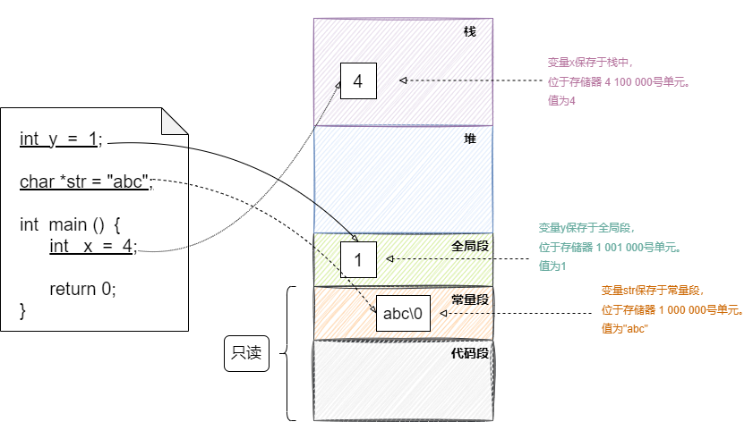
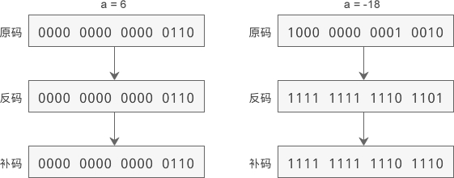
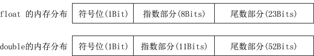
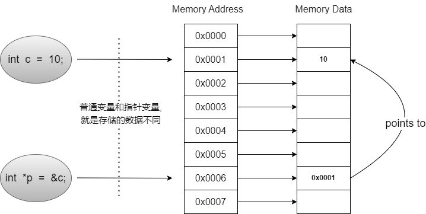

# 1.基础


## 1.1.关键字

C语言一共有32的关键字

| int          | **if**      | **break**    | **static**   |
| ------------ | ----------- | ------------ | ------------ |
| **float**    | **else**    | **continue** | **extern**   |
| **double**   | **switch**  | **return**   | **auto**     |
| **char**     | **case**    | **void**     | **register** |
| **short**    | **default** | **const**    | **enum**     |
| **long**     | **for**     | **sizeof**   | **goto**     |
| **signed**   | **while**   | **struct**   | **union**    |
| **unsigned** | **do**      | **typedef**  | **volatile** |

- static：此关键字一般有三个地方可以使用

  - ① 静态局部变量：局部变量作用域和生命周期限定在函数内部，在函数执行完以后其内存就会被销毁；而如果将`static`作用在局部变量，会改变它的生命周期（作用域不变仍然限定在函数内）使其与程序的整个运行周期相同（本质上就将它的内存存放位置更换到静态区）

    ```c
    void foo() {
        static int count = 0;
        count++;
        printf("count = %d\n", count);
    }
    
    int main() {
        foo();  // 输出 count = 1
        foo();  // 输出 count = 2
        foo();  // 输出 count = 3
        return 0;
    }
    ```

  - ② 静态全局变量：在函数外部定义的变量一般是全局变量，其作用域和生命周期都是整个程序。如果在变量前面加上`static`关键字，那么就称为静态全局变量。它的作用域不变，但是可见性仅限于定义该变量的文件内部，不能被其它文件访问；

  - ③ 静态函数：在函数前面加上`static`关键字，可以将函数定义成静态函数，静态函数的作用域仅限于定义该函数的文件内部，不能被其它文件调用。

- extern：用于声明一个变量或函数是在其它文件中定义，以便在当前文件中使用该变量或函数；不过，`extern`关键字只用于声明变量或函数，而不是定义变量或函数。变量或函数的定义必须在某个文件中进行，否则链接时会出现符号未定义错误。

- register：想编译器建议将变量存储在CPU的寄存器中，以提高程序的执行效率；只是建议而并非强制。

- const：声明一个变量是常量，即在程序运行时不能被修改的值；`const`关键字还可以用于函数参数和函数返回值，例如：

  ```c
  const int add(const int x, const int y) {
      return x + y;
  }
  // 调用add()函数时，传入的参数不能被修改，而函数返回值也不能被修改
  ```

  `const`关键字只是用于声明变量或函数参数为常量，并不保证变量的值在内存中是只读的，如果程序试图修改一个`const`变量的值，可能会导致运行时错误。

- goto：用于标识跳转的位置，标签必须定义在当前函数内，不能跨函数使用。

## 1.2.类型输出

- puts，是output string的缩写，只能用来输出字符串；

- printf，是print format的缩写，比puts更强大，可以按照自定义格式输出大部分数据。通过格式控制符-%来确定以何种形式输出：

  | 格式控制符                            | 说明                                                         |
  | ------------------------------------- | ------------------------------------------------------------ |
  | %c                                    | 输出一个单一的字符                                           |
  | %hd、%d、%ld                          | 以十进制、有符号的形式输出 short、int、long 类型的整数       |
  | %hu、%u、%lu                          | 以十进制、无符号的形式输出 short、int、long 类型的整数       |
  | %ho、%o、%lo                          | 以八进制、不带前缀、无符号的形式输出 short、int、long 类型的整数 |
  | %#ho、%#o、%#lo                       | 以八进制、带前缀、无符号的形式输出 short、int、long 类型的整数 |
  | %hx、%x、%lx、 %hX、%X、  %lX、       | 以十六进制、不带前缀、无符号的形式输出 short、int、long 类型的整数。如果 x 小写，那么输出的十六进制数字也小写；如果 X 大写，那么输出的十六进制数字也大写。 |
  | %#hx、%#x、%#lx、 %#hX、%#X、  %#lX、 | 以十六进制、带前缀、无符号的形式输出 short、int、long 类型的整数。如果 x 小写，那么输出的十六进制数字和前缀都小写；如果 X 大写，那么输出的十六进制数字和前缀都大写。 |
  | %f、%lf                               | 以十进制的形式输出 float、double 类型的小数                  |
  | %e、%le、 %E、%lE、                   | 以指数的形式输出 float、double 类型的小数。如果 e 小写，那么输出结果中的 e 也小写；如果 E 大写，那么输出结果中的 E 也大写。 |
  | %g、%lg、 %G、%lG                     | 以十进制和指数中较短的形式输出 float、double 类型的小数，并且小数部分的最后不会添加多余的 0。如果 g 小写，那么当以指数形式输出时 e 也小写；如果 G 大写，那么当以指数形式输出时 E 也大写。 |
  | %s                                    | 输出一个字符串                                               |

## 1.3.结构体

- 结构变量并不是一个指向结构的指针，而是结构本身的名字。

- 结构体的初始化方式有两种：① 赋值每个字段； ②指定初始化字段

  ```c
  typedef struct {
  	const char *color;
  	int gears;
  	int height;
  } bike;
  // 设置每个字段
  bike b1 = {"yellow",17,21};
  // 通过"."运算符, 只设置指定的字段
  bike b2 = {.height=17, .gears=21};
  ```

# 2.内存

任何数据（无论是数字、文字、符号、图片、视频、音频...）存储在计算机内存中，都是以二进制的形式，也就是0和1的组合。一个内存条，包含了上亿个电子元器件，这个就是电路；电路的电压会变化，要么0V要么5V，5V是通电用1表示，0V是断电用0表示，因此每个元器件只有0和1两种状态。

通过电路来控制这些元器件的通断电，会得到很多0、1的组合。例如，8个元器件有 2<sup>8</sup>=256 种不同的组合，16个元器件有 2<sup>16</sup>=65536 种不同的组合，以此类推。赋予这些组合一个特定的含义，例如用 00011101表示大写字母A，用00011110表示大写字母B...

一般情况下，计算机不会一个一个使用元器件，而是将8个元器件作为一个整体来处理。此时，1个元器件称为1比特（bit），8个元器件称为1字节（Byte）：

- 8×1024个元器件就是1024Byte，简写为1KB；
- 8×1024×1024个元器件就是1024KB，简写为1MB；
- 8×1024×1024×1024个元器件就是1024MB，简写为1GB。

------

【C语言内存模型】



## 2.1.存储整数

**结论：**整数在内存中一律采用『补码』的形式存储。下图简单介绍原码、反码、补码的区别：

- 正数的原码、反码、补码都相同；
- 负数
  - 原码：其相反数的二进制编码，将符号位由`0`改为`1`，即为负数的原码；
  - 反码：将原码除符号位以外按位取反（0变1，1变0）；
  - 补码：将反码加1；



为啥要用补码来存储整数？这其实涉及到硬件。为提供加减法的运算效率，硬件电路需要设计得简单：

1. 符号位和数值位能够一起参与运算；
2. 加减法可以合并成加法，因为减去一个数等于加上这个数的相反数，如10-2 == 10 + (-2)

**===================补码如何简化硬件电路===================**

以`17 - 7`和`7 - 17`为例，它们等同于`17 + (-7)` 、`7 + (-17)`，分析它们的运算过程（*简化了int的字节*）：

① 以原码计算：

```c
17:   0001 0001(原)
-7:   1000 0111(原)
ᅳᅳᅳᅳᅳᅳᅳᅳᅳᅳᅳᅳᅳ+
r :   1001 1000(原) -> -17 很明显,直接使用原码相加无法得到正确的结果
```

② 为了解决原码计算的不足（符号位参与计算）科学家尝试了反码：

```c
17:   0001 0001(反)
-7:   1111 1000(反)
ᅳᅳᅳᅳᅳᅳᅳᅳᅳᅳᅳᅳᅳ+
r :   0000 1001(反) -> 与运算后溢出的高位忽略,反码的符号位不变,符号位为0表示正数,正数的反码=原码
r :   0000 1001(原) -> 9 按照反码计算的结果是9,但实际是10才对,相差了1
```

③ 其实用反码计算，小数减去大数结果是正确的，但是大数减去小数就不对，其结果始终相差1。为了解决这个问题，科学家最终尝试了补码：

```c
大数➖小数

17:   0001 0001(补)
-7:   1111 1001(补)
ᅳᅳᅳᅳᅳᅳᅳᅳᅳᅳᅳᅳᅳ+
r :   0000 1010(补) -> 与运算后溢出的高位忽略,由于最高位为0表示正数,正数的补码=原码
r :   0000 1010(原) -> 结果正确: 10 
```

大数减去小数，结果值已正确；分析小数减去大数，其结果值为：

```c
小数➖大数
  
 7 :   0000 0111(补)
-17:   1110 1111(补)
ᅳᅳᅳᅳᅳᅳᅳᅳᅳᅳᅳᅳᅳ+
r :    1111 0110(补) -> 补码最高位为1,表示负数,负数的补码-1后得到反码,
r :    1111 0101(反) -> 除符号位外,再按位取反得到原码
r :    1000 1010(原) -> 结果正确: -10 
```

## 2.2.存储小数

C语言用`定点数`格式存储short、int、long类型的整数，使用`浮点数`格式存储float、double类型的小数。整数和小数在内存的存储格式不一样，但使用`浮点数`格式也可以存储整数。

在数学上，我们使用`科学计数法`表示大数，比如：0.0000000000000000000000000009表示成9 × 10<sup>-28</sup>。C标准规定，小数在内存中以科学计数法的形式存储，具体形式：

>  flt = (-1)<sup>sign</sup> × mantissa × base<sup>exponent</sup>

- flt：要存储的小数；
- sign：小数的正负性，取值为0表示正数，取值为1表示负数；
- base：对应的进制，其取值≥2（2表示二进制、10表示十进制、16表示十六进制）；
- mantissa：尾数，即对应base进制的小数，取值范围：1≤ mantissa≤base；
- exponent：指数，是一个整数，可以取负数或者正数，一般使用十进制表示；

为了契合计算机的特性，编译器都会使用二进制形式的浮点数存储，即base=2。一旦base确定为2，只需要在内存中存储符号 sign、尾数 mantissa、指数 exponent这3个变量。



====================================例子====================================

【标准转换】以19.625为例，将其转换为浮点数格式：

- 19.625整数部分对应的二进制：19 = 1×24 + 0×23 + 0×22 + 1×21 + 1×20 = 10011
- 19.625小数部分对应的二进制：0.625 = 1×2-1 + 0×2-2 + 1×2-3 = 101
- 将整数部分和小数部分整合：19.625 = 10011.101;
- 按C标准转为：19.625 = 1.0011101×2<sup>4</sup>，此时：符号sign=0，指数exponent=4，尾数mantissa=1.0011101

【内存存储】已得19.625对应的浮点数表示为：1.0011101×2<sup>4</sup>，在内存中存储设计为：

- <u>符号存储</u>：直接分配1bit，来0表示整数，1表示负数，在这个例子中，sign存储为0；
- <u>尾数存储</u>：固定使用二进制表示，尾数的取值范围即：1 ≤ mantissa ＜ 2，则尾数的整数部分一定是1，是恒定的值，所以不需要在内存存储，直接将小数点后面的二进制存储到内存，对于 1.0011101，就是将0011101 放入内存；
- <u>指数存储</u>：mantissa位存储，需要确定其在内存中的取值范围，然后可以得到中位数，指数写入内存中加上这个中位数，指数从内存中读取减去这个中位数。对于float，中位数=2<sup>8-1</sup>-1=127；对于double，它的中位数=2<sup>11-1</sup>-1=1023。19.625转换后的指数为4，4+127=131，131在内存中换算成1000 0011，这个`1000 0011`就是19.625的指数部分在内存中的存储形式。

# 3.指针

指针，其实就是【内存地址】- 存储器中某条数据的地址；(内存中每个字节都有自己的编号，将内存中字节的编号叫做“地址”或“指针”)

指针变量，其实就是保存了内存地址的变量，它是一种特殊的变量。



C语言的数据和代码都是以二进制形式存储在内存中，程序在执行过程会告知CPU，要执行的代码和数据在内存中的地址。虽然C语言代码用的是变量名和函数名执行逻辑，但CPU访问内存只能依靠内存地址，源文件在被编译和链接成可执行程序，变量名和函数名都会被替换成地址。

## 3.1.指针运算

------------------------------指针变量的读写操作----------------------------------------------

- ① 获取变量的地址：使用`&`运算符可以找到变量保存在存储器的位置；

  ```c
  int x = 4;
  printf("x lives at %p\n", &x);
  ```

- ② 读取地址的内容：使用`*`运算符可以从存储器地址中读取实际的变量值；

  ```c
  int *address_of_x = &x;
  ```

- ③ 改变地址中的内容：可以使用`*`运算符修改指针所指向地址中的数据，只不过将指针放到运算符左边;	

  ```c
  *address_of_x = 99;
  ```

------------------------------指针变量的加减操作----------------------------------------------

指针变量加减运算的结果跟数据类型的长度有关，而不是简单地加 1 或减 1。

```c
#include <stdio.h>

int main(){
    int    a = 10,   *pa = &a, *paa = &a;
    double b = 99.9, *pb = &b;
    char   c = '@',  *pc = &c;
    //最初的值
    printf("&a=%#X, &b=%#X, &c=%#X\n", &a, &b, &c);
    printf("pa=%#X, pb=%#X, pc=%#X\n", pa, pb, pc);
    //加法运算
    pa++; pb++; pc++;
    printf("pa=%#X, pb=%#X, pc=%#X\n", pa, pb, pc);
    //减法运算
    pa -= 2; pb -= 2; pc -= 2;
    printf("pa=%#X, pb=%#X, pc=%#X\n", pa, pb, pc);
    //比较运算
    if(pa == paa){
        printf("%d\n", *paa);
    }else{
        printf("%d\n", *pa);
    }
    return 0;
}
```

pa、pb、pc 每次加 1，它们的地址分别增加 4、8、1，正好是 int、double、char 类型的长度；减 2 时，地址分别减少 8、16、2，正好是 int、double、char 类型长度的 2 倍。所以指针的加减运算是基于表示数据的类型大小

```c
&a=0X28FF44, &b=0X28FF30, &c=0X28FF2B
pa=0X28FF44, pb=0X28FF30, pc=0X28FF2B
pa=0X28FF48, pb=0X28FF38, pc=0X28FF2C
pa=0X28FF40, pb=0X28FF28, pc=0X28FF2A
2686784
```

## 3.2.指针类型

指针类型：

 - 数组指针：指向数组的指针，int *p = arr[0];
 - 字符串指针：指向字符数组的指针，char *str = "http://c.biancheng.net";
 - 指针函数：returnType *function_name(param_list);
 - 二级指针：指向指针的指针，int *p1 = &a; int **p2 = &p1;
 - NULL指针、(void*)0, 即NULL指向了地址为0的内存;
 - 指针数组，一个数组的所有元素都是指针，dateType *arrayName[length];
 - 二维数组指针，指向二维数组的指针：int a[3][4] = { {0, 1, 2, 3}, {4, 5, 6, 7}, {8, 9, 10, 11} }; int (*p)[4] = a;
 - 函数指针，指向函数的指针：returnType (*pointName)(param_list)
 - void *，它不是空指针的意思，而是真的指针，只是指针指向的内存中不知道保存的是什么类型的数据。

## 3.3.数组指针

C语言标准规定，当数组名作为数组定义的标识符（也就是定义或声明数组时）、sizeof 或 & 的操作数时，它才表示整个数组本身，在其他的表达式中，数组名会被转换为指向第 0 个元素的指针（地址）。

创建指针变量，计算机会为其分配4或8字节的存储空间，但如果创建时数组，计算机会为数组分配空间，但不会为数组变量分配任何空间，编译器仅在出现数组变量的地方将它替换成数组的起始位置。

指针退化：数组变量在使用sizeof关键字可以获取到数组的长度，但是如果把数组赋值给指针，那么这个指针只会保存数组的地址信息，而不会保存数组的长度信息，这种信息的丢失称为指针退化。只要把数组作为参数传递就一定会造成“指针退化”

## 3.4.函数指针

C语言定义函数指针：`返回类型 (* 指针变量)(参数类型)`，例如：

```c
char ** (*names_fn)(char*, int);
int (*warp_fn)(int);
```

在C语言中创建了一个函数，会自动创建一个同函数名的指针变量，这个变量保存了函数的地址，它其实就是指向函数的指针（位于寄存器的常量区）但是，函数指针和普通指针并不完全相同，函数指针是L-value，指针变量是R-value，所以函数指针不能像普通指针变量那样自加、自减。

# 4.进程

## 4.1.系统调用

- system()，参数是一个字符串，它会将这个字符串当做命令处理
- exec()，可以启动指定的进程，但是要注意：当前进程执行exec()后会终止后续代码的执行，它会修改进程，让新运行的程序替代当前进程。它有多个变种：
  - execl() = 参数列表
  - execle() = 参数列表 + 环境变量
  - execlp() = 参数列表 + 搜索PATH
  - execv() = 参数数组
  - execve() = 参数数组 +环境变量
  - execvp() = 参数数组 +搜索PATH

## 4.2.克隆进程

在操作系统中，每个进程都有唯一的进程标识符（Process ID，PID，可以通过系统调用getpid()获取）当调用`fork()`函数，操作系统会进程表中创建一个新的进程项，并为其分配一个新PID。同时，操作系统会将调用进程的所有内存页复制到新进程中，包括代码段、数据段、文件描述符和堆栈。不过为了让fork进程变快，操作系统不会真的复制父进程的数据，而是让父子进程共享数据。在发现子进程要修改存储器的数据时，操作系统才会为它复制一份。这种技术称为“写时复制”（copy-on-write）


一般，调用`fork()`函数的进程称为父进程，被创建的新进程，称其为子进程。在调用`fork()`函数后，会返回两次，一次在父进程中，一次在子进程中。fork()函数的本质是在系统里创建了两个栈，一个栈是父进程的，一个栈是子进程的，这样就实现了 fork() 函数的“两次返回”！！返回值是一个`pid_t`，它指示进程的类型，如果返回值为0，则表示当前进程为子进程；如果返回值大于0，则表示当前进程为父进程，返回值是子进程的进程ID；返回值为-1表示异常。

```c
#include <stdio.h>
#include <unistd.h>
#include <stdlib.h>

int main() {
    pid_t pid;

    pid = fork();
    if (pid == 0) {
        printf("This is child process. PID = %d\n", getpid());
    } else if (pid > 0) {
        printf("This is parent process. PID = %d, child PID = %d\n", getpid(), pid);
    } else {
        printf("Failed to create child process.\n");
        return EXIT_FAILURE;
    }

    return EXIT_SUCCESS;
}
```

## 4.3.进程通信

### 4.3.1.文件描述符

每个进程都有自己的文件描述符，它是一个数字，表示一条数据流。进程会把文件描述符和对应的数据流保存在描述符表中，描述符表支持 **0-255号**。

| #    | 数据流     | 备注                   |
| ---- | ---------- | ---------------------- |
| 0    | 键盘       | 标准输入               |
| 1    | 屏幕       | 标准输出               |
| 2    | 屏幕       | 标准错误               |
| 3    | 数据库链接 | 打开了其它形式的数据流 |

描述符表的前三项固定不变：0-标准输入，1-标准输出，2-标准错误。其它项会在进程打开一个数据流时被占用，包括但不限于，比如打开一个文件进行读写，就会占用描述符表的一项。创建进程后，标准输入连接到键盘，标准输出、标准错误连接到屏幕，会一直保持这样连接直到被重定向到其它数据流。

- fopen()：打开一个文件
- fileno()：从描述符表中获取，指定数据流的描述符编号
- dup2()：复制数据流，比如 dup2(4, 3) 表示将描述符=3的数据流修改为跟描述符=4的数据流一样
- waitpid()：一般用在fork()函数后，让父进程等待子进程执行结束再返回。它接收三个参数：
  - pid：子进程的ID
  - pid_status：整型变量，前8位保存退出状态，剩下位数保存其它信息，通过它可以获取进程的退出信息。将pid_status的值传给`WEXITSTATUS()`宏，若进程自然死亡，WIFSIGNALED(pid_status)返回false；若进程被强制kill，WIFSIGNALED(pid_status)返回true。
  - options：可选项，如果设置为0将等待进程结束

### 4.3.2.管道

匿名管道(pipe)是Linux支持的最初Unix IPC形式之一，具有以下特点： 匿名管道是半双工的，数据只能向一个方向流动；需要双方通信时，需要建立两个管道； **只能作用于父子进程或者兄弟进程之间**（具有亲缘关系的进程）

通常用`pipe()`创建的管道都不是文件，而是存储器（数据写到存储器的某个位置，再从另一个位置读取）程序会一直等管道中出现数据。操作系统也支持创建基于文件的管道，称为：有名管道或FIFO文件，可以通过`mkfifo()`系统调用（[详情](https://tinyurl.com/cdf6ve5)），因为这种管道有名称，所以两个进程只需要知道管道的名字就可以通信（不强制为父子进程）

------

操作系统提供的管道的系统调用 pipe函数的原型：

```c
int pipe(int pipefd[2]); 
```

pipe 的参数是一个数组 pipefd，表示的是管道的文件描述符。进程在往管道（pipe）中写入或读取数据时，使用的是write或read函数，而这两个函数需要通过文件描述符才能进行读写操作。

pipefd[0]和 pipefd[1]，分别对应了管道的读描述符和写描述符。即：当进程需要从管道中读数据时，就需要用到 pipefd[0]，而往管道中写入数据时，就使用 pipefd[1]。注意：**管道只能单向通信！**如果两个进程需要相互读写数据，必须创建两个管道

```c
#include <unistd.h>
#include <stdio.h>
#include <stdlib.h>
#include <string.h>

int main(int args, char **arg){
    int fd[2];
    char buf[128];
    pipe(fd);
    pid_t pid = fork();

    if (pid == 0) {
        // child
        read(fd[0], buf, sizeof(buf));
        printf("child process receive: %s\n", buf);
    } else if (pid > 0) {
        // parent
        strcpy(buf, "Hello from parent");
        write(fd[1], buf, sizeof buf);
    } else {
        printf("error to fork process");
        return EXIT_FAILURE;
    }
  	return EXIT_SUCCESS;
}
```

### 4.3.3.信号

程序在运行期间，操作系统可以向其发送信号，此时程序需要停止一切工作（**优先级最高**），响应操作系统的信号并做出处理。信号是一个整数值，进程收到信号后会查看信号映射表，每个信号对应一个信号处理函数：

| 信号     | 作用                                             |
| -------- | ------------------------------------------------ |
| SIGINT   | 进程被中断                                       |
| SIGQUIT  | 要求停止进程，并把存储器的内容保存到核心转储文件 |
| SIGFPE   | 浮点错误                                         |
| SIGTRAP  | 调式人员询问进程执行到哪里                       |
| SIGSEGV  | 进程企图访问非法存储器地址                       |
| SIGWINCH | 终端窗口的大小发生改变                           |
| SIGTERM  | 要求内核终止进程                                 |
| SIGPIPE  | 进程向一个没人其它进程读取的管道写数据           |
| ...      | ...                                              |

------

【中断信号】

强制停止进程的运行，可以键入`Ctrl+C`，此时操作系统就会向进程发送**中断信号**。中断信号默认处理函数是`exit()`。类Unix操作系统通过会有`kill`命令，用来强制“杀死”进程。实际上，`kill`也是向进程发送信号，默认情况发送SIGTERM信号，它也支持发送其它信号，假设getpid()=80022：

- kill 80022：向程序发送SIGTERM信号
- kill -INT 80022：向程序发送SIGINT信号
- kill -SEGV 80022：向程序发送SIGSEGV信号
- kill -KILL 80022：发送SIGKILL信号，进程不能忽略这个信号，我们可以通过注册处理函数替代原先的信号处理方式，但是代码捕捉不到SIGKILL信号，所以程序无法忽略它（SIGSTOP也无法忽略，它用来暂停进程）

------

【自定义信号处理】

```c
#include <stdio.h>
#include <signal.h>
#include <stdlib.h>

/**
 * 信号处理函数.
 * 多个信号可以共用一个处理器；也可以为每个信号写一个处理器.
 * @param sig 处理函数需要接收信号, 必须需要一个整型变量.
 */
void diy(int sig){
    // 一般用来释放资源、记录日志等
    puts("goodbye");
    exit(1);
}

int catch_signal(int sig, void (*handler)(int)){
    struct sigaction action;//创建新动作
    action.sa_handler = handler;//指定处理函数
    sigemptyset(&action.sa_mask);//用掩码来过滤sigaction要处理的信号, 通常会用一个空的掩码
    action.sa_flags=0;//附加标志位, 设置为0就行了.
    /*
     * 创建完sigaction, 需要用sigaction()函数将其注册, 它接收3个参数:
     * 1) 信号编号, 表示要处理的信号, 通常传递 SIGINT 或 SIGQUIT 等标准信号
     * 2) 新动作的指针
     * 3) 如果向保存被替换的信号处理器, 可以再传入一个sigaction指针; 反之设置NULL.
     * 如果sigaction()函数设置失败, 返回-1.
     */
    return sigaction(sig, &action, NULL);
}

int main(){
    // 用diy函数来处理信号SIGINT
    if (catch_signal(SIGINT, diy) == -1) {
        fprintf(stderr, "can not map the handler");
        exit(2);
    }
    //.. process do other
}
```

注：如果想还原默认的信号处理，在signal.h文件中有一个特殊的符号“SIG_DFL”，它代表以默认方式处理信号

```c
catch_signal(SIGINT, SIG_DFL); //以默认方式处理信号SIGINT
catch_signal(SIGINT, SIG_IGN); //使用另一个特殊的信号SIG_IGN，可以让进程忽略某个信号
```

------

【信号升级】

通过`raise()`函数可以让进程向自己发送信号，通常会在自定义的信号处理函数中使用raise()函数，这样程序能在接收到低级别的信号时引发更高级的信号，这一操作称为“信号升级”
