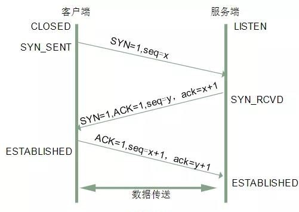
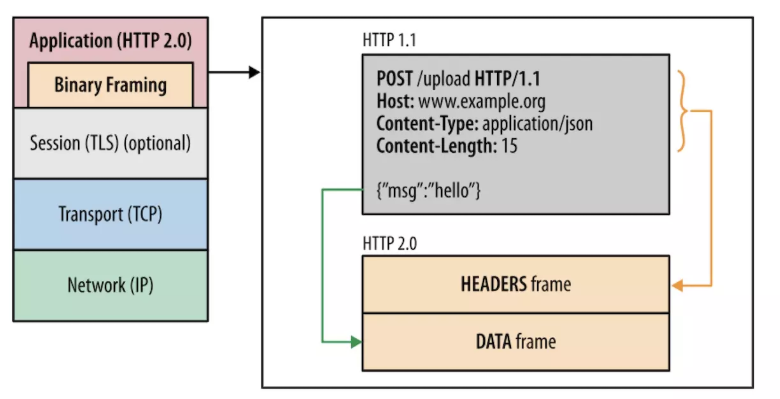

# 1.【网络I/O模型】

网络IO编程模型是一种无关语言和操作系统的基础知识点，网络IO在client-server服务端模型中，是这样一种请求模式：


内核空间是底层操作系统的运行环境，而用户空间是我们服务端程序的运行环境。从上图可以看出，数据无论从网卡到用户空间还是从用户空间到网卡都需要经过内核，需要通过系统调用（例如recvfrom/sendto）向内核读写数据，内核再进一步操作网卡

## 1.1.基础概念

网络I/O 模型大体可以分为：同步阻塞、同步非阻塞、异步阻塞、异步非阻塞4种。同步与非同步相对应，阻塞与非阻塞相对应，这两组间表达不同概念：

同步和异步指**消息的通知机制**，阻塞和非阻塞指**线程等待消息通知的状态**

1. 同步：程序执行IO请求，需要一直询问内核IO操作是否完成；

2. 异步：程序执行IO请求，内核在IO操作完成后，主动告知程序已经完成；

3. 阻塞：程序执行IO请求，请求还未完成，程序无法返回，一直等待；

4. 非阻塞：程序在IO请求，请求还未完成，但是程序立即返回，无需等待。

## 1.2.Unix网络编程模型


unix有五种网络IO编程模型，分别是:**阻塞IO、非阻塞IO、IO复用、信号驱动、异步IO**，它们的执行流程总结起来就是两个阶段：

1. 等待内核把数据准备好；

2. 将数据从内核空间拷贝到用户空间

前4种IO编程模型(**阻塞IO、非阻塞IO、IO复用、信号驱动**)主要区别于第一阶段，因为它们的第二阶段都是一样的，即：在数据从kernel拷贝到process的缓冲区期间，都阻塞于 recvfrom 调用。而异步IO 模型在这两个阶段都不会阻塞，从而不同于其他四种模型。很多时候比较容易混淆non-blocking IO(非阻塞IO)和asynchronous IO(异步IO)，认为都一样。而实际上，non-blocking IO只要求第一阶段(数据准备工作)不阻塞即可，而asynchronous IO要求第一、二阶段都不阻塞。不过可惜的是，linux系统目前并不支持异步IO，多是以IO 多路复用模式为主；但在window下，它通过了IOCP实现了真正的异步I/O！！

### 1.2.1.同步阻塞I/O


应用程序进行 recvfrom 系统调用时将阻塞在此调用，直到该套接字上有数据并且复制到用户空间缓冲区，调用线程在整个处理过程中，一直处于阻塞状态。Java传统的IO模型(ServerSocket+Socket)就是基于这种模式，因此它需要一个主线程不断循环接收客户端请求，另起线程池异步处理客户端请求

### 1.2.2.同步非阻塞I/O


应用程序需要把Socket设置为非阻塞模式，告诉内核，当所请求的 I/O 操作无法完成时，不要将线程阻塞，而是返回一个错误（不同的接口立即返回时的错误值不太一样，如recv、send、accept errno通常被设置为EAGIN 或者EWOULDBLOCK，connect 则为EINPRO- GRESS）应用程序基于 I/O 操作函数将不断的轮询数据是否已经准备好，如果没有准备好，继续轮询，直到数据准备好为止，然后当前线程阻塞住，等到操作系统将数据复制到用户空间成功后才会返回

### 1.2.3.I/O多路复用


应用进程阻塞于 **select/poll/epoll** 等**操作系统函数**等待某个连接变成可读（即客户端发起的Socket连接），再调用 recvfrom 从连接上读取数据。虽然此模式也会阻塞在 select/poll/epoll 上，但与[阻塞IO 模型](#1.2.1.同步阻塞IO)不同的是它阻塞在等待多个连接上有读（写）事件的发生，以较少的代价来同时监听处理多个IO明显提高了效率且增加了单线程/单进程中并行处理多连接的可能。Java的选择器**Selector**就是基于这种模型

### 1.2.4.信号驱动I/O


应用进程创建 SIGIO 信号处理程序，此程序可处理连接上数据的读写和业务处理。并向操作系统安装此信号，**线程可以往下执行**。当内核数据准备好会向应用进程发送信号，触发信号处理程序的执行。再在信号处理程序中进行 recvfrom 和业务处理，这期间调用线程也会处于阻塞状态，直到数据处理成功！

### 1.2.5.异步非阻塞I/O


应用程序通过 aio_read 告知内核发起IO请求，然后立即返回；然后内核自行准备数据，并把数据从内核空间拷贝到用户空间，最后内核**自动**通知应用程序。整个IO操作已经完成。[信号驱动 IO](#1.2.4.信号驱动IO) 是内核通知程序何时可以启动一个 IO 操作，而异步 IO 模型是由内核通知程序 IO 操作何时完成。前面四种IO模型都带有阻塞部分：有的阻塞在等待数据准备期间，有的阻塞在从内核空间拷贝数据到用户空间，而异步非阻塞IO是真正实现了两个阶段都是异步的场景

## 1.3.select/poll/epoll

虽然在5种网络I/O模型中，异步非阻塞I/O性能最优，但其实很少有 Linux 系统支持，反而是 Windows 系统提供了一个叫 IOCP 线程模型属于这一种。所以呢，大部分Linux系统其实都是属于`I/0多路复用`，select、poll、epoll都是I/O多路复用的机制。I/O多路复用就是通过一种机制，一个进程可以监视多个文件描述符，一旦某个描述符就绪（读就绪或写就绪），能够通知程序进行相应的读写操作 。

### 1.3.1.cpu中断

一般而言，由硬件产生的信号需要 CPU 立马做出回应，不然数据可能就丢失了，所以它的优先级很高。CPU 理应中断掉正在执行的程序，去做出响应；当 CPU 完成对硬件的响应后，再重新执行用户程序。就以键盘为例，当用户按下键盘某个按键时，键盘会给 CPU 的`中断引脚`发出一个高电平，CPU能够捕获这个信号，然后执行键盘中断程序。


所以，在网络传输中，CPU怎么知道有数据到来？就是：网卡收到网线传过来的二进制数据后，它会把数据写入到内存中，然后网卡向 CPU 发出一个中断信号，操作系统便能得知有新数据到来，中断当前正在执行的程序，调用网卡中断程序去处理数据！！！

### 1.3.2.socket等待队列

现代操作为了实现多任务处理，会实现进程调度的功能，会把进程分为多种状态，其中只有`运行`状态的进程才会获取到CPU使用权。而操作系统会将多个进程放到它的工作队列中，操作系统会分时执行各个运行状态的进程，由于速度很快，看上去就像是同时执行多个任务。例如，下图的计算机中运行着 A、B 与 C 三个进程，其中进程 A 执行着上述基础网络程序，一开始，这 3 个进程都被操作系统的工作队列所引用，处于运行状态，会分时执行


当进程 A 执行到创建 socket 的代码时，操作系统会创建一个由文件系统管理的 socket 对象。这个 socket 对象包含了`发送缓冲区`、`接收缓冲区`与`等待队列`等成员。等待队列是个非常重要的结构，它指向所有需要等待该 socket 事件的进程。**当程序执行到 recv 时，操作系统会将进程 A 的引用添加到该 socket 的等待队列中**（如下图），同时将进程A置为`阻塞`状态。此时由于工作队列只剩下了进程 B 和 C，依据进程调度，CPU 会轮流执行这两个进程的程序，不会执行进程 A 的程序，就会不会往下执行代码，也不会占用 CPU 资源。


进程A阻塞在Socket的recv()期间，计算机收到了对端的数据流，数据会经由网卡传送到内存中，然后网卡通过中断信号通知 CPU 有数据到达，CPU 执行中断程序。此处的中断程序主要有两项功能，

- 将网络数据写入到对应 socket 的接收缓冲区里面
- 从socket等待列表中唤醒进程

每个socket都占用操作系统唯一的端口号，网络数据包肯定会指定IP地址和端口号，内核通过端口号找到对应的 socket，然后将该 socket 队列上的进程变成运行状态，继续执行代码。同时由于 socket 的接收缓冲区已经有了数据，recv 可以返回接收到的数据。

### 1.3.3.socket监听

操作系统内核会在一个socket有数据到来时，唤醒在其等待列表中的进程，那么问题来了，内核是怎么同时监控多个socket的数据？这其实就是select、poll、epoll要完成的事。

#### 1.3.3.1.select机制


先看下在linux系统`/usr/include/sys/select.h`文件中对`select`方法的定义：

```c
## 定义结构体 fd_set
typedef struct
{ 
    // __fd_mask类型是long类型的别名
    // __FD_SETSIZE和__NFDBITS这两个宏定义的默认大小为：1024和32.
    __fd_mask fds_bits[__FD_SETSIZE / __NFDBITS];
    __fd_mask __fds_bits[__FD_SETSIZE / __NFDBITS];
} fd_set;
```

- 结构体【fd_set】本质上就是一个long类型的数组，一共有32个元素（1024/32=32）每个元素是32 bit，每一个bit可以用来表示一个文件描述符的状态；

```c


## select函数
extern int select (int __nfds, 
                   fd_set *__restrict __readfds,
                   fd_set *__restrict __writefds,
                   fd_set *__restrict __exceptfds,
                   struct timeval *__restrict __timeout);
```

- 【\_\_nfds】是`fd_set`中最大的描述符+1，当调用select时，内核会判断fd_set中描述符是否就绪，__nfds告诉内核最多判断到哪一个描述符；
- 【\_\_readfds】【\_\_writefds】【\_\_exceptfds】都是结构体`fd_set`。 select函数中的三个fd_set集合，分别代表三种事件，`readfds`表示读描述符集合，`writefds`表示写描述符集合，`exceptfds`表示异常描述符集合。当对应的fd_set = NULL时，表示不监听该类描述符；
- 【\_\_timeval __timeout】用来指定select的工作方式，即当文件描述符尚未就绪时，select是永远等下去，还是等待一定的时间，或者是直接返回；
- 【返回值int】表示： 就绪描述符的数量，如果为-1表示产生错误 。

**使用select函数**

```c

int sock_fd,conn_fd; //监听套接字和已连接套接字的变量
sock_fd = socket() //创建套接字
bind(sock_fd)   //绑定套接字
listen(sock_fd) //在套接字上进行监听，将套接字转为监听套接字

fd_set rset;  //被监听的描述符集合，关注描述符上的读事件
 
int max_fd = sock_fd

//初始化rset数组，使用FD_ZERO宏设置每个元素为0 
FD_ZERO(&rset);
//使用FD_SET宏设置rset数组中位置为sock_fd的文件描述符为1，表示需要监听该文件描述符
FD_SET(sock_fd,&rset);

//设置超时时间 
struct timeval timeout;
timeout.tv_sec = 3;
timeout.tv_usec = 0;
 
while(1) {
   //调用select函数，检测rset数组保存的文件描述符是否已有读事件就绪，返回就绪的文件描述符个数
   n = select(max_fd+1, &rset, NULL, NULL, &timeout);
 
   //调用FD_ISSET宏，在rset数组中检测sock_fd对应的文件描述符是否就绪
   if (FD_ISSET(sock_fd, &rset)) {
       //如果sock_fd已经就绪，表明已有客户端连接；调用accept函数建立连接
       conn_fd = accept();
       //设置rset数组中位置为conn_fd的文件描述符为1，表示需要监听该文件描述符
       FD_SET(conn_fd, &rset);
   }

   //依次检查已连接套接字的文件描述符
   for (i = 0; i < maxfd; i++) {
        //调用FD_ISSET宏，在rset数组中检测文件描述符是否就绪
       if (FD_ISSET(i, &rset)) {
         //有数据可读，进行读数据处理
       }
   }
}
```

select 的实现思路很直接，假设进程A调用了select()同时监视sock1、sock2 和 sock3 三个 socket，那么在调用 select()函数 之后，操作系统把进程 A 分别加入这三个 socket 的等待队列中，同时将进程A阻塞。当任何一个 socket 收到数据后，中断程序将唤起进程A。

当进程 A 被唤醒后，select()函数会将全量`fd_set`从用户空间拷贝到内核空间，并注册回调函数， 在内核态空间来判断每个请求是否准备好数据 。如果有一个或者多个描述符就绪，那么select将就绪的文件描述符放置到指定位置，然后select返回。返回后，由程序遍历查看哪个请求有数据。

**select函数缺陷：**

- 每次调用select，都需要把fd集合从用户态拷贝到内核态，fd越多开销则越大；
- 每次调用select都需要在内核遍历传递进来的所有fd，这个开销在fd很多时也很大。因此，规定 select 的最大监视数量，默认只能监视 1024 个 socket。

#### 1.3.3.2.poll机制


先看下linux系统中`/usr/include/sys/poll.h`文件中对`poll`方法的定义:

```c
#define POLLRDNORM  0x040       //可读事件
#define POLLWRNORM  0x100       //可写事件
#define POLLERR     0x008       //错误事件

## pollfd结构体
struct pollfd
{
    int fd;                     // 进行监听的文件描述符
    short int events;           // 要监听的事件类型,由上述的三个宏来表示.
    short int revents;          // 实际发生的事件类型,由上述的三个宏来表示.
};

## poll函数
extern int poll (struct pollfd *__fds, nfds_t __nfds, int __timeout);
```

- 【\_\_fds】是Poll机制中定义的结构体`pollfd`，用来指定一个需要监听的描述符。结构体中fd为需要监听的文件描述符，events为需要监听的事件类型，而revents为经过poll调用之后返回的事件类型，在调用poll的时候，一般会传入一个pollfd的结构体数组，数组的元素个数表示监控的描述符个数；
- 【\_\_nfds】表示的是\_\_fds数组的元素个数；
- 【\_\_timeout】表示的是poll函数阻塞的超时时间；

**使用poll函数**

```c

int sock_fd,conn_fd; //监听套接字和已连接套接字的变量
sock_fd = socket() //创建套接字
bind(sock_fd)   //绑定套接字
listen(sock_fd) //在套接字上进行监听，将套接字转为监听套接字

//poll函数可以监听的文件描述符数量，可以大于1024
#define MAX_OPEN = 2048

//pollfd结构体数组，对应文件描述符
struct pollfd client[MAX_OPEN];

//将创建的监听套接字加入pollfd数组，并监听其可读事件
client[0].fd = sock_fd;
client[0].events = POLLRDNORM; 
maxfd = 0;

//初始化client数组其他元素为-1
for (i = 1; i < MAX_OPEN; i++)
    client[i].fd = -1; 

while(1) {
   //调用poll函数，检测client数组里的文件描述符是否有就绪的，返回就绪的文件描述符个数
   n = poll(client, maxfd+1, &timeout);
   //如果监听套件字的文件描述符有可读事件，则进行处理
   if (client[0].revents & POLLRDNORM) {
       //有客户端连接；调用accept函数建立连接
       conn_fd = accept();

       //保存已建立连接套接字
       for (i = 1; i < MAX_OPEN; i++){
         if (client[i].fd < 0) {
           client[i].fd = conn_fd; //将已建立连接的文件描述符保存到client数组
           client[i].events = POLLRDNORM; //设置该文件描述符监听可读事件
           break;
          }
       }
       maxfd = i; 
   }
   
   //依次检查已连接套接字的文件描述符
   for (i = 1; i < MAX_OPEN; i++) {
       if (client[i].revents & (POLLRDNORM | POLLERR)) {
         //有数据可读或发生错误，进行读数据处理或错误处理
       }
   }
}
```

poll函数完成网络通信的流程大体上可以是：

1. 创建pollfd数组和监听套接字，进行绑定；
2. 将监听套接字加入pollfd数组，设置读事件，用于监听客户端的连接请求；
3. 循环调用poll函数，检测pollfd数组中是否有就绪的文件描述符；
4. 如果是连接套接字就绪，就调用accept()接收此连接，并创建`已连接套接字`，也将其加入到pollfd数组，设置监听它的读事件
5. 如果是`已连接套接字`就绪，说明客户端有读写请求，再调用 recv/send 函数处理读写请求；

**poll函数缺陷**

poll函数与select函数对比，它不再限制一次监听1024个文件描述符，不过它的缺陷和select一样，就是当每次有就绪的文件描述符时，仍然需要遍历每个文件描述符，来检测该描述符是否就绪。

#### 1.3.3.3.epoll机制


先看下linux系统中`/usr/include/sys/epoll.h`对epoll机制定义的方法：

```c
#define EPOLLIN  // 读事件，表示文件描述符对应套接字有数据可读
#defind EPOLLOUT // 写事件,表示文件描述符对应套接字有数据要写
#defind EPOLLERR // 错误事件，表示文件描述符对于套接字出错

## epoll机制使用epoll_event结构体,用来记录待监听的文件描述符及其监听事件. 它包含了epoll_data_t联合体变量和整型的events变量
struct epoll_event
{
  uint32_t events;   // epoll监听的事件类型,取值为上述的三种宏
  epoll_data_t data; // 应用程序数据
};

typedef union epoll_data
{
  ...
  int fd;  //记录文件描述符
  ...
} epoll_data_t;


## 创建一个epoll实例并返回，该实例可以用于监控__size个文件描述符
extern int epoll_create (int __size) __THROW;


## 向epoll中注册事件，该函数如果调用成功返回0，否则返回-1。其中各个参数含义为：
## __epfd为epoll_create返回的epoll实例
## __op表示要进行的操作
## __fd为要进行监控的文件描述符
## __event要监控的事件
extern int epoll_ctl (int __epfd, int __op, int __fd,
                      struct epoll_event *__event) __THROW;


## 类似与select机制中的select函数、poll机制中的poll函数，等待内核返回监听描述符的事件产生。该函数
## 返回已经就绪的事件的数量，如果为-1表示出错。其中各个参数含义：
## __epfd为epoll_create返回的epoll实例
## __events数组为 epoll_wait要返回的已经产生的事件集合
## __maxevents为希望返回的最大的事件数量（通常为__events的大小）
## __timeout和select、poll机制中的同名参数含义相同
extern int epoll_wait (int __epfd, struct epoll_event *__events,
                       int __maxevents, int __timeout);
```

**epoll函数使用**

当进程A调用 `epoll_create` 方法时，内核会创建一个 eventpoll 对象（也就是API中 epfd 所代表的对象）。eventpoll 对象也是文件系统中的一员，和 socket 一样，它也会有等待队列。而且它通过`mmap`内存映射的方式共享在用户态和内核态之间，所以可以减少了内核态和用户态fd文件的拷贝。

创建 epoll 对象后，可以用` epoll_ctl()`方法 添加或删除所要监听的 socket。如果通过 epoll_ctl 添加 sock1、sock2 和 sock3 的监视，内核会将 eventpoll 添加到这三个 socket 的等待队列中，并设置中断程序（也可以称为回调函数）。当 socket 收到数据后，中断程序会操作 eventpoll 对象，而不会再直接操作进程。

socket 收到数据后，中断程序（回调函数）会给 eventpoll 的`就绪列表`rdlist 添加 socket 引用，当程序执行到 epoll_wait 时，如果 rdlist 已经引用了 socket，那么 epoll_wait 直接返回，如果 rdlist 为空，否则继续阻塞进程

```c
int sock_fd,conn_fd; //监听套接字和已连接套接字的变量
sock_fd = socket() //创建套接字
bind(sock_fd)   //绑定套接字
listen(sock_fd) //在套接字上进行监听，将套接字转为监听套接字
    
epfd = epoll_create(EPOLL_SIZE); //创建epoll实例，
//创建epoll_event结构体数组，保存套接字对应文件描述符和监听事件类型    
ep_events = (epoll_event*)malloc(sizeof(epoll_event) * EPOLL_SIZE);

//创建epoll_event变量
struct epoll_event ee
//监听读事件
ee.events = EPOLLIN;
//监听的文件描述符是刚创建的监听套接字
ee.data.fd = sock_fd;

//将监听套接字加入到监听列表中    
epoll_ctl(epfd, EPOLL_CTL_ADD, sock_fd, &ee); 
    
while (1) {
   //等待返回已经就绪的描述符 
   n = epoll_wait(epfd, ep_events, EPOLL_SIZE, -1); 
   //遍历所有就绪的描述符     
   for (int i = 0; i < n; i++) {
       //如果是监听套接字描述符就绪，表明有一个新客户端连接到来 
       if (ep_events[i].data.fd == sock_fd) { 
          conn_fd = accept(sock_fd); //调用accept()建立连接
          ee.events = EPOLLIN;  
          ee.data.fd = conn_fd;
          //添加对新创建的已连接套接字描述符的监听，监听后续在已连接套接字上的读事件      
          epoll_ctl(epfd, EPOLL_CTL_ADD, conn_fd, &ee); 
                
       } else { //如果是已连接套接字描述符就绪，则可以读数据
           ...//读取数据并处理
       }
   }
}
```

**总而言之：**

- epoll 在 select 和 poll 的基础上引入了 eventpoll （即调用epoll_create()函数的返回值）作为中间层，eventpoll 对象相当于 socket 和进程之间的中介，socket 的数据接收并不直接影响进程，而是通过改变 eventpoll 的就绪链表rdlist 来改变进程状态。

**工作模式**：

Epoll内部还分为两种工作模式： **LT水平触发（level trigger）**和**ET边缘触发（edge trigger）**

- **LT模式：** 默认的工作模式，即当epoll_wait检测到某描述符事件就绪并通知应用程序时，应用程序**可以不立即处理**该事件；事件会被放回到就绪链表中，下次调用epoll_wait时，会再次通知此事件。
- **ET模式：** 当epoll_wait检测到某描述符事件就绪并通知应用程序时，应用程序**必须立即处理**该事件。如果不处理，下次调用epoll_wait时，不会再次响应并通知此事件。

epoll工作在ET模式的时候，必须使用非阻塞套接口，以避免由于一个fd的阻塞I/O操作把多个处理其他文件描述符的任务饿死。ET模式在很大程度上减少了epoll事件被重复触发的次数，因此效率要比LT模式高。

# 2.计算机网络协议

网络传输三个难题：丢包、乱序、重传...


## 2.1.TCP协议

TCP是一个面向连接的、端到端的、提供高可靠性服务的传输层协议。特性如下：

1. TCP提供一种面向连接的、可靠的字节流服务；

2. 一个TCP连接中，仅有两方进行全双工通信。广播和多播不能用于TCP；

3. TCP使用校验和，确认和重传机制来保证可靠传输；

4. TCP给数据分节进行排序，使用累积确认保证数据的顺序不变和非重复；

5. TCP使用滑动窗口机制实现流量控制，通过动态改变窗口大小进行拥塞控制

### 2.1.1.TCP报文


其中不同的标志位，代表TCP报文的不同含义：


### 2.1.2.三次握手

建立一个TCP连接时，客户端和服务端总共需要进行三次交互，这个过程就称为“TCP三次握手”。三次握手的目的是连接服务器指定端口，建立TCP连接，并同步连接双方的序列号和确认号，交换TCP窗口大小信息。在socket编程中，客户端执行connect()时就会触发三次握手：



- **第一次握手(SYN=1, seq=x)**

  客户端发送TCP的SYN标志位置为1的包，指定客户端打算连接的服务器的端口，以及初始序号x，保存在TCP报文的序列号字段里。发送完毕后，客户端进入SYN_SEND状态。

- **第二次握手(SYN=1, ACK=1, seq=y, ACKnum=x+1)**

  服务器发回确认包(ACK)应答，即SYN标志位和ACK标志位都为1。服务端选择自己的ISN序列号，放到序号域内，同时将确认序号设置为客户端的ISN加1，即x+1。发送完毕，服务端进入SYN_RCVD状态。

- **第三次握手(ACK=1, ACKnum=y+1)**

  客户端再次发送确认包(ACK)，SYN标志位为0，ACK标志位为1，并且把服务端发送的序号字段+1，放在确认序号中发送给服务端，并且在数据段放入ISN+1。发送完毕后，客户端进入ESTABLISHED状态，当服务端接收到这个包后，也会进入ESTABLISHED状态，TCP握手结束，建立连接

### 2.1.3.四次握手

TCP 连接的拆除需要发送四个包，因此称为四次挥手(Four-way handshake)，也叫做改进的三次握手。客户端或服务器均可主动发起挥手动作，在 socket 编程中，任何一方执行 close() 操作即可产生挥手操作。


- **第一次挥手(FIN=1，seq=x)**

  假设客户端想要关闭连接，客户端发送一个 FIN 标志位置为1的包，表示自己已经没有数据可以发送了，但是仍然可以接受数据。发送完毕后，客户端进入 FIN_WAIT_1 状态。

- **第二次挥手(ACK=1，ACKnum=x+1)**

  服务器端确认客户端的 FIN 包，发送一个确认包，表明自己接受到了客户端关闭连接的请求，但还没有准备好关闭连接。发送完毕后，服务器端进入 CLOSE_WAIT 状态，客户端接收到这个确认包之后，进入 FIN_WAIT_2 状态，等待服务器端关闭连接。

- **第三次挥手(FIN=1，seq=y)**

  服务器端准备好关闭连接时，向客户端发送结束连接请求，FIN 置为1。发送完毕后，服务器端进入 LAST_ACK 状态，等待来自客户端的最后一个ACK。

- **第四次挥手(ACK=1**，**ACKnum=y+1**)

  客户端接收到来自服务器端的关闭请求，发送一个确认包，并进入 TIME_WAIT状态，等待可能出现的要求重传的 ACK 包。服务端接收到这个确认包之后，关闭连接，进入 CLOSED 状态。客户端等待了某个固定时间（两个最大段生命周期，2MSL，2 Maximum Segment Lifetime）之后，没有收到服务器端的 ACK ，认为服务器端已经正常关闭连接，于是也关闭连接，进入 CLOSED 状态。

### 2.1.4.流量/拥塞控制

TCP的算法绝对牛逼，绝对复杂。其中，有一对算法用于保证TCP的可靠数据传输：

- 流量控制算法，Flow Controller，平衡发送方和接收方的字节流传输速率，是通信双方约定数据量的一种机制
- 拥塞控制算法，Congestion Controller，宏观调控以避免由于网络链路拥堵而造成数据传输不可靠的一种机制

**流量控制**

TCP流量控制，是通过确认ACK机制和窗口协议来完成，TCP报文首部有一个字段叫`接收窗口字段`（Advertised Window），用于接收方通知发送方自己还有多少缓冲区可以接收数据，发送方就可以根据这个字段来动态调控发送数据的大小。要注意，TCP是全双工通信，所以在通信两端都各自维护了一个接收窗口


**拥塞控制**

流量控制是端到端微观层面的数据策略 ，双方在数据通信的过程中并不关心链路带宽情况，只关心通信双方的接收发送缓冲区的空间大小。但实际上，数据的传输肯定受到网络链路的影响，当传输双方之间的链路层发送拥堵时，及时做到了流量控制也没办法将数据传输到对端，所以TCP还提供了拥塞控制！首先明确这几个概念：

1. rwnd：流量控制的窗口大小，即上面流量控制中的AdvertisedWindow，取决于接收方的处理速度，由接收方通知发送方被动调整

2. cwnd：用于拥塞处理的窗口大小，取决于网络状况，由发送方探查网络主动调整

3. MSS：TCP报文段中的数据字段的最大长度，即MSS=TCP报文段长度-TCP首部长度

4. RTT：往返时延，发送端从数据发送开始到接收到对端发回的确认信号经历的时间

TCP的拥塞控制主要提供了4个手段来实现，分别是：`慢启动`、`拥塞避免`、`超时重传/快速重传`、`快速恢复`

- **慢启动**

  刚建立的网络连接，其传输速度是试探性增长，具体步骤为：

  - 刚建立连接，发送方初始化拥塞窗口cwnd为m；
  - 发送方每收到一个ACK，cwnd++，线性增长，增长单位为一个MSS；
  - 发送方每经过一个RTT，cwnd = cwnd * 2，指数增长；
  - 一段时间增长直到cwnd达到慢启动阈值ssthresh，然后就会进入拥塞避免；
  - 如果在慢启动阶段还未到达阈值ssthresh，就出现丢包情况，会进入快速重传等阶段；

- **拥塞避免**

  当cwnd >= ssthresh（通常ssthresh = 65535）时，就会进入拥塞避免，进入更加理性的线性增长直至发送丢包，具体步骤为：

  - 每收到一个Ack，cwnd = cwnd + 1/cwnd；
  - 每经过一个RTT，cwnd++，线性增长

- **超时重传/快速重传**

  发送方需要根据接收方回复的ACK来确认是否丢包了，并且发送方在发送数据之后启动定时器。如果在规定时间内未收到接收方发回的ACK响应，就判断它丢包了。丢包后，有两种重传方式，对应不同的网络情况：

  - 超时重传，ssthresh=cwnd/2，cwnd = 1，重新进入慢启动过程
  - 快速重传，ssthresh=cwnd/2，cwnd = cwnd /2，进入快速恢复过程

- **快速恢复**

  在快速重传之后就会进入快速恢复阶段，此时ssthresh=cwnd/2，cwnd = cwnd /2，具体步骤为：

  - cwnd = ssthresh + 3 * MSS
  - 重传重复Ack对应的Seq
  - 如果再收到该重复Ack，则cwnd++，线性增长
  - 如果收到了新Ack，则cwnd = ssthresh ，则进入拥塞避免

## 2.2.UDP协议

### 2.2.1.UDP特性

UDP 是一个简单的传输层协议。和 TCP 相比，UDP 有下面几个显著特性：

1. UDP **缺乏可靠性**。UDP 本身不提供确认，序列号，超时重传等机制。UDP 数据报可能在网络中被复制，被重新排序。即 UDP 不保证数据报会到达其最终目的地，也不保证各个数据报的先后顺序，也不保证每个数据报只到达一次；
2. UDP **面向报文**。UDP对应用层交下来的报文，既不合并，也不拆分，而是**保留这些报文的边界**，应用层交给UDP多长的报文，UDP就照样发送。即一次发送一个报文、一次交付一个完整的报文。
3. UDP 是**无连接的**。UDP 客户和服务器之前不必存在长期的关系。UDP 发送数据报之前也不需要经过握手创建连接的过程；
4. UDP**没有拥塞控制**，因此网络出现的拥塞不会使源主机的发送速率降低。这对某些实时应用是很重要的，例如：IP电话、实时视频会议等，允许在网络发生拥塞时丢失一些数据，但却不允许数据有太大的时延。UDP正好适合这种要求；
5. UDP**支持一对一、一对多、多对一和多对多的交互通信** ；

### 2.2.2.UDP首部格式

用户数据报UDP有两个字段：数据字段和首部字段。首部字段很简单，只有8个字节（图5-5），由四个字段组成，**每个字段的长度都是两个字节** 。各字段意义如下：

（1）**源端口** 源端口号。在需要对方回信时选用。不需要时可用全0。

（2）**目的端口** 目的端口号。这在终点交付报文时必须使用。

（3）**长度** UDP用户数据报的长度，其最小值是8（仅有首部）。

（4）**检验和** 检测UDP用户数据报在传输中是否有错。有错就丢弃。


## 2.3.HTTP协议

HTTP协议，全称超文本传输协议（HyperText Transfer Protocol）是一种用于分布式、协作式和超媒体信息系统的应用层协议。

HTTP使用了面向连接的TCP作为运输层协议，保证了数据的可靠传输，它是无状态的。所以HTTP协议首先要和服务器建立TCP连接。这需要使用三次握手。当建立TCP连接的三报文握手的前两部分完成后（即经过了一个RTT时间后），万维网客户就把HTTP请求报文，作为建立TCP连接的三报文握手中的第三个报文的数据，发送给万维网服务器。服务器收到HTTP请求报文后，就把所请求的文档作为响应报文返回给客户。

在HTTP/1.0的时候，每进行一次交互，都会进行TCP三次握手，这种非持续性连接加重了服务器的压力，也加大了请求时间。而在HTTP/1.1协议较好地解决了这个问题，它使用了**持续连接**，发送响应后仍然在一段时间内保持该TCP连接，使同一个客户（浏览器）和该服务器可以继续在这条连接上传送后续的HTTP请求报文和响应报文

### 2.3.1.HTTP报文

HTTP有两类报文：

- 请求报文：从客户向服务器发送请求报文

  

- 响应报文：从服务器到客户的回答

  

HTTP请求报文和响应报文都是由三个部分组成的。可以看出，这两种报文格式的区别就是开始行不同。

- **开始行** ，用于区分是请求报文还是响应报文。在请求报文中的开始行叫做**请求行** （Request-Line），而在响应报文中的开始行叫做**状态行** （Status-Line）
- **首部行** ，用来说明浏览器、服务器或报文主体的一些信息。在每一个首部行中都有首部字段名和它的值，每一行在结束的地方都要有“回车”和“换行”。整个首部行结束时，还有一空行将首部行和后面的实体主体分开；
- **实体主体** （entity body），在请求报文中一般都不用这个字段，而在响应报文中也可能没有这个字段

**HTTP请求方法**

| OPTION  | 请求一些选项的信息              |
| ------- | ------------------------------- |
| GET     | 请求读取由URL所标志的信息       |
| HEAD    | 请求读取由URL所标志的信息的首部 |
| POST    | 给服务器添加信息（例如，注释）  |
| PUT     | 在指明的URL下存储一个文档       |
| DELETE  | 删除指明的URL所标志的资源       |
| TRACE   | 用来进行环回测试的请求报文      |
| CONNECT | 用于代理服务器                  |

**状态码**

1xx表示通知信息，如请求收到了或正在进行处理。

2xx表示成功，如接受或知道了。

3xx表示重定向，如要完成请求还必须采取进一步的行动。

4xx表示客户的差错，如请求中有错误的语法或不能完成

5xx表示服务器的差错，如服务器失效无法完成请求

### 2.3.2.HTTP/2.0

HTTP/1.1存在的问题：

- **线头阻塞**：TCP连接只能发送一个请求，前面的请求未完成，后续的请求都需要排队等待；
- **多个TCP连接**：虽然HTTP1.1管线化支持请求并发，但浏览器难以实现，主流的chrome和firfox等都禁用了管线化，这导致它的版本请求并发依赖于多个TCP连接，而建立TCP连接成本很高；
- **头部冗余，采用文本格式**：HTTP1.1版本采用文本格式，首部未压缩，每一个请求都会带上cookie、user-agent等完全相同的首部；
- **客户端需要主动请求**

基于此，HTTP/2.0出来。http2.0在性能上吊打http1.1，主要分为这4个方面

#### 2.3.2.1.二进制分桢层

这是HTTP/2.0性能提升的核心所在，HTTP/2.0是二进制协议，它采用二进制格式传输数据而不再是1.x的文本格式。1.1响应是文本格式，而2.0把响应划分成了两个帧，图中的HEADERS（首部）和DATA（消息负载）



#### 2.3.2.2.多路复用

HTTP/2.0让所有通信都在一个TCP连接上完成，，真正实现了请求的并发：建立一个TCP连接，一个连接上面可以有任意多个流（stream），消息分割成一个或多个帧在流里面传输。帧传输过去以后，再进行重组，形成一个完整的请求或响应。这使得所有的请求或响应都无法阻塞


#### 2.3.2.3.头部压缩

在1.x版本中，首部用文本格式传输，通常就会给每个传输增加500-800字节的开销，每打开一个网页就有上百个请求，而这些HTTP请求都携带有一样的头部信息，例如cookie和user-agent等。HTTP/2.0为此采用HPACK压缩格式来压缩头部，这点需要浏览器和服务端之间：

1. 维护一份相同的静态字典：常见的头部名称和值得组合；

2. 维护一份相同的动态字典，可以动态的添加内容；

3. 通过静态Huffman编码对传输的首部字段进行编码

例如传输首部字段-method:GET，只需要传输静态字典里面的method:GETd对应的索引值就可以，一个字节的大小。

#### 2.3.2.4.服务端推送

服务器端推送使得服务器可以预测客户端需要的资源，主动推送到客户端。例如：客户端请求index.html，服务器端能够额外推送script.js和style.css。实现原理就是客户端发出页面请求时，服务器端能够分析这个页面所依赖的其他资源，主动推送到客户端的缓存，当客户端收到原始网页的请求时，它需要的资源已经位于缓存

# 3.零拷贝模式

零拷贝(Zero-Copy)是指计算机在执行操作时，**CPU不需要先将数据从某处内存复制到一个特定区域**，从而节省CPU时钟周期和内存带宽 -- 维基百科。例如下面这两个示意图：

①普通数据拷贝：


②数据零拷贝:


## 3.1.内核空间/用户空间

在现代CPU的所有指令中，有些指令具有一定的危险性，所以CPU 将指令分为特权指令和非特权指令。以linux为例，这就衍生出两种程序运行空间：

1. user space，也称：用户空间

2. kernel space，也称：内核空间

内核空间可以执行**任意命令**，调用系统的一切资源(调用硬件、文件读写等)；用户空间只能执行简单的运算，**不能直接调用系统资源**，必须通过系统接口（又称 **system call**），才能向内核发出指令。Linux可以分为三个部分，从下往上依次为：硬件 -> 内核空间 -> 用户空间


## 3.2.上下文切换

​	操作系统既然划分了用户空间和内核空间，因此当进程运行在内核空间时就处于内核态，而进程运行在用户空间时则处于用户态。当进程在内核态与用户态之间切换时，就被称为上下文切换。

​	所谓的进程上下文，就是一个进程在执行的时候，CPU的所有寄存器中的值、进程的状态以及堆栈中的内容，当内核需要切换到另一个进程时，它需要保存当前进程的所有状态，即保存当前进程的进程上下文，以便再次执行该进程时，能够恢复切换时的状态，继续执行

## 3.3.何为零拷贝？

首先明确一点，零拷贝依赖于操作系统，操作系统有提供就有，没提供就没有！下面会以时序图的方式解释零拷贝的演变过程，其中有几个概念：

1. User space，指用户空间，在这里可以理解成JVM上运行的程序；

2. Kernel space，指内核空间，在这里可以理解成Linux内核程序；

3. Hardware，指外部存储介质，不仅仅表示硬件，也表示网络请求的另一端；

4. DMA，指直接内存访问机制。

如果考虑到DMA拷贝过程，则会多算出2次拷贝，拷贝次数为：4 → 2 → 1；

如果不考虑DMA拷贝过程，只关心内核空间与用户空间的拷贝，则实际上拷贝次数为：2 → 1 → 0 。

### 3.3.1.四次拷贝(或两次拷贝)


1. VM向OS发起系统调用read()，**上下文切换**，程序由用户态切换内核态；

2. 从外部存储介质发起DMA请求，将数据拷贝到内核缓冲区(第一次拷贝)；

3. **上下文切换**，程序由内核态切回用户态，数据拷贝到用户缓冲区(第二次拷贝)；

4. JVM向OS发起系统调用write()，**上下文切换**，程序由用户态切换内核态；

5. 数据拷贝到内核中与目的地Socket关联的缓冲区(第三次拷贝)；

6. 数据由内核缓冲区通过DMA拷贝到网卡NIC buffer(第四次拷贝)；

7. 系统调用write()完成返回，**上下文切换**，程序由内核态切回用户态。


### 3.3.2.三次拷贝(或一次拷贝)

通过上面的分析可以看出，第2、3次拷贝（也就是从内核空间到用户空间的来回复制）是没有意义的，数据可以直接从内核缓冲区直接送入Socket缓冲区；零拷贝机制就实现了这一点，但是它需要由操作系统直接支持，不同OS有不同的实现方法。大多数Unix-like系统都是提供了sendfile()的系统调用。


1. JVM向OS发起系统调用sendfile()，**上下文切换**，用户态切换成内核态；

2. 从外部介质发起DMA请求，将数据拷贝到内核缓冲区(第一次拷贝)；

3. 由内核直接将数据拷贝到与目的地socket关联的缓冲区(第二次拷贝)；

4. 数据由内核缓冲区通过DMA拷贝到网卡NIC buffer(第三次拷贝)；

5. 系统调用sendfile()完成，**上下文切换**，由内核态切回用户态。

流程图.png)

### 3.3.3.两次拷贝(或零次拷贝)

在上面的分析中，有一个从“Read buffer”到“Socket buffer”的拷贝，这是因为在一般的Block DMA方式中，源物理地址和目标物理地址都得是连续的，所以一次只能传输物理上连续的一块数据，每传输一个块发起一次中断，直到传输完成，所以必须要在两个缓冲区之间拷贝数据。

但是现在linux提供了Scatter/Gather DMA方式，会预先维护一个物理上不连续的**块描述符的链表**，描述符中包含有数据的起始地址和长度。传输时只需要遍历链表，按序传输数据，全部完成后发起一次中断即可。也就是说，Scatter/Gather DMA根据socket缓冲区中描述符提供的位置和偏移量信息直接将内核空间缓冲区中的数据拷贝到协议引擎上，不需要再从内核缓冲区向Socket缓冲区拷贝数据 —— **这就是零拷贝的最终版**


1. JVM向OS发起系统调用sendfile()，**上下文切换**，由用户态切换成内核态；

2. 从外部介质中发起DMA请求，将数据拷贝到内核缓冲区上(第一次拷贝)；

3. 通过Scatter/Gather DMA将数据拷贝到网卡NIC buffer(第二次拷贝)；

4. 系统调用sendfile()完成，**上下文切换**，由内核态切回用户态。


# 4.网络应用程序

编写网络应用程序的基本步骤：


# x.TCP参数

记录一下日常使用的TCP参数

## x.1.TCP_NODELAY

用于禁用Nagle算法。Nagle算法是一种优化TCP传输的算法，通过将多个小数据包合并成一个更大的数据包来减少网络传输的次数，从而提高网络传输的效率。但是，在某些场景下，例如需要低延迟的实时通信应用中，使用Nagle算法会造成较大的延迟，因为它会等待一定数量的数据积累后再进行发送，导致数据包的发送延迟增加。

通过设置TCP_NODELAY选项，可以禁用Nagle算法，使TCP立即将数据发送出去，从而减少数据传输的延迟。TCP_NODELAY选项一般应用于需要低延迟的应用场景，例如网络游戏、实时音视频等。同时，禁用Nagle算法会导致网络传输的效率降低，因为每个小数据包都需要单独发送，从而增加网络传输的次数

## x.2.SO_LINGER

用于控制套接字关闭的行为。当程序关闭一个套接字时，内核会在后台将该套接字缓冲区中未发送的数据发送出去，再关闭该套接字。详细得说：当SO_LINGER选项被启用时，可以通过设置linger结构体的l_onoff字段为1，l_linger字段为一个正整数来指定关闭行为。

- 当l_onoff字段为1时，表示启用SO_LINGER选项，此时套接字关闭后，内核会等待一段时间（单位为秒），等待缓冲区中未发送的数据发送出去，然后关闭套接字。l_linger字段指定了等待的时间，如果在等待时间内缓冲区中的数据未能全部发送出去，内核会丢弃未发送的数据，强制关闭套接字。
- 当l_onoff字段为0时，表示禁用SO_LINGER选项，此时套接字关闭后，内核会立即关闭套接字，丢弃未发送的数据。

启用SO_LINGER选项会增加套接字关闭的时间，因为内核需要等待缓冲区中的数据发送出去。因此，在选择是否启用SO_LINGER选项时，需要权衡关闭时间和数据丢失的风险之间的关系。

## x.3.TCP_QUICKACK

用于控制TCP协议的快速应答机制（Quick Acknowledgment）。启用快速应答机制后，TCP协议会在接收到数据包后立即发送ACK应答包，而不是等待一段时间或接收到更多数据后再发送ACK应答包。

快速应答机制可以减少延迟，提高网络传输效率。在某些场景下，如交互式应用或实时数据传输应用，延迟非常重要，因此启用快速应答机制可以带来显著的性能提升。但是，启用快速应答机制可能会增加网络拥塞的风险，因为TCP协议可能会发送过多的ACK应答包，导致网络拥塞。

## x.4.TCP_WINDOW_SCALE

用于控制TCP协议的窗口缩放机制（Window Scaling）。窗口缩放机制可以扩大TCP窗口，窗口大小在TCP协议中使用16位整数来表示，因此TCP窗口的最大值只能是65535字节。但在高速网络环境下，这个限制可能会导致TCP连接无法充分利用带宽，传输效率受到限制。

TCP_WINDOW_SCALE选项可以指定一个窗口缩放因子，用于扩大TCP窗口的最大值。当设置为n时，TCP窗口的最大值可以扩大到2<sup>(16+n)</sup>个字节。因此，当TCP_WINDOW_SCALE选项的窗口缩放因子为2时，TCP窗口的最大值可以扩大到2<sup>18</sup>=262144字节。

在使用窗口缩放机制时，TCP连接的两端都需要支持TCP_WINDOW_SCALE选项，否则窗口缩放机制将无法生效。同时，如果窗口缩放因子设置过大，也可能会导致网络拥塞和性能下降，因此需要根据实际场景进行综合考虑。

## x.5.TCP_TIMESTAMP

TCP_TIMESTAMP是一个TCP套接字选项，用于启用TCP时间戳（TCP Timestamp）机制。TCP时间戳是一种基于时间戳的拥塞控制机制，用于增强TCP协议的拥塞控制能力和性能。

在TCP连接中，拥塞控制是通过动态调整拥塞窗口（Congestion Window，简称CWND）来实现的。拥塞窗口的大小受到网络拥塞程度和传输速率的影响，为了更准确地计算拥塞窗口的大小，TCP时间戳机制被引入。

当TCP时间戳机制启用时，每个TCP报文都会包含一个时间戳字段。接收方在接收到TCP报文后，可以使用该时间戳来计算网络传输时延和抖动情况，从而更精确地判断网络拥塞程度。发送方则可以根据接收方的反馈信息，调整拥塞窗口的大小，提高网络传输效率和性能。

不过，启用TCP时间戳机制可能会增加TCP报文的长度，增加网络传输的开销。同时，如果网络中存在低速链路或高延迟链路，TCP时间戳机制可能会影响网络性能。