JVM的执行引擎就是**运行字节码指令**的组件，一般有两种方式：

1. 解释执行，通过解释器将字节码译为机器码，然后再执行；

2. 编译执行，通过即时编译器产生本地代码再执行

# 1.运行时栈帧

栈帧在JVM运行时结构的虚拟机栈就已提及过，它是用于支持JVM进行方法调用和方法执行的数据结构，即每一个方法从调用开始到执行结束，都意味着该方法的栈帧在虚拟机栈内从入栈到出栈的过程。

栈帧包括了局部变量表、操作数栈、动态连接、方法返回值和一些额外的附加信息，我们之前已经分析过Class文件的方法表中的Code属性表，该方法在运行时需要多大的局部变量表(max_locals)、多深的操作数栈(max_stack)，在编译时就已经确定好了，所以不会收JVM运行时影响。不过需要提醒一点：线程在执行中的方法调用链肯定很多，多个方法其实都处于执行状态(方法A执行途中调用方法B，方法B又要调用方法C...)，但是在执行引擎眼中，只有位于虚拟机栈顶的栈帧才有效，这种栈帧叫做“当前栈帧”，与其对应的方法叫做“当前方法”，执行引擎只会对当前栈帧进行操作：

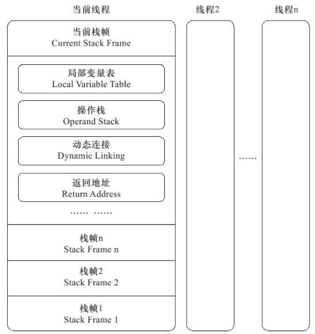

## 1.1.局部变量表

局部变量是一组变量值存储空间，用于存放**方法参数**和**方法局部变量**。它是以变量槽(Slot)作为基本单位，Slot没有明确的内存空间占用大小，只是确定一个Slot可以存放一个32位以内的数据类型：boolean、byte、char、short、int、float、reference、returnAddress(较少用，以前用于异常处理)，而64位数据类型：long、double，会占用两个连续的Slot。

JVM通过索引定位方式使用局部变量表，索引值范围从0~最大Slot数量，若访问32位数据类型，索引n代表使用第n个Slot；若访问64位数据类型，则会同时使用n和n+1两个Slot；还有一点，若执行的是实例方法(非static)，那么局部变量表第0位的Slot默认用于传递方法所属对象实例的引用，即java代码中的this关键字。例如有这样一个类：

```java
public class App {
    public void inc(){
    }
}
```

它编译后的Class文件为对这个方法表的描述为：

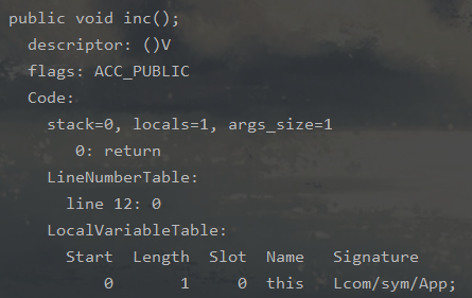

明明inc()方法没有任何参数，但是编译器还是分配了一个Slot(locals=1)，并且指定args_size=1，这个就是this关键字占用的空间

## 1.2.操作数栈

操作数栈，也称操作栈，它是字节码指令的执行空间。栈中的每个元素可以是任意的java数据类型，32位数据类型占用的容量为1，64位数据类型占用的容量为2；当方法刚执行时，它的操作数栈为空，随着代码的执行，会有各种字节码指令往操作数栈中写入和提取内容(即入栈和出栈)。JVM的解释执行引擎称为“基于栈的执行引擎”，其中的“栈”就是这个操作数栈。

## 1.3.动态链接

程序在编译成Class文件后会有一系列的引用，这种称为静态引用；而在JVM运行时才创建的引用称为动态引用。每个栈帧都包含一个指向运行时常量池中该栈帧所属方法的引用，持有这个引用是为了支持方法调用过程中的动态连接

## 1.4.方法返回地址

方法返回地址，其实就是调用当前方法的线程所在的PC计数器的值。一个方法在JVM结束运行有两种情况：

1. 正常执行退出：方法无返回值执行完或执行引擎遇到方法返回的字节码指令；

2. 异常执行退出：方法执行期间出现未在该方法异常表定义的异常(即未捕获异常)，方法也会退出而且不会给当前方法调用者任何返回值。

“方法返回地址”要做的就是在当前方法正常执行退出时，即当前栈帧出栈(虚拟机栈)，通过它记录的信息恢复调用者的局部变量表和操作数栈，把返回值(如果有的话)压入调用者栈帧的操作数栈中，最后调整PC计数器的值来指向方法调用指令的后一条指令。

# 2.方法调用

方法调用不是方法执行（方法怎么执行要看下面的解释执行），“方法调用”的任务就是来**确定调用哪一个方法**

## 2.1.解析调用

之前学习Class文件已经知道，所有方法调用中的目标方法在编译后都只是**常量池**中的一个符号引用。这些符号引用会在类加载过程的**解析阶段**，由JVM将其从符号引用转换为直接引用，但是能这样处理的前提是这些能直接转为直接引用的方法在运行前就能确定它的调用版本(注：例如接口方法就不行，运行前不知道用的是哪个接口实现类)，这类方法的调用就称为“解析调用”，属于解析调用的方法其实无非五种：

<u>1.私有方法；2.构造方法；3.父类方法；4.静态方法；5.final方法</u>

补充一点：JVM提供了5条方法调用字节码指令，分别是：

1. invokestatic：调用静态方法；

2. invokespecial：调用构造方法、私有方法、父类方法；

3. invokevirtual：调用所有的虚方法；

4. invokeinterface：调用接口方法，只能在运行时才能确定接口实现类；

5. invokedynamic：运行时动态解析符号引用指定的方法，然后再调用它。

只有前两个字节码指令：invokestatic和invokespecial调用的方法，可以在类加载过程的**解析阶段**就能确定唯一版本(你想私有方法是不是只有这个类才有？静态方法也是这个理，而final方法虽然是被invokevirtual指令调用，但是它不可覆盖不可变，也可以运行前就确定)，它们就符号引用就可以解析成直接引用，这些方法也称为“非虚方法”。相反的，除此之外的其它方法称为“虚方法”，它们通过分派调用来确定具体调用哪个方法。

## 2.2.分派调用

除了解析调用的“1.私有方法；2.构造方法；3.父类方法；4.静态方法；5.final方法”这5种方法外，其它方法不能再编译期和类加载过程的解析阶段确定，这些方法就需要通过“分派调用”，在JVM运行时再来确定调用实际的方法。分派调用分为“静态分派”和“动态分配”，作用于java语言的“重载”和“重写”！

### 2.2.1.静态分派

假设有一个接口People，和一个实现类Man，当我们初始化Man时：People p = new Man(); 这种代码的“People”称为变量的静态类型，而实际new的“Man”称为变量的动态类型。静态类型在编译期就可以确定，而动态类型只能在运行期才能确定。所有依赖静态类型来定位方法执行版本的分派动作就称为“静态分派”

编译器在方法重载时是通过参数的静态类型作为判断依据的，由于静态类型在编译期就可以确定，所以javac编译器会根据静态类型决定使用哪个重载方法，并将这个方法的符号引用写到invokevirtual指令的参数中。注意一点，调用重载方法可能有时候有多个能够匹配上方法参数，例如inc(Object o)和inc(String s)..但是编译器会选择一个“最适配”的方法!

### 2.2.2.动态分派

跟静态分派对立的就是动态分派了，它一般体现在方法“重写”，还是跟静态分派的那行代码来说：People p = new Man();当调用接口People定义的方法时，这时候只能在运行时来确定P具体的类型是哪个，才能确定要调用哪个方法。那么JVM是怎么知道运行时具体哪个类型呢？这个就靠invokevirtual帮忙，这个指令的执行过程为：

1. 找到操作数栈顶的第一个元素所指向的对象的实际类型，记为C；

2. 若在C中找到与常量池的方法描述符和方法简单名称都一样的方法，进行权限校验，通过则直接返回此方法的直接引用；否则抛出权限异常；

3. 若C中未找到，按照继承关系从下往上依次对C的各个父类进行操作②的搜索和验证过程；

4. 如果还未找到合适方法，抛出AbstractMethodError异常

## 2.3.patch code

虚拟机对类的加载是在第一次使用时才开始，在编译A方法的时候需要调用B方法，但B方法还没被加载进来，这时候虚拟机会再生成call指令，将它的目标地址填充为一个虚拟机内部的用于解析符号的方法。当CPU执行到这条call指令时，就会调用符号解析函数。这时候虚拟机才会开始加载B方法所在的类，然后就可以确认B方法的地址，此时再把B方法的地址写回到call指令里，下一次CPU执行到call指令时，就不用再进行符号解析了，可以直接调用到B方法。这种方式被称为：patch code


# 3.解释执行

## 3.1.指令执行架构

java执行引擎是一种基于栈的指令集架构，与之对应的，还有普通PC机的基于寄存器的指令集。它们的区别可以通过这样一个例子来分析：计算“1+1”

**①基于栈的执行架构**，它的指令集为：

```text
iconst_1
iconst_1
iadd istore_0
```

两条iconst_1指令连续把两个常量1压入栈后，iadd指令把栈顶的两个值出栈，然后相加，最后把结果返回栈顶。

**②基于寄存器的执行架构**，它的指令集：

```
mov eax, 1
add eax, 1
```

mov指令把EAX寄存器的值设为1，然后add指令再把这个值加1，结果保存在EAX寄存器里面。

可以看出来基于栈的指令集，需要围绕一个操作数栈来操作，而基于寄存器的指令集可以直接在寄存器进行计算。寄存器是由硬件提供的，会收硬件的约束，但是频率高，所以基于寄存器的指令集执行速度快；而基于栈的指令集移植性能高，但是执行速度相对较慢。

## 3.2.简单执行过程

JVM的解释器和即时编译器会对字节码指令作出优化，所以实际上的执行过程会比较复杂，这里只是记录基于栈的指令集的一般运行过程。注：何为即时编译器？当JVM发现某个方法或代码块运行十分频繁，就会将其认定为“热点代码”，那它就会把这些代码编译成与本地平台相关的机器码，再进行各种层次的优化，完成这个任务的编译器称为即时编译器(就是常说的JIT编译器)。例子中的图片来自于[这里](https://clsaa.gitbooks.io/jvm-notes/11-Java字节码.html)，假设有这样一个方法，进行加减乘除运算：

```java
public int calc() {
int a = 500;
int b = 200;
int c = 50;
    return (a + b) / c;
}
```

将它编译字节码后，用javap查看是这样子：

```c
public int calc();
    descriptor: ()I
    flags: ACC_PUBLIC
    Code:
      stack=2, locals=4, args_size=1
         0: sipush        500
         3: istore_1
         4: sipush        200
         7: istore_2
         8: bipush        50
        10: istore_3
        11: iload_1
        12: iload_2
        13: iadd
        14: iload_3
        15: idiv
        16: ireturn
      // 后面还有一些说明省略掉了
```

可以看到它的[操作数栈](#1.2.操作数栈)最大深度为2，[局部变量表](#1.1.局部变量表)最大容量为4个Slot。开始模拟执行引擎执行上面字节码的流程：

1. 指令“sipush 500”意味把500压入操作数栈顶；接着执行“istore_1”，它将操作数栈顶的元素保存到局部变量表下标为1的槽位上(提醒：图中的操作数栈的方框，下面的才是栈顶，上面的是栈底)

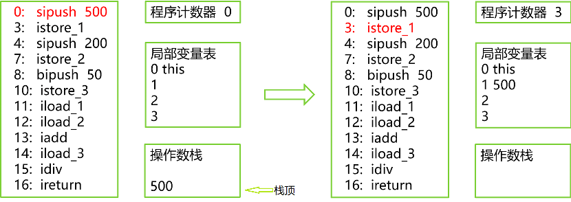

2. 同理后面指令从偏移地址4 ~ 偏移地址10，都是依次将200、30保存到局部变量表的槽位上，最终结果如下图所示：

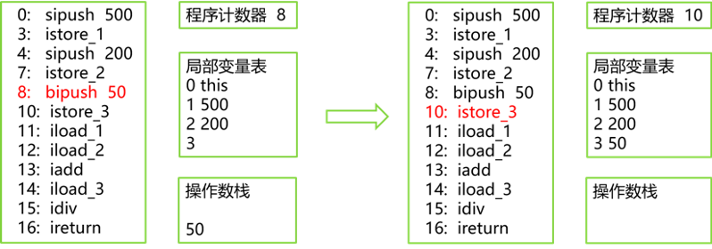

3. 执行偏移地址为11的指令，iload_1指令作用是将局部变量表第1个Slot的整型值复制到操作数栈顶；同理iload_2指令会将局部变量第2个Slot的整型值也复制到操作数栈。最终操作数栈就有200和500两个整数：

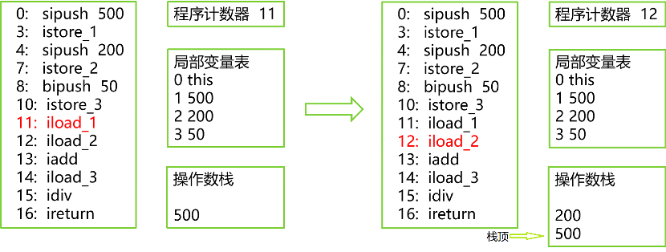

4. 接着执行偏移地址为13指令，iadd指令会将操作数栈的头两个元素弹出栈，做整型加法，最终把结果压入操作数栈顶，此时操作数栈就只剩200+500的结果即700了，如下图左部分所示；再执行偏移地址14的指令，iload_3就将局部变量表的第3个Slot的整型值复制到操作数栈中，如下图右部分所示：

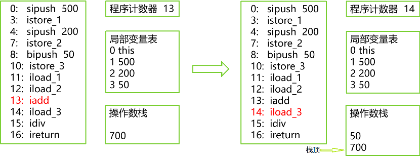

5. 接着执行偏移地址为15的指令，idiv指令也是将操作数栈顶的头两个元素弹出：先弹出栈顶元素700，再弹出50，执行除法运算，再将结果14压入操作数栈顶，最终执行ireturn指令，结束方法执行并将操作数栈顶的整型值返回给调用者

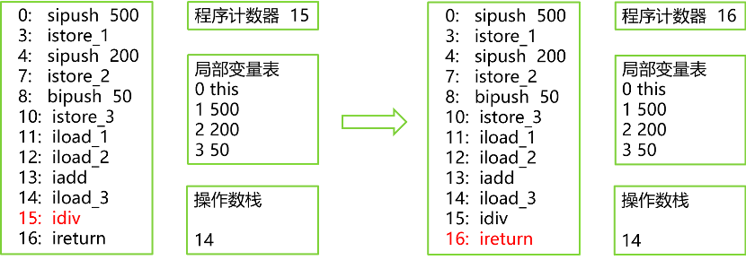

# 4.问题排查

## 4.1.cpu占用过多

1. 命令**：**top
   - 用top定位哪个进程对cpu的占用过高，以获取进程id

2. 命令：ps H -eo pid,tid,%cpu | grep <进程id>
   - 用ps命令进一步定位是哪个线程引起的cpu占用过高，以获取线程tid

3. 命令：jstack <线程id>
   - 使用JDK自带工具jstack，它可以根据线程id 找到有问题的线程，进一步定位到问题代码的源码行号

## 4.2.线程死锁

同样可以通过[jstack](#_jstack)来分析，它会提醒这样的信息：Found one java-level deadlock，并给出死锁的源码行号

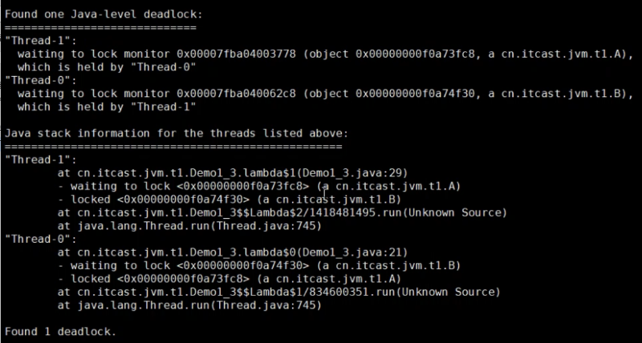

## 4.3.Linux排查命令

以下命令如果没有，先安装：yum install sysstat -y

### 4.3.1.整机：top

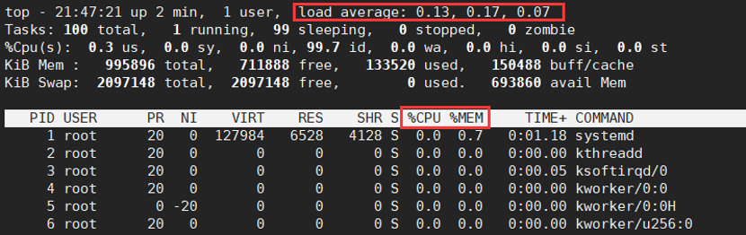

来查看占用CPU和内存最高的进程是哪些。右上角的load average表示系统的负载均衡，它有三个值分别表示：1、5、15分钟的系统配置负载值，将这三个值相加后，除以3，再乘以100%，如果大于60%说明系统负担压力重。当然top还有一个精简版命令uptime，快速看到系统load average的值

### 4.3.2.cpu

#### 4.3.2.1.vmstat

**命令**：vmstat -n 1 3

vmstat工具使用是通过两个数字来完成的，第一个参数“1”是采样的时间间隔，单位是秒；第二个参数“3”是采样的次数：

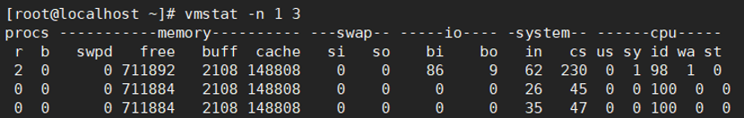

主要是看首尾两部分:procs和cpu：

1. procs:

   - r:运行和等待CPU时间片的进程数。原则上1核的CPU的运行队列不要超过2，即系统运行队列不要超过CPU总核数的2倍，否则说明系统压力大；

   - b:等待资源的进程数。比如正在等待磁盘I/O、网络I/O等；

2. cpu:

   - us：用户进程消耗CPU时间百分比。此值越高说明用户进程消耗CPU时间多，如果长期大于50%说明需要优化程序；

   - sy：内核进程消耗的CPU时间百分比(us + sy参数值为80%，如果us + sy大于80%，说明可能存在CPU不足)

   - id：处于空间的CPU百分比；

   - wa：系统等待IO的CPU时间百分比；

   - st：来自于一个虚拟机偷取的CPU时间的百分比。

#### 4.3.2.2.mpstat

mpstat命令可以查看所有CPU核信息，格式：mpstat -P ALL 2，表示每2秒打印一次CPU所有核的信息：

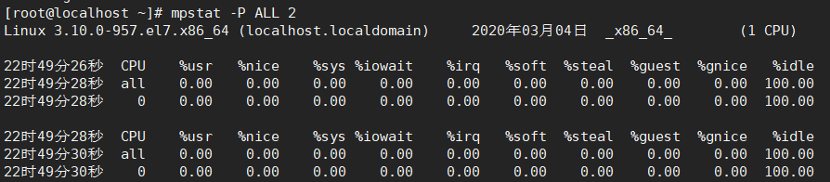

#### 4.3.2.3.pidstat

pidstat命令可以查看每个进程使用的cpu的用量分解信息，格式为：

pidstat -u <时间间隔> -p <进程编号>：

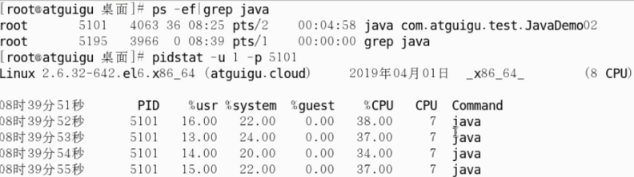

### 4.3.3.内存

#### 4.3.3.1.free

free命令可以查看应用程序的可用内存数，默认是以字节展示，可以通过加上-g会将字节转换成G单位，-m会将字节转换成M(兆)单位：

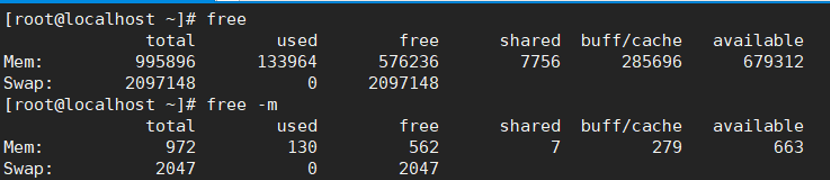

1. 应用程序可用内存(free)/系统物理内存(total)>70%，说明内存充足

2. 应用程序可用内存(free)/系统物理内存(total)<20%，内存不足，要增大

3. 20% < free/total < 70%，说明内存基本够用

#### 4.3.3.2.pidstat

通过pidstat同样也可以查看进程对内存的消耗，格式为：

pid -r <间隔秒数> -p <进程号>：

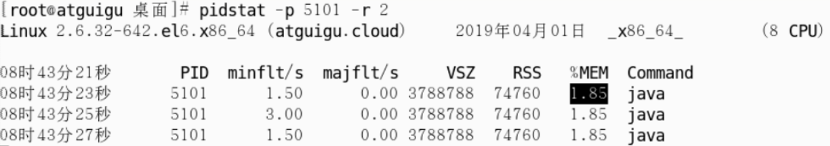

### 4.3.4.硬盘

#### 4.3.4.1.df

使用df -h命令查看磁盘的剩余空间：

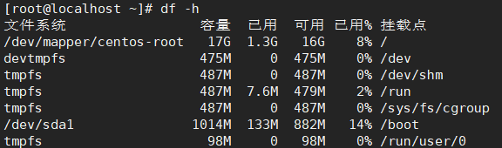

### 4.3.5.磁盘I/O

#### 4.3.5.1.iostat

通过iostat命令查看磁盘I/O性能，格式为：

iostat -xdk <间隔秒数> <采样次数>

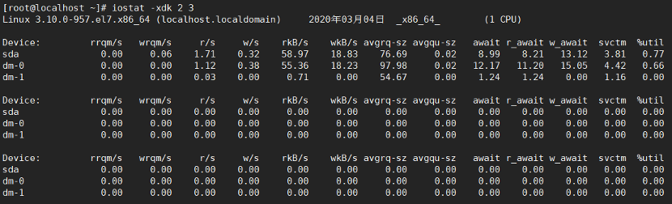

磁盘块设备分布：

1. rkB/s：每秒读取数据量KB；

2. wkB/s：每秒写入数据量KB；

3. svctm：I/O请求的平均服务时间，单位毫秒；

4. await：I/O请求的平均等待时间，单位毫秒，值越小，性能越好；

5. util：一秒钟有百分几的时间用于I/O操作，接近100%时表示磁盘带宽跑满，需要优化程序或增加磁盘；

svctm与await值越接近，说明几乎没有I/O等待，磁盘性能好；若await值远远高于svctm的值，表示I/O队列等待太长，需要优化程序或更换更快磁盘

#### 4.3.5.2.pidstat

通过pidstat同样也可以查看具体进程对磁盘I/O的消耗，格式为：

pidstat -d <间隔秒数> -p <进程编号>

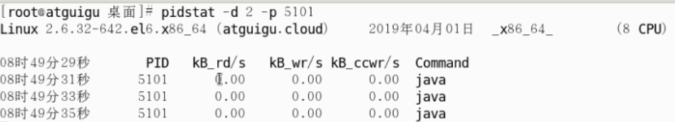

### 4.3.6.网络I/O

#### 4.3.6.1.ifstat

命令：ifstat <间隔秒数>

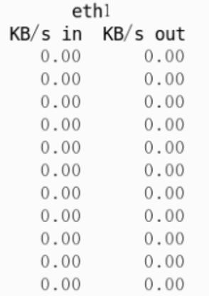

# 5.性能监控与故障处理工具

## 5.1.jps

jps(JVM Process status Tool)，虚拟机进程状况工具。可以罗列出正在运行的HotSpot虚拟机进程，并显示虚拟机执行主类(main方法所在的类)名称及其进程的本地虚拟机唯一ID(LVMID，Local Virtual Machine Identifier)。虽然功能简单，但却是使用频率最高的JDK命令行工具，因为其它工具需要输入它查询到的LVMID才能确定要监控的JVM进程。jps命令有4个可选项，分别是：

| **选项** | **作用**                                       |
| -------- | ---------------------------------------------- |
| -q       | 只输出LVMID，省略主类的名称                    |
| -m       | 输出虚拟机进程启动时传递给主类main()方法的参数 |
| -l       | 输出主类全名，若进程执行的是jar包，输出jar路径 |
| -v       | 输出虚拟机进程启动时的JVM参数                  |

jps可以通过RMI协议查询远程开启RMI服务的虚拟机进程，hostid为RMI注册表中注册的主机名，命令：jps [options] [hostid]

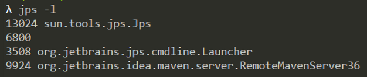

(最前面的数字就是JVMID)

## 5.2.jstat

jstat(JVM Statistics Monitoring Tool)，虚拟机统计信息监视工具。用于监视虚拟机各种运行状态信息的工具，可以显示本地或者远程的虚拟机进程类装载、内存、GC、JIT等运行数据。在没有GUI图像界面的服务器上，主要就是用它在运行期定位性能问题。命令格式：

jstat [ option vmid [interval[s|ms] [count]] ]

有两点需要说明：

1. LVMID和VMID：若是本地虚拟机进程，VMID与LVMID一致；若是远程虚拟机进程，VMID格式为：\[protocol:][//]lvmid[@hostname[:port]/servername]

2. 参数interval和count代表查询间隔和次数，若省略则只查询一次。假设每250ms查询一次进程9527垃圾收集情况，共查询10次，则命令为：jstat -gc 9527 250 20

| **选项**          | **作用**                                                     |
| ----------------- | ------------------------------------------------------------ |
| -class            | 监视类加载、卸载数量、总空间以及类装载所耗费的时间           |
| -gc               | 监视Java堆状况，包括Eden区、两个Survivor区、老年代等的容量、已用空间、GC时间合计等信息 |
| -gccapacity       | 监视内容与-gc基本相同，但输出主要关注java堆各个区域使用到的最大、最小空间 |
| -gcutil           | 监视内容与-gc基本相同，但输出主要关注已使用空间占总空间的百分比 |
| -gccause          | 与-gcutil功能意义，但是会额外输出导致上一次GC产生的原因      |
| -gcnew            | 监视新生代GC状况                                             |
| -gcnewcapacity    | 监视内容与-gcnew相同，输出主要关注使用到的最大、最小空间     |
| -gcold            | 监视老年代GC状况                                             |
| -gcoldcapacity    | 监视内容与-gcold相同，出书主要关注使用到的最大、最小空间     |
| -compiler         | 输出JIT编译器编译过的方法、耗时等信息                        |
| -printcompilation | 输出已经被JIT编译的方法                                      |

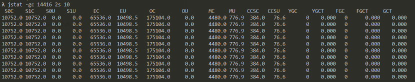

(提醒：14416是通过[jps](#5.1.jps)查询得到的JVMID，本地虚拟机LVMID就等于VMID)使用jstat在纯文本状态监视虚拟机状况确实不如使用可视化工具[VisualVM](#_VisualVM)。这里仅对给出的文本标识说明：

1. S0,S1：表示Survivor0和Survivor1。S0C,S1C表示总量，S0U,S1U表示已使用的百分比；

2. EC,EU：表示Eden的总量和已使用量；

3. OC,OU：表示老年代的总量和已使用量

4. MC,MU：表示元空间的总量和已使用量；

5. YGC,YGCT：表示Young GC发生次数与总耗时；

6. FGC,FGCT：表示Full GC发生次数与总耗时；

7. GCT：所有GC的总耗时。

## 5.3.jinfo

jinfo(Configuration Info for Java)，Java配置信息工具。用来查看和调整虚拟机各项参数。命令格式：jinfo [option] pid

可以通过-flag [+|-] name添加和删除一些参数，或者通过-flag name=value修改一些参数，但是大部分参数是不允许修改：

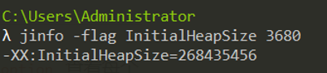

（其中3680是通过[jps](#5.1.jps)查询得到的JVMID）

## 5.4.jmap

jmap(Memory Map for Java)，Java内存映像工具。用来生成堆转储快照(一般称为heapdump或dump文件)。命令格式：jmap [option] vmid

| **选项**       | **作用**                                                   |
| -------------- | ---------------------------------------------------------- |
| -dump          | 生成java堆转储快照，成为一个单独的文件                     |
| -heap          | 显示java堆详细信息，如使用哪种收集器、参数配置、分代状况等 |
| -histo         | 显示堆中对象统计信息，包括类、实例变量、合计容量           |
| -F             | 虚拟机进程对-dump选项没有响应时，强制生成dump快照          |
| -finalizerinfo | 显示在F-Queue中等待Finalizer线程执行finalize方法的对象     |

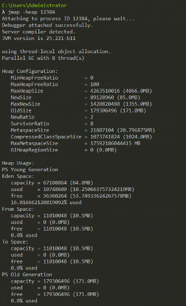

(其中12384是通过[jps](#5.1.jps)查询的VMID)

## 5.5.jstack

jstack(Stack Trace for Java)，Java堆栈跟踪工具。用于生成虚拟机当前时刻的**线程**快照(一般称为threaddump或javacore文件)。生成线程快照的主要目的是定位线程出现长时间停顿的原因如死锁、死循环和请求外部资源等。jstack命令格式：jstack [option] vmid

| **选项** | **作用**                                     |
| -------- | -------------------------------------------- |
| -F       | 当正常输出的请求不被响应时，强制输出线程堆栈 |
| -l       | 除堆栈外，显示关于锁的附加信息               |
| -m       | 如果调用到本地方法的话，可以显示C/C++的堆栈  |

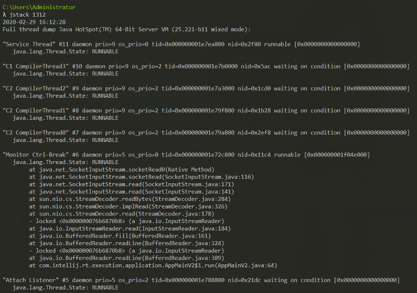

(先通过[jps](#5.1.jps)查询VMID再查询堆栈信息，内容较多这边截取部分)

## 5.6.jConsole

jConsole(Java Monitoring and Management Console)，Java监视与管理控制台，是一种基于JMX的可视化监视、管理工具。使用命令行工具输入jconsole即可，它会自动罗列出当前运行的JVM进程，点击连接就可以实时查看内存信息：

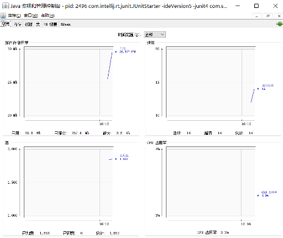

## 5.7.jVisualVM

jVisualVM基于NetBeans平台开发，它是目前为止JDK发布的功能最强大的运行监视和故障处理程序，提供内存和CPU分析，堆转储分析，内存泄漏检测，MBean访问和垃圾收集。只要在命令行工具输入jvisualVM命令即可，然后选择运行的JVM进程既可以分析运行时情况：

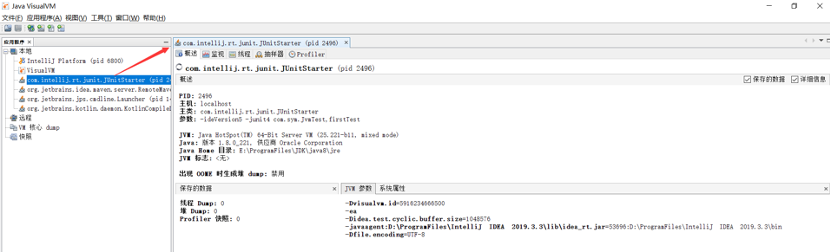

