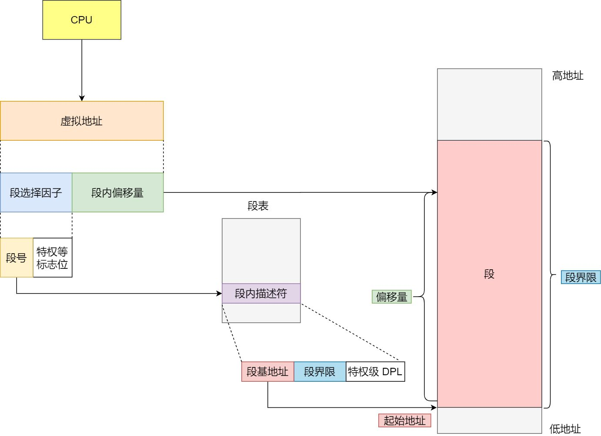
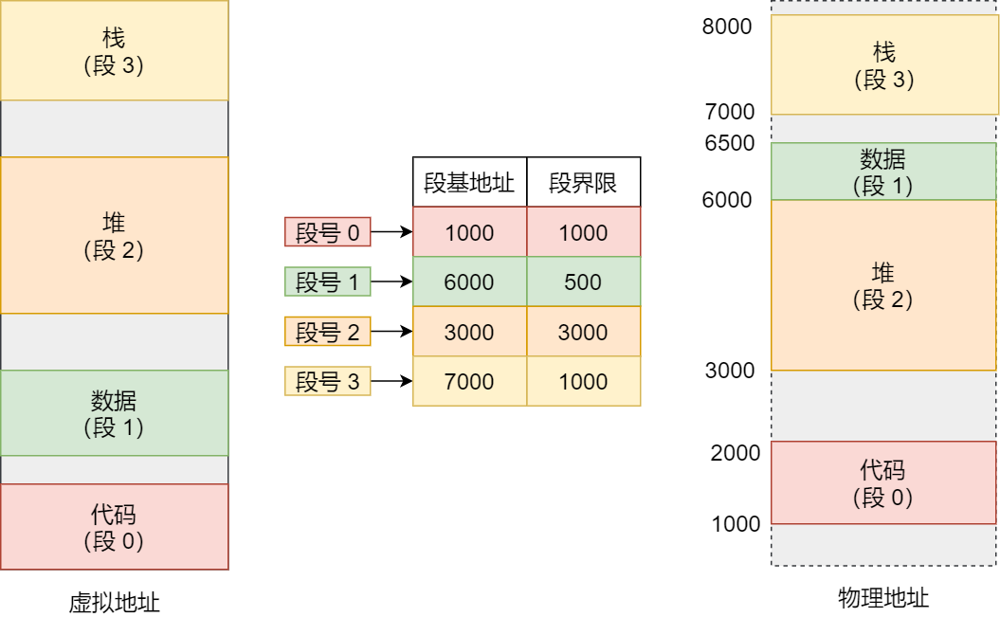
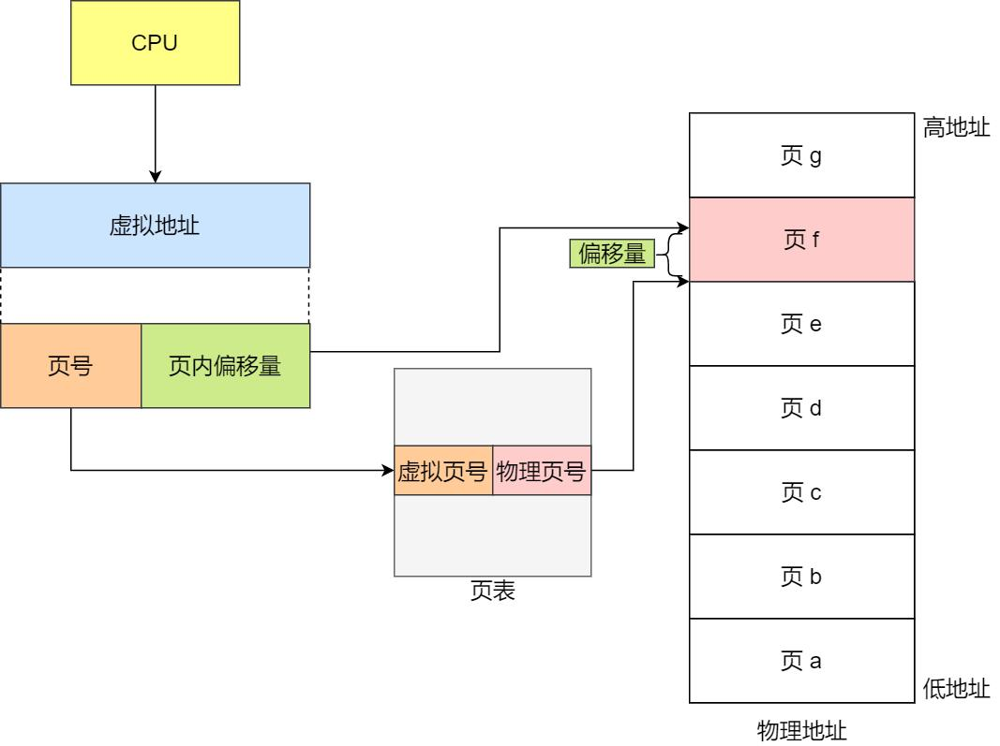
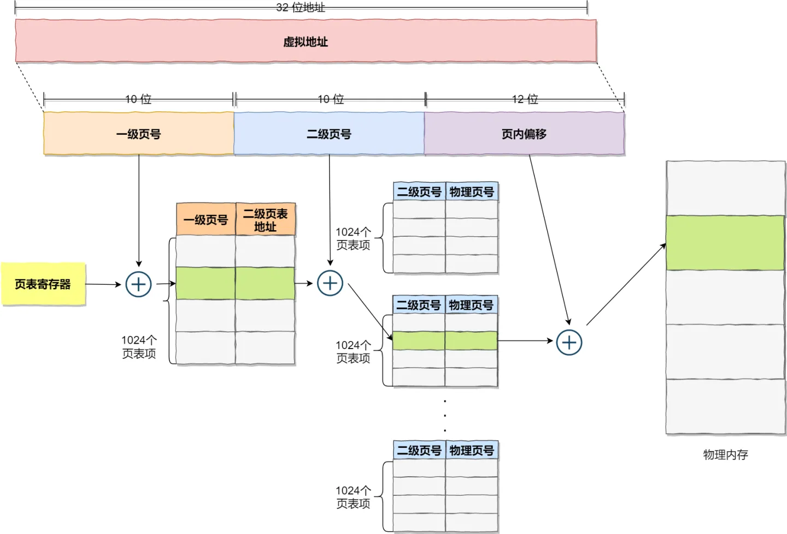
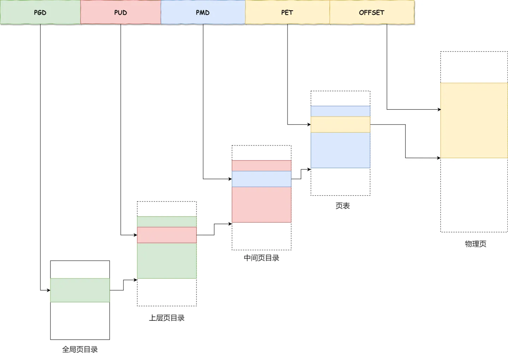

# 1.理论

## 1.1.内存条

内存，也叫DRAM，即动态随机存储器。本质上它就是下图所示的条型组件：


在 PCB 板上有内存颗粒芯片，主要是用来存放数据的。SPD 芯片用于存放内存自身的容量、频率、厂商等信息。还有最显眼的金手指，用于连接数据总线和地址总线，电源等。

内存储存颗粒芯片中的存储单元是由电容和相关元件做成的，电容存储电荷的多、少代表数字信号 0 和 1。而随着时间的流逝，电容存在漏电现象，这导致电荷不足，就会让存储单元的数据出错，所以 DRAM 需要周期性刷新，以保持电荷状态。因此内存需要不断地供电。

**逻辑上我们只需要把内存看成一个巨大的字节数组就可以，而内存地址就是这个数组的下标**。

## 1.2.局部性原理

局部性原理：在程序的执行过程中，数据和指令的访问往往具有局部集中的特点。主要包括以下两个方面：

1. 时间局部性（Temporal Locality）：时间局部性指的是程序在一段时间内对某个数据或指令的多次访问。当程序执行一条指令或者访问一个数据时，很可能在近期的某个时间点再次访问同样的指令或数据。这是因为在程序中，往往会有循环结构、重复的子程序调用等，导致某些数据和指令在短时间内被多次使用。
2. 空间局部性（Spatial Locality）：空间局部性指的是程序在一段时间内访问的数据或指令在空间上彼此相邻。当程序访问某个数据或指令时，它很可能会在附近的内存位置访问其他相关的数据或指令。这是因为程序的数据和指令通常以连续的块或者相邻的存储位置进行存储，因此对一个数据或指令的访问往往会引起对附近数据或指令的访问。

通过这个原理可得到一个结论：无论一个进程占用的内存资源有多大，在任一时刻，它需要的物理内存都是很少的

# 2.虚拟内存

计算机运行的所有数据都会落到物理内存里，在早期的CPU指令集里，从内存加载数据、向内存写入数据都是直接操作物理内存。在嵌入式设备中，这种操作是正常的，毕竟嵌入式设备正常只有一个应用在执行；但是在多任务的操作系统中，进程直接操作物理内存，容易出错和冲突，因此设计了虚拟内存。

每个进程拥有独立且隔离的虚拟内存，进程可以将数据存放到虚拟内存中，进程持有的虚拟地址会通过 CPU 芯片中的内存管理单元（MMU）的映射关系，来转换变成物理地址，然后再通过物理地址访问内存。


1. 虚拟内存虽然提供了很大的空间，但进程启动后，这些空间并不是全部都能使用，还是需要显式调用malloc等内存分配接口才能将内存从『待分配』状态变成『已分配』
2. 分配得到一块虚拟内存后，它属于『未映射』状态，此时它并没有被映射到物理内存中。直到对这块内存进行读写时，CPU才会真正为其分配物理内存；
3. 虚拟内存中连续的页面，在物理内存不一定是连续，只要维护好映射关系即可正常使用内存地址。这种映射关系是通过页表来实现；
4. 虚拟内存的地址空间和机器字宽有关，32位机器，指向内存的指针是32位，因此它的虚拟地址空间是2<sup>32</sup>，也就是4GB；64位机器，指向内存的指针是64位的，但实际只使用了低48位，因此它的虚拟地址空间是2<sup>48</sup>，也就是256T。

## 2.1.分段式

操作系统早期使用『内存分段』的方式管理虚拟内存和物理内存之间的映射。分段机制下的虚拟地址由两部分组成，**段选择子**和**段内偏移量**。




- **段选择子**就保存在段寄存器里面。段选择子里面最重要的是**段号**，用作段表的索引。**段表**里面保存的是这个**段的基地址、段的界限和特权等级**等。
- 虚拟地址中的**段内偏移量**应该位于 0 和段界限之间，如果段内偏移量是合法的，就将段基地址加上段内偏移量得到物理内存地址。 



分段机制会把程序的虚拟地址分成 4 个段，每个段在段表中有一个项，在这一项找到段的基地址，再加上偏移量，于是就能找到物理内存中的地址：要访问段 3 中偏移量 500 的虚拟地址，我们可以计算出物理地址为，段 3 基地址 7000 + 偏移量 500 = 7500。

【分段式的缺点】

- 产生大量的**内存碎片**
- **内存置换（swap）的效率低**

## 2.2.分页式

内存分段会出现内存碎片和内存交换太大的问题，要想解决这个问题，减小内存管理单元的大小即可，也就是内存分页：**分页是把整个虚拟和物理内存空间切成一段段固定尺寸的大小**。这样一个连续并且尺寸固定的内存空间，我们叫**页**（*Page*）。在 Linux 下，每一页的大小为 `4KB`。

分页机制下，虚拟地址分为两部分，**页号**和**页内偏移**。页号作为页表的索引，**页表**包含物理页每页所在**物理内存的基地址**，这个基地址与页内偏移的组合就形成了物理内存地址：



对于一个内存地址转换，三个步骤：

- 把虚拟内存地址，切分成页号和偏移量；
- 根据页号，从页表里面，查询对应的物理页号；
- 直接拿物理页号，加上前面的偏移量，就得到了物理内存地址。

------

在实际场景中，如果只用一层分页，会导致页表非常庞大：32 位的环境下，虚拟地址空间共有 4GB，假设一个页的大小是 4KB（2<sup>^</sup>12），那么就需要大约 100 万 （2<sup>^</sup>20） 个页，每个「页表项」需要 4 个字节大小来存储，那么整个 4GB 空间的映射就需要有 `4MB` 的内存来存储页表。因此实际使用：多级页表，把这个 100 多万个「页表项」的单级页表再分页，将页表（一级页表）分为 `1024` 个页表（二级页表），每个表（二级页表）中包含 `1024` 个「页表项」，形成**二级分页**：



此时内存转换步骤变为：

1. 确定页目录基址：每个CPU都有一个页目录寄存器，最高级页表的基地址存在这个寄存器。在X86上，这个寄存器是CR3，每次计算物理地址，MMU都会从CR3寄存器中取出页目录所在的物理地址
2. 定位页目录项（PDE，即上图的一级页号）：一个32位的虚拟地址可以拆成 10位、10位和12位三段。第1步找到的页目录表基址加上高10位的值乘以4，就是页目录项的位置。（页目录项是4字节，1024个页目录项组成一页，正好是 4 * 1024k = 4kb，而1024个页目录项需要10位编码，所以可以通过高10位找到对应PDE）
3. 定位页表项（PTE，即上图的二级页号）：第2步找到页目录项记录着页表的位置，CPU通过页目录项找到页表的位置后，再用中间10位计算页表中的偏移，可以定位该虚拟地址对应的页表项（PTE）。
4. 确定物理地址：第3步CPU定位到页表项，它存储着物理地址，也就能找到改虚拟地址对应的物理页。此时虚拟地址还剩下12位，刚好对应物理页的所有字节（一个物理页4kb = 4 * 1024b = 2<sup>^</sup>12b）因此可以用12位来表示业内偏移，直接通过物理页的地址加上虚拟地址的低12位。

------

对于64位系统，演变成4级目录：

- 全局页目录项 PGD（*Page Global Directory*）；
- 上层页目录项 PUD（*Page Upper Directory*）；
- 中间页目录项 PMD（*Page Middle Directory*）；
- 页表项 PTE（*Page Table Entry*）；



# 3.内存布局

当程序保存在磁盘时，它的每一个单元结构被称为Section；当程序被加载到内存时，它的每一个单元结构被称为Segment。Segment会将具有相同权限属性的Section集映射到一起，为它们分配一块内存空间，因此往往多个Section对应一个Segment，例如：

- `.text`、`.rodata`等只读的Section，会映射到内存的「只读/执行」权限的Segment里；
- `.data`、`.bss`等可读写的Section，会映射到内存的「读写」权限的Segment里；
- `.symtab`、`.strtab`等磁盘二进制的一些辅助信息的Section，不会在内存中映射；


## 3.1.逻辑布局


CPU运行一个程序，需要将存放在磁盘的进程文件载入内存，因此就会有进程的内存布局：

- 代码段：存储程序的机器码
- 数据段：在程序源代码中，对于有初值的变量，它的初始值会存放在程序的二进制文件。那么在加载这个程序的时候，这些数据也会被装载到内存中，即程序的数据段。因此，数据段存放的是程序中已经初始化且不为0的全局变量和静态变量
- BSS段：已经初始化的全局变量和静态变量会存放在「数据段 」，而对于未初始化的，编译器知道默认值都是0，所以不需要将其保存到二进制文件，进而就不需要加载到「数据段」，只需要记录它们的大小，此时就会存储到BSS段（全称是 Block Started by Symbol，也被记为 Better Save Space）
- 栈/堆：「数据段」和「BSS段」都会存储变量，主要是全局变量和静态变量。但在程序运行期间，还需要记录临时变量和运行时产生的变量，这些会被存储在「堆空间」和「栈空间」

以上是一个进程运行的基本内存布局，现代应用程序还会包含其它区域，主要是：

1. 存放加载的共享库的内存空间：如果一个进程依赖共享库，那对应的，该共享库的代码段、数据段、BSS 段也需要被加载到这个进程的地址空间中
2. 共享内存段：我们可以通过系统调用映射一块匿名区域作为共享内存，用来进行进程间通信
3. 内存映射文件：我们也可以将磁盘的文件映射到内存中，用来进行文件编辑或者是类似共享内存的方式进行进程通信

## 3.2.IA-32位

32位机器上，每个进程具有4GB的寻址能力，Linux默认将高地址的1GB空间分配给内核，剩余的低3GB是用户可以使用的用户空间


## 3.3.Intel-64位

目前，Intel 64 处理器往往支持 48 位的虚拟地址，则寻址空间是 2^48，即 256TB。将低 128T 的空间划分为用户空间，高 128T 划分为内核空间：


# 4.栈

堆的空间有一个向下的箭头，标明栈地址空间的增长方向（栈地址是向低地址方向增长），每次进程再向内核申请新的栈地址时，其地址值是减少的。栈的指针叫做“Stack pointer”。

## 4.1.从指令的角度理解栈

调用一个函数，CPU会在栈空间开辟一块区域，该函数的局部变量都在这块区域存活，当函数执行完，这块区域就会被回收。这块区域被称为 stack frame，即栈帧。本质上，栈帧就是一个函数的活动记录。而当一个函数（A）调用另一个函数（B），会在A栈帧的下方创建函数B的栈帧（注意：栈是高地址向低地址增长的），等函数B执行完，回收栈帧B，又继续执行函数A。

```c
// 一个计算阶乘的函数
int fac(int n) {
    return n == 1 ? 1 : n * fac(n-1);
}
```

执行下面两行命令:

```bash
gcc -o fac fac.c
objdump -d fac
```

可以得到对应的汇编代码:

```assembly
40052d:       55                      push   %rbp
40052e:       48 89 e5                mov    %rsp,%rbp
400531:       48 83 ec 10             sub    $0x10,%rsp
400535:       89 7d fc                mov    %edi,-0x4(%rbp)
400538:       83 7d fc 01             cmpl   $0x1,-0x4(%rbp)
40053c:       74 13                   je     400551 <fac+0x24>
40053e:       8b 45 fc                mov    -0x4(%rbp),%eax
400541:       83 e8 01                sub    $0x1,%eax
400544:       89 c7                   mov    %eax,%edi
400546:       e8 e2 ff ff ff          callq  40052d <fac>
40054b:       0f af 45 fc             imul   -0x4(%rbp),%eax
40054f:       eb 05                   jmp    400556 <fac+0x29>
400551:       b8 01 00 00 00          mov    $0x1,%eax
400556:       c9                      leaveq
400557:       c3                      retq
```

- 第1行：当前栈基址存到栈顶；
- 第2行：将栈指针保存到栈基址寄存器；上面两行是将当前函数的栈帧创建在调用函数的栈帧下，同时保存调用者的栈基址便于恢复
- 第3行：把栈向下增长0x10，为了给局部变量预留空间。无限创建栈帧会出现StackOverflow，因为操作系统会在栈空间的尾部设置一个禁止读写的页，当栈增长到这里，操作系统会发出SIGSEGV信号，进程响应这个信号而中断执行；
- 第4行：把变量n存到栈上，变量 n 一开始是存储在寄存器 edi 中的，存储的目标地址是栈基址加上 0x4 的位置，也就是这个函数栈帧的第一个局部变量的位置；
- 第5行：将变量 n 与常量 0x1 进行比较；
- 第6行：如果比较的结果是相等的，那么程序就会跳转到 0x400551 位置继续执行。0x400551 是第 13 行，它把 0x1 送到寄存器 eax 中，然后返回，就是说当 n==1 时，返回值为 1；
- 第7,8,9行：若第6行比较结果不等，就不会跳转，继续执行7,8,9行，把 n-1 送到 edi 寄存器中，即以 n-1 为参数调用 fac 函数。调用的返回值在 eax 中，第 11 行会把返回值与变量 n 相乘，结果仍然存储在 eax 。然后程序就可以跳转到 0x400556 处结束这次调用；
- 第10行：执行 callq 指令时，CPU 会把 rip 寄存器中的内容，也就是 call 的下一条指令的地址放到栈上（在这个例子中就是 0x40054b），然后跳转到目标函数处执行。当目标函数执行完成后，会执行 ret 指令，这个指令会从栈上找到刚才存的那条指令，然后继续恢复执行。

## 4.2.栈切换

【执行单元】

执行单元：是指CPU调度和分派的基本单位，它是一个CPU能正常运行的基本单位。CPU可以将执行单元的当前状态保存，然后暂定执行单元的运行，后续将状态恢复就可以重新调度该执行单元。像这种保存状态、挂起、恢复执行、灰度状态的完整过程，称为执行单元的调度。常见的执行单元有：进程、线程和协程三种。

【协程】

协程是比线程更轻量的执行单元。进程和线程的调度是有操作系统负责，而协程的调度是由执行单元相互协商进行调度的，因此它的切换发生在用户态。只有前一个协程主动地执行yield函数，让出CPU的使用权，下一个协程才能得到调度。

【上下文切换】

执行单元的上下文切换，都是由栈这个核心结构支撑。栈切换的核心就是**栈指针 rsp 寄存器的切换，只要我们想办法把 rsp 切换了，就相当于换了执行单元的上下文环境**。

### 4.2.1.进程的调度和切换

进程的切换，可以参考下面的代码

```c
#include <unistd.h>
#include <stdio.h>

int main() {
    pid_t pid;
    if (!(pid = fork())) {
        printf("I am child process\n");
        exit(0);
    }
    else {
        printf("I am father process\n");
        wait(pid);
    }

    return 0;
}
```

fork 是一个系统调用，用于创建进程，如果其返回值为 0，则代表当前进程是子进程，如果其返回值不为 0，则代表当前进程是父进程，而这个返回值就是子进程的进程 ID。上面这段程序，最难理解的是第6行，为啥一次fork后，会有两种不同的返回值？

那是因为fork 方法本质上在系统里创建了两个栈，这两个栈一个是父进程的，一个是子进程的。创建的时候，子进程完全“继承”了父进程的所有数据，包括栈上的数据。父子进程栈的情况如图:


只要有一个进程对栈进行修改，栈就会复制一份，然后父子进程各持有一份。上图的黄色部分也是进程共用的，如果有一个进程修改它，操作系统也会复制一份副本，这种机制叫做写时复制。

【如何切换呢？】

本质上，进程的切换，就是**CPU的rsp寄存器指向不同进程的栈**：

- 调度父进程：rsp这个栈指针指向父进程的栈，父进程的栈上是fork函数的frame，当CPU执行fork的ret语句时，返回值就是子进程的PID
- 调度子进程：rsp这个栈指针执行子进程的栈，子进程的栈上同样也是fork函数的frame，它也会执行一次fork的ret语句，只不过此时它的返回值为0。

### 4.2.2.用户态和内核态的切换

操作系统除了通过软中断（中断描述符表）进入内核态。实际上，内核态和用户态的切换也依赖于栈的切换，这个栈称为“内核栈”。它与用户应用程序使用的用户态栈是不同的。只有高权限的内核代码才能访问它。而内核态与用户态的相互切换，其中最重要的一个步骤就是两个栈的切换。

中断发生时，CPU 根据需要跳转的特权级，去一个特定的结构中，取得目标特权级所对应的 stack 段选择子和栈顶指针，并分别送入 ss 寄存器和 rsp 寄存器，这就完成了一次栈的切换。然后，IP 寄存器跳入中断服务程序开始执行，中断服务程序会把当前 CPU 中的所有寄存器，也就是程序的上下文都保存到栈上，这就意味着用户态的 CPU 状态其实是由中断服务程序在系统栈上进行维护的。如下图：


当程序因为 call 指令或者 int 指令进行跳转的时候，只需要把下一条指令的地址放到栈上，供被调用者执行 ret 指令使用，这样可以便于返回到调用函数中继续执行。但图 4 中的内核态栈里有一点特殊之处，就是 **CPU 自动地将用户态栈的段选择子 ss3，和栈顶指针 rsp3 都放到内核态栈里**了。这里的数字 3 代表了 CPU 特权级，内核态是 0，用户态是 3。

中断结束时，中断服务程序会从内核栈里将 CPU 寄存器的值全部恢复，最后再执行"iret"指令（注意不是 ret，而是 iret，这表示是从中断服务程序中返回）。而 iret 指令就会将 ss3/rsp3 都弹出栈，并且将这个值分别送到 ss 和 rsp 寄存器中。这样就完成了从内核栈到用户栈的一次切换。同时，内核栈的 ss0 和 rsp0 也会被保存到上面说的一个特定的结构中，以供下次切换时使用。

# 5.堆

堆的空间有一个向上的箭头，标明堆地址空间的增长方向，每次进程再向内核申请新的堆地址时，其地址值是增大的。堆的指针叫做“Program break”

## 5.1.申请堆空间

不管是 32 位系统还是 64 位系统，内核都会维护一个变量 brk，指向堆的顶部，所以，brk 的位置实际上就决定了堆的大小。Linux系统提供了两个重要的系统调用来修改堆的大小，分别是sbrk和mmap。

【sbrk】

```c
#include <unistd.h>
void* sbrk(intptr_t incr);
```

sbrk函数通过给内核的brk变量增加`incr`以改变堆的大小，当`incr`为正数，堆增大；当`incr`为负数，堆减小。函数执行成功，返回brk变量的旧值；执行失败，返回-1，同时将errno设置为ENOMEM。

在C语言的运行库里，提供了 malloc() 和 free() 实现堆内存的分配和回收。但其实，C语言的运行库使用sbrk()向操作系统申请一块大内存，再由  malloc() 完成再分配。

【mmap】

```c
#include <unistd.h>
#include <sys/mman.h>
/**
 * addr:   该内存区域的起始地址
 * length: 该内存区域的长度
 * prot:   该内存区域的访问权限
 * flags:  该内存区域的类型
 * fd:     文件描述符
 * offset: 文件内的偏移量
 */
void* mmap(void* addr, size_t length, int prot, int flags, int fd, off_t offset);
```

mmap的功能随之 prot、flags和fd这三个参数的不同，可以用于创建共享内存，可以创建磁盘文件映射区域，还可以用来申请堆内存。

- prot的值可以是以下四个常量的组合：
  - PROT_EXEC，表示这块内存区域有可执行权限，意味着这部分内存可以看成是代码段，它里面存储的往往是 CPU 可以执行的机器码；
  - PROT_READ，表示这块内存区域可读；
  - PROT_WRITE，表示这块内存区域可写；
  - PROT_NONE，表示这块内存区域的页面不能被访问；
- flags的值常量多（可以通过man mmap查看），以下是最重要的四种可取值常量：
  - MAP_SHARED，创建一个共享映射的区域，多个进程可以通过共享映射的方式，来共享同一个文件。这样一个进程对该文件的修改，其他进程也可以观察到，可以实现了数据的通讯；
  - MAP_PRIVATE，创建一个私有的映射区域，多个进程可以使用私有映射的方式，来映射同一个文件。但是，当一个进程对文件进行修改时，操作系统就会为它创建一个独立的副本，这样它对文件的修改，其他进程就看不到了，从而达到映射区域私有的目的；
  - MAP_ANONYMOUS，创建一个**匿名映射**，也就是没有关联文件。使用这个选项时，fd 参数必须为空。通常可以使用私有匿名映射来进行堆内存的分配。
  - MAP_FIXED，一般来说，addr 参数只是建议操作系统尽量以 addr 为起始地址进行内存映射，但如果操作系统判断 addr 作为起始地址不能满足长度或者权限要求时，就会另外再找其他适合的区域进行映射。如果 flags 的值取是 MAP_FIXED 的话，就不再把 addr 看成是建议了，而是将其视为强制要求。如果不能成功映射，就会返回空指针；
- fd的值只有两种类型：
  - 不为0，mmap映射的内存区域将会和文件关联；
  - 为0，没有对应的相关文件，此时就是匿名映射，flags 的取值必须为 MAP_ANONYMOUS；


# 6.编译链接

代码无非是由函数和变量组成，每个变量和函数都有自己的名称，正常会把这些名称叫做“符号”，当程序运行起来，需要给符号分配内存。干这个活儿的组件，叫做：链接器，它的作用就是将符号转换为地址，可以分为三种情况：

1. 生成二进制可执行文件的过程中。这种情况称为静态链接；
2. 在二进制文件被加载进内存时。这种情况是在二进制文件保留符号，在加载时再把符号解析成真实的内存地址，这种被称为动态链接；
3. 在运行期间解析符号。这种情况会把符号的解析延迟到最后不得不做时才去做符号的解析，这也是动态链接的一种。
