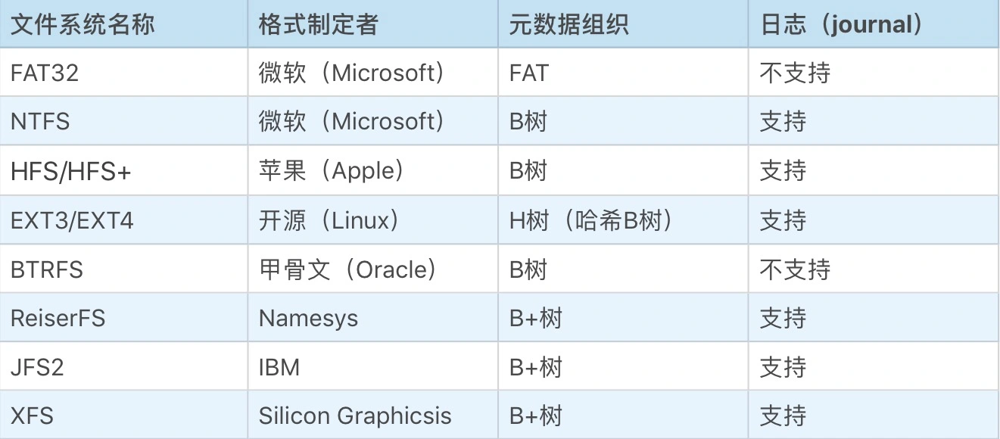
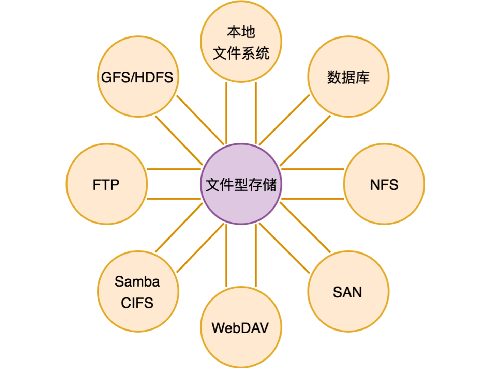

文件系统的常见数据格式：

文件系统的种类非常多，但是它们的设计思路其实基本相似。大部分现代文件系统都基于日志（journal）来改善文件系统的防灾难能力（比如突然断电，或不正常的 unmount 行为），基于 B 树或 B+ 树组织元数据。

------

文件型存储的备选解决方案：

- 第一类：本地文件系统。
- 第二类：网络文件系统。统称为 NAS，如上面的 NFS、FTP、Samba（CIFS）、WebDAV，都只是 NAS 存储不同的访问接口。
- 第三类：数据库。用于存储结构化数据，比较少作为文件型存储，如果单个文件太大，会切成多个块放到多行。
- 第四类：SAN，块存储。块存储和关系型存储、文件型存储都不同，它模拟的是硬盘，是非常底层的存储接口。很少会有应用直接基于块存储，更多的是 mount 到虚拟机或物理机上，然后供应用软件需要的存储系统使用。
- 第五类：分布式文件系统 GFS/HDFS。GFS 最早是为搜索引擎网页库的存储而设计，通常单个文件比较大，非常适合用于日志类数据的存储。