# 1.Docker介绍

## 1.1.出现背景

一款产品开发组完成后，需要交接给运维组部署。大多数情况下，开发都是在window环境，而部署需要在linux环境，需要底层操作系统的差异，容易出现产品在开发环境可以运行，而在正式环境出现异常；其次，如果是以集群部署，则每台服务器都需要重新配置环境，重新安装依赖包...

Docker的出现，就是为了解决开发与运维之间的矛盾。它将产品源代码、运行环境、配置环境、运行依赖包包括操作系统内核和发行版统一打包成一个镜像，让镜像在Docker容器中运行。这好比：你去水族馆买鱼，把淡水鱼放到海水环境，100%会出事情；但如果你直接将整个鱼缸都买下，只不过把鱼缸从水族馆放到家里，鱼缸里的鱼照样活得好好。这就是Docker设计的理念，跟Java的“一次编译，到处运行”思想很相似。

Docker镜像的设计，使得Docker得以打破过去“程序即应用”的观念，通过镜像将运行应用程序所需要的系统环境除作业系统核心外，由下而上打包，达到应用程序跨平台间的无缝接轨运作！

## 1.2.基本概念

Docker是基于Go语言实现的云开源项目，在Linux容器技术基础上发展过来的一款容器虚拟化技术。目标是“build,ship and run any app,anyWhere”将应用运行在Dokcer容器上面，而Dokcer容器在任何操作系统上都是一致的。

**官网地址：**[https://www.docker.com/](https://www.docker.com/)

**中文网址：**[https://www.docker-cn.com/](https://www.docker-cn.com/)

### 1.2.1.host

Docker是CS结构，Host代表着服务端（守护线程）。由于docker不需要Hypervisor事先硬件资源虚拟化，运行在docker容器上的程序直接使用的都是实际物理机的硬件资源。

### 1.2.2.client

Client ，即Docker客户端，连接Docker主机进行操作

### 1.2.3.registry

Registry ，即Docker仓库，用来保存各种打包好的软件镜像

### 1.2.4.images

images，即Docker镜像，是一种轻量级、可执行的独立软件包，原来打包软件运行环境和基于运行环境开发的软件，镜像包含代码、运行库、环境变量和配置文件。docker的镜像实际由一层一层的文件系统组成，这种文件系统被称为**联合文件系统**-UnionFS。

unionFS是一种分层、轻量级并且高性能的文件系统，它对文件系统的修改作为一次提交来一层层的叠加。它的特点是：一次同时加载多个文件系统，但从外表看起来，只能看到一个文件系统，联合加载会把各层文件系统叠加起来，使得最终文件系统会包含所有底层的文件和目录！

以docker的tomcat为例，你会发现我们自己安装的tomcat可能就1几十m，但是docker中的tomcat镜像高达几百M，这是因为：我们在外部看起来是一个完整的tomcat镜像，但实际这个镜像是被一层一层的镜像叠加起来的，它里面包括了kernel镜像、centos镜像、jdk镜像、...、tomcat镜像）

### 1.2.5.container

Container，即Docker容器，镜像启动后的实例称为一个容器；容器是独立运行的一个或一组应用，可以把容器看成是简易版的Linux系统。docekr利用的是宿主机的内核，而不需要guest OS，因此当新建容器时，docker不需要和虚拟机一样重新加载一个操作系统内核

# 2.Docker安装

## 2.1.安装前提

Docker支持的CentOS版本：CentOS 6.5以上版本和CentOS 7，都是64-bit。若运行在CentOS7上，要求内核版本3.10以上；若运行在CentOS6.5包括以上版本，要求内核版本为2.6.32-431或更高版本；可以通过uname -r命令查看Linux的内核信息：

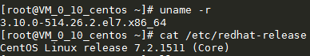

## 2.2.CentOS 6安装

如果在centOS 6安装Docker，前提是需要CentOS 6.5及以上版本。安装比较简单，但是不能安装Docker-CE版本(社区版)，因为它要求至少CentOS 7。

**安装步骤：**

①Docker使用EPEL发布，要确保已经安装EPEL仓库，执行命令： **yum install -y epel-release**

②安装docker，执行命令：**yum install -y docker-io**

③验证docker是否安装成功，执行命令：**docker version**

④查看docker安装后的配置文件：**cat /etc/sysconfig/docker**

⑤启动docker后台服务，执行命令：**service docker start**

## 2.3.CentOS 7安装

CentOS 7可以安装社区版的Docker-CE，官网安装教程：[https://docs.docker.com/install/linux/docker-ce/centos/](https://docs.docker.com/install/linux/docker-ce/centos/)，安装步骤：

①安装gcc环境，执行命令：

```bash
yum -y install gcc
yum -y install gcc-c++
```

②若之前安装过旧版本Docker，先卸载，执行命令：

```bash
 yum remove docker \
                  docker-client \
                  docker-client-latest \
                  docker-common \
                  docker-latest \
                  docker-latest-logrotate \
                  docker-logrotate \
                  docker-engine
```

③安装docker环境所需要的其它依赖：

```shell
yum install -y yum-utils device-mapper-persistent-data lvm2
```

④设置docker安装仓库，再从仓库安装和更新docker（推荐阿里云镜像）

```shell
yum-config-manager --add-repo \
    http://mirrors.aliyun.com/docker-ce/linux/centos/docker-ce.repo
##(官方仓库：https://download.docker.com/linux/centos/docker-ce.repo)
```

⑤更新yum软件包索引（速度会变快一些）

```shell
 yum makecache fast
```

⑥安装docker-ce

```shell
yum install -y docker-ce docker-ce-cli containerd.io
```

⑦启动docker

```shell
 systemctl start docker
```

⑧到这docker就安装完成了，可以使用docker version查看是否有信息打印。但是，需要额外配置[下载地址镜像](#2.4.镜像加速配置)，不然下载会很慢

## 2.4.镜像加速配置

Docker默认从Docker Hub下载镜像，速度太慢了，可以配置镜像解决。

### 2.4.1.阿里云镜像

①登录[https://dev.aliyun.com/search.html](https://dev.aliyun.com/search.html)，找到自己Linux系统，我的是CentOS7

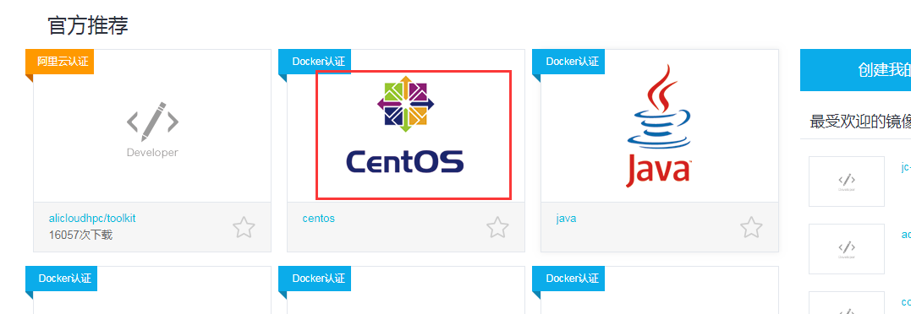

②点进去(需要先登录阿里云)，获取加速地址

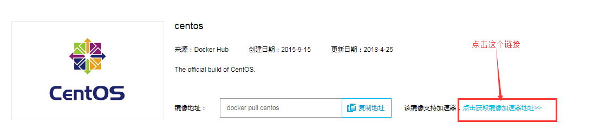

③拷贝这个加速地址，添加到Docker的配置文件：/etc/docker/daemon.json。（注意centOS 6.5的docker配置文件不在这，在/etc/sysconfig/docker）执行命令：**vim /etc/docker/daemon.json**，添加阿里云加速地址：`{"registry-mirrors":["https://new832iq.mirror.aliyuncs.com"}`

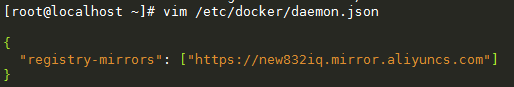

④重启Docker，会发现下载变快了

```shell
 systemctl daemon-reload
 systemctl restart docker
```

### 2.4.2.docker-cn镜像

也可以使用docker-cn中国官方镜像，将上面的镜像地址换为：`https://www.docker-cn.com/registry-mirror`

## 2.5.卸载

centOS 7上docker的卸载步骤：

①暂停docker运行：**systemctl stop docke**r

②卸载docker依赖包：**yum -y remove docker-ce**

③删除docker所有镜像、容器等：**rm -rf /var/lib/docker**

# 3.Docker命令

Docker官方命令大全：[https://docs.docker.com/engine/reference/commandline/docker/](https://docs.docker.com/engine/reference/commandline/docker/)

## 3.1.启动关停

①启动：systemctl start docker

②重启：systemctl restart docker

③关闭：systemctl stop docker

④守护进程重启：sudo systemctl daemon-reload

## 3.2.镜像命令

Docker的镜像默认是在[https://hub.docker.com/search/](https://hub.docker.com/search/)下载的。操作镜像的命令如下图所示：

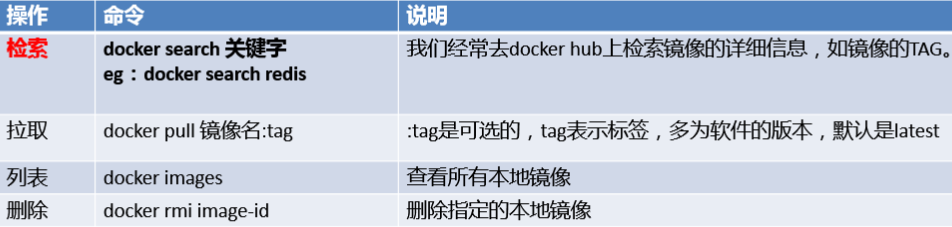

### 3.2.1.docker images

**描述：**查看本地已经下载好的全部镜像

**语法：**docker images [options]

**例子：**docker images

**返回结果：**

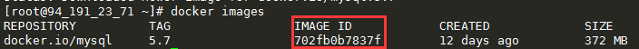

返回选项说明：

- REPOSIORY-表示镜像的仓库源；
- TAG-表示镜像的标签；

- IMAGE ID-表示镜像ID；CREATED-表示镜像创建时间；

- SIZE-表示镜像大小。同一镜像可以有多个TAG，代表这个镜像的不同个版本！

**额外参数：**

  -a，列出本地所有的镜像（包括中间映像层）

  -q，只显示镜像ID

  --digests，显示镜像的摘要信息

  --no-trunc，显示完整的镜像信息

### 3.2.2.docker search

**描述：**用来在docker hub中搜索对应的镜像

**语法：**docker search <镜像名称>

**例子：**docker search mysql ##搜索mysql

**返回结果：**

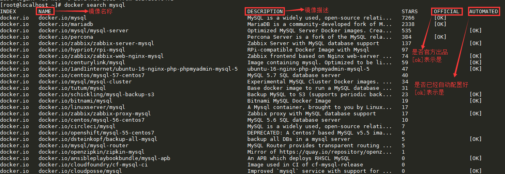

**额外参数：**

  --filter=stars，搜索出收藏数(STARS)不少于指定值的镜像

  --no-trunc，显示完整的镜像描述

  --automated，只列出automated build类型的镜像

### 3.2.3.docker pull

**描述：**下载对应的镜像

**语法：**docker pull <name>:<tag> #tag为版本，不加默认下载最新版

**例子：**docker pull mysql 或 docker pull mysql:5.7

**返回结果：**

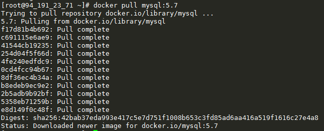

### 3.2.4.docker rmi

**描述：**删除本地已经下载好的镜像

**语法：**docker rmi <image_id> #镜像ID可从docker images获取到

**例子：**docker rmi 702fb0b7837f

**返回结果：**

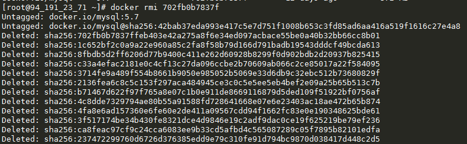

**补充：**

  删除多个镜像：`docker rmi -f mysql:5.7 tomcat`

  删除所有镜像：`docker rmi -f $(docker images -qa)`

### 3.2.5.docker history

**描述：**查看镜像的构建过程

**语法：**docker history <image_id> #镜像ID可从docker images获取到

**例子：**docker history 1e985c88d45b

**返回结果：**从下→上看

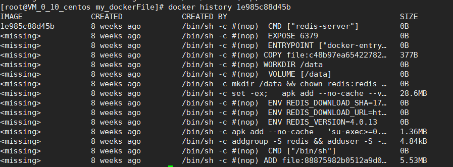

## 3.3.容器命令

将下载好的Docker镜像启动，就成为一个容器，操作容器的常用命令如下：

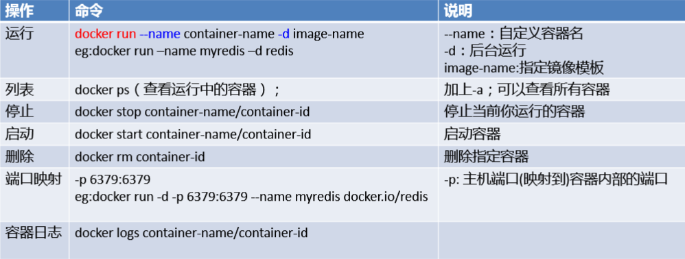

### 3.3.1.docker run

**描述：**将镜像打包成一个容器，同一个镜像可以打包成为多个容器

**语法：**`docker run [options] imageName \[command][args]`

①options说明（参数配置，只列出常用，有些一个减号，有些两个减号）：

- --name → 自定义的容器名

- -d → 后台启动镜像

- -i → 以交互模式运行容器，通常与-t同时使用，用于操作系统镜像等

- -t → 为容器分配伪输入终端，通常与-i同时使用，用于操作系统镜像等

- -P(大写) → 随机端口映射

- -p(小写) → 指定端口映射，有4种格式：

  - ip:hostport:containerPort

  -  ip::containerPort

  - hostPort:containerPort

  - containerPort

**例子：**docker run --name myTomcat -d -p 8888:8080 tomcat:8 (如果启动的镜像带标签，docker run命令也需要带标签)

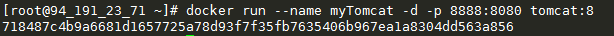

若启动的是操作系统，如centos，可以加上-it，以交互模式启动，可以与启动后的centos容器交互。若想退出，直接输入exit命令即可。

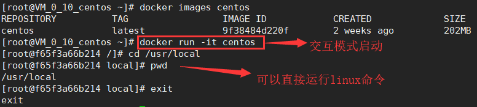

### 3.3.2.docker ps

**描述：**查看正在运行的容器/查看全部的容器

**语法：**docker ps [-a]

   		如果没有参数 -a ，则查看正在运行的容器

  		 如果加了参数 -a ，则查看docker全部的容器(包括没运行的)

**例子：**docker ps / docker ps -a

**返回结果：**

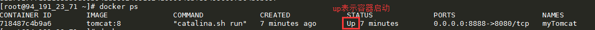

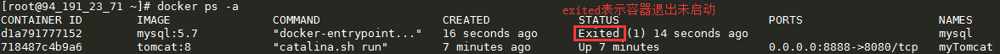

**额外参数：**

  -a，列出当期所有正在运行的容器+历史上运行过的

  -l，显示最近创建的容器

  -n，显示最近n个创建的容器

  -q，只显示容器编号

  --no-trunc，不截断输出

### 3.3.3.docker stop

**描述：**正常停止运行中的容器（比docker kill 温柔）

**语法：**docker stop <container_id>

  		 <container_id>即容器id，可以通过docker ps命令找到

**例子：**docker stop 718487c4b9a6

**返回结果：**

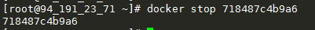

### 3.3.4.docker kill

**描述：**强制停止正在运行中的容器(比docker stop暴力)

**语法：**docker kill <container_id>

   		<container_id>即容器id，可以通过docker ps命令找到

**例子：**docker kill acf7f17cfb3a

**返回结果：**

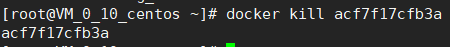

### 3.3.5.docker start

**描述：**将已经停止退出的容器重新启动，与[docker run](#3.3.1.docker_run)有区别

**语法：**docker start <container_id>

  		 <container_id>即容器id，可以通过docker ps命令找到

**例子：**docker start 718487c4b9a6

**返回结果：**

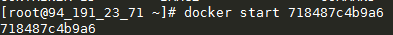

### 3.3.6.docker rm

**描述：**删除一个容器，此容器必须处于未启动状态

**语法：**docker rm <container_id>

   		<container_id>即容器id，可以通过docker ps命令找到

**例子：**

①删除单个容器：docker rm 718487c4b9a6

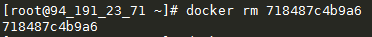

②结合docker ps命令，批量删除容器：docker rm \$(docker ps -qa)，使用$()符号可以将命令执行后的结果给当前命令使用，类似linux管道符

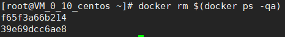

### 3.3.7.docker logs

**描述：**用来查看镜像启动成容器的日志

**语法：**docker logs <container_id>

**例子：**docker logs 0d26cf04636d


**额外参数：**

  -t，打印日志的加上时间戳

  -f，实时更新日志打印

  --tail \<number>，显示最后多少条日志

### 3.3.8.docker top

**描述：**查看容器内运行的进程（提个醒，容器相当于一个简易版的Linux系统）

**命令：**docker top <container_id>

**例子：**docker top 0fb62aab928b

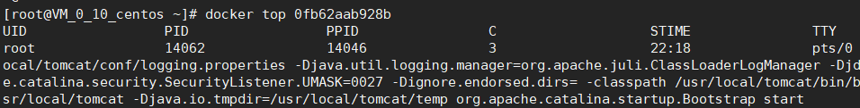

### 3.3.9.docker inspect

**描述：**查看容器内部细节，以JSON串格式返回容器的详细信息

**命令：**docker inspect <container_id>

**例子：**docker inspect 9acb51b1c8d3

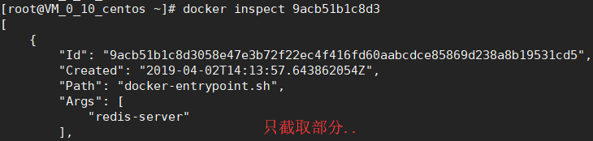

### 3.3.10.docker attach

**描述：**用在交互模式启动的容器，重新进入容器的终端

**命令：**docker attach <container_id>

**例子：**docker attach 4e9e1a62fc66

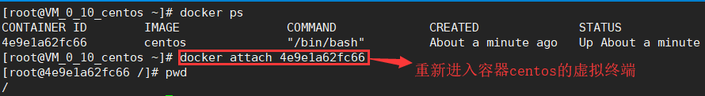

### 3.3.11.docker exec

**描述：**比docker attach功能强大，它也可以重新进入容器的终端，还可以直

​    		接在外部向容器内的终端执行命令后，将其返回（不用进入容器终端）

**命令：**docker exec <container_id> <shell>

**例子：**docker exec 4e9e1a62fc66 ls -l ##容器终端执行ls -l命令

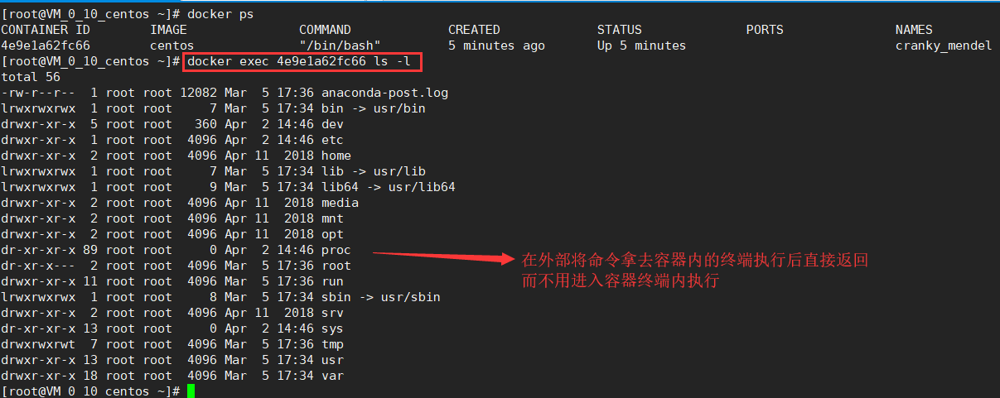

若想像docker attach一样进入到容器内的终端，可以执行：`docker exec -it <container_id> /bin/bash`

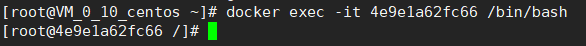

### 3.3.12.docker cp

**描述：**从容器内拷贝文件到外部宿主机上

**命令：**docker cp 容器ID:容器内路径 宿主机路径

**例子：**

  ```shell
## 将容器/tmp目录下的yum.log文件拷贝到外部主机的/home目录下
docker cp 4e9e1a62fc66:/tmp/yum.log /home
  ```

### 3.3.13.docker commit

**描述：**提交容器使其成为一个新的镜像

**命令：**docker commit <容器ID> <镜像名>:<标签名>

**参数：**-m，提交的描述信息；-a，作者

**例子：**`docker commit -a=”sym” -m=”test” d52498cea537 myTomcat:1.0`

### 3.3.14.重要说明

#### 3.3.14.1.1.docker后台模式机制

当使用docker run -d centos命令以后台模式启动centos镜像时，你去使用docker ps命令查看，会发现容器已经退出了！这是为啥？docker容器后台运行，就必须有一个前台进程，若容器运行的不是那种一直挂起的命令（如top、tail），它会自动退出。

这个是docker的机制问题，当我们以后台模式运行centos时，会导致docker前台没有运行的应用，容器启动后就会自动停止退出因为它发现自己没事干。所以，类似这样的容器（还有nginx），需要以前台进程的形式启动（在执行docker run命令时加上 -it 参数）

#### 3.3.14.2.退出交互模式

当我们以交互模式启动一个容器时（例如启动的centos操作系统），如果我们现在想退出交互模式，有两种操作：

①执行exit命令   -- 容器停止退出

②快捷键ctrl+P+Q   -- 容器不停止退出

# 4.Docker数据卷

docker容器运行产生的数据，若不通过docker images生成新的镜像，使数据作为镜像的一部分保存下来，那么当容器删除后，数据也会被删除。或者另外一种情况：容器之间可能需要共享数据。为了能保存容器运行产生的数据，即持久化，可以使用数据卷。

docker中的数据可以存储在类似于虚拟机磁盘的介质中，在Docker中称为数据卷（Data Volume）。数据卷可以用来存储Docker应用的数据，也可以用来在Docker容器间进行数据共享。数据卷呈现给Docker容器的形式就是一个目录，支持多个容器间共享

docker容器数据卷有2个功能：持久化、容器间继承+共享数据

## 4.1.创建数据卷

可以通过两种方式添加数据卷：

- 一是使用命令docker run -v

- 二是使用dockerFile

### 4.1.1.命令添加

使用[docker run](#3.3.1.docker_run)命令加上-v参数在启动镜像的同时可以添加一个数据卷，实现宿主机与docker容器的文件夹共享

**语法：**`docker run -it -v /<host_path>:/<container_path> image_id`

   		<host_path>，宿主机的文件夹路径

​			<container_path>，容器的文件夹路径

**例子：**

```shell
docker run -it -v /home/hostVolume:/dockerVolume centos
```

当执行上面的命令后，容器启动，docker会在宿主机和容器内都各自创建一个文件夹，并自动实时更新这两个文件夹内的数据，实现共享。我们可以通过[docker inspect](#3.3.9.docker_inspect)命令查看绑定关系。然后，我们在这两个文件夹的任意一个文件修改数据（例如创建、修改和删除文件），都会在另一个文件夹实时更新；而且，在容器停止后，对宿主机文件的修改操作会被保存，等到容器再次开启时，这些操作会被更新到容器内（这点像redis的RDB持久化）

**读写权限：**

如果要求对文件夹的读写权限做限制，例如只允许宿主机读写文件，容器只允许读文件，可以执行下面的命令：

```shell
docker run -it -v /home/hostVolume:/dockerVolume:ro centos
```

加上`:ro`即可，这样在容器中只允许读取文件，不允许修改、删除文件，一切写操作都在宿主机中执行！

### 4.1.2.dockerFile添加

dockerFile是描述docker镜像的一系列命令，利用它可以编译出一个镜像，所以我们可以在dockerFile中通过“**VOLUME**”命令指定数据卷路径，并使用此dockerFile编译出一个新的镜像，在镜像启动时，就会自动创建容器的数据卷文件夹（不过使用这种方式，宿主机的文件夹路径是默认的），步骤：

1. 任意目录下，创建一个文件(文件名随意)，添加dockerfile的命令：

```dockerfile
FROM centos
VOLUME ["/dataVolume1","/dataVolume2"]
CMD echo "finished...success"
CMD /bin/bash
```

其中，VOLUME命令就是用来创建数据卷的，但是它只能指定容器内的数据卷文件夹路径，至于与宿主机文件夹的绑定是docker默认指定的，我们可以在容器启动后用[docker inspect](#3.3.9.docker_inspect)命令查看

2. 创建完dockerFile后，可以使用build命令将其编译成一个镜像：

   **命令：**docker build -f <file_path> -t <image_name> <url>

   ​			<file_path>：是指定dockerFile的路径

   ​    		<image_name>：是指定编译后的镜像的名称

      		 \<url>：是指定编译后的镜像存放位置，一般为“.”即可

    **例子：`**docker build -f my_dockerFile -t mycentos .`

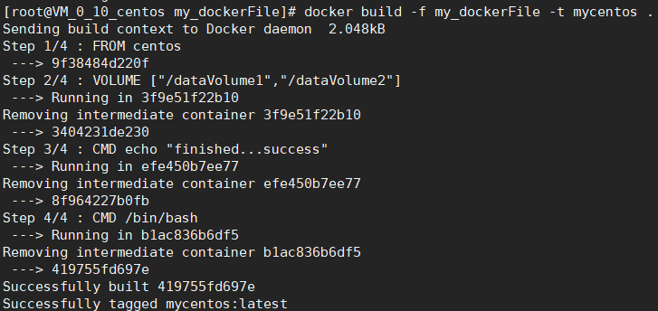

3. 镜像编译后可以用docker images查看，然后启动该镜像，他就会自动在容器中创建数据卷文件夹；接着，通过docker inspect命令查看宿主机文件夹绑定在哪里即可

## 4.2.数据卷容器

容器a挂载数据卷，其它容器通过挂载容器a实现数据共享，我们把容器a称之为数据卷容器。数据卷容器是实现docker容器之间的数据共享，且不会因为数据卷容器（容器a）的停止，而删除掉其它容器的数据。通过`docker run --volumes-from`命令，可以将一个容器挂载到数据卷容器上。步骤：

1. 启动数据卷容器，将其命名为dc01，其它容器挂载到它这里以实现数据共享 (注意：这里的镜像mycentos是之前使用[dockerFile](#4.1.2.dockerFile添加)构建编译后的)

   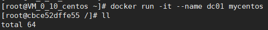

2. 启动容器dc02，将其挂载到dc01上，命令为：`docker run -it --name dc02 --volumes-from dc01 mycentos`

   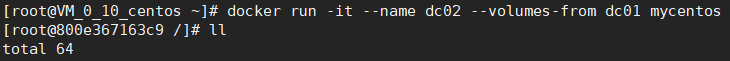

3. 启动容器dc03，将其挂载到dc01上，命令为：`docker run -it --name dc03 --volumes-from dc01 mycentos`

   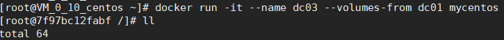

4. 测试：在dc01、dc02、dc03任意一个数据卷目录下创建文件，另外两个都会同步更新，即使把dc01容器停止并且删除掉，dc02和dc03数据卷目录下的文件仍然存在且仍可以同步更新。也可以再创建一个dc04，将其挂载到dc03上，dc04也会有完整的数据卷文件信息

   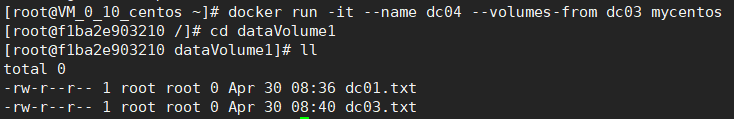

# 5.DockerFile

Dockerfile是由一系列命令和参数构成的脚本，它定义了进程需要的一切东西：执行代码、环境变量、依赖包、运行时环境、操作系统发行版、服务进程和内核进程等等。

Docker通过读取Dockerfile里面的内容可以自动build镜像image，可以理解为Dockerfile是一个包含了build过程中需要执行的所有命令的文本文件，或者是一种被Docker程序解释的脚本，由一条一条的指令组成，每条指令对应Linux系统下面的一条命令，由Docker程序将这些Dockerfile指令翻译成真正的Linux命令。

## 5.1.指令

|            |                                                              |
| :--------- | ------------------------------------------------------------ |
| **指令**   | **作用**                                                     |
| FROM       | 指定基础镜像，表示当前新镜像时基于哪个镜像的                 |
| MAINTAINER | 镜像维护者的姓名和邮箱地址                                   |
| RUN        | 容器构建过程，需要执行的linux命令                            |
| EXPOSE     | 当前容器对外暴露出的端口                                     |
| WORKDIR    | 指定在创建容器后，终端默认登录进来的工作目录，不指定则会进入到根目录 |
| ENV        | 设置一个环境变量，在构建镜像过程中，可以被多次调用，例如：  ENV path /home；RUN cd/$path  当镜像启动为容器时，容器会自动拥有设置的环境变量 |
| ADD        | 将宿主机目录下的文件拷贝进镜像且ADD命令会自动处理URL和解压tar压缩包 |
| COPY       | 类似ADD命令，拷贝文件或目录到镜像中，但是它不会自动处理URL和压缩包。语法为：COPY src dest |
| VOLUME     | 容器数据卷，用于数据保存和持久化  只能指定容器内的路径，宿主机相应的映射目录随机绑定 |
| CMD        | 指定容器启动时自动运行的命令，dockerfile允许有多个CMD命令，每个命令都会执行，后一个CMD命令会覆盖掉前一个CMD命令。且CMD命令会被docker run命令后面的参数替换掉 |
| ENTRYPOINT | 指定一个容器启动时要运行的命令，与CMD指令不同，它会拼接docker run命令后面的参数，而不是被其覆盖掉 |
| ONBUILD    | 当构建一个被继承的dockerfile时运行命令，父镜像在被子继承后父镜像的onbuild被触发 |

## 5.2.构建步骤

Dockerfile面向开发，Docker镜像成为交付标准，Docker容器涉及部署和运维。使用dockerfile，我们可以构建一个符合我们自身需求的docker image镜像。三大步骤为：

1. 编写dockerfile脚本，使用命令vim my_dockerFile，创建一个文本，在里面编写dockerfile指令，保存后退出

   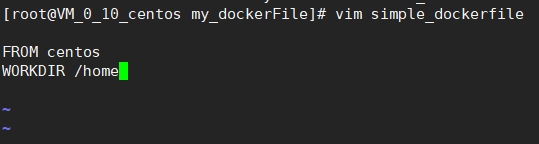


2. 编译dockerfile脚本构建镜像：

   **命令：**docker build -f <dockerFile文件路径> -t <镜像名> <编译目录>

    **例子：**docker build -f /home/simple_dockerfile -t mycentos .

    **注意：**上例的命令中有一个“.”表示编译到当前目录

   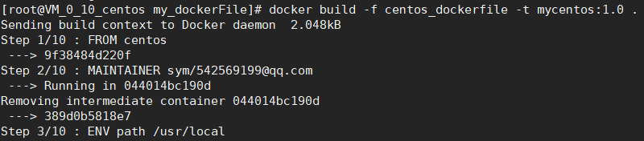

3. 运行镜像：当镜像编译成功，docker会给出信息，直接使用docker run命令就可以运行我们自定义的镜像

   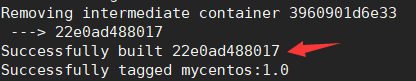

## 5.3.案例

1. 以dockerHub上的centos为基础（那时候载下来只有202MB），它是只保留内核，省略了很多功能，例如vim、ifconfig..我们要修改它，让它默认有 vim功能，且默认登录目录不再是根目录/，而是/usr/local。写法其一如：

   ```dockerfile
   FROM centos
   MAINTAINER sym/542569199@qq.com
   ENV path /usr/local
   WORKDIR $path
   RUN yum install -y vim
   RUN yum install -y net-tools
   EXPOSE 888
   CMD echo $path
   CMD echo "i love you more than three throusand times"
   CMD /bin/bash
   ```

2. 定义一个tomcat的docker镜像，dockfile为：

   ```dockerfile
   FORM cecntos
   MAINTAINER sym/542569199@qq.com	
   #把宿主机当前目录的jdk压缩包和tomcat压缩包拷贝进容器指定目录
   ADD jdk-8u171-linux-x63.tar.gz /usr/local/
   ADD apache-tomcat-9.0.8.tar.gz /usr/local
   #安装vim编辑器
   RUN yum install -y vim
   #设置初始访问目录
   ENV MYPTH /usr/local
   WORKDIR $MYPTH
   #配置java与tomcat环境变量，ENV设置的变量，容器启动后会自动拥有
   ENV JAVA_HOME /usr/local/jdk 1.8.0_171
   ENV CLASSPATH $JAVA_HOME/lib/dt.jar:$JAVA_HOME/lib/tools.jar
   ENV CATALINA_HOME /usr/local/apache-tomcat-9.0.8
   ENV CATALINA_BASE /usr/local/apache-tomcat-9.0.8
   ENV PATH $PATH:$JAVA_HOME/bin:$CATALINA_HOME/lib:$CATALINA_
   OME/bin
   #暴露端口
   EXPOSE 8080
   #启动容器时，运行tomcat
   CMD /usr/local/apache-tomcat-9.0.8/bin/startup.sh && tail -f 
   /usr/loca/ apache-tomcat-9.0.8/bin/logs/catalina.out
   
   ```

# 6.Docker常用安装

## 6.1.安装mysql

docker安装mysql太简单了，首先搜索dockerHub，然后pull下来即可。主要是启动时需要设置的参数：

```shell
docker run -p 3306:3306 
--name mysql 
-v /home/mysql/conf:/etc/mysql/conf.d 
-v /home/mysql/logs:/logs 
-v /home/mysql/data:/var/lib/mysql 
-e MYSQL_ROOT_PASSWORD=root -d mysql:5.7
```

**命令说明：**

- --name mysql，自定义启动的Mysql容器的名字

- -v /home/mysql/conf:/etc/mysql/conf.d，将宿主机/home/mysql/conf目录下的my.conf挂载到容器的/etc/mysql/conf.d

- -v /home/mysql/logs:/logs，将宿主机/home/mysql下的logs目录挂载到容器的/logs

- -v /home/mysql/data:/var/lib/mysql，将宿主机的/home/mysql/data目录挂载到容器的/var/lib/mysql目录下

- -e MYSQL_ROOT_PASSWORD=root，初始化root用户的密码

- -d mysql:5.7，后台模式启动mysql5.7镜像

## 6.2.安装redis

docker安装redis太简单了，首先搜索dockerHub，然后pull下来即可。主要是启动时需要设置的参数：

```shell
docker run -p 6379:6379
-v /home/redis/data:/data
-v /home/redis/conf:/usr/local/etc/redis/conf
-d redis:3.2 redis-server /usr/local/etc/redis/conf
--appendonly yes
```

**命令说明：**

- -v /home/redis/data:/data，通过查看redis官方镜像的dockerFile文件，发现它们配置的工作目录是/data，而且数据卷默认也是/data。所以我们将宿主机的/home/redis/data目录挂载到容器内的/data目录

- -v /home/redis/conf/redis.conf:/etc/redis/redis.conf，将宿主机/home/redis/conf目录下的redis.conf配置文件挂载到容器内的/etc/redis目录下的redis.conf文件（这样子我们在宿主机外配置redis.conf就可以在docker容器内按照这个配置文件启动redis服务）

- -d redis:3.2 redis-server /etc/redis/redis.conf，以后台模式启动redis:3.2这个镜像，并且在容器中用redis-server/etc/redis/redis.conf命令启动redis的服务（指定配置文件启动redis）

- --appendonly yes，启动redis的aof功能

# 7.补充

## 7.1.docker镜像加载原理

docekr的镜像实际上由一层一层的文件系统组成，这种层级的文件系统叫联合文件系统-unionFS。

bootfs（boot file system）主要包含bootloader和kernel。bootloader主要是引导加载kernel。linux刚启动时会加载bootfs文件系统，在dokcer镜像的最底层就是bootfs。这一层与我们典型的linux/unix系统是一样的，包含boot加载器和内核。当boot加载完成之后整个内核就都在内存中，此时内存的使用权已由bootfs转交给内核，此时系统也会卸载bootfs。

rootfs（root file system），在bootfs之上，包含的就是典型的Linux系统的/dev，/proc，/bin，/etc等标准目录和文件。rootfs就是各种不同的操作系统发行版，比如ubuntu，centOS等。

对于一个精简的os，rootfs可以很小，只需要包括最基本的命令、工具和程序库就可以，因为底层直接宿主机的kernel，docker自己只需要提供rootfs就行了，这就是为什么平时虚拟机安装的Linux都是好几个G，而docker只需要几百M的原因。