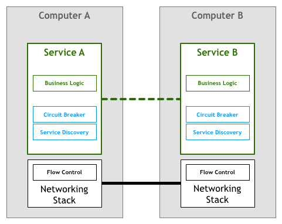
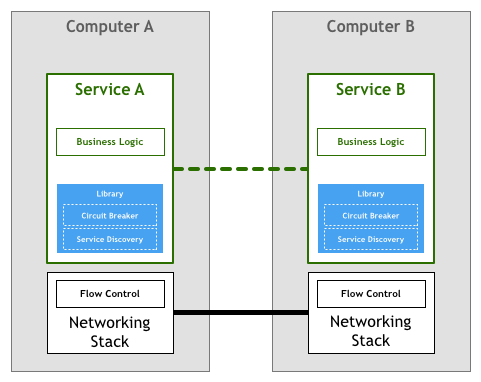
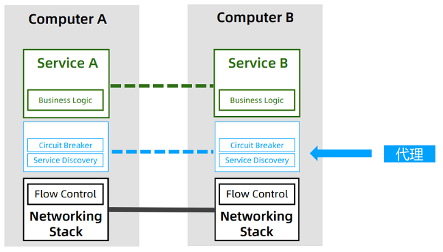

# 1.Service Mesh

service mesh，服务网格，被称为“第二代微服务”。也有开发者把 kubernetes、service mesh、serverless 这三者称为“云原生三驾马车”。**William Morgan**在2017年对service mesh最早给出了定义：

A service mesh is a dedicated **infrastructure layer** for handling service-to-service communication. It’s responsible for the reliable **delivery of requests** through the complex topology of services that comprise a modern, cloud native application. In practice, the service mesh is typically implemented as an array of lightweight **network proxies** that are deployed alongside application code, **without the application needing to be aware**. 

简单说：service mesh就是一个用来进行请求转发的基础设施层，通常以Sidecar形式部署并且对业务应用透明。

- 注：[服务网格模式](https://philcalcado.com/2017/08/03/pattern_service_mesh.html)
- 注：[service mesh最早定义](https://linkerd.io/2017/04/25/whats-a-service-mesh-and-why-do-i-need-one/)

## 1.1 产生与演进

Peter Deutsch 和 James Gosling 定义了分布式计算的 8 个谬误。这是许多开发人员对分布式系统做出的错误假设。从长远来看，这些通常被证明是错误的，导致难以修复错误

- 网络是可靠的
- 网络延迟为零
- 带宽是无限的
- 网络是安全的
- 网络拓扑不会改变
- 只有一个管理员
- 传输成本为零
- 网络是同构的

在大型应用中，服务是成千上万的，各个服务之间相互调用、数据交互，是容易产生网络问题的，所以微服务架构面临的最大痛点：**服务间的网络通信**。service mesh技术的产生就是为了解决这一痛点。

【演进过程】

- 第一阶段：网络控制逻辑和业务代码逻辑耦合

  

- 第二阶段：公共库。将网络通信的控制逻辑封装起来，比如hystrix、sentinel等框架（消除了代码重复，但还是会和业务代码耦合在一起，并且存在语言技术栈的成本问题、框架本身的部署成本）

  

- 第三阶段：代理模式。公共库不再和应用部署在同一个进程中，而是独立出来,比如Nginx（功能简陋但是方向正确）

  

- 第四阶段：边车模式，即sidecar。独立部署sidecar来处理所有的网络请求，再转发给应用本身。

  

【**最终形态**】

- 数据平面

- 控制平面

​	

## 1.2 核心功能

service mesh核心功能就是为了管理和控制微服务架构下的各个服务间的通信，包括：

- 服务注册、发现
- 路由、流量控制
- 弹性能力（熔断、超时、重试）
- 网络安全（认证、鉴权）
- 可观测性（指标收集、日志收集、分布式追踪）

## 1.3 产品实现

【技术标准】

service mesh目前存在两个标准：

- UDPA（universal data plane api）：统一的数据平面API
- SMI（service mesh interface）：统一的控制平面API

# 2.安装

- 下载：curl -L https://istio.io/downloadistio | sh -   （不指定版本会下载最新版，也可以指定：ISTIO_VERSION=1.5.1 sh -）

- 配置：加入下载后的目录，执行：export PATH=\$PWD/bin:$PATH。通过`istioctl version`验证
- 安装：使用 istioctl 安装，有如下的安装方式：
  - 默认安装：istioctl manifest apply
  - 选择profile：istioctl manifest apply --set profile=demo
  - 自定义安装选项：istioctl manifest apply --set addonComponents.grafana.enabled=true

其中 istio 支持的profile有：

- default：生产环境
- demo：展示、学习
- minimal：基本流控
- remote：多网格共享平面
- empty：自定义