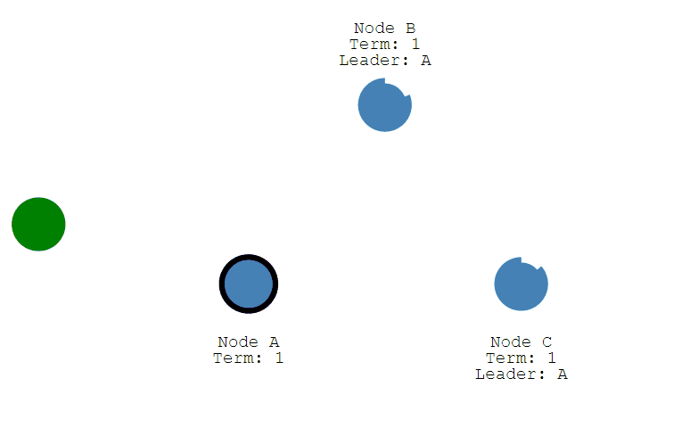

分布式共识算法（distributed Consensus）为了解决分布式环境中节点之间的数据一致性，衍生多个优秀的协议，诸如2PC、3PC、Paxos协议、Raft协议以及zookeeper专用的ZAB协议~

# 1.一致性

## 1.1.顺序一致性

顺序一致性，指的是对于所有操作，系统的执行顺序与操作的提交顺序相一致。也就是说，在分布式系统中，按照一定的顺序提交了一系列操作，那么系统就会按照相同的顺序执行这些操作。

实现顺序一致性，核心要义就是解决多个节点之间的通信和同步问题。通常采用的方式是使用共享的全局时钟或者通过一致性协议实现全局的操作顺序。

## 1.2.强一致性

强一致性（Strong Consistency）：强一致性要求在任何时间点，所有的节点或副本都能够看到相同的数据视图。在强一致性模型下，数据更新的操作顺序对于所有节点是一致的，所有节点都能够在同一时间点读取到相同的数据。强一致性提供了最严格的一致性保证，但可能对性能和可用性产生一定影响。

## 1.3.弱一致性

弱一致性（Weak Consistency）：弱一致性允许在分布式系统中的不同节点之间存在一段时间的数据不一致性。在弱一致性模型下，节点之间的数据同步可能存在一定的延迟，因此读取操作可能读取到不同节点的不同数据副本。弱一致性允许一定的容忍度，以提高系统的性能和可用性。

## 1.4.最终一致性

最终一致性（Eventual Consistency）：最终一致性是一种折中的一致性模型，它允许在一段时间内存在数据的不一致，但最终所有节点会达到一致的状态。在最终一致性模型下，系统保证在没有新的更新发生后，经过一段时间的同步和协调，所有节点最终会达到一致的状态。

## 1.5.因果一致性

因果一致性（Causal Consistency）：因果一致性是一种更为松散的一致性模型，它基于因果关系来定义操作的一致性。在因果一致性模型中，如果一个操作A在另一个操作B之前发生并对B有影响，那么任何观察到A的节点必须在观察到B之前观察到A的影响。因果一致性允许非相关的操作并发执行，但要求有因果关系的操作满足一致性要求。

## 1.6.原子一致性

原子一致性（Atomic Consistency）：原子一致性是指分布式系统中的操作要么全部成功执行，要么全部不执行。它要求在任何情况下都不会出现部分完成的操作结果。原子一致性是一种强一致性模型，通常与分布式事务一起使用，确保事务的原子性。

# 2.【Paxos协议】

Paxos算法是一种基于**消息传递**（分布式系统中的节点通信存在两种模型：共享内存（Shared memory）和消息传递（Messages passing））且具有高度容错特性的一致性算法，是目前公认的解决分布式一致性问题最有效的算法之一，但是它推导过程和证明过程太过复杂，这里就记录它的核心思想。在paxos算法中，定义了3个角色：Proposer、Acceptor和Learner，其中

1. Proposer：相当于议员，由它发起法案给Acceptor投票，它自己不参与投票;
2. Acceptor：相当于议会，接收Proposer的法案，进行投票；
3. Learner：既不发起法案也不参与投票，相当于会议的记录员。

也就是说，使用Paxos协议的分布式系统，在更改数据时候，都需要经过上面的一整套逻辑，完成每个操作需要至少两轮的消息交换 ，数据才能算更改成功。虽然严谨了，但是系统的复杂性提高了，且可用性降低了！

## 2.1.第一阶段

1. Proposer选择一个提案编号N，然后向半数以上的Acceptor发送编号为N的Prepare请求:

2. 如果一个Acceptor收到一个编号为N的Prepare请求，且N大于该Acceptor已经响应过的所有Prepare请求的编号，那么它就会将它已经接受过的编号最大的提案（如果有的话）作为响应反馈给Proposer，同时该Acceptor承诺不再接受任何编号小于N的提案。

## 2.2.第二阶段

1. 如果Proposer收到半数以上Acceptor对其发出的编号为N的Prepare请求的响应，那么它就会发送一个针对[N,V]提案的Accept请求给半数以上的Acceptor。注意：V就是收到的响应中编号最大的提案的value，如果响应中不包含任何提案，那么V就由Proposer自己决定；

2. 如果Acceptor收到一个针对编号为N的提案的Accept请求，只要该Acceptor没有对编号大于N的Prepare请求做出过响应，它就接受该提案

# 2.【Raft协议】

Raft是从paxos衍生出来的，它减少了paxos难以理解且难以实现的思想，是目前比较主流、使用广泛的共识算法。协同服务平台 etcd 和 Consul 都是使用的Raft算法，该算法中集群的节点有3种状态：

| **状态**  | **作用**                                                     |
| --------- | ------------------------------------------------------------ |
| Follower  | 接受并持久化Leader同步的日志，在Leader告之日志可以提交之后，提交日志 |
| Candidate | Leader选举过程中的临时角色                                   |
| Leader    | 接受客户端请求，并向Follower同步请求日志，当日志同步到大多数节点上后告诉Follower提交日志 |

## 3.1.概述

处于 raft 协议中的各个节点，**一开始都处于 Follower 状态**。当 Follower 没有收到 Leader 的心跳包时，它就会转变成 Candidate 状态，然后向集群中的其它节点发出投票请求（内容是选择它作为 Leader）。其它节点收到 Vote 请求后响应（内容是答应选择它作为 Leader），最终该节点就成为了 Leader，这一整个过程就称为 Raft协议的 Leader Election

当 Leader 节点选举成功后，后续对于数据更新的请求都会走到 Leader 节点上，每次更新都会作为一个条目保存到 Leader 的节点日志中。

- 当 client 向 Leader 发送【SET 5】请求时，Leader 执行请求但是不会提交（此时值未改变）；
- Leader 向它的 Follower 发送更新请求，Follower 收到更新后也不会提交，然后直接响应 Leader；
- Leader 收到大部分 Follower 响应后，就会提交日志，此时值在 Leader 节点中就已永久更新；
- 最后，Leader 向它的 Follower 发起提交日志请求， Follower 提交日志，整个集群重新处于一致性状态；
- 这一整个过程就叫做 Raft协议的 Log Replication。

## 3.2.Leader Election

在 Raft 协议中，有2个“超时”用来控制 Leader Election：

- election timeout：Follower 节点转变为 Candidate 状态的最大等待时间（150ms ~ 300ms）；
- HeartBeat timeout：Leader 与 Follower 心跳包交互的最大间隔时间；

**具体的选举过程如下所示：**

①当任意一个 Follower 达到 election timeout 时间就切换为 Candidate，然后开启一个新的选举任期：

②优先成为 Candidate 状态的节点（NodeA）会投自己一票，然后再向其它节点发出 Request Vote 请求。如果接收节点在这个任期内还没有投票，那么它就会投票给当前候选人，然后重置 election timeout。如果一个 Candidate 节点获取多数投票，它就成为 Leader。此时Node A 收到足够多的票数，它就成为这个选举任期的 Leader。

③ 成为 Leader 节点的 Node A 需要定时（heartbeat timeout设置）与它的 Follower 节点进行心跳包交互，一来是让 Leader 感知到 Follower的存在；二来是让 Follower 感知 Leader存在，然后重置自己的 election timeout。一旦 Follower 未收到 Leader 心跳包，然后它就会重新等待 election timeout 时间转变为 Candidate状态，开启新一轮的选举任期：

​	

④ 当 Leader 节点（Node A）宕机以后，其余 Follower 节点从未收到心跳包开始，经过 election timeout时间后，优先转变为 Candidate 状态的节点（Node C）发起新一轮的选举任期，同时它会投自己一票。同样的，其它Follower 节点收到 Vote 请求后会响应，当 C 收到足够多的票数后，它就成为新一任 Leader 节点（Term=2）

​	

⑤ 如果两个 Follower 节点的 Candidate tiemout时间恰巧一直，那么就可能出现分裂投票。节点B和D都开始同一个任期的选举，并且 election timeout 时间一样，这就导致节点B和D都各自收到2票，不满足最大票数，因此这两个节点都不能成为 Leader。那么，所有节点将等待新的选举并重试：

​	

## 3.3.Log Replication

当 Raft 集群选举出 leader 后，后续对这个集群的所有更新操作都要转发到 Leader 节点上，完成过程如下：

- clinet 发送数据更新给 Leader，即 Node-A；
- Node-A 收到 client 请求，将更改追加到它的日志上，注意日志未提交；
- Node-A 将这次改动同步给它的 Followers，一旦大多数 Follower 正确响应，那么此次更改就会被提交；
- Node-A 提交此次更改的日志，同时将结果响应给 client；
- Node-A 通知所有 Followers ，也让它们同样提交日志，此时整个集群又处于一致性状态。

log replication 的方式，同样适用于出现网络分区的异常情况。当出现网络分区时，节点A和B处于同一网络，节点BCD处于另一个网络。此时，整个raft集群被一分为二，并且由于 leader election 存在，最终会出现2个 Leader，如下图所示：

如果此时有多个客户端向这个 raft 集群交互（实际上它们已经一分为二，变为2个集群），那么一定会存在一个集群无法提交任务更新操作（因为它的 Follower数量不够），另一个集群由于存在足够数量的 Follower 节点，可以正常提交 commit log。当网络分区修复后，Node-B和Node-A都会收到来自Node-C的心跳请求，它们会发现Node-C的任期较高（Term=1），因此都会回滚其未提交的条目并匹配新 Leader 的日志（Node-B也会主动切换成 Follower 状态）

