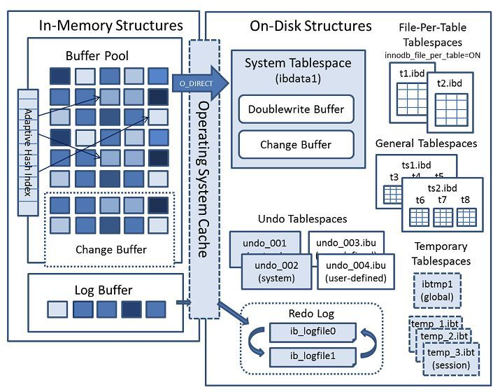
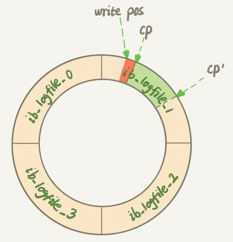
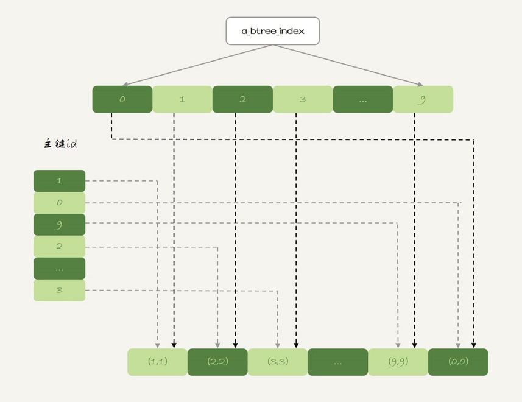
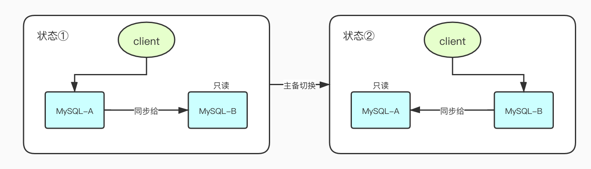
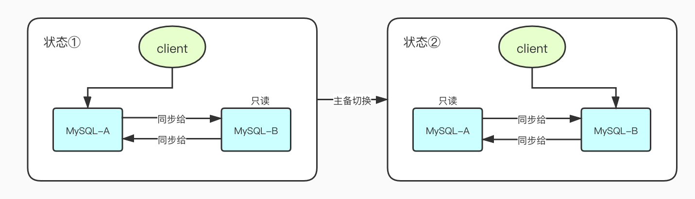
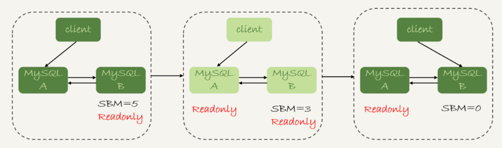

# 1.【MySQL概述】

## 1.1.体系结构

如下图，按照从上到下，从左到右的顺序，MySQL的结构大体上分为：

- 连接池组件
- 管理服务和工具组件
- SQL接口组件
- 查询分析器组件
- 优化器组件
- 缓冲组件
- 插件式存储引擎
- 物理文件


其中，比较突出的就是MySQL的可拔插存储引擎，是底层物理存储的实现。需要注意的是，**MySQL的存储引擎是基于表的，而不是基于数据库的**。除了常用的`InnoDB`外，还有这些常见的MySQL存储引擎：

- MyISAM：不支持事务，采用表锁设计，支持全文索引
- NDB：集群存储引擎，数据放置于内存中，可提供更高的可用性
- Memory：表中数据存放在内存中，采用哈希索引，适用于临时数据的临时表
- Archive：只支持insert和select操作，使用存储归档数据，提供高速的插入和压缩功能
- Federated：不存放数据，指向一台远程MySQL数据库服务器上的表
- Maria：支持缓存数据和索引文件，行锁设计，提供MVCC更，支持事务

## 1.2.常用日志

**mysql server**

- **binlog** - 归档日志，也称为二进制日志。主要存储行记录的变化，binlog文件写到一定大小后会切换到下一个，并不会覆盖以前的日志。binlog有3种数据格式：statement、row、mixed，其中statement会原封不动地记录执行的SQL语句，row会记录SQL执行前后的实际数据变化，而mixed是statement和row的结合。因为statement记录的是SQL，主从数据库执行SQL时有可能会造成数据不一样，而row格式会记录大量的实际数据，所以mysql设计了mixed格式，如果它觉得此次SQL不会造成主备不一致它就使用statement格式，反之使用row格式；
- **error log** - 错误日志。对mysql的启动、运行、关闭过程进行了记录，不仅记录了所有的错误信息，也记录了一些警告信息或正确的信息，可以通过`show variables like'log_error'`定位错误日志文件位置；
- **slow log** - 慢查询日志。通过参数`long_query_time`来设定一个阈值，默认为10，代表10秒。表示将运行时间超过该值（大于）的所有SQL语句都记录到慢查询日志中；

**InnoDB**

- **redo log** - 重做日志，InnoDB就可以保证即使数据库发生异常重启，之前提交的记录都不会丢失，这个能力称为**crash-safe**。重做日志是固定大小的，比如可以配置为一组4个文件，每个文件的大小是1GB，那么总共就可以记录4GB的操作。从头开始写，写到末尾就又回到开头循环写

## 1.3.SQL类别

SQL 语句，全称为Structure Query Language（结构化查询语言）主要分为以下 3 个类别：

- **DDL（Data Definition Language）语句：**数据定义语言，这些语句定义了不同的数据段、数据库、表、列、索引等数据库对象的定义。常用的语句关键字主要包括 create、drop、alter等

- **DML（Data Manipulation Language）语句：**数据操纵语句，用于添加、删除、更新和查询数据库记录，并检查数据完整性，常用的语句关键字主要包括 insert、delete、udpate 和select 等(增添改查）

- **DCL（Data Control Language）语句：**数据控制语句，用于控制不同数据段直接的许可和访问级别的语句。这些语句定义了数据库、表、字段、用户的访问权限和安全级别。主要的语句关键字包括 grant、revoke 

# 2.【InnoDB存储引擎】

## 2.1.体系结构

InnoDB存储引擎是MySQL在5.5.8版本之后默认使用的，特点是：支持事务，行锁设计，支持外键。InnoDB通过使用多版本并发控制（MVCC）获得高并发性，并且实现了SQL标准的4种隔离级别，默认为REPEATABLE级别。InnoDB的架构，包括两大部分，内存结构（In-Memory Structures）和磁盘上的结构（On-Disk Structures）



如果单看 InnoDB内存数据对象，就如下图所示：


### 2.1.1.后台线程

InnoDB有多个后台线程，负责处理不同的任务，大致上分为：

- **Master Thread**：将缓冲池的数据异步刷新到磁盘，包括脏页的刷新、合并插入缓冲、UNDO页的回收；
- **IO Thread**：InnoDB存储引擎使用AIO处理IO请求，IO Thread负责这些IO请求的回调处理
- **Purge Thread**：事务提交后，其undolog便失去作用，Purge Thread负责回收这些undo页；减轻Master Thread的工作
- **Page Cleaner Thread**：负责将脏页的刷新操作放入到单独的线程中，减轻Master Thread的工作

### 2.1.2.缓冲池

由于磁盘速度的影响，通常系统设计会用内存作为CPU和磁盘之间的纽带，也就是缓冲区，Buffer Pool就是Innodb 内存中的的一块比较大的区域，用来缓存表和索引数据。Buffer Pool可以加速SQL查询的效率，大小是由参数`innodb_buffer_pool_size`确定，一般建议设置成可用物理内存的60%~80%。如果是写操作，首先修改缓冲池的页，再通过Checkpoint机制刷回磁盘；如果是读操作，优先读取缓冲池中的页，若页不存在再去读取磁盘，然后将页保存到缓冲池中。正是由于每次都是基于内存来执行SQL，所以mysql的吞吐量很高！

Buffer pool是按照页（Page）来分配的，受到`innodb_page_size`控制，默认大小为16KB。Buffer pool存在3种类型的数据页，每一种页存在于它对应的链表：

- **free page**：空闲页，从未使用过的页，位于Free链表。当需要从缓冲池中取页时，先到Free List查找是否有可用的空闲页，若有则从Free List中删除，放入到LRU List中；否则从LRU List末尾删除页，将该内存空间分配给新读取的页，这一操作称为`page made young`；
- **clean page**：干净页，已被使用过的页，但是页数据未被修改，即页的数据和磁盘是一致的，处于LRU链表。随着程序的运行，缓冲池中的页会越来越多，因此InnoDB基于传统LRU算法，加入midpoint位置来管理缓冲池的页，这个算法称为`midpoint insertion strategy`，作用是：在原有LRU基础上，最新访问的页并不是直接放入到列表首部，而是放到midpoint位置
- **dirty page**：脏页，已被使用过的页，并且页数据已被修改，当脏页上的数据写入磁盘后，脏页又会变成干净页。脏页同时存在于LRU链表和Flush链表。LRU 链表中的页被修改后，该页就会变为脏页，意味着缓冲池和磁盘的页数据产生了不一致。InnoDB的方案是通过Checkpoint机制将脏页刷回到磁盘，这些脏页是存放在Flush List中，不过要注意的是，脏页既存在于Flush List，它还仍存放在LRU List中

InnoDB内存管理用的是最近最少使用 (Least Recently Used, LRU)算法，这个算法的核心就是淘汰最久未使用的数据。但是InnoDB的LRU算法跟基本的LRU算法不一样，原因之一就是：有些SQL查询的时候使用其它非活跃数据的辅助（比如索引和数据的扫描），如果直接将这些非活跃数据放到LRU列表首部，那么很有可能把真正活跃的热点数据挤出去！！那么业务查询的时候Buffer Pool的**内存命中率**将会急剧下降，磁盘压力就增加，SQL响应的速度就会变慢。在实现上，它按照5:3的比例把整个LRU链表分成了young区域和old区域。图中LRU_old指向的就是old区域的第一个位置，是整个链表的5/8处。也就是说，靠近链表头部的5/8是young区域，靠近链表尾部的3/8是old区域，中间这个LRU_old称为midpoint


改进后的LRU算法执行流程：

- 要访问数据页P3，由于P3在young区域，这种情况就和普通LRU算法一样，将其移到链表头部，变为状态2
- 如果后续访问到一个不存在当前链表的数据页，就会淘汰old区域中tail指针指向的数据页pm，然后再LRU_old指向的位置插入新的数据页px，如状态3所示
- 如果处于old区域的数据页，每次被访问的时候，做如下判断：
  - 若这个数据页在LRU链表中存在的时间超过1秒，将其移到链表头部
  - 若这个数据页在LRU链表中存在的时间短于1秒，位置保持不变。

通过命令可以查看LRU算法的两个核心配置，`innodb_old_blocks_pct`参数将LRU链表分为两部分，一部分是热点数据，一部分是冷数据，默值为37%表，表示old区域占比。`innodb_old_blocks_time`参数来控制成为热数据的所需时间，默认是1000ms，也就是1s，数据在1s内没有被刷走，就就会被移到young区。

```sql
mysql> show variables like '%old_blocks%';
+------------------------+-------+
| Variable_name          | Value |
+------------------------+-------+
| innodb_old_blocks_pct  | 37    |
| innodb_old_blocks_time | 1000  |
+------------------------+-------+
2 rows in set (0.01 sec)
```

### 2.1.3.重做日志缓冲

重做日志缓冲，redo log buffer，InnoDB首先将重做日志信息先放入到这个缓冲，然后按照一定频率将其刷新到重做日志文件。一般情况下，每一秒钟会将重做日志缓冲刷新到磁盘中，用户只需要保证每秒产生的事务量在这个缓冲大小之内即可

```sql
-- 默认是8MB
SHOW VARIABLES LIKE 'innodb_log_buffer_size'
```

在下列三种情况下，会将重做日志缓冲中的内容刷新到磁盘中：

- Master Thread每秒将重做日志缓冲刷新到磁盘中的重做日志文件
- 每个事务提交时会将重做日志缓冲刷新重做日志文件
- 当重做日志缓冲池剩余空间小于1/2时，重做日志缓冲刷新到重做日志文件

## 2.2.存储结构

所有数据都被逻辑存放到表空间（Tablespace）中，而一个表空间又可以分为段（Segment）、区（extent）、页（page），如下图所示：


### 2.2.1.表空间

默认配置，InnoDB存储引擎会使用一个共享表空间ibdata1，所有的表数据都会存放在这里。但如果用户启用了参数innodb_file_per_table，则每张表的数据都可以存放各自的表空间中。不过，每张表自己的表空间只存放数据、索引、插入缓冲Bitmap页。

### 2.2.2.段

表空间tablespace是由各个段segment组成，常见的段有：数据段、索引段、回滚段等。数据段为B+树的叶子节点，索引段位B+树的非叶子节点

### 2.2.3.区

每个段segment存在多个区extent，区是由连续的页组成的，每个区的大小固定为1MB，因为页的大小为16KB，所以一个区中一共会有64个连续的页。

### 2.2.4.页

页Page是InnoDB磁盘管理的最小单位，默认每个页的大小为16KB，InnoDB的数据是按数据页为单位来读写的。也就是说，当需要读一条记录的时候，并不是将这个记录本身从磁盘读出来，而是以页为单位，将其整体读入内存。在InnoDB中，每个数据页的大小默认是16KB。常见的页类型有：

- 数据页，B-tree Node
- undo页，undo log page
- 系统页，system page
- 事务数据页，Transaction system page
- 插入缓冲位图页，Insert Buffer Bitmap
- 插入缓冲空闲列表页，Insert Buffer Free List
- 未压缩的二进制大对象页，Uncompressed BLOB Page
- 压缩的二进制大对象页，compressed BLOB Page

## 2.3.关键特性

### 2.3.1.写缓冲(插入缓冲)

在mysql 5.5版本以前，支持insert操作，所以这个缓冲也称为`插入缓冲`，后面版本支持更多的操作类型缓存，改称为`写缓冲(change buffer)`。在InnoDB中，主键是行唯一的标识符，行记录的插入顺序是按照主键递增的顺序进行插入的，这种情况不需要读取其它页就可以完成insert操作；但是如果主键是UUID这种随机数，或者表中存在二级索引，InnoDB对这种数据的插入，必须离散地访问非聚集索引页，由于随机读取而导致插入性能下降。

基于这一考虑，InnoDB设计了change buffer，当需要更新一个数据页时，如果数据页在内存中就直接更新，而如果这个数据页还没有在内存中的话，在不影响数据一致性的前提下，InooDB会将这些更新操作缓存在change buffer中，这样就不需要从磁盘中读入这个数据页。然后，再以一定的频率将change buffer中的操作应用到原数据页，这一过程称为`merge`，通常能将多个插入`merge`到一个操作中（因为在一个索引页中），这就大大提高了对于非聚集索引插入的性能！这个设计思路和HBase中的LSM树有相似之处，都是通过先在内存中修改，到达一定量后，再和磁盘中的数据合并，目的都是为了提高写性能，具体可参考《[HBase LSM树](https://zhuanlan.zhihu.com/p/135371171)》

- **InnoDB在同时满足以下两个条件就会使用change buffer**
  
  - 索引是辅助索引（secondary index）
- 索引不是唯一（unique）的，唯一索引需要获取该页所有数据来加载判断是否存在
  
- **InnoDB有3种情况会触发merge操作**

  - 访问这个数据页会触发merge；

  - 系统有后台线程会定期merge；

  - 数据库正常关闭（shutdown）的过程中，也会执行merge操作；

- **change buffer执行流程**

  假设要向一张表中插入一条新纪录(id=4, value=400)，使用channge buffer的流程如下：

  第一种情况是，**这个记录要更新的目标页在内存中**。这时，InnoDB的处理流程如下：（区别不大）

  - 对于唯一索引来说，找到3和5之间的位置，判断到没有冲突，插入这个值，语句执行结束；
  - 对于普通索引来说，找到3和5之间的位置，插入这个值，语句执行结束。

  第二种情况是，**这个记录要更新的目标页不在内存中**。这时，InnoDB的处理流程如下：（区别大了）

  - 对于唯一索引来说，需要将数据页读入内存（走磁盘），判断到没有冲突，插入这个值，语句执行结束；
  - 对于普通索引来说，则是将更新记录在change buffer，语句执行就结束了。

- **merge执行流程**

  - 从磁盘读入数据页到内存（此时的数据页是旧数据）；
  - 从change buffer里找出这个数据页的change buffer记录（可能会有多个），依次执行这些记录，就会得到最新的数据页；

  - 写redo，此次写入包含了数据的变更和change buffer的变更；

  执行完前三步，merge流程结束。但是此时数据页和change buffer对应的的磁盘位置还没有修改，属于脏页，Innodb会通过两次写来将脏页刷入到磁盘中，当然这就是属于另一个过程；

- **实际场景**

  - 对于唯一索引来说，所有的更新操作都要先判断这个操作是否违反唯一性约束。必须要将数据页读入内存才能判断。如果都已经读入到内存了，那直接更新内存会更快，就没必要使用change buffer。

  - 对于写多读少的业务（账单类、日志类业务）来说，页面在写完以后马上被访问到的概率比较小，此时change buffer的使用效果最好；但是，如果一个业务的更新模式是写入之后马上会做查询，即使将更新先记录在change buffer，但之后由于马上要访问这个数据页，会立即触发merge过程，反而增加了change buffer的维护代价，从而起到了副作用

### 2.3.2.两次写

doublewrite，两次写，是InnoDB保证数据页落地到磁盘中的解决方案。假设，InnoDB存储引擎正在将数据页从缓冲池中写入到磁盘，刚写入4KB的时候就发生宕机，这种情况被称为部分写失效（partial page write）这是没办法通过重做日志（redo）进行恢复的，因为redo log要先对磁盘上的页进行读取，而现在是这个页已经损坏了。为了解决这个问题，InnoDB存储引擎开发了doublewrite功能，它的结构为：

- 处在内存中的doublewrite buffer，大小2MB
- 处于物理磁盘上共享表空间中连续的128个页，即2个extent，大小2MB


解决方案是这样：

- 在对缓冲池的数据页进行刷新的时候，并不会直接写到磁盘上，而是先将数据页复制到doublewrite buffer，再通过doublewrite buffer分两次，每次1MB顺序地写入共享表空间的物理磁盘上。最后同步磁盘，避免缓冲写带来的问题，由于是顺序写，开销并不会很大
- 完成doublewrite页的写入后，再将doublewrite buffer中的页写入到各个表空间文件中，此时写入就是离散写，开销变大；
- 如果将数据页刷新到磁盘的过程中发生了崩溃，InnoDB先从共享表空间中的doublewrite找到该页的一个副本，将其复制到表空间文件，再应用重做日志

### 2.3.3.自适应哈希索引

InnoDB会监控表上各索引页的查询，根据访问的频率和模式来自动地为某些热点页建立哈希索引，这个就称为自适应哈希索引，Adaptive Hash Index，AHI。哈希索引只能用来搜索等值的查询，且要求查询的条件是一样的。

### 2.3.4.异步I/O

InnoDB采用异步IO（Asynchronous IO，AIO）的方式来处理磁盘操作，现版本InnoDB采用了内核级别的AIO，称为Native AIO，它需要底层操作系统提供支持。AIO除了可以快速处理多个IO请求外（Sync IO，同步IO必须在一个页扫描完以后再进行下一次扫描），还可以进行IO Merge，将多个IO合并为1个IO。

### 2.3.5.刷新邻接页

Flush Neighbor Page，刷新邻接页。当刷新一个脏页时，InnoDB存储引擎会检测该页所在区（extent）的所有页，如果是脏页，那么一起进行刷新

### 2.3.6.Checkpoint机制

Checkpoint机制用来解决缓冲池跟磁盘之间的数据一致性问题。InnoDB对数据页的操作，都是先操作缓冲池，这就会引发一个问题：若每次数据页发生变化，InnoDB就将新的数据页刷入到磁盘中，会导致开销很大；但是，数据页不及时刷入到磁盘中，若数据库实例宕机，那么内存中的数据页就丢失了。为了避免这一问题，大部分事务数据库系统普遍使用`Write Ahead Log`策略（即WAL）：当事务提交时，先写重做日志(redo log)，再修改缓冲池的数据页，这样即使数据库实例宕机，也可以通过重做日志来恢复数据，当然如果连写入日志都失败了，那么这个事务肯定就是属于执行失败的情况了。

当**redo log写满**了，系统就会停止所有更新操作，把checkpoint往前推进：位置从CP推进到CP’，就需要将两个点之间的日志（浅绿色部分）对应的所有脏页都刷新到磁盘上。之后，图中从write pos到CP’之间就是可以再写入的redo log的区域：



# 3.【MySQL扩展点】

## 3.1.客户端数据传输

mysql服务端查询得到的数据，是如何发给mysql客户端的？答案是：**边读边发**。当执行器从存储引擎中获取到数据后，它会执行如下的步骤：

1. 获取一行，写到net_buffer中，这块内存的大小是由参数net_buffer_length定义的，默认是16k;
2. 重复获取行，直到net_buffer写满，调用网络接口发出去;
3. 如果发送成功，就清空net_buffer，然后继续取下一行，并写入net_buffer;
4. 如果发送函数返回EAGAIN或WSAEWOULDBLOCK，就表示本地网络栈（socket send buffer）写满了，进入等待。直到网络栈重新可写，再继续发送。


由于mysql是边读边发，所以如果客户端接收得慢，MySQL服务端由于查询结果发不出去，就会导致SQL的执行时间变长。在mysql服务通过执行`show processlist`，可以看到State状态有如下几种情况：

- Sending to client：表示正发送数据给客户端，如果一直处于这一状态就说明服务端的网络栈写满了，mysql服务端一直在等待客户端接收sql查询结果
- Sending data：当sql查询语句进入执行阶段时，state就会改为此状态，直到执行完成。

MySQL客户端发送请求后，接收服务端返回结果的方式有两种：

1. 一种是本地缓存，也就是在本地开一片内存，先把结果存起来。如果用mysql API开发，对应的就是`mysql_store_result` 方法。
2. 另一种是不缓存，读一个处理一个，如果用mysql API开发，对应的就是`mysql_use_result`方法。

MySQL客户端默认采用第一种方式，而如果加上–quick参数，就会使用第二种不缓存的方式。采用不缓存的方式时，如果本地处理得慢，就会导致服务端发送结果被阻塞，因此会让服务端变慢。**对于正常的线上业务来说，如果一个查询的返回结果不会很多的话，一般使用mysql_store_result这个接口，直接把查询结果保存到本地内存。**

## 3.2.临时表

在mysql中，临时表并不就是内存表，这两者是有区别的：

- **内存表**：是指用Memory引擎的表，建表语法为`create table ... engine=memory`。这种表的数据都存储在内存中，系统重启就会被清空，但是表结构还存在；

- **临时表**：可以使用各种引擎类型，建表语法为`create temporary table ...`。若使用innoDB引擎或MyISAM引擎的临时表，写数据的时候就会写到磁盘上；如果使用的Memory引擎，写数据的时候就只写到内存中。

临时表有如下几个特点：

1. 一个临时表只能被创建它的线程访问，对其它线程不可见；
2. 临时表可以与普通表同名，在磁盘存储上，临时表会加上额外标识
3. 一个线程内有同名的临时表和普通表时，`show create`语句，以及增删改查语句访问的是临时表；
4. `show tables`命名不会显示临时表；
5. 当线程断开（即session结束），会自动删除它创建的临时表；

每个线程都维护了自己的临时表链表。这样每次session内操作表的时候，先遍历链表，检查是否有这个名字的临时表，如果有就优先操作临时表，如果没有再操作普通表；在session结束的时候，对链表里的每个临时表，执行 “DROP TEMPORARY TABLE +表名”操作。只有当binlog_format=statment/mixed 的时候，binlog才会记录临时表的操作！！

## 3.3.内存表

内存表一般使用 Memory 引擎来构建，sql语法为`create table ... engine=Memory;`，而且InnoDB和Memory引擎的数据组织方式是不同的：

1. InnoDB引擎把数据放在主键索引上，其它索引上保存的是主键id。这种方式，称之为**索引组织表**（Index Organizied Table）
2. Memory引擎采用的是把数据单独存放，索引上保存数据位置的数据组织形式，这种称之为**堆组织表**（Heap Organizied Table）


内存表的数据以数组的方式单独存放，而在索引里，存的是每个数据的具体位置。很明显，主键id走的是hash索引，并且索引上的key并不是有序（InnoDB引擎用的B+树索引是有序的），但实际上，内存表也是可以支持B+树索引的，语法就是手动指定用的索引方式：

```sql
alter table t1 add index a_btree_index using btree (id);
```



内存表读写速度的原因有两个：其一，走内存比走磁盘块；其二，内存表直接hash索引，比B-tree索引快。不过生产环境上没人会用内存表来存储数据（除非一些作为中间过渡用的情况），主要是因为：

- 内存表不支持行锁，只有表锁。所以导致它的并发度并不高；
- 数据库重启时，所有内存表都会被清空。一旦线上环境搭建的是mysql高可用架构，在互为主备的部署模式下，mysql重启后会删除内存表，就会往binlog里面写入`delete from t1`，当这条语句传递给另一个master，就会把它自己库上的内存表t1删除，就会出现莫名其妙地，一个主库的内存表突然就被清空了！

## 3.4.自增主键

在mysql中，要使用自增主键的关键字是`AUTO_INCREMENT`，但是它只能保证**递增**，但是无法保证**连续递增**！！！自增值不会保存在表里，不同的存储引擎对于自增至的保存策略不同：

- MyISAM引擎的自增值保存在数据文件中；
- InnoDB引擎的自增值在MySQL8之前，都是保存在内存中（每次重启第一次打开表时，就去找max(id)，然后加1）；在之后的版本里，将自增值保存在redo log中；

**自增值修改机制**

1. 如果插入数据时主键字段为0、null或未指定，那么就将这张表的当前自增值填充到此次插入的数据中
2. 如果插入数据时主键字段有具体值X，当前自增值Y。若X<Y，自增值不变；若X &ge; Y，生成新的自增值。生成算法为：auto_increment_offset 和 auto_increment_increment是两个系统参数，分别用来表示自增的初始值和步长，默认值都是1。从auto_increment_offset开始，以auto_increment_increment为步长，持续叠加，直到找到第一个大于X的值，作为新的自增值。

**自增值不连续原因**

1. 唯一键冲突。因为自增值的生成，是在真正执行插入数据之前，如果语句插入的时候碰到唯一键冲突会执行失败，但是mysql不会把自增值还原，所以下一次语句插入的时候，就会拿到新的自增值，导致不连续发生；

2. 事务回滚。同上面一样，事务执行期间，自增值就已经生成，但是在事务回滚的时候，不会在还原自增值；

3. 批量申请自增id。mysql对申请自增主键id做了优化，对于同一个语句去申请自增id时，每次申请到的自增主键id个数是上一次的两倍。比如说：

   ```sql
   -- 先对表t插入4条数据
   insert into t values(null, 1,1);
   insert into t values(null, 2,2);
   insert into t values(null, 3,3);
   insert into t values(null, 4,4);
   
   -- 批量拷贝表t的数据到表t2
   create table t2 like t;
   insert into t2(c,d) select c,d from t;
   insert into t2 values(null, 5,5);
   
   -- insert…select实际上往表t2中插入了4行数据, 但这四行数据是分三次申请的自增id, 第一次申请到了id=1, 第二次被分配了id=2和id=3, 第三次被分配到id=4到id=7. 由于这条语句实际只用上了4个id, 所以id=5到id=7就被浪费掉了. 之后执行insert into t2 values(null, 5,5)语句时, 实际上插入的数据就是（8,5,5) 很明显自增主键的连续性就被破坏了
   ```

**自增锁优化**

不同事务在申请自增主键时，为了防止主键重复问题，肯定需要对自增值加锁，称为“自增id锁”。那么这个锁的释放时机是怎么样的？MySQL 5.1.22版本新增参数`innodb_autoinc_lock_mode`，用来控制自增锁的释放：

1. **值为0**，表示自增锁的范围是语句级别，即语句执行结束后才释放锁，当然这样会影响并发度
2. **值为1**（默认值），分为不同的情况：
   - 普通insert语句，自增锁在申请之后就立即释放；
   - 批量插入语句，例如：insert...select、replace...select、load data等，自增锁要等到语句结束后才释放；之所以要这样区分，是因为执行这种批量插入语句时，mysql预先无法知道要申请多少个自增id。

3. **值为2**，每次申请到自增值后就释放锁；

## 3.5.分区表

mysql分区表语法 — [官方文档](https://dev.mysql.com/doc/refman/8.0/en/partitioning-types.html)。mysql分区表就是将原先一张表的数据存储在物理磁盘的不同文件上，当使用InnoDB引擎时，如果分为4个分区，那么就会出现一个.frm文件和4个.ibd文件，其中每一个.ibd文件对应一个分区。使用mysql分区使用注意这几个点：

1. 在第一次打开分区表的时候，mysql需要访问所有的分区，因此如果要使用分区表，就不要创建太多的分区。也容易发生主从延迟；
2. 在server层（引擎层上面），认为这是同一张表，因此所有分区都会共有同一个MDL锁，那么在执行DDL语句时，一是执行起来耗时（需要到各个分区去修改），二是容易出现MDL锁冲突，即使它们位于不同的物理磁盘文件上；
3. 在引擎层，认为这是不同的表，因此MDL锁之后的执行过程，会根据分区表规则，只访问必要的分区；

4. 分区表的规则和分区需要预先设置好,否则后来进行修改也很麻烦；

## 3.6.GTID模式

MySQL 5.6版本引入了GTID，来解决寻找同步位点的问题。GTID的全称是Global Transaction Identifier（全局事务ID）是一个事务在提交的时候生成的，是这个事务的唯一标识。它由两部分组成，格式是：

```sql
-- server_uuid是一个实例第一次启动时自动生成的，是一个全局唯一的值;
-- gno是一个整数，初始值是1，每次提交事务的时候分配给这个事务，并加1; 注意：gno是在事务提交的时候才会分配
GTID=server_uuid:gno
```

在启动一个MySQL实例的时候，加上参数gtid_mode=on和enforce_gtid_consistency=on就可以开启GTID模式，那么在这个MySQL实例下，每个事务都会跟一个GTID一一对应，而GTID的生成方式由session变量gtid_next决定：

1. 若gtid_next=automatic，代表使用默认值。这时MySQL就会把server_uuid:gno分配给这个事务。记录binlog的时候，先记录一行 SET @@SESSION.GTID_NEXT=‘server_uuid:gno’，然后再把这个GTID加入本实例的GTID集合；
2. 若gtid_next=指定值，例如通过set gtid_next='current_gtid’指定为current_gtid，那么就有两种可能：
   - 如果current_gtid已经存在于实例的GTID集合中，接下来执行的这个事务会直接被系统忽略；
   - 如果current_gtid没有存在于实例的GTID集合中，就将这个current_gtid分配给接下来要执行的事务，但是gno不会加1，所以如果要执行下一个事务，就要执行set 命令，把gtid_next设置成另外一个gtid或者automatic；

# 4.【MySQL高可用】

mysql的高可用模式，其基本的原理就在于主从复制，而主从复制的关键就是binlog。

## 4.1.复制原理

以最简单的模型来看mysql的复制原理，那就是：slave会从master中拉取biglog进行数据同步。这其中两个关键线程，一个称为I/O thread，一个称为SQL thread，完整流程如下：

1. master将事务记录到二进制日志（binary log）这些记录称为二进制日志事件；
2. slave中的I/O thread将master的binary log拷贝到它的中继日志relay log；
3. slave中的SQL thread消费中继日志中的事件，将事务应用到自己的数据库中；


## 4.2.主备切换

mysql可以搭建成一主一从，也可以搭建成一主多从。其中，一主一从可以配置成普通一主一从的M-S结构，也可以配置成户为主备的双M结构。注意，**主备切换有可能是人为动作，比如数据库升级；也有可能是被动操作，例如master宕机，HA自动切换**。在进行主备切换的是，选取新的从机作为master，当然由于它们部署的模式不一样，进行主备切换的过程也不一样！

### 4.2.1.一主一从

- M-S结构

状态①中，客户端的读写都直接访问实例A，实例B作为A的备库，会将A的更新同步到它本地来执行。当需要切换的时候，就变成状态②，此时客户端读写访问的是实例B，而实例A作为B的备库。



- 双M结构

基于上面的M-S结构，让实例A和实例B互为主备关系，即实例A更新后的数据会同步给实例B，而且实例B更新后的数据也会同步给实例A，其中需要在实例B上配置`log_slave_updates=on`，表示备库执行relay log后也会生成binlog。但这样子就会有个问题，会出现一个循环复制的问题（即实例A同时是实例B的备库，相当于又把实例B新生成的binlog拿过来执行了一次）解决方案：

1. 规定两个库的server id必须不同，如果相同，则它们之间不能设定为主备关系；
2. 一个备库接到binlog并在重放的过程中，生成与原binlog的server id相同的新的binlog；
3. 每个库在收到主库发过来的日志后，先判断server id，若跟自己相同，表示这个日志是自己生成的，就直接丢弃这个日志；



在一主一从模式，不论是M-S结构，还是双M结构，在发生主备切换的时候，都需要将从库升级为备库，那么就会有一个问题，就是原先备库很有可能没有消费完主库的relay log，也就是存在主从延迟。由于主从延迟的存在，所以在主备切换的时候，就会有不同的策略：可靠性优先策略、可用性优先策略！！

**可靠性优先策略**

假设一开始主库是A，备库是B，当前从库B的主从延迟seconds_behind_master（简称SBM）为5s；

1. 判断备库B线程的延迟时间seconds_behind_master，如果小于某个值（比如5秒）执行第3步，否则持续重试当前这步；
2. 把主库A改成只读状态，即把readonly设置为true；
3. 判断备库B的seconds_behind_master的值，直到这个值变为0为止；
4. 把备库B改成可读写状态，即将readonly置为false；
5. 把业务请求切到备库B

在这个策略下，执行完第2步以后，主库A和从库B都处于readonly状态，表示系统处于不可写状态（可以理解成不可用），比较耗时间的是第3步，需要让备库慢慢消费binlog，这也是第一步为什么需要判断seconds_behind_master必须小于某一个值的原因！



**可用性优先策略**

在可靠性优先策略基础上，将第4步和第5步调整到最开始执行，也就是说不等主备数据同步，直接把连接切到备库B，并且让备库B可以读写，那么系统几乎就没有不可用时间了，这种可以称为可用性优先策略，而它的代价就是造成主备库数据的不一致。 

### 4.2.3.一主多从


一主多从的配置，主库负责所有的写入和一部分读，其它读请求交由从库分担。在主库发生故障后，MySQL-A`将成为新的主库，它相较于一主一从的复杂性在于从库B、C、D都要重新设置主库。

**①基于位点的主备切换**

为各个从库设置新的主库时，实际上需要执行`change master`命令：

```sql
CHANGE MASTER TO 
MASTER_HOST=$host_name--新主库的IP
MASTER_PORT=$port --新主库的端口
MASTER_USER=$user_name --新主库的用户名
MASTER_PASSWORD=$password --新主库的密码
MASTER_LOG_FILE=$master_log_name 
MASTER_LOG_POS=$master_log_pos 
```

最后两个参数`MASTER_LOG_FILE`和`MASTER_LOG_POS`表示，要从主库的master_log_name文件的master_log_pos这个位置的日志继续同步，即主库对应的文件名和日志偏移量，这个位置就称为**位点**！但位点的确定是不准确的，因为在最开始的时候，每个从库消费原主库binlog的速度不一样，那就说明它们的位点都不一样。所以，在寻找位点的时候，必须要找到比较靠前的位置，然后再判断那些已经在其它从库执行过的事务。一个定位同步位点的方式：

1. 等待新主库A’把中转日志（relay log）全部同步完成；

2. 在A’上执行show master status命令，得到当前A’上最新的File 和 Position；

3. 取原主库A故障的时刻T；

4. 用mysqlbinlog工具解析A’的File，得到T时刻的位点。

   ```basic
   mysqlbinlog File --stop-datetime=T --start-datetime=T
   ```

正是由于各个从库的位点都不一样，所以在同步的时候，就有可能发生重复数据的处理：Duplicate entry ‘id_of_R’ for key ‘PRIMARY’，所以在切换过程中，就需要主动跳过这些错误，可以有两种做法：

- 主动跳过一个事务，命令为

  ```sql
  set global sql_slave_skip_counter=1;
  start slave;
  ```

- 设置跳过指定的错误，通过参数slave_skip_errors配置。例如：1062错误是插入数据时唯一键冲突、1032错误是删除数据时找不到行，可以把slave_skip_errors 设置为 “1032,1062”，这样中间碰到这两个错误时就直接跳过，但同步完以后需要重置这个参数！！

**②GTID的主备切换**

通过[GTID](#3.6.GTID模式)来确定同步点，每个MySQL实例都维护了一个GTID集合，用来对应“这个实例执行过的所有事务”。在GTID模式下，备库B要设置为新主库A’的从库的语法如下：

```sql
CHANGE MASTER TO 
MASTER_HOST=$host_name 
MASTER_PORT=$port 
MASTER_USER=$user_name 
MASTER_PASSWORD=$password 
master_auto_position=1 
```

master_auto_position=1就表示这个主备关系使用的是GTID协议，就不再需要指定两个参数`MASTER_LOG_FILE`和`MASTER_LOG_POS`。假设在MySQL-A宕机后，实例A’的GTID集合记为set_a，实例B的GTID集合记为set_b，实例B切换主机的逻辑如下：

1. 实例B指定主库A’，把set_b发送给主库A’
2. 实例A’算出set_a与set_b的差集，也就是所有存在于set_a，但是不存在于set_b的GITD的集合，判断A’本地是否包含了这个差集需要的所有binlog事务:
   - 如果不包含，表示A’已经把实例B需要的binlog给删掉了，直接返回错误；
   - 如果确认全部包含，A’从自己的binlog文件里面，找出第一个不在set_b的事务，发给B；

## 4.3.主从延迟

主从延迟是没办法避免的，其主要时间点有3个：

1. 主库A执行完一个事务，写入binglog，这个时刻记为T1；
2. binlog传给备库B，备库B接收到这个binlog的时刻记为T2；
3. 备库B执行完这个事务，这个时刻记为T3；

mysql中的主从延迟，就是同一个事务，在备库执行完成的时间点和在主库执行完成的时间点之间的差值，就是T3-T1。通过在备库上执行`show slave status`命令，其返回结果上会显示`seconds_behind_master`，用来表示当前备库延迟了多少秒。实际上，排除掉网络异常的情况（一般这种原因比较少）主从延迟的时间主要是：**备库消费中转日志（relay log）的速度，比主库生产binlog的速度要慢**！！

### 4.3.1.原因

1. 大部分公司部署主从，都会让备库所在机器的性能比主库所在的机器性能差（省钱嘛）。但如果在互为主备模式下，备库随时可能变成主库，所以主备库选用相同规格的机器，并且做对称部署，这种模式下，这一点就可以不用考虑；

2. 备库的压力大。大多数请求都会直接交由备库执行，当备库上的查询耗费了大量的CPU资源，就会造成主备延迟。这种情况下可以多接几个备库，让备库来分担读的压力；
3. 大事务。如果一个事务在主库都执行了5分钟，那么当这个事务的binlog传给备库时，备库肯定也要执行5分钟，那么就会导致主从延迟了5分钟；
4. 大表DDL。大表的DDL语句其实跟大事务的延迟原因是一样的，都是执行起来比较耗时；
5. 备库的并行复制能力；

### 4.3.2.方案

- 强制走主库：必须获取最新结果的请求，强制转发到主库上；其它请求将其转发到从库上。
- sleep方案：主库更新完以后读从库之前，假装sleep一下，模拟等待主从延迟，这种方案简单但是不精确，不过可以用。
- 判断主备无延迟
  - ①判断seconds_behind_master，这个值为0表示主从延迟为0秒，从库才可以执行查询请求（不过不准确）；
  - ②对比位点确保主备无延迟：Master_Log_File和Read_Master_Log_Pos表示主库的最新位点；Relay_Master_Log_File和Exec_Master_Log_Pos表示备库执行的最新位点。只有这两组值分别相等，从库才可以执行查询请求；
  - ③对比GTID集合确保主备无延迟：前提Auto_Position=1 ，表示这对主备关系使用了GTID协议。Retrieved_Gtid_Set是备库收到的所有日志的GTID集合；Executed_Gtid_Set是备库所有已经执行完成的GTID集合。只有这两个集合相同，从库才可以查；
- 配合semi-sync方案：
  - 半同步复制，也就是semi-sync replication。每次事务提交的时候，主库把binlog发给从库，从库收到binlog以后，返回主库一个ack，主库收到ack以后，才给客户端返回事务提交。启用了semi-sync，就表示所有给客户端发送过确认的事务，都确保了备库已经收到了这个日志
- 等主库位点方案：...
- 等GTID方案：...

## 4.4.并行复制

在官方的5.6版本之前，MySQL只支持单线程复制，由此在主库并发高、TPS高时就会出现严重的主备延迟问题。在从单线程复制到多线程复制的演变过程中，最核心的点就是要符合下面的模型：


在并行复制的模型下，由原先的一个sql thread，变成了多个worker thread（也就是说有多个线程来执行中继日志），work线程的个数，就是由参数slave_parallel_workers决定的。那么问题就来了，原先一个事务交由一个sql thread执行就可以保证一致性，但是现在变为多个线程，就会存在多线程问题，即事务执行顺序的问题。所以在分发binlog的时候，一定需要满足以下两个基本要求：

- 更新同一行的两个事务，必须被分发到同一个worker中；
- 同一个事务不能被拆开，必须放到同一个worker中

### 4.4.1.复制机制

mysql支持多种复制机制：异步复制、半同步复制和并行复制。

- **异步复制**

  异步复制是mysql自带的最原始的复制方式，主库和备库成功建立起复制关系后，在备库上会有一个IO线程去主库拉取binlog，并将binlog写到本地，称为Relay log。然后备库会开启另外一个SQL线程去读取回放Relay log，通过这种方式达到Master-Slave数据同步的目的。

- **半同步复制**

  异步复制会产生主从延迟问题，半同步复制就是为了解决数据一致性而产生的。理解啥是半同步复制，可以先了解下同步复制：一个事务在Master和Slave都执行后，才返回给用户执行成功（其实就是2PC协议）；MySQL只实现了本地redo-log和binlog的2PC，Slave在接收到日志后就响应Master（数据还未执行），这种就称为半同步复制。目前实现半同步复制主要有两种模式，AFTER_SYNC模式和AFTER_COMMIT模式。两种方式的主要区别在于是否在存储引擎提交后等待Slave的ACK。

- **并行复制**

  半同步复制可以解决数据一致性的问题，但是性能变低了，Master产生binlog的速度远远大于Slave SQL线程消费的速度，照样产生主从延迟。所以需要让Slave并行复制，可以IO线程并行，也可以SQL线程并行。并行IO线程，可以将从Master拉取和写Relay log分为两个线程；并行SQL线程则可以根据需要做到库级并行，表级并行，事务级并行。库级并行在mysql官方版本5.6已经实现；

  SQL并发复制需要保证事务有序进行。Slave必需保证回放的顺序与Master上事务执行顺序一致，因此只要做到顺序读取binlog，将不冲突的事务并发执行即可。对于库级并发而言，协调线程（coordinator）要保证执行同一个库的事务放在一个工作线程串行执行；对于表级并发而言，协调线程要保证同一个表的事务串行执行；对于事务级而言，则是保证操作同一行的事务串行执行。

### 4.4.2.实现方式

**①按表分发策略**

如果两个事务更新不同的表，它们就可以并行；如果有跨表的事务，需要综合考虑两张表。所以在实现上，可以让每个worker维护一个hash表，用来保存这个worker正在执行的事务所涉及的表。hash表的key为“库名+表名”，value为数字表示有多少个事务修改这个表。每当coordinator将一个事务分配给worker，事务涉及的表就会添加到worker上的hash表上，事务执行完成，就将value减一，若剪完后值为0，就将整个key删除掉。因此，每个事务在分发的时候，跟worker的冲突情况只有3种：

1. 如果事务跟所有worker都不冲突（即hash表都没有这个事务涉及的表），coordinator线程就将事务分配给最空闲的worker；
2. 如果只跟一个worker冲突（即事务涉及的表有在worker的hash表中，且这个worker数量为1），coordinator线程就将这个事务分配给存在冲突关系的worker；
3. 如果跟多于一个worker冲突，coordinator线程就会进入等待状态，直到和这个事务存在冲突关系的work只剩下一个；

这个按表分发的方案，在多个表负载均匀的场景里应用效果很好。但是，如果碰到热点表，比如所有的更新事务都会涉及到某一个表的时候，所有事务都会被分配到同一个worker中，就变成单线程复制了

**②按行分发策略**

按表分发策略没办法解决热点表的问题，因此就需要将事务分发再细粒度化，那就是按行分发。如果两个事务没有更新相同的行，它们在备库上可以并行执行（前提是binlog格式要为row），此时判断事务与worker是否存在冲突，就不是按照表，而是按照行！

按行复制和按表复制的数据结构差不多，也是为每个worker，分配一个hash表。只是要实现按行分发，这时候的key，就必须是“库名+表名+索引a的名字+a的值”。相比于按表并行分发策略，按行并行策略在决定线程分发的时候，需要消耗更多的计算资源。

**③按库分发**

官方MySQL5.6版本，支持了并行复制，只是支持的粒度是按库并行，用于决定分发策略的hash表里，key就是数据库名。但是，如果的主库上的表都放在同一个DB里面，这个策略就没有效果了；或者如果不同DB的热点不同，比如一个是业务逻辑库，一个是系统配置库，那也起不到并行的效果！

**④MariaDB基于组分发策略**

mysql为了降低磁盘的IOPS，它在将redo log从操作系统的page cache刷新（fsync）到磁盘时，采用了组提交的技术。换句话说，能够在同一组里提交的事务，一定修改同一行，因为你的事务还没提交，锁没释放，其它事务肯定执行不了，那就到不了组提交的步骤。在实现上，可以参考MariaDB的实现方式：

1. 在一组里面一起提交的事务，有一个相同的commit_id，下一组就是commit_id + 1，在保存binlog时将commit_id一起保存进去；
2. 传到备库执行realy log时，相同commit_id的事务分发到多个worker执行；
3. 等到这一组全部执行完成以后，coordinator再去取下一批。

但实际上，这种模式并不是真正的模拟主库并发。因为，主库提交完一组事务后，其实下一组事务是同时处于“执行中”的状态。但是等到备库上执行时，要等第一组事务完全执行完以后，第二组事务才能开始执行，实际上就变成了“组串行执行”

**⑤MySQL 5.7 并行复制策略**

在MariaDB并行复制实现之后，官方的MySQL5.7版本也提供了类似的功能，由参数slave-parallel-type来控制并行复制策略：

- 配置为DATABASE，表示使用MySQL 5.6版本的按库并行策略；
- 配置为 LOGICAL_CLOCK，表示的就是类似MariaDB的策略，不过它不会等到commit阶段，而是在redo log prepare阶段；

同时处于“执行状态”的所有事务，不可以并行处理，因为这里面可能存在由于锁冲突而处于锁等待状态的事务。实际上，事务已经通过锁冲突校验的状态，不一定要等到commit阶段，而是只要能够到达redo log prepare阶段。所以，MySQL 5.7并行复制的思想：

1. 同时处于prepare状态的事务，在备库执行时是可以并行的；
2. 处于prepare状态的事务，与处于commit状态的事务之间，在备库执行时也是可以并行的

**⑥MySQL 5.7.22 并行复制策略**

MySQL 5.7.22版本里，MySQL增加了一个新的并行复制策略，基于WRITESET的并行复制，新增了一个参数binlog-transaction-dependency-tracking，用来控制是否启用这个新策略。这个参数的可选值有以下三种：

- COMMIT_ORDER，跟之前一样，根据同时进入prepare和commit来判断是否可以并行的策略；
- WRITESET，表示的是对于事务涉及更新的每一行，计算出这一行的hash值，组成集合writeset。如果两个事务没有操作相同的行，也就是说它们的writeset没有交集，就可以并行；
- WRITESET_SESSION，是在WRITESET的基础上多了一个约束，即在主库上同一个线程先后执行的两个事务，在备库执行的时候，要保证相同的先后顺序；

为了唯一标识，这个hash值是通过“库名+表名+索引名+值”计算出来的。如果一个表上除了有主键索引外，还有其他唯一索引，那么对于每个唯一索引，insert语句对应的writeset就要多增加一个hash值。这种实现方式就是跟前面的按行分发策略一样，不过MySQL官方实现有很大的优势：

1. writeset是在主库生成后直接写入到binlog里面的，在备库执行的时候，不需要解析binlog内容，节省了很多计算量；
2. 不需要把整个事务的binlog都扫一遍才能决定分发到哪个worker，更省内存；
3. 由于备库的分发策略不依赖于binlog内容，所以binlog是statement格式也是可以的

## 4.5.一主一从配置

一主一从常见配置，以window下的MySQL为主机，配置文件为my.ini，以Linux下的MySQL为从机，配置文件为my.cnf ，准备工作为：

- 主机和从机的MySQL版本要一致；

- 主机和从机都配置在相应配置文件的`[mysqld]`结点下，都是小写；

- 主机和从机相互ping通；

### 4.5.1.配置

- master

  ```ini
  # 指定服务器唯一id, 范围[1,32], 必须配置
  server_id=1 
  
  # 开启bin-log功能
  log_bin=mysql-log-bin
  
  # 选择 ROW 模式
  binlog_format=ROW 
  
  # 指定要同步的数据库, 建议加上(如果省略，默认操作整个mysql)
  binlog_do_db=sym_test
  
  #指定不要同步的数据库，如果指定了binlog-do-db就不用再指定该项
  #binlog_ignore_db=mysql
  
  #是否只读，主机读写都可以
  read-only=0
  ```

- slave

  ```ini
  # 从机是放在linux系统下，所以配置文件是my.cnf
  # 指定服务器唯一id, 范围[1,32], 必须配置
  server_id=2
  
  # 开启中继日志
  relay_log=relay-log  
  
  # 指定要同步的数据库
  replicate_do_db=sym_test
  
  #指定不要同步的数据库
  #replicate_ignore_db=mysql  
  
  #是否只读，从机一般只读
  read-only=1
  ```

### 4.5.2.启动

- master

  ```sql
  -- 为从库生成账户: salve/slave123
  grant replication slave on *.* to 'slave'@'127.0.0.1' identified by 'slave123' ;
  
  -- 刷新权限
  flush privileges;
  
  -- 查看权限
  select * from mysql.user;
  
  -- 查看binlog记录，后面从库需要根据这个配置开启复制
  show master status;
  ```

  1. 主从配置文件改过以后，都重启后台mysql服务;

  2. 主从都关闭防火墙；（window手动关闭，linux用命令：service iptables stop）

  3. 主机上建立账户并授权slave

     grant replication slave on *.* to【账户名】@【从机IP】 identified by '密码';

     (从机如果很多，可以直接用”%”替代，表示任意ip)，如：

     ```sql
     grant replication slave on *.* to 'zhangsan'@ '192.168.1.1' identified by '123';
     ```

  4. 查询master状态，记录File和position的值

     ```sql
     show master status;
     ```


- slave

  1. 从机重新启动后需要连接到主机上，通过执行sql：

  ```sql
  change master to master_host='主机ip',master_port='主机端口',
  master_user='主机授权的用户名',master_password='密码',
  master_log_file='mysqlbin.具体数字',
  master_log_pos=具体值;
  ```

    (需要参照上面的第3、第4步) 如：

  ```sql
  change master to master_host='127.0.0.1',master_port=3308,
  master_user='slave',master_password='slave123', 
  master_log_file='mysql-log-bin.000035',
  master_log_pos=341;
  ```

  2、启动从机Mysql上的复制功能

   ```sql
   start slave;
   ```

  3、查询从机状态，

  ```sql
  show slave status;
  ```

    如果下面2个参数值都为yes，则说明配置正确：

  ```tex
  slave_io_running:yes
  slave_sql_running:yes
  ```

### 4.5.3.停止

在从机mysql上执行sql：

```sql
stop slave;
```

# 5.【补充】

## 5.1.mysqldump

使用mysqldump命令将数据导出成一组INSERT语句，命令如下：

```shell
mysqldump -h$host -P$port -u$user --add-locks=0 --no-create-info --single-transaction  --set-gtid-purged=OFF db1 t --where="a>900" --result-file=/client_tmp/t.sql
```

主要参数含义如下：

1. –single-transaction的作用是，在导出数据的时候不需要对表db1.t加表锁，而是使用START TRANSACTION WITH CONSISTENT SNAPSHOT的方法；
2. –add-locks设置为0，表示在输出的文件结果里，不增加" LOCK TABLES `t` WRITE;" ；
3. –no-create-info的意思是，不需要导出表结构；
4. –set-gtid-purged=off表示的是，不输出跟GTID相关的信息；
5. –result-file指定了输出文件的路径，其中client表示生成的文件是在客户端机器上的。

当数据被dump出来以后，就可以通过source命令执行语句：

```shell
mysql -h127.0.0.1 -P13000  -uroot db2 -e "source /client_tmp/t.sql"
```

## 5.2.导出CSV文件

MySQL提供了下面的语法，用来将查询结果导出到服务端本地目录：

```sql
select * from db1.t where a>900 into outfile '/server_tmp/t.csv';
```

使用这条语句时，需要注意如下几点：

1. 这条语句会将结果保存在服务端。如果你执行命令的客户端和MySQL服务端不在同一个机器上，客户端机器的临时目录下是不会生成t.csv文件的。
2. into outfile指定了文件的生成位置（/server_tmp/），这个位置必须受参数secure_file_priv的限制。参数secure_file_priv的可选值和作用分别是：
   - 如果设置为empty，表示不限制文件生成的位置，这是不安全的设置；
   - 如果设置为一个表示路径的字符串，就要求生成的文件只能放在这个指定的目录，或者它的子目录；
   - 如果设置为NULL，就表示禁止在这个MySQL实例上执行select … into outfile 操作。
3. 这条命令不会帮你覆盖文件，因此你需要确保/server_tmp/t.csv这个文件不存在，否则执行语句时就会因为有同名文件的存在而报错。
4. 这条命令生成的文本文件中，原则上一个数据行对应文本文件的一行。但是，如果字段中包含换行符，在生成的文本中也会有换行符。不过类似换行符、制表符这类符号，前面都会跟上“\”这个转义符，这样就可以跟字段之间、数据行之间的分隔符区分开。

得到.csv导出文件后，你就可以用下面的load data命令将数据导入到目标表db2.t中

```shell
load data infile '/server_tmp/t.csv' into table db2.t;
```

