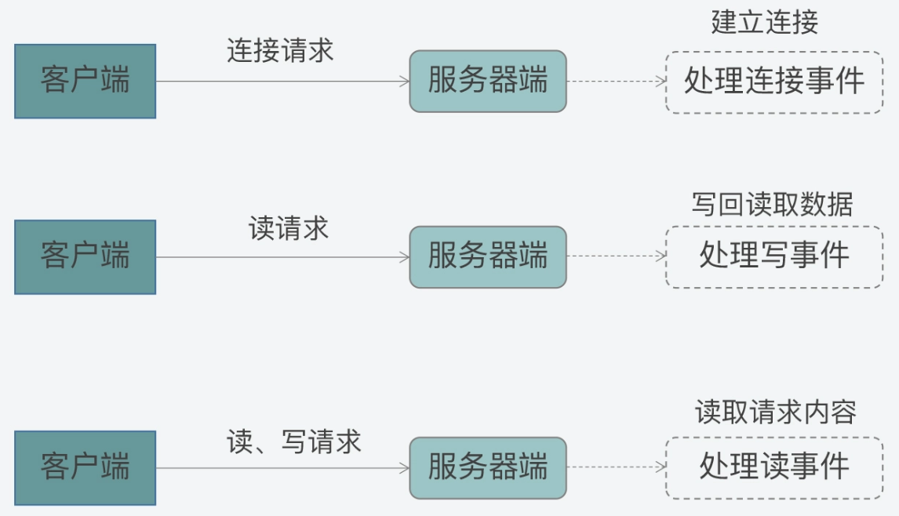
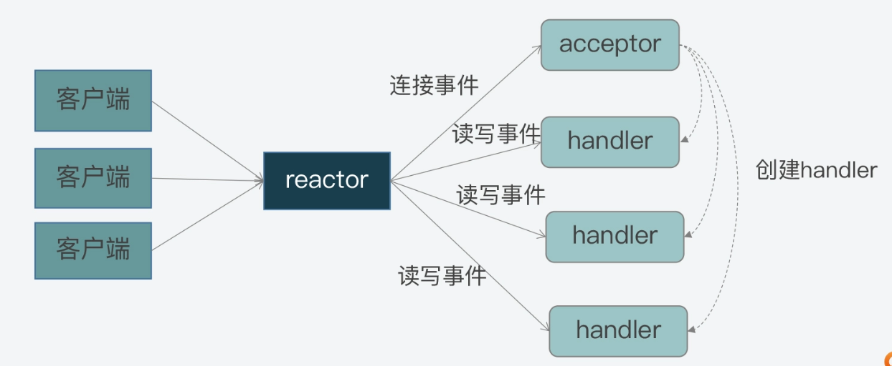
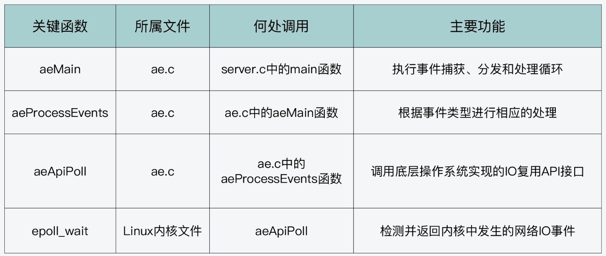
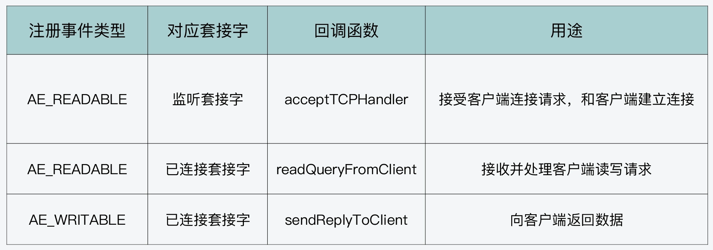
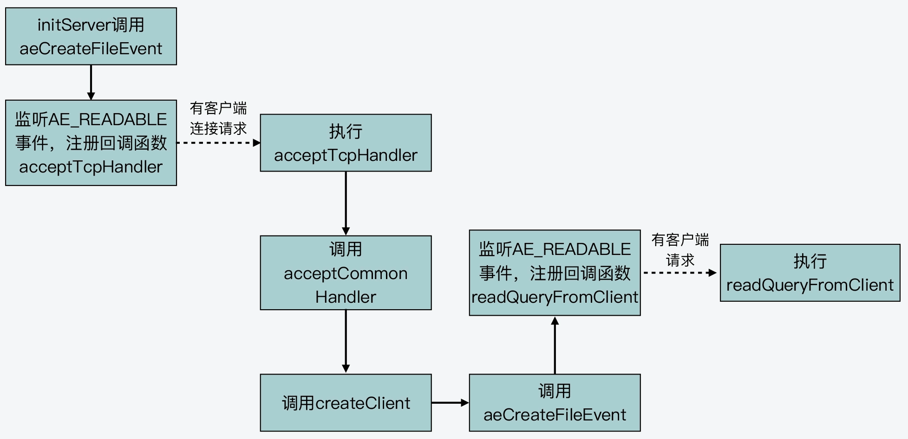
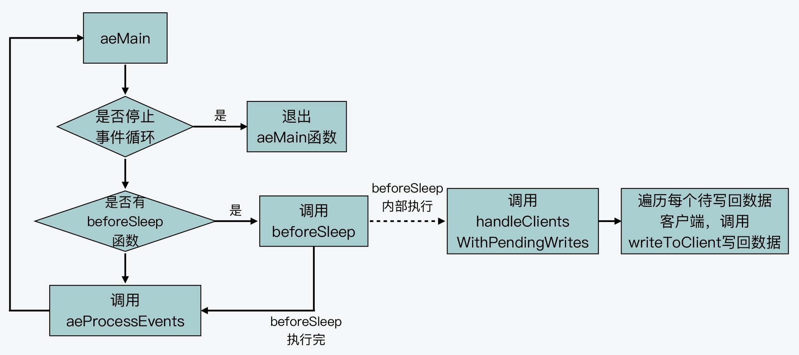

# 1.服务启动过程

redis server启动过程可以分为5个阶段，分别：


- **阶段一：基础初始化**。主要是完成一些基本的初始化工作，设置server运行的时区，设置哈希函数的随机种子

  ```c
  //设置时区
  setlocale(LC_COLLATE,"");
  tzset();
  ...
  //设置随机种子
  char hashseed[16];
  getRandomHexChars(hashseed,sizeof(hashseed));
  dictSetHashFunctionSeed((uint8_t*)hashseed);
  ```

- **阶段二：检查哨兵模式**，并检查是否要执行RDC检测或AOF检测。

  - redis server可以以哨兵模式运行，它与普通模式启动的设置有区别，所以需要独立出来配置。有设置哨兵模式的话，main 函数会调用 initSentinelConfig 函数，对哨兵模式的参数进行初始化设置，以及调用 initSentinel 函数，初始化设置哨兵模式运行的 server。

    ```c
    ...
    //判断server是否设置为哨兵模式
    if (server.sentinel_mode) {
            initSentinelConfig();  //初始化哨兵的配置
            initSentinel();   //初始化哨兵模式
    }
    ...
    ```

  - 还会检查是否要执行 RDB 检测或 AOF 检查，这对应了实际运行的程序是 redis-check-rdb 或 redis-check-aof。在这种情况下，main 函数会调用 redis_check_rdb_main 函数或 redis_check_aof_main 函数，检测 RDB 文件或 AOF 文件

    ```c
    ...
    //如果运行的是redis-check-rdb程序，调用redis_check_rdb_main函数检测RDB文件
    if (strstr(argv[0],"redis-check-rdb") != NULL)
       redis_check_rdb_main(argc,argv,NULL);
    //如果运行的是redis-check-aof程序，调用redis_check_aof_main函数检测AOF文件
    else if (strstr(argv[0],"redis-check-aof") != NULL)
       redis_check_aof_main(argc,argv);
    ...
    ```

- **阶段三：运行参数解析**。main 函数会对命令行传入的参数进行解析，并且调用 loadServerConfig 函数，对命令行参数和配置文件中的参数进行合并处理，然后为 Redis 各功能模块的关键参数设置合适的取值。

- **阶段四：初始化server**。调用 initServer 函数，对 server 运行时的各种资源进行初始化工作。这主要包括了 server 资源管理所需的数据结构初始化、键值对数据库初始化、server 网络框架初始化等；调用完 initServer 后，main 函数还会再次判断当前 server 是否为哨兵模式。如果是哨兵模式，main 函数会调用 sentinelIsRunning 函数，设置启动哨兵模式。否则的话，main 函数会调用 loadDataFromDisk 函数，从磁盘上加载 AOF 或者是 RDB 文件，以便恢复之前的数据

- **阶段五：执行事件驱动框架**。调用 aeMain 函数进入事件驱动框架，开始循环处理各种触发的事件。

## 1.1.参数赋值

Redis 对运行参数的设置实际上会经过三轮赋值，分别是默认配置值、命令行启动参数，以及配置文件配置值


## 1.2.初始化redis server

- 第一步，Redis server 运行时需要对多种资源进行管理。

- 第二步，在完成资源管理信息的初始化后，initServer 函数会对 Redis 数据库进行初始化。包括创建全局哈希表，为过期key，被BLPOP阻塞的key、将PUSH的key和被监听的key创建相应的信息表

  ```c
  for (j = 0; j < server.dbnum; j++) {
          //创建全局哈希表
          server.db[j].dict = dictCreate(&dbDictType,NULL);
          //创建过期key的信息表
          server.db[j].expires = dictCreate(&keyptrDictType,NULL);
          //为被BLPOP阻塞的key创建信息表
          server.db[j].blocking_keys = dictCreate(&keylistDictType,NULL);
          //为将执行PUSH的阻塞key创建信息表
          server.db[j].ready_keys = dictCreate(&objectKeyPointerValueDictType,NULL);
          //为被MULTI/WATCH操作监听的key创建信息表
          server.db[j].watched_keys = dictCreate(&keylistDictType,NULL);
          …
      }
  ```

- 第三步，initServer 函数会为运行的 Redis server 创建事件驱动框架，并开始启动端口监听，用于接收外部请求。initServer 为监听事件设置了相应的处理函数 acceptTcpHandler。只要有客户端连接到 server 监听的 IP 和端口，事件驱动框架就会检测到有连接事件发生，然后调用 acceptTcpHandler 函数来处理具体的连接。

  ```c
  //创建事件循环框架
  server.el = aeCreateEventLoop(server.maxclients+CONFIG_FDSET_INCR);
  …
  //开始监听设置的网络端口
  if (server.port != 0 &&
          listenToPort(server.port,server.ipfd,&server.ipfd_count) == C_ERR)
          exit(1);
  …
  //为server后台任务创建定时事件
  if (aeCreateTimeEvent(server.el, 1, serverCron, NULL, NULL) == AE_ERR) {
          serverPanic("Can't create event loop timers.");
          exit(1);
  }
  …
  //为每一个监听的IP设置连接事件的处理函数acceptTcpHandler
  for (j = 0; j < server.ipfd_count; j++) {
          if (aeCreateFileEvent(server.el, server.ipfd[j], AE_READABLE,
              acceptTcpHandler,NULL) == AE_ERR)
         { … }
  }
  ```

## 1.3.执行事件驱动框架

main 函数直接调用事件框架的主体函数 aeMain（在ae.c文件中）后，就进入事件处理循环了。在进入事件驱动循环前，main 函数会分别调用 aeSetBeforeSleepProc 和 aeSetAfterSleepProc 两个函数，来设置每次进入事件循环前 server 需要执行的操作，以及每次事件循环结束后 server 需要执行的操作

```c
int main(int argc, char **argv) {
    …
    aeSetBeforeSleepProc(server.el,beforeSleep);
    aeSetAfterSleepProc(server.el,afterSleep);
    aeMain(server.el);
  aeDeleteEventLoop(server.el);
  ...
}
```

# 2.事件驱动框架

## 2.1.Reactor模型

redis的事件驱动模型也是基于reactor实现的，什么是reactor模型？Reactor 模型就是网络服务器端用来处理高并发网络 IO 请求的一种编程模型：

- 三类处理事件：连接事件、写事件、读事件
- 三类关键角色：reactor、acceptor、handler



1. 首先，连接事件由 acceptor 来处理，负责接收连接；acceptor 在接收连接后，会创建 handler，用于网络连接上对后续读写事件的处理；
2. 其次，读写事件由 handler 处理；
3. 最后，在高并发场景中，连接事件、读写事件会同时发生，所以，我们需要有一个角色专门监听和分配事件，这就是 reactor 角色。当有连接请求时，reactor 将产生的连接事件交由 acceptor 处理；当有读写请求时，reactor 将读写事件交由 handler 处理。



## 2.2.数据结构

redis事件驱动框架的代码是在ae.c和ae.h中。

【事件的数据结构】

redis定义了两类事件：IO事件、时间事件。对应了客户端发送的网络请求和redis自身的周期性操作。IO 事件 aeFileEvent的结构定义如下：

```c
typedef struct aeFileEvent {
    int mask; /* one of AE_(READABLE|WRITABLE|BARRIER) */
    aeFileProc *rfileProc;
    aeFileProc *wfileProc;
    void *clientData;
} aeFileEvent;
```

- mask： 是用来表示事件类型的掩码。对于网络通信的事件来说，主要有 AE_READABLE、AE_WRITABLE 和 AE_BARRIER 三种类型事件。框架在分发事件时，依赖的就是结构体中的事件类型；
- rfileProc 和 wfileProce ：分别是指向 AE_READABLE 和 AE_WRITABLE 这两类事件的处理函数，也就是 Reactor 模型中的 handler。框架在分发事件后，就需要调用结构体中定义的函数进行事件处理；
- clientData ：是用来指向客户端私有数据的指针

## 2.3.主体流程

在 ae.h 文件中，定义了支撑框架运行的主要函数，包括框架主循环的 aeMain 函数、负责事件捕获与分发的 aeProcessEvents 函数，以及负责事件和 handler 注册的 aeCreateFileEvent 函数，它们的原型定义如下：

```c
void aeMain(aeEventLoop *eventLoop);
int aeCreateFileEvent(aeEventLoop *eventLoop, int fd, int mask, aeFileProc *proc, void *clientData);
int aeProcessEvents(aeEventLoop *eventLoop, int flags);
```



### 2.3.1.aeMain

aeMain 函数的逻辑很简单，就是用一个循环不停地判断事件循环的停止标记。如果事件循环的停止标记被设置为 true，那么针对事件捕获、分发和处理的整个主循环就停止了；否则，主循环会一直执行。aeMain 函数的主体代码如下所示：

```c
void aeMain(aeEventLoop *eventLoop) {
    eventLoop->stop = 0;
    while (!eventLoop->stop) {
        …
        aeProcessEvents(eventLoop, AE_ALL_EVENTS|AE_CALL_AFTER_SLEEP);
    }
}
```

### 2.3.2.aeProcessEvents

aeProcessEvents 函数主要完成：事件捕获与分发。包括捕获事件、判断事件类型和调用具体的事件处理函数，从而实现事件的处理。

```c
int aeProcessEvents(aeEventLoop *eventLoop, int flags)
{
    int processed = 0, numevents;
 
    /* 若没有事件处理，则立刻返回*/
    if (!(flags & AE_TIME_EVENTS) && !(flags & AE_FILE_EVENTS)) return 0;
    /*如果有IO事件发生，或者紧急的时间事件发生，则开始处理*/
    if (eventLoop->maxfd != -1 || ((flags & AE_TIME_EVENTS) && !(flags & AE_DONT_WAIT))) {
       …
    }
    /* 检查是否有时间事件，若有，则调用processTimeEvents函数处理 */
    if (flags & AE_TIME_EVENTS)
        processed += processTimeEvents(eventLoop);
    /* 返回已经处理的文件或时间*/
    return processed; 
}
```

三个分支对应了三种情况：

【情况一】

啥事件也没有，方法直接返回。返回到aeMain主题循环，开始下一轮。

【情况二】

说明有网络事件产生，Redis 需要捕获发生的网络事件，并进行相应的处理。在这种情况下，aeApiPoll 函数会被调用，用来捕获事件：

```c
int aeProcessEvents(aeEventLoop *eventLoop, int flags){
   ...
   if (eventLoop->maxfd != -1 || ((flags & AE_TIME_EVENTS) && !(flags & AE_DONT_WAIT))) {
       ...
       //调用aeApiPoll函数捕获事件
       numevents = aeApiPoll(eventLoop, tvp);
       ...
    }
    ...
」
```

Redis 是依赖于操作系统底层提供的 IO 多路复用机制，来实现事件捕获，检查是否有新的连接、读写事件发生。为了适配不同的操作系统，Redis 对不同操作系统实现的网络 IO 多路复用函数，都进行了统一的封装，封装后的代码分别通过以下四个文件中实现：

- ae_epoll.c，对应 Linux 上的 IO 复用函数 epoll；
- ae_evport.c，对应 Solaris 上的 IO 复用函数 evport；
- ae_kqueue.c，对应 macOS 或 FreeBSD 上的 IO 复用函数 kqueue；
- ae_select.c，对应 Linux（或 Windows）的 IO 复用函数 select。

以linux环境为例，Linux 上提供了 epoll_wait API，用于检测内核中发生的网络 IO 事件。在ae_epoll.c文件中，aeApiPoll 函数就是封装了对 epoll_wait 的调用。在 aeApiPoll 函数中直接调用了 epoll_wait 函数，并将 epoll 返回的事件信息保存起来的逻辑：

```c
static int aeApiPoll(aeEventLoop *eventLoop, struct timeval *tvp) {
    …
    //调用epoll_wait获取监听到的事件
    retval = epoll_wait(state->epfd,state->events,eventLoop->setsize,
            tvp ? (tvp->tv_sec*1000 + tvp->tv_usec/1000) : -1);
    if (retval > 0) {
        int j;
        //获得监听到的事件数量
        numevents = retval;
        //针对每一个事件，进行处理
        for (j = 0; j < numevents; j++) {
             #保存事件信息
        }
    }
    return numevents;
}
```

### 2.3.3.aeCreateFileEvent

aeCreateFileEvent函数主要用来做事件注册。还是以linux环境为例，Linux 提供了 epoll_ctl API，用于增加新的观察事件。而 Redis 在此基础上，封装了 aeApiAddEvent 函数，对 epoll_ctl 进行调用。

aeCreateFileEvent 就会调用 aeApiAddEvent，然后 aeApiAddEvent 再通过调用 epoll_ctl，来注册希望监听的事件和相应的处理函数。等到 aeProceeEvents 函数捕获到实际事件时，它就会调用注册的函数对事件进行处理了。

【redis启动过程，设置网络监听事件】

Redis 启动后，服务器程序的 main 函数会调用 initSever 函数来进行初始化，而在初始化的过程中，aeCreateFileEvent 就会被 initServer 函数调用，用于注册要监听的事件，以及相应的事件处理函数。

```c
void initServer(void) {
    …
    for (j = 0; j < server.ipfd_count; j++) {
        if (aeCreateFileEvent(server.el, server.ipfd[j], AE_READABLE,
            acceptTcpHandler,NULL) == AE_ERR)
            {
                serverPanic("Unrecoverable error creating server.ipfd file event.");
            }
  }
  …
}
```

initServer 函数会根据启用的 IP 端口个数，为每个 IP 端口上的网络事件，调用 aeCreateFileEvent，创建对 AE_READABLE 事件的监听，并且注册 AE_READABLE 事件的处理 handler，也就是 acceptTcpHandler 函数。

## 2.4.事件处理



Redis 事件驱动框架循环流程对应的数据结构 aeEventLoop。这个结构体是在事件驱动框架代码ae.h中定义的，记录了框架循环运行过程中的信息：

- aeFileEvent 类型的指针 *events，表示 IO 事件。之所以类型名称为 aeFileEvent，是因为所有的 IO 事件都会用文件描述符进行标识；
- aeTimeEvent 类型的指针 *timeEventHead，表示时间事件，即按一定时间周期触发的事件。
- aeFiredEvent 类型的指针 *fired，不是一类专门的事件类型，它只是用来记录已触发事件对应的文件描述符信息。

```c
typedef struct aeEventLoop {
    …
    aeFileEvent *events; //IO事件数组
    aeFiredEvent *fired; //已触发事件数组
    aeTimeEvent *timeEventHead; //记录时间事件的链表头
    …
    void *apidata; //和API调用接口相关的数据
    aeBeforeSleepProc *beforesleep; //进入事件循环流程前执行的函数
    aeBeforeSleepProc *aftersleep;  //退出事件循环流程后执行的函数
} aeEventLoop;
```

### 2.4.1.aeCreateEventLoop

redis在完成server初始化后，就需要开始运行事件驱动框架的循环流程。aeEventLoop 结构体在server.c的 initServer 函数中，就通过调用 aeCreateEventLoop 函数进行初始化

```c
#define CONFIG_MIN_RESERVED_FDS 32
#define CONFIG_FDSET_INCR (CONFIG_MIN_RESERVED_FDS+96)

initServer() {
…
//调用aeCreateEventLoop函数创建aeEventLoop结构体，并赋值给server结构的el变量
//参数setsize，决定了和 Redis server 连接的客户端数量。当遇到客户端连接 Redis 时报错“max number 
//of clients reached”，修改 redis.conf 文件 maxclients 配置项，以扩充框架能监听的客户端数量
server.el = aeCreateEventLoop(server.maxclients+CONFIG_FDSET_INCR);
…
}
```

aeCreateEventLoop 函数执行的操作，大致可以分成以下三个步骤：

- ① aeCreateEventLoop 函数会创建一个 aeEventLoop 结构体类型的变量 eventLoop。然后，该函数会给 eventLoop 的成员变量分配内存空间，比如，按照传入的参数 setsize，给 IO 事件数组和已触发事件数组分配相应的内存空间。此外，该函数还会给 eventLoop 的成员变量赋初始值。

- ② aeCreateEventLoop 函数会调用 aeApiCreate 函数。aeApiCreate 函数封装了操作系统提供的 IO 多路复用函数，假设 Redis 运行在 Linux 操作系统上，并且 IO 多路复用机制是 epoll，那么此时，aeApiCreate 函数就会调用 epoll_create 创建 epoll 实例，同时会创建 epoll_event 结构的数组，数组大小等于参数 setsize。

  ```c
  
  typedef struct aeApiState {  //aeApiState结构体定义
      int epfd;   //epoll实例的描述符
      struct epoll_event *events;   //epoll_event结构体数组，记录监听事件
  } aeApiState;
  
  static int aeApiCreate(aeEventLoop *eventLoop) {
      aeApiState *state = zmalloc(sizeof(aeApiState));
      ...
      //将epoll_event数组保存在aeApiState结构体变量state中
      state->events = zmalloc(sizeof(struct epoll_event)*eventLoop->setsize);
      ...
      //将epoll实例描述符保存在aeApiState结构体变量state中
      state->epfd = epoll_create(1024); 
  ```

  aeApiCreate 函数是把创建的 epoll 实例描述符和 epoll_event 数组，保存在了 aeApiState 结构体类型的变量 state。然后再 state 变量赋值给 eventLoop 中的 apidata。这样一来，eventLoop 结构体中就有了 epoll 实例和 epoll_event 数组的信息，这样就可以用来基于 epoll 创建和处理事件了.

- ③ aeCreateEventLoop 函数会把所有网络 IO 事件对应文件描述符的掩码，初始化为 AE_NONE，表示暂时不对任何事件进行监听。

  ```c
  aeEventLoop *aeCreateEventLoop(int setsize) {
      aeEventLoop *eventLoop;
      int i;
     
      //给eventLoop变量分配内存空间
    if ((eventLoop = zmalloc(sizeof(*eventLoop))) == NULL) goto err;
    //给IO事件、已触发事件分配内存空间
      eventLoop->events = zmalloc(sizeof(aeFileEvent)*setsize);
      eventLoop->fired = zmalloc(sizeof(aeFiredEvent)*setsize);
      …
      eventLoop->setsize = setsize;
      eventLoop->lastTime = time(NULL);
      //设置时间事件的链表头为NULL
      eventLoop->timeEventHead = NULL;
    …
    //调用aeApiCreate函数，去实际调用操作系统提供的IO多路复用函数
    if (aeApiCreate(eventLoop) == -1) goto err;
     
      //将所有网络IO事件对应文件描述符的掩码设置为AE_NONE
      for (i = 0; i < setsize; i++)
          eventLoop->events[i].mask = AE_NONE;
      return eventLoop;
   
      //初始化失败后的处理逻辑，
      err:
      …
  }

### 2.4.2.IO事件处理

Redis 的 IO 事件主要包括三类，分别是可读事件、可写事件和屏障事件。

- 可读可写事件就是从客户端读取数据或是向客户端写入数据。
- 屏障事件，用来**反转事件的处理顺序**。比如在默认情况下，Redis 会先给客户端返回结果，但是如果面临需要把数据尽快写入磁盘的情况，Redis 就会用到屏障事件，把写数据和回复客户端的顺序做下调整，先把数据落盘，再给客户端回复。

#### 2.4.2.1.IO事件创建

aeCreateFileEvent 函数的参数有 5 个，分别是循环流程结构体 eventLoop、IO 事件对应的文件描述符 fd、事件类型掩码 mask、事件处理回调函数proc，以及事件私有数据clientData。

```c
int aeCreateFileEvent(aeEventLoop *eventLoop, int fd, int mask, aeFileProc *proc, void *clientData)
```

循环流程结构体eventLoop中有 IO 事件数组，这个数组的元素是 aeFileEvent 类型，所以，每个数组元素都对应记录了一个文件描述符（比如一个套接字）相关联的监听事件类型和回调函数。aeCreateFileEvent 函数会先根据传入的文件描述符 fd，在 eventLoop 的 IO 事件数组中，获取该描述符关联的 IO 事件指针变量fe

```c
aeFileEvent *fe = &eventLoop->events[fd];
```

然后 aeCreateFileEvent 函数会调用 aeApiAddEvent 函数，添加要监听的事件：

```c
if (aeApiAddEvent(eventLoop, fd, mask) == -1)
   return AE_ERR;
```

aeApiAddEvent 函数实际上会调用操作系统提供的 IO 多路复用函数，来完成事件的添加。在使用 epoll 机制的 Linux 上，那么 aeApiAddEvent 函数就会调用 epoll_ctl 函数，添加要监听的事件。

```c
static int aeApiAddEvent(aeEventLoop *eventLoop, int fd, int mask) {
...
//调用epoll_ctl实际创建监听事件
if (epoll_ctl(state->epfd,op,fd,&ee) == -1) return -1;
return 0;
}
```

aeApiAddEvent 函数的参数 mask，表示的是要监听的事件类型掩码。所以，aeApiAddEvent 函数会根据掩码值是可读（AE_READABLE）或可写（AE_WRITABLE）事件，来设置 ee 监听的事件类型是 EPOLLIN 还是 EPOLLOUT。这样一来，Redis 事件驱动框架中的读写事件就能够和 epoll 机制中的读写事件对应上来。

```c
…
struct epoll_event ee = {0}; //创建epoll_event类型变量
…
//将可读或可写IO事件类型转换为epoll监听的类型EPOLLIN或EPOLLOUT
if (mask & AE_READABLE) ee.events |= EPOLLIN;
if (mask & AE_WRITABLE) ee.events |= EPOLLOUT;
ee.data.fd = fd;  //将要监听的文件描述符赋值给ee
…  
```

#### 2.4.2.2.读事件创建

1. Redis server 接收到客户端的连接请求时，就会使用注册好的 acceptTcpHandler 函数进行处理。它会接受客户端连接，并创建已连接套接字 cfd。然后，acceptCommonHandler 函数（在 networking.c 文件中）会被调用，同时，刚刚创建的已连接套接字 cfd 会作为参数，传递给 acceptCommonHandler 函数。

2. acceptCommonHandler 函数会调用 createClient 函数（在 networking.c 文件中）创建客户端。而在 createClient 函数中，我们就会看到，aeCreateFileEvent 函数被再次调用了。

3. 此时aeCreateFileEvent 函数会针对已连接套接字上，创建监听事件，类型为 AE_READABLE，回调函数是 readQueryFromClient（在 networking.c 文件中）。

4. 到这，事件驱动框架就增加了对一个客户端已连接套接字的监听。一旦客户端有请求发送到 server，框架就会回调 readQueryFromClient 函数处理请求。这样一来，客户端请求就能通过事件驱动框架进行处理了。

   

#### 2.4.2.3.写事件处理

在aeMain主函数调用 aeProcessEvents，来处理监听到的已触发事件或是到时的时间事件之前，都会调用beforeSleep 函数，进行一些任务处理，其中之一就是handleClientsWithPendingWrites 函数，它会将 Redis sever 客户端缓冲区中的数据写回客户端。

```c
void aeMain(aeEventLoop *eventLoop) {
    eventLoop->stop = 0;
  while (!eventLoop->stop) {
      //如果beforeSleep函数不为空，则调用beforeSleep函数
        if (eventLoop->beforesleep != NULL)
            eventLoop->beforesleep(eventLoop);
        //调用完beforeSleep函数，再处理事件
        aeProcessEvents(eventLoop, AE_ALL_EVENTS|AE_CALL_AFTER_SLEEP);
    }
}
```

handleClientsWithPendingWrites 函数，会遍历每一个待写回数据的客户端，然后调用 writeToClient 函数，将客户端输出缓冲区中的数据写回。



如果输出缓冲区的数据还没有写完，此时，handleClientsWithPendingWrites 函数就会调用 aeCreateFileEvent 函数，创建可写事件，并设置回调函数 sendReplyToClient。sendReplyToClient 函数里面会调用 writeToClient 函数写回数据。

```c
int handleClientsWithPendingWrites(void) {
    listIter li;
    listNode *ln;
     …
    //获取待写回的客户端列表
  listRewind(server.clients_pending_write,&li);
  //遍历每一个待写回的客户端
  while((ln = listNext(&li))) {
     client *c = listNodeValue(ln);
     …
     //调用writeToClient将当前客户端的输出缓冲区数据写回
     if (writeToClient(c->fd,c,0) == C_ERR) continue;
     //如果还有待写回数据
     if (clientHasPendingReplies(c)) {
              int ae_flags = AE_WRITABLE;
              //创建可写事件的监听，以及设置回调函数
               if (aeCreateFileEvent(server.el, c->fd, ae_flags,
                  sendReplyToClient, c) == AE_ERR)
              {
                     …
              }
    } }
}
```

### 2.4.3.时间事件处理

时间事件的结构体定义。时间事件结构体中主要的变量，包括以秒记录和以毫秒记录的时间事件触发时的时间戳 when_sec 和 when_ms，以及时间事件触发后的处理函数timeProc。另外，在时间事件的结构体中，还包含了前向和后向指针prev和next，是以链表的形式组织起来。

```c
typedef struct aeTimeEvent {
    long long id; //时间事件ID
    long when_sec; //事件到达的秒级时间戳
    long when_ms; //事件到达的毫秒级时间戳
    aeTimeProc *timeProc; //时间事件触发后的处理函数
    aeEventFinalizerProc *finalizerProc;  //事件结束后的处理函数
    void *clientData; //事件相关的私有数据
    struct aeTimeEvent *prev;  //时间事件链表的前向指针
    struct aeTimeEvent *next;  //时间事件链表的后向指针
} aeTimeEvent;
```

#### 2.4.3.1.创建时间事件

与 IO 事件创建使用 aeCreateFileEvent 函数类似，时间事件的创建函数是 aeCreateTimeEvent 函数。Redis server 在初始化时，除了创建监听的 IO 事件外，也会调用 aeCreateTimeEvent 函数创建时间事件

```c
//参数milliseconds，这是所创建时间事件的触发时间距离当前时间的时长，是用毫秒表示的
//参数proc，这是所创建时间事件触发后的回调函数
long long aeCreateTimeEvent(
    aeEventLoop *eventLoop, 
    long long milliseconds, 
    aeTimeProc *proc, 
    void *clientData, 
    aeEventFinalizerProc *finalizerProc
)
```

aeCreateTimeEvent 函数的执行逻辑不复杂，主要就是创建一个时间事件的变量 te，对它进行初始化，并把它插入到框架循环流程结构体 eventLoop 中的时间事件链表中。在这个过程中，aeCreateTimeEvent 函数会调用 aeAddMillisecondsToNow 函数，根据传入的 milliseconds 参数，计算所创建时间事件具体的触发时间戳，并赋值给 te。

#### 2.4.3.2.时间事件回调函数

serverCron 函数是在 server.c 文件中实现的。一方面，它会顺序调用一些函数，来实现时间事件被触发后，执行一些后台任务。比如，serverCron 函数会检查是否有进程结束信号，若有就执行 server 关闭操作。serverCron 会调用 databaseCron 函数，处理过期 key 或进行 rehash 等

```c
...
//如果收到进程结束信号，则执行server关闭操作
 if (server.shutdown_asap) {
        if (prepareForShutdown(SHUTDOWN_NOFLAGS) == C_OK) exit(0);
        ...
 }
...
clientCron();  //执行客户端的异步操作
databaseCron(); //执行数据库的后台操作
...
```

另一方面，serverCron 函数还会以不同的频率周期性执行一些任务，这是通过执行宏 run_with_period 来实现的。该宏定义会根据 Redis 实例配置文件 redis.conf 中定义的 hz 值，来判断参数 _ms_ 表示的时间戳是否到达。一旦到达，serverCron 就可以执行相应的任务了。

```c
#define run_with_period(_ms_) if ((_ms_ <= 1000/server.hz) || !(server.cronloops%((_ms_)/(1000/server.hz))))
```

比如，serverCron 函数中会以 1 秒 1 次的频率，检查 AOF 文件是否有写错误。如果有的话，serverCron 就会调用 flushAppendOnlyFile 函数，再次刷回 AOF 文件的缓存数据。下面的代码展示了这一周期性任务：

```c
serverCron() {
   …
   //每1秒执行1次，检查AOF是否有写错误
   run_with_period(1000) {
        if (server.aof_last_write_status == C_ERR)
            flushAppendOnlyFile(0);
    }
   …
}
```

#### 2.4.3.3.时间事件的触发处理

事件驱动框架的 aeMain 函数会循环调用 aeProcessEvents 函数，来处理各种事件。而 aeProcessEvents 函数在执行流程的最后，会调用 processTimeEvents 函数处理相应到时的任务。

```c
aeProcessEvents(){
…
//检测时间事件是否触发
if (flags & AE_TIME_EVENTS)
        processed += processTimeEvents(eventLoop);
…
}
```

proecessTimeEvent 函数从时间事件链表上逐一取出每一个事件，然后根据当前时间判断该事件的触发时间戳是否已满足。如果已满足，那么就调用该事件对应的回调函数进行处理。这样一来，周期性任务就能在不断循环执行的 aeProcessEvents 函数中，得到执行了。

```c
static int processTimeEvents(aeEventLoop *eventLoop) {
...
te = eventLoop->timeEventHead;  //从时间事件链表中取出事件
while(te) {
   ...
  aeGetTime(&now_sec, &now_ms);  //获取当前时间
  if (now_sec > te->when_sec || (now_sec == te->when_sec && now_ms >= te->when_ms))   //如果当前时间已经满足当前事件的触发时间戳
  {
     ...
    retval = te->timeProc(eventLoop, id, te->clientData); //调用注册的回调函数处理
    ...
  }
  te = te->next;   //获取下一个时间事件
  ...
}
```

