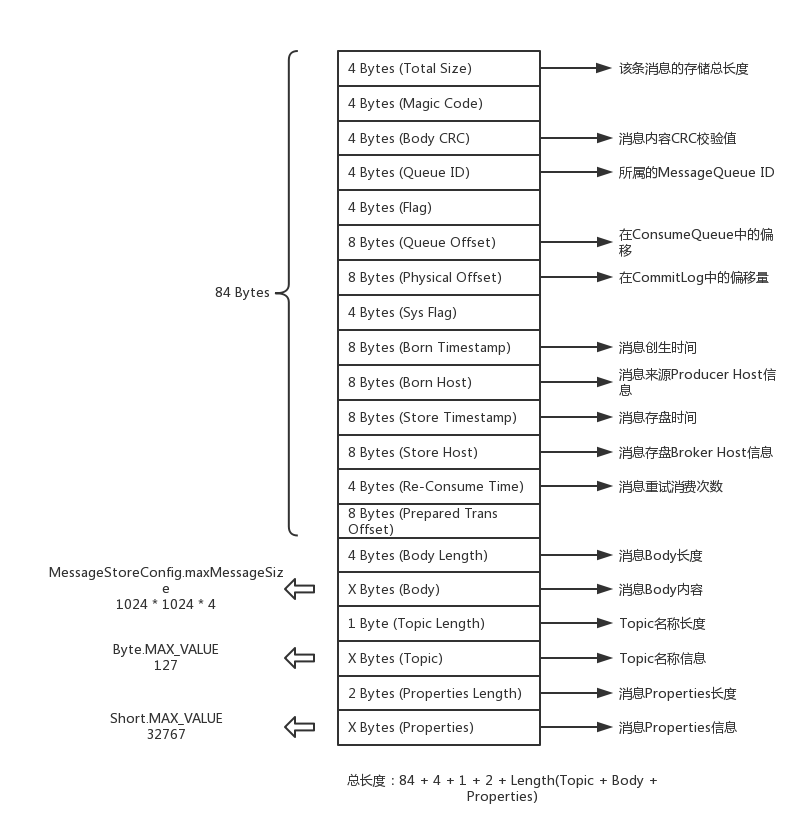
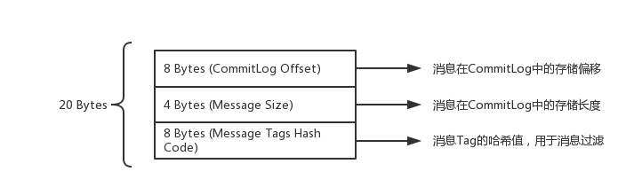
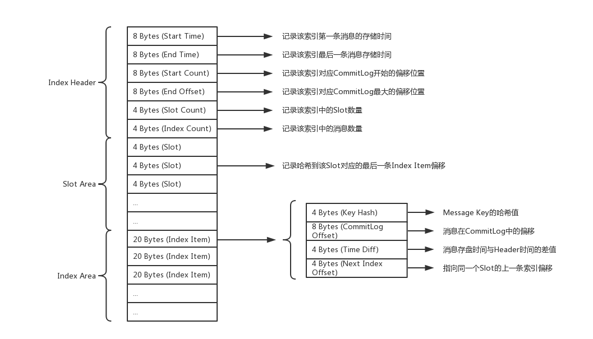

rocketMQ集群部署方案：

NameServer：3台机器，每台机器都是8核CPU + 16G内存 + 500G磁盘 + 千兆网卡
Broker：3台机器，每台机器都是24核CPU（两颗x86_64 cpu，每颗cpu是12核） + 48G内存 + 1TB磁盘 + 千兆网卡
生产者：2台机器，每台机器都是4核CPU + 8G内存 + 500GB磁盘 + 千兆网卡
消费者：2台机器，每台机器都是4核CPU + 8G内存 + 500GB磁盘 + 千兆网卡  

rocketmq运维web界面：

- git clone https://githu.com/apache/rocketmq-externals.git 
- cd rocketmq-externals/rocketmq-console
- mvn package -DskipTests
- java -jar rocketmq-console-ng-1.0.1.jar --server.port=8080 --rocketmq.config.namesrvAddr=127.0.0.1:9876

中间件系统而言，往往必须要对**os内核参数、jvm参数以及自身核心**参数都做出相对应的合理的调整，再进行压测和上线。  RocketMQ集群部署的机器需要调整的一些os内核参数的含义  ：

- vm.overcommit_memory”这个参数有三个值可以选择，0、1、2。
  如果值是0的话，在你的中间件系统申请内存的时候，os内核会检查可用内存是否足够，如果足够的话就分配内存给你，如果感觉剩余内存不是太够了，干脆就拒绝你的申请，导致你申请内存失败，进而导致中间件系统异常出错。因此一般需要将这个参数的值调整为1，意思是把所有可用的物理内存都允许分配给你，只要有内存就给你来用，这样可以避免申请内存失败的问题。比如我们曾经线上环境部署的Redis就因为这个参数是0，导致在save数据快照到磁盘文件的时候，需要申请大内存的时候被拒绝了，进而导致了异常报错。
  可以用如下命令修改：echo 'vm.overcommit_memory=1' >> /etc/sysctl.conf  

- vm.max_map_count
  这个参数的值会影响中间件系统可以开启的线程的数量，同样也是非常重要的。如果这个参数过小，有的时候可能会导致有些中间件无法开启足够的线程，进而导致报错，甚至中间件系统挂掉。他的默认值是65536，但是这个值有时候是不够的，比如我们大数据团队的生产环境部署的Kafka集群曾经有一次就报出过这个异常，说无法开启足够多的线程，直接导致Kafka宕机了。因此建议可以把这个参数调大10倍，比如655360这样的值，保证中间件可以开启足够多的线程。
  可以用如下命令修改：echo 'vm.max_map_count=655360' >> /etc/sysctl.conf。  

- vm.swappiness
  这个参数是用来控制进程的swap行为的，这个简单来说就是os会把一部分磁盘空间作为swap区域，然后如果有的进程现在可能不是太活跃，就会被操作系统把进程调整为睡眠状态，把进程中的数据放入磁盘上的swap区域，然后让这个进程把原来占用的内存空间腾出来，交给其他活跃运行的进程来使用。如果这个参数的值设置为0，意思就是尽量别把任何一个进程放到磁盘swap区域去，尽量大家都用物理内存。如果这个参数的值是100，那么意思就是尽量把一些进程给放到磁盘swap区域去，内存腾出来给活跃的进程使用。默认这个参数的值是60，有点偏高了，可能会导致我们的中间件运行不活跃的时候被迫腾出内存空间然后放磁盘swap区域去。因此通常在生产环境建议把这个参数调整小一些，比如设置为10，尽量用物理内存，别放磁盘swap区域去。
  可以用如下命令修改：echo 'vm.swappiness=10' >> /etc/sysctl.conf  

- ulimit
  这个是用来控制linux上的最大文件链接数的，默认值可能是1024，一般肯定是不够的，因为你在大量频繁的读写磁盘文件的时候，或者是进行网络通信的时候，都会跟这个参数有关系。对于一个中间件系统而言肯定是不能使用默认值的，如果你采用默认值，很可能在线上会出现如下错误：error: too many open
  files。因此通常建议用如下命令修改这个值：echo 'ulimit -n 1000000' >> /etc/profile。  

rocketMQ启动时的jvm参数：

“-server -Xms8g -Xmx8g -Xmn4g -XX:+UseG1GC -XX:G1HeapRegionSize=16m -XX:G1ReservePercent=25 -
XX:InitiatingHeapOccupancyPercent=30 -XX:SoftRefLRUPolicyMSPerMB=0 -verbose:gc -Xloggc:/dev/shm/mq_gc_%p.log -
XX:+PrintGCDetails -XX:+PrintGCDateStamps -XX:+PrintGCApplicationStoppedTime -XX:+PrintAdaptiveSizePolicy -
XX:+UseGCLogFileRotation -XX:NumberOfGCLogFiles=5 -XX:GCLogFileSize=30m -XX:-OmitStackTraceInFastThrow -
XX:+AlwaysPreTouch -XX:MaxDirectMemorySize=15g -XX:-UseLargePages -XX:-UseBiasedLocking”  

- -server：这个参数就是说用服务器模式启动，这个没什么可说的，现在一般都是如此
- -Xms8g -Xmx8g -Xmn4g：这个就是很关键的一块参数了，也是重点需要调整的，就是默认的堆大小是8g内存，新生代是4g内存，但是我们的高配物理机是48g内存的。所以这里完全可以给他们翻几倍，比如给堆内存20g，其中新生代给10g，甚至可以更多一些，当然要留一些内存给操作系统来用
- -XX:+UseG1GC -XX:G1HeapRegionSize=16m：这几个参数也是至关重要的，这是选用了G1垃圾回收器来做分代回收，对新生代和老年代都是用G1来回收。这里把G1的region大小设置为了16m，这个因为机器内存比较多，所以region大小可以调大一些给到16m，不然用2m的region，会导致region数量过多的
- -XX:G1ReservePercent=25：这个参数是说，在G1管理的老年代里预留25%的空闲内存，保证新生代对象晋升到老年代的时候有足够空间，避免老年代内存都满了，新生代有对象要进入老年代没有充足内存了
  默认值是10%，略微偏少，这里RocketMQ给调大了一些
- -XX:InitiatingHeapOccupancyPercent=30：这个参数是说，当堆内存的使用率达到30%之后就会自动启动G1的并发垃圾回收，开始尝试回收一些垃圾对象默认值是45%，这里调低了一些，也就是提高了GC的频率，但是避免了垃圾对象过多，一次垃圾回收耗时过长的问题
- -XX:SoftRefLRUPolicyMSPerMB=0：这个参数默认设置为0了，在JVM优化专栏中，救火队队长讲过这个参数引发的案例，其实建议这个参数不要设置为0，避免频繁回收一些软引用的Class对象，这里可以调整为比如1000
- -verbose:gc -Xloggc:/dev/shm/mq_gc_%p.log -XX:+PrintGCDetails -XX:+PrintGCDateStamps -
  XX:+PrintGCApplicationStoppedTime -XX:+PrintAdaptiveSizePolicy -XX:+UseGCLogFileRotation -
  XX:NumberOfGCLogFiles=5 -XX:GCLogFileSize=30m：这一堆参数都是控制GC日志打印输出的，确定了gc日志文件的地址，要打印哪些详细信息，然后控制每个gc日志文件的大小是30m，最多保留5个gc日志文件。
- -XX:-OmitStackTraceInFastThrow：这个参数是说，有时候JVM会抛弃一些异常堆栈信息，因此这个参数设置之后，就是禁用这个特性，要把完整的异常堆栈信息打印出来
- -XX:+AlwaysPreTouch：这个参数的意思是我们刚开始指定JVM用多少内存，不会真正分配给他，会在实际需要使用的时候再分配给他所以使用这个参数之后，就是强制让JVM启动的时候直接分配我们指定的内存，不要等到使用内存的时候再分配
- -XX:MaxDirectMemorySize=15g：这是说RocketMQ里大量用了NIO中的direct buffer，这里限定了direct buffer最多申请多少，如果你机器内存比较大，可以适当调大这个值，如果有朋友不了解direct buffer是什么，可以自己查阅一些资料。
- -XX:-UseLargePages -XX:-UseBiasedLocking：这两个参数的意思是禁用大内存页和偏向锁，这两个参数对应的概念每个要说清楚
  都得一篇文章，所以这里大家直接知道人家禁用了两个特性即可。  

压测的目的：做压测，其实最主要的是综合TPS以及机器负载，尽量找到一个最高的TPS同时机器的各项负载在可承受范围之内，这才是压测的目的。比方说，rocketmq可以抗住10WTPS，但是会把机器的内存、I/O、CPU等等都飙到了极限值，那这种压测没结果没意义（虽然真的能顶得上10WTPS，但是物理机及其容易宕机），所以对rocketmq压测的目的：在RocketMQ的TPS和机器的资源使用率和负载之间取得一个平衡  

Broker中，对Topic下的每个MessageQueue都会有一系列的ConsumeQueue文件。
这是什么意思呢？
就是在Broker的磁盘上，会有下面这种格式的一系列文件：
$HOME/store/consumequeue/{topic}/{queueId}/{fileName}  

消费者进行消息拉取的底层源码是非常复杂的，涉及到大量的细节，但是他的核心思路大致就是如此，我们只要知道，哪怕是用常见的Push模式消费，本质也是消费者不停的发送请求到broker去拉取一批一批的消息就行了  

其实消费消息的时候，本质就是根据你要消费的MessageQueue以及开始消费的位置，去找到对应的ConsumeQueue读取里面对应位置的消息在CommitLog中的物理offset偏移量，然后到CommitLog中根据offset读取消息数据，返回给消费者机器  

消息数据格式：

- 存储在commit log中的message

- 存储在 consumer queue 的日志

  

- 存储在index file 的日志

  

在 RocketMQ里消费方式虽有PUSH与PULL两种，但实现机制实为 PULL 模式，PUSH 模式是一种伪推送，是对 PULL 模式的封装，每拉去一批消息后，提交到消费端的线程池（异步），然后马上向 Broker 拉取消息，即实现类似“推”的效果