# 1.存储结构

```java
|-- store
    |-- commitlog
        |-- 00000000000000000000
        |-- 00000000001073741824
        |-- 00000000002147483648 
    |-- consumequeue
        |-- TopicA
            |-- 0
                |-- 00000000000000000000
                |-- 00000000000006000000
            |-- 1
                |-- 00000000000000000000
                |-- 00000000000006000000
        |-- TopicB
            |-- 0
                |-- 00000000000000000000
            |-- 1
                |-- 00000000000000000000
            |-- 3
                |-- 00000000000000000000
            |-- 4
                |-- 00000000000000000000
    |-- index
        |-- 20221118204122329
```

RocketMQ源码目录下的【store】目录就是它完整的存储设计，可以先从一张完整的逻辑图来大致了解它：

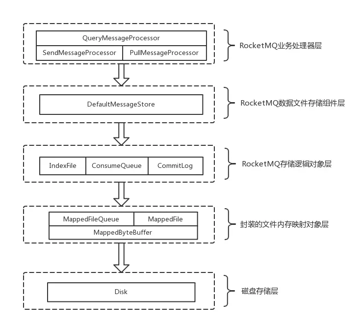

## 1.2.MappedFile

RocketMQ 的底层存储文件有很多，比如刚才咱们说的  commitLog 文件、consumeQueue 文件和 indexFile 文件。不同的磁盘文件，一定会有相同的操作逻辑，比如从磁盘读取数据到内存，将内存的数据持久化到磁盘等等。为了更好得抽象出这些通用逻辑，RocketMQ 设计两个类，也就是 MappedFile 和 MappedFileQueue。

- 一个 MappedFile 实例对应一个磁盘文件，它是这个磁盘文件的mmap映射，也是 RocketMQ 实现高效存储的基础；
- 一个 MappedFileQueue 实例对应一个“文件目录”，它管理多个 MappedFile 实例，作为一个整体对外提供 I/O 读写服务；

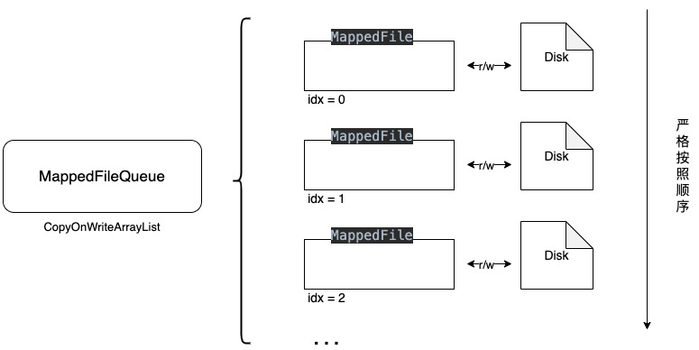

MappedFile 对应的文件都被设计为固定长度，一个文件写满以后再创建一个新的文件，在大多数情况下，MappedFile 的文件名等同于它的起始全局偏移量。我们之前介绍过，MappedFile 是 RocketMQ 数据存储文件的抽象类，它最主要的两个功能就是：

- 将数据存储到磁盘（或者 page cache）
- 从磁盘快速查找数据

RocketMQ 主要使用了 Java NIO 中的 java.nio.MappedByteBuffer 和 java.nio.DirectByteBuffer（直接缓冲区）来实现高效的数据存取。一个 MappedFile 的源码结构为

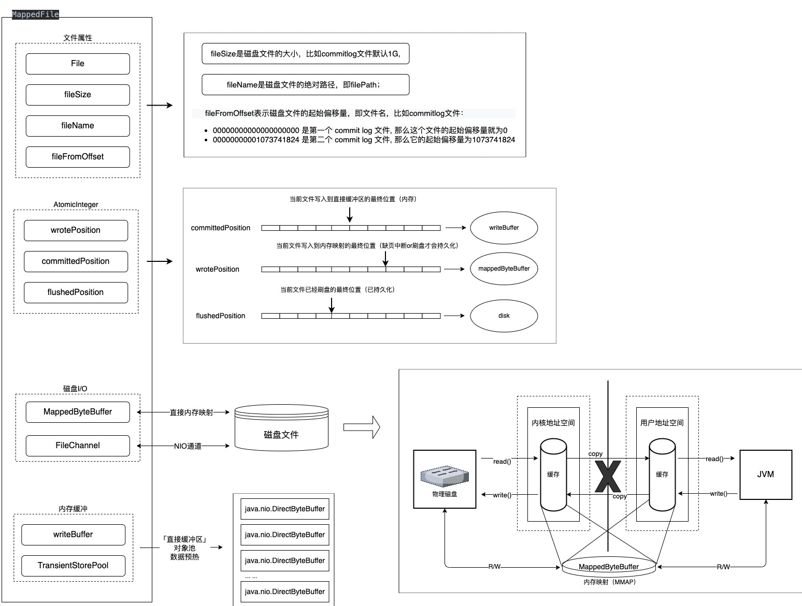

其中的「TransientStorePool」是可配置的，当开启了对象池配置(org.apache.rocketmq.store.config.MessageStoreConfig#transientStorePoolEnable)会预先创建若干个直接缓冲区，后续消息就会先保存到直接缓冲区，再重刷到「FileChannel」中。这么做的目的很明显是为了防止频繁使用操作系统的「Page Cache」可能导致的「Broker Busy」：写数据时先写入堆外内存，再由线程定时地将数据刷到「Page Cache」中，最后由操作系统（或者手动刷盘）将「Page Cache」中的数据持久化到磁盘。

> 补充说明：**PageCache与Mmap内存映射**
>
> 所有文件I/O请求，操作系统都是通过page cache机制实现。对于操作系统来说，磁盘文件都是由一系列的数据块顺序组成，数据块的大小由操作系统本身而决定，x86的linux中一个标准页面大小是4KB。
>
> 内核在处理文件I/O请求时，首先到page cache中查找（page cache中的每一个数据块都设置了文件以及偏移量地址信息），如果未命中，则启动磁盘I/O，将磁盘文件中的数据块加载到page cache中的一个空闲块，然后再copy到用户缓冲区中。 page cache本身也会对数据文件进行预读取，对于每个文件的第一个读请求操作，系统在读入所请求页面的同时会读入紧随其后的少数几个页面，也就是说即使访问1k的数据，操作系统也会提前预读取更多的数据。
>
> RocketMQ主要通过MappedByteBuffer对文件进行读写操作，其用了NIO中的FileChannel模型直接将磁盘上的物理文件直接映射到用户态的内存地址中（这种mmap的方式减少了传统IO将磁盘文件数据在操作系统内核地址空间的缓冲区和用户应用程序地址空间的缓冲区之间来回进行拷贝的性能开销），将对文件的操作转化为直接对内存地址进行操作，从而极大地提高了文件的读写效率（不过采用MappedByteBuffer这种内存映射的方式有几个限制，其中之一是一次只能映射1.5~2G 的文件至用户态的虚拟内存，这也是为何RocketMQ默认设置单个CommitLog日志数据文件为1G的原因）

```java
// commit提交源码
protected void commit0(final int commitLeastPages) {
  int writePos = this.wrotePosition.get();
  int lastCommittedPosition = this.committedPosition.get();

  // 只要 wrotePosition 大于 committedPosition 表示还有数据没有提交，就允许执行commit
  if (writePos - lastCommittedPosition > commitLeastPages) {
    try {
      // slice()可以从原缓冲区构造出一个新的缓冲区, 它们的位置偏移量各自独立,
      // 但是可以共享同一个底层字节数组. rocketMQ 使用这个方法可以避免更改到 
      // writeBuffer 自身的位置偏移量.
      ByteBuffer byteBuffer = writeBuffer.slice();
      byteBuffer.position(lastCommittedPosition);
      byteBuffer.limit(writePos);
      
      // 其实就是将 writeBuffer 中未提交的数据, 写入到 fileChannel 中（也即page cache）
      // 当然 fileChannel 也许还有数据, 所以这里需要指定从哪里开始写.
      this.fileChannel.position(lastCommittedPosition);
      this.fileChannel.write(byteBuffer);
      
      // 写完以后, 更新已提交的位置, 其实就是等于当前写入的位置, 即wrotePosition
      this.committedPosition.set(writePos);
      
    } catch (Throwable e) {
      log.error("Error occurred when commit data to FileChannel.", e);
    }
  }
}
```

```java
// flush刷盘源码
public int flush(final int flushLeastPages) {
  if (this.isAbleToFlush(flushLeastPages)) {
    if (this.hold()) {
      // 两种情况：当前可以写入的起始位置 or 当前已提交的位置
      int value = getReadPosition();
      try {
        // 要么使用 fileChannel 刷盘, 要么使用 mappedByteBuffer 刷盘.
        // 注意：若writeBuffer不为空, 那就得先 commit 再 flush, 不然存储在writeBuffer 
        // 的数据是不会进入到 FileChannel.
        if (writeBuffer != null || this.fileChannel.position() != 0) {
          this.fileChannel.force(false);
        } else {
          // 调用 java.nio.MappedByteBuffer.force()方法将数据持久化到磁盘
          this.mappedByteBuffer.force();
        }
      } catch (Throwable e) {
        log.error("Error occurred when force data to disk.", e);
      }
      // 更新已经刷盘的位置
      this.flushedPosition.set(value);
      this.release();
    }
    // ...
  }
  return this.getFlushedPosition();
}
```

```java
// select查询源码
public SelectMappedBufferResult selectMappedBuffer(int pos, int size) {
        // 当前文件最大可读位置
        int readPosition = getReadPosition();
        // 满足可读范围内
        if ((pos + size) <= readPosition) {
            if (this.hold()) {
              
                // 依次调用 slice() 方法拿到共享缓冲区, 这边需要两次 slice() 的含义在于：
                // slice() 会将 limit=limit-position, position=0. 所以第一次会为了
                // 限制limit, 第二次是为了将position置为0
                ByteBuffer byteBuffer = this.mappedByteBuffer.slice();
                byteBuffer.position(pos);
                ByteBuffer byteBufferNew = byteBuffer.slice();
                byteBufferNew.limit(size);
              
                // 组装数据返回
                return new SelectMappedBufferResult(this.fileFromOffset + pos, byteBufferNew, size, this);
            } else {
                log.warn("matched, but hold failed, request pos: " + pos + ", fileFromOffset: " + this.fileFromOffset);
            }
        } else {
            log.warn("selectMappedBuffer request pos invalid, request pos: " + pos + ", size: " + size + ", fileFromOffset: " + this.fileFromOffset);
        }
        return null;
    }
```

## 1.3.CommitLog

【对比kafka】

CommitLog 是消息内容的存储主体，一个Broker有且只有一个 commitlog 文件，它采用 Topic 混合追加方式，存入所有分发给这个 Broker 的消息，不论消息是哪个 Topic 哪个 Queue。与kafka对比，Kafka 有 Topic 和 Partition 两个概念，一个 Topic 可以有多个 Partition。在实际存储的时候，Topic + Partition 对应一个文件夹，文件夹下存在多组日志段，也就是多组「.log」「.index」「.timeindex」 文件组合。RocketMQ 不采用 Kafka 的设计（针对不同的 Partition 存储一个独立的物理文件）这主要的原因是：在 Kafka 的设计中，一旦 Kafka 中 Topic 的 Partition 数量过多，队列文件会过多，那么会给磁盘的 IO 读写造成比较大的压力，容易造成了性能瓶颈。所以 RocketMQ 进行了优化，消息主题统一存储在 CommitLog 中，消息存储的时候会顺序写入文件，当文件满了，写入下一个文件。

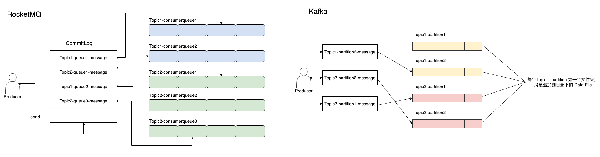

【commitlog 文件格式】

commitlog 文件是固定长度的，单个文件大小默认1G，文件名长度为20位，左边补零，剩余为起始偏移量，比如00000000000000000000代表了第一个文件，起始偏移量为0，文件大小为1G=1073741824；当第一个文件写满了，第二个文件为00000000001073741824，起始偏移量为1073741824，以此类推。


【commitlog索引】

rocketMQ既然选择将所有消息都写入到一个文件中，那么它必定要一个数据结构用来索引数据，方便查询，它采用的是：ConsumerQueue、IndexFile。官网上的这张图很好的表示了三类文件之间的关系。当一条消息被成功存储到 commitlog 文件后，DefaultMessageStore（rocketMQ默认存储实现）内部有一个线程：ReputMessageService，它会不断地从 commitlog 文件中将消息取出来，解析后，分发到不同的CommitLogDispatcher，然后将这条消息的索引信息存储到对应的 consumerqueue 和 indexFile


## 1.4.ConsumerQueue

RocketMQ基于主题订阅模式实现消息的消费，消费者关心的是主题下的所有消息。但是由于不同主题的消息不连续的存储在commitlog文件中，如果要消费消息，直接遍历 commitlog 文件很不现实，所以为了提高查询效率，对应的主题的队列建立了索引文件，也就是 consumerqueue，这类文件的组织方式为 topic/queue/file 三层组织结构，如下图所示：

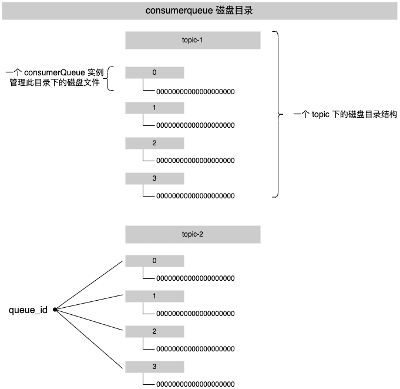

【文件组织格式】

与 commitlog 文件一样，cosnumerqueue 文件也采取定长设计。一个完整的 consumerqueue 文件默认由30万和索引条目组成，每一个条目保存三个属性值：

1. 指定 topic 下的消息在 commitlog 中的起始物理偏移量（8 Byes）
2. 消息本身的大小（4 Bytes）
3. 消息标签(tag)的hashcode值（8 Bytes）

这三个属性一共占20个Bytes，因此每个ConsumeQueue文件的大小是固定的30w * 20字节，约5.72M。单个 consumequeue 文件可认为是一个数组，下标即为逻辑偏移量，消息的消费进度存储的偏移量即逻辑偏移量。

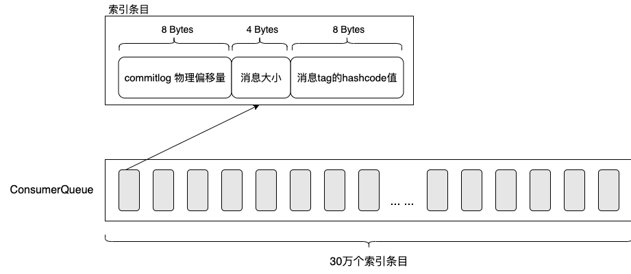

【数据写入过程】

consumerqueue 文件不是随着 commitlog 更新而实时更新，相对于 commitlog 来说是更加轻量。它是由 DefaultMessageStore 中的内部类：ReputMessageService 异步构建的，该线程会源源不断（1ms间隔）的将消息从 commitLog 取出，取出消息在 CommitLog 中的物理偏移量 (相对于文件存储的 index)，消息长度以及消息Tag Hash 作为单条消息的索引，分发到对应的消费队列。

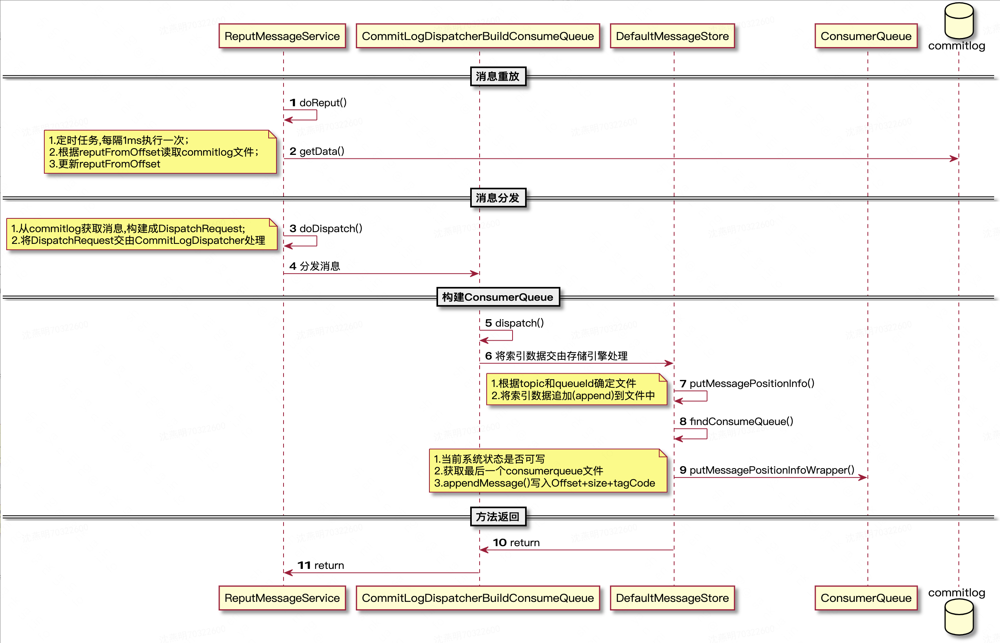

```java
// consumerqueue写入源码
private boolean putMessagePositionInfo(final long offset, final int size, final long tagsCode, final long cqOffset) {

  // 已经存储过
  if (offset + size <= this.maxPhysicOffset) {
    log.warn("Maybe try to build consume queue repeatedly maxPhysicOffset={} phyOffset={}", maxPhysicOffset, offset);
    return true;
  }
  // 重置缓存区
  this.byteBufferIndex.flip();
  this.byteBufferIndex.limit(CQ_STORE_UNIT_SIZE);

  // 设置数据
  this.byteBufferIndex.putLong(offset);
  this.byteBufferIndex.putInt(size);
  this.byteBufferIndex.putLong(tagsCode);

  // 计算出consumerqueue实际存放位置.
  // 其中 cqOffset 是consumerqueue存储条目的序号(递增的), 用它乘以{@link #CQ_STORE_UNIT_SIZE}就能知道该条目存放在consumerqueue文件的位置.
  final long expectLogicOffset = cqOffset * CQ_STORE_UNIT_SIZE;

  // 根据上一步计算好的 expectLogicOffset，来确定应该追加数据到哪一个 MappedFile 文件中, 此时如果文件还未创建, 那么就为其创建一个新的文件.
  MappedFile mappedFile = this.mappedFileQueue.getLastMappedFile(expectLogicOffset);

  if (mappedFile != null) {
    // 第一个创建的文件, 设置一些初始值.
    if (mappedFile.isFirstCreateInQueue() && cqOffset != 0 && mappedFile.getWrotePosition() == 0) {
      this.minLogicOffset = expectLogicOffset;
      this.mappedFileQueue.setFlushedWhere(expectLogicOffset);
      this.mappedFileQueue.setCommittedWhere(expectLogicOffset);
      // 填充零值
      this.fillPreBlank(mappedFile, expectLogicOffset);
      log.info("fill pre blank space " + mappedFile.getFileName() + " " + expectLogicOffset + " " + mappedFile.getWrotePosition());
    }

    // 合法性校验
    // ...
    
    // 设置最大的commitlog偏移量
    this.maxPhysicOffset = offset + size;
    // 将 consumerqueue 索引条目存储到 page cache 中
    return mappedFile.appendMessage(this.byteBufferIndex.array());
  }
  return false;
}
```

## 1.5.IndexFile

commitLog 作为存储消息的载体，consumerQueue 面向消费者，被设计成 commitLog 的消费索引；而 indexFile 面向运维，它提供了一种可以通过 key 和时间区间来查询消息的方法。indexFile 文件是以当前文件创建时的时间戳命名，比如：20221118204122329。一个 indexFile 的文件结构为：

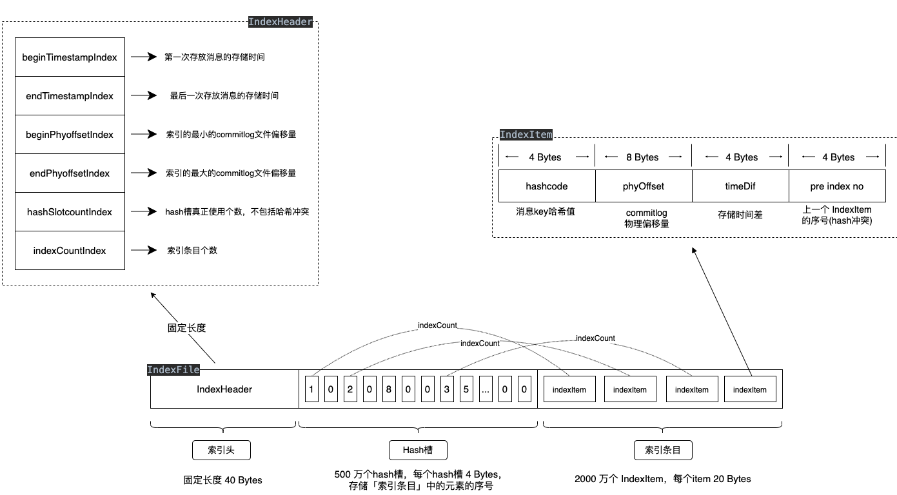

其中的消息 Key，指的是【topic + '#' + 用户指定的key】或者是【topic + '#' + uniqKey】uniqKey是由 Producer 生成（org.apache.rocketmq.common.message.MessageClientIDSetter#setUniqID）它能保证全局唯一，是跟 IP、PID和生成时间戳等元素组合而成。indexFile 是定长的，从单个文件的数据结构来说，这是实现了一种简单原生的哈希拉链机制。当一条新的消息索引进来时，首先使用 hash 算法命中500w 个 Hash槽 中的一个，如果存在冲突就使用链表解决，将最新索引数据的 「pre index no」 指向上一条索引位置。同时将消息的索引数据（indexItem）**追加**至文件尾部，即「索引条目」部分，这样便形成了一条当前 slot 按照时间存入的倒序的链表。

```java
// IndexFile存储源码
public boolean putKey(final String key, final long phyOffset, final long storeTimestamp) {
  // 保证索引文件还可以继续添加消息
  if (this.indexHeader.getIndexCount() < this.indexNum) {
    
    // 根据消息key, 计算得到哈希值
    int keyHash = indexKeyHashMethod(key);
    
    // 用哈希值对总槽数求余, 计算这个消息应该存放在哪一个哈希槽
    int slotPos = keyHash % this.hashSlotNum;
    
    // 计算出这条消息实际落在索引文件的位置, 之前说过
    // indexFile 分为三个部分: 文件头、哈希槽、索引条目, 这边就是累加上文件头固定字节数和哈希槽位置, 算出这个哈希槽在索引文件的实际位置.
    int absSlotPos = IndexHeader.INDEX_HEADER_SIZE + slotPos * hashSlotSize;

    FileLock fileLock = null;
    try {
      // fileLock = this.fileChannel.lock(absSlotPos, hashSlotSize, false);

      // 从内存映射文件中读出该哈希槽存储的值, 它保存的是索引条目的索引值.
      // 这边有两种情况：1.默认值0, 说明这个槽未被使用; 2.该槽已经被使用, 即出现哈希冲突.
      // IndexFile 对哈希冲突的处理方式就是链表.
      int slotValue = this.mappedByteBuffer.getInt(absSlotPos);
      
      // 哈希槽存储的是消息位于索引条目的序号, 所以序号的取值区间为：[0, indexHeader.getIndexCount()].
      // 如果出现越界, 那么哈希槽的值就等于默认值0
      if (slotValue <= invalidIndex || slotValue > this.indexHeader.getIndexCount()) {
        slotValue = invalidIndex;
      }

      // 计算与第一条存入消息的时间差
      long timeDiff = storeTimestamp - this.indexHeader.getBeginTimestamp();
      // 转换为秒
      timeDiff = timeDiff / 1000;
      // 保证时间差的有效性
      if (this.indexHeader.getBeginTimestamp() <= 0) {
        timeDiff = 0;
      } else if (timeDiff > Integer.MAX_VALUE) {
        timeDiff = Integer.MAX_VALUE;
      } else if (timeDiff < 0) {
        timeDiff = 0;
      }

      // 根据文件头目前维护的消息条数, 计算出该条消息实际要存放在磁盘文件的偏移量.
      // 计算公式：文件头大小 + 哈希槽大小 + 当前索引条目数 * 每条索引条目大小
      int absIndexPos = IndexHeader.INDEX_HEADER_SIZE + this.hashSlotNum * hashSlotSize + this.indexHeader.getIndexCount() * indexSize;

      // 这边的存储方式就是索引条目的结构：消息key哈希值、commitlog物理偏移量、存储时间差、上一个索引条目的偏移量
      this.mappedByteBuffer.putInt(absIndexPos, keyHash);                       //4字节
      this.mappedByteBuffer.putLong(absIndexPos + 4, phyOffset);                //8字节
      this.mappedByteBuffer.putInt(absIndexPos + 4 + 8, (int) timeDiff);        //4字节
      this.mappedByteBuffer.putInt(absIndexPos + 4 + 8 + 4, slotValue);         //4字节
      
      // 更新哈希槽的值, 为当前消息在索引条目中的序号
      this.mappedByteBuffer.putInt(absSlotPos, this.indexHeader.getIndexCount());
      
      // 如果是第一条消息, 那就同步设置消息头的起始物理偏移量和起始存储时间戳
      if (this.indexHeader.getIndexCount() <= 1) {
        this.indexHeader.setBeginPhyOffset(phyOffset);
        this.indexHeader.setBeginTimestamp(storeTimestamp);
      }

      // 哈希槽的值为0, 说明这个哈希槽一开始没有被使用过, 所以这边将哈希槽的使用次数+1.
      // 当然如果哈希槽的值非0, 那么说明出现哈希冲突, 意味着要使用同一个哈希槽, 此时次数就不会加1.
      if (invalidIndex == slotValue) {
        this.indexHeader.incHashSlotCount();
      }

      // 存储的消息个数+1
      this.indexHeader.incIndexCount();
      // 设置最大的commit log偏移量
      this.indexHeader.setEndPhyOffset(phyOffset);
      // 设置最大的存储时间
      this.indexHeader.setEndTimestamp(storeTimestamp);

      return true;
    } catch (Exception e) {
      log.error("putKey exception, Key: " + key + " KeyHashCode: " + key.hashCode(), e);
    } finally {
      if (fileLock != null) {
        try {
          fileLock.release();
        } catch (IOException e) {
          log.error("Failed to release the lock", e);
        }
      }
    }
  } else {
    // 索引文件已经写不下
    log.warn("Over index file capacity: index count = " + this.indexHeader.getIndexCount() + "; index max num = " + this.indexNum);
  }
  return false;
}
```

了解了 IndexFile 如何处理 hash 冲突，那根据 key 查询就很好理解了。 按照 key 进行查询的时候，首先对 key 执行哈希算法得到它位于哪个槽（slot），再根据 hash 槽上的值定位到最新的 index item， 接着根据 pre index no 往前查找，直到 pre index no = 0 停止。最后取出 index item存储的 phyOffset，就能到 commitlog 中找到目标消息。

```java
// indexFile搜索原理
public void selectPhyOffset(final List<Long> phyOffsets, final String key, final int maxNum, final long begin, final long end, boolean lock) {
        if (this.mappedFile.hold()) {
            // 计算消息key的哈希值
            int keyHash = indexKeyHashMethod(key);
            // 哈希值对总槽数求余, 得出此消息位于哪一个槽
            int slotPos = keyHash % this.hashSlotNum;
            // 算出它在indexFile中的实际偏移量
            int absSlotPos = IndexHeader.INDEX_HEADER_SIZE + slotPos * hashSlotSize;

            FileLock fileLock = null;
            try {
                if (lock) {
                    // fileLock = this.fileChannel.lock(absSlotPos,
                    // hashSlotSize, true);
                }

                // 读出哈希槽的值, 它表示一个序号, 即消息位于哪一个索引条目上
                int slotValue = this.mappedByteBuffer.getInt(absSlotPos);
                // if (fileLock != null) {
                // fileLock.release();
                // fileLock = null;
                // }

                if (slotValue <= invalidIndex || slotValue > this.indexHeader.getIndexCount() || this.indexHeader.getIndexCount() <= 1) {
                    // 非法的哈希槽值, 就不做处理(也不知道rocketMQ写这行代码干嘛..)
                } else {
                    // 由于存在哈希冲突, 所以直接读取到的消息可能不是目标消息, 就跟hashMap一样, 需要链式地读取
                    for (int nextIndexToRead = slotValue; ; ) {
                        // 读取到的个数达到参数限制的最大值则退出循环
                        if (phyOffsets.size() >= maxNum) {
                            break;
                        }

                        // 算出消息在indexFile中的实际偏移量
                        int absIndexPos = IndexHeader.INDEX_HEADER_SIZE + this.hashSlotNum * hashSlotSize + nextIndexToRead * indexSize;

                        // 把索引条目的4个信息全部读取出来：消息key哈希值、commitlog物理偏移量、存储时间差、上一个索引条目的偏移量
                        int keyHashRead = this.mappedByteBuffer.getInt(absIndexPos);
                        long phyOffsetRead = this.mappedByteBuffer.getLong(absIndexPos + 4);
                        long timeDiff = (long) this.mappedByteBuffer.getInt(absIndexPos + 4 + 8);
                        int prevIndexRead = this.mappedByteBuffer.getInt(absIndexPos + 4 + 8 + 4);

                        if (timeDiff < 0) {
                            break;
                        }

                        // 存储进去的时间差单位是秒, 这边乘以1000转换成毫秒
                        timeDiff *= 1000L;

                        // 加上文件头保存的初始时间戳
                        long timeRead = this.indexHeader.getBeginTimestamp() + timeDiff;

                        // 判断时间戳是否匹配, 即位于[begin, end]之间
                        boolean timeMatched = (timeRead >= begin) && (timeRead <= end);

                        // 如果匹配, 保存commitlog偏移量到结果集中
                        // BUG: 字符串匹配不能直接用hashCode相等来比较！
                        if (keyHash == keyHashRead && timeMatched) {
                            phyOffsets.add(phyOffsetRead);
                        }

                        // 非法数据校验
                        if (prevIndexRead <= invalidIndex || prevIndexRead > this.indexHeader.getIndexCount() || prevIndexRead == nextIndexToRead || timeRead < begin) {
                            break;
                        }

                        // 如果不匹配, 则链式搜索, 用当前消息维护的上一条消息重新匹配
                        nextIndexToRead = prevIndexRead;
                    }
                }
            } catch (Exception e) {
                log.error("selectPhyOffset exception ", e);
            } finally {
                if (fileLock != null) {
                    try {
                        fileLock.release();
                    } catch (IOException e) {
                        log.error("Failed to release the lock", e);
                    }
                }
                this.mappedFile.release();
            }
        }
    }
```

# 2.存储消息源码

SendMessageProcessor是broker中的一个处理器，主要的功能就是处理Producer发来的消息，所以一条消息的存储就是从这开始：SendMessageProcessor#processRequest()。

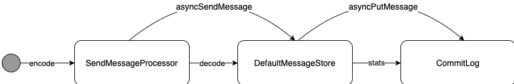

```java
// 消息存储源码
public CompletableFuture<PutMessageResult> asyncPutMessage(final MessageExtBrokerInner msg) {
  
    msg.setStoreTimestamp(System.currentTimeMillis());
    msg.setBodyCRC(UtilAll.crc32(msg.getBody()));
    AppendMessageResult result = null;
    // 记录一些指标
    StoreStatsService storeStatsService = this.defaultMessageStore.getStoreStatsService();

    String topic = msg.getTopic();
    int queueId = msg.getQueueId();

    // 延迟消息相关.(下个章节详细分析)
    final int tranType = MessageSysFlag.getTransactionValue(msg.getSysFlag());
    if (tranType == MessageSysFlag.TRANSACTION_NOT_TYPE || tranType == MessageSysFlag.TRANSACTION_COMMIT_TYPE) {
      // ...
    }

    long elapsedTimeInLock = 0;

    // rocketMQ 在创建 MappedFile 的时候, 会执行一次系统调用, 将该文件的内存映射写入到物理内存中, 以加快访问.
    // 它其实就是调用了 org.apache.rocketmq.store.util.LibC.mlock() 方法. 因此当文件写满以后, 就没必要
    // 将其映射到物理内存了, 所以这个变量, 就是来引用即将被释放的MappedFile
    MappedFile unlockMappedFile = null;

    // rocketMQ 的消息都是顺序写, 那怎么体现顺序写, 即每次消息都是只写入到最后一个 MappedFile 中.
    MappedFile mappedFile = this.mappedFileQueue.getLastMappedFile();

    // 获取锁(两种锁), 意味着写入 commit log 的时候是同步写入
    putMessageLock.lock();
    try {
      long beginLockTimestamp = this.defaultMessageStore.getSystemClock().now();
      this.beginTimeInLock = beginLockTimestamp;
      msg.setStoreimestamp(beginLockTimestamp);

      // rocketMQ第一次使用, 那就不存在 MappedFile. 或者, 当前MappedFile已经写满了. 这两种情况会重新再创建一个.
      if (null == mappedFile || mappedFile.isFull()) {
        mappedFile = this.mappedFileQueue.getLastMappedFile(0);
      }
      // 创建失败了, 直接返回结果, 同时将成员变量值 beginTimeInLock 为0
      if (null == mappedFile) {
        log.error("create mapped file1 error, topic: " + msg.getTopic() + " clientAddr: " + msg.getBornHostString());
        beginTimeInLock = 0;
        return CompletableFuture.completedFuture(new PutMessageResult(PutMessageStatus.CREATE_MAPEDFILE_FAILED, null));
      }

      // mappedFile 获取成功, 直接存储消息, 然后分析结果
      result = mappedFile.appendMessage(msg, this.appendMessageCallback);
      switch (result.getStatus()) {
        case PUT_OK:
          break;
        case END_OF_FILE:
          // 当前mappedFile文件已经写满了, 将它标识一下, 准备释放被锁定的物理内存
          unlockMappedFile = mappedFile;
          // 重新创建一个新的 MappedFile
          mappedFile = this.mappedFileQueue.getLastMappedFile(0);
          if (null == mappedFile) {
            log.error("create mapped file2 error, topic: " + msg.getTopic() + " clientAddr: " + msg.getBornHostString());
            beginTimeInLock = 0;
            return CompletableFuture.completedFuture(new PutMessageResult(PutMessageStatus.CREATE_MAPEDFILE_FAILED, result));
          }
          // 再执行一次添加消息的操作
          result = mappedFile.appendMessage(msg, this.appendMessageCallback);
          break;
        case MESSAGE_SIZE_EXCEEDED:
        case PROPERTIES_SIZE_EXCEEDED:
          // 消息过大
          beginTimeInLock = 0;
          return CompletableFuture.completedFuture(new PutMessageResult(PutMessageStatus.MESSAGE_ILLEGAL, result));
        case UNKNOWN_ERROR:
          beginTimeInLock = 0;
          return CompletableFuture.completedFuture(new PutMessageResult(PutMessageStatus.UNKNOWN_ERROR, result));
        default:
          beginTimeInLock = 0;
          return CompletableFuture.completedFuture(new PutMessageResult(PutMessageStatus.UNKNOWN_ERROR, result));
      }
      // 存储本次消息花费的时间
      elapsedTimeInLock = this.defaultMessageStore.getSystemClock().now() - beginLockTimestamp;
      beginTimeInLock = 0;
    } finally {
      putMessageLock.unlock();
    }

    // 如果存在 mappedFile 文件写满, 释放其对内存空间的锁定.
    // 原先是在这里锁住的：org.apache.rocketmq.store.MappedFile.warmMappedFile()
    if (null != unlockMappedFile && this.defaultMessageStore.getMessageStoreConfig().isWarmMapedFileEnable()) {
      this.defaultMessageStore.unlockMappedFile(unlockMappedFile);
    }

    PutMessageResult putMessageResult = new PutMessageResult(PutMessageStatus.PUT_OK, result);
    // 统计数据
    storeStatsService.getSinglePutMessageTopicTimesTotal(msg.getTopic()).incrementAndGet();
    storeStatsService.getSinglePutMessageTopicSizeTotal(topic).addAndGet(result.getWroteBytes());

    // 提交刷盘和主从同步数据的请求, 如果是异步刷盘, 那么会提交请求后直接返回; 如果是同步刷盘, 需要等到真正持久化后才会返回.
    CompletableFuture<PutMessageStatus> flushResultFuture = submitFlushRequest(result, msg);
    CompletableFuture<PutMessageStatus> replicaResultFuture = submitReplicaRequest(result, msg);
    // 方法执行到这边, 调用方线程就返回了
    return flushResultFuture.thenCombine(replicaResultFuture, (flushStatus, replicaStatus) -> {
      //... 
    });
}
```

其中 appendMessage() 虽然调用的是 mappedFile 的方法，但实际逻辑还是会通过 CommitLog 类来执行。它核心的逻辑就是将 Message 序列化成字节数组，然后保存 MappedFile 的缓冲区中，感兴趣的同学可以看看这段代码

```java
// 追加消息源码
public AppendMessageResult doAppend(final long fileFromOffset, final ByteBuffer byteBuffer, final int maxBlank, final MessageExtBrokerInner msgInner) {
            // 消息起始偏移量 = 磁盘文件起始偏移量 + 缓冲区当前可写偏移量
            long wroteOffset = fileFromOffset + byteBuffer.position();

            // IPV4地址为4个字节, IPV6地址为16个字节, 加上端口4个字节, 所以就是下面这样子
            int sysflag = msgInner.getSysFlag();
            int bornHostLength = (sysflag & MessageSysFlag.BORNHOST_V6_FLAG) == 0 ? 4 + 4 : 16 + 4;
            int storeHostLength = (sysflag & MessageSysFlag.STOREHOSTADDRESS_V6_FLAG) == 0 ? 4 + 4 : 16 + 4;
  
            // 用来存储IP地址使用
            ByteBuffer bornHostHolder = ByteBuffer.allocate(bornHostLength);
            ByteBuffer storeHostHolder = ByteBuffer.allocate(storeHostLength);
            this.resetByteBuffer(storeHostHolder, storeHostLength);

            // 生成 message id
            String msgId;
            if ((sysflag & MessageSysFlag.STOREHOSTADDRESS_V6_FLAG) == 0) {
                msgId = MessageDecoder.createMessageId(this.msgIdMemory, msgInner.getStoreHostBytes(storeHostHolder), wroteOffset);
            } else {
                msgId = MessageDecoder.createMessageId(this.msgIdV6Memory, msgInner.getStoreHostBytes(storeHostHolder), wroteOffset);
            }

            // 根据 topic + queueId, 生成key, 用来获取 consumer queue 偏移量
            keyBuilder.setLength(0);
            keyBuilder.append(msgInner.getTopic());
            keyBuilder.append('-');
            keyBuilder.append(msgInner.getQueueId());
            String key = keyBuilder.toString();
  
            // 获取 consumer queue 偏移量, 初始值为0
            Long queueOffset = CommitLog.this.topicQueueTable.get(key);
            if (null == queueOffset) {
                queueOffset = 0L;
                CommitLog.this.topicQueueTable.put(key, queueOffset);
            }

            // 事务消息相关
            final int tranType = MessageSysFlag.getTransactionValue(msgInner.getSysFlag());
            switch (tranType) {
                // 两种事务消息不会进入到 consumer queue：⑴事务准备消息、⑵事务回滚消息
                // 所以将 queueOffset 置为0
                case MessageSysFlag.TRANSACTION_PREPARED_TYPE:
                case MessageSysFlag.TRANSACTION_ROLLBACK_TYPE:
                    queueOffset = 0L;
                    break;
                case MessageSysFlag.TRANSACTION_NOT_TYPE:
                case MessageSysFlag.TRANSACTION_COMMIT_TYPE:
                default:
                    break;
            }

            /*
             * 开始序列化消息体
             */

            // 消息额外的配置
            final byte[] propertiesData = msgInner.getPropertiesString() == null ? null : msgInner.getPropertiesString().getBytes(MessageDecoder.CHARSET_UTF8);
            final int propertiesLength = propertiesData == null ? 0 : propertiesData.length;
            if (propertiesLength > Short.MAX_VALUE) {
                log.warn("putMessage message properties length too long. length={}", propertiesData.length);
                return new AppendMessageResult(AppendMessageStatus.PROPERTIES_SIZE_EXCEEDED);
            }

            // 消息主题
            final byte[] topicData = msgInner.getTopic().getBytes(MessageDecoder.CHARSET_UTF8);
            final int topicLength = topicData.length;

            // 消息内容
            final int bodyLength = msgInner.getBody() == null ? 0 : msgInner.getBody().length;

            // 最终计算消息存储到磁盘需要的字节数, 这里面会添加各式各样的数值
            final int msgLen = calMsgLength(msgInner.getSysFlag(), bodyLength, topicLength, propertiesLength);

            // 不能超过最大消息大小
            if (msgLen > this.maxMessageSize) {
                CommitLog.log.warn("message size exceeded, msg total size: " + msgLen + ", msg body size: " + bodyLength + ", maxMessageSize: " + this.maxMessageSize);
                return new AppendMessageResult(AppendMessageStatus.MESSAGE_SIZE_EXCEEDED);
            }

            // 超过了缓冲区可写的大小, 即已经写到 mappedFile 文件末尾
            if ((msgLen + END_FILE_MIN_BLANK_LENGTH) > maxBlank) {
                // 重置 msgStoreItemMemory, 将其限制可写临界值为 maxBlank, 也就是 ByteBuffer 的剩余可写字节数量了：
                // 1.写入当前可写的字节数量
                // 2.写入标识mappedFile文件结尾的魔数值
                // 3.剩下空间可以随意写东西
                this.resetByteBuffer(this.msgStoreItemMemory, maxBlank);
                this.msgStoreItemMemory.putInt(maxBlank);
                this.msgStoreItemMemory.putInt(CommitLog.BLANK_MAGIC_CODE);

                // 将标识文件末尾的魔数写入到mappedFile中
                final long beginTimeMills = CommitLog.this.defaultMessageStore.now();
                byteBuffer.put(this.msgStoreItemMemory.array(), 0, maxBlank);

                // 返回消息追加结果, 已写入到文件末尾, 无法在写入
                return new AppendMessageResult(AppendMessageStatus.END_OF_FILE, wroteOffset, maxBlank, msgId, msgInner.getStoreTimestamp(), queueOffset, CommitLog.this.defaultMessageStore.now() - beginTimeMills);
            }

            // 重置 msgStoreItemMemory, 然后准备向里面添加消息
            this.resetByteBuffer(msgStoreItemMemory, msgLen);
            // 1 TOTALSIZE
            this.msgStoreItemMemory.putInt(msgLen);
            // 2 MAGICCODE
            this.msgStoreItemMemory.putInt(CommitLog.MESSAGE_MAGIC_CODE);
            // 3 BODYCRC
            this.msgStoreItemMemory.putInt(msgInner.getBodyCRC());
            // 4 QUEUEID
            this.msgStoreItemMemory.putInt(msgInner.getQueueId());
            // 5 FLAG
            this.msgStoreItemMemory.putInt(msgInner.getFlag());
            // 6 QUEUEOFFSET
            this.msgStoreItemMemory.putLong(queueOffset);
            // 7 PHYSICALOFFSET
            this.msgStoreItemMemory.putLong(fileFromOffset + byteBuffer.position());
            // 8 SYSFLAG
            this.msgStoreItemMemory.putInt(msgInner.getSysFlag());
            // 9 BORNTIMESTAMP
            this.msgStoreItemMemory.putLong(msgInner.getBornTimestamp());
            // 10 BORNHOST
            this.resetByteBuffer(bornHostHolder, bornHostLength);
            this.msgStoreItemMemory.put(msgInner.getBornHostBytes(bornHostHolder));
            // 11 STORETIMESTAMP
            this.msgStoreItemMemory.putLong(msgInner.getStoreTimestamp());
            // 12 STOREHOSTADDRESS
            this.resetByteBuffer(storeHostHolder, storeHostLength);
            this.msgStoreItemMemory.put(msgInner.getStoreHostBytes(storeHostHolder));
            // 13 RECONSUMETIMES
            this.msgStoreItemMemory.putInt(msgInner.getReconsumeTimes());
            // 14 Prepared Transaction Offset
            this.msgStoreItemMemory.putLong(msgInner.getPreparedTransactionOffset());
            // 15 BODY
            this.msgStoreItemMemory.putInt(bodyLength);
            if (bodyLength > 0) this.msgStoreItemMemory.put(msgInner.getBody());
            // 16 TOPIC
            this.msgStoreItemMemory.put((byte) topicLength);
            this.msgStoreItemMemory.put(topicData);
            // 17 PROPERTIES
            this.msgStoreItemMemory.putShort((short) propertiesLength);
            if (propertiesLength > 0) this.msgStoreItemMemory.put(propertiesData);

            final long beginTimeMills = CommitLog.this.defaultMessageStore.now();
            // 将消息写入队列缓冲区, 此时消息写入到内存或者pageCache中, 还没有落地磁盘
            byteBuffer.put(this.msgStoreItemMemory.array(), 0, msgLen);
            AppendMessageResult result = new AppendMessageResult(AppendMessageStatus.PUT_OK, wroteOffset, msgLen, msgId, msgInner.getStoreTimestamp(), queueOffset, CommitLog.this.defaultMessageStore.now() - beginTimeMills);

            switch (tranType) {
                // 事务准备和事务回滚消息, 不需要做任何处理
                case MessageSysFlag.TRANSACTION_PREPARED_TYPE:
                case MessageSysFlag.TRANSACTION_ROLLBACK_TYPE:
                    break;
                // 非事务和事务提交消息, 需要将对应的 consumer queue 偏移量累加1
                case MessageSysFlag.TRANSACTION_NOT_TYPE:
                case MessageSysFlag.TRANSACTION_COMMIT_TYPE:
                    // The next update ConsumeQueue information
                    CommitLog.this.topicQueueTable.put(key, ++queueOffset);
                    break;
                default:
                    break;
            }

            return result;
        }
```

而对于持久化的实现，RocketMQ支持两种策略：同步刷盘（SYNC_FLUSH）和异步刷盘（ASYNC_FLUSH）

| 复 制方式 | 执行逻辑                                                     | 优点             | 缺点                         | 适应场景                 |
| --------- | ------------------------------------------------------------ | ---------------- | ---------------------------- | ------------------------ |
| 同步刷盘  | 在返回写成功状态时，消息已经被写入磁盘。具体流程是，消息写入内存的PAGECACHE后，立刻通知刷盘线程刷盘，然后等待刷盘完成，刷盘线程执行完成后唤醒等待的线程，返回消息写成功的状态 | 保证了消息不丢失 | 吞吐率相对于异步刷盘要低     | 消息可靠性要求较高的场景 |
| 异步刷盘  | 返回写成功状态，消息只是被写入了PAGECACHE，写操作的返回快，吞吐量大；当内存里的消息量积累到一定程度时，统一触发写磁盘操作，快速写入 | 系统的吞吐量提高 | 系统断电等异常时会有部分丢失 | 对应吞吐量要求较高的场景 |

刷盘逻辑统一写在 CommitLog 类中，主要有3个子线程，会根据策略来选择不同的刷盘服务，所有的刷盘服务都继承自 FlushCommitLogService ：

- FlushRealTimeService：异步刷盘策略，并且未开启堆外缓冲池配置；
- CommitRealTimeService：异步刷盘策略，并且开启堆外缓冲池配置；
- GroupCommitService：同步的刷盘策略；

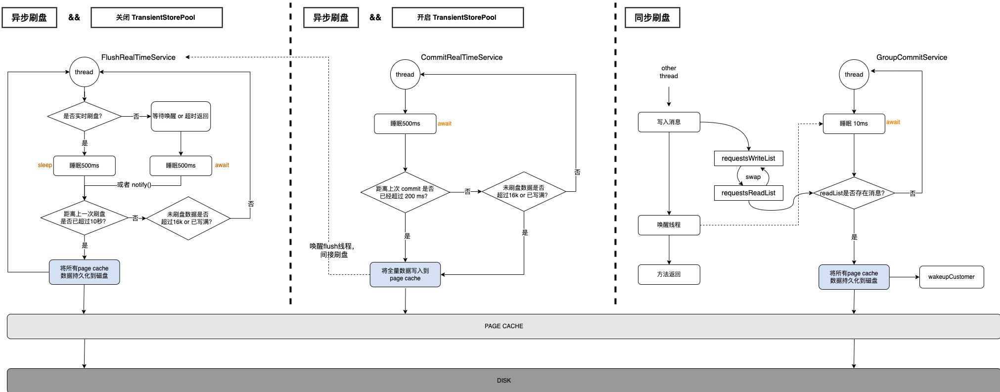

```java
// 添加消息存储的请求, 供外部线程调用.
public synchronized void putRequest(final GroupCommitRequest request) {
  // 锁住写入集合对象, 添加请求
  synchronized (this.requestsWrite) {
    this.requestsWrite.add(request);
  }
  // 调用此方法的其它线程, 会唤醒运行 GroupCommitService 的线程.
  // 其实就是下面 run() 方法的 waitForRunning() 方法, 让线程从这里返回.
  this.wakeup();
}

// 将读写集合互换, 供 GroupCommitService 内部线程自己调用. 只有在{@link #onWaitEnd()}和被关闭时被调用
private void swapRequests() {
  // 每次调用 doCommit() 方法之前, 都会先将读写两集合互换, 这样子就能让
  // putRequest() 和 doCommit() 这两处的 synchronized 同步锁锁住不同的对象.
  // 避免同步刷盘任务与其它生产者提交消息时产生的锁竞争（如果只存在一个集合, 必定只有一个线程能够处理, 另一个线程只能阻塞等待）
  List<GroupCommitRequest> tmp = this.requestsWrite;
  this.requestsWrite = this.requestsRead;
  this.requestsRead = tmp;
}

 
// 持久化
private void doCommit() {
  synchronized (this.requestsRead) {
    // 这边的 requestsRead, 就是之前调用 putRequest() 添加的请求.
    if (!this.requestsRead.isEmpty()) {
      for (GroupCommitRequest req : this.requestsRead) {
        // commitlog 当前已flush的位置如果大于等于这条消息需要刷盘的位置, 那就说明已经刷过了, 不用再flush了.
        // 需要刷新两次, 是因为消息有可能存在于下一个mappedFile中. 比如说：现在有2条消息写入了page cache, 但这2条消息一个落在前CommitLog的尾部,
        // 另外一个落在新CommitLog的头部，此时就需要检测到这两个消息的分布，然后依次将两个CommitLog数据落盘
        boolean flushOK = CommitLog.this.mappedFileQueue.getFlushedWhere() >= req.getNextOffset();
        for (int i = 0; i < 2 && !flushOK; i++) {
          CommitLog.this.mappedFileQueue.flush(0);
          flushOK = CommitLog.this.mappedFileQueue.getFlushedWhere() >= req.getNextOffset();
        }
        // 如果有数据刷盘成功后, 设置结果：org.apache.rocketmq.store.CommitLog.GroupCommitRequest.flushOKFuture,
        // 这样子阻塞在 future 的 producer 就知道消息刷盘成功，便可以返回
        req.wakeupCustomer(flushOK ? PutMessageStatus.PUT_OK : PutMessageStatus.FLUSH_DISK_TIMEOUT);
      }

      // 设置 checkpoint 的刷盘时间
      long storeTimestamp = CommitLog.this.mappedFileQueue.getStoreTimestamp();
      if (storeTimestamp > 0) {
        CommitLog.this.defaultMessageStore.getStoreCheckpoint().setPhysicMsgTimestamp(storeTimestamp);
      }
      // 清空请求, 以供下次 swapRequests() 后给生产者添加消息使用
      this.requestsRead.clear();
    } else {
      // Because of individual messages is set to not sync flush, it will come to this process
      CommitLog.this.mappedFileQueue.flush(0);
    }
  }
}
```

# 3.检索消息源码

消息的存储，是为了更高效地检索，当然这里的检索指的就是Consumer消费消息。在RocketMQ中有两种消费模式：

1. 广播模式。消费偏移量由Consumer以文本文件形式保存在本地，使用的是「LocalFileOffsetStore」，Topic的每条消息会被所有Consumer消费，每个Consumer管理自己的消费进度，两两之间不存在消费进度的交集。
2. 集群模式。消费偏移量由Broker管理，使用的是「RemoteBrokerOffsetStore」，Topic的一条消息只会被同一个Consumer Group的某个Consumer消费。

不管哪种模式，Consumer都需要向Broker发起PULL请求（在RocketMQ中不存在严格意义上的PUSH模式），通过 topic + queue + offset来定义消息：

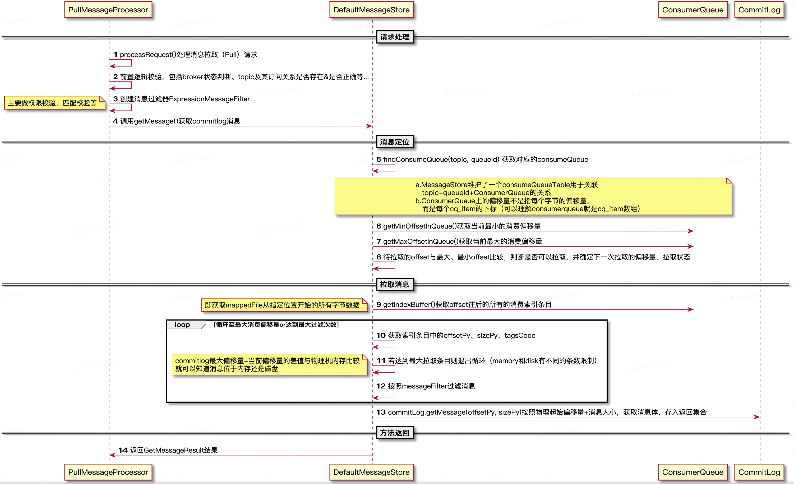

```java
// org.apache.rocketmq.store.DefaultMessageStore#getMessage
public GetMessageResult getMessage(final String group, final String topic, final int queueId, final long offset, final int maxMsgNums, final SubscriptionData subscriptionData) {
      // 是否关闭
      if (this.shutdown) {
          log.warn("message store has shutdown, so getMessage is forbidden");
         return null;
     }
     // 是否可读
      if (!this.runningFlags.isReadable()) {
         log.warn("message store is not readable, so getMessage is forbidden " + this.runningFlags.getFlagBits());
          return null;
      }
  
      long beginTime = this.getSystemClock().now();
      GetMessageStatus status = GetMessageStatus.NO_MESSAGE_IN_QUEUE;
      // 待查找队列的偏移量
      long nextBeginOffset = offset;
      // 当前队列的最小偏移量
      long minOffset = 0;
      // 当前队列的最大偏移量
      long maxOffset = 0;
  
      GetMessageResult getResult = new GetMessageResult();
  
  	  //获取消息的最大物理偏移量
      final long maxOffsetPy = this.commitLog.getMaxOffset();
  
      // 通过topic和queurId获取消费队列
      ConsumeQueue consumeQueue = findConsumeQueue(topic, queueId);
      if (consumeQueue != null) {
          minOffset = consumeQueue.getMinOffsetInQueue(); // 消费队列-最小队列编号
          maxOffset = consumeQueue.getMaxOffsetInQueue(); // 消费队列-最大队列编号
  
          // 根据offset与逻辑消费队列中的maxOffset、minOffset的比较，来设置状态值status
          if (maxOffset == 0) { // 消费队列无消息
              status = GetMessageStatus.NO_MESSAGE_IN_QUEUE;
              nextBeginOffset = nextOffsetCorrection(offset, 0);
          } else if (offset < minOffset) { // 查询offset太小
              status = GetMessageStatus.OFFSET_TOO_SMALL;
              nextBeginOffset = nextOffsetCorrection(offset, minOffset);
          } else if (offset == maxOffset) { // 查询offset 超过消费队列一个位置
              status = GetMessageStatus.OFFSET_OVERFLOW_ONE;
              nextBeginOffset = nextOffsetCorrection(offset, offset);
          } else if (offset > maxOffset) { // 查询offset 超过消费队列太多(大于一个位置)
              status = GetMessageStatus.OFFSET_OVERFLOW_BADLY;
              if (0 == minOffset) {
                  nextBeginOffset = nextOffsetCorrection(offset, minOffset);
              } else {
                  nextBeginOffset = nextOffsetCorrection(offset, maxOffset);
             }
          } else {
              // 根据消费进度offset获取到 consumerqueue 条目.
             SelectMappedBufferResult bufferConsumeQueue = consumeQueue.getIndexBuffer(offset);
              if (bufferConsumeQueue != null) {
                  try {
                      status = GetMessageStatus.NO_MATCHED_MESSAGE;
 										  // commitLog下一个文件(MappedFile)对应的开始offset
                      long nextPhyFileStartOffset = Long.MIN_VALUE;
                      // 消息物理位置拉取到的最大offset
                      long maxPhyOffsetPulling = 0; 
 
                     int i = 0;
                     // 获取消息拉取最大过滤总数
                     final int maxFilterMessageCount = 16000;
                     final boolean diskFallRecorded = this.messageStoreConfig.isDiskFallRecorded();
                     // 循环获取消息位置信息
                     for (; i < bufferConsumeQueue.getSize() && i < maxFilterMessageCount; i += ConsumeQueue.CQ_STORE_UNIT_SIZE) {
                         long offsetPy = bufferConsumeQueue.getByteBuffer().getLong(); // 消息物理位置offset
                         int sizePy = bufferConsumeQueue.getByteBuffer().getInt();     // 消息长度
                         long tagsCode = bufferConsumeQueue.getByteBuffer().getLong(); // 消息tagsCode
                        // 设置消息物理位置拉取到的最大offset
                         maxPhyOffsetPulling = offsetPy;
                         
                         if (nextPhyFileStartOffset != Long.MIN_VALUE) {
                             // 当 offsetPy 小于 nextPhyFileStartOffset 时，意味着对应的 Message 已经移除，所以直接continue，直到可读取的Message
                             if (offsetPy < nextPhyFileStartOffset)
                                 continue;
                         }
                         // 通过最大偏移量-当前数据偏移量和物理机内存大小作比较, 判断是否已经达到最大的消息拉取条数
                         boolean isInDisk = checkInDiskByCommitOffset(offsetPy, maxOffsetPy);
                         if (this.isTheBatchFull(sizePy, maxMsgNums, getResult.getBufferTotalSize(), getResult.getMessageCount(), isInDisk)) {
                              break;
                          }
                         // 判断消息是否符合条件
                         if (this.messageFilter.isMessageMatched(subscriptionData, tagsCode)) {
                             // 从commitLog获取对应消息ByteBuffer
                             SelectMappedBufferResult selectResult = this.commitLog.getMessage(offsetPy, sizePy);
                             if (selectResult != null) {
                                 this.storeStatsService.getGetMessageTransferedMsgCount().incrementAndGet();
                                 getResult.addMessage(selectResult);
                                 status = GetMessageStatus.FOUND;
                                 nextPhyFileStartOffset = Long.MIN_VALUE;
                             } else {
                                 // 从commitLog无法读取到消息，说明该消息对应的文件（MappedFile）已经删除，计算下一个MappedFile的起始位置
                                 if (getResult.getBufferTotalSize() == 0) {
                                     status = GetMessageStatus.MESSAGE_WAS_REMOVING;
                                 }
                                 nextPhyFileStartOffset = this.commitLog.rollNextFile(offsetPy);
                             }
                         } else {
                             if (getResult.getBufferTotalSize() == 0) {
                                 status = GetMessageStatus.NO_MATCHED_MESSAGE;
                             }
 
                             if (log.isDebugEnabled()) {
                                 log.debug("message type not matched, client: " + subscriptionData + " server: " + tagsCode);
                             }
                         }
                     }
                     // 统计剩余可拉取消息字节数
                     if (diskFallRecorded) {
                         long fallBehind = maxOffsetPy - maxPhyOffsetPulling;
                         brokerStatsManager.recordDiskFallBehindSize(group, topic, queueId, fallBehind);
                     }
                     // 计算下次拉取消息的消息队列编号
                     nextBeginOffset = offset + (i / ConsumeQueue.CQ_STORE_UNIT_SIZE);
                     // 根据剩余可拉取消息字节数与内存判断是否建议读取从节点
                     long diff = maxOffsetPy - maxPhyOffsetPulling;
                     long memory = (long) (StoreUtil.TOTAL_PHYSICAL_MEMORY_SIZE
                             * (this.messageStoreConfig.getAccessMessageInMemoryMaxRatio() / 100.0));
                     getResult.setSuggestPullingFromSlave(diff > memory);
                 } finally {
                     bufferConsumeQueue.release();
                 }
             } else {
                 status = GetMessageStatus.OFFSET_FOUND_NULL;
                 nextBeginOffset = nextOffsetCorrection(offset, consumeQueue.rollNextFile(offset));
                 log.warn("consumer request topic: " + topic + "offset: " + offset + " minOffset: " + minOffset + " maxOffset: "
                     + maxOffset + ", but access logic queue failed.");
             }
         }
     } else {
         status = GetMessageStatus.NO_MATCHED_LOGIC_QUEUE;
         nextBeginOffset = nextOffsetCorrection(offset, 0);
     }
     // 指标统计
     if (GetMessageStatus.FOUND == status) {
         this.storeStatsService.getGetMessageTimesTotalFound().incrementAndGet();
     } else {
         this.storeStatsService.getGetMessageTimesTotalMiss().incrementAndGet();
     }
     long eclipseTime = this.getSystemClock().now() - beginTime;
     this.storeStatsService.setGetMessageEntireTimeMax(eclipseTime);
     // 设置返回结果
     getResult.setStatus(status);
     getResult.setNextBeginOffset(nextBeginOffset);
     getResult.setMaxOffset(maxOffset);
     getResult.setMinOffset(minOffset);
     return getResult;
 }
```

# 4.延迟消息源码

RocketMQ 天然支持延迟消息，它允许生产者发送消息后并不立即对消费者可见，而是在指定的时间投递给消费者。不过RocketMQ并不支持任意时间的延迟消息，它规定了一系列的延迟等级，不同的延迟等级对应不同的时间。默认的延迟等级位于org.apache.rocketmq.store.config.MessageStoreConfig#messageDelayLevel

```java
/**
 * 延迟队列等级（s=秒，m=分，h=小时)
 */
private String messageDelayLevel = "1s 5s 10s 30s 1m 2m 3m 4m 5m 6m 7m 8m 9m 10m 20m 30m 1h 2h";
```

那么 RocketMQ 是如何实现延迟消息的？分两步进行：① commitLog的消息重写；②ScheduleMessageService的消息重投递。

【消息重写】

commitlog如果发现是延迟消息，它会将原消息的 topic 和 queueId 存储到 properties 属性中，然后将 topic 重写为 **SCHEDULE_TOPIC_XXXX**，并根据延迟级别延迟消息变更了新的队列Id，然后把这条消息直接存储到 commitlog 文件中。

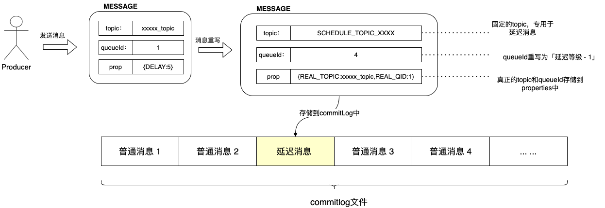

```java
/**
 * org.apache.rocketmq.store.CommitLog#asyncPutMessage
 */
public CompletableFuture<PutMessageResult> asyncPutMessage(final MessageExtBrokerInner msg) {
  	// 代码省略
    // ...
  
  	// rocketMQ 当它发现一个消息被配置了延迟属性时, 它会重新将消息的 topic 和 queueId 更换为内部使用的
    // 延迟队列topic再存储. 最后把消息真实的 topic 和 queueId 保存到 MessageExtBrokerInner.propertiesString 属性中.
    if (msg.getDelayTimeLevel() > 0) {
      if (msg.getDelayTimeLevel() > this.defaultMessageStore.getScheduleMessageService().getMaxDelayLevel()) {
        msg.setDelayTimeLevel(this.defaultMessageStore.getScheduleMessageService().getMaxDelayLevel());
      }
      // 消息要存储的主题和队列信息
      topic = TopicValidator.RMQ_SYS_SCHEDULE_TOPIC;
      queueId = ScheduleMessageService.delayLevel2QueueId(msg.getDelayTimeLevel());

      // 备份原先消息真实 topic 和 queueId
      MessageAccessor.putProperty(msg, MessageConst.PROPERTY_REAL_TOPIC, msg.getTopic());
      MessageAccessor.putProperty(msg, MessageConst.PROPERTY_REAL_QUEUE_ID, String.valueOf(msg.getQueueId()));
      msg.setPropertiesString(MessageDecoder.messageProperties2String(msg.getProperties()));

      // 将延迟消息队列和主题设置进去, 消息还是存储在commit log中,
      // 只不过后续线程会将其存到延迟队列专用的 consumer queue中
      msg.setTopic(topic);
      msg.setQueueId(queueId);
    }
}
```

【消息重投递】

前面我们分析过 ConsumerQueue，对于写入到 commitlog 文件的消息都会被分发到 ConsumerQueue 和 IndexFile 中。同理，延迟消息也会被分发进去。RocketMQ 使用 **org.apache.rocketmq.store.schedule.ScheduleMessageService** 定时地从 ConsumerQueue 中获取到延迟消息的 commitlog 偏移量，再从 commitlog 中检索出延迟消息，还原topic和queueId 再重新存储到 commitlog 文件中。

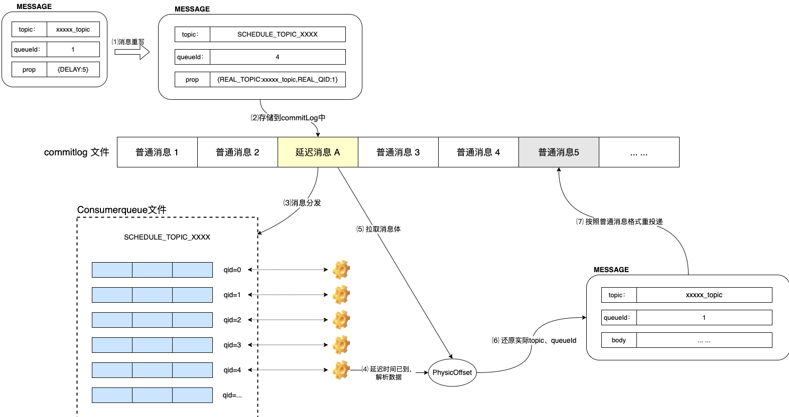

```java
// org.apache.rocketmq.store.schedule.ScheduleMessageService.DeliverDelayedMessageTimerTask
class DeliverDelayedMessageTimerTask extends TimerTask {
  
  public void executeOnTimeup() {
    // rocketMQ对于延迟消息, 自己定义了一个主题名称, 就是：SCHEDULE_TOPIC_XXXX, 所有配置了延迟功能的消息都会先存储到这个主题上.
    // 延迟等级减一得到的值就表示队列号-queueId. 通过这两个值可以定位到 consumer queue, 不同的延迟等级具有不同的消费队列
    ConsumeQueue cq = ScheduleMessageService.this.defaultMessageStore.findConsumeQueue(TopicValidator.RMQ_SYS_SCHEDULE_TOPIC, delayLevel2QueueId(delayLevel));
    
    // ...代码省略
    
    if (cq != null) {
      // 查询偏移量在对应的 consumerqueue 中的数据
      SelectMappedBufferResult bufferCQ = cq.getIndexBuffer(this.offset);
      if (bufferCQ != null) {
        try {
          long nextOffset = offset;
          int i = 0;
          ConsumeQueueExt.CqExtUnit cqExtUnit = new ConsumeQueueExt.CqExtUnit();

          // 依次取出当前级别的延迟队列中的每条consumer queue消息.
          for (; i < bufferCQ.getSize(); i += ConsumeQueue.CQ_STORE_UNIT_SIZE) {

            // 取出 consumer queue 的存储结构, 依次是：commitlog偏移量、消息大小、消息标签编码(在这里存储的是要推送的时间点)
            long offsetPy = bufferCQ.getByteBuffer().getLong();
            int sizePy = bufferCQ.getByteBuffer().getInt();
            long tagsCode = bufferCQ.getByteBuffer().getLong();
 
            // ... 代码省略

            // 获取当前时间, 同时根据消息配置, 计算它需要被推送的时间
            long now = System.currentTimeMillis();
            long deliverTimestamp = this.correctDeliverTimestamp(now, tagsCode);

            // ... 代码省略
            
            // 计算需要延迟的时间
            long countdown = deliverTimestamp - now;

            // 如果不需要延迟了, 那么立即推送
            if (countdown <= 0) {
              // 通过 commit log 物理偏移量和消息大小, 定位到消息, 对其进行解码得到 MessageExt
              MessageExt msgExt = ScheduleMessageService.this.defaultMessageStore.lookMessageByOffset(offsetPy, sizePy);
              if (msgExt != null) {
                try {
                  // 解析延迟消息, 还原出它真实的 topic 和 queueId
                  MessageExtBrokerInner msgInner = this.messageTimeup(msgExt);
                  
                  // ...代码省略
                  
                  // 将其再保存到 commit log 中(注意：之前已经存储过一次commit log了, 这边会重新再存储一次)
                  // DefaultMessageStore 有一个专门的重刷线程：ReputMessageService, 用来解析 commit log 保存到 consumer queue中.
                  PutMessageResult putMessageResult = ScheduleMessageService.this.writeMessageStore.putMessage(msgInner);

                  // ...代码省略
                  
                } catch (Exception e) {
                  log.error("ScheduleMessageService, messageTimeup execute error, drop it. msgExt=" + msgExt + ", nextOffset=" + nextOffset + ",offsetPy=" + offsetPy + ",sizePy=" + sizePy, e);
                }
              }
            } 
            // ...
          }
        } finally {
          bufferCQ.release();
        }
      }
      // ...
    }
    // 重新将这个级别, failScheduleOffset偏移量的任务丢到timer中, 此时延迟执行的时间变为100ms
    ScheduleMessageService.this.timer.schedule(new DeliverDelayedMessageTimerTask(this.delayLevel, failScheduleOffset), DELAY_FOR_A_WHILE);
  }
}
```

# 5.事务消息源码

RocketMQ 事务消息设计主要是为了解决 Producer 端的消息发送与本地事务执行的原子性问题，它采用2PC(两段式协议) + 补偿机制（事务回查）实现事务消息，在4.3.0版本中开始支持事务。其整体交互流程：

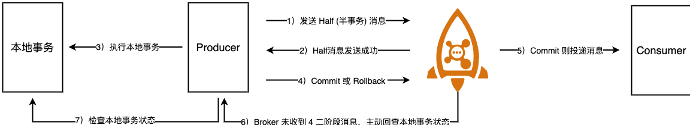

```java
// org.apache.rocketmq.client.impl.producer.DefaultMQProducerImpl#sendMessageInTransaction
public TransactionSendResult sendMessageInTransaction(final Message msg, final LocalTransactionExecuter localTransactionExecuter, final Object arg) throws MQClientException {
        // 需要用户实现
        TransactionListener transactionListener = getCheckListener();
  
       // ... 代码省略

        SendResult sendResult = null;
        // 设置事务属性, 告诉broker这条消息是事务消息
        MessageAccessor.putProperty(msg, MessageConst.PROPERTY_TRANSACTION_PREPARED, "true");
        MessageAccessor.putProperty(msg, MessageConst.PROPERTY_PRODUCER_GROUP, this.defaultMQProducer.getProducerGroup());
        try {
            // 发送Half消息
            sendResult = this.send(msg);
        } catch (Exception e) {
            throw new MQClientException("send message Exception", e);
        }

        LocalTransactionState localTransactionState = LocalTransactionState.UNKNOW;
        Throwable localException = null;
        switch (sendResult.getSendStatus()) {
            case SEND_OK: {
                try {
                    if (sendResult.getTransactionId() != null) {
                        msg.putUserProperty("__transactionId__", sendResult.getTransactionId());
                    }
                    String transactionId = msg.getProperty(MessageConst.PROPERTY_UNIQ_CLIENT_MESSAGE_ID_KEYIDX);
                    if (null != transactionId && !"".equals(transactionId)) {
                        msg.setTransactionId(transactionId);
                    }
                    if (null != localTransactionExecuter) {
                        localTransactionState = localTransactionExecuter.executeLocalTransactionBranch(msg, arg);
                    } else if (transactionListener != null) {
                        // 发送半事务消息(half)成功, 执行本地事务
                        localTransactionState = transactionListener.executeLocalTransaction(msg, arg);
                    }
                    // ... 省略
                } catch (Throwable e) {
                    localException = e;
                }
            }
            break;
            case FLUSH_DISK_TIMEOUT:
            case FLUSH_SLAVE_TIMEOUT:
            case SLAVE_NOT_AVAILABLE:
                localTransactionState = LocalTransactionState.ROLLBACK_MESSAGE;
                break;
            default:
                break;
        }

        try {
            // 根据half消息是否发送成功 or 本地事务是否执行成功, 以便通知broker该怎么处理这条half消息.
            // 上述两个场景, 任意一个失败会删除此half消息.
            this.endTransaction(sendResult, localTransactionState, localException);
        } catch (Exception e) {
            log.warn("local transaction execute " + localTransactionState + ", but end broker transaction failed", e);
        }
        // ...省略代码
        return transactionSendResult;
    }
```

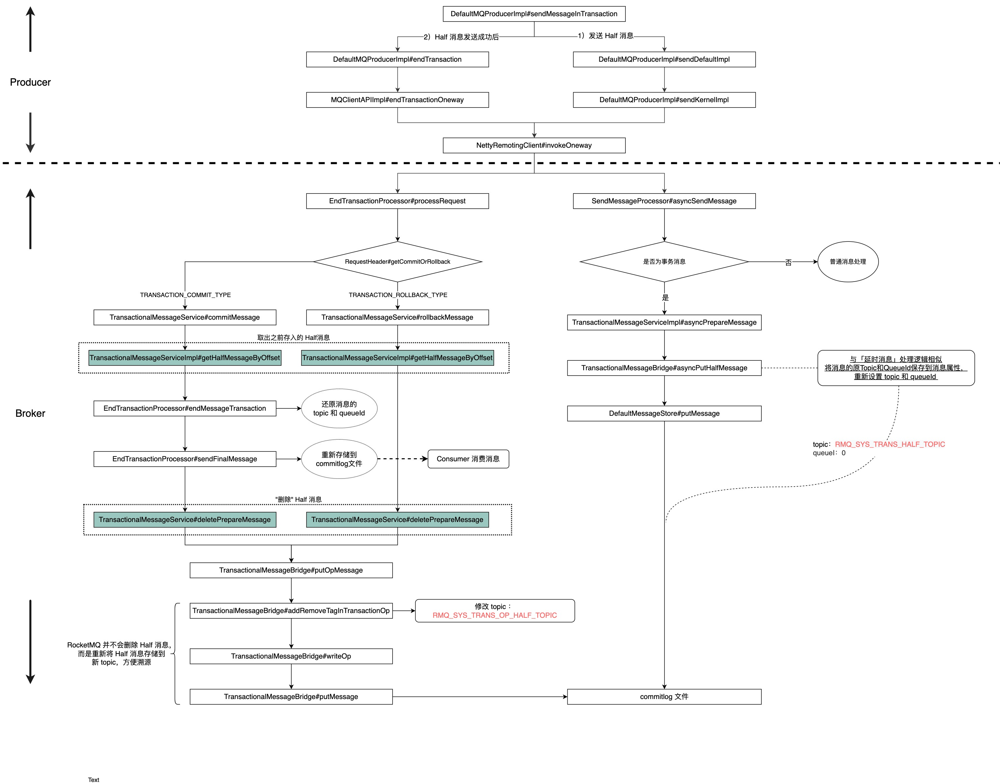

