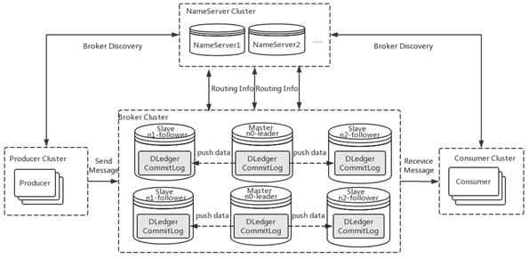
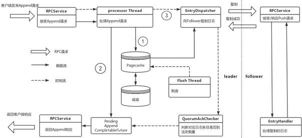
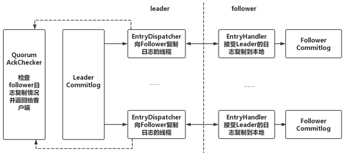
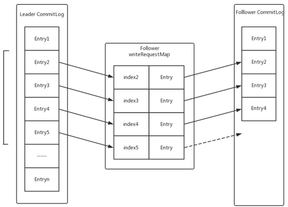

RocketMQ 4.5 版本之前 Master 宕机，需要人为手动重启&切换。为了能够实现自动故障转移，本质上也是自动选主的问题，一般有两种解决方案：

1. 第三方协调rocketMQ集群完成选主：比如zk或者ectd。
2. 使用raft协议完成自动选主，raft协议无需引入外部组件，它集成到rocketMQ节点进程中，通过节点通信实现

rocketMQ选用raft协议来重构，DLedger就是一个基于raft 协议的commitlog存储库。DLedger是一个轻量级的库，进提供 append() 和 get()，append()方法向DLedger添加数据，然后返回一个递增的索引；而 get() 可以根据索引获得相应的数据。

# 1.DLedger集成

RocketMQ 4.5 版本发布后，可以采用 RocketMQ on DLedger 方式进行部署。DLedger commitlog 代替了原来的 commitlog，使得 commitlog 拥有了选举复制能力，然后通过角色透传的方式，raft 角色透传给外部 broker 角色，leader 对应原来的 master，follower 和 candidate 对应原来的 slave。

在一组 broker 中， Master 挂了以后，依靠 DLedger 自动选主能力，会重新选出 leader，然后通过角色透传变成新的 Master。

# 2.消息复制

raft协议复制，先发送消息给leader，leader本地存储先，然后消息复制给follower，等待follower确认，若得到多数节点确认，该消息就可以被提交，并向客户端发送成功的确认。DLedger优化这一过程：

## 2.1.异步线程模型

DLedger 采用一个异步线程模型，异步线程模型可以减少等待

1. DLedger通信模块基于netty实现，当客户端发送append请求，I/O线程将请求发给业务线程池，I/O线程会处理下一个请求；
2. 业务线程将append数据写入日志（即pagecache）生成Append CompletableFuture 存入Pending Map，由于该日志还没被follower确认，此时是一个判定状态；
3. 业务线程唤醒EnrtyDispatcher 线程（该线程会去向follower复制日志）此时业务线程就可以处理下一个append请求；
4. 复制线程 EntryDispatcher 会向 follower 复制日志，每一个 follower 都对应一个 EntryDispatcher 线程，该线程去记录自己对应 follower 的复制位点；
5. 每次位点移动后都会去通知 QurumAckChecker 线程，这个线程会根据复制位点的情况，判断是否一条日志已经复制到多数节点上，如果已被复制到了多数节点，该日志就可以被提交，并去完成对应的 Append CompletableFuture ，通知通信模块向客户端返回响应

## 2.2.独立并发的复制过程

在 DLedger 中，leader 向所有 follower 发送日志也是完全相互独立和并发的，leader 为每个 follower 分配一个线程去复制日志，并记录相应的复制位点，然后再由一个单独的异步线程根据位点情况检测日志是否被复制到了多数节点上，返回给客户端响应。

## 2.3.日志并行复制

传统的线性复制是 leader 向 follower 复制日志，follower 确认后下一个日志条目再复制，也就是 leader 要等待 follower 对前一条日志确认后才能复制下一条日志。这样的复制方式保证了顺序性，且不会出错，但吞吐量很低，时延也比较高，因此DLedger设计并实现日志并行复制的方案，不再需要等待前一个日志复制完成再复制下一个日志，只需在 follower 中维护一个按照日志索引排序请求列表， follower 线程按照索引顺序串行处理这些复制请求。而对于并行复制后可能出现数据缺失问题，可以通过少量数据重传解决。