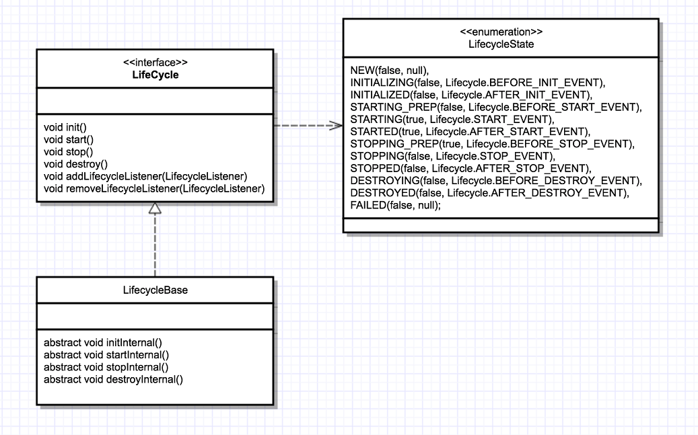

# 1.生命周期组件

架构设计就是要找到系统的变化点和不变点。Tomcat的不变点就是每个组件都要经历创建、初始化、启动和销毁这4个过程，这些状态以及状态的转化是不变的。而变化点是每个组件的生命周期方法实现不一样。基于这一考虑，Tomcat开发者，定义了Lifecycle接口。接口里定义了：init()、start()、stop() 和 destroy()，每个具体的组件去实现这些方法。

## 1.1.Lifecycle

`org.apache.catalina.Lifecycle`主要定义了Tomcat组件生命周期方法，以及增删查`org.apache.catalina.LifecycleListener`的方法，源码为

```java
public interface Lifecycle {
  	/*
  	 * 当期组件的监听器
  	 */
  	void addLifecycleListener(LifecycleListener listener);
  	LifecycleListener[] findLifecycleListeners();
  	void removeLifecycleListener(LifecycleListener listener);
  
  	// 组件被创建出来, 进行初始化时调用
  	void init() throws LifecycleException;
  
  	// 组件启动时, 会调用此方法
  	void start() throws LifecycleException;
  
  	// 组件停止时, 会调用此方法
  	void stop() throws LifecycleException;
  
  	// 组件销毁时, 会调用此方法
  	void destroy() throws LifecycleException;
}
```

其中，每个组件在一个瞬时间内，都会处于一个状态，这个状态Tomcat用`org.apache.catalina.LifecycleState`来表示，源码为：

```java
public enum LifecycleState {
  	// 创建后未初始化前, 处于这个状态
    NEW(false, null),
  
  	// 依次表示：初始化中、初始化后
    INITIALIZING(false, Lifecycle.BEFORE_INIT_EVENT),
    INITIALIZED(false, Lifecycle.AFTER_INIT_EVENT),
  
  	// 依次表示：开启前、启动中、开启后
    STARTING_PREP(false, Lifecycle.BEFORE_START_EVENT),
    STARTING(true, Lifecycle.START_EVENT),
    STARTED(true, Lifecycle.AFTER_START_EVENT),
  
  	// 依次表示：关闭前、关闭时、关闭后
    STOPPING_PREP(true, Lifecycle.BEFORE_STOP_EVENT),
    STOPPING(false, Lifecycle.STOP_EVENT),
    STOPPED(false, Lifecycle.AFTER_STOP_EVENT),
  
  	// 依次表示：销毁前、销毁时、销毁后
    DESTROYING(false, Lifecycle.BEFORE_DESTROY_EVENT),
    DESTROYED(false, Lifecycle.AFTER_DESTROY_EVENT),
    FAILED(false, null);

  	// avaiable为true时, 表示当期组件可以被使用
    private final boolean available;
  	// lifecycleEvent是对 LifecycleState 的事件描述, 放在Lifecycle中
    private final String lifecycleEvent;
}
```

## 1.2.LifecycleBase

`org.apache.catalina.util.LifecycleBase`是`org.apache.catalina.Lifecycle`的基本实现，其实这是一种`模板设计模式`的实现，LifecycleBase实现了原先Lifecycle定义的4个生命周期方法，然后对它进行了状态判断 + 监听器回调(这些都是所有组件通用的逻辑，所以Tomcat将其放到了抽象父类中，然后再抽象父类中定义模板方法，把子类即具体组件的真正逻辑放到模板方法里面)。重要属性如下：

```java
public abstract class LifecycleBase implements Lifecycle {
  	// 该组件的监听器集合, 用的是CopyOnWriteArrayList, 线程安全, 适用于读多写少的场景
  	private final List<LifecycleListener> lifecycleListeners = new CopyOnWriteArrayList<>();
  
  	// 当前组件的状态, 加上了 volatile, 可以达到线程可见性. 同时, 每个组件一创建, 都是属于 NEW 即创建状态
  	private volatile LifecycleState state = LifecycleState.NEW;
}
```

此外，LifecycleBase还额外定义如下4种类型的生命周期方法：



- 组件初始化

```java
/**
 * 实现自Lifecycle的init()方法
 */
public final synchronized void init() throws LifecycleException {
    // 只有组件状态为 LifecycleState.NEW 时, 才能初始化
    if (!state.equals(LifecycleState.NEW)) {
        invalidTransition(Lifecycle.BEFORE_INIT_EVENT);
    }
    try {
        // 生命周期监听器 org.apache.catalina.LifecycleEvent, 初始化前事件回调
        setStateInternal(LifecycleState.INITIALIZING, null, false);
        // 子类组件真正执行初始化的逻辑
        initInternal();
        // 生命周期监听器 org.apache.catalina.LifecycleEvent, 初始化后事件回调
        setStateInternal(LifecycleState.INITIALIZED, null, false);
    } catch (Throwable t) {
        handleSubClassException(t, "lifecycleBase.initFail", toString());
    }
}

/**
 * 具体组件的真正初始化逻辑
 */
protected abstract void initInternal() throws LifecycleException;
```

- 组件启动

```java
/**
 * 实现自Lifecycle的start()方法
 */
public final synchronized void start() throws LifecycleException {
    // 处理启动前、启动中、启动后这3个状态时, 表示已经启动状态, 无须再次启动, 方法返回.
    if (LifecycleState.STARTING_PREP.equals(state) || 
        LifecycleState.STARTING.equals(state) ||
        LifecycleState.STARTED.equals(state)) {
        // ... 省略日志
        return;
    }

    if (state.equals(LifecycleState.NEW)) {
        // 如果处于NEW即创建状态, 则执行初始化, 调用上面的init()方法
        init();
    } else if (state.equals(LifecycleState.FAILED)) {
        // 如果处于失败状态, 调用stop()将组件停止
        stop();
    } else if (!state.equals(LifecycleState.INITIALIZED) && 
               !state.equals(LifecycleState.STOPPED)) {
        // 只有处于 初始化 或者 已停止 这两个状态时, 才允许启动, 其它状态抛出异常
        // LifecycleException
        invalidTransition(Lifecycle.BEFORE_START_EVENT);
    }

    try {
        // 生命周期监听器 org.apache.catalina.LifecycleEvent, 启动前事件回调
        setStateInternal(LifecycleState.STARTING_PREP, null, false);
        // 真正启动逻辑
        startInternal();

        if (state.equals(LifecycleState.FAILED)) {
            // 如果启动失败, 组件会将自己的state改为FAILED, 此时就会回调stop()方法, 停止组件
            stop();
        } else if (!state.equals(LifecycleState.STARTING)) {
            // 如果不处于启动中的状态, 说明子类乱设置状态, 抛出LifecycleException
            invalidTransition(Lifecycle.AFTER_START_EVENT);
        } else {
            // 生命周期监听器 org.apache.catalina.LifecycleEvent, 启动后事件回调
            setStateInternal(LifecycleState.STARTED, null, false);
        }
    } catch (Throwable t) {
        // This is an 'uncontrolled' failure so put the component into the
        // FAILED state and throw an exception.
        handleSubClassException(t, "lifecycleBase.startFail", toString());
    }
}

/**
 * 具体组件的真正启动逻辑
 */
protected abstract void startInternal() throws LifecycleException;
```

- 组件关闭

```java
/**
 * 实现自Lifecycle的stop()方法
 */
public final synchronized void stop() throws LifecycleException {

    // 组件已停止, 即处于 停止前、停止中、停止后 这3个状态时, 直接返回
    if (LifecycleState.STOPPING_PREP.equals(state) || 
        LifecycleState.STOPPING.equals(state) ||
        LifecycleState.STOPPED.equals(state)) {
        // ...省略日志
        return;
    }

    if (state.equals(LifecycleState.NEW)) {
        // 组件刚创建出来, 没有初始化, 就没有创建资源, 直接修改它的状态, 然后返回
        state = LifecycleState.STOPPED;
        return;
    }

    if (!state.equals(LifecycleState.STARTED) && 
        !state.equals(LifecycleState.FAILED)) {
        // 只有处于 启动中 || 已失败 状态的组件, 才可以停止.
        invalidTransition(Lifecycle.BEFORE_STOP_EVENT);
    }

    try {
        if (state.equals(LifecycleState.FAILED)) {
            // 如果组件是处于失败状态, 不需要过渡到STOPPING_PREP状态, 
            // 直接触发STOPPING_PREP事件回调就行了
            fireLifecycleEvent(BEFORE_STOP_EVENT, null);
        } else {
            // 如果是启动中状态的组件被停止了, 那就需要过渡到STOPPING_PREP状态, 
            // 同时触发监听器回调.
            setStateInternal(LifecycleState.STOPPING_PREP, null, false);
        }
        // 真正停止组件
        stopInternal();

        if (!state.equals(LifecycleState.STOPPING) && 
            !state.equals(LifecycleState.FAILED)) {
            // 执行停止逻辑后的组件, 只允许处于STOPPING || FAILED状态, 
            // 其它状态说明出现了乱设置状态的问题, 直接抛异常
            invalidTransition(Lifecycle.AFTER_STOP_EVENT);
        }
        // 生命周期监听器 org.apache.catalina.LifecycleEvent, 停止后事件回调
        setStateInternal(LifecycleState.STOPPED, null, false);
    } catch (Throwable t) {
        handleSubClassException(t, "lifecycleBase.stopFail", toString());
    } finally {
        if (this instanceof Lifecycle.SingleUse) {
            // Complete stop process first
            setStateInternal(LifecycleState.STOPPED, null, false);
            destroy();
        }
    }
}

/**
 * 具体组件的真正停止逻辑
 */
protected abstract void stopInternal() throws LifecycleException;
```

- 组件销毁

```java
public final synchronized void destroy() throws LifecycleException {
    if (LifecycleState.FAILED.equals(state)) {
        try {
            // 组件处于FAILED状态, 直接回调上面的stop()方法将其停止
            stop();
        } catch (LifecycleException e) {
            // Just log. Still want to destroy.
            log.error(sm.getString("lifecycleBase.destroyStopFail", toString()), e);
        }
    }

    if (LifecycleState.DESTROYING.equals(state) || 
        LifecycleState.DESTROYED.equals(state)) {
        // 已经处于销毁状态, 无需重复销毁, 直接返回
        // ...这里省略掉日志
        return;
    }

    if (!state.equals(LifecycleState.STOPPED) &&
        !state.equals(LifecycleState.FAILED) &&
        !state.equals(LifecycleState.NEW) && 
        !state.equals(LifecycleState.INITIALIZED)) {
        // 只有处于这四种状态的组件, 才允许销毁：STOPPED、FAILED、NEW、INITIALIZED
        invalidTransition(Lifecycle.BEFORE_DESTROY_EVENT);
    }

    try {
        // 生命周期监听器 org.apache.catalina.LifecycleEvent, 销毁前事件回调
        setStateInternal(LifecycleState.DESTROYING, null, false);
        // 执行真正销毁逻辑
        destroyInternal();
        // 生命周期监听器 org.apache.catalina.LifecycleEvent, 销毁后事件回调
        setStateInternal(LifecycleState.DESTROYED, null, false);
    } catch (Throwable t) {
        handleSubClassException(t, "lifecycleBase.destroyFail", toString());
    }
}

/**
 * 具体组件的真正销毁逻辑
 */
protected abstract void destroyInternal() throws LifecycleException;
```

## 1.3.补充

- Tomcat 自定义了一些监听器，这些监听器是父组件在创建子组件的过程中注册到子组件的。比如 MemoryLeakTrackingListener 监听器，用来检测 Context 容器中的内存泄漏，这个监听器是 Host 容器在创建 Context 容器时注册到 Context 中的；

- 还可以在 server.xml 中定义自己的监听器，Tomcat 在启动时会解析 server.xml，创建监听器并注册到容器组件；

- Tomcat具有`一键启停性`！其原理就是父容器调用生命周期方法时，会连带调用子容器的生命周期方法。举个例子：在Tomcat中Service包含Connector和Engine，所以它初始化的时候，会调用这两个容器的初始化

```java
// 源码：org.apache.catalina.core.StandardService - 510
protected void initInternal() throws LifecycleException {
    super.initInternal();

    if (engine != null) {
        // 容器初始化, 会连带初始化子容器Host
        engine.init();
    }

    // ...省略部分代码

    // 初始化连接器.
    synchronized (connectorsLock) {
        for (Connector connector : connectors) {
            connector.init();
        }
    }
}
```

# 2.容器启动流程

tomcat启动的入口点在`org.apache.catalina.startup.Bootstrap`这个类，它有一个静态代码块和一个main()方法。静态代码块的作用就是确定`catalina.home`的文件目录，就是tomcat存放配置文件的目录；main()方法的作用会创建Catalina实例，通过它创建出各个Tomcat组件，然后启动。

```java
public static void main(String[] args) {
  // 第一步,  先创建实例
  synchronized (daemonLock) {
    if (daemon == null) {
      Bootstrap bootstrap = new Bootstrap();
      try {
        // 初始化tomcat自己的类加载器、实例化Catalina等.
        // 实际Tomcat启停都是操作Catalina
        bootstrap.init();
      } catch (Throwable t) {
        handleThrowable(t);
        t.printStackTrace();
        return;
      }
      daemon = bootstrap;
    } else {
      Thread.currentThread().setContextClassLoader(daemon.catalinaLoader);
    }
  }
  
  // ...省略其它代码
  // 设置 org.apache.catalina.startup.Catalina 的 await 属性为true. 
  // 因为tomcat默认会在8005开一个ServerSocket用于管理tomcat服务,
  // 所以会让tomcat服务在那个端口上等待, 前提是这个 await 属性值要为true.
  daemon.setAwait(true);

  // 先加载：调用 org.apache.catalina.startup.Catalina#load() 方法
  daemon.load(args);

  // 再启动：调用 org.apache.catalina.startup.Catalina#start() 方法
  daemon.start();
}
```

## 2.1.load()

实际会调用Catalina#load()方法先加载Tomcat的各个组件

```java
public void load() {
  // 防止重复加载
  if (loaded) {
    return;
  }
  loaded = true;

  long t1 = System.nanoTime();

  // 听说 tomcat 10 就会被删除掉.
  initDirs();

  // 这里面涉及JNDI(Java命名和目录接口), JNDI可以：访问文件系统中的文件、定位远程
  // RMI注册的对象，访问象LDAP这样的目录服务，定位网络上的EJB组件等等.
  // 其中, javax.naming.Context 是命名服务执行查询的入口, tomcat会设值系统属性
  // java.naming.factory.initial 为org.apache.naming.java.javaURLContextFactory.
  initNaming();

  // 解析 ../conf/server.xml, 这是tomcat核心配置之一, 它会定义 Server、Service、Connector、
  // Engine、Host、Context和Listener等组件.会把配置文件的内容解析到 
  // org.apache.catalina.startup.Catalina#server属性上
  parseServerXml(true);
  // 有了上面的解析, 就可以获取到 org.apache.catalina.Server, 
  // 注意Server里面有连带它的其它组件信息噢
  Server s = getServer();
  if (s == null) {
    return;
  }
  // 设置 Server 的catalina根目录
  getServer().setCatalina(this);
  getServer().setCatalinaHome(Bootstrap.getCatalinaHomeFile());
  getServer().setCatalinaBase(Bootstrap.getCatalinaBaseFile());

  // tomcat使用装饰者模式, 替换了 java 自带的 System.out and System.err
  initStreams();

  // Start the new server
  try {
    // 初始化 Server, tomcat的生命周期组件, 父组件触发生命周期的方法, 会联动旗下的子组件一起触发.
    // tomcat生命周期方法, 一般有两层：
    // 一是, 抽象父类 org.apache.catalina.util.LifecycleBase 实现的, 做状态检查和回调监听器的.
    // 二是, 具体子类(这边是org.apache.catalina.core.StandardServer)的实际运行逻辑.
    // 各个组件的源码分析：https://github.com/shenyanming95/sym_tomcat
    getServer().init();
  } catch (LifecycleException e) {
    if (Boolean.getBoolean("org.apache.catalina.startup.EXIT_ON_INIT_FAILURE")) {
      throw new java.lang.Error(e);
    } else {
      log.error(sm.getString("catalina.initError"), e);
    }
  }
}
```

## 2.2.start()

实际是调用Catalina#start()方法启动容器

```java
public void start() {
  // 如果Server为空, 先加载
  if (getServer() == null) {
    load();
  }
  // 还为空, 说明有异常
  if (getServer() == null) {
    log.fatal(sm.getString("catalina.noServer"));
    return;
  }
  long t1 = System.nanoTime();
  try {
    // 启动Server, 就是启动Tomcat实例. 由于Tomcat在设计上使用了LifeCycle, 上层组件的启动,
    // 会连带它关联的下层组件的启动, 这就是一键启停的设计精华.
    // 各个组件的源码分析：https://github.com/shenyanming95/sym_tomcat
    getServer().start();
  } catch (LifecycleException e) {
    log.fatal(sm.getString("catalina.serverStartFail"), e);
    try {
      getServer().destroy();
    } catch (LifecycleException e1) {
      log.debug("destroy() failed for failed Server ", e1);
    }
    return;
  }

  // 注册停止tomcat的钩子函数
  if (useShutdownHook) {
    if (shutdownHook == null) {
      shutdownHook = new CatalinaShutdownHook();
    }
    Runtime.getRuntime().addShutdownHook(shutdownHook);
    // If JULI is being used, disable JULI's shutdown hook since
    // shutdown hooks run in parallel and log messages may be lost
    // if JULI's hook completes before the CatalinaShutdownHook()
    LogManager logManager = LogManager.getLogManager();
    if (logManager instanceof ClassLoaderLogManager) {
      ((ClassLoaderLogManager) logManager).setUseShutdownHook(
        false);
    }
  }

  if (await) {
    // Tomcat实例会在这边阻塞住, 等待停止的命令
    await();
    // 如果发起了停止指令, 调用stop()方法
    stop();
  }
}
```

# 3.处理Socket流程


# 4.处理Request流程