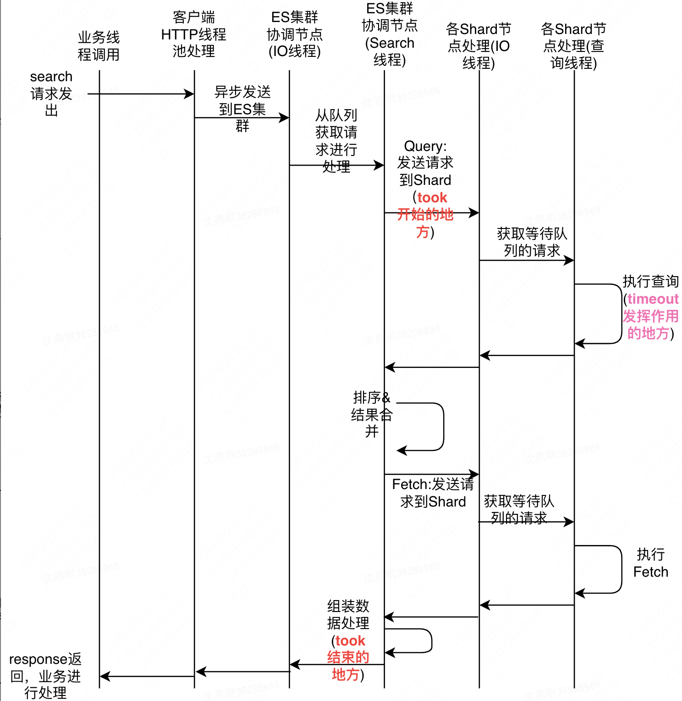

# 1.ES安装

## 1.1.window

### 1.1.1.单机单服务

在window环境下，直接将下载好的ES压缩包解压，找到解压目录下的..\elasticsearch-5.6.9\bin下面的elasticsearch.bat，双击即可运行，打开浏览器，输入：[http://localhost:9200](http://localhost:9200)，能返回JSON信息说明启动成功，把ES安装成一个服务：到ES安装目录的bin目录，执行命令：

```bash
elasticsearch-service.bat install
```

启动ES也可以执行命令：

```bash
elasticsearch-service.bat start
```

### 1.1.2.单机多服务

ES在安装成服务之前，可以通过设置window环境变量，配置服务的属性：( 注意：可能不同版本之间这些环境变量的变量名会不一样 )，正常情况，仅仅使用到SERVICE_DISPLAY_NAME改变ES服务名称而已：

- **SERVICE_ID** - 服务的唯一标识符。如果在同一台机器上安装多个实例，这很有用。 默认为elasticsearch-service-x64.

- **SERVICE_USERNAME** - 运行服务的用户，默认为本地系统帐户

- **SERVICE_PASSWORD** - 在%SERVICE_USERNAME%中指定的用户的密码

- **SERVICE_DISPLAY_NAME** - 服务的名称。

- **SERVICE_DESCRIPTION** - 服务的描述。

- **JAVA_HOME** - 运行服务所需的JVM的安装目录。

- **SERVICE_LOG_DIR** - 服务日志目录，默认为%ES_HOME%\logs。注意，这并不控制Elasticsearch日志的路径;这些路径是通过在elasticsearch.yml配置文件中的path.logs设置或命令行上设置的。

- **ES_PATH_CONF** - 配置文件目录（）
   Configuration file directory (需要包含 elasticsearch.yml, jvm.options, and log4j2.properties文件), 默认是 %ES_HOME%\config。

- **ES_JAVA_OPTS** - 您可能想要应用的任何其他JVM系统属性。

- **ES_START_TYPE** - 服务的启动模式。可以是自动的，也可以是手动的(默认)。

- **ES_STOP_TIMEOUT** - 等待服务优雅退出的超时时间(秒)。默认值为0。

1. 先设置ES服务名称，在window环境变量创建一个`SERVICE_DISPLAY_NAME`，值就是ES服务名称；

2. 修改ES安装服务的脚本文件elasticsearch-service.bat的SERVICE_ID，在默认SERVICE_ID值后面加上ES的版本号即可( 当然也可以加上其他，只要保证唯一性就行，避免本机服务名冲突 )

   

3. 全部设置好，执行elasticsearch-service.bat install就可以安装了。一个版本的ES安装好后，重新执行①②步，安装另一个版本的ES，结果：

   

## 1.2.Linux

### 1.2.1.安装步骤

1. 准备好ES的安装包，使用rz上传到Linux服务器上，或者直接联网下载，网址为：[ES-6.4.3.tar.gz](curl -L -O https:/artifacts.elastic.co/downloads/elasticsearch/elasticsearch-6.4.3.tar.gz)。
2. 解压刚才上传或下载的ES压缩包，切换到解压后的目录下的bin目录，执行命令：./elasticsearch（前台启动），./ elasticsearch -d（后台启动）

### 1.2.2安装报错

#### 1.2.2.1.拒绝root用户启动

es不允许以root用户启动，在2.x版本还可以在启动时加上参数，如：./elasticsearch -Des.insecure.allow.root=true来以root用户启动；但是在5.x以后，除非修改源代码，否则不能以root用户启动，因此需要创建一个单独的用户用来运行ES。

**步骤：**

1. 创建用户组，执行命令：groupadd esUsers（esUsers为自定义组名）

2. 创建用户，执行命令：useradd es -g esUsers -p elasticsearch ( es为用户名，esUsers为用户组名，-p后面是密码 )

3. 更改elasticsearch文件夹及内部文件的所属用户及组，执行命令：chown -R es:esUsers /usr/local/... (最后一个参数是ES安装目录)

#### 1.2.2.2.启动报错

①**报错原因**：“max file descriptors [4096] for elasticsearch process is too low, increase to at least [65536]”。

**解决方法：**切换到root用户，在vim /etc/security/limits.conf中添加：

 ```tex
* soft nofile 65536
* hard nofile 131072
* soft nproc 2048
* hard nproc 4096
 ```

②**报错原因**：“max virtual memory areas vm.max_map_count [65530] is too low, increase to at least [262144]”

**解决方法：**切换到root用户，修改配置vim /etc/sysctl.conf，添加如下的配置：vm.max_map_count=655360，并执行命令：sysctl -p

### 1.2.3.启动关闭ES

**启动ES（先切换到ES安装目录下的bin下**）**

①前台启动ES，执行：./elasticsearch

②后台启动ES，执行：./elasticsearch -d

**关闭ES**

①查找ES的进程号，执行命令：ps -ef | grep elastic

②杀掉ES进程，执行命令：kill -9 2971 （2971是上条命令查的ES进程号）

## 1.3.导入数据

### 1.3.1.JSON导入

准备好JSON文件，注意格式要符合_bulk的要求，然后执行下面的语句：

```bash
curl -H "Content-Type: application/x-ndjson" -XPOST "127.0.0.1:9200/bank/account/_bulk?pretty" --data-binary @accounts.json
```

# 2.搜索实战

## 2.1.搜索结果调整

```json
POST kibana_xxx/_search
{
    "_source":["order_date"], //只返回需要的字段
    "sort":[{"order_date":"desc"}] //按照指定字段排序
}
```

## 2.2.脚本字段script

```json
POST kibana_xxx/_search
{
    "script_fields":{
        "##自定义field_name":{
            "script":{
                "lang":"painless",
                "source":"doc['order_quantity'].value * params['multiplier']",
                "params":{
                    "multiplier":2
                }
            }
        }
    }
    "query":{"match_all":{}}
}
```

## 2.3.match相关

- match查询

```json
POST kibana_xxx/_search
{
    "query":{
        "match":{
            "order_title":"Last Christmas" // 词语之间是或的关系
        },
        "match":{
            "order_title":{
                "query":"Last Christmas",
                "operator":"and"          // 词语之间是与的关系
            }
        }
    }
}
```

- macth_phrase查询

```json
POST kibana_xxx/_search
{
    "query":{
        "match_phrase":{
            "order_title":"one love", 
            "slop":1  // slop表示短语之间允许插入多少个词语,为0说明只能匹配"one love"文档
                      // 为1说明可以匹配"one xxx love"的文档,以此类推
        }
    }
}
```

## 2.4.聚合

聚合的分类：

1. Bucket Aggregation：一些列满足特定条件的文档的集合，类似SQL的group by
2. Metrics Aggregation：一些数学运算，可以对文档字段进行统计分析，类似SQL的count(1)
3. Pipeline Aggregation：对其它的聚合结果进行二次聚合
4. Matrix Aggregation：支持对多个字段的操作并提供一个结果矩阵

## 2.5.基于Term的查询

Term是表达语意的最小单位，在ES中，Term查询对输入不做分词，而是将整个输入作为一个整体，在倒排索引中查找准确的词项，并用相关度算分公式为匹配文档进行相关度算分。与Term查询相关的Api有：

- Term Query
- Range Query
- Exists Query
- Prefix Query
- Wildcard Query

```json
POST /products/_search
{
    "query":{
        "term":{
            "productId.keyword":"XHDK-A-1293"
        }
    }
}
```

使用 Constant Score 可以将Term查询转成Filter，忽略TF-IDF计算，避免相关性算分的开销

```json
POST /products/_search
{
    "query":{
        "constant_score":{
            "filter":{
                "term":{
                    "productId.keyword":"XHDK-A-1293"
                }
            }
        }
    }
}
```

## 2.6.基于全文的查询

基于全文本的查询，索引和搜索时都会进行分词。索引时候，会将数据分词后存入倒排索引；查询的时候，会对输入的查询进行分词，然后每个词项逐个进行底层的查询，最终将结果进行合并。并为每个文档生成一个算分。基于全文的查询API有：

- Match Query
- Match Phrase Query
- Query String Query

## 2.7.复合查询

bool查询是一个或者多个查询子句的组合，总共包括4种子句，其中2种会影响算分，2种不影响算分。每个查询子句计算得出的朴分会被合并到总的相关性评分中。

| 子句     | 作用                                       |
| -------- | ------------------------------------------ |
| must     | 必须匹配，贡献算分                         |
| should   | 选择性匹配，贡献算分                       |
| must_not | Filter Context，必须不能不匹配，不贡献算分 |
| filter   | Filter Context，必须匹配，不贡献算分       |

在ES中，有Query和Filter两种Context：

- Query Context：相关性算分
- Filter Context：不需要算分，可以利用Cache，获得更好的性能

```json
POST /product/_search
{
    "query":{
        "bool":{
            "must":{
                "term":{"price":30}
            },
            "filter":{
                "term":{"avaliable":"true"}
            },
            "must_not":{
                "range":{
                    "price":{"le":10}
                }
            },
            "should":[
                {"term":{"productID.keyword":"LOL"}},
                {"term":{"productID.keyword":"mhxy"}},
            ]
        }
    }
}
```

## 2.8.单字符串多字段查询

- **Disjunction Max Query**：将任何与任一查询匹配的文档上作为结果返回，采用字段最匹配的评分最终返回

  ```json
  // 前置数据
  PUT /blogs/_doc/1
  {
      "title": "Quick brown rabbits",
      "body":  "Brown rabbits are commonly seen."
  }
  PUT /blogs/_doc/2
  {
      "title": "Keeping pets healthy",
      "body":  "My quick brown fox eats rabbits on a regular basis."
  }
  
  // title字段和body字段相互竞争，不应该将两个字段匹配的评分相加作为最终评分
  // 而是应该返回单个字段匹配度最高的文档，此时使用dis_max可以将字段最匹配的文档返回。
  POST blogs/_search
  {
      "query": {
          "dis_max": {
              "queries": [
                  { "match": { "title": "Quick pets" }},
                  { "match": { "body":  "Quick pets" }}
              ]
          }
      }
  }
  
  
  POST blogs/_search
  {
      "query": {
          "dis_max": {
              "queries": [
                  { "match": { "title": "Quick pets" }},
                  { "match": { "body":  "Quick pets" }}
              ],
              // 参数tie_breaker表示：
              // 是一个介于0-1之间的浮点数，0代表使用最佳匹配，1代表所有语句同等重要，
              // 将其它匹配语句的评分与tie_breaker相乘.
              "tie_breaker": 0.2
          }
      }
  }
  
  
  ```

- **Multi Match**，多字段查询，它支持三种场景：

  - 最佳字段，Best Fields，当字段之间相互竞争并且相互关联，评分来自最匹配字段；

    ```json
    // 创建索引
    PUT /titles
    {
      "mappings": {
        "properties": {
          "title": {
            "type": "text",
            "analyzer": "english"
          }
        }
      }
    }
    
    // 新增文档
    POST titles/_bulk
    { "index": { "_id": 1 }}
    { "title": "My dog barks" }
    { "index": { "_id": 2 }}
    { "title": "I see a lot of barking dogs on the road " }
    
    // 最佳匹配语法
    POST blogs/_search
    {
      "query": {
        "multi_match": {
          "type": "best_fields",  //best fields是默认类型，可以不用指定
          "query": "Quick pets",
          "fields": ["title","body"],
          "tie_breaker": 0.2,
          "minimum_should_match": "20%"
        }
      }
    }
    ```

  - 多数字段，Most Fileds，一般用于处理英文内容，常用手段是在主字段（English Analyzer）抽取词干，加入同义词，用来匹配更多文档了；加入子字段（Standard Analyzer）以提供更加精确的匹配，匹配字段越多则越好；

    ```json
    // 创建索引
    PUT /titles
    {
      "mappings": {
        "properties": {
          "title": {
            "type": "text",
            "analyzer": "english",
             // 这个子分词器用来控制搜索的精度
            "fields": {"std": {"type": "text","analyzer": "standard"}}
          }
        }
      }
    }
    
    // 新增文档
    POST titles/_bulk
    { "index": { "_id": 1 }}
    { "title": "My dog barks" }
    { "index": { "_id": 2 }}
    { "title": "I see a lot of barking dogs on the road " }
    
    // 查询语法
    GET /titles/_search
    {
       "query": {
            "multi_match": {
                "query":  "barking dogs",
                "type":   "most_fields",
                "fields": [ "title", "title.std" ]
            }
        }
    }
    ```

    

  - 混合字段，cross field，对于某些实体，例如人名、地址、图书信息，需要在多个字段中确定信息，单个字段只能作为整体的一部分，希望在任何这些列出的字段中找到尽可能多的词。

    ```json
    PUT address/_doc/1
    {
        "street":"5 Poland Street",
        "city":"London",
        "country":"United Kingdom",
        "postcode":"W1V 3DG"
    }
    
    POST address/_search
    {
        "query":{
            "multi_match":{
                "query":"Poland Street W1V",
                "type":"cross_fileds",
                "operator":"and",
                "fileds":["street","city","country","postcode"]
            }
        }
    }
    ```

# 3.运维实战

## 3.1.集群健康

查看集群的健康状况：GET _cluster/health。其中有一个status变量值，有3个取值：

1. Green：主分片与副本都正常分配
2. Yellow：主分片全部正常分配，有副本分片未能正常分配
3. Red：有主分片未能分配

常见错误返回

| 问题         | 原因               |
| ------------ | ------------------ |
| 无法连接     | 网络故障或集群挂了 |
| 连接无法关闭 | 网络故障或节点出错 |
| 429          | 集群过于繁忙       |
| 4xx          | 请求体格式有错     |
| 500          | 集群内部错误       |

## 3.2.超时调整

ES的超时参数，设置了但是好像不起作用？就像：

```java
SearchSourceBuilder searchSourceBuilder = new SearchSourceBuilder();
SearchRequest searchRequest = new SearchRequest();
searchRequest.source(searchSourceBuilder);
searchRequest.query(...);//设置query
searchSourceBuilder.timeout(new TimeValue(1));  //设置超时时间1ms
SearchResponse response = client.search(searchRequest,RequestOptions.DEFAULT); 
```

实际结果返回是：

```json
{
  "took": 5, //远大于上面定义的1ms超时时间
  "timed_out": true,   
  "_shards": {
    "total": 5,
    "successful": 5,//而且也没有超时中断
    "skipped": 0,
    "failed": 0
  }
}
```

首先需要先了解下从ES客户端发出请求到收到响应的时间线是如何的？执行流程如下图所示，如果是站在客户端的角度，端到端的时间实际上是『took + 网络传输时间 + 队列等待时间』

 


## 3.3.不推荐用ES 5.x

ES 5.x版本存在非常多的内核Bug，对线上遇到的常见问题列举：

### 3.3.1.主从数据不一致

ES5.x版本，写入量较小的索引在增加副本数后，有概率出现主副本数据量不一致的问题，原因是translog乱序。处理方法如下：

- 调用/_cat/shards接口，指定索引，查看分片数量是否一致，若明显不一致，且多次刷新仍未同步至一致状态，说明已经乱序；
- 将索引副本改为0，flush索引，再次修改副本数量；
- 如果有小量的不一致，说明当前集群写入量较大，多查询几次/_cat/shards接口，副本应该马上就会同步追上来了；

### 3.3.2.集群熔断器熔断后无法恢复

- https://www.elastic.co/cn/blog/improving-node-resiliency-with-the-real-memory-circuit-breaker

### 3.3.3.主分片迁移超时,导致客户端超时

【背景】

5.x集群发生两起扩容时因为主分片迁移失败，进而引起客户端大量超时报错。主要的现象：

- 一般发生在集群分片变化，例如机器扩容引起分片迁移，特别注意发生**主分片迁移**的情况；
- 分片迁移极度缓慢，即便是很小的索引，也需要很长时间初始化，最终在日志里能看到迁移失败的信息，特别关注“timed out waiting for relocation hand-off to complete”这样的字眼；
- 客户端读写大量超时，甚至出现"I/O reactor status: STOPPED"这类的错误信息。

【分析】

主分片迁移完成后，有一段finalize的代码，需要获取该分片全局读写锁，因为这个过程要保证老的主分片将权责移交给新的主分片。相关代码如下，注意这里，indexShardOperationsLock.blockOperations，这里是旧的主分片在获取全局锁，超时30min。正常情况下，这个过程毫秒级就能完成。但故障期间，等待了30min都没获得锁。说明，集群当时有写请求阻塞了这个过程。一般情况下写请求不可能耗时这么长。可能分片写入有引起阻塞的地方。

```java
public void relocated(String reason) throws IllegalIndexShardStateException, InterruptedException {
        assert shardRouting.primary() : "only primaries can be marked as relocated: " + shardRouting;
  try {
    indexShardOperationsLock.blockOperations(30, TimeUnit.MINUTES, () -> {
      // no shard operation locks are being held here, move state from started to relocated
      assert indexShardOperationsLock.getActiveOperationsCount() == 0 :
      "in-flight operations in progress while moving shard state to relocated";
      synchronized (mutex) {
        if (state != IndexShardState.STARTED) {
          throw new IndexShardNotStartedException(shardId, state);
        }
        // if the master cancelled the recovery, the target will be removed
        // and the recovery will stopped.
        // However, it is still possible that we concurrently end up here
        // and therefore have to protect we don't mark the shard as relocated when
        // its shard routing says otherwise.
        if (shardRouting.relocating() == false) {
          throw new IllegalIndexShardStateException(shardId, IndexShardState.STARTED,
                                                    ": shard is no longer relocating " + shardRouting);
        }
        changeState(IndexShardState.RELOCATED, reason);
      }
    });
  } catch (TimeoutException e) {
    logger.warn("timed out waiting for relocation hand-off to complete");
    // This is really bad as ongoing replication operations are preventing this shard from completing relocation hand-off.
    // Fail primary relocation source and target shards.
    failShard("timed out waiting for relocation hand-off to complete", null);
    throw new IndexShardClosedException(shardId(), "timed out waiting for relocation hand-off to complete");
  }
    
```

写副本逻辑，分片写入相关，WriteReplicaResult.respond vs WriteReplicaResult.onFailure或WriteReplicaResult.onSuccess，可能在不同的线程里被调用；但只有onSuccess方法加了synchronized同步锁，response和onFailure没有加。假设WriteReplicaResult.respond和WriteReplicaResult.onSuccess被同时调用，因为没有synchronized同步锁，可见性的问题，可能会导致双方对相关变量的修改，不会及时同步：

1. WriteReplicaResult.respond里面对listener的赋值，在WriteReplicaResult.onSuccess里看不到；
2. WriteReplicaResult.onSuccess里面对finishedAsyncActions的赋值，在WriteReplicaResult.respond也看不到。

这样就导致respondIfPossible尽管执行了两次，但最终仍没有能正确的回调listener的接口。导致这一次写请求就永远hang住无法返回。主分片写副本请求不返回的情况下，主分片获取的锁就无法释放，从而导致2.1中主分片迁移要获取的全局锁一直失败。

```java
protected static class WriteReplicaResult<ReplicaRequest extends ReplicatedWriteRequest<ReplicaRequest>>
  extends ReplicaResult implements RespondingWriteResult {
  public final Location location;
  boolean finishedAsyncActions;
  private ActionListener<TransportResponse.Empty> listener;

  public WriteReplicaResult(ReplicaRequest request, @Nullable Location location,
                            @Nullable Exception operationFailure, IndexShard replica, Logger logger) {
    super(operationFailure);
    this.location = location;
    if (operationFailure != null) {
      this.finishedAsyncActions = true;
    } else {
      new AsyncAfterWriteAction(replica, request, location, this, logger).run();
    }
  }

  @Override
  public void respond(ActionListener<TransportResponse.Empty> listener) { 
    // 此处应该有synchronized同步锁
    this.listener = listener;
    respondIfPossible(null);
  }

  /**
         * Respond if the refresh has occurred and the listener is ready. Always called while synchronized on {@code this}.
         */
  protected void respondIfPossible(Exception ex) {
    if (finishedAsyncActions && listener != null) {
      if (ex == null) {
        super.respond(listener);
      } else {
        listener.onFailure(ex);
      }
    }
  }

  @Override
  public void onFailure(Exception ex) { // 此处应该有synchronized同步锁
    finishedAsyncActions = true;
    respondIfPossible(ex);
  }

  @Override
  public synchronized void onSuccess(boolean forcedRefresh) {
    finishedAsyncActions = true;
    respondIfPossible(null);
  }
}
```

【客户端影响】

对客户端来说，由于写请求hang住长期不返回，客户端偶尔出现几个这样的请求不会有任何影响，对ES集群来说也仅仅是出现一点点内存泄露而已。但如果恰好发生在扩容引起的主分片迁移期间，因为主分片迁移最后的finalize操作要获取全局的写锁，这个行为会导致在之后进来的写请求全部放队列等待，因为主分片迁移hang住了30min，这些队列中的写请求自然不会有响应。反映到客户端，可以观察到以下现象：

1. 这期间对这份索引的写请求基本全部超时；
2. 写请求占用了大量的http连接池资源不释放，也会影响本来正常的查询请求，这里仍然是因为request connection timeout没有配置，引起无限等待；
3. 客户端重启无效。

### 3.3.4.ES集群网络连接插件Bug导致客户端I/O中断

- **问题：**ES5.6.3集群报IO reactor STOPPED类似这样的错误，该错误是从httpclient创建的netty channel从下往上抛出来的：

  1.未使用最新的poros client或者使用的是老的eaglerestclient，没有对底层的网络错误做兜底，导致整个httpclient无法使用。目前只能重启客户端或者升级到最新的poros client解决；

  2.使用了最新的poros client，仍然报这种错误。但客户端并非完全不可用，只是某些请求会完全hang住（持续900s）。这种情况发生在5.6.3集群。业务重启客户端之后暂时解决，但后续仍然可能重复出现；

- **原因：**第2种情况，经过排查，问题发生在ES server端。5.6.3的netty4transport插件有一个bug，会导致客户端与服务端创建连接的时候，（一个connection可能会创建多个netty channel，对于bulk请求类型是1个connection创建3个channel）若某个channel在创建后因为某些原因断开，理论上它应该关闭整个connection。但因为这个bug，导致这个逻辑没有执行。因此留下了一个不可用的connection但却无法关闭。从而导致客户端产生以下行为：
  1.当前的请求长时间无法收到返回直到900s后因为超时被中断；
  2.执行新的请求如果使用了这个connection，则立马会报IO STOPPED的错误，导致请求失败。这种情况，如果使用的是最新的poros client，因为对这个错误做了兜底，它不会导致httpclient不可用，但有一定概率会引起一些请求长时间hang住。
  目前第二种情况在5.6.4已经解决了，后续会出一个5.6.4的包，对一些出现该错误且重启后反复出现的业务，可以原地升级。

### 3.3.5.scroll 查询时返回的hits.total数据不正确

- https://github.com/elastic/elasticsearch/pull/31259

### 3.3.6.BulkProcess 可能发生死锁

该版本的bulk process，flush线程与retry线程使用的是同一个Scheduler，只有一个core thread。如果不幸在flush线程中发生了失败重试，由于flush线程在等待这一批bulk request结果返回，所以这个线程是阻塞的，而重试的逻辑执行又在等待这个唯一的定时任务线程，所以导致了死锁。同时，由于flush线程执行开始的地方拿到了互斥锁，这个互斥锁会导致其他业务线程无法往bulk process内添加index request，导致其他业务线程全部阻塞。

官方的后续修复逻辑是单独为flush和retry提供两个scheduler，避免死锁。目前这个版本的bulk process没有办法绕过这个问题，所以修复的建议是：

1. 不使用bulk processor；
2. 业务侧自己拷贝bulk processor代码，使用两个独立的scheduler；
3. 发生阻塞、死锁的情况下，及时重启客户端临时解决；
4. 升级到新版本，例如ES7.10.0。

官方issue请参考：[Prevent deadlock by using separate schedulers](https://github.com/elastic/elasticsearch/pull/48697)

### 3.3.7.不停止的full gc问题

ES社区有对应问题：https://github.com/elastic/elasticsearch/issues/26938；https://issues.apache.org/jira/browse/LUCENE-8058。主要是在像terms此类的查询，query cache的真实占用的内存大小可以远大于计算统计的值，导致 query cache突破了堆内存10%的上限

【解决方案】

1. 减少query cache条数。默认是10000。官方在6.x是通过减少cache条数来减低触发概率:https://github.com/elastic/elasticsearch/pull/26949
2. 升级到ES7，在Lucene的7.2、8.0中去掉了TermInSetQuery的缓存数据，这样规避了这部分query的统计不准确问题，同时ES7将默认缓存条数恢复到10000条

### 3.3.8.官方不在维护5.6.x

ES官方在2019.3.11后不在维护5.6.x，即5.6.x后续出现的任何Bug都不会进行修复[官方维护时间表](https://www.elastic.co/cn/support/eol)

# 4.插件体系

## 4.1.分词

分词器（Analyzer）是专门处理分词的组件，由三部分组成：

- 【Character Filters】：针对原始文本处理，比如去除html语法等。一些自带的Character Filters
  - html_strip：去除html标签
  - Mapping：字符串替换
  - Pattern replace：正则匹配替换

- 【Tokenizer】：将被character filters处理过的文本按照一定规则，切分为词（term or token）。内置：
  - whitespace：按照空格切分词语
  - standard：
  - uax_url_email：按照email或者url的格式切分词语
  - pattern：自定义正则表达式切词
  - keyword：不做任何处理，输入即输出
  - path hierarchy：按照文件路径分词

- 【Token Filter】：将Tokenizer切分后的词语进行加工、小写、删除，增加。内置的：
  - lowercase：转为小写
  - stop：去除英文停用词，比如the、on、in、a等
  - synonym：添加近义词


当ES自带的分词器无法满足时，可以自定义分词器，通过自己组合上述的三种组件来实现想要的分词效果

```json
POST _analyze
{
    "tokenizer":"keyword",
    "char_filter":["html_strip"],
    "text":"<b>hello world</b>"
}
```

```json
POST _analyze
{
    "tokenizer":"standard",
    "char_filter":[
        {
            "type":"mapping",
            "mappings":["- => _"] //把"-"替换成下划线"_"
        }
    ]
}
```

```json
GET _analyze
{
    "tokenizer":"whitespace",
    "filter":["stop"],
    "text":["the rain in Spain falls mainly on the plain."]
}
```

**内置分词器**

1. Standard Analyzer：默认分词器，按词切分，小写处理
2. Simple Analyzer：按照非字母切分（符号被过滤），小写处理
3. Stop Analyzer：小写处理，停用词过滤（the,a,is）
4. Whitespace Analyzer：按照空格切分，不转小写
5. Keyword Analyzer：不分词，直接将输入当做输出
6. Patter Analyzer：正则表达式，默认 \w+（非字符分隔）
7. Language：提供了30多种常见语言的分词器
8. Customer Analyzer：自定义分词器

**语法验证**

```xquery
GET _analyze
{
	"analyzer":"simple",
	"text":"1 running Quick brown-foxes leap over lazy dogs in the summer evening"
}
```

**中文分词**

- icu analyzer，提供Unicode的支持，更好的支持亚洲语言，需要安装，执行命令：Elasticsearch-plugin install analysis-ico。语法为：

  ```xquery
  GET _analyze
  {
  	"analyzer":"icu_analyzer",
  	"text":"他说的确实在理"
  }
  ```

- IK。第三方插件，支持自定义词库，支持热更新分词词典。地址： [elasticsearch-analysis-ik](https://github.com/medcl/elasticsearch-analysis-ik)
- THULAC。第三方插件，清华大学自然语言处理和社会人文计算实验室的一套中文分词器。地址： [elasticsearch-thulac-plugin](https://github.com/microbun/elasticsearch-thulac-plugin)

