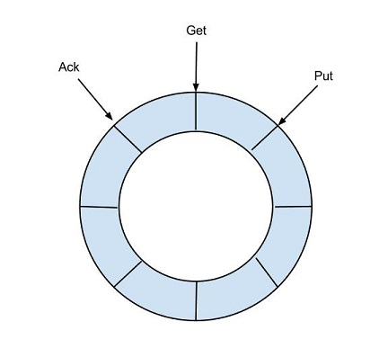

# 1.canal简介

canal [kə'næl]，译意为水道/管道/沟渠，主要用途是基于 MySQL 数据库增量日志解析，提供增量数据订阅和消费，它可以监听mysql（也支持mariaDB）的表数据，在数据变化的时候作出相应处理，分为canal server和canal client两部分。

## 1.1.基本原理

canal的原理，就是基于mysql的主从复制，


主要分为三步：

1. master将改变记录到二进制日志(binary log)中（这些记录叫做二进制日志事件，binary log events，可以通过show binlog events进行查看）；
2. slave会开启两个线程：I/0 thread负责从master中拉取binary log然后保存到本地relay log（中继日志），然后sql thread会去解析relay log（中继日志）
3. slave重做中继日志中的事件，将数据写到它自己的库中

canal通过伪造mysql主从交互的协议，充当slave角色：


1. canal模拟mysql slave的交互协议，伪装自己为mysql slave，向mysql master发送dump协议
2. mysql master收到dump请求，开始推送binary log给slave(也就是canal)
3. canal解析binary log对象(原始为byte流，采用开源的open-replicator来解析binlog)

## 1.2.架构设计

canal分为server和client两个系统，其中canal server是充当mysql slave的作用，它负责拉取binlog，然后解析保存，最后让canal client消费。整体的架构如下：


说明：

- server代表一个canal运行实例，对应于一个jvm
- instance对应于一个数据队列 （1个server对应n个instance)

instance模块，instance代表了一个实际运行的数据队列，包括了EventPaser,EventSink,EventStore等组件

- eventParser (数据源接入，模拟slave协议和master进行交互，协议解析)
- eventSink (Parser和Store链接器，进行数据过滤，加工，分发的工作)
- eventStore (数据存储)
- metaManager (增量订阅&消费信息管理器)

### 1.2.1.EventParse


整个parser过程大致可分为：

1. Connection获取上一次解析成功的位置（如果第一次启动，则获取初始制定的位置或者是当前数据库的binlog位点）
2. Connection建立连接，发生BINLOG_DUMP命令
3. Mysql开始推送Binary Log
4. 接收到的Binary Log通过Binlog parser进行协议解析，补充一些特定信息
5. 传递给EventSink模块进行数据存储，是一个阻塞操作，直到存储成功
6. 存储成功后，定时记录Binary Log位置

### 1.2.2.EventSink


说明：

- 数据过滤：支持通配符的过滤模式，表名，字段内容等
- 数据路由/分发：解决1:n (1个parser对应多个store的模式)
- 数据归并：解决n:1 (多个parser对应1个store)
- 数据加工：在进入store之前进行额外的处理，比如join

为了合理的利用数据库资源， 一般常见的业务都是按照schema（注：在mysql中数据库schema就是database）进行隔离，然后在mysql上层或者dao这一层面上，进行一个数据源路由，屏蔽数据库物理位置对开发的影响。 所以，一般一个数据库实例上，会部署多个schema，每个schema会有由1个或者多个业务方关注。

当一个业务的数据规模达到一定的量级后，必然会涉及到水平拆分和垂直拆分的问题，针对这些拆分的数据需要处理时，就需要链接多个store进行处理，消费的位点就会变成多份，而且数据消费的进度无法得到尽可能有序的保证。 所以，在一定业务场景下，需要将拆分后的增量数据进行归并处理，比如按照**时间戳/全局id**进行排序归并

### 1.2.3.EventStore

canal目前实现了Memory内存、本地file存储以及持久化到zookeeper以保障数据集群共享。Memory内存的RingBuffer设计：



定义了3个cursor

- Put : Sink模块进行数据存储的最后一次写入位置
- Get : 数据订阅获取的最后一次提取位置
- Ack : 数据消费成功的最后一次消费位置

借鉴Disruptor的RingBuffer的实现，将RingBuffer拉直来看：


实现说明：

- Put/Get/Ack cursor用于递增，采用long型存储
- buffer的get操作，通过取余或者与操作。(与操作： cusor & (size - 1) , size需要为2的指数，效率比较高)

## 1.3.交互流程

当canal server成功启动后，canal client就可以与其连接交互：


- **Message getWithoutAck(int batchSize)**，允许指定batchSize，一次可以获取多条，每次返回的对象为Message，包含的内容为：
  - batch id 唯一标识
  - entries 具体的数据对象，对应的数据对象格式：EntryProtocol.proto
- **void rollback(long batchId)**，回滚上次的get请求，重新获取数据。基于get获取的batchId进行提交，避免误操作
- **void ack(long batchId)**，确认已经消费成功，通知server删除数据。基于get获取的batchId进行提交，避免误操作。canal的get/ack/rollback协议和常规的jms协议有所不同，允许get/ack异步处理，比如可以连续调用get多次，后续异步按顺序提交ack/rollback，被称之为流式api。

流式api设计的好处：

- get/ack异步化，减少因ack带来的网络延迟和操作成本 (99%的状态都是处于正常状态，异常的rollback属于个别情况，没必要为个别的case牺牲整个性能)
- get获取数据后，业务消费存在瓶颈或者需要多进程/多线程消费时，可以不停的轮询get数据，不停的往后发送任务，提高并行化. (阿里在实际业务中的一个case：业务数据消费需要跨中美网络，所以一次操作基本在200ms以上，为了减少延迟，所以需要实施并行化)

### 1.3.1.流式api设计


- 每次get操作都会在meta中产生一个mark，mark标记会递增，保证运行过程中mark的唯一性
- 每次的get操作，都会在上一次的mark操作记录的cursor继续往后取，如果mark不存在，则在last ack cursor继续往后取
- 进行ack时，需要按照mark的顺序进行数序ack，不能跳跃ack. ack会删除当前的mark标记，并将对应的mark位置更新为last ack cusor
- 一旦出现异常情况，客户端可发起rollback情况，重新置位：删除所有的mark, 清理get请求位置，下次请求会从last ack cursor继续往后取

## 1.4.数据格式

canal使用的序列化协议是google的protobuf

```protobuf
Entry
    Header
        logfileName [binlog文件名]
        logfileOffset [binlog position]
        executeTime [发生的变更]
        schemaName 
        tableName
        eventType [insert/update/delete类型]
    entryType   [事务头BEGIN/事务尾END/数据ROWDATA]
    storeValue  [byte数据,可展开，对应的类型为RowChange]    
RowChange
    isDdl       [是否是ddl变更操作，比如create table/drop table]
    sql     [具体的ddl sql]
    rowDatas    [具体insert/update/delete的变更数据，可为多条，1个binlog event事件可对应多条变更，比如批处理]
        beforeColumns [Column类型的数组]
        afterColumns [Column类型的数组]      
Column 
    index       
    sqlType     [jdbc type]
    name        [column name]
    isKey       [是否为主键]
    updated     [是否发生过变更]
    isNull      [值是否为null]
    value       [具体的内容，注意为文本]
```

## 1.5.HA机制设计

所谓HA（High Available），即高可用，canal server和canal client各自有HA机制设计，整个HA机制的控制主要是依赖了zookeeper的几个特性，watcher和EPHEMERAL节点：

- **canal server**: 为了减少对mysql dump的请求，不同server上的instance要求同一时间只能有一个处于running，其他的处于standby状态.
- **canal client**: 为了保证有序性，一个instance同一时间只能由一个canal client进行get/ack/rollback操作，否则客户端接收无法保证有序。

### 1.5.1.canal server


1. canal server要启动某个canal instance时都先向zookeeper进行一次尝试启动判断 (实现：创建EPHEMERAL节点，谁创建成功就允许谁启动)
2. 创建zookeeper节点成功后，对应的canal server就启动对应的canal instance，没有创建成功的canal instance就会处于standby状态
3. 一旦zookeeper发现canal server A创建的节点消失后，立即通知其他的canal server再次进行步骤1的操作，重新选出一个canal server启动instance.
4. canal client每次进行connect时，会首先向zookeeper询问当前是谁启动了canal instance，然后和其建立链接，一旦链接不可用，会重新尝试connect.

canal Client的方式和canal server方式类似，也是利用zokeeper的抢占EPHEMERAL节点的方式进行控制.

### 1.5.2.HA配置方案

- 启动多个canal server，通过zookeeper维护，同一个时间内只有一个canal server会向mysql发送dump请求。当原先发送dump请求的canal server宕机后，zookeeper会告知其它cannl server重现选举。而canal client只需要连接zookeeper就可以获取canal server的数据：

  

- 启动一个canal server，由它发出dump请求，一般也只用于本地测试，不然canal server宕机了就监听不到big log了

  

- 两个client+两个server+1个mysql，当mysql变动时，两个client都能获取到变动。注意这种方式少了zookeeper来控制，相当于canal server之间是相互独立的，因此不存在同一时间内只有一个canal server能发送dump请求的限制。但是，如果配置了多个canal server，会对mysql本身造成I/O请求压力

  

- 一个server+两个instance+两个mysql+两个client，相当于一个canal server负责向不同的mysql发送dump请求，然后不同的canal client来消费这个canal server的不同instance

  

# 2.搭建canal server

下载地址：[https://github.com/alibaba/canal/releases](https://github.com/alibaba/canal/releases)，资源包说明：

- canal.adapter-1.1.4.tar.gz    # 全组件安装包
- canal.admin-1.1.4.tar.gz      # canal admin安装包
- canal.deployer-1.1.4.tar.gz   #canal server安装包
- canal.example-1.1.4.tar.gz    # 客户端示例程序
- Source code(zip)              # zip 压缩方式的源码
- Source code(tar.gz)           # tar.gz 压缩方式的源码  

一般下载`canal.deployer-1.1.4.tar.gz ` 即可。

## 2.1.单机环境

canal是基于mysql主从复制，所以本地要先搭建好master mysql环境。解压下载的canal server压缩包，默认只有4个目录：

- bin，放置linux/window的启动脚本
- conf，配置文件，只要更改这个目录内的配置即可
- lib，运行依赖
- logs，服务启动后，会将日志写到这里

进入/conf目录， 基本都不可以不用修改，只要处理`../example/instance.properties`即可。默认的，canal server的canal.properties配置如下：

```properties
## 后续 canal client连接到这里即可
canal.ip=127.0.0.1
canal.port = 11111

## 默认canal会指定example目录，表示为一个instance实例的配置, 所以只要去更改../example/..下的配置
## 文件即可
canal.destinations = example
canal.conf.dir = ../conf
```

进入到example目录下，打开instance.properties，简单修改几处配置即可：

```properties
## 配置连接mysql的主机地址, 同时配置binlog文件和它的偏移量，在mysql上show master status就知道了
canal.instance.master.address=127.0.0.1:3308
canal.instance.master.journal.name=mysql-log-bin.000008
canal.instance.master.position=1168

## 配置连接用户名和密码，可以仿造mysql主从搭建，专门为canal配置一个账号
canal.instance.dbUsername=root
canal.instance.dbPassword=root
canal.instance.connectionCharset = UTF-8

## 监听的表名, 默认是全部监听
canal.instance.filter.regex=.*\\..*
```

然后进入到../bin目录，执行`startup.sh`或者`startup.bat`即可，最后到../log目录下，查看日志文件是否有报错，有的话处理，没有的话可以写代码启动canal client。

## 2.2.集群环境

...等环境

## 2.3.配置文件

canal的配置文件主要是.properties，分为两部分：

- canal.properties  (系统根配置文件)
- instance.properties  (instance级别的配置文件，每个instance一份)

### 2.3.1.canal.properties

canal配置主要分为两部分定义：

- instance列表定义 (列出当前server上有多少个instance，每个instance的加载方式是spring/manager等)  

| 参数名字                                                     | 参数说明                                                     | 默认值                                                       |
| ------------------------------------------------------------ | ------------------------------------------------------------ | ------------------------------------------------------------ |
| canal.destinations                                           | 当前server上部署的instance列表                               | 无                                                           |
| canal.conf.dir                                               | conf/目录所在的路径                                          | ../conf                                                      |
| canal.auto.scan                                              | 开启instance自动扫描 如果配置为true，canal.conf.dir目录下的instance配置变化会自动触发： a. instance目录新增： 触发instance配置载入，lazy为true时则自动启动 b. instance目录删除：卸载对应instance配置，如已启动则进行关闭 c. instance.properties文件变化：reload instance配置，如已启动自动进行重启操作 | true                                                         |
| canal.auto.scan.interval                                     | instance自动扫描的间隔时间，单位秒                           | 5                                                            |
| canal.instance.global.mode                                   | 全局配置加载方式                                             | spring                                                       |
| canal.instance.global.lazy                                   | 全局lazy模式                                                 | false                                                        |
| canal.instance.global.manager.address                        | 全局的manager配置方式的链接信息                              | 无                                                           |
| canal.instance.global.spring.xml                             | 全局的spring配置方式的组件文件                               | classpath:spring/memory-instance.xml   (spring目录相对于canal.conf.dir) |
| canal.instance.example.mode canal.instance.example.lazy canal.instance.example.spring.xml ..... | instance级别的配置定义，如有配置，会自动覆盖全局配置定义模式 命名规则：canal.instance.{name}.xxx | 无                                                           |
| canal.instance.tsdb.spring.xml                               | v1.0.25版本新增,全局的tsdb配置方式的组件文件                 | classpath:spring/tsdb/h2-tsdb.xml (spring目录相对于canal.conf.dir) |

-  common参数定义，比如可以将instance.properties的公用参数，抽取放置到这里，这样每个instance启动的时候就可以共享.  【instance.properties配置定义优先级高于canal.properties】

| 参数名字                                   | 参数说明                                                     | 默认值                                                       |
| ------------------------------------------ | ------------------------------------------------------------ | ------------------------------------------------------------ |
| canal.id                                   | 每个canal server实例的唯一标识，暂无实际意义                 | 1                                                            |
| canal.ip                                   | canal server绑定的本地IP信息，如果不配置，默认选择一个本机IP进行启动服务 | 无                                                           |
| canal.register.ip                          | canal server注册到外部zookeeper、admin的ip信息 (针对docker的外部可见ip) | 无                                                           |
| canal.port                                 | canal server提供socket服务的端口                             | 11111                                                        |
| canal.zkServers                            | canal server链接zookeeper集群的链接信息 例子：10.20.144.22:2181,10.20.144.51:2181 | 无                                                           |
| canal.zookeeper.flush.period               | canal持久化数据到zookeeper上的更新频率，单位毫秒             | 1000                                                         |
| canal.instance.memory.batch.mode           | canal内存store中数据缓存模式 1. ITEMSIZE : 根据buffer.size进行限制，只限制记录的数量 2. MEMSIZE : 根据buffer.size  * buffer.memunit的大小，限制缓存记录的大小 | MEMSIZE                                                      |
| canal.instance.memory.buffer.size          | canal内存store中可缓存buffer记录数，需要为2的指数            | 16384                                                        |
| canal.instance.memory.buffer.memunit       | 内存记录的单位大小，默认1KB，和buffer.size组合决定最终的内存使用大小 | 1024                                                         |
| canal.instance.transactionn.size           | 最大事务完整解析的长度支持 超过该长度后，一个事务可能会被拆分成多次提交到canal store中，无法保证事务的完整可见性 | 1024                                                         |
| canal.instance.fallbackIntervalInSeconds   | canal发生mysql切换时，在新的mysql库上查找binlog时需要往前查找的时间，单位秒 说明：mysql主备库可能存在解析延迟或者时钟不统一，需要回退一段时间，保证数据不丢 | 60                                                           |
| canal.instance.detecting.enable            | 是否开启心跳检查                                             | false                                                        |
| canal.instance.detecting.sql               | 心跳检查sql                                                  | insert into retl.xdual values(1,now()) on duplicate key update x=now() |
| canal.instance.detecting.interval.time     | 心跳检查频率，单位秒                                         | 3                                                            |
| canal.instance.detecting.retry.threshold   | 心跳检查失败重试次数                                         | 3                                                            |
| canal.instance.detecting.heartbeatHaEnable | 心跳检查失败后，是否开启自动mysql自动切换 说明：比如心跳检查失败超过阀值后，如果该配置为true，canal就会自动链到mysql备库获取binlog数据 | false                                                        |
| canal.instance.network.receiveBufferSize   | 网络链接参数，SocketOptions.SO_RCVBUF                        | 16384                                                        |
| canal.instance.network.sendBufferSize      | 网络链接参数，SocketOptions.SO_SNDBUF                        | 16384                                                        |
| canal.instance.network.soTimeout           | 网络链接参数，SocketOptions.SO_TIMEOUT                       | 30                                                           |
| canal.instance.filter.druid.ddl            | 是否使用druid处理所有的ddl解析来获取库和表名                 | true                                                         |
| canal.instance.filter.query.dcl            | 是否忽略dcl语句                                              | false                                                        |
| canal.instance.filter.query.dml            | 是否忽略dml语句 (mysql5.6之后，在row模式下每条DML语句也会记录SQL到binlog中,可参考[MySQL文档](https://dev.mysql.com/doc/refman/5.6/en/replication-options-binary-log.html#sysvar_binlog_rows_query_log_events)) | false                                                        |
| canal.instance.filter.query.ddl            | 是否忽略ddl语句                                              | false                                                        |
| canal.instance.filter.table.error          | 是否忽略binlog表结构获取失败的异常(主要解决回溯binlog时,对应表已被删除或者表结构和binlog不一致的情况) | false                                                        |
| canal.instance.filter.rows                 | 是否dml的数据变更事件(主要针对用户只订阅ddl/dcl的操作)       | false                                                        |
| canal.instance.filter.transaction.entry    | 是否忽略事务头和尾,比如针对写入kakfa的消息时，不需要写入TransactionBegin/Transactionend事件 | false                                                        |
| canal.instance.binlog.format               | 支持的binlog format格式列表 (otter会有支持format格式限制)    | ROW,STATEMENT,MIXED                                          |
| canal.instance.binlog.image                | 支持的binlog image格式列表 (otter会有支持format格式限制)     | FULL,MINIMAL,NOBLOB                                          |
| canal.instance.get.ddl.isolation           | ddl语句是否单独一个batch返回(比如下游dml/ddl如果做batch内无序并发处理,会导致结构不一致) | false                                                        |
| canal.instance.parser.parallel             | 是否开启binlog并行解析模式(串行解析资源占用少,但性能有瓶颈, 并行解析可以提升近2.5倍+) | true                                                         |
| canal.instance.parser.parallelBufferSize   | binlog并行解析的异步ringbuffer队列 (必须为2的指数)           | 256                                                          |
| canal.instance.tsdb.enable                 | 是否开启tablemeta的tsdb能力                                  | true                                                         |
| canal.instance.tsdb.dir                    | 主要针对h2-tsdb.xml时对应h2文件的存放目录,默认为conf/xx/h2.mv.db | ${canal.file.data.dir:../conf}/${canal.instance.destination:} |
| canal.instance.tsdb.url                    | jdbc url的配置(h2的地址为默认值，如果是mysql需要自行定义)    | jdbc:h2:${canal.instance.tsdb.dir}/h2;CACHE_SIZE=1000;MODE=MYSQL; |
| canal.instance.tsdb.dbUsername             | jdbc url的配置(h2的地址为默认值，如果是mysql需要自行定义)    | canal                                                        |
| canal.instance.tsdb.dbPassword             | jdbc url的配置(h2的地址为默认值，如果是mysql需要自行定义)    | canal                                                        |
| canal.instance.rds.accesskey               | aliyun账号的ak信息(如果不需要在本地binlog超过18小时被清理后自动下载oss上的binlog，可以忽略该值 | 无                                                           |
| canal.instance.rds.secretkey               | aliyun账号的sk信息(如果不需要在本地binlog超过18小时被清理后自动下载oss上的binlog，可以忽略该值) | 无                                                           |
| canal.admin.manager                        | canal链接canal-admin的地址 (v1.1.4新增)                      | 无                                                           |
| canal.admin.port                           | admin管理指令链接端口 (v1.1.4新增)                           | 11110                                                        |
| canal.admin.user                           | admin管理指令链接的ACL配置 (v1.1.4新增)                      | admin                                                        |
| canal.admin.passwd                         | admin管理指令链接的ACL配置 (v1.1.4新增)                      | 密码默认值为admin的密文                                      |
| canal.user                                 | canal数据端口订阅的ACL配置 (v1.1.4新增)如果为空，代表不开启  | 无                                                           |
| canal.passwd                               | canal数据端口订阅的ACL配置 (v1.1.4新增)如果为空，代表不开启  | 无                                                           |

### 2.3.2.instance.properties

在`canal.properties`定义了`canal.destinations`后，需要在`canal.conf.dir`对应的目录下建立同名的文件，比如：

```properties
canal.destinations = example1,example2
```

需要创建`example1`和`example2`两个目录，每个目录里各自有一份`instance.properties`，如果`canal.properties`未定义instance列表，但开启了canal.auto.scan：

- server第一次启动时，会自动扫描conf目录下，将文件名做为instance name，启动对应的instance
- server运行过程中，会根据canal.auto.scan.interval定义的频率，进行扫描
  - 发现目录有新增，启动新的instance
  - 发现目录有删除，关闭老的instance
  - 发现对应目录的instance.properties有变化，重启instance

**instance.properties参数列表：**

| 参数名字                           | 参数说明                                                     | 默认值         |
| ---------------------------------- | ------------------------------------------------------------ | -------------- |
| canal.instance.mysql.slaveId       | mysql集群配置中的serverId概念，需要保证和当前mysql集群中id唯一 (v1.1.x版本之后canal会自动生成，不需要手工指定) | 无             |
| canal.instance.master.address      | mysql主库链接地址                                            | 127.0.0.1:3306 |
| canal.instance.master.journal.name | mysql主库链接时起始的binlog文件                              | 无             |
| canal.instance.master.position     | mysql主库链接时起始的binlog偏移量                            | 无             |
| canal.instance.master.timestamp    | mysql主库链接时起始的binlog的时间戳                          | 无             |
| canal.instance.gtidon              | 是否启用mysql gtid的订阅模式                                 | false          |
| canal.instance.master.gtid         | mysql主库链接时对应的gtid位点                                | 无             |
| canal.instance.dbUsername          | mysql数据库帐号                                              | canal          |
| canal.instance.dbPassword          | mysql数据库密码                                              | canal          |
| canal.instance.defaultDatabaseName | mysql链接时默认schema                                        |                |
| canal.instance.connectionCharset   | mysql 数据解析编码                                           | UTF-8          |
| canal.instance.filter.regex        | mysql 数据解析关注的表，Perl正则表达式.多个正则之间以逗号(,)分隔，转义符需要双斜杠(\\) 常见例子：1.  所有表：.*  or  .*\\..* 2.  canal schema下所有表： canal\\..* 3.  canal下的以canal打头的表：canal\\.canal.* 4.  canal schema下的一张表：canal\\.test15.  多个规则组合使用：canal\\..*,mysql.test1,mysql.test2 (逗号分隔) | .*\\..*        |
| canal.instance.filter.black.regex  | mysql 数据解析表的黑名单，表达式规则见白名单的规则           | 无             |
| canal.instance.rds.instanceId      | aliyun rds对应的实例id信息(如果不需要在本地binlog超过18小时被清理后自动下载oss上的binlog，可以忽略该值) | 无             |

注意：

1. mysql链接时的起始位置

   - canal.instance.master.journal.name +  canal.instance.master.position :  精确指定一个binlog位点，进行启动

   - canal.instance.master.timestamp :  指定一个时间戳，canal会自动遍历mysql binlog，找到对应时间戳的binlog位点后，进行启动

   - 不指定任何信息：默认从当前数据库的位点，进行启动。(show master status)

2. mysql解析关注表定义
   - 标准的Perl正则，注意转义时需要双斜杠：`\\`

3. mysql链接的编码
   - 目前canal版本仅支持一个数据库只有一种编码，如果一个库存在多个编码，需要通过filter.regex配置，将其拆分为多个canal instance，为每个instance指定不同的编码

# 3.构造canal client

## 3.1.pom

引入canal-client的pom依赖

```xml
<dependency>
    <groupId>com.alibaba.otter</groupId>
    <artifactId>canal.client</artifactId>
    <version>1.1.4</version>
</dependency>
```

## 3.2.demo

这是canal官网给出的模板代码

```java
public static void main(String args[]) {
    // 创建链接,分别指定canal server的host、port、instance、username、password
    CanalConnector connector = CanalConnectors.newSingleConnector(
        new InetSocketAddress(AddressUtils.getHostIp(), 11111), "example", "", "");
    // 每次拉取1000条记录
    int batchSize = 1000;
    // 空轮训计数
    int emptyCount = 0;
    try {
        // 连接canal server
        connector.connect();
        // 设置要订阅的表, 默认所有的表变动都要监听
        connector.subscribe(".*\\..*");
        // 回滚到未进行 ack 的地方
        connector.rollback();
        int totalEmptyCount = 120;
        while (emptyCount < totalEmptyCount) {
             // 获取指定数量的数据, 同时设置手动ack
            Message message = connector.getWithoutAck(batchSize);
            // 批次id, 这个值是唯一的
            long batchId = message.getId();
            // 拉取到的实际数据量，这里的Entry就是1.4所说的数据格式
            int size = message.getEntries().size();
            if (batchId == -1 || size == 0) {
                // 如果没有数据，那就睡眠一会，同时记录空轮询的次数
                emptyCount++;
                System.out.println("empty count : " + emptyCount);
                try {
                    Thread.sleep(1000);
                } catch (InterruptedException e) {
                    // ignore
                }
            } else {
                emptyCount = 0;
                // 处理数据
                printEntry(message.getEntries());
            }
			// 提交确认
            connector.ack(batchId); 
            // 处理失败, 回滚数据
            // connector.rollback(batchId); 
        }
        System.out.println("empty too many times, exit");
    } finally {
        // 最后断开连接
        connector.disconnect();
    }
}
```

每个Entry，就可以获取其中的数据项：

```java
private static void printEntry(List<Entry> entrys) {
    for (Entry entry : entrys) {
        // 只关心数据的变化
        if (entry.getEntryType() == EntryType.TRANSACTIONBEGIN || 
            entry.getEntryType() == EntryType.TRANSACTIONEND) {
            continue;
        }
		// 获取数据变动信息, 通过canal自带的解析器解析即可
        RowChange rowChage = null;
        try {
            rowChage = RowChange.parseFrom(entry.getStoreValue());
        } catch (Exception e) {
            throw new RuntimeException("ERROR ## parser of eromanga-event has an
                    error , data:" + entry.toString(),  e);
        }
		// 可以获取事件类型：增、删、改、索引、建表、改表....,一般只对增删改数据有兴趣
        EventType eventType = rowChage.getEventType();
        for (RowData rowData : rowChage.getRowDatasList()) {
            if (eventType == EventType.DELETE) {
                // delete sql,只有getBeforeColumnsList()数据
                printColumn(rowData.getBeforeColumnsList()数据
            } else if (eventType == EventType.INSERT) {
                // insert sql, 只有getAfterColumnsList()数据
                printColumn(rowData.getAfterColumnsList());
            } else {
                // update sql，既有getBeforeColumnsList()数据，也有getAfterColumnsList()
                // 数据
                System.out.println("-------&gt; before");
                printColumn(rowData.getBeforeColumnsList());
                System.out.println("-------&gt; after");
                printColumn(rowData.getAfterColumnsList());
            }
        }
    }
}
```

