# 1.MongoDB简介

MongoDB是一个开源文档数据库，提供了高性能、高可用性和自动扩展的功能。MongoDB是面向文档存储数据，所谓面向文档是一种类似于JSON的结构(实际上是BSON)，是由字段和值组成的数据结构，字段的值可以包括其它文档、数组和文档数组，如：

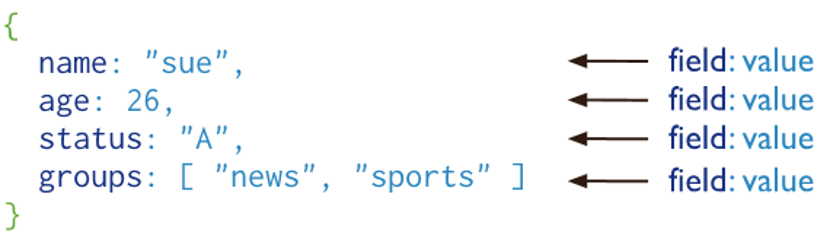

Mongodb是介于RDBMS和Nosql之间的数据库。官方文档：[https://docs.mongodb.com/manual/](https://docs.mongodb.com/manual/) 

## 1.1.mongodb概念

数据库（database）：数据库是一个仓库，可以存放集合

集合（collection）：集合类似数组，可以存放文档

文档（document）： 数据库中的最小单位，存储和操作的都是文档

## 1.2.mongodb与mysql比较

Mysql中的database === MongoDB的database

Mysql中的table === MongoDB的collection（集合）

Mysql中的row(记录) === MongoDB的documen（文档）

Mysql中的col(字段) === MongoDB的域,也可以称为字段

Mysql中的Index === MongoDB的index

Mysql中的主键 === MongoDB的主键（自动将_id字段设置为主键）

### 1.3._id说明

mongodb有个特色：_id，这是MongoDB自身维护的默认主键。它是一个ObjectId，由12个字节组成：前4个字节为自Unix纪元以来的秒数，中间5个字节为随机数，后3个字节为计数器，从随机值开始算起。

 当插入的文档没有指明_id时，mongodb会自动添加；当插入文档时指定了_id字段，则mongodb就不会自动添加。

# 2.MongoDB安装

## 2.1.linux

## 2.2.window

先下载mongodb在window的安装包：

[https://www.mongodb.com/download-center/community?jmp=docs](https://www.mongodb.com/download-center/community?jmp=docs)

下载msi版本，照着安装程序直接安装即可；它会自动注册成服务，直接使用

net start mongodb – 启动mongodb

net stop mongodb – 关闭mongodb

# 3.数据库操作

## 3.1.查看数据库

①使用db命令可以查看当前正在使用的数据库名；

②使用show dbs命令可以查看所有的数据库名；

## 3.2.创建数据库

创建数据库使用命令 use \<database>，如果数据库已存在，则切换到该数据库，如果数据库不存在则创建并切换到该数据库。

## 3.3.删除数据库

使用 db.dropDatabase() 删除当前数据库，所以删除数据库之前需要先切换到该数据库（使用use命令）

# 4.集合操作

## 4.1.创建集合

**语法：**db.createCollection(\<name>,\<options>)

name：   是一个字符串，表示集合的名称；

options： 是一个对象，表示集合的配置(内存与索引的设置)，各个属性如下：

| **字段** | **类型** | **描述**                                                     |
| -------- | -------- | ------------------------------------------------------------ |
| capped   | 布尔     | (可选)如果为true，则创建固定集合。固定集合指有着固定大小的集合，当达到最大值时，会自动覆盖最早的文档。当该值为true时，必须指定size参数 |
| size     | 数值     | (可选)为固定集合指定一个最大值，单位是字节                   |
| max      | 数值     | (可选)指定固定集合中包含文档的最大数量。当取值为0时，表示不限量 |

注意：在插入文档时，mongodb首先检查size字段，然后在检查max字段

**例子：**

①创建最简集合：db.createCollection**(**"user"**)**

②创建自定义配置集合(集合最大容量1M,可容纳100个文档)

 ```txt
 db.createCollection("user",{capped:true,size:1024,max:100})
 ```

## 4.2.查看集合

查看当前数据库的所有集合，**语法：**show collections

## 4.3.删除集合

**语法：**db.\<collection>.drop()

\<collection>为集合名称，删除成功会返回true，删除失败返回false。先用show collection查看数据库内集合的情况，再删除：

# 5.文档操作

Mongodb的文档(document)相当于mysql表里的一行记录

Mongodb会自动 生成管理 主键，它的主键字段名默认是"_id"

## 5.1.添加文档

在mongodb3.2版本前：只能使用save和insert；

在mongodb3.2版本后：新增了insertOne和insertMany。建议使用insertOne(添加单个文档)和insertMany(添加多个文档)

### 5.1.1.save

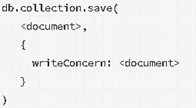

**例子：**

①插入单条：db.user.save**({**stuNo**:**11**,**stuName**:**"张三"**})**

②插入多条：db.user.save**([{**id**:**1**,**name**:**"张三"**},{**id**:**2**,**name**:**"李四"**}])**

**注意：**

如果指定了_id字段，默认执行[update](#_修改文档)操作，更新该_id的数据

### 5.1.2.insert


- ordered属性：为true，则在数组中执行文档的有序插入，如果其中一个文档发生错误，MongoDB将返回，不处理数组中的其余文档；为false，则执行无序插入，如果其中一个文档发生错误，则继续处理数组中的其余文档。默认为true。

**例子：**

插入单条：db.user.insert**({**stuNo**:**11**,**stuName**:**'沈燕明'**})**

插入多条：db.user.insert**([{**id**:**1**,**name**:**'java'**},{**id**:**2**,**name**:**'python'**}])**

**注意：**

若文档的主键(即_id)已经在集合中存在，此时使用insert插入会报错：

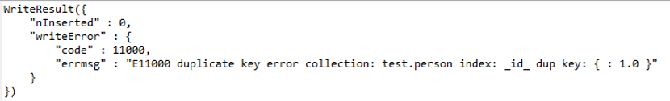

**insert和save的区别：**

- insert可以一次性插入一个列表，而不用遍历，效率高；

- save则需要遍历列表，一个个插入。

### 5.1.3.insertOne

insertOne是3.2版本才提供的，向指定集合中添加一个文档数据，一次只能添加一个文档。 

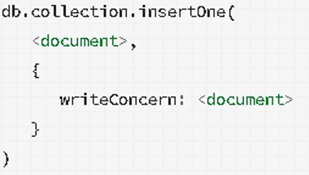

**例子：**

db.user.insertOne**({**id**:**1**,**name**:**"李四"**,**age**:**23**})**

### 5.1.4.insertMany

insertMany是3.2版本才提供，向指定集合添加多个文档数据，推荐使用。

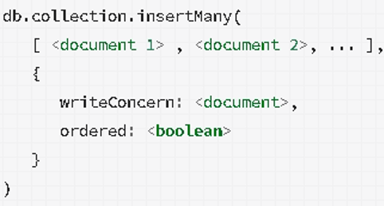

ordered属性：为true执行有序插入，为false执行无序插入，默认为true

**例子：**

db.user.insertMany**([{**id**:**1**,**name**:**"张三"**},{**id**:**2**,**name**:**"李四"**}])**

db.user.insertMany**([{**id**:**1**,**name**:**"张三"**},{**id**:**2**,**name**:**"李四"**}],{**ordered**:**false**})**

## 5.2.修改文档

### 5.2.1.update

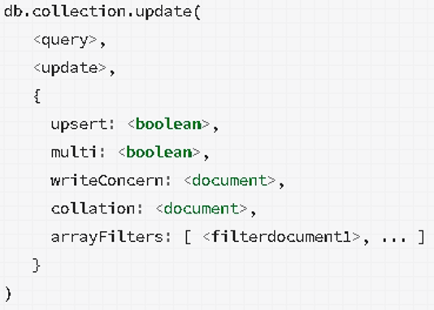

- query属性：对象类型，匹配要被修改的文档；

- update属性：对象类型，表示修改的内容。默认会完全覆盖掉之前的文档，也可以使用操作符指定操作的属性: 

  - $set -- 只修改$set操作符指定的字段

  - $unset -- 只删除$unset指定的字段

  - $rename -- 修改文档的字段名

**额外的属性：**

1. upsert : 若不存在匹配记录，是否新插入数据，true为插入，默认不插入；

2. multi：默认false，只修改匹配到的第一条记录，若为true，则更新所有符合匹配条件的文档；

**例子：**

①在user集合中查找name属性值为66的文档，将name属性修改

 db.user.update**({**name**:**'66'**},{**$set**:{**name**:**'会不会添加进去'**}})** 


②在user集合中找到id为110的文档，将它的likes字段删掉

 db.user.update**({**id**:**110**},{**$unset**:{**'likes'**:**1**}})**


③如果没有匹配的修改项，将新纪录插入到集合中

 db.user.update**({**name**:**'66'**},{**$set**:{**name**:**'99'**}},{**upsert**:**true**})**

 

④默认只修改第一条匹配的文档，可以改为修改所有匹配的文档 

 db. user.update**({**name**:**'66'**},{**$set**:{**name**:**'99'**}},{**multi**:**true**})**

### 5.2.2.updateOne和updateMany

updateOne和updateMany都是在update基础上封装的，在匹配多个文档时：

updateOne只会修改一个文档对象；updateMany会修改所有匹配到文档对象。

### 5.2.3.save

save()方法通过将传过来的文档完全替换掉之前的文档，而且一般要使用MongoDB默认的主键字段_id，来查找待修改的文档项。我觉得不好用。

## 5.3.删除文档

remove() 已经过时了，官方推荐使用 deleteOne() 和 deleteMany() 方法!

### 5.3.1.remove

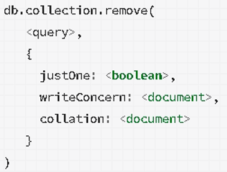

- query属性：匹配要删除的文档，若要删除集合中的所有文档，使用空文档：{}

- justOne属性：为 true 时只删除一个文档；为false时删除与条件匹配的所有文档，默认为false；

**例子：**

①删除所有name属性为梦幻西游的文档：

 db.role.remove**({**name**:**'梦幻西游'**});**

 

②如果只想删除一个，则需要添加options参数：

 db.role.remove**({**name**:**'梦幻西游'**},{**justOne**:**true**});**

 

③如果要删除文档中的所有内容：(相当于mysql中truncate)

 db.role.remove**({});**

### 5.3.2.deleteOne

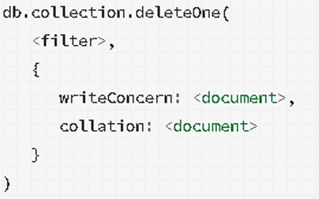

**例子：**

①删除 status 等于 D 的一个文档：

 db.inventory.deleteOne**({** status**:** "D" **})**

### 5.3.3.deleteMany

删除匹配查询条件的所有文档

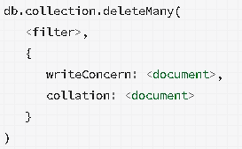

**例子：**

①删除集合下全部文档：

 db.inventory.deleteMany**({})**


②删除 status 等于 A 的全部文档：

 db.inventory.deleteMany**({** status **:** "A" **})**

## 5.4.查阅文档

mongodb中查询文档的方法是find()，还有一个findOne()它只返回一个文档，在返回结果上添加pretty()可以格式化展示(管理工具默认就使用了)：

### 5.4.1.find

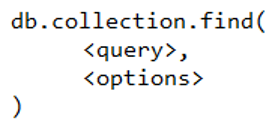

- query：表示查找的条件，无参数或者“{}”表示查询集合中的所有文档

-  options：使用投影操作符指定返回的键，不写返回文档中所有的字段（例如：需要返回name字段，就这样写：{name:true}）

**例子：**

db.list_1.find**({**name**:**'李四'**},{**name**:**true**,**age**:**true**})**.pretty**();**

表示查找name='李四'的文档并且只返回'name'属性和'age'属性

### 5.4.2.内嵌文档查询

mongodb支持内嵌文档查询，内嵌文档的意思：某个文档的属性是一个文档对象，查询内嵌文档，需要用到" . "，但是查询内嵌文档时，需要用引号将属性包裹起来，例如：属性hobby是一个文档，它有个movies属性，要查询movies包含'黄飞鸿'

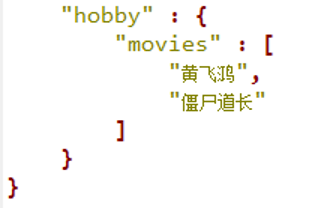

可以使用下面这个语句：

db.user.find**({**'hobby.movies'**:**'黄飞鸿'**})**

# 6.分页操作

## 6.1.limit

limit()方法接受一个数字参数，该参数指定从MongoDB中读取的记录条数默认值为0，表示查询所有文档：db.test.find().limit(0) 查询结果等同于 db.test.find()

**例如：**

①限制返回文档数量为1

 db.test.find**()**.limit**(**1**)**

## 6.2.skip

skip()方法来跳过指定数量的数据，skip方法同样接受一个数字参数作为跳过的记录条数。limit()和skip()结合才可以实现分页：先使用skip()跳过指定的文档数，然后将查询结果交给limit()来限制输出条数。当skip()和limit()以及排序sort()，这三个方法一起出现时，执行顺序为： 先sort()→再skip()→最后limit()

**例如：**

①跳过第1条数据，返回2条数据

 db.test.find**()**.skip**(**1**)**.limit**(**2**)**

# 7.排序操作

## 7.1.sort

**语法：**

db.\<collection>.find().sort({key_name : 1 / -1})

key_name：表示排序的字段，1：表示升序，-1：表示降序

**例子：**

①按stuId字段降序排序

 db.test.find**()**.sort**({**stuId**:**-1**})**.pretty**()**

# 8.索引操作

MongoDB的索引有**正序和倒序之分**：如果创建索引的时候设置为倒序，它只对倒序查询时起作用；如果该字段还需要正序展示，我们需要再为它创建一个正序的索引，这一点在复合索引尤其重要。

## 8.1.创建索引

MongoDB使用 createIndex() 和 ensureIndex() 来创建索引。

createIndex()用于3.0及以上版本，ensureIndex()用于3.0及以下版本

**语法：** 

  db.\<collecion>.createIndex(keys,options)

**参数：**

- keys: 表示创建索引的字段与排序顺序，可以是一个字段，也可以是多个字段(即复合索引)，例如：{time:1}表示time字段升序索引；{number:-1}表示number字段倒序索引

- options: 创建索引时的额外配置，参数列表为：

| **参数名**              | **类型** | **描述**                                                     |
| ----------------------- | -------- | ------------------------------------------------------------ |
| background              | boolean  | 为true表示在后台构建索引，不会阻塞数据库其它操作；为false表示不再后台构建，会阻止其它操作，默认false |
| unique                  | boolean  | 为true表示创建唯一性索引；为false表示创建非唯一性索引，默认为false。唯一索引，即文档字段的值是唯一的。 |
| name                    | string   | 指定索引的名称，如果未指定，Mongo通过索引字段名称和排序顺序来生成索引名称。 |
| partialFilterExpression | document | 如果指定，只会索引与筛选表达式匹配的文档。筛选表达式可包括：  $eq、$exists、$gt、$gte、$lt、  $lte、$type、$and ... |
| sparse                  | boolean  | 为true表示索引仅引用具有指定字段的文档，这些索引使用较少的空间，但在某些情况如排序表现不同。默认值为false |
| weights                 | document | 索引权重值，数值在1到99,999之间，表示该索引相对于其他索引字段的得分权重 |
| default_language        | string   | 对于文本索引，确定停用词列表的语言以及词干分析器和标记生成器的规则。默认是英语 |
| language_override       | string   | 对于文本索引，集合文档中包含文档覆盖语言的字段名称。默认值为language |

**例子：**

①创建一个单字段索引，且自定义命名且在后台执行

  db.user.createIndex**({**stuId**:**1**},{**name**:**"idx_stuId"**,**background**:**true**})**

②创建复合索引，自定义命名

  db.user.createIndex**({**age**:**1**,**sex**:**-1**},{**name**:**"idx_agr*sex"**})**

**在后台创建索引的原因：**

在前台创建索引期间会锁定数据库，会导致其它操作无法进行数据读写，在后台创建索引是，会定期释放写锁，从而保证其它操作的运行，但是后台操作会在耗时更长，尤其是在频繁进行写入的服务器上

## 8.2.查看索引

①getIndexes()  查看集合的所有索引；

②getIndexKeys() 查看索引键；

③totalIndexSize()查看集合索引的总大小；

④getIndexSpecs() 查看集合各索引的详细信息。

## 8.3.删除索引

**语法：**

  db.collection.dropIndex(name)---删除指定的索引

  db.collection.dropIndexes()-----删除所有的索引

# 9.聚合操作

## 9.1.基本聚合函数

MongoDB中自带了3种聚合函数：count、distinct、group

### 9.1.1.count

**描述：**count()函数用于统计数量

**语法：**db.collection.count(\<query>)，统计符合查询条件的文档数量

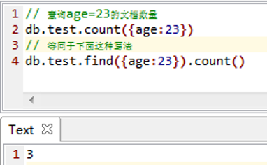

### 9.1.2.distinct

**描述：**distinct()函数用于去重

**语法：**db.collection.distinct(field,\<query>)

​    field表示哪些字段要去重

​    \<query>表示查询条件

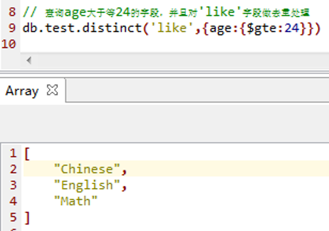

### 9.1.3.group

group()用于分组操作，MongoDB没有SQL语句直接使用group by来分组，而是要使用group()函数来分组，该函数的各项参数如下：

1.key：指定要分组的字段；

2.initial：每个分组都有的初始值；

3.reduce： 这个函数的第一个参数是当前的文档对象，第二个参数是上一次函

​      数操作的累计对象。有多少个文档， $reduce就会调用多少次；

4.condition：这个就是过滤条件；

5.finalize：这是个函数，每一组文档执行完后，都会触发此方法

**例子：**

①按照年龄分组，统计每个年龄组的数量

  db.user.group**({**

​    key**:{**age**:**true**},**

​    initial**:{**count**:**0**},**

​    reduce**:**function**(**cur**,**pre**){**pre.count++**},**

​    condition**:{}**

  **})**

  结果：

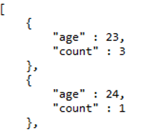

## 9.2.聚合框架aggregate

aggregate函数主要用于处理数据(诸如统计平均值,求和等)，并返回计算后的数据结果。有点类似sql语句中的 count(*)。

**语法：**

db.collection.aggregate( [ \<stage1>, \<stage2>, ... ] )

\<stage1>、\<stage2>代表aggregate的操作符：

- $project：包含、排除、重命名和显示字段

- $match：查询，需要同find()一样的参数

- $limit：限制结果数量

- $skip：忽略结果的数量

- $sort：按照给定的字段排序结果

- $group：按照给定表达式组合结果

- $unwind：分割嵌入数组到自己顶层文件

# 10.mongo操作符

## 10.1.逻辑比较操作符

### 10.1.1.$lt,$gt,$eq,$ne

mongodb与mysql的比较操作符对比：

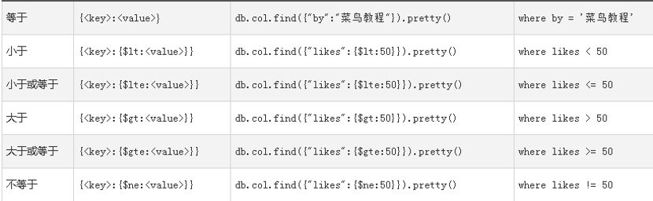

小于 → $lt          	小于等于 → $lte

大于→ $gt        	大于等于 →$gte

等于 → $eq       	不等于→ $ne

### 10.1.2.$and

$and表示逻辑"与"，可以有2种语法：

1. 在查询条件中用逗号隔开，{{条件1},{条件2},...}

 例如：查询age等于23且sex等于m的数据

 db.list_1.find**({**age**:**23**,**sex**:**'m'**})**

 

2. {$and:[{条件1},{条件2},...]}

例如：查询age等于23且sex等于m的数据

  db.list_1.find**({**$and**:[{**age**:**23**},{**sex**:**'m'**}]})**

 PS: 使用逗号的语法，前提是查询条件的字段名不能同一个，否则会被覆盖掉，尤其在[模糊查询](#_模糊查询操作符)时：db.my.find**({**info**:**/age/**,**info**:**/man/**})**很容易会误解成查询info字段带有age字样和man字样的文档，但其实，mongoDB会用man字样覆盖掉age字样，导致查询只是带有man字样的文档。

### 10.1.3.$for

$or表示逻辑"或"，**语法：**{$or:[{条件1},{条件2},...]}

例如：查询age=23或者sex=m的文档数据

db.list_1.find**({**$or**:[{**age**:**23**},{**sex**:**'m'**}]})**

 

"与"和"或"一起的例子:

例如：sex=m 且 (age小于等于25 或 age大于等于50)的数据

 ..**{**sex**:**"m"**,**$or**:[{**age**:{**$lte**:**25**}},{**age**:{**$gte**:**50**}}])**

### 10.1.4.$not,$nor

①$not表示非，**语法：**{"字段名":{$not:{$lt/$gt...:"值"}}}

 	例如：查询deptno不等于10的数据

   	db.dept.find**({**deptno**:{**$not**:{**$eq**:**10**}}})**

  

②$nor可以指定多个非，**语法：**{$nor:[{条件1},{条件2}...]}

​	例如：查询deptno不等于10且loc不等于上海的数据

   db.dept.find**({**$nor**:[{**deptno**:**10**},{**loc**:**"上海"**}]})**

### 10.1.5.$in,$nin

①$in，匹配数组中的任一值，类似于SQL中的in

​	例如：查询deptno等于10或20或30的数据

​	 db.dept.find**({**deptno**:{**$in**:[**10**,**20**,**30**]}})**

 

②$nin，不匹配数组中的值

​	例如：查询deptno不等于10和20和30的数据

 	db.dept.find**({**deptno**:{**$nin**:[**10**,**20**,**30**]}})**

## 10.2.数组操作符

### 10.2.1.$push

将新值添加到数组中，注意$push会重复插入值( 即使文档已存在待插的值 )

**例子：** 向movies数组中插入'身骑白马'

db.user.update**({**name**:**'a'**},{**$push**:{**'hobby.movies'**:**'身骑白马'**}})**

### 10.2.2.$addToSet

将新值插入到数组，但是若数组已存在待插入的值则不会再重复插入

**例如：**

// 向name=anclikes属性插入'英雄联盟'，

// 若likes已经存在'英雄联盟'，则此次不会再插入

db.user.update**({**name**:**'abc'**},{**$addToSet**:{**likes**:**'英雄联盟'**}})**

### 10.2.3.$pop

删除数组中的第一个元素或者最后一个元素，1表示最后一个元素，-1表示第一个元素。

**例如：**

// 找到id为110的文档，将它的likes数组字段的最后一个元素删掉

db.user.update**({**id**:**110**},{**$pop**:{**likes**:**1**}})**

 

// 找到id为110的文档，将它的like数组字段的第一个元素删除

db.user.update**({**id**:**110**},{**$pop**:{**likes**:**-1**}})**

### 10.2.4.$pull,$pullAll

①$pull删除数组中的指定元素，语法为：$pull:{"字段名":"字段值"}

​	例子：删除数组字段cities的值带有"北"的数组元素

 	db.user.update**({},{**$pull**:{**cities**:**/北/**}})**

 

②$pullAll删除数组中的多个指定元素，语法为：$pull:{"字段名":[]}

​	例子：删除id为110的文档的likes数组字段中的"英雄联盟"和"梦幻西游"

 	db.user.update**({**id**:**110**},{**$pullAll**:{**likes**:[**'英雄联盟'**,**'梦幻西游'**]}})**

### 10.2.5.$all

只有数组字段中的值都满足$all指定的元素，所在的文档才会被匹配

**语法为：**$all:["元素1","元素2",...]

例子：查询字段likes包含"梦幻西游"和"英雄联盟"的文档

db.user.find**({**"likes"**:{**$all**:[**'梦幻西游'**,**'英雄联盟'**]}})**

### 10.2.6.$size

只有数组的长度满足$size指定的值，所在的文档才会被匹配

**语法为：**$size:\<number>

例子：查询likes字段，数组为4的文档

db.user.find**({**"likes"**:{**$size**:**4**}})**

## 10.3.文档属性操作符

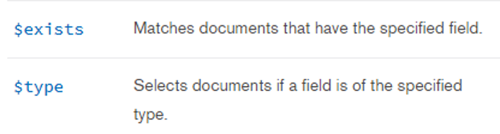

### 10.3.1.$exists

表示文档是否存在指定的属性

**例子：** 查询存在name属性的文档，改为false表示不存在

db.user.find**({**name**:{**$exists**:**true**}})**

### 10.3.2.$type

**例子：**

// 查询name属性为string类型的文档

db.user.find**({**name**:{**$type**:**'string'**}})**


// 查看类型时，可以使用数字替代类型：

db.list_1.find**({**tags**:{**$type**:**4**}})**


 mongodb提供的类型如下所示：

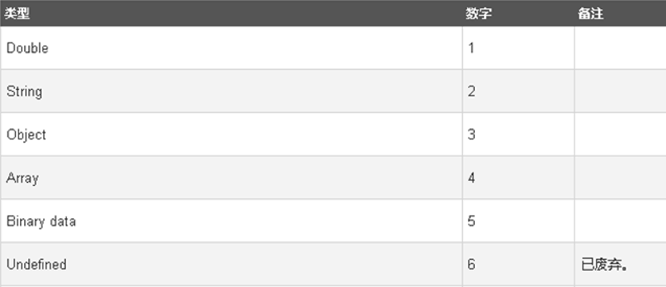

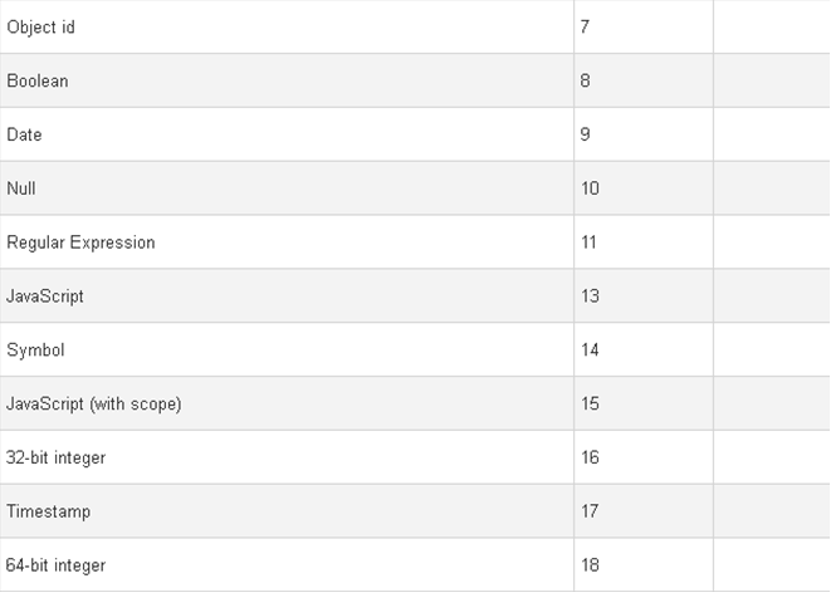

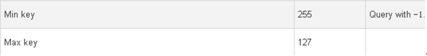

## 10.4.修改操作符

### 10.4.1.$inc

将指定属性的值自增指定的数值，语法：

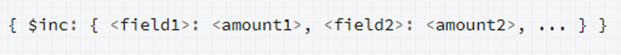

## 10.5.模糊查询操作符

### 10.5.1.$regex

mongodb是的模糊查询是基于正则表达式的，可以选择使用$regex操作符也可以直接输入一个正则表达式：

①直接使用正则表达式，PS：正则表达式不能使用引号""或''

  db.dept.find**({**dname**:**/部/**})** —— 相当于SQL中的 "like %部%"

  db.dept.find**({**dname**:**/^部/**})** —— 相当于SQL中的 "like 部%"

  db.dept.find**({**dname**:**/部$/**})** —— 相当于SQL中的 "like %部"

 

②使用操作符$regex，语法：{"字段名":{$regex:/ 正则表达式 /}}

 db.dept.find**({**dname**:{**$regex**:**/部/**}})**

 // 查询dname值带有"部"的数据

## 10.6.度量操作符

### 10.6.1.$mod

$mod是求余运算符，只有字段的值求余后符合$mod指定的值，所在文档才会被匹配，语法为：$mod:{"字段名":[a,b]}，a为要求余的值，b为求余后的值

 

// 匹配age字段的值对5求余后等于3，例如age=23被匹配，age=24不匹配

db.user.find**({**"age"**:{**$mod**:[**5**,**3**]}})**