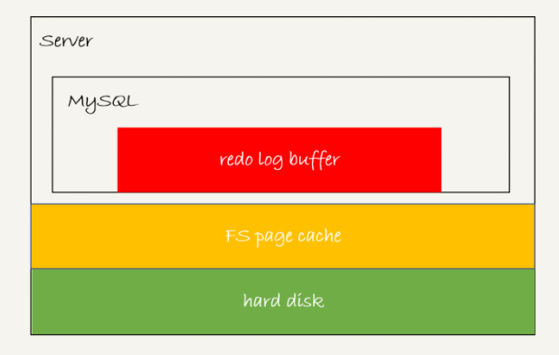
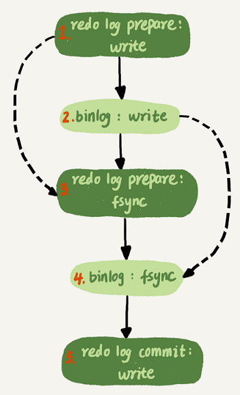

# 1.【MySQL事务基础】

## 1.1.事务概念

- **事务**：一组逻辑操作单元，使数据从一种状态变换到另一种状态；
- **事务处理(事务操作)**：当在一个事务执行多个操作时，要么所有的操作都被提交(commit)，则这些操作就永久地保存起来；要么数据库管理系统放弃所做的所有操作，整个事务回滚(rollback)到最初状态

在 mysql 中，可以使用命令`begin/start transaction`启动一个事务，但它并不是事务的起点，在执行到它们之后的第一个操作InnoDB表的语句，事务才真正启动；想要马上启动一个事务，可以使用`start transaction with consistent snapshot` 这个命令；或者设置了`autocommit=1`执行更新语句的时候会自动提交事务

## 1.2.ACID属性

事务具有以下4个属性，通常简称为事务的ACID属性：

- **原子性(**Atomicity)：事务是一个原子操作单元，其对数据的修改，要么全部  执行，要么全都不执行；
- **一致性**(Consistent)：在事务开始和完成时，数据都必须保持一致状态，所有数据规则都要应用于事务的修改，保持数据完整 ；
- **隔离性**(Isolation)：保证事务在不受外部并发操作影响的“独立”环境执行，  这意味事务处理过程中的中间状态对外部是不可见的，即  并发执行的各个事务之间是不能相互干扰的；
- **持久性**(Durable)：事务完成之后，它对于数据的修改是永久性的，即使出现  系统故障也能够保持。

## 1.3.事务并发处理 

### 1.3.1.并发问题

<table>
  <tr>
  	<th>问题</th>
    <th>描述</th>
  </tr>
  <tr>
  	<td width='20%'>更新丢失</td>
    <td>当两个或多个事务选择同一张表的同一行更新数据，由于每个事务不知道其他事务的存在，就会发生丢失更新问题—最后的更新覆盖其他事务所做的更新</td>
  </tr>
  <tr>
  	<td>脏读</td>
    <td>一个事务正在对一条记录做修改，在这个事务未commit之前，另一个事务也来读取同一条记录，这时第二个事务就有可能读取到这些"脏"数据，因为未提交之前，所做的数据修改可能是测试，也可能是错误的数据，这种现象叫做“脏读”</td>
  </tr>
  <tr>
  	<td>不可重复读</td>
    <td>一个事务范围内两个相同的查询却返回了不同数据，也就是说一个事务在读取某些数据后的某个时间（事务未完成），再次读取以前读过的数据，由于其它事务更新了该字段导致读出的数据已经发生了改变，或某些记录已经被删除了，这种现象就叫做"不可重复读"</td>
  </tr>
  <tr>
  	<td>幻读</td>
    <td>一个事务按相同的查询条件重新读取以前读取的数据，却发现其他事务插入了满足其查询条件的新数据，这种现象就称为“幻读”</td>
  </tr>
</table>
幻读和脏读有点类似：

- 脏读是事务B读取事务A修改中的数据
- 幻读是事务B读取事务A新增的数据
- 在可重复读隔离级别下，普通的查询是快照读，是不会看到别的事务插入的数据的。因此，幻读在“当前读”下才会出现

### 1.3.2.隔离级别

一个事务去其它事务隔离的程度就称为：隔离级别。数据库规定了多种事务隔离级别，不同隔离级别对应不同的干扰程度，隔离级别越高，数据一致性越好，但是并发性越弱。数据库提供4种事务隔离级别:

<table>
  <tr>
  	<th>隔离级别</th>
    <th>描述</th>
  </tr>
  <tr>
  	<td width='33%'>未提交读<br/>(Read cuncommited)</td>
    <td>一个事务还没提交时，它做的变更就能被其它事务看到。脏读、不可重复度和幻读都会发生</td>
  </tr>
  <tr>
  	<td>已提交读<br/>(Read commited)</td>
    <td>一个事务提交之后，它做的变更才会被其他事务看到，可以避免脏读，但无法解决不可重复读和幻读</td>
  </tr>
  <tr>
  	<td>可重复读<br/>(Repeatable read)</td>
    <td>确保事务可以多次从一个字段中读取相同的值，在这个事务持续期间，禁止其它事务对这个字段进行更新。可以避免脏读和不可重复读，但幻读仍然存在</td>
  </tr>
  <tr>
  	<td>串行化<br/>(Serializable)</td>
    <td>确保事务可以从一个表中读取相同的行，在这个事务持续期间，禁止其它事务对该表执行插入符。更新和删除操作，所有并发问题都可以避免，但性能十分低</td>
  </tr>
</table>
数据库的事务隔离越严格，并发副作用越小，但付出的代价也就越大，因为事务隔离实质上就是使事务在一定程度上“串行化”进行，显然与“并发”是矛盾的。mysql默认是可重复读级别，即解决了脏读和不可重复读。查看当前数据库的事务隔离级别：

```sql
show variables like 'tx_isolation';
```

# 2.【MySQL事务实现】

`begin/start transaction`命令并不是一个事务的起点，在执行到它们后面的第一个操作InnoDB表的SQL语句，事务才会真正启动。不过如果想立马启动一个事务，mysql也提供`start transaction with consistent snapshot `命令。

## 2.1.一致性实现

MySQL实现事务一致性是通过 binlog 和 redo log来实现的，当执行一条更新的 DML 语句时，MySQL的执行逻辑如下：

```sql
update user set c=c+1 where ID=2;
```


1. 执行器先请求存储引擎取ID=2这一行。ID是主键，存储引擎直接用索引树搜索找到这一行。如果ID=2这一行所在的数据页本来就在内存中，就直接返回给执行器；否则，需要先从磁盘读入内存，然后再返回；
2. 执行器拿到存储引擎返回的行数据，把这个值加上1，得到新的一行数据，再调用引擎接口写入这行新数据；
3. 引擎将这行新数据更新到内存中，同时将这个更新操作记录到redo log里面，此时redo log处于prepare状态。然后告知执行器执行完成了，随时可以提交事务；
4. 执行器生成这个操作的binlog，并把binlog写入磁盘；
5. 执行器调用引擎的提交事务接口，引擎把刚刚写入的redo log改成提交（commit）状态，更新完成。

**崩溃恢复**

在 MySQL 没发生异常的情况下，更新 SQL 的流程就跟上面一样，mysql 只要保证 redo log 和 binlog 生成记录后，就可以安心地把数据保存到内存缓冲池的数据页中，而不需要每次执行 SQL 都落地到磁盘，可以保证 SQL 的执行效率。不过，一旦 mysql 在上面 5 个流程中突然宕机了，那么数据就可能丢失。为了防止这种异常，MySQL通过binlog和redo日志来保证自己崩溃下数据一致性，这个功能称为**crash-safe**！崩溃恢复时的判断规则：

①如果redo log里面的事务是完整的，也就是已经有了commit标识，则直接提交；

②如果redo log里面的事务只有完整的prepare，则判断对应的binlog是否存在并完整。如果是，则提交事务；否则回滚事务。

- **时刻A**（刚在内存中更改完数据页，还没有开始写redo log的时候奔溃）因为内存中的脏页还没刷盘，也没有写redo log和binlog，即这个事务还没有开始提交，所以奔溃恢复跟该事务没有关系；

- **时刻B**（正在写redo log或者已经写完redo log并且落盘后，处于prepare状态，还没有开始写binlog的时候奔溃）恢复后会判断redo log的事务是不是完整的，如果不是则根据undo log回滚；如果是完整的并且是prepare状态，则进一步判断对应的事务binlog是不是完整的，如果不完整则一样根据undo log进行回滚；

- **时刻C**（正在写binlog或者已经写完binlog并且落盘了，还没有开始commit redo log的时候奔溃）恢复后会跟时刻B一样，先检查redo log中是完整并且处于prepare状态的事务，然后判断对应的事务binlog是不是完整的，如果不完整则一样根据undo log回滚，完整则重新commit redo log；

- **时刻D**（正在commit redo log或者事务已经提交完的时候，还没有反馈成功给客户端的时候奔溃）恢复后跟时刻C基本一样，都会对照redo log和binlog的事务完整性，来确认是回滚还是重新提交。

## 2.2.隔离性实现

InnoDB里面每个事务有一个唯一的事务ID，叫作`transaction id`，是在事务开始的时候向InnoDB的事务系统申请的，是按申请顺序严格递增的。InnoDB每行数据也都是有多个版本的，每次事务更新数据的时候，都会生成一个新的数据版本，并且把transaction id赋值给这个数据版本的事务ID，记为`row trx_id`。首先要记住这两个概念！！！！

其次，mysql 会在每条记录被更新的时候再保存一条回滚日志。一条记录上的当前值永远是最新的，不过可以通过回滚操作可以恢复到上一个` rox trx_id`操作的值。假设一个字段原先值为 1，被多个事务更新为 2、3、4，那么在回滚日志中就会有类似下图所示的记录。这种**同一条记录在系统中可以存在多个版本，就是数据库的多版本并发控制（MVCC）**同一行数据的4个版本，当前最新版本是V4，k的值是22，它是被`transaction id=25`的事务更新的，因此它的row trx_id也是25。下图的三个虚线箭头（U1、U2、U3）就是undo log；而旧版本V1、V2、V3并不是物理上真实存在的，而是每次需要的时候根据当前版本和undo log计算出来的。比如，需要V2的时候，通过V4依次执行U3、U2算出来。正是由于数据具有多版本的特性，使得 InnodDB可以实现”秒级创建快照“


在默认的可重复读隔离级别下，事务在启动的时候会对整个库拍个”快照“（实际就是MVCC要用到的一致性读视图即consistent read view）并规定：

- 一条记录的数据版本是在本事务启动之前生成的，那么它当前的值对本事务可见；
- 一条记录的数据版本是在本事务启动之后生成的，就必须要找上一个版本，假设上一个版本也不可见，就继续向前找...；
- 一条记录的数据版本是在本事务执行期间更新的，那么它当前的值对本事务可见；

那么问题就来了，事务是怎么知道某行记录的数据版本是本事务启动之前还是之后生成的呢？答案就是：事务的一致性视图（read-view） 。实际上，InnoDB为每个事务构造了一个数组，用来保存这个事务启动瞬间，当前启动了但还没提交的事务 ID。数组里面事务ID的最小值记为低水位，当前系统里面已经创建过的事务ID的最大值加1记为高水位。这个视图数组和高水位，就组成了当前事务的一致性视图（read-view）


这样，对于当前事务的启动瞬间来说，一个数据版本的row trx_id，有以下几种可能：

- 如果落在绿色部分，表示这个版本是已提交的事务或者是当前事务自己生成的，这个数据是可见的；
- 如果落在红色部分，表示这个版本是由将来启动的事务生成的，是肯定不可见的；
- 如果落在黄色部分，那就包括两种情况：
  - 若 row trx_id在数组中，表示这个版本是由还没提交的事务生成的，不可见；
  - 若 row trx_id不在数组中，表示这个版本是已经提交了的事务生成的，可见。

**举个例子**

| 事务A                                      | 事务 B                                     | 事务 C                         |
| ------------------------------------------ | ------------------------------------------ | ------------------------------ |
| start transaction with consistent snapshot |                                            |                                |
|                                            | start transaction with consistent snapshot |                                |
|                                            |                                            | update t set k=k+1 where id=1; |
|                                            | update t set k=k+1 where id=1;             |                                |
| select k from t where id=1;<br />commit;   |                                            |                                |
|                                            | commit;                                    |                                |

注意：`begin/start transaction `命令并不是一个事务的起点，在执行到它们之后的第一个操作InnoDB表的语句，事务才真正启动。如果想要马上启动一个事务，可以使用`start transaction with consistent snapshot `命令。表格的每一行表示一个时间点，按照从上到下的顺序时间流逝。假设有3个事务，事务 A 会比事务B 和事务 C 都更早的启动事务，然后 C 最早发起SQL更新。假设刚开始的时候 k 的值为 1。然后假设：

1. 事务A开始前，系统里面只有一个活跃事务ID是99；
2. 事务A、B、C的版本号分别是100、101、102，且当前系统里只有这四个事务；
3. 三个事务开始前(id=1, k=1）这一行数据的row trx_id是90。

这样，事务A的视图数组就是[99,100]，事务B的视图数组是[99,100,101]，事务C的视图数组是[99,100,101,102]。上图可得第一个有效更新是事务C，把数据从k=1改成了k=2，此时这行数据的最新版本的row trx_id是102，而90这个版本已经成为了历史版本。

第二个有效更新是事务B，把数据从k=2改成了k=3，此时这个数据的最新版本（即row trx_id）是101，而102又成为了历史版本。虽然事务B还没有提交，但是它生成的(id=1,k=3)这个版本已经变成当前版本了。

这时候，事务A开始读数据，它的视图数组是[99,100]。当然了，读数据都是从当前版本读起的。所以，事务A查询语句的读数据流程是这样的：

- 找到（id=1, k=3）的时候，判断出row trx_id=101，比高水位大，处于红色区域，不可见；
- 接着找到上一个历史版本，一看row trx_id=102，比高水位大，处于红色区域，不可见；
- 再往前找，终于找到了（id=1,k=1）它的row trx_id=90，比低水位小，处于绿色区域，可见。

这样执行下来，虽然期间这一行数据被修改过，但是事务A不论在什么时候查询，看到这行数据的结果都是一致的，所以称之为一致性读。但其实，还有一个问题：如果事务一旦涉及更新数据（select...for update也是当前读），**都是先读后写的，而这个读，只能读当前的值，称为“当前读”（current read）。**一旦两个事务对同一行数据执行当前读时，必定会加锁（就是行锁啦），只能等待另一个事务释放这个锁，才能继续它的当前读。下面这两个select语句，就是分别加了读锁（S锁，共享锁）和写锁（X锁，排他锁）。

```sql
select k from t where id=1 lock in share mode;
select k from t where id=1 for update;
```

## 2.3.持久性实现

当事务提交以后，mysql就能保证数据不丢失，即保证了持久性。这其中得益于mysql的crash-fafe功能：只要redo log和binlog能持久化到磁盘，即使mysql意外宕机，数据也不会丢失。所以，mysql的持久性实现就是讨论redo log和binlog如何顺利地持久化到磁盘。

**binlog持久化**

mysql执行器将binlog持久化到磁盘之前，都是先把日志保存到内存缓冲即binlog cache，mysql会为每个线程分配一片内存空间用于binlog cache。事务执行期间，先将日志写入到binlog cache；事务提交时候，将binlog cache持久化到binlog文件中（持久化到磁盘）然后清空binlog cache。除此之外，参数 binlog_cache_size用于控制单个线程内binlog cache所占内存的大小，当超过了这个参数规定的大小，就要暂存到磁盘。


每个线程有自己binlog cache，但是共用同一份binlog文件，上图的

1. write：是把日志写入到文件系统的page cache，此时并没有持久化到磁盘，所以速度比较快；

2. fsync：是将数据持久化到磁盘的操作，一般情况下fsync才占磁盘的IOPS；

write和fsync的时机，是由参数sync_binlog控制的：

1. 设置为0，表示每次提交事务都只write，不fsync；
2. 设置为1，表示每次提交事务都会执行fsync；
3. 设置为N(N>1)的时候，表示每次提交事务都write，但累积N个事务后才fsync，但如果宕机有可能丢失最近N个事务

**redo log持久化**

事务执行期间生成的redo log，首先存入到redo log buffer中。innodb并不会每次写到redo log buffer就将其持久化到磁盘，如果此时mysql宕机，该事务的日志就会丢失，但逻辑上这个事务还没有提交，所以它的日志丢失也不会造成数据异常。redo log的磁盘写入策略其实和binlog的差不多，都是这样的套路：buffer → page cache → disk：



为了控制redo log buffer的写入策略，InnoDB提供了`innodb_flush_log_at_trx_commit`参数，有三种取值：

1. 设置为0，表示每次事务提交时都只把redo log保存到redo log buffer；
2. 设置为1，表示每次事务提交时都将redo log直接持久化到磁盘；
3. 设置为2，表示每次事务提交时都只是把redo log写到page cache；

事务执行期间写入到redo log buffer的日志，即使它还没有提交，但这些日志也有可能会被持久化到磁盘中。主要有三种情况：

1. InnoDB有一个后台线程，每隔1秒会把redo log buffer中的日志，调用write写到文件系统的page cache，然后调用fsync持久化到磁盘；

2. redo log buffer占用的内存达到参数`innodb_log_buffer_size`值的一半，后台线程会主动调用write写到文件系统的page cache；

3. 并行事务提交，假设事务A和事务B并发执行，事务A执行到一半已经写入部分日志到redo log buffer中，事务B执行完成，提交事务，如果它设置`innodb_flush_log_at_trx_commit`值为1，事务B就会把redo log buffer的日志全部持久化到磁盘，就会顺带上事务A的日志；

在记录[一致性实现](# 2.1.一致性实现)时，mysql是通过redo log先prepare，再写binlog，最后redo log commit来保证数据一致性的。所以如果`innodb_flush_log_at_trx_commit`设置为1，那么redo log在prepare阶段就会先持久化到磁盘一次。通过开启后台线程轮询刷盘，加上crash-safe保障，InnoDB就可以保证数据不会丢失（即使宕机也可以恢复），所以在redo log commit的时候，它就不需要fsync，只要write到文件系统的page cache即可。常说MySQL双1配置，就是指`sync_binlog`和`innodb_flush_log_at_trx_commit`都设置成1，执行流程上就是：一个事务完整提交前，需要等待两次刷盘（持久化到磁盘），一次是redo log（prepare阶段），一次就是binlog。



​										（只要能够到达redo log prepare阶段，就表示事务已经通过锁冲突的检验）

每次mysql提交事务的时候，都会涉及到两次写入磁盘的操作，相当于如果mysql的TPS是每秒20000，那么每秒就会写40000次磁盘。实际上，mysql采用了组提交机制（即group commit，说白了就是批量提交刷盘），在并发更新场景下，第一个事务写完redo buffer以后，接下来fsync越晚调用，其它事务就越有机会参与到第一个事务的组提交，当数据足够多时，第一个事务执行fsync操作，一次性将redo log都持久化到磁盘上。mysql提供两个参数来处理组提交：

1. binlog_group_commit_sync_delay：表示延迟多少微秒后才调用fsync；
2. binlog_group_commit_sync_no_delay_count：表示累积多少次以后才调用fsync；

总结出mysql的WAL（write ahead logging）机制得益于两个方面：

- redo log和binlog都是顺序写，磁盘顺序写比随机写的速度要快得多
- 组提交机制，大幅度降低磁盘的IOPS消耗

# 3.【MySQL锁基础】

根据加锁的范围，MySQL里面的锁大致可以分成全局锁、表级锁、页面锁和行锁四类。全局锁是所有存储引擎都适用的，MyISAM存储引擎采用的是表级锁；BDB存储引擎采用的是页面锁+表级锁；InnoDB存储引擎既支持行级锁，也支持表级锁，默认行锁。

- **全局锁**：对整个数据库实例加锁，命令是`Flush tables with read lock `(FTWRL)，当加了这个全局锁以后，其它线程的如下语句会被阻塞：数据更新语句（数据的增删改）、数据定义语句（包括建表、修改表结构等）和更新类事务的提交语句；一般用于全库备份
- **表级锁**：开销小，加锁快；不会出现死锁；锁定粒度大，发生锁冲突的概率最高,并发度最低；
- **页面锁**：开销和加锁时间界于表锁和行锁之间；会出现死锁；锁定粒度界于表锁和行锁之间，并发度一般；
- **行级锁**：开销大，加锁慢；会出现死锁；锁定粒度最小，发生锁冲突的概率最低,并发度最高；

## 3.1.锁类别

### 3.1.1.表级锁

MySQL中的表级锁分为两种：表锁和元数据锁（meta data lock，简称 MDL）

- **表锁**

  表锁会将整张表锁起来，分为读锁和写锁，语法为：

  ```sql
  -- 为表t_applyobjects加读锁, 为表t_devices加写锁
  LOCK TABLES t_applyobjects READ, t_devices WRITE;
  
  -- 解锁
  UNLOCK TABLES;
  ```

  可以用`unlock tables`主动释放锁，也可以在客户端断开的时候自动释放。`lock tables`除了会限制别的线程的读写外，也限定了本线程接下来的操作对象。例如：

  - 如果 session1，对表 user 加了读锁，那么 session1 可以读表user，但不可以写表，还不可以读其它表；其它session可以读表 user，可以读写其它表，但是不可以写表 user；
  - 如果 session1，对表 user 加了写锁，那么 session1可以读写表t_user，但不可以读/写其它未加锁的表；其它 session 可以读写其它表，但不能读写表user；

  对支持行锁的 InnoDB 存储引擎来说，大部分情况下都不会使用表锁，因为锁住范围太大。通过SQL 查询MySQL 的表加锁情况：

  ```sql
  show open tables;
  ```

- **MDL**

  另一类表级锁就是元数据锁MDL，它不需要显式使用，在访问一个表的时候会被自动加上。在MySQL 5.5及以后版本，当对一个表做增删改查操作的时候，加MDL读锁；当要对表做结构变更操作的时候，加MDL写锁。注意：MDL会直到事务提交才释放，在做表结构变更的时候，一定要小心不要导致锁住线上查询和更新。

  - MDL读锁之间不互斥，可以有多个线程同时对一张表增删改查；
  - MDL读写锁之间、MDL写锁之间互斥，如果有两个线程要同时给一个表加字段，其中一个要等另一个执行完才能开始执行；

### 3.1.2.行锁

InnoDB有3种行锁的算法：

- Record Lock：单个行记录上的锁（即通常意义上讲的行锁）

- Gap Lock：间隙锁，锁定一个范围，但不包含记录本身

- Next-Key Lock：即Gap Lock+Record Lock，锁定一个范围，并且锁定记录本身（左开右闭）

行锁，即数据表中行记录的锁，它的锁定粒度最小，发生锁冲突的概率最低，并发度最高；不过行锁开销大，容易出现死锁现象！行锁默认就是开启的，只要涉及数据行的修改，mysql自动就会对影响的行记录加行锁。也可以手动指定：

- 排它锁，语法：`for update`，例子：select * from t where id=1 for update;
- 共享锁，语法：`lock in share mode`，例子：select * from t where id=200 lock in share mode;

注意：**在InnoDB事务中，行锁是在需要的时候才加上的，但并不是不需要了就立刻释放，而是要等到事务commit时才释放**，啥意思？比如这样一个事务：

```sql
BEGIN;

-- sql 执行到这边, 就会对 id=1 这条记录加行锁, 但是不会对 id=2 这条记录加行锁.
UPDATE t set k=k+1 WHERE id=1;

-- 其它sql语句执行...仍然不会对 id=2 这条记录加行锁, 且 id=1 这个行锁还不会释放.
-- ...

-- 直至执行到这条 sql, 才会对 id=2 这条记录加行锁, 此时 id=1 这个行锁还没有释放.
UPDATE t set k=k+1 WHERE id=2;

-- 事务提交后, id=1 和 id=2 这两个行锁才会释放掉..
COMMIT;
```

所以在一个事务中，需要执行多条更新语句即锁多个行，要把最可能造成锁冲突、最可能影响并发度的锁尽量往后放，也就是把影响最大的更新语句放到事务的末尾去执行。这样可以保证这条行锁不被过早地持有，导致其它事务都阻塞等待它。实际上，由于这个性质，行锁也容易导致死锁的出现！！！

### 3.1.3.间隙锁

仅当mysql的事务隔离级别为可重复读时，间隙锁才会生效。mysql行锁只能锁住已存在的行记录，这就导致了无法解决幻读问题，因为出现幻读的数据都是新插入的（事务已经开启，如果插入新数据，mysql是不会加锁的）即使给所有的行都加上行锁，也无法解决幻读问题。所以为了解决幻读的问题，InnoDB引入了新的锁，即间隙锁（Gap Lock） 锁的就是两个索引值之间的空隙！！！

```sql
-- 建表t
CREATE TABLE `t` (
  `id` int(11) NOT NULL,
  `c` int(11) DEFAULT NULL,
  `d` int(11) DEFAULT NULL,
  PRIMARY KEY (`id`),
  KEY `c` (`c`)
) ENGINE=InnoDB;
-- 初始化6条记录
insert into t values(0,0,0),(5,5,5),(10,10,10),(15,15,15),(20,20,20),(25,25,25);
```

间隙锁和行锁合称`next-key lock`，每个`next-key lock`是前开后闭区间（间隙锁是开区间）。如果表t初始化以后，用`select * from t for update`把整个表所有记录锁起来，就会形成7个`next-key lock`，分别是 (-∞,0]、(0,5]、(5,10]、(10,15]、(15,20]、(20, 25]、(25, +supremum]（InnoDB会给每个索引加一个不存在的最大值supremum）


不过要注意：**间隙锁之间互不排斥，但是往间隙锁中插入一条记录这个操作是互斥的**。举个例子，基于上表当开启两个Session执行如下SQL语句时就会发生锁冲突而造成行锁：


Session A先执行，但是表里没有`id=9`这条记录，所以加的不是行锁而是间隙锁；往后走一个时刻，session B开始执行，当前表还是没有`id=9`这条记录，所以session B还是加的间隙锁。也就是说session B是不会被堵住的，A、B加的间隙锁互不排斥，这两个间隙锁的目的就是防止其它线程插入值。

1. session A先执行，表t没有`id=9`这一行，所以会加上间隙锁(5,10]；
2. session B再执行，同样会加上间隙锁(5,10]，由于间隙锁之间不会冲突，这个语句可以执行成功；
3. session B尝试插入一条新数据(9,9,9)，被session A的间隙锁挡住了，进入阻塞等待状态；
4. session A尝试插入一条新数据(9,9,9)，同样会被session B的间隙锁挡住了，也进入阻塞等待状态，此时发生死锁！！

## 3.2.死锁检测

死锁：是指不同线程出现循环资源依赖，涉及的线程都在等待别的线程释放资源，就会导致这几个线程都进入无限等待的状态。由于行锁是仅在使用时才加锁，且事务结束才释放的性质，如果多个事务执行 SQL 的顺序不一样，就容易导致死锁的发生。MySQL出现死锁以后，有两种策略：

- 策略 1：直接进入等待，直到超时。该超时时间可以通过参数`innodb_lock_wait_timeout`来设置，默认值是50s；
- 策略 2：发起死锁检测，发现死锁后，主动回滚死锁链条中的某一个事务，让其它事务可以继续执行。将参数`innodb_deadlock_detect`设置为on，表示开启这个逻辑，默认这个参数就是开启的。

## 3.3.加锁规则

mysql的加锁规则有点复杂，并且它会随着版本更新而变化，如果想详细懂它，最好的方式就是阅读mysql的源码。这边是参考大牛专栏总结做的记录，这个加锁规则限于：5.x系列<=5.7.24，8.0系列 <=8.0.13，并且这个加锁规则只满足可重复读的隔离级别。其本质就是**InnoDB引擎，根据你的SQL，结合它维护的索引树，来确定加锁的边界**！！

前提条件：

1. 分析🔐范围，需要结合SQL语句的执行逻辑来进行
2. 🔐都是在SQL语句执行过程中一个一个加的，而不是一次性加上去，即next-key lock是分为：加间隙锁，再加行锁
3. 🔐的对象是索引，即索引树内字段的值（包括间隙）若没有索引的加锁，会退化成表锁

加锁规则：

- 原则1：加锁基本单位是next-key lock，即每次要加锁时，都是先加这个锁，它是前开后闭区间；
- 原则2：查找过程中访问到的对象才会加锁，加的就是next-key lock；
- 优化1：唯一索引等值查询，next-key lock退化为行锁；
- 优化2：索引（包括普通索引和唯一索引）等值查询，向右遍历时且最后一个值不满足等值条件，next-key lock退化成间隙锁；
- 一个bug：唯一索引上的范围查询访问到不满足条件的第一个值为止；

实际案例：

```sql
-- 创建新表t, 对字段c加普通索引
CREATE TABLE `t` (
  `id` int(11) NOT NULL,
  `c` int(11) DEFAULT NULL,
  `d` int(11) DEFAULT NULL,
  PRIMARY KEY (`id`),
  KEY `c` (`c`)
) ENGINE=InnoDB;

-- 预先插入6条数据
insert into t values(0,0,0),(5,5,5),(10,10,10),(15,15,15),(20,20,20),(25,25,25);
```

### 3.3.1.唯一索引等值查询


首先，要结合SQL语句一起分析加锁情况，很明显session A先执行，拿出它的SQL语句分析

```sql
begin;
update t set d=d+1 where id=7;
```

执行update语句默认加锁，where条件是通过主键id匹配（唯一索引）。很明显，引擎首先要找的就是id=7这条行记录，但是表里面并没有id=7的行记录，却可以找到（5，10）的间隙，它里面包括了id=7。最终引擎就在主键索引上加了（5，10）的间隙锁。这个例子就算不用上面的加锁规则也容易得分析出来！最终，session B插入id=8会被阻塞，而session C插入id=10不会被阻塞

### 3.3.2.覆盖索引等值查询


首先，要结合SQL语句一起分析加锁情况，很明显session A先执行，拿出它的SQL语句分析

```sql
begin;
select id from t where c=5 lock in share mode;
```

where匹配条件为`c=5`，说明用的是辅助索引c；select查询的仅是id，直接走索引查询即可（覆盖索引）不用回表；最后一个关键点，lock in share mode和for update的加锁程度不一样，遇到覆盖索引时，前一个只会对辅助索引加锁，而后一个会对主键索引加锁。

1. 引擎开始遍历索引树c，它找到（5,5,5）这一行，为其加上next-key lock，即 (0, 5]

2. 由于是普通索引，引擎不知道后面是否还有c=5的情况，就向右遍历一直找到（10,10,10）这一行，才确定已经没有c=5的行记录，就为其加上next-key lock，即 (5, 10] — 这边就要得到一个经验，没确定到一行，就为这一行加一个next-key lock
3. 第2步加的next-key lock，符合上面加锁规则的优化2，向右遍历到第一个不满足c=5这个等值条件，next-key lock会退化成间隙锁，实际加的锁为 (5, 10)

所以这条SQL语句，实际加锁依次为：(0, 5]、(5, 10)，且只在辅助索引c上加锁，主键索引没加锁！！因此Session B可以执行，因为它获取到的是主键id=5的行锁，而session C由于要插入c=7的行记录，会被间隙锁 (5, 10) 锁住。

注：对于范围查找，比如 >=，>，<，<=...到底加的是间隙锁还是行锁，要依靠执行过程来分析，InnoDB要去找“第一个值”的时候，是按照等值去找的，用的是等值判断的规则；找到第一个值以后，要在索引内找“下一个值”，对应于加锁规则中说的范围查找。

### 3.3.3.唯一索引范围查询


首先，要结合SQL语句一起分析加锁情况，很明显session A先执行，拿出它的SQL语句分析

```sql
begin;
select * from t where id>=10 and id<11 for update;
```

1. 引擎需要找到id=10这一行，从它开始遍历，所以会为（10,10,10）加上next-key lock，又因为是等值查询，所以符合优化1，next-key lock 会退化成行锁，对（10,10,10）这一行加行锁
2. 然后引擎开始范围查询，要找id大于10并且小于11的索引值，只有一直找到（15,15,15）这一行（这边为啥是15这一行？因为原先的索引树就只有id=10，id=15这两个记录符合条件，所以加锁是需要根据索引树当前的值来判断的），才确定后面的索引值不会小于11。所以最后访问的对象就是（15,15,15），会为其加上next-key lock，即 (10, 15]
3. 最后加锁结果就是：主键索引上的行锁id=10，和next-key lock (10, 15]，因此session B插入(8,8,8)就不会阻塞，但插入(13,13,13)就会被阻塞；同理session C由于更新的是主键id=15，所以必定被阻塞；

再次提醒：对于范围查找，比如 >=，>，<，<=...到底加的是间隙锁还是行锁，要依靠执行过程来分析，InnoDB要去找“第一个值”的时候，是按照等值去找的，用的是等值判断的规则；找到第一个值以后，要在索引内找“下一个值”，对应于加锁规则中说的范围查找。

### 3.3.4.非唯一索引范围查询


首先，要结合SQL语句一起分析加锁情况，很明显session A先执行，拿出它的SQL语句分析

```sql
begin;
select * from t where c>=10 and c<11 for update;
```

1. 引擎先确定使用的索引树，由于where条件使用的字段c，所以扫描过程走的是普通索引，即索引树c。但是select语句用的是`*`，所以走完索引树以后，还需要回表查询主键索引id。因此主键索引树也是会被加锁的。跟上一个例子一样，首先要找到id=10这一行，然后为其加上next-key lock，即 (5, 10]
2. 然后开始范围查询，一直找到（15,15,15）这一行，才能确定后面没有小于11的索引值，所以最后会为（15,15,15）加上next-key lock，即(10, 15]
3. 最终引擎就会在索引树c上加上两个next-key lock： (5, 10] 和 (10, 15]，又因为id=10和id=15是存在的行，还会在主键索引上加上行锁。所以session B插入id=8就会被阻塞住，session C更新c=15也被阻塞住

### 3.3.5.唯一索引范围锁bug


首先，要结合SQL语句一起分析加锁情况，很明显session A先执行，拿出它的SQL语句分析

```sql
begin;
select * from t where id>10 and id<=15 for update;
```

1. 引擎先确定使用的索引树，很明显就是主键索引（即唯一索引）。首先找到（10,10,10）这一行，发现SQL条件是`id>10`，所以直接范围查询，直到扫描到（15,15,15）这一行，发现已经满足`id<=15`的条件，所以实际加锁：next-key lock (10, 15]
2. 但实际上，对于唯一索引的范围查询，InnoDB会往前扫描到第一个不满足条件的行为止（加锁规则中的bug说明），在这个例子上，就是一直扫描到（20,20,20）这一行，而且也是一个范围查询，所以还会加锁：next-key lock (15, 20]。注意如果这边把SQL条件改成`id<15`，那么只需要扫描到（15,15,15）即可，因为当id=15就已经不满足SQL中的`id<15`。
3. 最终加锁的，就是主键索引上的(10, 15]和(15, 20]，所以session B操作id=20就会被阻塞住，session C插入id=16的行记录也会锁住

### 3.3.6.非唯一索引多等值加锁

插入一条SQL，它的字段c也为10，就是说明现在表中存在两条c=10的行记录（但是它们的主键记录不一样）

```sql
insert into t values(30,10,30);
```

由于非唯一索引上包含主键的值，所以索引c上是不可能存在“相同”的两行的，此时索引树c就变为如下的样子。虽然有两个c=10，但是它们的主键值id是不同的（分别是10和30），因此这两个c=10的记录之间，也是有间隙的。


此时执行如下的SQL：


首先，要结合SQL语句一起分析加锁情况，很明显session A先执行，拿出它的SQL语句分析

```sql
begin;
delete from t where c=10;
```

1. 引擎首先确定要使用的索引树，很明显，使用索引树c。接着就开始遍历索引树c（注意此时有2个c=10的行记录），扫描到第一个行记录（10,10,10），为其加上next-key lock，即 (c=5&id=5, c=10&id=10]

2. 然后引擎还需要继续向右遍历（因为索引树c不是唯一索引，可能后面还有c=10的索引值）此时会有发现一个行记录（30,10,30），也为其加上next-key lock，即 (c=10&id=10,  c=10&id=30]

3. 同第2步一样，引擎还是需要继续向右遍历，一直扫描到（15,15,15）这一行，才能确定后面的索引值不会再有c=10的行记录，所以会对（15,15,15）这一行加上next-key lock，即 (c=10&id=30,  c=15&id=15]。但是SQL语句是等值查询，符合优化2，next-key lock会退化成间隙锁，实际加锁就变成：(c=10&id=30,  c=15&id=15)

4. 最终加锁区间： (c=5&id=5, c=10&id=10]、 (c=10&id=10,  c=10&id=30]、(c=10&id=30,  c=15&id=15)，就是下图所示的区间。其中id=10和id=30是存在的行，所以也会在主键索引上为其加上这两个行锁。

   

### 3.3.7.limit 语句加锁


这个例子跟[上一个例子](# 3.3.6.非唯一索引多等值加锁)相似，但是又有不同，因为这里的session A的delete语句加了 limit 2，由于SQL语句已经明确最多只要删除2行即可，引擎在遍历到(c=10, id=30)这一行之后，满足条件的语句已经有两条，扫描就结束了。最终，索引c上的加锁范围就变成了(5,5,5)到(30,10,30)的前开后闭区间。所以**在删除数据的时候尽量加limit**。这样不仅可以控制删除数据的条数，可以减小加锁的范围。

也说明了一点，分析mysql实际加锁，一定要结合SQL语句来思考，比如limit、order by asc、order by desc，扫描遍历的方向都会不一样！

### 3.3.8.next-key lock死锁


这个例子是为了说明，分析mysql加锁的时候，直接按照next-key lock的逻辑来分析，但实际上next-key lock是间隙锁和行锁加起来的结果，比如上面这个例子。

1. session A启动，走的是覆盖索引，所以只会在索引树c上加锁。引擎遍历到（10,10,10）这一行，发现符合条件，为其加上next-key lock，即 (5, 10]
2. 由于索引树c是非唯一索引，引擎不知道后面是否还有c=10的索引值，所以继续向右遍历，一直找到（15,15,15）这一行才确定后面一句没有c=10的索引值，所以为（15,15,15）加上next-key lock。但是呢，session A的SQL是等值查询，符合优化2，next-key lock会退化成间隙锁，实际加锁为：(10,15)
3. 然后session B开始执行，它同样也会在索引c上加next-key lock，即(5, 10]。此时就有问题啦，因为next-key lock是分为间隙锁和行锁来执行的，所以刚开始，session B是加上(5, 10)的间隙锁，这是可以成功的，因为间隙锁互不影响；然后session B又要为c=10这一行加上行锁，由于已经在第1步被session A抢走了，所以session B开始阻塞
4. 这时候，如果session A执行insert语句，就会被session B的间隙锁锁住。此时就会出现死锁，session B在等待session A的行锁，session A在等待session B的间隙锁。引擎就会让session B回滚
5. 所以，分析加锁规则的时候可以用next-key lock来分析。但是在具体执行的时候，是要分成间隙锁和行锁两段来执行的。 

### 3.3.9.不等号条件的等值查询

分析下下面这条SQL语句的加锁范围：

```sql
begin;
select * from t where id>9 and id<12 order by id desc for update;
```

1. 引擎先确定索引树，用的是主键索引（就是唯一索引），然后要注意SQL语句用的是`order by id desc`，所以引擎扫描主键索引树是从右往左查找。很明显，首先需要找到id=12这一行的记录，但很可惜，当前行记录中没有id=12，所以引擎只能加上（10,15）间隙锁
2. 然后引擎向左继续遍历，一直遇到（5,5,5）这一行，引擎才可以确定继续左边遍历已经没有意义了，所以会为（5,5,5）加上next-key lock
3. 最终加锁范围就是，主键索引上的(0, 5]、(5, 10]、(10, 15)

# 4.【批量insert加锁】

由于有redo log和binlog的存在，mysql执行一条insert语句速度很快，直接刷新进去内存数据页即可，所以也就没有加锁的概念（可能申请自增主键的时候需要加自增锁）说这么多，就是为了表达，普通insert语句是一个很轻量级的操作！假设创建两张表：

```sql
-- 创建表t
CREATE TABLE `t` (
  `id` int(11) NOT NULL AUTO_INCREMENT,
  `c` int(11) DEFAULT NULL,
  `d` int(11) DEFAULT NULL,
  PRIMARY KEY (`id`),
  UNIQUE KEY `c` (`c`)
) ENGINE=InnoDB;

-- 插入表t, 4条数据
insert into t values(null, 1,1);
insert into t values(null, 2,2);
insert into t values(null, 3,3);
insert into t values(null, 4,4);

-- 创建表t2, 跟表t结构一样
create table t2 like t
```

## 4.1.insert...select

在可重复读隔离级别，binlog_format=statement时执行下面这条SQL语句，需要对表t的所有行和间隙加锁：

```sql
insert into t2(c,d) select c,d from t;
```

mysql为啥会选择这样加锁？原因其实就是binlog_format=statement，因为它记录的SQL本身。在不加锁的情况下，如果sessionB在主库先执行了，但是binlog却比sessionA晚写入

| sessionA                       | sessionB                              |
| ------------------------------ | ------------------------------------- |
| insert into t values(5, 5, 5); | insert into t2(c,d) select c,d from t |

那么就会出现这样的binlog语句序列，这个binlog交给从库执行时，就会出现主库的t2并没有（5,5,5）这一行，而从库t2存在这一行，就会发生数据不一致的现象。

```sql
insert into t values(5,5,5);
insert into t2(c,d) select c,d from t;
```

因此在可重复读隔离级别，binlog_format=statement前提下，执行insert...select语句，mysql会为select语句后面的表加锁。但是要注意，对目标表并不永远都是锁全表，mysql只是锁住需要访问的资源：

```sql
-- 这条语句的加锁范围：表t索引c上的(3,4]和(4,supremum]这两个next-key lock，以及主键索引上id=4这一行
insert into t2(c,d)  (select c+1, d from t force index(c) order by c desc limit 1);
```

## 4.2.insert唯一键冲突


在可重复读隔离级别下，session A执行的insert语句，发生唯一键冲突的时候，并不只是简单地报错返回，还会在冲突的索引上加了锁。这时候，session A持有索引c上的(5,10]共享的next-key lock（读锁），所以这时候session B插入数据的时候就会阻塞住了。因此，**碰到由于唯一键约束导致报错后，要尽快提交或回滚事务，避免加锁时间过长**。

在下面这个例子，唯一键冲突还会造成死锁：


死锁的逻辑为：

1. 在T1时刻，session A执行insert语句，此时会在索引c=5上加记录锁；
2. 在T2时刻上，session B要执行相同的insert语句，发现了唯一键冲突，加上读锁；同样地，session C也在索引c上加了读锁；
3. T3时刻，session A回滚。此时，session B和session C都试图继续执行插入操作，都要加上写锁。因此，两个session都需要等待对方的读锁，就出现了死锁

## 4.3.insert...on duplicate key

insert into … on duplicate key update 这个语义的逻辑是，插入一行数据，如果碰到唯一键约束，就执行后面的更新语句。如果有多个列违反了唯一性约束，就会按照索引的顺序，修改跟第一个索引冲突的行。

不过有一点需要注意，在执行成功后，这条语句的affected rows返回的是2，很容易造成误解。实际上，真正更新的只有一行，只是在代码实现上，insert和update都认为自己成功了，update计数加了1， insert计数也加了1。