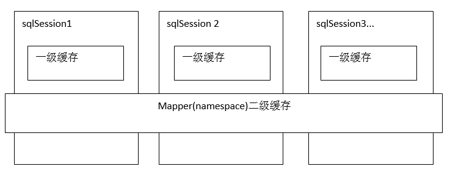
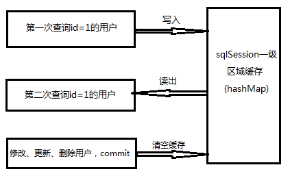
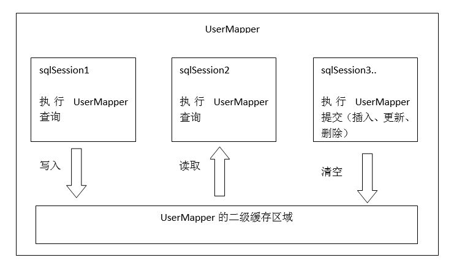

# 1.入门程序

## 1.1.pom依赖

```xml
<dependency>
   <groupId>org.mybatis</groupId>
   <artifactId>mybatis</artifactId>
   <version>3.5.3</version>
</dependency>
```

## 1.2.创建sqlMapConfig.xml

创建全局配置文件sqlMapConfig.xml(名称可变)

```xml
<?xml version="1.0" encoding="UTF-8" ?>
<!DOCTYPE configuration  PUBLIC "-//mybatis.org//DTD Config 3.0//EN"  "http://mybatis.org/dtd/mybatis-3-config.dtd">
<configuration>
   <!-- 配置mybatis的环境信息，与spring整合，该信息由spring来管理，了解就行 -->
   <environments default="development">
      <environment id="development">
         <!-- 配置JDBC事务控制，由mybatis进行管理 -->
         <transactionManager type="JDBC"/>
         <!-- 配置数据源，采用mybatis连接池 -->
         <dataSource type="POOLED">
            <property name="driver" value="${jdbc.driver}" />
            <property name="url" value="${jdbc.url}" />
            <property name="username" value="${jdbc.username}" />
            <property name="password" value="${jdbc.password}" />
         </dataSource>
      </environment>
   </environments>
   <!-- 加载映射文件 -->
   <mappers>
      <!--通过resource一次只能加载一个mapper.xml -->
      <mapper resource="mapper/role/roleMapper.xml" />
   </mappers>
</configuration> 
```

## 1.3.创建mapper

创建一个Mapper文件，即第②步在sqlMapConfig.xml中<mappers>配置的xml：

```xml
<?xml version="1.0" encoding="UTF-8" ?>  
<!DOCTYPE mapper  PUBLIC "-//mybatis.org//DTD Mapper 3.0//EN"  
  "http://mybatis.org/dtd/mybatis-3-mapper.dtd">
<mapper namespace="test">
    <select id="selRoleById" parameterType="String" 
            resultType="com.model.RoleBean">
        <!--sql语句,#{}即jdbc的占位符 "?" -->
        SELECT * FROM t_role WHERE role_id=#{id}
    </select>
</mapper>  
```

## 1.4.创建SqlSessionFactory

根据配置文件，创建会话工厂。创建会话工厂需要sqlMapConfig.xml配置文件，而sqlMapConfig.xml需要mapper.xml配置文件，当我们两个文件配置好了，就可以创建会话工厂了

```java
/* 1、根据配置文件创建会话工厂 */
String resource = "sqlMapConfig.xml";
// resources由mybatis自己提供的
InputStream inputStream = Resources.getResourceAsStream(resource);
SqlSessionFactory sessionFactory = new SqlSessionFactoryBuilder().build(inputStream);
```

创建会话工厂的方式为SqlSessionFactoryBuilder().build(inputStream)此方法需要一个输入流参数(就是把sqlMapConfig.xml文件转出流的式)，mybatis自带org.apache.ibatis.io.Resources用于将配置文件转成流，只需要提供文件的地址即可(这个地址是相对于classpath而言)

## 1.5.创建SqlSession

由会话工厂创建会话sqlSession

```java
/* 由会话工厂创建会话 */
SqlSession sqlsession = sessionFactory.openSession();
```

由sqlSession执行SQL语句，它里面提供了CRUD操作的API

```java
/* 由会话sqlSession执行配置在mapper.xml中的sql语句 */
RoleBean role = sqlsession.selectOne("test.selRoleById", "101");
```

# 2.sqlMapConfig.xml

sqlMapConfig.xml是mybatis的核心配置文件，它的选择项如下：

①Properties（属性）

②Settings（全局参数设置）

③typeAliases（类型别名）

④typeHandlers（类型处理器）

⑤objectFactory（对象工厂）

⑥plugins（插件）

⑦environments（环境信息集合）

⑧mappers（映射器）

## 2.1.Properties

用于加载外部资源文件或声明属性信息

```xml
<!--加载资源文件，比如说数据库的配置或者声明属性的信息 -->
<properties resource="db.properties">
   <!--在properties里面可以配置property，表示一些属性，但是不推荐这样做-->
</properties>
```

PS：Mybatis按照下面的顺序加载属性：

1、在properties元素体内定义的属性首先被读取

2、读取properties元素resource或url加载的属性，覆盖已读取的同名属性

3、最后读取paramterType传递的属性，它也会覆盖已读取的同名属性

## 2.2.Settings

全局配置参数，会影响mybatis的运行行为。在运行时调整一些运行参数，比如开启二级缓存、延迟加载，注意需要时才设置，不需要就不用设置。[参考](http://blog.csdn.net/u014231523/article/details/53056032)

| **设置参数**              | **作用**                                                     | **有效值**                                                   |
| ------------------------- | ------------------------------------------------------------ | ------------------------------------------------------------ |
| cacheEnabled              | 影响的所有映射器中配置的缓存的全局开关                       | 默认true                                                     |
| lazyLoadingEnabled        | 延迟加载的全局开关。当开启时，所有关联对象都会延迟加载。  特定关联关系中可通过设置fetchType属性来覆盖该项的开关状态 | 默认false                                                    |
| aggressiveLazyLoading     | 当启用时，对任意延迟属性的调用会使带有延迟加载属性的对象完整加载；反之，每种属性将会按需加载 | 默认true                                                     |
| multipleResultSetsEnabled | 是否允许单一语句返回多结果集  （需要兼容驱动）               | 默认true                                                     |
| useColumnLabel            | 使用列标签代替列名。不同的驱动在这方面会有不同的表现，  具体可参考相关驱动文档或通过测试这两种不同的模式来观察所用驱动的结果 | 默认true                                                     |
| useGeneratedKeys          | 允许 JDBC 支持自动生成主键，需要驱动兼容。  如果设置为 true 则这个设置强制使用自动生成主键，尽管一些驱动不能兼容但仍可正常工作（比如 Derby） | 默认false                                                    |
| autoMappingBehavior       | 指定 MyBatis 应如何自动映射列到字段或属性。 NONE 表示取消自动映射；PARTIAL 只会自动映射没有定义嵌套结果集映射的结果集。 FULL 会自动映射任意复杂的结果集（无论是否嵌套） | 三种取值：  NONE, PARTIAL, FULL；  默认PARTIAL               |
| defaultExecutorType       | 配置默认的执行器。SIMPLE  就是普通的执行器；REUSE 执行器会重用预处理语句（prepared  statements）； BATCH 执行器将重用语句并执行批量更新。 | 三种取值：  SIMPLE，REUSE，  BATCH；  默认SIMPLE             |
| defaultStatementTimeout   | 设置超时时间，它决定驱动等待数据库响应的秒数                 | 三种取值：  Any，positive， integer；默认  null(未设置)      |
| defaultFetchSize          | 设置驱动程序提示以控制返回结果的获取大小。 此参数值可以被查询设置覆盖。 | 三种取值：  Any，positive， integer；默认  null(未设置)      |
| safeRowBoundsEnabled      | 允许在嵌套语句中使用分页（RowBounds）                        | 默认false                                                    |
| mapUnderscoreToCamelCase  | 是否开启自动驼峰命名规则（camel case）映射，即从经典数据库列名 A_COLUMN 到经典 Java 属性名 aColumn 的类似映射 | 默认false                                                    |
| localCacheScope           | MyBatis 利用本地缓存机制（Local Cache）防止循环引用（circular references）和加速重复嵌套查询。  默认值为 SESSION，这种情况下会缓存一个会话中执行的所有查询。 若设置值为 STATEMENT，本地会话仅用在语句执行上，对相同 SqlSession 的不同调用将不会共享数据 | 两种取值：  SESSION ，STATEMENT；  默认SESSION               |
| jdbcTypeForNull           | 当没有为参数提供特定的  JDBC 类型时，为空值指定 JDBC 类型。 某些驱动需要指定列的 JDBC 类型，多数情况直接用一般类型即可，比如 NULL、VARCHAR 或 OTHER | 默认值OTHER                                                  |
| lazyLoadTriggerMethods    | 指定哪个对象的方法触发一次延迟加载。                         | 以逗号隔开的方法名称                                         |
| defaultScriptingLanguage  | 指定动态 SQL 生成的默认语言。                                | 别名或者类全名                                               |
| callSettersOnNulls        | 指定当结果集中值为 null 的时候是否调用映射对象的 setter（map 对象时为 put）方法，这对于有 Map.keySet() 依赖或 null 值初始化的时候是有用的。注意基本类型（int、boolean等）是不能设置成 null 的 | 默认false                                                    |
| logPrefix                 | 指定 MyBatis 增加到日志名称的前缀                            | 任何字符串，默认未设置                                       |
| logImpl                   | 指定 MyBatis 所用日志的具体实现，未指定时将自动查找          | SLF4J，LOG4J ，LOG4J2 ， JDK_LOGGING ，COMMONS_LOGGING ，STDOUT_LOGGING ，NO_LOGGING |
| proxyFactory              | 指定 Mybatis 创建具有延迟加载能力的对象所用到的代理工具      | 两种取值：  CGLIB \| JAVASSIST；  3.3以上版本用  JAVASSIST   |

## 2.3.typeAliases

在mapper.xml中需要定义很多的paramterType和resultType,如果在指定类型时输入类型全路径，不方便进行开发，可以针对paramterType和resultType指定的类型定义一些别名，mapper.xml中通过别名定义，方便开发**默认别名：**

| 别名     | 映射的类型 |      | 别名       | 映射的类型 |
| -------- | ---------- | ---- | ---------- | ---------- |
| _byte    | byte       |      | _boolean   | boolean    |
| _long    | Long       |      | String     | String     |
| _short   | short      |      | byte       | Byte       |
| _int     | int        |      | long       | Long       |
| _integer | int        |      | short      | Short      |
| _double  | double     |      | int        | Integer    |
| _float   | float      |      | integer    | Integer    |
| double   | Double     |      | float      | Float      |
| boolean  | Boolean    |      | date       | Date       |
| decimal  | BigDecimal |      | bigdecimal | BigDecimal |

**自定义别名：**

```xml
<typeAliases>
   <!--单个别名设置,type是类型，alias是待设置的别名 -->
   <typeAlias type="com.model.UserBean" alias="user" />
   <!-- 批量别名设置，name是要扫描的包路径，默认以类名作别名(大小写均可) -->
   <package name="com.model" />
</typeAliases>
```

## 2.4.typeHandlers

类型处理器，mybatis中通过typeHandllers完成jdbc类型和java类型的转换通常情况下，mybatis提供的类型处理器满足日常需要，不需要自定义

## 2.5.objectFactory

创建对象的工厂，一般使用mybatis默认实现DefaultObjectFactory

## 2.6.plugins

mybatis的高可扩展性实现，可以在mybatis中实现各式各样的插件，然后配置在这里：

```xml
<plugins>
   <!-- 每一个<plugin>代表一个插件 -->
   <plugin interceptor="com.github.pagehelper.PageInterceptor">
      <!-- 使用下面的方式配置参数,如果需要的话-->
      <!-- <property name="param1" value="value1"/>-->
   </plugin>
</plugins>
```

## 2.7.environments

配置连接池的环境，与spring集成时一般都交予spring管理。如果单独使用mybatis，可以这样配置：

```xml
<environments default="development">
   <environment id="development">
      <!-- 配置JDBC事务控制，由mybatis进行管理 -->
      <transactionManager type="JDBC"/>
      <!-- 配置数据源，采用mybatis连接池, jdbc配置单独成文件, 靠Properties引入 -->
      <dataSource type="POOLED">
         <property name="driver" value="${jdbc.driver}" />
         <property name="url" value="${jdbc.url}" />
         <property name="username" value="${jdbc.username}" />
         <property name="password" value="${jdbc.password}" />
      </dataSource>
   </environment>
</environments>
```

## 2.8.mappers

1. 单个映射文件的加载----reource(工程路径)、url(文件绝对路径)

```xml
  <mapper resource="mapper/role/roleMapper.xml" url=""/>
```

2. 通过mapper接口加载-----class(指定接口类)。遵循规范： mapper接口类名与mapper.xml的文件名保持一致且在同一包内

```xml
<mapper class="com.mybatis.mapper.UserMapper" />
```

3. 批量映射

```xml
  <package name="com.mybatis" />
```

**规范：**接口名与映射文件名一样，而且都在同一包内

**前提：**接口采用得是mapper接口代理开发，其实就是跟第②种通过mapper接口加载一样，只不过第二种只能一个一个扫描接口类，而package可以批量指定包内的所有接口类

# 3.输入映射

## 3.1.基本类型映射

mybatis自己配置了多种基本类型映射。可以配置的基本数据类型有 int、double、float、short、long、byte、char、boolean；基本数据包装类有 Byte、Short、Integer、Long、Float、Double、Boolean、Character。对于mybatis自带的基本类型映射，直接在paramterType写即可：

```xml
<select id="el" parameterType="int"> </select>
```

当只有一个查询参数时，可以使用_parameter来表示，也可以使用@Param注解指定参数名称，在mapper中使用该名称来表示

```xml
<select id="getRoleByID" resultType="com.model.RoleBean">
  select * from t_role where role_id =#{_parameter}
</select>
```

## 3.2.复杂类型映射

1. 简单JavaBean可以在sqlMapConfig.xml中配置别名，也可以直接写pojo的类全路径，如：

```xml
<insert id="addRole" parameterType="com.model.RoleBean">
   insert into t_role(role_id,role_name,role_remark) value
   (#{role_id},#{role_name},#{role_remark})
</insert>
```

2. 嵌套JavaBean：一个JavaBean中包含另一个JavaBean

```java
public class UserBeanVo {
   // 表示一张表的javaBean
   private UserBean user;
}
```

parameterType写外层的JavaBean，如：userBeanVo; SQL语句取值时，写内层JavaBean的属性名，如#{user.user_pw}:

```xml
<select id="getUserListByVo" parameterType="userBeanVo" resultType="userBean">
   select * from t_user where user_pw like #{user.user_pw} and
   user_sex like #{user.user_sex}
</select>
```

3. 多个参数：

   - mapper.xml中就不要指定paramType,直接用序号表示，从0开始

     ```xml
     <select id="login" resultType="userBean">
        select * from t_user where user_id = #{0} and user_name= #{1}
     </select>
     
     ```

   - @Param注解指定属性的名称，通过此名称去映射

   - 将参数保存到hashMap后，用map来传递参数

     ```xml
     <select id="getWithMap" parameterType="hashmap">
        select * from t_role where role_id=#{map中的key}
     </select>
     ```

## 3.3.集合类型映射

mybatis默认对List、Set、Map都做了默认别名设置，所以只要使用paramterType="list" 或paramterType="set" 或paramterType="map。对于参数为数组的，仅仅支持基本类型数组，不支持对象数组，包括字符串数组，因为在Java中没有对象数组的构造函数。

1. HashMap的映射，可以写"map"，也可以写"hashmap"

   ```xml
   <select id="getWithMap" parameterType="hashmap">
      select * from t_role where role_id=#{map中的key}
   </select>
   ```

2. 数组的映射，只能是基本数据类型的数组，写法为int[]、byte[] ...如果是数组或者集合，一般都会用到foreach标签，数组使用foreach标签时，指定collection=array。

   ```xml
   <select id="getUserByIdArray" parameterType="int[]">
       select * from t_user where user_id in
       <foreach collection="array" item="id" open="(" close=")" separator="," index="">
           #{id}
       </foreach>
   </select>
   ```

# 4.输出映射

mybatis的输出映射有2种：resultType、resultMap

## 4.1.resultType

- 只有查询出来的列名和pojo对象的属性名一致，才可以完美映射；

- 如果查到的列名和pojo对象的属性名全都不一致，不会创建pojo对象

- 但是只要有一条列名和pojo对象属性名一致，只要一条，就会创建pojo

- 只有输出结果只有一行且一列，才可以用简单类型做输出映射,形如 resultType="int" 或 resultType="String"

- 当使用hashMap作为输出映射时，key=字段名，value=字段值,前提是查询结果是一行多列

## 4.2.resultMap

用于查询结果集的字段名和pojo的属性名不一样，能成功地完成映射

### 4.2.1.先定义resultMap

```xml
<!--type指定pojo的类型，id是做resultType的唯一标识,便于调用 -->
<resultMap type="userEntity" id="userResultType">
    <!--主键列的映射,column是列名,property是type指定的pojo属性名 -->
    <id column="id_" property="user_id"/>
    <!--非主键列的映射 -->
    <result column="name_" property="user_name"/>
</resultMap>
```

### 4.2.2.再调用resultMap

```xml
<!--resultMap指定已经定义好的resultMapID -->
   <select id="userResult" parameterType="String" resultMap="userResultType">
   SELECT user_id id_,user_name name_ FROM t_user WHERE user_phone = #{userPhone}
</select>
```

# 5.SQL标签

## 5.1.\<where>和\<if>

```xml
<where>
    <!--输入参数不为空 -->
    <if test="condition!=null">
        <if test="condition.name!=null and condition.name!=''">
            name like #{condition.name}
        </if>
        <if test="condition.status!=null and condition.status!=''">
            and status=#{condition.status}
        </if>
    </if>
</where>
```

使用\<where>标签，会自动去掉sql语句中的第一个and，

```xml
<if test="user!=null"><!--保证输入参数的bean不为空-->
<if test="user.user_pw!=null and user.user_pw!=''"><!--保证字符串不为空-->
```

有几点需要注意的地方，第一点。与或不是用&和|，而是用and 和 or第二点。mybatis验证\<if test="">的时候，是利用反射机制去调用set和get方法，所以必须要有这2个方法的属性才可以验证

## 5.2.\<sql>和\<include>

一般定义sql片段都是基于单表，因为需要给多个标签调用；而且不包含where语句,定义sql片段用\<sql>，调用sql片段用\<include>

```xml
<!--sql片段 同样的id也是作唯一标识,注意sql片段的重用性要高且不要where -->
<sql id="testSql">
    select * from t_generic_info
</sql>
<!--调用sql片段用<include>-->
<select id="selectBySql" resultType="genericEntity">
    <!-- 引用SQL片段 -->
    <include refid="testSql"/>
    <!-- 其他sql语句直接补充在后面就行 -->
    where id in (1,2,3)
</select>
```

## 5.3.\<foreach>

如果给sql语句传递集合或者数组，就需要用<foreach>来解析。它有5个属性：

- collection：若参数直接为集合或数组，直接用别名：List 或 array;若参数为pojo对象，则取pojo的集合属性名。

- item：每次迭代用于赋值的临时变量

- open：待组装的sql语句开头 

- close：待组装的sql语句结尾 

- separator： 连接每个迭代语句片段的sql语句

- index：每次迭代的下标，以0开始

```xml
<!--用foreach标签来组合list或数组的参数
         collection:类型为集合的属性名
         item:每次迭代的用于表示值的临时变量
         open：待组装的sql语句开头
         close：待组装的sql语句结尾
         separator:连接每次迭代变量的sql语句片段
-->
<select id="selByForeach" parameterType="userBeanVo" resultType="userBean">
    SELECT * FROM t_user
    <if test="ids!=null">
        <foreach collection="ids" item="id" open="where (" close=")" separator="or">
            user_id = #{id}
        </foreach>
    </if>
</select>
```

## 5.4.\<set>

使用\<set>标签可以将动态的配置SET 关键字，剔除掉追加到条件末尾的任何不相关的逗号，就像：

# 6.一对一查询

一对一查询有两种方式，其实就是输出映射的选取：resultType和resultMap。使用resultType需要pojo的属性和查询结果集的列名称保持一致，因此需要创建一个对应的pojo对象；使用resultMap的话，需要配置表与对象的映射关系

## 6.1.resultType实现

使用resultType，需要创建一个与查询结果集一模一样的javaBean

```java
@Data
@ToString
@Accessors(chain = true)
public class CustomerCardFirstEntity extends IdCardEntity {
    private Long customerId;
    private String customerName;
    private Integer customerAge;
    private CustomerEntity.CustomerSex customerSex;
    private Double customerWeight;
    private Boolean isActive;
}
```

用继承的方式可以扩展基本javaBean类，保证mapper.xml的输入参数和输出参数符合要求就行

```xml
<!--用resultType来映射返回结果, 直接写SQL查询即可 -->
<select id="oneToOneByType" parameterType="int" resultType="com.sym.relation.one2one.domain.CustomerCardFirstEntity">
    SELECT
    t_card.*,t_customer.customer_id,t_customer.customer_name,t_customer.customer_sex,t_customer.customer_age
    FROM
    t_card,t_customer
    WHERE t_card.`customer_id`=t_customer.`customer_id` AND t_card.`customer_id`= #{id}
</select>
```

## 6.2.resultMap实现

使用resultMap就不用创建一个新的javaBean，但是需要在基本javaBean类中，配置一对一的实体对象：

```java
@Data
@ToString
@Accessors(chain = true)
public class CustomerCardSecondEntity {
    private Long cardId;
    private Long customerId;
    private String cardNumber;
    private LocalDateTime createTime;
    private LocalDateTime updateTime;
    /**
     * 一对一配置
     */
    private CustomerEntity customerEntity;
}
```

具体的映射在Mapper.xml中用\<resultMap>来映射

```xml
<resultMap type="com.sym.relation.one2one.domain.CustomerCardSecondEntity" id="one2One">
    <!-- 
    一对一查询中-主类的映射
    id:是主键列的映射
    result：非主键列的映射
    -->
    <id column="card_id" property="cardId" />
    <result column="card_number" property="cardNumber" />
    <result column="create_time" property="createTime" />
    <result column="update_time" property="updateTime" />
    <!--  
     一对一查询-从类的映射
     association：是对单个实体类的配置
     property:主实体类中表示从类实体的属性名
     javaType:从类的类全名
   -->
    <association property="customerEntity" javaType="customerEntity">
        <id column="customer_id" property="customerId" />
        <result column="customer_name" property="customerName" />
        <result column="customer_age" property="customerAge" />
        <result column="customer_sex" property="customerSex" />
        <result column="customer_weight" property="customerWeight" />
        <result column="is_active" property="isActive" />
    </association>
</resultMap>
```

基类即CardUserBean2类的映射直接在resultMap中配置；从类即UserBean类的映射在\<association>,其中的property指定实体类一对一配置的属性名，javaType属性对应的类全名然后继续使用\<select>标签，这点跟resultType一样，只不过是返回结果用的是resultMap,引用刚才定义\<resultMap id="">，没有特殊要求用resuktType,有特殊要求用resultMap**区别：**resulyMap可以实现延迟加载、resultType不可以实现

# 7.一对多查询

## 7.1.实体类配置

用List来对应many的一方，区别于在hibernate，用的是set

```java
@Data
@ToString
@Accessors(chain = true)
public class ClassEntity {
    private Long classId;
    private String className;
    private LocalDateTime createTime;
    private LocalDateTime updateTime;
    /**
     * 一对多配置，在班级配置学生
     */
    private List<StudentEntity> studentList;
}
```

## 7.2.mapper的映射

一对多的映射用的也是resultMap,主要配置也是在这

```xml
<!--一对多的映射, 用resultMap· -->
<resultMap type="com.sym.domain.one2many.ClassEntity" id="one_many">
    <id column="class_id" property="classId" />
    <result column="class_name" property="className" />

    <!-- 一对多查询使用标签：<collection>, 其中property指实体类配置中表示Many一方的集合属性名, fType====指集合中的javaBean -->
    <collection property="studentList" ofType="com.sym.domain.one2many.StudentEntity">
        <id column="student_id" property="studentId" />
        <result column="student_name" property="studentName" />
        <result column="student_age" property="studentAge" />
    </collection>
</resultMap>
```

one_to_many用的标签是\<collection>。其中，property代表的是集合的属性名;ofType是集合中每个元素的类型，即Javabean类全名;然后，用\<select>标签，把输入映射和输出映射、sql语句组好即可

## 7.3.一对多与多对一

- 一对多：one一方配置List,mapper.xml中用、<collection>

- 多对一：many一方配置JavaBean，mapper.xml中用、<association>

其实，一对多和多对一是反向的，只要记住、<association>是单个实体的映射，\<collection>是集合的映射。区别于Hibernate：hibernate对于一对多和多对一有不同的标签：\<one-to-many>、\<many-to-one>

## 7.4.总结

mybatis的高级映射很简单，因为它需要根据sql语句(自己写的)来执行，所以，对one_to_one、one_to_many、many_to_one、many_to_many没有区分的很细，都是直接用\<select>查询，关键的区别在于resultType和resultMap

- resultType：根据结果集字段名和pojo属性名一致映射到pojo中

- resultMap：使用association和collection来完成高级映射，其中association：将结果映射到一个pojo中； collection：将结果集映射到一个List集合中 (使用resultType不能使用collection集合映射)

实体类的配置：

- 一对一：用resultType需要扩展pojo；用resultMap的association

- 一对多：用resultMap的collection

- 多对一：用resultMap的association(别惊讶，因为还需要依据SQL语句)

- 多对多：用resultMap的collection，可以在collection里面再嵌套一个collection（可以一直嵌套）

 记住，resultType比较死，只能映射活生生的pojo，resultMap比较活，可以按照自己的配置映射

# 8.延迟加载

mybatis的延迟加载区别于hibernate的延迟加载：hibernate不用编写SQL语句，所以它的延迟加载都是配置在xml文件中。但是，mybatis需要我们自己编写SQL语句，所以它的延迟加载不仅配置在xml文件中，还要依据我们自己写的SQL语句。mybatis默认是不开启延迟加载的：

```xml
<settings>
    <!--此配置：是否开启懒加载？true==开 -->
    <setting name="lazyLoadingEnabled" value="true"/>
    <!--此配置：true是积极加载，false是按需加载 -->
    <setting name="aggressiveLazyLoading" value="false"/>
</settings>
```

| 设置项                | 描述                                                         | 允许值        | 默认值 |
| --------------------- | ------------------------------------------------------------ | ------------- | ------ |
| lazyLoadingEnabled    | 全局性设置懒加载。如果设为‘false’，则所有相关联的都会被初始化加载。 | true \| false | false  |
| aggressiveLazyLoading | 当设置为‘true’的时候，懒加载的对象可能被任何懒属性全部加载。否则，每个属性都按需加载。 | true \| false | true   |

## 8.1.使用resultMap实现

resultMap的association和collection都可以实现延迟加载，用法一样，以collection为例，流程是：先加载班级信息，仅当需要学生信息，才加载学生信息

```xml
<select id="lazyToLoad" resultMap="lazyLoad">
    <!--如果这边使用下面的sql语句，无论怎么配置也实现不了延迟加载，因为一次性就全部查出来了.
            所以说, mybatis的延迟加载区别hibernate, 不仅要对xml配置还对sql语句有要求 -->
    <!--SELECT * FROM t_class,t_classstudent WHERE t_class.'class_id' = t_classstudent.'class_id'-->
    SELECT * FROM t_class
</select>
```

sql语句不能写全，不然mybatis就一次性全部加载了，mybatis就在这区 别于hibernate，这样子，就会先加载班级的信息，然后在resultMap中配置延迟加载：

```xml
<resultMap type="com.sym.domain.one2many.ClassEntity" id="lazyLoad">
    <!--ClassEntity的正常映射配置-->
    <id column="class_id" property="classId"/>
    <result column="class_name" property="className"/>
    <!--延迟加载在这里配置-->
    <!--这边本来需要对 StudentEntity 做映射，用了select属性，相当于去调用其他<select>标签-->
    <collection property="studentList"
                ofType="com.sym.domain.one2many.StudentEntity"
                select="selectStudentsByClassId"
                column="class_id">
    </collection>
</resultMap>
```

select是当要真正加载的时候，去调用的\<select>的statementID，column是用哪个属性去关联，select指定的哪个\<select>标签(延迟加载肯定是高级关联了，因为单表没必要。所以实体类需要做好配置)去关联查询的\<select>标签：(可以引用其他nameSpace)

```xml
<!--关联查询的语句-->
<select id="selectStudentsByClassId" parameterType="int" resultType="com.sym.domain.one2many.StudentEntity">
    SELECT * FROM t_student WHERE class_id=#{id}
</select>
```

可以在班级类中取出关联查询的学生信息(仅当要取时才会发起sql查询)

## 8.2.自定义延迟加载

先弄清延迟加载的本质：先用简单的SQL查询(单表或简单关联表)，要用到其他数据的时候再关联查询其他表查询。所以，不使用resultMap但还要实现延迟加载，就是：定义2个mapper，先查第一个mapper方法，按照需要再去查询第二个mapper

# 9.查询缓存

## 9.1.什么是查询缓存

查询缓存就是：每次查询数据先去缓存区域找，如果找到直接取出，不会发出sql查询；如果找不到，则发出sql去数据库查询，然后把数据保存到缓存以便下次查询。 mybatis提供了一级缓存和二级缓存：



一级缓存是SqlSession级别的缓存。在操作数据库时需要构造sqlSession对象，在该对象中有一个数据结构（HashMap）用于存储缓存数据。不同的sqlSession之间的缓存数据区域（HashMap）是互相不影响的。同一个sqlSession中两次执行相同的sql语句，第一次执行完毕会将数据库中查询的数据写到缓存（内存），第二次会从缓存中获取数据将不再从数据库查询，从而提高查询效率。当一个sqlSession结束后该sqlSession中的一级缓存也就不存在了。**Mybatis默认开启一级缓存**

二级缓存是多个SqlSession共享的，其作用域是mapper的同一个namespace，不同的sqlSession两次执行相同namespace下的sql语句且向sql中传递参数也相同即最终执行相同的sql语句，第一次执行完毕会将数据库中查询的数据写到缓存（内存），第二次会从缓存中获取数据将不再从数据库查询，从而提高查询效率。**Mybatis默认没有开启二级缓存**需要在setting全局参数中配置开启二级缓存

## 9.2.一级缓存

一级缓存原理：



①第一次发起查询，先去找缓存中是否有id为1的用户信息，如果没有，从数据库中查询用户信息。得到用户信息，将用户信息存储到一级缓存中

②第二次发起查询用户id为1的用户信息，先去缓存中是否有id为1的用户信息，缓存中有，直接从缓存中获取用户信息

③如果SqlSession去执行commit操作(执行插入、更新、删除)，则会清空SqlSession中的一级缓存。目的是为了让缓存中存储的是最新信息，避免脏读

 

Mybatis默认支持一级缓存，不需要在配置文件中配置。Mybatis内部存储缓存使用一个HashMap：

- key： hashCode+statemnetID+Sql语句

- value：从查询出来映射生成的java对象

sqlSession关闭后，一级缓存也就不存在了，与spring结合后，事务肯定是给service层控制，在进入到service方法时，就会创建sqlSession对象，因此在同一个service中，一级缓存是可以用的；但是一旦service方法执行完，sqlSession就会被关闭(意味缓存也被清空了)所以跨service就不可以使用一级缓存了，因为缓存不存在了

## 9.3.二级缓存

### 9.3.1.原理



1. SqlSession1去查询用户id为1的用户信息，查询到用户信息会将查询数据存储到二级缓存中

2. SqlSession2去查询用户id为1的用户信息，去缓存中找是否存在数据，如果存在直接从缓存中取出数据

3. sqlSession如果执行insert、update、delete等操作，commit提交后会清空userMapper的二级缓存区域

二级缓存区域是根据mapper.xml的namespace划分的，相同namespace的mapper查询数据放在同一个区域。每一个namespace的mapper都有一个缓存区域。二级缓存的原理跟一级缓存的原理其实是一样的：二级缓存内部存储缓存也是使用一个HashMap，key为hashCode+statement+Sql语句，value为从查询出来映射生成的java对象

### 9.3.2.开启二级缓存

mybatis默认是不开启二级缓存的，需要自己做3件事：

1. sqlMapConfig.xml开启二级缓存总开关，

```xml
<settings>
    <!-- 开启二级缓存 -->
    <setting name="cacheEnabled" value="true"/>
</settings>
```

2. 在对应的mapper文件中开启二级缓存

```xml
<!-- 开启二级缓存, type用来指定cache接口实现类的类型, mybatis默认使用PerpetualCache-->
<cache type="org.mybatis.caches.ehcache.EhcacheCache"/>
```

3. pojo需要实现序列化接口，为了将缓存数据取出执行反序列化操作，因为二级缓存数据存储介质多种多样，不一定放在内存

## 9.4.整合ehcache

一般系统发布为了高并发，肯定需要分布式部署，即集群部署方式，如果采用分布式缓存，各个服务器都有自己的缓存，数据不同步。mybatis核心不是缓存，因此它的缓存很简单，需要整合其他分布式缓存框架。整合方法：

mybatis提供了一个cache的接口，如果需要实现缓存逻辑，实现该接口即可，mybatis-ehcache的整合包中就提供了一个cache接口的实现类，如果我们需要用自己的缓存框架，需要在mapper.xml中配置它，用cache的type指定用来当缓存处理的类

```xml
<!-- 开启二级缓存, type用来指定cache接口实现类的类型, mybatis默认使用PerpetualCache-->
<cache type="org.mybatis.caches.ehcache.EhcacheCache"/>
```

在源目录下添加ehcache的配置文件：ehcache.xml

```xml
<ehcache xmlns:xsi="http://www.w3.org/2001/XMLSchema-instance"
         xsi:noNamespaceSchemaLocation="../config/ehcache.xsd">
    <!-- 磁盘存储:将缓存中暂时不使用的对象,转移到硬盘
       path:指定在硬盘上存储对象的路径 -->
    <diskStore path="java.io.tmpdir" /> 
    <!-- defaultCache:默认的缓存配置信息,如不加特殊说明,所有对象按照此配置项处理 
maxElementsInMemory：设置了缓存的上限,最多存储多少个记录对象 
maxElementsOnDisk：硬盘最大缓存个数
eternal：表示对象是否永久有效，一旦设置为true，对象永久存在，timeout将不起作用
timeToIdleSeconds：设置对象在失效前的允许闲置时间（单位：秒）
timeToLiveSeconds：  设置对象在失效前允许存活时间（单位：秒）
overflowToDisk：当内存中对象数量达到maxElementsInMemory时，是否允许对象被写入到磁盘  
diskExpiryThreadIntervalSeconds：磁盘失效线程运行时间间隔，默认是120秒
memoryStoreEvictionPolicy：当达到maxElementsInMemory限制时，Ehcache将会根据指定的策
                                   略去清理内存,默认策略是LRU（最近最少使用）可以设置 
                         FIFO（先进先出）或是LFU（较少使用） -->
    <defaultCache 
                  maxElementsInMemory="10000" 
                  maxElementsOnDisk="10000000" 
                  eternal="false"
                  overflowToDisk="true" 
                  timeToIdleSeconds="120"
                  timeToLiveSeconds="120" 
                  diskExpiryThreadIntervalSeconds="120"   
                  memoryStoreEvictionPolicy="LRU">
    </defaultCache>
    </encache>
```

# 10.注解开发

MyBatis对于大部分的基于XML的映射器元素（包括<select>,<update>）提供了对应的基于注解的配置项。然而在某些情况下，基于注解配置 还不能支持基于XML的一些元素。

## 10.1.常用注解

- @Insert ： 插入sql , 和xml的insert sql语法完全一样

- @Select ： 查询sql, 和xml的select sql语法完全一样

- @Update ： 更新sql, 和xml的update sql语法完全一样

- @Delete ： 删除sql, 和xml的delete sql语法完全一样

- @Param ： 入参

- @Results ： 结果集合

- @Result ： 结果映射

- @ResultMap：引用xml配置的resultMap映射

- @Options：返回自增主键的值(mysql)

- @SelectKey：返回自增主键的值(oracle)

- @One：一对一映射

- @Many：一对多映射

## 10.2.自增主键注解

- mysql

使用注解：@Options注解的userGeneratedKeys 和keyProperty 属性让主键自增长列的值赋值到输入参数对象的属性

- oracle

Oracle数据库并不支持AUTO_INCREMENT列属性，它使用序列（SEQUENCE）来产生主键的值。可以使用@SelectKey注解来为任意SQL语句来指定主键值，作为主键列的值。假设有一个名为STUD_ID_SEQ的序列来生成STUD_ID主键值，使用@SelectKey来生成主键值，并且存储到了CardBean对象的cardId属性上。由于我们设置了before=true,该语句将会在执行INSERT语句之前执行

## 10.3.高级映射注解

- 一对一注解

MyBatis提供了`@One`注解来使用嵌套select语句（Nested-Select）加载一对一关联查询数据。使用@One注解，开启2条查询，将查询CustomerCardSecondEntity中的customerId属性传给另一个查询，即：先去查询selectIdCard，将查询结果中的customer_id传给`@One`指定的那个方法`selectCustomer()`，该方法查询后会返回一个CustomerEntity对象，这个对象用CustomerCardSecondEntity中的`userEntity`属性来接收，所以，2 个`@Result`必不可少：第一个`@Result`，id=true要写，否则读取不到关联数据；第二个`@Result`，column表示用该字段去给@One指定的方法当参数property表示接收@One指定方法查询后的返回值

```java
@Select("SELECT * FROM t_customer WHERE customer_id=#{id}")
CustomerEntity selectCustomer(Long id);

@Select("SELECT * FROM t_card WHERE card_id = #{cardId}")
@Results({
    @Result(id = true, column = "card_id", property = "cardId"),
    @Result(column = "customer_id", property = "userEntity", one = 
            @One(select = "com.sym.annotation.AnnotationMapper.selectCustomer"))
})
CustomerCardSecondEntity selectIdCard(Long cardId);
```

- 一对多注解

一对多注解用@Many，使用方式和@One一模一样，这里只给出接口方法配置：

```java
@Select("SELECT * FROM t_student WHERE class_id=#{classId}")
List<StudentEntity> selectStudentList(Long classId);

@Select("SELECT * FROM t_class WHERE class_id = #{classId}")
@Results({
    @Result(id = true, column = "class_id", property = "classId"),
    @Result(column = "class_id", property = "studentList", many = 
            @Many(select = "com.sym.annotation.AnnotationMapper.selectStudentList"))
})
ClassEntity selectClass(Long classId);
```

## 10.4.动态SQL注解

MyBatis提供了各种注解来构建动态SQL语句,如`@InsertProvider`、`@UpdateProvider`、`@DeleteProvider`、`@SelectProvider`。以`@SelectProvider`为例，其他3个注解类似`@SelectProvider`：

1. 创建一个类，类中定义一个方法，方法返回字符串，这个方法就是用于动态组装SQL语句的

```java
public class AnnotationProvider {
    public String updateGenericEntitySQL(GenericEntity entity) {
        return new SQL() {{
            UPDATE("t_generic_info");
            SET("update_time=NOW()");
            if (null != entity.getName()) {
                SET("name=#{name}");
            }
            if (null != entity.getDescription()) {
                SET("description=#{description}");
            }
            if (null != entity.getStatus()) {
                SET("status=#{status}");
            }
            if (null != entity.getType()) {
                SET("type=#{type}");
            }
            WHERE("id=#{id}");
        }}.toString();
    }
}
```

注：org.apache.ibatis.jdbc.SQL是mybatis提供用于组装sql语句的工具类，诸如其中的SELECT("")代表select关键字...WHERE()代表where关键字...

2. 在mapper接口中定义方法，使用@SelectProvider注解指定组装动态SQL语句的类和方法

```java
@SelectProvider(type = AnnotationProvider.class, method = "updateGenericEntitySQL")
int updateGenericEntity(GenericEntity entity);
```

# 11.分页操作

## 11.1.内存分页

Mybatis里面有一个类——RowBounds，我们可以使用它来分页。但是使用RowBounds分页有一个严重的问题：mybatis会将所有结果查询出来，然后再从查询结果中截取数据，如果这条SQL返回很多数据，很容易出现内存溢出，所以RowBounds方式适合在一些数据结果较少的查询中使用。我们先看下RowBounds的定义：

```java
public RowBounds() {
    this.offset = NO_ROW_OFFSET;
    this.limit = NO_ROW_LIMIT;
}

public RowBounds(int offset, int limit) {
    this.offset = offset;
    this.limit = limit;
}
```

1. 先在接口定义方法，方法参数加上RowBounds即可

   ```java
   List<GenericEntity> paginationByRb(RowBounds rb);
   ```

2. 在mapper.xml中定义查询sql，语句很简单，跟普通查询一样

   ```xml
   <select id="paginationByRb" resultType="GenericEntity">
       SELECT * FROM t_generic_info ORDER BY id ASC
   </select>
   ```

3. 使用的时候，就需要创建RowBounds对象并指定offset和limit

   ```java
   RowBounds rb = new RowBounds(3, 3);
   List<GenericEntity> list = commonProxyMapper.paginationByRb(rb);
   ```

4. mybatis会查询全部数据，然后从这些数据中进行分页

## 11.2.插件分页

Mybatis 的分页插件 PageHelper，这一定是最方便使用的分页插件，该分页插件支持任何复杂的单表、多表分页，部分特殊情况请看[重要提示](#11.2.5重要提示)。PageHelper的gitHub地址：[https://github.com/pagehelper/Mybatis-PageHelper](https://github.com/pagehelper/Mybatis-PageHelper)

### 11.2.1引入pom

```xml
<dependency>
    <groupId>com.github.pagehelper</groupId>
    <artifactId>pagehelper</artifactId>
    <version>5.1.2</version>
</dependency> 
```

### 11.2.2.配置拦截器插件

```xml
<plugin interceptor="com.github.pagehelper.PageInterceptor">
    使用下面的方式配置参数,如果需要的话
    <property name="param1" value="value1"/>
</plugin>
```

#### 11.2.2.1.RowBounds方式的调用

这种调用方式允许使用RowBounds参数进行分页，这种方式侵入性最小，通过RowBounds方式调用只是使用了这个参数，并没有增加其他任何内容，分页插件检测到使用了RowBounds参数时，就会对该查询进行物理分页。

 PS：由于默认情况下的 RowBounds无法获取查询总数，分页插件提供了一个继承自 RowBounds 的 PageRowBounds，这个对象中增加了 total 属性，执行分页查询后，可以从该属性得到查询总数

①接口方法中添加PageRowBounds参数(该对象可以获取total)

```java
List<GenericEntity> paginationByRb(PageRowBounds pageRowBounds);
```

②实例化PageRowBounds并指定offset和limit参数

```java
PageRowBounds rb = new PageRowBounds(3, 3);
List<GenericEntity> list = commonProxyMapper.paginationByRb(rb);
```

#### 11.2.2.2.PageHelper.startPage方式调用

这种方式在需要进行分页的查询方法前调用 `PageHelper.startPage()`静态方法即可，紧跟在这个方法后的第一个查询方法会被进行分页。例子：

①PageHelper.startPage()或者PageHelper.offsetPage()

```java
PageHelper.startPage(0, 5);
List<GenericEntity> list = commonProxyMapper.paginationByPageHelper();
```

②使用PageInfo的用法

```java
PageHelper.startPage(0, 5);
List<GenericEntity> list = commonProxyMapper.paginationByPageHelper();
// 用PageInfo对结果进行包装，PageInfo包含了非常全面的分页属性
PageInfo<GenericEntity> pageInfo = new PageInfo<GenericEntity>(list);
// 后面的查询方法就不会被分页,除非再次调用PageHelper.startPage()
```

### 11.2.4.参数介绍

pageHelper插件提供了多个可选参数，这些参数使用时，按照[配置拦截器插件](#11.2.2.配置拦截器插件)的参数配置即可。默认情况下会使用 PageHelper 方式进行分页，如果想要实现自己的分页逻辑，可以实现 com.github.pagehelper.Dialect接口，下面几个参数都是针对默认 dialect 情况下的参数，使用自定义dialect 实现时，下面的参数没有任何作用：

- helperDialect：自动检测当前的数据库链接，自动选择合适的分页方式。可以配置它的属性来指定分页插件使用哪种方言。配置时，可以使用下面的缩写： oracle,mysql,mariadb,sqlite,hsqldb,postgresql,db2,sqlserver, informix,h2,sqlserver2012,derby。注意使用 SqlServer2012 数据库时，需要手动指定为 sqlserver2012，否则会使用 SqlServer2005 的方式进行分页

- offsetAsPageNum：默认值为 false，该参数对使用 RowBounds 作为分页参数时有效。 当该参数设置为 true 时，会将 RowBounds 中的 offset 参数当成 pageNum 使用，可以用页码和页面大小两个参数进行分页

- rowBoundsWithCount：默认值为false，该参数对使用 RowBounds 作为分页参数时有效。 当该参数设置为true时，使用 RowBounds 分页会进行 count 查询

- pageSizeZero：默认值为 false，当该参数设置为 true 时，如果 pageSize=0 或者 RowBounds.limit = 0 就会查询出全部的结果（相当于没有执行分页查询，但是返回结果仍然是 Page 类型）

- reasonable：分页合理化参数，默认为false。当该参数设置为 true时，pageNum<=0 会查询第一页，pageNum>pages（超过总数时），会查询最后一页。默认为false 时，直接根据参数进行查询

- params：为了支持startPage(Object params)方法，增加该参数来配置参数映射，用于从对象中根据属性名取值， 可以配置 pageNum,pageSize,count,pageSizeZero,reasonable，不配置映射的用默认值， 默认值为pageNum=pageNum;pageSize=pageSize;count=countSql;reasonable=reasonable;pageSizeZero=pageSizeZero

- supportMethodsArguments：支持通过 Mapper 接口参数来传递分页参数，默认值false，分页插件会从查询方法的参数值中，自动根据上面 params 配置的字段中取值，查找到合适的值时就会自动分页。参考测试代码com.github.pagehelper.test.basic 包下的 ArgumentsMapTest 和 ArgumentsObjTest

- autoRuntimeDialect：默认值为 false。设置为 true 时，允许在运行时根据多数据源自动识别对应方言的分页 （不支持自动选择sqlserver2012，只能使用sqlserver）

- closeConn：默认值为 true。当使用运行时动态数据源或没有设置 helperDialect 属性自动获取数据库类型时，会自动获取一个数据库连接， 通过该属性来设置是否关闭获取的这个连接，默认true关闭，设置为 false 后，不会关闭获取的连接，这个参数的设置要根据自己选择的数据源来决定

### 11.2.5.注意事项

1. 只有紧跟在PageHelper.startPage方法后的第一个查询方法会被分页

2. 不要在系统中配置多个分页插件，例如：使用Sprin时,mybatis-config.xml 和Spring\<bean>配置方式,只选择其中一种，不要同时配置多个分页插件

3. 对于带有for update的sql语句，会抛出运行时异常，对于这样的sql建议手动分页，毕竟这样的sql需要重视

4. 由于嵌套结果方式会导致结果集被折叠，因此分页查询的结果在折叠后总数会减少，所以无法保证分页结果数量正确