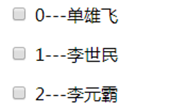
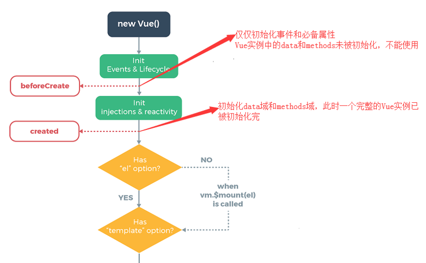
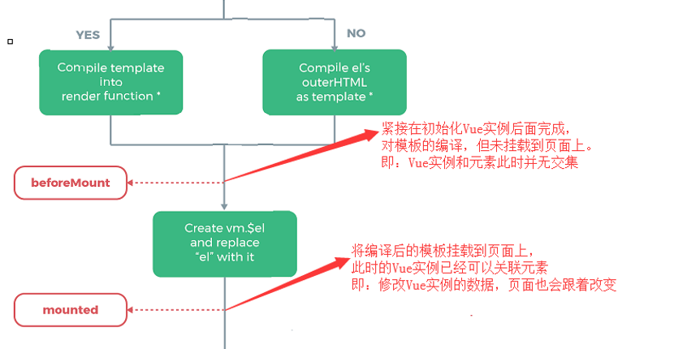
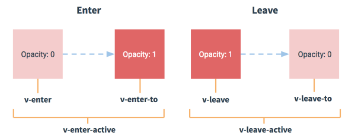
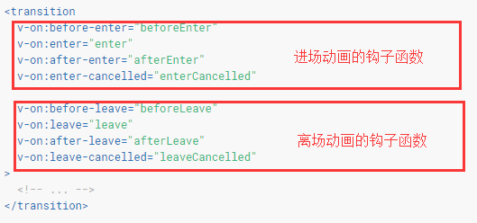
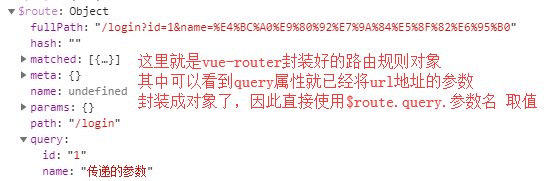
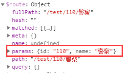
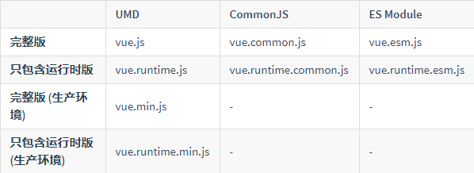

# 1.MVVM模式

后端有`MVC`模式，前端有`MVVM`模式，何为`MVVM`模式？简单地来说，M还是指数据，V即视图，VM则是数据与视图之间的调度器。


VM与Model双向绑定，既可以将数据写入Model也可以从Model读出数据，然后将数据展示到View上。起初使用jQuery，假如需要操作一个DOM的数据，需要是$()先选取，再调用适当的方法改变它的数据；而Vue抛弃这一操作，它采用MVVM模式，用一个调度器来控制视图和数据，使用者只需要关心“在哪里（where） 做什么（what），而不需要直接操作DOM，留更多精力关注业务逻辑。

# 2.初识vue

## 2.1.简介

Vue (读音 /vjuː/，类似于 view) 是一套用于构建用户界面的渐进式框架。与其它大型框架不同的是，Vue 被设计为可以自底向上逐层应用。Vue 的核心库只关注视图层，不仅易于上手，还便于与第三方库或既有项目整合。另一方面，当与现代化的工具链以及各种支持类库结合使用时，Vue 也完全能够为复杂的单页应用提供驱动

## 2.2.入门程序

当从本地引入vue.min.js后，vue就会被注册成一个全局变量。使用`new Vue()`就可以创建一个Vue实例，而这个实例就是上节所说的VM即数据和视图的调度器。在视图使用“{{...}}”(差值表达式)就可以标记一个变量名，使用“el”属性告诉Vue操作哪片区域，使用“data”属性即表示数据：

```html
<div id="app">
  <p>{{msg}}</p>
</div>
<script src="../../lib/vue.js"></script>
<script>
	new Vue({
    el:"#app",
    data:{
      msg:"vue!hello world!"
    }
  });
</script>
```

# 3.vue默认指令

## 3.1.v-cloak

在使用`{{..}}`渲染数据时，会出现渲染变量闪烁现象，比如入门程序中页面出现时，会显示{{msg}}，过了几秒后，才会渲染数据，解决这一现象，可以使用`v-cloak`指令：

1. 在“el”关联的标签上添加“v-cloak”属性

2. 在样式表加上:[v-cloak]{display:none}，[v-cloak]意思是会选择带有此属性的标签，如：

```html
<style>
  /*防止渲染数据时出现闪烁现象*/
  [v-closk] {
    display: none;
  }
</style>
<div id="app" v-cloak>
  <p>{{msg}}</p>
</div>
```

## 3.2.v-text

`v-text`指令与差值表达式`{{}}`效果是一样的，都是用来标识变量名；但是与差值表达式有两个区别：

1. `v-text`不会有变量闪烁问题，而`{{}}`会有变量闪烁问题

2. `v-text`会覆盖原有标签的所有内容，而`{{}}`是属于嵌套内容，不会覆盖

```html
<div id="app">
  <h3>使用v-text属性渲染数据</h3>
  <h2 v-text="msg">内容会被覆盖</h2>
</div>
<script>
	new Vue({
    el:"#app",
    data:{
      msg:"v-text渲染数据, 会覆盖掉原先的数据"
    }
  });
</script>
```

## 3.3.v-html

差值表达式`{{}}`和`v-text`都会将数据当成字符串渲染，如果需要将数据解析成html格式，则要使用`v-html`指令，需要注意的是，`v-html`和`v-text`一样都会覆盖掉原有标签的所有内容：

```html
<div id="app">
  <h3>使用v-html解析html标签</h3>
  <div v-html="msg">内容也会被覆盖</div>
</div>
<script>
	new Vue({
    el:"#app",
    data:{
      msg:"<h1>新功能！</h1>" //会将这个值解析成HTML, 而不是字符串
    }
  });
</script>
```

## 3.4.v-bind

`v-bind`指定可以绑定标签的属性，将它的属性值标记成一个Vue的变量名。从而让Vue能将变量的值赋给属性的值。(`v-bind`的缩写是`:`，例如：title="msg4")下面例子可以将按钮的名称通过vue的变量名指定：

```html
<div id="app">
  <h3>使用v-bind绑定标签属性，标识标签属性的值为变量名</h3>
  <input type="button" value="v-bind" v-bind:title="msg"/>
</div>
<script>
	new Vue({
    el:"#app",
    data:{
      msg:"每天进步一点点"
    }
  });
</script>
```

`v-bind`不仅可以绑定变量名，还可以拼接字符串，只要满足JS表达式。Vue会将变量值拼接上字符串一起展示到页面：

```html
<div id="app">
  <!--属性值可以拼接字符串，只要满足JS表达式-->
  <input type="text" v-bind:value="msg4+' JS表达式'"/>
</div>
<script>
	new Vue({
    el:"#app",
    data:{
      msg:"每天进步一点点"
    }
  });
</script>
```

如果嫌弃`v-bind`太麻烦，直接使用`：`便可以表示：

```html
<input type="button" value="v-bind" :title="msg">
```

## 3.5.v-on

如果说`v-bind`是绑定标签的属性，那么`v-on`就是绑定事件，比如：`v-on:click`可以绑定元素的点击事件，这时候需要用Vue实例的另一个属性：methods。（`v-on`的缩写是@，比如：`@click='cli'`）

```html
<div id="app">
  <h3>5、使用v-on绑定点击事件</h3>
  <input type="button" value="点击" v-on:click="cli"/>
</div>
<script>
	new Vue({
    el:"#app",
    data:{
    },
    methods:{
      cli: function () {
        alert("努力+奋斗");
      }
    }
  });
</script>
```

## 3.6.v-model

`v-model`可以双向绑定数据，但仅限于表单元素。何为双向绑定？在Vue实例中修改会同时表现在页面，在页面中修改可以同时改变Vue实例中的数据。使用方式：（跟`v-html`、`v-text`一样，指定data域的变量名即可）

```html
<div id="app">
  <h3>使用v-model可以实现双向绑定数据。仅限于表单元素</h3>
  <input type="text" v-model="msg" style="width: 50%"/>
</div>
<script>
	new Vue({
    el:"#app",
    data:{
      msg:"表单元素与v-model结合可以实现数据的双向绑定"
    }
  });
</script>
```

**验证方式：**

使用`var vm = new Vue()`的方式创建Vue实例，会将创建完的对象赋值给vm变量，这个变量是属于window级（就是全局变量）。在console窗口使用`window.vm`就可以查看该实例；

- 改变输入框的值，查看vm中的数据变化；
- 改变vm实例的数据，查看输入框的变化。

## 3.7.v-for

`v-for`指令可以遍历元素，它可以遍历：普通数组、对象数组、对象、数字。`v-for`的通用格式为: `v-for:"(临时变量名,索引值) in [变量名]"`，当然在遍历对象时，格式为：` v-for:"(属性值,属性名,索引值) in [变量名]"`。索引值可要可不要，其它必须存在。**被v-for修饰的元素会循环自己**

```html
<div id="app">
  <h3>7、使用v-for可以循环迭代：普通数组、对象数组、对象、数字</h3>
  <!--item表示临时变量,index表示遍历是的索引-->
  普通数组:<span v-for="(item,index) in commonArr">{{index}}--{{ item }}、</span>
  对象数组:<span v-for="(i,idx) in objArr">{{idx}}--{id:{{i.id}},name:{{i.name}}}、</span>
  对象:<span v-for="(val,key,idx) in obj">{{idx}}--{{key}}:{{val}}、</span>
  数字:<span v-for="i in 10">{{i}}、< /span>
</div>
<script>
    new Vue({
      el:"#app",
      data:{
        commonArr: ['我', '忍', '才', '能', '成', '大', '事'],//普通数组
        objArr: [{id: 1, name: 'sym'}, {id: 2, name: 'sxq'}],//对象数组
        obj: {id: 3, name: 'sxq', age: 23}
      }
    });
</script>
```

## 3.8.v-if和v-show

`v-if`和`v-show`的效果一样（原理不一样），通过语义很明显可以知道是控制元素的变化（更详细地说是控制元素的出现和消失）。`v-if`的原理是通过元素的创建和销毁，`v-show`的原理是通过元素的display样式。`v-if`和`v-show`是支持动态绑定的，值改变，元素的变化也会跟着变。

```html
<div id="app">
  	<!--v-if通过元素的创建和销毁来实现对元素的控制-->
    <p v-if="flag">这个元素是被v-if控制的</p>
    <!--v-show是通过元素的display样式实现对元素的控制-->
    <p v-show="flag">这个元素是被v-show控制的</p>
</div>
<script>
	new Vue({
    el:"#app",
    data:{
      flag: true
    }
  });
</script>
```

特别的，`v-if`还可以搭配使用`v-else-if`和`v-else`

```html
<p v-if="flag=='1'">111111111</p>
<p v-else-if="flag=='2'">22222222</p>
<p v-else="flag=='3'">3333333</p>
```

## 3.9.小结

### 3.9.1.使用this访问vue的data域

在new Vue()实例中，如果想要获取data上的数据，或者是想调用methods中的方法，必须通过this.数据变量名或this.方法名来进行访问；这里的this就表示new出来的Vue实例。

```html
<script>
	new Vue({
    el:"#app",
    data:{
      msg: "猥琐发育"
    },
    methods:{
      test(){
        console.log(this.msg);
      }
    }
  });
</script>
```

### 3.9.2.v-on事件修饰符

①**事件修饰符简介**

- `.stop`：阻止冒泡事件

- `.prevent`：阻止默认行为

- `.capture`：使用捕获模式监听事件

- `.self`：仅在元素自身触发事件

- `.once`：事件只触发一次

②**事件修饰符使用方式**

`	@click.stop `或者 `v-on:click.stop`

③**补充内容**

​	JS的的冒泡过程和捕获过程，执行顺序是相反的，可以用下图表示：

​	

- 冒泡过程：在一个对象上触发某类事件（比如单击onclick事件），如果此对象定义了此事件的处理程序，那么此事件就会调用这个处理程序，如果没有定义此事件处理程序或者事件返回true，那么这个事件会向这个对象的父级对象传播，从里到外，直至它被处理（父级对象所有同类事件都将被激活），或者它到达了对象层次的最顶层，即document对象（有些浏览器是window）。

- 捕获过程：事件将沿着DOM树向下传送，经过目标节点的每一个祖先节点，直至目标节点。例如，用户单击了一个超链接，则该单击事件将从document节点转送到html元素、body元素以及包含该链接的p元素。目标节点就是触发事件的DOM节点。

### 3.9.3.v-on事件名

v-on绑定事件的名称为原生JS事件名称去掉前面两个字符“on”。例如：

- JS原生点击事件onclick，给vue绑定为v-on:click或@click

- JS原生内容改变事件onchange，换成vue为v-on:change或@change

- JS原生获取焦点事件onfocus，换成vue为v-on:focus或@focus

...依次类推

### 3.9.4.v-on事件传参

在vue中需要为元素绑定事件，如点击事件，可以这样写：`v-on:click="cli"`，也可以这样写：`v-on:click="cli()"`加了小括号的好处是可以传参了。

### 3.9.5.vue键盘修饰符

键盘修饰符的用法跟事件修饰符类似，只不过事件修饰符可以满足所有的事件，而键盘修饰符只适用于keyup和keydown事件，一般用于文本框等表单元素。例如：当用户输入完信息后，单击回车键就可以执行登陆。实际上，在JS中，每个按键都有对应的键码，具体可见[https://www.jb51.net/article/33434.htm](https://www.jb51.net/article/33434.htm)，Vue就是通过这些键码得知用户按下了哪个键，但为了简单易记，都会使用别名，Vue内置别名有：


如果需要额外的按键修饰符，可以通过全局`config.keyCodes`对象定义，如：需要F2键：`Vue.config.keyCodes.F2 = 113`(113是F2的键码)

### 3.9.6.Vue设置css样式

可以使用v-bind指令绑定元素的class属性，然后通过：

1. 数组的方式：在[]中，加了''就表示样式的类名，不加则表示vue的变量名

   ```html
   <h1 :class="['fontColor','fontSize']">通过vue来设置绑定元素的class样式</h1>
   ```

2. 依然是数组的方式，但表达式变成了三元表达式：（注意flag是vue的变量）当变量flag为true使用类名为'fontStyle'的样式，否则不使用

   ```html
   <h1 :class="['fontColor','fontSize',flag?'fontStyle':'']">通过vue来设置绑定元素的class样式</h1>
   ```

3. 对象的方式，也就是直接绑定vue中的一个对象，如:class="obj",然后在vue中定义一个对象obj,对象保存“类名：布尔值”形式的数据

   ```html
   <h1 :class="obj">通过vue来设置绑定元素的class样式</h1>
   <script>
       var vm = new Vue({
           el: "#app",
           data: {
               flag: true,
               obj: {
                   fontSize: true,
                   fontColor: true,
                   fontStyle: true,
                   acttor: true
               }
           }
       });
   </script>
   ```

### 3.9.7.v-for迭代方法

v-for指令不仅可以迭代vue实例中的data域，还可以迭代vue实例中的methods域，只要方法有返回数据即可：

```html
<!-- v-for不仅可以迭代data里面的数据，也可以迭代methods里函数返回的数据
         下面的'search(content)'意思就是执行search方法将其返回的数据进行迭代，content的意思就是
         将data域的content传递给search()方法-->
<tr class="active" v-for="item in search(content)" :key="item.id">
  <td>{{item.id}}</td>
  <td>{{item.name}}</td>
  <td>{{item.time}}</td>
  <td>
    <button type="button" class="btn btn-primary" @click="del(item.id)">删除</button>
  </td>
</tr>
```

如果在v-for表达式中传递了参数，比如上图中的content。就会将vue实例data域中的content变量的值传给方法search()。请记住,v-for的字符串是一个表达式，可以解析的

### 3.9.8.v-for的key的注意事项

借用官方的介绍：[https://cn.vuejs.org/v2/guide/list.html#key](https://cn.vuejs.org/v2/guide/list.html#key)。当 Vue.js 用 v-for 正在更新已渲染过的元素列表时，它默认用“就地复用”策略。如果数据项的顺序被改变，Vue 将不会移动 DOM 元素来匹配数据项的顺序， 而是简单复用此处每个元素，并且确保它在特定索引下显示已被渲染过的每个元素。啥意思？举个例子：用v-for遍历数组时，如果加了复选框，如下所示：


0-表示索引，李世民-表示数组的内容，当勾选0-李世民后，如果动态改变了该数组。比如在数组开头添加了新对象：



则选中的会是单雄飞，而不是李世民，因为vue只记住索引，不会记住具体的数据项，正规的原因呢就如上面所说的。为了给 Vue 一个提示，以便它能跟踪每个节点的身份，从而重用和重新排序现有元素，你需要为每项提供一个唯一 key 属性。理想的 key 值是每项都有的且唯一的 id。但它的工作方式类似于一个属性，所以你需要用 `v-bind `来绑定动态值：

```html
<p v-for="(item,idx) in list" :key="item.id">
  <input type="checkbox">
  {{idx}}---{{item.name}}
</p>
```

### 3.9.9.devtools调试vue

谷歌浏览器插件Vue.js devtools可以帮助调试vue的开发程序。翻墙搜索直接安装即可，安装完必须勾选下面的方框


直接打开vue应用程序，点击F12进入开发者模式，单击最后面的【Vue】选项就可以进入到插件，前提：项目不能使用vue.min.js压缩文件，需要使用开发文件:vue.js


# 4.vue的过滤器

## 4.1.全局过滤器

Vue允许自定义过滤器，可以用作一些常见的文本格式化，过滤器只能用在两个地方：①差值表达式、②v-bind指令。全局过滤器是所有vue实例共享。注意：全局过滤器需要写在new Vue()实例前面。

1. 定义过滤器

   `Vue.filter(<过滤器名>,function(){...});`第一个参数是过滤器名，第二个参数是函数，函数的第一个参数被绑定成差值表达式待格式化的变量，函数需要返回格式化后的字符串。

   ```html
   <script>
     Vue.filter('filter1', function (msg) {
       // return msg.replace('曾经','<至少>');->如果是这种写法，只会替换掉第一个而已
       
       // 如果使用正则表达式（/../）替换内容写到双斜线里面，跟参数g（表示全局）
       return msg.replace(/曾经/g, '<至少>');
     });
   </script>
   ```

2. 使用过滤器

   如果使用差值表达式：`{{ msg | filter }}`，使用管道符`|`隔开变量和过滤器名字；如果使用`v-bind`指令：`v-bind:value="{{ msg | filter }}"`，同样也是使用管道符`|`

   ```html
   <p>{{msg | filter1}}</p>
   <input type="text" :value="msg | filter1"></input>
   ```

### 4.1.1.最简过滤器

最简过滤器，只需要在function中传入待格式化的变量名即可，当然这是必须要传递的值

```javascript
Vue.filter('filter1', function (msg) {
  // return msg.replace('曾经','<至少>');->如果是这种写法，只会替换掉第一个而已
  // 如果使用正则表达式（/../）替换内容写到双斜线里面，跟参数g（表示全局）
  return msg.replace(/曾经/g, '<至少>');
});
```

### 4.1.2.带参过滤器

直接在过滤器加上变量值即可

```html
<p>{{msg | filter2('<以前>')}}</p>
<script>
  Vue.filter('filter2',function (msg,opt='66') {//当opt不传参时默认是66
    return msg.replace(/曾经/g,opt);
  });
</script>
```

### 4.1.3.连用过滤器

连用过滤器就是在过滤器后面再跟上““|”，在跟上过滤器名字即可，Vue会将执行完前一个过滤器得到的值用作后一个过滤器的参数，以此类推

```html
<p>{{msg | filter3 | filter4}}</p>
```

## 4.2.私有过滤器

全局过滤器是全部的Vue实例共享的，而私有过滤器仅仅是单个Vue实例独有，它是定义在Vue实例里面，使用filters属性来定义。在filters中，以`<filter-name>:function(arg){..}`定义私有过滤器。跟之前全局过滤器语法一样，可以带参！但处理函数的首个参数肯定是待处理的变量！

```javascript
new Vue({
  el:'#exe',
  data:{
    msg:new Date()
  },
  methods:{},
  filters:{
    /**
      * 私有过滤器定义在每个Vue实例内部，用属性filters表示,语法为：<过滤器名字>:<处理函数>
      * 如果有私有过滤器和全局过滤器重名，采用就近原则，优先使用私有的过滤器
      */
    dateFormate:function (msg) {
      var date = new Date(msg);
      var y = date.getFullYear();
      // padStart是es6新出的用于填充字符串的函数
      var m = (date.getMonth()+1).toString().padStart(2,"0");
      //参数1表示填充到的临界点，2表示填充到字符串大小为2即可；参数2表示填充的内容
      var d = date.getDate().toString().padStart(2,'0');
      return `${y}-${m}-${d}`;
    }
  }
});
```

# 5.vue自定义指令

之前学习的`v-bind`、`v-on`都是Vue内置的指令，Vue也支持自定义，同样自定义指令也分为全局指令和私有指令。这里还会涉及到一个“钩子函数”的概念，现在可以理解成：绑定事件的函数，类似于回调函数，但是钩子函数在捕获消息的第一时间就会执行，而回调函数在整个捕获过程结束时，最后一个被执行

## 5.1.全局自定义指令

全局过滤器使用`filter`关键字，全局指令使用`directive`关键字，语法为：`Vue.directive('',{})`，第一个参数是指令的名称，元素使用自定义指令需要加上`v-`前缀，而在这里定义的时候不需要前缀`v-`；第二个参数是一个对象，该对象包含了5个钩子函数，对应着从元素与指令绑定到元素与指令解绑的一系列过程

### 5.1.1.钩子函数

一个指令定义的对象，就是上面所说的第二个参数，存在5个钩子函数，每个钩子函数代表着绑定过程中的一个瞬间：

- `bind`：只调用一次，指令第一次绑定到元素时调用。在这里可以进行一次性的初始化设置；
- `inserted`：被绑定元素插入父节点时调用 (仅保证父节点存在，但不一定已被插入文档中)；
- `update`：所在组件的 VNode 更新时调用，**但是可能发生在其子 VNode 更新之前**。指令的值可能发生了改变，也可能没有。但是可以通过比较更新前后的值来忽略不必要的模板更新；

- `componentUpdated`：指令所在组件的 VNode **及其子 VNode** 全部更新后调用；
- `unbind`：只调用一次，指令与元素解绑时调用。

 这里会多出来一个vnode的概念？ Vue.js将Dom抽象成一个以javascript对象为节点的虚拟Dom树，以VNode节点模拟真实Dom，可以对这颗抽象树进行创建节点、删除节点以及修改节点等操作。每个钩子都存在4个参数，第一个参数是必须的，代表与指令绑定元素的DOM：

- `el`：指令所绑定的元素，可以用来直接操作 DOM；
- `binding`：一个对象，包含以下 property：
  - `name`：指令名，不包括 `v-` 前缀。
  - `value`：指令的绑定值，例如：`v-my-directive="1 + 1"` 中，绑定值为 `2`。
  - `oldValue`：指令绑定的前一个值，仅在 `update` 和 `componentUpdated` 钩子中可用。无论值是否改变都可用。
  - `expression`：字符串形式的指令表达式。例如 `v-my-directive="1 + 1"` 中，表达式为 `"1 + 1"`。
  - `arg`：传给指令的参数，可选。例如 `v-my-directive:foo` 中，参数为 `"foo"`。
  - `modifiers`：一个包含修饰符的对象。例如：`v-my-directive.foo.bar` 中，修饰符对象为 `{ foo: true, bar: true }`。
- `vnode`：Vue 编译生成的虚拟节点。移步 [VNode API](https://cn.vuejs.org/v2/api/#VNode-接口) 来了解更多详情。
- `oldVnode`：上一个虚拟节点，仅在 `update` 和 `componentUpdated` 钩子中可用。

除了 `el` 之外，其它参数都应该是只读的，切勿进行修改。如果需要在钩子之间共享数据，建议通过元素的 [`dataset`](https://developer.mozilla.org/zh-CN/docs/Web/API/HTMLElement/dataset) 来进行。

### 5.1.2.使用方法

1. 先定义全局的指令，用`Vue.directive()`注册：inserted含义是将元素插入到父节点的时候执行，el参数是该元素的DOM对象，通过el.value将元素的值修改为666

   ```javascript
   Vue.directive('add', {
       /*以下的5个函数：bind、inserted、update、componentUpdated、unbind被称为钩子函数*/
       /*钩子函数有4个参数：el、binding、vnode、oldVnode*/
   
       bind : function (el,binding,vnode,oldVnode) {
         // 只调用一次，在指令第一次绑定到元素时调用
       },
       inserted:function (el,binding,vnode,oldVnode) {
         // 被绑定元素插入父节点时调用（仅保证父节点存在，而不一定被插入到文档中）
         el.value='666';
       },
       update : function (el,binding,vnode,oldVnode) {
         // 指令所在组件的 VNode 更新时调用
       },
       componentUpdated : function (el,binding,vnode,oldVnode) {
         // 指令所在组件的 VNode 及其子 VNode 全部更新后调用
       },
       unbind : function (el,binding,vnode,oldVnode) {
         // 只调用一次，指令与元素解绑时调用
       }
   });
   ```

2. 元素使用自定义指令，需要加上“v-”前缀：

   ```html
   <input type="text" class="form-control" v-add/>
   ```

## 5.2.私有自定义指令

私有指令的定义是在vue实例中完成，实例接收一个directives参数（与全局指令相比，少了一个s）每个自定义指令以——`'<指令名>':{<对象>}`定义。在对象里面，与上面说的5个钩子函数一样，钩子函数参数也一样

```javascript
new Vue({
    el:'#app',
    directives:{
      self:{
        inserted:function (el,binding) {
          el.focus();
          console.log(typeof binding.arg);
        }
      }
    }
});
```

# 6.Vue的生命周期

## 6.1.生命周期图示

Vue 实例从“创建→运行→销毁”这一整个过程就是Vue的生命周期。这一期间有相应的生命周期钩子函数执行，是Vue提供给用户添加自己代码的机会。官网对Vue生命周期的图示：[https://cn.vuejs.org/v2/guide/instance.html](https://cn.vuejs.org/v2/guide/instance.html)借助官网的图示，尝试来理解Vue生命周期间的事件（钩子函数）






## 6.2.使用方式

生命周期钩子函数运行在Vue实例内部，跟el、data、methods、filters、directive属性同级：

```javascript
new Vue({
    el:'',
    data:{},
    method:{},
    beforeCreate(){
        // data和methods初始化之前调用的钩子函数
    },
    mounted(){
        // 与页面挂载后执行的钩子函数
    }
});
```

# 7.vue的动画

Vue 在插入、更新或者移除 DOM 时，提供多种不同方式的应用过渡效果。包括以下工具：

1. 在 CSS 过渡和动画中自动应用 class

2. 可以配合使用第三方 CSS 动画库，如 Animate.css

3. 在过渡钩子函数中使用 JavaScript 直接操作 DOM

4. 可以配合使用第三方 JavaScript 动画库，如 Velocity.js

## 7.1.实现方式1：过渡类名

### 7.1.1.默认前缀

vue提供了一个标签：\<transition>，用它来包裹需要执行动画的元素。Vue执行动画可以分为如下4个时间点和2个时间段：



- v-enter：进场动画执行的开始状态，元素在插入之前生效，元素插入后失效

- v-enter-to：进场动画执行的结束状态，元素被插入后生效，动画完成后失效

- v-enter-active：离开动画从开始到结束的持续时间

- v-leave：离场动画执行的开始状态，元素清除之前生效

- v-leave-to：离场动画执行的结束状态，元素清除之后生效

- v-leave-active：离开动画从开始到结束的持续时间

整个过程为：

- v-enter → v-enter-active → v-enter-to → 元素插入

- v-leave → v-leave-active → v-leave-to → 元素清除

### 7.1.2.自定义前缀

当一个页面存在多个动画且这些动画需要不同的样式，这样就需要多组不同的过渡类名，默认\<transition>的过渡类名前缀为"v-"，如果为\<transition>加上name属性，如\<transition name='my'>，则它的过渡类名前缀为'my-'。

1. 先添加name属性

   ```html
   <transition name="my">
       <h3 v-show="flag2">淡进淡出...</h3>
   </transition>
   ```

2. 在定义过渡类名，过渡类名的前缀就是name属性的值

   ```css
   .my-enter,.my-leave-to{
       opacity: 0;
       transform: translateY(150px);
   }
   ```

## 7.2.实现方式2：第三方动画库

这里使用的第三方动画库是：[animate.css](https://daneden.github.io/animate.css/)使用第三方库也是需要使用Vue提供的<transition>标签，只不过不再定义过渡类名了，而是定义enter-active-class和leave-active-class指定入场动画样式和出场动画样式即可：(PS：记得先引入animate.css)

```html
<transition enter-active-class="animated bounceIn" leave-active-class="animated bounceOut">
    <h3 v-if="flag">且随疾风前行，身后亦需留名</h3>
</transition>
```

可以在`<transition>`标签上加上`:duration`来指定动画持续的时间，语法为：`:duration="{enter:200,leave:500}"`，当入场和出场动画时间一样时，直接: ` :duration="500"`

```html
<transition enter-active-class="animated hinge" leave-active-class="animated zoomOutUp" :duration="500">
    <h3 v-if="flag2">且随疾风前行，身后亦需留名</h3>
</transition>
```

## 7.3.实现方式3：钩子函数

通过在`<transition>`中绑定钩子函数，可以设置动画执行时特定时间点的样式，(我感觉过渡类名是不是就是Vue内部使用钩子函数挂钩动画样式?)正是因为钩子函数定义了动画执行过程的每个时间点的元素状态，所以每次执行的时候，都能从钩子函数定义的状态重新开始，它能实现半场动画，前面那两种方式都不能实现..何为半场动画？就是每次执行动画时，都是执行入场动画或离场动画而已，例如点击第一次，执行入场动画；点击第二次，还是执行入场动画...之前两种都是执行入场动画后，只能继续执行离场动画或是直接隐藏元素。



从语义上就可以知道：

- before-*：动画(进场/离场)执行前调用的钩子函数

- enter/leave：动画执行开始到执行结束瞬间调用的钩子函数

- after-*：动画(进场/离场)执行后调用的钩子函数

- *-cancelled：动画取消/暂停后调用的钩子函数(这条是我猜的)

### 7.3.1.实现半场动画

1. 先用`<transition>`将要执行动画的元素包裹起来，并且指定它的钩子函数：

   ```html
   <transition
               @before-enter="beforeEnter"
               @enter="enter"
               @after-enter="afterEnter">
       <div class="ball" v-show="flag"></div>
   </transition>
   ```

2. 在vue实例的methods中定义这些钩子函数，每个钩子函数的第一个参数是待执行动画的元素，它一个JS DOM对象，通过它的style属性可以改变它的样式，这也是为什么钩子函数能实现动画的原因...

   ```javascript
   let vm = new Vue({
       el:"#app",
       data:{
           flag:false
       },
       methods:{
           // @before-enter 钩子函数表示动画执行前的元素的状态
           beforeEnter(el){
               // 每个钩子函数第一个参数(上面的el)，都是待执行动画元素的 JS DOM 对象
               el.style.transform="translate(0,0)";
           },
           // @enter 钩子函数表示动画执行到结束的元素状态
           enter(el,done){
               el.offsetWidth; // 不加就没有动画效果，我不知道为什么？？？？
               // 每个钩子函数第一个参数(上面的el)，都是待执行动画元素的 JS DOM 对象
               el.style.transform="translate(150px,250px)";
               el.style.transition="all 1s ease";
               done();
           },
           // @after-enter 钩子函数表示动画执行后的元素的状态
           afterEnter(el){
               // 每个钩子函数第一个参数(上面的el)，都是待执行动画元素的 JS DOM 对象
               this.flag=!this.flag;
           }
       }
   });
   ```

## 7.4.列表动画

vue的动画怎么渲染整个列表，比如使用 v-for ？在这种场景中，不能够再使用\<transition>而是要使用\<transition-group>，注意，使用\<transition-group>执行列表动画时，一定要指明:key。列表动画很简单，改为使用\<transition-group>就行，其他用法比如过渡类名的定义跟\<transition>一样：

```html
<transition-group enter-active-class="animated bounceIn" leave-active-class="animated bounceOut">
    <li v-for="(item,idx) in list" :key="idx" @click="del(idx)">
        {{idx+1}} --- {{item}}
    </li>
</transition-group>
```

## 7.5.补充

- 在制作列表删除元素的动画，加上下面的代码可以让删除动作更加地流畅：

  ```css
  .v-move{
      transition: all 0.6s ease;
  }
  .v-leave-active{
      position: absolute;
  }
  ```

- 通过\<transition-group>的appear属性可以让列表元素在载入的时候缓慢变动，而不会一次性全部加载；tag属性可以指定\<transition-group>渲染后的标签，默认是\<span>

# 8.vue异步请求

Vue.js如果要使用ajax请求，需要一个额外的插件：vue-resource:[https://github.com/pagekit/vue-resource](https://github.com/pagekit/vue-resource)。测试的URL请求资源地址：

- get：http://vue.studyit.io/api/getlunbo

- post：http://vue.studyit.io/api/post

- jsonp：http://vue.studyit.io/api/jsonp

vue-resource提供了如下的ajax请求方法：

- get(url, [options])
- head(url, [options])
- delete(url, [options])
- jsonp(url, [options])
- post(url, [body], [options])
- put(url, [body], [options])
- patch(url, [body], [options])

每个方法都有[config]参数（额外的属性配置），各属性如下所示：

| 参数        | 类型                           | 描述                                                         |
| :---------- | :----------------------------- | :----------------------------------------------------------- |
| url         | `string`                       | 请求的目标URL                                                |
| body        | `Object`, `FormData`, `string` | 作为请求体发送的数据                                         |
| headers     | `Object`                       | 作为请求头部发送的头部对象                                   |
| params      | `Object`                       | 作为URL参数的参数对象                                        |
| method      | `string`                       | HTTP方法 (例如GET，POST，...)                                |
| timeout     | `number`                       | 请求超时（单位：毫秒） (`0`表示永不超时)                     |
| before      | `function(request)`            | 在请求发送之前修改请求的回调函数                             |
| progress    | `function(event)`              | 用于处理上传进度的回调函数 ProgressEvent                     |
| credentials | `boolean`                      | 是否需要出示用于跨站点请求的凭据                             |
| emulateHTTP | `boolean`                      | 是否需要通过设置`X-HTTP-Method-Override`头部并且以传统POST方式发送PUT，PATCH和DELETE请求。 |
| emulateJSON | `boolean`                      | 设置请求体的类型为`application/x-www-form-urlencoded`        |

回调函数对服务器返回的数据作了封装，具有如下的属性和方法：

| 属性       | 类型                       | 描述                                                |
| :--------- | :------------------------- | :-------------------------------------------------- |
| url        | `string`                   | 响应的 URL 源                                       |
| body       | `Object`, `Blob`, `string` | 响应体数据                                          |
| headers    | `Header`                   | 请求头部对象                                        |
| ok         | `boolean`                  | 当 HTTP 响应码为 200 到 299 之间的数值时该值为 true |
| status     | `number`                   | HTTP 响应码                                         |
| statusText | `string`                   | HTTP 响应状态                                       |

| **方法** | **类型** | **描述**                             |
| -------- | -------- | ------------------------------------ |
| text()   | `约定值` | 以字符串方式返回响应体               |
| json()   | `约定值` | 以格式化后的 json 对象方式返回响应体 |
| blob()   | `约定值` | 以二进制 Blob 对象方式返回响应体     |

## 8.1.get

```javascript
this.$http.get('Url', [config]).then(successCallback, errorCallback);
```

第一个参数：url必须要，指明服务器接口地址；第二个参数：是一个对象{..}，在需要的时候参照上面属性表设置即可，ajax请求后，有两个回调函数，其中成功函数是必须的：

```javascript
this.$http.get('http://vue.studyit.io/api/getlunbo').then(function (result) {
    console.log(result);
});
```

## 8.2.post

```javascript
this.$http.post('Url', [data], [config]).then(successFunc, errorFunc);
```

第一个参数：url必须要，指明服务地址

第二个参数：data必须要，表示post请求的数据，没有数据时写：{}

第三个参数：配置对象，参照上面的配置表（post请求经常需要请求头设置）

```javascript
this.$http.post('http://vue.studyit.io/api/post', {}, {emulateJSON: true}).then(function (result) {
    console.log(result);
});
```

## 8.3.jsonp

jsonp请求的语法和get亲请求的语法几乎是一样的，参照get即可。

```javascript
this.$http.jsonp('someUrl', [config]).then(successCallback, errorCallback);
```

## 8.4.小结

注意，vue-resource的回调函数中的参数result对数据做了封装，不是以前后端返回什么，直接result就可以使用。所有的属性和方法可以参照[上表](#_8.vue异步请求)。一般使用result.data即可，它是获取reponse的实体。

### 8.4.1.jsonp原理

由于浏览器的安全性限制，不允许AJAX访问“协议不同、域名不同、端口号不同”的数据接口==即跨域请求，但是可以通过动态创建script标签的形式，把script标签的src属性，指向数据接口的地址，因为sript标签不存在跨域限制，这种数据获取方式，称作JSONP（根据JSONP的实现原理，可知JSONP支持GET请求）

### 8.4.2.全局的根路径配置

vue-resource提供了设置全局参数的配置：通过在new一个vue实例之前，加上`Vue.http.options.root = '<地址>';`就可以在使用ajax请求数据时，不需要写上完整的url路径，只要相对地址即可

# 9.Vue的组件

- 模块化：基于代码逻辑的角度来划分

- 组件化：基于UI界面的角度来划分

PS：使用组件化，仍需要指定Vue实例中的el属性，告诉Vue的操作域

## 9.1.全局组件

### 9.1.1.使用extend和component

1. 先用Vue.extend({..})定义模板，template属性就是用于定义模板，该函数返回一个操作对象引用：

   ```javascript
   var comOne = Vue.extend({
       template: '<span style="color: #3c763d">这是使用Vue组件渲染出来的标题</span>'
   });
   ```

2. 再用Vue.component()渲染Dom元素，第一个参数是自定义的组件名，第二个参数是对象引用

     ```javascript
     Vue.component('myCom', comOne);//Vue.component渲染这个组件
     ```

3. 将组件名以HTML标签的格式引入即可，如果组件名使用驼峰命名法，则在驼峰处需要加上“-”并改为小写：

   ```html
   <my-com></my-com>
   ```

### 9.1.2.使用component和{}

第二种方式与第一种其实是一样的，只不过直接将extend的定义放到component来而已：

```javascript
Vue.component('two',{
    template:'<div><span style="color: #985f0d">棒棒棒！！！！！！</span></div>'
});
```

### 9.1.3.使用component和\<template>

第三种方式和第二种也差不多相似，只不过之前的组件描述都是在template写的。现在直接使用外部引用，先用\<template>定义组件的内容，然后引用即可：

```html
<template id="self">
    <div style="display: flex;justify-content: flex-start;align-items: center" >
        <div style="background-color: #2e6da4;width: 50px;height: 50px;border: 1px solid black;text-align: center;line-height: 50px">
            <span style="color: white;font-weight: 600;">6</span>
        </div>
    </div>
</template>
```

然后在component里面引用就行了：

```javascript
Vue.component('three',{
    template:'#self'//这里引用外部的标签
});
```

### 9.1.4.使用render

render是Vue实例的一个属性，与el、data、methods...平级，它是一个函数，接收一个形参，该形参是一个函数，用来将指定的组件模板渲染成HTML结构，并且覆盖掉el指定的容器。所以使用render方式渲染的组件在其Vue实例承载的容器内不能再额外添加其他元素，相当于v-text将值完全覆盖...

1. 先定义组件模板：

   ```html
   <template id="render_template">
       <div style="width: 100px;height: 100px;background-color: #4cae4c;border-radius: 50%">
       </div>
   </template>
   ```

   再创建组件对象，引用组件模板

   ```javascript
   var render_component = {
       template:"#render_template"
   };
   ```

2. 最后render渲染该组件对象即可：

   ```javascript
   new Vue({
       el:"#app_render",
       /**
         * render是Vue实例自带的一个属性，它是一个函数，自带一个形参 createElements (名字自取，
         * 与后面调用的函数名一致即可)
         * createElements 是一个方法，调用它能够将指定的组件模板渲染成html结构，并覆盖掉"el"指
         * 定的容器
         * @param createElements
         * @returns {*}
         */
       render:function(createElements){
           return createElements(render_component);
       }
   });
   ```

## 9.2.私有组件

同filters（过滤器）和directives（自定义指令）一样，组件是定义在Vue实例中，语法为：`components:{'组件名':{template:''}}`其他用法就和全局组件配置一样。

```javascript
new Vue({
    el:'#app2',
    data:{},
    methods:{},
    filters:{},//过滤器
    directives:{},//自定义指令
    components:{//组件
        //语法是：组件名:{template:''}
        own:{
            template:'#self'
        }
    },
});
```

## 9.3.组件的data和methods

组件中同样可以使用data和methods，但是：data的定义与Vue实例不同，组件中的data必须定义成一个函数，且函数必须返回一个对象

```javascript
Vue.component('four',{
    template:'#counter',
    data:function () { // data需要以方法的形式定义，而且方法内部需要返回一个对象
        return {count:0}
    },
    methods:{ // 方法的使用与Vue实例没有什么区别
        increment:function () {
            this.count++; // 这里可以直接使用data中返回的对象中的属性
        }
    }
});
```

在template标签中，使用这个data也很简单，直接用差值表达式即可：

```html
<template id="counter">
    <div>
        <input type="button" value="+1" @click="increment">
        <h3>{{count}}</h3><!--组件中使用data也是跟Vue实例一样的，直接使用差值表达式就可以-->
    </div>
</template>
```

不同于data，methods的定义就跟Vue实例一模一样了，这里可以直接使用data中函数返回对象内属性

```javascript
methods:{ // 方法的使用与Vue实例没有什么区别
    increment:function () {
        this.count++; // 这里可以直接使用data中返回的对象中的属性
    }
}
```

## 9.4.组件切换

组件切换是啥意思？比如在一个登陆页面，如果用户没有账户，则需要切换到注册块，如果如果已有账户，则切换到登录块，这样切来切去就是使用Vue的组件切换来实现。

  ①第一种方式就是使用`v-if`或`v-show`，这种简单。

  ②第二种方式使用Vue提供的\<component>标签

```html
<component :is="tag"></component>
```

\<component>是Vue提供的用于展示组件的标签，里面的is属性绑定后，可以对应到组件的名字，注意：如果加了''则是标签组件名（代表字符串），像上图的tag代表的是变量名，是需要在data中定义的：

```javascript
new Vue({
    el:'#app3',
    data:{
        tag:'login'
    },
    components:{
        login:{
            template:'<h2>我是登录组件</h2>'
        },
        register:{
            template:'<h2>我是注册的...</h2>'
        }
    }
});
```

tag的值就是组件的名称，通过改变tag的值，就可以达到切换组件的目的。这里还需要强调一下。在Vue指令中，如果不加''都是表示变量名，加了''才可以表示字符串（也就是直接的值）

```html
<a href="" @click.prevent="tag='login'" style="margin-right: 50px;"></a>
<a href="" @click.prevent="tag='register'">注册页</a>
```

## 9.5.父组件与子组件交互

在js中，子对象是不能访问父对象的属性和方法的。所以在Vue中也是这样，子组件是不能直接访问父组件的data域和methods域。

### 9.5.1.父组件传值给子组件

子组件可以用自定义一个属性与父组件的变量绑定，通过该属性结合差值表达式就可以取到父组件的变量值。理论上，该变量值只能读不可写！

1. own是子组件名称。它自定义了一个myprop属性，绑定父组件的msg变量，这里的父组件指的是就是Vue实例。

   ```html
    <!-- 在子组件中自定义一个属性（:myprop）并绑定到vue实例中，指定vue实例的变量，这里的vue实例就是父组件 -->
   <own :myprop="msg"></own>
   ```

2. 子组件在定义template模板，直接使用该属性就行

   ```html
   <template id="child">
       <!-- 定义子组件模板时，直接使用该属性即可 -->
       <h3>--666,666---{{myprop}}</h3>
   </template>
   ```

3. 在定义子组件时，需要在子组件中加入props属性，在props中指定子组件，用于接收父级变量的自定义属性。

   ```java
   own:{
       template:'#child',
       /**
         *  props是组件components的一个属性，用来存放保存父组件传递而来的属性名
         *  它跟data域很相似，但是data域的值可读可写，而props域的值只读（实际上可写，但是不提
         * 倡,vue也会发出警告！）
         */
       props:['myprop'],
   
   }
   ```

### 9.5.2.子组件调用父组件函数

1. 子组件同样不能直接调用父组件中的方法，如果要调用的话，得现在组件标签上使用v-on绑定父组件的提供的函数的名称：

   ```html
   <!-- 在子组件中用v-on（下面是简写）绑定一个自定义的变量名（func），然后指定指定父组件的方法名(show) -->
   <own :myprop="msg" @func="show"></own>
   ```

2. 在子组件中自定义一个函数，借助它来调用父组件的方法：

   ```html
   <!-- 定义子组件自己的函数（myClick），使用它来调用父组件的函数 -->
   <input type="button" value="调用父组件提供的函数" @click="myClick">
   ```

3. 在定义子组件对象的methods中，添加myClick方法，并使用`vm.$emit( event, arg ) `来调用父组件提供的函数。如果父组件函数有参数的话，直接写在this.$emit('func',arg1,arg2)就行

   ```javascript
   methods:{
       myClick(){
           /**
            *  子组件可以使用 $emit 触发父组件的自定义事件，第一个参数为组件标签上@绑定的变量名
            *  如果有参数，直接写第一个参数后面，用逗号隔开
            */
           this.$emit('func');
       }
   }
   ```

## 9.6.小结

- 如果组件创建是全局的，需要将组件写在new Vue()代码前面，否则会抛出异常：

- template创建的组件需要包裹在一个元素里面，即至少需要有一个根元素，想下面这样：（2个独立的根元素）

  ```javascript
  var comOne = Vue.extend({
      template: '<h3">这是使用Vue组件渲染出来的标题</h3>'
  });
  ```

  会抛出异常，将他们包裹在一个div中就不会出现问题了。

- 为什么组件中的data需要定义成一个函数，而不是一个对象？组件是将相同的部分提取出来，换句话说就是很多地方可能会用到该组件。如果将data定义成对象，则每个组件的数据不就共享了吗？所以需要定义成函数，让单独使用该组件的元素具有自己的数据。

- 使用ref可以获取到DOM元素（同样也可以获取组件），直接在元素上添加ref属性就行。Vue会把它注册到它的refs属性中，我们使用$refs就可以取到值。

  ```html
   <p ref="getP">我是P元素</p>
  ```

  ```javascript
  this.$refs.getP.innerHTML)
  ```

# 10.Vue的路由

## 10.1.前端路由和后端路由

- 后端路由：对于普通网站，所有的超链接都是URL地址，每一个URL地址都对应服务器上的一个资源；

- 前端路由：对于单页面应用程序来说，主要通过URL中的hash(#号)来实现不同页面之间的切换，同时，hash有一个特点，：HTTP请求中不会包含hash相关的内容，所以页面跳转主要用hash实现

## 10.2.安装vue-router

1. 直接下载[https://unpkg.com/vue-router@3.0.1/dist/vue-router.js](https://unpkg.com/vue-router@3.0.1/dist/vue-router.js)。然后在\<script>引入即可，注意：这种方式不需要无需安装vue-router

2. 如果以模块化开发使用import关键字引入VueRouter。注意：必须要通过 Vue.use() 明确地安装路由功能：

   ```javascript
   import Vue from 'vue'
   import VueRouter from 'vue-router'
   
   Vue.use(VueRouter);
   ```

## 10.3.vue-router的基本使用

这里使用\<script>引入的方式，省去了声明vue-router的步骤。前提先说下：

- vue-router会监听页面的url地址

- vue-router用于展示组件component

1. 使用VueRouter()方法new一个VueRouter对象。该对象接收一个对象参数，对象参数内有一个routes属性，它是一个数组，用于定义路由规则，每个路由规则都是一个对象。路由规则对象有两个属性：path和component。path指定要监听url的hash值(前端路由), component指定展示组件

   ```javascript
   var routeObj = new VueRouter({
       // 该构造函数接收一个对象，对象中存在routes属性(数组)，用来设置路由规则
       routes:[
           // 每一个路由规则由一个对象控制，对象中有path属性和component属性
           // path属性：当监听到url地址的hash值（即#后面的值）为指定内容时，调用component指定的组件名
           // component属性：关联一个组件，注意这里必须关联一个对象，而不是组件的组件名
           {path:"/login",component:loginObj},
           {path:"/register",component:registerObj},
           // 路由重定向，使用redirect属性
           {path:"/",redirect:'/login'}
       ]
   });
   ```

2. 创建组件对象，因为component属性只支持组件对象，不支持组件名称

   ```javascript
   var loginObj = {
       template:'<h3>我是登录组件 </h3>'
   };
   ```

3. 将VueRouter对象和Vue实例关联在一起：使用Vue实例中的router属性即可。

   ```javascript
   new Vue({
       el:'#app',
       router:routeObj
   });
   ```

4. 页面中使用Vue官方提供的\<router-view>来承载组件，不然页面不会展示

   ```html
   <!-- 这个是vue提供的，用于承载 VueRouter 将要展现的组件 -->
   <router-view></router-view>
   ```

## 10.4.路由传参

vue-route监听浏览器的url地址，来选择匹配的组件展示，当url地址有传递参数时，该怎么讲参数放到页面来展示？

### 10.4.1.$route.query方式

组件也有生命周期函数，定义组件时使用created()查看组件封装的内容 ：

```javascript
let objOne={
    template:'<h1>组件111111 -- {{$route.query.id}}</h1>',
    created(){
        // 组件的生命周期函数
        console.log(this)
    }
};
```

打印出来的信息如下：



在切换路由时，给url地址传递参数：

```html
<router-link to="/login?id=1&name=传递的参数" tag="button">$route.query方式取值</router-link>
<router-link to="/test/110/警察" tag="button">$route.param方式取值</router-link>
```

此时的路由规则为：

```javascript
{path:'/login',component:objOne}
```

然后在定义组件的对象中直接用差值表达式就可以获取到参数值：

```javascript
let objOne={
    template:'<h1>组件111111 -- {{$route.query.id}}</h1>'
};
```

### 10.4.2.$route.param方式

`$route.param`方式与`$route.query`方式很相似，只不过路由规则不同而已，使用`$route.param`的路由规则需要定义成：（类似restful风格的uri）

```javascript
/**
  * $route.param方式的路由规则需要使用":"作占位符，后面跟上参数名，有点类似rest风格
  */
{path:'/test/:id/:name',component:objTwo}
```

通过查看组件的内部结构，可以看到，这种方式的参数会放到param中而不是放到query中



所以在是使用的时候，直接用`{{$route.params.id}}`就行了。

## 10.5.路由嵌套（子路由）

路由嵌套，意思就是在父路由的基础上添加了子路由的区分，比如：在用户管理界面上，可以分成用户登录和用户注册页面。在vue-route中。嵌套路由的配置是路由规则中添加 children 属性来配置的：

```javascript
var rt = new VueRouter({
    routes:[
        {
            path:'/userManager',
            component:component1,
            children:[
                /**
                  * 嵌套路由的path的url地址不能加"/"，否则直接映射跟路由去了
                  */
                {path:'login',component:component2},
                {path:'register',component:component3},
            ]
        }
    ]
});
```

注意，子路由的路由规则不加“/”，不然会以根路径去匹配。这样，当点击用户管理时，浏览器url地址会跳转到/userManager，就会匹配到父路由的组件，当点击登录 或 注册 时，就会跳转到/userManager/login或/userManager/register中，就会匹配到子路由中

```html
<div id="app">
    <router-link to="/userManager">用户管理</router-link>
    <router-view></router-view>
</div>
<template id="my">
    <div>
        <h1>用户管理界面</h1>
        <router-link to="/userManager/login">登录</router-link>
        <router-link to="/userManager/register">注册</router-link>
        <router-view></router-view>
    </div>
</template>
```

配置子路由时，url地址不写全，也不加“/”。但在用\<route-link>映射路由时，url地址需要写全

## 10.6.路由视图命名

当一个路由需要映射多个组件时，可以使用 components 属性来定义：

```javascript
let router = new VueRouter({
    routes:[
        /**
                 * 如果一个路由先显示多个组件，要使用参数 components
                 * ( 复习下，如果使用嵌套路由，要使用参数 children )
                 */
        {path:'/',components:{
            head:header,
            left:lefter,
            right:righter
        }}
    ]
});
```

然后在\<router-view>标签上，用name属性指定路由视图名：

```html
<router-view name="head"></router-view>
<router-view name="left"></router-view>
<router-view name="right"></router-view>
```

name='head'就对应components对象上的head属性，而head属性值为header组件，所以这个\<router-view>就容纳header组件

## 10.7.小结

### 10.7.1.\<router-link>使用

vue官方提供了\<router-link>标签支持用户在具有路由功能的应用中 (点击) 导航，它的to属性指定目标地址，tag属性执行渲染成的标签（默认是a标签）

```html
<router-link to="/login">登录</router-link>
```

### 10.7.2.前端理由重定向

当应用跳转到根路径时，可能需要重定向到首页或者是其他页，这时候就需要路由重定向，可以在定义路由规则的对象中使用redirect属性来指定重定向的路由：

```java
{path:"/login",component:loginObj},
{path:"/register",component:registerObj},
// 路由重定向，使用redirect属性
{path:"/",redirect:'/login'}
```

# 11.Vue的监听

## 11.1.watch侦听器

使用watch，不仅可以监听属性的变化，还可以监听路由的变化。watch是与el、data、methods同级的，它也是一个对象，对象里面放着定义好的属性名和相应的处理函数(这里强调定义好的是因为computed计算属性里面放着的是不曾定义过的属性)

- 例如使用watch监听data域中的变量，先在data域中把变量定义：

- 然后在watch中，直接使用该变量名做属性，后面跟上相应的处理函数：

  ---- 当监听的变量值发生改变时，会自动调用处理函数----

```javascript
let vm = new Vue({
    el:'#app',
    data:{
        firstName:'',
        lastName:'',
        fullName:'',
        firstVal:'',
        endVal:'',
    },
    router:route,
    watch:{
        /**
          * 监听data中的变量，以变量名作为watch的属性名
          */
        firstName:function (newVal,oldVal) {
            console.log(newVal+"\t"+oldVal);
            this.fullName = this.firstName + this.lastName;
        },
        lastName:function () {
            this.fullName = this.firstName + this.lastName;
        },
```

watch属性还可以监听路由的变化：

```javascript
'$route.path':function (newVal,oldVal) {
    console.log("新路由="+newVal+"\t"+"旧路由="+oldVal);
}
```

## 11.2.computed计算属性

计算属性也是与watch平级的，也是一个对象。更多的是把计算属性当做一个变量来使用，computed对象内的属性直接就可以使用，不需要再data域中先定义，且计算属性会存在缓存，仅当与其关联的变量值改变了，才会重新计算：

```javascript
computed:{
    result:function () {
        if( this.firstVal =='' || this.endVal=='' ){
            return '';
        }
        /**
          * 使用computed定义的计算属性，可以不用定义在data域中，完全可以把它当做一个属性来使用
          * computed内的属性会做缓存，仅当与其关联的值发生变化时，它才会重新计算
          */
        return parseInt(this.firstVal)+parseInt(this.endVal);
    }
}
```

## 11.3.watch、computed和method的区别

computed：属性的结果会被缓存，仅当依赖的响应式属性变化时才会重新计算，主要当做属性来使用；

methods：方法表示一个具体的操作，主要实现业务逻辑；

watch：一个对象，键是需要观察的表达式，值是对应回调函数，主要用来监听某些特定数据的变化从而进行某些具体的业务逻辑操作，可以看做是computed和methods的结合体。

# 12.Vue的wenpack开发

## 12.1.ES6和NodeJs导入导出

### 12.1.1.ES6语法

#### 12.1.1.1.引入模块

**语法：**

`import <变量> from <模块名>/<模块地址>`

引入export default全局导出的模块，可以用任意变量接收

引入export导出的模块，需用{变量1，变量2,...}接收 ( 称为"按需导入" )

**例如：**

```javascript
import Vue from 'vue'
import sym,{p1,p2} from '../src/js/exportByES6'
```

#### 12.1.1.2.导出对象

**语法：** 

`export default{} 或 export var <变量名> = {}`

  export default -- 全局导出对象，可以用任意变量名接收

  export -- 暴露普通对象，称为"按需导出"，变量名不能改

**例子：**

①一个文件只允许使用export default 一次：

```javascript
export default{
    name:"text",
    now:123
}
```

②一个文件允许使用export 多次

```javascript
export var p1 = {id:110}
export var p2 = {id:120}
```

### 12.1.2.Node语法

#### 12.1.2.1.引入模块

**语法：**`var <变量> = require( <模块名> );`

**例子：**

```java
var sxq = require('../src/js/exportByNode');
```

#### 12.1.2.2.导出对象

node中推荐全部使用module.exports导出对象，如果导出对象的变量名重复了，后写的会覆盖掉先写的变量名。

**语法：**`module.exports={}`

**例子：**

```javascript
module.exports = {
    name:'111',
    sex:222
}
```

## 12.2.搭建Vue环境

在普通页面中，若想使用vue，直接用\<script>引入即可；若想在webpack中使用vue，就要把它安装到本地项目中，所以执行命令：`npm i vue -D`。安装后在入口文件(例如main.js)中导入vue模块；但是，如果只有这些步骤，vue是运行不起来的...为了解决这一问题，先考虑下webpack下依赖包的查找过程：

1、在项目根目录中有没有 node_modules 的文件夹

2、在 node_modules 中根据包名，查找对应的文件夹(这里找的是vue)

3、在 vue 文件夹中，查找package.json的包配置文件

4、在package.json中，查找main属性--该属性指定该包被加载的入口文件

默认vue的 main属性是：`"main":"vue.runtime.common.js"`。这个vue.runtime.conmon.js属于运行时的JS，比vue.js少了编译器，详细信息请看Vue各版本介绍。如果想和通过\<script>引入vue.js这种方式开发，只要让webpack引入vue.js就OK了，可以用以下两种方式：

### 12.2.1.改变导入路径

直接指定node_moduels文件夹下面的vue.js来导入

```javascript
import Vue from '../node_modules/vue/dist/vue.js'
```

### 12.2.2.配置webpack.config.js

直接指定vue导入方式太low了，可以通过在webpack.config.js中配置resolve属性的alias，改变vue导入的路径，就像这样：

```javascript
resolver:{
    alias:{
        "vue$":"vue/dist/vue.js"
    }
}
```

这样子，即使入口文件(例子是main.js)写着：import Vue from 'vue'，webpack也会将vue.js导入到项目中，完成搭建vue开发环境

### 12.2.3.Vue各版本介绍

在 npm 包的 dist/ 目录会找到很多不同的 Vue.js 构建版本，如图所示：


为了知道它们之间的区别，先了解两种打包规范：common 和 esm 分别是2种模块化规范CommonJS和EcmaScript Module的缩写。CommonJS 版本用来配合老的打包工具比如 Browserify 或 webpack 1，ES module 版本用来配合现代打包工具比如 webpack 2 或 Rollup。Vue官网给出各版本的区别：



Vue官网给出的术语：

- 完整版：同时包含编译器和运行时的版本
- 编译器：用来将模板字符串编译成为JavaScript渲染函数的代码
- 运行时：用来创建Vue实例、渲染并处理虚拟DOM等的代码。基本上就是除去编译器的其它一切
- UMD：UMD版本可以通过\<script>标签直接用在浏览器中。jsDelivr CDN的默认文件就是运行时+编译器的UMD版本（vue.js）

所以呢？没有带 runtime 字样的Vue都是完整的JS文件，带有 runtime 字样的是少了编译器的JS文件，在客户端编译模板 (比如传入一个字符串给 template 选项，或挂载到一个元素上并以其 DOM 内部的 HTML 作为模板)，就将需要加上编译器：

```javascript
new Vue({
    template:'<div>{{h1}}</div>'
})

new Vue({
    render(h){
        return h('div', this.hi)
    }
})
```

当使用 vue-loader 或 vueify 的时候，*.vue 文件内部的模板会在构建时预编译成 JavaScript。在最终打好的包里实际上是不需要编译器的，所以只用运行时版本即可，运行时版本相比完整版体积要小大约 30%，官网推荐尽可能使用这个版本。

## 12.3.*.vue方式的组件开发

一个.vue文件就是一个组件`**.vue`，它包含了3个方面：

①\<template> -- 定义组件模板，跟之前用引入Vue.js开发一样

②\<script> -- 定义组件的脚本，跟普通的<script>一样，都是js

③\<style> -- 定义组件的样式，可以指定样式语言和作用域，转[11.3.4](#_设置.vue文件的样式)

**使用vue组件开发流程：**

通常我们会定义一个根组件，根组件放到项目的首页中。然后我们开发其它组件，通过在根组件中使用vue-route切换展示不同的组件；一个组件又可以包含其它组件，同样，它们也可以使用vue-route来点击跳转，展示不同的组件...**总之：**一个功能就是一个vue组件，切换功能就是使用[路由](#_Vue的路由)切换组件

### 12.3.1.加载vue-loader

webpack默认不能解析.vue文件，需要先下载配置vue-loader，执行命令：`cnpm i vue-loader vue-template-compiler -D`，在webpack.config.js文件中配置该loader

```javascript
{test:/\.vue$/, use:"vue-loader"}
```

新版本除了要配置vue-loader之外，还需要配置VueLoaderPlugin插件，否则会报错。解决方法是在webpack.config.js中添加：

```javascript
const {VueLoaderPlugin} = require('vue-loader');
plugins:{
    new VueLoaderPlugin()
}
```

### 12.3.2.创建.vue文件

```html
<template>
    <h1>用 .vue文件渲染的组件</h1>
</template>
```

### 12.3.3.引入.vue文件

如果webpack导入的是`vue-*-runtime.js`文件，必须只能使用render去渲染组件，可以用箭头函数简写成，如果导入的是完整的vue.js文件，就可以用之前的component方式定义组件

```javascript
import Vue from 'vue'
import helloworld from '../src/component/helloWorld.vue'

new Vue({
    el:"#app",
    data:{
        msg:"用webpack搭建vue开发环境"
    },
    /* 渲染外部组件完整写法： */
    /*render:function (createElements) {
        return createElements(helloWorld);
    }*/
    /* 渲染外部组件超简写法： */
     render:c => c(main),
     /* 在vue实例中注册该路由组件 */
     router
});
```

### 12.3.4.设置.vue文件的样式

默认\<style>的样式语言是css，如果想更换样式语言，例如scss，通过lang属性指定：

```css
<style lang="scss">
```

默认\<style>的样式作用域是全局的，如果仅仅想作用域当前组件(及其子组件)，通过加上scoped属性，(底层是利用css的属性选择器实现的)

```css
<style lang="css" scoped>
```

## 12.4.Vue-router的开发

vue-router，在第九节有用过，这里是使用webpack来开发vue-router

### 12.4.1.加载vue-router包

在项目中下载vue-router，执行命令: `cnpm i vue-router -S`，在入口文件中，引入`vue-router：import vueRouter from 'vue-router'`(注意：引入vue-router还是需要先引入vue的)

```javascript
import vueRouter from 'vue-router'
```

### 12.4.2.配置vue-router对象

1. 当在页面通过<script>标签引入vue-router.js时，它会自动注册到vue中，但是在webpack中，它需要手动注册：`Vue.use(vueRouter)`，这点很重要，忘记写，vue-router不起作用

2. 创建vueRouter对象(该对象名根据接收import导入的变量名)，配置路由规则（这点和用\<script>引入vue-router的方式一样）

   ```javascript
   var router = new vueRouter({
       routes:[
           {path:'/user',component:user},
           {path:'/role',component:role}
       ]
   })
   ```

3. 将router对象与vue实例绑定：`router:router`

### 12.4.3.配置路由组件

webpack推荐使用.vue的方式开发组件，所以将路由组件也写成.vue文件，然后在入口文件(main.js)中引入它们：

```javascript
import user from './component/usr/user.vue'
import role from './component/role/role.vue'
```

之前学过，如果在webpack环境中使用vue的组件，要使用render函数，而这个render函数会将组件编译成HTML结构后完全覆盖掉el指定的容器，所以得有一个主体组件(最外层组件)，用它来包容其他组件。所以对于路由组件的配置就要写在这个主体组件上，然后vue实例渲染这个主体组件即可：

```html
<template>
    <div>
        <h1>首页</h1>
        <mt-button type="primary">primary</mt-button>
        <router-link to="/user">用户管理</router-link>
        <router-link to="/role">角色管理</router-link>
        <!-- 用来 展示组件 的载体 -->
        <router-view></router-view>
    </div>
</template>
```

### 12.4.4嵌套路由开发(子路由)

如果熟悉webpack环境下如何配置vue-router，嵌套路由就很简单了

1. 先定义子路由组件，再将它们引入

   ```javascript
   import login from '../component/user/login.vue' // 引入二级 登录 分组件
   import register from '../component/user/register.vue' // 引入二级 注册 分组件
   ```

2. 配置vueRouter对象，为需要增加嵌套路由的对象增加children属性：

   ```javascript
   {path:'/user',component:user,
       /* 配置 user 组件的子组件 login 和 register */
       children:[
           {path:"register",component:register},
           {path:'login',component:login}
       ]
   }
   ```

3. 将嵌套路由的链接(router-link)和载体(router-view)放到父路由组件上，注意：此时父路由组件是放在最外层的组件上

   ```html
   <template>
       <div>
           <h1>用户管理</h1>
           <router-link to="/user/register">注册</router-link>
           <router-link to="/user/login">登录</router-link>
           <router-view></router-view>
       </div>
   </template>
   ```

### 12.4.5.抽离路由模块

路由模块引入的配置的东西会很多，如果全部放在入口文件(main.js)中配置，会让main.js显得很臃肿，可以将路由模块的内容单独抽离成一个js文件，再通过ES6语法，暴露出路由对象让main.js引入即可：

1. 将关于路由模块的内容单独配置成一个js文件：

   ```javascript
   import vueRouter from 'vue-router' // 引入vue-router组件
   import user from '../component/user/user.vue' //引入一级 用户 分组件
   import role from '../component/role/role.vue' //引入一级 用户 分组件
   import login from '../component/user/login.vue' // 引入二级 登录 分组件
   import register from '../component/user/register.vue' // 引入二级 注册 分组件
   /* 定义路由组件对象 */
   var router = new vueRouter({
       routes:[
           {path:'/user',component:user,
            /* 配置 user 组件的子组件 login 和 register */
            children:[
                {path:"register",component:register},
                {path:'login',component:login}
            ]
           },
           {path:'/role',component:role}
       ]
   });
   /* 在暴露出该路由对象，供入口文件调用 */
   export default router;
   ```

2. 在入口文件(main.js)中将vue-router注册到vue中，再接收路由模块暴露出来的路由对象：

   ```javascript
   import Vue from 'vue' //引入vue
   import vueRouter from 'vue-router' // 引入vue-router组件
   import main from './component/main.vue' // 引入首页组件,该组件承载其他组件
   import router from './route/route.js' // 引入以及配置好的路由对象
   import MintUI from 'mint-ui' // 引入MintUI组件
   import 'mint-ui/lib/style.css' // 它的的css需要单独引入
   Vue.use(vueRouter);// 手动在Vue中注册vue-router，不可缺少的一步
   Vue.use(MintUI);// 将 MintUI 注册到 Vue 中
   new Vue({
       el:"#app",
       data:{
           msg:"用webpack搭建vue开发环境"
       },
       /* 渲染外部组件完整写法： */
       /*render:function (createElements) {
           return createElements(helloWorld);
       }*/
       /* 渲染外部组件超简写法： */
       render:c => c(main),
       /* 在vue实例中注册该路由组件 */
       router
   });
   ```

# 13.ES6新模块Promise

判断浏览器是否支持Promise，打开F12调试窗口，输入`console.dir(Promise)`，如果能看到返回信息，则说明支持。高版本的Chome和FireFox都已支持，IE11不支持

## 13.1.回调地狱

Promise是ES6规范推出的用于解决"回调地狱"的方案，什么是回调地狱？JS是单线程，当需要执行高耗能的操作，如果采用同步执行，则剩下的JS代码都不能执行了，必须等待这个高耗能操作执行完，所以有了异步执行。有了异步执行，怎么将返回执行结果，这时候就需要回调函数(callback)。当一个回调函数执行需要另一个回调函数的执行，而另一个回调函数又需要再一个回调函数...当这种关系达到多个时，就会出现多个回调函数嵌套的现象，这就成为"。回调地狱"，例如下面这种情形：

```javascript
// fs模块是Node.js提供用来读取文件的模块
const fs = require('fs');
function app(){
    fs.readFile('./txt/1.txt','utf-8',function(err,data){
        // do something
        fs.readFile('./txt/2.txt','utf-8',function(err,data){
            // do something
            fs.readFile('./txt/3.txt','utf-8',function(err,data){
                // do something
                fs.readFile('./txt/4.txt','utf-8',function(err,data){
                    // 回调函数的多重嵌套，外层函数需要里层回调函数的响应
                });
            });
        });
    });
}
```

## 13.2.Promise介绍

Promise是一个构造函数，可以通过 new Promise() 获取一个Promise的实例。在Promise中，有两个函数：resolve(成功后的回调函数)和reject(失败后的回调函数)，通过调用new获得的Promise实例中的then()函数，预先为Promise这个异步操作指定成功和失败的回调函数，其中成功回调函数必须存在，失败回调函数可写可不写。

**Promise规范如下：**

- promise仅有三种状态：等待、完成、拒绝。promise的状态只能从“等待”转到“完成”或者“拒绝”态，不能逆向转换，同时“完成”和“拒绝”不能相互转换

- promise必须实现then方法（可以说，then就是promise的核心），而且then必须返回一个promise，同一个promise的then可以调用多次，并且回调的执行顺序跟它们被定义时的顺序一致

- then方法接受两个参数，第一个参数是成功时的回调，在promise由“等待”转换到“完成”时调用，另一个是失败时的回调，在promise由“等待”转换到“拒绝”时调用。同时，then可以接受另一个promise传入，也接受一 个“类then”的对象或方法，即thenable对象

## 13.3.Promise使用

### 13.3.1.简单使用

注意：实例化一个Promise时，它就会立即执行它里面的异步操作代码，当然了，这个异步操作代码是由我们来定义的，所以实例化Promise时需要传递一个函数，例如：

```javascript
const fs = require('fs');

var promise = new Promise(function () {
    fs.readFile('./txt/1.txt','utf-8',(err,suc)=>{
        if(err) console.log(err.message);
        else console.log(suc);
    })
});
```

代码会立即执行，异步读取1.txt文件，如果成功返回读取到的信息，失败则打印错误信息。**Tip:**

因为Promise的特性：一创建就执行，实际需求中可能需要我们控制它的执行，则可以把new Promise()的代码放到一个函数中，在需要执行Promise的时候，调用此函数。

### 13.3.2.成功回调与失败回调

若想让Promise在异步执行后，根据结果执行回调函数，则在创建Promise实例传入的函数参数中，就需要显式定义回调函数形参，将异步执行结果通过回调函数返回给调用者：

```java
function readFileByPromise(path){
    var p = new Promise(function (resolve,reject) {
        fs.readFile(path,'utf-8',(err,data)=>{
            if(err) return reject(err);
            else return resolve(data);
        });
    });
    return p;// 返回Promise实例，这样调用者才获取Promise，进而定义回调函数
}
```

而之前介绍过，定义Promise的回调函数需要用到then函数，所以必须获取到创建的Promise实例，因此就需要在包含创建Promise实例的函数中，将创建好的Promise实例返回。这样通过调用该函数，得到一个Promise实例，就可以使用then()定义成功回调和失败回调：

```javascript
var p = readFileByPromise('./txt/1.txt');
p.then(function (data) {
    console.log(data);
    return readFileByPromise('./txt/2.txt');
})// 这边省略错误回调，通过错误回调，就可以知道哪个环节出了查错
    .then(function (data) {
    console.log(data);
    return readFileByPromise('./txt/3.txt');
});
```

### 13.3.3.解决回调地狱

回调地狱的问题是由于多重嵌套，一方面阅读性差，一方面难以捕捉异常，而Promise将其改为链式调用，大体上如同下面的示例：

```javascript
var p = new readFileByPromise('');
p.then().then().then();
```

- 第一个then()方法先执行，然后它return一个新的Promise对象

- 第二个then()方法接收第一个then()的返回对象，换它来执行，然后它也return一个新的Promise对象

- 第三个then()方法接收第二个then()的返回对象，换它来执行...以此类推

 因此，使用Promise解决回调地狱，可以如下操作：

```javascript
// 回调函数的嵌套，通过.then()的方式
var p = readFileByPromise('./txt/1.txt');
p.then(function (data) {
    console.log(data);
    return readFileByPromise('./txt/2.txt');
})// 这边省略错误回调，通过错误回调，就可以知道哪个环节出了查错
    .then(function (data) {
    console.log(data);
    return readFileByPromise('./txt/3.txt');
})
    .then(function (data) {
    console.log(data);
});
```

### 13.3.4.捕获异常

使用Promise执行异步操作，如果出现异常，有两种捕获方式，对应两种需求：

①出现异常，但不要影响后续Promise的执行

②出现异常，立刻中止Promise的执行，不在执行后续的代码

若想捕获异常继续执行后续的Promise代码，则需要在then()中同时定义Promise执行成功的回调函数和Promise执行失败的回调函数，并在这两个函数中一起返回下一个Promise，例如：

```javascript
var p = readByPromise('./txt/1.txt');
p.then(function (data) {
    console.log('读取成功：' + data);
    return readByPromise('./txt/2.txt');
}, function (error) {
    console.log('读取失败：' + error.message);
    return readByPromise('./txt/2.txt');
})
```

若想捕获异常后，不再执行后续的Promise代码，则需要在then()函数中只定义Promise执行成功的回调函数，并在最后使用catch()捕获错误，例如：

```javascript
var m = readByPromise('./txt/1.txt');
m.then(function (data) {
    console.log('读取成功：' + data);
    return readByPromise('./txt/22.txt');
}).then(function (data) {
    console.log('读取成功：' + data);
    return readByPromise('./txt/3.txt');
}).then(function (data) {
    console.log('读取成功：' + data);
}).catch(function (err) {
    console.log('执行失败：'+err.message);
});
```

## 13.4.jQuery与Promise

jQuery的ajax其实也支持Promise，常规用法：`$.ajax({})`，将配置对象传给`$.ajax()`方法，对象内定义url、type、dataType、success等属性，其实那个success可以不用写，`$.ajax()`函数返回的是一个Promise对象，直接`$.ajax().then()`就可以获取执行结果。`$.ajax()`其实就是一个Promise。