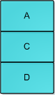
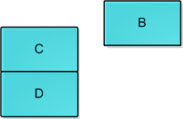
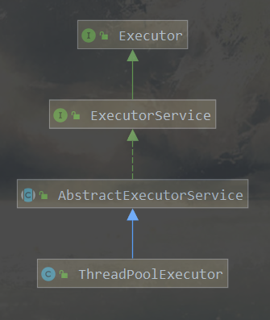
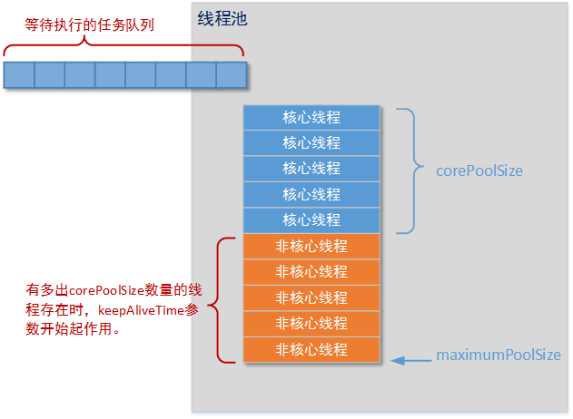
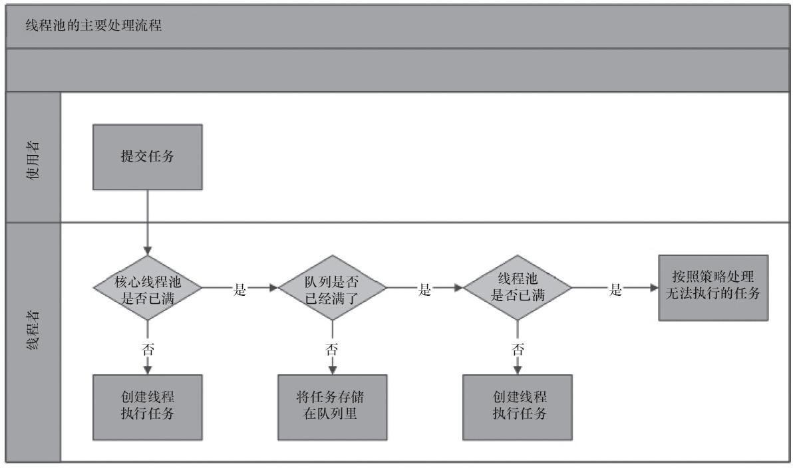
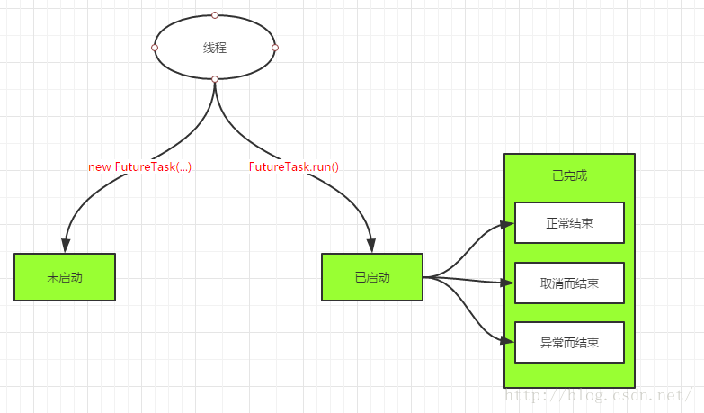
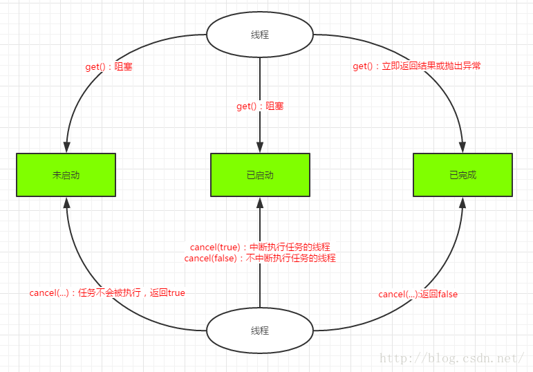
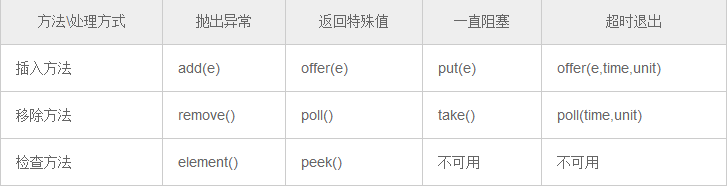

# 1.【原子性操作】

## 1.1.CAS算法

CAS，全称为Compare-And-Swap，可以说整个Java并发包的一个核心算法思想。它是一条CPU并发原语，原语属于操作系统用语范畴，由若干指令组成用来完成某个功能的一个过程。**原语的执行必须是连续的，执行过程中不允许被中断**。CAS的语义是“**我认为V的值应该为A，如果是，那么将V的值更新为B，否则不修改，并告诉V的值实际为多少**”，CAS有3个操作数，内存值V，预期值A，要修改的新值B。当且仅当预期值A和内存值V相同，将内存值V修改为B，否则什么都不做。

常用的线程并发控制：synchronized，属于“悲观锁”，一个线程在解锁之前，其它线程访问同步资源只能阻塞等待持锁线程的释放；而当多个线程尝试使用CAS同时更新同一个变量时，只有其中一个线程能更新变量的值，而其它线程都失败，失败的线程并不会被挂起，而是被告知这次竞争中失败，并可以再次尝试(实际开发会自旋的方式不断重试)。CAS算法虽然不会像锁一样重量级，但上天是公平的，CAS虽然不会阻塞线程，却也有3个缺点：

1. **循环时间长开销很大**：CAS更新失败的线程会以自旋的方式不断继续尝试更新，假如竞争激烈，那么线程就会一直地循环
2. **只能保证一个共享变量的原子操作**：对多个共享变量操作时，CAS就无法保证操作的原子性，此时只能用锁
3. **ABA问题**：最常见且严重的问题，具体看下面介绍

ABA问题就是CAS存在的典型问题，它发生的场景是：线程1和线程2同时更新变量的值，假设这个值为A；线程2速度较快，它把变量值由A改为B后，又由B改为A；在这之后，线程1发现变量在内存中的值还是A，就将值C赋给变量。看起来CAS成功了也不会抛错，但是实际情况已经变化了，很可能存在潜在问题，当这个变量是一个对象而且关联着其它对象，就会出现引用异常现象，例如：

1. 有个链栈，栈顶为A，此时只有两个节点A和B。现在，需要在多线程环境下更新栈顶元素：


2. thread-1和thread-2同时来操作，读到的栈顶元素都是A且A.next=B；此时 thread-1准备通过compareAndSwap(A,B)将B更新为栈顶元素，恰巧thread-2抢夺CPU时间片先执行，它把节点A和B都弹出栈，重新将节点C和D入栈， 最后再将节点A入栈继续作为栈顶，此时B已经变为游离状态，与栈无关了：



3. 整个栈就变为A-C-D，A继续作为栈顶元素，thread-2执行完归还CPU资源，thread-1得以重新执行，它发现栈顶元素还是A，于是通过CAS将栈顶由A更新为B，但是游离的节点B.next=null，这意味C和D莫名其妙地被移出栈了，整个栈只剩一个节点B：



这个问题就很严重了，整个栈结构都断裂了。为了解决CAS的ABA问题，可以通过增加一个版本号version作为对象标识，每个线程更新一次共享对象，就将它的version加1，后面线程会结合对象当前内存值 + version来共同判断是否有其它线程更新过，实际开发中很多乐观锁就是这样处理ABA问题滴，Java也提供一个原子操作类：AtomicStampedReference！

## 1.2.CAS实现

CAS并发原语体现在Java语言就是sun.misc.Unsafe类，调用此类的CAS方法，JVM会帮我们实现出CAS汇编指令。Unsafe类位于sun.misc包下，不属于Java标准。Unsafe类使Java拥有了像C语言一样操作内存空间的能力，可以直接操作堆外内存，可以随意查看及修改JVM运行时的数据结构。官方都不建议直接使用Unsafe类，它能干的事太多了，所以危险性也很大。Unsafe是单例的，想获取一个Unsafe实例，只能通过getUnsafe()方法，但是这个方法做了安全限制，只有**主类加载器**加载的类才能调用这个方法，否则会抛出异常。源码：

```java
@CallerSensitive
public static Unsafe getUnsafe() {
  Class var0 = Reflection.getCallerClass();
  if (!VM.isSystemDomainLoader(var0.getClassLoader())) {
    throw new SecurityException("Unsafe");
  } else {
    return theUnsafe;
  }
}
```

不过，注意观察方法的返回值，getUnsafe()是返回一个theUnsafe，其实它是Unsafe内部的成员变量：private static final Unsafe theUnsafe，所以我们可以使用反射获取到Unsafe实例，绕过它的判断条件：

```java
public void getUnsafe(){
  try {
    // 利用反射获取成员变量theUnsafe
    Field field = Unsafe.class.getDeclaredField("theUnsafe");
    // 由于它是private类型，需要设置可访问性
    field.setAccessible(true);
    // 通过theUnsafe获取实例对象，由于它还是static类型，所以参数为null
    Unsafe unSafe = (Unsafe)field.get(null);
  } catch (NoSuchFieldException|IllegalAccessException e) {
    e.printStackTrace();
  } 
}
```

### 1.2.1.内存管理

allocateMemory（分配内存）、reallocateMemory（重新分配内存）

copyMemory（拷贝内存）、freeMemory（释放内存 ）

getAddress（获取内存地址）

addressSize、pageSize、getInt（获取内存地址指向的整数）

getIntVolatile（获取内存地址指向的整数，并支持volatile语义）

putInt（将整数写入指定内存地址）

putIntVolatile（将整数写入指定内存地址，并支持volatile语义）

putOrderedInt（将整数写入指定内存地址、有序或者有延迟的方法）

getXXX和putXXX包含了各种基本类型的操作

### 1.2.2.对象实例化

allocateInstance()方法提供了另一种创建实例的途径。通常我们可以用new或者反射来实例化对象，使用allocateInstance()方法可以直接生成对象实例，且**无需调用构造方法和其它初始化方法**。这在对象反序列化的时候会很有用，能够重建和设置final字段，而不需要调用构造方法。

### 1.2.3.操作类、对象、变量

staticFieldOffset（静态域偏移）

defineClass（定义类）、defineAnonymousClass（定义匿名类）

ensureClassInitialized（确保类初始化）、objectFieldOffset（对象域偏移）

通过这些方法我们可以获取对象的指针，通过对指针进行偏移，我们不仅可以直接修改指针指向的数据（即使它们是私有的），甚至可以找到JVM已经认定为垃圾、可以进行回收的对象

### 1.2.4.数组操作

arrayBaseOffset（获取数组第一个元素的偏移地址）、arrayIndexScale（获取数组中元素的增量地址）。

arrayBaseOffset与arrayIndexScale配合起来使用，就可以定位数组中每个元素在内存中的位置。由于Java的数组最大值为Integer.MAX_VALUE，使用Unsafe类的内存分配方法可以实现超大数组。实际上这样的数据就可以认为是C数组，因此需要注意在合适的时间释放内存

### 1.2.5.多线程同步

这部分包括了monitorEnter、tryMonitorEnter、monitorExit、compareAndSwapInt、compareAndSwapObject、compareAndSwapLong等方法。其中monitorEnter、tryMonitorEnter、monitorExit已经被标记为deprecated不建议使用。Unsafe类的CAS操作可能是用的最多的，它为Java的锁机制提供了一种新的解决办法，比如AtomicInteger等类都是通过该方法来实现的。compareAndSwap方法是原子的，可以避免繁重的锁机制，提高代码效率。这是一种乐观锁，通常认为在大部分情况下不出现竞态条件，如果操作失败，会不断重试直到成功。重点看下这几个CAS方法：

```java
/**
 * Atomically update Java variable to <tt>x</tt> if it is currently
 * holding <tt>expected</tt>.
 * @return <tt>true</tt> if successful
 */
public final native boolean compareAndSwapObject(Object o, long offset,
                                                 Object expected,
                                                 Object x);

/**
 * Atomically update Java variable to <tt>x</tt> if it is currently
 * holding <tt>expected</tt>.
 * @return <tt>true</tt> if successful
 */
public final native boolean compareAndSwapInt(Object o, long offset,
                                              int expected,
                                              int x);

/**
 * Atomically update Java variable to <tt>x</tt> if it is currently
 * holding <tt>expected</tt>.
 * @return <tt>true</tt> if successful
 */
public final native boolean compareAndSwapLong(Object o, long offset,
                                               long expected,
                                               long x);
```

可以看到每个方法有4个参数，含义为：

第一个参数o：需要操作的对象

第二个参数offset：对象o的属性的内存偏移量，通过Unsafe.objectFieldOffset()获取

第三个参数expected：表示更新时的期待值

第四个参数x：表示将要更新的新值

### 1.2.6.挂起与恢复

这部分包括了park、unpark等方法。

将一个线程进行挂起是通过park方法实现的，调用 park后，线程将一直阻塞直到超时或者中断等条件出现。unpark可以终止一个挂起的线程，使其恢复正常。整个并发框架中对线程的挂起操作被封装在 LockSupport类中，LockSupport类中有各种版本pack方法，但最终都调用了Unsafe.park()方法。

### 1.2.7.内存屏障

包括loadFence、storeFence、fullFence等方法。这是在Java 8新引入的，用于定义内存屏障，避免代码重排序。

loadFence() 表示该方法之前的所有load操作在内存屏障之前完成；

storeFence()表示该方法之前的所有store操作在内存屏障之前完成。

fullFence()表示该方法之前的所有load、store操作在内存屏障之前完成。

## 1.3.CAS应用

jdk1.5以后，java多出了一个工具包：java.util.concurrent.Atomic，包里一共有四种原子更新方式，分别是：原子更新基本类型、原子更新数组、原子更新引用、原子更新字段。它们提供了对数据操作的线程安全保证，说白了就是线程同步。但是呢！Atomic类不是一个简单的同步封装，其内部实现不是简单的使用锁机制，而是一个更为高效的方式CAS (compare and swap) + volatile，通过CAS自旋实现原子操作的更新，从而避免了锁的高开销，执行效率大为提升打开Atomic包下类的源码，会发现Atomic包里的类基本都是使用Unsafe实现的包装类。

### 1.3.1.原子更新基本类型

AtomicBoolean —— 原子更新布尔类型

AtomicInteger  —— 原子更新整型

AtomicLong    —— 原子更新长整型

原子更新基本类型的类只有以上三种，三个类的用法基本上一致，以AtomicInteger为例，它内部的方法有个规律：方法名如果“get”放在后，则此方法返回操作之后的值；反之如果“get”放在前，则此方法返回操作之前的值。

-  getAndIncrement()：以原子方式将当前值加1，返回的是自增前的值
-  incrementAndGet()：以原子方式将当前值加1，返回的是自增后的值

**常用方法：**

1. addAndGet(int delta)：以原子方式将输入的数值与实例中的值相加并返回

2. incrementAndGet()：以原子方式将原值进行加1操作，返回相加后的结果

3. getAndSet(int newValue)：将实例中的值更新为新值，**并返回旧值**（通过查看源码，它会一直尝试直至修改成功）

4. boolean compareAndSet(int expect, int update)：CAS修改当前值，修改成功返回true，只会尝试一次

### 1.3.2.原子更新数组

- AtomicIntegerArray，原子更新整型数组里的元素

- AtomicLongArray，原子更新长整型数组里的元素

- AtomicReferenceArray，原子更新引用类型数组里的元素

**常用方法：**

1. addAndGet(int i, int delta)：以原子方式将输入值与数组中索引i的元素相加

2. compareAndSet(int i, int expect, int update)：如果当前值等于预期值，则以原子方式将数组位置i的元素设置成update值

**注意:** 数组value通过构造方法传递进去，然后AtomicIntegerArray会将当前数组复制一份，所以当AtomicIntegerArray对内部的数组元素进行修改时，不会影响到传入的数组

### 1.3.3.原子更新引用

AtomicInteger只能更新一个变量，如果要原子的更新多个变量，就需要使用原子更新引用类型：

1. AtomicReference ：原子更新引用类型

2. AtomicReferenceFieldUpdater ：原子更新引用类型里的字段

3. AtomicMarkableReference ：原子更新带有标记位的引用类型

### 1.3.3.原子更新字段

如果我们只需要某个类里的某个字段，那么就需要使用原子更新字段类：

1. AtomicIntegerFieldUpdater：原子更新整型的字段的更新器

2. AtomicLongFieldUpdater：原子更新长整型字段的更新器

3. AtomicStampedReference：原子更新带有版本号的引用类型(ABA问题解决)

# 2.【线程池】

Java线程池是运用场景最多的并发框架，它好比数据库连接池，只不过数据库连接池存放的是Connection对象，而线程池存放的是Java线程。使用线程池可以降低资源消耗，提高线程的可管理性！

## 2.1.接口关系

线程池的核心类为ThreadPoolExecutor，它的继承关系如下图：



### 2.1.1.Executor

Executor接口中只定义了一个方法execute()，该方法接收一个Runable实例，它用来执行一个任务，一个任务就是一个Runnable实例：

```java
public interface Executor {
    void execute(Runnable command);
}
```

### 2.1.2.ExecutorService

ExecutorService接口继承了Executor接口，提供了更丰富的实现多线程的方法，它的生命周期包括三种状态：运行(run)、关闭(shutdown)、终止(terminated)。创建后便进入run状态，当调用了shutdown()方法时，便进入shutdown状态，此时ExecutorService不再接受新的任务，但它还在执行已经提交了的任务，当所有已经提交了的任务执行完后，便到达terminated状态，此时调用isTerminated()就会返回true。

```java
public interface ExecutorService extends Executor {
  // 关闭线程池, 不再接收新的任务, 已提交的任务继续执行
  void shutdown();

  // 关闭线程池, 不再接收新的任务, 尝试停止正在执行的所有任务. 它与shutdown()相比,
  // 会去停止当前正在进行的任务
  List<Runnable> shutdownNow();

  //线程池是否已经关闭
  boolean isShutdown();

  // 仅当线程池所有任务(不管运行or等待运行)都结束, 才会返回true; 而且只有在调用了
  // shutdown() 或 shutdownNow()方法后, 此方法才有可能返回true.
  boolean isTerminated();

  // 调用shutdown() 或 shutdownNow()后, 调用此方法会一直阻塞, 直到所有任务执行完 or 
  // 指定的超时时间到达 or 当前线程被中断. 如果返回true表示线程池已终止, 返回false表示
  // 超时等待了.
  boolean awaitTermination(long timeout, TimeUnit unit) 
    throws InterruptedException;

  // 这3个方法都是提交一个有返回值的任务
  <T> Future<T> submit(Callable<T> task);
  <T> Future<T> submit(Runnable task, T result); //第二个参数会放到Future作为返回值
  Future<?> submit(Runnable task);

  // 执行所有任务, 返回Future类型的list集合. 第二个较第一个增加了超时时间.
  <T> List<Future<T>> invokeAll(Collection<? extends Callable<T>> tasks);
  <T> List<Future<T>> invokeAll(Collection<? extends Callable<T>> tasks,
                                long timeout, TimeUnit unit);

  // 只要参数tasks内的一个任务结束了, 方法立刻返回, 值为执行完的那个任务的结果.
  // 第二个方法较第一个增加了超时等待时间.
  <T> T invokeAny(Collection<? extends Callable<T>> tasks);
  <T> T invokeAny(Collection<? extends Callable<T>> tasks,
                  long timeout, TimeUnit unit);
}
```

### 2.1.3.AbstractExecutorService

AbstractExecutorService实现了ExecutorService接口，它实现了非常有用的一些方法供子类直接使用

## 2.2.创建线程池

### 2.2.1.核心参数

我们可以直接通过ThreadPoolExecutor的构造方法创建一个线程池，最全的方法需要7个参数，它们的含义如下：

```java
public ThreadPoolExecutor(int corePoolSize,
                          int maximumPoolSize,
                          long keepAliveTime,
                          TimeUnit unit,
                          BlockingQueue<Runnable> workQueue,
                          ThreadFactory threadFactory,
                          RejectedExecutionHandler handler)
```

- **corePoolSize**

  核心线程池大小；Java会优先保证线程池内的线程数等于corePoolSize，当线程池接收一个新任务时，即使线程池内有空余线程可以执行，它仍然会创建新线程处理任务直到线程池内的线程数大于corePoolSize；如果调用了线程池 的prestartAllCoreThreads()方法，线程池会提前创建并启动所有基本线程！

- **maximumPoolSize**

  线程池最大容量；线程池允许创建的最大线程数，当阻塞队列满了，并且已经创建的线程数小于maximumPoolSize，线程池会继续创建新线程执行任务；一旦阻塞队列满，已创建的线程数 == maximumPoolSize，则执行handler处理任务。如果使用了无界的阻塞队列，那么这个参数就没有任何意义！

- **keepAliveTime & unit**

  线程活动保持时间&线程活动保持时间的单位；线程池的工作线程空闲后，保持存活的时间。这两个参数配合可以设置空闲线程的存活时间，但是这个存活时间的设置只对除corePoolSize以外的其它线程生效！

- **workQueue**

  任务队列；当线程池内的线程数量等于corePoolSize时，往后新加的任务都会放到workQueue中。任务队列实际上就是阻塞队列！

- **threadFactory**

  创建线程的工厂；可以通过线程工厂给每个创建出来的线程设置更有意义的名称，默认使用java.util.concurrent.Executors.DefaultThreadFactory！

- **handler**

   饱和策略；当线程池和任务队列都满了，说明线程池处于饱和状态，这时候如果有新任务过来，则调用RejectedExecutionHandler来处理这个新任务，默认使用AbortPolicy，会抛出异常！



**具体参数详解：**

①BlockingQueue： 阻塞队列，当核心线程数满了，新加的任务就会来到阻塞队列中。JDK7的阻塞队列一共7个，这里只记录4个：

| **队列**              | **作用**                                                     |
| --------------------- | ------------------------------------------------------------ |
| ArrayBlockingQueue    | 基于数组结构的有界阻塞队列，此队列按照FIFO原则对元素进行排序，新加入的任务晚执行 |
| LinkedBlockingQueue   | 基于链表结构的有界阻塞队列，最大容量Integer.MAX_VALUE  此队列按 FIFO（先进先出）原则：新加入的任务晚执行，创建完就不能增加容量 |
| SynchronousQueue      | 一个不存储元素的阻塞队列。每个插入操作必须等到另一个线程调用移除操作，否则插入操作一直处于阻塞状态 |
| PriorityBlockingQueue | 一个具有优先级的无界阻塞队列                                 |

②RejectedExecutionHandle：当提交给线程池的某一个新任务无法直接被线程池中“核心线程”直接处理，又无法加入工作队列，也无法创建新的线程执行等，这时候线程池会拒绝处理这个任务，触发定义的RejectedExecutionHandler接口实现。默认有4种，最科学的还是AbortPolicy提供的处理方式：抛出异常，由开发人员进行处理

| **拒绝策略**        | **作用**                                                     |
| ------------------- | ------------------------------------------------------------ |
| CallerRunsPolicy    | 直接运行这个任务的run方法，注意并不是线程池中的线程来运行，而是此任务自己实现的Runnable接口的run方法。 |
| AbortPolicy         | 线程池默认的选择，丢弃任务并且抛出异常RejectedExecutionException。 |
| DiscardPolicy       | 将会默默丢弃这个被拒绝的任务，不会抛出异常，也不会通过其他方式执行这个任务的任何一个方法，更不会出现任何的日志提示。 |
| DiscardOldestPolicy | 它会检查当前线程池的等待队列。并调用队列的poll()方法将当前处于等待队列列头的等待任务强行取出，然后再试图将当前被拒绝的任务提交到线程池执行。 |

### 2.2.2.Executors工厂

Executors是ThreadPoolExecutor的工厂类，它提供了4种创建线程池ThreadPoolExecutor的方法，实际就是上面核心参数的不同取值，可以参考一下。实际开发不建议使用这个工厂类，已发生OOM异常

#### 2.2.2.1.newFixedThreadPool

创建一个固定容量线程池，可控制线程最大并发数，超出的任务会在队列中等待。

```java
public static ExecutorService newFixedThreadPool(int nThreads) {
    return new ThreadPoolExecutor(nThreads, nThreads,
                                  0L, TimeUnit.MILLISECONDS,
                                  new LinkedBlockingQueue<Runnable>());
}
```

#### 2.2.2.2newCachedThreadPool

创建一个可缓存的线程池，若之前创建的线程可重用，优先使用，若没有线程可用，会创建非核心线程执行任务，线程池容量默认为Integer的最大值，相当于可以创建“无限个”非核心线程，当线程未使用达60s，会被中止并移除。

```java
public static ExecutorService newCachedThreadPool() {
    return new ThreadPoolExecutor(0, Integer.MAX_VALUE,
                                  60L, TimeUnit.SECONDS,
                                  new SynchronousQueue<Runnable>());
}
```

#### 2.2.2.3.newSingleThreadExecutor

创建一个单线程化的线程池，它只会用唯一的工作线程来执行任务，保证所有任务按照指定顺序(FIFO, LIFO, 优先级)执行。任意时间池中只能有一个线程。

```java
public static ExecutorService newSingleThreadExecutor() {
    return new FinalizableDelegatedExecutorService
        (new ThreadPoolExecutor(1, 1,
                                0L, TimeUnit.MILLISECONDS,
                                new LinkedBlockingQueue<Runnable>()));
}
```

#### 2.2.2.4.newScheduledThreadPool

创建一个定长线程池，支持定时及周期性任务执行。Java提供的Time类可以周期性地或者延期执行任务，但是有时我们需要并行执行同样的任务，这时如果创建多个Time对象会给系统带来负担，解决办法是将定时任务放到线程池中执行它创建的ScheduledThreadPoolExecutor继承ThreadPoolExecutor，增加定时功能

```java
public static ScheduledExecutorService newScheduledThreadPool(int corePoolSize) {
    return new ScheduledThreadPoolExecutor(corePoolSize);
}
public ScheduledThreadPoolExecutor(int corePoolSize) {
    super(corePoolSize, Integer.MAX_VALUE, 0, NANOSECONDS,
          new DelayedWorkQueue());
}
```

## 2.3.处理流程

之前已经讲过，可以通过ThreadPoolExecutor来创建一个线程池，当它实例化后，通过execute()和submit()接收任务执行。execute()接收Runnable接口，执行无返回值任务，因此也无法判断任务是否被线程池执行了；submit()接收Callable接口，执行带返回值的任务，它会返回一个Future对象。线程池的处理流程如下：



1. 如果此时线程池中的数量小于corePoolSize，即使线程池中的线程都处于空闲状态，也要创建新的线程来处理被添加的任务（**这步骤需要获取全局锁**）；

2. 若此时线程池中的数量等于 corePoolSize，但是缓冲队列 BlockingQueue未满，那么任务被放入缓冲队列；

3. 如果此时线程池中的数量大于corePoolSize，缓冲队列workQueue满，并且线程池中的数量小于maximumPoolSize，创建非核心线程来处理被添加的任务；（**这一步骤需要获取全局锁**）

4. 如果此时线程池中的数量大于corePoolSize，缓冲队列BlockingQueue已满，并且线程总数量等于maximumPoolSize，则根据handler指定的策略来处理。

**注意！！！**

这里可以得到，为啥线程池要设计一个工作队列的模式，因为每次创建线程都需要获取全局锁，这将会是一个严重的可伸缩瓶颈，在实际开发中要尽可能避免获取全局锁。从上面4步流程也可以知道，在线程池预热之后（当前运行的线程数大于等于corePoolSize），几乎所有的execute()方法调用都是执行第2步，将任务放入到工作队列，这一步不需要获取全局锁！！！

## 2.4.实际运用

### 2.4.1.常用方法
|方法|作用|
|----|----|
| getActiveCount()         | 返回正在执行任务的大致线程数              |
| getCompletedTaskCount() | 返回已完成执行的任务的大致总数(任务已完成)；  由于任务和线程的状态在计算过程中可能会动态变化，因此返回的值只是一个近似值，但在连续的调用中不会减少 |
| getLargestPoolSize() | 返回同时存在于池中的最大线程数 |
| getTaskCount() | 返回已计划执行的任务的大致总数(任务仍在执行)；  由于任务和线程的状态在计算期间可能会动态变化，因此返回的值只是一个近似值 |

### 2.4.2.配置线程池

《Java并发编程》建议从以下几个角度来配置线程池：

1. **任务的性质：CPU密集型任务、IO密集型任务和混合型任务**

   - CPU密集型任务应配置尽可能小的线程，如配置Ncpu+1个线程的线程池；
   - IO密集型任务线程并不是一直在执行任务（大多数情况线程都处于阻塞状态），则应配置尽可能多的线程，如2*Ncpu。Java获取CPU个数方式：Runtime.getRuntime().availableProcessors()
2. **任务的优先级：高、中和低**
   - 优先级不同的任务可以使用优先级队列PriorityBlockingQueue来处理。它可以让优先级高的任务先执行
3. **任务的执行时间：长或短**
   - 执行时间不同的任务可以交给不同规模的线程池来处理，或者可以使用优先级队列，让执行时间短的任务先执行
4. **任务的依赖性：是否依赖于其它系统资源，例如数据库连接**
   - 依赖数据库连接池的任务，因为线程提交SQL后需要等待数据库返回结果，等待的时间越长，则CPU空闲时间就越长，那么线程数应该设置得越大，这样才能更好地利用CPU！

**切记：真的要使用有界队列，不然任务堆积会内存爆满的！！！**但其实，真正线程配置线程池的参数，都是需要在生产环境运行一段时间后，通过监控系统分析吞吐量、性能指标...然后才可以得出适合本业务的配置。

### 2.4.3.开启线程池

当一个线程池创建好了，在使用execute()或submit()方法接受第一个任务开始，它就已经启动，除非[关闭线程池](#2.4.4.关闭线程池)，不然它会一直运行着，等待任务的到来

### 2.4.4.监控线程池

可以使用线程池提供的一些属性，知道线程池当前的运行状况：

| **属性**           | **功能**                                                     |
| ------------------ | ------------------------------------------------------------ |
| taskCount          | 线程池需要执行的任务数量                                     |
| completedTaskCount | 线程池在运行过程中已完成的任务数量，  completedTaskCount  <=  taskCount |
| largestPoolSize    | 线程池曾经创建过的最大线程数量。通过它可知道线程池是否曾经满过。如该数值等于线程池的最大大小，则表示线程池曾经满过 |
| getPoolSize        | 线程池的线程数量。如果线程池不销毁的话，线程池里的线程不会自动销毁，所以这个大小只增不减 |
| getActiveCount     | 获取活动的线程数                                             |

上面的属性，都可以通过相应的[get()方法](#2.4.1.常用方法)获取到；除了获取线程池运行状况外，还可以通过继承线程池来自定义线程池，重写线程池的beforeExecute、afterExecute和terminated方法，分别在任务执行前、执行后和线程池关闭前执行一些代码来进行监控：

```java
public class SymMonitorThreadPool extends ThreadPoolExecutor {
  /**
   * 这个方法会在任务被执行之前调用,可用于重新初始化线程局部变量或执行日志记录；
   * 建议：为了正确嵌套多个重写，子类通常应该在该方法的开头调用super.afterexecute
   *
   * @param t 用此线程来执行任务r
   * @param r 将要被执行的任务r
   */
    @Override
    protected void beforeExecute(Thread t, Runnable r) {}

   /**
    * 这个方法会在任务被执行之后调用,当发生异常时，错误信息会被封装到参数t上
    * 建议：为了正确嵌套多个重写，子类通常应该在该方法的开头调用super.afterexecute()
    *
    * @param r已被执行完的任务
    * @param t 导致终止的异常，如果执行正常，则返回null
    */
    @Override
    protected void afterExecute(Runnable r, Throwable t) {}

   /**
    * 线程池关闭前会被调用
    * 建议：要正确嵌套多个重叠，子类通常应在此方法中调用super.terminated
    */
    @Override
    protected void terminated() {}
}
```

### 2.4.5.关闭线程池

关闭线程池有两个方法：shutdown()、shutdownNow()

<table>
    <tr>
    	<th></th>
        <th>shutdown()</th>
        <th>shutdownNow()</th>
    </tr>
    <tr>
        <td width="80px;"><b>共同点</b></td>
        <td colspan="2">原理都是遍历线程池中的工作线程，然后逐个调用线程的interrupt()方法来中断线程，所以无法响应中断的线程可能永远无法终止  </td>
    </tr>
    <tr>
        <td><b>不同点</b></td>
        <td>将线程池的状态设置成SHUTDOWN状态，然后中断所有没有正在执行任务的线程  </td>
        <td>首先将线程池的状态设置成STOP，然后尝试停止所有的正在执行或暂停任务的线程，并返回等待执行任务的列表  </td>
    </tr>
    <tr>
    	<td><b>总结</b></td>
        <td colspan="2">shutdown()会拒绝新任务，等待正在运行的任务执行完，才关闭  shutdownNow()拒绝新任务，停止所有任务(包括正在运行的)，再关闭  </td>
    </tr>
</table>

只要调用了这两个关闭方法中的任意一个，isShutdown方法就会返回true；当所有的任务都已关闭后，才表示线程池关闭成功，这时调用isTerminaed方法才会返回true！！

## 2.5.源码分析

线程池源码不难，但是里面的判断逻辑太全太难考虑了....

### 2.5.1.ctl及线程池状态

分析线程池ThreadPoolExecutor的源码之前，需要弄懂它的成员变量。前面分析过线程池的[核心参数](#2.2.1.核心参数)，它们是保证线程池运行的必要参数；其内部还有不开放给使用者的变量，包括线程池的运行状态

```java
public class ThreadPoolExecutor extends AbstractExecutorService {

    // Doug Lea 采用一个 32 位的整数来存放线程池的状态和当前池中的线程数. 其中高 3 位用于存放
    // 线程池状态, 低 29 位表示线程数. 这个变量就是ctl, 它是一个原子操作类.
    private final AtomicInteger ctl = new AtomicInteger(ctlOf(RUNNING, 0));

    // COUNT_BITS值为32-3=29, 就表示整数前三位表示线程状态, 后二十九位表示线程数量
    private static final int COUNT_BITS = Integer.SIZE - 3;

    // CAPACITY表示最大线程数量, 值为1左移29位再减一, 即：2^29-1=536860911
    // 000 11111111111111111111111111111
    private static final int CAPACITY  = (1 << COUNT_BITS) - 1;

    // 线程池状态存放在ctl的高位前三位. 记住一点RUNNING为-1左移, SHUTDOWN为0左移,
    // 所以小于0时线程池可接收任务可执行, 等于0拒绝新任务, 大于0拒绝新任务并中止当前任务
    // 111 00000000000000000000000000000
    // RUN – 表示线程池运行中, 接受新任务, 处理等待队列中的任务.
    private static final int RUNNING  = -1 << COUNT_BITS;

    // 000 00000000000000000000000000000 
    // SHUTDOWN - 不接受新的任务提交, 但是会继续处理等待队列中的任务.
    private static final int SHUTDOWN  = 0 << COUNT_BITS;

    // 001 00000000000000000000000000000 
    // STOP - 不接受新的任务提交, 不再处理等待队列中的任务, 中断正在执行任务的线程.
    private static final int STOP    = 1 << COUNT_BITS;

    // 010 00000000000000000000000000000
    // TIDYING - 所有任务都销毁了, workCount为0.在转换为此状态时, 会执行钩子方法 terminated()
    private static final int TIDYING  = 2 << COUNT_BITS;

    // 011 00000000000000000000000000000
    // TERMINATED - terminated() 方法结束后，线程池的状态就会变成这个
    private static final int TERMINATED = 3 << COUNT_BITS;

    // 位运算方法, 计算线程池状态和线程数量
    // 将整数 c 的低 29 位修改为 0, 就得到了线程池的状态
    private static int runStateOf(int c)   { return c & ~CAPACITY; }

    // 将整数 c 的高 3 位修改为 0，就得到了线程池中的线程数
    private static int workerCountOf(int c) { return c & CAPACITY; }

    private static int ctlOf(int rs, int wc) { return rs | wc; }

    // 为false时就算核心线程闲置也不会被回收; 当设置为true时, 核心线程就根据keepAliveTime
    // 在超过指定时间后被回收. 此变量默认为false
    private volatile boolean allowCoreThreadTimeOut;
}
```

**线程池状态转换：**

1. **RUNNING -> SHUTDOWN**：当调用了 shutdown() 后，会发生这个状态转换；

2. **(RUNNING or SHUTDOWN) -> STOP**：当调用 shutdownNow() 后，会发生这个状态转换，这就是 shutDown() 和 shutDownNow() 的区别；

3. **SHUTDOWN -> TIDYING**：当任务队列和线程池都清空后，会由 SHUTDOWN 转换为 TIDYING；

4. **STOP -> TIDYING**：当任务队列清空后，发生这个转换；

5. **TIDYING -> TERMINATED**：当 terminated() 方法结束后；

### 2.5.2.内部类Worker

java.util.concurrent.ThreadPoolExecutor.Worker是线程池的一个内部类，每个Worker都有唯一的Thread与其对应。提交给线程池的任务其实就是交予Worker来执行的。类信息为：

```java
class Worker extends AbstractQueuedSynchronizer implements Runnable{

    // 每个Worker都有一个Thread与其对应, Worker就是运行在这个Thread内, 它是由线程工厂创建.
    final Thread thread;

    // 待运行的初始任务, 可能为null
    Runnable firstTask;

    // 已完成任务的统计
    volatile long completedTasks;

    // 构造方法接受一个Runnable对象, 它即是Worker的初始任务;
    Worker(Runnable firstTask) {

        // 因为Worker集成了AQS以支持并发, AQS底层靠着state表示许可数, 这里将其赋值为-1
        setState(-1);

        // 赋值初始化任务
        this.firstTask = firstTask;

        // 通过创建线程池指定的线程工厂创建一个新线程, 需要注意的是：在创建线程的时候, 会把
        // 当前Worker作为创建线程所需的Runnable参数, 而且将结果赋给Worker的thread变量.
        // 这就意味着当thread启动时, Worker的run()方法就会开始执行
        this.thread = getThreadFactory().newThread(this);
    }

    // Worker实现了Runnable接口, 所以它自己可以作为线程被启动
    public void run() {
        // 它调用ThreadPoolExecutor的runWorker()方法开始运行, 此方法在后面分析到
        runWorker(this);
    }
}
```

### 2.5.3.线程池运行流程

当通过execute()方法提交一个任务，线程池根据[处理流程](#2.3.处理流程)要么创建核心线程，要么将任务存入到阻塞队列。当线程池创建核心线程时，实际上就是构造一个Worker实例，将当前任务赋给它，同时将它构造成一个新线程。当这个线程启动时，Worker的run()方法就被调用，就会先执行初始任务，然后从阻塞队列中开始获取任务执行，因为Worker调用的是阻塞队列的take()方法，这个方法在队列为空时会被阻塞，直到有新任务放入到阻塞中。其实通过源码的分析，线程池并没有对核心线程与非核心线程做区分，它们实际都是一个Worker，只不过判断容量的逻辑不一样罢了！！

#### 2.5.3.1.execute()

当我们创建好一个线程池ThreadPoolExecutor实例，调用它的execute()方法就可以提交任务，这拉开了追其源码的内幕：

```java
// 源码：ThreadPoolExecutor - 1342
public void execute(Runnable command) {
    // 保证提交的任务不能为空
    if (command == null){
      throw new NullPointerException();
    }
        
    // 获取ctl的值,ctl高三位表示线程状态, 
    // 低二十九位表示线程(Worker)数量
    int c = ctl.get();

    // 如果当前运行的Worker数量小于核心线程数, 那么就会创建一个新的Worker
    if (workerCountOf(c) < corePoolSize) {
        // 通过addWorker()创建新Worker, 参数为当前任务和true(表示核心线程),
        // 如果创建成功返回true, execute()方法直接返回.
        if (addWorker(command, true))
            return;
	    // 如果创建Worker不成功, 重新获取ctl的值. 然后继续执行下面的代码
        c = ctl.get();
    }
    // 下面代码能执行, 两个情况：一是线程数大于等于核心线程数, 二是addWorker()方法添加失败.
    // 如果线程池仍在运行, 并且任务能够添加到阻塞队列中(offer()方法不会阻塞,入队成功即返回true)
    if (isRunning(c) && workQueue.offer(command)) {
        // 重新获取状态值ctl
        int recheck = ctl.get();

        // 若线程池不处于运行状态, 且从阻塞队列移除当前任务成功, 调用RejectedExecutionHandler
        // 接口拒绝执行此次任务
        if (!isRunning(recheck) && remove(command)){
          reject(command);
        } else if (workerCountOf(recheck) == 0){
          // 若是运行的Worker数量等于0, 创建非核心线程, 其初始任务为null.
          // 这块代码的真正意图是：担心任务提交到队列中了, 但是线程都关闭了
          addWorker(null, false);
        }
			
    } else if (!addWorker(command, false))
        // 要是线程池不是运行状态, 又或者阻塞队列已满, 就创建非核心线程(实际也是创建Worker)去执行
        // 如果创建非核心线程失败, 那么同样调用RejectedExecutionHandler接口拒绝此次任务
        reject(command);
}
```

#### 2.5.3.2   addWorker()

通过对execute()的解析，其实线程池创建核心线程还是创建非核心线程，都会通过addWorker()方法来创建并且运行。addWorker()方法返回一个布尔值，若为false说明线程池已停止或者准备停止，甚至可能线程工厂创建线程失败也会返回false；返回true说明Worker创建并且启动成功，源码为：

```java
// 源码：ThreadPoolExecutor - 901
private boolean addWorker(Runnable firstTask, boolean core) {

    // retry表示java label, 名称可以自定义, 一般用于双层循环, 因为continue和break只能
    // 突破内存循环, 如果想一下子跳出外层循环, 就可以自定义一个label.
    retry:
    for (;;) {
        // 获取ctl变量, 同时计算出当前线程池的运行状态rs
        int c = ctl.get();
        int rs = *runStateOf*(c);
        /*
         * 这边判断的含义是：如果线程池已关闭, 并且满足下面任一条件, 不会创建Worker：
         * 1.线程池状态大于 SHUTDOWN, 其实也就是 STOP, TIDYING或 TERMINATED;
         * 2.firstTask != null, 初始任务不为空(注意第二层判断括号前面有个取非);
         * 3.workQueue.isEmpty(), 队列为空;(注意第二层判断括号前面有个取非).
         *
         * 这里判断的逻辑：当线程池处于 SHUTDOWN 的时候, 不允许提交任务，但是已有的任务继续执行;
         * 当状态大于 SHUTDOWN 时, 不允许提交任务且中断正在执行的任务.
         * 提醒：若线程池处于SHUTDOWN, 但是firstTask为null且 workQueue 非空, 那么是允许创建
         * worker.
         */

        if (rs >= SHUTDOWN && !(rs == SHUTDOWN && firstTask == null &&
				!workQueue.isEmpty()))
            return false;
        for (;;) {
			// 获取已创建的Worker数量wc, 如果方法参数core为true, 将wc与corePoolSize比较
			// 反之与maximumPoolSize. 这实际上说明线程池内部并没有维护所谓的核心线程与非核心
			// 线程之说, 只是创建Worker的判断标准不一样罢了. 若wc大于等于临界值方法返回false.
            int wc = workerCountOf(c);
            if (wc >= CAPACITY || wc >= (core ? corePoolSize : maximumPoolSize))
                return false;
            
            // 将ctl的值用CAS方式累加1, 表示增加了新Worker, 直接跳出双层循环
            if (compareAndIncrementWorkerCount(c))
                break retry;

            // CAS设值失败的, 重新获取ctl值
            c = ctl.get();
            if (runStateOf(c) != rs)
                // 如果是一般CAS更新失败, 直接重新进入内层循环即可; 但是如果是ctl线程状态改变
                // 了, 例如其它线程关闭了这个线程池, 则进入外层循环重新判断.
                continue retry;
        }
    }  //双层循环结束, 判断完毕, 当前线程池允许创建新的Worker.

    // 定义两个状态值, 一个Worder已经启动：workerStarted; 一个Worker已经添加：workerAdded
    boolean workerStarted = false;
    boolean workerAdded = false;
    Worker w = null;
    try {
        // new一个Worker, 接收一个初始任务并创建好线程
        w = new Worker(firstTask);

        // 获取Worker中的线程对象, Worker就是在这个线程中运行的
        final Thread t = w.thread;

        if (t != null) {
			// 若线程不为空, 获取当前线程池的全局锁mainLock, 并尝试获取锁
			final ReentrantLock mainLock = this.mainLock;
            mainLock.lock();
            try {
                int rs = runStateOf(ctl.get());
			 	// 小于 SHUTTDOWN 那就是 RUNNING, 即线程池正常运行中; 如果等于 SHUTDOWN, 
                // 则不接受新的任务(所以判断firstTask是否为null), 但仍会执行等待队列中的任务.
            if (rs < SHUTDOWN || (rs == SHUTDOWN && firstTask == null)) {
                  // 检测Worker中的线程Thread是否已经启动, 这里不允许它启动
				  if (t.isAlive())
						throw new IllegalThreadStateException();
				  // workers是线程池的HashSet<Worker>变量, 存放已经创建好的Worker集合
				  workers.add(w);
				  // 跟踪线程池曾经达到的最大Worker数量, 若当前的workers集合大小大于以往
				  // largestPoolSize, 就重新将largestPoolSize修改为当前set集合的大小.
				  int s = workers.size();
                  if (s > largestPoolSize)
                           largestPoolSize = s;
			      // 状态值workerAdded值为true, 表示Worker已经添加成功
				  workerAdded = true;
                    }
            } finally {
                // 释放全局锁, 可以让其它线程创建Worker
                mainLock.unlock();
            }
		    // 如果Worker添加成功, 就直接启动它内部引用的thread对象, 即Worker自身就启动了.
			if (workerAdded) {
                    t.start();
                    workerStarted = true;
            }
        }
    } finally {
		 // 可能由于种种原因, Worker没启动成功, 甚至连创建都失败了, 就调用addWorkerFailed()
		 // 方法：从workers集合中移除它, 并将ctl值减一.
		if (!workerStarted)
                addWorkerFailed(w);
    }
    return workerStarted;
}
```

#### 2.5.3.3.runWorker()

通过前两个方法的分析，线程池实际上就是创建Worker，然后将其启动。别忘了Worker自身实现Runnable接口，而且在[new Worker()](#2.5.2.Worker)时是将Worker自身作为参数创建了线程Thread，所以当这个thread被启动时，实际上执行的就是Worker中的run()方法。源码为：

```java
// 源码：ThreadPoolExecutor - 1127
final void runWorker(Worker w) {

    // wt表示当前运行的线程
    Thread wt = Thread.*currentThread*();

    // task取出Worker的初始任务
    Runnable task = w.firstTask;

    // 将Worker内部的firstTask引用指向null
    w.firstTask = null;

    // 这个地方有点不解, 都未加过锁何来解锁？官方注释在右侧, 意思是允许中断
    w.unlock(); // allow interrupts

    // 此变量含义待议
    boolean completedAbruptly = true;
    try {
        // 一个大循环, 能循环的条件是初始任务task不为空, 获取从线程池等待队列获取任务不为空.
        // 若任务队列为空, getTask()方法就会在这边阻塞住直到队列中有新任务加入.
        while (task != null || (task = getTask()) != null) {
			// Worker自身实现了AQS, 所以自身可以作为锁. 在这里加锁
			w.lock();
			// 如果线程池状态大于等于 STOP, 意味着当前线程也要中断
			if ((runStateAtLeast(ctl.get(), *STOP*) || (Thread.interrupted() &&
   					runStateAtLeast(ctl.get(), STOP))) && !wt.isInterrupted())
					wt.interrupt();
            try {
                // 任务开始执行前, 回调beforeExecute()方法, 属于监控线程池功能
			    // 它会传入两个参数：执行任务的线程 + 待执行任务
				beforeExecute(wt, task);
    			Throwable thrown = null;
                try {
					// 在当前线程中, 直接调用任务的run()方法, 执行任务
					task.run();
                } catch (RuntimeException x) {
                    thrown = x; throw x;
                } catch (Error x) {
                    thrown = x; throw x;
                } catch (Throwable x) {
                    thrown = x; throw new Error(x);
                } finally {
                    // 执行完任务后, 回调afterExecute()方法, 属于监控线程池功能. 如果执行任务
					// 出现异常了, 则thrown不为空, 它即表示异常栈对象
						afterExecute(task, thrown);
                }

             } finally {
                // 在任务task执行后, 并且也回调两个监控线程池的方法. 在这个finally块中将
				// task也置为null, 自此Worker上的firstTask对象就会被GC回收; 然后
        		// Work的已执行任务数累加一, Worker解锁. 一次循环已完成, 准备下一次循环.
                task = null;
                w.completedTasks++;
                w.unlock();
             }
       } // while块截止点
           // 在上面的while循环中, 当getTask()不返回null时, 
           // 每个work其实是不间断地在循环着. 当getTask()返回null, 循环结束, 将
           // completedAbruptly置为false;
            completedAbruptly = false;
    } finally {
        // 如果循环终止了：
        // 1.getTask()返回null, 说明此Worker已完成使命, 准备将其回收;
        // 2.出现异常导致循环终止.
        // 不管是正常结束循环, 还是异常终止循环, 调用processWorkerExit()方法
        processWorkerExit(w, completedAbruptly);
    }
}
```

##### 2.5.3.3.1.getTask()

getTask()方法会从阻塞队列(同步队列)中获取任务，它也是来决定一个Worker是否可以被回收的方法，此方法有3种可能：

1. 阻塞直到获取到任务返回，默认配置下 corePoolSize 之内的线程是不会被回收的，它们会一直等待任务；

2. 超时退出。keepAliveTime 起作用的时候，也就是如果指定时间内都没有任务，那么应该关闭此Worker；

3. 如果发生了以下条件，此方法必须返回 null:

   - 池中有大于maximumPoolSize个workers存在(通过调用 setMaximumPoolSize 进行设置)；
   - 线程池处于 SHUTDOWN，且 workQueue 是空的，不再接受新的任务；
   - 线程池处于 STOP，不仅不接受新任务，连workQueue中的任务也不再执行

```java
// 源码：ThreadPoolExecutor - 1046
private Runnable getTask() {
    boolean timedOut = false; // Did the last poll() time out?
    for (;;) {
        // 获取ctl, 计算得到当前线程池的运行状态rs
        int c = ctl.get();
        int rs = runStateOf(c);
        // 两种可能: 1.rs == SHUTDOWN && workQueue.isEmpty()
        //          2.rs >= STOP
        if (rs >= SHUTDOWN && (rs >= STOP || workQueue.isEmpty())) {
            // 将ctl值CAS减一, 表示Worker数量少一个, 然后方法返回null， 结束runWorker()
 		    // 方法的循环.
			ecrementWorkerCount();
            return null;
        }
        // 没进入上面if语句, 说明线程池仍在运行, 获取已经创建了的Worker数量
        int wc = workerCountOf(c);

        // allowCoreThreadTimeOut一般为false, 意思是即使核心线程空闲也允许处于运行状态;
        // 如果wc > corePoolSize, 说明任务队列已满, 创建了非核心线程在执行任务.
        // 两者满足其一, 则需要超时计算, timed就为true.
        boolean timed = allowCoreThreadTimeOut || wc > corePoolSize;

        // 这边的判断条件是：
        // 1.Worker数量已经大于线程池最大允许创建的线程数, 或者超时了
        // 2.wc > 1 或者 workQueue为空
        // 必须上面两点都满足, 才会返回null.
        if ((wc > maximumPoolSize || (timed && timedOut))
				&& (wc > 1 || workQueue.isEmpty())) {
			// 用CAS方式将ctl减一, 如果成功返回null; 如果失败则继续循环
			if (compareAndDecrementWorkerCount(c))
				return null;
            continue;
        }
        try {
			// 若timed为true, 即需要计时, 则从任务队列头取出任务task, 最多等待指定时间;
			// 若timed为false, 不需要计时, 则通过take()方法一直阻塞, 直至有任务入队.
			Runnable r = timed ?
 				workQueue.poll(keepAliveTime, TimeUnit.NANOSECONDS) :
                workQueue.take();
			// 若返回的任务不为空, 说明是正常取出的任务, 直接将任务返回给Work执行
			if (r != null)
				return r;
			// 如果任务为null, 说明就是超时返回的情况, 将timedOut置为true
				timedOut = true;
        } catch (InterruptedException retry) {
			// 如果此 worker 发生了中断, 采取的方案是重试
			// 解释下为什么会发生中断, 这个要去看 setMaximumPoolSize 方法.
			// 如果开发者将 maximumPoolSize 调小了, 导致其小于当前的 workers 数量,
	 		// 那么意味着超出的部分线程要被关闭, 重新进入 for 循环, 自然会有部分线程会返回 null
			timedOut = false;
        }
    }
}
```

##### 2.5.3.3.2.processWorkerExit()

当[getTask()](#2.5.3.3.1.getTask())返回null，则[runWorker()](#2.5.3.3.runWorker())的循环就会终止，且completedAbruptly变量置为false，最后调用processWorkerExit()方法将Worker移除掉，源码为：

```java
// 源码：ThreadPoolExecutor – 1001行
private void processWorkerExit(Worker w, boolean completedAbruptly) {
    // 方法参数completedAbruptly为true时, 表示是因为用户任务的异常导致worker执行失败.
    // 若为true时, 将ctl值减一, 表示Worker数量少一
    if (completedAbruptly)
        decrementWorkerCount();
    // 获取全局锁, 加锁
    final ReentrantLock mainLock = this.mainLock;
    mainLock.lock();
    try {
        // 将Worker执行成功的任务数, 加到线程池的全局执行成功任务数上
        completedTaskCount += w.completedTasks;
        // 从worker集合中移除当前worker
        workers.remove(w);
    } finally {
        mainLock.unlock();
    }
    // 尝试将线程池置为TERMINATE状态.
    tryTerminate();
    int c = ctl.get();
    // 如果线程池当前状态小于STOP, 即处于RUNNING, SHUTDOWN任一一个
    if (runStateLessThan(c, STOP)) {
        // 若是由于getTask()返回null, 导致的Worker关闭, 即正常关闭
        if (!completedAbruptly) {
            // 若允许核心线程在空闲时被回收, 则min为0, 否则min为核心线程数
            int min = allowCoreThreadTimeOut ? 0 : corePoolSize;
            // 当min为0(允许核心线程数被回收), 并且任务队列还有任务未执行, 将min置为1. 表示
            // 至少启动一个Worker去执行剩下的任务
            if (min == 0 && ! workQueue.isEmpty())
                min = 1;
            // 最终判断当前启动的Worker数量是不是大于等于min(至少需要的Worker数量), 是的话
            // 就直接返回而无须做任何操作.
            if (workerCountOf(c) >= min)
                return; // replacement not needed
        }
        // 若是因为用户异常导致的Worker退出, 或者当前Worker数量不足min, 就创建一个Worker.
        addWorker(null, false);
    }
}
```

# 3.【异步结果-Future】

在传统java多线程接口Runnable中，run()方法是没有返回值。在JDK1.5以后，JUC包下多了一个接口Future，它可以作为多线程异步执行后的结果。

## 3.1.核心接口

### 3.1.1.Callable

Callable接口被线程执行后有返回值，这个返回值可以被Future异步获取，源码：

```java
@FunctionalInterface
public interface Callable<V> {
    V call() throws Exception;
}
```

只要实现Callable接口，并且实现call()方法，就能开启一个带有返回值的线程：

```java
public class CallableDemo implements Callable<Integer> {
    @Override
    public Integer call() throws Exception {
        return 12580; // 线程执行逻辑 
    }
}
```

### 3.1.2.Future

Future接口一般是与Callable接口一起使用，异步获取线程执行后的返回值。它定义了下面5种方法:

```java
// 获取异步执行的结果，若没有结果可用，此方法会阻塞直到异步计算完成
V get() throws InterruptedException, ExecutionException;

// 同样也是获取异步执行的结果，若没有结果，也会阻塞，但是阻塞有时间限制，超时会抛异常
V get(long timeout, TimeUnit unit) throws InterruptedException, 	
		ExecutionException,TimeoutException;

// 如果任务结束（无论是正常结束、终止执行还是发生异常），都会返回true
boolean isDone();

// 如果任务执行前被取消，返回true
boolean isCancelled();

/*
 * 1.任务未开始，执行此方法，返回false
 * 2.任务已启动，执行cancel(true)，会中断此任务的线程来试图取消任务
 * 3.任务已启动，执行cancel(fasle)，让线程正常执行到完成，再返回flase
 * 4.任务已完成，执行cancle(true/false)，都是返回false
 * mayInterruptRunning参数为true时表示中止任务，为false时表示不会中止任务
 */
boolean cancel(boolean mayInterruptIfRunning);
```

### 3.1.3.FutureTask

FutureTask类实现了RunnableFuture接口，而RunnableFuture接口又实现了Runnable接口和Future接口。所以它既可以作为Runnable被线程执行，又可以作为Future得到Callable的返回值

```java
public class FutureTask<V> implements RunnableFuture<V> 
public interface RunnableFuture<V> extends Runnable, Future<V> 
```

#### 3.1.3.1.执行状态

根据FutureTask.run()的执行时机来分析其所处的3种状态：

1. 未启动。 FutureTask.run()方法还没有被执行之前，FutureTask处于未启动状态；

2. 已启动。FutureTask.run()被执行的过程中，FutureTask处于已启动状态；

3. 已完成。FutureTask.run()方法执行完正常结束，或者被取消，或者抛出异常而结束，FutureTask都处于完成状态。



由于FutureTask实现了Future接口，同样它也拥有Future的方法：



## 3.2.源码分析

待完成...

# 4.【阻塞队列】

## 4.1.什么是阻塞队列?

阻塞队列（BlockingQueue）是一个支持两个附加操作的队列。当阻塞队列进行插入数据时，如果队列已满，线程将会阻塞等待直到队列非满；从阻塞队列取数据时，如果队列已空，线程将会阻塞等待直到队列非空。阻塞队列常用于生产者和消费者的场景，生产者是往队列里添加元素的线程，消费者是从队列里拿元素的线程。阻塞队列就是生产者存放元素的容器，而消费者也只从容器里拿元素

## 4.2.阻塞队列的方法



**抛出异常：**

是指当阻塞队列满时候，再往队列里插入元素，会抛IllegalStateException(“Queue full”)异常。当队列为空时，获取元素时会抛出NoSuchElementException异常；

**返回特殊值：**

插入方法会返回是否成功，成功则返回true。移除方法，则是从队列里拿出一个元素，如果没有则返回null；

**一直阻塞：**

当阻塞队列满时，如果生产者线程往队列里put元素，队列会一直阻塞生产者线程，直到拿到数据，或者响应中断退出。当队列空时，消费者线程试图从队列里take元素，队列也会阻塞消费者线程，直到队列可用；

**超时退出：**

当阻塞队列满时，队列会阻塞生产者线程一段时间，如果超过一定的时间，生产者线程就会退出

## 4.3.阻塞队列的类别

| **队列**                  | **作用**                                                     |
| ------------------------- | ------------------------------------------------------------ |
| **ArrayBlockingQueue**    | 数组结构组成的有界阻塞队列！                                 |
| **LinkedBlockingQueue**   | 链表结构组成的有界阻塞队列！  此队列按 FIFO（先进先出）原则：新插入的任务晚执行，创建完就不能再增加容量 |
| **SynchronousQueue**      | 不存储元素的阻塞队列！  一旦有任务插入队列，就必须等待它执行完然后删除。在此期间，其他任务只能等待 |
| **PriorityBlockingQueue** | 支持优先级排序的无界阻塞队列！  每次出队都返回优先级最高的元素 |
| **DealyQueue**            | 使用优先级队列实现延迟获取的无界阻塞队列！  在创建元素时，可以指定多久才能从队列中获取当前元素，只有延时期满才能从队列中获取元素 |
| **LinkedTransferQueue**   | 链表结构组成的无界阻塞队列！                                 |
| **LinkedBlockingDeque**   | 基于链表实现的双向阻塞队列！  队列头部和尾部都可以添加和移除元素，多线程并发时，可以将锁的竞争最多降到一半 |

**注意：**无法向一个 BlockingQueue 中插入 null。如果你试图插入 null，将会抛NullPointerException

### 4.3.1.ArrayBlockingQueue

ArrayBlockingQueue是一个用数组实现的有界阻塞队列。此队列按照先进先出原则对元素进行排序。默认情况下是非公平访问队列，所谓公平访问队列是指阻塞的所有生产者线程或消费者线程，当队列可用时，可以按照阻塞的先后顺序访问队列，即先阻塞的生产者线程，可以先往队列里插入元素，先阻塞的消费者线程，可以先从队列里获取元素。通常情况下为了保证公平性会降低吞吐量。之前学习线程条件变量condition的时候，可以用condition来做一个类似缓冲区的数组，其实就是ArrayBlockingQueue的原理，直接拿来用即可：

```java
// 创建指定容量的阻塞队列,因为它是数组实现的,所以必须指定容量
private ArrayBlockingQueue<Object> blockingQueue = 
    new ArrayBlockingQueue<>(5);
/**
 * 生产者线程往阻塞队列中添加数据
 */
public void put(Object obj) {
    String name = Thread.currentThread().getName();
    try {
        blockingQueue.put(obj);
        System.out.println(name + "添加：" + obj);
    } catch (InterruptedException e) {
        e.printStackTrace();
    }
}
/**
 * 消费者线程往阻塞队列中取走数据
 */
public void take() {
    String name = Thread.currentThread().getName();
    try {
        Object obj = blockingQueue.take();
        System.out.println(name + "取走：" + obj);
    } catch (InterruptedException e) {
        e.printStackTrace();
    }
}
```

开启2个线程当做生产者线程，每个线程生产5个数据；开启3个线程当做消费者线程，每个线程无限次取走数据

```java
public static void main(String[] args) {
    Random random = new Random();// 随机数
    ExecutorService threadPool = Executors.newFixedThreadPool(10); // 线程池
    ArrayBlockingQueueDemo demo = new ArrayBlockingQueueDemo();
    // 开启2个生产者线程
    for (int i = 0; i < 2; i++) {
        final int j = i + 1;
        threadPool.execute(() -> {
            Thread.currentThread().setName("生产者" + j + "号");
            // 每个线程添加5个
            for (int z = 0; z < 5; z++) {
                demo.put(random.nextInt(5000));
            }
        });
    }
    // 开启3个消费者线程
    for (int i = 5; i < 8; i++) {
        final int j = i + 1;
        threadPool.execute(() -> {
            Thread.currentThread().setName("消费者" + j + "号");
            for (; ; ) {
                demo.take();
            }
        });
    }
    threadPool.shutdown();
}
```
