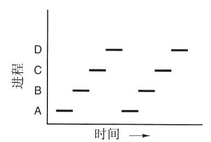
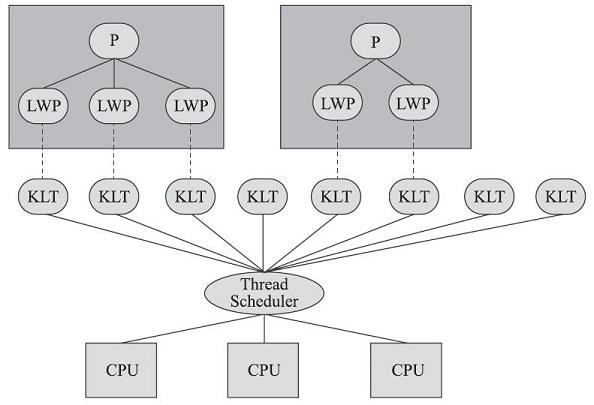
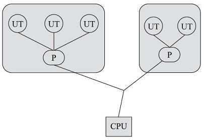
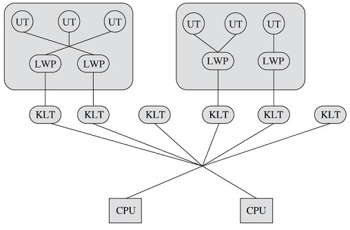
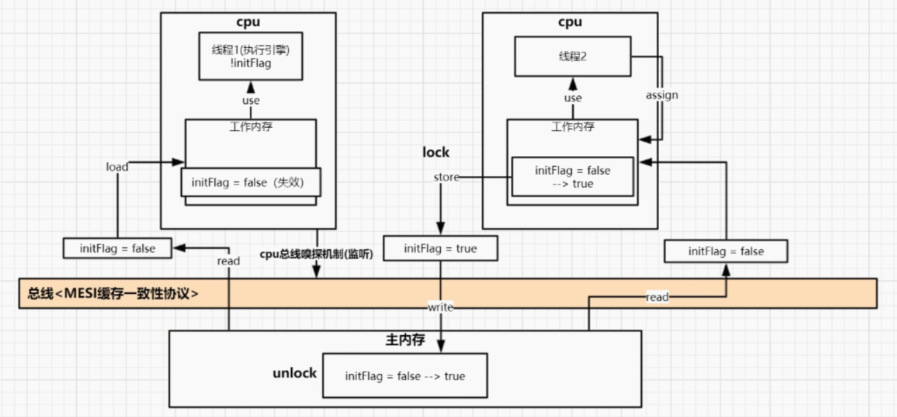
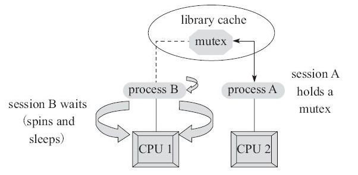

并发编程三大特性：原子性、可见性、有序性

# 1.【OS并发基础】

## 1.1.进程

进程（process），本质上是正在执行的一个程序，它是操作系统分配资源的最小单位。以Linux为例，操作系统如果想运行一段程序，首先要将程序文件加载到内存，然后 CPU 去读取和执行程序指令。linux内核会给每一个进程创建一个名为`task_struct`的数据结构。其实，内核也是一段程序，系统启动时就被加载到内存中了。

### 1.1.1.地址空间

进程在运行期间需要访问共享的内存，但是物理内存是有限的，不可能每个进程都一一分配到。所以，Linux 给每个进程虚拟出一块很大的地址空间（address space），这是从某个最小值的存储位置（通常是零）到某个最大值存储位置的列表，比如 32 位机器上进程的虚拟内存地址空间是 4GB，从 0x00000000 到 0xFFFFFFFF。

实际上，这4GB 并不是真实的物理内存，而是进程访问到了某个虚拟地址，如果这个地址还没有对应的物理内存页，就会产生缺页中断，分配物理内存，MMU（内存管理单元）会将虚拟地址与物理内存页的映射关系保存在页表中，再次访问这个虚拟地址，就能找到相应的物理内存页。进程的虚拟地址空间总体分为`用户空间`和`内核空间`，低地址上的 3GB 属于用户空间，高地址的 1GB 是内核空间。


从上面这张图可以看到，用户空间从低到高依次是代码区、数据区、堆、共享库与 mmap 内存映射区、栈、环境变量。其中**堆向高地址增长，栈向低地址增长**。在地址空间的中央，有一个`共享库和 mmap 映射区`，Linux 提供了内存映射函数 mmap， 它可将文件内容映射到这个内存区域，用户通过读写这段内存，从而实现对文件的读取和修改，无需通过 read/write 系统调用来读写文件，省去了用户空间和内核空间之间的数据拷贝，Java 的 `MappedByteBuffer `就是通过它来实现的；

### 1.1.2.进程模型

永远需要明确一点，一个CPU（单核）在一个瞬间，只能执行一个进程。但CPU可以在一秒内，快速切换不同的进程执行，使每个进程各运行几十或几百个毫秒，这样就产生并行的错觉，也被称为“伪并行”。这种快速的切换称作多道程序设计！

以Linux为例，Linux 内核维护了一个可运行的进程队列，所有处于`TASK_RUNNING`状态的进程都会被放入运行队列中，本质是用双向链表将`task_struct`链接起来，排队使用 CPU 时间片，时间片用完重新调度 CPU。所谓调度就是在可运行进程列表中选择一个进程，再从 CPU 列表中选择一个可用的 CPU，将进程的上下文恢复到这个 CPU 的寄存器中，然后执行进程上下文指定的下一条指令。


如果有进程执行系统调用被阻塞了，就会将进程的`task_struct`移出运行队列，添加到等待队列，并且将进程的状态的置为`TASK_UNINTERRUPTIBLE`或者`TASK_INTERRUPTIBLE`，重新触发一次 CPU 调度让出 CPU。进程加入等待队列的同时，还会向内核注册一个中断程序（回调函数）。例如：如果阻塞在Socket，那么当网卡接收到数据时，网卡就会产生硬件中断，内核再通过调用中断程序唤醒进程，将相应进程`task_struct`的状态置为`TASK_RUNNING`，并重新加入到运行队列。所以可以看到，在足够长的一段时间后，所有的进程都运行了，但在任何一个给定的瞬间仅有一个进程真正在运行



## 1.2.线程

线程（Thread）属于进程，一个进程会有若干个线程，各个线程既可以共享进程资源（内存地址、文件I/O等），又可以独立调度。线程的是CPU调度的最小单位。实现线程主要有三种方式：

- 使用内核线程实现（1：1实现）
- 使用用户线程实现（1：N实现）
- 使用用户线程加轻量级进程混合实现（N：M实现）

### 1.2.1.内核实现线程(1:1)

内核线程（Kernel-Level Thread），简称KLT，就是直接由操作系统内核创建和管理的线程。内核通过操纵调度器（Scheduler）对KLT进行调度来实现线程切换，并负责将KLT的任务映射到各个CPU上。但是程序并不会直接使用内核线程（KLT），而是使用内核线程的一种高级接口  — 轻量级进程（Light Weight Process，LWP），轻量级进程就是我们通常意义上所讲的线程。每个LWP都由一个内核线程支持，因此只有先支持内核线程，才能有轻量级进程。这种轻量级进程与内核线程之间1：1的关系称为一对一的线程模型：



这种设计：

- 好处：进程中的线程LWP都有一个KLT对应，当某个LWP因为系统调用阻塞了，不会影响进程的其它线程；
- 坏处：由于LWP基于KLT，所以在创建、析构及同步它的时候，都需要进行系统调用，就会涉及用户态和内核态的切换，其代价比较高；而且KLT需要维护LWP，会占用内核空间

### 1.2.2.用户空间实现线程(1:N)

用户线程（User Thead），是指把整个线程包放在用户空间中，系统内核不能感知到用户线程的存在及如何实现的。用户线程的建立、同步、销毁和调度完全在用户态中完成，不需要内核的帮助。**从内核角度考虑，就是按正常的方式管理，即单线程进程**。这种进程与用户线程之间1：N的关系称为一对多的线程模型



**好处：**

- 线程建立、同步、销毁和调度都在用户态中进行，减少了系统调用，减少了上下文切换的消耗；
- 允许每个进程有自己定制的调度算法，例如就java而言，可以避免GC线程在执行垃圾回收时被停止；
- 具有较好的可扩展性，如果硬件允许，理论上可以创建无限个用户线程

**坏处：**

- 系统调用阻塞问题。若进程的一个用户线程UT，执行了系统调用的代码被阻塞住了，会导致整个进程都被阻塞掉（因为内核眼中，一个进程一个线程，如果这个线程阻塞，那么进程就会一起被阻塞）

- 用户级线程包的另一个问题是，如果一个线程开始运行，那么在该进程中的其它线程就不能运行，除非第一个线程自动放弃CPU。在一个单独的进程内部，没有时钟中断，所以不可能用轮转调度（轮流）的方式调度进程

### 1.2.3.混合实现(N:M)

混合实现，其实就是上面两种线程模型整合到一起，内核线程与用户线程一起使用的实现方式，被称为N：M实现。采用这种方法，内核只识别内核级线程（即LWP），并对其进行调度，而其中一些内核级线程会被多个用户级线程多路复用。这样就可以，用户线程的创建、切换、析构等操作仍在用户空间下完成，而对于一些阻塞式的系统调用，可以通过轻量级进程（LWP）来完成。



### 1.2.4.JVM选择1:1线程模型

“主流”平台上的“主流”商用Java虚拟机的线程模型普遍都被替换为基于操作系统原生线程模型来实现，即采用1：1的线程模型（内核实现线程）以HotSpot为例，它的每一个Java线程都是直接映射到一个操作系统原生线程来实现的，而且中间没有额外的间接结构，所以HotSpot自己是不会去干涉线程调度的（可以设置线程优先级给操作系统提供调度建议），全权交给底下的操作系统去处理，所以何时冻结或唤醒线程、该给线程分配多少处理器执行时间、该把线程安排给哪个处理器核心去执行等，都是由操作系统完成的，也都是由操作系统全权决定的

# 2.【Java线程基础】

## 2.1.线程状态

java语言把线程状态分为了6种，它们位于Thread类中的一个枚举类State。在任意一个时刻，线程只能处于其中的一个状态。在Java中，把操作系统中的运行和就绪两个状态合并称为运行状态

| 状态名称     | 说明                                                         |
| ------------ | ------------------------------------------------------------ |
| NEW          | 初始状态，线程被构建，但是还未调用start()方法启动            |
| RUNNABLE     | 运行状态，Java线程将OS中的`就绪`和`运行`两种状态统称为“运行中” |
| BLOCKED      | 阻塞状态，表示线程阻塞与锁                                   |
| WAITING      | 等待状态，表示线程进入等待状态，那么当前线程需要等待其它线程通知or中断，才会重新运行 |
| TIME_WAITING | 超时等待状态，在 WAITING状态基础上增加等待时间控制，可以在指定时间内自行返回 |
| TERMINATED   | 终止状态，表示当前线程已经执行完毕                           |


- **阻塞**：当一个线程试图获取一个内部的对象锁（非java.util.concurrent库中的锁），而该锁被其他线程持有，则该线程进入阻塞状态
- **等待**：当一个线程等待另一个线程通知调度器一个条件时，该线程进入等待状态，例如调用：Object.wait()、Thread.join()以及等待Lock或Condition

## 2.2.基本操作

### 2.2.1.启动线程

Java启动线程都需要通过`java.lang.Thread#run()`，其它方式最后都是调用到这里，所以Java里面启动线程有3种方式：

- 继承java.lang.Thread，重写run()方法实现线程逻辑，最后调用Thread.start()方法来启动线程；
- 实现Runnable，通过Thread构造函数把接口对象传值，再调用start()方法启用线程；
- 实现Callable。使用继承Thread类或实现Runnable接口，这两种方式执行线程都不能获取返回值(run()方法的返回值都定义为void)。JDK1.5以后，Java提供了Callable接口，可以获取线程执行后的返回值。要执callable接口，要么使用FutureTask，要么使用线程池；

### 2.2.2.终止线程

在Thread中，有几个过期方法：`suspend()`、`resume()`和`stop()`，它们分别代表暂停、恢复和终止线程。suspend()方法调用后，线程会占有着资源(比如锁)进入睡眠状态，易引发死锁问题；而stop()方法会直接杀死线程，很有可能资源还没释放，线程就已经停掉，导致程序运行处于不确定状态。因此，当前终止线程推荐使用**中断标志位**，由我们在程序中显示确定线程还要不要执行：

```java
Thread t = new Thread(()->{
while ( !Thread.currentThread().isInterrupted() ){
      // 只有当线程的中断标志位为false时，线程才会一直运行
      // 一旦此线程的被中断了，中断标志位就会返回true，这样在下次循环时
      // 线程就会优雅地退出，并且释放资源
    }
});
t.start();
```

### 2.2.3.优先级

Java线程优先级，表示线程的重要程度或紧急程度,优先级高的线程分配时间片的数量要多于优先级低的线程，意味着它较大概率获取到CPU的资源。线程的优先级分为1-10这10个等级，默认是5，值越大线程级别越高。Thread中提供了3个静态变量表示优先级：

```java
public final static int MIN_PRIORITY = 1;  //级别最小
public final static int NORM_PRIORITY = 5; //默认的
public final static int MAX_PRIORITY = 10; //级别最大
```

请注意，**线程的优先级与线程的执行顺序没有绝对联系**，并不是优先级高的线程一定比优先级低的线程先执行，具体还是要看能否抢到CPU资源；而且，**线程优先级不能作为程序正确性的依赖**。因为有些操作系统会忽略掉java线程对优先级的限定！！

### 2.2.4.API

| 方法名                                                  | 作用                                                         |
| ------------------------------------------------------- | ------------------------------------------------------------ |
| join()                                                  | 将当前线程挂起，让出CPU资源给指定线程执行，直至指定线程执行完，再重新请求CPU资源执行 |
| yield()                                                 | 让当前线程从执行态（运行状态）变为可执行态（就绪状态），以允许具有相同优先级的其它线程获得运行的机会。但是需要注意的是，最终哪个线程能运行是靠cpu调度的，意味着当前线程有可能会再次被cpu调度而接着执行，所以yield()方法有可能没有任何效果 |
| interupt()、<br />isInterrupted()、<br />interruptted() | interrupt()可以标志线程的中断状态为true，它并不能中止线程的运行，有两种情况：a.对于阻塞的线程，调用interrupt()方法会立即抛出InterruptedException异常，并且清除此线程的中断状态；b.对于正在运行的线程，调用interrupt()方法只是标志它为中断状态，并不会停止线程的运行。<br /><br />isInterrupted()返回指定线程的中断状态，此方法不会清除线程的中断状态而已，它只是作为一个判断而已；<br /><br />Thread.interrupted()方法是获取当前线程的中断状态并且清除它的中断状态，意味着紧连两次调用它，第二次必定返回false |
| setUncaughtExceptionHandler()                           | 当线程发生未捕获异常时，又或者父线程想处理子线程的异常时，就可以给子线程设置一个回调处理器：java.lang.Thread.UncaughtExceptionHandler。当线程发生未经捕获的异常，JVM将调用Thread中的dispatchUncaughtException方法把异常传递给线程的未捕获异常处理器： |

# 3.【Java内存模型】

JMM，全名是Java Memory Model，即Java内存模型。这里的Java内存模型与JVM内存模型是不同的概念，它相当于下图所示的结构：


主内存中存储程序定义的变量，这个变量包括了实例变量、静态变量和构成数组对象的元素，但是不包括局部变量和方法参数（因为局部变量和方法参数是线程私有的）。主内存是多线程共享的，所有线程都可以访问主内存，每个线程不能直接在主内存中操作变量，都是从主内存中拷贝变量的副本到自己的工作内存中，对变量操作完后，再重新写入主内存中。线程只能访问自己的工作内存，不可以访问其它线程的工作内存。

## 3.1.内存交互

### 3.1.1.主内存与工作内存：交互过程

Java内存模型规定了工作内存与主内存之间交互的协议，定义了8种原子操作。Java中所有共享变量都是以这种方式读取的：（以下8个操作每一个都是原子性）

1. **lock**：锁定主内存的变量，将一个变量标识为某个线程独占的状态；

2. **unclock**：释放被lock锁定的变量，释放后的变量才可以被其它线程锁定；

3. **read**：将变量的值从主内存传输到线程工作内存中，以便后续的load操作；

4. **load**：将read操作从主内存获取得的变量值载入工作内存的变量副本中；

5. **use**：将工作内存中一个变量的值传递给线程的执行引擎；

6. **assign**：将执行引擎处理返回的值重新赋值给工作内存中的变量副本；

7. **store**：将工作内存中某个变量的值传输到主内存中，以便后续的write操作；

8. **write**：将store操作从工作内存得到的变量的值写入主内存的共享变量中。


### 3.1.2.主内存与工作内存：交互规则

Java内存模型还规定在执行8种原子操作时必须满足以下规则：

- 不允许read和load之间、store和write之间只有单个操作出现，即不允许变量从主内存读出但工作内存不接受；变量从工作内存发起写回，主内存不接受。

- 不允许线程丢弃它最近的assign操作，即**变量的值在工作内存改变了，必须要将该变量改变后的值同步回主内存**中。

- 不允许线程没有发生过任何assign操作，就把变量的值从工作内存中同步回主内存中。

- 一个新变量只能在主内存中定义，不允许直接在工作内存使用未被初始化 (没有经过load和assign操作)的变量。

- **一个变量在同一时刻只允许一条线程对其lock锁定操作**，但lock操作可以被同一条线程重复执行多次；执行多少次load，就要执行多少次unlock，变量才会被解锁。

- 如果一个线程对一个变量执行lock操作，将会**清空该线程的工作内存中此变**量的值，在执行引擎使用此变量前，需要重新执行load和assign操作。

- 如果一个变量未被lock操作锁定，就不允许对其执行unlock操作；也不允许去unlock一个被其它线程锁定住的变量。
- 对变量执行unlock之前，必须将此变量同步回主内存(执行store和write操作)

## 3.2.JMM规定

### 3.2.1.happen-before规则

happen-before，即先行发生原则。何为先行发生？指的是JMM定义的两项操作之间的偏序关系。假设操作A和操作B，如果保证A先行发生于B，则A的操作对B是可观察的，包括修改共享数据，发送消息，调用方法等等。反之如果无法确保A和B哪个先行发生，则无法保障A和B之间的操作互相可观察。举个例子：

```java
// 线程A
int i = 1;

// 线程B
int j = i;

// 线程C
int i = 2;
```

假设线程A先行发生于线程B，则可以在线程B执行后，变量j值为1，能确保这个结果的原因有两个：

①根据先行发生原则，线程A的操作“i=1”可以被线程B观察到；

②线程C还未启动

但是在线程C启动，即使确保线程A先行发生于线程B，但是B与C之间没有确定的先行发生关系，线程C有可能先于B执行，也有可能后于B执行，即线程C的操作可能被B观察到也可能不会，这就导致B可能读取到过期数据的风险，j的值可能为1，也可能为2。

根据《深入理解Java虚拟机第2版》介绍，Java自带8种先行发生规则，如果两个操作之间不在这8个规则，并且无法从这8个规则推导出来。则这两个操作就不会有顺序保障，虚拟机可以对它们进行重排序。（换句话说：不满足先行发生原则，就可能产生多线程数据问题）

<table>
  <tr>
  	<th>名称</th>
    <th>规则</th>
  </tr>
  <tr>
  	<td width='20%'>程序次序规则</td>
    <td>在一个线程中，按照程序代码顺序，书写在前面的操作先行发生于书写在后面的操作。准确地说，应该是控制流顺序而不是程序代码顺序，因为要考虑分支、循环等结构</td>
  </tr>
  <tr>
  	<td>管程锁定规则</td>
    <td>一个unlock操作先行发生于后面对同一个锁的lock操作。这里必须强调是同一个锁，而“后面”是指时间上的先后顺序</td>
  </tr>
  <tr>
  	<td>volatile变量规则</td>
    <td>对一个volatile变量的写操作先行发生于后面对这个变量的读操作，这里的“后面”同样是指时间上的先后顺序</td>
  </tr>
  <tr>
  	<td>线程启动规则</td>
    <td>Thread对象的start()方法先行发生于此线程的每一个动作</td>
  </tr>
  <tr>
  	<td>线程终止规则</td>
    <td>线程中的所有操作都先行发生于对此线程的终止检测，可以通过Thread.join()方法结束、Thread.isAlive()的返回等手段检测到线程已经终止执行</td>
  </tr>
  <tr>
  	<td>线程中断规则</td>
    <td>对线程interrupt()方法的调用先行发生于被中断线程的代码检测到中断事件的发生，可以通过Thread.  interrupted()方法检测到是否有中断发生</td>
  </tr>
  <tr>
  	<td>对象终结规则</td>
    <td>一个对象的初始化完成（构造方法执行结束）先行发生于它的finalize()方法的开始</td>
  </tr>
  <tr>
  	<td>传递性</td>
    <td>如果操作A先行发生于操作B，操作B先行发生于操作C，则得出操作A先行发生于操作C的结论</td>
  </tr>
</table>

### 3.2.2.as-if-serial语义

认识as-if-serial语义之前，先认识一个名词：指令重排序，它是编译器和处理器为了提高并行度，而会对代码指令进行重新排序。

**as-if-serial**：不管怎么重排序，（单线程）程序的执行结果不能被改变。编译器、runtime和处理器都必须遵守as-if-serial语义，为了遵守as-if-serial语义，编译器和处理器不会对存在数据依赖关系的操作做重排序，因为这种重排序会改变执行结果。但是，如果操作之间不存在数据依赖关系，这些操作就可能被编译器和处理器重排序。举个例子：

```java
double pi = 3.14; //操作A
double r = 1.0; //操作B
double area = pi*r*r; // 操作C
```

A-C，B-C之间存在数据依赖关系，因此C不能被重排序到A或B前面(C的计算要A和B的赋值，如果C排在A和B前面，程序结果会被改变)。但是A和B之间没有依赖关系，编译器和处理器可以重排序A和B 之间的执行顺序！

# 4.【内存可见性-volatile】

volatile是Java中的关键字，用来实现变量的可见性：即一个线程修改了被volatile修饰的变量的值，其它线程都可以看到。它是处于普通变量与加锁变量之间的维度，它不会像synchronized一样锁住变量。但是请注意：<u>**volatile关键字对于基本类型的修改可以在随后对多个线程的读保持一致，但是对于引用类型如数组，实体bean，仅仅保证引用的可见性，但并不保证引用内容的可见性**</u>

## 4.1.底层原理

当查看被volatile修饰的变量的汇编代码时，会发现它在前面加了个lock：


其实volatile底层就是通过汇编lock前缀指令来实现，IA-32架构软件开发者手册对lock指令的解释：

①会将当前CPU缓存行的数据**立即**写回主内存 

②写回主内存的操作会引起在其它CPU缓存了该内存地址的数据无效（MESI）

**volatile整体的原理是这样：**

多个线程在操作被volatile修饰的共享变量v时，都会将v值从主内存拷贝到各自独有的工作内存中，当其中一个线程在自己的工作内存中将v值修改了，它就立即将新v值写回主内存，同时，其它线程通过**总线嗅探机制**可以感知到数据的变化立即将自己缓存里的数据失效，重新执行read和load操作，将变量v从主内存中拷贝到工作内存里，这里依靠的是硬件级别的MESI缓存一致性原则

## 4.2.执行流程

这里借网上一张图来举例说明volatile的执行流程：



假设两个线程(CPU)并行操作共享变量initFlag，它们分别先执行了JMM规定的read和load两个原子操作将主内存数据拷贝到各自工作内存中，此时的initFlag=false，这时候线程2获取到时间片，它执行use和assign操作，将initFlag的值由false改为true，就在这个瞬间，MESI缓存一致性原则生效，线程2会立即执行store和write原子操作，将initFlag的新值写回到主内存里，同时借助总线嗅探机制的监听，会让线程1工作内存中的initFlag的内存地址失效掉(可以理解为置空了)，线程1这时候就会重新执行read和load个原子操作，重新将initFlag读回到自己的工作内存里面去，这时候执行引擎就会拿到最新值（执行引擎是一直与线程工作内存打交道的，发现工作内存的数据失效了，它也执行不了了）

这里可能会有个疑问：线程2修改共享变量后，立即写回主内存，同时线程1由于内存失效，它也会去读主内存，如果线程1优先于线程2执行，线程1岂不是仍然读到旧值？其实不会，注意看上图，线程2在执行store和write两个原子操作之前，会对主内存的initFlag加一个缓存行锁(这个锁超级快，可以忽略不计)，在write原子操作没执行完之前，线程1如果想读取主内存的initFlag，只能先等待，这样就保证了线程1拿到的数据是最新值！

## 4.3.使用场景

volatile只能保证有序性和可见性，但无法保证原子性，所以它的使用场景：

①**确保只有一个线程操作volatile修饰的变量，其它线程都是读取而已**；

②**被volatile修饰的变量的值没有依赖于其它未控制线程安全的变量的值**。

```java
//直接在定义变量的时候加上volatile关键字
private volatile static int value = 0;
```

### 4.3.1.不保证原子性

volatile为什么不能保证原子性？举个例子，在两个线程中，对共享变量i各自进行1000次自增操作（i++不是原子操作，它实际上是三个步骤），理论上i最后值应该为2000，但实际上是小于等于2000的。根据MESI缓存一致性原则，线程1修改了变量i的值，立即使线程2缓存的变量i失效，若此时是这样：在线程2执行完use操作，执行引擎已经循环一次，准备执行assign将值写回工作内存的变量副本，但恰巧线程1先执行完assign，它会将变量i同步会主内存，导致线程2的变量副本内存地址失效了，它就重新到主内存读取，然后又交给执行引擎执行，此时的执行引擎要进行第二次循环（第一次循环由于内存失效就不起效果了）。这里就可以看出问题了，两个线程循环了3次，但实际i只自增了两次，数据就不正确了

### 4.3.2.指令重排序

Volatile虽然不能保证原子性，但是它可以防止指令重排序。何为指令重排序？


就是源代码编译成可执行机器码，会经过一系列重排序，例如：1的java编译器重排序，2和3的处理器重排序。原本代码定义的执行顺序是1-2-3,经过指令重排序后，执行顺序可能变为1-3-2，这可能导致多线程环境下可能出现问题，例如下面代码：

```java
public class Singleton {
private static Singleton singleton;
    private Singleton(){};
    public static Singleton getSingleton(){
        if( singleton == null ){
            synchronized (Singleton.class){
                if( singleton == null ){
                    singleton = new Singleton();
                }
            }
        }
        return singleton;
    }
}
```

一个看似很完美的双检锁单例，但是忽略了一个问题，就是new指令其实不是一个原子性操作，它实际操作为：

① 虚拟机遇到new指令，到常量池定位到这个类的符号引用

② 检查符号引用代表的类是否被加载、解析、初始化过

③ 虚拟机为对象分配内存

④ 虚拟机将分配到的内存空间都初始化为零值

⑤ 虚拟机对对象进行必要的设置

⑥ 将对象的引用指向这个内存区域

**归纳为三步：**

1、 JVM为对象o分配一块内存n

2、 JVM在内存n上为对象o初始化

3、 将内存地址赋值给对象o的引用

按照指令重排序，第1步一定先执行(因为2,3步依赖于第1步)，但是2和3没有依赖关系，可能执行顺序会变为1-3-2，先赋值引用再进行初始化。在上面代码中，假设有2个线程在调用方法getSingleton()。如果没发生指令重排序，Thread1抢到锁进入方法为Singleton初始化，在第3步执行之前，singleton==null一直为true，此时thread2就会在synchronized那边等待锁资源；一旦发生了指令重排序,thread1执行完第1步后直接执行第3步，将内存地址赋值给引用，这时singleton\==null就会返回false，thread2就直接越过if判断，将对象返回，但此时对象仍在初始化，就极有可能抛出空指针异常。所以对于这种情况，应该为Singleton对象加上volatile修饰，防止其指令重排序，其原理是内存屏障！！！

# 5.【线程互斥-synchronized】

Java中线程互斥，可以使用**synchronized**关键字，它是一种互斥锁，是由JVM控制的（区别JUC下的Lock，它是人为控制）。之前synchronized都被称为重量级锁，随着Java SE 1.6对其优化，引入了偏向锁和轻量级锁，使其性能与JUC下的Lock性能相当，只不过Lock比synchronized多了额外功能，在同等场景下，优先使用synchronized！！！

## 5.1.使用方式

明确一点：**synchronized需要锁住一个对象，所以怎么使用synchronized，就是区分锁住什么对象**？下面是4种synchronized的用法

### 5.1.1.修饰代码块

修饰代码块，被修饰的代码块称为同步语句块，其作用的范围是花括号{}包裹起来的代码，锁住的对象是调用这个代码块的对象。所以，多个线程在执行时就需要用这个对象作为线程共享变量（以便可以竞争同一把锁）。

```java
public class SynchronizedForCodeDiv implements Runnable {
    // 模拟：线程的共享变量
    private int ticket = 77;
    // run()代表线程要做的事
    @Override
    public void run() {
        /**
         * 如果去掉 synchronized，3个线程竞争cpu资源，执行结果时线程交叉打印 ticket 递减
         * 的值；如果加上 synchronized，3个线程只有一个可以拿到 MyThread 对象的锁，执行结
         * 果时一个线程从77打印到1
         */
        // 未被synchronized锁住的代码
        System.out.println(Thread.currentThread().getName() + "开始执行");
        synchronized ( this ){
            while (ticket > 0) {
                System.out.println(Thread.currentThread().getName() + ":" + ticket--);
            }
        }
        // 未被synchronized锁住的代码
        System.out.println(Thread.currentThread().getName() + "结束执行");
    }
    public static void main(String[] args) {
    // 实例化 SynchronizedForStaticMethod 对象，该对象就有一个同步锁，用此对象创建的线程相
    // 互之间才会互斥。如果创建多个 SynchronizedForStaticMethod 对象，这些对象就各自拥有自
    // 己的同步锁，由这些对象创建的线程就不会互斥。
    SynchronizedForStaticMethod myThread = new SynchronizedForStaticMethod();
    // 开启3个线程,谁抢到锁,谁就去执行
    new Thread(myThread, "线程1").start();
    new Thread(myThread, "线程2").start();
    new Thread(myThread, "线程3").start();
    }
}
```

上面代码synchronized锁住的this，就是指一个Mythread实例对象，当用同一个实例对象创建线程时，线程之间才会起到互斥的作用；因为synchronized只锁定对象，每个对象只有一个锁与之相关联，但是如果创建两个Mythread实例对象，会有两把锁分别锁定这两个对象，这两把锁之间是互不干扰的，不形成互斥，使用这两个对象创建的线程之间，就不会有互斥效果。

**上面代码的执行逻辑：**

1. 线程1、线程2、线程3一起启动，准备竞争CPU资源；

2. 哪个线程抢到CPU资源它就获得锁，就执行它的run()方法逻辑；

3. 剩下两个线程就挂起等待，坐等锁资源的释放；

4. 当抢到锁的线程执行完synchronized包裹起来的代码后，就会释放锁，剩下线程就可以执行未被synchronized包裹起来的代码

**synchronized只对指定代码块加锁：**

一个类中如果既有synchronized修饰的代码块也有非synchronized代码块，当一个线程访问一个对象的synchronized代码块时，别的线程可以访问该对象的非synchronized代码块而不会受阻塞（但是只能访问同步代码块之前的代码）。当然synchronized加锁的对象肯定不限制为this， 当有一个明确的对象作为锁时，可以使用下面这种方式:

```java
public void getApp(Object obj){
    synchronized (obj){
    }
}
```

如果没有明确的对象作为锁，只是想让一段代码同步时，可以创建一个特殊的对象来充当锁。实践证明：零长度的**byte数组对象**创建起来将比任何对象都实惠，查看它编译后的字节码：生成零长度的byte[]对象只需3条操作码，而Object lock = new Object()则需要7行操作码:

```java
private byte[] lock = new byte[0];
public void getApp(){
    synchronized (lock){
    }
}
```

### 5.1.2.修饰方法

synthronized修饰方法和修饰代码块的效果差不多，只不过代码块的作用范围是在花括号{}之内，而方法的作用范围则是在函数体内。在修饰方法时，synchronized放在方法访问权限和方法返回值之间，如：

```java
public synchronized void run(){
}
```

**需要注意的问题:**

1. synchronized关键字不能继承。意思就是父类的方法使用了synchronized关键字，子类的方法重写父类方法，除非子类方法自己显式声明synchronized，否则是不会有互斥效果；当然，如果子类在重写的方法中调用了父类的方法，即使没有synchronized也会有互斥效果。

2. synchronized不能修饰接口方法

3. synchronized不能修饰构造方法，但可以用synchronized代码块包裹构造方法 内的代码

### 5.1.3.修饰静态方法

由于静态方法是属于类的，所有该类的实例对象都可以访问，所以当synchronized修饰静态方法时，是在类级别上加锁，即所有的实例对象都是同一把锁，该类所有实例对象都会有互斥效果。语法为：public synchronized static void run(){}，将synchronized关键字放在方法访问权限关键字和static关键字之间

```java
public class SynchronizedForStaticMethod implements Runnable {
    private static int ticket = 77;
    // run()代表线程要做的事
    @Override
    public void run() {
        /**
         * 当修饰static方法时,是在类级别上加锁,该类所有的实例对象都会存在互斥效果
         * 加锁的范围仅限于synchronized的方法之内,意味着方法之外的代码可以被其它
         * 未抢到锁的线程执行
         */
        System.out.println(Thread.currentThread().getName() + "开始执行");
        print();
        System.out.println(Thread.currentThread().getName() + "结束执行");
    }
    /**
     * synchronized修饰静态方法,关键字放在public和static之间,表示整个方法处于互斥状态
     */
    public synchronized static void print() {
        while (ticket > 0) {
            System.out.println(Thread.currentThread().getName() + ":" + ticket--);
        }
    }
    public static void main(String[] args) {
        // synchronized修饰类的静态方法,是在类级别上加锁(静态方法不属于任何一个实例对象)
        // 所以无论创建多少个实例对象,它们都是同一把锁,该类所有实例对象都会产生互斥效果
        SynchronizedForStaticMethod myThreadOne = new SynchronizedForStaticMethod();
        SynchronizedForStaticMethod myThreadTwo = new SynchronizedForStaticMethod();
        SynchronizedForStaticMethod myThreadThree = new SynchronizedForStaticMethod();
        // 开启3个线程,谁抢到锁,谁就去执行
        new Thread(myThreadOne, "线程1").start();
        new Thread(myThreadTwo, "线程2").start();
        new Thread(myThreadThree, "线程3").start();
    }
}
```

静态方法操作的是静态变量，静态变量同样是属于类的，不属于某个实例对象所有，当把静态变量修改后，每个实例对象都会获取到修改后的值。因此，当抢到锁的线程把print()方法执行完，ticker的值变为0，释放锁后其它线程抢夺该锁，但由于ticket的值已经变为0，所以就算抢到锁，也不会执行print()方法，因为循环条件不满足了。

### 5.1.4.修饰类

synchronized修饰类时，是对该类的类类型加锁，由于一个类只有一个类类型，所以该类的所有实例对象共用同一把锁，意味着该类的所有实例对象都会互斥。synchronized修饰类时，语法与一样，为：synchronized(T.class){}。效果与修饰静态方法一样，类级别加锁

```java
public class SynchronizedForClass implements Runnable{
  // 如果ticket改为静态类型,private static int ticket = 77 会有不一样的效果
  private int ticket = 77;
  // run()代表线程要做的事
  @Override
  public void run() {
    /**
         * synchronized修饰类,即对类的类类型加锁,由于一个类只有一个类类型,所以该类的所有实
         * 例对象都会互斥，加锁的范围仅限于synchronized包裹起来的代码块，未被包裹的代码可
         * 以被其它未抢到锁的线程执行
         */
    System.out.println(Thread.currentThread().getName() + "开始执行");
    print();
    System.out.println(Thread.currentThread().getName() + "结束执行");
  }
  /**
     * synchronized修饰类，就是对类的类类型加锁,该类所有对象都会互斥,效果与修改静态方法一样.
     * 但是,要注意方法逻辑操作的是局部变量?还是成员变量?还是静态变量,不同变量打印效果不一样
     */

  public void print() {
    synchronized (SynchronizedForClass.class) {
      while (ticket > 0) {
        System.out.println(Thread.currentThread().getName() + ":" + ticket--);
      }
    }
  }
  public static void main(String[] args) {
    // synchronized修饰类时,是对类的类类型加锁,由于一个类只有一个类类型,所以无论
    // 创建多少个实例对象,它们都是同一把锁，该类所有实例对象都会产生互斥效果。
    SynchronizedForClass myThreadOne = new SynchronizedForClass();
    SynchronizedForClass myThreadTwo = new SynchronizedForClass();
    SynchronizedForClass myThreadThree = new SynchronizedForClass();
    // 开启3个线程,谁抢到锁,谁就去执行
    new Thread(myThreadOne, "线程1").start();
    new Thread(myThreadTwo, "线程2").start();
    new Thread(myThreadThree, "线程3").start();
  }
}
```

synchronized修饰静态方法和修饰类的效果虽然一样，但是还是有所区别，就在于方法逻辑操作哪一种类型的变量。当方法逻辑操作的是静态变量，所以无论创建多少个实例对象，只要其中一个实例对象把静态变量的值改了，其它实例对象获取到的静态变量的值都是修改后的；而当方法逻辑操作的是成员变量，创建多少个实例对象，就有多少个成员变量，每个实例对象的成员变量都是互不干扰的。这就导致了虽然synchronized修饰静态方法和修饰类类型都是对类级别加锁，但是修饰静态方法时，先抢到锁的线程执行完方法逻辑后，静态变量值被改变了，其它线程就算抢到锁，也不会执行方法逻辑；而修饰类类型时，先抢到锁的线程执行完方法逻辑后，只是改变当前实例对象的成员变量，其它线程抢到锁后，获取的是它自己的成员变量值，与上一个线程修改的成员变量无关。

### 5.1.5.总结

1. 无论synchronized关键字加在方法上还是对象上，如果它作用的对象是非静态的，则它取得的锁作用于对象；若synchronized作用的对象是一个静态方法或一个类，则它取得的锁是类，该类所有的对象同一把锁。

2. 每个对象只有一个锁（lock）与之相关联，谁拿到这个锁谁就可以运行这个锁控制的那段代码。 

3. 实现同步是要很大的系统开销作为代价的，甚至可能造成死锁，所以尽量避免无谓的同步控制

## 5.2.底层原理

《Java并发编程的艺术》一书指出：Synchonized的实现原理是基于进入和退出Monitor对象（Monitor又依赖于底层操作系统的mutex Lock来实现方法同步和代码块同步，但两者的实现细节不一样。代码块同步是使用monitorenter和monitorexit指令实现的（显式），而方法同步是使用方法修饰符ACC_SYNCHRONIZED（隐式）实现！！

### 5.2.1.monitor机制

在操作系统中，semaphore信号量和mutex互斥量是最重要的同步原语，在此基础上提出monitor机制，需要注意，操作系统本身不支持monitor机制，它是属于编程语言的范畴。因此在使用monitor时，需要先了解下编程语言是否支持，例如：C语言不支持monitor，java语言支持monitor。 如下monitor机制的示意图，分为三部分：

1. entry set — 等待进入临界区的线程

2. the owner — 临界区

3. wait set  — 等待条件变量的线程


monitor机制最大的特点就是：同一时刻，只有一个线程可以进入临界区，其它线程都会被阻塞。entry set好理解，就是线程来到临界区，发现有线程已经进入临界区了，它就会在entry set阻塞等待；而wait set是这样：是线程已经进入临界区，但是条件不匹配(类似生产者-消费者模型)，它就会从临界区出来，进入wait set阻塞等待条件的满足，这个即Object类的wait()和notify()方法！！！等到进入临界区的线程出来后，entry set和wait set的线程就会共同竞争CPU，以获取进入临界区的资格！！！以上就是synchronized基于monitor机制实现的线程互斥效果，可以看出实现monitor机制需要3个元素：

1. 临界区

2. monitor 对象及锁

3. 条件变量以及定义在 monitor 对象上的 wait，signal 操作

这个临界区反映到Java层面，就是synchronized包裹的代码块或修饰的方法.而这个monitor对象映射到Java层面，就是synchronized锁住的对象前面的4种用法。Java虚拟机给每个对象都内置了一个监听器Monitor，当且一个monitor被持有后，它将处于锁定状态，Java会保存锁标识，将其保存到monitor对象的对象头上！！

### 5.2.2.对象头

都知道synchronized是锁住对象，那到底它是锁的是什么对象？又或者说它锁住对象的什么东西？实际上，synchronized用的锁是保存在Java对象头里面！！JVM使用3个字宽存储数组对象，使用2个字宽存储非数组对象，数组对象会多出一个字宽用来存储array length(数组长度)；在32位计算机中，一个字宽等于32位(bit)，而在64位计算机中，一个字宽等于64位(bit)。


java对象头里的mark word默认存储对象的hashCode、分代年龄和锁标记位。在32位JVM的mark word的默认存储结构为：


对象头信息与对象自身的数据是没有任何关系，属于额外的存储成本，所以JVM设计的时候会将mark word设计成非固定的数据结构，它会随着锁的状态而改变自身存储空间，如32位JVM下，除了上面Mark Word默认存储结构外，还有如下可能变化的结构：


Mark Word总结：

1. 锁标志位为01，判断是否偏向锁位，为0表示无锁，为1表示偏向锁；

2. 锁标志位为00，表示轻量级锁；

3. 锁标志位为10，表示重量级锁。

### 5.2.3.锁升级

由于java线程是映射到操作系统的原生线程上，如果要阻塞/唤醒一条线程，都需要操作系统来帮忙，这就要涉及到用户态和内核态的切换，所以需要耗费大量CPU时间，这就是synchronized被称为重量级锁的原因；但是，从jdk1.6开始，为了解决synchronized的性能消耗，引入了“偏向锁”和“轻量级锁”。此时开始，JVM的锁级别分为：无锁→偏向锁→轻量级锁→重量级锁。锁级别会随着竞争情况逐渐升级，但不能降级，例如偏向锁升级成轻量级锁后，不能降级成偏向锁！！！

#### 5.2.3.1.偏向锁→轻量级锁

先记住这点：偏向锁使用了一种等到竞争出现才释放锁的机制，所以当其他线程尝试竞争偏向锁时，持有偏向锁的线程才会释放锁。

**获取偏向锁过程：**

1. 假设synchronized锁住了对象OBJECT_LOCK，OBJECT_LOCK的对象头刚开始处于无锁状态，即01；

2. 线程A访问同步代码块，先校验OBJECT_LOCK对象头的线程ID是不是指向它自己。显然不是(当前无锁状态)，线程A就用CAS更改OBJECT_LOCK对象头信息，将线程ID指向它，同时将是否偏向锁标志位修改为1。锁升级为偏向锁！

3. 线程A继续访问同步代码块，发现对象头线程ID指向它自己，它就可以继续执行同步代码块，而不需要再获取锁了，所以偏向锁效率很高！

4. 线程B也访问同步代码块，它也是先校验OBJECT_LOCK对象头的线程ID，发现不是指向它，接着判断Mark Word中偏向锁的标识是否设置成1（表示当前是偏向锁）：如果没有设置，则使用CAS竞争锁；如果设置了，则尝试使用CAS将对象头的偏向锁指向当前线程；

5. 出现竞争了，JVM会等到全局安全点(在这个时间点上没有正在执行的字节码)，才会撤销偏向锁，过程如下：暂停拥有偏向锁的线程，即线程A，然后检查它是否活着。若线程A处于死亡状态，修改锁标志位为无锁，重新将其偏向线程B的ID；若线程A仍然活跃，撤销偏向锁升级为[轻量级锁](#4.2.3.2.轻量级锁→重量级锁)


**关闭偏向锁**

偏向锁在Java 6和Java 7里是默认启用的，但是它在应用程序启动几秒钟之后才激活，如有必要可以使用JVM参数来关闭延迟：`-XX:BiasedLockingStartupDelay=0`；如果你确定应用程序里所有的锁通常情况下处于竞争状态，可以通过JVM参数关闭偏向锁：`-XX:-UseBiasedLocking=false`，那么程序默认会进入轻量级锁状态。

#### 5.2.3.2.轻量级锁→重量级锁

1. 线程在执行同步块之前，JVM会先在当前线程的栈桢中创建用于存储锁记录的空间，并将对象头中的Mark Word复制到锁记录中，官方称为Displaced Mark Word

2. 线程尝试使用CAS将monitor对象头中的Mark Word替换为指向锁记录的指针。如果成功，当前线程获得锁；如果失败，表示其他线程竞争锁，当前线程便尝试使用自旋来获取锁

3. 若当前只有一个等待线程，则可通过自旋稍微等待一下，可能另一个线程很快就会释放锁。但是当自旋超过一定的次数，或者一个线程在持有锁，一个在自旋，又有第三个来访时，轻量级锁膨胀为重量级锁

4. 当升级为重量级锁时，其他线程试图获取锁，都会被阻塞住（不再是自旋了），当持有锁的线程释放锁之后会唤醒这些线程，被唤醒的线程就会进行新一轮的夺锁之争


**轻量级锁的解锁过程：**

1. 通过CAS操作尝试把线程中复制的Displaced Mark Word对象替换当前monitor对象的Mark Word；

2. 如果替换成功，整个同步过程就完成了；

3. 如果替换失败，说明有其他线程尝试过获取该锁（此时锁已膨胀），就要在释放锁的同时，唤醒被挂起的线程

# 6.【线程本地变量-ThreadLocal】

什么叫线程范围内数据共享？即：对于相同的程序代码，模块或对象在一个线程中运行时要共享一份数据，在另一个线程中运行时又共享另外一份数据，而且线程之间的运行数据是互不干扰的。**例如：** 处理数据库中事务管理器较为常用，所有的操作都是针对同一个数据源，不同的线程之间有不同的事务，互不干扰。


ThreadLocal，叫做线程本地变量，或者线程本地存储。它可以为每个线程拷贝一份共享变量的副本，这样线程之间的共享变量的值就是相互独立的。正是由于每一个线程都拥有自己的变量副本，从而也没有必要为该变量加锁了。但是由于ThreadLocal一次只能保存一个变量，对于有多个变量需要保存的，可以将变量定义在对象里，然后把这个对象保存到ThreadLocal中。

## 6.1.内存泄露

要想知道ThreadLocal为啥内存泄漏，就要先了解它的原理。其实，每个线程Thread内存都维护了一个ThreadLocalMap，ThreadLocal本身不存储数据，它只是作为一个key存储到线程Thread的ThreadLocalMap中（注意这个key是一个弱引用WeakReference），这点可以看ThreadLocal的源码就知道了。

所以，一旦引用ThreadLocal的对象被回收了，则ThreadLocal对象也会被回收（弱引用会在系统GC的时候被回收），此时ThreadLocalMap的value就会访问不到，因为它相应的key为null，但是由于存在这样一条引用关系链：Thread ref →Thread→ThreadLocal→entry→value而不会被回收，造成内存泄漏！为了防止内存泄漏，最佳方法：每次使用完ThreadLocal，都调用它的remove()方法，清除数据。（就跟锁机制一样，加一次锁就要解一次锁）

## 6.2.扩展点

### 6.2.1.ThreadLocal对比Synchronized

synchronized和threadLocal有着各自的使用场景，它们的共同点都是为了线程安全，synchronized通过加锁的方式保证线程的串行执行，而threadLocal通过拷贝共享变量到线程本地副本中，保证线程操作共享变量不会乱套。所以，当线程间操作共享变量没有依赖关系 ，则用ThreadLocal既然保证线程安全，又能保证执行效率；但是，当线程间操作共享变量存在依赖关系，例如抢票系统，上一个线程的执行结果会影响到当前线程的票数，这时候就要用synchronized。又例如线程通信，这一定要用synchronized。

### 6.2.2.可继承的ThreadLocal

了解这一知识点之前，需要先知道一个概念：什么是父子线程？在一个线程Thread的run()方法中新起一个线程Thread，这两个线程就达成了父子关系。其中，run()方法内创建的线程为子线程。在使用ThreadLocal时候，子线程无法获取父线程保存的变量副本，例如：

```java
new Thread(()->{
    threadLocal.set("测试数据");
    System.out.println(Thread.currentThread().getName()+"-"+threadLocal.get());
    new Thread(()->{
        System.out.println(Thread.currentThread().getName()+"-"+threadLocal.get());
    },"子线程").start();
},"父线程").start();
```

若要求子线程能够获取父线程的变量副本，就要使用InheritableThreadLocal类。这个类是JDK提供的工具类，原理跟ThreadLocal一样，都是操作Thread类中的ThreadLocalMap，源码如下：

```java
// ThreadLocal values pertaining to this thread. 
// This map is maintained by the ThreadLocal class.
ThreadLocal.ThreadLocalMap threadLocals = null;

// InheritableThreadLocal values pertaining to this thread. 
// This map is maintained by the InheritableThreadLocal class.
ThreadLocal.ThreadLocalMap inheritableThreadLocals = null;
```

只不过InheritableThreadLocal类操作的不是threadLocals而是下面那个成员变量inheritableThreadLocals。至于为啥操作inheritableThreadLocals这个变量就能达到父子线程共用变量副本，就要阅读Thread类中的init()方法，截取部分源码如下：

```java
if (inheritThreadLocals && parent.inheritableThreadLocals != null)
            this.inheritableThreadLocals =
                ThreadLocal.createInheritedMap(parent.inheritableThreadLocals);
```

## 6.3.源码分析

ThreadLocal虽然用起来很简单，只要使用set()、get()和remove()就行了，但是它的源码涉及的内容还是挺复杂的。ThreadLocal的原理就是将自己作为key，保存到Thread的`threadLocals（ThreadLocalMap）`属性中，由于每个线程拥有各自的Thread对象，所以实现线程隔离的效果，保证了线程安全。ThreadLocal类的定义：

```java
public class ThreadLocal<T> {
  	// 每个ThreadLocal都有自己的一个threadLocalHashCode，一旦生成便不会再改变.
    private final int threadLocalHashCode = nextHashCode();
  
  	// 下面这两个属性和一个方法，是用来生成ThreadLocal实例的threadLocalHashCode值，是原子性的.
    private static AtomicInteger nextHashCode = new AtomicInteger();
  	// 斐波那契散列乘数，让哈希码能均匀的分布在2的N次方的数组里, 即ThreadLocalMap的Entry[]里
    private static final int HASH_INCREMENT = 0x61c88647;
    private static int nextHashCode() {
      return nextHashCode.getAndAdd(HASH_INCREMENT);
    }
}
```

### 6.3.1.ThreadLocalMap

ThreadLocalMap是ThreadLocal的一个内部类，Thread的`threadLocals`也是持有对它的引用，所以它才是ThreadLocal功能实现的基础类，它的类定义如下：

```java
static class ThreadLocalMap {
  // ThreadLocalMap也定义了一个内部类Entry, 直接继承了WeakReference
  static class Entry extends WeakReference<ThreadLocal<?>> {
    // 这个值就是ThreadLocal保存的值
    Object value;
    // 构造方法, 传入一个ThreadLocal作为key和具体要保存的值
    Entry(ThreadLocal<?> k, Object v) {
      // 所以键会被自动回收掉. 所以如果外部该ThreadLocal的引用断开了，那么这个ThreadLocal会在GC
      // 的时候被回收，此时保存在Entry的key就会变成null.
      super(k);
      value = v;
    }
  }
  // 初始大小
  private static final int INITIAL_CAPACITY = 16;
  // Entry数组, 用来存放不同代码设置的ThreadLocal数据
  private Entry[] table;
  // 真实大小
  private int size = 0;
  // 扩容因子
  private int threshold;
}
```

#### 6.3.1.1.createMap()

在调用`ThreadLocal#set()`方法时，当前线程`Thread`如果没有没有初始化`threadLocals`属性，就会先调用`createMap()`方法为其创建一个`ThreadLocalMap`，源码如下：

```java
// 源码：ThreadLocal - 243行
void createMap(Thread t, T firstValue) {
 	 // 调用ThreadLocalMap的构造方法创建一个ThreadLocalMap, 然后赋值给Thread对象的
     // threadLocals属性
 	 t.threadLocals = new ThreadLocalMap(this, firstValue);
}
```

其实就是调用ThreadLocalMap的构造方法，然后把当前的ThreadLocal对象和要设置的值传递进去，源码为：

```java
// 源码：ThreadLocal - 365行
ThreadLocalMap(ThreadLocal<?> firstKey, Object firstValue) {
    // 创建Entry[], 默认大小为16
    table = new Entry[INITIAL_CAPACITY];
    // 每个ThreadLocal实例都有自己的一个hash值即threadLocalHashCode(全局唯一)，让它与数组容量
    // 进行与运算, 以获取Entry[]数组下标
    int i = firstKey.threadLocalHashCode & (INITIAL_CAPACITY - 1);
    // 在指定下标的位置创建Entry对象, 其中firstKey是当前的ThreadLocal对象, 它会以弱引用的形式
    // 保存在Entry
    table[i] = new Entry(firstKey, firstValue);
    // 因为现在是初始化ThreadLocalMap, 并且设置了一个新值, 所以size置为1
    size = 1;
    // 设置扩容因子
    setThreshold(INITIAL_CAPACITY);
}
```

#### 6.3.1.2.setThreshold()

设置ThreadLocalMap中Entry[]数组的扩容因子

```java
/**
 * Set the resize threshold to maintain at worst a 2/3 load factor.
 */
private void setThreshold(int len) {
    threshold = len * 2 / 3;
}
```

#### 6.3.1.3.nextIndex()

获取当前下标i的下一个索引位置，其实就是i+1，在达到len长度后重置为0

```java
/**
 * Increment i modulo len.
 */
private static int nextIndex(int i, int len) {
    return ((i + 1 < len) ? i + 1 : 0);
}
```

#### 6.3.1.4.prevIndex()

获取当前下标i的前一个索引位置，其实就是i-1，在达到-1后重置为len-1

```java
/**
 * Decrement i modulo len.
 */
private static int prevIndex(int i, int len) {
    return ((i - 1 >= 0) ? i - 1 : len - 1);
}
```

### 6.3.2.set()

`ThreadLocal#set()`方法实际调用的就是`ThreadLocalMap#set()`方法，源码如下：

```java
// 源码：ThreadLocal - 454行
private void set(ThreadLocal<?> key, Object value) {
    // 计算落在Entry[]数组的下标
    Entry[] tab = table;
    int len = tab.length;
    int i = key.threadLocalHashCode & (len-1);

    // ThreadLocalMap是采用开放地址法来处理hash冲突的, 如果当前下标i的位置上已经有对象了, 
    // 就取它的下一个地址, 即i + 1, 直至i到达Entry[]大小后重置为0. 所以有可能计算得到的索引下标并
    // 不是当前ThreadLocal真正的存放地址下标i, 这边就会通过i + 1一直遍历获取, 当每次找到Entry[i]
    // 不为null时就会进入下面的for逻辑, 跳出循环有两种情况: 
    // 1.找到相等的ThreadLocal对象；  
    // 2.找到下标i，使得Entry[i]为null
    for (Entry e = tab[i]; e != null; e = tab[i = nextIndex(i, len)]) {
        // 获取Entry中key的引用, 即ThreadLocal对象.
        ThreadLocal<?> k = e.get();
        // 如果此时是同一个ThreadLocal对象, 那就执行修改, 把值覆盖掉, 然后方法返回.
        if (k == key) {
            e.value = value;
            return;
        }
        // 如果key为null, 说明ThreadLocal对象被回收了, 那就调用replaceStaleEntry()替换当前
        // 位置的Entry，然后方法返回.
        if (k == null) {
            replaceStaleEntry(key, value, i);
            return;
        }
    }

    // 代码执行到这里, 要么原先下标为i的Entry就为null，要么就是使用开放地址法偏移到一个位置i, 
    // 那边的Entry[i]为null. 这时候处理就简单，直接创建一个新的Entry放进去
    tab[i] = new Entry(key, value);
    int sz = ++size;
    // 如果需要扩容, 执行扩容
    if (!cleanSomeSlots(i, sz) && sz >= threshold)
        rehash();
}
```

#### 6.3.2.1.replaceStaleEntry()

当调用`ThreadLocal#set()`方法设值时，如果遍历Entry[]数组发现下标i的Entry对象的key（即ThreadLocal对象）为null，意味着它被回收了，就会调用此方法，源码为：

```java
// 源码：ThreadLocal - 520行
private void replaceStaleEntry(ThreadLocal<?> key, Object value, int staleSlot) {
    // 参数staleSlot是指, 在set()方法中找到ThreadLocal被回收的Entry所在的下标i
    Entry[] tab = table;
    int len = tab.length;
    Entry e;
    // 将staleSlot赋值给slotToExpunge
    int slotToExpunge = staleSlot;
    // 从staleSlot-1位置开始，遍历每一个不为null的Entry对象，然后判断它们的Key，也就是
    // ThreadLocal对象是否被回收了？这是为了将在staleSlot之前的ThreadLocal被回收的Entry(注意此
    // 时是key被回收, value还在, Entry也还占用着Entry[]的位置)也一起回收.所以这个循环就是为了找
    // 到最靠前的下标i, 将它赋值给slotToExpunge.
    for (int i = prevIndex(staleSlot, len); (e = tab[i]) != null; 
         i = prevIndex(i, len)){
        // 如果正好这个Entry的key也被回收了, 记录当前的下标i到slotToExpunge
        if (e.get() == null){
            slotToExpunge = i;
        }  
    }
    // 上一个循环是找到为null的Entry对象终止，然后进入这个循环;它跟上一个循环相反，从staleSlot+1
    // 位置开始，遍历每一个不为null的Entry对象（上一个循环是从staleSlot前面位置开始找，这个循环是
    // 从从staleSlot后面位置开始找...神奇吧！！！）
    for (int i = nextIndex(staleSlot, len); (e = tab[i]) != null; 
         i = nextIndex(i, len)) {
        ThreadLocal<?> k = e.get();
        // 这个staleSlot本来就是在set()中通过开放地址法找到的满足threadLocalHashCode的索引位置
        // i，并且它对应的Entry的key(即ThreadLocal)被回收. 如果这边还能找到相同ThreadLocal的
        // Entry，那么只有一个原因，就是现在调用set()方法要设置的ThreadLocal，本来计算得到它应该
        // 放入的Entry[]数组下标假设为5，不巧的是，下标为5的这个位置上已经有元素了（即hash冲突了）
        // 所以它就往后寻找位置，来到下标为7的位置。在这个ThreadLocal更新值的时候，还会调用set()
        // 方法，此时下标为6的Entry元素的key被回收了，就会进入到下面这个逻辑，这边要做的就是：替换
        // 旧的值并且和下标为6的Entry对象互换位置
        if (k == key) {
            // 覆盖它的值，然后和前面某一个ThreadLocal会回收的Entry对象互换位置.这边一定要交换，
            // 不然对于通过开放地址法解决hash. hash冲突的ThreadLocalMap，可能会出现两个key一样
            // 的Entry对象，原因就是开放地址法是递加1判断Entry[]的坑是否为null的，如果不将它与已
            // 过期的Entry互换，当这个过期Entry会回收，这个位置就会变为null，下一次调用set()方法
            // 时，一旦走到这个位置，发现为null，就直接创建一个Entry塞进去了，但后面还有一个一模一
            // 样ThreadLocal的Entry对象，最终导致Entry[]数组中存在两个key一个的Entry...
            // 真的是牛逼了~~~
            e.value = value;
            tab[i] = tab[staleSlot];
            tab[staleSlot] = e;

            // 这边能相等, 说明第一个for循环并没有找到一个key被回收的Entry对象, 所以它的值就一直
            // 等于staleSlot(佩服啊！想得真全面)，这时候就要把原先下标为staleSlot的Entry对象给
            // 回收掉, 但是上面代码已经将它们互换位置了，所以此时应该被回收的Entry对象下标为i，将i
            // 赋值给slotToExpunge
            if (slotToExpunge == staleSlot){
                slotToExpunge = i;
            }
            // 然后调用cleanSomeSlots()清理资源，接着方法就返回
            cleanSomeSlots(expungeStaleEntry(slotToExpunge), len);
            return;
        }
        // 如果当前Entry的ThreadLocal也为null(也被回收了), 同时slotToExpunge==staleSlot
        //（说明在第一个for循环中并未找到下标在staleSlot之前的并且已经过期的Entry对象），这种情况
        // 就把下标在staleSlot后面找到的过期Entry对象的下标i赋值给slotToExpunge
        if (k == null && slotToExpunge == staleSlot)
            slotToExpunge = i;
    }
    //上面的循环终止条件也是找到一个不为null的Entry对象，能到这里，说明原先的Entry[]数组就没有当前
    // 的ThreadLocal存放进去，所以就创建一个新的Entry对象放置到下标为staleSlot的位置上
    tab[staleSlot].value = null;
    tab[staleSlot] = new Entry(key, value);
    //如果slotToExpunge不等于staleSlot，说明有过期对象需要处理，调用cleanSomeSlots()清理资源
    if (slotToExpunge != staleSlot)
        cleanSomeSlots(expungeStaleEntry(slotToExpunge), len);
}
```

#### 6.3.2.2.expungeStaleEntry()

上面的replaceStaleEntry()方法发现有过期的Entry（就是它的key-ThreadLocal被回收的），先会通过expungeStaleEntry()方法获取下标，然后再调用cleanSomeSlots()清理资源。expungeStaleEntry()方法的源码如下：

```java
// 源码：ThreadLocal - 589行
private int expungeStaleEntry(int staleSlot) {
    // 此时的方法参数, 就是已找到的ThreadLocal已经被回收的Entry对象，它在Entry[]数组的下标
    Entry[] tab = table;
    int len = tab.length;

    // 将这个位置上的Entry都置为null，便于GC回收, 然后将size递减1
    tab[staleSlot].value = null;
    tab[staleSlot] = null;
    size--;

    // Rehash until we encounter null
    Entry e;
    int i;
    // 从staleSlot往后找, 直至找到一个Entry[i]为null的对象.这里循环的目的是这样：可能即将删除的
    // 元素，是由于hash冲突而被迫往后排列的，所以可能它前面的位置被回收了，那么需要将它们向前并。其实
    // 就是跟replaceStaleEntry 交换位置的原理是一样的，为了防止由于回收掉中间那个冲突的值，导致后
    // 面冲突的值没办法找到（因为e==null 就跳出循环了）
    for (i = nextIndex(staleSlot, len); (e = tab[i]) != null; i = nextIndex(i, len)) {
        ThreadLocal<?> k = e.get();
        if (k == null) {
            // 同样, 如果发现一个为key也为null(其ThreadLocal被回收), 则将它的Entry都置为null, 
            // 在gc时回收掉, size--
            e.value = null;
            tab[i] = null;
            size--;
        } else {
            // 如果Entry的ThreadLocal不为空, 通过它的threadLocalHashCode定位到它最开始存放在
            // Entry[]的位置 (即没有发生hash冲突之前)
            int h = k.threadLocalHashCode & (len - 1);
            if (h != i) {
                // 如果h和i不一样, 那么说明之前该ThreadLocal在放入Entry[]数组的时候必定发生了
                // hash冲突, 所以它实际处的位置不等于计算得到的理论位置. 那么就将它实际处的位置置
                // 为null（因为要准备将它向前面迁移了）
                tab[i] = null;
                // 从理论位置开始往后找, 找到一个为null的位置, 将它放进去.
                while (tab[h] != null)
                    h = nextIndex(h, len);
                tab[h] = e;
            }
        }
    }
    return i;
}
```

这个方法不太好理解，这边参考[这篇博客](https://juejin.im/post/5d8b2bde51882509372faa7c#heading-15)给的图介绍一下：

①假设在expungeStaleEntry()执行前，Entry[]元素分布情况如下，经过replaceStaleEntry()处理过，已经找到下标i=3的Entry，其key为null：


②接着调用接着调用expungeStaleEntry()，它会清理掉i=3的元素，然后从这个位置向后遍历，一直处理key为null的元素，这里就会处理到6，然后把对应下标都置为null，如下：


③接下来会遍历到i=7，经过`int h = k.threadLocalHashCode & (len - 1)`，得到的理论索引地址在7之前（假设它是hash冲突的），紧接着就需要从7前面的位置开始向后遍历直到遇到为null的Entry，那就是i=6的位置，然后把他们的位置互换掉，最后变成：


最后就可以将key=25的这个元素向前移动，为了防止由于回收掉中间那个冲突的值，导致后面冲突的值没办法找到（因为e==null 就跳出循环了）

#### 6.3.2.3.cleanSomeSlots()

执行完expungeStaleEntry()方法获取遍历到的下标i，它是staleSlot往后找到不为null的元素，也有可能直接staleSlot+1的位置。接着就会调用cleanSomeSlots()，这个方法会在两个地方调用：一处是调用set()插入的时候可能会被调用，另一处是在替换无效slot（即调用expungeStaleEntry()方法）的时候可能会被调用，前者传入的n为元素个数，后者为table的容量。但是这个方法的用意暂时还没有get到

```java
// 源码：ThreadLocal - 649行
private boolean cleanSomeSlots(int i, int n) {
    boolean removed = false;
    Entry[] tab = table;
    int len = tab.length;
    do {
        // 逻辑还是从i++位置开始, 判断是否有key会回收的Entry对象, 有的话再调用
        // expungeStaleEntry()清理
        i = nextIndex(i, len);
        Entry e = tab[i];
        if (e != null && e.get() == null) {
            // 每次发现一个, 就将列表长度赋给n
            n = len;
            removed = true;
            i = expungeStaleEntry(i);
        }
    } while ( (n >>>= 1) != 0); //然后n无符号右移1位, 类似于除以2
    return removed;
}
```

#### 6.3.2.4.rehash()

```java
private void rehash() {
    // 清除Entry[]所有过时的条目, 这个方法其实就是遍历Entry[], 找到key被回收的Entry, 
    // 然后调用expungeStaleEntry()清理. 其实就是一次全量的清理ThreadLocal被回收的Entry
    expungeStaleEntries();

    // 因为会清除所有过时的条目, 所以可能导致size变小, 这时候就需要判断是否需要扩容Entry[].
    // 判断的依据, 就是取threshold - threshold/4，然而threshold=2/3*len, 所以实际上
    // 是比较size >= len/2, 即判断Entry[]内的元素是否达到了一半, 是的话调用resize()扩容
    if (size >= threshold - threshold / 4)
        resize();
}
```

#### 6.3.2.5.resize()

在rehash()的时候，有可能调用resize()重新调整大小，源码为：

```java
private void resize() {
    Entry[] oldTab = table;
    int oldLen = oldTab.length;
    int newLen = oldLen * 2;
    Entry[] newTab = new Entry[newLen];
    int count = 0;

    for (int j = 0; j < oldLen; ++j) {
        Entry e = oldTab[j];
        if (e != null) {
            ThreadLocal<?> k = e.get();
            if (k == null) {
                e.value = null; // Help the GC
            } else {
                int h = k.threadLocalHashCode & (newLen - 1);
                while (newTab[h] != null)
                    h = nextIndex(h, newLen);
                newTab[h] = e;
                count++;
            }
        }
    }

    setThreshold(newLen);
    size = count;
    table = newTab;
}
```

### 6.3.3.get()

我们都是使用ThreadLocal的get()方法获取设置的值，源码为：

```java
// 源码：ThreadLocal - 159行
public T get() {
    // 获取当前线程的ThreadLocalMap
    Thread t = Thread.currentThread();
    ThreadLocalMap map = getMap(t);
    if (map != null) {
        // 通过ThreadLocalMap获取对应的Entry, key即为当期的ThreadLocal对象
        ThreadLocalMap.Entry e = map.getEntry(this);
        // 如果Entry不为空, 那就返回保存的值
        if (e != null) {
            @SuppressWarnings("unchecked")
            T result = (T)e.value;
            return result;
        }
    }
    // 若ThreadLocalMap为null或者获取到的Entry为null, 那就创建它, 然后设置一个null值
    return setInitialValue();
}
```

#### 6.3.3.1.getEntry()

实际调用getEntry()方法获取一个ThreadLocalMap.Entry对象，源码为：

```java
// 源码：ThreadLocal - 413行
private Entry getEntry(ThreadLocal<?> key) {
    // 通过ThreadLocal对象获取到数组下标
    int i = key.threadLocalHashCode & (table.length - 1);
    // 然后判断这个下标对应的Entry，是不是不为null，并且它的key就是当前的ThreadLocal对象，
    // 是的话直接返回
    Entry e = table[i];
    if (e != null && e.get() == key)
        return e;
    else
        // 如果获取到的Entry为null, 或是它的key不为当前的ThreadLocal，
        // 那就调用getEntryAfterMiss()
        return getEntryAfterMiss(key, i, e);
}
```

#### 6.3.3.2.getEntryAfterMiss()

```java
// 源码：ThreadLocal - 431行
private Entry getEntryAfterMiss(ThreadLocal<?> key, int i, Entry e) {
    Entry[] tab = table;
    int len = tab.length;
    // 方法参数e, 就是上一步getEntry()方法获取到的Entry，如果它不为空，说明使用不同的
    // ThreadLocal，但是却获取到不属于它的Entry对象, 那么进入循环。如果Entry为null的话, 
    // 这边就直接返回null了
    while (e != null) {
        // 这里又判断一次？
        ThreadLocal<?> k = e.get();
        if (k == key)
            return e;
        if (k == null)
            expungeStaleEntry(i);
        else
            i = nextIndex(i, len);
        e = tab[i];
    }
    return null;
}
```

# 7.【传统线程通信】

一个系统内，线程不可能各干各的，它们之间需要相互交换数据，甚至需要在条件不满足时等待其它线程执行完，这就需要线程能够相互通信。Java中实现线程通信，依赖于通知等待机制！

## 7.1.通知等待机制

通知等待机制：一个线程A调用了对象O的wait()方法进入等待状态，而另一个线程B调用了对象O的notify()或者notifyAll()方法，线程A收到通知后从对象O的wait()方法返回，进而执行后续操作。


通知等待机制依赖于同步机制，当线程WaitThread获取到对象Object的monitor监视器，进入到临界区(同步代码块)执行，当执行到对象Object的wait()方法时，线程状态由RUNNING改为WAITING，并放置到对象Object的等待队列中，同时线程WaitThread会释放锁；

由于锁释放，线程NotifyThread有机会获取对象Object的monitor监听器，进入临界区执行代码，当执行到对象Object的notify()，就把位于等待队列中的线程WaitThread迁移到同步队列中SynchronizedQueue中，将其状态由WAITING改为BLOCKED(若执行notifyAll()，会把位于对象Object等待队列中的线程迁移到同步队列)，等到线程NotifyThread执行完并且释放锁(Monitor.exit)，位于同步队列中的线程开始抢夺CPU资源进入临界区！

## 7.2.线程通信方式

### 7.2.1.基本方法

在Java中，通过调用对象的wait()、notify()、notifyAll()来实现线程间的通信，这个对象就是线程通信的调度者！

| 方法名称        | 描述                                                         |
| --------------- | ------------------------------------------------------------ |
| notify()        | 通知一个在对象上等待的线程，使其从wait()方法返回，返回的前提是线程必须获取该对象的锁 |
| notifyAll()     | 通知所有等待在该对象上的线程                                 |
| wait()          | 调用此方法的线程进入WAITING状态，只有等待其它线程通知或被中断后才返回，调用wait()会释放对象的锁 |
| wait(long)      | 超时等待一段时间，参数单位是毫秒，如果时间到还没被通知则超时返回 |
| wait(long, int) | 对于超时时间更细粒度的控制，可以达到纳秒                     |

**注意点：**

1. 线程通信方法是定义在超类Object，所以每个Java对象都可以作为调度者；使用以上方法需要对调度者加锁，即用synchronized锁住此对象；

2. 调用notify()或notifyAll()方法后，等待线程依旧不会从wait()返回，需要调用notify()或notifAll()的线程释放锁之后，等待线程才有机会从wait()返回；

3. 调用wait()方法后，线程状态由RUNNING变为WAITING，并将当前线程放置到 对象的等待队列；

4. notify()方法将等待队列中的一个等待线程从等待队列中移到同步队列中，而notifyAll()方法则是将等待队列中所有的线程全部移到同步队列，被移动的线程状态由WAITING变为BLOCKED；

5. 线程能从wait()方法返回的前提是获得了调用对象的锁；

6. 推荐使用notifyAll()，唤醒所有等待线程，由CPU决定哪个线程执行。

### 7.2.2.实际用例

1. 通过调用线程间共享变量的wait()方法来释放锁，暂停当前线程的执行，例如:在生产者消费者问题中，这个共享变量就是缓冲区队列

2. 既然应该在synchronized的方法或是对象里调用wait()，哪个对象应该被synchronized？答案是，那个在多个线程间被共享的对象，例如: 在生产者消费者问题中，应该被synchronized的就是缓冲区队列。 **注意：**使用wait()时，一定要保证synchronized锁住的对象和调用wait()的对象是同一个，否则会抛出IllegalMonitorStateException异常；

3. 永远在循环（while）里调用 wait()，而不是在 If 语句

```java
// util是线程间的共享变量，通过synchronized对其加锁营造互斥状态
synchronized (util){
    // 当条件不满足时当前线程就等待，必须在while循环中判断条件
    while( util.isFlag() == true ){
        try {
            util.wait();
        } catch (InterruptedException e) {
            e.printStackTrace();
        }
    }
    // 如果代码未进入到while循环,说明条件满足，当前线程执行自身逻辑
    util.print();
    // 线程执行完自身逻辑后，改变共享变量的状态；同时调用notifyAll()
    // 唤醒其它线程
    util.setFlag(true);
    util.notifyAll();
}
```

IllegalMonitorStateException这个异常有点诡异，通常会在我们使用wait()和notifyAll()方法的时候出现。都知道使用wait()方法需要使用synchronized营造同步状态，但是如果我们使用Boolean、Integer、String来作为加锁对象，就一定会出现这个问题，因为当改变加锁对象的值，其实创建了一个新的对象，而synchronized只是对旧的对象加锁，新的对象未加锁，意味着它没有处于同步状态，此时调用wait()、notifyAll()、notifyAll()就会报错。

解决这一问题的方法很多：①使用基本类型，由实例对象的setter/getter方法来改变变量的值，synchronized加锁的是该实例对象；②使用java提供的同步包java.util.concurrent.atomic里面的同步类来加锁，例如下例可以改为使用布尔同步类AtomicBoolean替换掉包装类Boolean。

```java
private volatile Boolean flag = true;
public void mainPrint()  throws InterruptedException {
    synchronized (flag) {
        while (flag == false) {
            flag.wait();
        }
        // 将flag 赋值为false的时候，其实创建了一个新的Boolean对象
        flag = false;
        flag.notifyAll();
    }
}
```

# 8.【补充】

## 8.1.概念解析

### 8.1.1.线程安全

《Java并发与实践》提出，当多个线程同时访问一个类的时候，如果不用考虑这些线程在运行时环境下的调度和交替运行，并且不需要做额外的同步以及在调用代码时不需要做其他的协调，这个类的运行仍然是正确的，那么这个类是线程安全的。

### 8.1.2.执行引擎

执行引擎以指令为单位读取Java字节码。它就像一个CPU一样，一条一条地执行机器指令。每个字节码指令都由一个1字节的操作码和附加的操作数组成。执行引擎取得一个操作码，然后根据操作数来执行任务，完成后就继续执行下一条操作码。**总结：**<u>一个操作码执行完成，就是一次主内存与工作内存的交互过程。</u>

### 8.1.3.上下文切换

CPU通过时间片分配算法循环执行任务，时间片就是给该任务执行的时间，当一个任务执行完后，会切换到下一个任务执行，但是在切换之前会保存当前任务的运行状态，以便后续切换回这个任务时，可以知道它执行到哪了。从任务保存到再加载的过程就是一次上下文切换。

在三种情况下可能会发生上下文切换：中断处理，多任务处理，用户态切换。在中断处理中，其他程序”打断”了当前正在运行的程序。当CPU接收到中断请求时，会在正在运行的程序和发起中断请求的程序之间进行一次上下文切换。在多任务处理中，CPU会在不同程序之间来回切换，每个程序都有相应的处理时间片，CPU在两个时间片的间隔中进行上下文切换。对于一些操作系统，当进行用户态切换时也会进行一次上下文切换。

### 8.1.4.守护线程

在Java中，线程实际上分为两种：用户线程和守护线程，像我们正常创建的线程都为用户线程（user Thread），当通过Thread的setDaemon(true)方法则会创建一个守护线程（daemon Thrad）

用户线程即运行在前台的线程，而守护线程是运行在后台的线程，守护线程都是为用户线程服务的，最典型的例子就是GC线程（垃圾回收线程）。当JVM中的线程都是守护线程（即不在有用户线程的存在），JVM就会退出。没有了被守护者，守护线程也会退出，就以GC线程为例：当用户线程都执行完了，已经不会有对象创建和回收，GC线程也就没有存在的必要了，它就会自行退出。

### 8.1.5.并发三大特性

1. 原子性：是指一个操作是不可中断的，要么全部执行成功要么全部执行失败。即使在多个线程一起执行的时候，原子操作一旦开始，就不会被其他线程所干扰

2. 可见性：是指当一个线程修改了共享变量后，其他线程能够立即得知这个修改

3. 有序性：是指程序在执行的时候，程序的代码执行顺序和语句的顺序是一致的

## 8.2.Java锁类别

### 8.2.1.公平锁/非公平锁

1. **公平锁**：线程按照申请锁的顺序获取锁；

2. **非公平锁**：线程不是按照申请锁的顺序获取锁，有可能后申请的线程比先申请的线程优先获取锁，可能造成优先级反转或饥饿现象。

synchronized就是非公平锁，而ReentrantLock可以通过构造函数指定它为公平锁，默认是非公平锁；非公平锁的优点在于吞吐量比较大。

### 8.2.2.可重入锁

**可重入锁**又名递归锁，是指在同一个线程在外层方法获取锁的时候，在进入内层方法会自动获取锁。例如：

```java
synchronized void setA() throws Exception{
    Thread.sleep(1000);
    setB();
}
synchronized void setB() throws Exception{
    Thread.sleep(1000);
}
```

### 8.2.3.独享锁/共享锁

**独享锁：**一个锁同一时间内只能被一个线程持有

**共享锁：**一个锁同一时间内可以被多个线程持有

ReentrantLock是独享锁； ReadWriteLock，其读锁是共享锁，其写锁是独享锁；synchronized也是独享锁。独享锁与共享锁是通过AQS实现的，通过实现不同的方法，来实现独享或者共享。

### 8.2.4.互斥锁/读写锁

独享锁/共享锁就是一种广义的说法，互斥锁/读写锁就是具体的实现。互斥锁在Java中的具体实现就是synchronized，ReentrantLock读写锁在Java中的具体实现就是ReadWriteLock

### 8.2.5.乐观锁/悲观锁

乐观锁和悲观锁不是具体类型的锁，而是看待并发同步的角度。

1. **悲观锁**：认为对数据的并发操作一定会发生修改，因此它采用加锁的方式；

2. **乐观锁**：认为对数据的并发操作尽可能地不会发生修改，在更新数据的时候，会采用尝试更新，不断重新的方式更新数据。

所以悲观锁适合写操作非常多的场景，乐观锁适合读操作非常多的场景，在Java中悲观锁就是使用各种锁，乐观锁就是无锁操作，常采用CAS算法，例如原子类。

### 8.2.6.分段锁

分段锁其实是一种锁的设计，并不是具体的一种锁，细化锁的粒度，典型的例子就是ConcurrentHashMap。它的分段锁称为Segment，当需要put元素的时候，并不是对整个hashmap进行加锁，而是先通过hashcode来知道他要放在那一个分段中，然后对这个分段进行加锁，所以当多线程put的时候，只要不是放在一个分段中，就实现了真正的并行的插入

### 8.2.7.自旋锁

在Java中，自旋锁是指尝试获取锁的线程不会立即阻塞，而是采用循环的方式去尝试获取锁，这样的好处是减少线程上下文切换的消耗，缺点是循环会消耗CPU。

## 8.3.MutexLock

JVM的监视器锁(Monitor)本质依赖于底层操作系统的Mutex Lock（互斥锁），每个对象都对应一个可称为”互斥锁”的标记，此标记用来保证在任一时刻只能有一个线程可以访问对象，它的工作方式：



1. process A和process B一起申请mutex

2. process A成功了，它持有mutex

3. process B失败，则进行spin自旋；spin的过程就是在线等待mutex，不断发起mutex get操作，直到获取mutex或者达到spin_count限制位置

4. 依据工作模式的不同选择yiled还是sleep

5. 若达到sleep限制、被唤醒或完成yield，则重复1~4步直到获取mutex为止
