并发编程三大特性：原子性、可见性、有序性

# 1.Java线程基础

## 1.1.线程状态

java语言把线程状态分为了6种，它们位于Thread类中的一个枚举类State。在任意一个时刻，线程只能处于其中的一个状态。在Java中，把操作系统中的运行和就绪两个状态合并称为运行状态

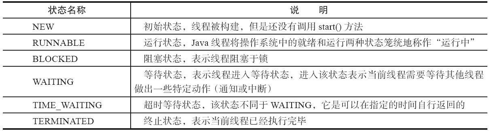

基于上面的6种，java线程状态的变迁如下：

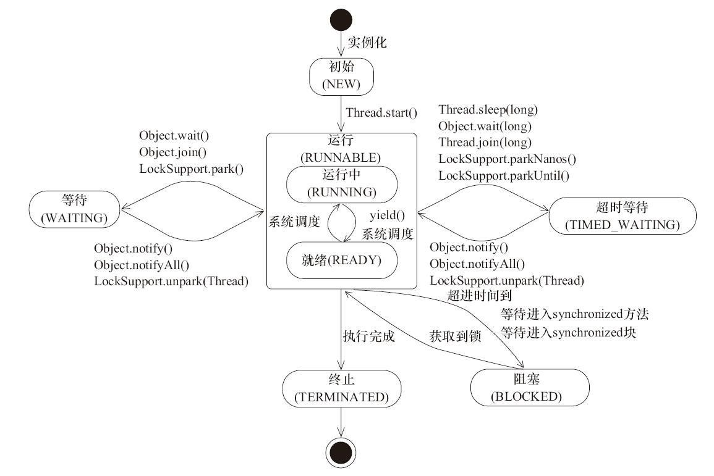

- **阻塞**：当一个线程试图获取一个内部的对象锁（非java.util.concurrent库中的锁），而该锁被其他线程持有，则该线程进入阻塞状态
- **等待**：当一个线程等待另一个线程通知调度器一个条件时，该线程进入等待状态，例如调用：Object.wait()、Thread.join()以及等待Lock或Condition

实际上不用区分两者，它们效果都一样：都是暂停线程的执行。只不过，等待状态是线程主动的，阻塞状态是线程被动的，更进一步说：等待状态是在同步代码(synchronized)之内，而阻塞状态是在同步代码(synchronized)之外！！！

## 1.2.线程优先级

Java线程优先级，表示线程的重要程度或紧急程度,优先级高的线程分配时间片的数量要多于优先级低的线程，意味着它较大概率获取到CPU的资源。线程的优先级分为1-10这10个等级，默认是5，值越大线程级别越高。Thread中提供了3个静态变量表示优先级：

```java
public final static int MIN_PRIORITY = 1;  //级别最小
public final static int NORM_PRIORITY = 5; //默认的
public final static int MAX_PRIORITY = 10; //级别最大
```

请注意，**线程的优先级与线程的执行顺序没有绝对联系**，并不是优先级高的线程一定比优先级低的线程先执行，具体还是要看能否抢到CPU资源；而且，**线程优先级不能作为程序正确性的依赖**。因为有些操作系统会忽略掉java线程对优先级的限定！！

## 1.3.启动线程

### 1.3.1.继承Thread

继承Thread类,重写run方法,调用Thread.start()方法便可以启动线程

```java
/**
 * 线程实现方式一：继承java.lang.Thread，重写run()方法
 */
public class MyThread extends Thread {
    /**
     * 线程要执行的逻辑，写在run()方法里
     */
@Override
public void run() {
        System.out.println("线程正在执行...");
    }
    public static void main(String[] args){
        /* 通过调用start()就可以开启线程 */0
        MyThread myThread = new MyThread()00;
        myThread.start();
    }
}

```

### 1.3.2.实现Runnable

实现Runnable接口,实现run方法,虽然是实现接口的方式,但是启动线程还是要先new Thread(),通过构造函数把接口对象传值,再调用start()方法启用线程。推荐使用实现Runnable接口的方式，因为用接口的方式，操作线程时更灵活。而且用接口执行线程，也可以实现共享变量...等

```java
/**
 * 线程实现方式二：实现java.lang.Runnable接口，实现run()方法
 */
public class MyThread implements Runnable {
    /**
     * 线程要执行的逻辑，写在run()方法里
     */
    @Override
    public void run() {
        System.out.println("线程正在执行...");
    }
    public static void main(String[] args){
        /* 将接口实现类传给Thread()，再调用start()方法允许线程 */
        MyThread myThread = new MyThread();
        new Thread(myThread).start();
    }
}
```

### 1.3.3.实现Callable

使用继承Thread类或实现Runnable接口，这两种方式执行线程都不能获取返回值(run()方法的返回值都定义为void)。JDK1.5以后，Java提供了Callable接口，可以获取线程执行后的返回值。要执callable接口，要么使用FutureTask，要么使用线程池:

```java
/**
 * 线程实现方式三：实现java.util.concurrent.Callable接口，实现call()方法
 */
public class MyThread implements Callable<String> {
    /**
     * 线程要执行的逻辑，写在call()方法里
     * @return 线程执行后的返回值
     */
    @Override
    public String call() throws Exception{
        return "线程执行后结果...";
    }
    public static void main(String[] args){
        // 实例化Callable接口 -> 来创建FutureTask对象 -> 创建Thread对象
        FutureTask<String> ft = new FutureTask<>(new MyThread());
        new Thread(ft).start();
        try {
            /* 通过FutureTask的get()方法获取返回值 */
            ft.get();
        } catch (InterruptedException e) {
            e.printStackTrace();
        } catch (ExecutionException e) {
            e.printStackTrace();
        }
    }
}
```

## 1.4.终止线程

在Thread中，有几个过期方法：suspend()、resume()和stop()，它们分别代表暂停、恢复和终止线程。suspend()方法调用后，线程会占有着资源(比如锁)进入睡眠状态，易引发死锁问题；而stop()方法会直接杀死线程，很有可能资源还没释放，线程就已经停掉，导致程序运行处于不确定状态。因此，当前终止线程推荐使用**中断标志位**，由我们在程序中显示确定线程还要不要执行：

```java
Thread t = new Thread(()->{
while ( !Thread.currentThread().isInterrupted() ){
      // 只有当线程的中断标志位为false时，线程才会一直运行
      // 一旦此线程的被中断了，中断标志位就会返回true，这样在下次循环时
      // 线程就会优雅地退出，并且释放资源
    }
});
t.start();
```

## 1.5.多线程共享数据

“多线程共享数据”和“线程范围内数据共享”是不同的概念：

前一个：是多个线程，一起使用同一个数据，例如卖票系统的票数、缓冲区等。

后一个：线程内的数据共享于在线程内的各个模块，而线程间的数据互不干扰。

多线程共享数据，意味着多个线程需要操作同一个对象，这样对象内的数据对于线程而言，才是共享的。当每个线程的代码逻辑都是一样的，我们就可以创建一个Runnable接口，将对象放到接口中，以该接口创建的线程就实现共享数据；当每个线程的代码逻辑不一样，那么就需要把对象独立出来，然后多个线程一起操作这个对象，切记此时对象只能实例化一个。

### 1.5.1.执行逻辑相同

如果每个线程要执行的代码是一样的，只需要创建一个实现Runnable接口的类实例，将共享数据放到实现类中

```java
public class DataRunnable implements Runnable {
    // 共享数据
    private int data;
    // 良好的编程习惯，把线程逻辑写在外部方法中
    @Override
    public void run() {
        doSomething();
    }
    // 线程执行逻辑
    public void doSomething(){
      while( data>0 ){
        System.out.println(Thread.currentThread().getName()+",取走数据,剩余："+ --data);
      }
   }
}
```

只需要创建一个DataRunnable实例，使用该实例创建线程：

```java
public static void main(String[] args) {
    // 只初始化一个Runnable实现类
    Runnable runnable = new DataRunnable(10);
    // 开启3个线程操作
    for (int i = 1; i < 4; i++) {
        new Thread(runnable,"线程"+i).start();
    }
}
```

### 1.5.2.执行逻辑不同

#### 1.5.2.1.共享数据封装在对象中

将数据封装在对象中，只实例一个共享数据对象，其他线程一起来使用这个对象作逻辑处理，就可以实现数据共享，不同的线程在各自的run方法中实现不同的代码即可。

```java
public class SharingData {
    // 共享变量
    private int id;
    private String name;
}
```

多个线程执行时，操作同一个实例对象即可：

```java
public static void main(String[] args) {
    // 线程都操作 sharingData 实例对象
    SharingData sharingData = new SharingData(1,"测试");
   // 线程1
    new Thread(()->{
        sharingData.setName("线程1");
        System.out.println(sharingData);
    },"线程1").start();

    // 线程2
    new Thread(()->{
        sharingData.setName("线程2");
        System.out.println(sharingData);
    },"线程2").start();
}
```

#### 1.5.2.2.共享数据放在外部类中

这种方式跟"将共享数据放在一个对象中类似"，只不过，它是利用了内部类都能访问外部类变量的原理：将Runnable对象当做内部类，将共享数据放在外部类上，然后定义内部类，针对外部类的共享变量实现不同线程的不同处理

```java
public class ThreadSharingWithOuterClass {
    // 定义外部类成员变量，内部类可以直接访问外部类成员变量
    private int data = 10;
    // 良好的编程习惯，把线程执行逻辑定义到外部方法中
    public void print(String name) {
        while (data > 0) {
            System.out.println(name + "->" + --data);
        }
    }
    /**
     * 定义内部类线程1
     */
    class ThreadOne implements Runnable {
        @Override
        public void run() {
            print(Thread.currentThread().getName());
        }
    }
    /**
     * 定义内部类线程2
     */
    class ThreadTwo implements Runnable {
        @Override
        public void run() {
            print(Thread.currentThread().getName());
        }
    }
}
```

初始化内部类，需要先实例化外部类，通过外部类实例对象来初始化内部类

```java
public static void main(String[] args) {
    // 初始化内部类，需要先初始化外部类，然后通过外部类实例对象初始化内部类
    ThreadSharingWithOuterClass thread = new ThreadSharingWithOuterClass();
    new Thread(thread.new ThreadOne()).start();
    new Thread(thread.new ThreadTwo()).start();
}
```

## 1.6.常用方法

### 1.6.1.join()

将当前线程挂起，让出CPU资源给指定线程执行，直至指定线程执行完，再重新请求CPU资源执行。

```java
Thread t1 = new Thread(()->{
    for(int i=1;i<6;i++){
        System.out.println("线程1执行");
    }
});
Thread t2 = new Thread(()->{
    try {
        // t2线程会挂起，让t1线程先执行，直至t1线程执行完
        t1.join();
        for(int i=1;i<6;i++){
            System.out.println("线程2执行");
        }
    } catch (InterruptedException e) {
        e.printStackTrace();
    }
});
t1.start();
t2.start();
```

执行结果：

执行结果.png)

### 1.6.2.yield()

yield()让当前线程从执行态（运行状态）变为可执行态（就绪状态），以允许具有相同优先级的其它线程获得运行的机会。但是需要注意的是，最终哪个线程能运行是靠cpu调度的，意味着当前线程有可能会再次被cpu调度而接着执行，所以yield()方法有可能没有任何效果。

```java
// 创建线程t1并启动
Thread t1 = new Thread(()->{
    for( int i=0;i<7;i++ ){
        // 当i=5的时候，t1让出cpu资源，然后和t2一起抢夺cpu调度
        // 谁抢到谁就可以执行
        if( i == 5 ){
            Thread.yield();
        }
        System.out.println("线程t1执行-"+i);
    }
});
t1.start();

// 创建线程t2并启动
Thread t2 = new Thread(()->{
    for( int i=0;i<7;i++ ){
        System.out.println("线程t2执行-"+i);
    }
});
t2.start();
```

如果yield()方法生效，即t2抢到了cpu资源，则会打印下面的结果：

执行结果.png)

t1在循环到i=5时，让出cpu资源，而t2先于t1抢到cpu资源，所以上图中可以看到t1打印到"4"的时候，t2插入打印了"0"。但是yield()并不是join()，它不会等待t2线程执行完，仍然会继续抢夺cpu资源，所以t1也会继续执行。

### 1.6.3.interrupt()

interrupt()可以标志线程的中断状态为true，它并不能中止线程的运行。使用它分为两种情况：

 ①对于阻塞的线程，调用interrupt()方法会立即抛出InterruptedException异常，并且清除此线程的中断状态

②对于正在运行的线程，调用interrupt()方法只是标志它为中断状态，并不会停止线程的运行

```java
// 对于阻塞的线程，调用interrupt()方法会抛出InterruptedException异常
Thread t1 = new Thread(() -> {
    try {
        Thread.sleep(10000);
    } catch (InterruptedException e) {
        e.printStackTrace();
    }
});

// 对于正在运行的线程，只会标志线程的中断状态，而不会停止线程的运行
Thread t2 = new Thread(()->{
    for(;;){
       // 当t2线程被中断后，控制台并不会立即退出，仍在继续运行
       // 说明interrupt()并不会中止线程的运行
    }
});

// 启动线程
t1.start();
t2.start();

// 主线程分别中断t1和t2线程
try {
    Thread.sleep(1000);
    t1.interrupt();
    t2.interrupt();
} catch (InterruptedException e) {
    e.printStackTrace();
}
```

**注意：**

​    从Java的API中可以看到，许多声明抛出InterruptedException的方法（例如Thread.sleep(long millis)方法）这些方法在抛出InterruptedException之前，Java虚拟机会先将该线程的中断标识位清除，然后抛出InterruptedException，此时调用isInterrupted()方法将会返回false！！

### 1.6.4.isInterrupted()

isInterrupted()返回指定线程的中断状态，注意此方法不会清除线程的中断状态而已，它只是作为一个判断而已：

```java
Thread t1 = new Thread(()->{
    for(;;){
        // 线程t1在此一直运行
    }
});
t1.start();
System.out.println("线程t1是否中断?"+t1.isInterrupted());
t1.interrupt();
System.out.println("线程t1是否中断?"+t1.isInterrupted());
System.out.println("线程t1是否中断?"+t1.isInterrupted());
```

### 1.6.5.interrupted()

Thread.interrupted()方法是获取当前线程的中断状态并且清除它的中断状态，意味着紧连两次调用它，第二次必定返回false

```java
Thread t1 = new Thread(()->{
    for(int i=0;i<10;i++){
        if( i == 5 ){
            // 因为t1线程未被中断，所以Thread.interrupted()返回false
            System.out.println("t1线程是否中断?"+Thread.interrupted());
            // 开始中断t1线程
            Thread.currentThread().interrupt();
            // 紧连两次调用Thread.interrupted()，第二次必定返回false，
            // 因为interrupted()方法会清除当前线程的中断状态
            System.out.println("t1线程是否中断?"+Thread.interrupted());
            System.out.println("t1线程是否中断?"+Thread.interrupted());
        } 
    }
});
t1.start();
```

### 1.6.6.setUncaughtExceptionHandler()

当线程发生未捕获异常时，又或者父线程想处理子线程的异常时，就可以给子线程设置一个回调处理器：java.lang.Thread.UncaughtExceptionHandler。当线程发生未经捕获的异常，JVM将调用Thread中的dispatchUncaughtException方法把异常传递给线程的未捕获异常处理器：

```java
Thread childThread = new Thread(()->{
    //子线程抛出未捕获异常
throw new NullPointerException("空指针exception");
}, "子线程");
//父线程可以设置一个回调处理器, 在子线程发生异常(未捕获), JVM就会自动回调它, 并传入两个参数
//发生异常的子线程和发生的异常信息..这样父线程就可以控制子线程的未捕获异常.
childThread.setUncaughtExceptionHandler((t, e)->{
    System.out.println(t.getName());
    System.out.println("抛出异常：" + e.getMessage());
});
childThread.start();
```

# 2.Java内存模型

JMM，全名是Java Memory Model，即Java内存模型。这里的Java内存模型与JVM内存模型是不同的概念，它相当于下图所示的结构：

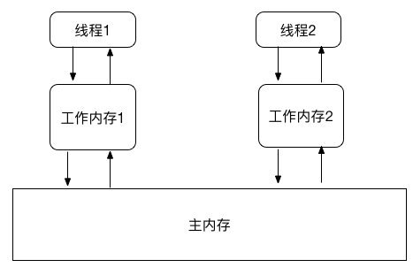

主内存中存储程序定义的变量，这个变量包括了实例变量、静态变量和构成数组对象的元素，但是不包括局部变量和方法参数（因为局部变量和方法参数是线程私有的）。主内存是多线程共享的，所有线程都可以访问主内存，每个线程不能直接在主内存中操作变量，都是从主内存中拷贝变量的副本到自己的工作内存中，对变量操作完后，再重新写入主内存中。线程只能访问自己的工作内存，不可以访问其它线程的工作内存。

## 2.1.内存交互

### 2.1.1.主内存与工作内存：交互过程

Java内存模型规定了工作内存与主内存之间交互的协议，定义了8种原子操作，

Java中所有共享变量都是以这种方式读取的：（以下8个操作每一个都是原子性）

①**lock**：锁定主内存的变量，将一个变量标识为某个线程独占的状态；

②**unclock**：释放被lock锁定的变量，释放后的变量才可以被其它线程锁定；

③**read**：将变量的值从主内存传输到线程工作内存中，以便后续的load操作；

④**load**：将read操作从主内存获取得的变量值载入工作内存的变量副本中；

⑤**use**：将工作内存中一个变量的值传递给线程的执行引擎；

⑥**assign**：将执行引擎处理返回的值重新赋值给工作内存中的变量副本；

⑦**store**：将工作内存中某个变量的值传输到主内存中，以便后续的write操作；

⑧**write**：将store操作从工作内存得到的变量的值写入主内存的共享变量中。

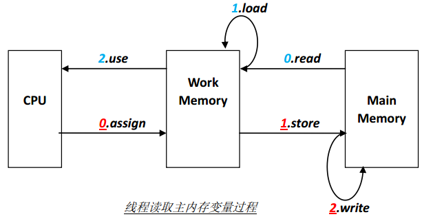

### 2.1.2.主内存与工作内存：交互规则

Java内存模型还规定在执行8种原子操作时必须满足以下规则：

- 不允许read和load之间、store和write之间只有单个操作出现，即不允许变 量从主内存读出但工作内存不接受；变量从工作内存发起写回，主内存不接受。

- 不允许线程丢弃它最近的assign操作，即**变量的值在工作内存改变了，必须要*将该变量改变后的值同步回主内存**中。

- 不允许线程没有发生过任何assign操作，就把变量的值从工作内存中同步回主内存中。

- 一个新变量只能在主内存中定义，不允许直接在工作内存使用未被初始化 (没有经过load和assign操作)的变量。

- **一个变量在同一时刻只允许一条线程对其lock锁定操作**，但lock操作可以被同一条线程重复执行多次；执行多少次load，就要执行多少次unlock，变量才会被解锁。

- 如果一个线程对一个变量执行lock操作，将会**清空该线程的工作内存中此变**量的值，在执行引擎使用此变量前，需要重新执行load和assign操作。

- 如果一个变量未被lock操作锁定，就不允许对其执行unlock操作；也不允许去unlock一个被其它线程锁定住的变量。
- 对变量执行unlock之前，必须将此变量同步回主内存(执行store和write操作)

## 2.2.JMM规定

### 2.2.1.happen-before规则

happen-before，即先行发生原则。何为先行发生？指的是JMM定义的两项操作之间的偏序关系。假设操作A和操作B，如果保证A先行发生于B，则A的操作对B是可观察的，包括修改共享数据，发送消息，调用方法..等等。反之，如果无法确保A和B哪个先行发生，则无法保障A和B之间的操作互相可观察。举个例子：

```java
// 线程A
int i = 1;

// 线程B
int j = i;

// 线程C
int i = 2;
```

假设线程A先行发生于线程B，则可以在线程B执行后，变量j值为1，能确保这个结果的原因有两个：

①根据先行发生原则，线程A的操作“i=1”可以被线程B观察到；

②线程C还未启动

但是在线程C启动，即使确保线程A先行发生于线程B，但是B与C之间没有确定的先行发生关系，线程C有可能先于B执行，也有可能后于B执行，那么线程C的操作可能被B观察到，也可能不会，这就导致B可能读取到过期数据的风险，j的值可能为1，也可能为2。

根据《深入理解Java虚拟机第2版》介绍，Java自带8种先行发生规则，如果两个操作之间不在这8个规则，并且无法从这8个规则推导出来。则这两个操作就不会有顺序保障，虚拟机可以对它们进行重排序。（换句话说：不满足先行发生原则，就可能产生多线程数据问题）

| **名称**         | **规则**                                                     |
| :--------------- | ------------------------------------------------------------ |
| 程序次序规则     | 在一个线程中，按照程序代码顺序，书写在前面的操作先行发生于书写在后面的操作。准确地说，应该是控制流顺序而不是程序代码顺序，因为要考虑分支、循环等结构。 |
| 管程锁定规则     | 一个unlock操作先行发生于后面对同一个锁的lock操作。这里必须强调是同一个锁，而“后面”是指时间上的先后顺序 |
| volatile变量规则 | 对一个volatile变量的写操作先行发生于后面对这个变量的读操作，这里的“后面”同样是指时间上的先后顺序 |
| 线程启动规则     | Thread对象的start()方法先行发生于此线程的每一个动作          |
| 线程终止规则     | 线程中的所有操作都先行发生于对此线程的终止检测，可以通过Thread.join()方法结束、Thread.isAlive()的返回等手段检测到线程已经终止执行 |
| 线程中断规则     | 对线程interrupt()方法的调用先行发生于被中断线程的代码检测到中断事件的发生，可以通过Thread.  interrupted()方法检测到是否有中断发生 |
| 对象终结规则     | 一个对象的初始化完成（构造方法执行结束）先行发生于它的finalize()方法的开始 |
| 传递性           | 如果操作A先行发生于操作B，操作B先行发生于操作C，则得出操作A先行发生于操作C的结论 |

### 2.2.2.as-if-serial语义

认识as-if-serial语义之前，先认识一个名词：指令重排序，它是编译器和处理器为了提高并行度，而会对代码指令进行重新排序。

**as-if-serial**：不管怎么重排序，（单线程）程序的执行结果不能被改变。编译器、runtime和处理器都必须遵守as-if-serial语义，为了遵守as-if-serial语义，编译器和处理器不会对存在数据依赖关系的操作做重排序，因为这种重排序会改变执行结果。但是，如果操作之间不存在数据依赖关系，这些操作就可能被编译器和处理器重排序。举个例子：

```java
double pi = 3.14; //操作A
double r = 1.0; //操作B
double area = pi*r*r; // 操作C
```

A-C，B-C之间存在数据依赖关系，因此C不能被重排序到A或B前面(C的计算要A和B的赋值，如果C排在A和B前面，程序结果会被改变)。但是A和B之间没有依赖关系，编译器和处理器可以重排序A和B 之间的执行顺序！

# 3.内存可见性-volatile

volatile是Java中的关键字，用来实现变量的可见性：即一个线程修改了被volatile修饰的变量的值，其它线程都可以看到。它是处于普通变量与加锁变量之间的维度，它不会像synchronized一样锁住变量

## 3.1.底层原理

当查看被volatile修饰的变量的汇编代码时，会发现它在前面加了个lock：

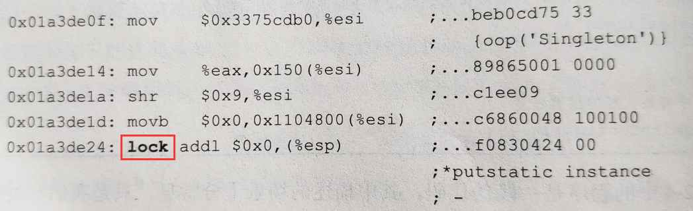

其实volatile底层就是通过汇编lock前缀指令来实现，IA-32架构软件开发者手册对lock指令的解释：

①会将当前CPU缓存行的数据**立即**写回主内存 

②写回主内存的操作会引起在其它CPU缓存了该内存地址的数据无效（MESI）

**volatile整体的原理是这样：**

多个线程在操作被volatile修饰的共享变量v时，都会将v值从主内存拷贝到各自独有的工作内存中，当其中一个线程在自己的工作内存中将v值修改了，它就立即将新v值写回主内存，同时，其它线程通过**总线嗅探机制**可以感知到数据的变化立即将自己缓存里的数据失效，重新执行read和load操作，将变量v从主内存中拷贝到工作内存里，这里依靠的是硬件级别的MESI缓存一致性原则

## 3.2.执行流程

这里借图灵学院-诸葛老师画的一张图来举例说明volatile的执行流程：

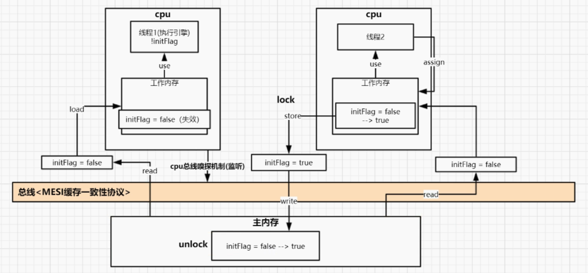

假设两个线程(CPU)并行操作共享变量initFlag，它们分别先执行了JMM规定的read和load两个原子操作将主内存数据拷贝到各自工作内存中，此时的initFlag=false，这时候线程2获取到时间片，它执行use和assign操作，将initFlag的值由false改为true，就在这个瞬间，MESI缓存一致性原则生效，线程2会立即执行store和write原子操作，将initFlag的新值写回到主内存里，同时借助总线嗅探机制的监听，会让线程1工作内存中的initFlag的内存地址失效掉(可以理解为置空了)，线程1这时候就会重新执行read和load个原子操作，重新将initFlag读回到自己的工作内存里面去，这时候执行引擎就会拿到最新值（执行引擎是一直与线程工作内存打交道的，发现工作内存的数据失效了，它也执行不了了）

 这里可能会有个疑问：线程2修改共享变量后，立即写回主内存，同时线程1由于内存失效，它也会去读主内存，如果线程1优先于线程2执行，线程1岂不是仍然读到旧值？其实不会，注意看上图，线程2在执行store和write两个原子操作之前，会对主内存的initFlag加一个缓存行锁(这个锁超级快，可以忽略不计)，在write原子操作没执行完之前，线程1如果想读取主内存的initFlag，只能先等待，这样就保证了线程1拿到的数据是最新值！

## 3.3.使用场景

volatile只能保证有序性和可见性，但无法保证原子性，所以它的使用场景：

①**确保只有一个线程操作volatile修饰的变量，其它线程都是读取而已**；

②**被volatile修饰的变量的值没有依赖于其它未控制线程安全的变量的值**。

```java
//直接在定义变量的时候加上volatile关键字
private volatile static int value = 0;
```

### 3.3.1.不保证原子性

volatile为什么不能保证原子性？举个例子，在两个线程中，对共享变量i各自进行1000次自增操作（i++不是原子操作，它实际上是三个步骤），理论上i最后值应该为2000，但实际上是小于等于2000的。根据MESI缓存一致性原则，线程1修改了变量i的值，立即使线程2缓存的变量i失效，若此时是这样：在线程2执行完use操作，执行引擎已经循环一次，准备执行assign将值写回工作内存的变量副本，但恰巧线程1先执行完assign，它会将变量i同步会主内存，导致线程2的变量副本内存地址失效了，它就重新到主内存读取，然后又交给执行引擎执行，此时的执行引擎要进行第二次循环（第一次循环由于内存失效就不起效果了）。这里就可以看出问题了，两个线程循环了3次，但实际i只自增了两次，数据就不正确了

### 3.3.2.指令重排序

Volatile虽然不能保证原子性，但是它可以防止指令重排序。何为指令重排序？


就是源代码编译成可执行机器码，会经过一系列重排序，例如：1的java编译器重排序，2和3的处理器重排序。原本代码定义的执行顺序是1-2-3,经过指令重排序后，执行顺序可能变为1-3-2，这可能导致多线程环境下可能出现问题，例如下面代码：

```java
public class Singleton {
private static Singleton singleton;
    private Singleton(){};
    public static Singleton getSingleton(){
        if( singleton == null ){
            synchronized (Singleton.class){
                if( singleton == null ){
                    singleton = new Singleton();
                }
            }
        }
        return singleton;
    }
}
```

一个看似很完美的双检锁单例，但是忽略了一个问题，就是new指令其实不是一个原子性操作，它实际操作为：

① 虚拟机遇到new指令，到常量池定位到这个类的符号引用

② 检查符号引用代表的类是否被加载、解析、初始化过

③ 虚拟机为对象分配内存

④ 虚拟机将分配到的内存空间都初始化为零值

⑤ 虚拟机对对象进行必要的设置

⑥ 将对象的引用指向这个内存区域

**归纳为三步：**

1、 JVM为对象o分配一块内存n

2、 JVM在内存n上为对象o初始化

3、 将内存地址赋值给对象o的引用

按照指令重排序，第1步一定先执行(因为2,3步依赖于第1步)，但是2和3没有依赖关系，可能执行顺序会变为1-3-2，先赋值引用再进行初始化。在上面代码中，假设有2个线程在调用方法getSingleton()。如果没发生指令重排序，Thread1抢到锁进入方法为Singleton初始化，在第3步执行之前，singleton==null一直为true，此时thread2就会在synchronized那边等待锁资源；一旦发生了指令重排序,thread1执行完第1步后直接执行第3步，将内存地址赋值给引用，这是singleton==null就会返回false，thread2就直接越过if判断，将对象返回，但此时对象仍在初始化，就极有可能抛出空指针异常。所以对于这种情况，应该为Singleton对象加上volatile修饰，防止其指令重排序，其原理是内存屏障！！！

# 4.线程互斥-synchronized

Java中线程互斥，可以使用**synchronized**关键字，它是一种互斥锁，是由JVM控制的（区别JUC下的Lock，它是人为控制）。之前synchronized都被称为重量级锁，随着Java SE 1.6对其优化，引入了偏向锁和轻量级锁，使其性能与JUC下的Lock性能相当，只不过Lock比synchronized多了额外功能，在同等场景下，优先使用synchronized！！！

## 4.1.使用方式

明确一点，synchronized需要锁住一个对象，所以怎么使用synchronized，就是区分锁住什么对象？下面是4种synchronized的用法

### 4.1.1.修饰代码块

修饰代码块，被修饰的代码块称为同步语句块，其作用的范围是花括号{}包裹起来的代码，锁住的对象是调用这个代码块的对象。所以，多个线程在执行时就需要用这个对象作为线程共享变量（以便可以竞争同一把锁）。

```java
public class SynchronizedForCodeDiv implements Runnable {
    // 模拟：线程的共享变量
    private int ticket = 77;
    // run()代表线程要做的事
    @Override
    public void run() {
        /**
         * 如果去掉 synchronized，3个线程竞争cpu资源，执行结果时线程交叉打印 ticket 递减
         * 的值；如果加上 synchronized，3个线程只有一个可以拿到 MyThread 对象的锁，执行结
         * 果时一个线程从77打印到1
         */
        // 未被synchronized锁住的代码
        System.out.println(Thread.currentThread().getName() + "开始执行");
        synchronized ( this ){
            while (ticket > 0) {
                System.out.println(Thread.currentThread().getName() + ":" + ticket--);
            }
        }
        // 未被synchronized锁住的代码
        System.out.println(Thread.currentThread().getName() + "结束执行");
    }
    public static void main(String[] args) {
    // 实例化 SynchronizedForStaticMethod 对象，该对象就有一个同步锁，用此对象创建的线程相
    // 互之间才会互斥。如果创建多个 SynchronizedForStaticMethod 对象，这些对象就各自拥有自
    // 己的同步锁，由这些对象创建的线程就不会互斥。
    SynchronizedForStaticMethod myThread = new SynchronizedForStaticMethod();
    // 开启3个线程,谁抢到锁,谁就去执行
    new Thread(myThread, "线程1").start();
    new Thread(myThread, "线程2").start();
    new Thread(myThread, "线程3").start();
    }
}
```

上面代码synchronized锁住的this，就是指一个Mythread实例对象，当用同一个实例对象创建线程时，线程之间才会起到互斥的作用；因为synchronized只锁定对象，每个对象只有一个锁与之相关联，但是如果创建两个Mythread实例对象，会有两把锁分别锁定这两个对象，这两把锁之间是互不干扰的，不形成互斥，使用这两个对象创建的线程之间，就不会有互斥效果。

**上面代码的执行逻辑：**

①线程1、线程2、线程3一起启动，准备竞争CPU资源

②哪个线程抢到CPU资源它就获得锁，就执行它的run()方法逻辑

③剩下两个线程就挂起等待，坐等锁资源的释放

④当抢到锁的线程执行完synchronized包裹起来的代码后，就会释放锁，剩下线

 程就可以执行未被synchronized包裹起来的代码

**synchronized只对指定代码块加锁：**

一个类中如果既有synchronized修饰的代码块也有非synchronized代码块，当一个线程访问一个对象的synchronized代码块时，别的线程可以访问该对象的非synchronized代码块而不会受阻塞（但是只能访问同步代码块之前的代码）。当然synchronized加锁的对象肯定不限制为this， 当有一个明确的对象作为锁时，可以使用下面这种方式:

```java
public void getApp(Object obj){
    synchronized (obj){
    }
}

```

如果没有明确的对象作为锁，只是想让一段代码同步时，可以创建一个特殊的对象来充当锁。实践证明：零长度的**byte数组对象**创建起来将比任何对象都实惠，查看它编译后的字节码：生成零长度的byte[]对象只需3条操作码，而Object lock = new Object()则需要7行操作码:

```java
private byte[] lock = new byte[0];
public void getApp(){
    synchronized (lock){
    }
}
```

### 4.1.2.修饰方法

synthronized修饰方法和修饰代码块的效果差不多，只不过代码块的作用范围是在花括号{}之内，而方法的作用范围则是在函数体内。在修饰方法时，synchronized放在方法访问权限和方法返回值之间，如：

```java
public synchronized void run(){
    
}
```

**需要注意的问题:**

①synchronized关键字不能继承。意思就是父类的方法使用了synchronized关键字，子类的方法重写父类方法，除非子类方法自己显式声明synchronized，否则是不会有互斥效果；当然，如果子类在重写的方法中调用了父类的方法，即使没有synchronized也会有互斥效果。

②synchronized不能修饰接口方法

③synchronized不能修饰构造方法，但可以用synchronized代码块包裹构造方法 内的代码

### 4.1.3.修饰静态方法

由于静态方法是属于类的，所有该类的实例对象都可以访问，所以当synchronized修饰静态方法时，是在类级别上加锁，即所有的实例对象都是同一把锁，该类所有实例对象都会有互斥效果。语法为：public synchronized static void run(){}，将synchronized关键字放在方法访问权限关键字和static关键字之间

```java
public class SynchronizedForStaticMethod implements Runnable {
    private static int ticket = 77;
    // run()代表线程要做的事
    @Override
    public void run() {
        /**
         * 当修饰static方法时,是在类级别上加锁,该类所有的实例对象都会存在互斥效果
         * 加锁的范围仅限于synchronized的方法之内,意味着方法之外的代码可以被其它
         * 未抢到锁的线程执行
         */
        System.out.println(Thread.currentThread().getName() + "开始执行");
        print();
        System.out.println(Thread.currentThread().getName() + "结束执行");
    }
    /**
     * synchronized修饰静态方法,关键字放在public和static之间,表示整个方法处于互斥状态
     */
    public synchronized static void print() {
        while (ticket > 0) {
            System.out.println(Thread.currentThread().getName() + ":" + ticket--);
        }
    }
    public static void main(String[] args) {
        // synchronized修饰类的静态方法,是在类级别上加锁(静态方法不属于任何一个实例对象)
        // 所以无论创建多少个实例对象,它们都是同一把锁,该类所有实例对象都会产生互斥效果
        SynchronizedForStaticMethod myThreadOne = new SynchronizedForStaticMethod();
        SynchronizedForStaticMethod myThreadTwo = new SynchronizedForStaticMethod();
        SynchronizedForStaticMethod myThreadThree = new SynchronizedForStaticMethod();
        // 开启3个线程,谁抢到锁,谁就去执行
        new Thread(myThreadOne, "线程1").start();
        new Thread(myThreadTwo, "线程2").start();
        new Thread(myThreadThree, "线程3").start();
    }
}
```

静态方法操作的是静态变量，静态变量同样是属于类的，不属于某个实例对象所有，当把静态变量修改后，每个实例对象都会获取到修改后的值。因此，当抢到锁的线程把print()方法执行完，ticker的值变为0，释放锁后其它线程抢夺该锁，但由于ticket的值已经变为0，所以就算抢到锁，也不会执行print()方法，因为循环条件不满足了。

### 4.1.4.修饰类

synchronized修饰类时，是对该类的类类型加锁，由于一个类只有一个类类型，所以该类的所有实例对象共用同一把锁，意味着该类的所有实例对象都会互斥。synchronized修饰类时，语法与一样，为：synchronized(T.class){}。效果与修饰静态方法一样，类级别加锁

```java
public class SynchronizedForClass implements Runnable{
    // 如果ticket改为静态类型,private static int ticket = 77 会有不一样的效果
    private int ticket = 77;
    // run()代表线程要做的事
    @Override
    public void run() {
        /**
         * synchronized修饰类,即对类的类类型加锁,由于一个类只有一个类类型,所以该类的所有实
         * 例对象都会互斥，加锁的范围仅限于synchronized包裹起来的代码块，未被包裹的代码可
         * 以被其它未抢到锁的线程执行
         */
        System.out.println(Thread.currentThread().getName() + "开始执行");
        print();
        System.out.println(Thread.currentThread().getName() + "结束执行");
    }
    /**
     * synchronized修饰类，就是对类的类类型加锁,该类所有对象都会互斥,效果与修改静态方法一样.
     * 但是,要注意方法逻辑操作的是局部变量?还是成员变量?还是静态变量,不同变量打印效果不一样
     */
   
public void print() {
        synchronized (SynchronizedForClass.class) {
            while (ticket > 0) {
                System.out.println(Thread.currentThread().getName() + ":" + ticket--);
            }
        }
    }
    public static void main(String[] args) {
        // synchronized修饰类时,是对类的类类型加锁,由于一个类只有一个类类型,所以无论
        // 创建多少个实例对象,它们都是同一把锁，该类所有实例对象都会产生互斥效果。
        SynchronizedForClass myThreadOne = new SynchronizedForClass();
        SynchronizedForClass myThreadTwo = new SynchronizedForClass();
        SynchronizedForClass myThreadThree = new SynchronizedForClass();
        // 开启3个线程,谁抢到锁,谁就去执行
        new Thread(myThreadOne, "线程1").start();
        new Thread(myThreadTwo, "线程2").start();
        new Thread(myThreadThree, "线程3").start();
    }
}
```

synchronized修饰静态方法和修饰类的效果虽然一样，但是还是有所区别，就在于方法逻辑操作哪一种类型的变量。当方法逻辑操作的是静态变量，所以无论创建多少个实例对象，只要其中一个实例对象把静态变量的值改了，其它实例对象获取到的静态变量的值都是修改后的；而当方法逻辑操作的是成员变量，创建多少个实例对象，就有多少个成员变量，每个实例对象的成员变量都是互不干扰的。这就导致了虽然synchronized修饰静态方法和修饰类类型都是对类级别加锁，但是修饰静态方法时，先抢到锁的线程执行完方法逻辑后，静态变量值被改变了，其它线程就算抢到锁，也不会执行方法逻辑；而修饰类类型时，先抢到锁的线程执行完方法逻辑后，只是改变当前实例对象的成员变量，其它线程抢到锁后，获取的是它自己的成员变量值，与上一个线程修改的成员变量无关。

### 4.1.5.总结

①无论synchronized关键字加在方法上还是对象上，如果它作用的对象是非静态的，则它取得的锁作用于对象；如果synchronized作用的对象是一个静态方法或一个类，则它取得的锁是类，该类所有的对象同一把锁。

②每个对象只有一个锁（lock）与之相关联，谁拿到这个锁谁就可以运行这个锁控制的那段代码。 

③实现同步是要很大的系统开销作为代价的，甚至可能造成死锁，所以尽量避免无谓的同步控制

## 4.2.底层原理

《Java并发编程的艺术》一书指出：Synchonized的实现原理是基于进入和退出Monitor对象（Monitor又依赖于底层操作系统的mutex Lock来实现方法同步和代码块同步，但两者的实现细节不一样。代码块同步是使用monitorenter和monitorexit指令实现的（显式），而方法同步是使用方法修饰符ACC_SYNCHRONIZED（隐式）实现！！

### 4.2.1.monitor机制

在操作系统中，semaphore信号量和mutex互斥量是最重要的同步原语，在此基础上提出monitor机制，需要注意，操作系统本身不支持monitor机制，它是属于编程语言的范畴。因此在使用monitor时，需要先了解下编程语言是否支持，例如：C语言不支持monitor，java语言支持monitor。 如下monitor机制的示意图，分为三部分：

1. entry set — 等待进入临界区的线程

2. the owner — 临界区

3. wait set  — 等待条件变量的线程

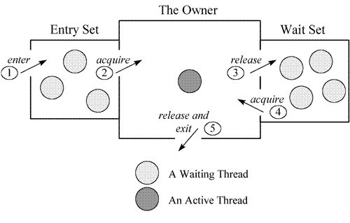

monitor机制最大的特点就是：同一时刻，只有一个线程可以进入临界区，其它线程都会被阻塞。entry set好理解，就是线程来到临界区，发现有线程已经进入临界区了，它就会在entry set阻塞等待；而wait set是这样：是线程已经进入临界区，但是条件不匹配(类似生产者-消费者模型)，它就会从临界区出来，进入wait set阻塞等待条件的满足，这个即Object类的wait()和notify()方法！！！等到进入临界区的线程出来后，entry set和wait set的线程就会共同竞争CPU，以获取进入临界区的资格！！！以上就是synchronized基于monitor机制实现的线程互斥效果，可以看出实现monitor机制需要3个元素：

1. 临界区

2. monitor 对象及锁

3. 条件变量以及定义在 monitor 对象上的 wait，signal 操作

 这个临界区反映到Java层面，就是synchronized包裹的代码块或修饰的方法.而这个monitor对象映射到Java层面，就是synchronized锁住的对象前面的4种用法。Java虚拟机给每个对象都内置了一个监听器Monitor，当且一个monitor被持有后，它将处于锁定状态，Java会保存锁标识，将其保存到monitor对象的对象头上！！

### 4.2.2.对象头

都知道synchronized是锁住对象，那到底它是锁的是什么对象？又或者说它锁住对象的什么东西？实际上，synchronized用的锁是保存在Java对象头里面！！JVM使用3个字宽存储数组对象，使用2个字宽存储非数组对象，数组对象会多出一个字宽用来存储array length(数组长度)；在32位计算机中，一个字宽等于32位(bit)，而在64位计算机中，一个字宽等于64位(bit)。


java对象头里的mark word默认存储对象的hashCode、分代年龄和锁标记位。在32位JVM的mark word的默认存储结构为：


对象头信息与对象自身的数据是没有任何关系，属于额外的存储成本，所以JVM设计的时候会将mark word设计成非固定的数据结构，它会随着锁的状态而改变自身存储空间，如32位JVM下，除了上面Mark Word默认存储结构外，还有如下可能变化的结构：

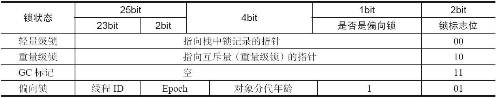

Mark Word总结：

1. 锁标志位为01，判断是否偏向锁位，为0表示无锁，为1表示偏向锁；

2. 锁标志位为00，表示轻量级锁；

3. 锁标志位为10，表示重量级锁。

### 4.2.3.锁升级

由于java线程是映射到操作系统的原生线程上，如果要阻塞/唤醒一条线程，都需要操作系统来帮忙，这就要涉及到用户态和内核态的切换，所以需要耗费大量CPU时间，这就是synchronized被称为重量级锁的原因；但是，从jdk1.6开始，为了解决synchronized的性能消耗，引入了“偏向锁”和“轻量级锁”。此时开始，JVM的锁级别分为：无锁→偏向锁→轻量级锁→重量级锁。锁级别会随着竞争情况逐渐升级，但不能降级，例如偏向锁升级成轻量级锁后，不能降级成偏向锁！！！

#### 4.2.3.1.偏向锁→轻量级锁

先记住这点：偏向锁使用了一种等到竞争出现才释放锁的机制，所以当其他线程尝试竞争偏向锁时，持有偏向锁的线程才会释放锁。

**获取偏向锁过程：**

1. 假设synchronized锁住了对象OBJECT_LOCK，OBJECT_LOCK的对象头刚开始处于无锁状态，即01；

2. 线程A访问同步代码块，先校验OBJECT_LOCK对象头的线程ID是不是指向它自己。显然不是(当前无锁状态)，线程A就用CAS更改OBJECT_LOCK对象头信息，将线程ID指向它，同时将是否偏向锁标志位修改为1。锁升级为偏向锁！

3. 线程A继续访问同步代码块，发现对象头线程ID指向它自己，它就可以继续执行同步代码块，而不需要再获取锁了，所以偏向锁效率很高！

4. 线程B也访问同步代码块，它也是先校验OBJECT_LOCK对象头的线程ID，发现不是指向它，接着判断Mark Word中偏向锁的标识是否设置成1（表示当前是偏向锁）：如果没有设置，则使用CAS竞争锁；如果设置了，则尝试使用CAS将对象头的偏向锁指向当前线程；

5. 出现竞争了，JVM会等到全局安全点(在这个时间点上没有正在执行的字节码)，才会撤销偏向锁，过程如下：暂停拥有偏向锁的线程，即线程A，然后检查它是否活着。若线程A处于死亡状态，修改锁标志位为无锁，重新将其偏向线程B的ID；若线程A仍然活跃，撤销偏向锁升级为[轻量级锁](#4.2.3.2.轻量级锁→重量级锁)

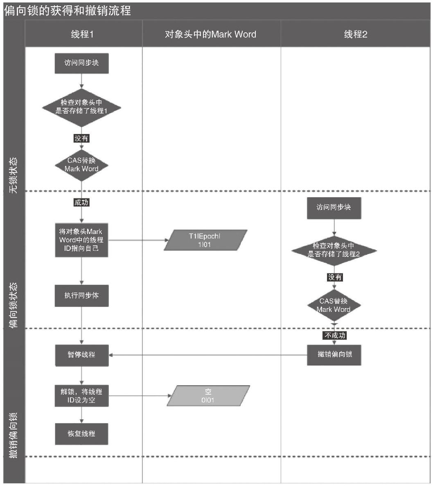

**关闭偏向锁**

偏向锁在Java 6和Java 7里是默认启用的，但是它在应用程序启动几秒钟之后才激活，如有必要可以使用JVM参数来关闭延迟：-XX:BiasedLockingStartupDelay=0；如果你确定应用程序里所有的锁通常情况下处于竞争状态，可以通过JVM参数关闭偏向锁：-XX:-UseBiasedLocking=false，那么程序默认会进入轻量级锁状态。

#### 4.2.3.2.轻量级锁→重量级锁

1. 线程在执行同步块之前，JVM会先在当前线程的栈桢中创建用于存储锁记录的空间，并将对象头中的Mark Word复制到锁记录中，官方称为Displaced Mark Word

2. 线程尝试使用CAS将monitor对象头中的Mark Word替换为指向锁记录的指针。如果成功，当前线程获得锁；如果失败，表示其他线程竞争锁，当前线程便尝试使用自旋来获取锁

3. 若当前只有一个等待线程，则可通过自旋稍微等待一下，可能另一个线程很快就会释放锁。但是当自旋超过一定的次数，或者一个线程在持有锁，一个在自旋，又有第三个来访时，轻量级锁膨胀为重量级锁

4. 当升级为重量级锁时，其他线程试图获取锁，都会被阻塞住（不再是自旋了），当持有锁的线程释放锁之后会唤醒这些线程，被唤醒的线程就会进行新一轮的夺锁之争

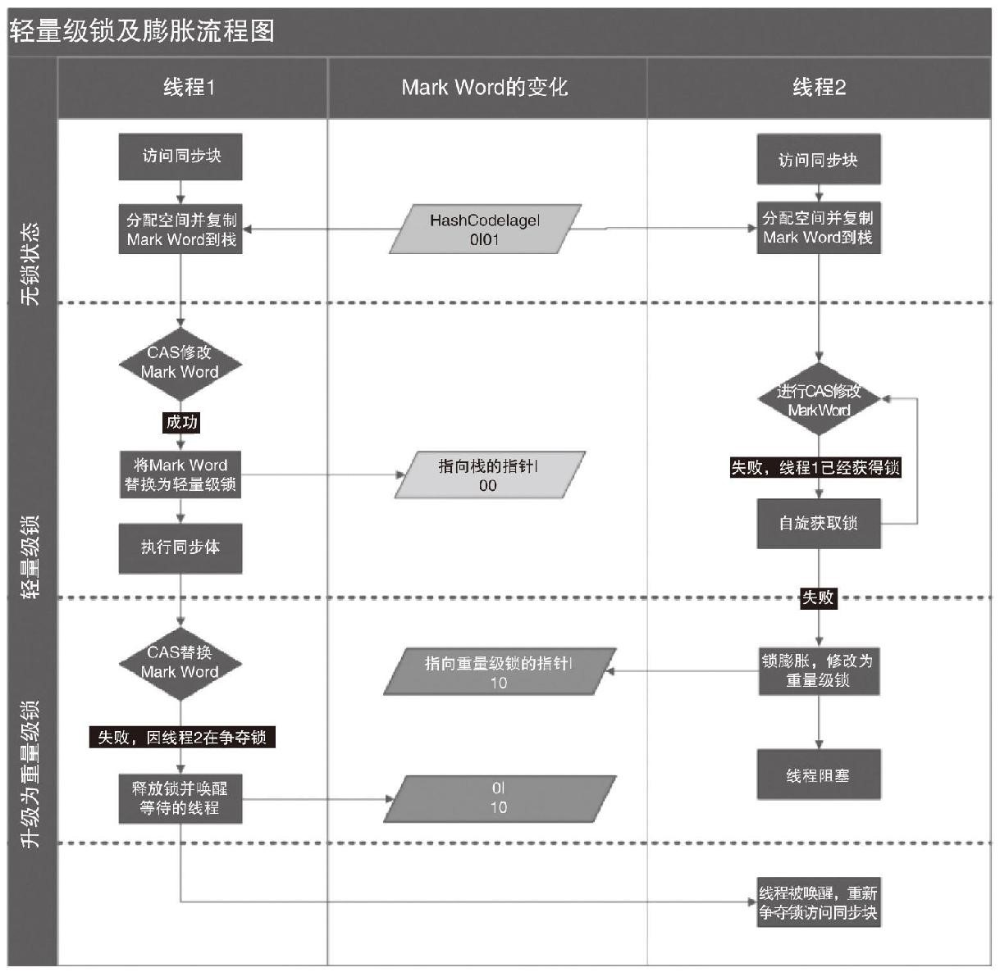

**轻量级锁的解锁过程：**

1. 通过CAS操作尝试把线程中复制的Displaced Mark Word对象替换当前monitor对象的Mark Word；

2. 如果替换成功，整个同步过程就完成了；

3. 如果替换失败，说明有其他线程尝试过获取该锁（此时锁已膨胀），就要在释放锁的同时，唤醒被挂起的线程

# 5.线程本地变量-ThreadLocal

什么叫线程范围内数据共享？即：对于相同的程序代码，模块或对象在一个线程中运行时要共享一份数据，在另一个线程中运行时又共享另外一份数据，而且线程之间的运行数据是互不干扰的。**例如：** 处理数据库中事务管理器较为常用，所有的操作都是针对同一个数据源，不同的线程之间有不同的事务，互不干扰。

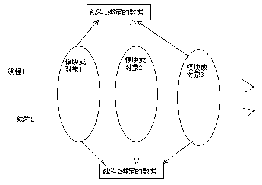

## 5.1使用方式

ThreadLocal，叫做线程本地变量，或者线程本地存储。它可以为每个线程拷贝一份共享变量的副本，这样线程之间的共享变量的值就是相互独立的。正是由于每一个线程都拥有自己的变量副本，从而也没有必要为该变量加锁了。但是由于ThreadLocal一次只能保存一个变量，对于有多个变量需要保存的，可以将变量定义在对象里，然后把这个对象保存到ThreadLocal中。

```java
// 定义一个ThreadLocal用来保存Data对象，它不需要做同步处理
private static ThreadLocal<ThreadData> threadLocal = new ThreadLocal<>();
public static void main(String[] args) {
    // 开启两个线程
    new Thread(() -> {
        ThreadData data = new ThreadData(1, "线程1的变量");
        System.out.println("线程1赋值："+data);
        // 将线程1的变量放到threadLocal中
        threadLocal.set(data);
        // 打印信息
        new PrintA().print();
        new PrintB().print();
    }, "线程1").start();

    new Thread(() -> {
        ThreadData data = new ThreadData(2, "线程2的变量");
        System.out.println("线程2赋值："+data);
        // 将线程2的变量放到threadLocal中
        threadLocal.set(data);
        // 打印信息
        new PrintA().print();
        new PrintB().print();
    }, "线程2").start();
}
// 创建内部类A模拟模块1的使用
static class PrintA {
    public void print() {
        // 通过threadLocal获取线程本地变量
        ThreadData threadData = threadLocal.get();
        System.out.println(Thread.currentThread().getName() + "-> A模块 ->" + threadData);
    }
}

// 创建内部类B模拟模块2的使用
static class PrintB {
    public void print() {
        // 通过threadLocal获取线程本地变量
        ThreadData threadData = threadLocal.get();
        String name = Thread.currentThread().getName();
        System.out.println(name + "-> B模块 ->" + threadData);
    }
}
```

## 5.2.内存泄露问题

​	要想知道ThreadLocal为啥内存泄漏，就要先了解它的原理。其实，每个线程Thread内存都维护了一个ThreadLocalMap，ThreadLocal本身不存储数据，它只是作为一个key存储到线程Thread的ThreadLocalMap中（注意这个key是一个弱引用WeakReference），这点可以看ThreadLocal的源码就知道了。

​	所以，一旦引用ThreadLocal的对象被回收了，则ThreadLocal对象也会被回收（弱引用会在系统GC的时候被回收），此时ThreadLocalMap的value就会访问不到，因为它相应的key为null，但是由于存在这样一条引用关系链：Thread ref →Thread→ThreadLocal→entry→value而不会被回收，造成内存泄漏！为了防止内存泄漏，最佳方法：每次使用完ThreadLocal，都调用它的remove()方法，清除数据。（就跟锁机制一样，加一次锁就要解一次锁）

## 5.3.扩展点

### 5.3.1.ThreadLocal对比Synchronized

synchronized和threadLocal有着各自的使用场景，它们的共同点都是为了线程安全，synchronized通过加锁的方式保证线程的串行执行，而threadLocal通过拷贝共享变量到线程本地副本中，保证线程操作共享变量不会乱套。所以，当线程间操作共享变量没有依赖关系 ，则用ThreadLocal既然保证线程安全，又能保证执行效率；但是，当线程间操作共享变量存在依赖关系，例如抢票系统，上一个线程的执行结果会影响到当前线程的票数，这时候就要用synchronized。又例如线程通信，这一定要用synchronized。

### 5.3.2.可继承的ThreadLocal

​	了解这一知识点之前，需要先知道一个概念：什么是父子线程？在一个线程Thread的run()方法中新起一个线程Thread，这两个线程就达成了父子关系。其中，run()方法内创建的线程为子线程。在使用ThreadLocal时候，子线程无法获取父线程保存的变量副本，例如：

```java
new Thread(()->{
    threadLocal.set("测试数据");
    System.out.println(Thread.currentThread().getName()+"-"+threadLocal.get());
    new Thread(()->{
        System.out.println(Thread.currentThread().getName()+"-"+threadLocal.get());
    },"子线程").start();
},"父线程").start();
```

执行结果：


若要求子线程能够获取父线程的变量副本，就要使用InheritableThreadLocal类。这个类是JDK提供的工具类，原理跟ThreadLocal一样，都是操作Thread类中的ThreadLocalMap，源码如下：

```java
/* ThreadLocal values pertaining to this thread. This map is maintained
* by the ThreadLocal class. */
ThreadLocal.ThreadLocalMap threadLocals = null;

/*
 * InheritableThreadLocal values pertaining to this thread. This map is
 * maintained by the InheritableThreadLocal class.
 */
ThreadLocal.ThreadLocalMap inheritableThreadLocals = null;
```

只不过InheritableThreadLocal类操作的不是threadLocals而是下面那个成员变量inheritableThreadLocals。至于为啥操作inheritableThreadLocals这个变量就能达到父子线程共用变量副本，就要阅读Thread类中的init()方法，截取部分源码如下：

```java
if (inheritThreadLocals && parent.inheritableThreadLocals != null)
            this.inheritableThreadLocals =
                ThreadLocal.createInheritedMap(parent.inheritableThreadLocals);
```

# 6.传统线程通信

一个系统内，线程不可能各干各的，它们之间需要相互交换数据，甚至需要在条件不满足时等待其它线程执行完，这就需要线程能够相互通信。Java中实现线程通信，依赖于通知等待机制！

## 6.1.通知等待机制

通知等待机制：一个线程A调用了对象O的wait()方法进入等待状态，而另一个线程B调用了对象O的notify()或者notifyAll()方法，线程A收到通知后从对象O的wait()方法返回，进而执行后续操作。

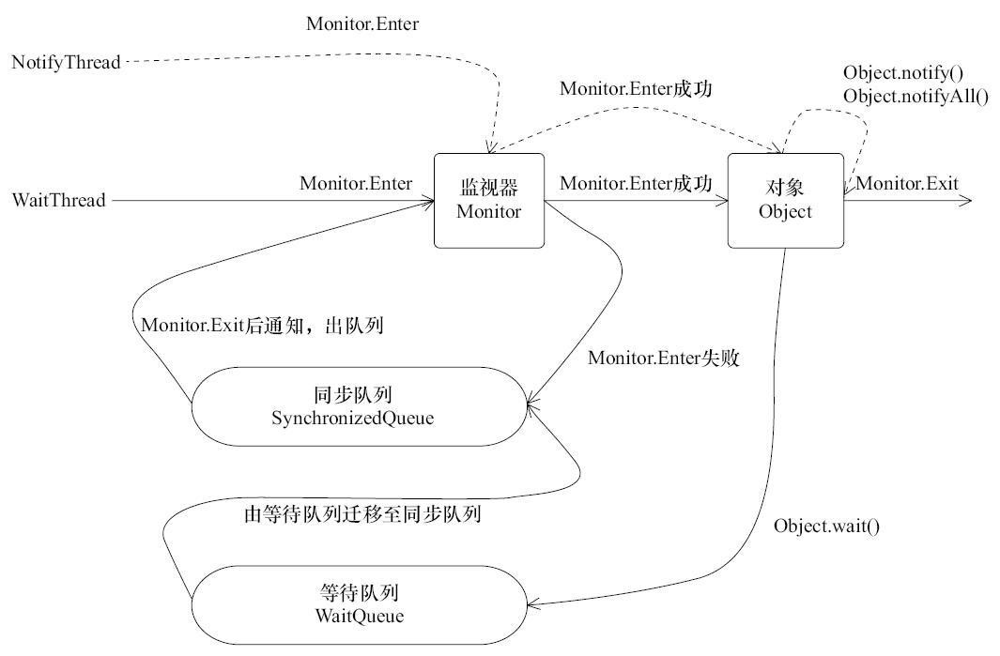

​	通知等待机制依赖于同步机制，当线程WaitThread获取到对象Object的monitor监视器，进入到临界区(同步代码块)执行，当执行到对象Object的wait()方法时，线程状态由RUNNING改为WAITING，并放置到对象Object的等待队列中，同时线程WaitThread会释放锁；

​	由于锁释放，线程NotifyThread有机会获取对象Object的monitor监听器，进入临界区执行代码，当执行到对象Object的notify()，就把位于等待队列中的线程WaitThread迁移到同步队列中SynchronizedQueue中，将其状态由WAITING改为BLOCKED(若执行notifyAll()，会把位于对象Object等待队列中的线程迁移到同步队列)，等到线程NotifyThread执行完并且释放锁(Monitor.exit)，位于同步队列中的线程开始抢夺CPU资源进入临界区！

## 6.2.线程通信方式

### 6.2.1.基本方法

在Java中，通过调用对象的wait()、notify()、notifyAll()来实现线程间的通信，这个对象就是线程通信的调度者！

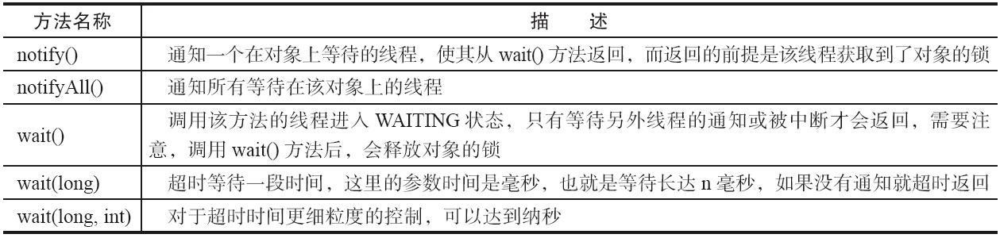

**注意点：**

1. 线程通信方法是定义在超类Object，所以每个Java对象都可以作为调度者；使用以上方法需要对调度者加锁，即用synchronized锁住此对象；

2. 调用notify()或notifyAll()方法后，等待线程依旧不会从wait()返回，需要调用notify()或notifAll()的线程释放锁之后，等待线程才有机会从wait()返回；

3. 调用wait()方法后，线程状态由RUNNING变为WAITING，并将当前线程放置到 对象的等待队列；

4. notify()方法将等待队列中的一个等待线程从等待队列中移到同步队列中，而notifyAll()方法则是将等待队列中所有的线程全部移到同步队列，被移动的线程状态由WAITING变为BLOCKED；

5. 线程能从wait()方法返回的前提是获得了调用对象的锁；

6. 推荐使用notifyAll()，唤醒所有等待线程，由CPU决定哪个线程执行。

### 6.2.2.实际用例

1. 通过调用线程间共享变量的wait()方法来释放锁，暂停当前线程的执行，例如:在生产者消费者问题中，这个共享变量就是缓冲区队列

2. 既然应该在synchronized的方法或是对象里调用wait()，哪个对象应该被synchronized？答案是，那个在多个线程间被共享的对象，例如: 在生产者消费者问题中，应该被synchronized的就是缓冲区队列。 **注意：**使用wait()时，一定要保证synchronized锁住的对象和调用wait()的对象是同一个，否则会抛出IllegalMonitorStateException异常；

3. 永远在循环（while）里调用 wait()，而不是在 If 语句

```java
// util是线程间的共享变量，通过synchronized对其加锁营造互斥状态
synchronized (util){
    // 当条件不满足时当前线程就等待，必须在while循环中判断条件
    while( util.isFlag() == true ){
        try {
            util.wait();
        } catch (InterruptedException e) {
            e.printStackTrace();
        }
    }
    // 如果代码未进入到while循环,说明条件满足，当前线程执行自身逻辑
    util.print();
    // 线程执行完自身逻辑后，改变共享变量的状态；同时调用notifyAll()
    // 唤醒其它线程
    util.setFlag(true);
    util.notifyAll();
}
```

### 6.2.3.诡异的IllegalMonitorStateException

​	IllegalMonitorStateException这个异常有点诡异，通常会在我们使用wait()和notifyAll()方法的时候出现。都知道使用wait()方法需要使用synchronized营造同步状态，但是如果我们使用Boolean、Integer、String来作为加锁对象，就一定会出现这个问题，因为当改变加锁对象的值，其实创建了一个新的对象，而synchronized只是对旧的对象加锁，新的对象未加锁，意味着它没有处于同步状态，此时调用wait()、notifyAll()、notifyAll()就会报错。

​    解决这一问题的方法很多：①使用基本类型，由实例对象的setter/getter方法来改变变量的值，synchronized加锁的是该实例对象；②使用java提供的同步包java.util.concurrent.atomic里面的同步类来加锁，例如下例可以改为使用布尔同步类AtomicBoolean替换掉包装类Boolean。

```java
private volatile Boolean flag = true;
public void mainPrint()  throws InterruptedException {
    synchronized (flag) {
        while (flag == false) {
            flag.wait();
        }
        // 将flag 赋值为false的时候，其实创建了一个新的Boolean对象
        flag = false;
        flag.notifyAll();
    }
}
```

