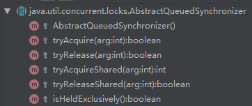
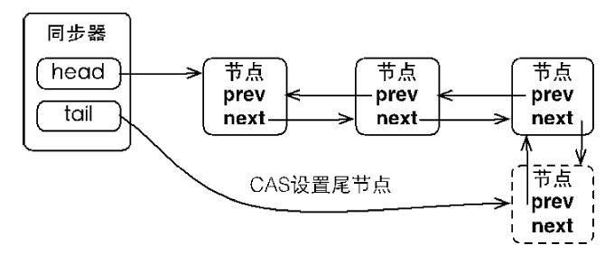
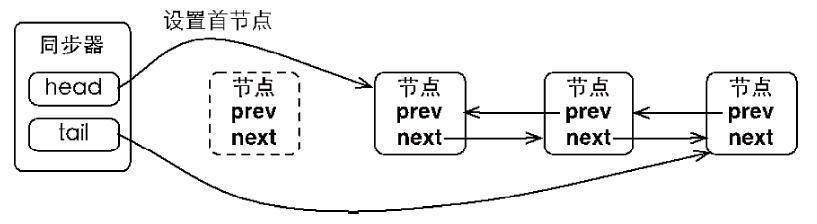
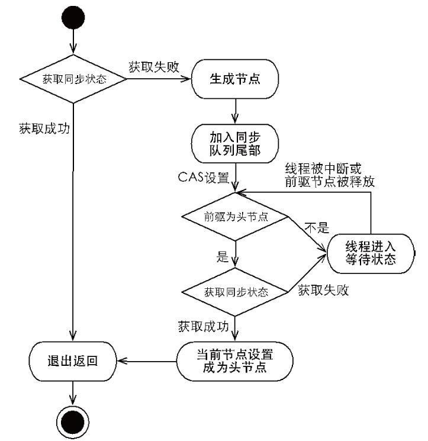
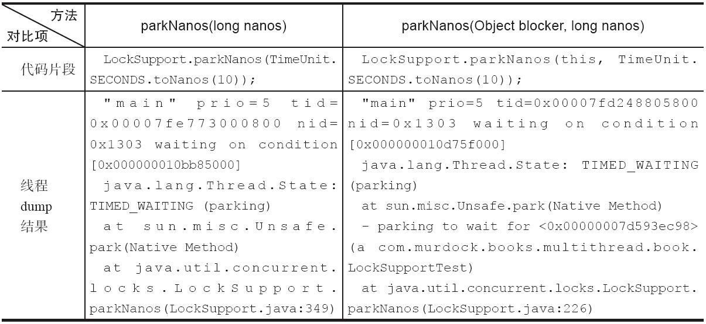

# 1.同步队列器AQS

AQS，即AbstractQueuedSynchronizer，被称为队列同步器，它通过定义一个int成员变量表示同步状态，通过内置的FIFO队列来完成线程的排队工作（即锁）如果说CAS算法是java并发包的思想，那么AQS就是基于CAS算法的锁的实现。它完美地运用了模板模式，让子类自定义实现如下方法，其余操作它都实现了！



## 1.1.内部结构

AQS定义了2个内部静态类，一个是Node类，另一个是ConditionObject类。

### 1.1.1.Node

​	Node类是AbstractQueuedSynchronizer的一个内部静态类（不可继承），它是构成CLH队列的基础元素，包含了获取同步状态**失败**的线程引用、等待状态、前驱节点和后继节点，一个Node即表示一个线程；

​	当前线程获取同步状态失败时，同步器会将当前线程以及等待状态等信息构造成为一个节点（Node）并将其加入CLH队列，同时会阻塞当前线程，当同步状态释放时，会把首节点中的线程唤醒，使其再次尝试获取同步状态。源码如下：

```java
static final class Node {
    // 标识当前Node处于共享模式
    static final Node SHARED = new Node();
    
    // 标识当前Node处于独占模式
    static final Node EXCLUSIVE = null;
    
    // 以下4个变量是  Node成员变量waitStatus的取值
    static final int CANCELLED =  1;
    static final int SIGNAL    = -1;
    static final int CONDITION = -2;
    static final int PROPAGATE = -3;

    /** waitStatus定义了线程的等待状态, 它有5种取值：
        1.CANCELLED, 值为1, 此Node代表的线程由于等待超时或者被中断, 从同步队列中取消等待,
                     不会再尝试获取锁, Node一旦进入这个状态便不会再改变;
        2.SIGNAL, 值为-1, 此Node的后继节点表示的线程处于等待状态, 需要被唤醒;再当前Node
                  的线程释放同步状态或被取消, 唤醒后继结点的线程, 使其继续运行;
        3.CONDITION, 值为-2, 此Node位于等待队列中, 其代表的线程等待condition线程条件的唤
                     醒, 当其它线程调用Condition.signal(), 该结点从等待队列转移到同步队列
                     加入对同步状态的竞争;
        4.PROPAGATE, 值为-3, 表示下一次的共享状态会被无条件的传播下去;
        5.默认值, 为0, 表示初始状态
    */
    volatile int waitStatus;

    // 当前Node的前驱结点 */
    volatile Node prev;

    // 当前Node的后继结点
    volatile Node next;

    // 当前Node代表的线程
    volatile Thread thread;

    // 用于Condition环境下, 表示等待队列中的后继结点; 如果当前Node处于共享模式, 
    // 此字段值为SHARED常量
    Node nextWaiter;

    /*
     * 如果节点在共享模式下等待，则返回true
     */
    final boolean isShared() {
        return nextWaiter == SHARED;
    }

    /**
     * 获取当前结点Node的前驱结点
     */
    final Node predecessor() throws NullPointerException {
        Node p = prev;
        if (p == null) 
            throw new NullPointerException();
        else 
            return p;
    }
    // Used to establish initial head or SHARED marker
    Node() {} 
    
    // Used by addWaiter
    Node(Thread thread, Node mode) {     
        this.nextWaiter = mode;
        this.thread = thread;
    }
    
    // Used by Condition
    Node(Thread thread, int waitStatus) { 
        this.waitStatus = waitStatus;
        this.thread = thread;
    }
}
```

队列同步器AQS就是基于上面的Node构建的CLH同步队列，AQS拥有首结点(head)和尾节点(tail)，没有获取到锁的线程会被构建成一个Node加入到AQS的同步队列中，结构如下：


当一个线程来获取同步状态，如果它能获取到锁，就不会加入到同步队列，直接返回true；一旦同步状态被其它线程先获取了，当前线程就会被AQS封装成一个结点Node，以CAS的方式添加同步队列上，同时AQS将tail指针指向它



由于同步队列遵循FIFO原则，当同步状态被释放后，AQS会取同步队列的首结点，即head指针指向的Node，唤醒它表示的线程，同时如果Node获取同步状态成功时，它会称为新的首结点，AQS将head指针指向它；



**注意：**

AQS通过CLH同步队列来控制线程获取同步状态，所以当一个同步状态被释放后，它只会取首结点来获取同步状态，这就意味着只有一个线程能获取到同步状态，而首结点的设置，是由获取到同步状态的线程来完成的，因此设置首结点的方法并不需要CAS，仅仅是把head指针指向原首结点的后继结点，然后将原首结点的next指针断开即可

### 1.1.2.ConditionObject

待分析

## 1.2.源码分析

AQS采用的是模板模式（设计模式），除了tryAcquire、tryRelease等几个方法让子类自己实现外，其它方法AQS都做了实现。而tryAcquire是尝试获取锁资源的方法，tryRelease是尝试释放锁资源的方法，分为**公平锁**和**非公平锁**。

### 1.2.1.独占锁

独占锁要求同一时刻只有一个线程能获取到同步状态，它的整体流程如下： 



#### 1.2.1.1.加锁

以ReentrantLock类中的FairSync为例，走一遍源码，看它是如何实现加锁的

##### 1.2.1.1.1.acquire()

以ReentrantLock.lock()为切入点，发现它调用AQS的acquire()方法

```java
public final void acquire(int arg) {
    // 先调用tryAcquire(arg)方法尝试获取锁，获取到锁返回true，获取不到返回false
    // 由于取非了，所以只有在获取不到锁时，才会执行 && 运算符 后面的方法
    if (!tryAcquire(arg) &&
        acquireQueued(addWaiter(Node.EXCLUSIVE), arg))
        selfInterrupt();
}
```

##### 1.2.1.1.2.tryAcquire()

前面说过AQS的tryAcquire是交给子类自己实现的，所以我们查看ReentrantLock. FairSync. tryAcquire()方法，该方法主要是尝试获取锁资源，如果能获取到返回true，获取不到返回false

```java
protected final boolean tryAcquire(int acquires) {
    final Thread current = Thread.currentThread();
    // 这边是获取AQS内的一个成员变量state，它被volatile修饰，默认为0 
    int c = getState();
    if (c == 0) {
        // 当state为0时，表示此AQS未被任何线程独占，意味着当前线程可以尝试获取锁资源
        // hasQueuedPredecessors()方法是用来判断是否有线程等待时间比当前线程长，
        // 如果有返回true，否则返回false，它的源码请看下方
        if (!hasQueuedPredecessors() &&
            // CAS算法修改state的值，多线程环境中只有一个线程可以修改成功，意味着它抢到
            // 锁资源，执行setExclusiveOwnerThread()方法，保存抢到锁资源的线程，返回
            // true,其它未修改成功的线程，结束执行tryAcquire()方法，返回false.
            compareAndSetState(0, acquires)) {
            setExclusiveOwnerThread(current);
            return true;
        }
    }
    // 当state不为0时，说明此AQS已被某个线程独占，判断当前线程与独占线程是否为同一个线程
    else if (current == getExclusiveOwnerThread()) {
        //如果是同一个线程，将AQS的状态值state累加并更新（这边即表示可重入的意思）。
        int nextc = c + acquires;
        //state是有最大值的，为Integer.MIN_VALUE，超过此值会变成-1
        if (nextc < 0)
            throw new Error("Maximum lock count exceeded");
        setState(nextc);
        return true;
    }
    return false;
}
```

```java
/*
 * hasQueuedPredecessors()源码，因为是公平锁，因为会判断是否有比当前结点排队更前的其它
 * 结点。返回值：true，CLH队列中存在比当前线程排列更靠前的线程
 *             false，当前线程位于CLH队列头部 或 当前CLH队列为空
 */
public final boolean hasQueuedPredecessors() {
    Node t = tail; // tail是当前AQS维护的一个CLH队列锁的尾节点
    Node h = head; // head是当前AQS维护的一个CLH队列锁的头结点
    Node s;
    // 只有两种情况下 head == tail，一是CLH未被初始化，即head = tail = null；二是没
    // 有任何线程在CLH队列中，即head = tail = new Node()，这个node是初始化CLH队列用
    // 的，不会携带任何信息。一旦有线程正在等待获取此AQS资源，它就对应有一个Node节点被加
    // 入到CLH队列中，意味着 head 就不等于 tail
    return h != t &&
        // 后半语句被执行了，说明此时有线程正在等待获取此AQS的资源（CLH队列不为空）
        // 然后判断头结点head的下一个节点代表的线程是不是当前线程，若是返回false，
        // 否则返回true。返回false意味着当前线程可以尝试获取锁
        ((s = h.next) == null || s.thread != Thread.currentThread());
}
```

##### 1.2.1.1.3.addWaiter()

当线程没抢到锁（即[tryAcquire()](#1.2.1.1.2.tryAcquire())方法返回false），才会执行[acquire()](#1.2.1.1.1.acquire())方法后面的语句，首先执行的是addWaiter()，该方法是用来创建一个Node节点，保存当前线程的信息，并将其加入到当前AQS的CLH队列中。

```java
/**
 * 根据结点模式和当前线程信息创建出一个结点Node, 加入到AQS的CLH队列中
 * @param mode 节点模式：Node.EXCLUSIVE用于独占锁, Node.SHARED用于共享锁
 * @return 返回新创建的节点Node
 */
private Node addWaiter(Node mode) {
    // 根据当前线程和给定模式，创建一个新的节点node
    Node node = new Node(Thread.currentThread(), mode);
    
    // 判断此AQS的CLH队列的尾结点tail是否为空，不为空则将新创建的节点入队，
    // 使用compareAndSetTail()更新CLH队列的尾节点为新创建的节点
    Node pred = tail;
    if (pred != null) {
        node.prev = pred;
        if (compareAndSetTail(pred, node)) {
            pred.next = node;
            return node;
        }
    }
    
    // CLH队列为空，又或者，上面CAS更新尾节点失败的情况，都会执行enq()方法
    enq(node);
    return node;
}
```

```java
/**
 * 如果队列为空初始化队列, 然后把新结点node添加到队列; 
 * 如果队列不为空, 使用CAS将结点加到尾部
 * @param node 待入队的结点
 * @return 待入队结点的前驱结点
 */
private Node enq(final Node node) {
    // 这边会以自旋的方式一直尝试入队
    for (;;) {
        Node t = tail;
        // 若当前AQS的尾节点tail为空，new一个Node，使用CAS将其设置为头结点head
        // 更新成功，将尾节点tail也指向新new的节点
        if (t == null) { // Must initialize
            if (compareAndSetHead(new Node()))
                tail = head;
        } else {
            // 尾节点tail不为空，说明CLH队列已经被初始化过了，所以将addWaiter()
            // 方法创建的节点node添加到CLH队列中，并将其更新为新的尾节点
            node.prev = t;
            if (compareAndSetTail(t, node)) {
                t.next = node;
                return t;
            }
        }
    }
}
```

##### 1.2.1.1.4.acquireQueue()

执行完addWaiter()方法，返回保存当前线程信息的节点Node(已经被加入到CLH队列中)，接着会执行acquireQueued()方法：

```java
/**
 * 尝试获取锁资源, 如果获取不到, 判断当前线程能否被挂起等待, 如果可以则立即挂起; 如果不行, 
 * 则以自旋的方式不间断获取锁
 *
 * @param node 当前线程新创建的节点(addWaiter()执行后的返回值)
 * @param arg  默认值为1
 * @return {@code true} 如果线程在等待期间被中断了, 方法返回true
 */
final boolean acquireQueued(final Node node, int arg) {
    boolean failed = true;
    try {
        boolean interrupted = false;
        // 以自旋的方式
        for (;;) {
            // 获取节点node的前驱节点
            final Node p = node.predecessor();
            // 若前驱节点p就是CLH队列的头结点head，则再次调用tryAcquire()尝试获取锁
            if (p == head && tryAcquire(arg)) {
                // 获取到锁后，就清空节点node的线程信息和前驱节点，将其设置为新的头结点
                // head,setHead()方法源码在后面
                setHead(node);
                // help GC .. 原先的头结点的后继结点清空, 让它孤立被回收掉
                p.next = null; 
                failed = false;
                return interrupted;
            }
            // 如果node的前驱节点不是头结点，或者，又再次没有抢到锁，先执行
            // shouldParkAfterFailedAcquire()判断节点node代表的线程是否可以被挂
            // 起，源码在后面若shouldParkAfterFailedAcquire()返回false则直接以自旋
            // 方式重新执行一遍；若返回true则执行parkAndCheckInterrupt()将当前线程挂
            // 起，源码在后面当被挂起的线程重新唤醒后，会以自旋方式接着执行一遍，直到获取
            // 锁或抛出异常
            if (shouldParkAfterFailedAcquire(p, node) &&
                parkAndCheckInterrupt())
                interrupted = true;
        }
    } finally {
        // 如果跳出上面的死循环，但是failed变量未被改变，说明是由于异常而跳出循环
        if (failed)
            // 取消节点node竞争锁的状态，源码在后面
            cancelAcquire(node);
    }
}
```

```java
// setHead()方法源码
private void setHead(Node node) {
    head = node;
    node.thread = null;
    node.prev = null;
}
```

```java
/**
 * shouldParkAfterFailedAcquire()方法源码, 判断当前线程是否应该被阻塞
 * @param pred 节点node的前驱节点
 * @param node 节点node(addWaiter()执行后的返回值) 
 * @return 如果当前线程可以被阻塞，返回true
 */
private static boolean shouldParkAfterFailedAcquire(Node pred, Node node) {
    // 获取前驱节点pred的等待状态，若waitStatus= -1（等待状态的含义请看waitStatus
    // 一节）则意味着pred的后继节点，即node，可以被安全的挂机
    int ws = pred.waitStatus;
    if (ws == Node.SIGNAL) return true;
    // 如果waitStatus大于0（值为1），说明前驱节点pred所代表的线程已被取消，不会再竞争锁
    if (ws > 0) {
        // 这个循环的意思是：以前驱节点pred为基础，一直向队列头寻找，删除waitStatus=1
        // 的节点.直至遇到waitStatus小于等于0的节点，并将它与node关联起来（成为前驱后继
        // 关系）然后方法结束执行执行，返回false
        do {
            node.prev = pred = pred.prev;
        } while (pred.waitStatus > 0);
        pred.next = node;
    } else {
        // 如果前驱节点pred的waitStatus既不等于-1，又不大于0，则使用CAS算法将其状态
        // 更新为Node.SIGNAL 即值为-1。方法结束执行，返回false
        compareAndSetWaitStatus(pred, ws, Node.SIGNAL);   
    }
    return false;
}
```

```java
// parkAndCheckInterrupt ()方法源码
// 调用LockSupport.park()将当前线程挂起，待唤醒后返回
// 当前线程的中断状态并且清除它的中断状态（注意它调用的是Thread.interrupted()方法）
private final boolean parkAndCheckInterrupt() {
    LockSupport.park(this);
    return Thread.interrupted();
}
```

##### 1.2.1.1.5.cancelAcquire()

当[acquireQueued()](#1.2.1.1.4.acquireQueued())方法发生异常时，会执行cancelAcquire()方法来取消当前正在排队的节点node，将其移出CLH队列

```java
/**
 * cancelAcquire()方法源码, 取消正在尝试获取锁资源的节点
 * @param node 节点node（addWaiter()执行后的返回值）
 */
private void cancelAcquire(Node node) {
    // 节点node不存在就直接返回了
    if (node == null) return;
    
    // 清空节点node保存的线程信息
    node.thread = null;
    
    // 过滤掉排在node之前的已被取消(waitStatus==1)的节点
    Node pred = node.prev;
    while (pred.waitStatus > 0)
        node.prev = pred = pred.prev;
    
    // 循环中止了, 说明pred的状态小于等于0, 它的后继结点pred.next就是状态大于0的结点
    Node predNext = pred.next;
    node.waitStatus = Node.CANCELLED;
    
    // 若node正好是CLH队列的尾节点，就将node的前驱节点设置为新的尾节点tail
    if (node == tail && compareAndSetTail(node, pred)) {
        // 设置成功后，将新的尾节点pred的后继节点值为空(期望值为predNext, 更新值为
        // null)
        compareAndSetNext(pred, predNext, null)
    } else {
        // 如果node处在CLH队列的中间位置，将它的后继节点和前驱节点关联起来，自己移出队列
        // 唤醒node的后继节点
        int ws;
        
        // 这个if语句有3个判断：(注意此时局部变量pred是node节点的前驱节点)
        // 第一，node的前驱节点pred，必须不为头结点head
        // 第二，pred的waitStatus == -1或者 能成功修改为 -1
        // 第三，pred包含的线程信息不能为空
        if (pred != head &&
            ((ws = pred.waitStatus) == Node.SIGNAL ||
             (ws <= 0 && compareAndSetWaitStatus(pred, ws, Node.SIGNAL))) &&
            pred.thread != null) {
            // 将node节点的前驱和后继节点关联起来，自己退出CLH队列
            Node next = node.next;
            if (next != null && next.waitStatus <= 0)
                compareAndSetNext(pred, predNext, next);
        } else {
            // node前驱节点pred就是CLH队列的头结点（说明下一个就要唤醒node的后继节点）
            // pred节点的waitStatus值不为 -1 ，且不能成功修改为 -1
            // 前驱节点pred携带的线程信息被值为空了
            // 满足上面任意一种情况，唤醒node的后继节点以便可以继续传播。源码在后面
            unparkSuccessor(node);
        }
        node.next = node; // help GC
    }
}
```

```java
/**
 * 如果node的后继节点存在，唤醒它
 * @param node 节点node（addWaiter()执行后的返回值）
 */
private void unparkSuccessor(Node node) {
    int ws = node.waitStatus;
    if (ws < 0)
        compareAndSetWaitStatus(node, ws, 0);
    // 将要unpark的线程在后继节点中保存，通常只是下一个节点。 
    // 但如果下一个节点被取消了 或者 显然为空，则从尾节点tail向前移动以找到实际未取消的
    // 后继节点
    Node s = node.next;
    if (s == null || s.waitStatus > 0) {
        s = null;
        for (Node t = tail; t != null && t != node; t = t.prev)
            if (t.waitStatus <= 0)
                s = t;
    }
    if (s != null)
        LockSupport.unpark(s.thread);
}
```

#### 1.2.1.2.解锁

以ReentrantLock类中的FairSync为例，走一遍源码，看它是如何实现解锁的

##### 1.2.1.2.1.release()

以ReentrantLock.unlock()为切入点，发现它调用AQS的release ()方法

```java
/**
 * release()源码逻辑看起来很简单，如果调用tryRelease()解锁成功，就唤醒头结点的下一个节
 * 点，并且方法返回true，否则方法返回false;唤醒后继节点的方法unparkSuccessor()在加锁源
 * 码中遇到过，当线程自旋获取锁过程中出现异常了就会调用到它。
 *
 * @param arg默认为1
 */
public final boolean release(int arg) {
    if (tryRelease(arg)) {
        Node h = head;
        if (h != null && h.waitStatus != 0)
            unparkSuccessor(h);
        return true;
    }
    return false;
}
```

##### 1.2.1.2.2.tryRelease()

release()方法会调用tryRelease()方法来尝试解锁，如果解锁成功则返回true，否则返回false.

```java
protected final boolean tryRelease(int releases) {
    // 将state的值减去要释放的次数releases(默认值为1)
    int c = getState() - releases;
    // 判断解锁的线程和加锁的线程是不是同一个
    if (Thread.currentThread() != getExclusiveOwnerThread())
        throw new IllegalMonitorStateException();
    boolean free = false;
    // 如果state-releases = 0，则意味着解锁成功，清空当前占用此AQS的线程信息
    if (c == 0) {
        free = true;
        setExclusiveOwnerThread(null);
    }
    // 如果state不为0，只是更新state的值，方法返回false。需要再调用unlock()
    // 进行解锁...
    setState(c);
    return free;
}
```

### 1.2.2.共享锁

共享锁与独占锁不一样，它允许同一时刻，多个线程可以同时访问同步状态; 你可以发现，在AQS提供给子类的[模板方法](#1.同步队列器AQS)中，独占锁的模板方法tryAcquire()和tryRelease()返回值都是boolean；而共享锁的模板方法tryAcquireShared()和tryReleaseShared()返回值都是int。AQS规定tryAcquireShared()返回值大于等于0表示获取到同步状态

#### 1.2.2.1.加锁

以JUC里面的信号量工具类Semaphore为例，用它里面的静态内部类NonfairSync（非公平锁）看看是如何给共享锁加锁的

##### 1.2.2.1.1.构造方法

先看怎么构造出一个Semaphore，源码为：

```java
// permits：指定信号量允许被同时访问的最大线程数, 这个值后面会赋给AQS的state
// fair：为true表示公平锁, 为false表示非公平锁, 当然这里设置为false
public Semaphore(int permits, boolean fair) {
    sync = fair ? new FairSync(permits) : new NonfairSync(permits);
}
```

当使用Semaphore的非公平锁时，就构造出NonFairSync内部类，源码为：

```java
NonfairSync(int permits) {
    // 调用抽象父类Sync的构造方法
    super(permits);
}
```

NonFairSync会调用其抽象父类Sync的构造函数，源码为：

```java
Sync(int permits) {
    // 其实就是将permits赋值给AQS的state
    setState(permits);
}
```

##### 1.2.2.1.2.acquire()

以Semaphore.acquire()为切入点，看它如何加锁，源码为

```java
public void acquire() throws InterruptedException {
    sync.acquireSharedInterruptibly(1);
}
```

##### 1.2.2.1.3. acquireSharedInterruptibly()

acquire()方法实际调用的AQS的acquireSharedInterruptibly()方法，源码为：

```java
public final void acquireSharedInterruptibly(int arg) 
    		throws InterruptedException {
    // 获取当前线程的中断状态, 如果被中断了, 抛出中断异常（此方法会清除线程的中断状态）
    if (Thread.interrupted()) throw new InterruptedException();
    // 调用tryAcquireShared()方法获取锁, 如果返回值>=0表示获取到锁, 反之获取失败,
    // 调用doAcquireSharedInterruptibly()将当前线程加入到同步队列中
    if (tryAcquireShared(arg) < 0)
        doAcquireSharedInterruptibly(arg);
}
```

##### 1.2.2.1.4.nonfairTryAcquireShared()

上面的tryAcquireShared()是交由子类实现的，这里Semaphore是调用nonfairTryAcquireShared()方法来实现，源码为：

```java
final int nonfairTryAcquireShared(int acquires) {
    for (;;) {
        // 获取此信号量的当前最大许可数
        int available = getState();
        // 将当前最大许可数减去当前线程要申请的许可数, 获取剩余的许可数
        int remaining = available - acquires;
        // 注意这边是或关系, 只要一个条件满足即可：
        // 当剩余许可数小于0, 则不会再执行后面的语句, 方法返回剩余许可数, 表示未获取锁
        // 当剩余许可数大于等于0, 执行后面语句, CAS更新此信号量的当前最大许可数, 
        // 获取到锁
        if (remaining < 0 ||
            compareAndSetState(available, remaining))
            // 此方法返回当前Semaphore的剩余许可数
            return remaining;
    }
}
```

##### 1.2.2.1.5.doAcquireSharedInterruptibly()

一旦[nonfairTryAcquireShared()](#1.2.2.1.4.nonfairTryAcquireShared())方法返回值小于0，表示当前线程没有获取到锁，则执行doAcquireSharedInterruptibly ()，此方法与独占锁的acquireQueued()功能相似，源码为：

```java
private void doAcquireSharedInterruptibly (int arg) throws InterruptedException {
    // 创建一个共享结点Node，将它加入到AQS的同步队列中..跟独占锁的addWaiter()方法一样
    final Node node = addWaiter(Node.SHARED);
    boolean failed = true;
    try {
        // 这边也是采取自旋的方式，不断地尝试
        for (;;) {
            // 获取代表当前线程结点node的前驱节点，如果它的前驱节点是头结点，则尝试再获
            // 取锁; 如果能获取到（方法返回值大于等于0），调用方法
            // setHeadAndPropagate()，源码在后面
            final Node p = node.predecessor();
            if (p == head) {
                int r = tryAcquireShared(arg);
                if (r >= 0) {
                    setHeadAndPropagate(node, r);
                    p.next = null; // help GC
                    failed = false;
                    return;
                }
            }
            // 如果当前结点node的前驱结点不是head，或者它抢夺锁失败，处理方式就与独占锁
            // 的acquireQueued()方法相似，排除掉队列中取消获取锁的线程结点，然后将当前
            // 线程挂起等待
            if (shouldParkAfterFailedAcquire(p, node) &&
                parkAndCheckInterrupt())
                throw new InterruptedException();
        }
    } finally {
        // 如果发现异常了，处理方式也是与独占锁的cancelAcquire()一样
        if (failed) cancelAcquire(node);
    }
}
```

##### 1.2.2.1.6.setHeadAndPropagate()

```java
/**
 * 此时当前线程已经抢到锁了..
 * @param node 已经获取到锁的线程结点
 * @param propagate tryAcquireShared()方法的返回值, 表示信号量剩余许可数, 
 * 这里值大于0
 */
private void setHeadAndPropagate(Node node, int propagate) {
    // 变量h为旧的头结点
    Node h = head; 
    
    // 将当前结点设置为新的头结点
    setHead(node);
    
    // 满足以下条件的任意一个, 进行..
    if ( propagate > 0 ||    //信号量还有剩余的许可数
        h == null || h.waitStatus < 0 || //原头结点为空或者它的等待状态小于0
        (h = head) == null || h.waitStatus < 0) {//新头结点为空或其等待状态小于0
        //获取当前结点node的下一个结点, 如果下一个结点为空, 或者处于共享模式, 调用
        // doReleaseShared()方法..
        Node s = node.next;
        if (s == null || s.isShared()) doReleaseShared();
    }
}
```

##### 1.2.2.1.7.doReleaseShared()

```java
/**
 * Release action for shared mode -- signals successor and ensures
 * propagation. (Note: For exclusive mode, release just amounts
 * to calling unparkSuccessor of head if it needs signal.)
 */
private void doReleaseShared() {
    /*
     * Ensure that a release propagates, even if there are other
     * in-progress acquires/releases.  This proceeds in the usual
     * way of trying to unparkSuccessor of head if it needs
     * signal. But if it does not, status is set to PROPAGATE to
     * ensure that upon release, propagation continues.
     * Additionally, we must loop in case a new node is added
     * while we are doing this. Also, unlike other uses of
     * unparkSuccessor, we need to know if CAS to reset status
     * fails, if so rechecking.
     */
    for (;;) {
        Node h = head;
        if (h != null && h != tail) {
            int ws = h.waitStatus;
            if (ws == Node.SIGNAL) {
                if (!compareAndSetWaitStatus(h, Node.SIGNAL, 0))
                    continue;            // loop to recheck cases
                unparkSuccessor(h);
            }else if (ws == 0 && !compareAndSetWaitStatus(h, 0, Node.PROPAGATE))
                continue;                // loop on failed CAS
        }
        if (h == head)                   // loop if head changed
            break;
    }
}
```

#### 1.2.2.2.解锁

信号量Semaphore解锁调用的是release()方法，它实际上调用的是AQS的releaseShared()

###  1.2.3.超时等待

超时等待的意思：线程争抢锁，如果抢到了立即返回；如果没抢到，就等待该锁一段时间，如果还没获取到锁，便立刻返回，而不会一直等待下去！这里以ReentrantLock的tryLock(long timeout, TimeUnit unit)方法分析，看看JDK是如何实现超时等待功能，此方法实际调用的是tryAcquireNanos()方法！

#### 1.2.3.1.tryAcquireNanos()

```java
public final boolean tryAcquireNanos(int arg, long nanosTimeout)
    throws InterruptedException {
    // 注意此方法的时间单位是纳秒, 1s = 1000ms(毫秒) = 1000000000ns(纳秒)
    // 首先判断线程是否中断(注意此方法会清除线程的中断状态如果它现在是中断的)
    if (Thread.interrupted()) throw new InterruptedException();
    // 接着是一个或逻辑, 根据Java的特性, 如果tryAcquire(arg)返回true, 后面的子句不会
    // 再执行, 此时表示当前线程获取到锁; 当tryAcquire(arg)返回false, 就执行后面子句,
    // 这时候线程已经抢不到锁, AQS准备将其放入到同步队列CLH中
    return tryAcquire(arg) ||
        doAcquireNanos(arg, nanosTimeout);
}
```

#### 1.2.3.2.doAcquireNanos()

[申请锁的方法](#1.2.1.1.2.tryAcquire())前面分析过，这边重点看一下JDK怎么做超时处理，方法源码：

```java
private boolean doAcquireNanos(int arg, long nanosTimeout)
    throws InterruptedException {
    // 等待时间小于等于0, 说明一刻也不想等, 也就没必要将其加入到阻塞队列中, 就直接返回
    // false,表示当前线程没抢到锁
    if (nanosTimeout <= 0L) return false;
    
    // System.nanoTime()是获取操作系统的当前时间点, 以纳秒(ns)表示; 将这个值加上
    // nanosTimeout，得到的结果就是当前线程在获取锁失败时, 能够等待的最晚时间点, 
    // 就是这个deadline...
    final long deadline = System.nanoTime() + nanosTimeout;
    
    // 跟独占锁的addWaiter()一样, 将当前线程封装成一个CLH队列结点并添加到队列中
    final Node node = addWaiter(Node.EXCLUSIVE);
    boolean failed = true;
    try {
        for (;;) {
            final Node p = node.predecessor();
            // 这边逻辑跟独占锁方法一样, 都是尝试获取锁, 能取到最好, 设置当前结点为队列
            // 新首结点，然后方法返回true
            if (p == head && tryAcquire(arg)) {
                setHead(node);
                p.next = null; // help GC
                failed = false;
                return true;
            }
            //如果代码执行到这, 说明当前线程实在抢不到锁, 准备把它阻塞等待了...
            //首先用deadline减去当前时间点就等于当前线程还需要等待的时间数, 赋给
            //nanosTimeout，如果这个值小于等于0, 说明当前线程等待的时间到了, 方法就返
            //回false
            nanosTimeout = deadline - System.nanoTime();
            if (nanosTimeout <= 0L) 
                return false;
            // 这边判断条件也跟独占锁的acquireQueued()方法一样, 多了一个值处理, 
            // 因为纳秒太快了
            if (shouldParkAfterFailedAcquire(p, node) &&
                nanosTimeout > spinForTimeoutThreshold)
                // 线程就在这边阻塞一定时间, 指定时间到了或者被唤醒了, 线程从这里返回
                LockSupport.parkNanos(this, nanosTimeout);
            if (Thread.interrupted()) 
                throw new InterruptedException();
        }
    } finally {
        if (failed)
            cancelAcquire(node);
    }
}
```

总结上面的源码：

1. 能获取到锁就不说了，方法直接返回true；如果获取不到锁，JDK是通过自旋的方式（上面的for(;;)循环）尝试获取

2. 每次将当前线程阻塞之前，通过这行代码：nanosTimeout = deadline - System.nanoTime(); 计算还剩多少时间需要等待，如果值小于等于0了，说明时间到了，方法返回false，表示指定时间内没有获取到锁；反之，就用新值重新让当前线程阻塞相应的时间

## 1.3.LockSupport工具类

LockSupport是对sun.misc.Unsafe封装，主要是用来做线程阻塞和唤醒操作的

### 1.3.1.阻塞线程的方法

| <span style="white-space:nowrap;">方法名称&emsp;&emsp;&emsp;&emsp;&emsp;&emsp;&emsp;&emsp;</span> | 描述                                                         |
| ------------------------------------------------------------ | ------------------------------------------------------------ |
| park()                                                       | 阻塞当前线程(API文档这样解释：禁用当前线程以进行线程调度)；有3种方式可以让线程阻塞状态解除：  <br />①调用unpark(Thread t)方法唤醒当前线程  <br />②其它线程中断当前线程  <br />③虚假的呼叫（即无缘无故）返回 |
| park()                                                       | JDK1.6开始支持，此方法与上述的park()效果一样，但是参数多了一个blocker, 用来标识当前线程在等待的对象(称为[阻塞对象](#1.3.3.阻塞对象的作用))，该对象主要用于问题排查和系统监控 |
| parkNanos(long nanos)                                        | 在park()的基础上增加了超时控制，它阻塞当前线程，直至下列4种方式之一发生让线程阻塞状态解除：  <br />①调用unpark(Thread t)方法唤醒当前线程  <br />②其它线程中断当前线程  <br />③虚假的呼叫（即无缘无故）返回  <br />④指定等待的时间过去了  其中，参数nanos指：要等待的最大纳秒数 |
| parkNanos(Object blocker, long nanos)                        | 与方法parkNanos(long  nanos)效果一样，增加了一个参数  Blocker，称为[阻塞对象](#1.3.3.阻塞对象的作用)，用于问题排查和系统监控 |
| parkUntil(long deadline)                                     | 阻塞当前线程直到指定的截止时间，它与parkNanos(long nanos)不一样，parkUntils()会阻塞到指定的时间点到；  参数deadline指：从1970年开始到deadline时间的毫秒数 |
| parkUntil(Object blocker, long deadline)                     | 在方法parkUntil(long  deadline)基础多了[阻塞对象](#1.3.3.阻塞对象的作用) |

### 1.3.2.唤醒线程的方法

| **方法名称**                | **描述**                     |
| --------------------------- | ---------------------------- |
| void  unpark(Thread thread) | 唤醒处于阻塞状态的线程thread |

### 1.3.3.阻塞对象的作用

之前有说过jdk1.6以后，LockSupport增加了几个带有阻塞对象的方法，例如：park(Object blocker)、parkNanos(long nanos)…这个阻塞对象的作用就是在线程照快照(dump)的时候可以定位问题所在。如下图所示，左边不带阻塞对象的方法只给出了调用LockSupport:349阻塞，但是没给出哪个类阻塞；而右边带阻塞对象的方法可以看出是在LockSupportTest类上的方法发生线程阻塞的



# 2.线程锁-Lock

从Java1.5起，JDK提供了java.util.concurrent.locks包，作为实现线程锁的工具类。

## 2.1.互斥锁

互斥锁使用Lock接口和ReentrantLock实现类

### 2.1.1.Lock接口

```java
/**
 * 用来获取锁！--方式1
 * 如果锁已被其它线程获取，则进行等待
 */
void lock();

/**
 * 用来获取锁！--方式2
 * 通过这个方法获取锁时，如果线程正在等待获取锁，则这个线程能够响应中断，即中断线程的等待状
 * 态。当两个线程同时通过lock.lockInterruptibly()想获取某个锁时，假若此时线程A获取到了
 * 锁而线程B只能先等待，那么对线程B调用interrupt()方法能够中断线程B的等待过程。
 */
void lockInterruptibly() throws InterruptedException;

/**
 * 用来获取锁！--方式3
 * 通过这个方法尝试获取锁，如果获取成功，则返回true，如果获取失败（即锁已被其他线程获取），
 * 则返回false，也就是说这个方法无论获取锁的结果如何，都会立即返回，不会在那等待。JDK提
 * 供了一个模板例子，告诉我们如何使用tryLock()方法，请看下面的示例代码
 */
boolean tryLock();

/**
 * 用来获取锁！--方式4
 * 这个方法其实和tryLock()类似，只不过该方法在拿不到锁时会等待一定的时间，在时间期限之内
 * 如果还拿不到锁，就返回false。如果一开始拿到锁或者在等待期间内拿到了锁，则返回true。
 */
boolean tryLock(long time, TimeUnit unit) throws InterruptedException;

/**
 * 用来释放锁
 */
void unlock();

/**
 * 用来获取线程条件变量
 */
Condition newCondition();
```

补充：truLock()的示例代码：

```java
Lock lock = ...;
if( lock.tryLock() ){
    try {
        // 获取到锁,执行线程逻辑
    }finally {
        lock.unlock();
    }
}else{
    // 获取不到锁,干别的事去
}
```

**Lock的使用方式：**

Lock是一个接口，ReentrantLock是它的实现类。如果把Lock定义为成员变量，那么是给对象加锁，相当于synchronized修饰代码块和普通方法；如果把Lock定义为静态变量，那么是给类加锁，相当于synchronized修饰静态方法和类类型。**切记：**不能将Lock定义成局部变量，由于线程局部变量都是私有的，所以起不到任何同步效果。

```java
// 如果将Lock定义为成员变量,相当于给对象加锁
private Lock lock = new ReentrantLock();

// 如果将Lock定义为静态变量,相当于给整个类加锁
private static Lock lock = new ReentrantLock();

lock.lock(); // 线程加锁
try {
    System.out.println("线程执行...");
}finally {
    lock.unlock(); // 线程解锁
}
```

**Lock与synchronized的区别：**

1. Lock除了拥有synchronized一样的功能，还具备了其它高级功能，如：锁投票、定时锁、可中断锁、获取锁状态等；

2. synchronized 属于Java内置的关键字，使用时由JVM自动控制和释放；Lock是接口，用代码来实现同步，需要在finally块中手工释放。

### 2.1.2.ReentrantLock实现类

ReentrantLock是Lock的实现类，可以称它为可重入锁。它有两个构造函数：无参构造函数创建一个非公平锁；有参构造函数若参数为true则为公平锁

```java
// 非公平锁
Lock lock = new ReentrantLock();
// 公平锁
Lock lock = new ReentrantLock(true);
```

ReentrantLock其实是靠AbstractQueuedSynchronizer抽象类实现线程锁，它有一个抽象内部类Sync，继承自AbstractQueuedSynchronizer。然后又继承Sync，实现了两个内部类：FairSync（公平锁）和NonfairSync（非公平锁）。

## 2.2.读写锁

读写锁使用**ReadWriteLock**接口和**ReentrantReadWriteLock**实现类

### 2.2.1.ReadWriteLock接口

java.util.concurrent.locks.ReadWriteLock，是Java中的读写锁。它在内部维护了两个锁：读取锁（简称读锁）和写入锁（简称写锁）。它是一个接口，实现类是java.util.concurrent.locks.ReentrantReadWriteLock。

```java
public interface ReadWriteLock {
    /**
     * Returns the lock used for reading.
     */
    Lock readLock();

    /**
     * Returns the lock used for writing.
     */
    Lock writeLock();
}
```

读锁可以由多个“读”线程同时保持，而写锁是一个“写”线程独占的。对于ReadWriteLock而言，一个资源能够被多个读线程访问，或被一个写线程访问，但是不能同时存在读写线程。也就是说读写锁使用的场合是一个共享资源被大量读取操作，而只有少量的写操作（修改数据）。

**读写锁机制：**

1. “读-读”不互斥

2. “读-写”互斥

3. “写-写”互斥

### 2.2.2.ReentrantReadWriteLock实现类

ReentrantReadWriteLock内部其实也是基于AbstractQueuedSynchronizer抽象类实现的线程锁。定义了一个抽象内部类Sync继承AbstractQueuedSynchronizer，又定义了两个内部类实现Sync：FairSync（公平锁）和NonfairSync（非公平锁），除此之外，ReentrantReadWriteLock两个实现Lock接口的静态内部类：ReadLock（用来实现读锁）和WriteLock（用来实现写锁）。

**使用方式：**

与Lock接口一样，当把ReadWriteLock定义为成员变量，则是给对象加锁；若是定义为静态变量，则是给类加锁。

```java
// 定义为成员变量，是给对象加锁
private ReadWriteLock memberLock = new ReentrantReadWriteLock();
// 定义为静态变量，是给类加锁
private static ReadWriteLock staticLock = new ReentrantReadWriteLock();
```

读锁锁定：

```java
public void readData() {
    memberLock.readLock().lock();
    try {
        String name = Thread.currentThread().getName();
        System.out.println(name + "开始读取数据...");
        try {
            Thread.sleep(1000); // 便于观察
        } catch (Exception e) {
            e.printStackTrace();
        }
        System.out.println(name + "结束读取数据...");
    } finally {
        memberLock.readLock().unlock();
    }
}
```

写锁锁定：

```java
public void writeData(String s) {
    memberLock.writeLock().lock();
    try {
        String name = Thread.currentThread().getName();
        System.out.println(name + "开始修改data_ _ _");
        try {
	  // 便于观察
            Thread.sleep(2000);
        } catch (Exception e) {
            e.printStackTrace();
        }
        data = s;
        System.out.println(name + "修改完成data=" + data + "_ _ _");
    } finally {
        memberLock.writeLock().unlock();
    }
}
```

当有一个线程在写数据的时候，其他线程都不能执行，无论是读还是写；但是多个线程可以同时读取数据，如图的pool-1-thread-1和pool-1-thread-2可以同时读取数据。

### 2.2.3.读写锁属性

ReentrantReadWriteLock具有以下属性：

1. **获取顺序**：此类不会将读取者优先或写入者优先强加给锁访问的排序；

2. **非公平模式（默认）**：连续竞争的非公平锁可能无限期地推迟一个或多个reader或writer线程，但吞吐量通常要高于公平锁；

3. **公平模式**：线程利用一个近似到达顺序的策略来争夺进入。当释放当前保持的锁时，可以为等待时间最长的单个writer线程分配写入锁，如果有一组等待时间大于所有正在等待的writer线程的reader，将为该组分配读者锁；

4. **重入**：此锁允许reader和writer按照 ReentrantLock 的样式重新获取读取锁或写入锁。在写入线程保持的所有写入锁都已经释放后，才允许重入reader使用读取锁。writer可以获取读取锁，但reader不能获取写入锁；

5. **锁降级**：重入还允许从写入锁降级为读取锁，实现方式是：先获取写入锁，然后获取读取锁，最后释放写入锁。但是，从读取锁升级到写入锁是不可能的；

6. **锁获取的中断**：读取锁和写入锁都支持锁获取期间的中断；

7. **Condition支持**：写入锁提供了一个 Condition 实现，当然，此 Condition 只能用于写入锁。读取锁不支持 Condition，会抛出 UnsupportedOperationException。

## 2.3.线程条件变量

传统线程通信是使用wait()、notify()、notifyAll()来实现。从jdk1.5起可以通过线程条件变量，即通过java.util.concurrent.locks.Condition类来实现。

### 2.3.1.Condition接口

Condition接口只能通过**Lock.newCondition()**方法生成，并且必须处在lock.lock()和lock.unlock()之间，就跟wait()必须处在同步状态synchronized之间一样。推荐使用Condition，它能让线程间协作更加安全和高效，JDK文档列举了一个阻塞队列的代码，就是用来介绍如何使用Condition来进行线程间协作。接口信息如下：

```java
/**
 * 使当前线程释放锁，进入等待状态，直到调用同一个condition的signal()或者被中断，然后再
 * 重新请求CPU调度以获取锁。
 */
void await() throws InterruptedException;

/**
 * 使当前线程释放锁，进入等待状态，直到被通知，对中断不做响应。等待过程中如果当前线程被中
 * 断，该方法仍会继续等待，同时保留该线程的中断状态
 */
void awaitUninterruptibly();

/**
 * 在await()方法基础上增加了超时响应，返回值表示当前剩余的时间，单位为纳秒。如果在
 * nanosTimeout之前被唤醒，返回值 = nanosTimeout -已经等待的时间，当返回值 <= 0表示
 * 超时。
 */
long awaitNanos(long nanosTimeout) throws InterruptedException;

/**
 * 在await()基础上增加了超时响应，与awaitNanos()不同的是：可以自定义超时时间单位；返回
 * 值返回true/false，在time之前被唤醒返回true，超时返回false
 */
boolean await(long time, TimeUnit unit) throws InterruptedException;

/**
 * 与awaitNanos()和await(long time,TimeUnit unit)方法一样，在规定时间如果线程没有被
 * 通知，则返回false，反之返回true。但是，前2个方法都是指定等待的时间数，而awaitUntil()
 * 是指定要等待到某一时刻。
 */
boolean awaitUntil(Date deadline) throws InterruptedException;

/**
 * 唤醒一个正在等待该Condition的线程，与await(）要对应同一个condition
 */
void signal();

/**
 * 唤醒等待在该Condition上所有的线程，例如condition1.signalAll()只会唤醒
 * condition1.await()的线程，而不会唤醒condition2.await()的线程
 */
void signalAll();
```

### 2.3.2.使用方式

以前用Object的wait()和notifyAll()方法时，都只能操作等待同一个锁的线程，但是有么有想过，在这些线程中，有时候只需要而且也只能唤醒其中的一部分，剩下的要继续等待，这时候wait()和notify()就没办法了，因为它们很定性只能识别等待这个锁的线程们，但是没办法在详细区分这些线程的具体唤醒条件。

​    但是，Condition就可以，同一个Lock实例可以产生多个Condition条件，例如condition-1、condition-2...被condition-1.await()挂起的线程只能靠condition-1的signal()唤醒， 其它condition的signal()是没有任何效果的。从这个角度上看，其实condition就是把wait()的挂起与唤醒按条件详细划分了。

**使用方式：**

java5以上的api文档对于Condition的介绍，使用了一个缓冲区的例子，通过这个例子，自己实现一个缓冲区，如下所示：

①定义缓冲区用到的锁Lock和线程条件变量Condition

```java
// 底层存储数组的默认大小
private final static int DEFAULTSIZE = 10;
// 定义对象数组来存储数据
private Object[] dataArray;
// 定义对象存储数组的总量、生产者put时的下标、生产者get时的下标
private int count, putIndex, getIndex;
// 把Lock定义为成员变量,这样创建实例时,每个缓冲区各自拥有自己的锁
private Lock lock = new ReentrantLock();
// 消费者线程的条件变量
private Condition consumerCondition = lock.newCondition();
// 生产者线程的条件变量
private Condition producerCondition = lock.newCondition();
public ConditionBuffer() {
    this(DEFAULTSIZE);
}
public ConditionBuffer(int capacity) {
    dataArray = new Object[capacity];
    count = 0;
    putIndex = 0;
    getIndex = 0;
}
```

②往缓冲区存放数据时的处理：

```java
public void put(Object obj) {
    lock.lock();
    try {
        // 判断底层对象数组是否已满,注意是逻辑上的判断哦
        while (count == dataArray.length) {
            try {
                // 如果数组已满,,则生产者不再生产数据,让生产者线程挂起
                producerCondition.await();
            } catch (InterruptedException e) {
                e.printStackTrace();
            }
        }
        // 如果数组未满,那么生产者可以安心地put数据
        if (putIndex == dataArray.length) {
            // 逻辑上处理成循环数组
            putIndex = 0;
        }
        dataArray[putIndex++] = obj;
        count++;
        System.out.println(Thread.currentThread().getName() + "-写入：" + 
		obj+"-当前容量："+count);
        // 数据存放完以后,唤醒消费者线程取走数据
        consumerCondition.signalAll();
    } finally {
        lock.unlock();
    }
}
```

③往缓存区读取数据时的处理：

```java
public Object get() {
lock.lock();
    try {
        // 判断底层对象数组是否已空,注意是逻辑上的判断哦
        while (count == 0) {
            try {
                // 如果数组已空,则消费者不能再取走数据,让消费者线程挂起
                consumerCondition.await();
            } catch (InterruptedException e) {
                e.printStackTrace();
            }
        }
        // 如果数组未空,那么消费者可以安心地get数据
        if (getIndex == dataArray.length) {
            // 逻辑上处理成循环数组
            getIndex = 0;
        }
        Object retObj = dataArray[getIndex++];
        count--;
        System.out.println(Thread.currentThread().getName() + "-取走：" + 
		retObj+",当前容量："+count);
        // 数组取走以后,就可以唤醒生产者继续生产
        producerCondition.signalAll();
        return retObj;
    } finally {
        lock.unlock();
    }
}
```

# 3.并发工具类

java.util.concurrent包下还提供了4个同步工具类。

## 3.1.Semaphore

Semaphore，信号量工具类。基于计数的信号量来控制同时操作特定资源的线程数量。它可以设定一个阈值，基于此，多个线程竞争获得许可信号，得到信号的线程开始执行，完成任务后归还信号。超过阈值，线程申请许可信号将会被阻塞。简单理解，跟synchronized类似，只不过synchronized一次只允许一个线程访问临界资源，semaphore一次可以允许多个线程访问临界资源

```java
/**
 * 获取一个许可信号，线程在得到许可信号之前一直被阻塞，除非被中断。此方法的重载方法接收一
 * 个整型参数，表示获取指定数量的许可信号。
 */
public void acquire() throws InterruptedException {
    sync.acquireSharedInterruptibly(1);
}

/**
 * 获取一个许可信号，与acquire()方法不同，当线程处于阻塞状态时(即等待获取许可信号)被中
 * 断，对中断不做响应，保留其中断状态。其重载方法接收一个整型参数，用来获取指定数量的许可
 * 信号
 */
public void acquireUninterruptibly() {
    sync.acquireShared(1);
}

/**
 * 获取一个许可信号，如果获取到了许可信号，立即返回true；如果没有获取到许可信号，立即返
 * 回false。此方法的重载方法接收一个整型参数，用来获取指定数量的许可信号
 */
public boolean tryAcquire() {
    return sync.nonfairTryAcquireShared(1) >= 0;
}

/**
 * 释放一个许可信号，返回给信号量Semaphore。此方法的重载方法接收一个整型参数，用来释放
 * 指定数量的许可信号
 */
public void release() {
    sync.releaseShared(1);
}

/**
 * 返回当前信号量Semaphore中可用的许可信号数量，此方法通常用于调试
 */
public int availablePermits() {
    return sync.getPermits();
}

/**
 * 获取并返回当前信号量Semaphore中所有可立即获得的许可
 */
public int drainPermits() {
    return sync.drainPermits();
}
```

**使用方式：**

同样，使用信号量工具类也在finally块中释放许可信号

```java
// 指定只有3个许可信号,意味着同一时间只有3个线程可以执行
private Semaphore semaphore = new Semaphore(3);
public void play(){
    try {
        try {
            // 申请信号量许可。跟Lock一样，也需要放在try-finally块里面
            semaphore.acquire();
            // 抢到信号的线程开始执行
            String name = Thread.currentThread().getName();
            System.out.println(name+"开始玩游戏...信号量剩余："+
                               semaphore.availablePermits());
            Thread.sleep(1500);
            System.out.println(name+"不玩了...");
        }finally {
            semaphore.release();// 释放信号量许可
        }
    }catch (Exception e){
        e.printStackTrace();
    }
}
```

开启6个线程执行：

```java
public static void main(String[] args) {
    SemaphoreDemo demo = new SemaphoreDemo();
    ExecutorService threadPool = Executors.newFixedThreadPool(6);
    for( int i=0;i<6;i++ ){
        final int j = i+1;
        threadPool.execute(()->{
            Thread.currentThread().setName("线程"+j);
            demo.play();
        });
    }
    threadPool.shutdown();
}
```

可能出现的结果，可以看到同一时间只有3个线程可以执行，仅当线程释放信号后，其它线程才可以抢夺信号执行：


## 3.2.CyclicBarrier

​	CyclicBarrier ，同步屏障工具类。它的作用：**让一组线程到达一个屏障（也叫同步点）时被阻塞，直到最后一个线程到达屏障时，屏障才会开门，所有被阻塞的线程才会继续执行**。

​    CyclicBarrier是基于[ReetrantLock](#2.1.2.ReentrantLock实现类)和[Condition](#2.3.线程条件变量)实现的，CyclicBarrier维护了一个parties和count，parties就是初始化CyclicBarrier对象时指定的拦截数，count等于parties，每当线程执行了await()方法，count就会减1，然后CyclicBarrier判断count是否等于0，如果没有则调用Condition.await()让当前线程阻塞；如果等于0，则调用Condition. signalAll()唤醒所有线程，这就是同步屏障类CyclicBarrier的实现原理。它内部还维护了一个静态内部类Generation，每次屏障打开，它都会执行内部私有方法nextGeneration()重新初始化Generation，这就是CyclicBarrier能循环使用的原理。当然，一旦线程等待超时或者线程被中断了，CyclicBarrier会调用内部私有方法breakBarrier()唤醒所有阻塞线程并将Generation的broken属性改为true，表示该屏障已被破坏。

```java
/**
 * 构造方法，初始化一个CyclicBarrier实例，parties参数表示屏障拦截的线程数量，
 * 它其实是调用另一个构造方法，即下面那个
 */
public CyclicBarrier(int parties) {}

/**
 * 构造方法，初始化一个CyclicBarrier实例，parties参数表示屏障拦截的线程数量，
 * barrierAction表示所有线程到达屏障时，先执行这个barrierAction这个Runnable对象，
 * 然后再释放所有线程
 */
public CyclicBarrier(int parties, Runnable barrierAction) {}

/**
 * 表示线程已经到达屏障点，如果还有线程未到达，则当前线程会阻塞，直到所有线程都到达
 * 或者有线程等待时间超时了，或者有线程被中断了
 */
public int await() throws InterruptedException, BrokenBarrierException {}

/**
 * 与await()方法一样，只不过它指定当前线程要等待的时间，当超时了，屏障会失效，所有线程
 * 都被唤醒继续执行。
 */
public int await(long timeout, TimeUnit unit){}

/**
 * 判断当前屏障是否被破坏了，返回true表示屏障已失效，返回false表示屏障仍可用
 */
public boolean isBroken() {}

/**
 * 返回在当前屏障等待的线程数，常用语调试
 */
public int getNumberWaiting() {}

/**
 * 重置屏障，此方法会重新生成Generation对象，上一个屏障的线程都被唤醒执行
 */
public void reset() {}
```

**使用方式：**

```java
// 实例化一个等待数为3的屏障，如果只有2个线程在运行，则会永远地等待下去
private CyclicBarrier cyclicBarrier = new CyclicBarrier(3);
 
public void goAndWork(){
    try{
        String name = Thread.currentThread().getName();
        // 模拟每个人到达的时间不一样
        Thread.sleep(new Random().nextInt(3000));
        System.out.println(name+"已到达..准备下一个集合点");
        // 第一个屏障点：线程执行到这边阻塞，直至3个线程全部到达
        cyclicBarrier.await();
        Thread.sleep(new Random().nextInt(3000));
        System.out.println(name+"已到达..准备到终点");
        // 第二个屏障点：CyclicBarrier对象是可以重复使用，这里直接用来当成第二个屏障点
        cyclicBarrier.await();
    }catch(Exception e){
        e.printStackTrace();
    }
}
```

使用线程池开启3个线程执行：

```java
CyclicBarrierDemo demo = new CyclicBarrierDemo();
ExecutorService threadPool = Executors.newFixedThreadPool(3);
for( int i=0;i<3;i++ ){
    final int j = i+1;
    threadPool.execute(()->{
        Thread.currentThread().setName("线程"+j);
        demo.goAndWork();
    });
}
threadPool.shutdown();
// 仅当线程池内的线程都执行完了，isTerminated()才会返回true
while(!threadPool.isTerminated()){ }
System.out.println("人到齐了...开始干活");
```

**注意：**

由于CyclicBarrier是在线程调用await()方法后才开始判断当前线程是否被中断，或者线程等待时间是否超时。如果线程在还未执行到await()方法前，就已经被中断或者报错退出了，则其它阻塞在屏障的线程将会永远地阻塞下去，最终导致内存溢出，这点需要在设计代码时考虑到。

## 3.3.CountDownLatch

​	CountDownLatch，同步计数器。通过设置一个整型参数作为计数器，每当一个线程调用countDown()方法，计数器减1。当计数器大于0 时，await()方法会阻塞线程执行，直到计数器等于0，线程才可以继续往下执行。

​    CountDownLatch与CyclicBarrier很类似，但还是有很多区别的，最大的区别还是：**如果有n个线程在等待其它线程执行的结果，就用CountDownLatch**。你想，CyclicBarrier是让线程都阻塞在屏障上，当所有线程都到达屏障时，才继续一起执行，也就是说，所有线程都是阻塞在CyclicBarrier.await()方法上；而计数器CountDownLatch是让线程执行countDown()方法将计数值减1，线程仍可以继续往下执行，只是那个需要其它线程执行结果的线程会阻塞在CountDownLatch的await()方法上，直到计数器的值等于0，它才可以继续往下执行。另外补充一点：CountDownLatch不可重用，一个实例对象只能用一次。

```java
/**
 * 构造方法，创建一个初始值为count的计数器
 */
public CountDownLatch(int count) {}

/**
 * 当线程执行到await()方法时，会被阻塞，直至对应计数器的值等于0，才可以继续往下执行
 */
public void await() throws InterruptedException {
    sync.acquireSharedInterruptibly(1);
}

/**
 * 与await()效果一样，但是如果在规定的timeout时间内，计数器的值没有等于0，线程就不会
 * 在阻塞了，直接继续执行
 */
public boolean await(long timeout, TimeUnit unit) throws InterruptedException {
    return sync.tryAcquireSharedNanos(1, unit.toNanos(timeout));
}

/**
 * 将计数器的值减1，每执行一次，计数器值就会减1，而且只能减1
 */
public void countDown() {
    sync.releaseShared(1);
}

/**
 * 返回此计数器当前的计数值。例如初始值为2，当有线程执行了一次countDown()方法，此时调
 * 用getCount()方法会返回1
 */
public long getCount() {
    return sync.getCount();
}
```

**使用方式：**

假设有2个运动员在等待裁判的口令起跑，等跑到终点后告诉裁判结果，然后裁判公布结果。总共会有3个线程在执行：

①定义两个计数器，一个用于运动员线程，另一个用于裁判线程

```java
// 这个计数器值为1，是给运动员用的，运动员听到裁判的起跑命令后才开始比赛
private CountDownLatch countForAthlete = new CountDownLatch(1);

// 这个计数器值为2，是给裁判用的，当2个运动员到达终点后，裁判才可以统计结果
private CountDownLatch countForReferee = new CountDownLatch(2);
```

②定义运动员线程要执行的方法

```java
public void run() {
    String name = Thread.currentThread().getName();
    System.out.println(name + "已准备...等待裁判号令");
    try {
        // 运动员线程在此阻塞，以等待裁判的号令
        countForAthlete.await();
        // 如果代码往下执行,说明裁判已经发号施令了
        System.out.println(name + "起跑...");
        Thread.sleep(new Random().nextInt(3000)); // 模拟耗时
        System.out.println(name + "已到达终点");
        // 告诉裁判线程，当前线程已到达终点，将计数器减一
        countForReferee.countDown();
    } catch (InterruptedException e) {
        e.printStackTrace();
    }
}
```

③定义裁判线程要执行的方法

```java
public void start() {
    String name = Thread.currentThread().getName();
    try {
        // 用来给运动员准备的时间
        Thread.sleep(3000);
        System.out.println(name + "一声令下：起跑！");
        // 将计数器减一,让运动员线程继续执行
        countForAthlete.countDown();
        // 裁判线程就在此阻塞，等待运动员到达终点，统计结果
        countForReferee.await();
        System.out.println("所有运动员已到达终点..统计结果");
    } catch (InterruptedException e) {
        e.printStackTrace();
    }
}
```

④执行main方法的线程作为裁判线程，另外开启两个子线程作为运动员线程

```java
public static void main(String[] args) {
    CountDownLatchDemo downLatchDemo = new CountDownLatchDemo();
    // 主线程作为裁判线程
    Thread.currentThread().setName("裁判");
    // 开启两个线程作为运动员线程
    ExecutorService threadPool = Executors.newFixedThreadPool(2);
    for( int i=1;i<3;i++ ){
        final String name = "运动员"+i+"号";
        threadPool.execute(()->{
            Thread.currentThread().setName(name);
            downLatchDemo.run();
        });
    }
    downLatchDemo.start();// 主线程，即裁判线程执行，执行start()方法
    threadPool.shutdown();// 关闭线程池
}
```

执行结果：


## 3.4.Exchanger

Exchanger，同步交换器。用于两个线程之间交换数据：当一个线程到达交换点时，如果它的伙伴线程此前已经调用了此方法，那么它的伙伴会被调度唤醒并与之进行数据交换，然后各自返回继续执行；如果它的伙伴线程还没到达交换点，那么当前线程将会被挂起，直至伙伴线程到达，然后完成交换正常返回。如果当前线程被中断则抛出中断异常，又或者是等待超时则抛出超时异常。

```java
/**
 * 参数是当前线程的数据，返回值是伙伴线程的数据，exchage()方法就是一个交换点
 */
public V exchange(V x) throws InterruptedException {
    
}

/**
 * 在exchange(V x)方法的基础上，加了时间限制，要在指定时间进行交换。如果线程中断抛出
 * InterruptedException异常，等待超时抛出TimeoutException异常
 */
public V exchange(V x, long timeout, TimeUnit unit) 
    throws InterruptedException, TimeoutException {
    
}
```

**使用方式：**

注意：同步交换器Exchanger，如果有奇数个线程都在交换，最终会有一个线程一直被阻塞，因为没人与其交换

```java
// 初始化一个交换器
private Exchanger<Object> exchanger = new Exchanger<>();

// 随机数
private Random random = new Random();

/**
 * 买家线程调用的方法
 */
public void buy(int money) {
    try {
        String name = Thread.currentThread().getName();
        Thread.sleep(random.nextInt(3000));
        System.out.println(name + "已到达交易点...手持RMB：" + money);
        // 先执行的线程在此阻塞，等待伙伴线程的到来，一旦伙伴线程到来，交换数据然后
        // 各自继续执行
        Object clothes = exchanger.exchange(money);
        System.out.println(name + "买到衣服喽：" + clothes);
    } catch (Exception e) {
        e.printStackTrace();
    }
}
/**
 * 卖家线程调用的方法
 */
public void sell(String clothes) {
    try {
        String name = Thread.currentThread().getName();
        Thread.sleep(random.nextInt(3000));
        System.out.println(name + "已到达交易点...待售衣服：" + clothes);
        // 先执行的线程在此阻塞，等待伙伴线程的到来，一旦伙伴线程到来，交换数据然后
        // 各自继续执行
        Object money = exchanger.exchange(clothes);
        System.out.println(name + "赚到RMB：" + money);
    } catch (Exception e) {
        e.printStackTrace();
    }
}
```

开启一个线程作为卖家线程，主线程作为买家线程，分别调用上面两个方法

```java
public static void main(String[] args) {
    ExchangerDemo demo = new ExchangerDemo();
    ExecutorService threadPool = Executors.newFixedThreadPool(1);
    // 开启一个子线程作为卖家线程
    threadPool.execute(()->{
        Thread.currentThread().setName("淘宝");
        demo.sell("春冬季时尚优衣库羽绒服");
    });
    // 主线程作为买家线程
    Thread.currentThread().setName("小明");
    demo.buy(1150);
    // 关闭线程池
    threadPool.shutdown();
}
```

执行结果：


