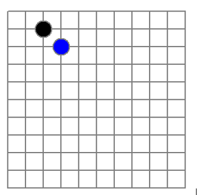
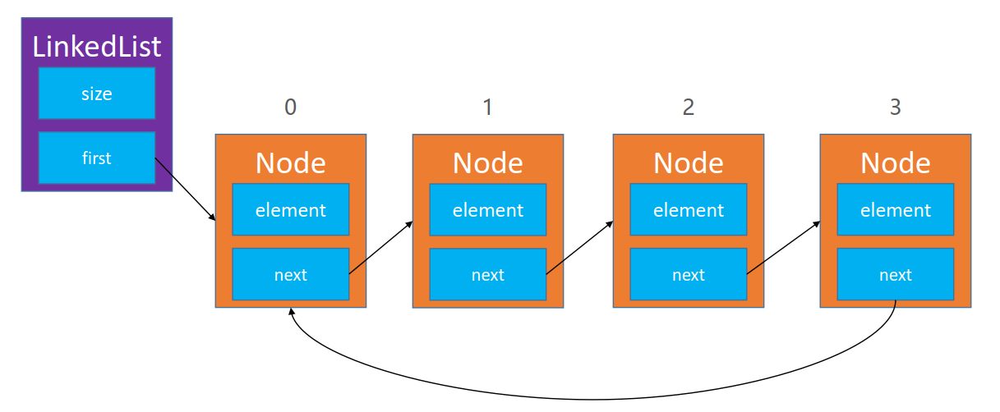
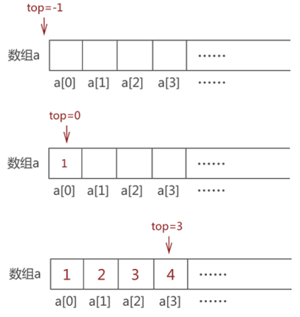
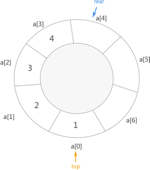
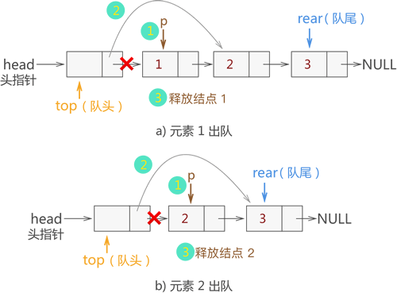

# `程序=数据结构+算法！`

# 1.基础概念

数据结构是计算机存储、组织数据的方式，即将数据通过一定规则，或者一些巧妙地设计存储数据，然后可以运用这样设计的优势，使其符合某一些特定的场景，对数据进行再利用！！

## 1.1.逻辑结构

数据的逻辑结构，指的是数据之间的逻辑关系

## 1.2.物理结构

物理结构，指的是数据在物理存储空间上选择集中存放还是分散存放，即常说的顺式存储和链式存储。数据进行集中存储有利于后期对数据进行遍历操作，而分散存储更有利于后期增加或删除数据。如果需要对数据进行大量的检索（遍历），就选择集中存储；反之，若需要对数据做进一步更新（增加或删除），则选择分散存储！

# 2.数组

数组是一种顺序存储的线性表，所有元素的内存地址都是连续的。

## 2.1.稀疏数组

稀疏数组，即sparse array。怎么理解稀疏数组？可以看这样一个场景：有如下一个五子棋盘，如果要保存当前棋局，很自然地会想到用二维数组去保存， 

但是这样会有一个严重的问题，内存浪费严重，而且棋盘数据越少，浪费就越严重。当前只有2个棋子需要记录，但却开辟了一整块棋盘n*m的内存空间，保存无意义的0，在这种场景下，应该用稀疏数组替换掉二维数组。

 稀疏数组的做法是：

1. 记录原二维数组几行几列，有多少个值
2. 把有值的行列及其对应值记录到小规模数组上(即把原数组的数据压缩起来)

假设有如上的数组，它一共有6行7列，并且有8个非零值，要将其转换成稀疏数组可以这样操作：因为有8个非零值，说明就有8个行列要记录，所以新生成的稀疏数组至少需要8行；加上又要统计原数组的总行列数，又要多出1行，因此待转换的稀疏数组就要有9行。而稀疏数组只要记录元素组的行、列和值，所以需要3列。最终，上面数组转换的稀疏数组就是下面这个样子：

第一行：表示原数组有6行7列，有8个非零值

第二行：表示原数组的第1行的第4列（列数以0开始计数），值为22

 ... 以此类推

## 2.2.动态数组

大部分编程语言的数组都是不可扩容的，但是，在数据容量不足时，通过创建一个容量 * 2的新数组，将旧数组的数据复制到新数组中，就可以实现数组的动态扩容，这种数组就称为动态数组。

# 3.链表

链表是一种链式存储的线性表，所有元素的内存地址不一定是连续的。链表中每个数据的存储都会分为2个部分：数据域和指针域：

- 数据域：数据元素本身
- 指针域：指向直接前驱/后继元素的指针

## 3.1.单向链表

单向链表意味着只能从A→B，但B不能→A，单链表有一个重要知识点：单链表反转，可以通过头插法来实现

## 3.2.双向链表

## 3.3.循环链表

如果单向链表将最后一个节点Node的next指针指向头节点，那么这种链表就称为单向循环链表：

同理，如果双向链表的next和prev指针也头节点，那么这种链表就称为双向循环链表：

# 4.栈

栈是一种特殊的线性表，只能在一端进行操作，栈的开口端被称为栈顶，封口端被称为栈底。往栈中添加元素的操作，叫做push（入栈）；从栈中移除元素的操作，一般叫做pop（出栈，只能移除栈顶元素），栈是一种“先进后出”原则的数据结构！

## 4.1.顺序栈

顺序栈，就是基于数组实现的栈存储结构。在数组中会设定一个指向栈顶元素的指针（一般命名为 top），top 初始值为 -1，表示栈中没有存储任何数据元素，即"空栈"。如果元素进栈，则 top ++；反之，如果数据元素出栈，top --

**入栈过程：**

申请一块数组，定义一个指针top，top在物理结构上表示数组的下标，在逻辑结构上表示栈顶元素（即top的值就是栈顶元素在数组的下标）top的初始值为-1，表示这是一个空栈。当数据元素`1`入栈后，top++，其值变为0，同时栈顶元素就变为1...以此类推，当`1,2,3,4`都入栈后，top就会变为3，表示栈顶元素位于数组index=3的位置。

**出栈过程**

出栈的时候，只允许从指针top开始弹出元素，一开始top=3表示栈顶元素位于底层数组index=3的位置，元素值为`4`，将其弹出后，top--变为2，现在栈顶元素就位于底层数组index=2的位置：

## 4.2.链栈

链栈，就是用链表实现的栈。对于链表，一般会定义一个头节点head用来指向栈顶元素，即链表的首个元素。同时，链表的头部作为栈顶，尾部作为栈底：

数据元素在入栈时，需要在栈顶添加，然后它就会称为新的栈顶元素，即head需要指向它。同理，元素出栈的时候，就是把head指针指向的链表元素删除即可。所以，链栈实际上就是一个采用**头插法**插入或删除数据的链表

**添加元素**

**删除元素**：

# 5.队列

队列是一种特殊的线性表，只能在头尾两端进行操作，属于先进先出原则的数据结构

- 队尾（rear）：只能从队尾添加元素，一般叫做入队
- 队头（front）：只能从队头移除元素，一般叫做出队

常见的队列实现：顺序队列、链式队列、双端队列、延迟队列、优先级队列....

## 5.1.顺序循环队列

通过数组实现的队列，为了合理利用数组资源，一般会实现成**顺式循环队列**。顺序循环队列有一个问题：就是队列满和队列空的判断条件是一样的，需要特殊处理：

- 队列保留一个空位不保存数据，这样front和rear就不会在同一位置上;
- 增加一个字段，用来标注队列是否为空

**入队过程**

顺序循环队列底层实际也是数组，它会定义两个指针`top`和`near`，依次表示队首和队尾，当元素入队时`rear`指针就会+1。

而且，为了节省内存空间（队列假溢出），当rear达到`array.length-1`后，可以重新记为0，这样就可以继续允许元素入队，从逻辑上看就变成：

**出队过程**

元素出队过程，改变的时`top`指针，从队头出队。每次元素出队后，top++，指向下一个队头。正是由于元素出队了，所以`near`即使达到array.length-1，还是可以允许元素入队的。其实现还是跟上面的逻辑循环结构一样！

## 5.2.链式队列

链式队列，底层基于链表实现，所以它也不会有像普通顺序队列一样，造成`假溢出`的现象。链式队列一般会定义一个节点Node用于存储元素和下一个Node的引用，同时还会定义一个head指针，用于指向队首元素；定义top和rear指针表示队首元素和队尾元素：

**入队过程**

链式队列可以有一个头节点（不存储任何元素），也可以没有。当有头节点的情况，元素`1`入队时，top指针不变，创建一个新的Node，将头节点的next指针指向这个Node，同时rear指针也指向这个Node，表示这个Node为新的队尾元素，这样元素`1`就入队成功了...依次类推，依次添加元素`2,3`：

**出队过程**

由于头节点的存在，队首元素要出队，就要获取头节点的next指针指向的节点Node。当前队首元素为元素`1`，将其出队，将获取元素`1`节点的next指针指向的节点，即元素`2`，让头节点的next指针指向`元素2`，这样队首元素`1`就已经成功出队，top指针完全可以不用改变，一直指向头节点：

## 5.2.双端队列

双端队列是可以在首尾两端执行添加、删除操作的队列

## 5.3.优先级队列

优先级队列，需要对入队的元素做优先级判断，优先级高的元素可以先出队

# 6.哈希表

哈希表，也称为散列表，是使用hash函数实现的数据结构

# 7.跳表

