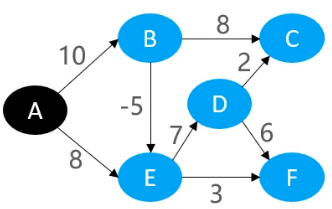

# `程序=数据结构+算法！`

# 1.【基本概念】

图是由顶点（Vertex）和边（Edge）组成，通常表示为`G=(V, E)`，其中`G`表示一个图，`V`表示顶点集，`E`是边集，要求顶点集`V`有穷且非空，任意两个顶点之间可以用边来表示之间的关系。

## 1.1.图的种类

图的种类很多，举几个常用的例子：

- **有向图**（Directed Graph）它的边是有方向的，比如`→`或者`←`；
- **有向无环图**（Directed Acyclic Graph）指的是一个有向图，从任意顶点出发无法经过若干边回到该顶点；
- **无向图**（Undirected Graph）它的边无方向，它可以等价于有向图两个顶点之间有两个方向相反的边；
- **无向完全图**：任意两个顶点之间都存在边；**有向完全图**：任意两个顶点之间都存在方向相反的边；
- **有权图**（Weighted Graph）这类图的边可以拥有权值
- **连通图**（Connectd Graph）若顶点X和顶点Y之间存在可以相互抵达的路径（间接或直接）则称X和Y是连通的。如果无向图G中任意2个顶点都是连通的，则称G为连通图
- **强连通图**（Strongly Connected Graph）有向图G中任意2个顶点都是连通的
- .... ....

## 1.1.出度,入度

出度和入度，适用于有向图。

- 出度（Out-degree）是指：对于任意顶点，有x条边以它为起点，那么该顶点的出度就为x

- 入度（In-degree）是指：对于任意顶点，有x条边以它为终点，那么该顶点的入度就为x

下图中，顶点B的出度为3，入度为2


## 1.3.表示方式

由于图存在顶点和边的概念，需要同时保存顶点信息和边信息，所以图有两种表示：

- **邻接矩阵（Adjacency Matrix）**：底层就是二维数组`obj[x][y]`，一维数组表示顶点，即`x`表示顶点；二维数组表示边，即`obj[x][y]`表示一条边（如果顶点不存在边，默认取值为0，反之取值为1）如果边有权值可以赋予`obj[x][y]`特殊值。这种方式适合稠密图，即边占多数的情况。
- **邻接表（Adjacency List）**：底层就是链表，一个顶点就是一个链表，链表的引用链表示该顶点能通往的其它顶点。假设用节点类`Node`表示节点，如果`Node.next`不为空，说明`Node`和`Node.next`存在一条边；再如果`Node.next.next`不为空，说明`Node`和`Node.next.next`也存在一条边。当然如果边有权值，可以在`Node`定义一个字段用来保存边的权值。（实际实现不会严格按照这种方式，还有，其实还有一个相反的实现称为`逆邻接表`，它表示的哪些顶点能到达当前顶点）


# 2.【图的遍历】

图的遍历：从图中的某一顶点出发，访问图的其它顶点，并且每一个顶点只会被访问一次。图的遍历有两种方式：

- 广度优先搜索遍历，Breadth First Search，简称**BFS**，又称为横向优先搜索、宽度优先搜索
- 深度优先搜索遍历，Depth First Search，简称**DFS**

## 2.1.广度优先搜索

二叉树的层序遍历，实际上就是一种广度优先搜索（实际上就可以参考二叉树层序遍历的实现思路 — 队列，来实现图的广度优先搜索遍历）。它是一种“地毯式”层层推进的搜索策略，即**先查找离起始顶点最近的，然后是次近的，依次往外搜索**。图的广度优先搜索思路是这样：

1. 首先明确从图的某一个顶点出发，记为R。访问R，完成第一层遍历；
2. 以R为起点，寻找与R只隔一条边的顶点集V，访问它们完成第二层遍历；
3. 依次以V中的顶点R<sub>v</sub>为起点，同第2步一样，寻找与R<sub>v</sub>只隔一条边的顶点集V<sub>2</sub>，访问它们完成第三层遍历；
4. ...以此类推，访问过的顶点不能重复访问，最终就可以实现广度优先搜索。


当选择的起点不一样时，得到的广度优先搜索就会不一样。这一现象，尤其在有向图中表现明显，以上图为例：

1. 如果选择顶点【5】为起点，第一层遍历就是先访问【5】自身
2. 接着从顶点【5】出发，它有两条出度的边【5→6】和【5→7】，所以第二层遍历就是访问顶点【6】和【7】
3. 接着从顶点【6】和【7】出发，【7】的出度只有一条边就是到顶点【6】，但是顶点【6】已经访问过了，所以不会再访问；从顶点【6】出发，它只有一条出度边即【6→2】，所以第三层遍历就是访问顶点【2】
4. 接着从顶点【2】出发，它的出度为也只有一条【2→0】，所以第四层访问就是顶点【0】
5. 接着从顶点【0】出发，它的出度为0，所以广度优先搜索结束

## 2.2.深度优先搜索

二叉树的前序遍历，实际上就是一种深度优先搜索（实际上就可以参考二叉树前序遍历的实现思路 — 递归，来实现图的广度优先搜索遍历）。它会**沿着树的深度遍历树的节点，尽可能深得搜索树的分支，当节点v的所在边都己被探寻过，搜索将回溯到发现节点v的那条边的起始节点**。这一过程一直进行到已发现从源节点可达的所有节点为止。图的深度优先搜索思路是这样：

1. 首先明确从图的某一个顶点出发，记为R，直接访问R；
2. 以R为起点，选择它的一条边，选取这条边的终点记为R<sub>2</sub>，直接访问R<sub>2</sub>；
3. 以R<sub>2</sub>为起点，选择它的一条件，选取这条边的终点记为R<sub>3</sub>，直接访问R<sub>3</sub>；
4. ... ...以此类推，直到访问顶点R<sub>n</sub>，它已经没有边，就会回溯到上次访问顶点R<sub>n</sub>时用的那条边的起点R<sub>n-1</sub>;
5. 选择R<sub>n-1</sub>的其它边进行访问，如果R<sub>n-1</sub>也没有边了，继续回溯到R<sub>n-2</sub>；
6. ... ... 以此类推，直至回溯到最开始的顶点即R，选取它的其它边继续访问，如果它也没有边可以访问了，那就意味着以R为起点的深度优先搜索结束。


选择的起点不一样，深度优先搜索的结果就会不一样，而且会有多种遍历结果。以右上图的第一行访问结果为例：

1. 选取顶点【a】为起点，先访问【a】
2. 【a】存在两条出度边【a→b】和【a→e】，先选取【a→e】，访问顶点【e】；
3. 【e】存在两条出度边【e→c】和【e→f】，先选取【e→f】，访问顶点【f】；
4. 【f】存在一条出度边【f→c】，那就直接访问【c】；
5. 【c】存在一条出度边【c→b】，那就直接访问【b】；
6. 【b】存在一条出度边【b→e】，但是顶点【e】在第2步就已经访问过了，所以不再访问，而且【b】也没有其它出度边了，所以回溯到【c】（原先是通过【c→b】这条边来访问顶点【b】的）；
7. 【c】也没有其它出度边了，所以回溯到【f】（原先是通过【f→c】这条边来访问顶点【f】的）；
8. 【f】同样也没有其它出度边了，回溯到【e】；同理【e】也没有其它出度边，继续回溯到【a】；
9. 【a】有两条出度边【a→b】和【a→e】，【a→e】已经访问完了，所以就会选取另外一条边即【a→b】开始访问，但实际上顶点【b】在第5步已经访问过，所以【a→b】这条边就不会再开启新一轮深度优先搜索；
10. 到此，以【a】为起点的深度优先搜索结束！

# 3.【生成树】

生成树，Spanning Tree，也称为支撑树。是指**连通图（无向）的极小连通子图**，它包含原连通图全部的n个顶点，并且拥有n-1条边。通俗地讲：一个连通图去掉多余的边直至无法再剔除，以保持任意两个顶点之间相互连通的特性，那么去掉多余边后的的这个图，就称为该连通图的生成树。注意：一个连通图的生成树可以有多个：


## 3.1.最小生成树

最小生成树，Minimum Spanning Tree，简称MST。是指在一个连通图的所有生成树中，**总权值最小的生成树**，一般用于有权的无向连通图。也被称为最小权重生成树（Minimum Weight Spanning Tree）、最小支撑树。注意：如果图中的每一条边的权值都互不相同，那么最小生成树只有一课，否则也会存在多个最小生成树。


## 3.2.Prim

### 3.2.1.切分定理

Prim算法是基于切分定理求得最小生成树，何为切分定理？即：**给定任意切分，横切边中权值最小的边必然属于最小生成树**。需要了解两个基本概念：

- 切分（cut）：把图中的顶点分为两个部分，称为一个切分；

- 横切边（Crossing Edge）：如果一个边的两个顶点，分别属于切分的两部分，这条边就称为横切边；

如下图，对【BC、BE、DE】进行一个切分后，连通图的顶点E=(S,T)，其中S=(A,B,D)，T=(C,E)。而且【BC】、【BE】和【DE】这3条边都为横切边：


### 3.2.2.执行过程

假设有权连通图表示为 G = (V, E)，A是G中最小生成树的边集合（A ∈ E），即：Prim算法求出的G的最小生成树的边都存放在A中。再定义一个顶点集合S用于存放已经做完切分的顶点。刚开始的时候A为空集 A= {}，选取G中的某一个顶点u<sub>0</sub>为开始切分的起始点，表示为 S = { u<sub>0</sub> } （u<sub>0</sub> ∈  V）而后每切分完一个顶点就会将其放入S中。重复执行下面的操作直至S=V，即G中所有顶点都已经做过切分。

- **找到切分 C=(S, V - S)的最小横切边（u<sub>0</sub> , v<sub>0</sub>）并入集合A，同时将v<sub>0</sub>并入集合S**

①随机选取一个顶点，假设是A，将其加入集合S，然后要对连通图进行切分，保证切分成一半顶点为S集合，另一半顶点为V-S(减)集合。此时S = {A}，所以顶点A与其它顶点切分开，就要对A所在的边进行切分，做下图左边所示。这样可以得到两条横切边【AB】和【AH】，很明显权值较小的为【AB】。因此将【AB】加入集合A中，A = {AB}，然后将边【AB】的另一个顶点B加入集合S，S= {A,B}


②重复执行切分操作，当前S= {A,B}，因此就需要将图切分为两部分，一部分为A,B顶点，另一部分为其它顶点。所以就要对A和B连接其它顶点的边进行切分，如下图左边所示。会得到3条横切边：BC，BH和AH，其中权值最小的为8，有两条，随机选一条，假设选取BC。因此将BC加入集合A中，A={AB, BC}，顶点C加入集合S，S={A,B,C}


③重复执行切分操作，当前S={A,B,C,}，将顶点A,B,C与其它顶点分开，就要对A,B,C与其它顶点的边进行切分，如下图左边所示。得到权值最小的横切边为CI。因此将CI加入集合A，A={AB, BC, CI}，同时顶点I加入集合S，S={A,B,C,I}


④重复执行切分操作，当前S={A,B,C,I}，将顶点A,B,C,I与其它顶点分开，就要对A,B,C,I与其它顶点的边进行切分，如下图左边所示。得到权值最小的横切边为CF。因此将CF加入集合A，A={AB, BC, CI, CF}，同时顶点F加入集合S，S={A,B,C,I,F}


⑤重复执行切分操作，当前S={A,B,C,I,F}，将顶点A,B,C,I,F与其它顶点分开，就要对A,B,C,I,F与其它顶点的边进行切分，如下图左边所示。得到权值最小的横切边为FG。因此将FG加入集合A，A={AB, BC, CI, CF, FG}，同时顶点G加入集合S，S={A,B,C,I,F,G}


⑥重复执行切分操作，当前S={A,B,C,I,F,G}，将顶点A,B,C,I,F,G与其它顶点分开，就要对A,B,C,I,F,G与其它顶点的边进行切分，如下图左边所示。得到权值最小的横切边为GH。因此将GH加入集合A，A={AB, BC, CI, CF, FG, GH}，同时顶点H加入集合S，S={A,B,C,I,F,G,H}


⑦重复执行切分操作，当前S={A,B,C,I,F,G,H}，将顶点A,B,C,I,F,G,H与其它顶点分开，就要对A,B,C,I,F,G,H与其它顶点的边进行切分，如下图左边所示。得到权值最小的横切边为CD。因此将CD加入集合A，A={AB, BC, CI, CF, FG, GH, CD}，同时顶点D加入集合S，S={A,B,C,I,F,G,H,D}


⑧重复执行切分操作，当前S={A,B,C,I,F,G,H,D}，将顶点A,B,C,I,F,G,H,D与其它顶点分开，就要对A,B,C,I,F,G,H,D与其它顶点的边进行切分，如下图左边所示。得到权值最小的横切边为DE。因此将DE加入集合A，A={AB, BC, CI, CF, FG, GH, CD, DE}，同时顶点E加入集合S，S={A,B,C,I,F,G,H,D,E}。此时S=V，表示所有顶点都切分完毕，该连通图的最小生成树也计算出来了，其所有边都在集合A中。


⑨去掉不在集合A中的边，最终生成的最小生成树为：


## 3.3.Kruskal

按照边的权重顺序（从小到大）将边加入最小生成树中，直到最小生成树包含`V-1`条边为止（V为顶点数），需要注意两点：

- 若加入边后会与原先最小生成树形成环，则不加入改边（通过**并查集**判断是否成环）
- 加入第1,2条边绝对不会成环，但是从第3条边开始，可能会与生成树形成环

### 3.3.1.执行过程

①获取图中的所有边，对其进行堆化（heapify）形成一个最小二叉堆，然后移除堆顶元素取出权值最小的边，将其加入到最小生成树的边集合中。很明显，下图权值最小的边为【HG】，权值为1：


②从最小堆中再移除堆顶元素取出权值次小的边，将其加入到最小生成树的边集合中。很明显，下图权值次小的边有两条：【CI】和【GF】任取一条即可，假设取【CI】，前两条可以保证不会出现环：


③从最小堆中再移除堆顶元素取出权值第三小的边，将其加入到最小生成树的边集合中。很明显，下图权值第三小的是第②步遗留的2，即边【GF】。但其实就需要判断【GF】会不会与当前的最小生成树形成环，很明显不会，所以可以选：


④从最小堆中再移除堆顶元素取出权值第四小的边，将其加入到最小生成树的边集合中。很明显，下图权值第四小的边有两条：【AB】和【CF】，这两条不管选择哪条都不会形成环，所以可以随意取一条，假设选择【AB】


⑤从最小堆中再移除堆顶元素取出权值第五小的边，实际上就是第④步未选取的边【CF】，选取它加入最小生成树不会形成环：


⑥从最小堆中再移除堆顶元素取出权值第六小的边，恰好是边【IG】- 权值为6，但是如果将边【IG】加入最小生成树中，就形成环了【I-G-F-C-I】，所以6就要被抛弃。重新移除最小堆的堆顶元素取出第七小的边，有两条：【HI】和【CD】- 权值为7。但是【HI】同样不可选取，也会形成环【H-I-C-F-H】，所以只能选择边【CD】：


⑦从最小堆中再移除堆顶元素取出权值第八小的边，有两条：【AH】和【BC】- 权值为8，两条不管选取哪一条都不会形成环，假设选择【AH】：


⑧从最小堆中再移除堆顶元素取出权值第九小的边，即边【BC】- 权值为8，但是边【BC】加入最小生成树会形成环【A-B-C-F-G-H-A】，因此被废弃转而再从最小堆中取出权值第十小的边，即【DE】，判断它不会构成环，可以选取：


⑨选择的最小生成树的边已经达到`V-1`个，所以Kruskal算法执行结束，最终生成的最小生成树为：


# 4.【最短路径】

最短路径，Shortest Path，是指两顶点之间权值之和最小的路径。有向图。无向图甚至无权图（可以默认全部边的权值为1）都存在最短路径。但是，如果一个图存在负权环（即存在一个环，且其中若干边的权值为负数）则不存在最短路径，因为它一直绕着环转圈，其总权值一直在变小！求解最短路径有3个[经典算法](https://zh.wikipedia.org/wiki/%E6%9C%80%E7%9F%AD%E8%B7%AF%E9%97%AE%E9%A2%98)：

- 单源最短路径算法：已知起始结点，求最短路径的问题
  - Dijkstra（迪杰斯特拉算法）
  - Bellman-Ford（贝尔曼-福特算法）
- 多源最短路径算法：图中所有的最短路径，也称为全局最短路径问题
  - Floyd（弗洛伊德算法）

## 4.1.Dijkstra

[Dijkstra](https://zh.wikipedia.org/wiki/%E6%88%B4%E5%85%8B%E6%96%AF%E7%89%B9%E6%8B%89%E7%AE%97%E6%B3%95)，又译为迪杰斯特拉算法，是一个单源最短路径算法，用来计算一个顶点到其它连通节点的最短路径（但是它不允许图中有**负权边**的存在）时间复杂度可以优化至O(ElogV)，E是边数量，V是顶点数量。它采取类似**广度优先搜索**的思想（可以把它想象成用线连着一堆石子，将其中一个石子缓慢提起，会慢慢将离它最近的石子带离地面）

### 4.1.1.松弛操作

Dijkstra算法有一个核心点：**松弛操作**（Relaxation）一般指的是更新2个顶点之间的最短路径，这个算法里特指**更新源点到另一个连通顶点的最短路径**。执行松弛操作，是为了尝试找出更短的路径，在下面的执行过程中，每当确立一个顶点的最短路径时，都会对这个顶点的所有出度边做松弛操作！！！

### 4.1.2.执行过程

```tex
顶点颜色说明，黑色—选定顶点，红色—更新了最短路径，绿色—确定了最短路径 
```

①假设求顶点【A】到其它连通顶点的最短路径，首先离【A】最近的，肯定就是直接与它连通的顶点，即：【B】、【D】、【E】。因此维护一张最短路径表，一开始的时候记录顶点【A】到不同顶点的最短路径


②很明显，从上图可以知道，当前离顶点【A】最近的是【B】，他们之间的最短路径为【A→B=10】，所以此时顶点【A】到【B】的最短路径就可以确定。由于顶点【B】确定，对【B】所有的出度边做`松弛操作`，当前它的出度边只有【B→C】，那么就可以计算顶点【A】到【C】的路径长度，走的路径为【A→B→C】。原先在第①步时，【A】还无法到达【C】，现在就有路径可以走了，其权值为10 + 50 = 60，更新到下面的最短路径表中：


③查看上面的最短路径表，除了【A→B】确定以外，当前路径长度最短的是【A→D=30】，因此顶点【A】到【D】的最短路径就可以确定。同理，由于顶点【D】确定，就对它的出度边做`松弛操作`：【D→C】【D→E】。计算顶点【A】到这些出度边终点的路径长度，即【A→D→E】和【A→D→C】。在当前的最短路径表中，【A→E】的最短路径为100，但是通过【A→D→E】其最短路径为90，所以将其更新到表中，表示从顶点【A】到【E】中已经找到更短的一条路径（松弛操作的意义）；同样地，在当前的最短路径表中，顶点【A】到【C】的最短路径为【A→B→C=60】，但是发现走【A→D→C=50】更短，所以也将其更新到最短路径表中。总而言之，通过确定了顶点【D】，可以连带更新【A】到【C】、【E】的最短路径，更新到下面的最短路径表中：


④查看上面的最短路径表，除了【A→B】、【A→D】确定以外，当前路径长度最短的是【A→D→C】，因此顶点【A】到【C】的最短路径就可以确定，即【A→D→C】，一旦【C】确定，就对它的出度边做松弛操作，当前只有【C→E】，那么就可以计算顶点【A】到顶点【E】的路径长度。在当前的最短路径表中，【A→E】的最短路径为【A→D→E=90】，但是如果走【A→D→C→E】权值才60，发现有更短的路径就将其更新到下面的表中：


⑤由于顶点【E】的最短路径也被确定了，并且【E】不再包含出度边了（或者E只包含了到【A】的出度边），说明顶点【A】的所有连通顶点都已经确定了，而且它们之间的最短路径也已经确认了，就是一直在维护更新的最短路径表。到这，Dijkstra算法执行完毕！！


## 4.2.Bellman-Ford

[Bellman-Ford](https://zh.wikipedia.org/wiki/%E8%B4%9D%E5%B0%94%E6%9B%BC-%E7%A6%8F%E7%89%B9%E7%AE%97%E6%B3%95)，也称为贝尔曼-福特算法，也是一个单源最短路径算法。它的算法原理就是基于**松弛操作**，相较于Dijkstra算法，它支持负权边，还能检测出负权环，其时间复杂度为：O(EV)，E是边数量，O是顶点数量。它的算法原理：对所有的边进行`V-1`轮松弛操作（V是节点数量）就可以得到所有可能的最短路径。

Bellman-Ford算法也会维护一张最短路径表，每一轮松弛操作成功的边都会记录到表中。每一轮松弛操作，如果发现存在某条边松弛后的结果，小于等于最短路径表维护的值，那么这条边就可以在下一轮松弛操作中排除！经过`V-1`轮松弛操作后，如果发现还存在可以松弛的边，那么说明该图存在负权环！

### 4.2.1.执行过程

假设原图如下所示，包含一条负权边【B→E】，以顶点【A】为最短路径的源点。暂定每轮对边进行松弛操作的顺序为：DC、DF、BC、ED、EF、BE、AE、AB。切记：**松弛操作是为了更新源点到其它点的最短路径**！！！！



**①所有边第一轮松弛操作，假设顺序：DC、DF、BC、ED、EF、BE、AE、AB**。

- 【D→C】由于顶点【A】到顶点【D】的最短路径没有确定，所以无法确定AC最短路径；— <span style='color:RED'>FAIL</span>
- 【D→F】由于顶点【A】到顶点【D】的最短路径没有确定，所以无法确定AF最短路径；— <span style='color:RED'>FAIL</span>

- 【B→C】由于顶点【A】到顶点【B】的最短路径没有确定，所以无法确定AC最短路径；— <span style='color:RED'>FAIL</span>

- 【E→D】由于顶点【A】到顶点【E】的最短路径没有确定，所以无法确定AD最短路径；— <span style='color:RED'>FAIL</span>

- 【E→F】由于顶点【A】到顶点【E】的最短路径没有确定，所以无法确定AF最短路径；— <span style='color:RED'>FAIL</span>
- 【B→E】由于顶点【A】到顶点【B】的最短路径没有确定，所以无法确定AE最短路径；— <span style='color:RED'>FAIL</span>
- 【A→E】直接查询到【A→E】权值为8，所以【A】到【E】的最短路径为8，将【A→E=8】更新到表中，由于边AE是与源点A直接连通的，所以可以在下次松弛操作排除；— <span style='color:blue'>SUCCESS</span>
- 【A→B】直接查询到【A→B】权值为10，所以【A】到【B】最短路径为10，将【A→B=10】更新到表中，由于边AB是与源点A直接连通的，所以可以在下次松弛操作排除；— <span style='color:blue'>SUCCESS</span>


**②所有边第二轮松弛操作，假设顺序：DC、DF、BC、ED、EF、BE（AE和AB在第一轮松弛操作就可以排除）**

- 【D→C】由于顶点【A】到顶点【D】的最短路径未确定，所以松弛失败；— <span style='color:RED'>FAIL</span>
- 【D→F】由于顶点【A】到顶点【D】的最短路径未确定，所以松弛失败；— <span style='color:RED'>FAIL</span>
- 【B→C】查表得AB最短路径【A→B=10】，【B→C】权值为8，所以【A】到【C】的最短路径为10+8=18，由于当前表未维护AC最短路径，所以将【A→B→C=18】更新到表中；— <span style='color:blue'>SUCCESS</span>
- 【E→D】查表得AE最短路径【A→E=8】，【E→D】权值为7，所以【A】到【D】的最短路径为8+7=15，由于当前表未维护AD最短路径，所以将【A→E→D=15】更新到表中；— <span style='color:blue'>SUCCESS</span>
- 【E→F】，查表得AE最短路径【A→E=8】，【E→F】权值为3，所以【A】到【F】的最短路径为8+3=11，由于表当前没有维护AF最短路径，所以将【A→E→F=11】更新到表；— <span style='color:blue'>SUCCESS</span>
- 【B→E】查表得AB最短路径【A→B=10】，【B→E】权值为`-5`，所以【A】到【E】的最短路径为10-5=5，小于表当前维护的值：8，所以将【A→B→E=5】更新到表；— <span style='color:blue'>SUCCESS</span>


③**所有边第三轮松弛操作，执行顺序：DC、DF、BC、ED、EF、BE（AE和AB在第一轮松弛操作就可以排除）**

- 【D→C】查表得AD最短路径【A→E→D=15】，【D→C】权值为2，所以【A】到【C】的最短路径为15 + 2= 17，小于表当前维护的值：18，那么将【A→E→D→C=17】更新到表中；— <span style='color:blue'>SUCCESS</span>
- 【D→F】查表得AD最短路径【A→E→D=15】，【D→F】权值为6，所以【A】到【F】的最短路径为15 + 6 = 21，大于表当前维护的值：11，所以下次松弛操作时可以移除掉边DF；— <span style='color:RED'>FAIL</span>
- 【B→C】查表得AB最短路径【A→B=10】，【B→C】权值为8，所以【A】到【C】的最短路径为10 + 8 = 18，小于表当前维护的值：17（注意第一步已经更新AC），所以下次松弛操作可以移除边BC；— <span style='color:RED'>FAIL</span>
- 【E→D】查表得AE最短路径【A→B→E=5】，【E→D】权值为7，所以【A】到【D】的最短路径为5 + 7 = 12，小于表当前维护的值：15，那么将【A→B→E→D=12】更新到表中；— <span style='color:blue'>SUCCESS</span>
- 【E→F】查表得AE最短路径【A→B→E=5】，【E→F】权值为3，所以【A】到【F】的最短路径为5 + 3 = 8，小于表当前维护的值：11，那么将【A→B→E→F = 8】更新到表中；— <span style='color:blue'>SUCCESS</span>
- 【B→E】查表得AB最短路径【A→B=10】，【B→E】权值为`-5`，所以【A】到【E】的最短路径为 10 - 5 = 5，等于表当前维护的值，可以在下次松弛操作时移除掉边BE；— <span style='color:RED'>FAIL</span>


**④所有边第四轮松弛操作，执行顺序：DC、ED、EF（其它边在前三轮松弛操作时确定排除）**

- 【D→C】查表得AD最短路径【A→B→E→D=12】，【D→C】权值为2，所以【A】到【C】的最短路径为12+2=14，小于表当前维护的最短路径值：17，所以将【A→B→E→D→C】更新到表；— <span style='color:blue'>SUCCESS</span>
- 【E→D】查表得AE最短路径【A→B→E=5】，【E→D】权值为7，所以【A】到【D】的最短路径为5+7=12，发现等于表当前维护的最短路径值，不更新同时将在下次松弛操作排除边ED；— <span style='color:RED'>FAIL</span>
- 【E→F】查表得AE最短路径【A→B→E=5】，【E→F】权值为3，所以【A】到【F】的最短路径为5+3=8，发现等于表当前维护的最短路径值，不更新同时将在下次松弛操作排除边EF；— <span style='color:RED'>FAIL</span>


**⑤所有边第五轮松弛操作，执行顺序：DC（其它边在前四轮松弛操作时确定排除）**

- 【D→C】查表得AD最短路径【A→B→E→D=12】，【D→C】权值为2，所以【A】到【C】的最短路径为12+2=14，发现等于表当前维护的最短路径值，不更新同时将在下次松弛操作排除边DC；— <span style='color:RED'>FAIL</span>

- 由于没有任何边可以继续松弛操作，所以Bellman-Ford算法执行完毕。通过上面的执行过程分析，即使存在负权边，也可以在后续松弛操作中更新！

## 4.3.Floyd