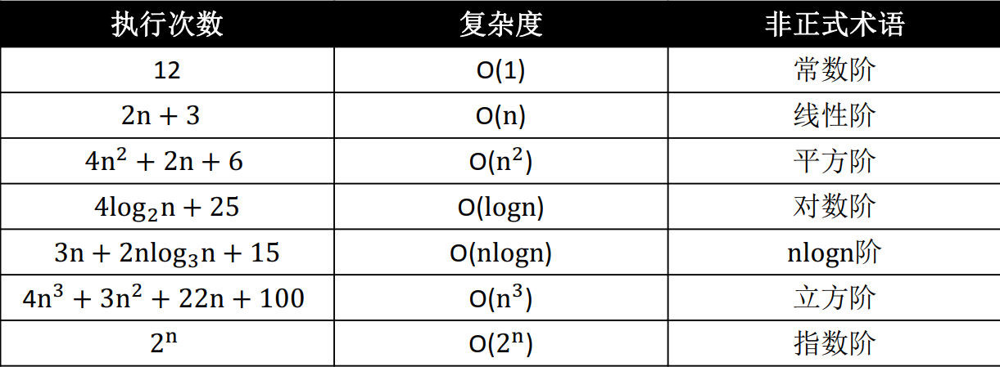
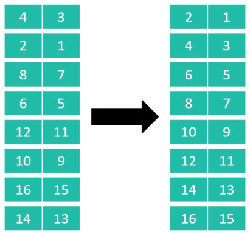
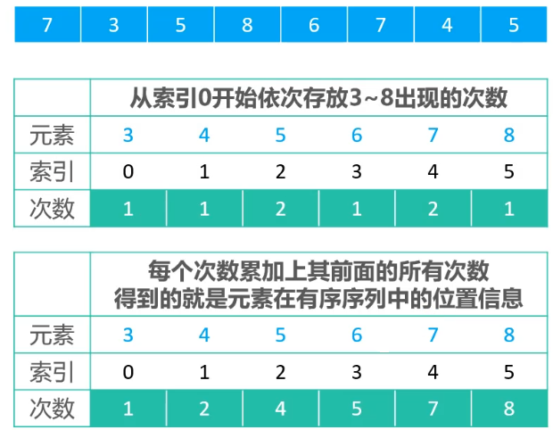
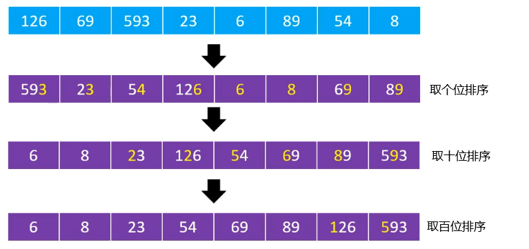
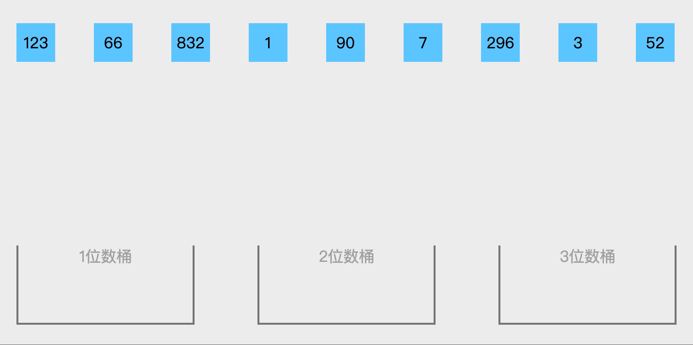

# `程序=数据结构+算法！`

刚开始学习算法时，先不要纠结于细节问题，诸如：这边要小于等于？那边是要大于还是大于等于？数组区间是要左闭右开还是左开右闭？...先将算法的大体结构实现好，后面再去微调，这样子思路会更清晰

# 1.复杂度分析

一般从以下几个角度评估算法：

- 正确性
- 可读性
- 健壮性
- 时间复杂度：估算程序指令的执行次数（执行时间）
- 空间复杂度：估算所需占用的存储空间

## 1.1.大O表示法

一般用大O表示法来表示数据规模n的时间复杂度，它仅仅是一种粗略的分析模型，是一种估算，只是能在短时间内了解一个算法的执行效率。

O(1) < O(logn) < O(n) < O(nlogn) < O(n^2^) < O(n^3^) < O(2^n^) < O(n!) < O(n^n^)

可以借助函数生成工具对比复杂度的大小：[[https://zh.numberempire.com/graphingcalculator.php](https://zh.numberempire.com/graphingcalculator.php)]



## 1.2.递推式

有些算法的时间复杂度肉眼就可以看出来，但是有些算法的时间复杂度需要用公式来推算，比如较复杂的递推操作，这类算法可以用`递推式`来计算，递推式对应的复杂度为：

| 递推式                     | 复杂度           |
| -------------------------- | ---------------- |
| T(n) = T(n/2) + O(1)       | O(logn)          |
| T(n) = T(n-1) + O(1)       | O(n)             |
| T(n) = T(n/2) + O(n)       | O(n)             |
| T(n) = 2 * T(n/2) + O(1)   | O(n)             |
| T(n) = 2 * T(n/2) + O(n)   | O(nlogn)         |
| T(n) = T(n - 1) + O(n)     | O(n<sup>2</sup>) |
| T(n) = 2 * T(n - 1) + O(1) | O(2<sup>n</sup>) |
| T(n) = 2 * T(n - 1) + O(n) | O(2<sup>n</sup>) |

至于`递推式`怎么计算？这个就要根据实际算法实现来分析了，比如：

```java
// 递归调用，对半平均分数组
private void divide(int[] array, int startIndex, int endIndex) {
    if (endIndex - startIndex <= 1) {
        return;
    }
    int middleIndex = (endIndex + startIndex) >> 1;
    divide(array, startIndex, middleIndex);
    divide(array, middleIndex, endIndex);
}
```

# 2.排序算法

排序算法属于较为简单且基础的算法知识，它分为两类：

- **比较类排序**：通过比较来决定元素间的相对次序，由于其时间复杂度不能突破O(nlogn)，因此也称为非线性时间比较类排序
- **非比较类排序**：不通过比较来决定元素间的相对次序，它可以突破基于比较排序的时间下界，以线性时间运行，因此也称为线性时间非比较类排序


排序算法有这样几个概念：

- 稳定性：如果相等的2个元素，排序前后的相对位置保持不变，就是具有稳定性的排序算法
- 原地算法：不依赖额外的资源或依赖少数的额外资源，空间复杂度为O(1)的都为原地算法，非原地算法称为：Not-in-place或者Out-of-place


## 2.1.冒泡排序

冒泡排序的动图演示：


**算法思想：**

比较相邻的两个元素，若后一个元素比前一个元素小，那么将这两个元素互换位置，经过这样一轮排序后，可以将数组中最大的元素移动到数组末尾。假设数组有n个元素，那么最差需要通过n-1轮的比较。冒泡排序可以有两个优化：

- 如果数组已经完全有序, 可以提前终止冒泡排序
- 如果数组末尾已局部有序, 记录最后一次比较的位置, 下一轮直接到该位置即可

**代码实现：**

```java
static void bubbleSort(int[] array) {
    // 需要进行n-1轮的比较，每经过一轮比较后，其实数组末尾已经有序，比如：第一轮比较后，数组最大元素
    // 元素就可以确定，所以下一轮比较的终止位置就是array.length-1。因此从后往前确定比较最终位置
    for (int end = array.length - 1; end > 0; end--) {
        // 记录最后一次交换的位置
        int lastSwapIndex = 1;
        for (int i = 0; i < end; i++) {
            // 相邻元素两两比较，若发送大小不一致，进入if语句块交换位置
            if (array[i] > array[i + 1]) {
                int n = array[i + 1];
                array[i + 1] = array[i];
                array[i] = n;
                // 发生位置交换了, 记录当前位置。如果这个变量在后续比较中都没有发生变化，那么
                // 说明从这个位置开始到数组末尾的元素都已经有序了，下一轮比较直接到这个位置为止。
                lastSwapIndex = i + 1;
            }
        }
        // 一轮遍历, 重置end的索引, 然后外层for循环就会对end-1, 再进行判断,
        // 是否要继续循环, 所以将lastSwapIndex的初始值设为1, 这样如果内层循环
        // 没有执行过, 那就意味着数组已经全有序, 外层for循环将end-1后变为0, 直接退出外层循环
        end = lastSwapIndex;
    }
}
```

## 2.2.选择排序

选择排序的动图演示：


**算法思想：**

每一轮比较（一轮：遍历一个区间的数组元素），可以选择找最小，或最大元素。假设数组元素个数为n，若一轮比较中找的是最小元素，则遍历区间为[0,n]，然后将其移动到下标为0的位置；下一轮比较区间为[1,n]，然后移动到下标为1的位置。同理，若找的是最大元素，第一轮比较的区间为[0,n]，将其移动到下标为n的位置；下一轮比较区间为[0,n-1]，将其移动到下标为n-1的位置。

选择排序与冒泡排序很相似， 都是将一轮比较中的最小/最大元素，移动到数组的极端位置，但是选择排序的交换次数远远小于冒泡排序，平均性能优于冒泡排序

**代码实现：**

```java
// 寻找最小值
private static int[] minimum(int[] array) {
    // 至少需要比较n-1轮
    for (int start = 0, length = array.length; start < length - 1; start++) {
        // 记录最小值的下标, 每进入一轮循环, 假设最开始下标的位置就是最小值
        int minimumIndex = start;
        // 1轮比较, 需要遍历[start, array.length-1]
        for (int j = start + 1; j < array.length; j++) {
            // 这边用 >= 是有讲究的, 假设: [10,3,3,20], 数组内有相等元素, 为了不交换它们的位置,
            // 用 >= 比较, 可以保证原先靠前的元素可以继续靠前排列. 这样可以让选择排除处于稳定状态.
            if (array[minimumIndex] >= array[j]) {
                minimumIndex = j;
            }
        }
        // 每轮比较完后, 可以得到一个最小值即array[minimumIndex],
        // 将其与array[start]互换位置
        int temp = array[minimumIndex];
        array[minimumIndex] = array[start];
        array[start] = temp;
    }
    return array;
}
```

```java
// 寻找最大值
private static int[] maximum(int[] array) {
    // 至少需要比较n-1轮
    for (int end = array.length - 1; end > 0; end--) {
        // 记录最小值的下标, 假设每次都是下标为0的位置为最大值
        int maximumIndex = 0;
        // 1轮比较, 需要遍历[0, end]
        for (int start = 0; start <= end; start++) {
            // 这边用 <= 是有讲究的, 假设: [10,30,30,20], 数组内有相等元素, 为了不交换它们的
            // 位置, 用<= 比较, 可以保证原先靠前的元素可以继续靠前排列. 这样可以让选择排除处于
            // 稳定状态.
            if (array[maximumIndex] <= array[start]) {
                maximumIndex = start;
            }
        }
        // 每轮比较完后, 可以得到一个最大值即array[maximumIndex],
        // 将其与array[end]互换位置
        int temp = array[maximumIndex];
        array[maximumIndex] = array[end];
        array[end] = temp;
    }
    return array;
}
```

## 2.3.插入排序

先看一下插入排序的动图演示


**算法思想**

与整理扑克牌的思想一样，假设现在有部分扑克牌已经有序，新摸到的扑克牌会依次与已经有序的扑克牌比较（例如从右到左比较），将其插入到合适的位置。插入排序做法很类似，它是从数组下标为1的位置开始，让它与下标为0的元素比较，如果比它小，则互换位置；接着再让数组下标为2的元素，依次与下标为1和0的比较；接着再让数组下标为3的元素，依次与下标为2,1,0的元素比较...以此类推，直至所有元素比较完。

插入排序的速度，与逆序对有关。比如像[2,1]、[80,10]、[9,5]...这种顺序颠倒的数组元素组合就称为逆序对，当一个数组的逆序对越多时，插入排序就需要更多的比较与交换；相反地，如果数组中逆序对很少，那么插入排序需要比较的次数就很少，完成的速度就越快。

其实，插入排序的耗时，大部分在于需要依次与其左边的元素比较，得出它该插入的下标位置。所以如何快速地得到待插入的下标，就是解决插入排序的关键：可以采用二分查找思想，假设现在要判断插入位置的元素下标为7，则将它在[0,6]的数组区间内进行二分查找，确认出它的插入位置，接着再移动，可以有效减少比较次数～

**代码实现**

```java
protected void internalSort(int[] array) {
    int start;
    for (int i = 1, len = array.length; i < len; i++) {
        start = i;
        while (start > 0) {
            // 依次将元素与其左边的各个元素比较
            if (compareByIndex(start - 1, start) > 0) {
                swap(start, start - 1);
                start--;
            } else {
                // 因为元素左边以前有序了，如果元素最右边都小于这个元素了，
                // 那么之前的元素肯定都小于它
                break;
            }
        }
    }
}
```

## 2.4.希尔排序

先看一下希尔排序的动图演示


**算法思想：**

希尔排序，也称为缩小增量排序，实际上是[插入排序](# 2.3.插入排序)的改进版。插入排序的效率取决于原数组的逆序对的数量，希尔排序的思想就是来减少原数组的逆序对：它通过公式计算出`步长序列`，这个`步长序列`其实就是一个数组，里面的每个元素标志着待排序数组需要分成多少列。希尔本人给出的公式为n/2<sup>k</sup>，k=1,2,3,4,...，举个例子，待排序数组的元素为16时，`步长序列`为8,4,2,1。

得到`步长序列`后，将待排序数组依次指定列，然后进行插入排序。比如上例8,4,2,1，就是让数组先分为8列，每列单独排序；再分为4列，每列单独排序；再分为2列，每列单独排序。最后分为1列，单独排序。当然分为1列时，就是原数组直接排序了。每一步这样操作，都是为了降低原数组中的逆序对，加大插入排序的效率。

假设原数组如下，有16个元素，计算出步长序列，假设还是8-4-2-1


将数组的前8个元素和后8个元素分割开，就可以变为2行，每行8列，如下图左边所示。然后让每一列单独进行插入排序，即8和16排序，15和7排序，14和6排序..，最终结果就如下图右边所示


需要明确一点，希尔排序并不是真正将数组拆分出来单独排序，而是在逻辑上将他们视为一列（通过数组下标来确定关系）因此呢，上面排序完的结果体现在原数组上，就像这样子：


经过上面8列排序后，数组可以减少一些逆序对。接着在第一步基础上，再将数组（紫色部分）每隔4个元素分为一列，则可以分为4行，每行4列，如下图左边所示。同样地，也是每一列单独进行插入排序，即8-4-16-12排序，7-3-15-11排序...，最终结果就如下图右边所示：


经过4列排序后，数组就变为：


在4列的基础上，再分为2列排序，接着也是每列单独排序：



经过2列排序后，数组就变为下图这样子，可以看到有效减少逆序对。最后再分为一列排序，实际也就是直接对原数组进行插入排序了


**代码实现**

```java
/**
 * 希尔排序
 */
protected void internalSort(int[] array) {
    int[] steps = shellStepSequence(array);
    // 按照步长序列, 将数组依次拆分为指定的列数
    for (int step : steps) {
        // step表示要将数组拆分的列数, 分成几列, 就要比较几列
        for (int col = 0; col < step; col++) {
            // 开始比较的位置, 因为插入排序不需要比较第一个位置, 所以直接向后移动一位.
            // 然后依次取本列中下一个需要比较的元素.
            for (int start = col + step; start < array.length; start += step) {
                // 这边就是简单插入排序的代码: 依次将元素与其左边的各个元素比较
                int cur = start;
                int prev = cur - step;
                while (cur > col && compareByIndex(cur, prev) < 0) {
                    swap(cur, prev);
                    cur = prev;
                }
            }
        }
    }
}

```

```java
/**
 * 获取数组的步长序列
 */
private int[] shellStepSequence(int[] array) {
    int len = array.length;
    List<Integer> list = new ArrayList<>();
    while ((len /= 2) > 0) {
        list.add(len);
    }
    return list.stream().mapToInt(Integer::intValue).toArray();
}
```

## 2.5.归并排序

先看一下归并排序的动图演示


**算法思想：**

归并排序是由`冯·诺依曼`首次提出，它的做法是将一个数组不断地对半分割为2个子数组，直至无法再分割（即每个子数组只有一个元素），接着不断地将每个子数组比较且合并为一个新的数组，直至合并称为一个完整的数组。其实就跟JDK8的fork-join框架一个思想：


是不是听起来很简单，其实实现起来还是有点绕，也不是说难理解，就是指针会多一些。首先思考一个问题，如何将两个有序的数组A和B合并为一个新的数组？很简单，分别定义2个指针a1,a2指向数组A的前后位置，再定义2个指针b1,b2指向数组B的前后位置，最后创建一个新数组C，定义1个指针c1执行数组C的起始位置


依次比较a1和b1，谁小谁放入到c1位置。上例，开始的时候a1=0，代表值为`1`，b1=0，代表值为`2`，明显`1<2`，所以让拷贝`1`到c1=0位置上，同时a1++，c1++，b1保持不变。然后接着比较a1=1和b1=0...依次类推，直到某一方遍历结束，上例明显是a1会先达到a2。

归并排序的代码实现跟上面很类似，但有一点，**它不是拷贝一个完整的新数组出来**。因为它是对半分割的，每次都是比较左右两边（元素个数相差<=1）所以，归并排序只拷贝其左边数组，然后同样也定义5个指针，2个指针指向拷贝出来的数组，2个指针指向原数组的右边，最后1个指针也指向原数组，用于将左右两边比较结果覆盖进去。

以下图所示：array表示原数组，leftArray表示拷贝原数组左边部分即[3,6,11,18]。其中li和ri分别指向leftArray和array的起始位置，默认为0，ai指向array的起始位置，默认也为0。接着就是依次比较li和ri指向的值的大小，将较小的值覆盖掉ai指向的位置：


**代码实现：**

```java
/**
 * 归并排序的第一步，分割操作。刚开始startIndex=0, endIndex=array.length
 */
private void divide(int[] array, int startIndex, int endIndex) {
    if (endIndex - startIndex <= 1) {
        // 范围[starIndex, endIndex)数组已经无法分割, 即这区间的元素数量只有1或0
        return;
    }
    int middleIndex = (endIndex + startIndex) >> 1;
    // 递归调用, 对左右子序列进行分割
    divide(array, startIndex, middleIndex);
    divide(array, middleIndex, endIndex);
    // 递归调用结束, 说明数组已经无法再分割了, 此时进行合并操作
    merge(array, startIndex, middleIndex, endIndex);
}


/**
 * 归并排序的第二步，合并操作，这一步比较绕
 */
private void merge(int[] array, int startIndex, int middleIndex, int endIndex) {
    // ls即leftStart, 表示复制的temp数组的起始索引, 固定为0; 
    // le即leftEnd, 表示复制的temp数组的终止索引(不包括)
    int ls = 0, le = middleIndex - startIndex;
    // rs即rightIndex, 表示右边数组(原数组)的起始索引; 
    // re即rightEnd, 表示右边数组(原数组)的终止索引(不包括)
    int rs = middleIndex, re = endIndex;
    // 每次比较结果都需要更新到原数组上, 所以还需要额外定义一个指针ci, 即currentIndex
    int ci = startIndex;

    // 备份出左边数组, 这边的temp定义在方法外部，直接取array.length/2的长度即可
    for(int i = 0; i < le; i++){
        // 注意这边要用 startIndex + i, 因为并不是从原数组下标为0的位置开始拷贝
        temp[i] = array[startIndex + i];
    }

    // 一旦左边数组比较完了, 即ls >= le, 那么就没必要再继续比较了, 右边数组也不需要再操作,
    // 因此这边使用左边数组(备份的数组)的指针来做循环条件.
    while(ls < le){
        // 这个if条件有两个含义：
        
        // 其一, 外层循环已经保证ls和le的正确性, 这里rs < re来保证右边数组遍历的正确性,
        // 一旦右边数组已经比较完毕, 则直接进入else语句块；
        
        // 其二, 依次比较temp和array的元素大小, 如果temp的元素比array的元素, 那么就需要将值较小
        // 的元素移位, 移动到ci位置上, 为了保证稳定性, 这边只能用大于而不不能用大于等于.
        if(rs < re && compareByValue(temp[ls], array[rs]) > 0){
            array[ci++] = array[rs++];
        }else{
            // 否则右边index=rs的元素比左边index=rs的大,
            array[ci++] = temp[ls++];
        }
        swapCount();
    }
}
```

## 2.6.快速排序

先看一下快速排序的动图演示


**算法思想：**

在数组中选择一个轴点元素（假设为pivot），一般会选择数组首元素或者随机选择一个元素，然后通过这个pivot将数组分割为两个部分：左边部分比pivot小，右边部分比pivot大，所以呢快速排序的本质就是，将数组中的每一个元素都转换成pivot。一个完整的快速排序过程如下：

- 刚开始选择数组首元素即`6a`，定义两个指针`begin`和`end`（a只是为了判断快速排序算法的稳定性）
- 让`end`并依次与`6a`比较，刚开始`end`表示的值为7大于6，所以`end--`，就到5
- 5小于6，所以将`end`指定的元素即5，覆盖掉`begin`指定的位置，`end`保持不变，`start++`
- 并且比较的方向转为从`start`开始，此时`start`表示的值为`8a`，8比6大，将`start`指定的元素即8a覆盖掉`end`指定的位置，`start`保持不变，`end--`
- 比较方向又回到`end`这一边...以此类推，直至`begin`和`end`相等

快速排序是不稳定的排序，在轴点元素左右元素分布均匀的情况下，其最好的时间复杂度为O(nlog<sub>n</sub>)，但是轴点元素左右两边分布超级不均匀的情况下，其最坏时间复杂度为O(n<suP>2</sup>)。


**代码实现**

```java
/**
  * @param array 待排序数组
  * @param start 起始索引(包含)
  * @param end   终止索引(不包含)
  */
private void sortV2(int[] array, int start, int end) {
    if (end - start < 2) {
        // 如果元素数量只剩一个, 就没必要再比较了, 直接返回
        return;
    }
    // 在[start, end)数组区间范围内定位锚点元素的下标位置
    int pivotIndex = pivotIndex(array, start, end);
    // 递归调用, 以pivotIndex分割, 对数组左边元素进行快速排序, 即[start, pivotIndex)
    sortV2(array, start, pivotIndex);
    // 递归调用, 以pivotIndex分割, 对数组右边元素进行快速排序, 即[pivotIndex + 1, end)
    sortV2(array, pivotIndex + 1, end);
}

/**
  * 通过三个while循环来决定向左比较还是向右比较, 确定锚点元素在"未来排好序"的数组中的实际下标位置
  *
  * @param array 待排序数组
  * @param start 起始索引
  * @param end   终止索引
  * @return 锚点元素的索引
  */
private int pivotIndex(int[] array, int start, int end) {
    // 获取锚点元素, 为了排列均匀, 可以采取随机取值的做法
    int base = array[start];
    // 获取终止下标
    end--;
    while (start < end) {
        // 循环执行右边
        while (start < end) {
            // 这边只能使用小于, 而不能使用小于等于.
            // 因为当数组的元素都与锚点元素值相等时, 如果是小于等于, 则end一直递减, 则锚点元素
            // 每次都会定位到start位置, 然后下一次递归就定位到start + 1位置, 最终导致快速排序
            // 退化为O(n^2). 但是如果是小于的话, 可以使元素分布更加均匀, 每遇到值相等元素就执行
            // else语句块, 交由左边执行...
            if (compareByValue(base, array[end]) < 0) {
                end--;
            } else {
                // 用end指定的元素去覆盖start的元素, 然后start++, 开始从左边比较.
                cover(start++, end);
                // 执行左边
                break;
            }
        }

        // 循环执行左边
        while (start < end) {
            // 这边用大于的原因跟上面的理由一样
            if (compareByValue(base, array[start]) > 0) {
                start++;
            } else {
                // 用start指定的元素去覆盖end的元素, 然后end--, 开始从右边比较.
                cover(end--, start);
                // 执行右边
                break;
            }
        }
    }

    // 跳出循环说明, start==end, 数组两边都已经整理有序
    array[start] = base;
    return start;
}
```


## 2.7.堆排序

先看一下堆排序的动图演示


**算法思想：**

将给定数组进行堆化（最大二叉堆），这样堆顶元素array[0]就是值最大元素。然后重复执行下面的操作直至堆的元素数量为1：

- 交换堆顶元素和尾元素
- 堆的元素数量减一
- 堆顶元素进行一次下滤操作（siftDown）

注意，由于堆顶元素会移动到尾元素，当数组中两个元素值相等时，处于前面位置的元素会先移动到尾元素，导致它们的位置调换了，所以堆排序属于不稳定排序。它的最好、最坏、平均时间复杂度都是O(nlogn)，空间复杂度为O(1)

**代码实现：**

```java
/**
 * 堆排序 
 */
private static int[] sort(int[] array){
    int heapSize = array.length;
    // 原数组建堆
    heapify(array);
    //
    while(heapSize > 0){
        // 首尾交换, 将值最大的元素移到数组末尾
        int tmp = array[0];
        array[0] = array[heapSize -1];
        array[heapSize - 1] = tmp;
        //
        heapSize -= 1;
        siftDown(array, 0, heapSize);
    }
    return array;
}


/**
 * 对原数组建堆
 */
private static void heapify(int[] array){
    for (int i = (array.length >> 1); i >= 0; i--) {
        siftDown(array, i, array.length);
    }
}

/**
 * 二叉堆下滤操作
 */
private static void siftDown(int[] heap, int index, int size){
    int el = heap[index];
    for (; ; ) {
        // 获取最大子元素下标
        int cIndex = maxChildIndex(heap, index, size);
        if (cIndex == -1) {
            // 没有子元素就跳出循环
            break;
        }
        // 与最大子元素比较大小
        if (el - heap[cIndex] >= 0) {
            // 如果比最大子元素还大, 就不用再下滤了, 跳出循环
            break;
        }
        // 比最大子元素还小, 则与最大子元素互换位置, 然后继续下滤
        heap[index] = heap[cIndex];
        index = cIndex;
    }
    heap[index] = el;
}


/**
 * 给定一个父索引，求得它的最大值子索引
 */
private static int maxChildIndex(int[] heap, int index, int size) {
    // 左子元素索引
    int left = (index << 1) + 1;
    if (left < size) {
        // 左子元素存在, 判断右子元素存在
        int right = left + 1;
        if (right < size) {
            // 右子元素也存在
            return heap[left] - heap[right] > 0 ? left : right;
        } else {
            return left;
        }
    } else {
        // 左右子元素都不存在
        return -1;
    }
}
```

## 2.8.计数排序

先看一下计数排序的动图演示。计数排序、基数排序和桶排序都不是基于比较的排序，它们需要占用额外的内存空间，属于典型的空间换时间


**算法思想：**

计数排序适合于有一定范围内的整数进行排序，它会统计原数组每个元素的出现次数，然后可以推导出它在有序新数组中的位置。

- **简单实现**。

  - 先找出数组中的最大值m，然后开辟m+1的数组空间。接着，遍历原数组，每一个元素的值都表示新开辟数组的索引。例如，原数组第一个元素为7，则在新开辟数组index=7的元素置为1；原数组第二个元素为3，则在新开辟数组Index=3的元素置为1...如果元素已经在新开辟数组中存在，则直接累加1。

  - 这样子操作后，原数组的数据都放到新开辟数组中，那么可以统计新开辟数组对应索引出现的次数，将其还原到原数组中。例如，由于前3个索引index=0,1,2没有元素，直接跳过，index=3出现的次数为1，则将3赋值给原数组index=0位置上；接着索引4出现一次，则将4赋值给原数组index=1的位置上；接着索引5出现两次，则原数组index=2和3的位置都赋值为5...以此类推！！！


简单实现的计数排序缺点很多：极大浪费内存空间，无法对负整数排序，还是属于一个不稳定的排序算法！

- **改进版**

  - 先找出原数组中的最小值`min`和最大值`max`，通过他们`max-min+1`确定计数数组count的范围大小，然后还是和计数排序简单实现类似，遍历原数组的每个元素k，通过`k-min`得到元素k在count数组的索引位置。例如原数组第一个元素为7，`7-3=4`所以元素7在count[4]的位置，同时出现次数记为1。这样遍历完原数组后，就可以得到所有元素在count数组出现的次数。

  - 然后，统计这个count数组，原先它记录的是每个元素出现的次数，现在变为在它之前累计的次数总和。例如：原先count数组index=1的值为1，表示元素4出现的次数为1，由于index=1之前还存在index=0的元素（也就是min）它出现的次数也为1，所以count数组index=1的值就变为2...以此类推。

  - 最后按照从索引大到小的顺序遍历**原数组**，可以得到元素k，通过与min相减得到k在count数组中的索引。例如，原数组最后一个元素为5，`5-3=2`，那么找到count[2]，它的值等于4，那么第一个出现的元素5处于有序数组的位置就是3；建议把3更新回count数组中，因为这样子到遍历原数组前一个5时，这个元素5处于有序数组的位置就是2...其他元素也是类似这样的算法去重新定位它们在有序数组的位置。



​	这边有几个公式有助于理解：

​	1.假设原数组array的最小值为min；

​	2.array中的元素k对应的count数组索引为`k - min`

​	3.array中的元素k在有序序列中的索引：`count[k-min]-p`，p代表是原数组倒数第几个K

​	比如说：元素8在有序序列中的索引：count[8-3] - 1，等于count[5] - 1，等于8 -1 = 7。

**代码实现**

```java
public void Sort(int[] array) {
    // 找出最值
    int max = array[0];
    int min = array[0];
    for (int i = 1; i < array.length; i++) {
        if (array[i] > max) {
            max = array[i];
        }
        if (array[i] < min) {
            min = array[i];
        }
    }
    // 开辟内存空间，存储次数
    int[] counts = new int[max - min + 1];
    // 统计每个整数出现的次数
    for (int i = 0; i < array.length; i++) {
        counts[array[i] - min]++;
    }
    // 将上面统计到的counts数组, 每个索引下的元素累加次数
    for (int i = 1; i < counts.length; i++) {
        counts[i] += counts[i - 1];
    }
    // 从后往前遍历原数组，将它放到有序数组中的合适位置.
    // 注意这边一定需要开辟一个新的数组
    int[] newArray = new int[array.length];
    for (int i = array.length - 1; i >= 0; i--) {
        newArray[--counts[array[i] - min]] = array[i];
    }
    // 将有序数组赋值到array
    for (int i = 0; i < newArray.length; i++) {
        array[i] = newArray[i];
    }
}
```

## 2.9.基数排序

先看一下基数排序的动图演示


**算法思想：**

基数排序非常适合于整数排序（尤其是非负整数），它会将原数组中的每个元素，依次取它们的个位数、十位数、百位数、千位数、万位数....进行排序，即将原数组的每个元素单独地按照从低位到高位的排序。



**代码实现**

```java
protected void sort(int[] array) {
    // 找出最大值
    int max = array[0];
    for (int i = 1; i < array.length; i++) {
        if (array[i] > max) {
            max = array[i];
        }
    }

    // 个位数: array[i] / 1 % 10 = 3
    // 十位数：array[i] / 10 % 10 = 9
    // 百位数：array[i] / 100 % 10 = 5
    // 千位数：array[i] / 1000 % 10 = ...

    for (int divider = 1; divider <= max; divider *= 10) {
        countingSort(divider);
    }
}

// 获取到个位，十位，百位...的值后，单独对这些值进行计数排序
protected void countingSort(int divider) {
    // 开辟内存空间，存储次数
    int[] counts = new int[10];

    // 统计每个整数出现的次数
    for (int i = 0; i < array.length; i++) {
        counts[array[i] / divider % 10]++;
    }

    // 累加次数
    for (int i = 1; i < counts.length; i++) {
        counts[i] += counts[i - 1];
    }

    // 从后往前遍历元素，将它放到有序数组中的合适位置
    int[] newArray = new int[array.length];
    for (int i = array.length - 1; i >= 0; i--) {
        newArray[--counts[array[i] / divider % 10]] = array[i];
    }

    // 将有序数组赋值到array
    for (int i = 0; i < newArray.length; i++) {
        array[i] = newArray[i];
    }
}
```

## 2.10.桶排序

先看一下桶排序的动图演示



**算法思想：**

桶排序实际上是一个`方法论`，它规定创建一定数量的桶（比如用数组、链表作为桶），然后按照一定的规则（数据的类型不同，使用的规则就不同），将序列中的元素均匀分配到对应的同中。接着，分别对每个桶进行单独排序，最后将所有非空桶的元素合并为有序序列，有点像`分而治之`的思想。


