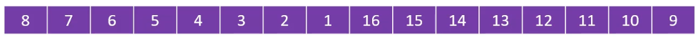

# `程序=数据结构+算法！`

刚开始学习算法时，先不要纠结于细节问题，诸如：这边要小于等于？那边是要大于还是大于等于？数组区间是要左闭右开还是左开右闭？...先将算法的大体结构实现好，后面再去微调，这样子思路会更清晰

# 1.【复杂度分析】

一般从以下几个角度评估算法：

- 正确性
- 可读性
- 健壮性
- 时间复杂度：估算程序指令的执行次数（执行时间）
- 空间复杂度：估算所需占用的存储空间

## 1.1.大O表示法

一般用大O表示法来表示数据规模n的时间复杂度，它仅仅是一种粗略的分析模型，是一种估算，只是能在短时间内了解一个算法的执行效率。

O(1) < O(logn) < O(n) < O(nlogn) < O(n^2^) < O(n^3^) < O(2^n^) < O(n!) < O(n^n^)

可以借助函数生成工具对比复杂度的大小：[[https://zh.numberempire.com/graphingcalculator.php](https://zh.numberempire.com/graphingcalculator.php)]


## 1.2.递推式

有些算法的时间复杂度肉眼就可以看出来，但是有些算法的时间复杂度需要用公式来推算，比如较复杂的递推操作，这类算法可以用`递推式`来计算，递推式对应的复杂度为：

| 递推式                     | 复杂度           |
| -------------------------- | ---------------- |
| T(n) = T(n/2) + O(1)       | O(logn)          |
| T(n) = T(n-1) + O(1)       | O(n)             |
| T(n) = T(n/2) + O(n)       | O(n)             |
| T(n) = 2 * T(n/2) + O(1)   | O(n)             |
| T(n) = 2 * T(n/2) + O(n)   | O(nlogn)         |
| T(n) = T(n - 1) + O(n)     | O(n<sup>2</sup>) |
| T(n) = 2 * T(n - 1) + O(1) | O(2<sup>n</sup>) |
| T(n) = 2 * T(n - 1) + O(n) | O(2<sup>n</sup>) |

至于`递推式`怎么计算？这个就要根据实际算法实现来分析了，比如：

```java
// 递归调用，对半平均分数组
private void divide(int[] array, int startIndex, int endIndex) {
    if (endIndex - startIndex <= 1) {
        return;
    }
    int middleIndex = (endIndex + startIndex) >> 1;
    divide(array, startIndex, middleIndex);
    divide(array, middleIndex, endIndex);
}
```

# 2.【排序】

排序算法属于较为简单且基础的算法知识，它分为两类：

- **比较类排序**：通过比较来决定元素间的相对次序，由于其时间复杂度不能突破O(nlogn)，因此也称为非线性时间比较类排序
- **非比较类排序**：不通过比较来决定元素间的相对次序，它可以突破基于比较排序的时间下界，以线性时间运行，因此也称为线性时间非比较类排序


排序算法有这样几个概念：

- 稳定性：如果相等的2个元素，排序前后的相对位置保持不变，就是具有稳定性的排序算法
- 原地算法：不依赖额外的资源或依赖少数的额外资源，空间复杂度为O(1)的都为原地算法，非原地算法称为：Not-in-place或者Out-of-place


## 2.1.冒泡排序

冒泡排序的动图演示：


**算法思想：**

比较相邻的两个元素，若后一个元素比前一个元素小，那么将这两个元素互换位置，经过这样一轮排序后，可以将数组中最大的元素移动到数组末尾。假设数组有n个元素，那么最差需要通过n-1轮的比较。冒泡排序可以有两个优化：

- 如果数组已经完全有序, 可以提前终止冒泡排序
- 如果数组末尾已局部有序, 记录最后一次比较的位置, 下一轮直接到该位置即可

**代码实现：**

```java
static void bubbleSort(int[] array) {
    // 需要进行n-1轮的比较，每经过一轮比较后，其实数组末尾已经有序，比如：第一轮比较后，数组最大元素
    // 元素就可以确定，所以下一轮比较的终止位置就是array.length-1。因此从后往前确定比较最终位置
    for (int end = array.length - 1; end > 0; end--) {
        // 记录最后一次交换的位置
        int lastSwapIndex = 1;
        for (int i = 0; i < end; i++) {
            // 相邻元素两两比较，若发送大小不一致，进入if语句块交换位置
            if (array[i] > array[i + 1]) {
                int n = array[i + 1];
                array[i + 1] = array[i];
                array[i] = n;
                // 发生位置交换了, 记录当前位置。如果这个变量在后续比较中都没有发生变化，那么
                // 说明从这个位置开始到数组末尾的元素都已经有序了，下一轮比较直接到这个位置为止。
                lastSwapIndex = i + 1;
            }
        }
        // 一轮遍历, 重置end的索引, 然后外层for循环就会对end-1, 再进行判断,
        // 是否要继续循环, 所以将lastSwapIndex的初始值设为1, 这样如果内层循环
        // 没有执行过, 那就意味着数组已经全有序, 外层for循环将end-1后变为0, 直接退出外层循环
        end = lastSwapIndex;
    }
}
```

## 2.2.选择排序

选择排序的动图演示：


**算法思想：**

每一轮比较（一轮：遍历一个区间的数组元素），可以选择找最小，或最大元素。假设数组元素个数为n，若一轮比较中找的是最小元素，则遍历区间为[0,n]，然后将其移动到下标为0的位置；下一轮比较区间为[1,n]，然后移动到下标为1的位置。同理，若找的是最大元素，第一轮比较的区间为[0,n]，将其移动到下标为n的位置；下一轮比较区间为[0,n-1]，将其移动到下标为n-1的位置。

选择排序与冒泡排序很相似， 都是将一轮比较中的最小/最大元素，移动到数组的极端位置，但是选择排序的交换次数远远小于冒泡排序，平均性能优于冒泡排序

**代码实现：**

```java
// 寻找最小值
private static int[] minimum(int[] array) {
    // 至少需要比较n-1轮
    for (int start = 0, length = array.length; start < length - 1; start++) {
        // 记录最小值的下标, 每进入一轮循环, 假设最开始下标的位置就是最小值
        int minimumIndex = start;
        // 1轮比较, 需要遍历[start, array.length-1]
        for (int j = start + 1; j < array.length; j++) {
            if (array[minimumIndex] >= array[j]) {
                minimumIndex = j;
            }
        }
        // 每轮比较完后, 可以得到一个最小值即array[minimumIndex],
        // 将其与array[start]互换位置
        int temp = array[minimumIndex];
        array[minimumIndex] = array[start];
        array[start] = temp;
    }
    return array;
}
```

```java
// 寻找最大值
private static int[] maximum(int[] array) {
    // 至少需要比较n-1轮
    for (int end = array.length - 1; end > 0; end--) {
        // 记录最小值的下标, 假设每次都是下标为0的位置为最大值
        int maximumIndex = 0;
        // 1轮比较, 需要遍历[0, end]
        for (int start = 0; start <= end; start++) {
            if (array[maximumIndex] <= array[start]) {
                maximumIndex = start;
            }
        }
        // 每轮比较完后, 可以得到一个最大值即array[maximumIndex],
        // 将其与array[end]互换位置
        int temp = array[maximumIndex];
        array[maximumIndex] = array[end];
        array[end] = temp;
    }
    return array;
}
```

## 2.3.插入排序

先看一下插入排序的动图演示


**算法思想**

与整理扑克牌的思想一样，假设现在有部分扑克牌已经有序，新摸到的扑克牌会依次与已经有序的扑克牌比较（例如从右到左比较），将其插入到合适的位置。插入排序做法很类似，它是从数组下标为1的位置开始，让它与下标为0的元素比较，如果比它小，则互换位置；接着再让数组下标为2的元素，依次与下标为1和0的比较；接着再让数组下标为3的元素，依次与下标为2,1,0的元素比较...以此类推，直至所有元素比较完。

插入排序的速度，与逆序对有关。比如像[2,1]、[80,10]、[9,5]...这种顺序颠倒的数组元素组合就称为逆序对，当一个数组的逆序对越多时，插入排序就需要更多的比较与交换；相反地，如果数组中逆序对很少，那么插入排序需要比较的次数就很少，完成的速度就越快。

其实，插入排序的耗时，大部分在于需要依次与其左边的元素比较，得出它该插入的下标位置。所以如何快速地得到待插入的下标，就是解决插入排序的关键：可以采用二分查找思想，假设现在要判断插入位置的元素下标为7，则将它在[0,6]的数组区间内进行二分查找，确认出它的插入位置，接着再移动，可以有效减少比较次数～

**代码实现**

```java
protected void internalSort(int[] array) {
    int start;
    for (int i = 1, len = array.length; i < len; i++) {
        start = i;
        while (start > 0) {
            // 依次将元素与其左边的各个元素比较
            if (compareByIndex(start - 1, start) > 0) {
                swap(start, start - 1);
                start--;
            } else {
                // 因为元素左边以前有序了，如果元素最右边都小于这个元素了，
                // 那么之前的元素肯定都小于它
                break;
            }
        }
    }
}
```

## 2.4.希尔排序

先看一下希尔排序的动图演示


**算法思想：**

希尔排序，也称为缩小增量排序，实际上是[插入排序](# 2.3.插入排序)的改进版。插入排序的效率取决于原数组的逆序对的数量，希尔排序的思想就是来减少原数组的逆序对：它通过公式计算出`步长序列`，这个`步长序列`其实就是一个数组，里面的每个元素标志着待排序数组需要分成多少列。希尔本人给出的公式为n/2<sup>k</sup>，k=1,2,3,4,...，举个例子，待排序数组的元素为16时，`步长序列`为8,4,2,1。

得到`步长序列`后，将待排序数组依次指定列，然后进行插入排序。比如上例8,4,2,1，就是让数组先分为8列，每列单独排序；再分为4列，每列单独排序；再分为2列，每列单独排序。最后分为1列，单独排序。当然分为1列时，就是原数组直接排序了。每一步这样操作，都是为了降低原数组中的逆序对，加大插入排序的效率。

假设原数组如下，有16个元素，计算出步长序列，假设还是8-4-2-1


将数组的前8个元素和后8个元素分割开，就可以变为2行，每行8列，如下图左边所示。然后让每一列单独进行插入排序，即8和16排序，15和7排序，14和6排序..，最终结果就如下图右边所示


需要明确一点，希尔排序并不是真正将数组拆分出来单独排序，而是在逻辑上将他们视为一列（通过数组下标来确定关系）因此呢，上面排序完的结果体现在原数组上，就像这样子：



经过上面8列排序后，数组可以减少一些逆序对。接着在第一步基础上，再将数组（紫色部分）每隔4个元素分为一列，则可以分为4行，每行4列，如下图左边所示。同样地，也是每一列单独进行插入排序，即8-4-16-12排序，7-3-15-11排序...，最终结果就如下图右边所示：


经过4列排序后，数组就变为：


在4列的基础上，再分为2列排序，接着也是每列单独排序：


经过2列排序后，数组就变为下图这样子，可以看到有效减少逆序对。最后再分为一列排序，实际也就是直接对原数组进行插入排序了


**代码实现**

```java
/**
 * 希尔排序
 */
protected void internalSort(int[] array) {
    int[] steps = shellStepSequence(array);
    // 按照步长序列, 将数组依次拆分为指定的列数
    for (int step : steps) {
        // step表示要将数组拆分的列数, 分成几列, 就要比较几列
        for (int col = 0; col < step; col++) {
            // 开始比较的位置, 因为插入排序不需要比较第一个位置, 所以直接向后移动一位.
            // 然后依次取本列中下一个需要比较的元素.
            for (int start = col + step; start < array.length; start += step) {
                // 这边就是简单插入排序的代码: 依次将元素与其左边的各个元素比较
                int cur = start;
                int prev = cur - step;
                while (cur > col && compareByIndex(cur, prev) < 0) {
                    swap(cur, prev);
                    cur = prev;
                }
            }
        }
    }
}

```

```java
/**
 * 获取数组的步长序列
 */
private int[] shellStepSequence(int[] array) {
    int len = array.length;
    List<Integer> list = new ArrayList<>();
    while ((len /= 2) > 0) {
        list.add(len);
    }
    return list.stream().mapToInt(Integer::intValue).toArray();
}
```

## 2.5.归并排序

先看一下归并排序的动图演示


**算法思想：**

归并排序是由`冯·诺依曼`首次提出，它的做法是将一个数组不断地对半分割为2个子数组，直至无法再分割（即每个子数组只有一个元素），接着不断地将每个子数组比较且合并为一个新的数组，直至合并称为一个完整的数组。其实就跟JDK8的fork-join框架一个思想：


是不是听起来很简单，其实实现起来还是有点绕，也不是说难理解，就是指针会多一些。首先思考一个问题，如何将两个有序的数组A和B合并为一个新的数组？很简单，分别定义2个指针a1,a2指向数组A的前后位置，再定义2个指针b1,b2指向数组B的前后位置，最后创建一个新数组C，定义1个指针c1执行数组C的起始位置


依次比较a1和b1，谁小谁放入到c1位置。上例，开始的时候a1=0，代表值为`1`，b1=0，代表值为`2`，明显`1<2`，所以让拷贝`1`到c1=0位置上，同时a1++，c1++，b1保持不变。然后接着比较a1=1和b1=0...依次类推，直到某一方遍历结束，上例明显是a1会先达到a2。

归并排序的代码实现跟上面很类似，但有一点，**它不是拷贝一个完整的新数组出来**。因为它是对半分割的，每次都是比较左右两边（元素个数相差<=1）所以，归并排序只拷贝其左边数组，然后同样也定义5个指针，2个指针指向拷贝出来的数组，2个指针指向原数组的右边，最后1个指针也指向原数组，用于将左右两边比较结果覆盖进去。

以下图所示：array表示原数组，leftArray表示拷贝原数组左边部分即[3,6,11,18]。其中li和ri分别指向leftArray和array的起始位置，默认为0，ai指向array的起始位置，默认也为0。接着就是依次比较li和ri指向的值的大小，将较小的值覆盖掉ai指向的位置：


**代码实现：**

```java
/**
 * 归并排序的第一步，分割操作。刚开始startIndex=0, endIndex=array.length
 */
private void divide(int[] array, int startIndex, int endIndex) {
    if (endIndex - startIndex <= 1) {
        // 范围[starIndex, endIndex)数组已经无法分割, 即这区间的元素数量只有1或0
        return;
    }
    int middleIndex = (endIndex + startIndex) >> 1;
    // 递归调用, 对左右子序列进行分割
    divide(array, startIndex, middleIndex);
    divide(array, middleIndex, endIndex);
    // 递归调用结束, 说明数组已经无法再分割了, 此时进行合并操作
    merge(array, startIndex, middleIndex, endIndex);
}


/**
 * 归并排序的第二步，合并操作，这一步比较绕
 */
private void merge(int[] array, int startIndex, int middleIndex, int endIndex) {
    // ls即leftStart, 表示复制的temp数组的起始索引, 固定为0; 
    // le即leftEnd, 表示复制的temp数组的终止索引(不包括)
    int ls = 0, le = middleIndex - startIndex;
    // rs即rightIndex, 表示右边数组(原数组)的起始索引; 
    // re即rightEnd, 表示右边数组(原数组)的终止索引(不包括)
    int rs = middleIndex, re = endIndex;
    // 每次比较结果都需要更新到原数组上, 所以还需要额外定义一个指针ci, 即currentIndex
    int ci = startIndex;

    // 备份出左边数组, 这边的temp定义在方法外部，直接取array.length/2的长度即可
    for(int i = 0; i < le; i++){
        // 注意这边要用 startIndex + i, 因为并不是从原数组下标为0的位置开始拷贝
        temp[i] = array[startIndex + i];
    }

    // 一旦左边数组比较完了, 即ls >= le, 那么就没必要再继续比较了, 右边数组也不需要再操作,
    // 因此这边使用左边数组(备份的数组)的指针来做循环条件.
    while(ls < le){
        // 这个if条件有两个含义：
        
        // 其一, 外层循环已经保证ls和le的正确性, 这里rs < re来保证右边数组遍历的正确性,
        // 一旦右边数组已经比较完毕, 则直接进入else语句块；
        
        // 其二, 依次比较temp和array的元素大小, 如果temp的元素比array的元素, 那么就需要将值较小
        // 的元素移位, 移动到ci位置上, 为了保证稳定性, 这边只能用大于而不不能用大于等于.
        if(rs < re && compareByValue(temp[ls], array[rs]) > 0){
            array[ci++] = array[rs++];
        }else{
            // 否则右边index=rs的元素比左边index=rs的大,
            array[ci++] = temp[ls++];
        }
        swapCount();
    }
}
```

## 2.6.快速排序

先看一下快速排序的动图演示


**算法思想：**

在数组中选择一个轴点元素（假设为pivot），一般会选择数组首元素或者随机选择一个元素，然后通过这个pivot将数组分割为两个部分：左边部分比pivot小，右边部分比pivot大，所以呢快速排序的本质就是，将数组中的每一个元素都转换成pivot。一个完整的快速排序过程如下：

- 刚开始选择数组首元素即`6a`，定义两个指针`begin`和`end`（a只是为了判断快速排序算法的稳定性）
- 让`end`并依次与`6a`比较，刚开始`end`表示的值为7大于6，所以`end--`，就到5
- 5小于6，所以将`end`指定的元素即5，覆盖掉`begin`指定的位置，`end`保持不变，`start++`
- 并且比较的方向转为从`start`开始，此时`start`表示的值为`8a`，8比6大，将`start`指定的元素即8a覆盖掉`end`指定的位置，`start`保持不变，`end--`
- 比较方向又回到`end`这一边...以此类推，直至`begin`和`end`相等

快速排序是不稳定的排序，在轴点元素左右元素分布均匀的情况下，其最好的时间复杂度为O(nlog<sub>n</sub>)，但是轴点元素左右两边分布超级不均匀的情况下，其最坏时间复杂度为O(n<suP>2</sup>)。


**代码实现**

```java
/**
  * @param array 待排序数组
  * @param start 起始索引(包含)
  * @param end   终止索引(不包含)
  */
private void sortV2(int[] array, int start, int end) {
    if (end - start < 2) {
        // 如果元素数量只剩一个, 就没必要再比较了, 直接返回
        return;
    }
    // 在[start, end)数组区间范围内定位锚点元素的下标位置
    int pivotIndex = pivotIndex(array, start, end);
    // 递归调用, 以pivotIndex分割, 对数组左边元素进行快速排序, 即[start, pivotIndex)
    sortV2(array, start, pivotIndex);
    // 递归调用, 以pivotIndex分割, 对数组右边元素进行快速排序, 即[pivotIndex + 1, end)
    sortV2(array, pivotIndex + 1, end);
}

/**
  * 通过三个while循环来决定向左比较还是向右比较, 确定锚点元素在"未来排好序"的数组中的实际下标位置
  *
  * @param array 待排序数组
  * @param start 起始索引
  * @param end   终止索引
  * @return 锚点元素的索引
  */
private int pivotIndex(int[] array, int start, int end) {
    // 获取锚点元素, 为了排列均匀, 可以采取随机取值的做法
    int base = array[start];
    // 获取终止下标
    end--;
    while (start < end) {
        // 循环执行右边
        while (start < end) {
            // 这边只能使用小于, 而不能使用小于等于.
            // 因为当数组的元素都与锚点元素值相等时, 如果是小于等于, 则end一直递减, 则锚点元素
            // 每次都会定位到start位置, 然后下一次递归就定位到start + 1位置, 最终导致快速排序
            // 退化为O(n^2). 但是如果是小于的话, 可以使元素分布更加均匀, 每遇到值相等元素就执行
            // else语句块, 交由左边执行...
            if (compareByValue(base, array[end]) < 0) {
                end--;
            } else {
                // 用end指定的元素去覆盖start的元素, 然后start++, 开始从左边比较.
                cover(start++, end);
                // 执行左边
                break;
            }
        }

        // 循环执行左边
        while (start < end) {
            // 这边用大于的原因跟上面的理由一样
            if (compareByValue(base, array[start]) > 0) {
                start++;
            } else {
                // 用start指定的元素去覆盖end的元素, 然后end--, 开始从右边比较.
                cover(end--, start);
                // 执行右边
                break;
            }
        }
    }

    // 跳出循环说明, start==end, 数组两边都已经整理有序
    array[start] = base;
    return start;
}
```


## 2.7.堆排序

先看一下堆排序的动图演示


**算法思想：**

将给定数组进行堆化（最大二叉堆），这样堆顶元素array[0]就是值最大元素。然后重复执行下面的操作直至堆的元素数量为1：

- 交换堆顶元素和尾元素
- 堆的元素数量减一
- 堆顶元素进行一次下滤操作（siftDown）

注意，由于堆顶元素会移动到尾元素，当数组中两个元素值相等时，处于前面位置的元素会先移动到尾元素，导致它们的位置调换了，所以堆排序属于不稳定排序。它的最好、最坏、平均时间复杂度都是O(nlogn)，空间复杂度为O(1)

**代码实现：**

```java
/**
 * 堆排序 
 */
private static int[] sort(int[] array){
    int heapSize = array.length;
    // 原数组建堆
    heapify(array);
    //
    while(heapSize > 0){
        // 首尾交换, 将值最大的元素移到数组末尾
        int tmp = array[0];
        array[0] = array[heapSize -1];
        array[heapSize - 1] = tmp;
        //
        heapSize -= 1;
        siftDown(array, 0, heapSize);
    }
    return array;
}


/**
 * 对原数组建堆
 */
private static void heapify(int[] array){
    for (int i = (array.length >> 1); i >= 0; i--) {
        siftDown(array, i, array.length);
    }
}

/**
 * 二叉堆下滤操作
 */
private static void siftDown(int[] heap, int index, int size){
    int el = heap[index];
    for (; ; ) {
        // 获取最大子元素下标
        int cIndex = maxChildIndex(heap, index, size);
        if (cIndex == -1) {
            // 没有子元素就跳出循环
            break;
        }
        // 与最大子元素比较大小
        if (el - heap[cIndex] >= 0) {
            // 如果比最大子元素还大, 就不用再下滤了, 跳出循环
            break;
        }
        // 比最大子元素还小, 则与最大子元素互换位置, 然后继续下滤
        heap[index] = heap[cIndex];
        index = cIndex;
    }
    heap[index] = el;
}


/**
 * 给定一个父索引，求得它的最大值子索引
 */
private static int maxChildIndex(int[] heap, int index, int size) {
    // 左子元素索引
    int left = (index << 1) + 1;
    if (left < size) {
        // 左子元素存在, 判断右子元素存在
        int right = left + 1;
        if (right < size) {
            // 右子元素也存在
            return heap[left] - heap[right] > 0 ? left : right;
        } else {
            return left;
        }
    } else {
        // 左右子元素都不存在
        return -1;
    }
}
```

## 2.8.计数排序

先看一下计数排序的动图演示。计数排序、基数排序和桶排序都不是基于比较的排序，它们需要占用额外的内存空间，属于典型的空间换时间


**算法思想：**

计数排序适合于有一定范围内的整数进行排序，它会统计原数组每个元素的出现次数，然后可以推导出它在有序新数组中的位置。

- **简单实现**。

  - 先找出数组中的最大值m，然后开辟m+1的数组空间。接着，遍历原数组，每一个元素的值都表示新开辟数组的索引。例如，原数组第一个元素为7，则在新开辟数组index=7的元素置为1；原数组第二个元素为3，则在新开辟数组Index=3的元素置为1...如果元素已经在新开辟数组中存在，则直接累加1。

  - 这样子操作后，原数组的数据都放到新开辟数组中，那么可以统计新开辟数组对应索引出现的次数，将其还原到原数组中。例如，由于前3个索引index=0,1,2没有元素，直接跳过，index=3出现的次数为1，则将3赋值给原数组index=0位置上；接着索引4出现一次，则将4赋值给原数组index=1的位置上；接着索引5出现两次，则原数组index=2和3的位置都赋值为5...以此类推！！！


简单实现的计数排序缺点很多：极大浪费内存空间，无法对负整数排序，还是属于一个不稳定的排序算法！

- **改进版**

  - 先找出原数组中的最小值`min`和最大值`max`，通过他们`max-min+1`确定计数数组count的范围大小，然后还是和计数排序简单实现类似，遍历原数组的每个元素k，通过`k-min`得到元素k在count数组的索引位置。例如原数组第一个元素为7，`7-3=4`所以元素7在count[4]的位置，同时出现次数记为1。这样遍历完原数组后，就可以得到所有元素在count数组出现的次数。

  - 然后，统计这个count数组，原先它记录的是每个元素出现的次数，现在变为在它之前累计的次数总和。例如：原先count数组index=1的值为1，表示元素4出现的次数为1，由于index=1之前还存在index=0的元素（也就是min）它出现的次数也为1，所以count数组index=1的值就变为2...以此类推。

  - 最后按照从索引大到小的顺序遍历**原数组**，可以得到元素k，通过与min相减得到k在count数组中的索引。例如，原数组最后一个元素为5，`5-3=2`，那么找到count[2]，它的值等于4，那么第一个出现的元素5处于有序数组的位置就是3；建议把3更新回count数组中，因为这样子到遍历原数组前一个5时，这个元素5处于有序数组的位置就是2...其他元素也是类似这样的算法去重新定位它们在有序数组的位置。


​	这边有几个公式有助于理解：

​	1.假设原数组array的最小值为min；

​	2.array中的元素k对应的count数组索引为`k - min`

​	3.array中的元素k在有序序列中的索引：`count[k-min]-p`，p代表是原数组倒数第几个K

​	比如说：元素8在有序序列中的索引：count[8-3] - 1，等于count[5] - 1，等于8 -1 = 7。

**代码实现**

```java
public void Sort(int[] array) {
    // 找出最值
    int max = array[0];
    int min = array[0];
    for (int i = 1; i < array.length; i++) {
        if (array[i] > max) {
            max = array[i];
        }
        if (array[i] < min) {
            min = array[i];
        }
    }
    // 开辟内存空间，存储次数
    int[] counts = new int[max - min + 1];
    // 统计每个整数出现的次数
    for (int i = 0; i < array.length; i++) {
        counts[array[i] - min]++;
    }
    // 将上面统计到的counts数组, 每个索引下的元素累加次数
    for (int i = 1; i < counts.length; i++) {
        counts[i] += counts[i - 1];
    }
    // 从后往前遍历原数组，将它放到有序数组中的合适位置.
    // 注意这边一定需要开辟一个新的数组
    int[] newArray = new int[array.length];
    for (int i = array.length - 1; i >= 0; i--) {
        newArray[--counts[array[i] - min]] = array[i];
    }
    // 将有序数组赋值到array
    for (int i = 0; i < newArray.length; i++) {
        array[i] = newArray[i];
    }
}
```

## 2.9.基数排序

先看一下基数排序的动图演示


**算法思想：**

基数排序非常适合于整数排序（尤其是非负整数），它会将原数组中的每个元素，依次取它们的个位数、十位数、百位数、千位数、万位数....进行排序，即将原数组的每个元素单独地按照从低位到高位的排序。


**代码实现**

```java
protected void sort(int[] array) {
    // 找出最大值
    int max = array[0];
    for (int i = 1; i < array.length; i++) {
        if (array[i] > max) {
            max = array[i];
        }
    }

    // 个位数: array[i] / 1 % 10 = 3
    // 十位数：array[i] / 10 % 10 = 9
    // 百位数：array[i] / 100 % 10 = 5
    // 千位数：array[i] / 1000 % 10 = ...

    for (int divider = 1; divider <= max; divider *= 10) {
        countingSort(divider);
    }
}

// 获取到个位，十位，百位...的值后，单独对这些值进行计数排序
protected void countingSort(int divider) {
    // 开辟内存空间，存储次数
    int[] counts = new int[10];

    // 统计每个整数出现的次数
    for (int i = 0; i < array.length; i++) {
        counts[array[i] / divider % 10]++;
    }

    // 累加次数
    for (int i = 1; i < counts.length; i++) {
        counts[i] += counts[i - 1];
    }

    // 从后往前遍历元素，将它放到有序数组中的合适位置
    int[] newArray = new int[array.length];
    for (int i = array.length - 1; i >= 0; i--) {
        newArray[--counts[array[i] / divider % 10]] = array[i];
    }

    // 将有序数组赋值到array
    for (int i = 0; i < newArray.length; i++) {
        array[i] = newArray[i];
    }
}
```

## 2.10.桶排序

先看一下桶排序的动图演示


**算法思想：**

桶排序实际上是一个`方法论`，它规定创建一定数量的桶（比如用数组、链表作为桶），然后按照一定的规则（数据的类型不同，使用的规则就不同），将序列中的元素均匀分配到对应的同中。接着，分别对每个桶进行单独排序，最后将所有非空桶的元素合并为有序序列，有点像`分而治之`的思想。

# 3.【递归】

递归（recursion）是一种编程技巧，是指方法（函数）直接或间接调用自身。通常把一个大型复杂的问题层层转化为一个与原问题相似的规模较小的问题来求解，设置有边界条件（递归基）、递归前进段和递归返回段：

- 当边界条件不满足时，递归前进；
- 当边界条件满足时，递归返回；

但是，使用递归并不是为了求得最优解，而是为了简化解决问题的思路，会让代码更加的简洁。

## 3.1.基本思想

- **首先：拆解问题**
  - 规模大的问题变成规模较小的同类型问题；
  - 规模较小的问题又可以不断变成规模更小的问题；
  - 规模小到一定程序可以直接得出问题的解；

- **其次：求解推进**
  - 最小规模问题的解可以得出较大规模问题的解；
  - 较大规模问题的解不断得出更大规模问题的解；
  - 最后得出来原来问题的解；

## 3.2.使用套路

- **确定函数功能**
  - 先不要思考函数内的代码怎么写，首先弄清楚该函数干嘛用的，能完成什么功能

- **确定原问题和子问题的关系**
  - 即寻找f(n)与f(n-1)的关系

- **确定递归基**
  - 递归过程中，子问题的规模不断减小，当小到一定程度可以直接求得解。因此就必须思考问题规模小到什么程度可以直接求得解，就能确定递归基（递归终止条件）

## 3.3.调用过程

不管哪种编程语言，每个方法调用都是将方法信息压入一个调用栈，当方法调用完成后又移出栈。递归也是如此，只不过递归压入调用栈的都是同一个方法。

```java
public static void main(String[] args){
    sum(4);
}

private static int sum(int n){
    if (n <= 1) return n;
    return n + sum(n-1);
}
```


## 3.4.递归例子

- 上楼梯（跳台阶）
- 汉诺塔


画递归树。。。。。。。。。。。分析代码调用流程，找出f(x) 与 f(x-1) 的关系，从而写出递归式


# 4.【回溯】

回溯算法（Backing Tracking）是一种选优搜索法，又称为试探法，可以简单地理解为通过选择不同的岔路口来通往目的地（即目标结果），每一步都可以选择一条路出发，能进则进，不能进则退回到上一步（即回溯），再换一条路试试...重复这个过程！

回溯算法通常用最简单的[递归](https://zh.wikipedia.org/wiki/递归)方法来实现，一般的算法步骤为：for循环+递归，for 循环里面的递归，在递归调用之前「做选择」，在递归调用之后「撤销选择」。典型的回溯算法应用：树、图和深度优先搜索算法、八皇后问题、走迷宫等...什么情况下需要用到回溯？比如一个问题上来，一开始就有很多种选择，从中选取一种方式以后，发现又有很多选择可以选，这种问题就可以选择回溯算法解决

## 4.1.八皇后问题

....

# 5.【贪心】

贪心算法（Greedy）也称为贪婪策略，每一步都才去当前状态下最优的选择（即局部最优解），从而希望推导出全局最优解。贪心算法并不一定能得到全局最优解，它属于“走一步看一步”的思想：

- 优点：简单、高效、不需要穷举所有可能，通常作为其它算法的辅助算法来使用；
- 缺点：每次采取局部最优解，不会再回溯，不从整体上考虑其它可能，因此很少情况会得到最优解

# 6.【分治】

分治算法（Divide And  Conquer）语义就是分而治之，它的一般步骤是：

1. 将原问题分解成若干个规模较小的子问题，**子问题与原问题结构一样，只是规模不同；**
2. 子问题又不断分解成规模更小的子问题，知道不能再分解，**即可以轻易计算出子问题的解；**
3. 利用子问题的解推导出原问题的解，**子问题之间是相互独立的。**

分治算法和回溯算法一样，特别适合使用递归。它通常遵守一种通用模式：解决规模为n的问题，分解成a个规模为 n/b 的子问题，然后在O(n<sup>d</sup>)时间内将子问题的解合并起来。算法运行时间为：T(n)=aT(n/b) + O(n<sup>d</sup>)，a > 0，b > 1，d &ge; 0，如果：

- d > log<sub>b</sub>a，T(n)=O(n<sup>d</sup>)
- d = log<sub>b</sub>a，T(n)=O(n<sup>d</sup>logn)
- d < log<sub>b</sub>a，T(n)=O(n<sup>log<sub>b</sub>a</sup>)

例如归并排序的运行时间为：T(n)=2T(n/2) + O(n)，则 a=2，b=2，d=1，所以T(n)=O(nlogn)

# 7.【动态规划】

1. 定义状态
2. 确定dp[0]
3. 状态转移方程


通过动态规范解出来的DP数组，可以将其用画图的形式表达出来，分析构造DP数组的过程，然后解析代码使用DP数组的逻辑。这样子，可以省略掉DP数组其它不用的地方，从而对初始化的DP进行优化！！！

# 8.【模式匹配】

模式匹配是字符串（由若干个字符组成的有序序列）中常用的算法，用于确定一个模式串是否存在于文本串中。因为字符串是由若干个字符组成的，所以它们的匹配算法本质上肯定需要一个字符一个字符的比较，而模式匹配算法的关键在于怎么减少字符的比较次数。在学习模式匹配算法之前，需要了解字符串的一些概念，以“ababc”为例：

- 前缀：a、ab、aba、abab、ababc、
- 真前缀：a、ab、aba、abab
- 后缀：c、bc、abc、babc、ababc
- 真后缀：c、bc、abc、babc

就是说，字符串的前缀是从它的第一个字符开始，向后延伸的各个子串，包括字符串本身，而真前缀是在前缀集合中除去字符串本身；相反地，字符串的后缀就是从它的最后一个字符串开始，向前延伸的各个子串... ...

## 8.1.蛮力算法

字符串模式匹配的基本解决方案，也是最容易想到的，就是蛮力算法。它会定义两个指针：pi指向模式串，ti指向文本串。指针是代表字符串中的每一个字符，匹配过程：

- pi=0，ti=0，分别表示模式串的字符【1】和文本串的字符【1】，发现它们相等，那么pi++，ti++；
- pi=1，ti=1，分别表示模式串的字符【0】和文本串的字符【0】，发现它们相等，那么pi++，ti++；
- pi=2，ti=2，分别表示模式串的字符【0】和文本串的字符【0】，发现它们相等，那么pi++，ti++；
- pi=3，ti=3，分别表示模式串的字符【0】和文本串的字符【1】，发现它们不等，pi=0，ti=ti-pi+1，其实就是让ti回到它最开始比较位置的下一位，视觉效果上就是让模式串前进一位;
- pi=0，ti=1，分别表示模式串的字符【1】和文本串的字符【0】，发现它们不等，pi=0，ti=ti-pi+1;
- ....重复这个过程，直到pi=4已经达到模式串的长度，那么此次匹配就到此为止！！！


很明显，蛮力算法的匹配思想，就是让模式串和文本串，一个字符一个字符地匹配。如果能匹配成功，那么就让指针都加1，如果匹配失败，那么模式串指针回退为0，而文本串指针ti回到最开始比较位置的下一位，其实就是让ti减去pi，回到ti最开始的地方，然后ti+1，就可以表示下一位。重复这个过程，直到pi等于模式串长度plen，那么就匹配成功；当然，如果ti已经匹配到文本串的最后一个字符串了，pi小于plen，说明模式串不存在文本串中！！

## 8.1.KMP

KMP，全称为Knuth-Morris-Pratt，取名自3位发明人的名字：Donald Knuth、James Hiram Morris、Vaughan Pratt，于1977年发布。KMP算法主逻辑的最好时间复杂度为O(m)，最坏时间复杂度为O(n) ~ O(2n)，next表的构造过程跟KMP主逻辑类似，它的时间复杂度也为O(m)，所以KMP算法整体上最好时间复杂度为O(m)，最坏时间复杂度为O(m + n)，空间复杂度为O(m)，其中m是模式串长度，n是文本串长度！

KMP和蛮力算法的过程相似，它的精妙之处在于，当匹配失败时，可以让模式串滑动一大块距离，减少在蛮力算法过程中没必要的字符比较。KMP算法在匹配前，会预先给模式串“ABCDABCE”生成一个专属的next表（怎么生成的后面讲），假设在ti=8，pi=7这个位置匹配失败时：

- 如果是蛮力算法，那么会将pi置为0，ti置为2，重新再一个一个比较；
- KMP算法它会查表，得到next[7]=3，那么它就会将pi重置为3，ti保持不变，然后再一个字符一个字符比较；
- 发现ti=8，pi=3也不相等，就继续查表得next[3]=0，所以就重置pi为0，ti继续保持不变，再比较；
- 发现ti=8，pi=0还不相等，查表next[0]=-1，说明已经达到模式串的起点了，那么就需要让ti++，重新比较;
- ... ... 可以大致看出来，KMP在每次匹配失败时，都可以让模式串滑动一定的距离，减少了很多没必要的比较


### 8.3.1.核心原理

A和B是一个子串（多个字符），c、d、e是单个字符。当模式串匹配到e这个字符时，发现与文本串的d不相等，根据KMP思想，它会让模式串滑动一块距离，直接让c和d来比较。那么问题来了，为啥KMP可以这样子滑动？其实很简单，既然直接让c和d比较，说明A和B肯定是相等的（你都相等了我还比较干嘛~）也即A==B！！！


所以KMP必须在模式串**失配字符e的左边子串中，找出符合条件的A和B，然后才可以知道要滑动的距离**，这个距离等于=e左边子串的长度 - A的长度。而且e左边子串的长度其实就是e的索引，A的长度其实就是c的索引，所以等价于`e的索引-c的索引`。前面讲过，KMP会算出一个next数组，当在e失配时，查表得到`next[e的索引]`，实际上就是等于c的索引（怎么算的下面讲），最终向右移动的距离= `e的索引-next[e的索引]`。总结：若在pi位置失配，向右移动的距离=`pi-next[pi]`，下一个比较的模式串字符就是`next[pi]`。所以next[pi]越小，滑动的距离越大。**next[pi]实际上是pi左边子串的真前缀和真后缀的最大公共子串长度**！！！

### 8.3.2.构造next表

next表的作用就是在模式串`i`这个位置失配了，通过`next[i]`来找到模式串`[0, i)`这一段子串中的真前缀和真后缀的最大公共子串长度。所以本质上：**求next表的过程就是在求模式串每一个字符它左边子串的真前缀和真后缀的最大公共子串长度**，即：


模式串“ABCDABCE”求得的每个字符的最大公共子串长度为`[0, 0, 0, 0, 1, 2, 3, 0]`，而为了写代码方便，通常会把这个数组全员向右移动一位，首位置为`-1`，变为`[-1, 0, 0, 0, 0, 1, 2, 3]`作为next数组。这样做的目的在于，当某个位置失配，比如最后一个字符【E】，那么实际上要靠子串“ABCDABC“来决定滑动的距离，所以`next[E的索引]`实际要存储的是子串“ABCDABC“的值；而为什么要将首位置为`-1`，其实就是为了标识：当模式串失配查next表返回到第一个字符时，如果这个字符也匹配失败了，那么实际上要让模式串向右移动一位去匹配主串当前字符的下一个字符；而且，值为`-1`在实现代码时可以直接加1得到0，实际也有便于写代码的作用！~


**next表构造思路**

构造next表，实际上就是让模式串自己跟自己比较，其实现过程有点像动态规划。它的理解过程不能从0到1开始推导，要从一个中间状态开始推导，比较好理解。下图中`n`和`i`是模式串的两个索引下标，`next[i]`实际上就是模式串`[0, i)`这一段子串中真前缀和真后缀的最大公共子串长度，很明显就是图中的两个A之间，而这个子串的长度其实就是`n`，所以`next[i] == n`


所以现在实际上是已知`next[i]`的值，求得`next[i+1]`的值：

1. 如果`Pattern[i] == Pattern[n]`，即两个字符是相等的，那么`next[i+1]=n+1`；
2. 如果`Pattern[i] != Pattern[n]`，就得看`n`这个位置左边的子串，实际上就是拿到`next[n]`的值。可以假设`next[n]=k`，也就是说模式串`n`这个字符左边子串的真前缀和真后缀的最大公共子串长度为k，实际上就是下图中的A


- 如果`Pattern[i] == Pattern[k]`，那么`next[i+1]=k+1`；

- 如果`Pattern[i] != Pattern[k]`，那么就得看`next[k]`的值，就要把目光移到`k`这个位置左边的子串。实际上就是将`n`的值替换为`k`，然后重新执行上面的第2步！！！

有没有发现，当在求`next[i+1]`的值时，是可以确定此时真后缀的最后一个字符是`i`这个位置。一旦匹配失败，就是要从已经计算好的`next[]`表去找一个真前缀且它的最后一个字符与`i`这个位置相等，直到找到`next[]`的尽头，那说明确实没有，则`next[i+1] = 0`！

### 8.3.3.优化思路

原生的KMP算法存在不足，当模式串中存在若干重复字符时，在匹配过程中就会退化成蛮力算法。比如下图在模式串`i=3`这个位置匹配失败时


- 通过查表next[3]=2，所以从模式串`i=2`这个位置重新匹配，发现不相等；
- 再次查表next[2]=1，所以从模式串`i=1`这个位置重新匹配，发现还是不相等；
- 还会查表next[1]=0，所以从从模式串`i=0`这个位置重新匹配，仍然是不相等；
- 最终查表next[0]=-1，发现要移动主串指针，才能匹配成功。实际上上面的3次比较是没意义的，因为肉眼也可以看出来前面都是A，而要比较的字符是B，所以肯定不相等啊~

可以在构造next表的时候，手动加入一些判断，优化思路如下：


- 如果`Pattern[i] != d`，就让模式串滑动到`next[i]`，即`n`这个位置，然后再跟主串的`d字符`比较；
- 如果`Pattern[n] != d`，就让模式串滑动到`next[n]`，即`k`这个位置，然后再跟主串的`d字符`比较；

- 如果`Pattern[i] == Pattern[n]`，那么当`i`位置失配时，`n`位置肯定也会失配，模式串最终要滑动到`k`位置与主串`d字符`比较，所以`next[i]`就不要保存`n`这个位置了，而是直接保存`k`这个位置，即`next[n]`赋值给`next[i]`！！！

## 8.2.Boyer-Moore

Boyer-Moore算法，简称BM算法，由Robert S. Boyer和 J Strother Moore于1977年发明。该算法的最好时间复杂度为O(n/m)，最坏时间复杂度为O(n + m)，其中m为模式串长度，n为文本串长度。该算法是从模式串的尾部开始向前匹配，每次匹配失败要移动的字符数是通过下面2条规则分别计算的值，来选择其中较大的值：

- 坏字符规则，Bad Character，简称BC；
- 好后缀规则，Good Suffix，简称GS；

**坏字符规则**


每次都是从模式串的最后一个字符向前比较，当模式串中的字符E和文本串的字符S失配时，文本串的S称为“坏字符”，然后进行判断：

- 如果模式串的未匹配子串中不存在坏字符，直接将模式串移动到当前坏字符的下一位；
- 如果模式串的未匹配子串存在坏字符，让最靠右的坏字符与文本串中的坏字符对齐，再从模式串最后一个字符向前比较；

**好后缀规则**


当模式串与文本到某一个位置匹配失败时，模式串之前那些已经匹配成功的字符，比如图中的“MPLE”。其中，“E”、“LE”、“PLE”、“MPLE”都是好后缀，然后进行判断：

- 如果模式串未匹配字符中找不到与好后缀对齐的子串，直接将模式串移动好后缀的下一位；
- 如果可以找到，从模式串中找出子串与文本串中的好后缀对齐。

## 8.3.Rabin-Karp

Rabin-Karp算法，简称RK算法，是一种基于hash的字符串匹配算法，由 Richard M. Karp和 Michael O. Rabin与1987年发明。它的大致原理：

- 将模式串的hash值与文本串中每个子串的hash值进行比较；
- 某一子串的hash值可以根据上一子串的hash值在O(1)时间内计算出来；

## 8.4.Sunday

Sunday算法由Daniel M.Sunday在1990年提出，它的思想跟BM算法很类似：

- BM算法是模式串从后往前匹配，Sunday算法是从前往后匹配
- 当匹配失败时，关注的是文本串中参与匹配的子串的下一位字符A：
  - 如果A没有在模式串出现，可以直接跳过它，移动位数=模式串长度+1
  - 如果A在模式串存在，让模式串中最靠右的A与文本串的A对齐；


1. 一开始模式串匹配到“E”这个字符时就失败，此时文本串参与匹配的子串为“SUBSTR”，它的下一个字符是“I”；
2. 发现模式串中并没有字符“I”，所以让模式串直接移到文本串中的“N”开始比较；
3. 发现模式串的“S”与文本串的“N”不匹配，此时文本串参与匹配的子串就变为”NG SEA“，它的下一个字符是”R“
4. 发现模式串中存在字符“R”，就将它与文本串中的“R”对齐，然后再次从前往后匹配，发现匹配成功！