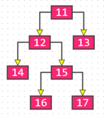
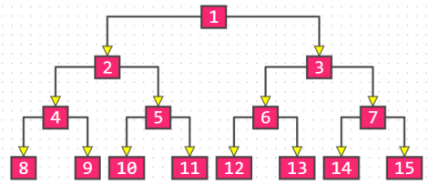
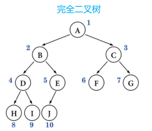

#                 `程序=数据结构+算法！`

# 1.数据结构与算法基础

## 1.1.复杂度

一般从以下几个角度评估算法：

- 正确性
- 可读性
- 健壮性
- 时间复杂度：估算程序指令的执行次数（执行时间）
- 空间复杂度：估算所需占用的存储空间

## 1.2.大O表示法

一般用大O表示法来表示数据规模n的时间复杂度，它仅仅是一种粗略的分析模型，是一种估算，只是能在短时间内了解一个算法的执行效率。

O(1) < O(logn) < O(n) < O(nlogn) < O(n^2^) < O(n^3^) < O(2^n^) < O(n!) < O(n^n^)

# 2.数组

## 2.1.稀疏数组

稀疏数组，即sparse array。怎么理解稀疏数组？可以看这样一个场景：有如下一个五子棋盘，如果要保存当前棋局，很自然地会想到用二维数组去保存， 

但是这样会有一个严重的问题，内存浪费严重，而且棋盘数据越少，浪费就越严重。当前只有2个棋子需要记录，但却开辟了一整块棋盘n*m的内存空间，保存无意义的0，在这种场景下，应该用稀疏数组替换掉二维数组。

 稀疏数组的做法是：

1. 记录原二维数组几行几列，有多少个值

2. 把有值的行列及其对应值记录到小规模数组上(即把原数组的数据压缩起来)

假设有如上的数组，它一共有6行7列，并且有8个非零值，要将其转换成稀疏数组可以这样操作：因为有8个非零值，说明就有8个行列要记录，所以新生成的稀疏数组至少需要8行；加上又要统计原数组的总行列数，又要多出1行，因此待转换的稀疏数组就要有9行。而稀疏数组只要记录元素组的行、列和值，所以需要3列。最终，上面数组转换的稀疏数组就是下面这个样子：

第一行：表示原数组有6行7列，有8个非零值

第二行：表示原数组的第1行的第4列（列数以0开始计数），值为22

 ...

 以此类推

# 3.线性表

# 4.栈

# 5.队列

队列最突出的特点就是FIFO（先进先出）原则，实现一个队列有两种方式：

1. 底层使用数组存储元素，称为顺式队列；

2. 底层使用链表存储元素，称为链式队列；

## 5.1.顺式队列

要实现一个顺式队列，需要两个指标：front和rear，一个表示队首，一个表示队尾。在逻辑上，必须控制元素入队被rear控制，元素出队被front控制！实际上，如果简单使用数组实现队列，会有个问题就是“假溢出”，即实际上有部分元素已经出队，但是由于rear指针递增，在临近数组长度时，就不能再接收新元素。因此一般会做成顺式循环队列

## 5.2.链式队列

# 6.哈希表

# 7.树

## 7.1.基础知识点

### 7.1.1概念

- 节点的度(degree)：子树的个数

- 树的度(degree)：所有节点度中的最大值；

- 叶子结点：度为0的节点

- 非叶子结点：度不为0的节点；

- 节点的深度(depth)：从根节点到当前节点的唯一路径上的节点总数；

- 节点的高度(height)：从当前节点到最远叶子结点的路径上的节点总数

### 7.1.2.二叉树

二叉树，Binary Tree，是运用最广的树形数据结构。

二叉树的特点：

- 每个节点的度最大为2（即最大拥有2棵子树）
- 左子树和右子树是有顺序的
- 即使某节点只有一颗子树们也要区分左右

二叉树的性质：

- 非空二叉树的第 i 层，最多有2^i-1^个节点，其中 i >= 1；
- 高度为 h 的二叉树中最多有2^h^-1个节点，其中h >= 1；
- 任意一颗二叉树，若其叶子节点个数为n~0~，度为2的节点个数为n~2~，则n~0~=n~2~+1；

二叉树的分类：

- 真二叉树，Proper Binary Tree，所有节点的度要么为0，要么2

  

- 满二叉树，Full Binary Tree，最后一层节点的度为0，其它节点度为2

  

- 完全二叉树：对节点从上至下、左至右开始编号，其所有编号都能与相同高度的满二叉树中的编号对应

  

  完全二叉树的性质：

  - 具有n个结点的完全二叉树，其深度为log~2~^n^+1或者log~2~(n+1)；
  - 度为1的节点要么是1个，要么是0个；

### 7.1.3.遍历

根据节点访问顺序的不同，二叉树的常见遍历方式有4种：

- 前序遍历（Preorder Traversal）- 先访问根节点，再前序遍历左子树，最后前序遍历右子树

  

- 中序遍历（Inorder Traversal）- 先中序遍历左子树，访问根节点，最后中序遍历右子树

  

- 后序遍历（Postorder Traversal）- 先后序遍历左子树，再后序遍历右子树，最后根节点

  

- 层序遍历（Level Order Traversal）- 从上到下，从左到右依次访问每一个节点

  

## 7.2.二叉搜索树

二叉搜索树，Binary Search Tree，简称BST，是二叉树的一种，也称为二叉查找树、二叉排序树。它是一种动态查找表，具有这些性质：

1. 任意一个节点的值都**大于**其**左**子树所有节点的值；

2. 任意一个节点的值都**小于**其**右**子树所有节点的值；

3. 其它的左右子树也分别为二叉查找树；

## 7.3.平衡二叉树

平衡二叉树也称为AVL树，具有如下的性质：

1. 要么空树，要么其根结点左右子树的深度之差的绝对值不超过1；

2. 其左右子树也是平衡二叉树；

3. 二叉树节点的平衡因子定义为该节点的左子树的深度减去右子树的深度。则平衡二叉树的所有节点的平衡因子只可能是-1,0,1

## 7.4.红黑树

红黑树是一种自平衡二叉树，在平衡二叉树的基础上每个节点又增加了一个颜色的属性，节点的颜色只能是红色或黑色。具有如下的性质：

1. 根结点只能是黑色；

2. 每个结点非红即黑，若一个结点为红色，则它的左右结点一定为黑色；

3. 每个叶子结点（即树尾端null指针或null节点）都是黑色；

4. 任意结点到叶子结点的nil指针的每条路径都包含相同的黑色结点

## 7.5.B树

B树和[B+树](#6.5.B+树)，都是为磁盘为磁盘或其它存储设备而设计的一种平衡多路查找树。相对于二叉树，B树每个内节点有多个分支；与红黑树相比，在相同的节点的情况下，一棵B/B+树的高度远远小于红黑树的高度。B/B+树上操作的时间通常由存储磁盘的时间和CPU计算时间这两个部分构成，CPU计算时间可以忽略不计，所以B树的操作效率取决于访问磁盘的次数，关键字总数相同的情况下B树的高度越小，磁盘I/O所花的时间越少。

一颗m阶的B tree有如下特性：

1. 每个结点最多 m 个子结点；

2. 除了根结点和叶子结点外，每个结点最少有 m/2(向上取整)个子结点；

3. 如果根结点不是叶子结点，那根结点至少包含两个子结点；

4. 所有的叶子结点都位于同一层；

5. 每个结点都包含 k 个元素(关键字)，这里 m/2≤k。

6. 每个节点中的元素(关键字)从小到大排列。

7. 每个元素(关键字)字左结点的值，都小于或等于该元素(关键字)；右结点的值都大于或等于该元素(关键字)。

## 7.6.B+树

B+树是[B树](#6.4.B树)的一种变形，它与B树的差别在于：

1. 有n棵子树的节点含有n个关键字；

2. 所有的叶子节点包含了全部关键字的信息，及指向这些关键字记录的指针，且叶子节点本身按关键字大小自小到大顺序链接；

3. 所有非终端节点可以看成是索引部分，节点中仅含有其子树（根节点）中最大（或最小）关键字，所有B+树更像一个索引顺序表；

4. 对B+树进行查找运算，一是从最小关键字起进行顺序查找，二是从根节点开始，进行随机查找。

## 7.7.字典树

字典树，也称trid树。是一种以树形结构保存大量字符串。以便于字符串的统计和查找，经常被搜索引擎系统用于文本词频统计。它的优点是：利用字符串的公共前缀来节约存储空间，最大限度地减少无谓的字符串比较，查询效率比哈希表高。有以下特点：

1. 根节点为空；

2. 除根节点外，每个节点包含一个字符；

3. 根节点到某一节点，路径上经过的字符连接起来，为该节点对应的字符串；

4. 每个字符串在建立字典树的过程中都要加上一个区分的结束符，避免某个短字符串正好是某个长字符串的前缀而淹没

# 8.图

