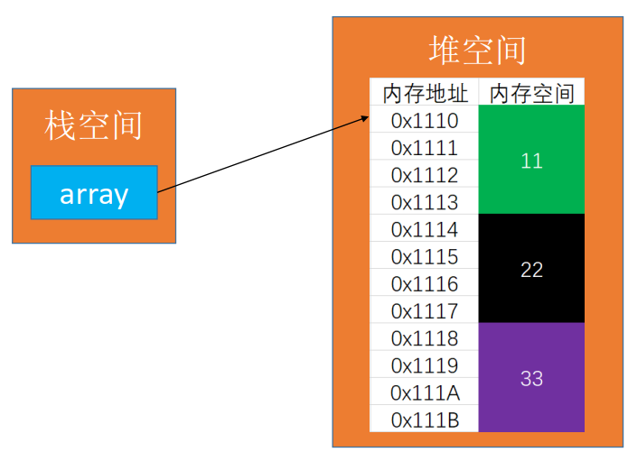
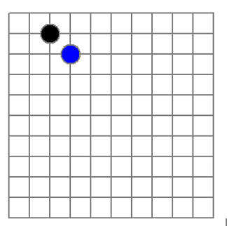
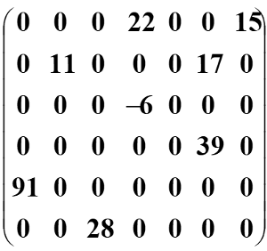
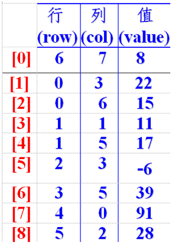
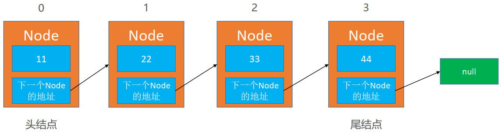
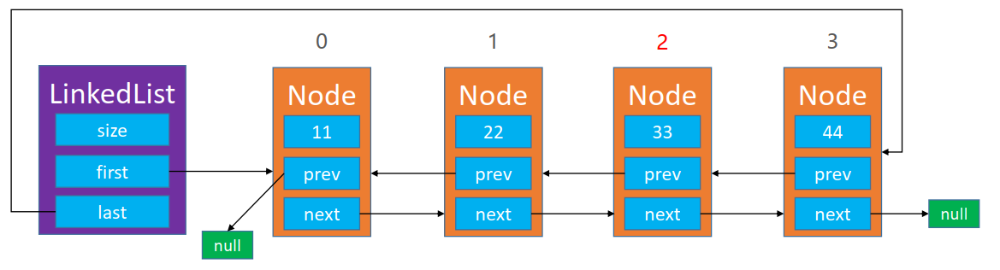
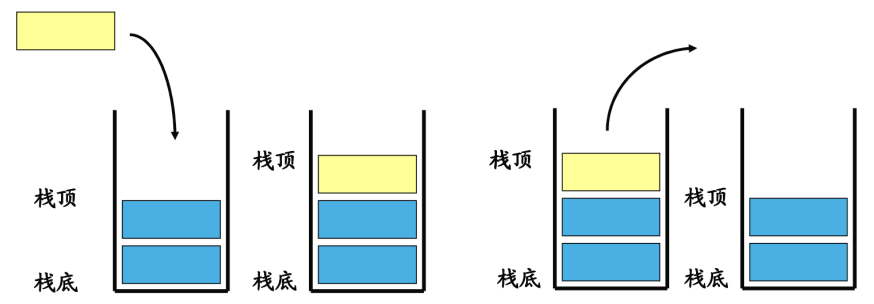
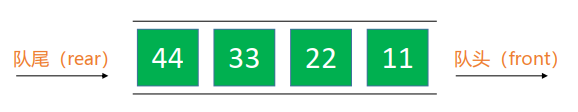

# `程序=数据结构+算法！`

# 1.数组

数组时一种顺序存储的线性表，所有元素的内存地址都是连续的。

## 1.1.稀疏数组

稀疏数组，即sparse array。怎么理解稀疏数组？可以看这样一个场景：有如下一个五子棋盘，如果要保存当前棋局，很自然地会想到用二维数组去保存， 

但是这样会有一个严重的问题，内存浪费严重，而且棋盘数据越少，浪费就越严重。当前只有2个棋子需要记录，但却开辟了一整块棋盘n*m的内存空间，保存无意义的0，在这种场景下，应该用稀疏数组替换掉二维数组。

 稀疏数组的做法是：

1. 记录原二维数组几行几列，有多少个值
2. 把有值的行列及其对应值记录到小规模数组上(即把原数组的数据压缩起来)

假设有如上的数组，它一共有6行7列，并且有8个非零值，要将其转换成稀疏数组可以这样操作：因为有8个非零值，说明就有8个行列要记录，所以新生成的稀疏数组至少需要8行；加上又要统计原数组的总行列数，又要多出1行，因此待转换的稀疏数组就要有9行。而稀疏数组只要记录元素组的行、列和值，所以需要3列。最终，上面数组转换的稀疏数组就是下面这个样子：

第一行：表示原数组有6行7列，有8个非零值

第二行：表示原数组的第1行的第4列（列数以0开始计数），值为22

 ... 以此类推

## 1.2.动态数组

大部分编程语言的数组都是不可扩容的，若想让它动态变化，就要涉及到数组的拷贝。这实际上就是动态数组的核心。

# 2.链表

链表是一种连式存储的线性表，所有元素的内存地址不一定是连续的

## 2.1.单向链表

单向链表意味着只能从A→B，但B不能→A，单链表有一个重要知识点：单链表反转

## 2.2.双向链表

# 3.栈

栈是一种特殊的线性表，只能在一端进行操作。往栈中添加元素的操作，叫做push，入栈；从栈中移除元素的操作，一般叫做pop，出栈（只能移除栈顶元素），栈是一种后进先出原则的数据结构

# 4.队列

队列是一种特殊的线性表，只能在头尾两端进行操作，属于先进先出原则的数据结构

- 队尾（rear）：只能从队尾添加元素，一般叫做入队
- 队头（front）：只能从队头移除元素，一般叫做出队

## 4.1.顺式队列

通过数组实现的队列，为了合理利用数组资源，一般会实现成**顺式循环队列**。顺序循环队列有一个问题：就是队列满和队列空的判断条件是一样的，所以需要额外处理：

- 队列保留一个空位不保存数据，这样front和rear就不会在同一位置上;
- 增加一个字段,用来标注队列是否为空

## 4.2.优先级队列

优先级队列，需要对入队的元素做优先级判断，优先级高的元素可以先出队

# 5.哈希表

使用hash函数实现的数据结构

# 6.跳表