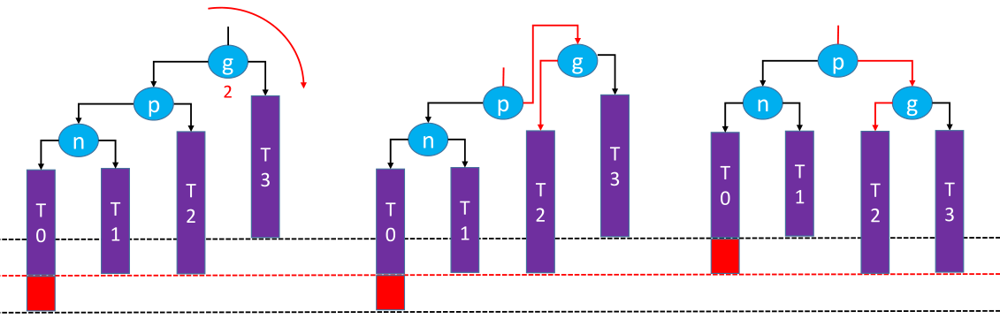
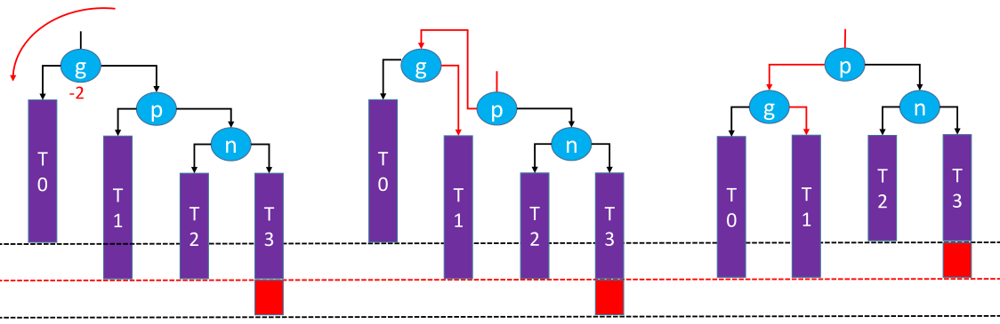
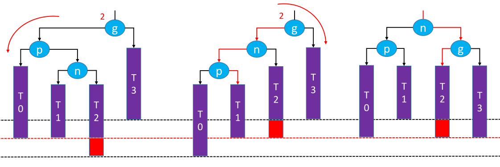
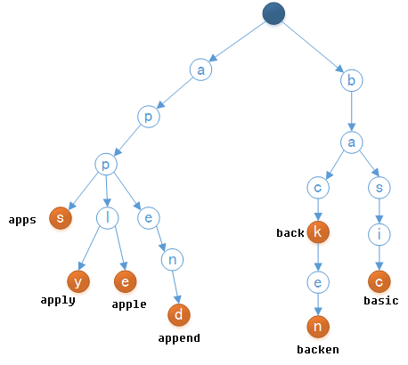

# `程序=数据结构+算法！`

# 1.树

树是一种非线性结构，它就不是线性结构一对一的关联，一般都是一对多关联。

具有以下基本概念：

- 节点的度（degree）：子树的个数
- 树的度（degree）：所有节点度中的最大值；
- 叶子结点：度为0的节点
- 非叶子结点：度不为0的节点；
- 节点的深度（depth）：从根节点到当前节点的唯一路径上的节点总数；
- 节点的高度（height）：从当前节点到最远叶子结点的路径上的节点总数
- 层次（level）：根节点在第1层，根节点的子节点在2层，以此类推
- 树的深度：所有节点深度中的最大值
- 树的高度：所有节点高度中的最大值

## 1.1.二叉树

二叉树（Binary Tree）是运用最广的树形数据结构，它的子节点个数最多只能为2（即每个节点最多拥有2棵子树），并且它的左子树和右子树是有顺序的。

### 1.1.1.二叉树性质

- 非空二叉树的第 i 层，最多有2^i-1^个节点，其中 i >= 1；
- 高度为 h 的二叉树中最多有2^h^-1个节点，其中h >= 1；
- 任意一颗二叉树，若其叶子节点个数为n~0~，度为2的节点个数为n~2~，则n~0~=n~2~+1；（推理过程：假设度为1的节点个数为n~1~，那么二叉树的节点总数n = n~0~ + n~1~ + n~2~，又由于二叉树的边数T = n~1~ + 2 * n~2~ = n - 1 = n~0~ + n~1~ + n~2~ - 1）

### 1.1.2.二叉树分类

- 真二叉树，Proper Binary Tree，所有节点的度要么为0，要么2

- 满二叉树，Full Binary Tree，最后一层节点的度为0，其它节点度为2

- 完全二叉树，Complete Binary Tree，对节点从上至下、左至右开始编号，其所有编号都能与相同高度的满二叉树中的编号对应

完全二叉树叶子结点只会出现在最后2层，最后1层的叶子结点都靠左对齐，它具有如下的性质：

- 度为1的节点只有左子树
- 度为1的节点要么是1个，要么是2个
- 同样节点数量的二叉树，完全二叉树的高度最小
- 假设完全二叉树的高度为h（h $\geq$ 1），那么
  - 至少有2^h-1^个节点（2^0^ + 2^1^ + 2^2^ + ... + 2^h-2^ + 1）
  - 最多有2^h^-1个节点（即满二叉树的样子）

- 若一颗完全二叉树的总结点数量为n，则它的高度h = floor(log~2~n) + 1

### 1.1.3.二叉树遍历

根据节点访问顺序的不同，二叉树的常见遍历方式有4种：

- 前序遍历（Preorder Traversal）- 先访问根节点，再前序遍历左子树，最后前序遍历右子树。一般用于树状结构展示

- 中序遍历（Inorder Traversal）- 先中序遍历左子树，访问根节点，最后中序遍历右子树。一般用于二叉搜索树的按升序或者降序处理节点

- 后序遍历（Postorder Traversal）- 先后序遍历左子树，再后序遍历右子树，最后根节点。一般用于先子后父的操作

- 层序遍历（Level Order Traversal）- 从上到下，从左到右依次访问每一个节点。一般用于计算二叉树的高度、判断一棵树是否为完全二叉树

### 1.1.4.前驱&后继

一颗二叉树的任意一颗节点，它的

- **前驱节点：二叉树中序遍历后，该节点的前一个节点**

  

  - **第一种**：node.left != null，例如：6、13、8。这类型节点的前驱节点predecessor = node.left.right.right.right.right...直至right为null；
  - **第二种**：node.left == null && node.parent != null，例如：7、11、9、1。这类型的节点的前驱节点predecessor = node.parent.parent.parent...直至node处于parent的右子树中；
  - **第三种**：node.left == null && node.parent == null，那就是没有前驱节点

- **后继节点：二叉树中序遍历后，该节点的后一个节点**

  

  - **第一种**：node.right != null，例如：1、8、4，这类型的节点的后继节点successor = node.right.left.left.left.left...直至left为null；
  - **第二种**：node.right == null && node.parent != null，例如：7、6、3、11，这类型的节点的后继节点successor = node.parent.parent.parent...直至node处于parent的左子树中；
  - **第三种**：node.right == null && node.parent == null，那就没有后继节点

## 1.2.二叉搜索树

二叉搜索树，Binary Search Tree，简称BST，是二叉树的一种，也称为二叉查找树、二叉排序树。

它是一种动态查找表，具有这些性质：

- 任意一个节点的值都大于其左子树所有节点的值
- 任意一个节点的值都小于其右子树所有节点的值
- 它的左右子树也是一颗二叉搜索树

### 1.2.1.添加逻辑

添加元素需要考虑元素的比较，和相同值元素的处理方式！

### 1.2.1.删除逻辑

删除逻辑是二叉搜索树最复杂的部分，它需要分为三种情况：

- 删除度为0的节点，即叶子节点，直接删除即可；
- 删除度为1的节点，用子节点替代原节点的位置；
- 删除度为2的节点，先找出该节点的前驱节点或后继节点，用它的值覆盖掉待删除节点的值，然后再删除相应的前驱节点或后继节点

## 1.3.平衡二叉树

平衡二叉树的引入是为了解决二叉搜索树在极端情况下，退化成链表的情况。例如节点1,2,3,4,5,6。如果按照从小到大的顺序添加，就会退化成链表；二叉搜素树的删除也可能导致其退化成链表！

为了解决这一问题，引入了“平衡”的概念。平衡（Balance），当节点数量固定，左右子树的高度越接近，则称树越平衡（即高度越低）。最理想的平衡，就是想完全二叉树和满二叉树一样，高度差是最小的，但是实际开发中不可能达到绝对平衡，因为那样付出的移动节点的操作太过昂贵，一般都是用尽量少的调整次数达到适度平衡即可，一颗达到适度平衡的**二叉搜索树**，称为平衡二叉搜索树（Balanced Binary Search Tree）英文简称：BBST。经典常见的平衡二叉搜索树有：

- AVL树：window NT内核中广泛使用
- 红黑树：C++ STL库、Java的HashMap、Linux的进程调度和Nginx的timer管理

一般也称它们为：自平衡的二叉搜索树（Self-balancing Binary Search Tree）

## 1.4.AVL树

**AVL树**是最早被发明的[自平衡二叉查找树](https://zh.wikipedia.org/wiki/自平衡二叉查找树)，是由苏联的科学家G. M. Adelson-Velsky和Evgenii Landis发明，并且最终也是以他们两个名字命名。在AVL树中，任一节点对应的两棵子树的最大高度差为1，因此它也被称为**高度平衡树**。AVL树在查找、插入和删除在平均和最坏情况下的[时间复杂度](https://zh.wikipedia.org/wiki/时间复杂度)都是。增加和删除元素的操作则可能需要借由一次或多次[树旋转](https://zh.wikipedia.org/wiki/树旋转)，以实现树的重新平衡。

### 1.4.1.平衡因子

平衡 （Balance Factor）: 某节点的左右子树的高度差，例如：

每个节点的平衡因子 = 左子树高度 - 右子树高度，例如50这个节点，它的左子树高度为1（只有25），右子树高度为2，所以它的平衡因子就是1-2=-1。所以AVL树的特点就是：

- 每个节点的平衡因子只可能是1、0、-1（绝对值$\leq$1，如果超过1，称之为“失衡”）
- 每个节点的左右子树高度差不超过1
- 搜索、添加、删除的时间复杂度是O(logn)

**注意：**一颗AVL树，无论添加还是删除节点N，N的父节点、非祖先节点都不可能失衡！！

### 1.4.2.旋转

#### 1.4.2.1.LL-右旋(单旋)

假设一颗AVL树添加了一个新节点，导致了【g】失衡，它失衡了，就需要对它做旋转处理：

- g.left = p.right，让【g】的子节点【p】的右子树变为【g】的左子树
- p.right = g，然后让原先【g】的子节点【p】变为该子树的根节点，同时【g】作为【p】的右子树
- 处理p和g的高度以及parent指针

#### 1.4.2.2.RR-左旋(单旋)

假设一颗AVL树添加了一个新节点，导致了【g】失衡，它失衡了，就需要【g】对做旋转处理：

- g.right = p.left，让【g】的子节点【p】的左子树变为【g】的右子树
- p.left = g，然后让原先【g】的子节点【p】变为该子树的根节点，同时【g】作为【p】的左子树
- 处理p和g的高度以及parent指针

#### 1.4.2.3.LR-RR左旋&右旋(双旋)

假设一颗AVL树添加了一个新节点，导致了【g】失衡，它失衡了，就需要【g】对做旋转处理：

- 先对【g】左旋，让【g】的子节点【p】的右子树变为【g】的左子树

#### 1.4.2.4.RL-LL右旋&左旋(双旋)

## 1.5.红黑树

红黑树是一种自平衡二叉树，在平衡二叉树的基础上每个节点又增加了一个颜色的属性，节点的颜色只能是红色或黑色。具有如下的性质：

1. 根结点只能是黑色；

2. 每个结点非红即黑，若一个结点为红色，则它的左右结点一定为黑色；

3. 每个叶子结点（即树尾端null指针或null节点）都是黑色；

4. 任意结点到叶子结点的nil指针的每条路径都包含相同的黑色结点

## 1.6.B树

B树和[B+树](#6.5.B+树)，都是为磁盘为磁盘或其它存储设备而设计的一种平衡多路查找树。相对于二叉树，B树每个内节点有多个分支；与红黑树相比，在相同的节点的情况下，一棵B/B+树的高度远远小于红黑树的高度。B/B+树上操作的时间通常由存储磁盘的时间和CPU计算时间这两个部分构成，CPU计算时间可以忽略不计，所以B树的操作效率取决于访问磁盘的次数，关键字总数相同的情况下B树的高度越小，磁盘I/O所花的时间越少。

一颗m阶的B tree有如下特性：

1. 每个结点最多 m 个子结点；

2. 除了根结点和叶子结点外，每个结点最少有 m/2(向上取整)个子结点；

3. 如果根结点不是叶子结点，那根结点至少包含两个子结点；

4. 所有的叶子结点都位于同一层；

5. 每个结点都包含 k 个元素(关键字)，这里 m/2≤k。

6. 每个节点中的元素(关键字)从小到大排列。

7. 每个元素(关键字)字左结点的值，都小于或等于该元素(关键字)；右结点的值都大于或等于该元素(关键字)。

## 1.7.B+树

B+树是[B树](#6.4.B树)的一种变形，它与B树的差别在于：

1. 有n棵子树的节点含有n个关键字；

2. 所有的叶子节点包含了全部关键字的信息，及指向这些关键字记录的指针，且叶子节点本身按关键字大小自小到大顺序链接；

3. 所有非终端节点可以看成是索引部分，节点中仅含有其子树（根节点）中最大（或最小）关键字，所有B+树更像一个索引顺序表；

4. 对B+树进行查找运算，一是从最小关键字起进行顺序查找，二是从根节点开始，进行随机查找。

## 1.8.字典树

字典树，也称trid树。是一种以树形结构保存大量字符串。以便于字符串的统计和查找，经常被搜索引擎系统用于文本词频统计。它的优点是：利用字符串的公共前缀来节约存储空间，最大限度地减少无谓的字符串比较，查询效率比哈希表高。有以下特点：

1. 根节点为空；

2. 除根节点外，每个节点包含一个字符；

3. 根节点到某一节点，路径上经过的字符连接起来，为该节点对应的字符串；

4. 每个字符串在建立字典树的过程中都要加上一个区分的结束符，避免某个短字符串正好是某个长字符串的前缀而淹没

# 2.堆

# 3.图