# `程序=数据结构+算法！`

# 1.树

树是一种非线性结构，它就不是线性结构一对一的关联，一般都是一对多关联。

具有以下基本概念：

- 节点的度（degree）：子树的个数
- 树的度（degree）：所有节点度中的最大值；
- 叶子结点：度为0的节点
- 非叶子结点：度不为0的节点；
- 节点的深度（depth）：从根节点到当前节点的唯一路径上的节点总数；
- 节点的高度（height）：从当前节点到最远叶子结点的路径上的节点总数
- 层次（level）：根节点在第1层，根节点的子节点在2层，以此类推
- 树的深度：所有节点深度中的最大值
- 树的高度：所有节点高度中的最大值

# 2.二叉树

二叉树（Binary Tree）是运用最广的树形数据结构，它的子节点个数最多只能为2（即每个节点最多拥有2棵子树），并且它的左子树和右子树是有顺序的。

## 2.1.二叉树性质

- 非空二叉树的第 i 层，最多有2i-1个节点，其中 i >= 1；
- 高度为 h 的二叉树中最多有2h-1个节点，其中h >= 1；
- 任意一颗二叉树，若其叶子节点个数为n0，度为2的节点个数为n2，则n0=n2+1；（推理过程：假设度为1的节点个数为n1，那么二叉树的节点总数n = n0 + n1 + n2，又由于二叉树的边数T = n1 + 2 * n2 = n - 1 = n0 + n1 + n2 - 1）

## 2.2.二叉树分类

- 真二叉树，Proper Binary Tree，所有节点的度要么为0，要么2

- 满二叉树，Full Binary Tree，最后一层节点的度为0，其它节点度为2

- 完全二叉树，Complete Binary Tree，对节点从上至下、左至右开始编号，其所有编号都能与相同高度的满二叉树中的编号对应

完全二叉树叶子结点只会出现在最后2层，最后1层的叶子结点都靠左对齐，它具有如下的性质：

- 度为1的节点只有左子树
- 度为1的节点要么是1个，要么是2个
- 同样节点数量的二叉树，完全二叉树的高度最小
- 假设完全二叉树的高度为h（h &ge; 1），那么
  - 至少有2h-1个节点（20 + 21 + 22 + ... + 2h-2 + 1）
  - 最多有2h-1个节点（即满二叉树的样子）

- 若一颗完全二叉树的总结点数量为n，则它的高度h = floor(log2n) + 1

## 2.3.二叉树遍历

根据节点访问顺序的不同，二叉树的常见遍历方式有4种：

- 前序遍历（Preorder Traversal）- 先访问根节点，再前序遍历左子树，最后前序遍历右子树。一般用于树状结构展示

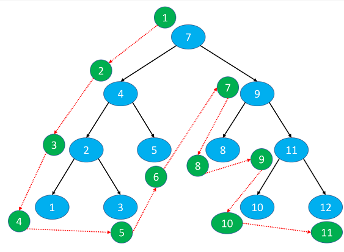

- 中序遍历（Inorder Traversal）- 先中序遍历左子树，访问根节点，最后中序遍历右子树。一般用于二叉搜索树的按升序或者降序处理节点

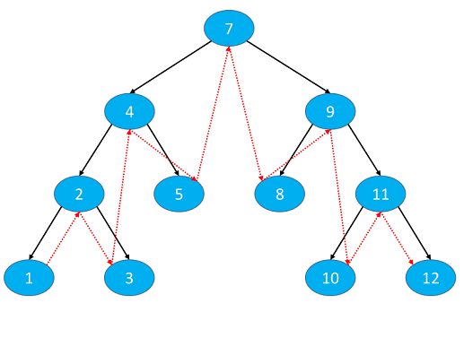

- 后序遍历（Postorder Traversal）- 先后序遍历左子树，再后序遍历右子树，最后根节点。一般用于先子后父的操作

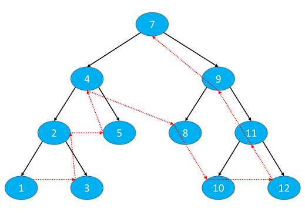

- 层序遍历（Level Order Traversal）- 从上到下，从左到右依次访问每一个节点。一般用于计算二叉树的高度、判断一棵树是否为完全二叉树

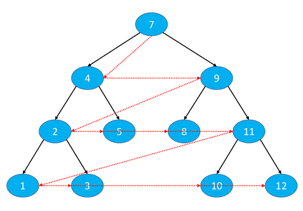

## 2.4.前驱&后继

一颗二叉树的任意一颗节点，它的

- **前驱节点：二叉树中序遍历后，该节点的前一个节点**

  

  - **第一种**：node.left != null，例如：6、13、8。这类型节点的前驱节点predecessor = node.left.right.right.right.right...直至right为null；
  - **第二种**：node.left == null && node.parent != null，例如：7、11、9、1。这类型的节点的前驱节点predecessor = node.parent.parent.parent...直至node处于parent的右子树中；
  - **第三种**：node.left == null && node.parent == null，那就是没有前驱节点

- **后继节点：二叉树中序遍历后，该节点的后一个节点**

  

  - **第一种**：node.right != null，例如：1、8、4，这类型的节点的后继节点successor = node.right.left.left.left.left...直至left为null；
  - **第二种**：node.right == null && node.parent != null，例如：7、6、3、11，这类型的节点的后继节点successor = node.parent.parent.parent...直至node处于parent的左子树中；
  - **第三种**：node.right == null && node.parent == null，那就没有后继节点

# 3.二叉搜索树

二叉搜索树，Binary Search Tree，简称BST，是二叉树的一种，也称为二叉查找树、二叉排序树。

它是一种动态查找表，具有这些性质：

- 任意一个节点的值都大于其左子树所有节点的值
- 任意一个节点的值都小于其右子树所有节点的值
- 它的左右子树也是一颗二叉搜索树

## 3.1.添加逻辑

添加元素需要考虑元素的比较，和相同值元素的处理方式！

## 3.2.删除逻辑

删除逻辑是二叉搜索树最复杂的部分，它需要分为三种情况：

- 删除度为0的节点，即叶子节点，直接删除即可；
- 删除度为1的节点，用子节点替代原节点的位置；
- 删除度为2的节点，先找出该节点的前驱节点或后继节点，用它的值覆盖掉待删除节点的值，然后再删除相应的前驱节点或后继节点

# 4.平衡二叉树

平衡二叉树的引入是为了解决二叉搜索树在极端情况下，退化成链表的情况。例如节点1,2,3,4,5,6。如果按照从小到大的顺序添加，就会退化成链表；二叉搜素树的删除也可能导致其退化成链表！

为了解决这一问题，引入了“平衡”的概念。平衡（Balance），当节点数量固定，左右子树的高度越接近，则称树越平衡（即高度越低）。最理想的平衡，就是想完全二叉树和满二叉树一样，高度差是最小的，但是实际开发中不可能达到绝对平衡，因为那样付出的移动节点的操作太过昂贵，一般都是用尽量少的调整次数达到适度平衡即可，一颗达到适度平衡的**二叉搜索树**，称为平衡二叉搜索树（Balanced Binary Search Tree）英文简称：BBST。经典常见的平衡二叉搜索树有：

- AVL树：window NT内核中广泛使用
- 红黑树：C++ STL库、Java的HashMap、Linux的进程调度和Nginx的timer管理

一般也称它们为：自平衡的二叉搜索树（Self-balancing Binary Search Tree）

# 5.AVL树

**AVL树**是最早被发明的[自平衡二叉查找树](https://zh.wikipedia.org/wiki/自平衡二叉查找树)，是由苏联的科学家G. M. Adelson-Velsky和Evgenii Landis发明，并且最终也是以他们两个名字命名。在AVL树中，任一节点对应的两棵子树的最大高度差为1，因此它也被称为**高度平衡树**。AVL树在查找、插入和删除在平均和最坏情况下的[时间复杂度](https://zh.wikipedia.org/wiki/时间复杂度)都是。增加和删除元素的操作则可能需要借由一次或多次[树旋转](https://zh.wikipedia.org/wiki/树旋转)，以实现树的重新平衡。

## 5.1.平衡因子

平衡 （Balance Factor）: 某节点的左右子树的高度差，例如：

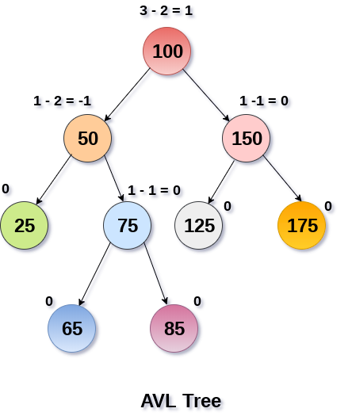

每个节点的平衡因子 = 左子树高度 - 右子树高度，例如50这个节点，它的左子树高度为1（只有25），右子树高度为2，所以它的平衡因子就是1-2=-1。所以AVL树的特点就是：

- 每个节点的平衡因子只可能是1、0、-1（绝对值&le;1，如果超过1，称之为“失衡”）
- 每个节点的左右子树高度差不超过1
- 搜索、添加、删除的时间复杂度是O(logn)

<b>注意：</b>一颗AVL树，无论添加还是删除节点N，N的非祖先节点都不可能失衡！！

## 5.2.旋转

AVL树的旋转分为**单旋**和**双旋**

- 单旋：<u>只旋转一次，针对失衡节点，即谁失衡谁旋转</u>
- 双旋：<u>旋转两次，第一次针对失衡节点的子节点，后一次针对失衡节点。即谁失衡，先对它的子节点旋转，自己再旋转</u>

### 5.2.1.LL-右旋(单旋)

原先没有`红色节点`（注意颜色没有任何意义，只是为了醒目）之前，【g】、【p】、【n】是各自平衡，但是加了`红色节点`，【p】和【n】继续保持平衡，但是【g】不平衡了，且该`红色节点`位于【g】的左子树节点的左子树部分（即left-left，简称LL），所以需要对【g】做`右旋`操作（可以这样理解，左边部分已经失衡了，所以需要往右边靠一靠）在单旋操作中，谁失衡，就对谁旋转，具体步骤为：

- g.left = p.right，先让【p】的右子树`T2`变为【g】的左子树；
- p.right = g，再【p】变为该子树的新的根节点，同时【g】作为【p】的右子树，其余保持不变；
- 处理p和g的高度以及parent指针。

### 5.2.2.RR-左旋(单旋)

原先没有`红色节点`（注意颜色没有任何意义，只是为了醒目）之前，【g】、【p】、【n】是各自平衡，但是加了`红色节点`，【p】和【n】继续保持平衡，但是【g】不平衡了，且该`红色节点`位于【g】的右子树节点的右子树部分（即right-right，简称RR），所以需要对【g】做`左旋`操作（可以这样理解，右边部分已经失衡了，所以需要往左边靠一靠）在单旋操作中，谁失衡就对谁旋转，具体步骤为：

- g.right = p.left，先让【p】的左子树`T1`变为【g】的右子树；
- p.left = g，再让【p】变为该子树的新的根节点，同时【g】作为【p】的左子树，其余保持不变；
- 处理p和g的高度以及parent指针。

### 5.2.3.LR-RR左旋&右旋(双旋)

原先没有`红色节点`（注意颜色没有任何意义，只是为了醒目）之前，【g】、【p】、【n】是各自平衡，但是加了`红色节点`，【p】和【n】继续保持平衡，但是【g】不平衡了，且该`红色节点`位于【g】的左子树节点的右子树部分（left-right，称为LR），这就比较复杂，属于双旋操作。因为现在是左子树先失衡了，就让它失衡得彻底，所以先左旋；这样做的结果就会导致**左边完全失衡**，后面就可以依据单旋的经验，再进行右旋即可。双旋跟单旋有个区别，单旋都是谁失衡谁旋转；双旋不是，它需要先让子节点旋转后自己再旋转。

`红色节点`的加入，导致了【g】失衡，且该`红色节点`位于左子节点的右子树部分，所以需要先对【g】的左子树【p】进行左旋（让这棵AVL树的左子树彻底失衡），最后再对【g】做右旋操作。具体步骤为：

- 先对【p】左旋，使得【n】成为左下部分新的根节点，【p】作为【n】的左子树；

- 然后，再对【g】右旋，使得【n】成为最终的根节点，【g】作为【n】的右子树。

  

### 5.2.4.RL-LL右旋&左旋(双旋)

原先没有`红色节点`（注意颜色没有任何意义，只是为了醒目）之前，【g】、【p】、【n】是各自平衡，但是加了`红色节点`，【p】和【n】继续保持平衡，但是【g】不平衡了，且该`红色节点`位于【g】的右子树节点的左子树部分（right-left，称为RL），这就比较复杂，属于双旋操作。因为现在是右子树先失衡了，就让它失衡得彻底，所以先右旋；这样做的结果就会导致**右边完全失衡**，后面就可以依据单旋的经验，再进行左旋即可。双旋跟单旋有个区别，单旋都是谁失衡谁旋转；双旋不是，它需要先让子节点旋转后自己再旋转。

`红色节点`的加入，导致了【g】失衡，且该`红色节点`位于右子节点的左子树部分，所以需要先对【g】的右子树【p】进行右旋（让这棵AVL树的右子树彻底失衡），最后再对【g】做左旋操作。具体步骤为：

- 先对【p】进行右旋，让【n】成为右下部分新的根节点，【p】作为【n】的右子树
- 再对【g】进行左旋，让【n】成为最终的根节点，【g】作为【n】的左子树

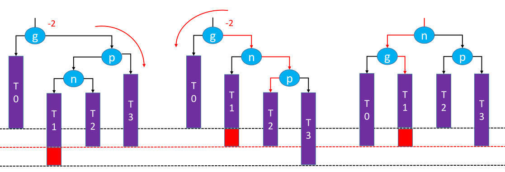

## 5.3.失衡情况

一个AVL树只有在添加、删除节点的时候，会导致失衡，其中：

- 添加：可能会导致所有祖先节点都失衡，但是只要让高度最低的祖先节点恢复平衡，整棵AVL树又可以平衡；
- 删除：可能会导致父节点和祖先节点失衡，恢复平衡后，可能会导致更高层的祖先节点失衡，因此最差需要O(logn)次调整

之前讲的AVL树[旋转操作](# 5.2.旋转)其实是针对添加操作而言，删除操作导致的失衡跟添加操作导致的失衡处理方式一样，也是左旋、右旋和两种双旋操作。唯一区别就是，添加操作导致的失衡只要处理一次即可，而删除操作导致的失衡，需要循环处理。为什么？原因如下图，着重观察绿色部分，现在把红色部分表示的节点删除，节点【g】失衡，通过判断得出它是属于LL失衡，所以对其进行右旋。

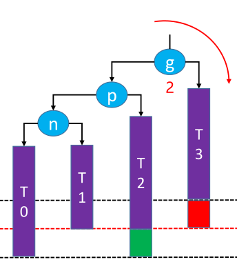

右旋后的结果为，会发现绿色部分的节点起到关键性作用，如果它不存在，该子树的高度会从旋转前的4，变为旋转后的3，由于子树的高度变小了，就可能引起父节点和祖父节点失衡。所以说，AVL树的删除操作，需要一层一层往上判断，直至根节点，才能保证整棵树的平衡。

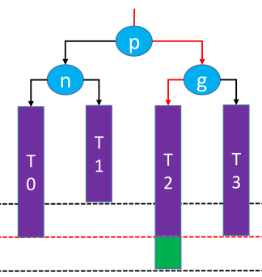

# 6.红黑树

红黑树也是一种子平衡的二叉搜索树，它的全称为`Red Black Tree`，以前也叫做平衡二叉B树（Symmetric Binary Tree）。红黑树在平衡二叉树的基础上引入了一个节点颜色的概念，其节点要么为红色，要么为黑色。

## 6.1.红黑树性质

一颗红黑树必须满足以下5条性质：

- 节点是红色（RED）或者黑色（BLACK）
- 根节点是黑色（BLACK）
- 叶子节点（外部节点，空节点）都是黑色（BLACK）
- 红色（RED）节点的子节点都是黑色（BLACK）, 这条性质可以引出
  - 红色（RED）节点的父节点都是黑色（BLACK）
  - 从根节点到叶子节点的所有路径上不能有2个连续的红色（RED）节点

- 任一节点到叶子节点的所有路径都包含相同数目的黑色（BLACK）节点

其中需要额外说明一下：

1. 红黑树规定的叶子节点，跟平常二叉树所说的叶子节点不太一样。比如说，平常的二叉树，【1】【6】【11】...【27】就是叶子节点。而红黑树会让这些度为0或1的节点都变为度为2，实现方式就是给它们加上一个【NIL】节点，如上图所示，这些【NIL】节点就是红黑树规定的叶子节点；<u>但是，只有在讨论红黑树性质的时候才需要加入这个【NIL】考虑，在分析红黑树的增删情况，完全可以忽略(因为它们本来就是假想出来)</u>

2. 所以在判断一棵树是否为红黑树时，一定要注意红黑树的叶子节点，并不是传统意义上的叶子节点，度为1的节点在红黑树中也算是叶子节点，如下图就不是一颗红黑树。其中【55】→ 【38】也算一条路径，但是这条路径上的黑色结点个数只有3个（算上nil节点），而其余路径有4个黑色结点！！！

   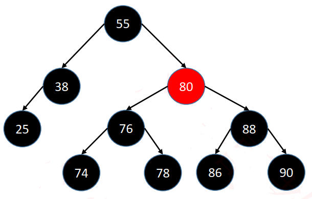

## 6.2.等价变换4阶B树

学习红黑树之前，可以先回忆下[B树](# 7.B树)的知识点。红黑树其实和4阶B树有着逻辑上的等价关系：

- 将黑色结点与它的红色节点融合在一起，就可以作为4阶B树的节点；
- 红黑树的黑色节点个数就等于4阶B树的节点总个数。

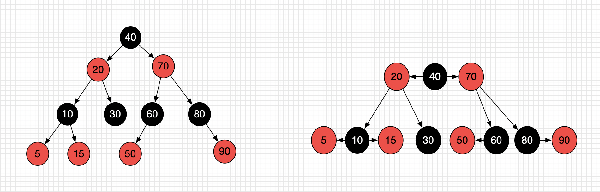

黑色结点【40】与它的两个红色子节点【20】和【70】合并为一个4阶B树节点；同理黑色结点【30】由于没有子节点，所以单独称为一个4阶B树节点；以此类推，最终可以得到一个4阶B树如：

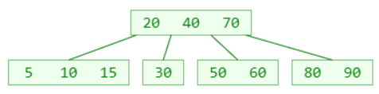

红黑树与4阶B树的等价变换，将黑色父节点和其红色子节点合并为一个B数节点，而原先红色节点的黑色子节点就会升到树的上一层，例如下面的【黑红】和【红黑】情况。下面4种是红黑树与4阶B树等价变换的所有情况：

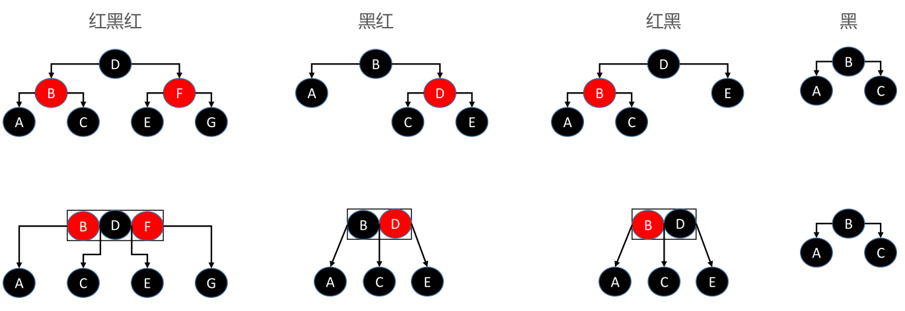

## 6.3.AVL树vs红黑树

AVL树规定了节点的高度，且高度差不能超过1，因此它可以做到平衡。但是对于红黑树来说，它好像只规定5条性质，乍一看，看不出来任何平衡的操作。其实那5条性质，是保证红黑树可以等价变换成4阶B树的条件。既然可以成为一颗B树，那红黑树自然可以实现平衡的效果。

只不过红黑树的平衡跟AVL树不一样，它的平衡条件相对宽松：<u>没有一条路径大于其它路径的2倍</u>，属于一种弱平衡。如果只拿黑色节点来看，红黑树就可以达到AVL树级别的平衡，所以红黑树也是一种黑高度平衡。

- AVL树
  - 平衡标准比较严格：每个左右子树的高度差不能超过1
  - 最大高度是1.44 * log2(n+2) - 1.328 （100W个节点，AVL树最大高度28）
  - 搜索、添加、删除都是O(logn)复杂度，添加仅需O(1)次旋转，删除最多需要O(logn)次旋转

- 红黑树
  - 平衡标准比较宽松：没有一条路径会大于其它路径的2倍
  - 最大高度是2*log2(n+1) （100W个节点，红黑树最大高度40）
  - 搜索、添加、删除都是O(logn)复杂度，其中添加、删除仅需O(1)次旋转

**什么时候选择AVL树，什么时候选择红黑树**

①搜索的次数远远大于插入和删除，选择AVL树；搜索、插入、删除次数差不多选择红黑树；

②红黑树牺牲了部分平衡性以换取插入/删除操作时少量的旋转操作，整体性能优于AVL树；

③红黑树的平均统计性能优于AVL树，实际运用更多选择红黑树！！

## 6.4.添加失衡

由于红黑树可以等价变换成4阶B树，所以再讨论红黑树添加节点的情况，完全可以类比4阶B树。基于这一点，其实红黑树节点添加也是发生在叶子节点上，最后一层的叶子节点排布就四种情况。因为红黑树等价变换成四阶B树，就是将黑色结点与其红色子节点结合起来当做一个4阶B树节点，既然要考虑红黑树叶子节点的添加前的所有情况，那么黑色结点必须要存在。然后就好办了，一个黑色节点确定了，其实就是四种排布情况：黑色节点左边红色，黑色节点右边红色，黑色节点左右两边都红色，黑色节点左右两边都为空，其实也就是上面与4阶B树等价变化的所有情况：

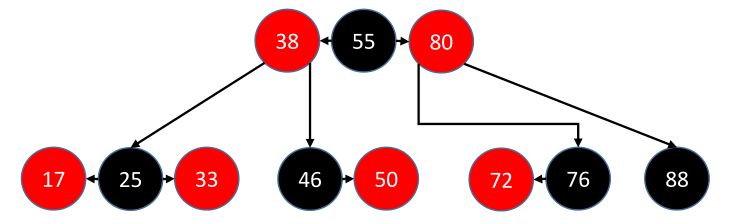

分别是：

- 红黑红：【17】-【25】-【33】
- 黑红：    【46】-【50】
- 红黑：    【72】-【76】
- 黑：        【88】

因此新添加的节点就只可能放到上面节点的左右，其中要注意下，红色节点是子节点，意味着如果一个黑色节点左边有了红色节点，那么这个黑色节点的左边就不可能再放入一个新节点，所以上面四种节点排布情况最终有12种节点添加情况，分别是：

- 【17】的左右两边，【33】的左右两边   —— 4
- 【46】的左边，【50】的左右两边 —— 3
- 【72】的左右两边，【76】的右边 —— 3
- 【88】的左右两边 —— 2

### 6.4.1.父节点为黑色(4)

上面所讲的12种情况，只有4种情况父节点是黑色：【46】的左边、【76】的右边、【88】的左右两边，这样情况，只要将新添加的节点染成红色，便可以直接满足[红黑树的性质](# 6.1.红黑树性质)，同样也满足4阶B树的性质，因为加上红色节点会与其黑色父节点并为一个4阶B树节点。

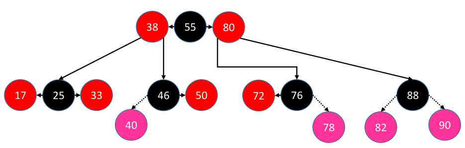

### 6.4.2.父节点为红色(8)

除去上面的4种，剩下的8种情况（即父节点为红色）的就是不满足[红黑树的性质](# 6.1.红黑树性质)（红色节点的子节点为黑色），所有情况如下所示：

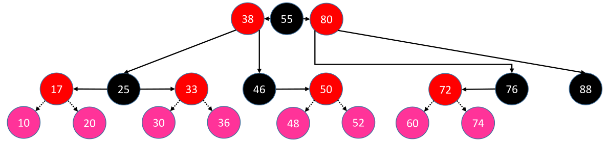

这8种需要修复的情况，实际也可以找出规律，分为两种情况：

- **叔父节点为红色**：【17】的左右两边，【33】的左右两边
- **叔父节点为黑色**：【50】的左右两边，【72】的左右两边

#### 6.4.2.1.叔父节点黑色：LL/RR(2)

因为红黑树与4阶B树具有逻辑上的等价变换，一个红黑树的黑色节点带着它的两个红色子节点就可以组装成一个4阶B树节点。所以，我们在修复红黑树失衡的情况中，尽可能让它快速变成【红-黑-红】这种样子。首先处理叔父节点为黑色的情况，并且属于LL（left-left）或RR（right-right）的分布：

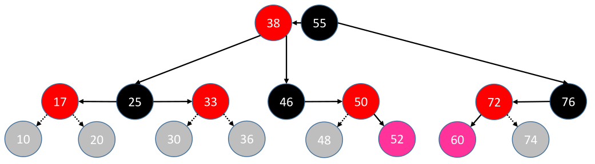

处于这种情况的有两种分布：【46】→【50】→【52】和【76】→【72】→【60】，以第一个为例。新添加节点【52】，其父节点为【50】，其叔父节点为【NIL】，其处于祖父节点【46】的右边的右边，所以是RR分布。为了能让【46】-【50】-【52】变为【红-黑-红】，所以需要【50】染成黑色，【52】染成红色；同时由于【50】变为了黑色节点，也就是说它需要结合它的两个红色子节点来映射为一个4阶B树节点，所以【46】就要变为【50】的子节点，而【50】称为这棵子树的根节点，实际上就是将【46】左旋转，最终结果就为：

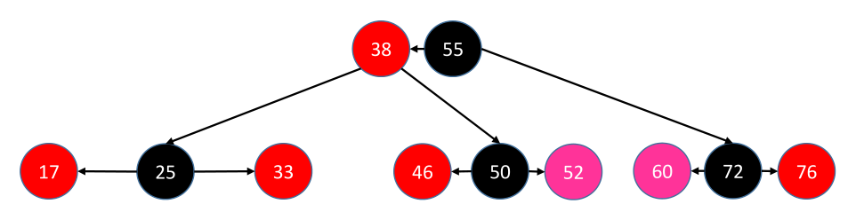

因为【52】和【60】是新添加的节点，所以还是以【52】和【60】的角度来处理：

<b>判定条件：</b>叔父节点（uncle）为黑色（注意NIL节点在红黑树中就是黑色的）

**处理方式：**	

- <u>parent变黑，grand变红</u>；

- <u>LL：grand右旋</u>； <u>RR：grand左旋</u>。

#### 6.4.2.2.叔父节点黑色：LR/RL(2)

这种情况其实和[叔父节点黑色：LR/RL](# 6.3.2.1.叔父节点黑色：LL/RR(2))类似，就如节点【48】和【74】。【48】位于祖父节点【46】的右边的左边，所以是RL分布；【74】位于祖父节点【76】的左边的右边，所以是LR分布。同样也是要让它们快速地变为【红-黑-红】形式：

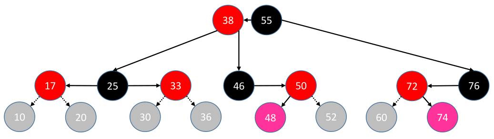

以【48】为例，它现在是这样【46】-【50】-【48】,如果要让它迅速满足【红-黑-红】形式，可能瞬间想法是直接【46】变为红色，【50】变为黑色即可，但是如果这样子，由于【50】现在变为黑色，意味着它要成为父节点，而【46】和【48】都要变为【50】的子节点并且关键是都得位于【50】的左边（二叉搜索树性质），那不可能的！这种情况，只能先对【50】右旋，再对【46】左旋，让【48】成为新的根节点，同时将其染色成黑色，【50】变为红色，如：

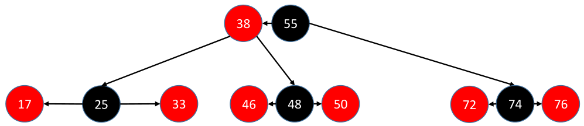

因为【48】和【74】是新添加的节点，所以还是以【48】和【74】的角度来处理：

<b>判定条件：</b>叔父节点（uncle）为黑色（注意NIL节点在红黑树中就是黑色的）

**处理方式：**		

- <u>自己变黑，grand变红</u>；

- <u>LR：parent左旋，grand右旋</u>； <u>RL：parent右旋，grand左旋</u>。

#### 6.4.2.3.叔父节点红色：LL/RR(2)

叔父节点为红色，说明此时节点过多（因为等价的4阶B树节点元素最多3个），此时就需要上溢，最好是将祖父节点上溢（因为它的父引用指针可以不用改变）。新添加【10】位于其祖父节点【25】的左边的左边，属于LL分布；新添加节点【36】位于其祖父节点【25】的右边的右边，属于RR分布

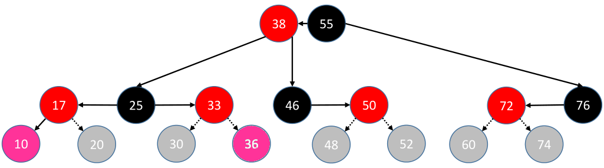

以【10】为例，由于【10】的加入，导致【10-17-25-33】节点数爆满，已经没办法满足4阶B树节点的性质（一个4阶B树节点最多承载3个元素），所以需要做`上溢`处理，选择将祖父节点【25】并到上层父节点去，然后【17】和【33】各自分裂成新的子节点，所以就要变为黑色（只有黑色节点才能作为4阶B树节点）。同时，由于将【25】上并到它的父节点，有可能导致它的父节点也不满足红黑树性质，所以一个好办法就是将【25】染成红色，把它也视为一个新添加节点，重复添加失衡的判断（也就是12种添加失衡情况的一种，说白了就是递归处理...），最终结果为：

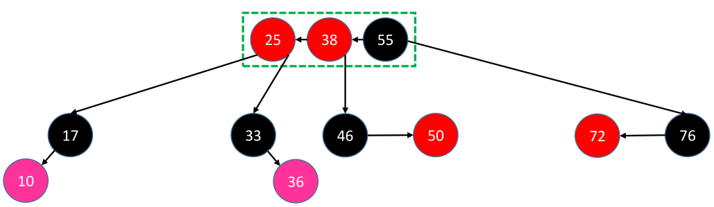

以新添加节点【10】和【36】的角度来总结处理步骤：

<b>判定条件：</b>叔父节点（uncle）为红色

**处理方式：**		

- <u>parent节点、uncle节点变黑色</u>；

- <u>grand节点变红，向上合并，当做新添加节点执行添加失衡的判断逻辑</u>。

grand节点向上合并时，可能继续发生上溢，那就一直向上合并直至根节点，最终把根节点染成黑色即可。

#### 6.4.2.4.叔父节点红色：LR/RL(2)

叔父节点为红色，说明此时节点过多（因为等价的4阶B树节点元素最多3个），此时就需要上溢，最好是将祖父节点上溢（因为它的父引用指针可以不用改变）。新添加【20】位于其祖父节点【25】的左边的右边，属于LR分布；新添加节点【30】位于其祖父节点【25】的右边的左边，属于RL分布

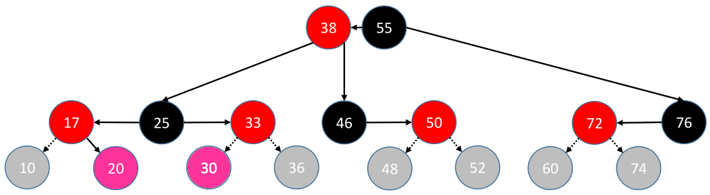

因为【20】和【30】是属于同一种的情况，所以放到一起讲，实际分析的时候，只需要分析一个即可，例如：若以【20】为例，可以将【30】忽略掉。由于【20】的加入，导致【20-17-25-33】节点数爆满，已经没办法满足4阶B树节点的性质（一个4阶B树节点最多承载3个元素），所以需要做`上溢`处理，选择将祖父节点【25】并到上层父节点去，然后【17】和【33】各自分裂成新的子节点，那就要变为黑色（只有黑色节点才能作为4阶B树节点）。同时，由于将【25】上并到它的父节点，有可能导致它的父节点也不满足红黑树性质，所以一个好办法就是将【25】染成红色，把它也视为一个新添加节点，重复添加失衡的判断（也就是12种添加失衡情况的一种，说白了就是递归处理...），最终结果为：

以新添加节点【20】和【30】的角度来总结处理步骤：

<b>判定条件：</b>叔父节点（uncle）为红色

**处理方式：**		

- <u>parent节点、uncle节点变黑色</u>；

- <u>grand节点变红，向上合并，当做新添加节点执行添加失衡的判断逻辑</u>。

grand节点向上合并时，可能继续发生上溢，那就一直向上合并直至根节点，最终把根节点染成黑色即可。

## 6.5.删除失衡

同[AVL树](# 5.AVL树)一样，红黑树节点**真正删除**（物理删除），必定是发现在叶子节点（注意红黑树的叶子节点跟普通二叉树的叶子节点不一样，度为0和1的节点在红黑树中都可以当做叶子节点），所以红黑树节点所有的删除情况，如：

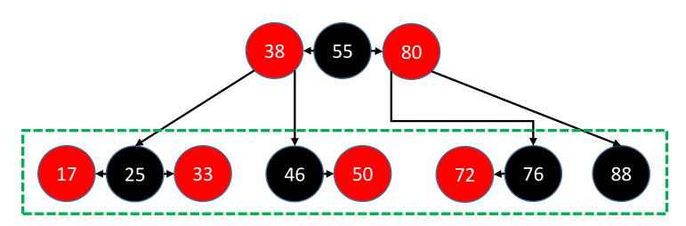

- 删除【17】或【33】（【25】由于度为2，因此删除它，会拿前驱或后继的值替代它，实际删除前驱或后继）
- 删除【46】或【50】
- 删除【72】或【76】
- 删除【88】

这边不是说只能删除叶子节点，而是删除其它节点如【38】、【55】、【80】...甚至更上层节点都是可以的，只不过这些节点的度为2，根据[二叉搜索树](# 3.二叉搜索树)的知识，实际是将它的前驱节点或者后继节点的值拿过来覆盖原先的值，真正删除的是它的前驱节点或者后继节点，所以真正删除的节点分布情况就是上图绿色方框所示。

因为红黑树也是一颗二叉搜索树，因此也是在真正删除节点后，才会来做平衡操作。当真正被删除节点为红色时，就是上图的【17】、【33】、【50】、【72】，很好办，直接删除即可，不用再做平衡处理，因为将它们删除后红黑树的性质还可以保障。红黑树删除逻辑真正的难点是删除节点为黑色的情况，即删除【46】、【76】和【88】这种节点（tip：最难的是像【88】这种单个节点的，一旦将它删除，那么“任意一个节点到达它叶子节点的路径上，其黑色节点的个数一样”这条红黑树的性质就已经不符合了）。实际上，当真正删除节点为黑色时，分为两种情况：

- 【46】-【50】和【72】-【76】，删除后有红色节点来替代；
- 【88】，删除后没有红色节点来替代。

### 6.5.1.拥有红色子节点

这种情况像【46】-【50】和【72】-【76】，处理起来很简单，就是将子节点的值覆盖掉父节点的值，然后将子节点删除掉，这样就可以保证红黑树的性质。

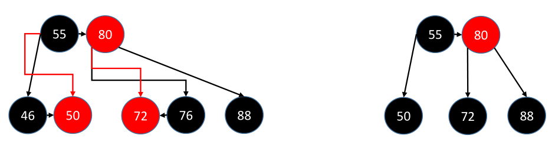

- **判定条件：**<u>拥有红色的子节点</u>
- **处理方式：**<u>用子节点的值替换掉父节点的值，然后删掉子节点，由于子节点为红色，所以可以不用平衡</u>

### 6.5.2.没有红色子节点

若被删除的节点没有红色子节点，那就是删除独立的黑色节点，例如【88】，这种是最复杂的，因为它一旦删除，其等价对应的4阶B树相当于少了一个节点，就是发生了B树[下溢](# 7.4.删除过程)。由于B树下溢的解决方式需要考虑兄弟节点和父节点，对于红黑树来说也是一样的，具体分为3种情况。

#### 6.5.2.1.兄弟节点黑色且有侄子节点

这种情况是，删除节点的兄弟节点为黑色的，并且该兄弟节点本身拥有红色子节点（我给它称为侄子节点），这种情况下就可以跟兄弟节点借元素。就像下面这几种，注意这边只给出【88】在父节点右边的情况，当然还有可能位于父节点左边的情况：

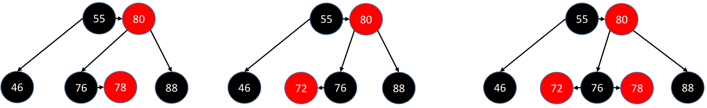

当删除节点【88】时，它本身没有红色子节点，它的兄弟节点为【76】，并且【76】有红色的子节点（也就是【88】有红色的侄子节点），这种情况就相当于B树的[下溢-借元素](# 7.4.1.下溢-借元素)，现在兄弟节点有足够多的元素，可以向兄弟节点借元素。处理起来就是，实际删除节点【88】的父节点【80】要来替代【88】节点，让兄弟节点【76】或者侄子节点来替代原先父节点【80】的位置，实际上就是让父节点旋转。注意最右边那种情况，旋转前既可以属于【80-76-72】的LL分布，也可以属于【80-76-78】的LR分布，所以会有两种旋转方式，这边是采取相对处理起来简单的LL分布，只需要让【80】右旋转即可。处理后如下：

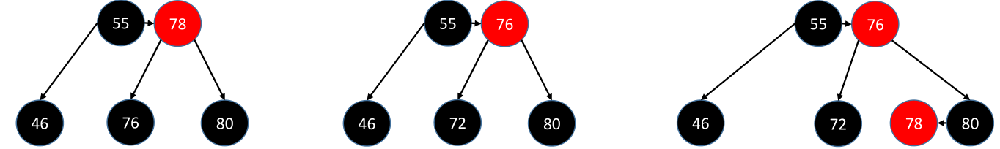

以实际删除节点【88】的角度来看，总结平衡步骤：

- **判定条件：**<u>sibling至少拥有一个红色子节点（既然有红色子节点，那肯定sibling自身为黑色）</u>
- **处理方式：**
  - <u>父节点需要旋转(左旋or右旋)，兄弟节点可能也需要旋转（上图最左边情况，即LR或RL分布）</u>
  - <u>旋转后替代父节点位置的节点，需要继承原先父节点的颜色（上图只给出红色情况，实际还有黑色）</u>
  - <u>旋转父节点后，除了替代父节点位置的那个节点，其它参与旋转的节点需要变为黑色</u>

#### 6.5.2.2.兄弟节点黑色且无侄子节点

这种情况是，删除节点的兄弟节点为黑色的，而且该兄弟节点没有任何红色子节点（也就是没有侄子节点），注意这边只给出【88】在父节点右边的情况，当然还有可能位于父节点左边的情况：

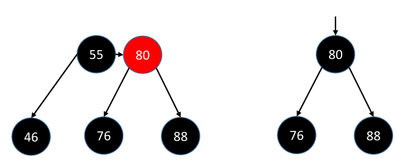

当删除节点【88】时，它本身没有红色子节点，它的兄弟节点为【76】，但是【76】没有任何红色子节点（也就是【88】没有红色的侄子节点），这种是属于B树的[下溢-并元素](# 7.4.2.下溢-并元素)，现在兄弟节点已经没有足够多的元素可以借，所以只能让父节点向下并。处理起来就是，实际删除节点【88】的父节点【80】或【80】要来替代【88】节点。但是这种情况还要分为两种：

- 父节点红色，那么父节点向下合并，是不影响父节点自己那一层的节点分布，即仍满足4阶B树节点要求；
- 父节点黑色，那么父节点向下合并，它自己那一层就少了一个节点，又出现下溢，所以需要递归处理。

如果实际删除节点【88】的父节点为红色【80】，就让它变黑后下来替代【88】的位置，同时【88】的兄弟节点【76】染成红色，如左下图所示；如果【88】的父节点为黑色【80】，让它下来替代【88】的位置后，会导致【80】自己本身下溢，那么就把【80】当做被删除的节点重新走一遍删除平衡逻辑即可。处理后的结果为：

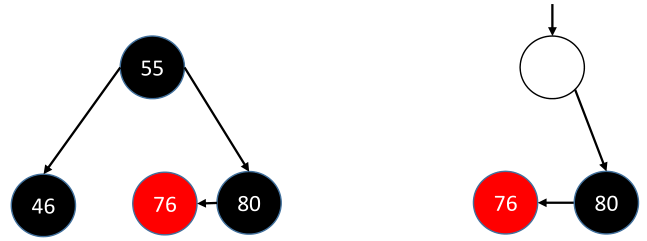

以实际删除节点【88】的角度来看，总结平衡步骤：

- **判定条件：**<u>sibling没有红色子节点（就是和被删除节点一样的形状）</u>
- **处理方式：**
  - <u>若父节点为红色：那么parent染成黑色，sibling染成红色即可</u>
  - <u>若父节点为黑色：sibling染成红色，将parent当做被删除节点，重新进入删除失衡逻辑判断</u>

#### 6.5.2.3.兄弟节点红色

这种情况是，删除节点的兄弟节点为红色的，注意这边只给出【88】在父节点右边的情况，当然还有可能位于父节点左边的情况：

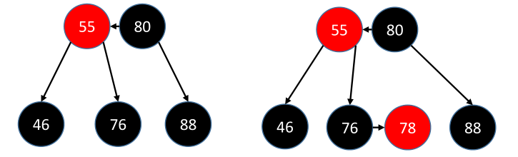

待删除节点【88】，它的兄弟节点为【55】，把【88】删除以后还是会发生下溢，但由于其兄弟节点为红色，红色节点是不会独立成一个等价的4阶B树节点，所以【88】没办法跟兄弟节点【55】借元素。但是，实际上兄弟节点【55】是有可能借出元素的，因为它必定有黑色的子节点（自己想一下，如果没这个节点，那红黑树性质就保障不了了），所以思路是让兄弟节点【55】的子节点【76】，来成为待删除节点【88】的兄弟节点（即侄子节点变为兄弟节点），实际处理起来就是让父节点【80】旋转，让【55】的右子树成为【80】的左子树，这样侄子节点就变为兄弟节点了，处理完就回到之前已经解决的兄弟节点为黑色时的情况，重复一遍它的执行逻辑即可：

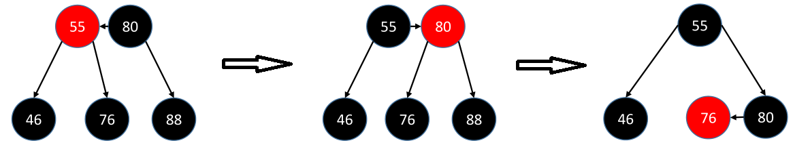

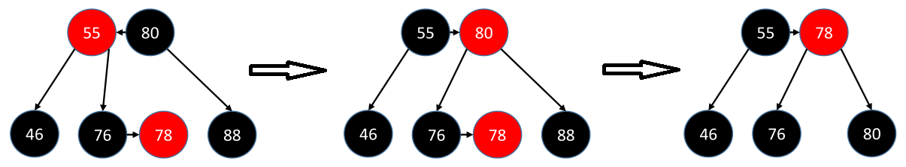

还是以实际删除节点【88】的角度，总结处理步骤：

- **判定条件：**<u>兄弟节点sibling为红色</u>
- **处理方式：**<u>sibling染成黑色，parent染成红色，parent进行旋转；然后回到sibling为黑色的处理逻辑。</u>

# 7.B树

B树，B-Tree，是一种平衡的多路搜索树，多用于文件系统、数据库的实现。相对于二叉树，B树每个内节点有多个分支；与红黑树相比，在相同的节点的情况下，一棵B/B+树的高度远远小于红黑树的高度。B/B+树上操作的时间通常由存储磁盘的时间和CPU计算时间这两个部分构成，CPU计算时间可以忽略不计，所以B树的操作效率取决于访问磁盘的次数，关键字总数相同的情况下B树的高度越小，磁盘I/O所花的时间越少。

## 7.1.m阶B树性质

在B树中存在一个`阶`的概念，它表示每个节点最多拥有多少个子节点，一般称为`m阶`B树，其中（m&ge;2 ）。例如一颗3阶B树，它最多拥有3个子节点

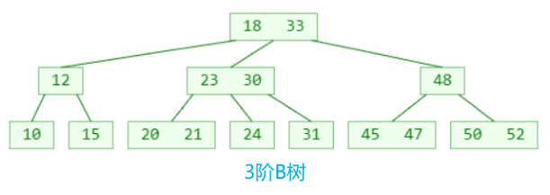

一颗4阶B树，每个节点最多拥有4个子节点

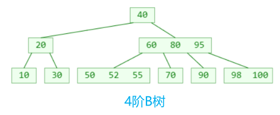

所以，一颗m阶（m&ge;2）的B树具有以下性质：

1. 假设一个节点存储的元素个数为x，则

   - 根节点：1 &le; x &le; m -1

   - 非根节点：⌈m/2⌉ - 1 &le; x &le; m-1，其中符号`⌈⌉`表示向上取整

2. 如果一个节点存在子节点，则子节点个数y = x + 1，即

   - 根节点：2 &le; y &le; m

   - 非根节点：⌈m/2⌉ &le; x  &le;  m

3. 所有的叶子结点都位于同一层；

4. 每个节点中的元素从小到大排列。

5. 每个元素左结点的值，都小于或等于该元素；右结点的值都大于或等于该元素。

## 7.2.搜索过程

①先在节点内部从小到大开始搜索元素；

②如果命中，搜索结束；

③如果未命中，再去对应的子节点中搜索元素，然后重复步骤①；

假设一颗3阶B树如上图所示，现在想查找元素25和50，查找过程如下：

- 查找25：先从根节点元素开始比较，18 < 25 < 33，所以转向中间子节点【23,30】查找；发现23 < 25 < 30，所以继续从【23,30】中间的子节点【24】查找；发现24 < 25，但是节点【24】的右边元素为null，子节点也为null，故返回null，表示25不存在于当前B树中
- 查找50：先从根节点元素开始比较，33 < 50，所以从元素33的最右边子节点【48】开始查找；发现48 < 50，所以从节点【48】的右边子节点【50,52】查找；发现50 = 50，说明元素已找到，返回。

## 7.3.添加过程

注意：B树和二叉搜索树一样，**新插入的节点也是会落到叶子节点上**。添加过程其实也是搜索过程，通过比较找到该元素落在的节点，依据从小到大的顺序放置到节点的位置上。如果此时B树性质仍可以保证，那么添加成功；如果此时节点添加新元素后，导致该节点元素的个数超过了B树的阶，这种情况称为`上溢(overflow)`。例如：

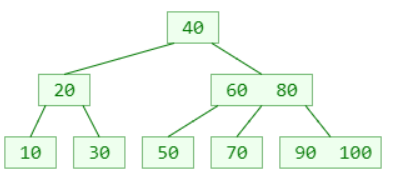

- 添加元素55。先从根节点开始比较，根节点目前只有元素40，50比40大，所以走根节点右边取到节点【60,80】；接着55比60小，所以走节点最左边取到节点【50】；55比50大，所以落在元素50的右边。添加新元素后整棵B树仍然满足3阶B树的性质，添加成功，B树就变为下面这个样子

  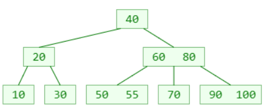

- 添加元素95。从根节点【40】开始比较，根节点只有元素40，95比40大，取它的右节点【60,80】；接着比较，95比元素60和元素80都大，所以取节点【60,80】的最右边子节点【90,100】；最后95大于90但是小于100，所以落在元素90和100之间，形如下面这个样子：

  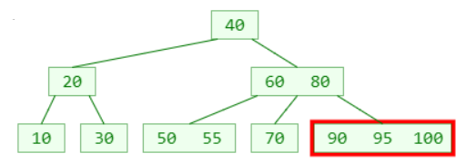

那么问题就来了，当前B树是属于3阶B树，它的任意结点元素的个数不能超过2个，所以由于95的加入，导致了节点失衡，这种情况就称为`上溢`，需要对其做自平衡处理。首先，明确一点，任意一颗m阶B树如果在添加过程中发生了`上溢`，那么此时新元素添加的那个节点的总元素个数必定为m，例如上图的【90,95,100】。解决`上溢`的步骤：

1. 找出上溢节点最中间的位置k（若m为奇数，k=⌈m/2⌉；若m为偶数，k=m/2或者k=⌈m/2⌉都可以）；
2. 将k位置上的元素与父节点合并；
3. 将上溢节点[0,  k-1]的元素和[k+1,  m+1]的元素分裂为两个子节点；
4. 一次上溢处理后，判断祖先节点是否也会发生上溢，如果发生了，重复1~3的步骤即可。

以添加元素95为例，当将新元素95加入到节点【90,100】后，新节点变为【90,95,100】，发生上溢了。取出节点的中间位置k，此时k=2，位置k上的元素正好是新元素95，将它与父节点合并变为【60,80,95】（tip：父节点也上溢了哦）。然后上溢节点[0, k-1]位置的元素90和[k+1, m-1]位置的元素100分裂为两个子节点【90】和【100】。

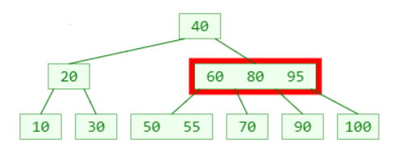

还没完，需要检查上溢节点的祖先节点是否也上溢了？结果发现父节点确实也上溢了，变为【60,80,95】，重复上面的步骤，将元素80与它的父节点（也就是根节点了）合并，然后将元素60和95分裂为两个子节点，最终效果就变成了：

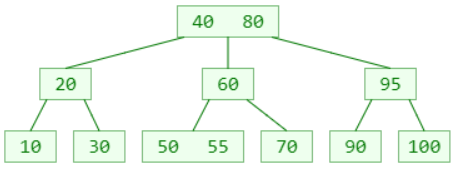

<u>注意：如果上溢情况一直发生到根节点，那么会从根节点中取出中间位置的元素，独立为一个节点并成为新的根节点，这是唯一 一个让B树'长高'的情况</u>

## 7.4.删除过程

注意：B树和二叉搜索树一样，**真正发生元素删除的都在叶子节点上**。删除分为两种情况：

- 如果删除的元素，就在叶子节点，那么直接将元素删掉即可；
- 如果删除的元素，不在叶子节点：
  - 先找到该元素的前驱或后继元素，覆盖将要删除元素的值
  - 再将前驱元素或后继元素删除。

非叶子节点的前驱或后继元素，必定落在叶子节点上，所以这边的删除前驱或后继元素，实际上就是到叶子节点上删除元素！！！例如，一颗3阶B树：

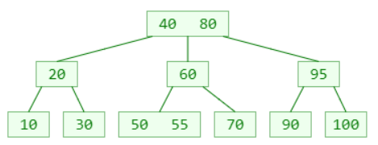

假设现在要删除元素80，发现它不是位于叶子节点，所以找到它的前驱元素，即70。用70的值来替换掉元素80

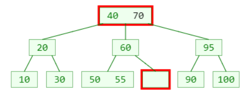

根据m阶B树的性质，非根节点元素的个数为 ⌈m/2⌉ - 1 &le; x &le; m-1，此时m=3，也就是说节点最少要有一个元素，那么问题就来了，现在元素70已经被移到根节点了，导致其原先所在节点没有元素了，这就不符合B树的要求，这种现象称为`下溢`。解决`下溢`的方式分为两种情况：

- 如果下溢节点的兄弟节点的元素个数&ge; ⌈m/2⌉，向其`借`一个元素；
- 如果下溢节点的兄弟节点的元素个数 ⌈m/2⌉ - 1，相当于达到B树要求的元素的最低个数，那只能让父节点元素挪下来与左右子节点合并。

上例中的情况属于第一种，下溢节点的兄弟节点【50,55】元素个数为2，满足 &ge;⌈m/2⌉（m=3）的条件，所以向其借一个元素55，将它放在父节点元素60的位置上，然后将父节点元素60挪到下溢节点来，最终变为：

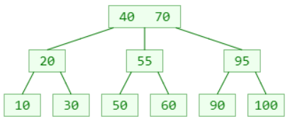

下溢节点的处理方式取决于兄弟节点是否有足够的元素，下面对其进行系统地分析

### 7.4.1.下溢-借元素

首先需要明确一点：下溢节点的元素数量必定等于 ⌈m/2⌉ -2。如果下溢节点临近的兄弟节点，有至少 ⌈m/2⌉个元素，那么下溢节点就可以向其`借`一个元素。下图绿色部分表示下溢节点：

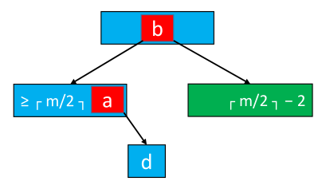

`借`的步骤为：

- 将父节点的元素`b`插入到下溢节点的`0`位置（即最小位置）
- 用兄弟节点的元素`a`（即最大元素）替换父节点元素`b`，实际上就是将元素b右旋（同理，还有左旋）

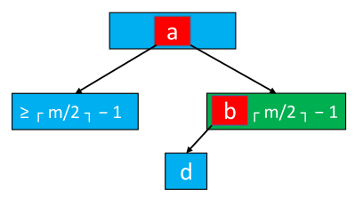

### 7.4.2.下溢-并元素

首先需要明确一点：下溢节点的元素数量必定等于 ⌈m/2⌉ -2。如果下溢节点临近的兄弟节点，只有 ⌈m/2⌉-1个元素，也就是达到m阶B树要求的最低元素个数，那兄弟节点也`借`不了，只能求助父节点帮忙了。下图绿色部分表示下溢节点：

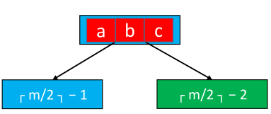

跟`父节点求助`的步骤为：

- 将父节点的元素`b`挪下来跟左右子节点合并；
- 合并后的节点元素等于 ⌈m/2⌉ +  ⌈m/2⌉ - 2，必定不会超过m-1，所以满足m阶B树规定的最多元素个数

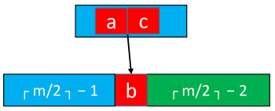

但是这个操作可能会导致父节点自己也`下溢`，所以需要一层一层判断，发现父节点`下溢`后，判断能否与兄弟节点`借`元素，不行再向祖父节点`借`，最差情况会将下溢现象一直传播到根节点，最终导致根节点下来与其子节点合并，整棵B树高度就减一！！！

# 8.B+树

B+树是[B树](#6.4.B树)的一种变形，它与B树的差别在于：

1. 有n棵子树的节点含有n个关键字；

2. 所有的叶子节点包含了全部关键字的信息，及指向这些关键字记录的指针，且叶子节点本身按关键字大小自小到大顺序链接；

3. 所有非终端节点可以看成是索引部分，节点中仅含有其子树（根节点）中最大（或最小）关键字，所有B+树更像一个索引顺序表；

4. 对B+树进行查找运算，一是从最小关键字起进行顺序查找，二是从根节点开始，进行随机查找。

# 9.字典树

字典树，也称trid树。是一种以树形结构保存大量字符串。以便于字符串的统计和查找，经常被搜索引擎系统用于文本词频统计。它的优点是：利用字符串的公共前缀来节约存储空间，最大限度地减少无谓的字符串比较，查询效率比哈希表高。有以下特点：

1. 根节点为空；

2. 除根节点外，每个节点包含一个字符；

3. 根节点到某一节点，路径上经过的字符连接起来，为该节点对应的字符串；

4. 每个字符串在建立字典树的过程中都要加上一个区分的结束符，避免某个短字符串正好是某个长字符串的前缀而淹没
