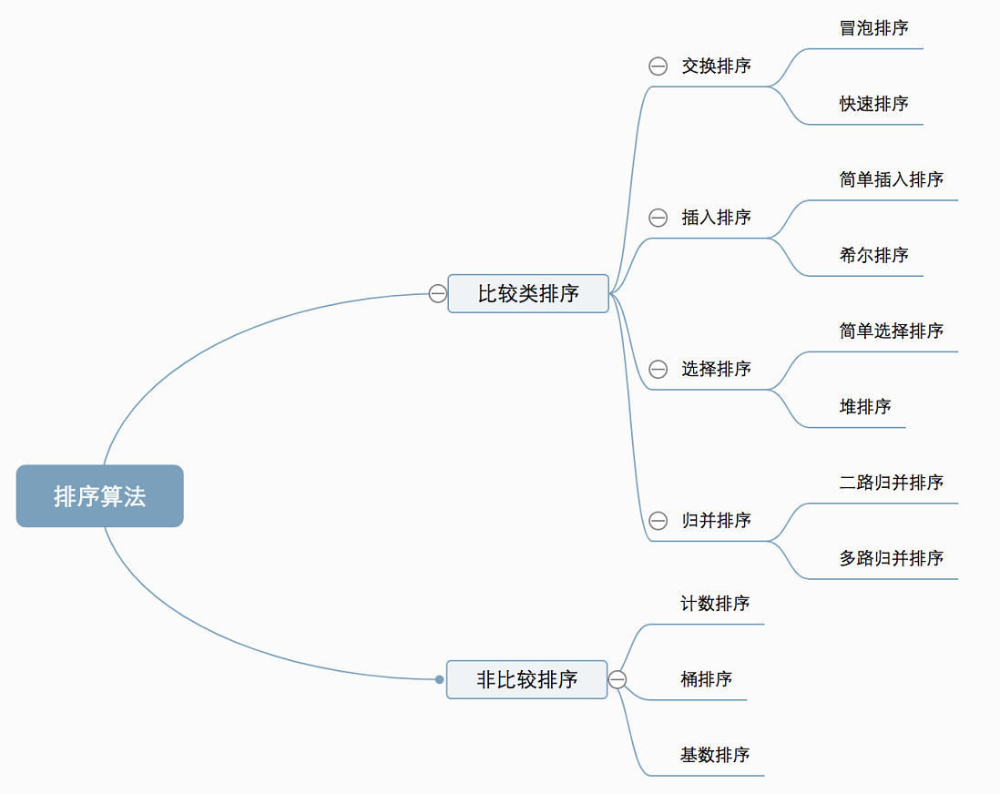
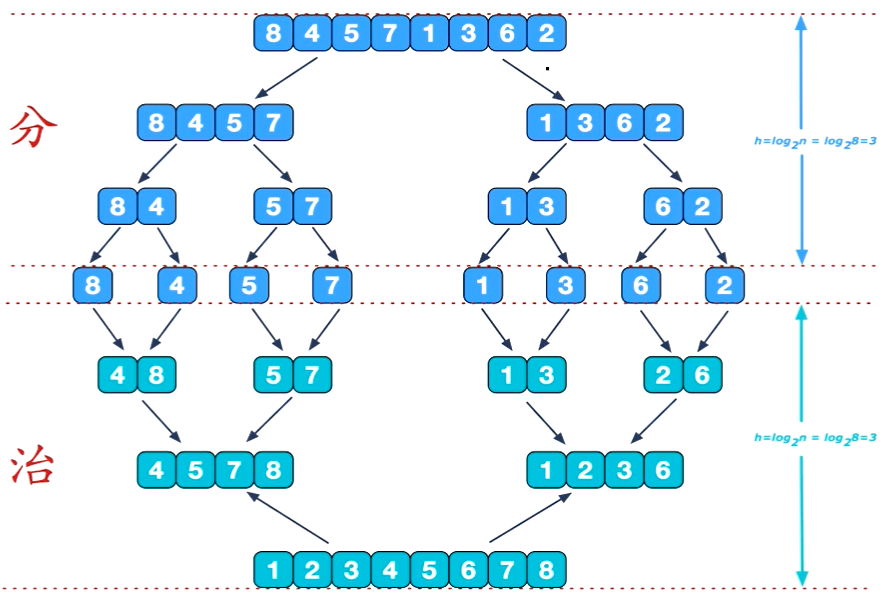
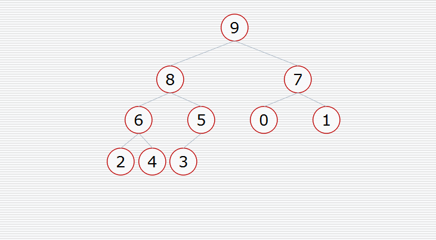

# `程序=数据结构+算法！`

刚开始学习算法时，先不要纠结于细节问题，诸如：这边要小于等于？那边是要大于还是大于等于？数组区间是要左闭右开还是左开右闭？...先将算法的大体结构实现好，后面再去微调，这样子思路会更清晰

# 1.复杂度分析

一般从以下几个角度评估算法：

- 正确性
- 可读性
- 健壮性
- 时间复杂度：估算程序指令的执行次数（执行时间）
- 空间复杂度：估算所需占用的存储空间

## 1.1.大O表示法

一般用大O表示法来表示数据规模n的时间复杂度，它仅仅是一种粗略的分析模型，是一种估算，只是能在短时间内了解一个算法的执行效率。

O(1) < O(logn) < O(n) < O(nlogn) < O(n^2^) < O(n^3^) < O(2^n^) < O(n!) < O(n^n^)

可以借助函数生成工具对比复杂度的大小：[[https://zh.numberempire.com/graphingcalculator.php](https://zh.numberempire.com/graphingcalculator.php)]


## 1.2.递推式

有些算法的时间复杂度肉眼就可以看出来，但是有些算法的时间复杂度需要用公式来推算，比如较复杂的递推操作，这类算法可以用`递推式`来计算，递推式对应的复杂度为：

| 递推式                     | 复杂度           |
| -------------------------- | ---------------- |
| T(n) = T(n/2) + O(1)       | O(logn)          |
| T(n) = T(n-1) + O(1)       | O(n)             |
| T(n) = T(n/2) + O(n)       | O(n)             |
| T(n) = 2 * T(n/2) + O(1)   | O(n)             |
| T(n) = 2 * T(n/2) + O(n)   | O(nlogn)         |
| T(n) = T(n - 1) + O(n)     | O(n<sup>2</sup>) |
| T(n) = 2 * T(n - 1) + O(1) | O(2<sup>n</sup>) |
| T(n) = 2 * T(n - 1) + O(n) | O(2<sup>n</sup>) |

至于`递推式`怎么计算？这个就要根据实际算法实现来分析了，比如：

```java
// 递归调用，对半平均分数组
private void divide(int[] array, int startIndex, int endIndex) {
    if (endIndex - startIndex <= 1) {
        return;
    }
    int middleIndex = (endIndex + startIndex) >> 1;
    divide(array, startIndex, middleIndex);
    divide(array, middleIndex, endIndex);
}
```

# 2.排序算法

排序算法属于较为简单且基础的算法知识，它分为两类：

- **比较类排序**：通过比较来决定元素间的相对次序，由于其时间复杂度不能突破O(nlogn)，因此也称为非线性时间比较类排序
- **非比较类排序**：不通过比较来决定元素间的相对次序，它可以突破基于比较排序的时间下界，以线性时间运行，因此也称为线性时间非比较类排序



排序算法有这样几个概念：

- 稳定性：如果相等的2个元素，排序前后的相对位置保持不变，就是具有稳定性的排序算法
- 原地算法：不依赖额外的资源或依赖少数的额外资源，空间复杂度为O(1)的都为原地算法，非原地算法称为：Not-in-place或者Out-of-place


## 2.1.冒泡排序

冒泡排序的动图演示：


**算法思想：**

比较相邻的两个元素，若后一个元素比前一个元素小，那么将这两个元素互换位置，经过这样一轮排序后，可以将数组中最大的元素移动到数组末尾。假设数组有n个元素，那么最差需要通过n-1轮的比较。冒泡排序可以有两个优化：

- 如果数组已经完全有序, 可以提前终止冒泡排序
- 如果数组末尾已局部有序, 记录最后一次比较的位置, 下一轮直接到该位置即可

**代码实现：**

```java
static void bubbleSort(int[] array) {
    // 需要进行n-1轮的比较，每经过一轮比较后，其实数组末尾已经有序，比如：第一轮比较后，数组最大元素
    // 元素就可以确定，所以下一轮比较的终止位置就是array.length-1。因此从后往前确定比较最终位置
    for (int end = array.length - 1; end > 0; end--) {
        // 记录最后一次交换的位置
        int lastSwapIndex = 1;
        for (int i = 0; i < end; i++) {
            // 相邻元素两两比较，若发送大小不一致，进入if语句块交换位置
            if (array[i] > array[i + 1]) {
                int n = array[i + 1];
                array[i + 1] = array[i];
                array[i] = n;
                // 发生位置交换了, 记录当前位置。如果这个变量在后续比较中都没有发生变化，那么
                // 说明从这个位置开始到数组末尾的元素都已经有序了，下一轮比较直接到这个位置为止。
                lastSwapIndex = i + 1;
            }
        }
        // 一轮遍历, 重置end的索引, 然后外层for循环就会对end-1, 再进行判断,
        // 是否要继续循环, 所以将lastSwapIndex的初始值设为1, 这样如果内层循环
        // 没有执行过, 那就意味着数组已经全有序, 外层for循环将end-1后变为0, 直接退出外层循环
        end = lastSwapIndex;
    }
}
```

## 2.2.选择排序

选择排序的动图演示：


**算法思想：**

每一轮比较（一轮：遍历一个区间的数组元素），可以选择找最小，或最大元素。假设数组元素个数为n，若一轮比较中找的是最小元素，则遍历区间为[0,n]，然后将其移动到下标为0的位置；下一轮比较区间为[1,n]，然后移动到下标为1的位置。同理，若找的是最大元素，第一轮比较的区间为[0,n]，将其移动到下标为n的位置；下一轮比较区间为[0,n-1]，将其移动到下标为n-1的位置。

选择排序与冒泡排序很相似， 都是将一轮比较中的最小/最大元素，移动到数组的极端位置，但是选择排序的交换次数远远小于冒泡排序，平均性能优于冒泡排序

**代码实现：**

```java
// 寻找最小值
private static int[] minimum(int[] array) {
    // 至少需要比较n-1轮
    for (int start = 0, length = array.length; start < length - 1; start++) {
        // 记录最小值的下标, 每进入一轮循环, 假设最开始下标的位置就是最小值
        int minimumIndex = start;
        // 1轮比较, 需要遍历[start, array.length-1]
        for (int j = start + 1; j < array.length; j++) {
            // 这边用 >= 是有讲究的, 假设: [10,3,3,20], 数组内有相等元素, 为了不交换它们的位置,
            // 用 >= 比较, 可以保证原先靠前的元素可以继续靠前排列. 这样可以让选择排除处于稳定状态.
            if (array[minimumIndex] >= array[j]) {
                minimumIndex = j;
            }
        }
        // 每轮比较完后, 可以得到一个最小值即array[minimumIndex],
        // 将其与array[start]互换位置
        int temp = array[minimumIndex];
        array[minimumIndex] = array[start];
        array[start] = temp;
    }
    return array;
}
```

```java
// 寻找最大值
private static int[] maximum(int[] array) {
    // 至少需要比较n-1轮
    for (int end = array.length - 1; end > 0; end--) {
        // 记录最小值的下标, 假设每次都是下标为0的位置为最大值
        int maximumIndex = 0;
        // 1轮比较, 需要遍历[0, end]
        for (int start = 0; start <= end; start++) {
            // 这边用 <= 是有讲究的, 假设: [10,30,30,20], 数组内有相等元素, 为了不交换它们的
            // 位置, 用<= 比较, 可以保证原先靠前的元素可以继续靠前排列. 这样可以让选择排除处于
            // 稳定状态.
            if (array[maximumIndex] <= array[start]) {
                maximumIndex = start;
            }
        }
        // 每轮比较完后, 可以得到一个最大值即array[maximumIndex],
        // 将其与array[end]互换位置
        int temp = array[maximumIndex];
        array[maximumIndex] = array[end];
        array[end] = temp;
    }
    return array;
}
```

## 2.3.插入排序

先看一下插入排序的动图演示


**算法思想**

与整理扑克牌的思想一样，假设现在有部分扑克牌已经有序，新摸到的扑克牌会依次与已经有序的扑克牌比较（例如从右到左比较），将其插入到合适的位置。插入排序做法很类似，它是从数组下标为1的位置开始，让它与下标为0的元素比较，如果比它小，则互换位置；接着再让数组下标为2的元素，依次与下标为1和0的比较；接着再让数组下标为3的元素，依次与下标为2,1,0的元素比较...以此类推，直至所有元素比较完。

插入排序的速度，与逆序对有关。比如像[2,1]、[80,10]、[9,5]...这种顺序颠倒的数组元素组合就称为逆序对，当一个数组的逆序对越多时，插入排序就需要更多的比较与交换；相反地，如果数组中逆序对很少，那么插入排序需要比较的次数就很少，完成的速度就越快。

其实，插入排序的耗时，大部分在于需要依次与其左边的元素比较，得出它该插入的下标位置。所以如何快速地得到待插入的下标，就是解决插入排序的关键：可以采用二分查找思想，假设现在要判断插入位置的元素下标为7，则将它在[0,6]的数组区间内进行二分查找，确认出它的插入位置，接着再移动，可以有效减少比较次数～

**代码实现**

```java
protected void internalSort(int[] array) {
    int start;
    for (int i = 1, len = array.length; i < len; i++) {
        start = i;
        while (start > 0) {
            // 依次将元素与其左边的各个元素比较
            if (compareByIndex(start - 1, start) > 0) {
                swap(start, start - 1);
                start--;
            } else {
                // 因为元素左边以前有序了，如果元素最右边都小于这个元素了，
                // 那么之前的元素肯定都小于它
                break;
            }
        }
    }
}
```

## 2.4.希尔排序

先看一下希尔排序的动图演示


## 2.5.归并排序

先看一下归并排序的动图演示


**算法思想：**

归并排序是由`冯·诺依曼`首次提出，它的做法是将一个数组不断地对半分割为2个子数组，直至无法再分割（即每个子数组只有一个元素），接着不断地将每个子数组比较且合并为一个新的数组，直至合并称为一个完整的数组。其实就跟JDK8的fork-join框架一个思想：



是不是听起来很简单，其实实现起来还是有点绕，也不是说难理解，就是指针会多一些。首先思考一个问题，如何将两个有序的数组A和B合并为一个新的数组？很简单，分别定义2个指针a1,a2指向数组A的前后位置，再定义2个指针b1,b2指向数组B的前后位置，最后创建一个新数组C，定义1个指针c1执行数组C的起始位置


依次比较a1和b1，谁小谁放入到c1位置。上例，开始的时候a1=0，代表值为`1`，b1=0，代表值为`2`，明显`1<2`，所以让拷贝`1`到c1=0位置上，同时a1++，c1++，b1保持不变。然后接着比较a1=1和b1=0...依次类推，直到某一方遍历结束，上例明显是a1会先达到a2。

归并排序的代码实现跟上面很类似，但有一点，**它不是拷贝一个完整的新数组出来**。因为它是对半分割的，每次都是比较左右两边（元素个数相差<=1）所以，归并排序只拷贝其左边数组，然后同样也定义5个指针，2个指针指向拷贝出来的数组，2个指针指向原数组的右边，最后1个指针也指向原数组，用于将左右两边比较结果覆盖进去。

以下图所示：array表示原数组，leftArray表示拷贝原数组左边部分即[3,6,11,18]。其中li和ri分别指向leftArray和array的起始位置，默认为0，ai指向array的起始位置，默认也为0。接着就是依次比较li和ri指向的值的大小，将较小的值覆盖掉ai指向的位置：


**代码实现：**

```java
/**
 * 归并排序的第一步，分割操作。刚开始startIndex=0, endIndex=array.length
 */
private void divide(int[] array, int startIndex, int endIndex) {
    if (endIndex - startIndex <= 1) {
        // 范围[starIndex, endIndex)数组已经无法分割, 即这区间的元素数量只有1或0
        return;
    }
    int middleIndex = (endIndex + startIndex) >> 1;
    // 递归调用, 对左右子序列进行分割
    divide(array, startIndex, middleIndex);
    divide(array, middleIndex, endIndex);
    // 递归调用结束, 说明数组已经无法再分割了, 此时进行合并操作
    merge(array, startIndex, middleIndex, endIndex);
}


/**
 * 归并排序的第二步，合并操作，这一步比较绕
 */
private void merge(int[] array, int startIndex, int middleIndex, int endIndex) {
    // ls即leftStart, 表示复制的temp数组的起始索引, 固定为0; 
    // le即leftEnd, 表示复制的temp数组的终止索引(不包括)
    int ls = 0, le = middleIndex - startIndex;
    // rs即rightIndex, 表示右边数组(原数组)的起始索引; 
    // re即rightEnd, 表示右边数组(原数组)的终止索引(不包括)
    int rs = middleIndex, re = endIndex;
    // 每次比较结果都需要更新到原数组上, 所以还需要额外定义一个指针ci, 即currentIndex
    int ci = startIndex;

    // 备份出左边数组, 这边的temp定义在方法外部，直接取array.length/2的长度即可
    for(int i = 0; i < le; i++){
        // 注意这边要用 startIndex + i, 因为并不是从原数组下标为0的位置开始拷贝
        temp[i] = array[startIndex + i];
    }

    // 一旦左边数组比较完了, 即ls >= le, 那么就没必要再继续比较了, 右边数组也不需要再操作,
    // 因此这边使用左边数组(备份的数组)的指针来做循环条件.
    while(ls < le){
        // 这个if条件有两个含义：
        
        // 其一, 外层循环已经保证ls和le的正确性, 这里rs < re来保证右边数组遍历的正确性,
        // 一旦右边数组已经比较完毕, 则直接进入else语句块；
        
        // 其二, 依次比较temp和array的元素大小, 如果temp的元素比array的元素, 那么就需要将值较小
        // 的元素移位, 移动到ci位置上, 为了保证稳定性, 这边只能用大于而不不能用大于等于.
        if(rs < re && compareByValue(temp[ls], array[rs]) > 0){
            array[ci++] = array[rs++];
        }else{
            // 否则右边index=rs的元素比左边index=rs的大,
            array[ci++] = temp[ls++];
        }
        swapCount();
    }
}
```

## 2.6.快速排序

先看一下快速排序的动图演示


## 2.7.堆排序

先看一下堆排序的动图演示



**算法思想：**

将给定数组进行堆化（最大二叉堆），这样堆顶元素array[0]就是值最大元素。然后重复执行下面的操作直至堆的元素数量为1：

- 交换堆顶元素和尾元素
- 堆的元素数量减一
- 堆顶元素进行一次下滤操作（siftDown）

注意，由于堆顶元素会移动到尾元素，当数组中两个元素值相等时，处于前面位置的元素会先移动到尾元素，导致它们的位置调换了，所以堆排序属于不稳定排序。它的最好、最坏、平均时间复杂度都是O(nlogn)，空间复杂度为O(1)

**代码实现：**

```java
/**
 * 堆排序 
 */
private static int[] sort(int[] array){
    int heapSize = array.length;
    // 原数组建堆
    heapify(array);
    //
    while(heapSize > 0){
        // 首尾交换, 将值最大的元素移到数组末尾
        int tmp = array[0];
        array[0] = array[heapSize -1];
        array[heapSize - 1] = tmp;
        //
        heapSize -= 1;
        siftDown(array, 0, heapSize);
    }
    return array;
}


/**
 * 对原数组建堆
 */
private static void heapify(int[] array){
    for (int i = (array.length >> 1); i >= 0; i--) {
        siftDown(array, i, array.length);
    }
}

/**
 * 二叉堆下滤操作
 */
private static void siftDown(int[] heap, int index, int size){
    int el = heap[index];
    for (; ; ) {
        // 获取最大子元素下标
        int cIndex = maxChildIndex(heap, index, size);
        if (cIndex == -1) {
            // 没有子元素就跳出循环
            break;
        }
        // 与最大子元素比较大小
        if (el - heap[cIndex] >= 0) {
            // 如果比最大子元素还大, 就不用再下滤了, 跳出循环
            break;
        }
        // 比最大子元素还小, 则与最大子元素互换位置, 然后继续下滤
        heap[index] = heap[cIndex];
        index = cIndex;
    }
    heap[index] = el;
}


/**
 * 给定一个父索引，求得它的最大值子索引
 */
private static int maxChildIndex(int[] heap, int index, int size) {
    // 左子元素索引
    int left = (index << 1) + 1;
    if (left < size) {
        // 左子元素存在, 判断右子元素存在
        int right = left + 1;
        if (right < size) {
            // 右子元素也存在
            return heap[left] - heap[right] > 0 ? left : right;
        } else {
            return left;
        }
    } else {
        // 左右子元素都不存在
        return -1;
    }
}
```

## 2.8.计数排序

先看一下计数排序的动图演示


## 2.9.桶排序

先看一下桶排序的动图演示


## 2.10.基数排序

先看一下基数排序的动图演示


# 递归

画出递归树

# 动态规划

重叠子问题、最优子结构、状态转义方程，动态规划三要素。动态规划的一般形式是求最值，解决这一类问题的核心是穷举。


