# 1.NIO简介

java nio，也称New IO 或者 Non Blocking IO，是从java 1.4版本开始引入的一个新的IO API，可以替代标准的java io API。NIO与原来的IO有着同样的作用和目的，但是使用的方式完全不同：NIO支持面向缓冲区、基于通道的IO操作，它以更加高效的方式进行文件的读写。

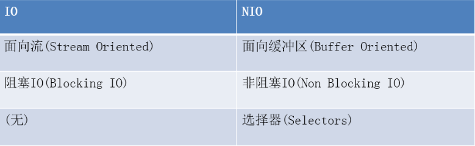

## 1.1.bio示意图

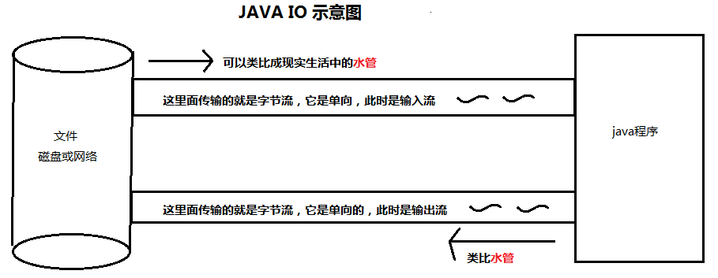

Java io都是面向流的，数据转换为字节流，在文件和程序之间流动，相当于水管一样，都是单向的，所以分为输入流和输出流。java程序可以直接在流中写入或读取数据。

## 1.2.nio示意图

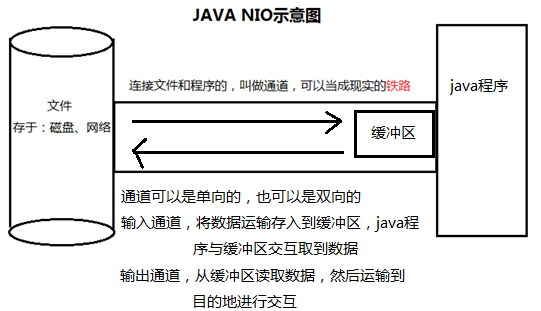

java NIO系统的核心在于：通道(Channel)和缓冲区(Buffer)。

通道表示打开到IO设备(如：文件、套接字即网络)的连接；当要使用NIO时，先获取连接IO设备的通道，再获取用于容纳数据的缓冲区，然后操作缓冲区，对数据进行处理。简而言之：**Channel负责传输，buffer负责存储**

# 2.NIO-缓冲区

​	缓冲区，即buffer，一个用于存储特定数据类型的容器。它是一个抽象类，全路径为java.nio.Buffer。所有的缓冲区都是Buffer抽象类的子类，Java NIO中的buffer主要用于与NIO通道进行交互：数据是从通道读入缓冲区，从缓冲区写入通道中的。

  缓冲区底层就是数组，可以保存多个相同类型的数据，有以下Buffer常用子类：ByteBuffer(最常用)、CharBuffer、ShortBuffer、IntBuffer、LongBuffer、FloatBuffer、DoubleBuffer，可以看到除了boolean外几乎都有。上述的Buffer类除了各自管理的数据类型不同外，几乎都以相似的方法管理数据

## 2.1.基本属性

缓冲区java.nio.Buffer的几个重要属性，各属性间有如下的恒等式：**0<=mark<=position<=limit<=capacity**，源码为：

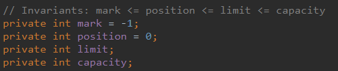

**①容量(capacity)**

- 表示缓冲区的最大数据容量，不能为负且创建后不能更改；

**②限制(limit)**

- 第一个不能读取或写入的数据的索引，即位于limit索引后的数据不可读写，limit不能为负且不能大于capacity；

**③位置(position)**

- 下一个要读取或写入的数据的索引，position不能为负且不大于limit；

**④标记(mark)**

- mark是一个索引，通过Buffer的mark()方法可以将一个特定的position赋值给mark，之后调用reset()方法恢复到这个position。

## 2.2.读写变化

① 当使用**allocate()**方法实例化一个缓冲区时，各变量的情况如下：指定多大的capacity，程序就实例化一个多大的数组，初始化的时候limit 等于 capacity，由于既没有读也没有写，所以position=0

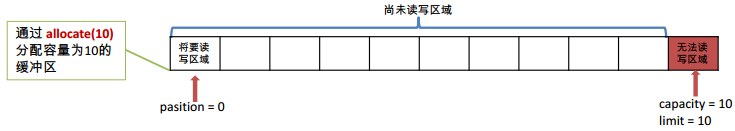

② 当使用**put()**方法往缓冲区写入数据时，各变量的情况如下：capacity缓冲区容量，固定不变。此时的缓冲区是写入状态，limit表示可读写的区域，limit不变表示还有这么多空间可供写入。因为已经写入5个数据，所以底层数组索引值为0、1、2、3、4都被占用，position就会指向索引值为5的数组位置，表示可供写入的起始位置

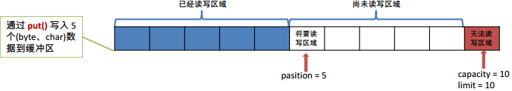

③ 当使用**flip()**方法会把缓冲区从写入状态转换成读取的状态，变化情况如下：之前缓冲区已经写入5个数据，所以要读取缓冲区的数据时，也只有5个。capacity固定的容量，肯定不变。limit表示可读写区域，现在要读取数据了，limit就要到达可读取数据的临界值，即写入状态时的position的值，position置为0，表示从第一个数据开始读取

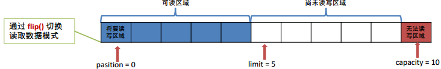

## 2.3.常用方法

父级抽象类Buffer定义的常用方法，子类会在此基础上增加新方法：

| **方法**               | **描述**                                                     |
| ---------------------- | ------------------------------------------------------------ |
| int capacity()         | 返回Buffer的capacity大小                                     |
| int position()         | 返回Buffer的position大小                                     |
| int limit()            | 返回Buffer的limit大小                                        |
| Buffer position(int n) | 设置Buffer的当前读写位置为n，  并返回修改后的Buffer对象      |
| Buffer limit(int n)    | 设置Buffer的界限为n，并返回修改后的Buffer对象                |
| Buffer flip()          | 开启Buffer的读模式：将Buffer的position赋值给limit，position值置为0 |
| Buffer mark()          | 对Buffer设置标记，将position的值赋给mark                     |
| Buffer reset()         | 将Buffer退回到mark()所标记的位置，将mark的值赋给position     |
| Buffer rewind()        | 将position置为0，并且取消mark标记的位置                      |
| Buffer clear()         | 清空缓冲区，返回清空后的Buffer对象                           |
| boolean hasRemaining() | 判断缓冲区中是否还有元素                                     |
| int remaining()        | 返回Buffer剩余的可操作数量                                   |

## 2.4.直接与非直接缓冲区

**直接缓冲区：**通过allocateDirect()分配缓冲区，将缓冲区建立在操作系统的物理内存中，实现零拷贝(zero-copy)

**非直接缓冲区：**通过allocate()分配缓冲区，将缓冲区建立在JVM内存中.

 通过Buffer.isDirect()方法可以判断一个缓冲区是直接还是非直接缓冲区以ByteBuffer为例，非直接缓冲区实现类- HeapByteBuffer，而直接缓冲区实现类- DirectByteBuffer。在java.nio.Buffer-192行，所有缓冲区的顶级抽象父类，可以看到一个变量：

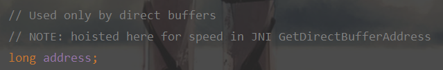

它专门用于直接缓冲区，用来记录它的物理内存地址。而为啥将其放置到顶级Buffer中，注释解释说这样操作可以在JNI中得到更快的速度。

### 2.4.1.非直接缓冲区

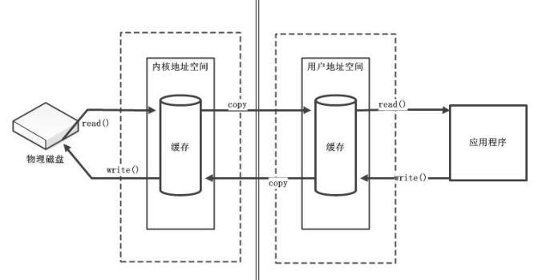

像传统的IO和用allocate()方法创建的缓冲区，都属于非直接缓冲区，它创建在JVM的内存中，易回收，但IO处理会有一个**copy过程**，即图中的用户地址空间---->内核地址空间。非直接缓冲区写入步骤：

1. 创建一个临时的直接ByteBuffer对象

2. 将非直接缓冲区的内容复制到临时缓冲中

3. 使用临时缓冲区执行底层次(操作系统)I/O操作

4. 临时缓冲区对象离开作用域，并最终成为被回收的无用数据

### 2.4.2.直接缓冲区

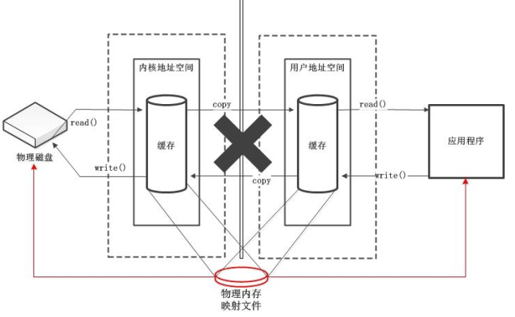

​	直接缓冲区少了一个copy过程，这个就是所谓的**zero-copy(零拷贝)**，直接与操作系统的IO接口进行交互，效率高，但是不易控制。它使用的内存是操作系统分配的，绕过了JVM堆栈，建立和销毁比堆栈上的缓冲区要更大的开销。

​	直接缓冲区是为加快 I/O 速度，而以一种特殊的方式分配其内存的缓冲区。如果为直接字节缓冲区，则 JVM 会尽最大努力直接在此缓冲区上执行本机 I/O 操作。即：每次调用操作系统的一个本机 I/O 操作之前（或之后），虚拟机都会尽量避免将缓冲区的内容复制到中间缓冲区中（或从中间缓冲区中复制内容）而且，只有byteBuffer才有直接缓冲区。

### 2.4.3.MappedByteBuffer

直接缓冲区 java内部是使用 DirectByteBuffer 来实现的；堆缓冲区java内部是使用 HeapByteBuffer 来实现的。

java处理大文件，一般用BufferedReader，BufferedInputStream这类带缓冲的Io类，不过如果文件超大的话，更快的方式是采用MappedByteBuffer。MappedByteBuffer继承自ByteBuffer，它拥有缓冲区的所有功能，它是属于直接缓冲区，直接调用系统底层的缓存，没有JVM和操作系统之间的复制操作，读写性能极高，称之为“内存映射”。

 我们都知道，在操作系统中，内存分为两部分：物理内存和虚拟内存。物理内存不用多说，就是内存条；虚拟内存一般使用的是页面映像文件，即硬盘中的某些特殊文件，操作系统负责页面文件的读写，这个过程叫“页面中断/切换”。 MappedByteBuffer也是类似的，它可以让我们读写那些因为太大而不能放进内存（物理内存）中的文件，原因是它将文件直接映射到虚拟内存上，也反映了它的一个特点：快！

**使用方式：**

MappedByteBuffer通过FileChannel的map()方法来获取，可以把文件的从position开始的size大小的区域，映射为内存映像文件：

```java
public abstract MappedByteBuffer map(MapMode mode,long position, long size)
throws IOException;
```

MapMode指出了可访问该内存映射文件的方式，共有三种，分别为：

<table>
    <tr>
    	<th>模式</th>
        <th>作用</th>
    </tr>
    <tr>
    	<td width="25%">READ_ONLY（只读）</td>
        <td>试图修改得到的缓冲区将抛出ReadOnlyBufferException异常</td>
    </tr>
    <tr>
    	<td>READ_WRITE（读/写）</td>
		<td>对得到的缓冲区的更改最终将写入文件；但该更改对映射到同一文件的其它程序不一定是可见的</td>
    </tr>
    <tr>
    	<td>PRIVATE（专用）</td>
		<td>可读可写，但是修改的内容不会写入文件，只是buffer自身的改变，这种能力称之为”copy on write”
</td>
    </tr>
</table>

MappedByteBuffer在ByteBuffer基础上新增的3个方法：

| **方法名** | **作用**                                                     |
| ---------- | ------------------------------------------------------------ |
| fore()     | 缓冲区是READ_WRITE模式，此方法对缓冲区内容的修改强行写入文件 |
| load()     | 将整个文件的内容载入内存，并返回该缓冲区的引用               |
| isLoaded() | 如果文件内容以及完全加载到内存中，则返回真，否则返回假       |

**注意点：**

1. MappedByteBuffer没有提供关闭或销毁的方法，一旦创建完直接缓冲区，就一直有效，直到它本身被垃圾回收，这个时间点是不确定的；

2. MappedByteBuffer的内容可以在任何时间改变。所以，还是不要轻易使用

# 3.NIO-通道

## 3.1.定义与理解

通道，即Channel接口，类路径为：java.nio.channels.Channel。

Channel 表示 IO 源与目标打开的连接；

Channel 类似于传统的“流”，只不过 Channel本身不能直接操作数据；

Channel 只能与Buffer 进行数据交互。

通道API主要由接口指定。不同的操作系统上通道实现会有根本性的差异，所以通道API仅仅描述了可以做什么。因此，通道实现经常使用操作系统的本地代码，通道接口允许以一种受控且可移植的方式来访问底层I/O服务(NIO很多代码位于sun包下的，很多都是闭源的，需要去openJdk开源代码)

通道用在缓冲区和位于通道另一侧的实体(通常是一个文件或套接字)之间有效地传输数据。缓冲区则是通道内部用来发送和接收数据的端点。当然了所有数据都通过Buffer对象来处理。我们永远不会将字节直接写入通道中，相反是将数据写入包含一个或者多个字节的缓冲区。同样不会直接从通道中读取字节，而是将数据从通道读入缓冲区，再从缓冲区获取这个字节。通道channel充当连接I/O服务的导管，如下图所示：

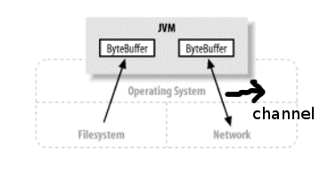

## 3.2.实现类

通道的实现类有多种，大体上分为两类：文件（File）通道和套接字（Socket）通道，主要实现类有：

1. FileChannel：用于读取、写入、映射和操作文件的通道(用于本地)；

2. DatagramChannel：通过 UDP 读写网络中的数据通道(用于网络)；

3. SocketChannel：通过 TCP 读写网络中的数据(用于网络)；

4. ServerSocketChannel：可以监听新进来的 TCP 连接，对每一个新进来的连接都会创建一个 SocketChannel(用于网络)

## 3.3.获取方式

1. 对于支持通道的类提供getChannel()方法

   - 本地IO： FileInputStream、FileOutPutStream和RandomAccessFile

   - 网络IO： Socket、ServerSocket、DatagramSocket

2. JDK1.7可以通过通道的静态方法open()打开并返回指定通道

3. JDK1.7可以通过Files工具类的newByteChannel()获取字节通道

```java
// 从输入输出流中可以获取通道
FileInputStream fileInputStream = new FileInputStream("f:/bio.txt");
FileChannel channel1 = fileInputStream.getChannel();
System.out.println("数据大小："+channel1.size());

// 通过FileChannel.open()可以获取通道
FileChannel channel2 = FileChannel.open(Paths.get("f:/bio.txt"), 
                          StandardOpenOption.READ);
System.out.println("数据大小："+channel2.size());

// 通过工具类java.nio.file.Files的newByteChannel()获取字节通道 SeekableByteChannel
// SeekableByteChannel 继承自 ByteChannel
SeekableByteChannel channel3 = Files.newByteChannel(Paths.get("f:/bio.txt"), 
                                   StandardOpenOption.READ);
System.out.println("数据大小："+channel3.size());
```

## 3.4.常用方法

4个通道主要实现类，由于它们用途不同，导致方法也会有所出入。例如网络通道ServerSocketChannel，它就有一个accept()方法用来获取客户端的连接通道。但如果是读写缓冲区使用的方法，那这4个通道主要实现类就没差多少，以本地IO中最常用的通道FileChannel为例，它的常用方法为：

<table>
    <tr>
    	<th>方法</th>
        <th>描述</th>
    </tr>
    <tr>
    	<td width="33%"> int read(ByteBuffer dst) </td>
        <td>将通道内的数据读入到缓冲区dst中。返回值为每次读取的字节数；返回值还有两种：-1和0，都表示数据读取完毕，但是返回-1表示连接已关闭，返回0表示连接仍继续只是数据读取完 </td>
    </tr>
    <tr>
    	<td>long read(ByteBuffer[] dsts)</td>
        <td>将通道内的数据“分散读取”到缓冲区数组dsts</td>
    </tr>
    <tr>
    	<td>int write(ByteBuffer src)</td>
        <td>从缓冲区src中写入数据到通道内。返回值为每次写入的字节数(一般是将缓冲区内的数据一次性写入)，当缓冲区的数据全部写入到通道后，此方法就会返回0</td>
    </tr>
    <tr>
    	<td>int write(ByteBuffer[] srcs)</td>
        <td>将缓冲区数组srcs的数据“聚集写入”到通道中</td>
    </tr>
    <tr>
    	<td>long position()</td>
        <td>返回此通道的文件位置。一个非负整数，计算从文件开头到当前位置的字节数</td>
    </tr>
    <tr>
    	<td>FileChannel position(long p)</td>
        <td>设置此通道的文件位置</td>
    </tr>
    <tr>
    	<td>FileChannel truncate(long s)</td>
        <td>将通道内的文件截取为指定大小</td>
    </tr>
    <tr>
    	<td>void force(boolean metaData)</td>
        <td>将所有对此通道内的文件的更新操作，强制写入到存储设备中</td>
    </tr>
</table>

## 3.5.数据交互

### 3.5.1.Channel与heap buffer

```java
// 输入流是把数据从磁盘中读入内存中，数据是在磁盘上的
FileInputStream fileInputStream = new FileInputStream("f:/bio.txt");
// 输出流是把数据从程序写入磁盘中，数据是在程序上
FileOutputStream fileOutputStream = new FileOutputStream("f:/nio.txt");

// 获取通道
FileChannel fileInputChannel = fileInputStream.getChannel();
FileChannel fileOutputChannel = fileOutputStream.getChannel();

// 创建缓冲区，通道不像流一样能够读写数据，它读写数据需要借助缓冲区
ByteBuffer byteBuffer = ByteBuffer.allocate(512);

// 从输入流的通道中将数据读入缓冲区中，再通过输出流的通道把数据从缓冲区写入磁盘中
// 经过debug，每次读取512字节的数据
while( fileInputChannel.read(byteBuffer) != -1  ){
byteBuffer.flip(); // 切换缓冲区为读模式
fileOutputChannel.write(byteBuffer); // 写入数据
byteBuffer.clear(); // 清空缓冲区以便下次循环存入数据
}

// 实际开发中，下面代码需要放到finally块
fileInputChannel.close();
fileOutputChannel.close();
fileInputStream.close();
fileOutputStream.close();
```

### 3.5.2.Channel与direct buffer

有两种方式获取直接缓冲区：

1. 使用ByteBuffer.allocateDirect()；

2. 使用FileChannel.map()；

以上两个方法获取的都是MappedByteBuffer对象，如果是ByteBuffer.allocateDirect()获取的直接缓冲区，它里面没有任何数据，需要使用通道来读写数据，则就跟使用通道与非直接Buffer一样；但如果是FileChannel.map()获取的直接缓冲区，它会包含通道内的数据，当内存映射方式选择为MapMode.READ_WRITE，直接修改缓冲区的内容，会直接写入文件中，而不需要再手动使用通道来读写数据。

```java
// 通过FileChannel.open()获取通道，它需要两个参数：一个是文件路径，另一个是文件打开方式
FileChannel fileInputChannel = FileChannel.open(Paths.get("f:/bio.txt"), 
                                   StandardOpenOption.READ);
FileChannel fileOutputChannel = FileChannel.open(Paths.get("f:/nio.txt"),
                 StandardOpenOption.READ,StandardOpenOption.WRITE,
                 StandardOpenOption.TRUNCATE_EXISTING);

// 借助通道获取文件的内存映射，也就是直接缓冲区，只有ByteBuffer才有直接缓冲区
// MapMode指定访问该该内存映射文件的方式
MappedByteBuffer inputMap = fileInputChannel.map(FileChannel.MapMode.READ_ONLY, 0, 
                               fileInputChannel.size());
MappedByteBuffer outMap = fileOutputChannel.map(FileChannel.MapMode.READ_WRITE, 0,
                              fileInputChannel.size());

//新建一个字节数组，保存缓冲区的数据
byte[] buffer = new byte[inputMap.limit()];

// get()方法可以将缓冲区的内容拷贝到指定数组中
inputMap.get(buffer);

// 由于获取内存映射(即直接缓冲区)时，规定的内存映射方式是 MapMode.READ_WRITE ，所以对缓存区
// 的修改都会写入文件中，就不用在手动经过通道将缓冲区内容写入文件内。
outMap.put(buffer);
```

### 3.5.3.Channel与Channel

通道与通道之间可以直接进行数据交互，这里面会使用到[零拷贝](#3.3.3.两次拷贝(或零次拷贝))的技术，效率较高。使用channel.transferTo()或channel.transferFrom()方法：

```java
// 获取输入通道
FileChannel inChannel = FileChannel.open(Paths.get("f:/bio.txt"),
                          StandardOpenOption.READ);
// 获取输出通道
FileChannel outChannel = FileChannel.open(Paths.get("f:/nio.txt"),
                 StandardOpenOption.WRITE,StandardOpenOption.CREATE,
                 StandardOpenOption.TRUNCATE_EXISTING);

// 有数据的通道（即输入通道）调用transferTo()，表示要将数据交互到另一个通道
// 无数据的通道（即输出通道）调用transferFrom()，表示从哪一个源通道读取数据
inChannel.transferTo(0, inChannel.size(), outChannel);

// 与上面效果一样，但注意两个方法参数顺序不一样
// outChannel.transferFrom(inChannel,0,inChannel.size())
```

## 3.6.分散与聚集

### 3.6.1.分散读取

分散读取，即Scattering Reads。是指从一个 Channel 中读取的数据“分散”存储到多个 Buffer中，按照Buffer定义的顺序(一般是数组形式)，读取的数据依次将 Buffer 填满直至通道数据全部读取完。

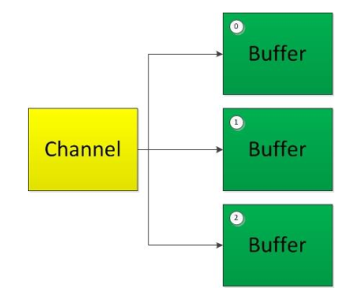

### 3.6.2.聚集写入

聚集写入，即Gathering Writes。是指将多个 Buffer 中的数据“聚集”写入到一个Channel中，按照Buffer定义的顺序(一般是数组形式)，将Buffer内的全部数据依次写入到channel中。

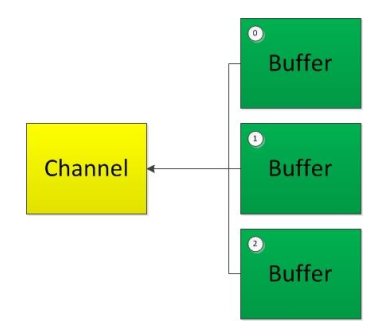

### 3.6.3.使用示例

```java
// 创建输入通道，从磁盘中获取数据
FileChannel inChannel = FileChannel.open(Paths.get("f:/1.jpg"),
                   StandardOpenOption.READ);
// 创建输出通道，将数据写入磁盘
FileChannel outChannel = FileChannel.open(Paths.get("f:/2.jpg"),
               StandardOpenOption.WRITE,
               StandardOpenOption.CREATE,
               StandardOpenOption.TRUNCATE_EXISTING);
// 创建缓冲区数组
int kb = 1024 * 200;// 200kB
ByteBuffer buf1 = ByteBuffer.allocate(kb); // 200kB
ByteBuffer buf2 = ByteBuffer.allocate(kb); // 200kB
ByteBuffer buf3 = ByteBuffer.allocate(kb); // 200kB
ByteBuffer buf4 = ByteBuffer.allocate(kb); // 200kB
ByteBuffer[] byteBuffers = {buf1,buf2,buf3,buf4};

// 将通道内的数据分散读入缓冲区中
inChannel.read(byteBuffers);
System.out.println("buf1获取到的字节数："+buf1.position());
System.out.println("buf2获取到的字节数："+buf2.position());
System.out.println("buf3获取到的字节数："+buf3.position());
System.out.println("buf4获取到的字节数："+buf4.position());

// 改变缓冲区为读取模型
for( ByteBuffer buf : byteBuffers ){
    buf.flip();
}

// 将多个缓冲区的数据聚集写入通道中
outChannel.write( byteBuffers );
```

# 4.NIO-管道

## 4.1.管道简介

Java NIO 的管道是2个线程之间的单向数据连接。Pipe有一个source通道和一个sink通道。数据从sink通道写入，从source通道读取！

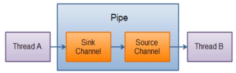

## 4.2.使用示例

```java
ExecutorService executorService = Executors.newFixedThreadPool(2); 
Pipe pipe = Pipe.open();// 获取一个管道
Pipe.SinkChannel sinkChannel = pipe.sink();// 从管道中获取sink通道
Pipe.SourceChannel sourceChannel = pipe.source();// 从管道中获取source通道
// 创建2个缓冲区，一个缓冲区预添加数据，一个缓冲区用来读取数据
ByteBuffer bufferForWrite = ByteBuffer.allocate(1024);
bufferForWrite.put("中华人民共和国".getBytes("utf-8"));
ByteBuffer bufferForRead = ByteBuffer.allocate(1024);
// 开启两个线程，一个线程往sinkChannel写入数据，一个线程往sourceChannel读出数据
executorService.execute(() -> {
    try {
        Thread.sleep(2000);
        bufferForWrite.flip();
        sinkChannel.write(bufferForWrite);
    } catch (InterruptedException e) {
        e.printStackTrace();
    } catch (IOException e) {
        e.printStackTrace();
    }
});

executorService.execute(() -> {
    try {
        // 线程会一直在此循环，等待数据的到来
        while (sourceChannel.read(bufferForRead) != -1) {
            bufferForRead.flip();
            System.out.println(new String(bufferForRead.array()));
            bufferForRead.clear();
        }
        // 这行代码执行不到
        System.out.println("数据读取完成！！");
    } catch (IOException e) {
        e.printStackTrace();
    }
});
```

# 5.NIO-选择器

## 5.1.SelectableChannel

SelectableChannel，即可选通道。是一种能与选择器Selector实现多路复用的通道。该通道提供了register()方法用来注册到选择器上，然后方法会返回一个表示通道与选择器注册关系的选择键SelectionKey。一个可选通道最多只能在选择器上注册一次。

FileChannel类没有继承SelectableChannel，因此它不是可选通道，意味着FileChannel的所有功能都是阻塞的；所有socket channel都是可选择的，包括从管道(Pipe)对象的中获得的通道，所以它们的功能可以是非阻塞的，通过调用SelectableChannel.configureBlocking(false)方法。

## 5.2.SelectionKey

SelectionKey，称为选择键，包含了通道与选择器之间的注册关系。选择键里面的4个常量指明让选择器监听通道的哪个状态，比如：选择键让选择器监听通道的读状态，当通道里的数据可以读取时，选择器就会感应到并作出反应。SelectionKey的4个常量为：

1. 读 :  SelectionKey.OP_READ   （值为1）

2. 写 :  SelectionKey.OP_WRITE  （值为4）

3. 连接 : SelectionKey.OP_CONNECT （值为8）

4. 接收 : SelectionKey.OP_ACCEPT  （值为16）

当注册时不止监听一个事件，则可以使用“位或”操作符连接，每次将通道注册到选择器，都会返回一个SelectionKey对象

```java
SelectionKey selectionKey = sink.register(selector, 
       SelectionKey.OP_ACCEPT | SelectionKey.OP_WRITE);
```

返回的SelectionKey对象和选择器是一一映射的关系，SelectionKey类提供了如下的方法：

| **方法**        | **作用**                                                     |
| --------------- | :----------------------------------------------------------- |
| interestOps()   | 表明选择器是监听该通道的哪几种状态，和注册时要监听的注册状态一样。 |
| readyOps()      | 获取通道已经就绪的状态，它表明选择器监听通道的那几种状态中， 哪些是已经准备就绪，可以使用的 |
| channel()       | 表明该SelectionKey所关联的Channel                            |
| selector()      | 该SelectionKey所关联的Selector                               |
| cancel()        | 取消通道和选择器的注册关系。此方法调用后，SelectionKey对象将会被”拷贝”至已取消键的集合中，该键此时已经失效，但是该注册关系并不会立刻终结。在下一次select()时，已取消键的集合中的元素会被清除，相应的注册关系也真正终结 |
| isValid()       | 如果该SelectionKey有效，返回true；  当调用cancel()方法后，此选择键  SelectionKey就会变为无效。 |
| isReadable()    | 校验该键绑定的通道是否已准备好读操作，  若已准备好则返回true，否则 此方法会一直返回false |
| isWritable()    | 校验该键绑定的通道是否已准备好写操作，  若已准备好则返回true，否则，此方法会一直返回false |
| isConnectable() | 校验该键绑定的通道是否已准备好套接字连接操作，若已准备好则返回true，否则此方法会一直返回false |
| isAcceptable()  | 校验该键绑定的通道是否已准备好接受套接字连接操作，若已准备好则返回true，否则此方法会一直返回false |
| attach(Object)  | 为该SelectionKey对象附加一个对象(可以为null)，然后可以使用attachment()方法检索这个对象。一次只能附加一个对象，每次调用此方法时会丢弃之前的附件 |
| attachment()    | 获取附加在该SelectionKey对象的附件，如果没有任何附件，此方法返回null |

**PS：**在使用attachment()方法设置对象附件时，如果附加的对象不再使用，一定要人为清除，因为垃圾回收器不会回收这种对象(有引用存在)，若不清除的话会造成内存泄露；要取消这类对象，通过selectionKey.attach(null)将其置为空即可。

##  5.3.Selector

选择器（Selector）基于select/poll/epoll模型（操作系统函数），它是基于[多路I/O复用](#1.2.3.IO多路复用)的实现，能够检测一到多个NIO通道，并能够知晓通道是否为监听事件(例如读、写、连接、接收)做好准备的组件。这样，一个单独的线程可以管理多个channel，从而管理多个网络连接，示意图如下：

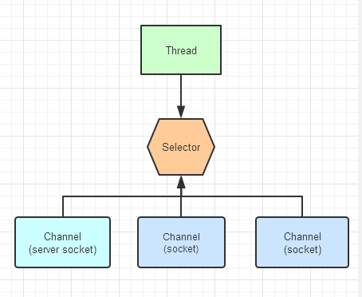

selector 在 Linux 上的实现机制是 epoll，而在 Windows 平台上的实现机制是 select

### 5.3.1.SelectionKey集合

Selector内部维护了3种类型的SelectionKey集合：

**①已注册的键集合(Registered key set)**

  	所有与选择器关联的通道所生成的SelectionKey的集合称为已经注册的键的集合。并不是所有注册过的键都仍然有效。这个集合通过keys()方法返回，并且可能是空的。这个已注册的键的集合不可以直接修改；试图这么做的话将引发java.lang.UnsupportedOperationException

**②已选择的键集合(Selected key set)**

  	已注册的键集合的子集。这个集合的每个成员都是相关通道被选择器(在前一个选择操作中)判断为已经准备好的，并且包含于键的interest集合中的操作。这个集合通过selectedKeys()方法返回(并有可能是空的)。选择键可以直接从这个集合中移除，但不能添加。试图向已选择的键的集合中添加元素将抛出java.lang.UnsupportedOperationException

**③已取消的键集合(Cancelled key set)**

   	已注册的键的集合的子集，这个集合包含了cancel()方法被调用过的键(这个键已经被无效化)，但它们还没有被注销。这个集合是Selector对象的私有成员，因而无法直接访问

### 5.3.2.选择过程

Selector.select()方法可以选择已经准备就绪的通道，准备就绪的意思：就是通道在绑定到选择器上时配置的[监听状态](#8.2.SelectionKey)，只要通道满足了任意一个监听状态，就说明通道已经准备就绪。选择器共有3个select()方法：

<table>
    <tr>
    	<th>方法名</th>
        <th>返回值</th>
        <th>描述</th>
    </tr>
    <tr>
    	<td width="25%">select()</td>
        <td width="20%">int</td>
        <td>此方法会一直阻塞，直到至少有一个通道准备就绪、或者调用此选择器的wakeup()方法、或者中断当前线程，才会返回。返回值为已准备好的通道的数量，可能为0</td>
    </tr>
    <tr>
    	<td>select(long timeout)</td>
        <td>int</td>
        <td>此方法和select()类似，也是会一直阻塞，并且在select()返回条件上多出了超时条件，一旦阻塞时间超过timeout，也会返回</td>
    </tr>
    <tr>
    	<td>selectNow()</td>
        <td>int</td>
        <td>此方法执行非阻塞模式选择，如果自上次选择操作后没有可选择的通道，则此方法立即返回0</td>
    </tr>
</table>

**select()方法的选择标准：**

select()方法返回一个int值，该值表示有多少通道已经就绪，是自上次调用后有多少通道变成就绪状态，在上一次调用进入就绪状态的通道在本次调用中不会被计入。例如：首次调用select()方法，如果有一个通道变成就绪状态，返回了1，被处理了；接着另一个通道就绪了，此时再次调用select()方法，它会再次返回1(而不是2，上一个准备就绪的通道已经在上一次调用并且处理了，本次调用就不会再返回)。如果对第一次返回时的channel没有做任何操作，现在就有两个就绪的通道。

**Selector执行选择的过程：**

①检查已取消键集合

​	首先检查Selector维护的已取消键的集合，也就是通过cancle()取消的键。如果该集合不为空，则清空该集合里的键，同时该集合中每个取消的键也将从已注册键集合和已选择键集合中移除。（一个键被取消时，并不会立刻从集合中移除，而是将该键“拷贝”至已取消键集合中，这种取消策略就是我们常提到的“延迟取消”）

②检查已注册键集合

​	然后检查已注册键集合。系统底层会依次询问每个已经注册的通道是否准备好选择器所感兴趣的某种操作，一旦发现某个通道已经就绪了，则会首先判断该通道是否已经存在于已选择键集合当中，如果已经存在，则更新该通道在已选择键集合中对应的键的ready集合；如果不存在，则首先清空该通道的对应键的ready集合，然后重设ready集合，最后将该键存至已注册键集合中。这里需要明白，当更新ready集合时，在上次select（）中已经就不会被删除，也就是ready集合中的元素是累积的，比如在第一次的selector对某个通道的read和write操作感兴趣，在第一次执行select（）时，该通道的read操作就绪，此时该通道对应的键中的ready集合存有read元素，在第二次执行select()时，该通道的write操作也就绪了，此时该通道对应的ready集合中将同时有read和write元素

### 5.3.3.唤醒阻塞

在执行Selector.select()方法时，系统底层会依次询问每个通道是否已经就绪，这个过程会造成调用此方法的线程进入阻塞状态，共有以下三种方式可以唤醒在select()方法中阻塞的线程：

1. Selector.wakeup()方法让调用select()方法而阻塞的线程立刻返回，即使现在没有任何通道就绪。该方法使得选择器上的第一个还没有返回的选择操作立即返回，如果当前没有进行中的选择操作，那么下一次对select()方法的调用将会立即返回；

2. Selector.close()方法关闭Selector。该方法使得任何一个在选择操作中阻塞的线程都被唤醒（类似wakeup（）），同时使得注册到该Selector的所有Channel被注销，所有的键将被取消，但是Channel本身并不会关闭；

3. Thread.currentThread().interrupt()。会使睡眠的线程抛出InterruptException，捕获该异常并在调用wakeup()

# 6.基于TCP的网络通信

在这之前，NIO都是用于本地IO操作，其实网络通信才是NIO存在的真正意义。NIO使用ServerSocketChannel和SocketChannel来实现基于TCP协议的网络通信

## 6.1.I/O阻塞概念

NIO的阻塞与非阻塞，都是对网络通信而言。在网络通信中，有客户端和服务端，当客户端发起一次IO请求给服务端时，服务端开启一个线程来处理此次请求，在这次IO请求运行的过程中，服务端的线程都是阻塞的，必须等到客户端的IO请求完成了，服务端的线程才可以干活，这就是阻塞；

如果使用NIO，会用一个选择器Selector，当客户端发起一次IO请求时，首先在Selector注册，等到这次IO请求已经准备完全了，Selector会把这个IO请求发给服务端，服务端的线程就可以直接处理，而在客户端的IO请求准备完全的过程中，服务端的线程可以干别的事，这就是非阻塞。****

## 6.2.阻塞式通信

当NIO没有使用Selector时，其实也是阻塞式网络通信。网络通使用的通道是：SocketChannel和ServerSocketChannel

### 6.2.1.服务端

```java
// 创建通道，并且绑定主机地址和端口号(使用InetSocketAddress对象，
// 如果不指定主机地址，默认127.0.0.1)
ServerSocketChannel serverSocketChannel = ServerSocketChannel.open();
serverSocketChannel.bind(new InetSocketAddress(12580));

// 创建缓冲区
ByteBuffer byteBuffer = ByteBuffer.allocate(102400);

// 使用accept()方法接收客户端的请求，当服务端即ServerSocketChannel设置为阻塞时，
// 此方法会在这边一直阻塞直到有请求到来；如果服务端ServerSocketChannel设置为非阻塞，
// 若此时没有客户端进来，此方法立即返回null
SocketChannel accept = serverSocketChannel.accept();
StringBuilder sb = new StringBuilder();
while (accept.read(byteBuffer) != -1) {
    byteBuffer.flip();
    sb.append(new String(byteBuffer.array()));
    byteBuffer.clear();
}

// 关闭资源
System.out.println("服务端接收到的数据：" + sb.toString());
serverSocketChannel.close();
accept.close();
```

### 6.2.2.客户端

```java
// 创建通道
SocketChannel socketChannel = SocketChannel.open(new InetSocketAddress("127.0.0.1",12580));
socketChannel.configureBlocking(false);

// 创建缓冲区，并模拟向缓冲区添加数据
ByteBuffer byteBuffer = ByteBuffer.allocate(102400);
for( int i = 0;i<100;i++ ){
    byteBuffer.put("君不见黄河之水天上来-\n".getBytes());
}
// 发送数据
byteBuffer.flip();
socketChannel.write( byteBuffer );

// 关闭资源
socketChannel.close();
```

### 6.2.3.补充：返回值

客户端通过SocketChannel发送数据后，如果服务端需要返回数据给客户端，可以直接使用accept()方法获取到的那个通道，向它里面写入数据，客户端即可接收到。不过，客户端必须要执行SocketChannel.shutdownOutput()方法，这个方法是告诉服务端，客户端的数据已经全部传递完了，如果不执行这行代码，双方都会互相阻塞住。

**服务端代码：**

```java
// 创建服务端通道，指定要监听的主机地址和端口
ServerSocketChannel serverSocketChannel = ServerSocketChannel.open();
serverSocketChannel.bind(new InetSocketAddress("127.0.0.1",12580));

// 创建缓冲区，用来接收客户端通道内的数据
ByteBuffer byteBuffer = ByteBuffer.allocate(102400);

// 接收客户端通道的请求，如果 ServerSocketChannel 是阻塞，accept()方法会一直阻塞直到
// 有客户端通道过来
SocketChannel accept = serverSocketChannel.accept();
// 获取数据
while ( accept.read( byteBuffer ) != -1 ){
    byteBuffer.flip();
    System.out.println("服务端接收到数据："+new String(byteBuffer.array()));
    byteBuffer.clear();
}

// 直接向 客户端通道SocketChannel 写入数据，就可以返回数据给客户端
byteBuffer.put("奔流到海不复回".getBytes());
byteBuffer.flip();
accept.write( byteBuffer );

// 关闭资源
accept.close();
serverSocketChannel.close();
```

客户端代码：

```jav
// 创建客户端通道，指定主机地址和端口
SocketChannel socketChannel = SocketChannel.open(new InetSocketAddress("127.0.0.1",12580));

// 创建缓冲区
ByteBuffer byteBuffer = ByteBuffer.allocate(1024);
byteBuffer.put("君不见黄河之水天上来".getBytes());
byteBuffer.flip();

// 向客户端传递数据
socketChannel.write( byteBuffer );
byteBuffer.clear();

// 告诉服务端，客户端的数据已经全部传递完了
// 如果没有此行代码，服务端和客户端都会一直阻塞
socketChannel.shutdownOutput();

// 接收客户端的消息
while( socketChannel.read(byteBuffer) != -1 ){
    byteBuffer.flip();
    System.out.println("客户端接收到数据："+new String(byteBuffer.array()));
    byteBuffer.clear();
}
// 关闭资源
socketChannel.close();
```

## 6.3.非阻塞式通信

NIO的非阻塞式网络通信，才是它要解决的事情。NIO实现非阻塞，需要结合[选择器Selector](#8.3.Selector)，选择器的select()方法是阻塞方法，只有在通道已经准备好的情况，它才会返回；selectNow()方法是非阻塞方法，若此时没有通道可用，它立即返回0

### 6.3.1.服务端

服务端的操作比较复杂，总体上归纳为：

1、首先创建一个选择器Selector.open()

2、将通道注册到选择器上SelectableChannel.register()

3、轮询式获取选择器上已准备就绪的通道，然后删除已处理的选择器

4、判断通道的哪种状态已就绪，然后做出对应操作

```java
/* 创建服务器的网络通道，并且将通道设置为非阻塞模式*/
ServerSocketChannel serChannel = ServerSocketChannel.open();
serChannel.bind(new InetSocketAddress(9898));
serChannel.configureBlocking(false);
/*获取选择器，将通道注册到选择器,并指定监听事件*/
Selector selector = Selector.open();
SelectionKey sKey = serChannel.register(selector, SelectionKey.OP_ACCEPT );
/* 轮询式地获取选择器上已准备就绪的通道,select()方法返回已经准备就绪的通道的数量 */
while(  selector.select() > 0) {
    /* 获取选择器中所有准备就绪的SelectionKey,每个SelectionKey即代表一个通道 */
    Iterator<SelectionKey> it = selector.selectedKeys().iterator();
    while( it.hasNext() ){
        /* 获取准备一个已经就绪的SelectionKey */
        SelectionKey sk = it.next();
        /* 判断属于哪种监听事件,是读、写还是发送、接收？ */
        if( sk.isAcceptable() ){
            // 接收事件就绪,服务端获取客户端发起请求的通道
            SocketChannel cliChannel = serChannel.accept();
            // 同样需要转换为非阻塞式通道
            cliChannel.configureBlocking(false);
            /* 注册此通道到选择器 */
            cliChannel.register(selector, SelectionKey.OP_READ);
        }else if (sk.isReadable()) {
            /* 读事件就绪,获取选择器读就绪的通道 */
            SocketChannel readChannel = (SocketChannel) sk.channel();
            /* 读取数据 */
            ByteBuffer buf = ByteBuffer.allocate(1024);
            while (readChannel.read(buf) != -1){
                buf.flip();
                System.out.println( new String(buf.array()) );
                buf.clear();
            }
        }
        /* 取消已处理的selectionKey，这边如果不处理，会抛出空指针异常，因为
        * 选择器中的selectedKeys()集合不会在我们处理完通道后自动删除对应的选择键，
        * 此时再调用selectedKeys()获取已准备的键集合，还会拿到之前我们处理过的通道
        * 如果此时通道是ServerSocketChannel就会报错，由于没有客户端在发起IO请求，
        * 它的accept()方法会返回null，导致空指针异常 
        */
        it.remove();
    } 
}
```

### 6.3.2.客户端

```java
/* 获取网络通信的通道 */
SocketChannel cliChannel = SocketChannel.open(
    new InetSocketAddress("127.0.0.1", 9898));
/* 关键一步：将通道设置为非阻塞式,默认是true,即阻塞式 */
cliChannel.configureBlocking(false);

/* 把数据放到缓冲区 */
ByteBuffer buf = ByteBuffer.allocate(1024);
buf.put((LocalDate.now().toString() +" "+ LocalTime.now().toString()).getBytes());

/* 3、发送数据 */
buf.flip();
cliChannel.write(buf);
buf.clear();

/* 4、关闭资源 */
cliChannel.close();
```

# 7.基于UDP的网络通信

DatagramChannel是基于UDP网络通信的通道。udp是面向报文的无连接网络传输协议，所以它不像TCP那样具有客户端和服务端，它只有发送端和接收端，分别用DatagramChannel.send()方法和DtagramChannel.receive()方法。同时，选择键SelectionKey.OP_CONNECT和SelectionKey.OP_ACCEPT的配置对DatagramChannel无效。

## 7.1.发送端

发送端调用send()方法，并且指定接收端的IP的端口即可

```java
// 获取DatagramChannel通道 
DatagramChannel dcChannel = DatagramChannel.open();
dcChannel.configureBlocking(false); // 切换到非阻塞模式
// 获取缓冲区
ByteBuffer buf = ByteBuffer.allocate(1024);
// 发送数据
buf.put("我是发送端的数据".getBytes());
buf.flip();
// 通过DatagramChannel.send()发送数据,并且指定接收端的IP和端口
dcChannel.send(buf, new InetSocketAddress("127.0.0.1", 9898));
// 关闭通道
dcChannel.close();
```

## 7.2.接收端

接收端也使用DatagramChannel，它也需要切换到非阻塞模式并绑定一个端口，该端口与发送端的端口绑定一致。如果要使用UDP来实现非阻塞IO网络通信，肯定也是需要选择器Selector的，使用方式与基于TCP的选择器操作一样：不过需要注意： Selection.OP_CONNECT和Selection.OP_ACCEPT都是对TCP协议有效，如果使用UDP要么是读状态，要么是写状态。通过DatagramChannel.receive()方法便可获取到发送端的数据

```java
// 获取接收端的通道,接收端需要绑定一个端口
DatagramChannel dcChannel = DatagramChannel.open();
dcChannel.configureBlocking(false);
dcChannel.bind(new InetSocketAddress(9898));
// 创建缓冲区接收数据 */
ByteBuffer buf = ByteBuffer.allocate(1024);
// 获取选择器,并将通道注册到选择器上，要么注册读，要么注册写
Selector selector = Selector.open();
dcChannel.register(selector, SelectionKey.OP_READ);
// 轮询式获取选择器上准备就绪的通道 */
while (selector.select() > 0) {
   Iterator<SelectionKey> it = selector.selectedKeys().iterator();
   while (it.hasNext()) {
      SelectionKey sk = it.next();
      if (sk.isReadable()) { // 读状态的通道已经就绪
         dcChannel.receive(buf);
         buf.flip();
         System.out.println(new String(buf.array()));
         buf.clear();
      }
   }
   it.remove();// 这一步一定要执行，原因看上节TCP协议的介绍
}
```

# *.补充

## *.1.StandardOpenOption

StandardOpenOption类是JDK7才开始提供的，用来配置如何打开或创建文件的对象，定义标准的打开选项：

```java
/**
 * 以读取的方式打开文件
 */
READ,

/**
 * 以写入的方式打开文件
 */
WRITE,

/**
 * 将数据追加在文件末尾
 */
APPEND,

/**
 * 文件已存在并且此时是WRITE(写)操作，会清空文件再写入新数据，若是READ(读)操作，忽略此选项；  
 * 如果文件不存在，会抛出异常
 */
TRUNCATE_EXISTING,

/**
 * 若文件不存在，则创建一个新的文件；如果同时设置了CREATE_NEW，CREATE会失效；
 * 若文件存在，会将现有数据覆盖掉原有文件同样大小的数据
 */
CREATE,

/**
 * 创建一个新文件，如果文件以及存在，会抛出异常
 */
CREATE_NEW,

/**
 * 当流关闭的时候删除文件
 */
DELETE_ON_CLOSE,

/**
 * 稀疏文件。 当与CREATE_NEW选项一起使用时，此选项会提示新文件将是稀疏的。 当文件系统不支持
 * 创建稀疏文件时，将忽略该选项。
 */
SPARSE,

/**
 * 同步文件的内容和元数据信息到 底层存储设备
 */
SYNC,

/**
 *同步文件的内容到 底层存储设备
 */
DSYNC;
```