JVM，Java Virtual Machine，是java程序的运行环境。它最大的优点：“**一次编写，处处运行**”和“**自动内存管理，垃圾回收功能**”。笔记记录的JVM是在HotSpot JDK1.8以后！

# 1.运行时结构

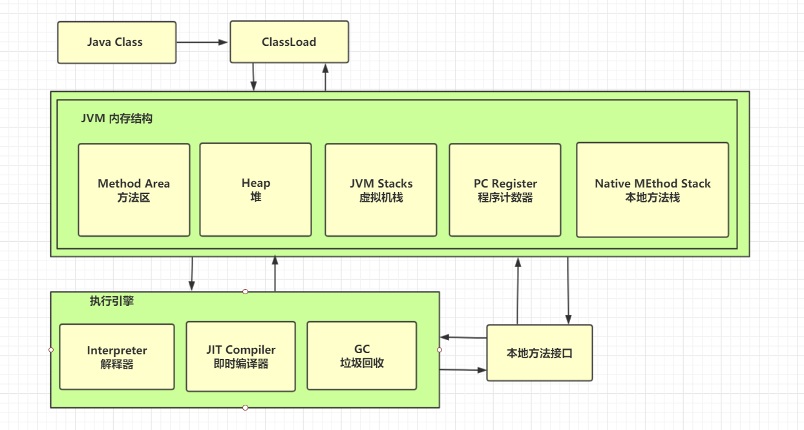

当一个.java文件被编译器解析成.class的二进制文件，它就由ClassLoader加载到JVM内存中。JVM的内存结构分为5部分：程序计数器、本地方法栈、虚拟机栈、堆和方法区；同时，字节码指令就会交由执行引擎执行，执行引擎包括：解释器、即时编译器和垃圾回收；除了这些，JVM还会和操作系统进行交互，依靠的是本地方法接口

## 1.1.程序计数器

Program Counter Register，程序计数器，物理硬件上属于CPU的寄存器。它是**当前线程所执行的字节码的行号指示器**，属于“线程私有”内存，各个线程间的程序计数器互不干扰。程序计数器是Java虚拟机规范中没有规定任何OutOfMemoryError的区域

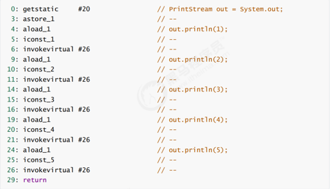

上面是一个Java源代码编译后的二进制字节码文件，左侧部分就是能被JVM识别的字节码指令，但是这个指令CPU是不认识的，所以需要靠执行引擎中的解释器，将指令转换成机器码，然后再交由CPU执行。所以每当JVM执行一条指令，程序计数器就会记录下一条指令的执行地址，后续解释器就可以通过它取到下一条需要执行的指令。分支、循环、跳转、异常处理、线程恢复等基础功能都需要持续计数器来完成！

## 1.2.虚拟机栈

Java Virtual Machine Stack，Java虚拟机栈，是线程私有的。顾名思义，它是一种“栈”数据结构，用于描述Java方法执行的内存模型。虚拟机栈里面放着栈帧(stack frame)，栈帧包括了局部变量表、操作数栈、动态链接和方法出口等信息。Java程序运行中，每调用一个方法，就会创建一个栈帧将其压入虚拟机栈中；每当方法调用完成，该方法的栈帧就会从虚拟机栈中弹出，故每个线程只能有一个活动栈帧，对应着当前正在执行的那个方法！

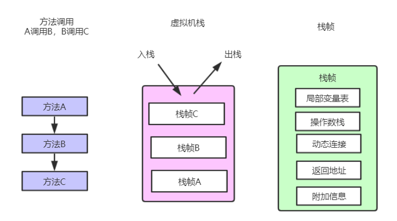

每一个方法从调用直至执行完成的过程，就对应着一个栈帧在虚拟机栈中入栈到出栈的过程。Java虚拟机规范中对虚拟机栈这个内存区域规定两种异常：

1. 线程请求的栈深度大于虚拟机所允许的栈深度，抛出StackOverflowError;

2. 虚拟机栈可以动态扩展，当扩展时无法申请足够内存，抛出OutOfMemoryError.

实际运用通过JVM配置参数“-Xss\<size>”指定虚拟机栈大小，例如：-Xss1024k、-Xss1M...两者都表示虚拟机栈内存为1m大小。

 虚拟机栈不是越大越好，在JVM申请的总内存一定下，虚拟机栈设置越大，JVM能开起来的线程越少。原本JVM申请总内存100M，虚拟机栈为1M，理论情况下可以开100个线程；但是将虚拟机栈提高到2M，理论情况下只能开50个线程。而且虚拟机栈越大，其实只是让递归调用次数变多罢了，一般还是使用默认的虚拟机栈大小即可：Linux默认为1024kb，window根据虚拟内存不同设置。(现在可以回忆下，java方法递归调用时的虚拟机栈情况...)

## 1.3.本地方法栈

Native Stack Method，本地方法栈，它的作用于虚拟机栈类似，只不过虚拟栈执行Java方法，本地方法栈执行native方法（一般为C或C++实现）

## 1.4.堆

Java Heap，Java堆，也称GC堆，是JVM所管理内存中最大的也是GC主要回收的内存区域，属于线程共享区域，堆大小可通过-Xms和-Xmx来调整。堆被划分成两个不同的区域：新生代 ( Young )、老年代 ( Old )，新生代 ( Young ) 又被划分为三个区域：Eden、From Survivor、To Survivor。针对HotSpot虚拟机，JDK8之前有永久代概念，JD8往后提出元空间：

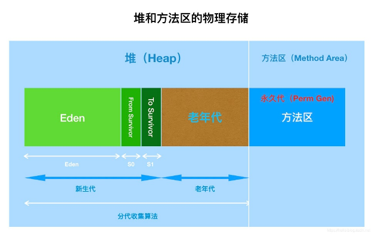

方法区是《JAVA虚拟机规范》提出的规范，HotSpot虚拟机照着规范有着自己的实现：JDK8之前(不包含JDK8)，它的堆和方法区的物理内存是连续的，仅在逻辑上做区分，因此HotSpot的方法区也称为永久代(Permanet Generation，也称PermGen)；但从JDK8开始，HotSpot取消了永久代，改用元空间(Metaspace)，方法区存在于元空间，并且不再与堆连续，而且是存在于本地内存（Native memory）

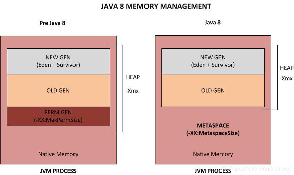

本地内存也称为C-Heap，是供JVM自身进程使用的。Java Heap空间不足时会触发GC，但是Native memory空间不够却不会触发GC。意味着只要本地内存足够，就不会出现：“java.lang.OutOfMemoryError: PermGen space”错误。当使用元空间时，可以加载多少类的元数据就不再由MaxPermSize控制，而由系统的实际可用空间来控制，当然JVM也提供一些参数控制元空间的使用：

<table>
  <tr>
  	<th>参数</th>
    <th>作用</th>
  </tr>
  <tr>
  	<td width="45%">-XX:MetaspaceSize</td>
    <td>元空间的初始值，以字节(byte)做单位。达到该值就会触发GC进行类型卸载，同时GC会对该值进行调整：如果释放了大量的空间，就适当的降低该值；如果释放了很少的空间，那么在不超过MaxMetaspaceSize（如果设置了的话），适当的提高该值</td>
  </tr>
  <tr>
  	<td>-XX：MaxMetaspaceSize</td>
    <td>元空间的最大创空间，默认是没有限制的</td>
  </tr>
  <tr>
  	<td>-XX：MinMetaspaceFreeRatio</td>
    <td>在GC之后，最小的Metaspace剩余空间容量的百分比，减少为class metadata分配空间导致的垃圾收集</td>
  </tr>
  <tr>
  	<td>-XX:MaxMetaspaceFreeRatio</td>
    <td>在GC之后，最大的Metaspace剩余空间容量的百分比，减少为class metadata释放空间导致的垃圾收集</td>
  </tr>
</table>

### 1.4.1.字符串常量池

StringTable，字符串常量池，简称串池，是专门存放字符串的常量池。在JDK7之前，它位于[运行时常量池](#_运行时常量池)中；但在JDK7以后版本，它位于[堆](#_堆)中。原因是如果串池位于永久代里，则只有fullGC才能回收，但字符串在java程序中是非常频繁使用的，所以容易造成字符串久久不能回收；将其移到堆上，只要触发了minor GC即可回收无用字符串。串池里面会存放各个字符串实例对象的引用，并且串池的字符串值都是唯一的，如下图所示：

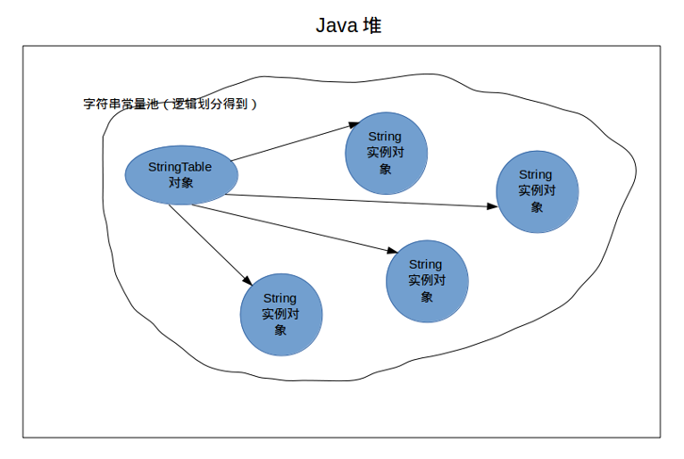

字符串常量池(StringTable)，它类似于HashMap结构，通过加上JVM参数：-XX:+PrintStringTableStatistics在运行时可以得到串池信息：

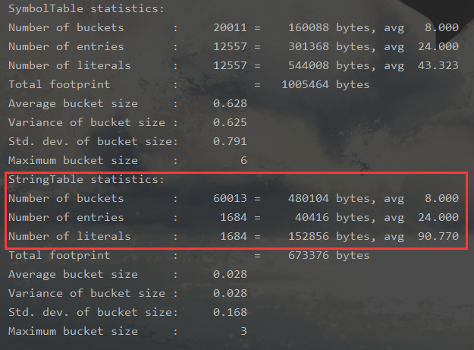

上图可以看到串池也有bucket和entry的概念，默认JVM会设置60013个桶，可以通过参数：-XX:StringTableSize=20000手动将其设置为20000个桶。在大量使用常量字符串的系统，这个值应该变大，以防止hash冲突严重！

*.class文件中的常量池中的字符串仅是符号，第一次用到时才变为对象，字符串**变量拼接**的原理是 StringBuilder(JDK1.8)，字符串**常量拼接**的原理是编译期优化.

```java
// 字符串常量
String s1 = "a";
// 创建字符串实例
String s2 = new String("b");
// 字符串变量拼接
String s3 = s1 + s2;
// 字符串常量拼接
String s4 = "a" + "b";
```

通过javap反编译上面代码生成的字节码文件：

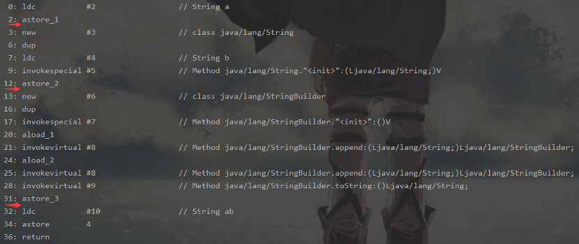

(这需要先认识[字节码](#_字节码))

1. 0-2行，构造变量s1，就是通过ldc指令将字节码常量池的#2符号引用变为java字符串实例并存入到StringTable中；

2. 3-12行，构造变量s2，不仅要将符号引用变为字符串实例，还需要在堆中开辟一块内存专门存放值为“b”的字符串实例，因此通过new String()创建的字符串实际上JVM创建2个对象：一个位于串池，一个位于堆上；

3. 13-31行，由于s1和s2都是变量，需要在运行时才能确定其类型，所以编译器使用StringBuilder对象将其拼接起来；

4. 23-36行，因为“a”和“b”都确定为字符串常量了，所以编译器会对其优化，直接将其合并为“ab”，所以在字节码中直接通过ldc指令去找常量池的符号引用#10，即“ab”这个字符串

串池中的字符串值都是唯一的，如果重复引用就可以省略掉创建字符串实例的诸多步骤。可以使用 intern 方法，主动将串池中还没有的字符串对象放入串池，这样保证后续对值一样的字符串操作，都可以直接从串池中取.String.intern方法在不同JDK会有差别：

1. java8 将这个字符串对象尝试放入串池，如果有则并不会放入，如果没有则放入串池， 会把串池中的对象返回；

2. java66 将这个字符串对象尝试放入串池，如果有则并不会放入，如果没有会把此对象**复制**一份，放入串池， 会把串池中的对象返回

## 1.5方法区

Method Area，方法区，用于存储已被虚拟机加载的类信息、常量、静态常量、JIT即时编译器编译后的代码等数据。Java虚拟机规范把方法区描述为堆的一个逻辑部分，在HotSpot虚拟机的JDK8之前版本，确实在堆上划分了一块区域作为方法区，被称为“永久代”，在分析[堆](#_堆)那块笔记也说明了。JDK8开始就改用元空间控制方法区，并将其移入本地内存中，并且把**字符串池**(运行时常量池中专门存放字符串的池)从方法区移到堆中。方法区无法满足内存需求时也会抛出OutOfMemoryError。

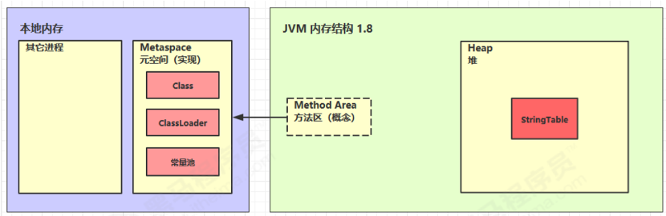

### 1.5.1.运行时常量池

Runtime Constant Pool，运行时常量池，是方法区的一部分。学习运行时常量池之前，需要先认识.class文件中的[常量池](#_常量池)(Constant Pool Table) - 它是一张表，用于存放编译期生成的各种字面量和符号引用，虚拟机指令可以根据这张常量表找到要执行的**类名、方法名、参数类型、字面量**等信息。当一个.class文件被加载时，它的常量池信息就会放入运行时常量池，并把里面的符号地址变为真实地址。可以使用javap -c命令对一个*.class文件反编译，可以看到除了基本的类信息外，还有一个区域叫做Constant pool，这就是当前类的常量池。当做个类被加载到JVM时，就会把这些符号引用转换为真实地址。

原始类代码：

```java
public class App {
  public static void main(String[] args) {
     System.*out*.println("666");
   }
 }
```

字节码：

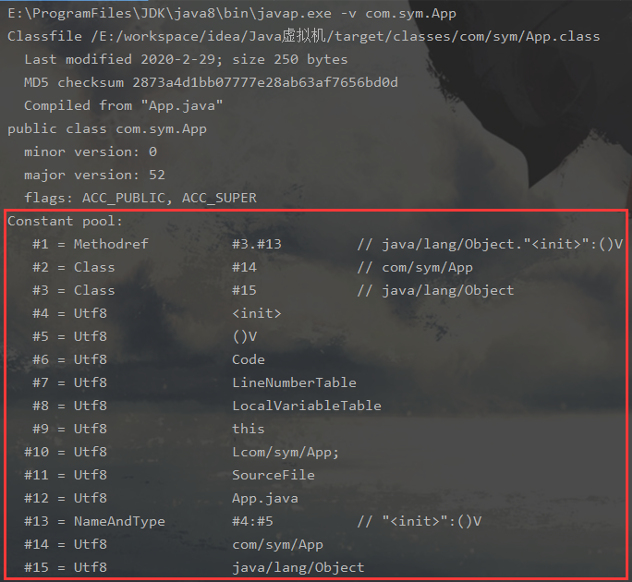

而.class文件中常量池的作用就是在方法执行时，告诉JVM去查询常量池表，告诉JVM这个符号引用代表什么意思。例如当前类的main()方法执行有4个字节码指令，前3个指令后面都跟着“#”如上图所示的#2、#3、#4其实这些就是常量池表中维护的信息，解释器查表就知道具体要找什么类，执行哪个方法...当这个类加载到JVM中，这些“#*”的符号引用就被转换真实的内存地址：

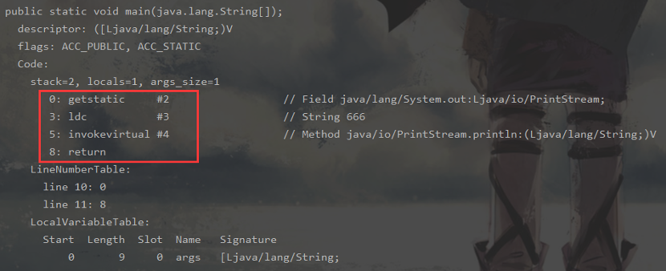

## 1.6.直接内存

Direct Memory，直接内存，它不是虚拟机运行时数据区的一部分，也不是Java虚拟机规范定义的内存区域，它是属于本地实际内存。这种内存多用于nio中的DirectByteBuffer，它分配回收成本较高，但读写性能高，而且不受 JVM 内存回收管理，也就是说直接内存并不受GC影响！不过如果直接内存如果分配不够，也会抛出OutOfMemoryError。因为java屏蔽了对内存的操作，所以基本上java是不能直接操作内存，除了一个类：sun.misc.Unsafe，它可以直接申请内存和回收内存，同时nio的DirectByteBuffer也是靠它创建的。

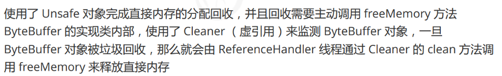

# 2.虚拟机对象

java中的对象，一般来说是通过new关键字创建出来的类实例；而虚拟机眼中的对象会比java对象范围更广，内容更多

## 2.1.对象的内存布局

在HotSpot虚拟机中，对象在内存中的布局分为3大区域：

对象头(header)、实例数据(instance data)、对齐填充(padding)

### 2.1.1.对象头

对象头分为3部分：

1. 第一部分用于存储对象自身的运行时数据，如哈希码、GC分代年龄、锁标志状态、线程持有锁、偏向线程ID、偏向时间戳等，这一部分称它为“Mark Word”，这部分数据在32位和64位计算机中的大小为32bit和64bit，下图是32位计算机的例子：

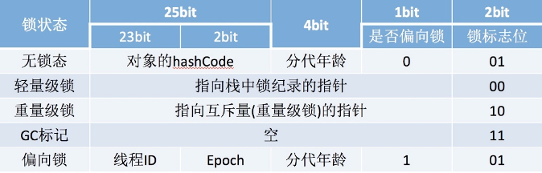

2. 第二部分是类型指针，即对象指向它的类元数据的指针，JVM可以通过这个指针确定这个对象是哪个类的实例，该指针在32位JVM中的长度是32bit，在64位JVM中长度是64bit；

3. 第三部分是仅当对象是数组时才会有，一块专门用于记录数组长度的数据，该数据在32位和64位JVM中长度都是32bit。

### 2.1.2.实例数据

实例数据就是对象真正存储的有效信息，即在程序代码中所定义的各种类型的字段内容。注意这部分数据包括：从父类继承下来的，子类自己定义

### 2.1.3.对其填充

仅仅起着占位符作用，因为HotSpot要求对象大小必须是8字节的整数倍，当实例数据部分数据不够8字节整数倍时，就靠对齐填充部分来补全

## 2.2.对象创建过程

在JVM眼中，一个对象的创建过程分为5个步骤

### 2.2.1.定位符号引用

JVM遇到一条new指令时，首先去检查这个指令的参数是否能在常量池中定位到一个类的符号引用，并检查该符号引用所代表的的类是否已被加载、解析和初始化过。如果没有，那就需要先执行类加载

### 2.2.2.分配内存

当该对象所属的类已加载，则对象所需内存的大小便完全确定，JVM就会在堆中找出一块未使用的确定大小的内存分配给该对象。此过程涉及到两种分配方式：“指针碰撞”和“空闲列表”。选择哪种分配方式由java堆是否规整决定，而java堆是否规整又由采用的**垃圾收集器**使用何种垃圾回收算法决定，即是否会对内存进行压缩整理。

**①指针碰撞**

 如果堆中内存是规整的，用过的堆内存在一侧，未使用的堆内存在另一侧，中间存放一个指针作为分界点指示器，那么分配内存时就是将该指针向着未使用的区域移动一段与对象大小相等的距离。这种分配方式就叫“指针碰撞”

**②空闲列表**

如果java堆的内存不是规整的，使用和未使用的内存交错存在，那么JVM就必须维护一个列表以记录哪些内存可用，在分配时从列表中找出一个足够大的空间分配给对象。这种分配方式叫“空闲列表”

java中创建对象十分频繁，意味着JVM分配内存也要十分频繁，这就会有并发问题（不管采用上面哪种分配方式）。JVM会有两种解决方案：

1. 采用“CAS + 失败重试”保证内存更新的原子性；

2. 本地线程分配缓冲-TLAB

把内存分配的动作按照线程划分在不同的空间执行，即让线程在堆中预先分配一小块内存，称为**本地线程分配缓冲 - Thread Local Allocation Buffer**；哪个线程要分配内存，就在它的TLAB上先分配（这边提个醒：分配时线程独占的，但是访问是线程共享的，即分配的内存其它线程可以访问）在TLAB用完了，线程就会重新申请分配，这个时候JVM再来做同步锁定，可以通过-XX:+/-UseTLAB来设定

### 2.2.3.内存初始化

对象内存空间分配完以后，JVM将它都初始化为零值(不包括[对象头](#2.1.1.对象头))，这就保证了对象的实例字段在java代码中可以不赋初始值就可以直接使用

### 2.2.4.设置对象头

JVM设置对象的对象头信息，例如该对象是哪个类的实例、对象的哈希码、对象的GC分代年龄、是否启用偏向锁等详细信息

### 2.2.5.程序初始化

前四步完成就JVM来说一个对象就已经创建好了，但在java眼中对象创建才刚开始，因为java的初始化方法还没有执行。JVM在执行new指令后接着执行\<init>方法，把对象按照程序员的意愿进行初始化，到此一个Java对象已完成。

## 2.3.对象的访问定位

java程序都是通过引用(reference)数据来操作堆上的具体对象，那么引用如何定位堆上的对象？java虚拟机规范并没有明确规定，目前主流的方式有两种：“**使用句柄**”和“**直接指针**”

### 2.3.1.使用句柄

如果使用句柄，java堆中会划分出一块内存作为句柄池，引用reference存储的就是对象的句柄地址，而句柄中包含了对象实例数据和类型数据各自的具体内存地址：

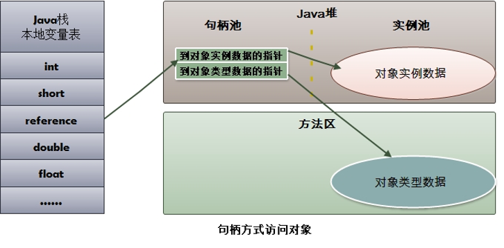

使用句柄的最大好处就是reference中存储的稳定的句柄地址，在GC垃圾回收移动对象的内存地址时，只会改变句柄的实例数据指针，而reference基本不需要修改

### 2.3.2.直接指针

如果使用直接指针方式，java堆对象的布局就必须考虑到如何防止访问类型数据的相关信息，而reference中存储的直接就是对象地址：

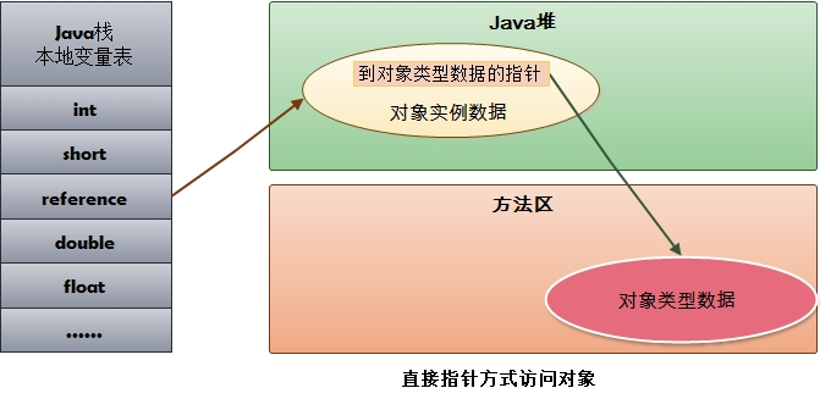

使用直接指针的最大好处就是速度更快，它少了从reference到句柄的定位时间开销。HotSpot默认使用直接指针的方式进行对象访问