# 1.基础概念

## 1.1.GC分类

1. Minor GC：是指发生在新生代(Eden 和 Survivor 区)的垃圾收集动作，Minor GC非常频繁，一般回收速度也比较快；

2. Full GC：会对整个堆空间(新生代、老生代、元空间（metaspace，java8以上版本取代永久代)进行垃圾回收。

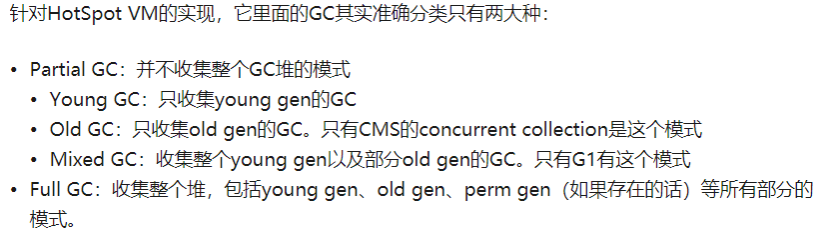

## 1.2.GC Roots

在JVM中判断一个对象是否可以被回收的依据，就是判断从GC Roots到这个对象之间是否有路径可寻(即GC Roots与对象之间是否存在一条引用链)，在没有的情况下，这个对象就可以被回收，这个算法就叫做“可达性分析算法”。


在Java语言中，可作为GC Roots的对象包括下面几种：

1. 虚拟机栈（栈帧中的本地变量表）中引用的对象；

2. 方法区中类静态属性引用的对象；

3. 方法区中常量引用的对象；

4. 本地方法栈中JNI（即一般说的Native方法）引用的对象。

注意：方法区也在垃圾回收的范围内，主要有“废弃常量”和“无用的类”，判断一个常量是否可以被废弃比较简单，就看其它地方是否引用了此常量；但是回收一个类比较苛刻，主要有3个条件需要满足：

①该类所有的实例已被回收，即堆中不存在该类的任何实例；

②加载该类的ClassLoader已被回收；

③该类对应的Class对象没有在任何地方被引用

## 1.3.GC日志

JVM的GC日志会根据使用垃圾收集器的不同而不同，但是各个收集器的日志都维持一定的共性(JVM参数-XX:+PrintGCDetails -verbose:gc，可以打印GC日志)。下面是两个典型的GC打印日志：

```verilog
[GC (Allocation Failure) [PSYoungGen: 1632K->488K(2560K)] 7776K->6856K(9728K),
 0.0011499 secs] [Times: user=0.00 sys=0.00, real=0.00 secs]
--------------------------------------------------------------
[Full GC (Allocation Failure) [PSYoungGen: 488K->0K(2560K)] [ParOldGen: 6432K->6753K(7168K)] 6920K->6753K(9728K), [Metaspace: 3117K->3117K(1056768K)], 0.0057678 secs] [Times: user=0.02 sys=0.00, real=0.01 secs]
```

1. [GC和[Full GC说明这次垃圾收集的级别：如果是[GC则为新生代Minor GC，[Full GC说明是老年代回收引起的整个堆的GC回收；

2. [PSYoungGen，[ParOldGen，[Metaspace表示GC发生的区域，这边是跟垃圾收集器紧密相关的；

3. [PSYoungGen: 1632K->488K(2560K)]表示新生代的内存区域从已使用容量1632K->GC后该内存区域已使用容量变为488K，括号内的2560K表示这个区域的总内存大小；

4. 7776K->6856K(9728K)表示整个堆的已使用容量7776K，到GC后已使用容量6856K，括号内的9728K表示总的堆大小；

5. real=0.00 secs，就表示此次GC回收的耗时时间。

# 2.Reference

从JDK1.2开始，Java的引用扩展为4种，分别为：强引用、软引用、弱引用和虚引用，每个引用会被GC回收的可能逐渐变大。

## 2.1.四种引用

<table>
  <tr>
  	<th>名称</th>
    <th>类名</th>
    <th>效果</th>
  </tr>
  <tr>
  	<td width="15%">强引用</td>
    <td width="33%">所有以new方式创建</td>
    <td>Java的默认引用形式，使用时不需要显示定义。任何通过强引用所使用的对象不管系统资源有多紧张，Java GC都不会主动回收具有强引用的对象</td>
  </tr>
  <tr>
  	<td>软引用</td>
    <td>SoftReference</td>
    <td>在内存不足时才会被回收。如果一个对象只具有软引用， GC一次后发现内存充足就不会回收它；若GC后仍然发现内存不足，则会被回收</td>
  </tr>
  <tr>
  	<td>弱引用</td>
    <td>WeakReference</td>
    <td>只要发生GC就会被回收，一个对象如果只有弱引用将会被自动回收</td>
  </tr>
  <tr>
  	<td>虚引用</td>
    <td>PhantomReference</td>
    <td>它的get()方法无论何时返回的都只会是null，所以单独使用虚引用没有什么意义，需要和引用队列ReferenceQueue联合使用。一个对象如果只有虚引用，则它随时都有可能被回收，通常使用虚引用是为了被虚引用关联的对象在被垃圾收集器回收时，能够收到一个系统通知</td>
  </tr>
</table>

## 2.2.引用队列

一个实际对象，如果只有一个软引用，或只有一个弱引用，或只有一个虚引用，则这个对象容易被GC回收掉；但这个对象被回收后，这些引用就失去了实际意义，但是由于它们往往被GC Roots引用着，所以不会回收它们：

```java
PhantomReference<RefObj> ref = new PhantomReference<RefObj>(refObj,referenceQueue);
SoftReference<RefObj> ref = new SoftReference<RefObj>(refObj,referenceQueue);
WeakReference<RefObj> ref = new WeakReference<RefObj>(refObj,referenceQueue);
```

所以在创建这些引用时可以加入一个引用队列ReferenceQueue(虚引用必须)，JVM会在实际对象回收后，将这些引用加入到ReferenceQueue中（也就是说JVM先回收堆对象占用的内存，然后才将软引用或弱引用加入到引用队列），被追加到引用队列的末尾，以便于回收引用自身内存。

# 3.垃圾回收算法

JVM里面有3个垃圾回收算法，当然只是记录其思想，具体算法实现肯定复杂啊

## 3.1.标记清除算法

是最基础的垃圾回收算法，分为两个过程：先标记出需要回收的对象，再标记完成后统一回收所有被标记的对象。这个算法会产生大量的内存碎片，回收完对象后可以看到未使用内存往往并不是连续的，如果要分配一个大对象时，内存还是不够，又得重新触发GC：

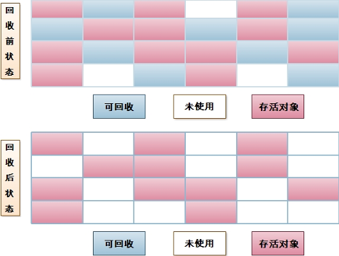

## 3.2.标记整理算法

同样也分为两个过程，“标记”过程一样，但是“整理”过程会让所有存活对象都向一端移动，然后直接清理掉端边界以外的内存。清理速度肯定变慢了，但是不会产生内存碎片的问题：

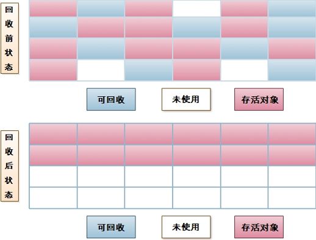

## 3.3.复制算法

复制算法的思想：就是将一整块完整的内存分为两部分A和B，当A内存用完了，就将A上存活的对象复制到B上，然后把A的内存空间一次性清理掉，这样每次只对整个半区进行内存回收：

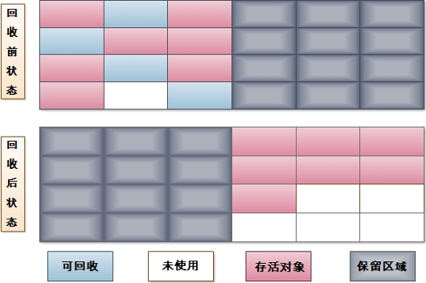

大部分的JVM虚拟机都是采用复制算法来回收新生代对象，它会把新生代划分为一个较大的Eden和两个较小的Survivor空间，每次使用Eden和其中一个Survivor；再内存回收时，将Eden和Survivor中存活的对象一次性复制到另一个Survivor空间上，然后再清理Eden和用过的Survivor内存空间。默认的Eden和Survivor比例是8:1

## 3.4.分代回收算法

分代回收算法并不是严格意义上的垃圾回收算法，它实际上有点“分而治之”的味道，即新生代的对象来去匆匆，采用“复制算法”；老年代的对象存活时间久且数量较多，一般采用“标记清除算法”或“标记整理算法”，具体要根据垃圾收集器来定！

## 3.5.HotSpot算法实现

这边就是记录一下理论知识，扩大下知识面！

之前了解了JVM判断一个对象是否存活的依据是“可达性分析算法”，它需要找出此时的GC Roots，判断对象与它们是否存在一条引用链，但是GC发生时系统其它线程还在运行，意味着引用关系还在变化，这点就导致GC进行时必须停顿Java执行线程，这一事件被称为“Stop The World”简称STW。

还有一个问题，JVM是怎么知道STW期间的GC Roots有哪些？若逐个遍历检查会消耗大量时间，因此目前JVM实现都使用“准确式GC”，可以快速定位根对象。其中HotSpot通过使用一种数据结构“OopMap”记录了GC roots，GC开始的时候，直接从OopMap就可以获得GC roots。OopMap记录了特定时刻栈上(内存)和寄存器(CPU)的哪些位置是引用，通过这些引用就可以找到堆中的对象，这些对象就是GC roots。

问题又来了，如果每个字节码指令都生成对应的OopMap，则会消耗大量的空间，所以HopSpot会在特定位置上生成OopMap，这些位置称为安全点(Safepoint)一个字节码指令能被定位为safepoint的依据是：它是否可以让程序长时间执行，说白了就是指令序列复用，例如方法调用、循环跳转、异常跳转等，具有这些功能的指令才会产生安全点(safepoint)。

通过上面分析，知道了JVM不会随便哪个指令就启动GC，而是会达到一个安全点Safepoint。那么如何在GC发生时让所有线程都“跑”到其最近的安全点停顿下来等待GC完成，通常有两种方案：“抢占式中断”和“主动式中断”，目前都采用“主动式中断”，它仅仅设置一个轮询标志，各个线程执行时主动轮询这个标志，发现中断标志为真时就自己中断挂起。而这个轮询标志和safepoint是重合的，另外再加上创建对象需要分配内存的地方。但是如果有线程处于Sleep或Blocking状态，这时候就没办法响应JVM的中断请求，所以JVM提供了安全区域(Safe Region)：指一段代码片段之中，引用关系不会发生变化，在这个区域中的任意地方开始GC都是安全的。在线程执行到Safe Region中的代码时，首先标识自己已经进入了Safe Region，那样，当在这段时间里JVM要发起GC时，就不用管标识自己为Safe Region状态的线程了。在线程要离开Safe Region时，它要检查系统是否已经完成了根节点枚举（或者是整个GC过程），如果完成了，那线程就继续执行，否则它就必须等待直到收到可以安全离开Safe Region的信号为止。

# 4.内存分配与回收策略

对象的内存分配，主要分配在新生代的Eden区，如果启动了本地线程分配缓冲，将按线程优先在TLAB（**线程本地分配缓冲**）上分配；少数情况下会直接分配到老年代中。具体怎么分配要分析JVM用何种垃圾收集器和相关JVM参数。这里统计最普遍的内存分配规则，大致过程如下：

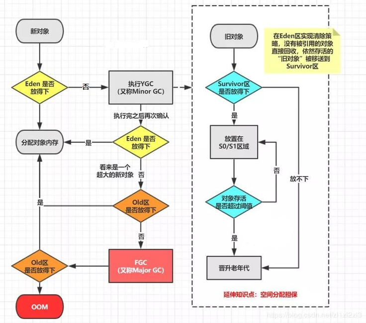

## 4.1.对象优先在Eden分配

大多数情况下，对象都在新生代的Eden区中分配，如果Eden没有足够空间分配，JVM发起一次Minor GC；将Eden和from存活的对到to，这些对象年龄加1，同时交换from和to的指针，至少保证一个Survivor区域是空闲的；

## 4.2.大对象直接进入老年代

所谓大对象是指需要大量连续内存空间的java对象，例如很长很长的字符串和数组对象，这些大对象Eden容纳不下所以会被直接在老年代中分配。JVM提供了一个-XX:PretenureSizeThreshold参数，规定大于这个设置值得对象直接在老年代分配，避免在新生代发生没必要、大量的内存复制。

## 4.3.长期存活对象进入老年代

每个对象的对象头上会有个GC标记，用来记录这个对象被GC处理处理过几次：

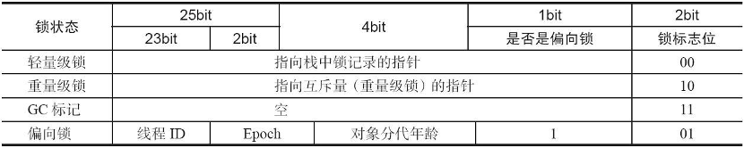

对象在Eden出生并经过一次Mimor GC后被移入到Survivor区域，它的GC标记(对象年龄计数器)就在增1 ，并且每经历过一次Minor GC此值就会增1，当这个值达到一个阈值，它就会被移入到老年代中，这个阈值最大15（因为GC标记只给了4bit），通过JVM参数-XX:MaxTenuringThreshold可以修改阈值

## 4.4.动态对象年龄判断

JVM并不是永远要求对象的年龄达到MaxTenuringThreshold值才能晋升到老年代，如果Survivor空间中相同年龄所有对象大小总和大于Survivor空间的一半，年龄大于等于该年龄的对象就可以直接进入老年代，而无须等到对象年龄达到MaxTenuringThreshold中要求的年龄

## 4.5.空间分配担保

新生代采用复制算法回收内存，会把Eden和from Survivor存活的对象复制到to Survivor上，但是如果存活对象太大导致to Survivor无法容纳这些对象，此时这些经过Minor GC存活的对象就需要移到老年代去，但前提是老年代自身还有容纳这些对象的空间，这个问题就会导致Minor GC是否会引起更全面的Full GC！

**判断依据**：发生Minor GC之前，JVM检查老年代最大可用连续的内存空间是否大于新生代所有对象总空间，如果这个条件成立，Minor GC就是安全的，则JVM只会执行Minor GC；如果不成立，JVM继续检查老年代最大可用连续内存是否大于历次晋升到老年代的对象的平均大小，如果大于就进行Minor GC，如果小于就要改为进行一个Full GC。(这个规则只满足JDK6 Update24之后版本，因为之前版本还受JVM参数：HandlerPromotionFailure影响)

# 5.垃圾收集器

垃圾收集器，也叫垃圾回收器，就是[垃圾回收算法](#3.垃圾回收算法)的具体实现，大部分垃圾收集器都有一个专注领域，专注于清理新生代的垃圾收集器，通常采用复制算法；专注于清理老年代的垃圾收集器，通常采用标记-清除或标记-整理算法。HotSpot虚拟机提供了如下的收集器，有连线的表示可以搭配使用：

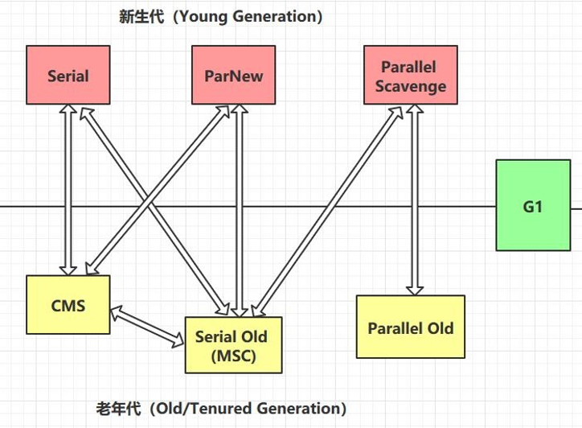

不同的JDK版本使用的默认垃圾收集器不一样，通过这个命令：

java -XX:+PrintFlagsFinal -version | findstr GC，可以查看：

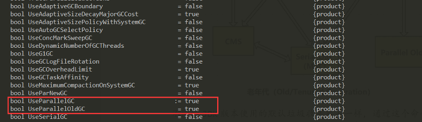

可以看到JDK8默认的收集器是[吞吐量优先收集器](#_吞吐量优先收集器)-ParallelGC

## 5.1.基本概念

### 5.1.1.并发/并行

1. **并行，Parallel**。指垃圾收集线程同时一起工作，让所有用户线程处于等待状态，即会暂停用户线程的工作；

2. **并发，Concurrent**。指垃圾收集线程和用户线程交替执行，不会停止用户线程的工作，垃圾收集线程可能在另一个CPU核心单元组工作

### 5.1.2.吞吐量/垃圾回收负载

1. 吞吐量，指的是CPU运行应用程序的时间 / CPU总运行时间(程序+GC时间)，例如：CPU运行100min，期间GC收集用了1min，则吞吐量为99%

2. 垃圾回收负载，与吞吐量相反，指的是GC时间 / CPU总运行时间，即1 – 吞吐量 = 垃圾回收负载

### 5.1.3.停顿时间

停顿时间：指垃圾收集器正在运行时，应用程序的暂停时间，即[STW](#3.5.HotSpot算法实现)时间。

对于独占收集器而言，停顿时间可能会比较长；使用并发的收集器时，由于垃圾收集器和应用程序交替运行，用户线程不会被暂停所以停顿时间会变短，但是由于交替执行，不仅会多出CPU切换上下文时间，还有用户线程执行期间对象的新变化，所以其效率很可能不如独占垃圾收集器，GC线程会多耗费CPU的时间片，这就导致单位时间内GC占用时间高，故系统的吞吐量可能会较低！

### 5.1.4.垃圾回收频率

垃圾回收频率：指的是垃圾收集器多长时间会运行一次。

对于固定的应用而言，垃圾收集器的频率应该是越低越好。通常增大堆空间可以有效降低垃圾回收发生的频率，但是可能会增加GC回收时产生的停顿时间

### 5.1.5.反应时间

反应时间：指当对象被标识为垃圾后多长时间内，它占据的内存空间会被释放

## 5.2.串行收集器

串行收集器，顾名思义就是只会有一个GC线程去回收垃圾，并且期间所有用户线程都需要暂停，直至GC线程回收完成：

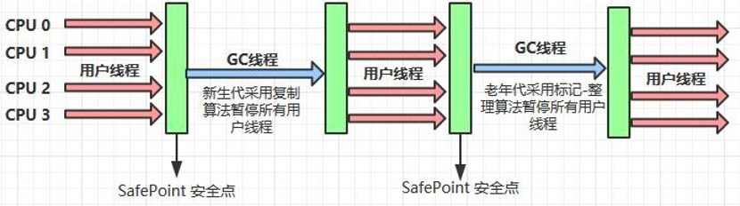

这类垃圾收集器的代表有：Serial 和 Serial Old。前者负责新生代的GC，采用[复制算法](#_复制算法)；后者负责老年代的GC，采用[标记整理算法](#_标记整理算法)。这类垃圾收集器不可能在服务端上使用的(暂停所有用户线程意味淘宝逛着逛着死机了而且还很经常)，大多数情况下给Client模式下的虚拟机使用(例如APP)。开启串行垃圾收集器的JVM参数为：-XX:+UseSerialGC

## 5.3.吞吐量优先收集器

首先明确[吞吐量](#_吞吐量和垃圾回收负载)啥意思，这类收集器尽可能保证单位时间内GC时间占比越小。可以这样理解，一次GC一个Worker需要4分钟工作量，现在改为4个Worker一起工作，只需要1分钟，这样就能在单位时间内让GC占比越小，所以这类收集器会采用并行的方式。

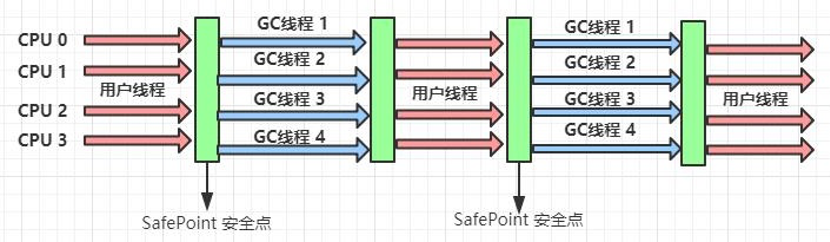

这类收集器的代表有：Parallel Scavenge和Parallel Old。前者负责新生代GC，采用[复制算法](#_复制算法)；后者负责老年代，才有[标记整理算法](#_标记整理算法)。在需要GC时，等待用户线程到达安全点后暂停用户线程，并同时开启多个GC线程并行处理垃圾，等待所有GC线程处理完成后，恢复用户线程执行。此类收集器的JVM参数有：

<table>
  <tr>
  	<th>参数</th>
    <th>含义</th>
  </tr>
  <tr>
  	<td width="41%">-XX:+UseParallelGC<br/>
      -XX:+UseParallelOldGC</td>
    <td>表示使用Parallel收集器，也是JDK8默认的GC收集器。这两个开关只要开启一个，JVM就会自动连带开启另一个</td>
  </tr>
  <tr>
  	<td>-XX:+UseAdaptiveSizePolicy</td>
    <td>加了这个参数，无需手动配置新生代大小、Eden与Survivor比例和晋升老年代对象年龄阈值等细节参数；JVM会采用一种自适应的大小调节策略动态这些配置
</td>
  </tr>
  <tr>
  	<td>-XX:GCTimeRatio=ratio</td>
    <td>设置吞吐量大小，ratio表示一个值，它的计算公式：1/1+ratio，得出的结果表示最大允许GC时间占用比。假设ratio=99，1 / 1+99 = 0.01，则在CPU运行100min内，GC最大耗时时间1min。如果超过这个时间，Parallel收集器就会自动调整堆大小(一般是增大堆的内存空间)，已满足这个条件。默认99，一般设为19</td>
  </tr>
  <tr>
  	<td>-XX:MaxGCPauseMillis=ms</td>
    <td>控制最大垃圾收集停顿时间，单位毫秒，默认值200ms。这个配置跟上面配置是矛盾的。因为吞吐量越大，自动调整的堆内存就要变大，那么回收时对象就多，停顿时间就变久，所以需要折中配置
</td>
  </tr>
  <tr>
  	<td>-XX:ParallelGCThreads=n</td>
    <td>控制并行回收时开启的GC线程数，默认等于CPU核数</td>
  </tr>
</table>

## 5.4.响应时间优先收集器

响应时间优先，其实就是让[停顿时间](#_停顿时间)越短越好，这样用户线程就可以不间断执行，能够及时响应外界请求，所以这类收集器会采用并发的方式，让GC线程和用户线程交替执行。 

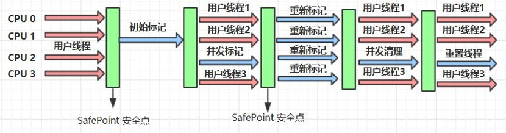

这类收集器的代表有：CMS(Concurrent Mark Sweep)收集器，它负责与老年代的回收，采用的是“[标记-清除](#_标记清除算法)”算法。这个收集器比较复杂，分为4个阶段：

1. 初始标记：记录GC Roots直接关联到的对象；

2. 并发标记：记录GC R oots Tracing的过程；

3. 重新标记：校正并发运行期间因用户线程运行而产生变化的标记；

4. 并发清理：清除被标记的对象。

其中“初始标记”和“重新标记”这两个过程仍然会出现STW现象，由于整个过程中耗时最长的“并发标记”和“并发清理”过程是可以和用户线程一起并发执行的，所以CMS收集器能在GC期间让系统保持快速地响应。但是在并发清理时由于用户线程仍在运行，这期间产生的垃圾，此次GC无法回收，只能等待下一次GC再清理掉，这一部分垃圾叫做“浮动垃圾”.

此类收集器的JVM配置参数:

<table>
  <tr>
  	<th>参数</th>
    <th>含义</th>
  </tr>
  <tr>
  	<td width="47%">-XX:+UseConcMarkSweepGC<br/>
(-XX:+UseParNewGC)
</td>
    <td>因为CMS收集器只能用在老年代回收，能与CMS搭配且作用于新生代的收集器只有serial和ParNew。serial之前介绍过，parNew收集器就是serial的多线程版本，它也采用复制算法，在GC时暂停所有用户线程，开启多个GC线程并行回收，直至GC回收完恢复用户线程。CMS运行期间预留内存无法满足程序需求，就会出现“Concurrent Mode Failure”即并发失败，这种情况下JVM会临时启动serial Old收集器串行化回收老年代，导致STW时间变长！
</td>
  </tr>
  <tr>
  	<td>-XX:ParallelGCThreads=n<br/>
-XX:ConcGCThreads=threads
</td>
    <td>大部分情况下CMS都是和ParNew搭配使用。所以-XX:ParallelGCThreads就是指定ParNew并行执行的GC线程数，默认为CPU核心数；而-XX:ConcGCThreads指定CMS在并发时的线程数，建议设置为并行线程数的1/4</td>
  </tr>
  <tr>
  	<td>-XX:CMSInitiatingOccupancyFraction=percent</td>
    <td>由于CMS收集器会产生浮动垃圾，所以不能等到内存不足时再GC，需要预留空间给浮动垃圾。通过这个参数指定触发GC的内存使用占比，例如设置为80，表示只要老年代的内存使用达到80%就会触发GC。默认值为68，此值越小垃圾回收的触发时机就越早。
</td>
  </tr>
  <tr>
  	<td>-XX:+UseFullGCsBeforeCompaction</td>
    <td>设定进行多少次 CMS 垃圾回收后，进行一次内存压缩(因为CMS是标记清除算法，这种算法的结果会产生大量内存碎片，所以需要内存压缩来进行碎片整理)。默认值为0表示每次进入Full GC都进行碎片整理</td>
  </tr>
  <tr>
  	<td>-XX:+CMSClassUnloadingEnabled</td>
    <td>允许对类元数据进行回收</td>
  </tr>
</table>

## 5.5.G1收集器

G1收集器，全称：Garbage First(口语称呼它Garbage One)，是用来替代[CMS收集器](#_响应时间优先收集器)。G1 的主要关注点在于达到可控的停顿时间，在这个基础上尽可能提高吞吐量，和 CMS 相同的地方在于，它们都属于并发收集器，在大部分的收集阶段都不需要暂停应用程序。区别在于，G1 没有 CMS 的碎片化问题（或者说不那么严重），同时提供了更加可控的停顿时间。参数这两篇介绍G1的博客：

https://ericfu.me/g1-garbage-collector/

https://juejin.im/entry/5af0832c51882567244deb44

### 5.5.1.Region

G1 虽然也遵循分代收集理论，但不再以固定大小和固定数量来划分分代区域，而是把连续的 Java 堆划分为多个大小相等的独立区域（Region），在堆的使用上，G1并不要求对象的存储一定是物理上连续的，只要逻辑上连续即可。每一个 Region 都可以根据不同的需求来扮演新生代的 Eden 空间、Survivor 空间或者老年代空间，收集器会根据其扮演角色的不同而采用不同的收集策略。整体上采用“标记+整理”算法，两个Region之间采用“复制”算法：

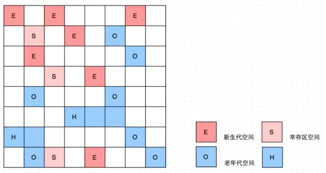

上图E指Eden，S是Survivor，H指Humongous，O是Old, 空白区域是可用分区。其中的H是humongous的意思，它表示“巨型对象”（一个对象大于 region 的一半时，称之为巨型对象），G1不会对巨型对象进行复制拷贝。每个Region区域又被划分为若干个大小为512 Byte卡片(Card)，标识堆内存最小可用粒度所有分区的卡片将会记录在全局卡片表(Global Card Table)中，分配的对象会占用物理上连续的若干个卡片，当查找对分区内对象的引用时便可通过记录卡片来查找该引用对象(使用[RS](#_Remembered_Sets))。每次对内存的回收，都是对指定分区的卡片进行处理


### 5.5.2.Rememberd Sets

G1将堆空间细分为Region，其主要目的就是让各个 Region 相对独立以便分别进行 GC，而不是一次性地把所有垃圾收集掉。但是在回收一个Region时，并不知道外界哪些References引用到该Region内的对象，如果进行全堆扫描，毫无意义，所以G1设计出一种数据结构叫：Remember Set，它记录了哪些内存区域中存在对当前 Region 中对象的引用（如区块 A 中的对象引用了区块 B，区块 B 的 Rset 需要记录这个信息）。每个Region都有自己的Remember Set，在回收一个Region的时候不需要执行全堆扫描，只需要检查它的RS就可以找到外部引用，以此来确定引用本Region内的对象是否存活，进而确定本Region内的对象存活情况

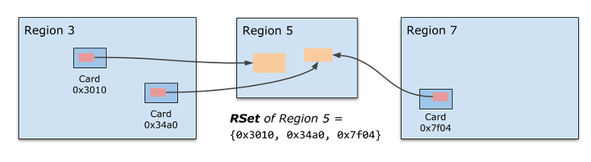

**注意：**Remember Set不是直接记录对象地址，而是记录那些对象所在的Card 编号

### 5.5.3.回收过程

G1收集器的回收垃圾过程可以分为3个部分，从Young Collection开始到Young Collection + CM，最后到Mixed Collection，这样一种循环的方式。

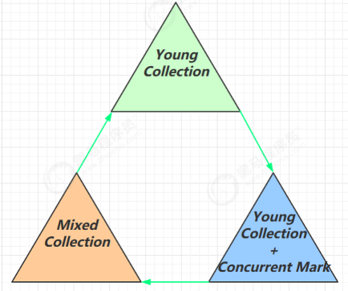

#### 5.5.3.1.年轻代收集

Young GC 只会涉及到 Young Regions，会发生STW现象，它将 Eden Region 中存活的对象复制到一个或多个新分配的 Survivor Region(采用复制算法)，之前的 Eden Region 就被释放，供以后的新对象分配使用:

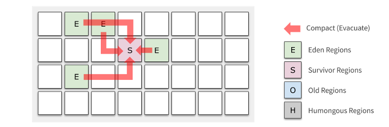

当区域中对象的存活年龄超过阈值（TenuringThreshold）时，Survivor Regions 的对象被移动到 Old Regions；否则和 Eden 的对象一样，继续留在 Survivor Regions 里：

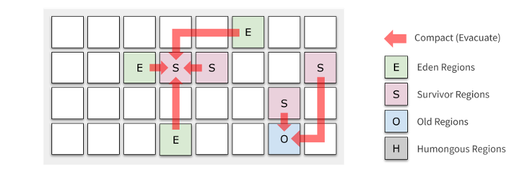

到这边G1的年轻代GC收集就已经完成，G1还会动态调整Eden和Survivor大小以达到一个最优。

#### 5.5.3.2.并发周期

 接下来就是G1的并发标记周期，当老年代占用堆空间比例达到阈值时，进行并发标记（不会 STW），由下面的 JVM 参数决定：

-XX:InitiatingHeapOccupancyPercent=percent(默认值为45%)

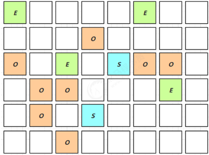

这个周期的流程如下：

1. **初始标记**：stop-the-world，它伴随着一次普通的 Young GC 发生，然后对 Survivor区进行标记，因为该区可能存在对老年代的引用。由于 Young GC 是需要 stop-the-world 的，所以并发周期直接重用这个阶段；

2. **扫描根引用区**：扫描 Survivor 到老年代的引用，该阶段必须在下一次 Young GC 发生前结束。这个阶段不能发生年轻代收集，如果中途 Eden 区真的满了，也要等待这个阶段结束才能进行Young GC；

3. **并发标记**：寻找整个堆的存活对象，该阶段可以被 Young GC 中断。这个阶段是并发执行的，中间可以发生多次 Young GC，Young GC 会中断标记过程；

4. **重新标记**：stop-the-world，完成最后的存活对象标记。使用了比 CMS 收集器更加高效的 snapshot-at-the-beginning (SATB) 算法。到这里，G1 的一个并发周期就算结束了，其实就是主要完成了垃圾定位的工作，定位出了哪些分区是垃圾最多的

#### 5.5.3.3.混合回收周期

会对 E、S、O 进行全面垃圾回收，因此被称为 Mixed GC。它还会选择若干最有潜力的 Old Regions（收集垃圾的效率最高的 Regions），这些选出来要被 Evacuate 的 Region 称为本次的 Collection Set (CSet)

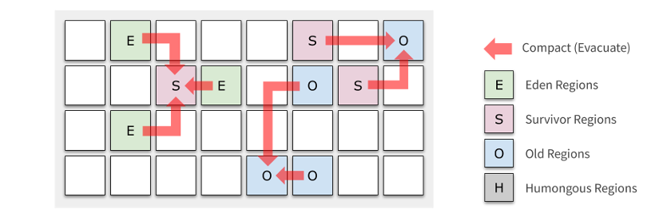

最终标记（Remark）会 STW和拷贝存活（Evacuation）会 STW....

### 5.5.4.导致Full GC问题

当G1回收内存失败了也会发生Full GC现象，造成较久的STW现象:

1. **并发模式失败**，CMS 收集器也有同样的概念。G1 [并发标记期间](#_并发周期)，如果在标记结束前，老年代被填满，G1 会放弃标记。这个时候说明

   - 堆需要增加了，

   - 或者需要调整并发周期，如增加并发标记的线程数量，让并发标记尽快结束

   - 或者就是更早地进行并发周期，默认是整堆内存的 45% 被占用就开始进行；

2. **晋升失败**：并发周期结束后，是混合垃圾回收周期，伴随着年轻代垃圾收集，进行清理老年代空间，如果这个时候清理的速度小于消耗的速度，导致老年代不够用，那么会发生晋升失败。这个时候说明：

   - 混合垃圾回收需要更迅速完成垃圾收集，也就是说在混合回收阶段，每次年

   - 轻代的收集应该处理更多的老年代已标记区块。

3. **疏散失败**：年轻代垃圾收集的时候，如果 Survivor 和 Old 区没有足够的空间容纳所有的存活对象。这种情况肯定是非常致命的，因为基本上已经没有多少空间可以用了，这个时候会触发 Full GC 也是很合理的。
   - 最简单的就是增加堆大小

4. 大对象分配失败，尽可能地不创建大对象，尤其是大于一个区块大小的对象。

# 6.GC调优

GC调优跟应用、环境有关，不同的业务不同的系统，都有调优的着重点。

GC调优首先要明确目标：【低延迟】还是【高吞吐量】，选择合适的收集器。

【低延迟】意味响应时间优先，可选收集器有：CMS、G1和ZGC(JDK12以后)

【高吞吐量】意味吞吐量优先，可选收集器有：ParallelGC