JVM把描述类的数据从Class文件加载到内存，并对数据进行校验、转换解析和初始化，最终形成可以被JVM直接使用的Java类型，这就是JVM类加载机制

# 1.类文件结构

类文件(Class文件)是一组以8bit(1个byte)为基础单位的二进制文件，它是JVM只认的文件格式(不是java独有的，像groovy、scala等都可以由它们各自的编译器将源代码编译成Class文件，就可以在JVM上执行)。Class文件采用类似C语言结构体的伪结构来存储数据，这种伪结构只有两种数据类型：“无符号数”和“表”：

1. **无符号数**：基本数据类型，以u1，u2，u4，u8表示1、2、4、8字节的无符号数，无符号数用来描述数字、索引引用、数量值或字符串值；

2. **表**：由多个无符号数或者其它表作为数据项构成的复合数据类型，所有表都以“_info”结尾，Class文件自身就是一张表

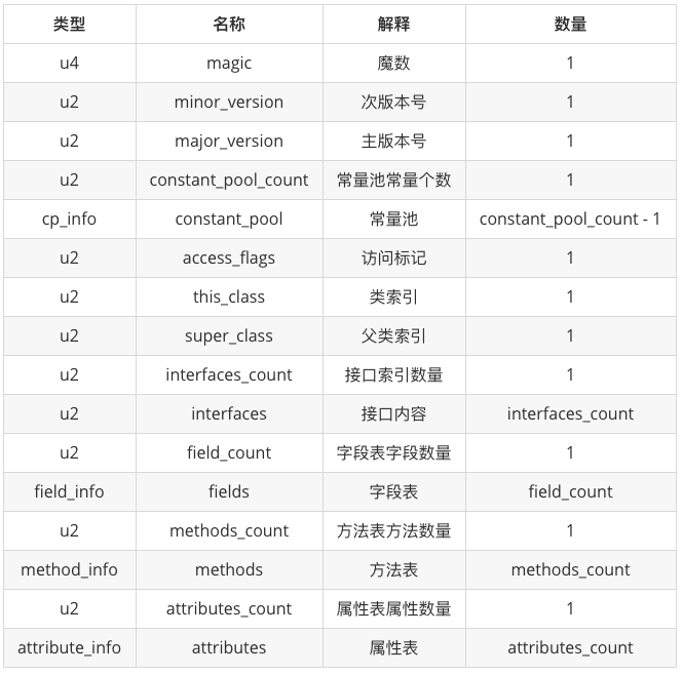

上图就是一个完整的Class文件格式，所有的Class文件都必须按照它规定的格式编译，每个字节代表什么含义，长度是多少，先后顺序等都不允许改变，它是被严格限定的。注意：一般查看Class文件都是将其转换成十六进制(2个十六进制表示1个字节)，所有Class文件都是2个十六进制连着看的.

## 1.1.魔术与版本

每个Class文件的头4个字节称为“魔数”，它唯一作用是确定这个文件是否为一个能被虚拟机接受的Class文件，值固定为“0xCAFFBABE”；跟在魔数后面的4个字节表示Class文件的版本号，其中前两个为次版本号(minor version)，后两个字节为主版本号(major version)。Java的版本号从45开始，以后每个版本加1，例如Java8的版本号为52，高版本号的JDK能够向下兼容低版本的JVM，但是拒绝执行高于它版本号的Class文件！

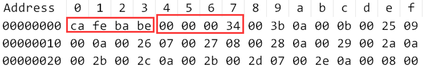

## 1.2.常量池

主次版本号后面的就是Class文件另一个部分“常量池”，它是Class文件中资源仓库，后面的部分都会与它或多或少关联，常量池是占用Class文件空间最大的数据项目之一；常量池容量不固定，所以会有1个2字节的常量池大小(constant_pool_count)表示其长度，但是容量计数是从1开始而不是0，所以实际常量池的容量 = constant_pool_count-1，下图的Class文件常量池大小为“0x003b”即59，说明这个Class的常量池共有58项：

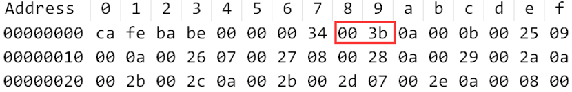

常量池主要存放两大类：“字面量”和“符号引用”：

**①字面量：**Java语言层面的常量概念，如字符串、final类型的常量值等；

**②符号引用：**属于编译原理封面的概念，它包括三类常量：

- 类和接口的全限定名

- 字段和名称和描述符

- 方法的名称和描述符

### 1.2.1.常量项类型

Class文件的“常量池”部分是最复杂，因为它的每一项常量都是一张表，都有自己的结构类型；不过它们都有一个共同点就是每个表的第一位都是u1类型的标志位，用来代表该项是常量池中的哪种类型。常量池类型会随着Java版本升高而增多，实际阅读Class文件也不会查表去找常量池的每个常量项，更多的是用javap工具查看。Java7中常量池的项目类型为：

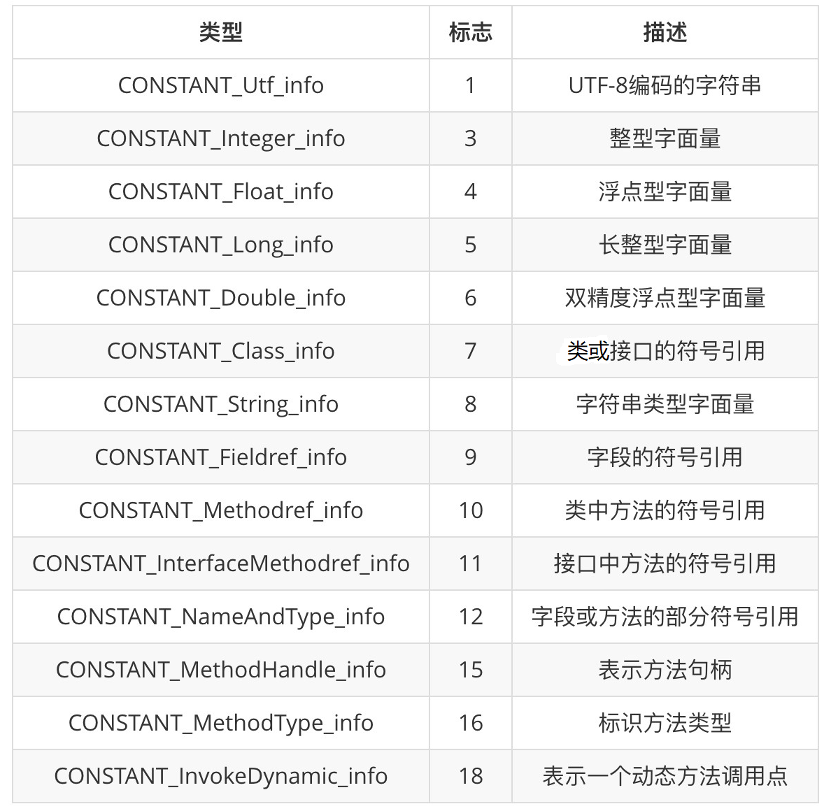

### 1.2.2.常量项结构总表

上面十四种常量项的各自结构如下图：

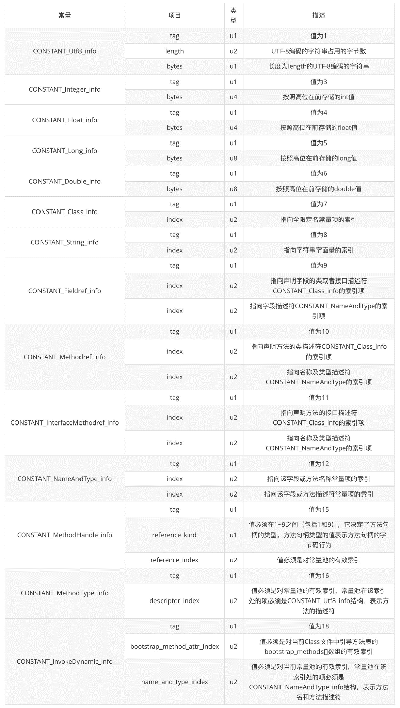

### 1.2.3.如何分析？

以这个字节码为例：

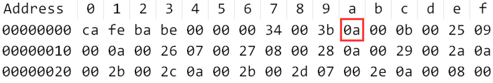

除去4个字节的magic和4个字节的version，还有2个字节的常量池容量，从“0a”开始就是常量池真正的[常量项](#_常量项类型)，已经知道每个常量项的第一位是一个标志位(占据1个字节)，将“0a”转为十进制为“10”，先查“[常量项类型](#_常量项类型)”，得到它是一个类中方法的符号引用“CONSTANT_Methodref_info”，再去查“[常量项结构总表](#_常量项结构总表)”，得到它的结构为：

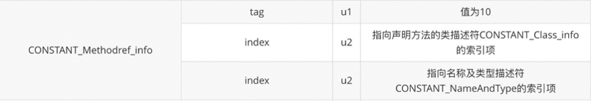

就知道“0a”后面再找2个字节“000b”表示该方法类的信息，再找2个字节“0025”表示名称及类型描述符...后面就以此类推。

这种方式太麻烦了，简直非人类，所以大部分还是用javap直接看，直接用命令“javap -v <类文件>”，就能看出来常量池中的每一项，都是用“#+数字”表示，“//”后面的内容是javap给出的注释：

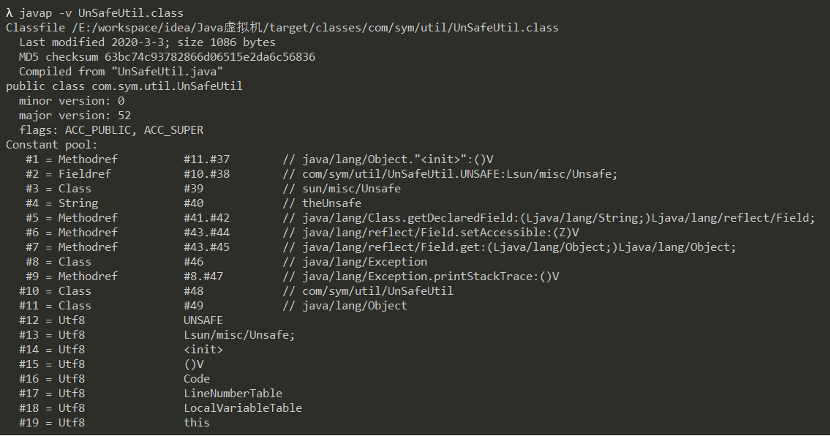

## 1.3.访问标志

常量池内容结束之后，Class文件用2个字节“access_flags”表示该类或者接口的访问信息，例如：该Class是类还是接口？是否定义为public类型？是否定义abstract类型？如果是类，是否被声明为final？等等信息：

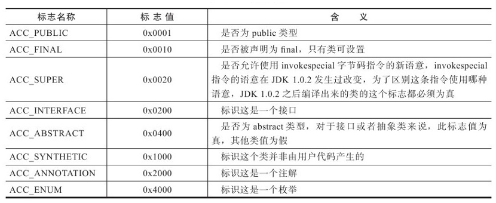

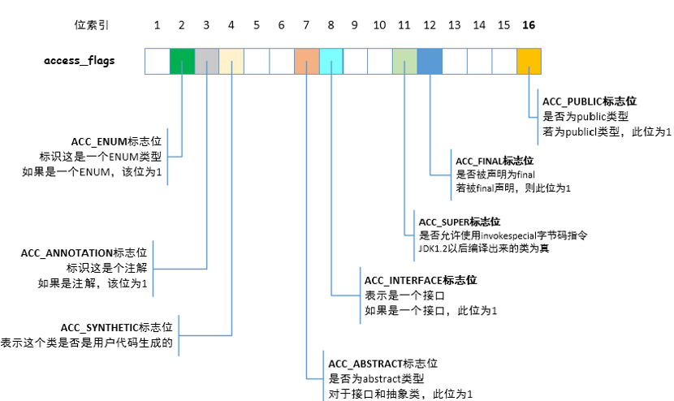

access_flags中一共有16个标志位可以使用，当前只定义了其中8个，没有使用到的标志位要求一律为0。假设现在有一个普通Java类，不是接口、枚举或者注解，被public关键字修饰但没有被声明为final和abstract，并且它使用了JDK 1.2之后的编译器进行编译，因此它的ACC_PUBLIC、ACC_SUPER标志应当为真，而ACC_FINAL、ACC_INTERFACE、ACC_ABSTRACT、ACC_SYNTHETIC、ACC_ANNOTATION、ACC_ENUM这6个标志应当为假，因此它的access_flags的值应为：0x0001|0x0020=0x0021

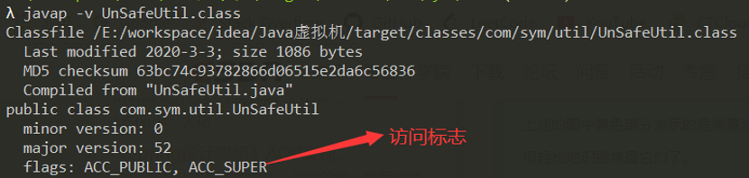

## 1.4.类索引、父类索引、接口索引集合

类索引（this_class）和父类索引（super_class）都是一个u2类型的数据，而接口索引集合（interfaces）是一组u2类型的数据的集合，Class文件中由这三项数据来确定这个类的继承关系：

1. 类索引(this_class)用于确定这个类的全限定名;

2. 父类索引(super_class)用于确定该类的父类的权限类名;

3. 接口索引集合(interfaces)用于描述该类实现了哪些接口;

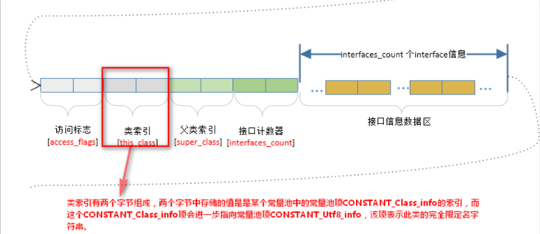

如果该Class没有实现任何接口，那么interfaces_count=0，跟在它后面的“interfaces”不会占用任何字节；相反如果该Class实现了接口，则interfaces[]的长度为interfaces_count，数组每个成员interfaces[i]包括类索引、父类索引都各自指向一个类型CONSTANT_class_info的常量池的类描述符，再通过CONSTANT_Class_info的索引值定位CONSTANT_Utf8_info类型的的全限定名称字符串

## 1.5.字段表集合

字段表集合用于描述接口或者类中声明的变量，包括静态变量和实例变量，字段表同样会引用常量池中的[常量](#_常量项类型)来描述。在Class文件中，一个变量就由下面的一个field_info(字段表)来描述；一个Class有多少的变量由fields_count来统计，它的值若为2，说明该Class文件由2个变量，就会有2个下面的field_info(字段表)

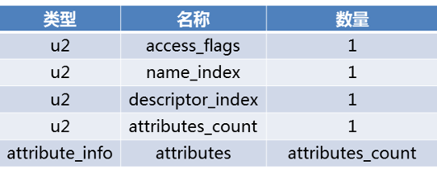

字段表不会列出从超类或者父接口中继承而来的字段，但有可能列出在java源代码没有定义的变量，例如内部类会自动添加指向外部类实例的字段；在java中变量无法重名，但是Class文件字段描述符不一样，就会当成2个字段

### 1.5.1.字段访问标志

access_flags是一个u2(2个字节)的数据类型，它用来描述变量的修饰符：

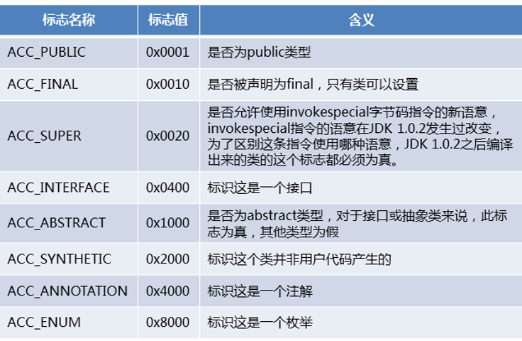

### 1.5.2.字段描述符

跟在access_flags后面的name_index和descriptor_index，它们都是对着常量池的引用，代表着“字段简单名称”和“字段描述符”。Class文件的“字段描述符”比较复杂，它规定八大基本类型和无返回值void都用一个大写字符表示，而对象类型用字符“L”加对象的全限定名(注：全限定名是将全限类名的“.”改为“/”，例如java的顶级父类Object，权限类名为：java.lang.Object，改为全限定名就是Ljava/lang/Object)，字段描述符的字符含义为：

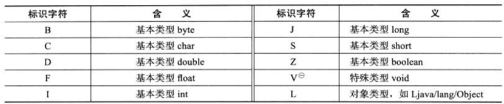

对于数组类型，每一维度使用一个前置的“[”字符来描述，例如：一个整型数组“int[]”被描述为“[I”;一个字符串二维数组“String[][]”被描述为“[[Ljava/lang/String”。用描述符描述方法时，按照“先参数，后返回值”的顺序描述，参数列表按照参数的严格顺序放在一组小括号“()”里面，例如：“void inc()”描述为“()V”；“String toString()”描述为“()Ljava/lang/String”

### 1.5.3.属性表

字段表的最后两个属性时attribute_count和attribute_info，用来存储一些额外信息，字段可以在[属性表](#_属性表集合)中描述零项至多项的额外信息。例如：如果将一个变量m定义为“final static int m = 123”，那就可能存在一项名称为ConstantValue的属性，其值指向常量池的常量123

## 1.6.方法表集合

方法表集合用于描述接口或者类中声明的方法，包括静态方法和普通方法。一个方法用一个方法表method_info表示，它跟[字段表](#_字段表集合)field_info结构是一样的，如下图所示：

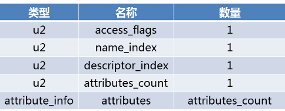

一个类或接口有多少个方法，通过method_count可得，一个方法用一个上图所示的method_info表示，多个方法就有多个method_info，即方法表集合。如果父类方法在子类中未被重写，方法表集合不会出现来自父类的方法信息，但有可能出现编译器自动添加的方法，例如类构造器\<clinit>方法和实例构造器<init>方法。注意：方法里的java代码，会被编译器编译成字节码指令，存放到[属性表集合](#_属性表集合)中一个名为“Code”的属性里面

### 1.6.1.方法访问标志

access_flags是一个u2(2个字节)的数据类型，它用来描述方法的修饰符：

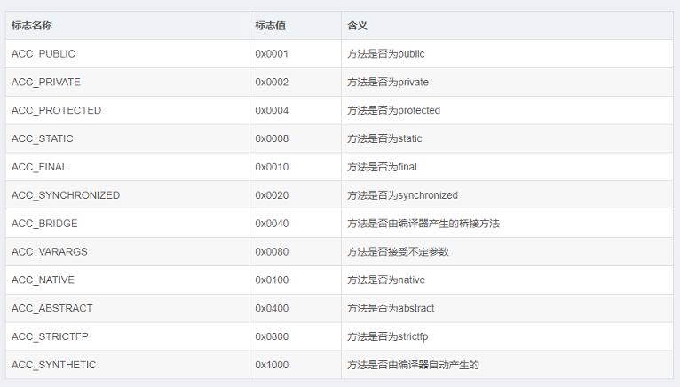

### 1.6.2.方法描述符

name_index和descriptor_index也是对着常量池的引用，代表着“方法简单名称”和“方法描述符”。方法描述符需要结合字段描述符，按照“先参数，后返回值”的顺序描述，参数列表按照参数的严格顺序放在一组小括号“()”，具体在[上面](#_字段描述符)已经有笔记

### 1.6.3.属性表

字段表的最后两个属性时attribute_count和attribute_info，是[属性表集合](#_属性表集合)，用来保存方法执行的代码

## 1.7.属性表集合

属性表即attribute_info，用来描述某些场景专有的信息，在Class文件、[字段表](#_属性表_1)、[方法表](#_属性表_1)都会有自己的属性表集合。JVM不会严格要求属性表的顺序、长度和内容(属性表可以穿插在field_info和method_info内)。对于每个属性，它的名称必须从常量池中引用一个CONSTANT_Utf8_info类型的常量来表示，属性值的结构可以自定义，只要通过u4类型(4个字节)说明属性值占用的位数即可。所以一个符合规则的属性表结构如：

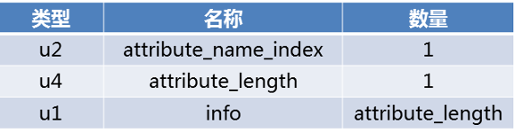

虽然任何编译器都可以向属性表写入自定义的属性，但是JVM在运行时会忽略掉它不认识的属性，正因如此，《Java虚拟机规范》预定义了一些属性，每一个属性都是一个属性表，Java8预定义属性：

https://docs.oracle.com/javase/specs/jvms/se8/html/jvms-4.html#jvms-4.7

### 1.7.1.Code

Code属性是一个最重要的属性表，Java方法中的代码经过编译后，会变成字节码指令，就存储在Code属性内。就是说Code属性说明java方法怎么执行。Code属性也满足属性表的[基本结构](#_属性表集合)，但是它内部详细划分了各个数据类型：

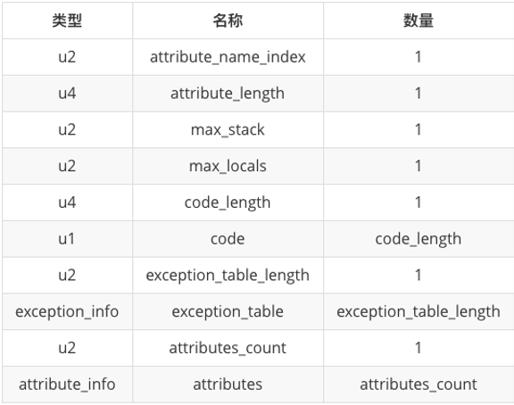

Code属性表中一些重要的类型及作用如下：

| **名称**               | **作用**                                                     |
| ---------------------- | ------------------------------------------------------------ |
| attribute_name_index   | 指向常量池CONSTANT_Utf8_info类型常量的索引，此常量值固定为“Code” |
| attribute_length       | 表示在它后面有多少个字节是属于此Code属性表的                 |
| max_stack              | 表示[操作数栈](#_操作数栈)深度的最大值，JVM运行时会根据这个值去分配栈帧中的操作栈深度 |
| max_locals             | 表示[局部变量表](#_局部变量表)所需的存储空间，它的单位是Slot，长度不超过32位的数据类型用1个Slot，double和long这种64位的数据类型用2个Slot |
| code_length            | 字节码指令的个数，例如它的值为10，则说明下面的code类型有10个 |
| code                   | 用于Java源代码编译后生成的字节码指令的一系列字节流，一个code就对应一条字节码指令，当JVM读取到code中的一个字节码时，就可以查表找出其对应的指令。1个字节的code最多可以表达256条指令 |
| exception_table_length | 方法显式异常表的的个数                                       |
| exception_table        | 若方法中出现了try_catch语句块，就会产生异常表                |

其中exception_table是java方法源码中使用了try-catch语句块出现的显式异常处理表，它有一个固定结构：

| **类型** | **名称**   | **数量** |
| -------- | ---------- | -------- |
| u2       | start_pc   | 1        |
| u2       | end_pc     | 1        |
| u2       | handler_pc | 1        |
| u2       | catch_type | 1        |

这些字段的含义：当字节码在地start_pc行到end_pc行(不包括end_pc)出现了类型为catch_type或其子类异常(catch_type为指向一个CONSTANT_Class_info型常量的索引)，则转到handler_pc行继续处理。当catch_type的值为0后，代表任意异常情况都需要转向到handler_pc处进行处理。

### 1.7.2.Exception

Exceptions属性是和Code属性一样，都是一个属性表(不要与Code属性的异常表混淆)，它的作用是列举方法中可能抛出的受检查异常，即java代码中用throws声明的异常

### 1.7.3.ConstantValue

ConstantValue属性的作用是通知JVM自动为静态变量赋值，通过下面的类加载过程的[初始化阶段](#_初始化)，可以知道静态变量赋值要么在类构造器\<clinit>()方法内进行，要么就直接在[准备阶段](#_准备)就通过ConstantValue属性赋值。选择哪种方式，取决于这个静态变量是否被final关键字修饰，有的话就用ConstantValue属性赋值，反之用类构造器方法。

### 1.7.4.InnerClasses

innerClasses属性用于记录内部类与宿主类之间的关联，如果一个类中定义了内部类，则编译器会为它以及它锁包含的内部类生成InnerClasses属性

### 1.7.5.。。。

还有很多属性省略，后面有需要再记录

# 2.类加载过程

一个类的生命周期为：加载(Loading)、验证(Verification)、准备(Preparation)、解析(Resolution)、初始化(Initialization)、使用(Using)、卸载(Unloading)，其中验证、准备和解析三个部分统称为连接(Linking)。

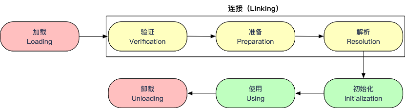

加载、验证、准备、初始化和卸载这5个阶段的顺序是确定的，类加载过程必须要按照这个顺序依次开始，而解析阶段可以在初始化阶段后再开始，这是为了满足Java的动态绑定；一个类的加载阶段并不是按部就班地一个阶段执行完调用另一个阶段，而是互相交叉地混合式进行的，通常会在一个阶段执行过程中调用、激活另一个阶段。一般JVM会在下面5种情况对类进行加载，这种行为被称为“主动引用”，除此之外所有引用类的方式不会触发加载，称为“被动引用”：

1. 遇到new、getstatic、putstatic和invokestatic这4条字节码指令；对应过来的Java场景是：通过new实例化对象、读取或设置类的静态变量(注意：被final、编译器就被放入常量池的静态字段除外)和调用一个类的静态方法；

2. 使用java.lang.reflect包的方法对类进行反射调用；

3. 初始化子类，但其父类未初始化，JVM会先初始化父类；

4. 用户在JVM启动时手动指定一个要执行的主类(即包含main()方法的类)；

5. 使用Jdk1.7动态语言支持的时候的一些情况。

## 2.1.加载

在加载阶段，JVM需要完成以下3件事情：

①通过一个类的全限定名类来获取此类的二进制字节流；

②将这个字节流所代表的静态存储结构转换为方法区的运行时数据结构；

③生成代表此类的java.lang.Class对象，作为方法区该类的数据访问入口。

## 2.2.验证

验证是连接阶段的第一步，是为了确保类文件的二进制字节流能符号JVM的要求，如果验证到不符合Class文件格式，JVM就会抛出java.lang.VerifyError及其子类异常。大体上会有下面4个阶段的校验：

1. 文件格式验证，校验是否符合Class文件格式的规范。例如：是否已[魔数](#_魔术与版本)开头？主次版本号是否在当前JVM处理氛围内？...

2. 元数据验证，对字节码描述的信息进行语义分析。例如：是否有父类？是否继承了被final修饰的类？...

3. 字节码验证，通过数据流和控制流分析，确定程序语义是否合法。例如：跳转指令不会跳转到方法体外的指令上、方法体中的类型转换是有效、...

4. 符号引用验证，对常量池中的各种符号引用信息进行匹配性校验。例如：符号引用中的全限定名是否可以找到对应的类？...

## 2.3.准备

准备阶段会为类变量(被static修饰)**分配内存并设置类变量初始值**，这些变量使用的内存将在方法区中分配。这边有两点需要说明：

1. **初始化值是指对应数据类型的零值**。例如：private static int *value* = 123;变量value在准备阶段的初始值为0，而不是123。把value复制为123的putstatic指令是在类构造器“\<clinit>()”方法执行，即在[初始化阶段](#_初始化)。

2. **若类变量被final修饰，初始化值就是代码定义的值**。例如：private final static int *value* = 123; javac编译时会为final修饰的变量，在其[字段属性表](#_属性表)生成ConstantValue属性，那么在准备阶段JVM就会根据ConstantValue直接为其赋值，即123

## 2.4.解析

解析阶段是JVM**将**[**常量池**](#_常量池)**内的符号引用替换为直接引用的过程。**

- 符号引用：指的是常量池中的CONSTANT_Class_info等类型；

- 直接引用：指的是可以指向目标的指针、相对偏移量或间接定位到目标的句柄。

...后面补充下解析过程...

## 2.5.初始化

初始化阶段是类加载过程的最后一步，真正开始执行类中定义的Java程序代码，即**执行类构造器“\<clinit>()”**方法。\<clinit>()方法是由编译器收集类变量的赋值操作 + 静态语句块(static{})合并产生的。此方法有如下5个特性：

1. 若类没有静态语句块也没有为静态变量赋值，编译器不会为其生成\<clinit>；

2. 父类的\<clinit>()一定先于子类的\<clinit>()执行；

3. 接口不能使用静态语句块但可以定义静态变量，因此编译器会生成\<clinit>方法，但执行接口的\<clinit>()方法不需要先执行其父接口的\<clinit>()，只有使用到父接口定义的静态变量时，才会执行父接口的\<clinit>()方法；

4. 接口实现类初始化时也不会执行接口的\<clinit>()方法；

5. \<clinit>方法是线程安全的，若多个线程同时初始化同一个类，只有一个线程能调用\<clinit>()方法，其它线程只能阻塞到\<clinit>()方法执行完毕。

# 3.类加载器

类加载器：通过一个类的全限定名来获取此类的二进制字节流的组件，在Java中特指java.lang.ClassLoader类。任意一个类，必须由加载它的类加载器和这个类自身一同确立此类在JVM中的唯一性，即类A和类B来源于同一个Class文件，而且被同一个JVM加载，但是加载它们的ClassLoader不同，那么这两个类必定不等，体现在Java语言层面，就是Class对象的equals()方法、isAssignableFrom()、isInstance()返回false。

## 3.1.双亲委派模型

对JVM而言，只存在两种类加载器：其一是启动类加载器(Boostrap ClassLoader)，它使用C++语言实现(只限HotSpot虚拟机)，属于虚拟机自身的一部分；其二就是由Java实现并继承自java.lang.ClassLoader的类加载器。但是对java而言，类加载分为3大类：

1. **启动类加载器(Bootstrap ClassLoader)**，负责加载<JAVA_HOME>\lib目录中的，或被-Xbootclasspath参数指定路径的，符合名称规范的类库；

2. **扩展类加载器(Extension ClassLoader)**，负责加载<JAVA_HOME>\lib\ext目录中的，或被java.ext.dirs系统变量指定路径下的所有类。它由sum.misc.Launcher$ExtClassLoader实现，可以被直接使用；

3. **应用程序类加载器(Application ClassLoader)**，负责加载ClassPath下的类，由sun.misc.Launcher$AppClassLoader实现，是ClassLoader#getSystemClassLoader()方法的返回值，也被叫做系统类加载器，我们写的类一般就是它加载的。

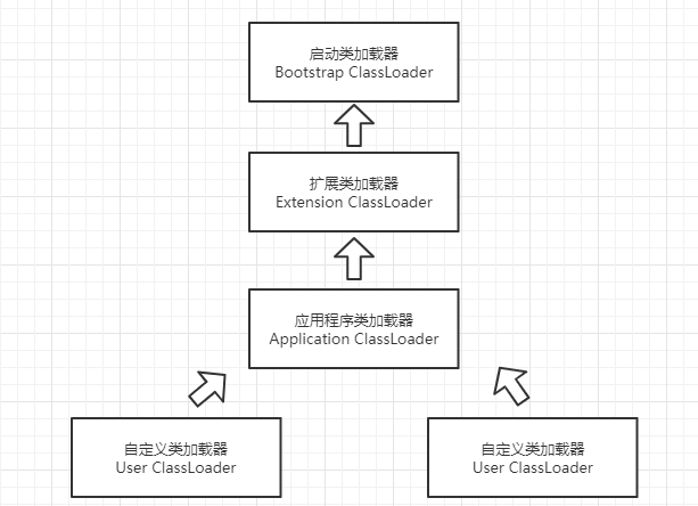

所谓“双亲委派模型”就是：当子加载器收到加载一个类的请求时，先委托给父加载器加载，每一层次的加载器都这样处理，直到最顶层的启动类加载器；只有在父加载器无法加载此类时(在它搜索范围内未找到所需类)，子加载器就会自己动手加载。这样可以保证JVM中的类带有优先级的层次关系，而不会一团糟(因为一个类如果被不同类加载器加载，JVM会当它们不是同一个类)

## 3.2.自定义类加载器

在java中，我们可以继承java.lang.ClassLoader类自定义自己的类加载器。ClassLoader默认提供以下重要的方法：

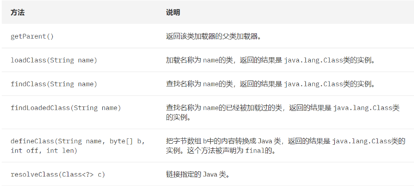

一般来说，自己开发的类加载器只需要覆盖 findClass(String name)方法即可，不要去覆盖loadClass()方法，即不要破坏双亲委派机制，可以看下loadClass()方法的源码：

```java
protected Class<?> loadClass(String name, boolean resolve)
  throws ClassNotFoundException {
  synchronized (getClassLoadingLock(name)) {
    // 首先检查此类是否已被加载
    Class<?> c = findLoadedClass(name);
    if (c == null) {
      long t0 = System.nanoTime();
      try {
        if (parent != null) {
          // 先委托给父加载器去加载此类
          c = parent.loadClass(name, false);
        } else {
          // 如果没有父加载器, 说明是启动类加载器, 这个方法是native本地方法
          c = findBootstrapClassOrNull(name);
        }
      } catch (ClassNotFoundException e) {
        // 如果是父类抛出ClassNotFoundException就忽略不管.
      }
      if (c == null) {
        long t1 = System.nanoTime();
        // 既然父加载器没办法加载此类, 那就自己加载, 所以自定义的加载需要实现findClass()方法
        c = findClass(name);
        // this is the defining class loader; record the stats
        sun.misc.PerfCounter.getParentDelegationTime().addTime(t1 - t0);
        sun.misc.PerfCounter.getFindClassTime().addElapsedTimeFrom(t1);
        sun.misc.PerfCounter.getFindClasses().increment();
      }
    }
    if (resolve) {
      // 如果需要解析类, 则调用resolveClass()方法进行解析. 默认底层调用native方法
      resolveClass(c);
    }
    return c;
  }
}
```