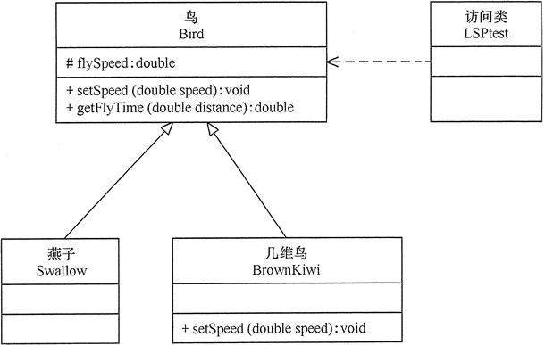
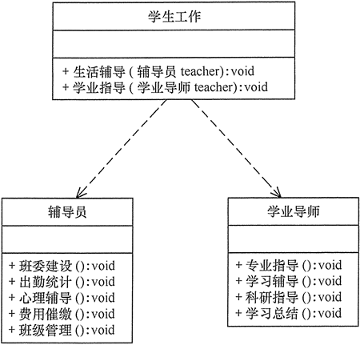

# 1.设计模式基础

## 1.1.什么是设计模式?

软件设计模式（Software Design Pattern），又称设计模式，是一套被反复使用、多数人知晓的、经过分类编目的、代码设计经验的总结。它描述了在软件设计过程中的一些不断重复发生的问题，以及该问题的解决方案。也就是说，它是解决特定问题的一系列套路，是前辈们的代码设计经验的总结，具有一定的普遍性，可以反复使用。其目的是为了提高代码的可重用性、代码的可读性和代码的可靠性。设计模式的本质是：**面向对象设计原则的实际运用，是对类的封装性、继承性和多态性以及类的关联关系和组合关系的充分理解**.

## 1.2.基本要素

设计模式通常包含以下几个基本要素：模式名称、别名、动机、问题、解决方案、效果、结构、模式角色、合作关系、实现方法、适用性、已知应用、例程、模式扩展和相关模式等，其中最关键的元素包括以下 4 个主要部分：

|基本要素&emsp;| **描述**                                                     |
| -------- | ------------------------------------------------------------ |
| 模式名称 | 每一个模式都有自己的名字，通常用一两个词来描述，可以根据模式的问题、特点、解决方案、功能和效果来命名。模式名称（PatternName）有助于我们理解和记忆该模式，也方便我们来讨论自己的设计 |
| 问题     | 问题（Problem）描述了该模式的应用环境，即何时使用该模式。它解释了设计问题和问题存在的前因后果，以及必须满足的一系列先决条件 |
| 解决方案 | 模式问题的解决方案（Solution）包括设计的组成成分、它们之间的相互关系及各自的职责和协作方式。因为模式就像一个模板，可应用于多种不同场合，所以解决方案并不描述一个特定而具体的设计或实现，而是提供设计问题的抽象描述和怎样用一个具有一般意义的元素组合（类或对象的 组合）来解决这个问题 |
| 效果     | 描述了模式的应用效果以及使用该模式应该权衡的问题，即模式的优缺点。主要是对时间和空间的衡量，以及该模式对系统的灵活性、扩充性、可移植性的影响，也考虑其实现问题。显式地列出这些效果（Consequence）对理解和评价这些模式有很大的帮助 |

## 1.3.模式分类

根据设计模式的用途，大体分为[创建型](#4.创建型模式)(Creational)，[结构型](#5.结构型模式)(Structural)和[行为型](#6.行为型模式)(Behavioral)三种。其中创建型模式主要用于描述如何创建对象，结构型模式主要用于描述如何实现类或对象的组合，行为型模式主要用于描述类或对象怎样交互以及怎样分配职责。

# 2.UML类图

UML类图可以简洁地描述一个设计模式如何运行，UML类图的一些基本要素如下

## 2.1.继承

继承用一条带空心箭头的直接表示

## 2.2.实现

实现关系用一条带空心箭头的虚线表示

## 2.3.组合

与聚合关系一样，组合关系同样表示整体由部分构成的语义。比如公司由多个部门组成，但组合关系是一种强依赖的特殊聚合关系，如果整体不存在了，则部分也不存在了。例如，公司不存在了，部门也将不存在了

## 2.4.聚合

聚合关系用于表示实体对象之间的关系，表示整体由部分构成的语义，例如一个部门由多个员工组成。与组合关系不同的是，整体和部分不是强依赖的，即使整体不存在了，部分仍然存在。例如，部门撤销了，人员不会消失，他们依然存在。

## 2.5.关联

关联关系是用一条直线表示的，它描述不同类的对象之间的结构关系，它是一种静态关系， 通常与运行状态无关，一般由常识等因素决定的。它一般用来定义对象之间静态的、天然的结构， 所以，关联关系是一种“强关联”的关系。比如，乘车人和车票之间就是一种关联关系，学生和学校就是一种关联关系，关联关系默认不强调方向，表示对象间相互知道。如果特别强调方向，如下图，表示 A 知道 B ，但 B 不知道 A 

## 2.6.依赖

依赖关系是用一套带箭头的虚线表示的，如A依赖于B，他描述一个对象在运行期间会用到另一个对象的关系。与关联关系不同的是，它是一种临时性的关系，通常在运行期间产生，并且随着运行时的变化，依赖关系也可能发生变化。显然，依赖也有方向，双向依赖是一种非常糟糕的结构，我们总是应该保持单向依赖，杜绝双向依赖的产生

# 3.设计原则

在软件开发中，为了提高软件系统的可维护性和可复用性，增加软件的可扩展性和灵活性，程序员要尽量根据 7 条原则来开发程序，从而提高软件开发效率、节约软件开发成本和维护成本

## 3.1.开闭原则

开闭原则：**一个软件实体应当对扩展开放，对修改关闭。即软件实体应尽量在不修改原有代码的情况下进行扩展。其中软件实体指：项目中划分出的模块、类与接口、方法**。

 可以通过“抽象约束、封装变化”来实现开闭原则，即通过接口或者抽象类为软件实体定义一个相对稳定的抽象层，而将相同的可变因素封装在相同的具体实现类中：

## 3.2.里氏替换原则

里氏替换原则：**继承必须确保超类所拥有的性质在子类中仍然成立，通俗地讲，子类可以扩展父类的功能，但不能改变父类原有的功能，再通俗地讲，子类继承父类时，可以重写父类方法，但是不要违背父类方法原先的意图**。

里氏替换原则告诉我们**什么时候该用继承？什么时候不能用继承**。例如：企鹅、鸵鸟和几维鸟从生物学的角度来划分，它们属于鸟类；但从类的继承关系来看，由于它们不能继承“鸟”会飞的功能，所以它们不能定义成“鸟”的子类，“几维鸟”不能继承“鸟”，因为它不会飞，哪里来的flySpeed()方法？

## 3.3.依赖倒置原则

依赖倒置原则：**高层模块不应该依赖低层模块，两者都应该依赖其抽象；抽象不应该依赖细节，细节应该依赖抽象。也就是说，要面向接口编程，不要面向实现编程**。

依赖倒置原则的目的是通过要面向接口的编程来降低类间的耦合性，所以在实际编程中只要遵循以下4点，就能在项目中满足这个规则：

1. 每个类尽量提供接口或抽象类，或者两者都具备；

2. 变量的声明类型尽量是接口或者是抽象类；

3. 任何类都不应该从具体类派生；

4. 使用继承时尽量遵循里氏替换原则。

顾客Customer的shopping(Shop shop)方法，方法参数通过接口Shop来定义，就可以实现通过不同的的商店Shop实现完成sell()方法，而不用每次都要去修改shopping()方法源码

## 3.4.单一职责原则

单一职责原则：**一个类应该有且仅有一个引起它变化的原因，否则类应该被拆分，换句话说，一个类只负责一个功能领域中的相应职责(或者是一个功能)。单一职责原则是实现高内聚、低耦合的指导方针，它是最简单但又最难运用的原则**。

大学学生工作主要包括学生生活辅导和学生学业指导两个方面的工作，如果将这些工作交给一位老师(即一个老师就是一个类)负责显然不合理，正确的做法是生活辅导由辅导员负责，学业指导由学业导师负责：

## 3.5.接口隔离原则

接口隔离原则：**一个类对另一个类的依赖应该建立在最小的接口上，换句话说，要为各个类建立它们需要的专用接口，而不要试图去建立一个很庞大的接口供所有依赖它的类去调用**。

接口隔离原则和[单一职责](#3.4.单一职责原则)都是为了提高类的内聚性、降低它们之间的耦合性，体现了封装的思想，但两者是不同的：

1. 单一职责原则注重的是职责，而接口隔离原则注重的是对接口依赖的隔离；

2. 单一职责原则主要是约束类，它针对的是程序中的实现和细节；接口隔离原则主要约束接口，主要针对抽象和程序整体框架的构建。

学生成绩管理程序一般包含插入成绩、删除成绩、修改成绩、计算总分、计算均分、打印成绩信息、査询成绩信息等功能，如果将这些功能全部放到一个接口中显然不太合理，正确的做法是将它们分别放在输入模块、统计模块和打印模块中

## 3.6.迪米特法则

迪米特法则，也称为最少知道原则：**如果两个软件实体无须直接通信，那么就不应当发生直接的相互调用，可以通过第三方转发该调用。其目的是降低类之间的耦合度，提高模块的相对独立性**。

明星由于全身心投入艺术，所以许多日常事务由经纪人负责处理，如与粉丝的见面会，与媒体公司的业务洽淡等。这里的经纪人是明星的朋友，而粉丝和媒体公司是陌生人，所以适合使用迪米特法则：

## 3.7.合成复用原则

合成复用原则，又称为“组合/聚合复用原则”：**要求在软件复用时，要尽量先使用组合或者聚合等关联关系来实现，其次才考虑使用继承关系来实现。如果要使用继承关系，则必须严格遵循**[**里氏替换原则**](#3.2.里氏替换原则)。

汽车按“动力源”划分可分为汽油汽车、电动汽车等；按“颜色”划分可分为白色汽车、黑色汽车和红色汽车等。如果同时考虑这两种分类，其组合就很多，这时候如果使用继承就会产生类爆炸，但如果有聚合的方式：

# 4.创建型模式

# 5.结构型模式

# 6.行为型模式

# 7.说明

