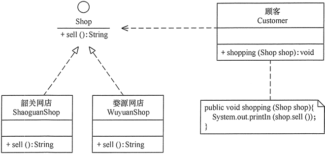

# 1.设计模式基础

## 1.1.什么是设计模式?

软件设计模式（Software Design Pattern），又称设计模式，是一套被反复使用、多数人知晓的、经过分类编目的、代码设计经验的总结。它描述了在软件设计过程中的一些不断重复发生的问题，以及该问题的解决方案。也就是说，它是解决特定问题的一系列套路，是前辈们的代码设计经验的总结，具有一定的普遍性，可以反复使用。其目的是为了提高代码的可重用性、代码的可读性和代码的可靠性。设计模式的本质是：**面向对象设计原则的实际运用，是对类的封装性、继承性和多态性以及类的关联关系和组合关系的充分理解**.

## 1.2.基本要素

设计模式通常包含以下几个基本要素：模式名称、别名、动机、问题、解决方案、效果、结构、模式角色、合作关系、实现方法、适用性、已知应用、例程、模式扩展和相关模式等，其中最关键的元素包括以下 4 个主要部分：

<table>
    <tr>
    	<th>基本要素</th>
        <th>描述</th>
    </tr>
    <tr>
        <td width="15%">模式名称</td>
        <td>每一个模式都有自己的名字，通常用一两个词来描述，可以根据模式的问题、特点、解决方案、功能和效果来命名。模式名称（PatternName）有助于我们理解和记忆该模式，也方便我们来讨论自己的设计</td>
    </tr>
    <tr>
        <td>问题</td>
        <td>问题（Problem）描述了该模式的应用环境，即何时使用该模式。它解释了设计问题和问题存在的前因后果，以及必须满足的一系列先决条件</td>
    </tr>
    <tr>
        <td>解决方案</td>
        <td>模式问题的解决方案（Solution）包括设计的组成成分、它们之间的相互关系及各自的职责和协作方式。因为模式就像一个模板，可应用于多种不同场合，所以解决方案并不描述一个特定而具体的设计或实现，而是提供设计问题的抽象描述和怎样用一个具有一般意义的元素组合（类或对象的 组合）来解决这个问题</td>
    </tr>
    <tr>
        <td>效果</td>
        <td>描述了模式的应用效果以及使用该模式应该权衡的问题，即模式的优缺点。主要是对时间和空间的衡量，以及该模式对系统的灵活性、扩充性、可移植性的影响，也考虑其实现问题。显式地列出这些效果（Consequence）对理解和评价这些模式有很大的帮助</td>
    </tr>
</table>

## 1.3.模式分类

根据设计模式的用途，大体分为[创建型](#4.创建型模式)(Creational)，[结构型](#5.结构型模式)(Structural)和[行为型](#6.行为型模式)(Behavioral)三种。其中创建型模式主要用于描述如何创建对象，结构型模式主要用于描述如何实现类或对象的组合，行为型模式主要用于描述类或对象怎样交互以及怎样分配职责。

# 2.UML类图

UML类图可以简洁地描述一个设计模式如何运行，UML类图的一些基本要素如下

## 2.1.继承

继承用一条带空心箭头的直接表示

## 2.2.实现

实现关系用一条带空心箭头的虚线表示

## 2.3.组合

与聚合关系一样，组合关系同样表示整体由部分构成的语义。比如公司由多个部门组成，但组合关系是一种强依赖的特殊聚合关系，如果整体不存在了，则部分也不存在了。例如，公司不存在了，部门也将不存在了

## 2.4.聚合

聚合关系用于表示实体对象之间的关系，表示整体由部分构成的语义，例如一个部门由多个员工组成。与组合关系不同的是，整体和部分不是强依赖的，即使整体不存在了，部分仍然存在。例如，部门撤销了，人员不会消失，他们依然存在。

## 2.5.关联

关联关系是用一条直线表示的，它描述不同类的对象之间的结构关系，它是一种静态关系， 通常与运行状态无关，一般由常识等因素决定的。它一般用来定义对象之间静态的、天然的结构， 所以，关联关系是一种“强关联”的关系。比如，乘车人和车票之间就是一种关联关系，学生和学校就是一种关联关系，关联关系默认不强调方向，表示对象间相互知道。如果特别强调方向，如下图，表示 A 知道 B ，但 B 不知道 A 

## 2.6.依赖

依赖关系是用一套带箭头的虚线表示的，如A依赖于B，他描述一个对象在运行期间会用到另一个对象的关系。与关联关系不同的是，它是一种临时性的关系，通常在运行期间产生，并且随着运行时的变化，依赖关系也可能发生变化。显然，依赖也有方向，双向依赖是一种非常糟糕的结构，我们总是应该保持单向依赖，杜绝双向依赖的产生

# 3.设计原则

在软件开发中，为了提高软件系统的可维护性和可复用性，增加软件的可扩展性和灵活性，程序员要尽量根据 7 条原则来开发程序，从而提高软件开发效率、节约软件开发成本和维护成本

## 3.1.开闭原则

开闭原则：**一个软件实体应当对扩展开放，对修改关闭。即软件实体应尽量在不修改原有代码的情况下进行扩展。其中软件实体指：项目中划分出的模块、类与接口、方法**。

 可以通过“抽象约束、封装变化”来实现开闭原则，即通过接口或者抽象类为软件实体定义一个相对稳定的抽象层，而将相同的可变因素封装在相同的具体实现类中：

## 3.2.里氏替换原则

里氏替换原则：**继承必须确保超类所拥有的性质在子类中仍然成立，通俗地讲，子类可以扩展父类的功能，但不能改变父类原有的功能，再通俗地讲，子类继承父类时，可以重写父类方法，但是不要违背父类方法原先的意图**。

里氏替换原则告诉我们**什么时候该用继承？什么时候不能用继承**。例如：企鹅、鸵鸟和几维鸟从生物学的角度来划分，它们属于鸟类；但从类的继承关系来看，由于它们不能继承“鸟”会飞的功能，所以它们不能定义成“鸟”的子类，“几维鸟”不能继承“鸟”，因为它不会飞，哪里来的flySpeed()方法？

## 3.3.依赖倒置原则

依赖倒置原则：**高层模块不应该依赖低层模块，两者都应该依赖其抽象；抽象不应该依赖细节，细节应该依赖抽象。也就是说，要面向接口编程，不要面向实现编程**。

依赖倒置原则的目的是通过要面向接口的编程来降低类间的耦合性，所以在实际编程中只要遵循以下4点，就能在项目中满足这个规则：

1. 每个类尽量提供接口或抽象类，或者两者都具备；

2. 变量的声明类型尽量是接口或者是抽象类；

3. 任何类都不应该从具体类派生；

4. 使用继承时尽量遵循里氏替换原则。

顾客Customer的shopping(Shop shop)方法，方法参数通过接口Shop来定义，就可以实现通过不同的的商店Shop实现完成sell()方法，而不用每次都要去修改shopping()方法源码

## 3.4.单一职责原则

单一职责原则：**一个类应该有且仅有一个引起它变化的原因，否则类应该被拆分，换句话说，一个类只负责一个功能领域中的相应职责(或者是一个功能)。单一职责原则是实现高内聚、低耦合的指导方针，它是最简单但又最难运用的原则**。

大学学生工作主要包括学生生活辅导和学生学业指导两个方面的工作，如果将这些工作交给一位老师(即一个老师就是一个类)负责显然不合理，正确的做法是生活辅导由辅导员负责，学业指导由学业导师负责：

## 3.5.接口隔离原则

接口隔离原则：**一个类对另一个类的依赖应该建立在最小的接口上，换句话说，要为各个类建立它们需要的专用接口，而不要试图去建立一个很庞大的接口供所有依赖它的类去调用**。接口隔离原则和[单一职责](#3.4.单一职责原则)都是为了提高类的内聚性、降低它们之间的耦合性，体现了封装的思想，但两者是不同的：

1. 单一职责原则注重的是职责，而接口隔离原则注重的是对接口依赖的隔离；

2. 单一职责原则主要是约束类，它针对的是程序中的实现和细节；接口隔离原则主要约束接口，主要针对抽象和程序整体框架的构建。

学生成绩管理程序一般包含插入成绩、删除成绩、修改成绩、计算总分、计算均分、打印成绩信息、査询成绩信息等功能，如果将这些功能全部放到一个接口中显然不太合理，正确的做法是将它们分别放在输入模块、统计模块和打印模块中

## 3.6.迪米特法则

迪米特法则，也称为最少知道原则：**如果两个软件实体无须直接通信，那么就不应当发生直接的相互调用，可以通过第三方转发该调用。其目的是降低类之间的耦合度，提高模块的相对独立性**。

明星由于全身心投入艺术，所以许多日常事务由经纪人负责处理，如与粉丝的见面会，与媒体公司的业务洽淡等。这里的经纪人是明星的朋友，而粉丝和媒体公司是陌生人，所以适合使用迪米特法则：

## 3.7.合成复用原则

合成复用原则，又称为“组合/聚合复用原则”：**要求在软件复用时，要尽量先使用组合或者聚合等关联关系来实现，其次才考虑使用继承关系来实现。如果要使用继承关系，则必须严格遵循**[**里氏替换原则**](#3.2.里氏替换原则)。

汽车按“动力源”划分可分为汽油汽车、电动汽车等；按“颜色”划分可分为白色汽车、黑色汽车和红色汽车等。如果同时考虑这两种分类，其组合就很多，这时候如果使用继承就会产生类爆炸，但如果有聚合的方式：

# 4.创建型模式

创建型模式(Creational Pattern)对类的实例化过程进行了抽象，能够将软件模块中对象的创建和对象的使用分离。为了使软件的结构更加清晰，外界对于这些对象只需要知道它们共同的接口，而不清楚其具体的实现细节，使整个系统的设计更加符合[单一职责原则](#3.4.单一职责原则)。此类型模式共有6个：

1. 简单工厂模式（Simple Factory Pattern）

2. 工厂方法模式（Factory Method Pattern）

3. 抽象工厂模式（Abstract Factory Pattern）

4. 单例模式（Singleton Pattern）

5. 生成器模式（Builder Pattern）

6. 原型模式（Prototype Pattern）

## 4.1.简单工厂模式

简单工厂模式，又称为静态工厂方法模式，在简单工厂模式中，可以根据参数的不同返回不同类的实例。简单工厂模式专门定义一个类负责创建其他类的实例，被创建的实例通常都具有共同的父类。简单工厂模式包含如下角色：

<table>
    <tr>
    	<th>角色</th>
        <th>作用</th>
    </tr>
    <tr>
        <td width="33%">Factory-工厂角色</td>
        <td>负责实现创建所有实例的内部逻辑</td>
    </tr>
    <tr>
        <td>Product-抽象产品角色</td>
        <td>是所创建的所有对象的父类，负责描述所有实例所共有的公共接口</td>
    </tr>
    <tr>
        <td>ConcreteProduct-具体产品角色</td>
        <td>所有创建的对象都充当这个角色的某个具体类的实例</td>
    </tr>
</table>

## 4.2.工厂方法模式

工厂方法模式又称为工厂模式，也叫虚拟构造器模式、多态工厂模式，在工厂方法模式中，工厂父类负责定义创建产品对象的公共接口，而工厂子类则负责生成具体的产品对象，这样做的目的是将产品类的实例化操作延迟到工厂子类中完成，即通过工厂子类来确定究竟应该实例化哪一个具体产品类。工厂方法模式包含如下角色：

<table>
    <tr>
    	<th>角色</th>
        <th>作用</th>
    </tr>
    <tr>
    	<td width="30%">抽象工厂(Abstract Factory)</td>
        <td>提供了创建产品的接口，调用者通过它访问具体工厂的工厂方法 newProduct() 来创建产品</td>
    </tr>
    <tr>
    	<td>具体工厂(ConcreteFactory)</td>
        <td>主要是实现抽象工厂中的抽象方法，完成具体产品的创建。</td>
    </tr>
    <tr>
    	<td>抽象产品(Product)</td>
        <td>定义了产品的规范，描述了产品的主要特性和功能</td>
    </tr>
    <tr>
    	<td>具体产品(ConcreteProduct)</td>
        <td>实现了抽象产品角色所定义的接口，由具体工厂来创建，它同具体工厂之间一一对应</td>
    </tr>
</table>

## 4.3.抽象工厂模式

抽象工厂模式，又称为Kit模式，提供一个创建一系列相关或相互依赖对象的接口，而无须指定它们具体的类。抽象工厂模式和[工厂方法模式](#4.2.工厂方法模式)不同的地方在于，工厂方法模式针对的是一个产品等级结构，而抽象工厂模式则需要面对多个产品等级结构。抽象工厂模式包含如下角色：

<table>
    <tr>
    	<th>角色</th>
        <th>作用</th>
    </tr>
    <tr>
    	<td width="33%">抽象工厂（Abstract Factory）</td>
        <td>提供了创建产品的接口，它包含多个创建产品的方法 newProduct()，可以创建多个不同等级的产品</td>
    </tr>
    <tr>
    	<td>具体工厂（Concrete Factory）</td>
        <td>主要是实现抽象工厂中的多个抽象方法，完成具体产品的创建</td>
    </tr>
    <tr>
    	<td>抽象产品（Product）</td>
        <td>定义了产品的规范，描述了产品的主要特性和功能，抽象工厂模式有多个抽象产品</td>
    </tr>
    <tr>
    	<td>具体产品（ConcreteProduct）</td>
        <td>实现了抽象产品角色所定义的接口，由具体工厂来创建，它 同具体工厂之间是多对一的关系</td>
    </tr>
</table>

## 4.4.建造者模式

建造者模式，也称为“生成器模式”，将一个复杂对象的构建与它的表示分离，使得同样的构建过程可以创建不同的表示。建造者模式是一步一步创建一个复杂的对象，它允许用户只通过指定复杂对象的类型和内容就可以构建它们，用户不需要知道内部的具体构建细节。建造者模式包含如下的角色：

<table>
    <tr>
    	<th>角色</th>
        <th>作用</th>
    </tr>
    <tr>
    	<td width="33%">产品角色（Product）</td>
        <td>它是包含多个组成部件的复杂对象，由具体建造者来创建其各个滅部件</td>
    </tr>
    <tr>
    	<td>抽象建造者（Builder）</td>
        <td>它是一个包含创建产品各个子部件的抽象方法的接口，通常还包含一个返回复杂产品的方法 getResult()</td>
    </tr>
    <tr>
    	<td>具体建造者(Concrete Builder）</td>
        <td>实现 Builder 接口，完成复杂产品的各个部件的具体创建方法</td>
    </tr>
    <tr>
    	<td>指挥者（Director）</td>
        <td>它调用建造者对象中的部件构造与装配方法完成复杂对象的创建，在指挥者中不涉及具体产品的信息</td>
    </tr>
</table>

## 4.5.单例模式

单例模式，也称为“单件模式、单态模式”，确保某一个类只有一个实例，而且自行实例化并向整个系统提供这个实例，这个类称为单例类，它提供全局访问的方法。单例模式的要点有三个：一是某个类只能有一个实例；二是它必须自行创建这个实例；三是它必须自行向整个系统提供这个实例

## 4.6.原型模式

原型模式：用一个已经创建的实例作为原型，通过复制该原型对象来创建一个和原型相同或相似的新对象。在这里，原型实例指定了要创建的对象的种类。用这种方式创建对象非常高效，根本无须知道对象创建的细节。Java 提供了对象的 clone()方法，所以用 Java 实现原型模式很简单。原型模式有如下几个角色：

| **角色**   | **作用**                                          |
| ---------- | ------------------------------------------------- |
| 抽象原型类 | 规定了具体原型对象必须实现的接口                  |
| 具体原型类 | 实现抽象原型类的 clone() 方法，它是可被复制的对象 |
| 访问类     | 使用具体原型类中的 clone() 方法来复制新的对象     |

# 5.结构型模式

结构型模式(Structural Pattern)描述如何将类或者对象结合在一起形成更大的结构，就像搭积木，可以通过 简单积木的组合形成复杂的、功能更为强大的结构。此类型模式共有6个：

1. 适配器模式(Adapter)

2. 桥接模式(Bridge)

3. 组合模式(Composite)

4. 装饰模式(Decorator)

5. 外观模式(Facade)

6. 享元模式(FlyWeight)

7. 代理模式(Porxy)

## 5.1.适配器模式

适配器模式(Adapter Pattern)：也称为“包装器模式”，将一个接口转换成客户希望的另一个接口，适配器模式使接口不兼容的那些类可以一起工作，其别名为包装器(Wrapper)，适配器模式有对象适配器和类适配器两种实现。此模式共有3种角色：

<table>
    <tr>
    	<th>角色</th>
        <th>作用</th>
    </tr>
    <tr>
    	<td width="25%">目标（Target）接口</td>
        <td>当前系统业务所期待的接口，它可以是抽象类或接口</td>
    </tr>
    <tr>
    	<td>适配者（Adaptee）类</td>
        <td>它是被访问和适配的现存组件库中的组件接口</td>
    </tr>
    <tr>
    	<td>适配器（Adapter）类</td>
        <td>它是一个转换器，通过继承或引用适配者的对象，把适配者接口转换成目标接口，让客户按目标接口的格式访问适配者</td>
    </tr>
</table>

## 5.2.桥接模式

桥接模式(Bridge Pattern)：将抽象部分与它的实现部分分离，使它们都可以独立地变化。它是一种对象结构型模式，又称为柄体(Handle and Body)模式或接口(Interface)模式。桥接模式包含以下角色：

<table>
    <tr>
    	<th>角色</th>
        <th>作用</th>
    </tr>
    <tr>
    	<td width="45%">抽象化角色（Abstraction）</td>
        <td>定义抽象类，并包含一个对实现化对象的引用</td>
    </tr>
    <tr>
    	<td>扩展抽象化角色（Refined Abstraction）</td>
        <td>它是被访问和适配的现存组件库中的组件接口</td>
    </tr>
    <tr>
    	<td>实现化角色（Implementor）</td>
        <td>定义实现化角色的接口，供扩展抽象化角色调用</td>
    </tr>
    <tr>
    	<td>具体实现化角色  （Concrete Implementor）</td>
        <td>给出实现化角色接口的具体实现</td>
    </tr>
</table>

## 5.3.装饰模式

装饰模式(Decorator Pattern) ：动态地给一个对象增加一些额外的职责，就增加对象功能来说，装饰模式比生成子类实现更为灵活。其别名也可以称为包装器(Wrapper)，与[适配器模式](#5.1.适配器模式)的别名相同，但它们适用于不同的场合。装饰模式包含如下角色：

| **角色**                             | **作用**                                                     |
| ------------------------------------ | ------------------------------------------------------------ |
| 抽象构件（Component）                | 定义一个抽象接口以规范准备接收附加责任的对象                 |
| 具体构件 （Concrete Component） | 实现抽象构件，通过装饰角色为其添加一些职责                   |
| 抽象装饰（Decorator）                | 继承抽象构件，并包含具体构件的实例，可以通过其子类扩展具体构件的功能 |
| 具体装饰（ConcreteDecorator）        | 实现抽象装饰的相关方法，并给具体构件对象添加附加的责任       |

## 5.4.外观模式

外观模式(Facade Pattern)：外部与一个子系统的通信必须通过一个统一的外观对象进行，为子系统中的一组接口提供一个一致的界面，外观模式定义了一个高层接口，这个接口使得这一子系统更加容易使用。外观模式又称为门面模式，它是一种对象结构型模式。外观模式包含3个角色：

| **角色**                 | **作用**                                         |
| ------------------------ | ------------------------------------------------ |
| 外观（Facade）角色       | 为多个子系统对外提供一个共同的接口。             |
| 子系统（Sub System）角色 | 实现系统的部分功能，客户可以通过外观角色访问它。 |
| 客户（Client）角色       | 通过一个外观角色访问各个子系统的功能。           |

## 5.5.享元模式

享元模式(Flyweight Pattern)：运用共享技术有效地支持大量细粒度对象的复用。系统只使用少量的对象，而这些对象都很相似，状态变化很小，可以实现对象的多次复用。由于享元模式要求能够共享的对象必须是细粒度对象，因此它又称为轻量级模式，它是一种对象结构型模式。享元模式包含如下4个角色：

<table>
    <tr>
    	<th>角色</th>
        <th>作用</th>
    </tr>
    <tr>
    	<td width="20%">抽象享元</td>
        <td>实现抽象享元角色中所规定的接口</td>
    </tr>
    <tr>
    	<td>具体享元</td>
        <td>它是被访问和适配的现存组件库中的组件接口</td>
    </tr>
    <tr>
    	<td>非享元角色</td>
        <td>是不可以共享的外部状态，它以参数的形式注入具体享元的相关方法中</td>
    </tr>
    <tr>
    	<td>享元工厂</td>
        <td>负责创建和管理享元角色。当客户对象请求一个享元对象时，享元工厂检査系统中是否存在符合要求的享元对象，如果存在则提供给客户；如果不存在的话，则创建一个新的享元对象</td>
    </tr>
</table>

音乐服务根据收费划分出免费用户和会员用户，免费用户只能听部分免费音乐，会员用户可以听全部的音乐，并且可以下载。虽然权限上二者间有一些区别，但是他们所享受的音乐来是自于同一个音乐库，这样所有的音乐都只需要保存一份就可以了。

## 5.6.代理模式

代理模式(Proxy Pattern) ：给某一个对象提供一个代 理，并由代理对象控制对原对象的引用。代理模式的英文叫做Proxy或Surrogate，它是一种对象结构型模式。代理模式包含如下3个角色：

<table>
    <tr>
    	<th>角色</th>
        <th>作用</th>
    </tr>
    <tr>
    	<td width="30%">抽象主题（Subject）</td>
        <td>通过接口或抽象类声明真实主题和代理对象实现的业务方法</td>
    </tr>
    <tr>
    	<td>真实主题（Real Subject）</td>
        <td>实现了抽象主题中的具体业务，是代理对象所代表的真实对象，是最终要引用的对象</td>
    </tr>
    <tr>
    	<td>代理（Proxy）</td>
        <td>提供了与真实主题相同的接口，其内部含有对真实主题的引用，它可以访问、控制或扩展真实主题的功能</td>
    </tr>
</table>

# 6.行为型模式

行为型模式(Behavioral Pattern)是对在不同的对象之间划分责任和算法的抽象化，不仅关注类和对象的结构，而且重点关注它们之间的相互作用。行为型模式分为类行为型模式和对象行为型模式两种。此类型模式共有11种：

1. 职责链模式(Chain of Responsibility)
2. 命令模式(Command)
3. 解释器模式(Interpreter)
4. 迭代器模式(Iterator)
5. 中介者模式(Mediator)
6. 备忘录模式(Memento)
7. 观察者模式(Observer)
8. 状态模式(State)
9. 策略模式(Strategy)
10. 模板方法模式(Template Method)
11. 访问者模式(Visitor)

## 6.1.职责链模式

## 6.2.命令模式

## 6.3.解释器模式

## 6.4.迭代器模式

## 6.5.中介者模式

## 6.6.备忘录模式

## 6.7.观察者模式

## 6.8.状态模式

## 6.9.策略模式

## 6.10.模板方法模式

## 6.11.访问者模式

# 7.说明

