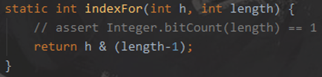

HashMap的源码看起来不难，但是理解代码思想挺难的(即为啥作者要这样设计)而且JDK8的hashMap做了优化，具体是将链表在一定长度时转化为红黑树。不过JDK7的hashMap是标准的hash表实现，值得一看！

# 1.Hash冲突

Hash冲突的解决方法，比较出名的有四种：

(1)开放定址法(2)链地址法(3)再哈希法(4)公共溢出区域法

## 1.1.链地址法

这种方法的基本思想是将所有哈希地址为i的元素构成一个称为同义词链的单链表，并将单链表的头指针存在哈希表的第i个单元中，因而查找、插入和删除主要在同义词链中进行。

其优缺点：

1. 处理冲突简单，且无堆积现象，平均查找长度短。
2. 链表中的结点是动态申请的，适合构造表不能确定长度的情况。
3. 删除结点的操作易于实现。只要简单地删去链表上相应的结点即可。
4. 指针需要额外的空间，故当结点规模较小时，开放定址法较为节省空间。

## 1.2.开放地址法

这种方法的基本思想是一旦发生了冲突，就去寻找下一个空的散列地址(这非常重要，源码都是根据这个特性，必须理解这里才能往下走)，只要散列表足够大，空的散列地址总能找到，并将记录存入。

优缺点：

1. 容易产生堆积问题，不适于大规模的数据存储。
2. 散列函数的设计对冲突会有很大的影响，插入时可能会出现多次冲突的现象。
3. 删除的元素是多个冲突元素中的一个，需要对后面的元素作处理，实现较复杂。

# 2.设计思想

## 2.1.capacity要求2的幂次方?

HashMap要求容量capacity一定要为2的幂次方，这是因为在求哈希表的下标时，源码用的是与运算&，例如：



h就是key的散列码；length就是哈希表的容量capacity。从源码可以看到，它会将length-1后与h进行与运算。如果length为2的幂次方，例如16，将它减1后为15，二进制为：0000 1111，这样子不管h是何种值，与0000 1111求与运算，都可以充分地分配到不同的桶，示例计算如下：

**第一种：**

1111 0111 1010 0000 1101 0001   &    0000 0000 0000 0000 0000 1111

值为0001，表示落到table[1]这个桶

**第二种：**

1001 0011 1110 0110 1101 1001  &    0000 0000 0000 0000 0000 1111

值为1001，表示落到table[9]这个桶

...

...

可以看到，当capacity取值为2的幂次方时，当它减一后可以保证进行二进制计算时后面值都为1，这时落到哈希表哪个桶就可以由key来决定，尽可能避免hash冲突！

# 3.源码：JDK7

JDK7的hashMap实现就是：数组+链表

## 3.1.构造流程

### 3.1.1.核心属性

HashMap底层就是一个Entry数组：

```java
/**
 * 默认的Entry数组大小, 值为16
 */
static final int DEFAULT_INITIAL_CAPACITY = 1 << 4;

/**
 * 最大的Entry数组大小, 值为1073741824
 */
static final int MAXIMUM_CAPACITY = 1 << 30;

/**
 * 默认的加载因子, 用于扩容使用, 默认值为0.75
 */
static final float DEFAULT_LOAD_FACTOR = 0.75f;

/**
 * 表示一个空的Entry数组
 */
static final Entry<?,?>[] EMPTY_TABLE = {};

/**
 * 这个就是hashMap的底层数组, 默认情况下它等于上面的空数组
 */
transient Entry<K,V>[] table = (Entry<K,V>[]) EMPTY_TABLE;

/**
 * 表示key-value数据项的个数, 这个并不是Entry数组的大小, 它表示有效数据的个数
 */
transient int size;

/**
 * 表示hashMap的扩容临界值, 它等于 capacity * loadFactor. 当size大于此值时就会扩容
 */
int threshold;

/**
 * 加载因子, 由它算出 threshold 的值
 */
final float loadFactor;

/**
 * 使HashMap在Collection-view上的迭代器快速失败, 即ConcurrentModificationException
 */
transient int modCount;
```

### 3.1.2.构造方法

JDK7的hashMap有4个构造方法，其中最全的构造方法为：

```java
/**
 * @param  initialCapacity Entry数组的初始大小
 * @param  loadFactor       计算扩容临界值的加载因子
 */
public HashMap(int initialCapacity, float loadFactor) {
if (initialCapacity < 0)
    throw new IllegalArgumentException("Illegal initial capacity: " +
                                           initialCapacity);
    if (initialCapacity > MAXIMUM_CAPACITY)
        initialCapacity = MAXIMUM_CAPACITY;
    if (loadFactor <= 0 || Float.isNaN(loadFactor))
        throw new IllegalArgumentException("Illegal load factor: " +
                                           loadFactor);
// 赋值 负载因子, 然后暂时用 threshold 来保存Entry数组的大小
// (它会在初始化时与负载因子计算得到hashMap扩容的临界值)
this.loadFactor = loadFactor;
threshold = initialCapacity;
// init()方法默认没做任何实现
    init();
}
```

其它的构造方法就会使用hashMap内部定义的一些默认值去替代...

## 3.2.put流程

```java
public V put(K key, V value) {
	// 如果是第一次put(), 先初始化哈希表, 注意参数threshold就是构造的capacity大小
	if (table == EMPTY_TABLE) 
    inflateTable(threshold);
	// 如果key为空, 调用putForNullKey()方法, 将元素置放到table[0]的位置上
	if (key == null) 
    return putForNullKey(value);
	// 计算hash值
	int hash = hash(key);
	// 根据hash值求得Entry数组下标
	int i = indexFor(hash, table.length);
	// 判断当前key是否有存在于哈希表上.
	for (Entry<K,V> e = table[i]; e != null; e = e.next) {
    	Object k;
    	// 判断当前key是否已经保存在哈希表中, 判断的依据：
    	// 散列码(hash值)相等并且key相等(key相等可以是同一个对象或equal()为true)
    	if (e.hash == hash && ((k = e.key) == key || key.equals(k))) {
        	// 如果哈希表确实存在当前key, 用新值替换旧值, 返回旧值
        	V oldValue = e.value;
          e.value = value;
          e.recordAccess(this);
          return oldValue;
      }
  }
  modCount++;
	// 如果哈希表本身为空, 或者当前key未存入到哈希表中, 调用addEntry()方法
	addEntry(hash, key, value, i);
  return null;
}
```

### 3.2.1.inflateTable()

```java
// toSize就是构造方法指定的初始化容量大小capacity
private void inflateTable(int toSize) {
	// 将容量大小向上取整为临近的2的幂次方, 例如若容量大小为14, 则会取值为16.设计思想
	int capacity = roundUpToPowerOf2(toSize);
  // 根据 capacity 和 loadFactor 计算出哈希表扩容的临界值, 保存到 threshold 上
	threshold = (int) Math.min(capacity * loadFactor, MAXIMUM_CAPACITY + 1);
	// 创建出指定capacity大小的Entry数组
	table = new Entry[capacity];
	// 初始化哈希掩码值, 暂时不知用处
  initHashSeedAsNeeded(capacity);
}

```

### 3.2.2.putForNullKey()

```java
private V putForNullKey(V value) {
	// 这个循环有点意思, 省了很多判断(提示：table就是Entry数组)
	// 1.首先取到Entry数组下标为0的元素
	// 2.判断这个元素是否为null, 若为null循环就不会进入了
	// 3.每次循环都取当前Entry的下一个节点
	for (Entry<K,V> e = table[0]; e != null; e = e.next) {
    	// 如果此循环能进来, 说明当前table[0]已经有数据(Entry)落在这个桶里了. 这边就得找出
   	 	// key == null 的Entry, 如果不为null, 说明是其它有值元素hash后落在table[0]的
    	if (e.key == null) {
          // 取出旧值
          V oldValue = e.value;
          // 将新值重新赋给Entry
          e.value = value;
          // 每次覆盖Entry的值都会调用此方法, hashMap默认没实现此方法
          e.recordAccess(this);
          // 返回旧值
          return oldValue;
    	}
  }
	// 用来在迭代器遍历中, 如果修改了数据可以实现快速失败
  modCount++;
	// 如果table[0]元素为null, 或者table[0]表示的链表中就没有key == null的Entry;
	// 调用addEntry()方法新增此元素, 其中：hash值计算结果和桶(Entry数组)的下标都为0.
  addEntry(0, null, value, 0);
	// 因为是新增, 旧值就为空, 所以这边直接返回null
   return null;
}
```

### 3.2.3.addEntry()

```java
/**
 * 扩容处理, 然后添加一个Entry
 * @param  hash 根据key求得的散列码(hash值)
 * @param  key 用户要put的键(key)
 * @param  value 用户要put的值(value)
 * @param  bucketIndex 要保存的桶(Entry数组)下标
 */
void addEntry(int hash, K key, V value, int bucketIndex) {
	// 如果哈希表的容量size大于等于 threshold, 并且当前桶不为空, 准备扩容
	if ((size >= threshold) && (null != table[bucketIndex])) {
  	// 扩容方法, 会创建一个新Entry数组, 容量为当前Entry数组的两倍.
  	resize(2 * table.length);
  	// 重新计算hash值, 重新计算桶下标
    hash = (null != key) ? hash(key) : 0;
    bucketIndex = indexFor(hash, table.length);
	}
  // 不管有没有扩容, 都创建一个新Entry
	createEntry(hash, key, value, bucketIndex);
}
```

### 3.2.4.createEntry()

```java
/**
 * 初始化一个新Entry, 将其添加到table中
 * 
 * @param  hash 根据key求得的散列码(hash值)
 * @param  key 用户要put的键(key)
 * @param  value 用户要put的值(value)
 * @param  bucketIndex 要保存的桶(Entry数组)下标
 */
void createEntry(int hash, K key, V value, int bucketIndex) {
    // 获取当前下标的Entry元素
		Entry<K,V> e = table[bucketIndex];
		// 创建一个新Entry, 注意它把原Entry放到新Entry的next节点上了.
		// 然后把新Entry放到table中, 即每次新增都会放到链表的最前方...
		table[bucketIndex] = new Entry<>(hash, key, value, e);
		// 容量自增
		size++;
}
```

## 3.3.扩容流程

当hashMap的容量size大于等于threshold，就会自动扩容

### 3.3.1.resize()

```java
void resize(int newCapacity) {
    // 如果旧的哈希表的容量已达最大值, 则将 threshold置为最大, 然后方法返回.
		Entry[] oldTable = table;
		int oldCapacity = oldTable.length;
    if (oldCapacity == MAXIMUM_CAPACITY) {
        threshold = Integer.MAX_VALUE;
        return;
    }
		// new 一个新的数组, 此数组大小是旧数组的2倍
		Entry[] newTable = new Entry[newCapacity];
		// 将旧Entry数组的数据移到新Entry数组中
		transfer(newTable, initHashSeedAsNeeded(newCapacity));
		// 将新数组赋值给 table 变量, 然后重新计算扩容临界值 threshold.
		table = newTable;
		threshold = (int)Math.min(newCapacity * loadFactor, MAXIMUM_CAPACITY + 1);
}
```

### 3.3.2.transfer()

```java
void transfer(Entry[] newTable, boolean rehash) {
	int newCapacity = newTable.length;
	// 遍历 Entry 数组, 取出每个Entry, 因为还有链表存在, 所以下面代码还有一个while循环
	for (Entry<K,V> e : table) {
    		// 循环条件是Entry不为空, 它每循环一次都会重新指向它的next节点直至为null
        while(null != e) {
        		// 先取出当前Entry的next节点
            Entry<K,V> next = e.next;
        		// 如若需要, 则重新计算key的散列码
            if (rehash) {
                e.hash = null == e.key ? 0 : hash(e.key);
            }
        		// 根据散列码求得落入Entry数组的下标.
            int i = indexFor(e.hash, newCapacity);
        		// 将Entry数组当前下标为i的元素赋值给 e 的next指针, 保证链表不断
        		// 这种设计很像：单链表反转的实现方案
            e.next = newTable[i];
        		// 然后将e 放到Entrye数组的i位置
            newTable[i] = e;
        		// 处理当前Entry的next节点
            e = next;
        }
    }
}
```

## 3.4.get流程

```java
public V get(Object key) {
   // key为null, 调用 getForNullKey() 取值
	 if (key == null) return getForNullKey();
   // key不为null, 调用getEntry()取值
   Entry<K,V> entry = getEntry(key);
   return null == entry ? null : entry.getValue();
}
```

### 3.4.1.getForNullKey()

```java
private V getForNullKey() {
    if (size == 0) {
        return null;
    }
    // 很好理解, 之前添加key==null的时候, 是放到table[0]的桶里, 所以取值的时候也是从
    // table[0]开始找, 只要发现有一个Entry的key为null, 便返回它的value
    for (Entry<K,V> e = table[0]; e != null; e = e.next) {
        if (e.key == null)
            return e.value;
    }
    return null;
}
```

### 3.4.2.getEntry()

大部分情况下，根据一个Key获取value的流程：

```java
final Entry<K,V> getEntry(Object key) {
	if (size == 0) {
        return null;
  }
  // 计算hash值
  int hash = (key == null) ? 0 : hash(key);
  // 先计算落在哪个桶, 然后开始链表循环, 这边就会引出一个问题, hash冲突严重就会导致
  // 链表过长, 这样在遍历的时候就会花费大量的时间....
  for (Entry<K,V> e = table[indexFor(hash, table.length)]; e != null;e = e.next){
    Object k;
    // 能匹配到的两个条件：1.hash值相等; 2.key值相等
    if (e.hash == hash && ((k = e.key) == key || (key != null && key.equals(k))))
        return e;
  }
  return null;
}
```

# 4.源码：JDK8

JDK8的hashMap实现相较于JDK7的多了如下优化：

1. hash算法的优化，JDK8变为了高16位和低16位异或；

2. 1.7中采用数组+链表，1.8采用的是数组+链表/红黑树，即在1.7中链表长度超过一定长度后就改成红黑树存储;

3. 链表的插入方式从头插法改成了尾插法：在1.7中采用表头插入法，在扩容时会改变链表中元素原本的顺序，以至于在并发场景下导致链表成环的问题；在1.8中采用尾部插入法，在扩容时会保持链表元素原本的顺序，就不会出现链表成环的问题了。

4. 1.7扩容时需要重新计算哈希值和索引位置，1.8并不重新计算哈希值，巧妙地采用和扩容后容量进行&操作来计算新的索引位置；

5. 在插入时，1.7先判断是否需要扩容，再插入，1.8先进行插入，插入完成再判断是否需要扩容；


。 


