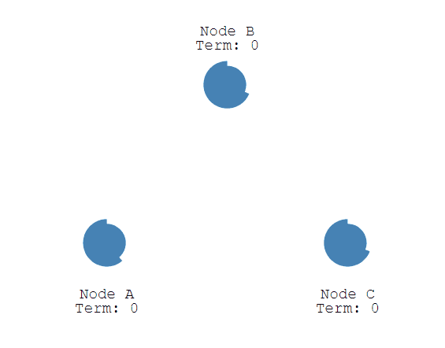
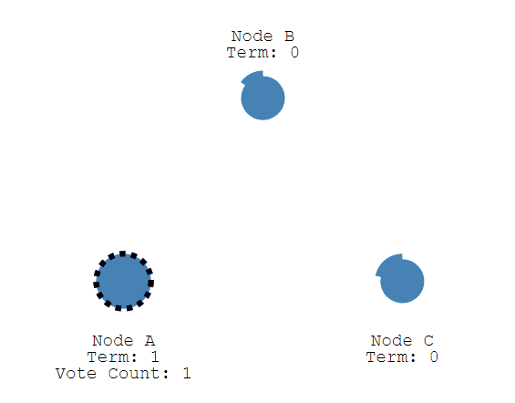
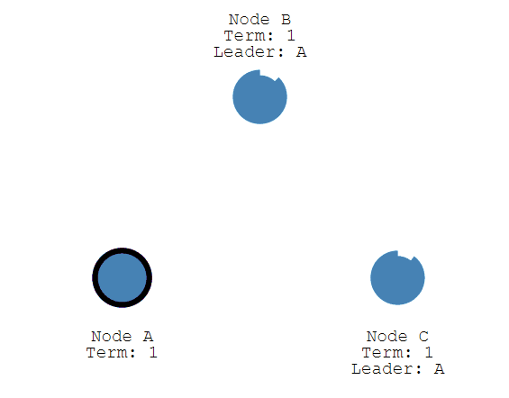
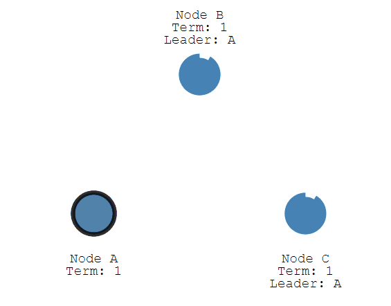
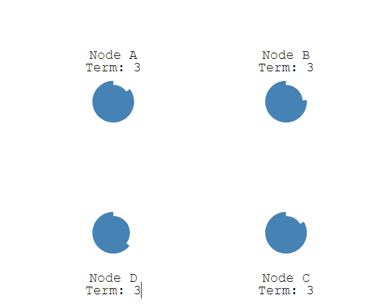
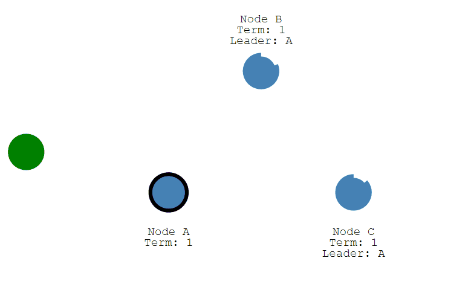
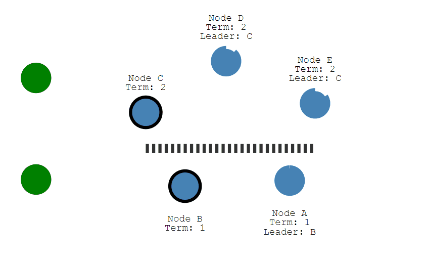

分布式共识算法（distributed Consensus）为了解决分布式环境中节点之间的数据一致性，衍生多个优秀的协议，诸如2PC、3PC、Paxos协议、Raft协议以及zookeeper专用的ZAB协议~

# 1.【Paxos协议】

Paxos算法是一种基于**消息传递**（分布式系统中的节点通信存在两种模型：共享内存（Shared memory）和消息传递（Messages passing））且具有高度容错特性的一致性算法，是目前公认的解决分布式一致性问题最有效的算法之一，但是它推导过程和证明过程太过复杂，这里就记录它的核心思想。在paxos算法中，定义了3个角色：Proposer、Acceptor和Learner，其中

1. Proposer：相当于议员，由它发起法案给Acceptor投票，它自己不参与投票;
2. Acceptor：相当于议会，接收Proposer的法案，进行投票；
3. Learner：既不发起法案也不参与投票，相当于会议的记录员。

也就是说，使用Paxos协议的分布式系统，在更改数据时候，都需要经过上面的一整套逻辑，完成每个操作需要至少两轮的消息交换 ，数据才能算更改成功。虽然严谨了，但是系统的复杂性提高了，且可用性降低了！

## 1.1.第一阶段

1. Proposer选择一个提案编号N，然后向半数以上的Acceptor发送编号为N的Prepare请求:

2. 如果一个Acceptor收到一个编号为N的Prepare请求，且N大于该Acceptor已经响应过的所有Prepare请求的编号，那么它就会将它已经接受过的编号最大的提案（如果有的话）作为响应反馈给Proposer，同时该Acceptor承诺不再接受任何编号小于N的提案。

## 1.2.第二阶段

1. 如果Proposer收到半数以上Acceptor对其发出的编号为N的Prepare请求的响应，那么它就会发送一个针对[N,V]提案的Accept请求给半数以上的Acceptor。注意：V就是收到的响应中编号最大的提案的value，如果响应中不包含任何提案，那么V就由Proposer自己决定；

2. 如果Acceptor收到一个针对编号为N的提案的Accept请求，只要该Acceptor没有对编号大于N的Prepare请求做出过响应，它就接受该提案

# 2.【Raft协议】

Raft是从paxos衍生出来的，它减少了paxos难以理解且难以实现的思想，是目前比较主流、使用广泛的共识算法。协同服务平台 etcd 和 Consul 都是使用的Raft算法，该算法中集群的节点有3种状态：

| **状态**  | **作用**                                                     |
| --------- | ------------------------------------------------------------ |
| Follower  | 接受并持久化Leader同步的日志，在Leader告之日志可以提交之后，提交日志 |
| Candidate | Leader选举过程中的临时角色                                   |
| Leader    | 接受客户端请求，并向Follower同步请求日志，当日志同步到大多数节点上后告诉Follower提交日志 |

## 2.1.概述

处于 raft 协议中的各个节点，**一开始都处于 Follower 状态**。当 Follower 没有收到 Leader 的心跳包时，它就会转变成 Candidate 状态，然后向集群中的其它节点发出投票请求（内容是选择它作为 Leader）。其它节点收到 Vote 请求后响应（内容是答应选择它作为 Leader），最终该节点就成为了 Leader，这一整个过程就称为 Raft协议的 Leader Election

当 Leader 节点选举成功后，后续对于数据更新的请求都会走到 Leader 节点上，每次更新都会作为一个条目保存到 Leader 的节点日志中。

- 当 client 向 Leader 发送【SET 5】请求时，Leader 执行请求但是不会提交（此时值未改变）；
- Leader 向它的 Follower 发送更新请求，Follower 收到更新后也不会提交，然后直接响应 Leader；
- Leader 收到大部分 Follower 响应后，就会提交日志，此时值在 Leader 节点中就已永久更新；
- 最后，Leader 向它的 Follower 发起提交日志请求， Follower 提交日志，整个集群重新处于一致性状态；
- 这一整个过程就叫做 Raft协议的 Log Replication。

## 2.2.Leader Election

在 Raft 协议中，有2个“超时”用来控制 Leader Election：

- election timeout：Follower 节点转变为 Candidate 状态的最大等待时间（150ms ~ 300ms）；
- HeartBeat timeout：Leader 与 Follower 心跳包交互的最大间隔时间；

**具体的选举过程如下所示：**

①当任意一个 Follower 达到 election timeout 时间就切换为 Candidate，然后开启一个新的选举任期：

②优先成为 Candidate 状态的节点（NodeA）会投自己一票，然后再向其它节点发出 Request Vote 请求。如果接收节点在这个任期内还没有投票，那么它就会投票给当前候选人，然后重置 election timeout。如果一个 Candidate 节点获取多数投票，它就成为 Leader。此时Node A 收到足够多的票数，它就成为这个选举任期的 Leader。

③ 成为 Leader 节点的 Node A 需要定时（heartbeat timeout设置）与它的 Follower 节点进行心跳包交互，一来是让 Leader 感知到 Follower的存在；二来是让 Follower 感知 Leader存在，然后重置自己的 election timeout。一旦 Follower 未收到 Leader 心跳包，然后它就会重新等待 election timeout 时间转变为 Candidate状态，开启新一轮的选举任期：

​	

④ 当 Leader 节点（Node A）宕机以后，其余 Follower 节点从未收到心跳包开始，经过 election timeout时间后，优先转变为 Candidate 状态的节点（Node C）发起新一轮的选举任期，同时它会投自己一票。同样的，其它Follower 节点收到 Vote 请求后会响应，当 C 收到足够多的票数后，它就成为新一任 Leader 节点（Term=2）

​	

⑤ 如果两个 Follower 节点的 Candidate tiemout时间恰巧一直，那么就可能出现分裂投票。节点B和D都开始同一个任期的选举，并且 election timeout 时间一样，这就导致节点B和D都各自收到2票，不满足最大票数，因此这两个节点都不能成为 Leader。那么，所有节点将等待新的选举并重试：

​	

## 2.3.Log Replication

当 Raft 集群选举出 leader 后，后续对这个集群的所有更新操作都要转发到 Leader 节点上，完成过程如下：

- clinet 发送数据更新给 Leader，即 Node-A；
- Node-A 收到 client 请求，将更改追加到它的日志上，注意日志未提交；
- Node-A 将这次改动同步给它的 Followers，一旦大多数 Follower 正确响应，那么此次更改就会被提交；
- Node-A 提交此次更改的日志，同时将结果响应给 client；
- Node-A 通知所有 Followers ，也让它们同样提交日志，此时整个集群又处于一致性状态。

log replication 的方式，同样适用于出现网络分区的异常情况。当出现网络分区时，节点A和B处于同一网络，节点BCD处于另一个网络。此时，整个raft集群被一分为二，并且由于 leader election 存在，最终会出现2个 Leader，如下图所示：

如果此时有多个客户端向这个 raft 集群交互（实际上它们已经一分为二，变为2个集群），那么一定会存在一个集群无法提交任务更新操作（因为它的 Follower数量不够），另一个集群由于存在足够数量的 Follower 节点，可以正常提交 commit log。当网络分区修复后，Node-B和Node-A都会收到来自Node-C的心跳请求，它们会发现Node-C的任期较高（Term=1），因此都会回滚其未提交的条目并匹配新 Leader 的日志（Node-B也会主动切换成 Follower 状态）

