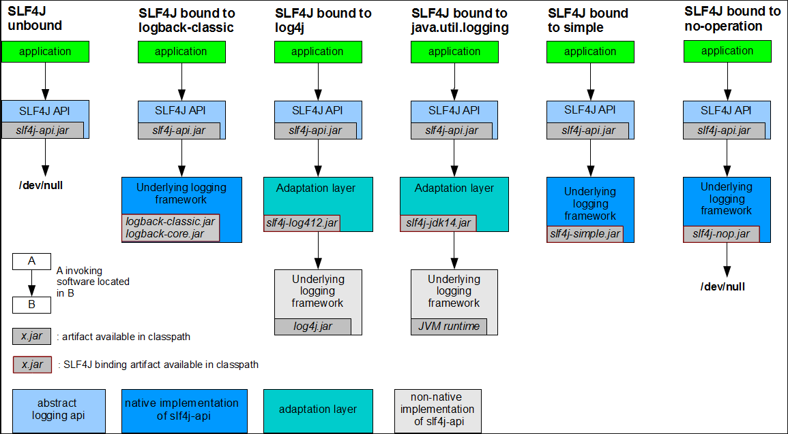
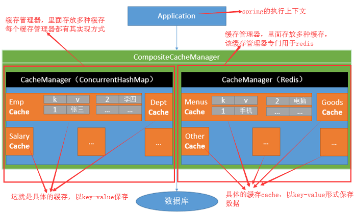
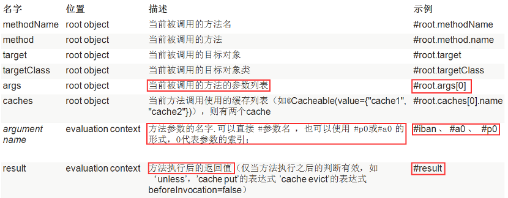
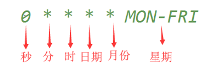
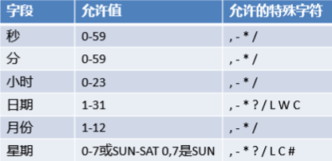
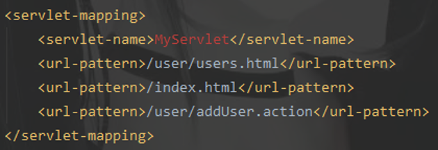
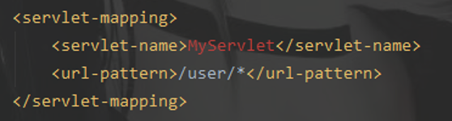
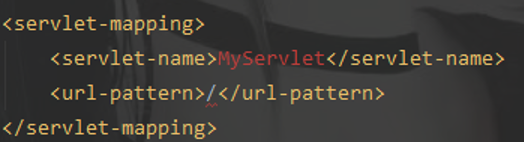
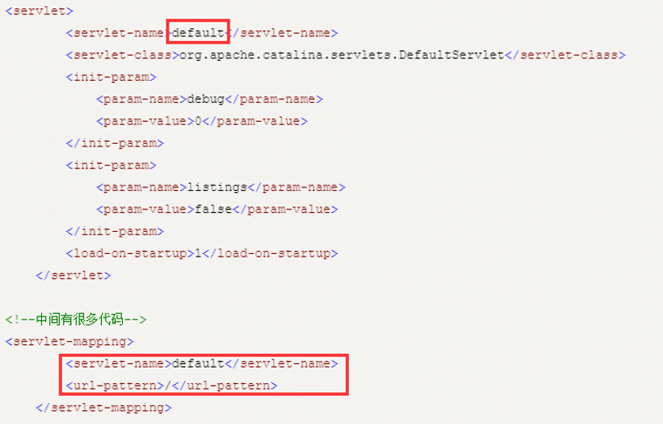

# 1.springBoot与配置文件

springBoot简化了大量的配置，但它自己也有一个配置文件，用来配置一些基本的属性。支持两种格式的配置文件，.properties文件和.yml文件，名称是固定的：application.properties或application.yml。放置在标准Maven过程的resources目录下（即）推荐使用.yml格式的配置文件

## 1.1.加载顺序

### 1.1.1.内部文件

springBoot启动会扫描以下位置的application.properties和application.yml作为springBoot的默认配置文件：

- -file:/config/ =>当前工程的config目录下优先级最高

- -file:/     =>当前工程的根目录下        优先级次高

- -classpath:/config/ =>类路径下的config目录下优先级一般

- -classpath:.     =>类路径下的根目录下优先级最低

以上按照从上到下，优先级从高到低，所有位置的配置文件都会被加载，形成"互补配置"，若遇到相同配置，高优先级的配置文件内容会覆盖掉低优先级的配置文件内容，-file:/config/路径下的配置文件优先级最高。

  springBoot在配置文件加载这块帮运维考虑了许多，当项目打包后，如果有配置需要更改，不用到源码中重新更改再次打包，而是创建新配置文件，通过"spring.config.location"指定新配置文件，springBoot会将它与默认配置一起加载，将它们的配置融合成一个完整的配置。

### 1.1.2.外部文件

这些所有配置会形成互补配置...包括与内部默认配置文件一起

- 命令行参数，多个配置用空格分爱，--配置项=值
- 来自java:comp/env的JNDI属性
- Java系统属性（System.getProperties()）
- 操作系统环境变量
- RandomValuePropertySource配置的random.*属性值
- jar包外部的application-{profile}.properties或application.yml(带spring.profile)配置文件
- jar包内部的application-{profile}.properties或application.yml(带spring.profile)配置文件
- jar包外部的application.properties或application.yml(不带spring.profile)配置文件
- jar包内部的application.properties或application.yml(不带spring.profile)配置文件
- @Configuration注解类上的@PropertySource
- 通过SpringApplication.setDefaultProperties指定的默认属性

## 1.2.多环境支持

使用spring.profile可以指定springBoot使用不同的配置文件，这样可以让工程区分开为开发环境、测试环境、生产环境...

### 1.2.1.prop方式

使用application.properties文件时，每一个环境需要一个.properties文件，命名规范为：application-${profile}.properties。

### 1.2.2.yml方式

当使用application.yml文件就不需要像.prop文件那样创建多个，yml文件有个特性，叫做"文档块"，使用“---”来区分，一条“---”将一个yml文件一分为二，两个文档块互不干扰，两条就分为三个文档块，以此类推。

### 1.2.3.切换profile

- 通过配置文件切换：spring.profiles.active=dev

- 通过参数args切换：在启动项目时，添加运行参数：--spring.profiles.active=dev

- 通过JVM参数配置，添加JVM运行配置：-Dspring.profiles.active=dev

# 2.springBoot与日志

日志框架分为"日志接口"和"日志实现"，使用日志接口框架来开发，是为了可以使用不同的日志实现框架。"日志接口"有slf4j和Apache-commons-logging；"日志实现"有Log4j、Log4j2、Logback等。Log4j是Apache最早推出的日志框架，而Log4j2是对Log4j的大升级。Logback和slf4j是出自同一个人，所以它们可以无缝衔接，推荐使用slf4j开发，灵活高效。

## 2.1.选择日志框架

slf4j官网给出的[示意图](https://www.slf4j.org/images/concrete-bindings.png)，提示slf4j与日志实现框架搭配时要导入的jar包：

- 只导入slf4j.jar，日志框架不起作用

- 使用logback，导入slf4j.jar和logback.jar

- 使用log4j和slf4j，导入log4j.jar、slf4j.jar、slf4j-log.jar因为log4j没有实现slf4j，所以搭配使用时，需要一个中间层适配

- 使用JUL和slf4j，导入slf4j.jar和slf4j-jdk.jar。因为JUL是JDK自带的日志框架，也没有实现slf4j，因此也需要一个中间层适配

- 使用slf4j简单实现框架，导入slf4j.jar和slf4j-simple.jar



在代码中，使用slf4j的接口，不要使用具体实现类的接口。例如：但是，每一个日志实现框架都有自己的配置文件，在使用slf4j开发后，配置文件还是要用日志实现框架本身的配置文件，毕竟日志输出最终是由实现类完成！

## 2.2.统一日志框架

何为日志框架统一？一个项目可能用到spring、可能用到hibernate、又或者是mybatis、shiro...等其它框架，而这些框架底层使用的日志框架可能不一样，如spring底层使用Apache-commons-logging，而hibernate使用jboss-logging...，这样导致了一个项目中的日志框架杂乱无章。既然要使用slf4j，就需要将这些日志框架统一，全部改为使用slf4j来实现，为此，slf4j官网也给出一个[示意图](https://www.slf4j.org/images/legacy.png)：


slf4j官方提供的jar包，如jcl-over-slf4j.jar与commons-loggin.jar具有相同的接口的实现类，只不过jcl-over-slf4j.jar的实现逻辑是去调用slf4j的API，然后再由slf4j的实现框架(如logback)或整合框架(如log4j)来完成日志记录。总之，要统一日志框架，可以执行下面3个步骤：

1. 将项目中其他日志框架排除，不再导入

2. 使用slf4j官方提供的jar包来替换原有的日志框架

3. 导入slf4j的其他实现

至于如何使用slf4j的其他实现，就回到选择一节：logback可以无缝衔接，而使用log4j实现，则需要导入中间包slf4j-log4j.jar...等等

# 3.springBoot与mvc

springBoot对web开发支持全在：WebMvcAutoConfiguration自动配置类中

## 3.1.静态资源映射

springBoot对静态资源的映射分为两种：

- 别人写好的类库，如：jQuery、Vue、React、Bootstrap，用webjars引入

- 本地自己写的JS或CSS

WebMvcAutoConfiguration类的addResourceHandlers()实现映射静态资源

### 3.1.1.静态资源目录

静态资源目录是用来存放js、css、html页面...，springBoot默认设置了4个静态资源目录，如下：

```java
private static final String[] SERVLET_RESOURCE_LOCATIONS = { "/" };
private static final String[] CLASSPATH_RESOURCE_LOCATIONS = {
"classpath:/META-INF/resources/", "classpath:/resources/",
"classpath:/static/", "classpath:/public/" };
```

这些默认的映射路径是由ResourceProperties类控制的，@ConfigurationProperties注解让ResourceProperties类的成员变量与application.yml配置文件绑定，因此，如果需要自定义静态资源的映射路径，需要在application.yml中指定：spring.resources.static-locations

### 3.1.2.webjars映射

对于别人写好的类库，springBoot是借助[webJars](https://www.webjars.org/)来管理的，而webJars将前端JS库或CSS库打成jar包，通过maven使用pom文件就可以引入，如：

```xml
<dependency>
    <groupId>org.webjars</groupId>
    <artifactId>jquery</artifactId>
    <version>3.3.1-1</version>
</dependency>
```

springBoot对以webJars引入的资源文件的映射，默认是到：类路径下/META-INF/resources/webJars/目录下查找:

```java
registry.addResourceHandler("/webjars/**")
      .addResourceLocations("classpath:/META-INF/resources/webjars/")
```

将springBoot启动，在地址栏输入：http://localhost:8080/webjars/jquery/3.3.1-1/jquery.js即可访问(springBoot检测到URL地址带有"webjars"字样，就启动对webjars的映射配置，将URL后缀"jquery/3.3.1-1/jquery.js"跟之前配置好的映射结合去查找，能找到就返回，不能找到就报404)

### 3.1.3.本地文件映射

WebMvcAutoConfiguration类的addResourceHandlers()方法除了实现对以webJars方式引入的静态资源的自动映射，还配置了由本地自己创建的静态资源的映射：

```java
registry.addResourceHandler(staticPathPattern).addResourceLocations(
	this.resourceProperties.getStaticLocations())
```

其中，staticPathPattern是对URL前缀的定义，符合此前缀而且没有任何springmvc处理器映射器响应，springBoot都当做静态资源来处理，这个变量的值为：

```java
private String staticPathPattern = "/**";
```

所以，springBoot默认是将"/"下没有任何Controller映射的URL地址当做静态资源处理，它映射的路径为配置好的[静态资源目录](#3.1.1.静态资源目录)。也就是说，只要将本地创建的JS或CSS...等其它静态资源文件放到静态资源目录下，springBoot都可以直接映射到。由于创建springBoot项目的时候，默认会自动生成resources源文件夹，为了方便管理，习惯再创建一个static目录，将静态资源放到该目录下。

需要访问my.js，只要在项目启动后，在地址栏输入：http://localhost:8080/my.js，(springBoot以"/**"匹配URL地址，获取my.js，在springmvc的处理器映射表中找不到对应的映射，就以静态资源的方式处理my.js，将它与静态资源目录的路径结合，当使用"classpath:/static/my.js"能够映射得到，它就将my.js返回，否则报错404)

### 3.1.4.首页映射

springBoot对项目的欢迎页也做了自动映射处理，映射URL是"/**"默认映射路径是静态资源目录下的index.html。(前提是application.yml没指定静态资源映射路径)所以如果需要修改项目的首页，只要将首页改名为index.html，放到静态资源映射目录中即可。在项目启动后，地址栏输入：http://localhost:8080/即可访问首页。

当然，如果想自定义首页的位置，则需要在application.yml先配置好静态资源映射路径，将index.html放到这些路径下某个文件夹即可。再如果，首页名不想叫index.html，则需要扩展springmvc，给它添加视图映射。

## 3.2.模板引擎

模板引擎是什么？如下图所示，黑色椭圆部分即为模板引擎：


它将页面和数据分离开，用它规定的表达式映射数据，以便动态展示数据。当将模板写好、数据封装好，模板引擎会解析并生成最终的HTML页面。springBoot推荐thymeleaf模板引擎，它可以完全替代掉JSP模板引擎。、thymeleaf模板引擎的默认页面跳转前缀和后缀如下所示：

```java
public static final String DEFAULT_PREFIX = "classpath:/templates/";
public static final String DEFAULT_SUFFIX = ".html";
```

### 3.2.1.返回视图页面

**在没有模板引擎情况下，无法直接在Controller返回自定义路径的静态页面。**在springMVC中，我们返回静态页面只需要配置好视图解析器的前缀prefix和后缀suffix，然后在Controller中定义页面名称即可。但是在springBoot中，要分情况配置：

- 不引入thymeleaf，想返回静态页面，只能将页面放在静态资源目录下。任何自定义的前缀prefix和后缀suffix都没有任何效果；

- 引入thymeleaf，那配置就和springMVC一样，配置好前缀和后缀，直接返回页面名称，在springBoot工程，大部分用的是HTML，很少用JSP。

```yaml
spring:
  thymeleaf: #注意是配置thymeleaf的前缀和后缀
    prefix: classpath:/page/
    suffix: .html
```

不过，现在都是前后端分离，springBoot用来处理后台数据的，页面跳转都由前端来控制。

### 3.2.2.thymeleaf引入

在pom.xml文件中添加，thymeleaf的starters即可：

```xml
<dependency>
    <groupId>org.springframework.boot</groupId>
    <artifactId>spring-boot-starter-thymeleaf</artifactId>
</dependency>
```

可能是springBoot是1.x版本，springBoot引入的thymeleaf版本偏低，只为2.x版本，若想更换thymeleaf为更高版本，在pom.xml中的properties属性中添加：

```xml
<properties>
 <!--springBoot自带的thymeleaf版本太低，通过maven的properties属性，来设置更高版本-->
 <thymeleaf.version>3.0.9.RELEASE</thymeleaf.version>
 <thymeleaf-layout-dialect.version>2.3.0</thymeleaf-layout-dialect.version>
</properties>
```

### 3.2.3.thymeleaf语法

在<html>标签中添加thymeleaf的声明，这样使用时会有代码提示：

```html
<html xmlns:th="http://www.thymeleaf.org">
```

#### 3.2.3.1.标准表达式

thymeleaf的表达式不像JSP，可以单独输出，它们都需要与th标签相结合后，才可以起作用：

- 变量表达式，语法：${}，与th标签搭配，获取后端传过来的变量

  ```html
  <input th:value="${map.name}" style="width: 55px;"/>
  ```

- 星号表达式，语法：\*{}，用法与变量表达式一模一样，唯一区别：${}映射的是全局的上下文，*{}映射的是父级标签的上下文，与th:object连用

  ```html
  <label th:text="${msg}"></label>
  ```

- 国际化表达式，语法：#{}，允许从外部源(如:.properties)文件中检索特定于语言环境的消息

  ```html
  <input th:value="#{header.address.country}"/>
  ```

- URL表达式，语法：@{}，它会自动加上当前项目的根路径，例如：项目根路径为app，使用下面语法，thymeleaf会解析成：/app/hello

  ```html
  <input th:value="@{/hello}"/>
  ```

- 片段表达式，语法：~{}

#### 3.2.3.2.th标签

thymeleaf模板引擎的标签全是以th开头的，形如th:text。它有非常多的标签，下面只记录常用的标签，更多标签信息查看[官方文档](https://www.thymeleaf.org/doc/tutorials/3.0/usingthymeleaf.html#introducing-thymeleaf)。当"th:"与原生HTML属性结合时，可以替换掉原生的HTML属性，例如：\<div id='d1' th:id='d2'>，经过thymeleaf渲染后，div的id属性为d2。

#### 3.2.3.3.内置对象

使用thymeleaf内置对象，需要在表达式中加上" # "。它有多种内置对象：基本的上下文内置对象、web环境内置对象、工具类内置对象...

①基本上下内置对象

| 对象    | 说明                                                         |
| ------- | ------------------------------------------------------------ |
| #ctx    | ctx对象继承org.thymeleaf.context.IContext或者org.thymeleaf.context.IWebContext，取决于当前环境是不是web环境。  如果程序集成了spring，那么将会是org.thymeleaf.spring[3\|4].context.SpringWebContext |
| #var    | 即${#ctx.variables}，访问VariablesMap所有上下文中的变量      |
| #locale | 即${#ctx.locale}，java.util.Locale对象的访问                 |

②web环境内置对象

| 对象名          | 说明                      |
| --------------- | ------------------------- |
| #request        | 即HttpServletRequest对象  |
| #response       | 即HttpServletResponse对象 |
| #session        | 即HttpSession对象         |
| #servletContext | 即ServletContext对象      |

例如，使用thymeleaf获取当前项目的根路径可以是：${#request. getContextPath()}或者

${#servletContext.getContextPath()}

③工具类内置对象（部分）

| 对象名      | 说明                             |
| ----------- | -------------------------------- |
| #dates      | java.util.Date对象               |
| #calendars  | java.util.Calendar对象           |
| #numbers    | 为数值型对象提供工具方法         |
| #strings    | 为String 对象提供工具方法        |
| #objects    | 为object 对象提供常用的工具方法  |
| #bools      | 为boolean 对象提供常用的工具方法 |
| #arrays     | 为arrays 对象提供常用的工具方法  |
| #lists      | 为lists对象提供常用的工具方法    |
| #sets       | 为sets对象提供常用的工具方法     |
| #maps       | 为maps对象提供常用的工具方法     |
| #aggregates | 在数组或集合上创建聚合的方法     |
| #uris       | 用于转义URL / URI部分的方法      |
| #ids        | 处理可能重复的id属性的方法       |

## 3.3.扩展springmvc

springBoot对springmvc已经做了大量的自动配置，所有配置都在org.springframework.boot.autoconfigure.web.WebMvcAutoConfiguration类中但是，如果需要添加额外的功能，比如：拦截器配置、资源映射、全局异常处理...就需要扩展springmvc，甚至某些情况下，需要由开发者全线配置springmvc，这时候就不要让springBoot对springmvc自动配置了。

### 3.3.1.部分订制

使用@Configuration和WebMvcConfigurer。需要我们新建一个类实WebMvcConfigurer接口，并在该类上使用@Configuration注解

```java
@Configuration
public class ExpandConfig implements WebMvcConfigurer 
```

因为 WebMvcConfigurer接口的方法都带了Java8的新特性---default，它可以让接口方法有默认实现，而接口实现类在需要时才重写它的默认实现。所以，要扩展springmvc的哪个功能，只要重写WebMvcConfigurer相应的方法即可。例如：

- 扩展拦截器

  ```java
  @Override
  public void addInterceptors(InterceptorRegistry registry) {
      /* 1.先实例化我们的自定义拦截器类 */
      MyInterceptor interceptor = new MyInterceptor();
      /* 2.将我们自定义的拦截器类添加到注册器中 */
      registry.addInterceptor(interceptor);
  }
  ```

- 扩展视图映射

  ```java
  @Override
  public void addViewControllers(ViewControllerRegistry registry) {
      /*
       * 引入thymeleaf的依赖，会自动将视图映射的前缀配置成classpath:template/以及后缀配置
       * 成.html.所以我们在添加视图的时候，只要指定html页面的名字即可(前提是页面需要放到
       * template目录下)
       */
      registry.addViewController("/").setViewName("index");
  }
  ```

### 3.3.2.全量订制

springMVC扩展时，不要添加`@EnableWebMvc`注解。因为该注解是springBoot用于让用户全面控制springmvc时使用的，意味着springBoot对mvc的自动配置全都失效。

## 3.4.国际化

springBoot的国际化还是基于springmvc的国际化处理的，如果忘记了请翻一翻springmvc笔记。处理国际化需求需要理清几个概念：

1. Locale：Java封装的区域信息对象

2. LocaleResolver：spring封装用于获取Locale对象

3. 国际化配置文件：login_en_CN.properties，login是自定义的名称，en是语言编码，CN是国家代号。

### 3.4.1.自动配置

springBoot的自动配置已经帮助我们处理好了国际化配置，是由两个类来完成：MessageSourceAutoConfiguration和WebMvcAutoConfiguration

第①个自动配置了ResourceBundleMessageSource对象，用于管理国际化配置文件：

第②个自动配置了AcceptHeaderLocaleResolver对象，用于获取区域信息对象，默认是以请求头Request携带的区域信息来区分。

### 3.4.2.自定义配置

如果要自定义配置国际化组件，只要把springBoot自动配置的组件替换成我们自己定义的即可(这是使用springBoot的一个重要思想)。

1. 定义自己的MessageSource

   ```java
   @Bean
   public MessageSource messageSource() {
       ReloadableResourceBundleMessageSource messageSource = 
   	new ReloadableResourceBundleMessageSource();
   messageSource.setBasename("classpath:i18n/login");
       return messageSource;
   }
   ```

2. 定义自己的LocaleResolver，要实现LocaleResolver接口，实现resolveLocale方法

   ```java
   public class MyLocaleResolver implements LocaleResolver {
   @Override
       public Locale resolveLocale(HttpServletRequest request) {
           // 通过request内的参数判断区域信息
           String localeParam = request.getParameter("lang");
           Locale locale = Locale.getDefault();
           if( !StringUtils.isEmpty( localeParam )){
               if( "zh".equals(localeParam) ){
                   // 如果是中文，创建中文的区域对象信息
                   locale = new Locale("zh","CN");
               }else if( "en".equals( localeParam ) ){
                   // 如果是英文，创建英文的区域对象信息
                   locale = new Locale("en","US");
               }
           }
           return locale;
       }
   }
   ```

3. 将自定义的LocaleResolver注册到IOC容器中

   ```java
   @Bean
   public LocaleResolver localeResolver(){
       return new MyLocaleResolver();
   }
   ```

4. 这样页面只要过传递参数"lang"就可以改变语言

   ```html
   <a class="btn btn‐sm" th:href="@{/change(lang='zh',a='zz')}">中文</a>
   <a class="btn btn‐sm" th:href="@{/change(lang='en')}">English</a>  
   ```

## 3.5.异常处理

### 3.5.1.错误处理机制

springBoot的错误机制有点绕，逐渐完善吧：

①错误处理自动配置类：ErrorMvcAutoConfiguration

②自动配置类中重要的组件：

- ErrorPageCustomizer

- BasicErrorController

- DefaultErrorViewResolver

- DefaultErrorAttributes

#### 3.5.1.1.ErrorPageCustomizer

ErrorPageCustomizer是ErrorMvcAutoConfiguration配置类中的静态内部类。它有一个registerErrorPages()方法用来注册错误页面，当系统出现错误时，会转发到"/error"路径进行处理。类似于ssm框架在web.xml中对错误页面的订制规则一样

#### 3.5.1.2.BasicErrorController

发生错误后，系统默认将请求转发到"/error"，由BasicErrorController处理这个"/error"。BasicErrorController本身就是一个Controller，它的映射路径为`${server.error.path:${error.path:/error}}`

```java
@Controller
@RequestMapping("${server.error.path:${error.path:/error}}")
public class BasicErrorController extends AbstractErrorController {
    
}
```

BasicErrorController中，带有@RequestMapping注解的方法只有两个，它们是对默认错误请求"/error"的处理方法，根据请求头携带的信息判断它是浏览器发起的请求还是测试工具发起的请求，对应处理方法为errorHtml()、error()。方法里面除了解析错误视图地址外，还在Request作用域中为错误页面，添加了错误信息内容下图中的Map<String,Object> model，这些错误信息内容由DefaultErrorViewResolver来封装

```java
@RequestMapping(produces = MediaType.TEXT_HTML_VALUE)
public ModelAndView errorHtml(HttpServletRequest request, HttpServletResponse response) {
    HttpStatus status = getStatus(request);
    Map<String, Object> model = Collections
        .unmodifiableMap(getErrorAttributes(request, isIncludeStackTrace(request, MediaType.TEXT_HTML)));
    response.setStatus(status.value());
    ModelAndView modelAndView = resolveErrorView(request, response, status, model);
    return (modelAndView != null) ? modelAndView : new ModelAndView("error", model);
}

@RequestMapping
public ResponseEntity<Map<String, Object>> error(HttpServletRequest request) {
    HttpStatus status = getStatus(request);
    if (status == HttpStatus.NO_CONTENT) {
        return new ResponseEntity<>(status);
    }
    Map<String, Object> body = getErrorAttributes(request, isIncludeStackTrace(request, MediaType.ALL));
    return new ResponseEntity<>(body, status);
}
```

发生系统错误时，BasicErrorController根据Request的请求头信息，判断调用那个错误处理方法，所以这就让浏览器请求的看到错误页面，让测试工具等客户端请求的看到错误JSON信息。首先看errorHtml()方法，理解它是怎么将错误信息返回到错误页面上。errorHtml()的返回值是一个modelAndView对象，由它来转发页面和返回错误信息，而它是由AbstractErrorController类的resolveErrorView()方法生成：

#### 3.5.1.3.DefaultErrorViewResolver

springBoot的ErrorViewResolver接口有个默认实现类，由它来解析错误请求，即：DefaultErrorViewResolver。通过该类的resolveErrorView()方法解析，而resolveErrorView()方法又调用resolve()来解析：

```java
@Override
public ModelAndView resolveErrorView(HttpServletRequest request, HttpStatus status, Map<String, Object> model) {
    ModelAndView modelAndView = resolve(String.valueOf(status.value()), model);
    if (modelAndView == null && SERIES_VIEWS.containsKey(status.series())) {
        modelAndView = resolve(SERIES_VIEWS.get(status.series()), model);
    }
    return modelAndView;
}

private ModelAndView resolve(String viewName, Map<String, Object> model) {
    String errorViewName = "error/" + viewName;
    TemplateAvailabilityProvider provider = this.templateAvailabilityProviders.getProvider(errorViewName,
                                                                                           this.applicationContext);
    if (provider != null) {
        return new ModelAndView(errorViewName, model);
    }
    return resolveResource(errorViewName, model);
}
```

DefaultErrorViewResolver将视图地址设置为"error/"+"错误码"的格式，例如：/error/404。然后判断当前系统的模板引擎是否可用，如果可以使用，则直接实例化ModelAndView对象，将其交由模板引擎处理；如果模板引擎不可用，那么调用resolveResource()方法自己解析。

**总结：**

- 如果系统存在模板引擎，例如thymeleaf。则在/template/error/目录下创建对应的错误状态码页面，例如：/thymeleaf/error/404.html。

- 如果系统不存在模板引擎，则在静态资源文件下创建/error目录，同样创建对应的错误状态码页面，例如/static/error/404.html。

#### 3.5.1.4.DefaultErrorAttributes

DefaultErrorAttributes实现了ErrorAttributes接口，它里面的`getErrorAttributes()`在BasicErrorController中的`errorHtml()`方法中被调用，可以将发生错误的信息添加到Request作用域里面，返回给错误页面使用：

```java
@Override
public Map<String, Object> getErrorAttributes(WebRequest webRequest, boolean includeStackTrace) {
    Map<String, Object> errorAttributes = new LinkedHashMap<>();
    errorAttributes.put("timestamp", new Date());
    addStatus(errorAttributes, webRequest);
    addErrorDetails(errorAttributes, webRequest, includeStackTrace);
    addPath(errorAttributes, webRequest);
    return errorAttributes;
}
```

**总结：**错误页面可以取到的数据有：

①timestamp：时间戳

②status：状态码

③error：错误提示

④exception：异常对象

⑤message：异常消息

⑥errors：JSR303数据校验的错误

### 3.5.2.异常处理配置

#### 3.5.2.1.全局异常处理

服务器异常处理，由于系统内部程序发生错误导致的异常，常见为5xx的错误状态码，例如500。需要配置一个全局异常处理器，统一处理这些异常。**注意：**被全局异常处理器捕获到，如果没有转发到"/error"，就不会再执行springBoot的错误处理机制。意味着可以自定义异常返回信息。

springBoot的全局异常处理器，其实就是一个Controller。配置很简单，只需要创建一个类，用注解@ControllerAdvice标注它；然后类中创建一个方法，用注解@ExceptionHandler标注，指定需要捕获的异常：

```java
@ControllerAdvice
public class ExceptionController {
    /**
     * {@link ExceptionHandler}注解指定要捕获的异常
     * 在方法内部实现对异常的处理逻辑
     */
    @ExceptionHandler(Exception.class)
    public ModelAndView globalExceptionHandler(HttpServletRequest request,
                                               Exception e){
        ModelAndView mv = new ModelAndView();
        mv.addObject("msg",e.getMessage());
        mv.setViewName("/error/500");
        return mv;
    }
}
```

**说明：**

①@ControllerAdvice：用于定义全局异常处理类；

②@ExceptionHandler：指定自定义错误处理方法拦截的异常类型；

③同一个异常被小范围的异常类和大范围的异常处理器同时覆盖，会选择小范围的异常处理器

**注意：**

- 全局异常处理，只能捕获Controller抛出的异常，而对于Service层和Dao层的异常，它捕获不了，因此需要手动将Service层和Dao层的异常向上抛，抛给Controller层处理。

- 全局异常处理，只能处理项目内部程序运行出错的异常，对于404这种错误，根本就没到Controller层，因此它处理不了，需要配置相应的错误页面

#### 3.5.2.2.错误页面订制

对于系统程序内部的错误，可以使用全局异常处理器捕获，但是对于404这种url资源映射错误的异常，我们自定义的全局异常处理器就无法捕捉到(因为根本没有达到Controller层)，此时springBoot的错误处理机制就起作用。

**有三种情况：**

1. 如果springBoot工程中存在thymeleaf模板引擎，则默认在template/error/目录下存放对应错误状态码的页面，例如404.html等，发生此状态码的错误就会来到对应的页面。如果对thymeleaf模板引擎配置了资源目录，就在该目录下创建error目录，然后再向其中添加错误页面即可。
2. 如果没有模板引擎，则在静态资源目录下找诸如400.html这样的错误页面
3. 上都找不到错误页面，默认来到springBoot的错误页面

#### 3.5.2.3.订制错误数据

springBoot对错误信息返回作了自适应处理，页面请求出错，返回错误页面；ajax请求出错，返回JSON信息。因此，若我们自己系统也想做到这种自适应异常处理，可以借助springBoot。

通过对springBoot的错误处理机制分析，它是映射了"/error"请求，只要我们自定义的全局异常处理器，转发到"/error"，就能启动springBoot的错误处理机制，也就可以实现自适应效果。但是，springBoot返回的错误数据是固定的，由上面源码分析，springBoot是从DafaultErrorAttributes封装错误数据。如果我们想自定义自己的错误数据，实现它改写方法逻辑即可。

## 3.6.嵌入式servlet容器

### 3.6.1.内置Servlet容器

#### 3.6.1.1.配置servlet容器

springBoot有两种修改嵌入式servlet容器配置的方式，一种是实现WebServerFactoryCustomizer接口并将其注入到IOC容器中；另一种是修改application.yml配置文件。

- 通过配置文件修改servlet容器配置：

- 实现EmbeddedServletContainerCustomizer接口并注入到IOC容器中

#### 3.6.1.2.自定义Servlet

springBoot中可以自定义Servlet，通过ServletRegistrationBean类。分为两步骤：

1. 实现HttpServlet接口，定义自己的Servlet

   ```java
   public class MyServlet extends HttpServlet {
       @Override
       protected void doPost(HttpServletRequest req, HttpServletResponse res){
           res.getWriter().print("my servlet process...自定义的Servlet生效了");
       }
       ...
   }
   ```

2. 实例化ServletRegistrationBean对象，通过它注册自己的Servlet到springBoot的内嵌Servlet容器中，并将它作为组件添加到IOC容器中：

   ```java
   @Bean(name = "servletRegistrationBean")
   public ServletRegistrationBean<MyServlet> myServletRegister() {
       ServletRegistrationBean<MyServlet> servletRegistrationBean = 
   	new ServletRegistrationBean<>();
       // 注册自定义的Servlet
       servletRegistrationBean.setServlet(new MyServlet());
       // 添加自定义Servlet，要映射的URL地址
       servletRegistrationBean.setUrlMappings(Arrays.asList("/servlet"));
       // 若对自定义的servlet有额外配置，可以通过setInitParameters()传递配置，
       // 该方法接收一个Map<String,String>参数
       Map<String, String> servletConfig = new HashMap<>();
       servletRegistrationBean.setInitParameters(servletConfig);
       return servletRegistrationBean;
   }
   ```

#### 3.6.1.3.自定义Filter

springBoot中可以定义拦截器Filter，通过FilterRegistrationBean注册类，分为两步骤：

1. 实现Filter接口实现自己的Servlet过滤器：

   ```java
   public class MyFilter implements Filter {
       @Override
       public void doFilter(ServletRequest request, ServletResponse response, 
                            FilterChain chain) {
           // 监听器执行过滤的时候，执行的逻辑
           System.out.println("my filter process....自定义的过滤器生效了!");
           // doFilter()的意思是放行，不放行后面的逻辑执行不到
           chain.doFilter(request,response);
       }
   ```

2. 实例化FilterRegistrationBean对象，通过它注册自己的Filter到 springBoot内嵌的Servlet容器中，并将它作为组件添加到IOC容器中：

   ```java
   @Bean(name = "filterRegistrationBean")
   public FilterRegistrationBean<MyFilter> myFilterRegister() {
       FilterRegistrationBean<MyFilter> filterRegistrationBean = 
           new FilterRegistrationBean<>();
       // 注册自定义的Filter
       filterRegistrationBean.setFilter(new MyFilter());
       // 添加自定义的Filter需要过滤的url地址
       filterRegistrationBean.setUrlPatterns(Arrays.asList("/filter"));
       // 也可以指定需要过滤的Servlet
       // filterRegistrationBean.setServletNames();
       return filterRegistrationBean;
   }
   ```

#### 3.6.1.4.自定义Listener

springBoot可以注册自定义的Servlet监听器，通过ServletListenerRegistrationBean，它是泛型类，需要指定监听器的类型，自定义Servlet的监听器，需要实现具体的监听器接口，Servlet的监听器有：

| **监听器**                      | **作用**                                                     |
| ------------------------------- | ------------------------------------------------------------ |
| ServletContextListener          | 监听Servlet容器(即ServletContext)的初始化和销毁，即web应用启动和停止的监听 |
| ServletContextAttributeListener | 监听Servlet容器(即ServletContext)变量的添加、删除、修改      |
| HttpSessionListener             | 监听HttpSession的创建和销毁                                  |
| HttpSessionAttributeListener    | 监听HttpSession作用域中变量的添加、删除、修改                |
| HttpSessionActivationListener   | 监听HttpSession活化(从硬盘到内存)和钝化(从内存到硬盘)        |
| ServletRequestListener          | 监听ServletRequest的创建和销毁                               |
| ServletRequestAttributeListener | 监听ServletRequest作用域中变量的添加、删除、修改             |

监听哪个作用域，就实现相应的监听器接口，在springBoot中自定义监听器分为两步骤：

1. 实现监听器：

   ```java
   public class MyListener implements ServletContextListener {
       @Override
       public void contextInitialized(ServletContextEvent sce) {
           System.out.println("web应用启动了！！");
       }
   ```

2. 实例化ServletListenerRegistrationBean对象，通过它注册自己的Listener到springBoot内嵌的Servlet容器中，并将它作为组件添加到IOC容器中：

   ```java
   @Bean(name = "servletListenerRegistrationBean")
   public ServletListenerRegistrationBean<MyListener> myListener() {
       ServletListenerRegistrationBean<MyListener> servletListenerRegistrationBean =
           new ServletListenerRegistrationBean<>();
       // 注册自定义的Listener
       servletListenerRegistrationBean.setListener(new MyListener());
       return servletListenerRegistrationBean;
   }
   ```

#### 3.6.1.5.切换内置Servlet容器

从servlet容器配置一节，如果要更改springBoot中Servlet容器的配置，可以通过实现beddedServletContainerCustomizer接口的方式，这个接口里面的customize()方法有个可配置的嵌入式Servlet容器参数：ConfigurableEmbeddedServletContainer，它是一个接口，有3个实现类：Tomcat、Jetty、Undertow，而且默认使用的是Tomcat。默认使用Tomcat是因为在springBoot的spring-boot-starter-web模块中，添加了spring-boot-starter-tomcat，所以如果要切换其他Servlet容器，分为两步骤：

1. 排除springBoot默认携带的Tomcat启动器

   ```xml
   <dependency>
      <groupId>org.springframework.boot</groupId>
      <artifactId>spring-boot-starter-web</artifactId>
      <exclusions>
         <exclusion>
           <artifactId>spring-boot-starter-tomcat</artifactId>
           <groupId>org.springframework.boot</groupId>
         </exclusion>
      </exclusions>
   </dependency>
   ```

2. 添加其他Servlet容器的starter，以undertow为例添加如下的pom文件

   ```xml
   <dependency>
      <groupId>org.springframework.boot</groupId>
      <artifactId>spring-boot-starter-undertow</artifactId>
   </dependency>
   ```

### 3.6.2.外置Servlet容器

springBoot默认是不支持JSP的，而且使用内嵌的Servlet容器，不能优化订制。因此，springBoot也提供外置Servlet容器的方法。以Tomcat为例

#### 3.6.2.1.配置步骤

使用tomcat作为springBoot的Servlet容器，其实就是搭建一个类似SSM框架的项目。使用Idea初始化一个springBoot工程，其中打包的方式由默认的jar改为war；后面的步骤跟正常创建springBoot工程一样，选择需要的模块，然后创建它。此时创建出来的springBoot项目，没有webappa目录，需要手动创建它，通过idea的Projecy Structure选项添加webapp目录以及web.xml，webapp目录创建在当前项目/src/main/下，web.xml文件创建在webapp目录/WEB-INF/下。

#### 3.6.2.2.配置关键点

- springBoot项目的pom.xml文件需要将打包方式改为war

- springBoot项目的pom.xml文件将引入的内嵌Tomcat的依赖改为provide，由外部来提供Tomcat
- 在springBoot启动类的目录下创建继承SpringBootServletInitializer的子类，并重写configure()，返回SpringApplicationBuilder对象，通过SpringApplicationBuilder类中的sources()方法将当前项目启动类的class类型传进去(意义：告诉springBoot当前项目的主程序)。启动类和ServletInitializer子类要处以同一个目录下：

# 4.springBoot与数据库

springBoot底层默认使用spring Data统一处理SQL和NoSQL

## 4.1.数据源

springBoot对数据源的自动配置在DataSourceAutoConfiguration类中，而对于数据源DataSource的配置在DataSourceConfiguration类中。在默认情况下，springBoot将使用HikariDataSource；如果需要修改数据源可以通过在配置文件application.yml中指定**spring.datasource.type**为需要的数据源，并加入该数据源需要的jar包，例如：改为使用“MysqlDataSource”数据源：

```yaml
spring:
	datasource:
		type: com.alibaba.druid.pool.DruidDataSource
```

### 4.1.1.整合druid

Druid数据源是阿里巴巴开发的号称为监控而生的数据库连接池，它可以监控数据库访问性能。springBoot要整合Druid，需要我们自己给IOC容器注入Druid-dataSource，这是由于数据源都有额外配置，而springBoot的DataSourceProperties类仅仅只是对dataSource的基本属性(用户名、密码)做配置。整合步骤如下：

①引入Druid的pom文件

```xml
<dependency>
  <groupId>com.alibaba</groupId>
  <artifactId>druid</artifactId>
  <version>1.1.10</version>
</dependency>
```

②在application.yml中配置Druid数据源的额外属性：

```yaml
spring:
  datasource:
    #数据源公用的配置
    #默认使用Tomcat的连接池,这边指定为druid数据源
    type: com.alibaba.druid.pool.DruidDataSource
    url:jdbc:mysql://127.0.0.1:3306/spring_study
    username: root
    password:
    #druid数据源的其他配置
    #....
```

③创建一个配置类(用@Configuration注解标注的)，使用@Bean注解向IOC容器中注入Druid数据源、web监控的Servlet和web监控的Filter：

```java
@Configuration
public class DruidConfig {
  /**
     * 配置自己的druid数据源
     */
  @Bean
  @ConfigurationProperties(prefix = "spring.datasource")
  public DataSource druidSource(){
    // 需要配置 DruidDataSource ，也可以初始化后自己设置，但是
    // 这种配置太麻烦了，可以直接将配置写在application.yml中。
    // 用springBoot的 @ConfigurationProperties 注解来绑定
    // dataSource.setKeepAlive();
    return new DruidDataSource();
  }
  /**
     * 配置Druid的监控---配置自带的Servlet
     */
  @Bean(name = "StatViewServlet")
  public ServletRegistrationBean<StatViewServlet> druidServlet(){
    ServletRegistrationBean<StatViewServlet> bean = new ServletRegistrationBean<>(
      new StatViewServlet(), "/druid/*");
    // 对自定义servlet的配置可以通过 setInitParameters()方法设置，
    Map<String,String> servletConfigMap = new HashMap<>();
    // 允许访问的主机地址
    servletConfigMap.put("allow","127.0.0.1");
    // 登录用户名
    servletConfigMap.put("loginUsername","admin");
    // 登录密码
    servletConfigMap.put("loginPassword","admin");
    bean.setInitParameters(servletConfigMap);
    return bean;
  }
  /**
     * 配置Druid的监控---配置自带的Filter
     */
  @Bean(name = "WebStatFilter")
  public FilterRegistrationBean<WebStatFilter> druidFilter(){
    FilterRegistrationBean<WebStatFilter> bean = new FilterRegistrationBean<>(
      new WebStatFilter());bean.addUrlPatterns("/*"); // Filter的拦截路径
    // 额外的配置
    Map<String,String> filterConfigMap = new HashMap<>();
    // 不拦截以下url映射, 其它类型自己添加
    filterConfigMap.put("exclusions","*.js,*.gif,*.css,*.ico,/druid/*");
    bean.setInitParameters( filterConfigMap );
    return bean;
  }
}
```

④项目启动后就可以访问：http://127.0.0.1:8080/sym/druid/login.html，输入用户名和密码，就可以查看Druid的监控了：

## 4.2.数据库框架

### 4.2.1.整合MyBatis

springBoot官方没有提供与mybatis整合的启动器(starter)，而是mybatis官方提供了一个启动器(starter)，整合springBoot和mybatis。在springBoot中，对mybatis的自动配置类为：MybatisAutoConfiguration。

#### 4.2.1.1.注解方式

注解方式整合，说明不需要mybatis的全局配置文件sqlMapConfig.xml和各个Dao接口的\*Mapper.xml，全部以注解来操作mybatis。**整合步骤：**

1. 引入springBoot整合mybatis的pom依赖

   ```xml
   <dependency>
       <groupId>org.mybatis.spring.boot</groupId>
       <artifactId>mybatis-spring-boot-starter</artifactId>
       <version>2.1.2</version>
   </dependency>
   ```

2. 注解版形式整合springBoot和mybatis，只要引入以上pom依赖即可完成，springBoot的自动配置类会往IOC容器中注入SqlSessionFactoryBean，而我们要做的就是创建一个个Mapper接口操作数据库。

   ```java
   @Mapper
   public interface AnnotationMapper {}
   ```

   还可以使用`@MapperScan`注解指定Mapper接口所在的包路径，这样可以省略一个一个标注@Mapper。

   ```java
   @SpringBootApplication
   // MapperScan避免了每个接口都要写@Mapper注解的尴尬
   @MapperScan(value = "com.sym.mybatis.anon") 
   public class AnnotationApplication {
     public static void main(String[] args) {
       SpringApplication.run(AnnotationApplication.class, args);
     }
   }
   ```

3. 如果要对mybatis作属性配置，可以在application.yml中配置，前缀为：mybatis.configuration。或者，还记得*Customizer接口吗？这是springBoot提供给用户的定制器接口，用来对springBoot自动配置的组件添加额外的功能。所以，当用注解版整合springBoot和mybatis时，之前在xml文件中对mybatis的配置可以使用ConfigurationCustomizer定制器来添加：

   ```java
   @Bean
   public ConfigurationCustomizer configurationCustomizer() {
       return configuration -> {
           // 设置日志
           configuration.setLogImpl(Slf4jImpl.class);
       };
   }
   ```

#### 4.2.1.2.xml方式

xml方式整合，就是需要提供mybatis的全局配置文件sqlMapConfig.xml和各个Dao接口的*mapper.xml文件，所以我们必须要让springBoot知道这些文件在哪里，剩下的组件装配，springBoot的自动配置类已经帮我们做好了。

**整合步骤：**

1. 引入springBoot整合mybatis的pom依赖

2. 以配置文件的形式整合springBoot与mybatis，则需要我们自己定义mybatis的全局配置文件和各个Mapper映射文件，因此我们需要告知springBoot这些配置文件在哪里，在application.yml中配置：mybatis.config-location是配置mybatis的全局配置文件mybatis.mapper-location是配置mapper文件，可以使用通配符

   ```yaml
   mybatis:
     config-location: classpath:/config/mybatis-config.xml #指定全局配置文件的位置
   mapper-locations: classpath:/mapper/*.xml #指定映射mapper接口的mapper文件位置
   ```

3. 整合完成，剩下的就是自己写Mapper接口以及配置Mapper接口对应的配置文件。对Mybatis的额外配置，现在就可以写在mybatis的全局配置文件中。

### 4.2.2.整合JPA

1. 引入springBoot对springData JPA的启动器的pom依赖

   ```xml
   <dependency>
     <groupId>org.springframework.boot</groupId>
     <artifactId>spring-boot-starter-data-jpa</artifactId>
   </dependency>
   ```

2. 回忆一下Hibernate的操作，springData JPA底层使用的Hibernate，所以它有很多操作类似Hibernate。其中就需要使用JPA规范提供的注解来映射实体类和数据库表(这些注解位于javax.persistence包下)

   ```java
   @Entity
   @Table( name = "t_springboot")
   public class JpaEntity {
       @Id
       @GeneratedValue(strategy = GenerationType.IDENTITY)
       private Integer id;
   
       @Column(name = "name")
       private String name;
   }
   ```

3. 创建Dao接口实现springData JPA提供的统一接口JpaRepository，它有两个泛型，第一个泛型表示实体类，第二个泛型表示实体类表示主键字段的成员变量类型。至此，就可以使用springData JPA提供的统一API

   ```java
   public interface JpaEntityRepository extends JpaRepository<JpaEntity,Integer> {
   }
   ```

4. springData JPA的配置都放在JpaProperties类里面，如果需要更改配置，可以在application.yml中使用前缀"spring.jpa."来配置。

# 5.springBoot与缓存

Spring从3.1开始定义了org.springframework.cache.Cache接口和org.springframework.cache.CacheManager接口来统一不同的缓存技术。CacheManager是缓存管理器，管理着各种缓存组件（Cache）；Cache是缓存组件，定义缓存的操作，是真正保存缓存的接口。



## 5.1.自动配置

引入springBoot对缓存的pom依赖：

```xml
<dependency>
  <groupId>org.springframework.boot</groupId>
  <artifactId>spring-boot-starter-cache</artifactId>
</dependency>
```

springBoot对缓存的自动配置类是**CacheAutoConfiguration**。自动配置类中有一个selectImports()方法，用来为IOC容器注入缓存配置类的，配置类根据当前环境而生效，例如引入Redis，RedisCacheConfiguration就会生效。

springBoot有如下的配置类：

- org.springframework.boot.autoconfigure.cache.GenericCacheConfiguration

- org.springframework.boot.autoconfigure.cache.JCacheCacheConfiguration

- org.springframework.boot.autoconfigure.cache.**EhCacheCacheConfiguration**

- org.springframework.boot.autoconfigure.cache.HazelcastCacheConfiguration

- org.springframework.boot.autoconfigure.cache.CouchbaseCacheConfiguration

- org.springframework.boot.autoconfigure.cache.**RedisCacheConfiguration**

- org.springframework.boot.autoconfigure.cache.CaffeineCacheConfiguration

- org.springframework.boot.autoconfigure.cache.GuavaCacheConfiguration

- org.springframework.boot.autoconfigure.cache.**SimpleCacheConfiguration**

- org.springframework.boot.autoconfigure.cache.NoOpCacheConfiguration

默认情况下，未使用任务第三方缓存，SimpleCacheConfiguration生效，它向容器中注入了**ConcurrentMapCacheManager**。所以，springBoot在没有配置任何缓存时，都是以ConcurrentMapCacheManager来管理Cache组件。它将使用java.util.concurrent.ConcurrentHashMap作为存储缓存的介质。强调一点：以上配置类都是为缓存注解服务的。

## 5.2.缓存注解

### 5.2.1.@EnableCaching

要让springBoot的缓存模块(缓存注解)生效，需要在springBoot工程的启动类或者配置类上添加注解：@EnableCaching

```java
@SpringBootApplication
@EnableCaching //开启缓存
public class CacheApplication {}
```

### 5.2.2.@Cacheable

`@Cacheable`注解作用在方法上，用于判断是否需要将方法返回值缓存起来。当它标注的方法被调用时，先从缓存管理器中查找@Cacheable指定的缓存组件，并判断该组件内是否有@Cacheable的key属性指定的缓存。如果有，取出缓存直接返回(不会调用方法)；如果没有，调用方法，将结果缓存。总而言之：先判断缓存是否存在，再执行方法，最后缓存方法返回值！它有属性：

- value和cacheNames属性

String[]类型，表示缓存组件Cache的名称，用来指定将方法返回值保存到哪几个缓存组件Cache上。如果Cache组件不存在，先根据指定的名称创建Cache组件，再将方法返回值保存进去。二者只能配置其一，例如：// 表示方法的返回值保存到名字为“emp”和“user”的Cache组件中

```java
@Cacheable(cacheNames = {"emp","user"})
public CacheBean selectOne(Integer id) {
    System.out.println("查询信息：id=" + id);
    return cacheMapper.selectOne(id);
}
```

- key和keyGenerator属性

String类型，定义Cache组件内缓存的名字（即缓存的Key）。其中key可以使用SpEL(Spring表达式语言)，而keyGenerator可以自定义缓存key的生成策略，二者只配置其一，例如：`#id`表示将参数的值用来当做缓存的名称

```java
@Cacheable(key= "#id")
public CacheBean selectOne(Integer id) {
    System.out.println("查询信息：id=" + id);
    return cacheMapper.selectOne(id);
}
```

`@Cacheable的key`属性不能拿方法返回值即"#result"作为key生成策略，因为它工作机制是先查询缓存是否存在，此时方法还未执行。

```java
//myKeyGenerator是自定义并且注册到IOC容器中的生成策略接口
Cacheable(keyGenerator= "myKeyGenerator")
  public CacheBean selectOne(Integer id) {
  System.out.println("查询信息：id=" + id);
  return cacheMapper.selectOne(id);
}
```

自定义keyGenertor的方式，往容器中注入KeyGenerator接口的实现类，例子中是使用匿名实现类：

```java
@Bean(name = "symKeyGenerator")
public KeyGenerator keyGenerator(){
  return new KeyGenerator() {
    /**
         * @param target 方法所在类的实例对象
         * @param method 将被调用的方法
         * @param params 将被调用的方法的参数
         */
    @Override
    public Object generate(Object target, Method method, Object... params) {
      return params[0];
    }
  };
}
```

- cacheManager和cacheResolver属性

这两个属性用来指定缓存方法返回值的Cache组件，要用哪种缓存管理器CacheManager来管理。使用自定义的UserCacheManager缓存管理器

```java
@Cacheable(cacheManager= "userCacheManager")
public CacheBean selectOne(Integer id) {
    System.out.println("查询信息：id=" + id);
    return cacheMapper.selectOne(id);
}
```

- condition属性

String类型，定义缓存的条件，可以为空。使用SpEL 编写，只有条件判断为true后，方法返回值才可以被缓存，在调用方法之前判断。例如：当方法参数id大于1，方法执行后的结果才可以被缓存:

```java
@Cacheable(condiftion= "#id>1")
public CacheBean selectOne(Integer id) {
    System.out.println("查询信息：id=" + id);
    return cacheMapper.selectOne(id);
}
```

- unless属性

String类型，用来否决缓存，同样支持SpEL表达式。与condition属性不同，该表达式只在方法执行之后判断，因此可以拿到返回值result进行判断。而且判断条件为true时不会缓存，fasle才缓存。例如：返回值的id属性小于等于2的结果才会被缓存：

```java
@Cacheable(unless= "#resulr.id>2")
public CacheBean selectOne(Integer id) {
    System.out.println("查询信息：id=" + id);
    return cacheMapper.selectOne(id);
}
```

condition和unless属性可以同时存在，只有同时满足condition的条件而且不满足unless的条件，方法结果才会被缓存

- sync属性

boolean类型，表示缓存的操作是同步的还是异步的。取值为true表示同步，取值为false表示异步。当使用异步模式时，属性unless会失效。

### 5.2.3.@CachePut

`@CachePut`注解作用在方法上，它相当于**更新缓存**操作。与`@Cacheable`注解不同，`@CachePut`的的**工作机制**为：当它标注的方法被调用时，都是先执行方法，如果满足缓存条件，再将方法的返回值保存到缓存中。**总结：**先执行方法，再缓存结果。`@CachePut`注解的属性与`@Cacheable`注解几乎一样，查看源码就知道，但是它们由于工作机制的不同，有部分属性会有细节上的区别：

- key属性

由于@CachePut注解是先调用方法在缓存结果，所以它的key属性，可以取到方法返回值，而@Cacheable是先查询缓存，因此它不能拿方法返回值来作为key生成策略。这个区别也影响到condition属性。

```java
@CachePut(cacheNames = "springBoot", key = "#result.id")
public CacheBean update(CacheBean bean) {
}
```

注意点：

- 缓存组件的名字即value属性或者cacheNames属性要与@Cacheable注解一样，否则缓存管理器取到的是两个不同Cache组件，永远取不到最新的缓存
- 缓存的key生成策略也要一样，不然@Cacheable获取的缓存和@CachePut更新的缓存永远不会是同一个。例如，都是以id属性作为缓存的key

### 5.2.4.@CacheEvict

@CacheEvict注解作用在方法之上，用来清空缓存。它既可以在方法调用前清空指定缓存，也可以在方法调用之后清空缓存。对应属性：

- value和cacheNames

String[]类型，表示将要删除的缓存所在的缓存组件Cache。这两个属性与`@Cacheable`注解的属性一样。

- key和keyGenerator

String类型，表示将要删除的具体缓存的key。值要与`@Cacheable`和`@CachePut`的对应属性的值保持一致。

- cacheManager和cacheResolver

这两个属性用来指定缓存方法返回值的Cache组件，要用哪种缓存管理器CacheManager来管理。与`@Cacheable`注解的属性一样。

- condition属性

String类型，仅当condition条件满足时，才会删除缓存。Condition属性可以使用SpEL表达式。由于@CacheEvict注解既可以在方法调用之前执行，也可以在方法调用之后执行，所以condiftion属性既可以使用方法参数定义条件，也可以使用方法返回值即"#result"定义条件。例如：当方法返回值为true，删除指定缓存

```java
@CacheEvict(value = {"springBoot"}, condition = "#result==true")
public boolean delete(Integer id) {
  System.out.println("删除CacheBean，id=" + id);
  cacheMapper.delete(id);
  return true;
}
```

- allEntries属性

boolean类型，当设置为false表示只删除key或keyGenerator属性指定的具体缓存项；当设置为true时，表示删除value或cacheNames属性指定的Cache组件内所有的具体缓存项。默认为false。

```java
@CacheEvict(value = {"springBoot"}, allEntries= true)
public boolean delete(Integer id) {}
```

- beforeInvocation属性

boolean类型，如果设置为false表示在方法被调用之后删除缓存；如果设置为true，表示在方法被调用之前就删除缓存。默认为false。

```java
@CacheEvict(value = {"springBoot"}, beforeInvocation= true)
public boolean delete(Integer id) {}
```

### 5.2.5.@Caching

`@Caching`注解是一个组合注解，作用在方法之上，它包含了前面3个注解：`@Cacheable`、`@CachePut`、`@CacheEvict`，使用数组的形式定义每个注解。源码为：

```java
@Target({ElementType.TYPE, ElementType.METHOD})
@Retention(RetentionPolicy.RUNTIME)
@Inherited
@Documented
public @interface Caching {
  Cacheable[] cacheable() default {};
  CachePut[] put() default {};
  CacheEvict[] evict() default {};
}
```

所以可以使用@Caching注解来组装复杂的缓存逻辑：

```java
@Caching(
cacheable = {@Cacheable(value = "springBoot", key = "#name")},
evict = {@CacheEvict(value = "springBoot", key = "#result.name")},
put = {@CachePut(value = "springBoot", key = "#name")})
public CacheBean selectByName(String name) {
}
```

### 5.2.6.@CacheConfig

@CacheConfig注解是一个配置注解，作用在类上。用来指定类中所有缓存注解的公共属性，统一配置，而不用再一个一个注解去写配置。可以配置的公共属性有：

①cacheNames—缓存组件Cache的名称

②keyGenerator—缓存key的生成策略

③cacheManager —指定管理缓存组件Cache的缓存管理器

④cacheResolver —指定缓存分析器

```java
@Caching(
  cacheable = {@Cacheable(value = "springBoot", key = "#name")},
  evict = {@CacheEvict(value = "springBoot", key = "#result.name")},
  put = {@CachePut(value = "springBoot", key = "#name")})
public CacheBean selectByName(String name) {

}
```

### 5.2.7.SpEL表达式

SpEL，即sring 表达式语言，是一个支持运行时查询和操作对象图的强大的表达式语言。语法类似于EL表达式：SpEL 使用 #{...} 作为定界符，所有在花括号中的字符都将被认为是 SpEL。@Cacheable注解中的属性能使用如下的表达式：



## 5.3.整合Redis

springboot1.x版本redis客户端默认是jedis，2.0以上版本默认是lettuce

### 5.3.1.整合步骤

①引入springBoot对redis的pom依赖

```xml
<dependency>
  <groupId>org.springframework.boot</groupId>
  <artifactId>spring-boot-starter-data-redis</artifactId>
</dependency>
```

②在application.yml配置文件中配置连接redis的属性，springBoot对redis的配置属性类是：RedisProperties。

```yaml
spring:
  redis:
    host: 127.0.0.1
    port: 6379
    password:
```

③当引入完以上依赖后，redis的自动配置类RedisAutoConfiguration就生效了，它为容器中注入了JedisPool和JedisConnectionFactory，用来获取redis连接。同时，它还注入了RedisTemplate和StringRedisTemplate两个模板类，用来操作redis。(类似以前学习spring时的JdbcTemplate)

# 6.springBoot与消息

springBoot为消息系统的集成提供了广泛的支持：①使用JmsTemplate的JMS API的简化使用到异步接收消息的完整基础结构；②为RabbitTemplate和RabbitMQ提供自动配置选项；③包含对STOMP消息传递的支持，通过启动器和少量自动配置支持它；④Spring Boot也支持Apache Kafka。

## 6.1.RabbitMQ

### 6.1.1.整合步骤

1. 引入springBoot对rabbitMQ的启动器依赖

   ```xml
   <dependency>
     <groupId>org.springframework.boot</groupId>
     <artifactId>spring-boot-starter-amqp</artifactId>
   </dependency>
   ```

   如果需要使用JSON序列化实体类，即自定义消息转换器MessageConverter，还需要引入：

   ```xml
   <dependency>
     <groupId>org.codehaus.jackson</groupId>
     <artifactId>jackson-mapper-asl</artifactId>
     <version>1.9.13</version>
   </dependency>
   ```

2. 配置rabbitMQ服务器的信息

   ```yaml
   spring:
     rabbitmq:
       addresses: 127.0.0.1 #本地虚拟机地址192.168.64.129
       port: 5672
       username: guest
       password: guest
   ```

3. 当以上依赖引入后，就可以使用springBoot操作rabbitMQ。对于rabbitMQ的自动配置类为：RabbitAutoConfiguration，该自动配置类给容器中注入了连接工厂和操作rabbitMQ的模板类**RabbitTemplate**。

### 6.1.2.MQ操作

springBoot封装了一个操作rabbitMQ的模板类RabbitTemplate，并已自动配置且注入到IOC容器中，通过它我们便可以操作RabbitMQ。而对于更详细的rabbitMQ使用方法，去翻rabbitMQ的笔记。

#### 6.1.2.1.发送消息

send()方法可以指定消息头和消息体来发送消息，不过这种操作除非特定环境下，不然一般不需要自定义消息头；反而使用convertAndSend()方法可以省略掉封装消息头的步骤，直接传递数据即可：

```java
// 可以使用spring封装好的转换方法 convertAndSend()
rabbitTemplate.convertAndSend("product_direct",routingKey,object);
```

#### 6.1.2.2.接收消息

receive()可以获取一个完整消息对象message，不过除非特定情况下，一般我们只需要获取消息内容即可；所以通过receiveAndConvert()方法，指定要从哪个队列中（通过传递队列名）获取消息，就可以将消息内容转换成我们发布消息时用的实体对象：

```java
Object o = rabbitTemplate.receiveAndConvert(queueName);
if(  null != o ) 
System.out.println("从队列:"+queueName+"获取到的数据类型为："+o.getClass());
```

#### 6.1.2.3.监听队列

当监听的队列一旦存入消息时，我们便可以第一时间知道并且将消息取出来，通过springBoot提供的两个注解：`@EnableRabbit`和`@RabbitListener`

1. 在启动类或配置类上开启基于rabbitMQ的注解

   ```java
   @SpringBootApplication
   @EnableRabbit // 开启rabbitMQ的注解
   public class RabbitMQApplication {}
   ```

2. 在方法上使用@RabbitListener注解，它就会将在指定队列内监听到的消息取出来，并将消息内容转换成方法参数（方法参数若为message，则返回全部消息内容）

   ```java
   // queues指定要监听的队列名
   @RabbitListener(queues = "queue_four")
   //消息内容会封装成ProductBean类型，如果转换失败会报错
   public void productListener(ProductBean product){
     System.out.println("收到消息啦，product="+product);
   }
   ```

3. 使用@RabbitListeners注解可以监听多个队列

   ```java
   @RabbitListeners(value = {
   @RabbitListener(queues = "queue_two"),
   @RabbitListener(queues = "queue_three")
   })
   //方法参数为message时，获取消息的全部内容
   public void messageListener(Message message){
       System.out.println("收到消息啦，message="+message.getMessageProperties());
   }
   ```

#### 6.1.2.4.管理组件

创建or删除：交换器exchange、队列queue、绑定binding，都可以通过程序来控制，springBoot提供了AmqpAdmin类实现这一功能，该类在自动配置类已经创建并注册到IOC容器中。我们可以直接注入使用使用即可。

1. **创建exchange**：调用AmqpAdmin.declareExchange()方法，该方法需要Exchange接口，表示要创建哪一种类型的exchange：确定要哪种类型的exchange就实例化哪种，构造方法会有4个参数，意思分别是：交换器名、是否持久化(表示rabbitMQ关闭后，该交换器是否保存，true-是)、是否自动删除(true-是)、额外参数(用map装，没有传递null)

   ```java
   // 创建交换器，参数意思依次是：交换器名、是否持久化、是否自动删除、额外参数
   Exchange exchange = new DirectExchange("springBoot.exchange",true,
           false,null);
   amqpAdmin.declareExchange(exchange);
   ```

2. **创建queue**：调用AmqpAdmin.declareQueue()方法，该方法需要Queue类作为参数。Queue构造方法有5个参数，意思分别是：队列名、是否持久化(表示rabbitMQ关闭后，该队列是否保存，true-是)、是否独占(是否一次只允许一个exchange操作该队列，true-是)、是否自动删除(true-是)、额外参数(map，没有传递null)

   ```java
   // 创建队列，参数意思依次是：队列名、是否持久化、是否独占、是否自动删除、额外参数
   Queue queue = new Queue("springBoot.queue",true,false,false,null);
   amqpAdmin.declareQueue(queue);
   ```

3. **创建binding**：调用AmqpAdmin.declareBinding()方法，该方法需要Binding类作为参数，Binding的构造方法有5个参数，意思分别是：绑定的目标对象名称、绑定的目标对象类型(只有两种，枚举类Binding.DestinationType)、绑定的交换器名、路由键、额外参数(类型为map，没有则传递null)

4. **删除exchange、queue、binding**：除了删除bingding需要参数对象以外，删除交换器和队列只需要名称即可，删除使用的方式：removeBinding()、deleteQueue()、deleteExchange()

   ```java
   // 绑定刚才创建的交换器和队列，注意写法： exchange ->绑定-> queue
   Binding binding = new Binding("springBoot.queue",Binding.DestinationType.QUEUE,
   "springBoot.exchange", "springBoot",null);
   amqpAdmin.declareBinding(binding);
   ```

# 7.springBoot与任务

## 7.1.异步任务

springBoot自带异步任务的功能，我们只需要开启即可，有2个注解可以用来执行springBoot的异步任务：

- `@EnableAsync`，放在启动类上，表示开启异步任务的功能。

- `@Async`，放在方法上，表示此方法为异步执行的方法。

## 7.2.定时任务

springBoot自带定时任务的功能，我们只需要开启即可，有2个注解可以用来开启springBoot的定时任务功能：

- **@EnableScheduling**，放在启动类上，表示开启定时任务的功能

- **@Scheduled**，放在方法上，表示此方法为定时执行的方法。

### 7.2.1.cron表达式

关于springBoot的定时任务，其实最重要的是对cron表达式的书写：spring的cron表达式只支持6个字段，每个字段间用空格隔开，按照从左往右的顺序，每个字段代表：秒、分、时、日期、月份、星期



1. 表达式含义

每个字段可以有确切的值表示，例如秒字段1就是代表每到第1秒，10就是代表每到第十秒..；星期比较特殊，在spring中是将1-6表示周一到周六，0和7表示周日(在quartz中，1-7分别表示周日、周一、周二...周六，区分较大)，也可以使用每个星期对应的英文前三个字母，如MON表示周一，SUN表示周日。除了有确切值以外，每个字段还有允许的特殊字符：



特殊字符表示的含义为：


- ","意思：列举指定时间，例如在秒字段"1,2,3"就是表示第1秒和第2秒和第3秒，在日期字段，"10,11"表示第10号和第11号。

- "-"意思：是逗号的简写版，表示一个时间区间，例如在秒字段"1-3"，表示第1秒到第3秒，首尾都是闭区间。

- "\*"意思：表示任意时间，在秒字段"*"表示每一秒；在月份字段，"*"表示每个月，当然要和其他一起组合才有意义。

- "/"意思：表示间隔时间，例如在秒字段"0/5"，表示从0秒开始，每隔5秒；在日期子弹，"10/6"，表示从10号开始每隔6天。

- "?"意思：用于在日期字段和星期字段冲突时，指定以哪个字段为主。当?用在日期字段，则以星期为主；反之用在星期字段，以日期为主

- "L"意思：表示最后的时间，只能用于日期字段和星期字段。例如在星期字段，"6L"表示最后一个周六，这需要与月份一起使用才有意义。

- "W"意思：只能用于日期字段，表示工作日

- "C"意思：较少用

- "#"意思：只能用于星期字段，表示第几个星期几。例如"1#1"表示第一个星期一；"6#2"表示第二个星期六，这需要与月份一起使用才有意义。

## 7.3.邮件任务

springBoot发送邮件需要引入下面的依赖，它是基于com.sun.mail进行封装的：

```xml
<dependency>
  <groupId>org.springframework.boot</groupId>
  <artifactId>spring-boot-starter-mail</artifactId>
</dependency>
```

引入完jar包就需要配置application.yml，需要配置发送邮件的服务器，发件人的账号以及授权码：

```yaml
spring:
  mail:
    host: smtp.163.com
    username: ******
    password: *******
## sum.mail发送邮件时的额外属性写在这边，以key:value的形式
properties:
  mail.smtp.ssl.enable: true
```

springBoot对sum.mail的自动配置类为MailSenderAutoConfiguration，它向容器中注入了JavaMailSenderImpl类，使用它就可以发送邮件。

### 7.3.1.简单邮件

发送简单邮件使用SimpleMailMessage作为邮件载体：

```java
public void sendSimpleMail(){
  // 先注入 JavaMailSenderImpl
  SimpleMailMessage message = new SimpleMailMessage();
  message.setFrom("qaz542569199@163.com");
  message.setSubject("晚上八点-不见不散");
  message.setTo("542569199@qq.com");
  message.setText("九点零五分，就出去嗨皮");
  sender.send(message);
}
```

### 7.3.2.复杂邮件

```java
public void sendHtmlMail() throws MessagingException {
  // 使用 JavaMailSenderImpl 获取一个MimeMessage对象
  MimeMessage message = sender.createMimeMessage();
  // 通过mimeMessageHelper封装上面获取到的MimeMessage对象
  MimeMessageHelper mimeMessageHelper = new MimeMessageHelper(message,true);
  mimeMessageHelper.setFrom("qaz542569199@163.com");
  mimeMessageHelper.setSubject("晚上八点-不见不散");
  mimeMessageHelper.setTo("542569199@qq.com");
  // 设置以HTML格式发送邮件
  mimeMessageHelper.setText("<span style='color:red'>九点零五分，就出去嗨皮
                            </span>",true);
                            // 设置附件
                            mimeMessageHelper.addAttachment("good.jpg",new File("D:\\用户图片\\20.jpg"));
                            // 发送
                            sender.send(message);
                            System.out.println("邮件发送成功");
                            }
```

# 8.springBoot与安全

目前市面有两种安全认证框架，一种是spring家族的springSecurity；另一种是apache的shiro。默认情况下，springBoot是集成了它自家的产品-springSecurity，而要使用shiro，需要我们自己使用配置类去整合。

## 8.1.整合springSecurity

1. 引入springBoot对springSecurity整合的pom依赖：

   ```xml
   <dependency>
     <groupId>org.springframework.boot</groupId>
     <artifactId>spring-boot-starter-security</artifactId>
   </dependency>
   ```

2. 创建一个配置类，加上@ EnableWebSecurity注解，表示开启web的安全认证模块，该注解自带@Configuration注解，所以就不需要我们收到添加了。配置类必须继承WebSecurityConfigurerAdapter类，重写里面的方式来配置我们的springSecurity：

   ```java
   @EnableWebSecurity // 开启web的安全认证功能，里面已经加了@Configuration注解
   public class SpringSecurityConfig extends WebSecurityConfigurerAdapter {
     // 重写父类方法实现对springSecurity的配置
   }
   ```

3. springBoot推荐使用thymeleaf模板引擎，所以springSecurity可以整合thymeleaf来使用springSecurity的一些标签(类似shiro标签)。整合步骤为：

   - 提高thymeleaf的版本，并且提高springSecurity与themeleaf整合模块的版本，在pom文件的\<properties>内加入下面的信息。

   ```xml
   <thymeleaf.version>3.0.9.RELEASE</thymeleaf.version>
   <thymeleaf-layout-dialect.version>2.3.0</thymeleaf-layout-dialect.version>
   thymeleaf-extras-springsecurity4.version>3.0.2.RELEASE</thymeleaf-extras-springsecurity4.version>
   ```

   - 引入springSecurity与thymeleaf的整合pom依赖：

   ```xml
   <dependency>
     <groupId>org.thymeleaf.extras</groupId>
     <artifactId>thymeleaf-extras-springsecurity4</artifactId>
     <version>3.0.2.RELEASE</version>
   </dependency>
   ```

   - 在前端页面上引入名称空间即可：

   ```html
   <!DOCTYPE html>
   <html lang="en" xmlns:th="http://www.thymeleaf.org"
   xmlns:sec="http://www.thymeleaf.org/thymeleaf-extras-springsecurity4">
   ```

## 8.2.整合shiro

springBoot没有对shiro的自动配置jar包，所以需要我们手动地以配置类的方式整合springBoot和shiro。整合步骤为：

1. 引入shiro的pom依赖

   ```xml
   <!-- 引入shiro核心jar包 -->
   <dependency>
     <groupId>org.apache.shiro</groupId>
     <artifactId>shiro-core</artifactId>
     <version>1.4.0</version>
   </dependency>
   <!-- 引入shiro与spring的集成jar包 -->
   <dependency>
     <groupId>org.apache.shiro</groupId>
     <artifactId>shiro-spring</artifactId>
     <version>1.4.0</version>
   </dependency>
   ```

2. 创建一个springBoot配置类，用来将shiro组件注入到IOC容器中，具体哪些组件，去翻看shiro的笔记。但是，有2个必备组件需要注册：安全管理器securityMnager和过滤器ShiroFilterFactoryBean

   ```java
   @Bean
   public SecurityManager securityManager() {
     DefaultWebSecurityManager securityManager = new DefaultWebSecurityManager();
     securityManager.setRealm(new MyRealm());
     return securityManager;
   }
   ```

   ```java
   @Bean
   public ShiroFilterFactoryBean shiroFilterFactoryBean() {
     ShiroFilterFactoryBean factory = new ShiroFilterFactoryBean();
     // 设置securityManager
     factory.setSecurityManager(securityManager());
     // 设置跳转登录页面的url，请注意springBoot大部分情况不能直接跳转页面
     // 所以需要跳转到Controller，由Controller来跳转到登录页
     factory.setLoginUrl("/shiro/login");
     // 设置拦截规则，注意shiro的拦截规则与Servlet的拦截规则有点不同
     // Servlet匹配全路径都使用一个"*"，而shiro匹配全路径要使用两个"*"
     Map<String, String> filterChainDefinitionMap = new LinkedHashMap<String, String>();
     filterChainDefinitionMap.put("/shiro/login/**", "anon");
     filterChainDefinitionMap.put("/**", "authc");
     factory.setFilterChainDefinitionMap(filterChainDefinitionMap);
     return factory;
   }
   ```

3. 创建一个继承AuthorizingRealm抽象类的Realm，用来完成我们的认证和授权逻辑

   ```java
   public class MyRealm extends AuthorizingRealm{}
   ```

4. 由于springBoot不允许(不是绝对的)直接访问页面，所以当用户没有登录时，要让它跳转到登录页，只能让它先通过Controller，由Controller来跳转到登录页，可以像下面这样处理：

   ```java
   /**
        * 跳转登录页使用
        */
   @RequestMapping(value = "login",method = RequestMethod.GET)
   public String login(){
     return "login";
   }
   
   /**
        * 用户登录使用
        */
   @RequestMapping(value = "login",method = RequestMethod.POST)
   public String login(String name,String pwd){
     UsernamePasswordToken token = new UsernamePasswordToken(name,pwd);
     Subject subject = SecurityUtils.getSubject();
     subject.login(token);
     return "main";
   }
   ```

# 9.springBoot与分布式

## 9.1.整合Dubbo

dubbo后面交于apache管理了，所以会看到有些groupId是alibaba，而有些是apache，现在大部分用的是以apache为主的dubbo：

1. 引入dubbo的pom依赖

   ```xml
   <dependency>
      <groupId>org.apache.dubbo</groupId>
      <artifactId>dubbo-spring-boot-starter</artifactId>
      <version>2.7.5</version>
   </dependency>
   ```

2. 在application.yml中配置zookeeper注册中心的地址和对外发布的接口，如果是服务消费方，只需要配置zookeeper和应用名称即可：

   ```yaml
   ## springBoot集成dubbo，作为服务提供方的配置
   dubbo:
     scan:
       base-packages: com.sym.redis.service #配置哪一个包下面的接口要发布出去
     registry:
       address: zookeeper://127.0.0.1:2181 #配置zookeeper的注册地址
     application:
       name: service-producer #应用名称
   ```

   ```yaml
   ## springBoot集成dubbo，作为服务消费方的配置
   dubbo:
     application:
       name: service-consumer # 表示此应用的名称
   registry:
       address: zookeeper://192.168.64.129:2181 # 配置注册中心的地址，使用的是zookeeper
   ```

3. 在启动类中使用`@EnableDubbo`注解开启springBoot的dubbo功能：

   ```java
   @SpringBootApplication
   @EnableDubbo // 让springBoot开启dubbo的功能
   public class Application {}
   ```

4. 完成前3步，已经可以在springBoot中使用dubbo了。剩下的就是dubbo的知识点：使用`@Service`发布接口，使用`@Reference`远程调用接口

   ```java
   @Service // @Service是dubbo提供，表示该类作为一个对外服务的接口
   @Component
   public class OrderServiceImpl implements OrderService {}
   ```

   ```java
   @Reference //@Reference注解可以远程连接服务提供方的接口，获取数据
   private OrderService orderService;
   ```

# 10.springBoot与热部署

## 10.1.jrebel插件

安装jrebel插件到idea中，使用jrebel启动springBoot就可以实时修改实时生效。有个文档是讲如何配置jrebel的。

## 10.2.devtools

引入热部署插件的pom依赖：

```xml
<dependency>
  <groupId>org.springframework.boot</groupId>
  <artifactId>spring-boot-devtools</artifactId>
  <optional>true</optional>
</dependency>

<dependency>
  <groupId>org.springframework</groupId>
  <artifactId>springloaded</artifactId>
</dependency>
```

修改项目后，如果是使用idea，按下编译快捷键ctrl+f9就可以实现热部署。

# 11.springBoot与监管

通过引入spring-boot-starter-actuator，可以使用Spring Boot为我们提供的准生产环境下的应用监控和管理功能。我们可以通过HTTP，JMX，SSH协议来进行操作，自动得到审计、健康及指标信息等

## 11.1.监控管理

需要先引入pom依赖：

```xml
<dependency>
  <groupId>org.springframework.boot</groupId>
  <artifactId>spring-boot-starter-actuator</artifactId>
</dependency>
```

然后直接启动项目即可，通过查询springBoot的启动日志，可以看到springBoot自动映射许多的端点用来查询当前项目的允许状态和各项指标。在浏览器上访问这些API，就可以知道当前项目的允许状态和各项指标，但是springBoot默认是将这些API安全认证了，所以需要先配置application.yml：`management.security.enabled=false`，让springBoot认证这些API请求。例子：在浏览器输入：http://localhost:8080/autoconfig即可查看监管。**主要的端点表示信息如下：**

| **端点名**  | **描述**                                                   |
| ----------- | ---------------------------------------------------------- |
| autoconfig  | 所有的自动配置信息                                         |
| auditevents | 审计事件                                                   |
| beans       | IOC容器中所有Bean的信息                                    |
| configprops | 所有的配置属性信息，包括自己配的和  springBoot默认配的     |
| dump        | 所有线程的运行状态信息                                     |
| env         | 当前项目环境的信息                                         |
| health      | 当前项目的健康信息                                         |
| info        | 查找所有application.yml配置文件以info开头的配置和git的配置 |
| metrics     | 当前项目的各项指标，如堆栈内存使用情况、线程数、GC信息...  |
| mappings    | @RequestMapping映射路径                                    |
| shutdown    | 关闭当前项目(此功能默认是关闭的)  且需要使用post请求       |
| trace       | 当前项目最新的Http请求的执行信息                           |

这些监管端点的配置，都可以在application.yml中使用前缀为“endpoints”的属性配置：

## 11.2.订制端点

定制端点一般通过“endpoints+端点名+属性名”来设置，在springBoot的默认配置文件application.yml中配置。

1. 修改端点id，即修改访问该端点的API

   ```properties
   ## 默认使用/beans查询IOC容器中所有Bean的信息，现在要使用
   # /mybeans的uri地址访问
   endpoints.beans.id=mybeans或endpoints.beans.path=mybeans
   ```

2. 开启远程应用关闭功能

   ```properties
   endpoints.shutdown.enabled=true
   ```

3. 关闭某一个端点

   ```properties
   # endpoints.<端点名>.ebabled=true/fasle
   endpoints.beans.enabled=false
   ```

4. 开启/关闭所有端点

   ```properties
   endpoints.enabled=false/true
   ```

5. 自定义端点的访问根路径

   ```properties
   # 配置此项，则访问端点都要加上这个选项的前缀
   management.context-path=/manage
   ```

6. 设置端点的端口

   ```properties
   # 访问端点的端口号可以和项目启动的端口号不同，如果配置了此项，则访
   # 问端点时需要指定配置好的端口号，当设置为-1时，表示关闭所有端点
   management.port=8181
   ```

## 11.3.订制HealthIndicator

订制HealthIndicator可以让springboot在访问/health端点信息，告诉我们当前组件的健康信息。默认情况下，springBoot对当前项目引入的组件就已经做好健康状况的检查了，在这个jar包下的health包目录下`org.springframework.boot:spring-boot-actuator:2.2.5.RELEASE`。例如：当引入redis，RedisHealthIndicator就会生效，就可以看到redis组件的健康信息；引入rabbitMQ，RabbitHealthIndicator就会生效...所以，如果我们想查看自己自定义的组件的健康信息，有以下三步需要配置：

①创建一个健康指示器，实现HealthIndicator

②健康指示器的名字，固定为：xxxHealthIndicator，如MyHealthIndicator

③将健康指示器注入到IOC容器中

```java
@Component // 需要注入到IOC容器中
public class MyBeanHealthIndicator implements HealthIndicator {
    /**
     * health()方法执行判断逻辑，例子：如果是连接池的健康信息，就在这里
     * 判断连接是否生效，池中是否有指定配置的连接数...等等
     */
    @Override
    public Health health() {
        // 如果组件是健康的，返回 Health.up().build()
        // return Health.up().build();
        // 如果组件是异常的，返回 Health.down().build()，可以使用withDetail()
        // 方法返回异常的信息
        return Health.down().withDetail("msg","服务异常").build();
    }
}
```

# *.补充点

## *.1.单元测试

添加测试的依赖：

```xml
<dependency>
  <groupId>org.springframework.boot</groupId>
  <artifactId>spring-boot-starter-test</artifactId>
</dependency>
```

使用两个注解就可以实现junit测试：

```java
@RunWith(SpringRunner.class)
@SpringBootTest
```

## *.2.springBoot直接访问页面

1. 使用thymeleaf模板引擎，默认会在根目录下创建/templates文件夹，位于此文件夹的HTML页面是不能直接访问的，需要通过视图解析器解析。其实，除了静态目录(看②条)springBoot是不可以直接在url地址访问页面的；

2. 位于springBoot默认设置的静态资源目录下的HTML文件可以访问(注：这个静态资源目录可以自定义)，springBoot对静态资源的url映射为"/**"，所以只需要项目根路径+页面名称，就可访问到。

## *.3.Servlet的URL映射

### *.3.1.映射处理

当一个请求发送到servlet容器的时候，容器先会将请求的url减去当前应用上下文的路径作为servlet的映射url。比如浏览器发起请求的url访问路径： http://localhost/test/aaa.html，容器的应用上下文是test。容器会将http://localhost/test去掉，剩下的/aaa.html拿来做servlet的映射匹配。这个映射匹配过程是有顺序的，而且当有一个servlet匹配成功以后，就不会去匹配剩下的servlet

### *.3.2.匹配规则

①**精确匹配**：servlet的url映射和浏览器发起请求的url必须完全一致



在浏览器中输入如下几种url时，都会被匹配到该servlet(sym为项目根路径)

　http://localhost:8080/sym/user/users.html

　http://localhost:8080/sym/index.html

　http://localhost:8080/sym/user/addUser.action

PS：http://localhost:8080/sym/user/addUser/ 是非法的url，不会被当作http://localhost:8080/sym/user/addUser识别

 ②**路径匹配**：以“/”字符开头，并以“/*”结尾的字符串用于路径匹配



路径以/user/开始，后面的路径可以任意。比如下面的url都会被匹配:(sym为项目根路径)

　http://localhost:8080/sym/user/users.html

　http://localhost:8080/sym/user/addUser.action

　http://localhost:8080/sym/user/updateUser.actionl

③**扩展匹配**：以“*.”开头的字符串被用于扩展名匹配


任何扩展名为.jsp或.action的url请求都会匹配，比如下面的url： (sym为项目根路径)

　http://localhost:8080/sym/user/users.jsp

　http://localhost:8080/sym/toHome.action

④**缺省匹配**：仅仅只有“/”用来定义default servlet映射



### *.3.3.匹配顺序

1. **精确路径匹配**。例子：servletA 的url映射为"/test"，servletB的url映射为"/*"，如果访问的url为http://localhost/test ，Servlet容器就会先进行精确路径匹配，发现/test正好被servletA精确匹配，就去调用servletA。一旦有一个Servlet被匹配到，其他Servlet就不会再被调用。

2. **最长路径匹配**。例子：servletA的url映射为"/test/*"，而servletB的url映射为"/test/a/*"，如果访问http://localhost/test/a时，容器会选择路径最长的servlet来匹配，也就是servletB。

3. **扩展匹配。**如果url最后一段包含扩展，容器将会根据扩展选择合适的servlet。例子：servletA的url-pattern：*.action

4. 前面三条规则都没有找到一个servlet，容器会根据url选择对应的请求资源。如果容器中定义**default servlet**，则容器会将请求丢给default servlet。

### *.3.4./和/\*的区别

“/*”会覆盖其他servlets，无论任何请求都会执行该servlet。“/”不会覆盖其它servlet（它只会替换servlet容器中内置的静态资源和目录列表的默认servlet）。就是当请求没有匹配到一个更具体的URL时，会走默认servlet。tomcat根目录/conf/web.xml ，有下面一段代码：



可以得知，/是servlet中预定义好的一个映射路径：servlet的缺省映射路径（\<url-pattern>/\</url-pattern>）是在tomcat服务器内置的一个映射路径。该路径对应的是一个DefaultServlet（缺省Servlet）。这个缺省的Servlet的作用是用于解析web应用的静态资源文件。

### *.3.5.注意

**路径匹配和扩展名匹配无法同时设置**：匹配方法只有三种，要么是路径匹配（以“/”字符开头，并以“/*”结尾），要么是扩展名匹配（以“*.”开头），要么是精确匹配，三种匹配方法不能进行组合。如“/user/*.action”是非法的。另外注意：“/aa/*/bb”是精确匹配，这里的*不是通配的含义。