# 1.简介

## 1.1.MVC模式在B/S系统下的应用

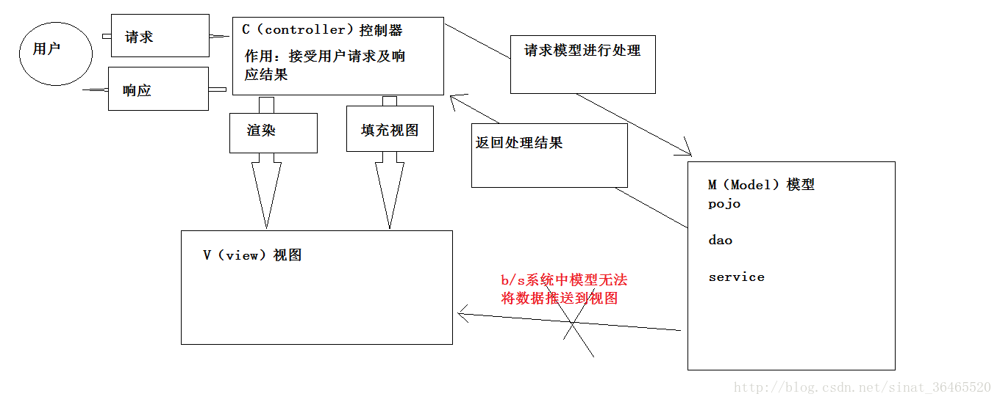

**大概流程**：用户使用浏览器发起一次请求，controller接收到请求，去model层请求数据，model去数据库获得数据后返回给controller层，controller把这些数据交给view层渲染、填充，然后在用response返回给用户

## 1.2.springmvc执行流程

1. 发起一个request到前端控制器(DispatcherServlet)；

2. 前端控制器请求处理器映射器(HandlerMapping)查找Handler；

3. 映射器向前端控制器返回Handler(包装成一个执行链)；

4. 前端控制器调用适配器去执行Handler；

5. 适配器执行Handler；

6. Handler执行完返回modelAndView给适配器，适配器再返回给前端控制器；

7. 前端控制器请求视图解析器将modelAndView进行视图解析(根据逻辑视图名解析成真正的视图view,如jsp)

8. 视图解析器向前端控制器返回view；

9. 前端控制器进行视图渲染(视图渲染将模型数据(在modelAndView对象中)填充到request域中)

10. 前端控制器向用户响应结果；

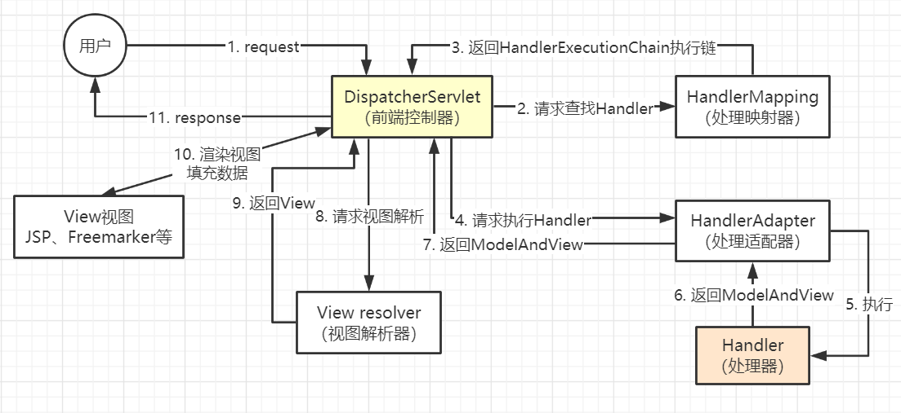

组件分析：

①前端控制器(DisatcherServlet)：接收请求，响应结果，相当于一个转发器

②处理器映射器(HandlerMapping)：根据请求的url查找handler

③处理器适配器(HandlerAdapter)：按照适配器的规则去执行Handler 

④视图解析器(ViewResolver)：把逻辑视图名解析成真正的视图View

⑤视图view：一个接口，其实现类支持不同的view类型(jsp、freemarker)

## 1.3.入门程序配置

- 配置前端控制器

```xml
<!--前端控制器DispatcherServlet的配置-->
<servlet>
    <servlet-name>springmvc</servlet-name>
    <servlet-class>org.springframework.web.servlet.DispatcherServlet</servlet-class>
    <init-param>
        <param-name>contextConfigLocation</param-name>
        <param-value>classpath:spring.xml</param-value>
    </init-param>
    <async-supported>true</async-supported>
</servlet>
<servlet-mapping>
    <servlet-name>springmvc</servlet-name>
    <url-pattern>/</url-pattern>
</servlet-mapping>
```

配置前端控制器其实就是配置一个servlet,并指定springmvc.xml文件的位置。PS:前端控制器的url-pattern不能设置为/*,可以设置为/

- 配置映射器

```xml
 <!-- 根据类名BeanNameUrlHandlerMapping可以猜到用Bean的名称去映射url -->
<bean class="org.springframework.web.servlet.handler.BeanNameUrlHandlerMapping"/>
```

- 配置适配器

```xml
<!-- 要作为一个处理器,先要实现Controller接口 -->
<bean class="org.springframework.web.servlet.mvc.SimpleControllerHandlerAdapter"/>
```

- 配置视图解析器

```xml
<bean class="org.springframework.web.servlet.view.InternalResourceViewResolver"/>
```

- 创建处理器

实现Controller接口，处理逻辑....

## 1.4.注解配置

- 开启mvc的注解

```xml
 <mvc:annotation-driven/>
```

- 使用注解

  ①使用“@Controller”注解，标识某个类是一个Handler后台处理器；

  ②使用“@RequestMapping”注解，用于url地址映射，分为根路径和子路径

```java
@Controller
@RequestMapping("/role")
public class RoleController{
    @RequestMapping("/add")
    public ModelAndView addRole(){
        // ...
    }
}
```

# 2.处理器返回值

可以返回ModelAndView、String、void

## 2.1.ModelAndView

返回modelAndView，需要new一个ModelAndView对象，再将model的数据和view的数据分别设置:

```java
@RequestMapping("forRc")
public ModelAndView forRedirect(String value) throws Exception {
    ModelAndView mv = new ModelAndView("redirect/redirect");
    mv.addObject("value", value);
    return mv;
}
```

## 2.2.String

返回String，有3种类型

- 逻辑视图名

需要返回给页面的业务数据通过参数Model来设置，方法必须要有一个Model类型的参数，将要返回给页面的数据保存在里面，系统会自动将这个Model解析到request作用域中，自己要配置的是返回值String ，它表示jsp的路径(若视图解析器设有设前缀和后缀，还需加上前缀 *prefix*和后缀*suffix*)

- 重定向

语法格式为：

```java
return "redirect:(重定向地址)";
```

1. 重定向到一个页面： return "redirect:/redirect.jsp"

2. 重定向到另一个方法：return "redirect:second.action";

3. 同一个Controller下的方法，直接写方法的url地址映射即可，如果是重定向到另一个Controller：加上目标controller的映射地址：return "redirect:/controller2/second1.action"

- 请求转发

请求转发跟重定向一样，只不过把 redirect => forward

```java
return "forward:/redirect.jsp"
```

注意：请求抓发地址要写全，不能算上视图解析器的前缀和后缀

- void

在方法的形参定义：request和response，以servlet方式请求转发或重定向。这种方式适用于 返回页面的数据为json格式的数据当返回值为void且代码中没有request转发和response重定向，默认就转到以@requestMapping的前缀+后缀的映射地址

# 3.参数绑定

## 3.1.默认参数绑定

通过Controller方法的形参来接收页面提交的数据，参数绑定默认支持的类型：(直接写在方法的形参就可以用了)

- HttpServletRequest

- HttpServletResponse

- HttpSession

- Model / ModelMap：moel是接口，而modelMap是接口实现

还支持一些简单的类型：方法参数的名称和request参数的名称要一致。但是，如果使用@RequestParam 就没有这个要求，而且还有其他优点：

```java
@RequestParam(value="role_id")int id) 
```

value的值要和request参数的名称一致，而方法参数的名称就可以随意取了

```java
@RequestParam(value="idd",required=true)int id) 
```

required表示此参数，必须要传递过来

```java
@RequestParam(value="idd",defaultValue="100")int id) 
```

defaultValue意思是，如果参数没有传递，则自动地设置为100，即默认值。简单类型有：整型、字符串、浮点型、布尔型、简单类型pojo，简单类型pojo的绑定跟简单类型一样。要求pojo中的属性名跟参数名一致即可(这点跟struts2的模型驱动一样)

思路：springmvc获取request数据的参数名后，利用反射遍历方法的参数集合，如果发现有名称一样的，就把数据赋值到方法参数中，简单类型pojo是指那些bean中的属性都是String、int、boolean类型，而复杂pojo类型，是指bean的属性包含其他bean，通过“.”来映射嵌套bean的属性名

## 3.2.自定义参数绑定

参数绑定相当于参数类型转换，实现的接口为转换器converter，springmvc帮我们转换了一些常用的类型包括bean类型，一些比较多变和复杂的类型需要自己绑定，比如日期的格式转换。配置步骤：

1. 实现Converter接口

```java
// Converter有2个泛型参数，由我们自己指定：
// 第一个位置是request传过来的参数类型，如上例中的String
// 第二个位置是我们转换后的返回值类型，如上例中的Date
@Component
public class DateConverter implements Converter<String, Date> {
    @Override
    public Date convert(String arg0) {
        SimpleDateFormat sdf = new SimpleDateFormat("yyyy-MM-dd");
        try {
            return sdf.parse(arg0);
        } catch (ParseException e) {
            e.printStackTrace();
        }
        return null;
    }
}
```

2. 注册到spring容器中

```xml
<mvc:annotation-driven conversion-service="conversionService"/>
```

注册一个总的参数绑定Bean,推荐使用这个类来注册：FormattingConversionServiceFactoryBean类(可继承已有springmvc转换器)，然后在这个bean中注入自己定义的converter(允许多个)。最后在mvc注解配置中，指定conversion-service的值，就是总的参数绑定Bean

3. 直接在处理器方法中使用

springmvc发现，方法的形参类型跟我们自定义的converter返回值类型一样，就会自动进行绑定。

## 3.3.集合类型绑定

集合必须作为一个具体类对象的成员属性， 对于list、Set、Map等的参数绑定，如果直接绑定，如：

```java
public String listBinding(List<String> list)
```

会报错。必须将集合作为一个具体类对象的成员对象，集合既可以绑定复杂类型，也可以绑定简单类型，数组区别于集合，它可以直接写在handler方法中，不用作为一个成员对象。但是，它只能绑定简单的类型，不能绑定复杂类型

### 3.3.1.数组的绑定

数组这种情况一般用于批量操作，要求参数数组的名称要跟controller方法参数的名称一致，

-  前端

```html
<form action="<%=path%>/uc/ab.action" method="post">
    <input type="checkbox" name="ages" value="123"/>I
    <input type="checkbox" name="ages" value="456"/>love
    <input type="checkbox" name="ages" value="789"/>you
    <input type="submit" value="测试"/>
</form>
```

- 后端

数组参数分为普通类型数组和复杂对象数组两种，但由于没有复杂对象数组的构造方法，springMVC只能绑定普通类型数组，但是可以绑定MultipartFile[] 用于多文件上传。

```java
@RequestMapping("/ab")
public ModelAndView ArrayBinding(String[] ages) {
}
```

### 3.3.2.list的绑定

List既可以绑定简单类型的数据，也可以绑定复杂类型的数据。它有个很不一样的配置，就是在前端设置参数的时候，需要指定下标就像list[0]、list[1]、list[2]...当然了，前后端参数名要一致

- 后端

1. 需要将List集合定义到一个具体的实体类中(生成set和get方法)

```java
@Data
public class CollectionBean {
    /*简单类型的List,如int、String、char、double...*/
    private List<String> sList;//不用new一个List

    /*复杂类型的List,如Date、bean...*/
    private List<SimpleBean> cList;
}
```

2. 在处理器方法中用这个实体类当参数(通过get方法取到List)

```java
@RequestMapping("/lb")
public ModelAndView listBinding(CollectionBean cbLsit) throws Exception {

}
```

- 前端

1. 绑定简单类型参数，前端参数名要跟List在实体类中的参数名一致，sList[0]代表List集合的第一个元素,以此类推

```html
<form action="<%=path%>/uc/lb.action" method="post">
    <input type="text" name="sList[0]" value="警察"/>
    <input type="text" name="sList[1]" value="医生"/>
    <input type="text" name="sList[2]" value="教师"/>
</form>
```

2. 绑定复杂类型参数，同样的，前端参数名(下例中的name属性)和List在实体类的参数名一致，clist[0]代表List中的第一个元素，它是一个复杂类型如javaBean，需要继续指定javaBean中的成员属性，就像下例中的cList[0].id

```html
id:<input type="text" name="cList[0].id"/>
name:<input type="text" name="cList[0].name"/>

id:  <input type="text" name="cList[1].id"/>
name:<input type="text" name="cList[1].name"/>
```

### 3.3.3.map的绑定

Map的绑定也是需要定义在一个实体类中，而且前端参数名和Map在后端。实体类中的成员属性名要一致，区别于其他集合，Map的key和value都是在前端配置的。

- 后端

1. 将Map配置到一个实体类中，我们在这里指定Map的key/value类型，在前端配置key/value的时候就要遵循这个类型（生成set/get方法）

```java
@Data
public class CollectionBean {
    private Map<String, Object> param;
}
```

2. 在handler的方法中用实体类当形参（用get方法取到Map）

```java
@RequestMapping("/mb")
public ModelAndView MapBinding(CollectionBean cbMap) {

}
```

- 前端

1. 前端的参数名param，跟Map在实体类中的成员属性名param一致，param['id']中的id就是Map的key，param['name']中的name也是Map的key。也就是说，Map的key/value都是在前端配置的

```html
<form action="<%=path%>/uc/mb.action" method="post">
    <input type="checkbox" name="param['id']" value="29"/>SYM
    <input type="checkbox" name="param['name']" value="gp"/>LOve
    <input type="checkbox" name="param['age']" value="23"/>SXQ
    <input type="submit" value="测试"/>
</form>  
```

### 3.3.4.set的绑定

如果set绑定简单类型，set集合的处理跟数组的处理是一样的，没有像map和list那么多的格式要求：也不要限制set的size。如果set绑定复杂类型，就要慎重了，基本上是和List绑定类似，但是：

1. 绑定List时，不用new arrayList()，而set需要new hashSet()；

2. 绑定Set数据时，Set对象中需要add对应前端数量的复杂类型对象；

3. 如果最大下标值大于Set的size，则会抛出InvalidPropertyException异常，所以必须在定义set的时候就给他限制大小

由于Set在绑定复杂类型数据时，比List多了更多的要求，因此正常情况下使用List不会去使用Set

- 后端

1. 将Set定义在一个实体类中,Set绑定简单类型很简单。绑定复杂类型如pojo时，既要new hashSet又要add具体数量的复杂类型对象(前端传几个，后端就要add几个)一般是在构造方法中实例化

```java
@Data
public class CollectionBean {
    private Set<String> sSet;
    
    //必须new一个Set
    private Set<SimpleBean> cSet = new HashSet<SimpleBean>();
}
```

2. 处理器方法中用实体类对象当形参，用get方法取到Set

```java
@RequestMapping("/setB")
public ModelAndView setBinding(CollectionBean cbSet) {

}
```

- 前端

1. 绑定简单类型是就跟数组一样，只要前后端参数名一致即可。不过，数组不能去重，而Set可以去重！！

```html
<form action="<%=path%>/uc/setB.action" method="post">
    <input type="text" name="sSet" value="aa"/>
    <input type="text" name="sSet" value="aa"/>
    <input type="text" name="sSet" value="cc"/>
</form>         
```

2. 绑定复杂类型，跟List一样，但是List可以绑定若干个，而Set能绑定的个数跟后端实体类中add的数量一样

```html
<input type="text" name="cSet[0].id" value="23"/>
<input type="text" name="cSet[0].name" value="123"/>
       
<input type="text" name="cSet[1].id" value="22"/>
<input type="text" name="cSet[1].name" value="345"/>
```

# 4.乱码处理

## 4.1.post乱码

在web.xml中配置编码过滤器，过滤类是spring提供的。过滤规则是"/*",对所有以post方式的请求进行编码过滤

```xml
<filter>
    <filter-name>CharacterEncodingFilter</filter-name>
    <filter-class>org.springframework.web.filter.CharacterEncodingFilter</filter-class>
    <init-param>
        <param-name>encoding</param-name>
        <param-value>utf-8</param-value>
    </init-param>
    <async-supported>true</async-supported>
</filter>
<filter-mapping>
    <filter-name>CharacterEncodingFilter</filter-name>
    <url-pattern>/*</url-pattern>
</filter-mapping>
```

## 4.2.get乱码

1.修改Tomcat配置文件的server.xml,修改其编码方式：

```xml
<Connector URIEncoding=*"utf-8"* connectionTimeout=*"20000"* port=*"9090"* protocol=*"HTTP/1.1"* redirectPort=*"8443"*/>
```

2.或是new String()用ISO-8859-1和utf-8去转换

# 5.数据校验

springmvc使用Hibernate的校验框架validation(和Hibernate没关系)

## 5.1.validation配置

1. 加载validation的所有jar包

```xml
<groupId>org.hibernate</groupId>
<artifactId>hibernate-validator</artifactId>
<version>5.4.1.Final</version>
```

2. 配置校验器、错误信息文件。校验器的配置在spring提供的校验器配置接口LocalValidatorFactoryBean，该类有个providerClass属性，用于指明是用哪一种validation校验器，本次使用的是HibernateValidation，然后再指明放置错误信息的文件

```xml
<bean id="validation" class="org.springframework.validation.beanvalidation.LocalValidatorFactoryBean">
    <!--指定用的是哪个校验器-->
    <property name="providerClass" 
              value="org.hibernate.validator.HibernateValidator"/>
    <!--指定校验使用的资源文件(在文件中配置校验错误信息),若不指定默认读取
	    classpath:ValidationMessages.properties-->
    <property name="validationMessageSource" ref="messageSource"/>
</bean>
```

从上面校验器的配置可以看出来，错误信息配置文件实际上就是一个bean，使用的类文件是ReloadableResourceBundleMessageSource属性basenames指定配置文件在哪，如果是多个，可以用\<list>，剩下的属性就是一些编码的配置和缓存的时间处理，配置文件大概长这样：

```xml
<bean id="messageSource" class="org.springframework.context.support.ResourceBundleMessageSource">
    <property name="basenames"><!-- 使用basenames属性可以指定多个配置文件 -->
        <list>
            <!--校验器配置:2、错误信息配置文件 -->
            <value>config.validationMessages</value>
        </list>
    </property>
    <!--资源文件编码格式-->
    <property name="defaultEncoding" value="utf-8"/>
    <!--对资源文件内容缓存时间，单位秒-->
    <property name="cacheSeconds" value="120"/>
</bean>
```

3. 将校验器注入到处理器适配器中，业务处理是在controller中进行的，所以把校验器放到适配器去配置，而且我们用的是mvc的注解驱动配置mvc:annotation-driven,自然是在这里配置，在注解驱动配置中加个validator属性，指定ref路径，指向校验器Bean的id

```xml
<mvc:annotation-driven validator="validation"/>
```

4. 在pojo中配置校验规则，毕竟我们要校验的参数，都是pojo中的属性，因此就要在pojo中定义

```java
@NotBlank(message = "{user.name.isNull}")
private String Name;

@Range(min = 18, max = 45, message = "{user.age.size.error}")
private int age;
```

message就是当校验不通过的时候，要发出怎么样的错误信息让别人知道，用{...}指明错误信息配置文件中的key，这样耦合度低，便于修改

5. 在controller中使用校验器，在每个待校验的参数前面加@Validated,后面加BindingResult，注意如果有多个参数需要校验，@Validated和BindingResult是配对出现的，通过BindingResult取出所有错误对象ObjectError，错误信息就保存在里面，将信息返回给页面即可完成校验

```java
@RequestMapping("/vt")
public ModelAndView validationTest(@Validated UserBean user, BindingResult 
                                   result) throws Exception {
    ModelAndView mv = new ModelAndView("validation/validation");
    if (result.hasErrors()) {
        // 获取所有的错误对象
        List<ObjectError> errors = result.getAllErrors();
        mv.addObject("errors", errors);
    }
    return mv;
}
```

常用注释：

- @Null     被注释的元素必须为 null 

- @NotNull   被注释的元素必须不为 null 

- @AssertTrue  被注释的元素必须为 true 

- @AssertFalse  被注释的元素必须为 false 

- @Min(value)  被注释的元素必须是一个数字，其值必须≥指定的最小值 

- @Max(value) 被注释的元素必须是一个数字，其值必须≤指定的最大值 

- @DecimalMin(value)被注释的元素必须是小数，其值必须≥指定的最小值 

- @DecimalMax(value)被注释的元素必须是小数，其值必须≤指定的最大值 

- @Size(max=, min=)被注释的集合元素数量在[min,max]内

- @Digits(integer=整数位数,fraction=小数位数)，指定被注释的元素值的整数位数和小数位数上限 

- @Past   被注释的元素必须是一个过去的日期 

- @Future  被注释的元素必须是一个将来的日期 

- @Pattern(regex=,flag=) 被注释的元素必须符合指定的正则表达式 

- @NotBlank(message =) 验证字符串不为null且不能为""

- @Email 被注释的元素必须是电子邮箱地址 

- @Length(min=,max=) 被注释的字符串的大小必须在指定的范围内 

- @NotEmpty 被注释的字符串的必须非空 

- @Range(min=,max=,message=) 被注释的元素必须在合适的范围内 

## 5.2.校验分组

在pojo中定义校验规则，而pojo是被多个Controller所共用的。当不同的Controller方法对同一个pojo进行校验时，每个Controller方法需要不同的校验怎么办?例如有的Controller只需要校验商品的名字长度，有的Controller需要校验日期,这时候就需要分组校验了！！！

校验分组

1. 创建分组接口(只定义一个最简单的接口，其他不用管)

2. 在pojo中，设置校验属性的时候，顺便分组

3. controller方法，需要哪个校验，就用那个分组

分组接口，不用做任何配置，只是单纯的创建就行，在controller和pojo做分组的分配对象

```java
public interface FirstValidationGroup {
    //接口中不需要定义任何方法，仅是对不同的校验规则进行分组
}
```

一个属性分配一个组(也可以分配给多个)，多个属性也可以同属于一个组。这样，如果controller使用这个组时，就会将该组内所有规则做检验；如果属性不属于任何一个分组，controller也要不分配组才可以校验，即，@Validated注解中的value值为空

```java
@NotBlank(message = "{user.name.isNull}", 
          groups = {FirstValidationGroup.class, SecondValidationGroup.class})
private String Name;

@Range(min = 18, max = 45, message = "{user.age.size.error}", 
       groups = {SecondValidationGroup.class})
private int age;
```

这样子，不同方法对这个pojo有不同的检验要求，就可以在@Validated，注释后面配一个value={组.class...}，表示在这个方法中，用哪些规则来校验，而不会使用pojo中定义的全部校验规则

```java
@RequestMapping("/vt")
public ModelAndView validationTest(@Validated(value = {FirstValidationGroup.class, SecondValidationGroup.class}) UserBean user,
                                   BindingResult result) throws Exception {}
```

一个属性，也可以定义多个校验规则，对多个条件进行校验，哪个条件不符合就报那个message，比如：如果name属性不写就报notBlank错，如果写的字符小于4或大于8，就报size错

## 5.3.校验错误处理

当校验不通过，即出现错误了，该怎么提示前端每加一次@validated注解，就要每为其配对一个BindingResult对象，如果校验通过即没有错误，该对象为null；否则该对象包含错误信息，通过hasErrors()可以是否存在错误信息(即校验不通过)，通过getAllErrors()可以取出所有错误对象,返回List\<ObjectError>集合，通过ObjectError.getDefaultMessge()可以取出单个错误信息

## 5.4.自定义校验注解

虽然hibernate-validation提供了很多常用校验注解，但是实际开发中，我们肯定要跟业务数据挂钩，这时候可以自定义校验注解来完成校验。

1. 先定义一个注解，这个注解必须要标注@Constraint注解，指定处理该注解的实际校验逻辑类

```java
@Documented
@Target(ElementType.FIELD)
@Retention(RetentionPolicy.RUNTIME)
@Constraint(validatedBy = MyVaildAnnoHandler.class)
public @interface MyValidAnno {
    /*
     * 自定义的额外属性
     */
    int min() default 1 ;
    int max() default 10;

    /*
     * 以下3个属性一定要设置
     */
    String message() default "{myValidAnno.default.message}";
    Class<?>[] groups() default { };
    Class<? extends Payload>[] payload() default { };
}
```

2. 实现ConstraintValidator接口完成对自定义注解的校验逻辑。ConstraintValidator接口有2个泛型，第一个是注解类型，第二个是要校验的属性的值类型(如果你确定值为string类型，这边就可以改为String)。凡是实现了ConstraintValidator接口的类，spring都会自动将其注入到IOC容器上，所以可以在类上直接使用@Autowired注入IOC容器中的bean

```java
public class MyVaildAnnoHandler implements ConstraintValidator<MyValidAnno,Object> {
    /**
     * 处理器可以定义变量保存用户在注解上设置的值
     */
    private int min;
    private int max;
    /*
     * 可以注入在IOC容器中的bean
     */
    @Autowired
    private ExceptionResolver resolver;

    @Override
    public void initialize(MyValidAnno constraintAnnotation) {
        // 只有在同一类同一属性多次校验，initialize()方法只会执行一遍；其它情况，
        // initialize()方法都会重新执行，刷新数据。所以可以放心把注解设置的值保存到成员
        // 变量中
        this.min = constraintAnnotation.min();
        this.max = constraintAnnotation.max();
    }
    /**
      * isValid()方法就是执行我们自己的校验逻辑
      */
    @Override
    public boolean isValid(Object value, ConstraintValidatorContext context) {
        // 错误信息模板
        String template = context.getDefaultConstraintMessageTemplate();
        // 注解设置的值
        System.out.println("min="+min+",max="+max);
        // value就是待校验的值
        System.out.println("校验值为："+value);
        return false;
    }
}
```

# 6.数据回显

## 6.1.默认回显pojo

在Handler方法参数中定义pojo，就可以在返回的页面，用${pojo类名.属性名}

```java
@RequestMapping("/dd")
public String dataDisplay(SimpleBean sb) {
    // 这里仅用默认回显的方式，其它方式自行测试
    return "dataDisplay/simpleBean";
}
```

然后只要在前端页面中用指定格式，就可以将数据回显：默认是以pojo的类名做key，然后取哪个属性，就用那个属性名.

```html
<form action="<%=path%>/uc/dd.action" method="post">
    ID:  <input type="text" name="id"/>
    name:<input type="text" name="name"/>
    age: <input type="text" name="age" value="18"/>
</form>
```

## 6.2.@ModelAttribute注解回显

使用@ModelAttribute注解可以指定返回值的名称，前端就可以使用该名称+属性名取值：

```java
// 该注解既可以直接返回方法返回值，还可修改pojo在页面的名称(默认是类全名)
@ModelAttribute(value = "temp") 
public String modelAttributeTest() {
    return "我是@ModelAttribute注解返回的字符串";
}
```

@ModelAttribute还可以把方法的返回值，回显到页面，这个方法不用指定@RequestMapping，只要controller返回数据到页面，这个返回值就会跟着到这个页面上，页面只要${temp}就可以接收到方法的返回值了

## 6.3.model接口回显

model充当着Request的作用，其实在内部是把model的数据封装到request作用域。页面直接${role.role_id}就可以取到数据

# 7.异常处理

springmvc提供全局异常处理器(一个系统只有一个异常处理器)统一异常处理dao、service、controller如果出现异常，都往上抛，直至给dispatcherServlet，前端控制器会自行调用异常处理器ExceptionResolver。异常处理器思路：

​    1、先解析异常类型，然后分析

​    2、如果为系统自定义异常，取出异常信息在错误页面展示

​    3、如果不为自定义异常，构造一个自定义异常类型(内容为"未知错误")

异常处理配置步骤：

​    1、定义全局异常处理器

​    2、配置全局异常处理器到spring.xml配置文件中

## 7.1.自定义异常类

```java
public class DefaultException extends Exception {
    private String message;

    public DefaultException(String message) {
        this.message = message;
    }

    public String getMessage() {
        return message;
    }

    public void setMessage(String message) {
        this.message = message;
    }
}
```

## 7.2.定义异常处理器

然后自定义一个异常处理器，只要实现HandlerExceptionResolver接口，springmvc就会将其视为全局异常处理器(有且只有一个起作用，按配置顺序取第一个)思路：如果是此异常是已定义的，直接转成已知异常类，否则new一个新异常，异常的信息为"未知错误"(当然此信息可以换成其他内容)，然后定义modelAndView，转到处理错误信息的页面上

```java
public class ExceptionResolver implements HandlerExceptionResolver {

    @Override
    public ModelAndView resolveException(HttpServletRequest request, 
      		HttpServletResponse response, Object handler, Exception ex) {
        System.out.println("全局校验器---ExceptionResolver");
        DefaultException de = null;
        if (ex instanceof DefaultException) {
            de = (DefaultException) ex;
        } else {
            de = new DefaultException("未知错误");
        }
        ModelAndView mv = new ModelAndView();
        mv.addObject("error", ex.getMessage());
        mv.addObject("msg", "全局校验器---ExceptionResolver");
        mv.setViewName("404/error");
        return mv;
    }
}
```

## 7.3.注册异常处理

一般在service和controller抛出异常

```xml
<!--配置异常处理器，就算有多个，springmvc也只认一个-->
<bean class="com.exception.ExceptionResolver"/>
```

# 8.文件上传

springmvc上传二进制文件，需要额外2个jar包：commons-fileupload.jar和commons-io.jar。pom.xml的相关依赖如下：

```xml
<dependency>
    <groupId>commons-fileupload</groupId>
    <artifactId>commons-fileupload</artifactId>
    <version>1.3.1</version>
</dependency>
<dependency>
    <groupId>commons-io</groupId>
    <artifactId>commons-io</artifactId>
    <version>2.4</version>
</dependency>
```

## 8.1.配置multipart解析器

当页面form提交enctype="multipart/form-data"的数据时，springmvc会对multipart类型的数据进行解析，因此需要在spring.xml中配置multipart类型解析器

```xml
<bean id="multipartResolver" class="org.springframework.web.multipart.commons.CommonsMultipartResolver">
    <property name="maxUploadSize" value="5242880"/>
</bean>
```

在controller方法中定义形参MultipartFile类型pic,页面上传的文件的二进制数据就会放到参数pic里面，对pic处理就可以处理文件

```java
@RequestMapping(value = "/uf")
public ModelAndView uploadFile(MultipartFile pic, 
     HttpServletRequest request) throws Exception {

}
```

MultipartFile类常用的一些方法：

1. String getContentType()     获取文件MIME类型

2. InputStream getInputStream()  获取文件流

3. String  getName()        获取表单中文件组件的名字

4. String  getOriginalFilename()  获取上传文件的原名

5. long  getSize()         获取文件的字节大小，单位byte

6. boolean isEmpty()        判断是否为空，不为空时返回false

7. void  transferTo(File dest)   保存到一个目标文件中

多文件上传其实很简单，和上传其他相同的参数如checkbox一样，表单中使用相同的名称，然后action中将MultipartFile参数类定义为数组就可以

# 9.JSON数据交互

@RequestBody  → 接收页面请求，将json串转为java对象

@ResponseBody → 响应页面请求，将java对象转为json串

一般客户端直接使用key/value形式发起请求比较简单且常用，springmvc默认使用MappingJacksonHttpMessageConverter对Json数据进行转换，需加入：

- jackson-databind-2.7.2.jar

- jackson-core-asl-1.9.13.jar

## 9.1.配置json转换器

如果配置springmvc的处理器适配器是将其作为<Bean>来配置的，则需要配置messageConverter(类型转换器)，如果使用注解驱动<mvc:annotation-driven />来配置，默认就会配置json转换器

## 9.2.前端发送json数据

```js
function json_json() {
    $.ajax({
        type: 'post',
        url: '<%=path%>/uc/reqj.action',
        contentType: 'application/json',
        cache: false,
        data: '{"id":"29","name":"沈燕明","age":22}',
        dataType: 'json',
        success: function (data) {
            alert(JSON.stringify(data));
        }
    });
}
```

一定要把contentType改为application/json，这样data只能是json串，后台@requestBody注解才可以捕捉到此json串并转为java对象

```java
@RequestMapping(value = "/reqj")
@ResponseBody
public SimpleBean requestJson(@RequestBody SimpleBean sb) {
    return sb;
}
```

@requestBody会将json串转为roleBean对象，@responseBody会把roleBean对象转为json发回去给前端

## 9.3.前端发送key/value数据

```js
function keyValue_json() {
    $.ajax({
        type: 'post',
        url: '<%=path%>/uc/resj.action',
        data: 'id=17&name=s沈小棋&age=23',
        success: function (data) {
            alert(JSON.stringify(data));
        }
    });
}
```

如果发送的是key/value，contentType就不用修改了，默认为：application/x-www-form-urlencoded，后端就不需要``@requestBody

# 10.RESTful支持

## 10.1.RESTful介绍

REST，即Representational State Transfer，能理解成'表现层状态转化，如果一个架构符合REST原则，就称它为RESTful架构。要理解RESTful架构，最好的方法就是去理解Representational State Transfer这个词组到底是什么意思，它的每一个词代表了什么涵义：

- 资源（Resources）

服务端提供的资源，可以是一个文件、一个音频、一段视频..等，我们可以用一个URI指向它，每种资源对应一个特定的URI。要获取这个资源，访问它的URI就可以，因此URI就成了每一个资源的地址或独一无二的识别符

- 表现层（Representation）

"资源"是一种信息实体，它可以有多种外在表现形式。我们把"资源"具体呈现出来的形式，叫做它的"表现层"（Representation）。如：文本是资源，它可以用.txt表现，也可以用HTML、XML、JSON表现。URI只代表资源的实体，不关心它是如何表现。所以网址的后缀名是不必要的，因为这个后缀名表示格式，属于"表现层"范畴，而URI应该只代表"资源"的位置。它的具体表现形式，应该在HTTP请求的头信息中用Accept和Content-Type字段指定，这两个字段才是对"表现层"的描述

- 状态转化（State Transfer）

访问一个网站，，势必涉及到数据和状态的变化。互联网通信协议HTTP协议，是一个无状态协议。所有的状态都只保存在服务端中，客户端想改变状态，只能依靠HTTP协议。具体来说，就是HTTP协议里4个表示操作方式的动词：GET、POST、PUT、DELETE。它们分别对应四种基本操作：GET用来获取资源，POST用来新建资源（也可以用于更新资源），PUT用来更新资源，DELETE用来删除资源

- 总结：

 1、每一个URI代表一种资源；

 2、客户端和服务器之间，传递这种资源的某种表现层；

 3、使用HTTP方法描述行为，使用HTTP状态码表示不同结果

## 10.2.RESTful支持

springmvc怎么支持RESTful架构设计风格？之前我们的url参数是?id=2＆name=aa,若要符合rest风格的url应该写成：/2/aa,即把参数也写进url中，表示一种资源。

1. 把前端控制器的url映射改为"/"

```xml
<servlet>
    <servlet-name>springmvc_rest</servlet-name>
    <servlet-class>org.springframework.web.servlet.DispatcherServlet</servlet-class>
    <init-param>
        <param-name>contextConfigLocation</param-name>
        <param-value>classpath:spring.xml</param-value>
    </init-param>
</servlet>
<servlet-mapping>
    <servlet-name>springmvc_rest</servlet-name>
    <!--构建rest风格，就不能用/*.action过滤规则，改用/-->
    <url-pattern>/</url-pattern>
</servlet-mapping>
```

如果url映射写成“/”就要对js、css、img等资源文件做过滤,在spring.xml中配置资源过滤条件:

```xml
<mvc:resources location="/js/" mapping="/js/**"/>
<!--<mvc:resources location="/css/" mapping="/css/**"/>-->
<mvc:default-servlet-handler/>


```

2. Controllor处理，参数跟在url映射后面,以花括号{}加以修饰,多个参数用"/"隔开，@PathVariable注解可以将url映射的参数按名称映射到方法形参。前端就以这种方式的url映射发起请求：

```java
@RequestMapping("/restful/{id}/{type}")
public ModelAndView restFul(@PathVariable("id") int id, @PathVariable("type") String name) {

}
```

## 10.3.请求方式配置

RESTful支持Get、Post、Put、Delete等多种请求方式，但是前端的form标签只支持get或post方式，为了能让springmvc支持多种request请求方式，需要配置HiddenHttpMethodFilter过滤器。

1. 在web.xml中配置：

```xml
<filter>
    <filter-name>HiddenHttpMethodFilter</filter-name>
    <filter-class>org.springframework.web.filter.HiddenHttpMethodFilter</filter-class>
</filter>
<filter-mapping>
    <filter-name>HiddenHttpMethodFilter</filter-name>
    <url-pattern>/*</url-pattern>
</filter-mapping>
```

2. 页面form标签呢的method仍然设置为post，但是需要加上一个隐藏参数：名称固定为"_method"，值为要请求的request方式，例如：put请求值就为put

```xml
<form action="<%=path%>/uc/putRequest" method="post">
    <input type="submit" value="put请求提交"/>
    <input type="hidden" name="_method" value="put"/>
</form>
```

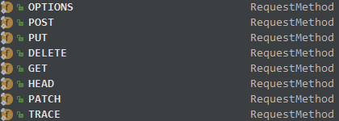

# 11.拦截器

springmvc中，用户发起一个请求到Controller执行，过程为：

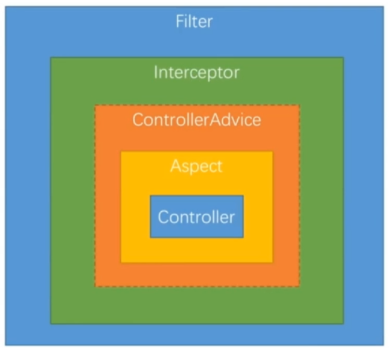

## 11.1.拦截器介绍

springmvc的拦截器针对handlerMapping拦截设置，即在某映射器配置拦截器，只有使用该映射器映射的handler，才可以使用到拦截器。但是，springmvc可以配置类似全局的拦截器，它会将这种拦截器注入到每个handlerMapping中

## 11.2.拦截器定义

定义拦截器两种方式：

- 实现HandlerInterceptor接口或者实现WebRequestInterceptor接口

- 以实现HandlerInterceptor为例：接口有三个方法需要实现！！！！！！

1. preHandle()方法-----执行handler方法之前调用

每个Interceptor 的调用会依据它在spring.xml配置中声明的顺序依次执行，而且最先执行的都是Interceptor 中的preHandle 方法，当它返回为false 时，表示请求结束，后续的Interceptor 和Controller 都不会再执行；当返回值为true 时就会继续调用下一个Interceptor 的preHandle 方法，如果已经是最后一个Interceptor 的时候就会是调用当前请求的Controller 中的方法

```java
@Override
public boolean preHandle(HttpServletRequest request, HttpServletResponse response, Object handler) throws Exception {
    System.out.println("interceptor1的preHandle()...");
    /*改变返回值,查看测试结果*/
    return true;
}
```

2. postHandle()方法----执行完handler方法之后，视图渲染之前，被调用在当前所属的Interceptor 的preHandle 方法的返回值为true 时才能被调用，postHandle 方法被调用的方向跟preHandle 是相反的，也就是说先声明的Interceptor 的postHandle 方法反而会后执行

```java
@Override
public void postHandle(HttpServletRequest request, HttpServletResponse response, Object handler, ModelAndView modelAndView) throws Exception {
    System.out.println("interceptor1的postHandle()...");
}
```

3. afterCompletion()方法----视图渲染之后被调用，该方法也是需要当前对应的Interceptor 的preHandle 方法的返回值为true 时才会执行，该方法将在整个请求结束之后，也就是在DispatcherServlet 渲染了对应的视图之后执行。这个方法的主要作用是用于进行资源清理工作的

```java
@Override
public void afterCompletion(HttpServletRequest request, HttpServletResponse response, Object handler, Exception ex) throws Exception {
    System.out.println("interceptor1的afterCompletion()...");
}
```

执行流程大概如下：

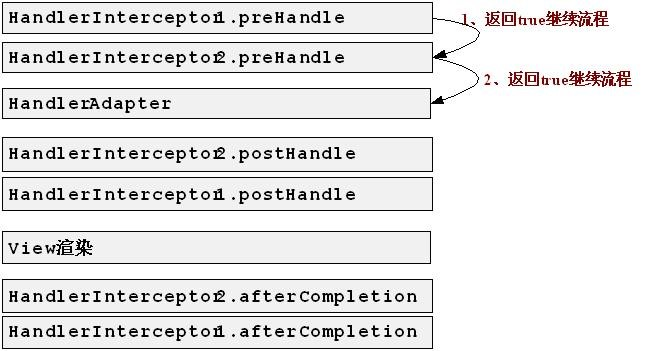

## 11.3.拦截器配置

1. 针对单个handlerMapping的拦截器配置，就在映射器的配置里面，注入interceptors属性，按顺序执行定义的拦截器，前提要将自定义的拦截器，注册到spring的ioc容器中

```xml
<bean class="org.springframework.web.servlet.handler.BeanNameUrlHandlerMapping">
    <property name="interceptors">
        <list>
            <ref bean="interceptor1"/>
            <ref bean="interceptor2"/>
        </list>
    </property>
</bean>
```

2. 配置类似全局的拦截器。用mvc:interceptors表示多个拦截器，一个mvc:interceptor表示一个拦截

   器，按照配置文件从上往下的顺序执行拦截器。<mvc:mapping path="/**"/>指定拦截的url格式,/**表示都拦截(包含子url)，\<bean class="com.intercepter1.HandlerInterceptor2"/>指定拦截器

```xml
<mvc:interceptors>
    <!--按照配置的顺序，从上往下执行拦截器-->
    <mvc:interceptor>
        <!--/**意思是拦截全部的url包括子url，/*不包括子url-->
        <mvc:mapping path="/**"/>
        <bean class="com.intercepter.FirstInterceptor"></bean>
    </mvc:interceptor>
    <mvc:interceptor>
        <mvc:mapping path="/**"/>
        <bean class="com.intercepter.SecondInterceptor"></bean>
    </mvc:interceptor>
</mvc:interceptors>
```

# 12.国际化

springmvc支持国际化(i18n)，它可以根据地区的不同使用不同的语言。使用国际化功能需要为springIoc容器添加两个组件：

1. 消息处理器MessageSource，用于解析国际化配置文件

2. 国际化解析器LocaleResolver，获取区域对象信息Locale以选择合适的配置文件

提供国际化配置文件：

- 格式：\<name>\_<语言编码>_<国家代号>.properties

- 例如：myI18n_zh_CN.properties 表示中文的国际化配置文件

     		myI18n_en_US.properties表示美国英语的国际化配置文件

## 12.1.基本组件

### 12.1.1.MessageSource

MessageRource接口是spring提供的处理消息的基本接口，用于(i18n和国际化)。对于加载国际化资源文件，spring提供了两个加载类：

- org.springframework.context.support.ResourceBundleMessageSource

- org.springframework.context.support.ReloadableResourceBundleMessageSource

由它们指定资源文件入口和其它配置信息(如：编码)，推荐使用ReloadableResourceBundleMessageSource，它可以动态改变国际化配置文件

```xml
<bean id="messageSource" class=
 "org.springframework.context.support.ReloadableResourceBundleMessageSource">
    <property name="basename" value="i18n.login"></property>
    <property name="fileEncodings" value="utf-8"></property>
</bean>
```

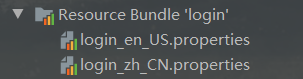

### 12.1.2.LocaleResolver

springmvc提供了3种获取区域对象信息的LocaleResolver：

- AcceptHeaderLocaleResolver -- 根据Request的请求头信息判断使用哪种语言

- SessionLocaleResolver -- 使用HttpSession来处理国际化信息

- CookieLocaleResolver -- 使用Cookie来处理国际化信息

## 12.2.配置步骤

### 12.2.1.使用AcceptHeaderLocaleResolver

1. 配置国际化配置文件


2. 配置解析国际化配置文件的解析器。默认只需要定位到*.properties文件的前缀即可，例如上图中的login

```xml
<bean id="messageSource" class=
 "org.springframework.context.support.ReloadableResourceBundleMessageSource">
    <property name="basename" value="i18n.login"></property>
    <property name="fileEncodings" value="utf-8"></property>
</bean>
```

3. 配置处理国际化请求的LocaleResolver

```xml
<bean id="localeResolver" 	
      class="org.springframework.web.servlet.i18n.AcceptHeaderLocaleResolver"></bean>
```

4. 到此springmvc的配置已完成，它会根据Request请求带来的区域信息，自动的使用国际化配置文件

### 12.2.2.使用SessionLocaleResolver

使用SessionLocaleResolver处理国际化信息，它会保存Locale到HttpSession对象中，配置步骤为：

1. 配置国际化配置文件


2. 配置解析国际化配置文件的解析器。默认只需要定位到*.properties文件的前缀即可，例如上图中的login

```xml
<bean id="localeResolver" 	
      class="org.springframework.web.servlet.i18n.AcceptHeaderLocaleResolver"></bean>
```

3. 配置SessionLocaleResolver解析器

```xml
<bean id="localeResolver" 
      class="org.springframework.web.servlet.i18n.SessionLocaleResolver"/>
```

4. 在controller中根据Request带来的参数，手动地配置Locale对象。将其保存到HttpSession中

```java
@RequestMapping(value = "i18n")
public String i18nTest(@RequestParam(name = "l", required = false) 
       String lang, HttpSession session, HttpServletRequest request, 
       HttpServletResponse response) throws Exception {
    Locale locale = null;
    if (StringUtils.isEmpty(lang)) {
        locale = new Locale("zh", "CN");
    } else {
        switch (lang) {
            case "zh":
                locale = new Locale("zh", "CN");
                break;
            case "en":
                locale = new Locale("en", "US");
                break;
            default:
                locale = LocaleContextHolder.getLocale();
                break;
        }
    }
    //cookieLocaleResolver.setLocale(request,response,locale);
    session.setAttribute(SessionLocaleResolver.LOCALE_SESSION_ATTRIBUTE_NAME,
                         locale);
    return "i18n/i18n_study";
}
```

5. 页面就可以传递参数"l"来选择使用哪种语言，例如：

\<a href="<%=request.getContextPath()%>/uc/i18n?l=zh">中文()\</a>

\<a href="<%=request.getContextPath()%>/uc/i18n?l=en">English\</a>

### 12.2.3.使用CookieLocaleResolver

CookieLocaleResolver的配置和SessionLocaleResolver其实大同小异，它是使用Cookie来作国际化处理，同样也需要配置拦截器：

1. 国际化配置文件


2. 配置解析国际化配置文件的解析器。默认只需要定位到*.properties文件的前缀即可，例如上图中的login

   ```xml
   <bean id="localeResolver" 	
    class="org.springframework.web.servlet.i18n.AcceptHeaderLocaleResolver"></bean>
   ```

3. 配置CookieLocaleResolver解析器

```xml
<bean id="localeResolver" class="org.springframework.web.servlet.i18n.CookieLocaleResolver"/>
```

4. 在controller中，需要先注入CookieLocaleResolver，设置Locale对象：

```java
@RequestMapping(value = "i18n")
public String i18nTest(@RequestParam(name = "l", required = false) String lang, HttpSession session, HttpServletRequest request, HttpServletResponse response) throws Exception {
    Locale locale = null;
    if (StringUtils.isEmpty(lang)) {
        locale = new Locale("zh", "CN");
    } else {
        switch (lang) {
            case "zh":
                locale = new Locale("zh", "CN");
                break;
            case "en":
                locale = new Locale("en", "US");
                break;
            default:
                locale = LocaleContextHolder.getLocale();
                break;
        }
    }
    cookieLocaleResolver.setLocale(request,response,locale);
    return "i18n/i18n_study";
}
```

5. 页面就可以传递参数"l"来选择使用哪种语言，例如：

\<a href="<%=request.getContextPath()%>/uc/i18n?l=zh">中文()\</a>

\<a href="<%=request.getContextPath()%>/uc/i18n?l=en">English\</a>

### 12.2.4.自定义LocaleResolver

通过实现LocaleResolver接口可以自定义国际化信息处理器：

```java
public class MyLocaleResolver implements LocaleResolver {
    @Override
    public Locale resolveLocale(HttpServletRequest request) {
        String param = request.getParameter("l");
        Locale locale = Locale.getDefault();
        if (!StringUtils.isEmpty(param)) {
            switch (param) {
                case "zh":
                    locale = new Locale("zh", "CN");
                    break;
                case "en":
                    locale = new Locale("en", "US");
                    break;
            }
        }
        return locale;
    }

    @Override
    public void setLocale(HttpServletRequest request, HttpServletResponse response, Locale locale) {

    }
}
```

并加自定义的MyLocaleResolver注册到IOC容器中，可以使用注解的方式，也可以使用xml的方式。

# 13.不拦截资源文件

如果springmvc的DispatcherServlet拦截规则是"\*.do"或者"*.action"则不会出现资源文件被拦截的问题；如果DispatcherServlet拦截规则是"/"，则资源文件就会被拦截了。

## 13.1.default-servlet-handler方式

1. 在springmvc配置文件中，启用\<mvc:default-servlet-handler/>

2. 在web.xml配置文件中，添加如下信息，注意要放到DispatcherServlet之前

```xml
<servlet-mapping>
    <servlet-name>default</servlet-name>
    <url-pattern>*.js</url-pattern>
    <url-pattern>*.css</url-pattern>
    <url-pattern>/assets/*"</url-pattern>
    <url-pattern>/pic/*</url-pattern>
</servlet-mapping>
```

## 13.2.\<mvc:resources>方式

springmvc3.x版本以后，可以在springmvc的配置文件中使用\<mvc:resources/>的方式来对资源文件的放行。

```xml
 <mvc:annotation-driven />
 <mvc:resources location="/img/" mapping="/img/**"/>  
 <mvc:resources location="/js/" mapping="/js/**"/>  
 <mvc:resources location="/css/" mapping="/css/**"/> 
```

1. location 属性指定静态资源的位置，由于 location 属性是 Resource 类型，因此可以使用诸"classpath:"等的资源前缀指定资源位置

2. mapping属性指定url映射地址，img/**表示img路径下所有URL包括子路径

# 14.Servlet的URL映射

## 14.1.url映射处理

当一个请求发送到servlet容器的时候，容器先会将请求的url减去当前应用上下文的路径作为servlet的映射url。比如浏览器发起请求的url访问路径： http://localhost/test/aaa.html，容器的应用上下文是test。容器会将http://localhost/test去掉， 剩下的/aaa.html拿来做servlet的映射匹配。这个映射匹配过程是有顺序的，而且当有一个servlet匹配成功以后，就不会去匹配剩下的servlet

## 14.2.url映射匹配规则

1. 精确匹配

servlet的url映射和浏览器发起请求的url必须完全一致

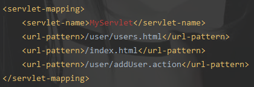

在浏览器中输入如下几种url时，都会被匹配到该servlet (sym为项目根路径)	

   http://localhost:8080/sym/user/users.html

　http://localhost:8080/sym/index.html

　http://localhost:8080/sym/user/addUser.action

 PS：

  http://localhost:8080/sym/user/addUser/ 是非法的url，不会被当作http://localhost:8080/sym/user/addUser识别

2. 路径匹配

     以“/”字符开头，并以“/*”结尾的字符串用于路径匹配

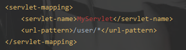

路径以/user/开始，后面的路径可以任意。比如下面的url都会被匹配:(sym为项目根路径)

　http://localhost:8080/sym/user/users.html

　http://localhost:8080/sym/user/addUser.action

　http://localhost:8080/sym/user/updateUser.actionl

3. 扩展匹配

   以“*.”开头的字符串被用于扩展名匹配

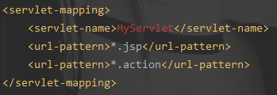

 任何扩展名为.jsp或.action的url请求都会匹配，比如下面的url： (sym为项目根路径)

　http://localhost:8080/sym/user/users.jsp

　http://localhost:8080/sym/toHome.action

4. 缺省匹配

   仅仅只有“/”用来定义default servlet映射

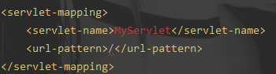

## 14.3.url映射匹配顺序

1. **精确路径匹配**。例子：servletA 的url映射为"/test"，servletB的url映射为"/*" ，如果访问的url为http://localhost/test ，Servlet容器就会先进行精确路径匹配，发现/test正好被servletA精确匹配，就去调用servletA。一旦有一个Servlet被匹配到，其他Servlet就不会再被调用。

2. **最长路径匹配**。 例子：servletA的url映射为"/test/\*"，而servletB的url映射为"/test/a/*"，如果访问http://localhost/test/a时，容器会选择路径最长的servlet来匹配，也就是servletB。

3. **扩展匹配。**如果url最后一段包含扩展，容器将会根据扩展选择合适的servlet。例子：servletA的url-pattern：*.action

4. 前面三条规则都没有找到一个servlet，容器会根据url选择对应的请求资源。如果容器中定义**default servlet**，则容器会将请求丢给default servlet。

## 14.4./和/*的区别

/*会覆盖其他servlets，无论任何请求都会执行该servlet。 /不会覆盖其它servlet（它只会替换servlet容器中内置的静态资源和目录列表的默认servlet）。就是当请求没有匹配到一个更具体的URL时，会走默认servlet。

tomcat根目录/conf/web.xml ，有下面一段代码：

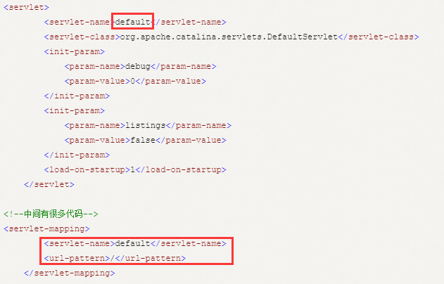

可以得知，/是servlet中预定义好的一个映射路径：servlet的缺省映射路径（<url-pattern>/</url-pattern>）是在tomcat服务器内置的一个映射路径。该路径对应的是一个DefaultServlet（缺省Servlet）。这个缺省的Servlet的作用是用于解析web应用的静态资源文件。

## 14.5.注意点

**路径匹配和扩展名匹配无法同时设置**

　匹配方法只有三种，要么是路径匹配（以“/”字符开头，并以“/*”结尾），要么是扩展名匹配（以“*.”开头），要么是精确匹配，三种匹配方法不能进行组合。如“/user/*.action”是非法的。另外注意：“/aa/*/bb”是精确匹配，这里的*不是通配的含义。

# 15.异步处理

Tomcat的线程池是有限，如果服务端的某个请求很耗时，当多次请求后，会把Tomcat的线程池耗光，此时客户端如果再请求的话，服务端就没有线程处理了，会导致长时间无法响应客户端的请求。

如果某个操作既耗时很长，客户端又必须要等待其返回才能进一步处理时，应该通过什么方式来处理？Servlet3.0中引入异步请求处理来处理这种场景，相应的，Spring在3.2版本中就引入相关机制来使用Servlet的该特性。这就是

springMVC的异步处理机制：异步处理并不是说前端一请求立即就收到响应，并不是这样，前端还是会一直等待服务处理的时间。只不过Tomcat主线程会开一个线程去处理耗时服务，让主线程可以继续接收前端其它请求，等子线程处理完数据，由它返回给前端

## 15.1.配置异步处理支持

springMVC开启异步支持，实际上就是开启Servlet的异步支持，所以需要在web.xml中配置所有的\<servlet>和<filter>，为其加上如下的配置：\<async-supported>true</async-supported>

```xml
<servlet>
    <servlet-name>springmvc_rest</servlet-name>
    <servlet-class>org.springframework.web.servlet.DispatcherServlet</servlet-class>
    <init-param>
        <param-name>contextConfigLocation</param-name>
        <param-value>classpath:spring.xml</param-value>
    </init-param>
    <!-- servlet配置在这 -->
    <async-supported>true</async-supported>
</servlet>
```

```xml
<filter>
    <filter-name>HiddenHttpMethodFilter</filter-name>
    <filter-class>org.springframework.web.filter.HiddenHttpMethodFilter</filter-class>
    <!--filter配置在这 -->
    <async-supported>true</async-supported>
</filter>
```

## 15.2.三种异步处理机制

1. 使用Callable或者DeferredResult当成Controller的返回值，能够处理异步返回单个结果的场景

2. 使用ResponseBodyEmitter/SseEmitter或者StreamingResponseBody来流式处理多个返回值

3. 在Controller中使用响应式客户端调用服务并返回响应式的数据对象

### 15.2.1.callable方式

callable方式最简单，在Controller的方法中返回Callable对象就行了。springmvc会自动使用它自己的线程池执行，然后再返回给前端：

```java
@GetMapping(value = "callable",produces = "text/html;charset=UTF-8")
public Callable<String> tryCallable(){
    Callable<String> callable = ()->{
        Thread.sleep(20000);
        return "异步阻塞一个请求20s";
    };
    return callable;
}
```

### 15.2.2.deferredResult方式

实际开发中，我们可以结合消息队列+DeferredResult实现异步处理，如下：

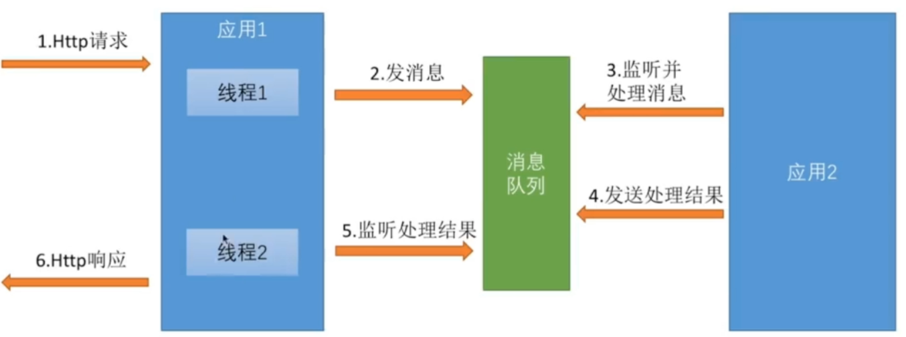

在客户端发起一次耗时的请求时，应用1的Controller创建一个DeferredResult对象，将其写入到消息队列中，直接返回DeferredResult，让主线程可以处理别的请求；应用2的线程监听消息队列，获取到应用1设置的DeferredResult对象，将数据处理完以后保存到DeferredResult对象内，重新向消息队列写入DeferredResult对象，应用1的线程监听到有结果返回，就从消息队列中取到DeferredResult对象，返回给客户端。DeferredResult与Callable的用法有异曲同工之妙，都是直接在Controller中返回，然后让新线程处理它，再返回给客户端即可。

```java
@RequestMapping(value = "defer",produces = "text/html;charset=UTF-8")
public DeferredResult<String> tryDeferredResult(long time) throws Exception{
    DeferredResult<String> result = new DeferredResult<>(time);
    // 当执行DeferredResult超时会调用此方法
    result.onTimeout(()->{
        System.out.println("调用超过,值为："+result.getResult());
        result.setResult("调用超时");
    });
    // 当执行完DeferredResult就会调用此方法
    result.onCompletion(()->{
        System.out.println("调用已结束,值为"+result.getResult());
    });
    // 此方法创建一个线程来执行此result对象
    this.runDeferredResultAfterTime(result,5000);
    return result;
}
```

