# 1.OAuth2协议

OAuth2协议就是一种授权机制。在经过用户授权后为第三方应用颁发一个有时效性的令牌 token，用来代替密码，供第三方应用使用。使得第三方应用能够通过该令牌获取相关的资源，常用于第三方登录，例如第三方应用使用QQ、weChat和FaceBook来实现对本应用的登录。官网地址：[https://oauth.net/2/](https://oauth.net/2/)

## 1.1.运行流程

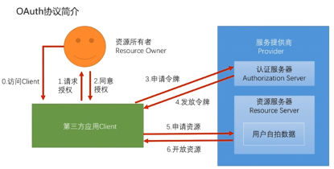

OAuth2都需要用一个服务提供商，它必须提供认证服务和资源服务，这个服务提供商就相当于QQ和微信。当第三方应用，需要用户的QQ信息或者说需要使用用户的QQ来登录应用时，就需要先引导用户，让其授权给第三方应用。当获得用户同意后，第三方应用就会向QQ认证服务器申请一个令牌，此时QQ认证服务器就会验证说用户是否真的授权了。一旦验证通过，QQ认证服务器就会向第三方应用发放令牌，最终第三方应用就可以拿着这个令牌向QQ资源服务器申请用户的数据。在这一整个过程中，上图第2步最为重要，怎么引导用户授权给第三方应用，为此OAuth提供了4种授权方式：**授权码模式、简化模式、密码模式、客户端模式**。

## 1.2.授权模式

### 1.2.1.授权码模式

授权码模式是OAuth四种授权模式中最安全、最完整、最详细的。**最大特点：**用户同意授权的动作是在服务提供商的认证服务器上完成的

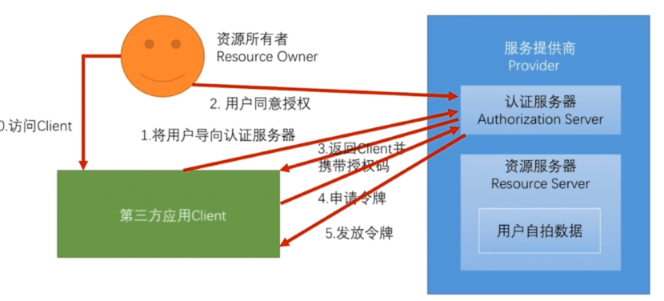

当用户（资源所有者）访问第三方应用时，第三方应用会将用户引导至认证服务器，用户会在服务提供商的认证服务器上决定是否要授权，类似这样：

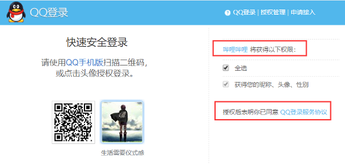

当用户同意授权后，就没有用户什么事了。认证服务器会返回一个授权码给第三方应用，第三方应用后台收到这个授权码以后，就会再向认证服务器发起请求，通过授权码申请令牌，认证服务器验证授权码通过后，返回一个令牌，到此就完成了OAuth的授权流程。

# 2.spring social

springSocial就是基于OAuth协议封装的一套第三方登录框架，它所要做的就是将前面讲的OAuth[授权模式](#1.2.授权模式)封装起来，获取到用户信息（下图第6步），然后通过SocialAuthenticationFilter过滤器构建用户的认证实体Authentication，并将其放入到SecurityContext中完成登录

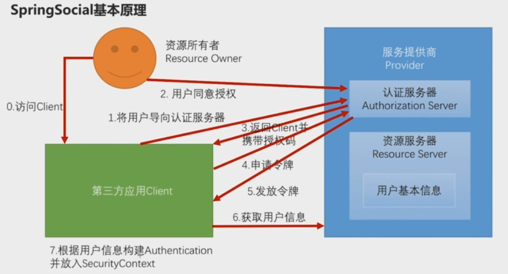

## 2.1.API接口

spring social默认实现了大部分功能，我们需要做的就是下面这些组件：

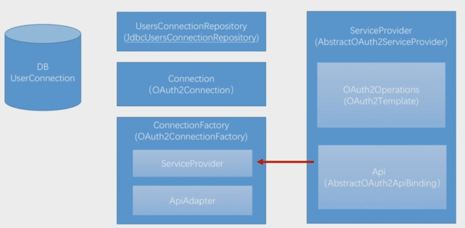

### 2.1.1.AbstractOAuth2ApiBinding

由于第三方的用户信息各有各的封装，spring无法统一，因此它提供抽象类AbstractOAuth2ApiBinding用来封装第三方的返回信息，它里面有两个属性其中一个是accessToken，这个就是第三方发放的令牌，通过它去资源服务器拿到用户的信息，所以这个Api就是完成[springSocial基本原理](#2.spring social)的第6步

```java
public abstract class AbstractOAuth2ApiBinding implements ApiBinding, InitializingBean {
  	private final String accessToken;
  	private RestTemplate restTemplate;
}
```

### 2.1.2.ServiceProvider

API实现了第6步，用来获取用户信息，而前5步就是通过ServiceProvider来实现，spring social提供了AbstractOAuth2ServiceProvider抽象类来完成引导用户到认证服务器上，直至拿到授权码的过程。ServiceProvider需要2个组件，其一是API，另一个就是OAuth2Operations，其默认实现类为OAuth2Template。OAuth2Operations需要构建重定向的引导认证的url地址、需要构建获取授权码的url地址，以及获取令牌的url地址，并对OAuth令牌做封装，封装成一个AccessGrant对象

```java
public interface OAuth2Operations {
  String buildAuthorizeUrl(OAuth2Parameters parameters);
  
  String buildAuthorizeUrl(GrantType grantType, OAuth2Parameters parameters);
  
  String buildAuthenticateUrl(OAuth2Parameters parameters);
  
  String buildAuthenticateUrl(GrantType grantType, OAuth2Parameters parameters);
  
  AccessGrant exchangeForAccess(String authorizationCode, String redirectUri, 
                                MultiValueMap<String, String> additionalParameters);
  
  AccessGrant exchangeCredentialsForAccess(String username, String password, 
               MultiValueMap<String, String> additionalParameters);
  
  AccessGrant refreshAccess(String refreshToken, 
                            MultiValueMap<String, String>
                            additionalParameters);
  
  AccessGrant authenticateClient();
  
  AccessGrant authenticateClient(String scope);
}
```

### 2.1.3.ApiAdapter

完成前两个组件后，此时已经拿到了第三方用户的个人信息，需要将其封装一个AuthentiactionToken对象，才能表示已登录。所以要把第三方用户的信息，与本地业务系统的用户信息关联，这件事就交给ApiAdapter来实现：

```java
public interface ApiAdapter<A> {
    boolean test(A api);
  	//最主要的方法，用户信息在此做映射
    void setConnectionValues(A api, ConnectionValues values);
    UserProfile fetchUserProfile(A api);
    void updateStatus(A api, String message);
}
```

### 2.1.4.ConnectionFactory

有了ServiceProvider和ApiAdapter，就可以创建出一个连接工厂ConnectionFactory，默认为OAuth2ConnectionFactory实现类。连接工厂的作用就是为了创建一个连接对象Connection，但是这种连接并不是像数据库那样的连接，它其实就是一个对实体类的封装，用来生成认证主体SocialAuthenticationToken而已

```java
public interface Connection<A>extends Serializable {
    ConnectionKey getKey();
    String getDisplayName();
    String getProfileUrl();
    String getImageUrl();
    void sync();
    boolean test();
    boolean hasExpired();
    void refresh();
    UserProfile fetchUserProfile();
    void updateStatus(String message);
    A getApi();
    ConnectionData createData();
}
```

### 2.1.5.UsersConnectionRepository

UsersConnectionRepository是spring social用来将第三方用户信息保存到数据库的工具类，默认实现类为：JdbcUsersConnectionRepository。spring会自己创建一张表，将第三方用户信息保存到这张表，表结构为：

```sql
create table UserConnection (userId varchar(255) not null,
	providerId varchar(255) not null,
	providerUserId varchar(255),
	rank int not null,
	displayName varchar(255),
	profileUrl varchar(512),
	imageUrl varchar(512),
	accessToken varchar(512) not null,
	secret varchar(512),
	refreshToken varchar(512),
	expireTime bigint,
	primary key (userId, providerId, providerUserId));
create unique index UserConnectionRank on UserConnection(userId, providerId, rank);
```

## 2.2.源码分析

springSocial的认证登陆流程和springSecurity的核心认证流程是一样的。同样是通过一个过滤器去创建一个认证主体AuthenticationToken，判断它是否是已被认证的，然后放入到SecurityContext中，表示用户已完成登陆。只不过springSocial多了中间几步，它需要去第三方服务提供商拿到用户信息，后面流程就跟springSecurity核心认证流程一样：

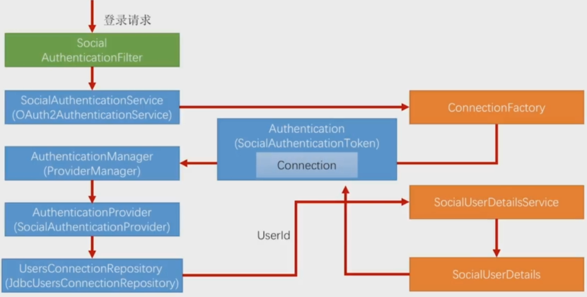

### 2.2.1.attemptAuthtication()

SocialAuthenticationFilter是spring social的拦截器，它实现了抽象类AbstractAuthenticationProcessingFilter （大部分处理认证请求拦截器的父类），父类实现了doFilter()方法，它会调用子类的attemptAuthentication()来尝试获取token。所以起点就是在这：

```java
public Authentication attemptAuthentication(HttpServletRequest request, 
         HttpServletResponse response) throws AuthenticationException {
  
  //用户拒绝授权，直接抛出异常，如何判断用户拒绝授权，请看后面的detectRejection()方法
  if (detectRejection(request)) {
    throw new SocialAuthenticationException(
      	"Authentication failed because user rejected authorization.");
  }
  Authentication auth = null;
  //获取用户定义的所有ProviderId,每个ProviderId代表一个第三方服务商
  Set<String> authProviders = authServiceLocator.registeredAuthenticationProviderIds();
  //获取前端请求发过来的ProviderId，默认是过滤器拦截地址（/auth）后面的uri
  String authProviderId = getRequestedProviderId(request);
  if (!authProviders.isEmpty() && authProviderId != null 
      && authProviders.contains(authProviderId)) {
      //通过ProviderId来查找相应的SocialAuthenticationService接口
      // spring social默认使用OAuth2AuthenticationService实现类
      SocialAuthenticationService<?> authService = 
           authServiceLocator.getAuthenticationService(authProviderId);
     //调用attemptAuthService()方法尝试获取Token对象，若获取到则使用第三方登陆成功
     // 若返回null，说明认证失败，返回给登陆失败处理器处理；还有可能抛出异常
     auth = attemptAuthService(authService, request, response);
     if (auth == null) {
            throw new AuthenticationServiceException("authentication failed");
      }
   }
   return auth;
}
```

detectRejection()方法来校验用户是否拒绝了授权，可以被覆盖实现适合业务系统的逻辑：

```java
//此方法判断用户是否拒绝授权，当返回true，意味着用户拒绝了授权。
// spring social默认实现是根据单个参数state或者没有预期的3个参数
//在自己系统中可以覆盖掉此方法，实现符合第三方返回信息的判断
protected boolean detectRejection(HttpServletRequest request) {
    Set<?> parameterKeys = request.getParameterMap().keySet();
    if ((parameterKeys.size() == 1) && (parameterKeys.contains("state"))) {
      return false;
    }
    return parameterKeys.size() >0 
      && !parameterKeys.contains("oauth_token") 
      && !parameterKeys.contains("code") 
      && !parameterKeys.contains("scope");
}
```

### 2.2.2.attemptAuthService()

SocialAuthenticationFilter会调用本方法尝试获取一个认证主体token。而本方法会先去申请第三方的令牌，然后在与本地业务系统的用户信息做关联：

```java
private Authentication attemptAuthService(final SocialAuthenticationService<?>
        authService, final HttpServletRequest request, HttpServletResponse response) 
  			throws SocialAuthenticationRedirectException, AuthenticationException {
  
    //调用SocialAuthenticationService接口的getAuthToken()方法获取Token对象
    final SocialAuthenticationToken token = authService.getAuthToken(request, response);
    if (token == null) return null;
    Assert.notNull(token.getConnection());
    //通过SecurityContextHolder.getContext().getAuthentication()获取当前线程对应的
    // 认证主体，如果此次请求未被认证，则执行doAuthentication();如果已被认证，则调用
    // addConnection()方法。
    Authentication auth = getAuthentication();
    if (auth == null || !auth.isAuthenticated()) {
      	return doAuthentication(authService, request, token);
    } else {
        addConnection(authService, request, token, auth);
        return null;
    }
}  
```

当通过SocialAuthenticationService接口获取到一个不为空的认证token，即SocialAuthenticationToken后，spring social会根据当前请求的认证情况来处理这个认证token。若此次请求还没有被认证，就会调用doAuthentication()方法：

```java
//注意：此时的SocialAuthenticationToken是未被认证的
private Authentication doAuthentication(SocialAuthenticationService<?> authService, 
        HttpServletRequest request, SocialAuthenticationToken token) {
  try {
    // 根据ConnectionCardinality枚举类（默认为ONE_TO_ONE，表示自己系统用户ID和第三方系
    // 统用户ID是一一对应关系）策略，来判断是否可能要认证，当无需认证时返回null
    if (!authService.getConnectionCardinality().isAuthenticatePossible()) 
      return null;
    //将request的一些信息（例如IP）保存到认证主体token中
    token.setDetails(authenticationDetailsSource.buildDetails(request));
    //这里是标准的springSecurity认证流程，通过AuthenticationManager选取合适的
    // AuthenticationProvider处理未被认证的token。spring social提供了
    // SocialAuthenticationProvider来处理SocialAuthenticationToken，源码在后面
    Authentication success = getAuthenticationManager().authenticate(token);
    // spring social要求认证主体token的principle类型必须为SocialUserDetails
    Assert.isInstanceOf(SocialUserDetails.class, success.getPrincipal(), 
                        "unexpected principle type");
    //如果创建token没有任何问题，就会调用ConnectionRepository接口更新spring social
    // 定义的关联表的信息（关联表可以在JdbcConnectionRepository同级包目录下找到）
    updateConnections(authService, token, success);
    return success;
  } catch (BadCredentialsException e) {
    // connection unknown, register new user?
    // SocialAuthenticationProvider处理未认证Token时可能会抛出的异常
    // 表示当前系统业务系统没有与第三方用户信息匹配的用户信息，它就默认重定向它注册地址
    if (signupUrl != null) {
      // store ConnectionData in session and redirect to register page
      //保留连接Connection的信息到session中，给注册页面用
      sessionStrategy.setAttribute(new ServletWebRequest(request),
                                   ProviderSignInAttempt.SESSION_ATTRIBUTE,
                                   new ProviderSignInAttempt(token.getConnection()));
      throw new SocialAuthenticationRedirectException(buildSignupUrl(request));
    }
    throw e;
  }
}
```

当通过SocialAuthenticationService接口获取到一个**已认证**，SocialAuthenticationToken后，就会调用addConnection()方法：

```java
//注意：此时的SocialAuthenticationToken是已经认证过的
private void addConnection(final SocialAuthenticationService<?> authService, 
     HttpServletRequest request, SocialAuthenticationToken token, Authentication auth) {
  // already authenticated - add connection instead
  String userId = userIdSource.getUserId();
  Object principal = token.getPrincipal();
  if (userId == null || !(principal instanceof ConnectionData)) return;
  //注意此时用户在本地业务系统登陆成功了
  //这里会判断当前第三方用户是否已经存在业务系统数据中，当存在时返回null
  //若不存在spring social会创建一个新的连接，保存到数据库中并将其返回
  Connection<?> connection = addConnection(authService, userId, (ConnectionData) principal);
  if(connection != null) {
    //将请求重定向指定url（第三方授权地址上）
    String redirectUrl = authService.getConnectionAddedRedirectUrl(request, connection);
    if (redirectUrl == null) {
      // use default instead
      redirectUrl = connectionAddedRedirectUrl;
    }
    throw new SocialAuthenticationRedirectException(redirectUrl);
  }
}
```

### 2.2.3.getAuthToken()

在[attemptAuthService()](#2.2.2.attemptAuthService())的第一行代码，就是调用接口SocialAuthenticationService.getAuthToken()，默认的实现类是OAuth2AuthenticationService。注意，这个方法会在两种场景下被调用：

```java
public SocialAuthenticationToken getAuthToken(HttpServletRequest request, 
        HttpServletResponse response) throws SocialAuthenticationRedirectException {
  //获取请求中的参数code（注：当第三方认证服务器回调时会携带授权码code调用自己的业务系统）
  String code = request.getParameter("code");
  if (!StringUtils.hasText(code)) {
      //若请求request不含code，说明这次请求是引导用户去授权的（即准备拿授权码）
      // spring social会组装调用参数，并且设置重定向url
      OAuth2Parameters params =  new OAuth2Parameters();
      params.setRedirectUri(buildReturnToUrl(request));
      setScope(request, params);
      params.add("state", generateState(connectionFactory, request));
      //此方法是抽象方法，给子类实现的，解决不同第三方认证时需要的不同参数
      addCustomParameters(params);
      //抛出重定向异常，spring social捕获到此异常，就会将请求重定向指定url上
      //这边指定的url就是在创建OAuth2Template时设置的authorizeUrl变量
      throw new SocialAuthenticationRedirectException
        (getConnectionFactory().getOAuthOperations().buildAuthenticateUrl(params));
  } else if (StringUtils.hasText(code)) {
      //如果存在code参数，那么说明是第三方回调的请求，这时code就代表着授权码
      try {
          String returnToUrl = buildReturnToUrl(request);// 构建第三方回调的地址，准备申请令牌
          // 调用exchangeForAccess()方法去获取令牌，源码在后面
          AccessGrant accessGrant = getConnectionFactory().getOAuthOperations().
            exchangeForAccess(code, returnToUrl, null);
          // 通过获取到的令牌创建一个连接（其实就是将令牌封装成Connection对象），
          Connection<S> connection = getConnectionFactory().createConnection(accessGrant);
          //再将Token封装成SocialAuthenticationToken()返回，注意：此时Token未被认证
          return new SocialAuthenticationToken(connection, null);
      } catch (RestClientException e) {
        	return null;
      }
  } else {
    	return null;
  }
}
```

exchangeForAccess()先构建出标准的OAuth2协议访问所需的参数，然后调用restTemplate发起一个post请求获取令牌

```java
public AccessGrant exchangeForAccess(String authorizationCode, String redirectUri, 
            MultiValueMap<String, String> additionalParameters) {
  MultiValueMap<String, String> params = new LinkedMultiValueMap<String, String>();
  //这个参数默认为false，意味着appID和app秘钥，不会被带上，如果第三方要求带上，我们需要在
  //设置OAuth2Operations的时候手动将其赋值为true
  if (useParametersForClientAuthentication) {
    params.set("client_id", clientId);
    params.set("client_secret", clientSecret);
  }
  params.set("code", authorizationCode);
  params.set("redirect_uri", redirectUri);
  params.set("grant_type", "authorization_code");
  if (additionalParameters != null) {
    params.putAll(additionalParameters);
  }
  //参数封装完成后，调用postForAccessGrant()方法向第三方获取令牌，此url是我们创建
  // OAuth2Operations实现类时设置的获取token的url地址。
  //spring会将第三方返回的信息封装成一个AccessGrant对象，这个对象就是spring social对
  // OAuth2令牌的封装
  return postForAccessGrant(accessTokenUrl, params);
}
```

### 2.2.4.authenticate()

之前分析过，方法[attemptAuthService()](#2.2.2.attemptAuthService())首先会调用[getAuthToken()](#2.2.3.getAuthToken())方法先向第三方获取令牌信息，然后会创建一个未经过认证的SocialAuthenticationToken对象，接着给SocialAuthenticationProvider的authenticate()方法进行认证：

```java
public Authentication authenticate(Authentication authentication) 
  throws AuthenticationException {

    //对认证主体authentication先参数校验下
    Assert.isInstanceOf(SocialAuthenticationToken.class, authentication, 
                        "unsupported authentication type");
    Assert.isTrue(!authentication.isAuthenticated(), "already authenticated");
    SocialAuthenticationToken authToken = (SocialAuthenticationToken) authentication;

    String providerId = authToken.getProviderId();
    Connection<?> connection = authToken.getConnection();
    //调用toUserId()方法获取我们自己业务系统内的用户ID，获取不到就抛异常，拒绝登录
    //toUserId()方法源码在后面
    String userId = toUserId(connection);
    if (userId == null) {
      throw new BadCredentialsException("Unknown access token");
    }
    //如果能获取到，调用userDetailsService实现类构建我们自己业务系统的用户信息
    UserDetails userDetails = userDetailsService.loadUserByUserId(userId);
    if (userDetails == null) {
      throw new UsernameNotFoundException("Unknown connected account id");
    }
    //这时候就会构建出一个已认证的SocialAuthenticationToken对象，意味着用户登录登录成功
    return new SocialAuthenticationToken(connection, userDetails, 
             authToken.getProviderAccountData(), getAuthorities(providerId, userDetails));
}
```

toUserId()方法会调用之前设置的UsersConnectionRepository接口从数据库中找出与第三方返回的用户信息匹配的我们自己业务系统的用户信息

```java
protected String toUserId(Connection<?> connection) {
  List<String> userIds = usersConnectionRepository.findUserIdsWithConnection(connection);
  // only if a single userId is connected to this providerUserId
  return (userIds.size() == 1) ? userIds.iterator().next() : null;
}
```

默认我们是使用JdbcUsersConnectionRepository操作数据库，所以查找数据库的工作就会交给它来完成：

```java
public List<String>findUserIdsWithConnection(Connection<?> connection) {
  // ConnectionKey包含两个属性：providerId和providerUserId，分别表示
  // 第三方服务提供方的ID和用户在第三方系统的唯一ID，例如：
  // providerId可以为”qq”表示腾讯QQ，providerUserId可以为”SDFI3234sasDF3”表示唯一身份
  ConnectionKey key = connection.getKey();
  
  //查询数据表，看看我们自己业务系统的用户，用没用与当前第三方用户信息匹配的用户
  List<String> localUserIds = jdbcTemplate.queryForList("select userId from " +
             tablePrefix + "UserConnection where providerId = ? and providerUserId = ?", 
             String.class, key.getProviderId(), key.getProviderUserId());
  
  //如果当前系统没有与其匹配的用户，并且ConnectionSignUp接口不为空
  //（这个接口需要开发者手动设置）
  if (localUserIds.size() == 0 &&connectionSignUp != null) {
      //则会创建一个新的用户
      String newUserId = connectionSignUp.execute(connection);
      if (newUserId != null){
        //并将新创建的用户与第三方返回的用户信息关联起来，保存到spring social默认创建的中间表内
        createConnectionRepository(newUserId).addConnection(connection);
        return Arrays.asList(newUserId);
      }
  }
  return localUserIds;
}
```

# 3.spring oauth

​	在BS架构中(浏览器与服务端)，可以借助HttpSession和cookie来存储用户的认证信息，但是如果在CS架构(客户端APP与服务端)，APP是没有cookie的，这种情况下会用token(令牌)来替换cookie，spring oauth就是来解决这一问题！

​	在之前介绍OAuth协议[运行流程](#1.1.运行流程)，第三方客户端通过[spring social](#2.spring social)可以与服务提供商获取第三方用户信息，也即spring social就是解决第三方客户端与服务提供商的交互；而spring oauth是作用在**服务提供商**(运行流程图的右半边)。spring oauth实现4种授权模式，用来给客户端提供Token（令牌），它也支持自定义认证；对于资源服务器，spring oauth添加了过滤器OAuth2AuthenticationProcessingFilter来验证客户端的Token，以允许客户端访问资源服务器的Rest服务

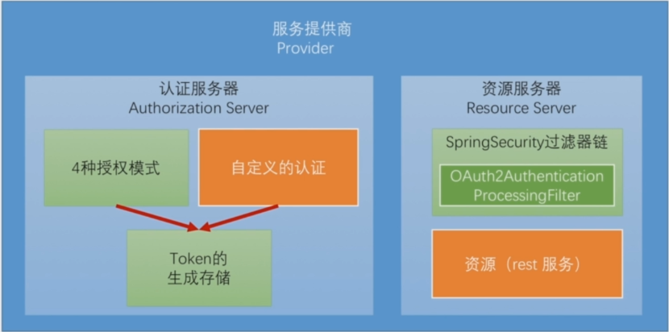

## 3.1.最简OAuth服务

spring oauth搭建基于OAuth2的服务提供商超级简单，只需要两个注解即可：

`@EnableAuthorizationServer` – 开启认证服务器的配置

`@EnableResourceServer` – 开启资源服务器的配置

默认spring会自动生成client-id和client-secret，这样完整的OAuth2服务提供商就已经搭建，便可以使用spring social与其交互实现第三方登录。也可以手动指定client-id和client-secret

```yaml
security:
  oauth2:
		client:
      client-id: sym-1995-0731-666
      client-secret: sym-fantastic
```

默认spring oauth已经实现了4种授权模式，这里我们测试授权码模式和密码模式

### 3.1.1.测试：授权码模式

根据[OAuth2官网文档](https://tools.ietf.org/html/rfc6749#section-4.1.1)，授权码模式需要先向认证服务器申请授权码，默认授权码请求地址在：/oauth/authorize。我们需要组装4个参数：

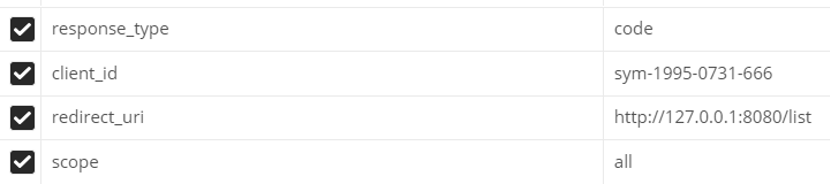

将请求发送给spring oauth，登录后它会返回这样一个页面，这里就是表示授权了：


点击Approve后，它就会携带授权码重定向到我们指定的redirect_uri；接着我们就要申请令牌，spring oauth默认请求地址：/oauth/token。需要如下参数：

- grant_type，固定为authorization_code

- code，为上面返回的授权码

- redirect_uri和client_id就是回调地址和唯一标识

- scope，需要自己定义，表示要获取的哪些资源，也即令牌的作用领域有多大

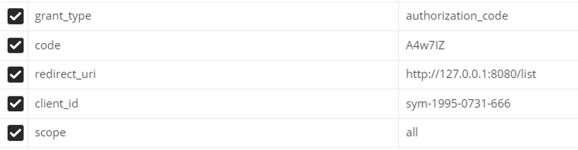

并且请求必须带上client_id和client_secret（不然不知道是哪个第三方）

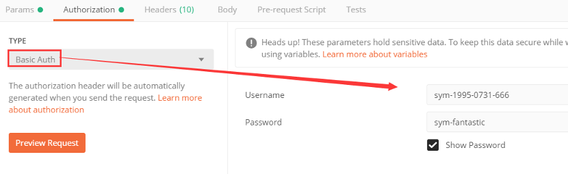

点击发送后，就可以收到令牌，带着令牌就可以去资源服务器获取资源

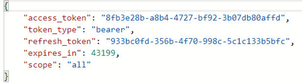

### 3.1.2.测试：密码模式

密码模式简单多了，直接给认证服务器，用户名和密码即可，grant_type要改为password，这些都可以在[OAuth官网](https://tools.ietf.org/html/rfc6749#section-4.3.1)找到

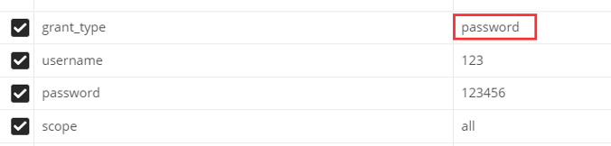

同样头部也要做一个处理，好让认证服务器知道这是哪个APP在申请令牌

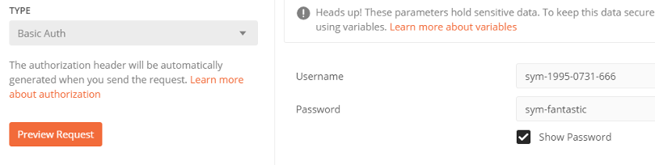

## 3.2.核心组件

待议....

- ClientDetails
- TokenRequest
- TokenGranter
- OAuth2Authentication
- TokenStore
- TokenEnhancer

## 3.3.源码分析

下图是spring oauth获取令牌的一个标准流程：

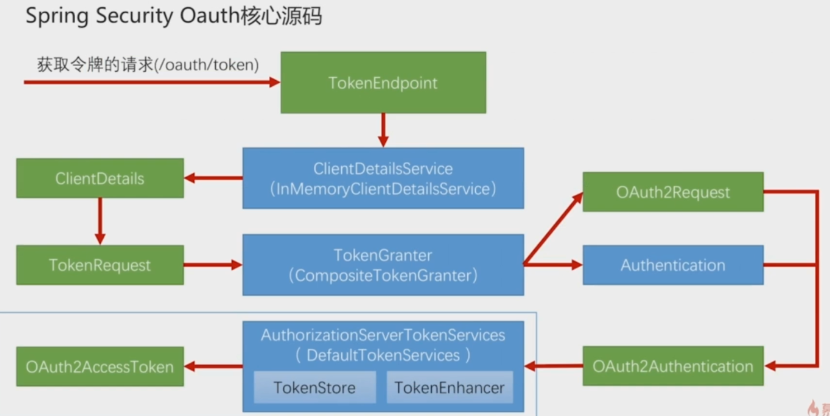

# 4.第三方登录

第三方登录，目前都是使用OAuth2协议来完成的，spring对OAuth2协议做了封装，该模块为spring social。、

## 4.1.QQ登录

QQ基于OAuth2协议登录的介绍网址：[https://wiki.connect.qq.com/oauth2-0](https://wiki.connect.qq.com/oauth2-0)简介

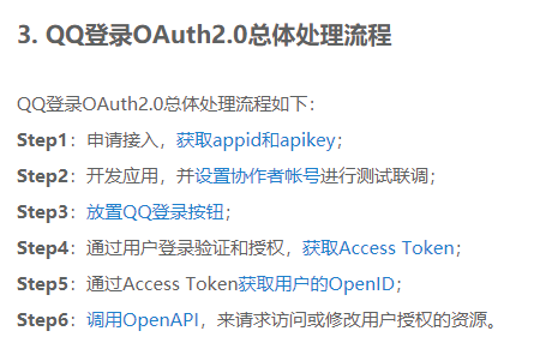

这个要等申请域名和搭建自己网站后，再来处理...不然QQ回调不了...

## 4.2.微信登录

...等有域名和网站...

## 4.3.绑定与解绑

spring提供了一个控制层，来进行绑定与解绑第三方账号：org.springframework.social.connect.web.ConnectController。注意，使用这个类时，我们需要自己给它一个视图对象View

