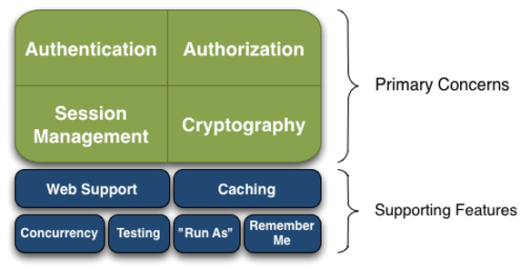
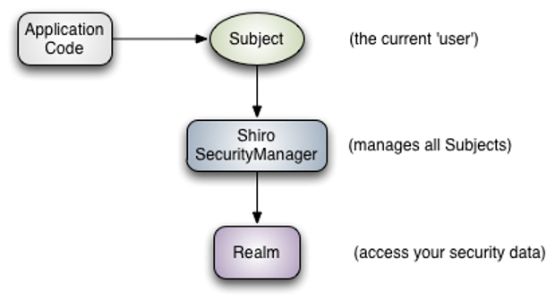
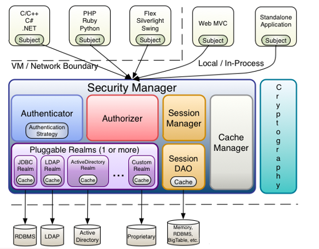
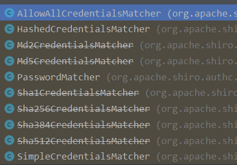
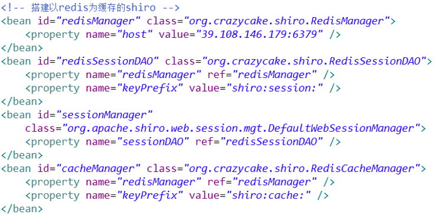
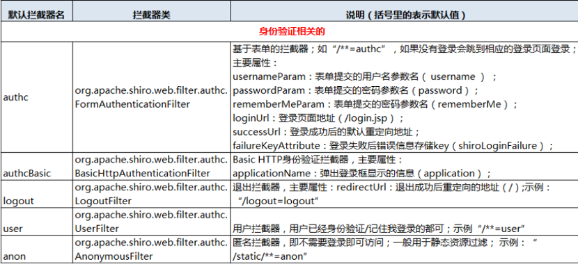
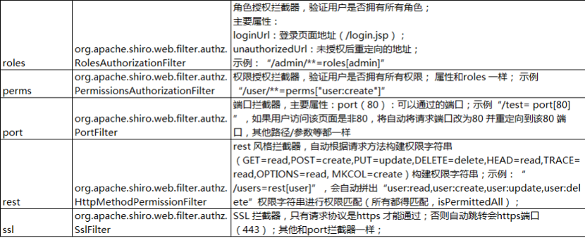
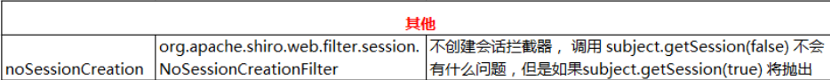

# 1.shiro简介

Apache Shiro是Java的一个安全框架，相比于spring security，它更简单、更轻便，不仅可以用在JavaEE环境，也可以用在JavaSE环境。shiro的基本功能点如下：



## 1.1.模块

| **模块**        | **功能**                                                     |
| --------------- | ------------------------------------------------------------ |
| Authentication  | 认证，即用户登录，验证用户是不是合法的或者是否登录           |
| Authorization   | 授权，即权限验证，验证某个已认证的用户是否拥有某个权限，即判断用户是否能进行什么操作，如：验证某个用户是否拥有某个角色；或者细粒度的验证某个用户对某个资源是否具有某个权限 |
| Session Manager | 会话管理，即用户登录后就是一次会话，在没有退出之前，它的所有信息都在会话中；会话可以是普通 JASE 环境，也可以是 Web 环境 |
| Cryptography    | 加密，保护数据的安全性，如密码加密存储，而不是明文存储；Web Support：Web 支持，可以非常容易的集成到Web 环境 |
| Caching         | 缓存，比如用户登录后，其用户信息、拥有的角色/权限不必每次去查，  这样可以提高效率 |
| Concurrency     | Shiro  支持多线程应用的并发验证，即如在一个线程中开启另一个线程，能把权限自动传播过去 |
| Testing         | 提供测试支持                                                 |
| Run As          | 允许一个用户假装为另一个用户（如果他们允许）的身份进行访问   |
| Remember Me     | 记住我，这个是非常常见的功能，即一次登录后，指定时间内下次再使用就不用登录了 |

shiro不会去维护用户和维护权限；这些需要我们自己去设计/提供；然后通过相应的接口注入给Shiro即可

## 1.2.架构

### 1.2.1.对外



1. ApplicationCode：表示shiro的使用方；

2. Subject：应用程序与shiro直接交互的对象，即对外API 核心就是 Subject，与 Subject 的所有交互都会委托给 SecurityManager；Subject 其实是一个门面，SecurityManager 才是实际的执行者；

3. SecurityManager：安全管理器；即所有与安全有关的操作都会与它交互；且其管理着所有 Subject；可以看出它是 Shiro的核心，它负责与 Shiro 的其他组件进行交互，它扮演着类似SpringMVC 前端控制器的角色；

4. Realm：Shiro 从 Realm 获取安全数据（如用户、角色、权限），就是说SecurityManager 要验证用户身份，那么它需要从 Realm 获取相应的用户进行比较以确定用户身份是否合法；也需要从 Realm 得到用户相应的角色/权限进行验证用户是否能进行操作；可以把 Realm 看成 DataSource

### 1.2.2.对内



1. Subject：任何可以与shiro交互的“用户”；

2. SecurityManager ：是 Shiro 的心脏；所有具体的交互都通过 它进行控制；它管理着所有 Subject且负责进行认证、授权、会话及缓存的管理

3. Authenticator：负责 Subject 认证，是一个扩展点，可以自定义实现；可以使用认证策略（Authentication Strategy）

4. Authorizer：授权器、即访问控制器，用来决定主体是否有权限进行相应的操作；即控制着用户能访问应用中的哪些功能

5. Realm：可以有 1 个或多个 Realm，可以认为是安全实体数据源，即用于获取安全实体的；可以是JDBC 实现，也可以是内存实现等等；由用户提供；所以一般在应用中都需要实现自己的 Realm

6. SessionManager：管理 Session 生命周期的组件；而 Shiro 并不仅仅可以用在 Web环境，也可以用在如普通的 JavaSE 环境

7. CacheManager：缓存控制器，来管理如用户、角色、权限等的缓存的；因为这些数据基本上很少改变，放到缓存中后可以提高访问的性能

8. Cryptography：密码模块， 提供一些常见的加密组件用于密码加密和解密

# 2.搭建环境

搭建shiro的web环境，一般会与spring整合。

## 2.1.属性配置

### 2.1.1.web.xml

在web.xml中配置spring的web环境(spring监听器和springMVC前端控制器)；然后要配置一个shiro的过滤器，这是最关键的：

```xml
<!--shiro过滤器 -->
<filter>
   <filter-name>shiroFilter</filter-name>
   <filter-class>org.springframework.web.filter.DelegatingFilterProxy</filter-class>
   <init-param>
      <param-name>targetFilterLifecycle</param-name>
      <param-value>true</param-value>
   </init-param>
</filter>
<filter-mapping>
   <filter-name>shiroFilter</filter-name>
   <url-pattern>/*</url-pattern>
</filter-mapping>
```

shiro 提供了Web的支持，其通过一个ShiroFilter 入口来拦截需要安全控制的URL，然后进行相应的控制。如果shiro与spring集成，shiroFilter一般都是配置在spring.xml中，我们在web.xml只是配置让spring去容器中加载此过滤器；DelegatingFilterProxy 作用是自动到 Spring 容器查找名字为 shiroFilter（自定义的过滤器名称）的 bean 并把所有 Filter的操作委托给它。

### 2.1.2.spring.xml

spring.xml就是将shiro的组件注册到IOC容器中：(下载完shiro的压缩包后，找到如下路径，可以看到shiro给的配置模板 ..\shiro-root-1.3.2\samples\spring\src\main\webapp\WEB-INF\)

1. 配置shiro的安全管理器securityManager，它需要注入缓存管理器和实体数据源Realm：

   ```xml
   <bean id="securityManager" 
   class="org.apache.shiro.web.mgt.DefaultWebSecurityManager">
          <!--配置缓存管理器 -->
          <property name="cacheManager" ref="cacheManager" />
          <!--配置Realm-->
          <property name="realm" ref="finalRealm" />
   </bean>
   ```

2. 配置缓存管理器，默认使用的是Ehcache缓存，所以项目中需要加入Ehcache的jar包和配置文件，后续可以改成redis作为缓存：

   ```xml
   <bean id="cacheManager" class="org.apache.shiro.cache.ehcache.EhCacheManager">
      <property name="cacheManagerConfigFile" value="classpath:ehcache.xml" />
   </bean>
   ```

3. 配置实体数据源。实体数据源需要我们自己完成，shiro提供了Realm接口，我们实现此接口完成自己的安全性数据读取即可，一般不实现Realm，而继承Realm的实现类

   ```xml
   <bean id="finalRealm" class="com.sym.realm.FinalRealm"/>
   ```

4. 配置lifecycleBeanPostProcessor，一个Bean后置处理器，会对shiro的org.apache.shiro.util.Initializable接口实现类做初始化：

   ```xml
   <bean id="lifecycleBeanPostProcessor" 
   class="org.apache.shiro.spring.LifecycleBeanPostProcessor" />
   ```

5. 配置shiro的注解，前提是第4步需要先完成

   ```xml
   <bean class=
   "org.springframework.aop.framework.autoproxy.DefaultAdvisorAutoProxyCreator"
      depends-on="lifecycleBeanPostProcessor" />
   
   <bean class=
   "org.apache.shiro.spring.security.interceptor.AuthorizationAttributeSourceAdvisor">
      <property name="securityManager" ref="securityManager" />
   </bean>
   
   ```

6. 最重要的一步，配置shiro的过滤器，就是在[web.xml](#2.1.1.web.xml)中指定的shiroFilter配置过滤器，指定安全管理器、登录页面(认证不成功都会跳转到此页面)、登录成功页面、权限认证失败页面。过滤器中最重要的配置就是：filterChainDefinitions，它指定哪些页面需要认证，访问这些页面需要什么样的权限。其中，最常用的：anon表示不用认证、authc表示需要认证

   ```xml
   <!--配置shiro的过滤器，id要和web.xml配置的shiro的过滤器名字一样 -->
      <bean id="shiroFilter" class="org.apache.shiro.spring.web.ShiroFilterFactoryBean">
      <property name="securityManager" ref="securityManager" />
          <!--指定登录页面 -->
          <property name="loginUrl" value="/static/login/login.jsp" />
          <!--指定登录成功页面-->
          <!-- <property name="successUrl" value="/index.jsp" />-->
          <!--指定权限不足时的页面 -->
          <property name="unauthorizedUrl" value="/static/error/unauthorized.jsp" />
          <!--过滤规则如果手写，在项目小的情况还可以，如果项目很大，一般是从数据库里读出来，
   然后封装成LinkedHashMap-->
   <property name="filterChainDefinitions">
              <value>
                 <!-- 注意优先匹配原则，一旦有一条匹配了，就不会继续往下匹配
                  登录页面以及一些静态数据不需要认证，得设置成匿名访问-->
                  /login.jsp = anon认证配置
                  /shiro/login = anon认证配置
                  /admin.jsp = perms["admin:user:add"]基于资源的权限配置
                  /test.jsp = roles[test]基于角色的权限配置
                 <!-- 余下其他页面都需要认证访问 ，要放到最后，因为优先匹配原则-->
                  /** = authc认证配置
              </value>
          </property>
   </bean>
   
   ```

   ## 2.2.url拦截规则

   配置shiroFilter过滤器时，在配置过滤规则filterChainDefinitions允许某个页面访问或不允许某个页面访问，有一个表达式：url=拦截器[参数]，例如：/login.jsp = anon。如果当前请求的 url匹配拦截规则的某个表达式，将会执行其配置的拦截器，url匹配，如果匹配了一条，就不会继续往下匹配了，比如：      

   ```text
   /** = authc
   /list.jsp = anon
   ```

   因为list.jsp已经符合第一条url匹配规则：/** = authc，所以/list.jap = anon就不起作用了，shiro采取第一次匹配优先的方式，而这条规则要求所有的url地址进行认证，所以list.jsp也是需要认证的。正是因为这个匹配优先原则，所以我们需要把不用认证的页面先写，最后再来对所有页面进行认证url拦截规则是依靠过滤器，像上面的anon和authc都是拦截器的简写。

# 3.加密

密码存放到数据库，一般都不能明文保存，需要加密后才可以放到数据库，而当我们取到前端传来的密码时，是把它进行加密得到一个字符串，然后让这个字符串和数据库中已加密保存的密码进行比对，这样完成密码校验！那么问题来了，在shiro中，使用什么方式进行密码加密？答案是使用CredentialsMatcher。

```java
public interface CredentialsMatcher {
   boolean doCredentialsMatch(AuthenticationToken token, AuthenticationInfo info);
}
```

接口定义了一个检验密码的方法， 一个从前端封装的token，一个是从数据库读出来的info。该接口的默认实现类有：



可以看到很多被不推荐使用，shiro推荐使用HashedCredentialsMatcher，通过指定加密算法来决定使用哪个加密器

## 3.1.配置加密器

具体的配置在spring.xml，替换当前Realm的credentialsMatcher，将credentialsMatcher属性指定为HashedCredentialsMatcher实现，然后在HashedCredentialsMatcher中指定加密的算法和加密的次数，这样以后想换成其他加密算法就方便多了：

```xml
<bean id="finalRealm" class="com.sym.realm.FinalRealm">
       <!--使用加密算法加密用户的密码-->
       <property name="credentialsMatcher">
         <bean class="org.apache.shiro.authc.credential.HashedCredentialsMatcher">
                <!--指定加密算法-->
                <property name="hashAlgorithmName" value="MD5" />
                <!--加密的次数-->
                <property name="hashIterations" value="2017" />
         </bean>
      </property>
</bean>
```

当配置了加密算法后，shiro就会将前端传来的密码进行加密得到待检的字符串，再跟数据库保存的密码进行匹配！因此现在需要将数据库中的密码变化一下，不能继续明文保存了，而是要加密保存。追踪源代码，可以看到shiro对密码加密是用下面的方法：

```java
//源码：HashedCredentialsMatcher – 443行
protected Hash hashProvidedCredentials(Object credentials, Object salt, 
	int hashIterations) {
String hashAlgorithmName = assertHashAlgorithmName();
// 通过new一个SimpleHash完成加密, 因此用户注册的时候也要加密码像这样加密保存
// 其中4个参数的含义依次为：
// hashAlgorithmName：指定加密算法
// credentials：指定要加密的密码
// salt：指定盐值(避免因密码相同加密后得到同样的字符串)
// hashIterations：指定加密的次数
return new SimpleHash(hashAlgorithmName, credentials, salt, hashIterations);
}
```

获取SimpleHash对象后，调用它的toHex()方法就可以拿到加密后的密码。当用户登录时，shiro会用这个密码和保存在数据库的密码进行equals比较，为真时允许登录

## 3.2.盐值加密

盐值加载是为了预防，当2个用户的原始密码一样，经过加密算法后得到同样的结果，就像同样的菜，有的加盐，有的加醋，得到的味道就不一样，所以叫做盐值加载。shiro使用ByteSource接口来完成盐值加载，ByteSource里面有个内部类Util，可以用来获取实例，一般我们是用登录帐号作"盐"，可以这样写：

```java
ByteSource credentialsSalt = ByteSource.Util.bytes(username);
```

当使用了盐值加密后，自定义Realm返回SimpleAuthenticationInfo时，就要使用带有4个参数的构造器，把盐值参数也加进去。

# 4.认证

shiro的认证交给Realm来完成，它是一个接口，开发中不会直接实现Realm，会继承它的一些抽象子类，如果只是做认证，那么继承AuthenticatingRealm，如果还需要授权，继承AuthorizingRealm；一般使用后者，实现它既可以做认证也可以做授权。

## 4.1.单Realm认证

单Realm认证，可以继承AuthorizingRealm实现doGetAuthenticationInfo方法

```java
public class ShiroRealm extends AuthorizingRealm {
/**
* 用户身份认证就会调用此方法
* @param token 用户提交的个人信息(未认证)
* @return 返回认证实体 SimpleAuthenticationInfo, shiro自己去验证密码
    */
   @Override
   protected AuthenticationInfo doGetAuthenticationInfo(AuthenticationToken token) {
      // 强转token，以便用于取出用户名
UsernamePasswordToken usernamePasswordToken = (UsernamePasswordToken) token;
// 取出用户名，从数据库中找出此用户
String username = usernamePasswordToken.getUsername();
// 查询数据库, 找出用户的信息, 包括密码信息
UserEntity user = userMapper.findUserByName(username);
// 创建AuthenticationInfo对象返回，shiro会自动验证密码
Object hashedCredentials = user.getUserPw();
// 盐值加载
ByteSource credentialsSalt = ByteSource.Util.bytes(username);
String realmName = getName();
// 构建SimpleAuthenticationInfo的第一个参数可以使用：登录用户实体或者用户名
return new SimpleAuthenticationInfo(username, hashedCredentials, 
	credentialsSalt, realmName);
}
  /**
* 用户授权就会调用此方法
* @param principals 上面认证返回的 SimpleAuthenticationInfo 内部的用户身份信息
* @return 返回授权实体 SimpleAuthorizationInfo, 包含了用户的权限(用Set<String>表示)
    */
  @Override
  protected AuthorizationInfo doGetAuthorizationInfo(PrincipalCollection principals) {
     return null;
    }
}
```

## 4.2.多Realm认证

如果一个用户的身份，需要多重确认，甚至认证的方式存在于不同的数据库，就需要多Realm认证。shiro提供ModularRealmAuthenticator的doAuthenticate(AuthenticationToken)方法完成多Realm认证：

```java
protected AuthenticationInfo doAuthenticate(AuthenticationToken authenticationToken)
	 throws AuthenticationException {
assertRealmsConfigured();
Collection<Realm> realms = getRealms();
if (realms.size() == 1) {
      return doSingleRealmAuthentication(realms.iterator().next(), 
		authenticationToken);
    } else {
      return doMultiRealmAuthentication(realms, authenticationToken);
    }
}
```

配置多Realm认证，就需要配置ModularRealmAuthenticator(认证器)，在spring.xml中将其配置成一个Bean，然后交给security Manager：

1. 先配置认证器ModularRealmAuthenticator，因为它的realms属性是一个集合，所以配置了\<list>，在list中引用已经配置好的单个Realm\<bean>，认证时，按谁先配谁先认证的顺序：

   ```xml
   <bean id="authenticator" 
         class="org.apache.shiro.authc.pam.ModularRealmAuthenticator">
     <property name="realms">
       <list>
         <!--第一个Realm-->
         <ref bean="realm0" />
         <!--第二个Realm-->
         <ref bean="realm1" />
       </list>
     </property>
   </bean>
   ```

2. 只有一个Realm时，使用的是securityManager的realm属性；有多个Realm时，使用的是securityManager的authenticator属性-->引用认证器

   ```xml
   <bean id="securityManager" 
         class="org.apache.shiro.web.mgt.DefaultWebSecurityManager">
     <property name="authenticator" ref="authenticator"/>
   </bean>
   ```

# 5.授权

## 5.1.授权概念

- 授权，也叫访问控制，即在应用中控制谁访问哪些资源（如访问页面/编辑数据/页面操作等）。在授权中需了解的几个关键对象：主体（Subject）、资源（Resource）、权限（Permission）、角色（Role）

- **主体(Subject)**：访问应用的用户，在 Shiro 中使用 Subject 代表该用户。用户只有授权后才允许访问相应的资源

- **资源(Resource)**：在应用中用户可以访问的 URL，比如访问 JSP 页面、查看/编辑某些数据、访问某个业务方法等等都是资源。用户只要授权后才能访问

- **权限(Permission)**：即权限表示在应用中用户能不能访问某个资源，如：访问用户列表页面查看/新增/修改/删除用户数据（即很多时候都是CRUD（增查改删）式权限控制）Shiro 支持粗粒度权限（如用户模块的所有权限）和细粒度权限（操作某个用户的权限，即实例级别的）

- **角色(Role)**：权限的集合，一般情况下会赋予用户角色而不是权限，即这样用户可以拥有一组权限，赋予权限时比较方便

## 5.2.授权方式

shiro 支持三种方式的授权：

- 编程式：通过写if/else 授权代码块完成(少用)
- 注解式：在Java方法上标注权限注解，没有权限将抛出相应的异常（常用）
- JSP/GSP 标签：在JSP/GSP 页面通过相应的标签完成(少用)

## 5.3.授权配置

之前讲过，继承AuthorizingRealm既可以做认证，也可以做授权，只需要实现doGetAuthorizationInfo()，把用户的权限给shiro，它便可以判断权限

```java
public class ShiroRealm extends AuthorizingRealm {
  /**
* 用户授权就会调用此方法
* @param principals 上面认证返回的 SimpleAuthenticationInfo 内部的用户身份信息
* @return 返回授权实体 SimpleAuthorizationInfo, 包含了用户的权限(用Set<String>表示)
    */
  @Override
  protected AuthorizationInfo doGetAuthorizationInfo(PrincipalCollection principals) {
    return null;
  }
}
```

大部分的安全框架对权限的代码体现，就是字符串，shiro也不例外，它提供org.apache.shiro.authz.SimpleAuthorizationInfo来封装用户权限

```java
public class SimpleAuthorizationInfo implements AuthorizationInfo {
/**
     * 角色权限, 粗粒度
     */
    protected Set<String> roles;

    /**
     * 资源权限, 细粒度
     */
    protected Set<String> stringPermissions;
}
```

SimpleAuthorizationInfo 封装了角色和权限，其实这也说明了实现“访问控制”两种方式：一是 “基于角色的访问控制”、二是“基于资源的访问控制”。

- **基于角色的访问控制**：是一种比较粗粒度的访问控制方式，只要你具有了某个或某几个角色，那么你就可以访问某资源

- **基于资源的访问控制**：是判断你针对该资源是否有某权限，有才能访问，粒度更细，你是否有某权限，可以根据你有哪些角色，然后改角色有哪些权限来判断的，当然也可以不引入角色的概念，直接判断你是否拥有某些权限。

### 5.3.1.基于角色的访问控制

基于角色的访问控制很简单，只需要通过用户信息找出它的所有角色，封装成一个Set\<String>，调用SimpleAuthorizationInfo的构造方法直接返回即可：

```java
public SimpleAuthorizationInfo(Set<String> roles) {
    this.roles = roles;
}
```

### 5.3.2.基于资源的访问控制

shiro定义字符串表示资源访问控制的规则：资源标识符:操作:对象实例 ID，即对哪个资源的哪个实例可以进行什么操作。可以有如下符号分隔：

- “:”表示资源/操作/实例的分割

- “,”表示操作的分割

- “*”表示任意资源/操作/实例

如：user:edit:manager

- 可以使用通配符来定义，如：user:edit:*、 user:*:*、user:*:manager

- 部分省略通配符：缺少的部件意味着用户可以访问所有与之匹配的值，比如：user:edit 等价于 user:edit :*、user 等价于 user:*:*

- 注意：通配符只能从字符串的结尾处省略部件，也就是说 user:edit 并不等价于 user:*:edit

SimpleAuthorizationInfo不能直接从构造方法中定义资源权限，需要手动调用它的addStringPermissions()方法去添加

# 6.标签&注解

## 6.1.shiro标签

shiro 提供了 JSTL 标签用于在 JSP 页面进行权限控制，如根据登录用户显示相应的页面按钮，首先在JSP页面导入shiro的标签:

```jsp
<%@ taglib prefix="shiro" uri="http://shiro.apache.org/tags" %>
```

| **标签**         | **语法**                   | **作用**                                                     |
| ---------------- | -------------------------- | ------------------------------------------------------------ |
| guest            | <shiro:guest>              | 用户没有身份验证时显示相应信息，即游客访问信息               |
| user             | <shiro:user>               | 用户已经经过认证/记住我登录后显示相应的信息                  |
| authenticated    | <shiro:  authenticated >   | 用户已经身份验证通过，即通过Subject.login登录成功，不是记住我登录的 |
| notAuthenticated | <shiro:  notAuthenticated> | 用户未进行身份验证，即没有调用Subject.login进行登录，包括记住我自动登录的也属于未进行身份验证 |
| pincipal         | <shiro:pincipal  >         | 显示用户身份信息，默认调用Subject.getPrincipal()  获取，即   Primary  Principal如果pincipal是一个实体，要在标签体的property指定展示哪个属性，如果只是简单的用户名，直接/就行 |
| hasRole          | <shiro:hasRole  >          | 如果当前 Subject 有角色将显示 body 体内容                    |
| hasAnyRoles      | <shiro:hasAnyRoles  >      | 如果当前Subject有任意一个角色（或的关系）将显示body体内容    |
| lacksRole        | <shiro:lacksRole  >        | 如果当前 Subject 没有角色将显示 body 体内容                  |
| hasPermission    | <shiro:  hasPermission >   | 如果当前 Subject 有权限将显示 body  体内容                   |
| lacksPermission  | <shiro:  lacksPermission > | 如果当前Subject没有权限将显示body体内容                      |

## 6.2.shiro注解

| **注解**                | **作用**                                                     |
| ----------------------- | ------------------------------------------------------------ |
| @RequiresAuthentication | 表示当前Subject已经通过login进行了身份验证，即  Subject.isAuthenticated() 返回 true |
| @RequiresUser           | 表示当前 Subject 已经身份验证或者通过记住我登录的            |
| @RequiresGuest          | 表示当前Subject没有身份验证或通过记住我登录过，即是游客身份  |
| @RequiresRoles          | 表示当前 Subject 需要的角色                                  |
| @RequiresPermissions    | 表示当前 Subject 需要的权限                                  |

在开发的时候，一般会在service使用spring的事务注解`@Transactional`这时候的service已经是一个代理对象了，如果把shiro的权限注解加到service上面是不起作用的，应该加到Controller上面；而且`@RequiresRoles`注解和`@RequiresPermissions`有一个logical属性，含义：

- Logical.OR →或，表示有一个角色或一个权限即可

- Logical.AND→且，表示具备所有角色或具备所有权限

# 7.会话管理

shiro 提供了完整的企业级会话管理功能，不依赖于底层容器（如web容器tomcat），不管 JavaSE 还是 JavaEE 环境都可以使用，提供了会话管理、会话事件监听、会话存储/持久化、容器无关的集群、失效/过期支持、对Web 的透明支持、 SSO 单点登录的支持等特性.

## 7.1.ShiroSession

shiro的session等价于WEB中的HttpSession。他提供了相应的方法：

- **Subject.getSession()**：即可获取会话,等价于Subject.getSession(true)

- **Subject.getSession(true)**，如果当前没有创建 Session 对象会创建
- **Subject.getSession(false)**，如果当前没有创建 Session 则返回null

- **session.getId()**：获取当前会话的唯一标识

- **session.getHost()**：获取当前Subject的主机地址

- **session.getTimeout() & session.setTimeout(毫秒)**：获取/设置当
   前Session的过期时间
- **session.getStartTimestamp() & session.getLastAccessTime()**：
   获取会话的启动时间及最后访问时间；如果是 JavaSE 应用需要自己定
   期调用 session.touch() 去更新最后访问时间；如果是 Web 应用，每
   次进入 ShiroFilter 都会自动调用 session.touch() 来更新最后访问时间

- **session.touch() & session.stop()**：更新会话最后访问时间及销毁会话；当Subject.logout()时会自动调用 stop 方法来销毁会话。如果在web中，调用 HttpSession. invalidate()也会自动调用Shiro Session.stop 方法进行销毁Shiro 的会话
- **session.setAttribute(key, val) &session.getAttribute(key) &session.removeAttribute(key)**：设置/获取/删除会话属性；在整个会话范围内都可以对这些属性进行操作

## 7.2.会话监听

会话监听器org.apache.shiro.session.SessionListener用于监听会话创建、过期及停止事件：

## 7.3.会话验证

Shiro 提供了**会话验证调度器**，**用于定期的验证会话是否已过期**，如果过期将停止会话。出于性能考虑，一般情况下都是获取会话时来验证会话是否过期并停止会话的；但是如在 **web** **环境中**，如果用户不主动退出是不知道会话是否过期的，因此需要定期的检测会话是否过期，Shiro 提供了会话验证调度器：**SessionValidationScheduler**；Shiro 也提供了使用Quartz会话验证调度器：**QuartzSessionValidationScheduler**

# 8.缓存

Shiro 内部相应的组件（DefaultSecurityManager）会自动检测相应的对象是否实现了CacheManagerAware 并自动注入相应的CacheManager。shiro 提供了 CachingRealm，其实现了CacheManagerAware 接口，提供了缓存的一些基础实现；AuthenticatingRealm 及 AuthorizingRealm 也分别提供了对AuthenticationInfo 和 AuthorizationInfo 信息的缓存

## 8.1.ehcache

ehcache是shiro自带的缓存，它的配置步骤如下：

1. 导入ehcahe缓存，它的pom.xml如下：

   ```xml
   <dependency>
     <groupId>org.apache.shiro</groupId>
     <artifactId>shiro-ehcache</artifactId>
     <version>1.3.2</version>
   </dependency>
   <dependency>
     <groupId>net.sf.ehcache</groupId>
     <artifactId>ehcache-core</artifactId>
     <version>2.4.5</version>
   </dependency>
   ```

2. 引入ehcache.xml配置文件到系统源目录下；在spring.xml中配置SecurityManager和CacheManager：

   ```xml
   <bean id="securityManager" 
         class="org.apache.shiro.web.mgt.DefaultWebSecurityManager">
     <!--配置缓存管理器 -->
     <property name="cacheManager" ref="cacheManager" />
   </bean>
   
   <bean id="cacheManager" class="org.apache.shiro.cache.ehcache.EhCacheManager">
     <property name="cacheManagerConfigFile" value="classpath:ehcache.xml" />
   </bean>
   ```

## 8.2.redis

ehcache缓存肯定比不上redis，所以要将shiro的缓存换成redis,可以实现shiro提供的缓存接口：Cache、CacheManager和CacheManagerAware。但是github上有大神写好的redis-shiro工具包，直接使用它即可：[https://github.com/alexxiyang/shiro-redis](https://github.com/alexxiyang/shiro-redis)

1. 引入依赖

   ```xml
   <dependency>
            <groupId>org.crazycake</groupId>
            <artifactId>shiro-redis</artifactId>
            <version>2.8.6</version>
   </dependency>
   ```

2. 配置组件

   

# 9.拦截器机制

shiro使用了与Servlet一样的Filter接口进行扩展

## 9.1.默认拦截器

shiro 内置了很多默认的拦截器，比如身份验证、授权等相关的。默认拦截器可以参考org.apache.shiro.web.filter.mgt.DefaultFilter中的枚举拦截器：

```java
public enum DefaultFilter {
anon(AnonymousFilter.class),
    authc(FormAuthenticationFilter.class),
    authcBasic(BasicHttpAuthenticationFilter.class),
    logout(LogoutFilter.class),
    noSessionCreation(NoSessionCreationFilter.class),
    perms(PermissionsAuthorizationFilter.class),
    port(PortFilter.class),
    rest(HttpMethodPermissionFilter.class),
    roles(RolesAuthorizationFilter.class),
    ssl(SslFilter.class),
    user(UserFilter.class);
}
```

### 9.1.1.身份认证相关



### 9.1.2.授权相关



### 9.1.3.其它

