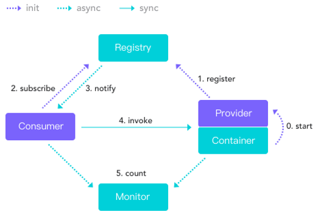
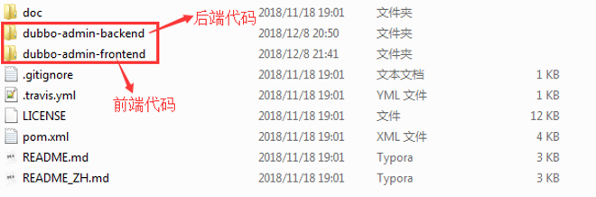
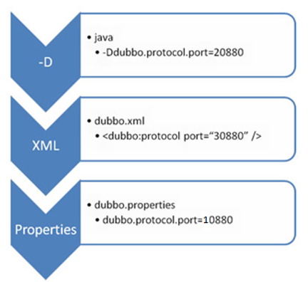
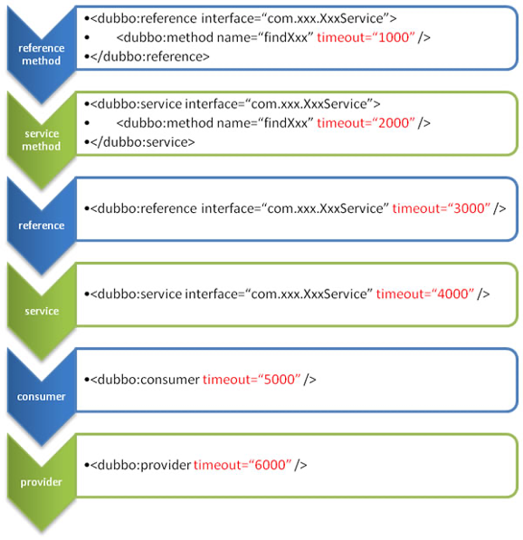
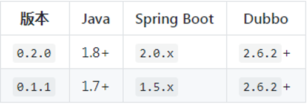
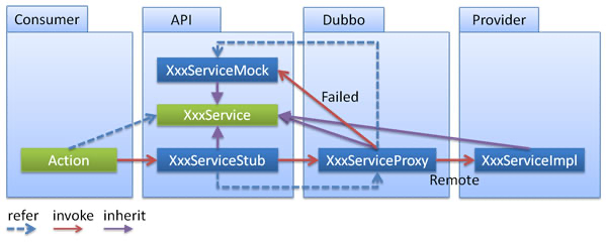
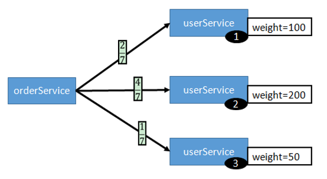
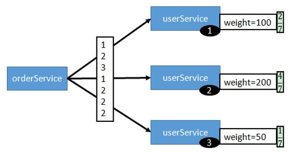
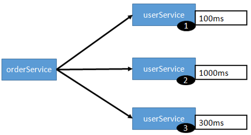
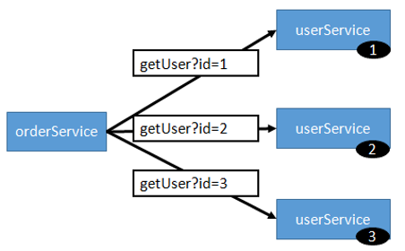

# 1.dubbo简介

## 1.1.什么是dubbo

dubbo就是实现RPC思想的分布式服务框架。这是官网给出的dubbo执行流程：



提供服务的称为Provider，消费服务的称为Consumer。Provider把自己注册到注册中心（Registry）上，Consumer从注册中心上订阅服务。使用dubbo要求JDK版本最低1.6

# 2.入门程序

## 2.1.搭建zookeeper

Dubbo推荐使用zookeeper作为注册中心，zookeeper官方下载地址：https://archive.apache.org/dist/zookeeper/。在window安装，只要把下载的.tar.gz压缩包解压后，到/conf目录中拷贝zoo_sample.cfg文件的副本，并取名为zoo.cfg；在解压目录中创建data文件夹和logs文件夹（这两个文件夹名字自取），并在刚才拷贝的zoo.cfg中加入两行配置：dataDir=../data，dataLogDir=../logs即可。再到/bin目录中，使用cmd窗口执行zkServer.cmd就能启动zookeeper。

## 2.2.搭建控制台

dubbo在github托管源码，https://github.com/apache/incubator-dubbo，打开它的首页，接近底部有个Dubbo OPS，这个就是dubbo的管理控制台，相对于注册中心zookeeper，控制台可搭建可不搭建，它不影响dubbo的使用。点击[Dubbo OPS链接](https://github.com/apache/incubator-dubbo-ops)，下载它的压缩包，解压后可得：



新版的dubbo控制台是前后端分离的，得分别打包后端代码和前端代码。

**启动后端：**

后端代码是用springBoot写的，所以只要把它打包成jar包就可以执行了进入dubbo-admin-backend目录，修改源码的application.properties中的zookeeper地址为本机的zookeeper地址，然后就可以使用maven命令：mvn clean package。使用java -jar 运行打包后的jar包即可启动dubbo控制台的后端

**启动前端：**

进入dubbo-admin-frontend目录，打开cmd窗口，执行npm install，先安装各个模块，安装完成后，执行npm run dev，就可以启动控制台的前端

## 2.3.引入dubbo

引入dubbo的pom依赖为：

```xml
<dependency>
    <groupId>com.alibaba</groupId>
    <artifactId>dubbo</artifactId>
    <version>2.6.2</version>
</dependency>
```

因为dubbo推荐使用zookeeper作为注册中心，所以就以zookeeper为主。引入完dubbo后需要引入zookeeper的客户端用来操作zookeeper，在dubbo v2.6版本及以后，引入curator操作zookeeper

```xml
<dependency>
    <groupId>org.apache.curator</groupId>
    <artifactId>curator-framework</artifactId>
    <version>2.12.0</version>
</dependency>
```

如果是dubbo v2.6版本之前，引入zkclient来操作zookeeper

```xml
<dependency>
    <groupId>com.101tec</groupId>
    <artifactId>zkclient</artifactId>
    <version>0.10</version>
</dependency>
```

## 2.4.搭建服务

服务提供者是将接口发布出去，服务消费者需要将这个接口按照全路径复制到自己的工程下，为了开发灵活，通常是将服务提供者要发布的接口单独成为一个工程，它只定义接口不实现，让服务提供者和服务消费者一起引用它，可以称它为“公共接口”

### 2.4.1.服务提供者

服务提供者引入公共接口后，实现它，然后可以通过xml配置的方式将这些公共接口发布出来，服务消费者就可以远程调用。配置内容如下：

```xml
<?xml version="1.0" encoding="UTF-8"?>
<beans xmlns="http://www.springframework.org/schema/beans"
       xmlns:xsi="http://www.w3.org/2001/XMLSchema-instance"
       xmlns:dubbo="http://dubbo.apache.org/schema/dubbo"
       xsi:schemaLocation="http://www.springframework.org/schema/beans
                           http://www.springframework.org/schema/beans/spring-beans-4.3.xsd
                           http://dubbo.apache.org/schema/dubbo
                           http://dubbo.apache.org/schema/dubbo/dubbo.xsd">

  <!--提供方应用信息，用于计算依赖关系-->
  <dubbo:application name="dubbo-helloWorld-provider"/>

  <!--使用zookeeper注册中心,配置zookeeper的地址-->
  <dubbo:registry address="zookeeper://127.0.0.1:2181"/>

  <!--用dubbo协议在20888端口暴露服务，数据就在此端口交互-->
  <dubbo:protocol name="dubbo" port="20888"/>

  <!-- 声明要暴露的服务接口，这个接口需要引用具体的接口实现类 -->
  <dubbo:service interface="com.sym.service.UserService" 		ref="UserServiceImpl"/>
  <bean id="UserServiceImpl" class="com.sym.service.UserServiceImpl"/>

</beans>
```

注意最后一条配置，\<dubbo:serviec>的interface属性配置的是公共接口包的接口名，ref属性是引用服务提供者实现该公共接口的实现类。然后解析该xml文件启动，就可以将服务发布到注册中心上去，注意此时zookeeper要开启.

### 2.4.2.服务消费者

服务消费者同样也需要引入公共接口包，但是它不用做任何实现，直接使用即可，dubbo在底层会对这个公共接口做远程代理。

```xml
<?xml version="1.0" encoding="UTF-8"?>
<beans xmlns="http://www.springframework.org/schema/beans"
       xmlns:xsi="http://www.w3.org/2001/XMLSchema-instance"
       xmlns:dubbo="http://dubbo.apache.org/schema/dubbo"
       xsi:schemaLocation="http://www.springframework.org/schema/beans
       http://www.springframework.org/schema/beans/spring-beans-4.3.xsd
       http://dubbo.apache.org/schema/dubbo
       http://dubbo.apache.org/schema/dubbo/dubbo.xsd">

     <!-- 消费方应用名，用于计算依赖关系，不是匹配条件，不要与提供方一样-->
    <dubbo:application name="dubbo-helloWorld-consumer"/>

    <!--使用zookeeper注册中心,配置zookeeper的地址-->
    <dubbo:registry address="zookeeper://127.0.0.1:2181"/>

    <!--生成远程服务代理，可以和使用本地bean一样使用userService -->
    <dubbo:reference id="userService" 	interface="com.sym.service.UserService"/>
    
</beans>
```

注意最后一条配置，\<dubbo:reference>的interface属性要和服务发布者的\<dubbo:serviec>的interface属性一样。dubbo会将公共接口生成远程服务代理，然后我们就可以和使用本地bean一样使用userService，例如直接使用@Autowire注入，获取直接从ioc容器中获取.

# 3.配置文件

## 3.1.常用标签

**官方文档：**[schema 配置参考手册](https://dubbo.incubator.apache.org/zh-cn/docs/user/references/xml/introduction.html)

<table>
	<tr>
  	<th>标签</th>
    <th>用途</th>
    <th>描述</th>
  </tr>
  <tr>
  	<td width='30%'>&lt;dubbo:service&gt;</td>
    <td width='20%'>服务配值</td>
    <td>用于暴露一个服务；定义服务的元信息，一个服务可以用多个协议暴露，一个服务也可以注册到多个注册中心</td>
  </tr>
  <tr>
  	<td>&lt;dubbo:provider&gt;</td>
    <td>服务缺省配置</td>
    <td>&lt;dubbo:service&gt;没有配置的属性都用&lt;dubbo:provider&gt;的缺省配置；它也可以作为服务提供者的公共配置</td>
  </tr>
  <tr>
  	<td>&lt;dubbo:reference&gt;</td>
    <td>引用配置</td>
    <td>用于创建一个远程服务代理，一个引用可以指定多个注册中心</td>
  </tr>
  <tr>
  	<td>&lt;dubbo:consumer&gt;</td>
    <td>引用缺省配置</td>
    <td>&lt;dubbo:reference&gt;没有配置的内容都用&lt;dubbo:consumer&gt;的缺省配置；它也可以作为服务消费者的公共配置</td>
  </tr>
  <tr>
  	<td>&lt;dubbo:protocol&gt;</td>
    <td>协议配置</td>
    <td>用于配置提供服务的协议信息，协议由服务提供方指定，消费方被动接受</td>
  </tr>
  <tr>
  	<td>&lt;dubbo:application&gt;</td>
    <td>应用配置</td>
    <td>用于配置当前应用信息，不管该应用是服务提供方还是消费方</td>
  </tr>
  <tr>
  	<td>&lt;dubbo:registry&gt;</td>
    <td>注册中心配置</td>
    <td>用于连接注册中心的配置</td>
  </tr>
  <tr>
  	<td>&lt;dubbo:monitor&gt;</td>
    <td>监控中心配置</td>
    <td>用于连接监控中心的配置</td>
  </tr>
  <tr>
  	<td>&lt;dubbo:method&gt;</td>
    <td>方法级别配置</td>
    <td>是&lt;dubbo:service&gt;和&lt;dubbo:reference&gt;的子标签，用于配置具体的方法，最细粒度的配置
</td>
  </tr>
</table>

## 3.2.缺省配置

除了使用xml文件配置dubbo外，还可以使用properties文件。dubbo会自动加载classpath下的**dubbo.properties**（默认命名规则），可以通过JVM启动参数：-Ddubbo.properties.file=xxx/xxx.properties。所以，在实际开发中，可以把dubbo.properties文件作为项目的公共的全局配置。

将xml配置的标签名，加上属性名，用"."分割，就可以作为一行配置，如：dubbo.application.name=foo等价于<dubbo:application name="foo"/>

## 3.3覆盖配置

dubbo的覆盖策略：优先级高的会覆盖掉优先级低的，存在两种情况的覆盖策略：

①配置文件覆盖策略

②配置属性覆盖策略

### 3.3.1.配置文件

dubbo本身依赖于spring，靠IOC容器管理自身组件。因此dubbo在使用时通常会有一个spring上下文的xml配置；当与[springBoot整合](#_dubbo整合springBoot)时，变成由application.yml来配置。同时，dubbo自身支持一个优先级最低的缺省配置文件，默认名称为：dubbo.properties。

**dubbo配置文件的覆盖关系如下：**

1. JVM 启动参数优先：用户可在部署和启动时进行参数重写，如：在启动时需改变协议的端口；

2. xml次之：xml指的是spring上下文xml配置或与springBoot整合时springBoot的配置文件；xml会覆盖properties对应的配置项；

3. properties最后：在xml没有配置时，dubbo.properties的相应配置项才会生效，通常用于公共配置，比如应用名。



​		实际生效端口=20880

### 3.3.2.配置属性

dubbo的具体配置属性也存在覆盖策略，官网给出下面两句总结：

“**方法级优先，接口级次之，全局配置最后**”

“**如果级别一样，则消费方优先，提供方次之**”

所以，想知道哪个属性生效了？先看属性配置在哪个级别上，按照方法级>接口级>全局配置的顺序；如果级别一样，例如都是方法级或者都是接口级，就看它是提供方还是消费方，以消费方的为主。

**例子：**

以timeout配置属性为例，从上到下，优先级由高到低：\<dubbo:method>的配置会覆盖掉所有的配置，此时服务调用的超时限额为1s



# 4.整合springboot

dubbo在github上有[整合springBoot](https://github.com/apache/incubator-dubbo-spring-boot-project/blob/master/README_CN.md#dubbo-spring-boot-工程)的介绍，并且整合所需的版本如下图；注意版本需要吻合，不然启动不了，无法注册服务，但是不会报错...



dubbo整合springBoot有三种方案：（这里全都以配置服务提供方为主）

1. 在application.yml配置dubbo属性，通过@Service暴露接口

2. 引入dubbo配置文件如dubbo.xml，由配置文件来配置dubbo，

3. 使用dubbo提供的API配置类，使用它们来配置dubbo

## 4.1.整合方案一

通过application.yml配置dubbo的属性，使用@EnableDubbo开启dubbo的注解功能，服务提供者使用@Service暴露服务，消费者使用@Reference远程调用服务。使用这种方式，不能针对方法进行配置，最低粒度到接口。

**步骤：**

①引入springBoot整合dubbo的pom依赖。springBoot我使用的是2.x版本，所以要引入dubbo2.x的启动器，它会默认引入操作zookeeper的客户端。

```xml
<dependency>
   <groupId>com.alibaba.boot</groupId>
   <artifactId>dubbo-spring-boot-starter</artifactId>
   <version>0.2.0</version>
</dependency>
```

②使用application.yml配置dubbo，使用这种方式配置dubbo，只能基于接口来配置，无法针对接口内方法来配置(\<dubbo:method>标签用来配置方法)

```yml
## dubbo基本配置
dubbo:
  application:
    name: dubbo-springBoot-provider
  registry:
    address: zookeeper://127.0.0.1:2181
  protocol:
    port: 20880
```

③在springBoot的启动类中使用@EnableDubbo注解开启dubbo注解功能

```java
@SpringBootApplication
@EnableDubbo
public class OneApplication {}
```

④是需要暴露成服务的接口上，使用@Service注解标注接口，注意这个注解是@com.alibaba.dubbo.config.annotation.Service

```java
@Service
public class UserServiceImpl implements UserServiceI {}
```

⑤启动springBoot，就可以将服务注册到zookeeper上。服务调用者可以使用@Reference注解远程代理接口调用服务。

## 4.2.整合方案二

整合方案二，是将dubbo的配置文件如dubbo.xml由@ImportResource导入到springBoot中，便可以使用dubbo配置文件的方式配置dubbo，这种方式可以精确操作到方法级别。

**步骤：**

①引入dubbo的依赖

```xml
<dependency>
    <groupId>com.alibaba.boot</groupId>
    <artifactId>dubbo-spring-boot-starter</artifactId>
    <version>0.2.0</version>
</dependency>
```

②在工程下创建dubbo的xml配置文件，例如dubbo.xml。通过dubbo.xml完成对dubbo的配置；它与[整合方案一](#_整合方案一)的区别在于，使用配置文件的形式替代application.yml的配置，而且它可以使用<dubbo:method>标签细化到接口的方法去配置。一个基本的完整的配置文件如下：

```xml
<?xml version="1.0" encoding="UTF-8"?>
<beans xmlns="http://www.springframework.org/schema/beans"
       xmlns:xsi="http://www.w3.org/2001/XMLSchema-instance"
       xmlns:dubbo="http://dubbo.apache.org/schema/dubbo"
       xsi:schemaLocation="http://www.springframework.org/schema/beans
                           http://www.springframework.org/schema/beans/spring-beans-4.3.xsd
                           http://dubbo.apache.org/schema/dubbo
                           http://dubbo.apache.org/schema/dubbo/dubbo.xsd">

  <dubbo:application name="dubbo-springBoot-provider"/>

  <!--使用zookeeper注册中心,配置zookeeper的地址-->
  <dubbo:registry address="zookeeper://127.0.0.1:2181"/>

  <!--用dubbo协议在20888端口暴露服务，数据就在此端口交互-->
  <dubbo:protocol name="dubbo" port="20881"/>

  <!-- 声明要暴露的服务接口，这个接口需要引用具体的接口实现类 -->
  <dubbo:service interface="com.sym.user.UserServiceI" ref="UserServiceImpl" timeout="5000">
    <dubbo:method name="getUserBean" loadbalance="random"/>
  </dubbo:service>
  <bean id="UserServiceImpl" class="com.sym.service.UserServiceImpl"/>

</beans>
```

③使用@ImportResource引入上面的配置文件，springBoot会去解析它并完成对dubbo的配置

```java
@SpringBootApplication
@ImportResource("classpath:/dubbo.xml")
public class TwoApplication {}
```

④暴露服务的接口就不需要再做任何处理，全部都在xml中完成，只需要启动springBoot就可以完成服务注册

## 4.3.整合方案三

整合方案三，是使用代码的形式，通过dubbo提供的API配置类，将这些配置类注入到IOC容器中，其实dubbo.xml配置文件每一个标签对应着一个配置类，例如：\<dubbo:application>对应ApplicationConfig、\<dubbo:service>对应ServiceConfig...

**步骤：**

①引入dubbo的依赖：

```xml
<dependency>
    <groupId>com.alibaba.boot</groupId>
    <artifactId>dubbo-spring-boot-starter</artifactId>
    <version>0.2.0</version>
</dependency>
```

②创建配置类，使用dubbo提供的配置类API来配置dubbo基本属性

```java
@Configuration
public class DubboConfiguration {

  /**
     * 配置应用信息
     */
  @Bean
  public ApplicationConfig applicationConfig() {
    ApplicationConfig config = new ApplicationConfig();
    config.setName("dubbo-springBoot-provider");
    return config;
  }
  /**
     * 配置注册中心信息
     */
  @Bean
  public RegistryConfig registryConfig() {
    RegistryConfig config = new RegistryConfig();
    config.setProtocol("zookeeper");
    config.setAddress("127.0.0.1");
    config.setPort(2181);
    return config;
  }
  /**
     * 配置通信地址
     */
  @Bean
  public ProtocolConfig protocolConfig() {
    ProtocolConfig config = new ProtocolConfig();
    config.setName("dubbo");
    config.setPort(20882);
    return config;
  }
  /**
     * 配置服务接口
     */
  @Bean
  public ServiceConfig<UserServiceI> serviceConfig(UserServiceI userServiceI) {
    ServiceConfig config = new ServiceConfig();
    config.setInterface(UserServiceI.class);
    config.setRef(userServiceI);
    return config;
  }
```

③在需要暴露服务的接口实现类上使用@Service注解标注

```java
@Service
public class UserServiceImpl implements UserServiceI {}
```

④在springBoot的启动类上使用@DubboComponentScan注解指定包扫描目录

```java
@SpringBootApplication
@DubboComponentScan("com.sym.service")
public class ThreeApplication {}
```

⑤然后启动springBoot就可以了

# 5.应用配置

## 5.1.启动时检查

dubbo在启动时，会检查当前项目依赖的远程服务是否可用，如果远程服务不可用(如：服务消费者启动了，但是服务提供者还未启动)，就会中止程序启动。该功能是被配置属性：dubbo.consumer.check控制的，默认check=true。

注意：如果spring 容器是懒加载的，或者延迟引用服务，务必关闭 check，否则服务临时不可用时，会抛出异常，拿到 null 引用；如果 check="false"，总是会返回引用，当服务恢复时，能自动连上。

由于是检查依赖服务是否可用，所以“启动时检查”都是在服务消费方配置的；当启动完成后，在真正要调用远程服务时，如果服务仍不可用，就会报错。

**例子：**

①关闭某个远程服务的启动检查(只针对该服务生效)

```xml
<dubbo:reference id="userService" check="false"
interface="com.service.UserService"/>
```

②关闭所有远程服务的启动检查

```xml
<!-- 关闭所有远程服务的启动检查 -->
<dubbo:consumer check="false"/>
```

同理，dubbo除了会对服务消费者在启动时检查它依赖的服务是否可用，也会对服务提供者在启动时检查它要访问的注册中心是否可用，如果也要取消，可以如下配置：

```xml
<!-- 关闭所有注册服务时的启动检查 -->
<dubbo:registry check="false"/>
```

## 5.2.超时设置

通过**timeout**属性，我们可以配置请求远程服务的超时时间：在指定时间内远程服务方法未返回结果，dubbo会终止方法执行并抛出异常。超时配置收到[覆盖策略](#3.3.覆盖配置)的影响，超时设置可以设在\<dubbo:reference>，也可以设置在\<dubbo:consumer>，甚至细粒度到方法级别上：\<dubbo:method>

```xml
<!-- timeout的单位是毫秒 -->
<dubbo:reference id="userService" timeout="1000" interface="com.sym.service.UserService"/>
```

```xml
<dubbo:service interface="com.service.UserService" ref="UserServiceImpl">
    <!-- 暴露服务的具体方法的超时设置 -->
    <dubbo:method name="getUserBean" timeout="1000"/>
</dubbo:service>

```

dubbo建议：将超时配置全交于服务提供方效果更好。例如：对于超时配置timeout，因为一个方法需要执行多长时间，服务提供方更清楚，如果一个消费方同时引用多个服务，就不需要关心每个服务的超时设置。如果不想设置超时时间，可以不要配置（默认是不超时的），或者设置timeout=0。

## 5.3.重试次数

通过**retries**属性，可以设置dubbo服务请求的重试次数。当服务请求失败，dubbo可以重复请求n次，这个n就是重试次数。重试次数是不会算上第一次请求。例如当重试次数设为3，假设每次请求失败，dubbo实际上会发起4次请求。

```xml
<!-- retries设置3，表示重试3次，加上第一次请求，一共请求四次-->
<dubbo:service interface="com.sym.service.UserService" ref="UserServiceImpl" retries="3"/>
```

如果有多个提供者都在暴露同一个服务，当请求一个提供者的服务失败后，在重试次数范围内，dubbo会轮询地请求每个提供者：第一个提供者的服务调用失败，转去请求第二个提供者的服务，若第二个还失败，转去请求第三个提供者的服务，以此类推，直至达到重试次数。

## 5.4.多版本

服务提供者在暴露服务的时候，可以通过version属性指定该服务的版本号。消费者在调用服务时，就可以使用version来指定调用哪个版本的服务接口。当version设置为"*"时，dubbo会随机调用任一版本的服务。这项功能一般在接口优化升级时使用：

1. 服务提供者使用version标识接口版本

```xml
<dubbo:service interface="com.sym.service.UserService" 
	ref="UserServiceImpl" timeout="10000" retries="3" version="1.0.0"/>
```

2. 服务消费者使用version调用指定版本的接口

```xml
<dubbo:reference id="userService" version="1.0.0"
	interface="com.sym.service.UserService" />
```

## 5.5.本地存根

一般情况下，服务消费者只保留了公共接口，直接通过这些接口远程调用提供方的接口实现类。但是，有些时候想在消费方也执行部分逻辑，比如：做 ThreadLocal 缓存，提前验证参数，调用失败后伪造容错数据等等...这时候可以使用本地存根。



**配置一个本地存根需要两个步骤：**

1. 在消费方创建一个实现公共接口的实现类，它就是本地存根。实现类需要创建一个final类型的公共接口变量，并且通过有参构造函数初始化。这个构造函数dubbo会自行调用，它将远程接口代理注入到这个公共接口变量，就像：

```java
public class UserServiceStub implements UserService {
    // dubbo会将远程接口代理通过有参构造方法注入进来
    private final UserService userService;

    public UserServiceStub(UserService userService) {
        this.userService = userService;
    }
} 
```

2. 在配置文件中使用**stub**属性指定我们刚创建好的本地存根：

```xml
<dubbo:reference id="userService" interface="com.sym.service.UserService"
                 stub="com.sym.stub.UserServiceStub"/>
```

3. 每次我们使用公共接口请求远程服务时，都会先去本地存根执行代码逻辑，如果确定要调用远程服务，就可以通过本地存根的final类型的公共接口变量调用：（所以，不要以为创建了本地存根就使用本地存根来远程调用服务，仍是直接使用公共接口来调用）

```java
@Override
public UserBean getUserBean(Integer id) {
    // 这边就是本地存根要处理的逻辑
    return userService.getUserBean(id);
}
```

## 5.6.直连

注册中心zookeeper其实是起到寻址的作用，消费者想要调用提供方的服务，注册中心是将提供方的地址告诉消费方，所以当提供方和消费方交互过一次之后，即使注册中心宕机，它们仍能通过**本地缓存**进行通讯。我们也可以通过**配置url**的方式，直接暴露服务提供方的地址，绕过注册中心，让消费方直接与服务提供方通讯，这就叫dubbo直连。

```xml
<dubbo:reference id="userService" interface="com.sym.service.UserService"
                  url="192.168.32.1:12580"/>
```

## 5.7.负载均衡

当一个服务有多个提供方在发布，消费者远程调用服务，哪个提供方会收到请求？这就要看负载均衡策略。dubbo提供了4种负载均衡策略，它们是：RandomLoadBalance、LeastActiveLoadBalance、RoundRobinLoadBalance、ConsistentHashLoadBalance它们都继承于抽象类AbstractLoadBalance。

### 5.7.1.四种机制

#### 5.7.1.1.Random LoadBalance

Random LoadBalance，基于权重的随机负载均衡机制。它对应的类为：RandomLoadBalance，配置名称叫“random”。它是按照集群内服务提供方的权重（默认为100），算出每个提供方的权重比例，由比例决定被调用的概率。



例如：有orderService远程调用userService，1号提供方权重为100，2号提供方权重为200，3号提供方权重为50，则它们的权重比例依次为：2/7，4/7，1/7，意味着调用的概率为2/7，4/7，1/7，即**提供方被调用的概率等于它的权重比例**。学过概率论知道，概率只有在大量尝试基础上才可以体现，也就说，3次调用有可能全在1号提供方上。

#### 5.7.1.2.RoundRobin LoadBalance

RoundRobin LoadBalance，基于权重的轮询负载均衡机制。它对应的类为：RoundRobinLoadBalance，配置名称叫“roundrobin”。它也是按照集群内服务提供方的权重（默认为100），算出每个提供方的权重比例，按照这个比例轮询调用。



例如：有orderService远程调用userService，1号提供方权重为100，2号提供方权重为200，3号提供方权重为50，则它们的权重比例依次为：2/7，4/7，1/7。则在前7次调用中，1号提供方会被调用两次，2号提供方会被调用四次，3号提供方会被调用一次。即**轮询调用的次数是等于权重比例**的。

#### 5.7.1.3.LeastActive LoadBalance

LeastActive LoadBalance，最少活跃数负载均衡机制，活跃数指的是服务提供方被调用和调用完成的时间差。对应的类为：LeastActiveLoadBalance，配置名称叫“leastactive”。每次调用服务，dubbo按照服务提供方上一次请求的活跃数来决定此次服务调用落在哪个服务提供方上，将会调用上一次活跃数最少的提供方；当活跃数相同，则随机调用。使慢的提供者收到更少请求，因为越慢的提供者的调用前后计数差会越大。



例如：有orderService远程调用userService，对于上一次请求，1号提供方的活跃数为100ms，2号提供方的活跃数为1000ms，3号提供方的活跃数为300ms，那么本次请求就会落在1号提供方上。即**每次调用都选择上一次请求活跃数最低的提供方**。

#### 5.7.1.4.ConsistentHash LoadBalance

ConsistentHash LoadBalance，一致性hash负载均衡机制。对应的类为ConsistentHashLoadBalance。它是根据参数算出hash值，来决定调用的请求者，相同参数的请求总是发到同一提供方上。



例如：有orderService远程调用userService，参数id为1时，请求总是给1号提供方；参数id为2时，请求总是给2号提供方；参数id为3时，请求总是给3号提供方。即**按照参数哈希值决定请求的提供方**。

### 5.7.2.配置负载均衡

负载均衡的配置可以配置在方法级别上，也可以配置接口级别上；可以配置在提供方上，也可以配置在消费方上。哪种配置会生效，就按照[覆盖策略-配置属性](#3.3.2.配置属性)来看：方法级别优先，若级别相同，消费方优先。使用loadbalance属性配置前三种负载均衡机制的名称（一致性hash负载均衡有不一样的配置）。**配置方式：**

①提供方接口上：

```xml
<dubbo:service interface="..." loadbalance="roundrobin" /> 
```

②消费方接口上：

```xml
<dubbo:reference interface="..." loadbalance="roundrobin" />
```

③提供方方法上：

```xml
<dubbo:service interface="...">
    <dubbo:method name="..." loadbalance="roundrobin"/>
</dubbo:service>
```

④消费方方法上：

```xml
<dubbo:reference interface="...">
    <dubbo:method name="..." loadbalance="roundrobin"/>
</dubbo:reference>
```

而对于一致性hash负载均衡机制的配置，需要使用\<dubbo:parameter>配置：使用\<dubbo:parameter>的key属性指定配置项，value属性表示值。例如：当key=“hash.arguments”表示对参数值求hash，默认只对第一个参数进行hash求值，如果想将加入额外参数，可以用序号表示参数，且用逗号隔开，例如："0,1"，0表示第一个参数，1表示第二个参数。

```xml
<dubbo:parameter key="hash.arguments" value="0,1" />
```

当key=“hash.nodes”表示虚拟节点数，缺省用 160 份虚拟节点：

```xml
<dubbo:parameter key="hash.nodes" value="320" />
```

### 5.7.3.权重设置

权重可以使用“weight”属性配置：

```
<dubbo:service interface="..." weight="120"/>
```

不过这种方式是将权重写死了，更多情况下，可以通过dubbo控制台，动态地控制权重：

## 5.8.服务降级

什么是服务降级？当服务器压力剧增的情况下，根据实际业务情况及流量，对一些服务不处理或采取简单方式处理，从而释放服务器资源以保证核心服务的正常运作。可以通过【服务降级】临时屏蔽某个出错的非关键服务，并定义降级后的返回策略，返回策略有两种：

1. force:return+null 。表示消费方对该服务的方法调用都直接返回 null ，不会发起远程调用，用来屏蔽不重要服务不可用时对消费方的影响；

2. fail:return+null。表示消费方对该服务的方法调用在失败后，再返回 null，不会抛异常(一般调用失败都会抛异常)，用来容忍不重要服务在网络不稳定时对消费方的影响。

可以使用代码对服务进行“降级”操作：

```java
RegistryFactory registryFactory = ExtensionLoader.
        getExtensionLoader(RegistryFactory.class).getAdaptiveExtension();
Registry registry = registryFactory.
        getRegistry(URL.valueOf("zookeeper://127.0.0.1:2181"));
registry.register(URL.valueOf("override://0.0.0.0/com.foo.BarService?" +     "category=configurators&dynamic=false&application=foo&mock=force:return+null"));
```

但是服务降级一般是在正式环境，产品以上线，所以更多时候是在dubbo监控台中操作，在dubbo监控台的消费者一方进行【服务降级】操作

## 5.9.集群容错

在集群调用失败后，dubbo提供了多种容错机制，默认是：failover（重试）

### 5.9.1.容错模式

| **容错模式** | **作用**                                                     | **配置**                                                     |
| ------------ | ------------------------------------------------------------ | ------------------------------------------------------------ |
| Failover     | 当调用失败，会请求另外一台服务进行重试，但重试会带来更长延迟，所以可以设置[重试次数](#5.3.重试次数)。 | <dubbo:service  retries="2"/>  <dubbo:reference  retries="2"/> |
| Failfast     | 即快速失败。只发起一次调用，失败立即报错。通常用于非幂等性的写操作，比如新增记录。 | 见表尾                                                       |
| Failsafe     | 即失败安全。出现异常时，直接忽略。通常用于写入审计日志等操作 | 见表尾                                                       |
| Failback     | 即失败自动恢复。后台记录失败请求，定时重发。通常用于消息通知操作 | 见表尾                                                       |
| Forking      | 并行调用多个服务器，只要一个成功即返回。通常用于实时性要求较高的读操作，但需要浪费更多服务资源。可通过 forks="2" 来设置最大并行数 | 见表尾                                                       |
| Broadcast    | 广播调用所有提供者，逐个调用，任意一台报错则报错 。通常用于通知所有提供者更新缓存或日志等本地资源信息 | 见表尾                                                       |

集群模式的容错配置通过cluster属性来配置，例如：

```xml
<dubbo:service cluster="failsafe" />
```

或者

```xml
<dubbo:reference cluster="failsafe" />
```

### 5.9.2.整合Hytrix

Hystrix 旨在通过控制那些访问远程系统、服务和第三方库的节点，从而对延迟和故障提供更强大的容错能力。Hystrix具备拥有回退机制和断路器功能的线程和信号隔离，请求缓存和请求打包，以及监控和配置等功能，它是sprinCloud的默认容错机制，详细使用请到springCloud笔记。让dubbo整合springBoot，然后再整合Hystrix，整合步骤：

①服务提供方和服务消费方都要引入Hystrix依赖：

```xml
<dependency>
    <groupId>org.springframework.cloud</groupId>
    <artifactId>spring-cloud-starter-netflix-hystrix</artifactId>
    <version>1.4.4.RELEASE</version>
</dependency>
```

②服务提供方和服务消费方都使用@EnableHystrix注解，开启springBoot对 Hystrix的支持

```java
@SpringBootApplication
@EnableDubbo
@EnableHystrix
public class ConsumerApplication {
  
}
```

③服务提供方的配置：在接口实现类的方法上添加@HystrixCommand注解，当方法抛出异常时就会被hystrixCommand捕获到

```java
@HystrixCommand
public List<UserBean> getUserList() {

}
```

④服务消费方的配置：在调用远程服务的方法上也添加@HystrixCommand注解，并且配置fallbackMethod属性，表示捕获异常时回调指定方法

```java
@HystrixCommand(fallbackMethod = "handleError")
public List<UserBean> getUserList() {}
```

# *.补充

dubbo的xsd文件格式分为：

```xml
xmlns:dubbo="http://code.alibabatech.com/schema/dubbo
http://code.alibabatech.com/schema/dubbo http://code.alibabatech.com/schema/dubbo/dubbo.xsd
```

```xml
xmlns:dubbo="http://dubbo.apache.org/schema/dubbo
http://dubbo.apache.org/schema/dubbo
http://dubbo.apache.org/schema/dubbo/dubbo.xsd
```

