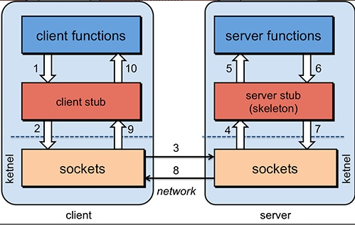
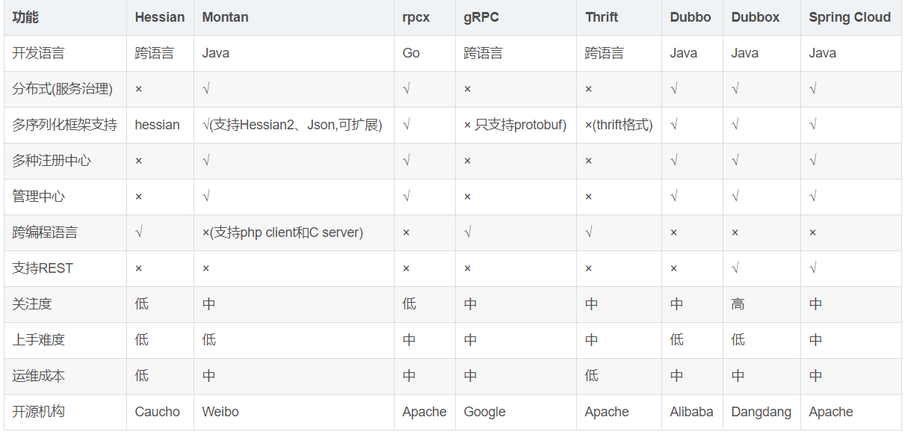
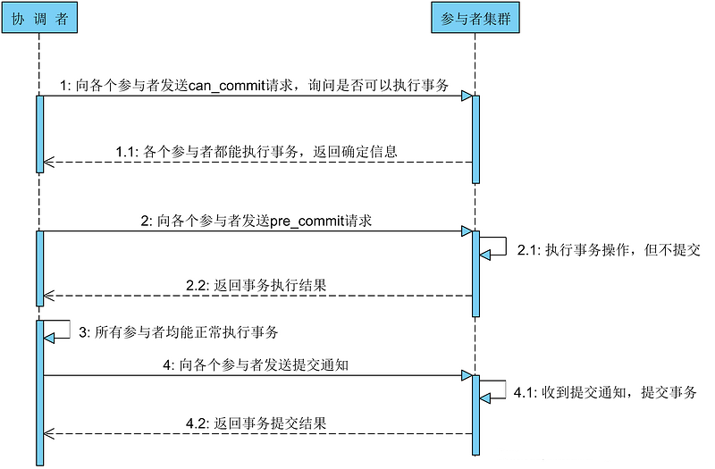
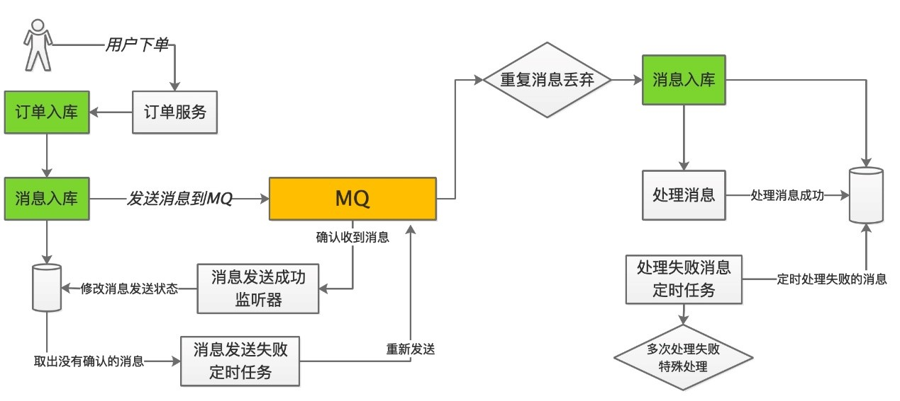
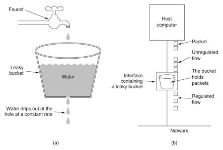
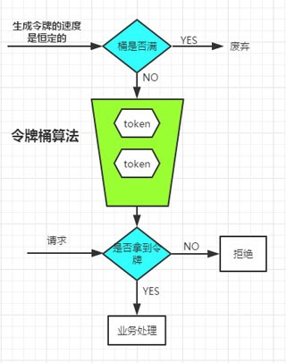
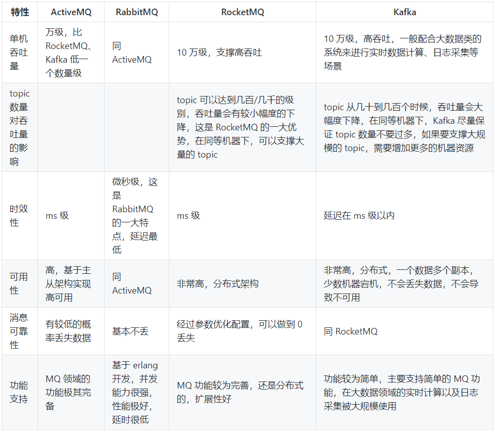

# 1.分布式理论

参考：https://blog.csdn.net/yeyazhishang/article/details/80758354

## 1.1.CAP定理

CAP定理又称CAP原则，指的是在一个分布式系统中，Consistency（一致性）、 Availability（可用性）、Partition tolerance（分区容错性），最多只能同时满足三个特性中的两个，三者不可兼得

<table>
    <tr>
        <th>属性</th>
        <th>含义</th>
    </tr>
    <tr>
    	<td width="22%">Consistency</td>
        <td>一致性，意味着一个节点更新操作成功后，所有节点在同一时刻  数据必须保持一致性；对于客户端而言，一致性指并发访问更新后的数据如何获取？而对于服务端而言，一致性指更新的数据如何实时广播到整个系统？</td>
    </tr>
    <tr>
    	<td>Availability</td>
        <td>高可用性，意味着服务不中断，一直处于可用状态</td>
    </tr>
    <tr>
    	<td>Partition tolerance</td>
        <td>分区容错性，意味着某节点或网络分区故障的时候，仍然能够对外提供满足一致性和可用性的服务，如：一个集群节点宕机了，剩下的机器还能够继续提供服务，使整个系统继续正常运转</td>
    </tr>
</table>

CAP三个特性只能满足其中两个，那么取舍的策略就共有三种：

<table>
    <tr>
        <th>搭配策略</th>
        <th>效果</th>
    </tr>
    <tr>
    	<td width="20%">CA without P</td>
        <td>不要求系统分区，意味着系统难以扩展，分布式节点受限，没办法部署子节点，这是违背分布式系统设计的初衷。这种搭配现实不会采用</td>
    </tr>
    <tr>
    	<td>CP without A</td>
        <td>不要求系统高可用性，但每个请求都需要在服务器之间保持强一致，而P（分区）会导致同步时间无限延长(也就是等待数据同步完才能正常访问服务)，一旦发生网络故障或者消息丢失等情况，就要牺牲用户的体验，等待所有数据全部一致了之后再让用户访问系统。设计成CP的系统其实不少，最典型的就是分布式数据库，如Redis、HBase等。对于这些分布式数据库来说，数据的一致性是最基本的要求</td>
    </tr>
    <tr>
    	<td>AP wihtout C</td>
        <td>要高可用性并且允许分区，则需放弃一致性。一旦分区发生，节点之间可能会失去联系，为了高可用，每个节点只能用本地数据提供服务，而这样会导致全局数据的不一致性。典型的应用就如电商的抢购手机场景，可能前几秒你浏览商品的时候页面提示是有库存的，当你选择完商品准备下单的时候，系统提示你下单失败，商品已售完。这其实就是先在 A（可用性）方面保证系统可以正常的服务，然后在数据的一致性方面做了些牺牲，虽然多少会影响一些用户体验，但也不至于造成用户购物流程的严重阻塞</td>
    </tr>
</table>

## 1.2.BASE理论

CAP中的C指的是“强一致性”，系统各个节点的数据在任一时刻都必须要同步，除了“强一致性”，更多情况下采用的是“最终一致性”，其理论支撑是BASE模型。BASE全称是Basically Available（基本可用），Soft state（软状态/柔性事务），Eventually Consistent（最终一致性），BASE模型在理论逻辑上是相反于ACID（原子性Atomicity、一致性Consistency、隔离性Isolation、持久性Durability）模型的概念，它牺牲强一致性，获得可用性和分区容忍性。

<table>
    <tr>
        <th>内容</th>
        <th>含义</th>
    </tr>
    <tr>
    	<td width="42%">基本可用（Basically Available）</td>
        <td>指分布式系统在出现不可预知故障时，允许损失部分可用性，如响应时间上的损失或功能上的损失</td>
    </tr>
    <tr>
    	<td>弱状态（Soft state）</td>
        <td>也称为软状态，指允许系统中的二数据存在中间状态，并认为该中间状态的存在不会影响系统的整体可用性，即允许系统在不同节点的数据副本之间进行数据同步的过程存在延时</td>
    </tr>
    <tr>
    	<td>最终一致性（Eventually consistent）</td>
        <td>指系统中所有的数据副本，在经过一段时回见的同步后，最终能够达到一个一致的状态，因此最终一致性的本质是需要系统保证数据能够达到一致，而不需要实时保证系统数据的强一致性</td>
    </tr>
</table>

# 2.RPC

## 2.1.什么是RPC

RPC，全称Remote Procedure Call，即远程过程调用。它不是一个框架而是一种协议，或者说一种思想。它要解决的问题是处于不同服务器，不同网络之间的程序如何交互数据。比如两个不同的服务 A、B 部署在两台不同的机器上，那么服务 A 如果想要调用服务 B 中的某个方法该怎么办？RPC就是为了解决这个问题。判断一个实现RPC框架的好坏，主要看两点：

1. **通讯**：服务提供者和服务调用者之间建立连接和传输数据的速度；

2. **序列化**：待传递的数据序列化成字节的速度；

RPC是一种思想，它可以基于TCP/IP协议，也可以基于HTTP协议，基于不同的协议会有不同的特性：

<table>
    <tr>
    	<th>协议</th>
        <th>特点</th>
    </tr>
    <tr>
        <td width="25%">基于TCP/IP</td>
        <td>①处于协议栈的下层，更灵活地对协议字段进行定制，减少网  络传输字节数，降低网络开销，提升性能;<br/>②实现更大吞吐量和并发数;<br/>③需要关注底层复制细节，实现代价更高，难显现跨平台的调用</td>
    </tr>
    <tr>
    	<td>基于HTTP</td>
        <td>①JSON与XML成为通用的格式标准，开源解析工具成熟;<br/>②基于HTTP协议可以实现跨语言、跨平台调用;<br/>③上层协议，发送同等内容需传输字节数更多，效率较TCP差</td>
    </tr>
</table>


## 2.2.RPC原理



1. 服务消费方client以本地调用的方式调用目标方法；

2. client stub收到调用请求，将方法、参数等组装成能够网络传输的消息体；

3. client stub通过一些手段（(服务发现）找到服务地址，将消息发送到服务端

4. 消息以二进制流的方式在两个socket之间传输；

5. server stub收到消息后进行解码；

6. server stub根据解码结果调用本地的方法；

7. server stub将返回结果打包成消息并发回给消费方client；

8. 消费方client接收到消息，进行解码，得到调用结果

## 2.3.RPC框架

业界比较成熟的服务框架有很多，比如：Hessian、CXF、Dubbo、Dubbox、Spring Cloud、gRPC、thrift等技术实现，都可以进行远程调用



# 3.微服务

## 3.1.微服务简介

微服务最开始是由Martin Fowler（马丁·福勒）提出的，他关于微服务的博客为：https://martinfowler.com/articles/microservices.html。目前，微服务并没有一个确切的定义。但是微服务的核心，可以明确，它是将一体式工程，按照业务划分成多个小工程，每个工程独立运行，提供服务。

## 3.2.微服务架构

微服务架构是一种架构模式，或者说是一种架构风格，是一种将单体应用程序作为一套小型服务开发的方法，每个服务都在自己的进程中运行，服务与服务之间采用轻量级机制（通常是HTTP的RESTful API）进行通信。 这些服务是围绕业务功能构建的，可以通过全自动部署机制独立部署。 这些服务的集中管理最少，可以用不同的编程语言编写，并使用不同的数据存储技术。

# 4.分布式锁

在分析分布式锁的三种实现方式之前，先了解一下分布式锁应该具备哪些条件：

1. 在分布式系统环境下，一个方法在同一时间只能被一个机器的一个线程执行；

2. 高可用的获取锁与释放锁；

3. 高性能的获取锁与释放锁；

4. 具备可重入特性。

5. 具备锁失效机制，防止死锁；

6. 具备非阻塞锁特性，即没有获取到锁将直接返回获取锁失败

## 4.1.mysql实现

**思路：**<u>在mysql中创建一个表，表中包含方法名等字段，并在方法名字段上创建唯一索引，想要执行某个方法，就使用这个方法名向表中插入数据，成功插入则获取锁，执行完后删除对应的行数据释放锁</u>

## 4.2.redis实现

**思路**：<u>利用redis执行lua脚本是原子性的特点，组装一套lua脚本，使用setnx加锁，并使用expire命令为锁添加一个超时时间，超过该时间则自动释放锁，并记录持锁的线程标识，便可实现重入锁和解锁操作</u>

## 4.3.zookeeper

**思路**：<u>利用zk内部是一个分层的文件系统目录树结构，规定同一个目录下只能有一个唯一文件名</u>。

使用zk实现分布式锁的步骤可以为：

1. 创建一个目录mylock；

2. 线程A想获取锁就在mylock目录下创建临时顺序节点；

3. 获取mylock目录下所有的子节点，然后获取比自己小的兄弟节点，如果不存在，则说明当前线程顺序号最小，获得锁；

4. 线程B获取所有节点，判断自己不是最小节点，设置监听比自己次小的节点；

5. 线程A处理完，删除自己的节点，线程B监听到变更事件，判断自己是不是最小的节点，如果是则获得锁

推荐第三方工具：Apache的开源库Curator，它是一个ZooKeeper客户端，Curator提供的InterProcessMutex是分布式锁的实现，acquire方法用于获取锁，release方法用于释放锁。

# 5.分布式事务

本地事务可以由单机数据库解决，当部署多机群，数据库位于不同服务器上，单靠本地事务无法保障（本机不知他机事务执行情况），所以衍生出分布式事务，这种事务的关键就是一个协调者，通过它来洞察全局事务下的各个本地事务执行情况。分布式事务的实现方式有很多种：

1. 2PC、3PC
2. TCC
3. 可靠消息最终一次性
4. 最大努力通知

## 5.1.二阶段提交(2PC)

两阶段提交协议，Two Phase Commitment Protocol，简称2PC。它解决的是**数据库**的强一致性问题，它是基于数据库层面实现的，必须要求数据库自身支持2PC协议，该协议定义了两种角色：

1. 事务协调者（coordinator）：负责协调参与者进行事务投票、提交和回滚(一个)

2. 事务参与者（participants）：即本地事务执行者(多个)

根据划分的角色，2PC协议分为两个阶段：**准备阶段**和**提交阶段**。准备阶段是收集各个事务参与者能否执行本地事务的信息，根据投票结果，事务协调者再决定是事务提交还是事务回滚。2PC协议的一个实现方案就是XA方案，在Java中对应的接口是javax.transaction.xa.XAResource，通常的数据库也都支持XA方案，开源的Atomikos也基于该协议提供了2PC的解决方案。

### 5.1.1.准备阶段

1. 协调者向所有的参与者发送事务执行请求，并等待参与者反馈事务执行结果，协调者发送事务执行请求后，自己就会处于等待状态；

2. 参与者收到请求之后，执行事务但不提交，并写入redo和undo日志，然后**锁定资源**；

3. 参与者将本地事务执行情况反馈给协调者，同时**阻塞等待**协调者的后续指令。


### 5.1.2.提交阶段

经过[准备阶段](#5.1.1.准备阶段)后，协调者会收到参与者的事务执行情况，可能会有3种：

1. 所有参与者都能正常提交事务；

2. 一个或多个参与者回复事务执行失败；

3. 协调者等待超时；

如果是情况1，那么协调者就会发送事务提交命令给参与者，让其提交事务


对于情况b和c，说明有部分参与者执行事务出现了问题，为了整体数据一致性，协调者会给个参与者发送事务回滚通知


### 5.1.3.存在的不足

1. 单点问题，如果协调者挂掉了，会影响整个集群的运行。如果协调者挂在了投票阶段上，导致其他参与者无法收到事务通知而一直处于阻塞状态；

2. 性能问题：两阶段提交执行过程中，所有的参与者都需要听从协调者的统一调度，期间处于阻塞状态而不能从事其他操作，这样效率极其低下；

3. 数据不一致性：由于网络原因，导致协调者在发送事务提交/回滚通知时，部分参与者收到，部分没收到，最终导致数据不一致；

**解决的方案：**

2PC协议通过加入**超时机制**和**互询机制**，来解决上面的3个问题：

1. 投票阶段，如果协调者在指定时间未收到**所有**参与者的事务执行回复，便退出等待状态，向所有参与者发送rollback通知；

2. 提交阶段，如果参与者未收到协调者的事务提交/回滚通知，就比较麻烦，因为它不知道协调者是挂了？还是发送commit？还是发送rollback。可以引入互询机制，让参与者 A 去询问其他参与者 B 的执行情况，如果 B 执行了 rollback 或 commit 操作，则 A 可以大胆的与 B 执行相同的操作；如果B同样处于等待状态，继续询问C、D...当所有的参与者都位于等待状态时，此时两阶段提交协议无法处理，将陷入长时间的阻塞状态！

2PC除本身的算法局限外，还有一个使用上的限制，就是它主要用在两个数据库之间，以支付宝的转账为例，是两个系统之间的转账，而不是底层两个数据库之间直接交互，所以没有办法使用2PC，实际开发中也很少使用2PC协议

## 5.2.三阶段提交(3PC)

三阶段提交协议，Three-Phrase Commit，简称3PC。是在2PC协议的基础提出的，主要是为了解决2PC协议的阻塞问题。加入两个变化：

1. 增加一个询问阶段， 3PC协议分为：canCommit、preCommit、doCommit三个阶段；询问阶段可以确保尽可能早的发现无法执行操作而需要中止的行为，减少无法执行事务这种情况的发生；

2. 引入超时机制。同时在协调者和参与者中都引入超时机制(**2PC只有协调者有超时机制**)，如果在canCommit阶段等待超时则自动中止；如果在preCommit阶段超时则自动提交。这也是根据概率统计上的正确性最大。

### 5.2.1.canCommit

3PC的canCommit阶段其实和[2PC协议准备阶段](#5.1.1.准备阶段)一样，协调者发送请求咨询参与者是否可以参与事务提交，而协调者预估自身情况响应，具体步骤：

1. **事务询问**，协调者向参与者发送CanCommit请求。询问是否可以执行事务提交操作，然后开始等待参与者的响应；

2. **响应反馈**，参与者接到CanCommit请求之后，正常情况下，如果其自身认为可以顺利执行事务，则返回Yes响应，并进入预备状态。否则反馈No

### 5.2.2.preCommit

此阶段会根据[canCommit阶段](#5.2.1.canCommit)参与者反馈的响应作出决策，响应无非三种结果：

①所有参与者返回yes；

②部分参数返回no；

③协调者等待超时；

如果是第①种响应，则说明所有参与者可以执行本地事务，执行下面具体步骤：

1. **发送预提交请求** - 协调者向参与者发送PreCommit请求，执行事务通知；

2. **事务预提交** - 参与者接收到PreCommit请求后，会执行事务操作，并将undo和redo信息记录到事务日志中，注意事务仍未提交；

3. **响应反馈** - 如果参与者成功执行了事务操作，则返回ACK响应，同时开始等待最终指令，即进入了[doCommit阶段](#5.2.3.doCommit)

如果是第②、③种响应，则部分参与者不能成功执行事务，需要撤销事务提交：

1. **发送中断请求** - 协调者向所有参与者发送abort请求；

2. **中断事务** - 参与者收到来自协调者的abort请求之后（或超时之后，仍未收到协调者的请求），执行事务的中断，意味着此次全局事务失败；


### 5.2.3.doCommit

如果能进入到doCommit阶段，意味着[preCommit阶段](#5.2.2.preCommit)的所有参与者都已经成功执行了本地事务(还未提交)，并且也成功返回ACK响应给协调者。那么在doCommit阶段就会真正提交事务，协调者会向所有参与者发送doCommit请求，让其提交本地事务。这就会导致三种响应结果：

①所有参与者成功提交事务

②部分参与者提交事务失败

③协调者等待超时

如果是第①种响应结果，则表示大家事务都可以执行成功并且响应，具体步骤：

1. **发送提交请求** - 协调者向所有参与者发送doCommit请求；

2. **事务提交** - 参与者接收到doCommit请求后，执行正式的事务提交，在完成事务提交之后释放所有事务资源；

3. **响应反馈** - 事务提交完之后，向协调者发送Ack响应；

4. **完成事务** - 协调者接收到所有参与者的ack响应之后，完成事务



如果是②、③种响应结果，则个别参与者提交事务失败或响应ACK超时，协调者就会中断事务(可能这边会想，不是事务已经提交了吗？还怎么中断)具体步骤：

1. **发送中断请求** - 协调者向所有参与者发送abort请求；

2. **事务回滚** - 参与者接收到abort请求之后，利用其在[preCommit阶段](#5.2.1.preCommit)记录的undo信息来执行事务的回滚操作，并在完成回滚之后释放所有的事务资源；

3. **反馈结果** - 参与者完成事务回滚之后，向协调者发送ACK消息；

4. **中断事务** - 协调者接收到参与者反馈的ACK消息之后，执行事务的中断。


**注意**：在本阶段如果因为协调者或网络问题，导致参与者迟迟不能收到来自协调者的 doCommit或abort 请求，那么参与者将不会如两阶段提交中那样陷入阻塞，而是等待超时后继续 commit，相对于两阶段提交虽然降低了同步阻塞，但仍然无法完全避免数据的不一致。

## 5.3.补偿事务(TCC)

TCC（Try-Confirm-Cancel）又称补偿事务。其核心思想是："针对每个操作都要注册一个与其对应的确认和补偿（撤销操作）"，它规定了三个操作（需要业务方提供的接口）：

1. Try接口：主要是对业务系统做检测及资源预留；

2. Confirm接口：确认执行业务操作（需要保证幂等性）；

3. Cancel接口： 取消执行业务操作（需要保证幂等性）。

TCC事务的处理流程与2PC两阶段提交类似，不过2PC通常都是在跨库的DB层面，而TCC本质上就是一个应用层面的2PC，需要开发者通过业务逻辑来实现。而不足之处则在于对应用的侵入性非常强，业务逻辑的每个分支都需要实现try、confirm、cancel三个接口。此外，其实现难度也比较大，需要按照网络状态、系统故障等不同的失败原因实现不同的回滚策略，由于confirm和cancel执行失败了需要重试，因此confirm和cancel接口还必须实现幂等.


当前2020/05/05市面上对TCC的**实现方案**有：

<table>
    <tr>
    	<th>框架名称</th>
        <th>Github地址</th>
    </tr>
    <tr>
    	<td>tcc-transaction</td>
        <td><a href="https://github.com/changmingxie/tcc-transaction">https://github.com/changmingxie/tcc-transaction</a></td>
    </tr>
     <tr>
    	<td>hmily</td>
         <td><a href="https://github.com/Dromara/hmily">https://github.com/Dromara/hmily</a></td>
    </tr>
     <tr>
    	<td>ByteTCC</td>
         <td><a href="https://github.com/liuyangming/ByteTCC">https://github.com/liuyangming/ByteTCC</a></td>
    </tr>
    <tr>
    	<td>EasyTransaction</td>
        <td><a href="https://github.com/QNJR-GROUP/EasyTransaction">https://github.com/QNJR-GROUP/EasyTransaction</a></td>
    </tr>
</table>

### 5.3.1.阶段一：资源预留

#### 5.3.1.1.try操作

事务发起方向事务协调器发起事务请求，事务协调器调用所有事务参与者的 try 接口完成资源的检查和资源锁定，这时候并没有真正执行业务，而是为后面具体要执行的业务预留资源。例如：此次全局事务请求为一次转账请求，则会判断付款方的资金是否充足，若充足，会冻结他的转账金额，使其不能使用。

### 5.3.2.阶段二：提交/回滚

#### 5.3.2.1.confirm操作

事务协调器收到所有参与者的 try 接口都返回 OK，则事务协调器调用所有参与者的 confirm 接口，不做资源检查，直接进行具体的业务操作和事务提交。所有confirm接口都返回ok，则cancel操作不会执行，分布式事务结束

#### 5.3.2.2.cancel操作

若try操作或者confirm操作有一个事务参与者发生异常，就会执行cancel操作：

1. 某个事务参与者在try阶段返回预留资源不够时，事务协调者调用参与方的 cancel 方法回滚预留的资源，需要注意 cancel 方法需要实现业务幂等，因为有可能调用失败（比如网络原因参与者接受到了请求，但是由于网络原因事务协调器没有接受到回执）会重试；
2. 某个事务参与者在confirm阶段执行事务时失败了，或者由于网络原因没有收到回执，则事务协调器会进行重试，当重试到一定次数后，则记录日志，以便后续人工介入进行事务补偿操作。

### 5.3.4.TCC注意事项

TCC需要注意三种异常处理，分别是：空回滚、幂等、悬挂

#### 5.3.4.1.空回滚

在未执行Try操作的情况下，便直接执行了Cancel操作，这种回滚操作即为“空回滚”

- **出现原因**：TCC下的一个RM服务宕机了，它所在的分支事务是没有成功执行Try阶段的资源保留；而TCC全局事务协调器发现有一个分支事务执行失败，它就会执行Cancel阶段进行回滚，恰巧此时宕机的RM服务恢复了，它也收到了Cancel回滚的通知，从而造成了空回滚。
- **解决思路**：关键就是识别出此次Cancel回滚是一个空回滚，然后直接返回ok即可。那么如何识别呢？TCC的事务协调器在处理全局事务时都会有一个全局事务ID贯穿整个调用链，并且也会有一张分支事务记录表，若当前Try阶段执行了，则该表一定会存在一条关于全局事务ID和分支事务ID的记录。在Cancel接口判断此次全局事务ID的记录在不在该表上，若记录存在，则正常回滚；若记录不存在，那么判定它为空回滚。

#### 5.3.4.2.幂等

TCC的confirm操作和cancel操作在调用失败的情况下，都是会进行重试的，因此这两个接口必须保证具备幂等性，避免不会重复使用或释放资源。

- **解决思路**：在分支事务记录表中增加执行状态，每次执行前都查询该状态

#### 5.3.4.3.悬挂

悬挂就是对于一个TCC分布式事务，其二阶段Cancel接口比Try接口先执行。

- **出现原因**：TCC事务协调者向RM发起RPC远程调用，调用它的Try接口，但由于网络拥堵等原因，此次RPC调用超时了，事务协调者发现超时后，就通过所有RM回滚事务，仍然发起RPC调用Cancel接口，而此次调用未超时，RM顺利回滚（其实是[空回滚](#5.3.4.1.空回滚)了）。此时之前超时的Try接口的RPC请求到来了，RM执行以后会将资源预留住，此时预留的资源就没有任何分支事务能够处理了，这种情况称为“悬挂”，即业务资源预留后没法继续处理。
- **解决思路**：规定如果二阶段执行完成，那么一阶段不能再执行。在实现 TCC 服务接口时，要允许空回滚，但是要拒绝执行空回滚之后要做分支事务记录。当执行一阶段Try接口时，判断在该全局事务ID下，分支事务记录表是否有二阶段事务执行过的记录，如果有此次Try接口不执行

## 5.4.可靠消息最终一致

可靠消息最终一致性方案指的是：事务发起方执行完本地事务同时发出一条消息，事务参与方（即消息消费者）一定能够接受到消息并且处理它的本地事务成功！这个方案有两个关键点：

1. 可靠
2. 最终一致：

### 5.4.1.存在的问题

由于该方案引入第三方组件MQ，会产生网络传输问题，所以可靠消息最终一致性方案需要解决如下几个问题：

1. **本地事务与消息发送的原子问题**：事务发起方执行完自己的本地事务后，需要同时发出一条消息，这两个步骤必须保证原子性；
2. **事务参与方接收消息的可靠性**：事务参与方必须能够从MQ接收到消息，如果接收失败，必须保证能够重复接收消息；
3. **消息重复消费的问题**：网络原因导致消息消费方重复收到消息，必须要做到幂等性

### 5.4.2.解决方案

#### 5.4.2.1.本地消息表方案

本地消息表方案大致思路如下：

- 事务发起方创建一张业务日志表，在本地事务约束下，保证业务数据入库并且记录日志；接着事务发起方启动一个定时任务，专门扫描这张业务日志表，将状态为未发送的日志记录发送到MQ，MQ确认收到消息响应，再将这条日志记录状态改为已发送，否则等待下一个定时任务周期继续发送，解决上面的第1个问题。
- 事务参与方可以有两种方案处理MQ发送过来的消息，一个是同步处理，一个是异步处理：①同步处理的话，就采用MQ的ack机制，事务参与方收到MQ消息后直接执行业务逻辑，处理成功给MQ发送ack（即消息确认）MQ就不会再给消费方推送消息；②异步处理的话，就是将消息直接保存到本地数据库，起一个定时任务处理，处理成功修改状态为【已处理】，处理失败的下个定时周期继续处理，若一直处理失败，人工介入处理



**消息发起方**

1. 订单入库 + 日志记录入库（本地事务就可以保证两个操作的原子性）；

3. 定时任务启动，扫描日志表，发送消息（采用确认模式）；

4. mq收到消息之后给生产端一个确认消息；

5. 生产端监听这个确认消息，根据监听结果操作日志表的状态；

7. 若收到mq响应，修改对应日志记录状态为【已发送】，其它没有监听到结果的记录，在下个定时任务周期重新发送；

**消息接收方**

1. 接收消息直接入库（若发送消息id已存在直接丢弃掉），入库成功后响应MQ确认收到消息；
2. 启动定时任务扫描库处理消息，根据处理结果修改消息的状态：处理成功修改其状态为【已处理】，处理失败可以不修改其状态，但将其处理次数累加1，下个定时任务周期继续处理；
3. 若消息处理次数达到阈值并且仍未处理成功，交由人工或者其他途径处理；
4. 消息处理要保证幂等性，比如上一个定时任务周期还在处理，下一个定时任务周期又启动...

#### 5.4.2.2.RocketMQ方案

RocketMQ是阿里巴巴开源的消息中间件，并在2017年正式成为Apache顶级项目，Apache RocketMQ 4.3之后的版本正式支持事务消息。RocketMQ事务消息主要为了解决事务发起方的消息发送与本地事务执行的原子性问题，它实际上是对[本地消息表](#5.4.2.1.本地消息表方案)的一个封装，将本地消息表移到MQ内部。


**消息发送方**

1. 事务发起方向RocketMQ发送事务消息
2. RocketMQ响应给事务发起方消息发送成功（注意此时消息不能被消费，由MQ来保证）
3. 事务发起方收到MQ响应后，执行本地事务，执行成功会自动给RocketMQ响应commit，MQ就会将消息状态改为可消费；若本地事务执行失败，则MQ删除消息；
4. 若出现网络问题，事务发起方执行完本地事务后，发送给MQ的commit或rollback响应丢失了；RocketMQ迟迟未收到消息的响应，就会**回查事务**，向事务发起方咨询本地事务的执行情况，再决定commit还是rollback

**消息接收方**

1. 当RocketMQ内的事务消息被commit了，就会向事务参与方推送此事务消息，事务参与方收到事务消息后执行本地事务即可。执行成功响应RocketMQ，此次分布式事务便执行成功，达到最终一致性；若执行失败，MQ未收到ack响应就会重复推送消息；
2. 当RocketMQ内的事务消息被rollback了，就直接丢弃此消息不投递，表示此次分布式事务执行失败。

**事务回查**

在事务发起方执行本地事务的过程中，若它本身宕机，或者超时，或者丢包...等原因使RocketMQ未收到事务消息确认可消费的通知，它就会不停地询问来获取事务执行状态，这个过程就叫做**事务回查**，MQ根据事务回查结果来决定是否投递此事务消息。RocketMQ提供了TransactionListener接口，用户只要分别实现本地事务执行 和本地事务回查方法即可，其它的操作RocketMQ已做了实现：

```java
public interface TransactionListener {
    /**
     * 当发送事务性prepare（half）消息成功时，将调用此方法以执行本地事务。
     *
     * @param msg 回传的消息，利用transactionId即可获取到该消息的唯一ID
     * @param arg 调用send方法时传递的参数，当send时候若有额外的参数可以传递到send方
     *            法中，这边就可以获取到
     * @return 返回事务状态，COMMIT-提交，ROLLBACK-回滚，UNKONW-回调
     */
    LocalTransactionState executeLocalTransaction(final Message msg,
                                                  final Object arg);

    /**
     * RocketMQ事务回查时就会调用此方法
     *
     * @param msg 通过获取transactionId来判断这条消息的本地事务执行状态
     * @return 返回事务状态，COMMIT-提交，ROLLBACK-回滚，UNKONW-回调
     */
    LocalTransactionState checkLocalTransaction(final MessageExt msg);
}
```

## 5.5.最大努力通知

前面3种分布式解决方案适用于企业内部对实时性、一致性要求较高的业务场景，而“最大努力通知”是为解决**跨网络、跨服务**之间的**柔性事务**的另一种解决方案。它的一个逻辑如下所示：服务A在完成本地事务后，将结果推送到自己的消息系统，服务A的消息系统就尝试通知服务B处理结果，服务B若收到通知，处理自己的本地事务响应服务A，整个分布式事务执行成功；如果服务B一直收不到通知，服务A的消息系统会尽最大努力重试，同时服务A还会提供一个外部查询接口，供服务B主动查询处理结果。


### 5.5.1.第三方支付案例

最大努力通知事务解决方案常用于第三方支付中：


账户系统（接收通知方）发起充值请求，让用户调用第三方支付系统（发起通知方），用户支付成功后，支付系统将充值结果通知账户系统，若能通知成功，则账户系统更新用户的充值状态；若无法通知，支付系统会间隔重试通知（即最大努力通知），还是通知失败的话，就让账户系统主动向充值系统发起查询，根据充值结果更新充值状态

最大努力通知与[可靠消息一致性](#5.4.可靠消息最终一致)的不同点：

1. 解决方案思想不同
   - 可靠消息最终一致方案，需要事务发起方保证消息发出并让事务参与方接收到，消息的可靠性由事务发起方来保证
   - 最大努力通知，需要通知方尽力将业务处理结果通知接收方，若实在通知失败，需要接收方主动发起调用，查询通知方提供的外部接口，通知的可靠性由接收方来保证

2. 业务应用场景不同
   - 可靠消息最终一致性关注交易过程的事务一致，以异步方式完成交易；
   - 最大努力通知一致性关注交易后的通知事务，将交易结果可靠的通知出去


# 6.分布式ID

## 6.1.snowFlake算法

### 6.1.1.原理介绍

SnowFlake算法，中文名称是雪花算法，它是Twitter设计的一个可以在分布式系统中生成全局唯一ID的算法。它生成的ID是64位，如果用java实现，就是long类型：


其中，雪花算法在64位划分为4个部分（也可以细分为5个部分）：

1. 固定数，值为0，占1位。long类型最高位表示符号位，取0一般取正数；

2. 时间戳，占41位，雪花算法会指定一个基础时间点，将当前时间戳-基础时间戳，因此它最久能允许241/(1*365*24*60*60*1000)=69年；

3. 工作机器Id，占10位，最多能表示210=1024台机器，twitter官方是把工作机器ID分为：数据中心和机器编码，各占5位，下面的实现就是这样划分；

4. 序列号，占12位，表示同一台机器同一毫秒最多能生成212=4096个ID；

### 6.1.2.java实现

用java来实现雪花算法，需要先了解下位运算。其中有一个关键点就是，每个变量都定义为long类型，意味它们都是64位。然后要组装成上面示意图的样子，就需要把每个变量都移动到属于它的位置上。以工作机器ID为例，它的位置在12位序列号之前，所以要把它左移12位，然后要在与其它变量进行或运算(“|”)，也就是说，就只保留各个变量有效的位数，它们各自的其它位都要扔掉，这一点理解了，java就好实现了：

```java
public class SnowFlake {
    /*
     * 设置一个基本时间戳，当前时间戳-基本时间戳作为41位时间戳位
     */
    private static long baseTimeStamp = 
        new DateTime(2018, 1,1,0,0,0).getMillis();

    private final static long dataCenterBits = 5;// 数据中心的位数
    private final static long machineCodeBits = 5;// 机器编码的位数
    private final static long serialNumBits = 12;// 序列号的位数

    //数据中心允许的最大值：31
    private final static long maxDataCenter = ~(-1 << 5); 
    //机器编码允许的最大值：31
    private final static long maxMachineCode = ~(-1 << 5);
    //序列号允许的最大值：4095
    private final static long maxSerialNum = ~(-1 << 12);

    /*
     * 这里需要好好理解下，是一个关键。由前面的介绍知道，机器编码位于序列号的前面，序列号规
     * 定为12位，机器编码本身定义为long类型，它也是64位，但我们逻辑上只允许它只有5位，也
     * 就是说它实际上有用的就只有这5位。所以在最后组装64位结果时，我们要把这5位左移12位，
     * 到达它组装64位结果的正确位置上
     */
    private static long machineCodeLeftMove = serialNumBits; //需要左移12位
    //数据中心需要左移的位数17位
    private static long dataCenterLeftMove = 
        machineCodeLeftMove+machineCodeBits;
    //时间戳需要左移的位数22位
    private static long timeStampLeftMove = 
        dataCenterLeftMove+dataCenterBits; 

    private long dataCenter;
    private long machineCode;
    private long serialNum;
    private long lastTimeStamp;//表示上一次获取全局ID时的时间戳

    /**
     * 构造方法需要指定 数据中心和机器编码的值，这两个值合起来必须唯一
     * @param dataCenterId
     * @param machineCode
     */
    public SnowFlake(long dataCenterId,long machineCode){
        if( dataCenterId > maxDataCenter || maxDataCenter < 0 ){
            throw new IllegalArgumentException("数据中心ID只允许在[0,31]之间");
        }
        if( machineCode > maxMachineCode || machineCode < 0 ){
            throw new IllegalArgumentException("机器编码只允许在[0,31]之间");
        }
        this.dataCenter = dataCenterId;
        this.machineCode = machineCode;
        this.lastTimeStamp = 0L;
        this.serialNum = 0L;
    }

    /**
     * 获取分布式唯一性ID，最终实现
     * @return
     */
    public synchronized long nextID(){
        // 当前时间戳
        long nowTimeStamp = System.currentTimeMillis();
        if( nowTimeStamp < lastTimeStamp ){
            throw new RuntimeException("系统时间被后退,拒绝生成id");
        }
        /*
         * 如果当前时间戳与上一次时间戳一样，说明在同一毫秒内，只需要把序列号加1即可
         */
        if( nowTimeStamp == lastTimeStamp ){
            serialNum = serialNum+1 & maxSerialNum;
            /*
             * 如果在一个毫秒内序列号已经达到最大
             */
            if( serialNum == 0L ){
                // 更换到下一个毫秒数
                nowTimeStamp = nextTimeStamp();
            }
        }else{
            /*
             * 如果当前时间戳与上一次时间戳不一样，说明不再同一毫秒内，序列号值为0；
             */
            serialNum = 0L;
        }
        lastTimeStamp = nowTimeStamp;
        return ( nowTimeStamp - baseTimeStamp ) << timeStampLeftMove |
            dataCenter << dataCenterLeftMove |
            machineCode << machineCodeLeftMove | serialNum;
    }

    private long nextTimeStamp(){
        long l = System.currentTimeMillis();
        while( l <= lastTimeStamp ){
            l = System.currentTimeMillis();
        }
        return l;
    }
}
```

# 7.限流

## 7.1.漏桶

漏桶算法，桶里装的是请求。当桶满了，请求就进不来。例如说，Hystrix 使用线程池或者 Semaphore 信号量，只有在请求未满的时候，才可以进行执行：



从图中我们可以看到，整个算法其实十分简单。首先，我们有一个固定容量的桶，有水流进来，也有水流出去。对于流进来的水来说，我们无法预计一共有多少水会流进来，也无法预计水流的速度。但是对于流出去的水来说，这个桶可以固定水流出的速率。而且，当桶满了之后，多余的水将会溢出。将算法中的水换成实际应用中的请求，我们可以看到漏桶算法天生就限制了请求的速度。当使用了漏桶算法，我们可以保证接口会以一个常速速率来处理请求

## 7.2.令牌

令牌桶算法，桶里装的是令牌。每次能拿取到令牌，就可以进行访问。并且，令牌会按照速率不断恢复放到令牌桶中直到桶满



令牌桶算法比漏桶算法稍显复杂。首先，我们有一个固定容量的桶，桶里存放着令牌（token）。桶一开始是空的，token以一个固定的速率r往桶里填充，直到达到桶的容量，多余的令牌将会被丢弃。每当一个请求过来时，就会尝试从桶里移除一个令牌，如果没有令牌的话，请求无法通过。

# 8.缓存

## 8.1.缓存雪崩

**现象：**

  如果缓存集中在一段时间内失效，或者缓存服务器自身宕机了，所有的查询都落在数据库上，造成了缓存雪崩。由于原有缓存失效，新缓存未到期间所有原本应该访问缓存的请求都去查询数据库了，而对数据库CPU和内存造成巨大压力，严重的会造成数据库宕机

**方案：**

1. 若是服务器宕机，保证服务器高可用和持久化，不要丢失数据；

2. 若是缓存时间集体过期，则设置过期的时间就该随机化；

## 8.2.缓存击穿

**现象：**

​	在高并发的系统中，大量的请求同时查询一个key时，此时这个key正好失效了，就会导致大量的请求都打到数据库上面去，这种现象我们称为缓存击穿。

**方案：**

1. 若缓存的数据是基本不会发生更新，则可将该热点数据设置为永不过期；

2. 若缓存的数据更新不频繁，且缓存刷新的整个流程耗时较少，使用分布式锁保证只有少量请求能构建缓存，其它请求在锁释放后允许访问；

3. 若缓存的数据更新频繁或者缓存刷新的流程耗时较长，利用定时线程在缓存过期前主动的重新构建缓存或者延后缓存的过期时间；

## 8.3.缓存穿透

**现象：**

​	是指用户查询数据，在数据库没有，自然在缓存中也不会有。这样就导致用户查询的时候，在缓存中找不到对应key的value，每次都要去数据库再查询一遍，然后返回空（相当于进行了两次无用的查询）。这样请求就绕过缓存直接查数据库。

**方案：**

1. 数据库即使查不到数据，也要讲结果缓存起来，设置一个缓存时间。下次相同key访问时，在缓存失效之前，都可以直接从缓存中取数据；

2. 设置布隆过滤器，当判断一个缓存不存在时，直接返回；

## 8.4.双写一致性

缓存与数据库双存储双写，就可能产生双写一致性问题。最经典的缓存+数据库读写的模式，就是 Cache Aside Pattern：

1. 读的时候，先读缓存，缓存没有的话，就读数据库，然后取出数据后放入缓存，同时返回响应；

2. 更新的时候，**先更新数据库，然后再删除缓存**。

这边为啥要删除缓存，而不是更新缓存？

第一，更新缓存的代价很高，有些复杂的数据，部分更新部分不更新；

第二，有些冷数据较少频率被访问，最好是用到再去缓存，而不是一修改就缓存

### 8.4.1.初级解决方案

上面讲了，当更新数据的时候，先更新数据库，再删除缓存。如果更新数据库成功了，但是缓存删除失败了，结果导致数据库是新数据而缓存是旧数据，就发生了不一致现象。

**解决思路：**

​	先删除缓存，再更新数据库。如果数据库更新失败了，那么数据库中是旧数据，缓存中是空的，那么数据不会不一致。因为读的时候缓存没有，所以去读了数据库中的旧数据，然后更新到缓存中。

### 8.4.2.复杂解决方案

如果是上亿流量高并发场景，上面的[初级解决方案](#8.4.1.初级解决方案)就存在问题，先删除了缓存，然后要去修改数据库，此时还没修改。一个请求过来，去读缓存，发现缓存空了，去查询数据库，查到了修改前的旧数据，放到了缓存中。随后数据变更的程序完成了数据库的修改，结果又是导致数据不一致。

**解决思路：**

​	更新数据的时候，根据数据的唯一标识，将“更新操作”路由之后，发送到一个 jvm 内部队列中。读取数据的时候，如果发现数据不在缓存中，那么将重新执行“读取数据+更新缓存”的操作，根据唯一标识路由之后，也发送到同一个 jvm 内部队列中，一个队列对应一个工作线程，每个工作线程串行拿到对应的操作，然后一条一条的执行。

​	这种思路，可能数据更新很频繁，导致队列中积压了大量更新操作在里面，然后读请求会发生大量的超时，最后导致大量的请求直接走数据库。所以根据实际业务系统的运行情况，去进行一些压力测试，如果一个内存队列中可能积压的更新操作特别多，那么就要加机器，让每个机器上部署的服务实例处理更少的数据，那么每个内存队列中积压的更新操作就会越少。

# 9.消息队列

## 9.1.MQ选型

MQ选型之前，先思考一下自己的系统是否需要MQ，并不是为了技术而用技术，啥时候用消息队列得看具体业务，使用MQ也有优越点，需要综合评判：

**优点：**

- MQ优点简单说就是3个：异步、解耦、削峰

**缺点：**

- 系统高可用性降低。引入外部资源，就需要考虑到MQ宕机，会影响其它系统的正常运行，就要考虑MQ高可用；
- 系统复杂度变高。如：怎么保证消息没被重复消费？怎么处理消息丢失的情况？怎么保证消息传递的顺序？
- 数据一致性问题。各个系统对MQ消息的消费是否都成功？

就目前市面主流的MQ来做区分，有个网图如下所示：



基本上ActiveMQ用的最少也不建议再使用。RabbitMQ使用erlang开发，对于不熟悉此语言的开发者来说是个硬伤，但是它是开源的，比较稳定的支持，活跃度也高，技术能力较弱的公司建议采用；RocketMQ会比前两个更优秀，但是问题也多，对自己公司技术实力有绝对自信的，推荐用 RocketMQ；大数据领域的实时计算、日志采集等场景，用 Kafka 是业内标准的，社区活跃度很高！

## 9.2.MQ消息积压

假设一个场景：消费端出故障了，然后大量消息在 mq 里积压，生产事故发生。这种场景下只能临时紧急扩容：

1. 先修复consumer的问题，确保恢复其消费速度，再将现有consumer都停掉；

2. 新建一个topic，partition是原来的10倍，临时建立好原先 10 倍的 queue 数量；

3. 写一个临时的分发数据的 consumer 程序，这个程序部署上去消费积压的数据，消费之后不做耗时的处理，直接均匀轮询写入临时建立好的 10 倍数量的 queue；

4. 临时征用 10 倍的机器来部署 consumer，每一批 consumer 消费一个临时queue 的数据。这种做法相当于是临时将 queue 资源和 consumer 资源扩大 10 倍，以正常的 10 倍速度来消费数据；

5. 等快速消费完积压数据之后，得恢复原先部署的架构，重新用原先的consumer机器来消费消息。

## 9.3.MQ消息过期失效

​	RabbtiMQ 是可以设置过期时间的，如果消息在 queue 中积压超过一定的时间就会被 RabbitMQ 给清理掉，这个数据就没了。那就不是说数据会大量积压在 mq 里，而是大量的数据会直接搞丢。这种解决方案就是：批量重导！这种现象不是因为消息积压导致大量消息未消费，而是消息积压让消息过期掉了，然后就会被删掉。只能在非高峰期(比如半夜)将丢失的那批数据，写个临时程序，一点一点的查出来，然后重新灌入 mq 里面去

# 10.http2.0

## 10.1.http1.1存在的问题

- **线头阻塞**：TCP连接只能发送一个请求，前面的请求未完成，后续的请求都需要排队等待；
- **多个TCP连接**：虽然HTTP1.1管线化支持请求并发，但浏览器难以实现，主流的chrome和firfox等都禁用了管线化，这导致它的版本请求并发依赖于多个TCP连接，而建立TCP连接成本很高；
- **头部冗余，采用文本格式**：HTTP1.1版本采用文本格式，首部未压缩，每一个请求都会带上cookie、user-agent等完全相同的首部；
- **客户端需要主动请求**

## 10.2.http2.0

http2.0在性能上吊打http1.1，主要分为这4个方面

### 10.2.1.二进制分桢层

这是http2.0性能提升的核心所在，http2.0是二进制协议，它采用二进制格式传输数据而不再是1.x的文本格式。1.1响应是文本格式，而2.0把响应划分成了两个帧，图中的HEADERS（首部）和DATA（消息负载）


### 10.2.2.多路复用

http2.0让所有通信都在一个TCP连接上完成，，真正实现了请求的并发：建立一个TCP连接，一个连接上面可以有任意多个流（stream），消息分割成一个或多个帧在流里面传输。帧传输过去以后，再进行重组，形成一个完整的请求或响应。这使得所有的请求或响应都无法阻塞


### 10.2.3.头部压缩

在1.x版本中，首部用文本格式传输，通常就会给每个传输增加500-800字节的开销，每打开一个网页就有上百个请求，而这些HTTP请求都携带有一样的头部信息，例如cookie和user-agent等。http2.0为此采用HPACK压缩格式来压缩头部，这点需要浏览器和服务端之间：

1. 维护一份相同的静态字典：常见的头部名称和值得组合；

2. 维护一份相同的动态字典，可以动态的添加内容；

3. 通过静态Huffman编码对传输的首部字段进行编码

例如传输首部字段-method:GET，只需要传输静态字典里面的method:GETd对应的索引值就可以，一个字节的大小。

### 10.2.4.服务端推送

服务器端推送使得服务器可以预测客户端需要的资源，主动推送到客户端。例如：客户端请求index.html，服务器端能够额外推送script.js和style.css。实现原理就是客户端发出页面请求时，服务器端能够分析这个页面所依赖的其他资源，主动推送到客户端的缓存，当客户端收到原始网页的请求时，它需要的资源已经位于缓存