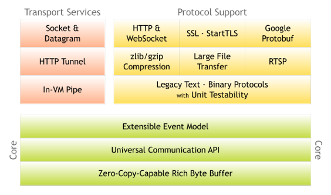
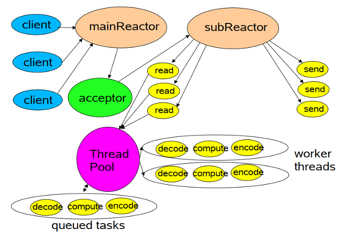
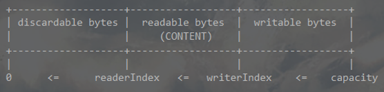
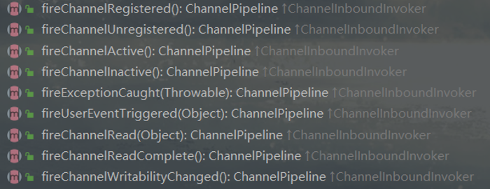
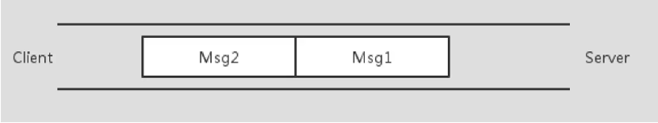
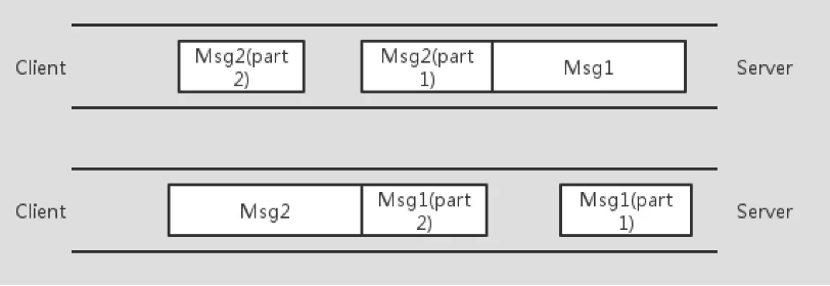

# 1.【Netty简介】

netty可以由一句话概括：**异步<sup>①</sup>**的**事件驱动<sup>②</sup>**的**网络应用<sup>③</sup>**程序框架



netty可以用来快速开发高性能、高可靠性的网络服务器和客户端程序。使用 netty 可以确保快速和简单地开发出一个网络应用，例如实现了某种协议的客户，服务端应用。netty 相当简化和流线化了网络应用的编程开发过程，例如：TCP和UDP的socket 服务开发！

## 1.1.I/O模式

java中有3种I/O模式，分别是：BIO、NIO和AIO。相应地，netty曾经对它们都做了支持，BIO模式在netty中称为OIO（old io），属于同步阻塞模式，现已被标记为Deprecated；NIO模式是netty常用且建议使用的模式，在netty中给出了在不同平台的实现类；AIO模式是netty5要增加的模式，但是由于性能提高不明显且使用难度增加，因此被netty社区废除（服务器常用Linux，但Linux下AIO不成熟，相较于NIO性能提高不明显）


通用的NIO实现（上图中的Common）在Linux下也是使用epoll，但是netty还是单独为其实现一套，主要原因是有两点：

- 暴露了更多的可控参数
- 垃圾回收更少、性能更好

# 2.【Reactor模式】

netty是按照Reactor模式去设计整体架构，何为Reactor模式？它是一种基于事件驱动的设计模式，将一个或多个客户端请求分离（demultiplex）和调度（dispatch）给事件处理器(event handler)处理。换句话说，注册感兴趣的事件→扫描是否有感兴趣的事件发生→事件发生后作出相应处理

reactor模式就是来解决`thread per connection`问题的，它的设计理念是以事件作为驱动，例如：在一次TCP连接中，从开始连接到数据交互完成，中间可以划分为多个事件如：连接就绪、读数据就绪、写数据就绪、连接关闭...每次事件发生都会回调对应的处理器（处理器即thread）

这种模式将服务端线程的职能划分得更细致，以往服务端线程都是一条龙服务，从连接就绪到解析数据，读取数据最终写回数据，都在一个线程中完成。但reactor模式划分更细致，读事件有读处理器回调，写事件有写处理器回调。Java的nio包下的Selector本质上就是IO多路复用器，也是实现Reactor模式的基础

## 2.1.演变过程

以下图总结自Doug Lea的Reactor模式一文，膜拜大佬！[http://gee.cs.oswego.edu/dl/cpjslides/nio.pdf](http://gee.cs.oswego.edu/dl/cpjslides/nio.pdf)

### 2.1.1.thread_per_connection

对于TCP长连接，服务端通常都要维护与客户端关联的Socket，这就意味着每个客户端，服务端都需要新起一个线程去接收它的请求，这种编程模式是经典的、古老的`Thread per connection`，一个请求一个线程


这种编程模式优点是简单，适用于小型项目，并发量较少；对于高并发量的系统，一个请求一个线程，频繁地创建和销毁线程，本身就会对系统造成巨大的性能开销。虽然，在java中有了线程池的概念，虽然可以有效地减少创建线程带来的性能损耗，但却治标不治本，没从根本上解决一个请求一个线程的处理方式，一旦某次请求耗时，线程池任务用光，服务端就无法接收客户端的请求。伪代码如下：

```java
class Server implements Runnable {
    public void run() {
        while (!Thread.interrupted()){
            try {
                // 初始化ServerSocket进行监听
                ServerSocket ss = new ServerSocket(8080);
                // 阻塞等待客户端发起连接
                Socket socket = ss.accept();
                // 接收到客户端连接后, 开启一个线程处理
                executorService.execute(new Handler(socket));
            }catch(Exception ex){
                // 处理各种异常
            }
        }
    }

    static class Handler implements Runnable {
        final Socket socket;
        Handler(Socket s) { 
            socket = s; 
        }
        public void run() {
            try {
                // 解码
                byte[] input = new byte[MAX_INPUT];
                socket.getInputStream().read(input);
                // 逻辑处理
                byte[] output = process(input);
                // 重新编码, 写回Socket
                socket.getOutputStream().write(output);
            } catch (IOException ex) {

            }
        }

        /**
         * 实际处理逻辑
         */
        private byte[] process(byte[] cmd) {}
    }
}
```

### 2.1.2.single_thread_reactor

单线程Reactor模型，相当于所有的I/O事件（连接、读、写）都在一个线程里处理，这个线程就是创建并启动Reactor的线程。


但是，这种模型有个缺点，相当于把所有活儿都给Reactor干了，一是处理效率慢，二是如果该线程挂了，那服务就崩溃了。Reactor伪代码：

```java
public class Reactor implements Runnable {
    // 基于java.nio
    final Selector selector;
    final ServerSocketChannel serverSocket;

    public Reactor(int port) throws IOException {
        // 创建一个Selector, 同时开启一个ServerlSocketChannel
        selector = Selector.open();
        serverSocket = ServerSocketChannel.open();
        // 绑定端口
        serverSocket.socket().bind(new InetSocketAddress(port));
        // 配置为非阻塞模式
        serverSocket.configureBlocking(false);
        // 服务端只对连接事件感兴趣
        SelectionKey sk = serverSocket.register(selector, SelectionKey.OP_ACCEPT);
        // 选择键绑定一个Accector组件
        sk.attach(new Acceptor(serverSocket));
    }

    public void run() { 
        try {
            // Reactor一直在死循环, 等待客户端的连接
            while(!Thread.interrupted()){
                // 阻塞在监听事件上, 等待事件返回
                selector.select();
                // 感兴趣的事件发生, Selector#select()会返回, 返回值类型为SectionKey集合
                Set<SectionKey> selected = selector.selectedKeys();
                Iterator it = selected.iterator();
                while(it.hasNext()){
                    SectionKey sectionKey = it.next;
                    // 分发事件
                    dispatch(sectionKey);
                    // 清除事件
                    it.remove();
                }
            }
        }catch(Exception e){
            // 处理异常
        }
    }
    
    void dispatch(SelectionKey k) {
        // 根据SectionKey类型的不同, 调用不同的逻辑处理。这边统一抽调出接口Runnable, 然后不同的
        // 处理逻辑实现Runnable接口。例如Acceptor组件的逻辑只负责接收连接; Handler组件的逻辑负责
        // 处理读写请求
        Runnable r = (Runnable)(k.attachment());
        if (r != null){
            r.run();
        }
    }
}
```

Acceptor组件伪代码，它只负责接收客户端的连接：

```java
public class Acceptor() implements Runnable {
    private final ServerSocket serverSocket;
    public Acceptor(ServerSocket serverSocket){
        this.serverSocket = serverSocket;
    }
       
    /**
     * 这边会由Reactor组件的dispatch()方法来调用
     */
    public void run() {
        try {
            SocketChannel channel = serverSocket.accept();
            if (c != null){
                // 接收到连接后, 创建一个Handler实例, 处理读写请求
                new Handler(selector, channel);
            }
        }catch(IOException ex) { /*异常处理*/ }
    }
}
```

Handler组件伪代码，它负责读写逻辑。每来一个客户端连接，都会创建一个Handler处理

```java
final class Handler implements Runnable {

    static final int READING = 0, SENDING = 1;
    final SocketChannel socket;
    final SelectionKey sk;
    ByteBuffer input = ByteBuffer.allocate(MAXIN);
    ByteBuffer output = ByteBuffer.allocate(MAXOUT);
    int state = READING;

    public Handler(Selector selector, SocketChannel channel) throws IOException {
        // 保存与客户端连接的通道Channel, 并将其配置为非阻塞模式
        this.socket = channel; 
        this.socket.configureBlocking(false);
        // 往同一个Selector中注册读写事件
        sk = socket.register(selector, 0);
        // 会返回一个选择键, 将当前Handler关联进去, 一旦事件发生, 可以调用此Handler的方法
        sk.attach(this);
        // 刚创建的只对读事件感兴趣
        sk.interestOps(SelectionKey.OP_READ);
        // 唤醒Selector, 避免还在select()方法上阻塞
        selector.wakeup();
    }
    
    boolean inputIsComplete() { /*返回数据是否读取完成*/ }
    boolean outputIsComplete() { /*返回数据是否写出完成*/ }
    void process() { /*具体读逻辑*/ }

    /**
     * 此方法被Reatcor的dispatch()方法调用
     */
    public void run() {
        try {
            if (state == READING){
                 read();
            }else if(state == SENDING){
                send();
            }
        } catch (IOException ex) { /*异常处理*/ }
    }
    
    /**
     * 实际读逻辑
     */
    void read() throws IOException {
        // 将数据读取到缓冲区中
        socket.read(input);
        if (inputIsComplete()) {
            // 实际读事件处理逻辑
            process();
            // 更改状态为发送
            state = SENDING;
            // 读事件处理完成以后, 感兴趣事件变为写
            sk.interestOps(SelectionKey.OP_WRITE);
        }
    }
    
    /**
     * 实际写逻辑
     */
    void send() throws IOException {
        socket.write(output);
        if (outputIsComplete()) {
            // 数据写回完成后, 释放SectionKey
            sk.cancel();
        }
    }
}
```

### 2.1.3.multi_thread_reactor

多线程Reactor模型，就是将上一步单线程Reactor模型的Handler组件从Reactor中解放出来，不在运行Reactor的线程中调用，而是启用一个线程池，可以称该线程池为Workers，交由它来执行读写逻辑。


其实很容易可以看出单线程Reactor模型的缺点，那就是如果业务逻辑处理比较耗时，其实是会占用Reactor所在线程的效率，那就没办法及时响应其它客户端的请求。所以把业务逻辑放到线程池中执行，其实也就是将Handler异步执行，伪代码为：

```java
class Handler implements Runnable {
    // 开启一个线程池
    static PooledExecutor pool = new PooledExecutor(...);
    static final int PROCESSING = 3;
    
    /**
     * 此方法被Reatcor的dispatch()方法调用
     */
    public void run() {
        try {
            if (state == READING){
                 read();
            }else if(state == SENDING){
                send();
            }
        } catch (IOException ex) { /*异常处理*/ }
    }
    
    // 读请求
    synchronized void read() { 
        socket.read(input);
        if (inputIsComplete()) {
            state = PROCESSING;
            // 业务逻辑放到线程池中执行
            pool.execute(new Processer());
        }
    }
    
    // 在线程池中处理业务逻辑
    class Processer implements Runnable {
        public void run() { processAndHandOff(); }
    }
    
    // 实际处理请求
    synchronized void processAndHandOff() {
        process();
        state = SENDING;
        sk.interest(SelectionKey.OP_WRITE);
    }
    
}
```

### 2.1.2.master_slave_multi_thread_reactor

主从多线程Reactor模式，将职责更细分化，前面两个Reactor，不仅要监听连接事件，还要监听读写事件。而主从Reactor模型将这个职责更细分化，一个Reactor负责处理连接请求，另一个Reactor处理读写请求。其实netty也采用了这种设计模型，如netty常用的bossGroup和workerGroup。

这种编程模型组件功能如下：

1. mainReactor只负责接收请求，它会将客户端的请求封装成acceotor，将它交予subReactor。然后它就继续等待接收客户端请求（不会处理请求）

2. subReactor负责处理客户端请求，当客户端有数据传入时，通过线程池处理这些数据。实际上，就是在Socket对应事件发生时回调对应处理器。



## 2.2.编程模型

上面是Doug Lea在《Scalable IO in Java》一文中针对于java提出reactor编程模式。还有一篇更古老的博客《reactor-siemens》诠释了Reactor模式的架构设计，也是很经典的一张图：


### 2.2.1.五大组件

上图5个带有背景颜色的方框就是一个组件，它们作用分别是：

1. **Handle-事件句柄**。由操作系统提供，表示一种资源，该资源用来表示一个个事件，如网络编程中的Socket描述符，Handle是事件的发源地；

2. **Event Handler–事件处理器**。自身由多个回调方法构成，这些回调方法会在事件Handle发生时被调用(被初始分发器调用)。特别注意：在java nio中没有事件处理器的概念，而Netty基于nio升级了架构，它完善了事件处理器，在IO事件发生时，提供了相应的回调方法；

3. **Concrete Event Handler–事件处理器实现**。就是Event Handler的具体实现，在每个回调方法实现具体逻辑，这个组件就是我们变成的处理器实现；

4. **Synchronous Event Demultiplexer-同步事件分离器**。它本身是一个底层操作系统调用，用来等待事件的发生。调用方在调用它的时候会被阻塞，一直阻塞到同步事件分离器上有事件发生为止。对于Linux而言，同步事件分离器就是IO多路复用机制，比如select、poll、epoll等；在java nio中同步事件分离器就是选择器Selector，对应阻塞方法即select()方法；

5. **Initiation Dispatcher–初始分发器**。实际上就是[上图](#2.1.2.reactor)Doug Lea诠释的 Reactor角色，它提供了两大功能：其一是事件处理器的注册与销毁；其二是事件的调度。Initiation Dispatcher通过同步事件分离器等待事件的发生， 一旦事件发生(单个或多个)它会分离出每一个事件，选择注册在它身上的事件处理器，最后调用相关回调方法来处理这些事件。

### 2.2.2.执行流程

下图左侧文字代表每个步骤：


1. **initialize**。主程序(main program)初始化分发器Initiation Dispatcher；

2. **register handler**。向Initiation Dispatcher注册具体的事件处理器，同时标识出该事件处理器希望分发器在某个事件发生时向其通知该事件，这个事件会与Handle关联；

3. **extract handle**。Initiation Dispatcher会要求每个事件处理器向其传递内部的Handle，该handle向操作系统标识了事件处理器；

4. **run event loop**。当所有事件处理器注册完毕，主程序调用handle_events()方法启动Initiation Dispatcher的事件循环。此时，Initiation Dispatcher会将每个注册的事件管理器的handle合并起来，通过同步事件分离器等待事件发生；

5. **dispatch handler**。当事件对应的handle变为ready状态(即可用状态)，同步事件分离器就通知分发器，分发器就会通过这个handle选择恰当的事件处理器回调方法。

## 2.3.Netty实现

netty用它巧妙的设计，很简单地可以实现不同Reactor的效果：

- 单线程Reatcor

  ```java
  EventLoopGroup eventGroup = new NioEventLoopGroup(1);
  ServerBootstrap serverBootstrap = new ServerBootstrap();
  serverBootstrap.group(eventGroup);
  ```

- 多线程Reatcor

  ```java
  EventLoopGroup eventGroup = new NioEventLoopGroup();
  ServerBootstrap serverBootstrap = new ServerBootstrap();
  serverBootstrap.group(eventGroup);
  ```

- 主从Reactor

  ```java
  EventLoopGroup parentGroup = new NioEventLoopGroup(1);
  EventLoopGroup childGroup = new NioEventLoopGroup();
  ServerBootstrap serverBootstrap = new ServerBootstrap();
  serverBootstrap.group(parentGroup, childGroup);
  ```

# 3.【Netty缓冲区】

## 3.1.三种缓冲区

netty提供了三种不同的缓冲区，都可以由io.netty.buffer.Unpooled获取：

**①heap buf**

- 实例：Unpooled.buffer()；

- 描述：最常用类型，将数据存储到JVM堆，实际数据存放到字节数组上；

- 优点：可以快速地创建和释放，并且提供直接访问内部字节数组的方法；

- 缺点：每次读写数据都需要先将数据复制到直接缓冲区中再进行网络传输；

**②direct buf**

- 实例：Unpooled.directBuffer

- 描述：在JVM堆外分配内存空间，由操作系统在本地内存进行数据分配

- 优点：Socket传输时，由于数据直接位于操作系统本地内存，性能很好

- 缺点：内存空间的分配与释放要比heap buf更加复杂且速度要慢.(由于direct buf分配要慢，netty采用**内存池**方式解决！)

- 建议：对于业务处理用heap buf；对于I/O通信线程用direct buf；

**③composite buf**

- 实例：Unpooled.compositeBuffer()

- 描述：复合缓冲区，可以容纳其它ByteBuf(堆或非堆)，对它们统一管理

## 3.2.ByteBuf

netty针对缓冲区自己定义了一个io.netty.buffer.ByteBuf类，它内部维护了两个指针：readIndex和writeIndex。它们会把一个Bytebuf分为3个区域：(0,readIndex]**已读区域**(可丢弃)；(readIndex,writeIndex]**可读区域**(数据未读)；(wirteIndex,capacity]**可写区域**(数据空位置)。



# 4.【Netty事件循环】


上图是netty整个事件循环组的类继承图，主要从EventExecutorGroup开始往下看，再上层的父接口是JDK提供的并发包的内容，基础是线程池中可以执行周期任务的线程池服务。所以从这可以知道Netty可以实现周期任务，比如心跳检测。

## 4.1.EventLoop & EventLoopGroup

EventLoop，事件循环，用来处理Channel的所有I/O事件；

EventLoopGroup，事件循环组，用来管理多个EventLoop。


EventLoop、EventLoopGroup、Thread、Channel之间的相互关系：

1. 一个EventLoopGroup可以包含一个或多个EventLoop，即1:n

2. 一个EventLoop只能与一个Thread绑定，即1:1

3. 一个Channel只能注册到一个EventLoop上，即1:1

4. 一个EventLoop可以分配给多个Channel，即1:n。 

每当一个新连接到达，netty就会创建一个Channel，然后从EventLoopGroup中分配出一个EventLoop与该Channel绑定，然后在这个Channel整个生命周期中都是由这个EventLoop来处理它的IO事件。而且，所有EventLoop处理的I/O事件都交由它内部唯一一个专用的Thread来处理，从而保证线程安全！

**重要结论：**

不要将长时间执行的耗时任务放入到EventLoop的执行队列中，因为它将会一直阻塞该线程所对应的所有Channel上的其它执行任务，若需要进行阻塞调用或耗时的操作，则建议使用一个专门的EventExecutor(业务线程池)。

#  5.【Netty处理器】

## 5.1.ChannelHandler

ChannelHandler，通道处理器，主要用来处理各种事件。ChannelHandler 有两个核心子类 ChannelInboundHandler 和 ChannelOutboundHandler，其中 ChannelInboundHandler 用于接收、处理入站( Inbound )的数据和事件，而 ChannelOutboundHandler 则相反，用于接收、处理出站( Outbound )的数据和事件。除此之外，netty还提供了ChannelDuplexHandler，它可以同时用于接收、处理入站和出站的数据。

```java
public interface ChannelHandler {
  /**
   * 当此ChannelHandler被添加到ChannelPipeline中就会触发此方法.
   * 一般用于ChannelHandler的初始化逻辑.
   */
  void handlerAdded(ChannelHandlerContext ctx) throws Exception;

  /**
   * 当此ChannelHandler从ChannelPipeline移除就会触发此方法.
   * 一般用于ChannelHandler的销毁逻辑
   */
  void handlerRemoved(ChannelHandlerContext ctx) throws Exception;

  /**
   * 此方法已被取消, 转而去ChannelInboundHandler
   */
  @Deprecated
  void exceptionCaught(ChannelHandlerContext ctx, Throwable cause) throws Exception;

  /**
   * 通常一个ChannlHandler只能注册在一个ChannelPipeline上, 但是如果加了这个注解,
   * 它就可以注册到多个ChannelPipeline上.
   */
  @Inherited
  @Documented
  @Target(ElementType.TYPE)
  @Retention(RetentionPolicy.RUNTIME)
  @interface Sharable {
    // no value
  }
}
```

### 5.1.1.入站处理器

入站处理器即ChannelInboundHandler，它提供了在Channel状态变化时提供钩子函数，便于我们做出相应的处理逻辑。除此之外，netty还提供了一个适配器ChannelInboundHandlerAdapter，它实现了ChannelInboundHandler接口，里面方法实现很简单，就是通过上下文ChannelHandlerContext.firexxxx()方法将事件传播到下一个处理器。

```java
public interface ChannelInboundHandler extends ChannelHandler {
  /**
   * 当Channel被注册到EventLoop上, 会触发此方法
   */
  void channelRegistered(ChannelHandlerContext ctx) throws Exception;

  /**
   * 当Channel从EventLoop上被移除时, 就会触发此方法
   */
  void channelUnregistered(ChannelHandlerContext ctx) throws Exception;

  /**
   * 当Channel被激活时, 就会触发此方法
   */
  void channelActive(ChannelHandlerContext ctx) throws Exception;

  /**
   * 已注册的Channel处于非Active状态并且已到达它的生命周期, 触发此方法
   */
  void channelInactive(ChannelHandlerContext ctx) throws Exception;

  /**
   * 当Channel的对端有数据可读时, 就会触发此方法
   */
  void channelRead(ChannelHandlerContext ctx, Object msg);

  /**
   * 当上面的channelRead()方法读取到最后一条消息时, 就会触发此方法
   */
  void channelReadComplete(ChannelHandlerContext ctx) throws Exception;

  /**
   * 当用户事件触发时就会调用此方法
   */
  void userEventTriggered(ChannelHandlerContext ctx, Object evt);

  /**
   * 当Channel的可写状态被改变时, 就会触发此方法
   */
  void channelWritabilityChanged(ChannelHandlerContext ctx);

  /**
   * 在这个ChannelHandler处理事件发生异常时, 就会触发此方法
   */
  @Override
  @SuppressWarnings("deprecation")
  void exceptionCaught(ChannelHandlerContext ctx, Throwable cause);
}
```

### 5.1.2.出站处理器

ChannelOutboundHandler会处理I/O出站（将数据主动发送给对端）的操作。除此之外，netty还提供了一个适配器ChannelOutboundHandlerAdapter，它实现了ChannelOutboundHandler接口，里面方法实现很简单，直接通过上下文ChannelHandlerContext调用同名方法。

```java
public interface ChannelOutboundHandler extends ChannelHandler {
  /**
   * 当一个Channel绑定操作完成, 就调用此方法
   * @param ctx 表示为这个上下文对象进行绑定端口操作
   * @param localAddress  绑定到这个地址上
   * @param promise 一旦绑定操作完成, 使用这个ChannelPromise去通知所有监听器
   */
  void bind(ChannelHandlerContext ctx, SocketAddress localAddress, 
            ChannelPromise promise) throws Exception;

  /**
   * 当一个Channel连接操作完成, 就调用此方法
   * @param ctx t表示为这个上下文对象进行通道连接操作
   * @param remoteAddress 待连接的远程地址
   * @param localAddress 本地地址, 使用它取连接远程地址
   * @param promise 连接操作完成, 通过它去通知所有的监听器
   */
  void connect(ChannelHandlerContext ctx, SocketAddress remoteAddress,
               SocketAddress localAddress, ChannelPromise promise) throws Exception;

  /**
   * 当通道断开连接时, 就会调用此方法
   * @param ctx t表示为这个上下文对象进行断开连接操作
   * @param promise s断开连接操作完成, 通过这个ChannelPromise通知旗下的监听器
   */
  void disconnect(ChannelHandlerContext ctx, ChannelPromise promise);

  /**
   * 当通道关闭时, 就会调用此方法
   * @param ctx 表示为这个上下文对象进行通道关闭操作
   * @param promise t当操作完成, 通过这个ChannelPromise通知旗下的监听器
   */
  void close(ChannelHandlerContext ctx, ChannelPromise promise) throws Exception;

  /**
   * 从当前注册的EventLoop执行注销操作后调用
   */
  void deregister(ChannelHandlerContext ctx, ChannelPromise promise);

  /**
   * 拦截{@link ChannelHandlerContext#read()}的数据读取操作
   */
  void read(ChannelHandlerContext ctx) throws Exception;

  /**
   * 通过ChannelPipeline写入消息, 当写操作完成时就会调用此方法. 这些数据会在调用
   * flush()后从底层Channel中发送给对端.
   * @param ctx 为这个上下文对象执行写操作
   * @param msg 待写入的消息
   * @param promise t当写入操作完成, 通过这个promise通知旗下的所有监听器
   */
  void write(ChannelHandlerContext ctx, Object msg, ChannelPromise promise);

  /**
   * 刷新操作将尝试刷新所有以前写入的挂起消息, 操作完成后就会触发这个方法
   * @param ctx 为这个上下文执行刷新操作
   */
  void flush(ChannelHandlerContext ctx) throws Exception;
}
```

## 5.2.处理器上下文

### 5.2.1.ChannelHandlerContext

ChannelHandlerContext是连接ChannelHandler与ChannelPipeline的桥梁，它可以让一个ChannelHandler与它所在的ChannelPipeline中的其它ChannelHanler进行交互。

```java
public interface ChannelHandlerContext extends AttributeMap, 
ChannelInboundInvoker, ChannelOutboundInvoker {
  /**
   * 返回绑定在这个处理器上下文的通道Channel
   */
  Channel channel();

  /**
   * 返回用来执行任意任务的事件处理器EventExecutor
   */
  EventExecutor executor();

  /**
   * 当前上下文的唯一名称
   */
  String name();

  /**
   * 返回绑定在当前上下文的处理器ChannelHandler
   */
  ChannelHandler handler();

  /**
   * 与此上下文关联的ChannelHandler从ChannelPipeline移除时, 此方法就返回返回true.
   */
  boolean isRemoved();

  /**
   * 以下方法从ChannelInboundInvoker接口继承并修改了其返回值, 用来触发入站处理器定义
   * 的各个事件.
   */
  ChannelHandlerContext fireChannelRegistered();
  ChannelHandlerContext fireChannelUnregistered();
  ChannelHandlerContext fireChannelActive();
  ChannelHandlerContext fireChannelInactive();
  ChannelHandlerContext fireExceptionCaught(Throwable cause);
  ChannelHandlerContext fireUserEventTriggered(Object evt);
  ChannelHandlerContext fireChannelRead(Object msg);
  ChannelHandlerContext fireChannelReadComplete();
  ChannelHandlerContext fireChannelWritabilityChanged();

  // 下面两个方法从ChannelOutboundInvoker接口继承并修改其返回值
  ChannelHandlerContext read();
  ChannelHandlerContext flush();


  /**
   * 返回此上下文关联的管道ChannelPipeline
   */
  ChannelPipeline pipeline();

  /**
   * 返回此上下文关联的缓冲区分配器ByteBufAllocator, 用来申请ByteBuf
   */
  ByteBufAllocator alloc();

  // 下面两个方法继承自AttributeMap
  <T> Attribute<T> attr(AttributeKey<T> key);
  <T> boolean hasAttr(AttributeKey<T> key);
}

```

### 5.2.2.AbstractChannelHandlerContext

AbstractChannelHandlerContext是ChannelHandlerContext的抽象实现，基本上管道ChannelPipeline使用的上下文对象都是这个类，它是一个双向链表结构，其类信息如下：

```java
abstract class AbstractChannelHandlerContext extends DefaultAttributeMap
  implements ChannelHandlerContext, ResourceLeakHint {
  // 前驱节点和后继节点
  volatile AbstractChannelHandlerContext next;
  volatile AbstractChannelHandlerContext prev;
  // 上文下状态变量handlerState的原子更新器
  private static final AtomicIntegerFieldUpdater<AbstractChannelHandlerContext>
    HANDLER_STATE_UPDATER =AtomicIntegerFieldUpdater.newUpdater(
    AbstractChannelHandlerContext.class, "handlerState");
  
  /* 下面4个变量, 表示上下文状态handlerState的取值 */
  // 表示ChannelHandler.handlerAdded()即将被调用
  private static final int ADD_PENDING = 1;
  // 表示ChannelHandler.handlerAdded()已经被调用
  private static final int ADD_COMPLETE = 2;
  // 表示ChannelHandler.handlerRemoved()已经被调用
  private static final int REMOVE_COMPLETE = 3;
  // 表示ChannelHandler的handlerAdded()和handlerRemoved()都未被调用
  private static final int INIT = 0;
  
  // 若此上下文关联的ChannelHandler是入站处理器则inbound为true, 反之outbound为true
  private final boolean inbound;
  private final boolean outbound;
  
  // 关联的ChannelPipeline对象
  private final DefaultChannelPipeline pipeline;
  
  // 此上下文的唯一名称
  private final String name;
  
  // 此上下文使用的EventExecutor是否实现了OrderedEventExecutor
  private final boolean ordered;
  
  // 每个上下文会关联一个事件执行器EventExecutor
  final EventExecutor executor;
  
  // 成功的 ChannelFuture对象
  private ChannelFuture succeededFuture;
  
  // 执行 Channel ReadComplete 事件的任务
  private Runnable invokeChannelReadCompleteTask;
  
  // 执行 Channel Read 事件的任务
  private Runnable invokeReadTask;
  
  // 执行 Channel WritableStateChanged 事件的任务
  private Runnable invokeChannelWritableStateChangedTask;
  
  // 执行 flush 事件的任务
  private Runnable invokeFlushTask;
  
  // 表示此上下文的状态, 为上面定义的四种
  private volatile int handlerState = INIT; 
}
```

要注意一点，ChannelHandler在上下文对象ChannelHandlerContext中是使用AttributeKey来存储状态，因此如果同一个ChannleHandler多次添加到ChannelPipeline却指定不同的名称，即使都是同一个ChannelHanler，也会被调用四次，因为它们在上下文中的状态不一样，如：

```java
MyHandler fh = new MyHandler();

ChannelPipeline p1 = Channels.pipeline();
p1.addLast("f1", fh);
p1.addLast("f2", fh);

ChannelPipeline p2 = Channels.pipeline();
p2.addLast("f3", fh);
p2.addLast("f4", fh);
```

## 5.3.编解码器

**编解码器：**无论向网络中写入的数据是什么类型（int、char、String..），数据在网络中传输，都是以字节的形式呈现的；将数据由原先形式转换为字节流的操作称为编码（encode），将数据由字节转换为它原本的格式或其它格式的操作称为解码（decode），编解码统一称为codec！netty提供专门处理编解码的[ChannelHanlder](#5.1.ChannelHandler)，这些处理器就称为编解码器。

**编码器：**本质上是出站处理器，因此编码一定是[ChannelOutboundHandler](#5.1.2.出站处理器)

**解码器：**本质上以入站处理器，因此解码一定是[ChannelInboundHandler](#5.1.1.入站处理器).

（一般情况下，编码器以xxxEncoder命名，解码器以xxxDecoder命令）

1.编解码器接收的消息类型必须与待处理的参数类型一致，否则它不执行；

2.解码器进行数据解码时，一定要判断ByteBuf的字节数是否足够！！

### 5.3.1.“一次”编解码

“一次”编解码的意思就是将网络Socket传输的字节流数据进行处理，主要用来**处理TCP粘包/半包**问题，对应：

- 解码器抽象类：ByteToMessageDecoder，它会源源不断地将ByteBuf的数据累加处理；
- 编码器抽象类：MessageToByteEncoder

### 5.3.2.“二次”编解码

”一次“编解码的结果还是字节（ByteBuf），没办法直接使用，因此还需要通过”二次“编解码将字节转为Java对象：

- 解码器抽象类：MessageToMessageDecoder
- 编码器抽象类：MessageToMessageEncoder

# 6.【Netty通道】

## 6.1.Channel

netty相较于nio的通道自定义了一个组件io.netty.channel.Channel。它是netty网络操作抽象类，除了包括基本的 I/O 操作，如 bind、connect、read、write 之外，还包括了netty框架相关的一些功能，如获取该 Channel 的 EventLoop、获取通道配置ChannelConfig等等。

netty不仅提供nio支持，也提供了bio支持(但没提供aio支持)，所有已Nio开头的Channel如NioServerSocketChannel都是基于nio实现的。所有已Oio开头的Channel如OioServerSocketChannel都是原始的bio实现，意味着它是阻塞式的。

**重要结论：**

channel的实现一定是线程安全，基于此可以储存channel的引用，通过该引用向远端发送数据，即便当时有多个线程同时发送也不会出现并发问题；而且，消息一定会按顺序发送出去。

## 6.2.ChannelPipeline

ChannelPipeline即管道。当一个Channel创建好后，与之相对应的管道就会自动创建完毕，默认实现类：DefaultChannelPipeline。管道内维护着[ChannelHandlerContext](#5.2.处理器上下文)的链表集，再由它去维护ChannelHandler的关系。因此，ChannelPipeline本质是ChannelHandler集合，内部细分为ChannelInboundHandler和ChannelOutboundHandler，用来处理与之关联的Channel的数据流入和流出，形如：


与ChannelPipeline(管道)关联的一方是用户程序，一方是netty底层IO线程，当客户端传入数据，就会从Socket.read()读入，经过管道一个一个的ChannelInboundHandler处理，到达最后一个handler处理；若是数据写出则从最后一个ChannelOutboundHandler开始，到达netty底层的IO线程，最后socket.write()写出。处理顺序例如：

```java
ChannelPipeline p = ch.pipeline();
p.addLast("1", new InboundHandlerA());
p.addLast("2", new InboundHandlerB());
p.addLast("3", new OutboundHandlerA());
p.addLast("4", new OutboundHandlerB());
p.addLast("5", new InboundOutboundHandlerX());
```

则数据流入的顺序为：1→2→5。数据流出的顺序为：5→4→3，其实就像spring mvc的拦截器链一样，进来先处理的，出去就会晚处理。ChannelPipeline提供了许多以fire开头的方法，用来将事件交于下一个handler：



## 6.3.ChannelFuture

netty的io.netty.util.concurrent.Future接口继承自JDK的java.util.concurrent.Future。因为netty是采用异步处理的逻辑，所以它的方法调用都会立即返回，类型就是这个Future。而且，netty的Future接口扩展JDK的Future接口，增加了监听器io.netty.util.concurrent.GenericFutureListener，它会在异步执行完后，以回调的方式主动通知监听器（标准的观察者模式），需要注意的是监听器中的operationComplete()方法是由I/O线程调用的，切记不要在此执行耗时操作！

ChannelFuture接口继承了Future接口。ChannelFuture 接口通过该接口的 #addListener(...) 方法，注册一个 ChannelFutureListener，当操作执行成功或者失败时，监听就会自动触发返回结果。

**tips:**

 <u>在java，区别方法是通过：方法名+参数，没有通过返回值来区分方法的。所以可以看到Future和ChannelFuture的#addListener()方法返回值不一样，但是ChannelFuture却覆盖Future#addListener()方法</u>

## 6.4.ChannelPromise

netty的io.netty.util.concurrent.Promise接口继承了io.netty.util.concurrent.Future接口，它是一种特殊的Future，在它的基础上提供了**写入**的功能。

ChannelPromise接口继承了ChannelFuture接口和Promise接口，同样提供了#addListener()方法，注册ChannelFutureListener，当通道操作执行成功或失败时，自动触发返回结果；并且ChannelPromise可以手动设定通道操作的成功与失败！

# 7.【Netty配置类】

## 7.1.AbstractBootstrap

netty提供了ServerBootstrap和Bootstrap用来便捷地配置netty服务，这两个类都实现了AbstractBootstrap抽象类。它们实际上都是配置类，用来启动一个netty服务，而且针对Reactor模式，AbstractBootstrap保存得都是bossgroup的配置，而其子类(如ServerBootstrap)保存的都是childgroup的配置。

```java
public abstract class AbstractBootstrap<B extends AbstractBootstrap<B, C>, 
C extends Channel> implements Cloneable {
  // 配置事件循环组
  volatile EventLoopGroup group;
  
  // 配置Channel生成工厂
  private volatile ChannelFactory<? extends C> channelFactory;
  
  // 配置本地地址
  private volatile SocketAddress localAddress;
  
  // 配置ChannelOption. ChannelOption是作为一个key来为Channel配置时设值用的
  private final Map<ChannelOption<?>, Object> options = 
    	new LinkedHashMap<ChannelOption<?>, Object>();
  
  // 配置属性Attribute, 以AttributeKey作为key
  private final Map<AttributeKey<?>, Object> attrs = 
    	new LinkedHashMap<AttributeKey<?>,Object>();
  
  // 配置用于bossGroup的通道处理器ChannelHandler
  private volatile ChannelHandler handler;
}
```

## 7.2.ServerBootstrap

ServerBootstrap通常用来配置和启动netty服务端的工具类，它内部定义的属性用来给workerGroup配置。若调用它定义的childxx()方法就是给workerGroup配置的，其它则是调用super()方法给bossGroup配置：

```java
private final Map<ChannelOption<?>, Object> childOptions = 	new LinkedHashMap<ChannelOption<?>, Object>();
private final Map<AttributeKey<?>, Object> childAttrs = 
  new LinkedHashMap<AttributeKey<?>, Object>();
private final ServerBootstrapConfig config = new ServerBootstrapConfig(this);
private volatile EventLoopGroup childGroup;
private volatile ChannelHandler childHandler;
```

# 8.【Netty内存管理】

netty设计了一套内存池（参考jemalloc的原理），用来对内存进行管理，netty内存管理实质就是先分配一块大内存，然后在内存的分配和回收过程中，使用一些数据结构记录内存使用状态，如果有新的分配请求，根据这些状态信息寻找最合适的位置并更新内存结构。释放内存时候：同步修改数据结构。

## 8.1.设计原理

### 8.1.1.管理粒度

netty内存管理的粒度分为：

- **Chunk**：netty向操作系统申请内存是以Chunk为单位申请的，内存分配也是基于Chunk。Chunk是以Page为单元的集合，默认16M；
- **Page**: 内存管理的最小单元，默认8K；
- **SubPage**: Page内的内存分配单元。

netty逻辑上将内存大小分为了tiny, small, normal, huge 几个单位。申请内存大于Chunk size 为huge，此时不在内存池中管理，由JVM负责处理；当Client申请的内存大于一个Page的大小（normal）, 在Chunk内进行分配; 对tiny&small大小的内存，在一个Page页内进行分配


### 8.1.2.管理层级

netty内存池的层级结构，主要分为Arena、ChunkList、Chunk、Page、Subpage这5个层级

- Arena代表1个内存区域，为了优化内存区域的并发访问，netty中内存池是由多个Arena组成的数组，分配时会每个线程按照轮询策略选择1个Arena进行内存分配；

- 1个Arena由两个**PoolSubpage**数组和多个**ChunkList**组成。

  - 两个PoolSubpage数组分别为**tinySubpagePools**和**smallSubpagePools**

  - 多个ChunkList按照双向链表排列，每个ChunkList里包含多个Chunk，每个Chunk里包含多个Page（默认2048个），每个Page（默认大小为8k字节）由多个Subpage组成

```java
abstract class PoolArena<T> implements PoolArenaMetric {
    
    private final PoolSubpage<T>[] tinySubpagePools;
    private final PoolSubpage<T>[] smallSubpagePools;

    // 存储内存利用率0-25%的chunk
    private final PoolChunkList<T> qInit;
    // 存储内存利用率1-50%的chunk
    private final PoolChunkList<T> q000;
    // 存储内存利用率25-75%的chunk
    private final PoolChunkList<T> q025;
    // 存储内存利用率50-100%的chunk
    private final PoolChunkList<T> q050;
    // 存储内存利用率75-100%的chunk
    private final PoolChunkList<T> q075;
    // 存储内存利用率100%的chunk
    private final PoolChunkList<T> q100;
}
```

## 8.2.内存分配流程

- PoolArena：内存分配中心
- PoolChunk：负责Chunk内的内存分配
- PoolSubpage：负责Page内的内存分配


## 8.3.内存泄露检测

netty中的内存泄露，其实指的是申请了ByteBuf，但是忘记释放了，即

```java
ByteBuf buf = ctx.alloc().buffer();

// 缺少释放内存的操作, 下面二选一
buffer.release();
ReferenceCountUtil.release(buffer);
```

不管是申请堆外内存还是堆内内存（池化），其最终造成的后果就是OOM。netty内存泄露检测核心思路：引用计数（buffer.refCnt()）+ 弱引用（Weak reference），要明确一点，**netty只有在对象被GC后才能来判断该对象是否出现内存泄露**

### 8.3.1.核心思路

当netty分配ByteBuf时，即ByteBuf buffer = ctx.alloc().buffer()，它会做两件事：

1. 将该ByteBuf的引用计数 + 1
2. 定义一个弱引用对象（DefaultResourceLeak）加到list（#allLeaks）里

而当显示调用释放方法时，即buffer.release()，它会将引用计数 - 1，一旦减到0就会自动释放资源操作，并将弱引用对象从list里面移除。

**判断依据**：弱引用对象在不在list里面？若在，说明引用计数还没有到0，那么该对象没有执行释放；

**判断时机**：弱引用指向对象被回收时，可以把弱引用放进指定ReferenceQueue里面，遍历这个queue拿出所有弱引用来判断！

### 8.3.2.使用方式

netty提供了一个工具类`io.netty.util.ResourceLeakDetector`用来帮使用者检测是否出现内存泄露。这个工具类的触发汇报时机在于：AbstractByteBufAllocator#buffer()方法会调用ResourceLeakDetector#track()方法，此时它就会做一次内存泄露的判断。

**使用步骤**

1. 加上JVM运行参数：-Dio.netty.leakDetection.level=PARANOID；
2. 注意日志级别，至少要到error级别，netty才会打印泄露日志；
3. GC后才可能检测到，因此要么降低JVM大小，要么不断地创建ByteBuf；

# 9.【调优参数】

## 9.1.系统参数

netty支持的系统调优参数，主要是在ServerBootstrap这个类来设置，分为两种情况：

- SockertChannel → ServerBootstrap.childOption()
- ServerSocketChannel → ServerBootstrap.option()

### 9.1.1.SocketChannel

| Netty系统相关参数 | 功能                                                         | 默认值                                                       |
| ----------------- | ------------------------------------------------------------ | ------------------------------------------------------------ |
| SO_SNDBUF         | TCP数据发送缓冲区大小                                        | /proc/sys/net/ipv4/tcp_wmem：4K，os动态调整                  |
| SO_RCVBUF         | TCP数据接收缓冲区大小                                        | /proc/sys/net/ipv4/tcp_rmem：4K，os动态调整                  |
| SO_KEEPALIVE      | TCP层keepalive                                               | 默认关闭（一般会启动应用层的keepalive）                      |
| SO_REUSEADDR      | 地址重用，解决“Address already in use”，常用开启场景：多网卡(IP)绑定相同端口；让关闭连接释放的端口更早可使用 | 默认关闭，需要注意：这个参数开启时并不是让TCP绑定完全相同IP + POST来重复启动 |
| SO_LINGER         | 关闭Socket的延迟时间，默认关闭则Socket.close()方法会立即返回 | 默认关闭                                                     |
| IP_TOS            | 设置IP头部的Type-of-Service字段，用于描述IP包的优先级和Qos选项，比如说倾向于延时还是吞吐量 | 1000-最小的延迟；0100-最大吞吐量；0010-最大可靠性；0001-最小传输成本；0000-正常服务，默认值 |
| TCP_NODELAY       | 设置是否启用Nagle算法：用来将小的碎片数据连接成更大的报文来提供发送效率 | 默认关闭，如果需要发送一些较小的报文，则需要禁用此算法       |

### 9.1.2.ServerSocketChannel

| Netty系统相关参数 | 功能                                        | 备注                                                         |
| ----------------- | ------------------------------------------- | ------------------------------------------------------------ |
| SO_RCVBUF         | 为Acceptor创建的socket channel设置SO_RCVBUF | Acceptor创建好socket channel之后，其实就可以接受数据了，如果通过上面那种方式去设置，有可能数据已经传输了，此时设置就有点迟了。 |
| SO_REUSEADDR      | 是否可以重用端口                            | 默认false                                                    |
| SO_BACKLOG        | 最大的等待连接数量                          | netty在linux系统下，先尝试读 /proc/sys/net/core/somaxcon，再尝试"sysctl"，如果最终还没取到，就使用默认值128。当服务器负载过大，客户端请求就会被放置到队列，队列大小就由这个参数指定 |

注意：SO_BACKLOG这个参数跟其他参数不一样，它的设置方式：

```java
javaChannel().bind(localAddress, config.getBacklog());
```

## 9.2.netty核心参数

### 9.2.1.ChannelOption

ChannelOption（非系统相关：共11个）

| Netty参数                      | 功能                                                         | 默认值                                                       |
| ------------------------------ | ------------------------------------------------------------ | ------------------------------------------------------------ |
| WRITE_BUFFER_WATER_MARK        | 高低水位线，当写缓冲数据太多，就会将write设置成不可写，间接防止写数据OOM | 32K→64K，低水位到高水位默认值                                |
| CONNECT_TIMEOUT_MILLIS         | 客户端连接服务器最大允许时间                                 | 30秒                                                         |
| MAX_MESSAGE_PER_READ           | 最大允许”连续“读次数                                         | 16次                                                         |
| WRITE_SPIN_COUNT               | 最大允许”连续“写次数                                         | 16次                                                         |
| ALLOCATOR                      | ByeBuf分配器                                                 | ByteBufAllocator.DEFAULT，池化、堆外                         |
| RCVBUF_ALLOCATOR               | 数据接收ByteBuf分配大小计算器 + 读次数控制器                 | AdaptiveRecvByteBufAllocator                                 |
| AUTO_READ                      | 是否监听”读事件“                                             | 默认监听，设置此标记的方法也触发注册或移除读事件的监听       |
| AUTO_CLOSE                     | ”写数据“失败，是否关闭连接                                   | 默认打开                                                     |
| MESSAGE_SIZE_ESTIMATOR         | 数据（ByteBuf、FileRegion等）大小计算器                      | DefaultMessageSizeEstimator                                  |
| SINGLE_EVENTEXECUTOR_PER_GROUP | 当增加一个handler且指定EventExecutorGroup时，决定这个handler是否只用EventExecutorGroup中的一个固定的EventExecutor（取决于next()实现） | 默认：true，这个handler不管是否共享，绑定上唯一一个eventexecutor，所以小名“pinEventExecutor”，没有指定EventExecutorGroup，复用channel的NioEventLoop |
| ALLOW_HALF_CLOSURE             | 关闭连接时，允许半关                                         | 默认不允许。                                                 |

**ALLOCATOR和RCVBUF_ALLOCATOR的功能关联？**

ALLOCATOR负责ByteBuf怎么分配（例如：从哪里分配，是从堆内？还是从堆外？），而RCVBUF_ALLOCATOR负责计算为接收数据分配多少ByteBuf。其中RCVBUF_ALLOCATOR在netty中有两个实现，一个是固定大小的，一个是自适应的，即AdaptiveRecvByteBufAllocator，它有两个功能：

- 动态计算下一次分配ByteBuf的大小，就是guess()方法；
- 判断是否可以继续读数据，就是continueReading()方法；

相应的代码如下：

```java
io.netty.channel.AdaptiveRecvByteBufAllocator.HandlerImpl handler = AdaptiveRecvByteBufAllocator.newHandle();
ByetBuf byteBuf = handle.allocate(ByteBufAllocator);

// 其中handle.allocate的方法实现为
ByteBuf allocate(ByteBufAllocator alloc){
    // 通过guess()计算下次要分配缓冲区的大小，再交由ByteBufAllocator具体分配
    return alloc.ioBuffer(guess());
}
```

### 9.2.2.SystemProperty

系统参数，配置方式为：-Dio.netty.xxx，从功能上可以细分为三类：

- 多种实现的切换：-Dio.netty.noJdkZlibDecoder
- 参数的调优：-Dio.netty.eventLoopThreads
- 功能的开启关闭：-Dio.netty.noKeySetOptimization

系统参数比较多，这边慢慢来记录吧

| Netty参数                                                    | 功能                     | 备注                                                         |
| ------------------------------------------------------------ | ------------------------ | ------------------------------------------------------------ |
| io.netty.eventLoopThreads                                    | IO Thread数量            | 默认：avaliableProcessors * 2                                |
| io.netty.avaliableProcessors                                 | 指定avaliableProcessros  | 考虑 docker / VM等情况                                       |
| io.netty.allocator.type                                      | unpooled/pooled          | 池化还是非池化                                               |
| io.netty.noPreferDirect                                      | true/false               | 堆内还是堆外                                                 |
| io.netty.noUnsafe                                            | true/false               | 是否使用sum.misc.Unsafe                                      |
| io.netty.leakDetection.level                                 | DISABLED/SIMPLE等        | 内存泄露检测级别，默认SIMPLE                                 |
| io.netty.native.workdir<br />io.netty.tmpdir                 | 临时目录                 | 从jar中解出native库存放的临时目录                            |
| io.netty.processId<br />io.netty.machineId                   | 进程号<br />机器硬件地址 | 计算channel的ID：MACHINE_ID + PROCESS_ID + SEQUENCE + TIMESTAMP + RANDOM |
| io.netty.eventLoop.maxPendingTasks<br />io.netty.eventexecutor.maxPendingTasks | 存放的task最大数目       | 默认Integer.MAX_VALUE，手动设置时不低于16                    |
| io.netty.handler.ssl.noOpenSsl                               | 关闭open ssl使用         | 优选open ssl                                                 |

# 10.【Netty实战】

## 10.1.业务处理

### 10.1.1.耗时操作

ChannelHandler中的方法是由EventLoop的线程回调的，而EventLoop是属于I/O线程，它需要处理读写事件。若将执行耗时的业务逻辑放到ChannelHandler中，则会影响EventLoop处理其它I/O事件。针对这个问题有两种解决方式：

1. ChannelHandler定义业务线程池，执行异步调用；

2. ChannelPipeline添加ChannelHandler时，为其指定一个EventExecutor，比如说netty提供的`UnorderedThreadPoolEventExecutor`

   ```java
   /**
    * @param group 用来执行ChannelHandler中的方法
    * @param handlers  the handlers to insert last
    */
   ChannelPipeline addLast(EventExecutorGroup group, ChannelHandler... handlers);
   ```

### 10.1.2.写回数据

netty写数据到对端，有三种方式：

- write：写到一个buffer里
- flush：将buffer的数据发送出去
- writeAndFlush：写到buffer中，并且立马发送，write和flush之间存在ChannelOutBoundBuffer

将数据写回到通道对端，可以直接由ChannelHandlerContext写回，也可以通过它获取到Channel写回，即：

```java
// 通过Channel写回数据, 数据从ChannelPipeline的TailContext链表末尾开始传递直至底层Socket
ctx.channel().writeAndFlush();

// 通过ChannelHandlerContext写回数据, 数据从ChannelPipeline的当前Context开始写入. 对于
// 与Channel的同名方法来说，ChannelHandlerContext的方法将会产生更短的事件流，所以在可能的情况下
// 利用它提升应用性能
ctx.writeAndFlush();
```

### 10.1.3.增强写

使用writeAndFlush()写回数据，优点是延迟较小，对端立马就可以收到响应；缺点是吞吐量低，每次调用都需要通过socket发送网络包。所以实际运用中，要结合具体业务来考虑处理延迟还是提高吞吐量。对于这种情况，有两种方式可以来解决：

- **利用channelReadComplete()来实现**

  ```java
  public class EchoServerHandler extends ChannelInboundHandlerAdapter {
  
      @Override
      public void channelRead(ChannelHandlerContext ctx, Object msg) {
          // 每次读到一笔数据, 就只调用write()
          ctx.write(msg);
      }
  
      @Override
      public void channelReadComplete(ChannelHandlerContext ctx) {
          // 等到完全读完, 才调用flush()
          ctx.flush();
      }
  }    
  ```

  但是这种解决方式有一个问题，那就是只适合在同步调用中，一旦我们的handler定义了异步线程池，那么有可能在调用channelReadComplete()方法后，才调用channelRead()，那就会造成数据错乱。所以channelHandler异步调用不适用于这种方式

- **使用FlushConsolidationHandler来处理**

  FlushConsolidationHandler是netty提供的用来增强写 （即减少flush）的处理器，它的原理主要就是读达到一定次数后，再执行flush逻辑。适用于业务同步或异步两种，用法如下：

  ```java
  // 5表示每次读满5次以后再执行flush, true的含义是对独立异步线程池也做增强, 如果这个参数设置为
  // false. 那么netty对于开启业务异步线程的, 就只会直接刷新.
  ctx.pipeline().addLast("flushExchanger", new FlushConsolidationHandler(5, true))
  ```

## 10.2.TCP粘包/半包

粘包：多个小的TCP数据包会被组装成一个大的TCP数据包，然后才进行网络传递；

半包：一个完整的TCP数据包会被拆分成多个数据包发送；

### 10.2.1.产生原因

**产生粘包的原因：**

- 发送方写入的数据，小于套接字缓冲区的大小，网卡会将程序多次写入的数据一起发送到网络上；
- 接收方不及时读取套接字缓冲区数据，在下一次读取中就会获取到多个数据包；

**产生半包的原因：**

- 发送方写入的数据，大于套接字缓冲区大小，网卡会对其进行拆分，发送到网络上；
- 发送的数据大于协议的MTU（最大传输单元），就一定会拆包；

究其原因，**TCP是流式协议（面向字节流），消息之间无边界**。相反地，UDP就像邮寄的包裹，虽然一次运输多个，但每个包裹都有分界线，对端会一个一个签收，所以不会有粘包和半包的问题

### 10.2.2.图解流程

1. 一个正常的TCP报文传输是这样子，client将消息Msg1，Msg2依次发给server，而且server也是按照这样子的顺序接收到两个消息：


2. 一旦发生上面介绍的产生原因，比如数据报小于TCP缓冲区容量，就会发生粘包，TCP会将Msg1和Msg2组装成一个消息发给服务端，这样服务端就只会收到一个消息（但实际要拆分成2个消息）



3. 还有一种情况那就是数据报太大，超过了TCP缓冲区大小，则它会将其拆包，可能Msg1全部+Msg2部分当作一个消息发送给服务端：



注：这上面所说的消息（即Msg1、Msg2）都是一串一串的字节流

### 10.2.3.解决方案

这边记录下[网络博客](http://www.ideawu.net/blog/archives/993.html)介绍的一个伪代码实例：

```java
char recv_buf[];
Buffer buffer;
// 网络循环：必须在一个循环中读取网络，因为网络数据是源源不断的
while(true){
    // 从TCP流中读取不定长度的一段流数据，不能保证读到的数据是期望的长度
    tcp.read(recv_buf);
    // 将这段流数据和之前收到的流数据拼接到一起
    buffer.append(recv_buf);
    // 解析循环：必须在一个循环中解析报文，避免所谓的粘包
    while(true){
        // 尝试解析报文
        msg = parse(buffer);
        if(!msg){
            // 报文还没有准备好，说明遇到半包了！跳出解析循环，继续读网络
            break;
        }
        // 将解析过的报文对应的流数据清除
        buffer.remove(msg.length);
        // 业务处理
        process(msg);
    }
}
```

它实际上就是想表达，网络传输的数据是不断地发送过来，而已这数据都是字节流，里面掺杂了由于粘包/半包导致的其它消息数据，所以才需要两个循环：网络循环和解析循环。实际上，解决TCP粘包/半包问题的根本手段：**找出消息的边界**。常用的解决方案有三种，就是将消息逻辑封装成帧(Frame)：

| 方法                       | 寻找消息边界                               | 优点                 | 缺点                                           |
| -------------------------- | ------------------------------------------ | -------------------- | ---------------------------------------------- |
| 固定长度                   | 满足固定长度即可                           | 简单                 | 空间浪费                                       |
| 分隔符                     | 分隔符之间                                 | 不浪费空间，比较简单 | 内容本身出现分隔符时需要转义，所以需要扫描内容 |
| 固定长度字段保存内容的长度 | 先解析固定长度的字段的值，然后读取后续内容 | 精确定义数据长度     | 长度理论上有限制，需提前预知可能的最大长度     |

在netty中提供了3个解码器，可以有效地解决TCP粘包/半包问题：

| **组件**                     | **结果**                                                     |
| ---------------------------- | ------------------------------------------------------------ |
| FixedLengthFrameDecoder      | 每次以固定长度去解码                                         |
| DelimiterBasedFrameDecoder   | 基于分隔符解决，指定一个分隔符作为消息结尾                   |
| LengthFieldBasedFrameDecoder | 固定长度字段保存内容的长度信息，对应的编码器为：LengthFieldPrepender |
| 无组件                       | 自定义协议，即规定消息如何划分个体，例如dubbo，自定义数据传输协议，然后client和server按照这个协议将字节流转换成消息。 |

## 10.3.心跳机制

netty的心跳机制有两个概念：idle和keepalive。idle表示监视，检测channel是否有读写事件，一旦监测出指定时间未读或者未写，就会作出不同的处理行为，一般会搭配keepalibe使用；keepalive发生在idle监测之后，一般通过请求包来判断对端是否存活。

### 10.3.1.keepalive

keepalive在实际运用中一般是某一类请求，用来保证TCP通信双方不会因为某一方未响应的原因而久久等待。keepalive在传输层和应用层都有不同的实现：

- **传输层**

  TCP协议自带keepalive，通过命令`sysctl -a | grep tcp_keepalive`可以查看相应配置。TCP keepalive主要有三个核心参数：

  - net.ipv4.tcp_keepalive_time=7200 ，对端7200s未传递数据时对其检测是否存活
  - net.ipv4.tcp_keepalive_intvl=75 ，下一个探测的间隔时间，结合下面参数使用
  - net.ipv4.tcp_keepalive_probes=9 ， 一共发送几个探测报文

  首先要明确，网络连接出现问题的概率比较小，所以没必要频繁地检测。再者，网络应用中，网络抖动比较常见，判断对端失联不能过于“武断”。最后，TCP协议默认是关闭keepalive的，开启的时候，TCP在连接没有数据通过的7200秒后会发送keepalive消息，当探测到对端没有响应后，按75秒的重试频率重发，一直发9个探测包都没有响应，它就会将连接断开。所以一共耗时为：2小时11分钟（7200秒 + 75 * 9）

- **应用层**

  虽然TCP协议默认支持keepalive，但是实际网络应用中，应用层自己都会做keepalive。主要是因为：

  1. 协议分层，各层关注点不同：传输层关注是否“通”，应用层关注是否可以服务；
  2. TCP层的keepalive默认关闭，并且经过路由等中转设备时keepalive包可能会被丢弃；
  3. TCP层的keepalive时间太长，默认 > 2小时，虽然可以改变，但是属于系统参数，会影响所有应用

  比如常见的HTTP协议，它属于应用层协议，但是经常会看到请求头带有“HTTP Keep-Alive”，这是因为在早期HTTP协议中，如果指定请求头“Connection:Close”表示使用短连接，一次HTTP请求后就会断开TCP连接；如果指定请求头“Connetion: Keep-Alive”表示使用长连接，一次HTTP请求后不会断开TCP连接，不过现在大部分都是使用HTTP 1.1协议，它默认就是长连接，所以可以不用指定这个参数

### 10.3.2.idle

idle检测，只是负责诊断，诊断后作出不同的行为，一般用来配合keepalive，减少keepalive消息。有数据传输时，不会发送keepalive消息；无数据传输超过一定时间，判定为idle，再发keepalive消息。一旦判断为空闲连接，服务端就可以直接关闭连接。

## 10.4.高性能实现细节

- 对锁的优化

  - 注意锁的粒度和范围，以减少锁粒度，synchronized method 不如 synchronized block

  - 注意锁本身的对象大小，以减少空间占用

    ```java
    // 例子：ChannelOutboundBuffe，用来统计待发送的字节数
    // netty 使用 volatile long + AtomicIntegerFieldUpdater来替代AtomicLong
    private volatile long totalPendingSize;
    private static final AtomicIntegerFieldUpdater<ChannelOutboundBuffer>
    	UNWRITABLE_UPDATER = AtomicIntegerFieldUpdater.newUpdater(
        ChannelOutboundBuffer.class, "unwritable");
    ```

  - 注意锁的速度，提供并发性

    ```java
    // 例子：PlatformDependent#newLongCounter()方法，netty根据JDK版本选择性能更高的
    // LongAdder来取代AtomicLong
    public static LongCounter newLongCounter() {
        if (javaVersion() >= 8) {
            return new LongAdderCounter();
        } else {
            return new AtomicLongCounter();
        }
    }
    ```

  - 不同场景选择不同的并发包，求得最合适的数据结构

    ```java
    // 例子：PlatformDependent$Mpsc，
    // MPMC：表示一个并发队列，有多生产者多消费者
    // MPSC：表示一个并发队列，有多生产者但只有一个消费者
    static <T> Queue<T> newMpscQueue(final int maxCapacity) {
        final int capacity = max(min(maxCapacity, MAX_ALLOWED_MPSC_CAPACITY), MIN_MAX_MPSC_CAPACITY);
        return USE_MPSC_CHUNKED_ARRAY_QUEUE ? new MpscChunkedArrayQueue<T>(MPSC_CHUNK_SIZE, capacity)
            : new MpscChunkedAtomicArrayQueue<T>(MPSC_CHUNK_SIZE, capacity);
    }
    ```

  - 衡量好，锁的价值，能不用锁就不用锁

- 对内存的优化
  - 减少对象本身的大小，能用基本类型就不要用包装类
  - 对分配内存进行预估，比如可以固定Size以避免HashMap扩容
  - 使用逻辑组合，代替实际复制
  - 堆外内存
  - 内存池
