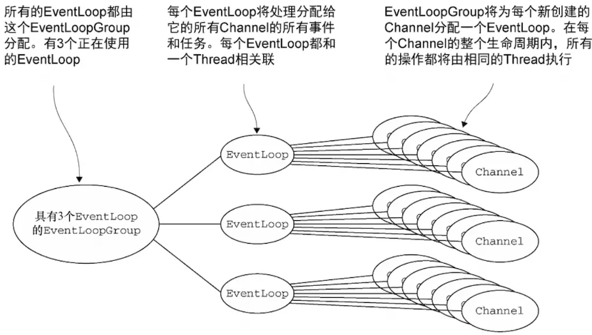

# 1.Netty简介

netty可以由一句话概括：**异步<sup>①</sup>**的**事件驱动<sup>②</sup>**的**网络应用<sup>③</sup>**程序框架


netty基于java-nio，用来快速开发高性能、高可靠性的网络服务器和客户端程序。使用 netty 可以确保快速和简单地开发出一个网络应用，例如实现了某种协议的客户，服务端应用。netty 相当简化和流线化了网络应用的编程开发过程，例如：TCP和UDP的socket 服务开发！

## 2.Reactor模式

netty是按照Reactor模式去设计它的整体架构，何为Reactor模式？它是一种基于事件驱动的设计模式，将一个或多个客户端请求分离（demultiplex）和调度（dispatch）给事件处理器(event handler)处理。

## 2.1.演变过程

### 2.1.1.thread_per_connection

对于TCP长连接，服务端通常都要维护与客户端关联的Socket，这就意味着每个客户端，服务端都需要新起一个线程去接收它的请求，这种编程模式是经典的、古老的“Thread per connection”


这种编程模式优点是简单，适用于小型项目，并发量较少；对于高并发量的系统，一个请求一个线程，频繁地创建和销毁线程，本身就会对系统造成巨大的性能开销。而后，在java中有了线程池的概念，虽然可以有效地减少创建线程带来的性能损耗，但却治标不治本，没从根本上解决一个请求一个线程的处理方式，一旦某次请求耗时，线程池任务用光，服务端就无法接收客户端的请求。

### 2.1.2.reactor

​	reactor模式就是来解决thread per connection问题的，它的设计理念是以事件作为驱动，例如：在一次TCP连接中，从开始连接到数据交互完成，中间可以划分为多个事件如：连接就绪、读数据就绪、写数据就绪、连接关闭...每次事件发生都会回调对应的处理器（处理器即thread）

​	这种模式将服务端线程的职能划分得更细致，以往服务端线程都是一条龙服务，从连接就绪到解析数据，读取数据最终写回数据，都在一个线程中完成。但reactor模式划分更细致，读事件有读处理器回调，写事件有写处理器回调。Java的nio包下的Selector本质上就是IO多路复用器，也是实现Reactor模式的基础


上图属于**主从Reactor**，是最完善的(还有单线程reactor、线程池reactor)，而netty也采用了这种设计模型，如netty常用的bossGroup和workerGroup。

这种编程模型组件功能如下：

1. mainReactor只负责接收请求，它会将客户端的请求封装成acceotor，将它交予subReactor。然后它就继续等待接收客户端请求（不会处理请求）

2. subReactor负责处理客户端请求，当客户端有数据传入时，通过线程池处理这些数据。实际上，就是在Socket对应事件发生时回调对应处理器。

## 2.2.编程模型

上面的两张图是Doug Lea在《Scalable IO in Java》一文中针对于java提出reactor编程模式。还有一篇更古老的博客《reactor-siemens》诠释了Reactor模式的架构设计，也是很经典的一张图：


### 2.2.1.五大组件

上图5个带有背景颜色的方框就是一个组件，它们作用分别是：

1. **Handle-事件句柄**。由操作系统提供，表示一种资源，该资源用来表示一个个事件，如网络编程中的Socket描述符，Handle是事件的发源地；

2. **Event Handler–事件处理器**。自身由多个回调方法构成，这些回调方法会在事件Handle发生时被调用(被初始分发器调用)。特别注意：在java nio中没有事件处理器的概念，而Netty基于nio升级了架构，它完善了事件处理器，在IO事件发生时，提供了相应的回调方法；

3. **Concrete Event Handler–事件处理器实现**。就是Event Handler的具体实现，在每个回调方法实现具体逻辑，这个组件就是我们变成的处理器实现；

4. **Synchronous Event Demultiplexer-同步事件分离器**。它本身是一个底层操作系统调用，用来等待事件的发生。调用方在调用它的时候会被阻塞，一直阻塞到同步事件分离器上有事件发生为止。对于Linux而言，同步事件分离器就是IO多路复用机制，比如select、poll、epoll等；在java nio中同步事件分离器就是选择器Selector，对应阻塞方法即select()方法；

5. **Initiation Dispatcher–初始分发器**。实际上就是[上图](#2.1.2.reactor)Doug Lea诠释的 Reactor角色，它提供了两大功能：其一是事件处理器的注册与销毁；其二是事件的调度。Initiation Dispatcher通过同步事件分离器等待事件的发生， 一旦事件发生(单个或多个)它会分离出每一个事件，选择注册在它身上的事件处理器，最后调用相关回调方法来处理这些事件。

### 2.2.2.执行流程

下图左侧文字代表每个步骤：


1. **initialize**。主程序(main program)初始化分发器Initiation Dispatcher；

2. **register handler**。向Initiation Dispatcher注册具体的事件处理器，同时标识出该事件处理器希望分发器在某个事件发生时向其通知该事件，这个事件会与Handle关联；

3. **extract handle**。Initiation Dispatcher会要求每个事件处理器向其传递内部的Handle，该handle向操作系统标识了事件处理器；

4. **run event loop**。当所有事件处理器注册完毕，主程序调用handle_events()方法启动Initiation Dispatcher的事件循环。此时，Initiation Dispatcher会将每个注册的事件管理器的handle合并起来，通过同步事件分离器等待事件发生；

5. **dispatch handler**。当事件对应的handle变为ready状态(即可用状态)，同步事件分离器就通知分发器，分发器就会通过这个handle选择恰当的事件处理器回调方法。

# 3.Netty缓冲区

## 3.1.三种缓冲区

netty提供了三种不同的缓冲区，都可以由io.netty.buffer.Unpooled获取：

**①heap buf**

- 实例：Unpooled.buffer()；

- 描述：最常用类型，将数据存储到JVM堆，实际数据存放到字节数组上；

- 优点：可以快速地创建和释放，并且提供直接访问内部字节数组的方法；

- 缺点：每次读写数据都需要先将数据复制到直接缓冲区中再进行网络传输；

**②direct buf**

- 实例：Unpooled.directBuffer

- 描述：在JVM堆外分配内存空间，由操作系统在本地内存进行数据分配

- 优点：Socket传输时，由于数据直接位于操作系统本地内存，性能很好

- 缺点：内存空间的分配与释放要比heap buf更加复杂且速度要慢.(由于direct buf分配要慢，netty采用**内存池**方式解决！)

- 建议：对于业务处理用heap buf；对于I/O通信线程用direct buf；

**③composite buf**

- 实例：Unpooled.compositeBuffer()

- 描述：复合缓冲区，可以容纳其它ByteBuf(堆或非堆)，对它们统一管理

## 3.2.ByteBuf

netty针对缓冲区自己定义了一个io.netty.buffer.ByteBuf类，它内部维护了两个指针：readIndex和writeIndex。它们会把一个Bytebuf分为3个区域：(0,readIndex]**已读区域**(可丢弃)；(readIndex,writeIndex]**可读区域**(数据未读)；(wirteIndex,capacity]**可写区域**(数据空位置)。


## 4.Netty事件循环


上图是netty整个事件循环组的类继承图，主要从EventExecutorGroup开始往下看，再上层的父接口是JDK提供的并发包的内容，基础是线程池中可以执行周期任务的线程池服务。所以从这可以知道Netty可以实现周期任务，比如心跳检测。

## 4.1.EventLoop & EventLoopGroup

EventLoop，事件循环，用来处理Channel的所有I/O事件；

EventLoopGroup，事件循环组，用来管理多个EventLoop。



EventLoop、EventLoopGroup、Thread、Channel之间的相互关系：

1. 一个EventLoopGroup可以包含一个或多个EventLoop，即1:n

2. 一个EventLoop只能与一个Thread绑定，即1:1

3. 一个Channel只能注册到一个EventLoop上，即1:1

4. 一个EventLoop可以分配给多个Channel，即1:n。 

每当一个新连接到达，netty就会创建一个Channel，然后从EventLoopGroup中分配出一个EventLoop与该Channel绑定，然后在这个Channel整个生命周期中都是由这个EventLoop来处理它的IO事件。而且，所有EventLoop处理的I/O事件都交由它内部唯一一个专用的Thread来处理，从而保证线程安全！

**重要结论：**

不要将长时间执行的耗时任务放入到EventLoop的执行队列中，因为它将会一直阻塞该线程所对应的所有Channel上的其它执行任务，若需要进行阻塞调用或耗时的操作，则建议使用一个专门的EventExecutor(业务线程池)。

#  5.Netty处理器

## 5.1.ChannelHandler

ChannelHandler，通道处理器，主要用来处理各种事件。ChannelHandler 有两个核心子类 ChannelInboundHandler 和 ChannelOutboundHandler，其中 ChannelInboundHandler 用于接收、处理入站( Inbound )的数据和事件，而 ChannelOutboundHandler 则相反，用于接收、处理出站( Outbound )的数据和事件。除此之外，netty还提供了ChannelDuplexHandler，它可以同时用于接收、处理入站和出站的数据。

```java
public interface ChannelHandler {
  /**
   * 当此ChannelHandler被添加到ChannelPipeline中就会触发此方法.
   * 一般用于ChannelHandler的初始化逻辑.
   */
  void handlerAdded(ChannelHandlerContext ctx) throws Exception;

  /**
   * 当此ChannelHandler从ChannelPipeline移除就会触发此方法.
   * 一般用于ChannelHandler的销毁逻辑
   */
  void handlerRemoved(ChannelHandlerContext ctx) throws Exception;

  /**
   * 此方法已被取消, 转而去ChannelInboundHandler
   */
  @Deprecated
  void exceptionCaught(ChannelHandlerContext ctx, Throwable cause) throws Exception;

  /**
   * 通常一个ChannlHandler只能注册在一个ChannelPipeline上, 但是如果加了这个注解,
   * 它就可以注册到多个ChannelPipeline上.
   */
  @Inherited
  @Documented
  @Target(ElementType.TYPE)
  @Retention(RetentionPolicy.RUNTIME)
  @interface Sharable {
    // no value
  }
}
```

### 5.1.1.入站处理器

入站处理器即ChannelInboundHandler，它提供了在Channel状态变化时提供钩子函数，便于我们做出相应的处理逻辑。除此之外，netty还提供了一个适配器ChannelInboundHandlerAdapter，它实现了ChannelInboundHandler接口，里面方法实现很简单，就是通过上下文ChannelHandlerContext.firexxxx()方法将事件传播到下一个处理器。

```java
public interface ChannelInboundHandler extends ChannelHandler {
  /**
   * 当Channel被注册到EventLoop上, 会触发此方法
   */
  void channelRegistered(ChannelHandlerContext ctx) throws Exception;

  /**
   * 当Channel从EventLoop上被移除时, 就会触发此方法
   */
  void channelUnregistered(ChannelHandlerContext ctx) throws Exception;

  /**
   * 当Channel被激活时, 就会触发此方法
   */
  void channelActive(ChannelHandlerContext ctx) throws Exception;

  /**
   * 已注册的Channel处于非Active状态并且已到达它的生命周期, 触发此方法
   */
  void channelInactive(ChannelHandlerContext ctx) throws Exception;

  /**
   * 当Channel的对端有数据可读时, 就会触发此方法
   */
  void channelRead(ChannelHandlerContext ctx, Object msg);

  /**
   * 当上面的channelRead()方法读取到最后一条消息时, 就会触发此方法
   */
  void channelReadComplete(ChannelHandlerContext ctx) throws Exception;

  /**
   * 当用户事件触发时就会调用此方法
   */
  void userEventTriggered(ChannelHandlerContext ctx, Object evt);

  /**
   * 当Channel的可写状态被改变时, 就会触发此方法
   */
  void channelWritabilityChanged(ChannelHandlerContext ctx);

  /**
   * 在这个ChannelHandler处理事件发生异常时, 就会触发此方法
   */
  @Override
  @SuppressWarnings("deprecation")
  void exceptionCaught(ChannelHandlerContext ctx, Throwable cause);
}
```

### 5.1.2.出站处理器

ChannelOutboundHandler会处理I/O出站（将数据主动发送给对端）的操作。除此之外，netty还提供了一个适配器ChannelOutboundHandlerAdapter，它实现了ChannelOutboundHandler接口，里面方法实现很简单，直接通过上下文ChannelHandlerContext调用同名方法。

```java
public interface ChannelOutboundHandler extends ChannelHandler {
  /**
   * 当一个Channel绑定操作完成, 就调用此方法
   * @param ctx 表示为这个上下文对象进行绑定端口操作
   * @param localAddress  绑定到这个地址上
   * @param promise 一旦绑定操作完成, 使用这个ChannelPromise去通知所有监听器
   */
  void bind(ChannelHandlerContext ctx, SocketAddress localAddress, 
            ChannelPromise promise) throws Exception;

  /**
   * 当一个Channel连接操作完成, 就调用此方法
   * @param ctx t表示为这个上下文对象进行通道连接操作
   * @param remoteAddress 待连接的远程地址
   * @param localAddress 本地地址, 使用它取连接远程地址
   * @param promise 连接操作完成, 通过它去通知所有的监听器
   */
  void connect(ChannelHandlerContext ctx, SocketAddress remoteAddress,
               SocketAddress localAddress, ChannelPromise promise) throws Exception;

  /**
   * 当通道断开连接时, 就会调用此方法
   * @param ctx t表示为这个上下文对象进行断开连接操作
   * @param promise s断开连接操作完成, 通过这个ChannelPromise通知旗下的监听器
   */
  void disconnect(ChannelHandlerContext ctx, ChannelPromise promise);

  /**
   * 当通道关闭时, 就会调用此方法
   * @param ctx 表示为这个上下文对象进行通道关闭操作
   * @param promise t当操作完成, 通过这个ChannelPromise通知旗下的监听器
   */
  void close(ChannelHandlerContext ctx, ChannelPromise promise) throws Exception;

  /**
   * 从当前注册的EventLoop执行注销操作后调用
   */
  void deregister(ChannelHandlerContext ctx, ChannelPromise promise);

  /**
   * 拦截{@link ChannelHandlerContext#read()}的数据读取操作
   */
  void read(ChannelHandlerContext ctx) throws Exception;

  /**
   * 通过ChannelPipeline写入消息, 当写操作完成时就会调用此方法. 这些数据会在调用
   * flush()后从底层Channel中发送给对端.
   * @param ctx 为这个上下文对象执行写操作
   * @param msg 待写入的消息
   * @param promise t当写入操作完成, 通过这个promise通知旗下的所有监听器
   */
  void write(ChannelHandlerContext ctx, Object msg, ChannelPromise promise);

  /**
   * 刷新操作将尝试刷新所有以前写入的挂起消息, 操作完成后就会触发这个方法
   * @param ctx 为这个上下文执行刷新操作
   */
  void flush(ChannelHandlerContext ctx) throws Exception;
}
```

## 5.2.处理器上下文

### 5.2.1.ChannelHandlerContext

ChannelHandlerContext是连接ChannelHandler与ChannelPipeline的桥梁，它可以让一个ChannelHandler与它所在的ChannelPipeline中的其它ChannelHanler进行交互。

```java
public interface ChannelHandlerContext extends AttributeMap, 
ChannelInboundInvoker, ChannelOutboundInvoker {
  /**
   * 返回绑定在这个处理器上下文的通道Channel
   */
  Channel channel();

  /**
   * 返回用来执行任意任务的事件处理器EventExecutor
   */
  EventExecutor executor();

  /**
   * 当前上下文的唯一名称
   */
  String name();

  /**
   * 返回绑定在当前上下文的处理器ChannelHandler
   */
  ChannelHandler handler();

  /**
   * 与此上下文关联的ChannelHandler从ChannelPipeline移除时, 此方法就返回返回true.
   */
  boolean isRemoved();

  /**
   * 以下方法从ChannelInboundInvoker接口继承并修改了其返回值, 用来触发入站处理器定义
   * 的各个事件.
   */
  ChannelHandlerContext fireChannelRegistered();
  ChannelHandlerContext fireChannelUnregistered();
  ChannelHandlerContext fireChannelActive();
  ChannelHandlerContext fireChannelInactive();
  ChannelHandlerContext fireExceptionCaught(Throwable cause);
  ChannelHandlerContext fireUserEventTriggered(Object evt);
  ChannelHandlerContext fireChannelRead(Object msg);
  ChannelHandlerContext fireChannelReadComplete();
  ChannelHandlerContext fireChannelWritabilityChanged();

  // 下面两个方法从ChannelOutboundInvoker接口继承并修改其返回值
  ChannelHandlerContext read();
  ChannelHandlerContext flush();


  /**
   * 返回此上下文关联的管道ChannelPipeline
   */
  ChannelPipeline pipeline();

  /**
   * 返回此上下文关联的缓冲区分配器ByteBufAllocator, 用来申请ByteBuf
   */
  ByteBufAllocator alloc();

  // 下面两个方法继承自AttributeMap
  <T> Attribute<T> attr(AttributeKey<T> key);
  <T> boolean hasAttr(AttributeKey<T> key);
}

```

### 5.2.2.AbstractChannelHandlerContext

AbstractChannelHandlerContext是ChannelHandlerContext的抽象实现，基本上管道ChannelPipeline使用的上下文对象都是这个类，它是一个双向链表结构，其类信息如下：

```java
abstract class AbstractChannelHandlerContext extends DefaultAttributeMap
  implements ChannelHandlerContext, ResourceLeakHint {
  // 前驱节点和后继节点
  volatile AbstractChannelHandlerContext next;
  volatile AbstractChannelHandlerContext prev;
  // 上文下状态变量handlerState的原子更新器
  private static final AtomicIntegerFieldUpdater<AbstractChannelHandlerContext>
    HANDLER_STATE_UPDATER =AtomicIntegerFieldUpdater.newUpdater(
    AbstractChannelHandlerContext.class, "handlerState");
  
  /* 下面4个变量, 表示上下文状态handlerState的取值 */
  // 表示ChannelHandler.handlerAdded()即将被调用
  private static final int ADD_PENDING = 1;
  // 表示ChannelHandler.handlerAdded()已经被调用
  private static final int ADD_COMPLETE = 2;
  // 表示ChannelHandler.handlerRemoved()已经被调用
  private static final int REMOVE_COMPLETE = 3;
  // 表示ChannelHandler的handlerAdded()和handlerRemoved()都未被调用
  private static final int INIT = 0;
  
  // 若此上下文关联的ChannelHandler是入站处理器则inbound为true, 反之outbound为true
  private final boolean inbound;
  private final boolean outbound;
  
  // 关联的ChannelPipeline对象
  private final DefaultChannelPipeline pipeline;
  
  // 此上下文的唯一名称
  private final String name;
  
  // 此上下文使用的EventExecutor是否实现了OrderedEventExecutor
  private final boolean ordered;
  
  // 每个上下文会关联一个事件执行器EventExecutor
  final EventExecutor executor;
  
  // 成功的 ChannelFuture对象
  private ChannelFuture succeededFuture;
  
  // 执行 Channel ReadComplete 事件的任务
  private Runnable invokeChannelReadCompleteTask;
  
  // 执行 Channel Read 事件的任务
  private Runnable invokeReadTask;
  
  // 执行 Channel WritableStateChanged 事件的任务
  private Runnable invokeChannelWritableStateChangedTask;
  
  // 执行 flush 事件的任务
  private Runnable invokeFlushTask;
  
  // 表示此上下文的状态, 为上面定义的四种
  private volatile int handlerState = INIT; 
}
```

要注意一点，ChannelHandler在上下文对象ChannelHandlerContext中是使用AttributeKey来存储状态，因此如果同一个ChannleHandler多次添加到ChannelPipeline却指定不同的名称，即使都是同一个ChannelHanler，也会被调用四次，因为它们在上下文中的状态不一样，如：

```java
MyHandler fh = new MyHandler();

ChannelPipeline p1 = Channels.pipeline();
p1.addLast("f1", fh);
p1.addLast("f2", fh);

ChannelPipeline p2 = Channels.pipeline();
p2.addLast("f3", fh);
p2.addLast("f4", fh);
```

## 5.3.编码器

**编解码器：**无论向网络中写入的数据是什么类型（int、char、String..），数据在网络中传输，都是以字节流的形式呈现的；将数据由原先形式转换为字节流的操作称为编码（encode），将数据由字节转换为它原本的格式或其它格式的操作称为解码（decode），编解码统一称为codec！netty提供专门处理编解码的[ChannelHanlder](#5.1.ChannelHandler)，这些处理器就称为编解码器。

**编码器：**本质上是出站处理器，因此编码一定是[ChannelOutboundHandler](#5.1.2.出站处理器)

**解码器：**本质上以入站处理器，因此解码一定是[ChannelInboundHandler](#5.1.1.入站处理器).

（一般情况下，编码器以xxxEncoder命名，解码器以xxxDecoder命令）

1.编解码器接收的消息类型必须与待处理的参数类型一致，否则它不执行；

2.解码器进行数据解码时，一定要判断ByteBuf的字节数是否足够！！

### 5.3.1.ByteToMessageDecoder

netty最顶层的解码器抽象类：ByteToMessageDecoder

### 5.3.2.MessageToByteEncoder

netty最顶层的编码器抽象类：MessageToByteEncoder

## 5.4.常用组件

### 5.4.1.SimpleChannelInboundHandler

....

### 5.4.2.ChannelInitializer

....

# 6.Netty通道

## 6.1.Channel

netty相较于nio的通道自定义了一个组件io.netty.channel.Channel。它是netty网络操作抽象类，除了包括基本的 I/O 操作，如 bind、connect、read、write 之外，还包括了netty框架相关的一些功能，如获取该 Channel 的 EventLoop、获取通道配置ChannelConfig等等。

netty不仅提供nio支持，也提供了bio支持(但没提供aio支持)，所有已Nio开头的Channel如NioServerSocketChannel都是基于nio实现的。所有已Oio开头的Channel如OioServerSocketChannel都是原始的bio实现，意味着它是阻塞式的。

**重要结论：**

channel的实现一定是线程安全，基于此可以储存channel的引用，通过该引用向远端发送数据，即便当时有多个线程同时发送也不会出现并发问题；而且，消息一定会按顺序发送出去。

## 6.2.ChannelPipeline

ChannelPipeline即管道。当一个Channel创建好后，与之相对应的管道就会自动创建完毕，默认实现类：DefaultChannelPipeline。管道内维护着[ChannelHandlerContext](#5.2.处理器上下文)的链表集，再由它去维护ChannelHandler的关系。因此，ChannelPipeline本质是ChannelHandler集合，内部细分为ChannelInboundHandler和ChannelOutboundHandler，用来处理与之关联的Channel的数据流入和流出，形如：


与ChannelPipeline(管道)关联的一方是用户程序，一方是netty底层IO线程，当客户端传入数据，就会从Socket.read()读入，经过管道一个一个的ChannelInboundHandler处理，到达最后一个handler处理；若是数据写出则从最后一个ChannelOutboundHandler开始，到达netty底层的IO线程，最后socket.write()写出。处理顺序例如：

```java
ChannelPipeline p = ch.pipeline();
p.addLast("1", new InboundHandlerA());
p.addLast("2", new InboundHandlerB());
p.addLast("3", new OutboundHandlerA());
p.addLast("4", new OutboundHandlerB());
p.addLast("5", new InboundOutboundHandlerX());
```

则数据流入的顺序为：1→2→5。数据流出的顺序为：5→4→3，其实就像spring mvc的拦截器链一样，进来先处理的，出去就会晚处理。ChannelPipeline提供了许多以fire开头的方法，用来将事件交于下一个handler：


## 6.3.ChannelFuture

netty的io.netty.util.concurrent.Future接口继承自JDK的java.util.concurrent.Future。因为netty是采用异步处理的逻辑，所以它的方法调用都会立即返回，类型就是这个Future。而且，netty的Future接口扩展JDK的Future接口，增加了监听器io.netty.util.concurrent.GenericFutureListener，它会在异步执行完后，以回调的方式主动通知监听器（标准的观察者模式），需要注意的是监听器中的operationComplete()方法是由I/O线程调用的，切记不要在此执行耗时操作！

ChannelFuture接口继承了Future接口。ChannelFuture 接口通过该接口的 #addListener(...) 方法，注册一个 ChannelFutureListener，当操作执行成功或者失败时，监听就会自动触发返回结果。

**tips:**

 <u>在java，区别方法是通过：方法名+参数，没有通过返回值来区分方法的。所以可以看到Future和ChannelFuture的#addListener()方法返回值不一样，但是ChannelFuture却覆盖Future#addListener()方法</u>

## 6.4.ChannelPromise

netty的io.netty.util.concurrent.Promise接口继承了io.netty.util.concurrent.Future接口，它是一种特殊的Future，在它的基础上提供了**写入**的功能。

ChannelPromise接口继承了ChannelFuture接口和Promise接口，同样提供了#addListener()方法，注册ChannelFutureListener，当通道操作执行成功或失败时，自动触发返回结果；并且ChannelPromise可以手动设定通道操作的成功与失败！

# 7.Netty配置类

## 7.1.AbstractBootstrap

netty提供了ServerBootstrap和Bootstrap用来便捷地配置netty服务，这两个类都实现了AbstractBootstrap抽象类。它们实际上都是配置类，用来启动一个netty服务，而且针对Reactor模式，AbstractBootstrap保存得都是bossgroup的配置，而其子类(如ServerBootstrap)保存的都是childgroup的配置。

```java
public abstract class AbstractBootstrap<B extends AbstractBootstrap<B, C>, 
C extends Channel> implements Cloneable {
  // 配置事件循环组
  volatile EventLoopGroup group;
  
  // 配置Channel生成工厂
  private volatile ChannelFactory<? extends C> channelFactory;
  
  // 配置本地地址
  private volatile SocketAddress localAddress;
  
  // 配置ChannelOption. ChannelOption是作为一个key来为Channel配置时设值用的
  private final Map<ChannelOption<?>, Object> options = 
    	new LinkedHashMap<ChannelOption<?>, Object>();
  
  // 配置属性Attribute, 以AttributeKey作为key
  private final Map<AttributeKey<?>, Object> attrs = 
    	new LinkedHashMap<AttributeKey<?>,Object>();
  
  // 配置用于bossGroup的通道处理器ChannelHandler
  private volatile ChannelHandler handler;
}
```

## 7.2.ServerBootstrap

ServerBootstrap通常用来配置和启动netty服务端的工具类，它内部定义的属性用来给workerGroup配置。若调用它定义的childxx()方法就是给workerGroup配置的，其它则是调用super()方法给bossGroup配置：

```java
private final Map<ChannelOption<?>, Object> childOptions = 	new LinkedHashMap<ChannelOption<?>, Object>();
private final Map<AttributeKey<?>, Object> childAttrs = 
  new LinkedHashMap<AttributeKey<?>, Object>();
private final ServerBootstrapConfig config = new ServerBootstrapConfig(this);
private volatile EventLoopGroup childGroup;
private volatile ChannelHandler childHandler;
```

# 8.Netty实战

## 8.1.ChannelHandler不要执行耗时操作

ChannelHandler的回调方法是由EventLoop唯一关联的线程Thread(即netty的I/O线程)调用的，因此若将长时间执行的耗时任务放到Handler回调方法中，它会阻塞该线程处理其它I/O事件，通常有两种实现方式：

1. ChannelHandler定义业务线程池，执行异步调用；

2. 借助于netty提供的想ChannelPipeline添加ChannelHandler时调用的addList()方法来传递EventExecutor。方法如下：

```java
/**
 * @param group 用来执行ChannelHandler中的方法
 * @param handlers  the handlers to insert last
 */
ChannelPipeline addLast(EventExecutorGroup group, ChannelHandler... handlers);
```

## 8.2.两种写回数据的方式

在ChannelHander回调方法如channelRead0()，我们可以将数据写回到通道对端，可以直接由ChannelHandlerContext写回，也可以通过它获取到Channel写回，即：

```java
// 通过Channel写回数据
ctx.channel().writeAndFlush();
// 通过ChannelHandlerContext写回数据
ctx.writeAndFlush();
```

这两种方式是有区别的：

1. Channel：数据从ChannelPipeline的ChannelHandler链表末尾开始传递直至底层Socket;

2. ChannelHandlerContext：数据从ChannelPipeline的ChannelHandler链表中的下一个ChannelHandler开始写回直至底层Socket.

**结论：**

对于与Channel的同名方法来说，ChannelHandlerContext的方法将会产生更短的事件流，所以可以在可能的情况下利用它提升应用性能；

## 8.3.TCP粘包/拆包

拆包：一个完整的数据包(消息)可能会被TCP拆分为多个包进行发送；

粘包：多个小的数据包(消息)也有可能被封装成一个大的包进行发送。

### 8.3.1.产生原因

在计算机科学中，bit是表示信息的最小单位，叫做二进制位，一般用0和1表示；而byte叫做字节，由8个位（8bit）组成。他们之间的区别如下：

1. bit
   - 计算机中的最小存储单元  - 存储内容总是0或1
   - 所有二进制状态实体都能使用1bit表示  - 8bits组成1byte
   - 不能够单独寻址

2. byte

   - 1byte包含8bits  

   - 可以存储所有ASCII所有字符（这是它包  含8bits的初衷）  

   - 十进制整数范围[-128,127]或[0,  255]  ④最小的可寻址存储单元

因此在Java中给一个byte类型数据初始化时，可以用字符，也可以用整数，但是这个整数必须要在-128和127之间（因为byte是8位），它会将这个数转化为一个字符然后存放起来！作为面向字节(byte)流的网络传输协议-TCP，所谓流，就是没有界限的一串数据。且由于TCP是全双工通信协议，因此TCP连接的两端，都会设置发送缓冲区和接收缓冲区，用来临时存放双向通信的数据。产生TCP粘包和拆包的原因共有四种：

1. 应用程序写入的数据大于套接字缓冲区大小，这将会发生拆包；

2. 应用程序写入数据小于套接字缓冲区大小，网卡将应用多次写入的数据发送到网络上，这将会发生粘包；

3. 进行MSS（最大报文长度）大小的TCP分段，当TCP报文长度-TCP头部长度>MSS的时候将发生拆包；
4. 接收方法不及时读取套接字缓冲区数据，这将发生粘包。

### 8.3.2.图解流程

1. 一个正常的TCP报文传输是这样子，client将消息Msg1，Msg2依次发给server，而且server也是按照这样子的顺序接收到两个消息：


2. 一旦发生上面介绍的产生原因，比如数据报小于TCP缓冲区容量，就会发生粘包，TCP会将Msg1和Msg2组装成一个消息发给服务端，这样服务端就只会收到一个消息（但实际要拆分成2个消息）


3. 还有一种情况那就是数据报太大，超过了TCP缓冲区大小，则它会将其拆包，可能Msg1全部+Msg2部分当作一个消息发送给服务端：


注：这上面所说的消息（即Msg1、Msg2）都是一串一串的字节流

### 8.3.3.解决方案

这边记录下[网络博客](http://www.ideawu.net/blog/archives/993.html)介绍的一个伪代码实例：

```java
char recv_buf[];
Buffer buffer;
// 网络循环：必须在一个循环中读取网络，因为网络数据是源源不断的。
while(1){
    // 从TCP流中读取不定长度的一段流数据，不能保证读到的数据是你期望的长度
    tcp.read(recv_buf);
    // 将这段流数据和之前收到的流数据拼接到一起
    buffer.append(recv_buf);
    // 解析循环：必须在一个循环中解析报文，避免所谓的粘包
    while(1){
        // 尝试解析报文
        msg = parse(buffer);
        if(!msg){
            // 报文还没有准备好，糟糕，我们遇到拆包了！跳出解析循环，继续读网络。
            break;
        }
        // 将解析过的报文对应的流数据清除
        buffer.remove(msg.length);
        // 业务处理
        process(msg);
    }
}
```

它实际上就是想表达，网络传输的数据是不断地发送过来，而已这数据都是字节流，里面掺杂了由于粘包/拆包导致的其它消息数据，所以才需要两个循环：网络循环和解析循环。在netty中，它提供了3个解码器，可以有效地解决TCP粘包/拆包问题：

| **组件**                   | **结果**                                                     |
| -------------------------- | ------------------------------------------------------------ |
| LineBasedFrameDecoder      | 基于换行符解决，即传输完一个消息以  \r\n作为结尾；           |
| DelimiterBasedFrameDecoder | 基于分隔符解决，指定一个分隔符作为消息结尾                   |
| FixedLengthFrameDecoder    | 指定长度解决。指定消息头和消息体，消息头的值就是消息体的数据大小 |
| 无组件                     | 自定义协议，即规定消息如何划分个体，例如dubbo，自定义数据传输协议，然后client和server按照这个协议将字节流转换成消息。 |

# 9.源码：启动服务端

熟悉netty的同学都知道，netty的服务端启动代码样板几乎一样，形如：

```java
 // 定义两个线程组, 一个处理连接请求, 一个处理连接读写. 其实现类用NioEventLoopGroup
  EventLoopGroup parentGroup = new NioEventLoopGroup();
  EventLoopGroup childGroup = new NioEventLoopGroup();

  // serverBootstrap是netty提供用来便捷创建一个服务端的工具类, 用来对服务端作自定义配置
  ServerBootstrap serverBootstrap = new ServerBootstrap();
  serverBootstrap.group(parentGroup, childGroup)
            .channel(NioServerSocketChannel.class)
            .childHandler(new SimpleSocketServerInitializer());

  // 绑定端口号, 服务端启动
  ChannelFuture channelFuture = serverBootstrap.bind(9090).sync();
```

上面几行简单的代码便可以创建一个基于NIO的非阻塞式网络服务端程序，但实际上netty底层做了大量的工作

## 9.1.创建事件循环组

在netty中，我们一般会创建2个事件循环组：

```java
// 定义两个线程组, 一个处理连接请求, 一个处理连接
EventLoopGroup parentGroup = new NioEventLoopGroup(1);
EventLoopGroup childGroup = new NioEventLoopGroup();
```

parentGroup也称bossGroup，作用于[Reactor模式](#2.2.编程模型)中的初始分发器，用来接收客户端的请求；childGroup也称workerGroup，主要是线程池用来处理parentGroup接收的客户端连接的读写请求。一般我们会使用基于nio的事件循环组 - io.netty.channel.nio.NioEventLoopGroup。

### 9.1.1.NioEventLoopGroup()

调用NioEventLoopGroup的构造方法会一层一层调用它重载的构造方法，就以其无参构造方法开始：

1. 无参构造方法会调用下一个带有线程数的构造方法，并将线程数设置为0

```java
public NioEventLoopGroup() {
  this(0);
}
```

2. 此构造方法接收线程数(①中设置的0)，调用下一个构造方法，传入一个类型为java.util.concurrent.Executor的空对象

```java
public NioEventLoopGroup(int nThreads) {
  this(nThreads, (Executor) null);
}
```

3. 此构造方法接收线程数和Executor(默认0和null)，调用下一个构造方法，传入一个java.nio.channels.spi.SelectorProvider对象

```java
public NioEventLoopGroup(int nThreads, Executor executor) {
  this(nThreads, executor, SelectorProvider.provider());
}
```

4. 接收前三个重载构造方法的参数值，并调用下一个构造方法，传入默认的由netty定义的选择策略工厂实现类- DefaultSelectStrategyFactory

```java
public NioEventLoopGroup(int nThreads, Executor executor, 
                         final SelectorProvider selectorProvider) {
  this(nThreads, executor, selectorProvider, DefaultSelectStrategyFactory.INSTANCE);
}
```

5. 接收前四个重载构造方法的参数值，然后调用父类的构造方法，额外传入一个 netty定义的类似JDK线程池拒绝策略-RejectedExecutionHandler

```java
public NioEventLoopGroup(int nThreads, Executor executor, final SelectorProvider 
           selectorProvider,final SelectStrategyFactory selectStrategyFactory) {
  super(nThreads, executor, selectorProvider, selectStrategyFactory, 
        RejectedExecutionHandlers.reject());
}
```

### 9.1.2.MultithreadEventLoopGroup()

通过[NioEventLoopGroup](#9.1.1.NioEventLoopGroup())的构造方法调用，最终会调用到它的抽象父类MultithreadEventLoopGroup身上。根据new NioEventLoopGroup()方法的分析，在只调用它的无参构造方法基础上，nThreads=0，Executor=null，可变参数args有3个对象，分别为：SelectorProvider、selectStrategyFactory和RejectedExecutionHandler。最后调用父类构造方法

```java
protected MultithreadEventLoopGroup(int nThreads, Executor executor, Object... args){
  // 如果传入的nThreads为0, 则netty默认取DEFAULT_EVENT_LOOP_THREADS. 其值等于
  // 系统配置io.netty.eventLoopThreads 和 底层CPU核数*2 的最大值. 一般就等于你电脑
  // 的CPU核心数 * 2。
  super(nThreads == 0 ? DEFAULT_EVENT_LOOP_THREADS : nThreads, executor, args);
}
```

### 9.1.3.MultithreadEventExecutorGroup()

调用MultithreadEventLoopGroup构造方法，它会去调用它的抽象父类MultithreadEventExecutorGroup的构造方法，实例化逻辑为：

1. 这个构造方法会额外加上一个EventExcutorChooserFactory，它用来创建EventExecutorChooser对象，进而可以选择合适的EventExecutor去执行 I/O事件

```java
protected MultithreadEventExecutorGroup(int nThreads, Executor executor, 
                                        Object... args){
  // nThreads一般情况为CPU核心*2; executor为null; args一般为:
  // WindowsSelectorProvider(window环境下)、DefaultSelectStrategyFactory
  // 和RejectedExecutionHandlers. 然后它额外添加了一个事件执行选择器工厂实现
  // DefaultEventExecutorChooserFactory, 最后调用重载的构造方法。
  this(nThreads, executor, DefaultEventExecutorChooserFactory.INSTANCE, args);
}
```

2. 将在这个构造方法里面，做全部的属性赋值

```java
/* MultithreadEventExecutorGroup的成员属性 */
private final EventExecutor[] children;
private final Set<EventExecutor> readonlyChildren;

// 用于表示已终止的EventExecutor数量
private final AtomicInteger terminatedChildren = new AtomicInteger();

// 用于终止 EventExecutor 的异步 Future
private final Promise<?> terminationFuture = 
  	new DefaultPromise(GlobalEventExecutor.INSTANCE);

private final EventExecutorChooserFactory.EventExecutorChooser chooser;

// 完整的构造方法
protected MultithreadEventExecutorGroup(int nThreads, Executor executor,
        EventExecutorChooserFactory chooserFactory, Object... args) {
  // 如果executor为空, 实例化io.netty.util.concurrent.ThreadPerTaskExecutor对象
  // 它会用到netty默认的线程工厂io.netty.util.concurrent.DefaultThreadFactory
  if (executor == null) {
    executor = new ThreadPerTaskExecutor(newDefaultThreadFactory());
  }
  // children即EventExecutor[]数组, 它的大小跟传入的线程数nThreads一样.
  // 然后为数组的每个对象创建一个新对象
  children = new EventExecutor[nThreads];
  for (int i = 0; i < nThreads; i ++) {
    // 标志此次创建的对象是否成功
    boolean success = false;
    try {
      // 调用newChild()方法创建EventExecutor对象, 点击跳转newChild()方法
      children[i] = newChild(executor, args);
      success = true;
    } catch (Exception e) {
      throw new IllegalStateException("failed to create a child event loop", e);
    } finally {
      // 只要有一个创建失败了, 执行下面的逻辑
      if (!success) {
        // 将前面创建好的EventExecutor优雅关闭掉
        for (int j = 0; j < i; j ++) {
          children[j].shutdownGracefully();
        }
        for (int j = 0; j < i; j ++) {
          EventExecutor e = children[j];
          try {
            // EventExecutor.isTerminated()只有在它旗下所有任务都已经执行完
            // 才会返回true. 所以如果EventExecutor有任务还未执行完, 就进入
            // 下面的循环.
            while (!e.isTerminated()) {
              // 等待EventExecutor旗下的任务执行直到3个条件发生：
              // 1.时间超时; 2.线程被中断; 3.任务全部执行完
              e.awaitTermination(Integer.MAX_VALUE, TimeUnit.SECONDS);
            }
          } catch (InterruptedException interrupted) {
            // Let the caller handle the interruption.
            Thread.currentThread().interrupt();
            break;
          }
        }
      }
    }
  }
  // 如果正常地创建了指定数目的EventExecutor, 则通过参数的EventExecutorChooserFactory
  // 创建一个EventExecutorChooserFactory.EventExecutorChooser. 这里默认让
  // DefaultEventExecutorChooserFactory来创建, 点击跳转newChooser()方法
  chooser = chooserFactory.newChooser(children);
  // 创建监听器, 用于 EventExecutor 终止时的监听
  final FutureListener<Object> terminationListener = new FutureListener<Object>() {
    @Override
    public void operationComplete(Future<Object> future) throws Exception {
      if (terminatedChildren.incrementAndGet() == children.length) {
        // 当所有的EventExecutor都终止后, 通过成员变量terminationFuture
        // 通知所有的监听器
        terminationFuture.setSuccess(null);
      }
    }
  };
  // 将上面创建的监听器添加到每个EventExecutor上.
  for (EventExecutor e: children) {
    e.terminationFuture().addListener(terminationListener);
  }
  // 将之前创建好的EventExecutor数组转换为一个不可变的Set集合, 赋值给readonlyChildren
  Set<EventExecutor> childrenSet = new LinkedHashSet<EventExecutor>(children.length);
  Collections.addAll(childrenSet, children);
  readonlyChildren = Collections.unmodifiableSet(childrenSet);
}
```

#### 9.1.3.1.newChild()

newChild()方法是用来创建EventExecutor对象，它是一个抽象方法，由子类实现。由于在启动netty服务端时使用的是NioEventLoopGroup，自然地这个方法就由NioEventLoopGroup来实现。逻辑为：

```java
// 源码：NioEventLoopGroup - 125行
protected EventLoop newChild(Executor executor, Object... args){
  // 实际上就是new一个NioEventLoop实例返回. args参数就是调用上面构造方法时传过来的参数,
  // 有3个值, 依次是：
  // 1.nio中的SelectorProvider - 根据操作系统不同采用不同的实现;
  // 2.netty的选择策略工厂 - DefaultSelectStrategyFactory实现;
  // 3.netty的拒绝执行处理器 - RejectedExecutionHandlers.REJECT实现.
  // 实际就是创建NioEventLoop对象, 调用它的构造方法, 跳转创建事件执行器
  return new NioEventLoop(this, executor, (SelectorProvider) args[0],
                          ((SelectStrategyFactory) args[1]).newSelectStrategy(), 
                          (RejectedExecutionHandler) args[2]);}
```

#### 9.1.3.2.newChooser()

默认的netty都会使用DefaultEventExecutorChooserFactory来创建一个EventExecutor选择器，逻辑如下：

```java
// 源码：DefaultEventExecutorChooserFactory - 34行
public EventExecutorChooser newChooser(EventExecutor[] executors) {
  if (isPowerOfTwo(executors.length)) {
    //若参数EventExecutor[]的大小是2的幂次方, 则使用PowerOfTwoEventExecutorChooser
    return new PowerOfTwoEventExecutorChooser(executors);
  } else {
    //其它情况则创建GenericEventExecutorChooser
    return new GenericEventExecutorChooser(executors);
  }
}
```

GenericEventExecutorChooser和PowerOfTwoEventExecutorChooser的区别，主要是next()方法的区别，通过不同的选择逻辑，高效率地快速选择事件执行器：

```java
// 源码：GenericEventExecutorChooser
public EventExecutor next() {
  // 很简单, 就是通过将下标idx对EventExecutor[]数组求余, 然后将idx累加一
  return executors[Math.abs(idx.getAndIncrement() % executors.length)];
}
```

```java
// 源码：PowerOfTwoEventExecutorChooser
public EventExecutor next() {
  // 这个设计专门针对EventExecutor[]数组是2的幂次方的情况, 挺巧妙, 有点像hashMap对
  // capacity的设计一样, 具体逻辑为：
  // 1.首先明确一点, 减运算“-”比 与运算“&”更高级, 所以先执行减法. 2的幂次方有个特点
  //   就是其二进制最高位为1, 其它位为0, 若减一后, 则变为最高位为0, 其它位为1;
  // 2.然后将下标idx与 第一步得到的结果进行求余, 就可以保证依次顺序地获取每一个下标.
  //   这点很像hashMap计算capacity的算法, 力保每个桶都能被用到, 有效避免hash冲突.
  return executors[idx.getAndIncrement() & executors.length - 1];
}
```

## 9.2.创建事件执行器

在创建事件循环组的源码分析中可得，MultithreadEventExecutorGroup里面会调用newChild()方法依次创建EventExecutor实现。大部分情况我们是使用基于nio的NioEventLoopGroup事件循环组，所以它创建的事件执行器实现是：io.netty.channel.nio.NioEventLoop。

### 9.2.1.NioEventLoop()

先分析下NioEventLoop的成员变量：

```java
public final class NioEventLoop extends SingleThreadEventLoop {
  // 待议..
  private static final int CLEANUP_INTERVAL = 256;
  
  // 表示是否禁用SelectionKey的优化, 默认值为false, 表示开启
  private static final boolean DISABLE_KEYSET_OPTIMIZATION =
    SystemPropertyUtil.getBoolean("io.netty.noKeySetOptimization", false);
  
  // 少于该值, 不开启空轮询重建新的 Selector 对象的功能
  private static final int MIN_PREMATURE_SELECTOR_RETURNS = 3;
  
  // NIO Selector 空轮询此值的次数后, 重建新的 Selector 对象, 默认值为512
  private static final int SELECTOR_AUTO_REBUILD_THRESHOLD;
  
  // 包装过的Selector, 被netty优化过了
  private Selector selector;
  
  // 原生的Selector对象
  private Selector unwrappedSelector;
  
  // 一个Set实现, 用来存放SelectionKey集合. netty自己实现，经过优化
  private SelectedSelectionKeySet selectedKeys;
  
  // JDK原生接口, 用来创建一个Selector对象
  private final SelectorProvider provider;
  
  // 唤醒标记, 因为原生的Selector.wakeup()唤醒方法开销比较大, 通过该标识, 减少调用
  private final AtomicBoolean wakenUp = new AtomicBoolean();
  
  // 选择策略, 有两个值：SelectStrategy.SELECT(阻塞式选择) 和 
  // SelectStrategy.CONTINUE(非阻塞式重试性选择)
  private final SelectStrategy selectStrategy;
  
  // 处理 Channel 的就绪的 IO 事件, 占处理任务的总时间的比例
  private volatile int ioRatio = 50;
  
  // 被取消的选择键SelectionKey的数量
  private int cancelledKeys;
  
  // 是否需要再次发起Selector的select()操作
  private boolean needsToSelectAgain;
}
```

NioEventLoop的构造方法如下：

```java
// 源码：NioEventLoop - 139行
NioEventLoop(NioEventLoopGroup parent, Executor executor, 
             SelectorProvider selectorProvider, SelectStrategy strategy, 
             RejectedExecutionHandler rejectedExecutionHandler) {
  // 调用抽象父类SingleThreadEventLoop的构造方法, 跳转父类构造方法
  super(parent, executor, false,DEFAULT_MAX_PENDING_TASKS,rejectedExecutionHandler);
  // 空指针判断..
  if (selectorProvider == null) {
    throw new NullPointerException("selectorProvider");
  }
  if (strategy == null) {
    throw new NullPointerException("selectStrategy");
  }
  // 将方法参数的selectorProvider赋值给成员变量provider, 此对象根据操作系统不同而不同.
  provider = selectorProvider;
  // 调用openSelector()获取SelectorTuple对象, 然后将SelectorTuple的slector对象赋给
  // 成员变量selector(经过netty优化过的nio选择器Selector); 将selectorTuple的
  // unwrappedSelector赋给成员变量unwrappedSelector(原生的nio选择器Selector).
  final SelectorTuple selectorTuple = openSelector();
  selector = selectorTuple.selector;
  unwrappedSelector = selectorTuple.unwrappedSelector;
  // 保存选择策略, 默认实现为：DefaultSelectStrategyFactory
  selectStrategy = strategy;
}
```

#### 9.2.1.1.openSelector()

通过openSelector()方法来创建SelectorTuple对象，SelectorTuple类很简单，只有两个变量，都是java.nio.channels.Selector类型，其中一个为unwrappedSelector，另一个为selector，依次保存nio原生选择器和netty优化后的选择器。创建逻辑为：

```java
// 源码: NioEventLoop - 170行
private SelectorTuple openSelector() {
  // 定义一个Selector, 用来保存java原生nio的Selector对象
  final Selector unwrappedSelector;
  try {
    // 直接调用java.nio.channels.spi.SelectorProvider获取一个选择器
    unwrappedSelector = provider.openSelector();
  } catch (IOException e) {
    throw new ChannelException("failed to open a new selector", e);
  }
  // DISABLE_KEYSET_OPTIMIZATION是NioEventLoop的成员变量, 表示是否要禁用Selector的
  // 优化, 一般为false. 若为true的话, 则SelectorTuple的两个选择器引用都是nio原生的
  // 选择器Selector
  if (DISABLE_KEYSET_OPTIMIZATION) {
    return new SelectorTuple(unwrappedSelector);
  }
  // SelectedSelectionKeySet是netty自定义的一个Set实现, 用来保存nio中的选择键
  // SelectionKey, 其内部用一个数组来存放.
  final SelectedSelectionKeySet selectedKeySet = new SelectedSelectionKeySet();
  // 这边netty做了java的安全管理处理, 代码我做了简化, 它实际效果如下. 其实就是获取
  // sun.nio.ch.SelectorImpl的Class类型
  Object maybeSelectorImplClass = Class.forName("sun.nio.ch.SelectorImpl", false,
                                                PlatformDependent.getSystemClassLoader());
  // 如果无法获取sun.nio.ch.SelectorImpl的Class类型, 那么就不会优化Selector, 直接
  // 用原生的Selector包装SelectorTuple, 再将其返回
  if (!(maybeSelectorImplClass instanceof Class) ||
      !((Class<?>) maybeSelectorImplClass).isAssignableFrom(
        unwrappedSelector.getClass())) {
    if (maybeSelectorImplClass instanceof Throwable) {
      Throwable t = (Throwable) maybeSelectorImplClass;
    }
    return new SelectorTuple(unwrappedSelector);
  }
  // 代码执行到这里, 即可以获取sun.nio.ch.SelectorImpl的Class类型, 将其强转
  final Class<?> selectorImplClass = (Class<?>) maybeSelectorImplClass;
  // 通过反射获取Selector的selectedKeys和publicSelectedKeys的属性Field对象,
  // 将netty 定义的SelectedSelectionKeySet赋给上面创建出来的unwrappedSelector
  Object maybeException = AccessController.doPrivileged(
    new PrivilegedAction<Object>() {
      @Override
      public Object run() {
        try {
          // 获取"selectedKeys"和"publicSelectedKeys" 的 Field对象
          Field selectedKeysField = 
            selectorImplClass.getDeclaredField("selectedKeys");
          Field publicSelectedKeysField = 
            selectorImplClass.getDeclaredField("publicSelectedKeys");
          // 设置Field可访问, 若报错, 直接返回错误对象
          Throwable cause = ReflectionUtil.trySetAccessible(selectedKeysField);
          if (cause != null) return cause;
          cause = ReflectionUtil.trySetAccessible(publicSelectedKeysField);
          if (cause != null) return cause;
          // 设置 SelectedSelectionKeySet 对象到 unwrappedSelector 的 Field 中
          selectedKeysField.set(unwrappedSelector, selectedKeySet);
          publicSelectedKeysField.set(unwrappedSelector, selectedKeySet);
          return null;
        } catch (NoSuchFieldException e) {
          return e;
        } catch (IllegalAccessException e) {
          return e;
        }
      }
    });
  // 如果通过Field设值失败, 则返回未被优化的Selector
  if (maybeException instanceof Exception) {
    selectedKeys = null;
    Exception e = (Exception) maybeException;
    return new SelectorTuple(unwrappedSelector);
  }
  // 代码走到这里, 则说明已经赋值成功, 可以优化. 则netty会创建一个
  // SelectedSelectionKeySetSelector作为优化后的Selector. 它与原生的Selector组合成
  // SelectorTuple返回. 其实, netty优化后的SelectedSelectionKeySetSelector, 就是在
  // 每次选择完以后, 将原先Selector中的selectedKeys集合给清空掉(回忆下nio原生的
  // selector每次调用select()获取选择键后, 都要手动地删掉这个选择键)
  selectedKeys = selectedKeySet;
  return new SelectorTuple(unwrappedSelector,
                           new SelectedSelectionKeySetSelector(unwrappedSelector, selectedKeySet));
}
```

### 9.2.2.SingleThreadEventLoop()

NioEventLoop继承自SingleThreadEventLoop，先看下它的成员变量：

```java
public abstract class SingleThreadEventLoop 
	extends SingleThreadEventExecutor implements EventLoop {
  // 任务队列的最大容量
  protected static final int DEFAULT_MAX_PENDING_TASKS = Math.max(16, 
       SystemPropertyUtil.getInt("io.netty.eventLoop.maxPendingTasks", 
         Integer.MAX_VALUE));
  // 任务队列
  private final Queue<Runnable> tailTasks;
}
```

SingleThreadEventLoop的构造方法如下：

```java
// 源码：SingleThreadEventLoop - 55
protected SingleThreadEventLoop(EventLoopGroup parent, Executor executor,
                                boolean addTaskWakesUp, int maxPendingTasks,
                                RejectedExecutionHandler rejectedExecutionHandler) {
  // 此构造方法是在创建NioEventLoop中被调用的, 这几个方法参数含义如下：
  // 1.parent即NioEventLoopGroup实例, 因为是在NioEventLoopGroup调用newChild()方法创
  //   建EventExecutor实例;
  // 2.executor即在MultithreadEventExecutorGroup中创建的ThreadPerTaskExecutor实例;
  // 3.addTaskWakeUp为false, 是在NioEventLoop构造方法中直接指定的;
  // 4.maxPendingTasks即Integer.MAX_VALUE, 是SingleThreadEventLoop成员变量定义的;
  // 5. rejectedExecutionHandler即RejectedExecutionHandlers的匿名实现类, 默认跑异常
  // 然后调用父类SingleThreadEventExecutor的构造方法
  super(parent, executor, addTaskWakesUp, maxPendingTasks, rejectedExecutionHandler)
    // 调用newTaskQueue()方法, 创建LinkedBlockingQueue队列赋给成员变量tailTasks
    tailTasks = newTaskQueue(maxPendingTasks);
}
```

### 9.2.3.SingleThreadEventExecutor()

SingleThreadEventExecutor继承了AbstractScheduledEventExecutor，实现了OrderedEventExecutor接口，基于单线程的 EventExecutor 抽象类，即一个 EventExecutor 对应一个线程，其成员变量为：

````java
public abstract class SingleThreadEventExecutor 
  extends AbstractScheduledEventExecutor implements OrderedEventExecutor {
  
  static final int DEFAULT_MAX_PENDING_EXECUTOR_TASKS = Math.max(16,
       SystemPropertyUtil.getInt("io.netty.eventexecutor.maxPendingTasks",
                                 Integer.MAX_VALUE));                                                                                 
  private static final int ST_NOT_STARTED = 1; //未开始
  private static final int ST_STARTED = 2; //已开始
  private static final int ST_SHUTTING_DOWN = 3; //正在关闭中
  private static final int ST_SHUTDOWN = 4; //已关闭
  private static final int ST_TERMINATED = 5; //已终止

  // 字段的原子更新器, jdk并发包提供. 作用于本类的“state”字段
  private static final AtomicIntegerFieldUpdater<SingleThreadEventExecutor> 
    STATE_UPDATER = AtomicIntegerFieldUpdater.newUpdater
    (SingleThreadEventExecutor.class, "state");
  
  // 字段的原子更新器, 作用于本类的“threadProperties”字段
  private static final AtomicReferenceFieldUpdater<SingleThreadEventExecutor, 
  ThreadProperties> PROPERTIES_UPDATER = AtomicReferenceFieldUpdater.newUpdater
    (SingleThreadEventExecutor.class, ThreadProperties.class, "threadProperties");
  
  // 任务队列, 通过Executor.execute()方法提交的任务就会添加到此
  private final Queue<Runnable> taskQueue;
  
  // EventExecutor内部自己维护的线程Thread, 靠它去执行任务队列taskQueue中的任务, 单线程
  private volatile Thread thread;
  
  // io.netty.util.concurrent.ThreadProperties, netty封装的对线程属性的配置
  private volatile ThreadProperties threadProperties;
  
  // java.util.concurrent.Executor, 通过它创建 thread 线程
  private final Executor executor;
  
  // 标志线程是否被中断了
  private volatile boolean interrupted;
  
  private final Semaphore threadLock = new Semaphore(0);
  private final Set<Runnable> shutdownHooks = new LinkedHashSet<Runnable>();
  
  // 添加任务到 taskQueue 队列时, 是否唤醒 thread 线程
  private final boolean addTaskWakesUp;
  
  // 最大等待执行的任务数量, 即taskQueue的大小
  private final int maxPendingTasks;
  
  // 任务拒绝策略
  private final RejectedExecutionHandler rejectedExecutionHandler;
  
  // 最后执行时间
  private long lastExecutionTime;
  
  // 线程状态, SingleThreadEventExecutor 在实现上，thread 的初始化采用延迟启动的方式，只
  // 有在第一个任务时，executor 才会执行并创建该线程. 线程状态即该类开头那几个
  private volatile int state = ST_NOT_STARTED;
  
  // 优雅关闭的时间配置
  private volatile long gracefulShutdownQuietPeriod;
  private volatile long gracefulShutdownTimeout;
  private long gracefulShutdownStartTime;
  private final Promise<?> terminationFuture = 
    new DefaultPromise<Void>(GlobalEventExecutor.INSTANCE);
}
````

其被[SingleThreadEventLoop()](#9.2.2.SingleThreadEventLoop())调用的构造方法为：

```java
protected SingleThreadEventExecutor(EventExecutorGroup parent, Executor executor,
                                    boolean addTaskWakesUp, int maxPendingTasks,
                                    RejectedExecutionHandler rejectedHandler) {
  // 一层一层调用到顶级父类AbstractEventExecutor, 赋给EventExecutorGroup属性..
  super(parent);
  
  // 它的构造方法就很简单, 都是属性赋值而已
  this.addTaskWakesUp = addTaskWakesUp;
  this.maxPendingTasks = Math.max(16, maxPendingTasks);
  
  // 这个executor比较重要, 是java.util.concurrent.Executor类型, 可以执行一个任务
  this.executor = ObjectUtil.checkNotNull(executor, "executor");
  
  // newTaskQueue()会创建LinkedBlockingQueue实例
  taskQueue = newTaskQueue(this.maxPendingTasks);
  rejectedExecutionHandler = ObjectUtil.checkNotNull(rejectedHandler, 
                                                     "rejectedHandler");
}
```

## 9.3.doBind()

通过对[创建事件循环组](#9.1.创建事件循环组)和[创建事件执行器](#9.2.创建事件执行器)的分析，可知事件循环组一般是NioEventLoopGroup，事件执行器一般是NioEventLoop。NioEventLoopGroup内部保存多个NioEventLoop，每个NioEventLoop都有一个与之对应的Thread用来执行任务。

从[启动服务端](#9.源码：启动服务端)的源码模板可得，在初始化事件循环组后，就会创建一个ServerBootstrap，调用bind()方法绑定通道到一个端口上，最终通过调用doBind()方法完成服务端所有创建、初始化和注册工作，将服务端启动。大体流程为：[创建通道](#9.4.1.创建通道)→[初始化通道](#9.4.2.初始化通道_2)→[注册通道](#9.4.3.注册通道)→[绑定端口](#9.4.4.doBind0())。

```java
// 源码：AbstractBootstrap – 282行
private ChannelFuture doBind(final SocketAddress localAddress) {
  // initAndRegister()做了3件事：创建、初始化和注册通道.
  final ChannelFuture regFuture = initAndRegister();
  
  // 获取上一步创建好的通道实例, NioServerSocketChannel
  final Channel channel = regFuture.channel();
  
  // 若异步创建和初始化通道发生异常了, 这个cause()方法就会返回异常, 这边就直接返回Future
  if (regFuture.cause() != null) {
    	return regFuture;
  }
  
  // 若Future.isDone()返回true, 说明通道创建和初始化已经成功完成
  if (regFuture.isDone()) {
      ChannelPromise promise = channel.newPromise();
      // 调用doBind0()绑定, 带上上面创建好的DefaultChannelPromise
      doBind0(regFuture, channel, localAddress, promise);
      return promise;
  } else {
    	// 因为netty很多都是异步的, 有可能通道三部曲(创建,初始化,注册)还未完成. 所以就需要
    	// 往Future上添加监听器, 在执行完毕后回调.
    	final PendingRegistrationPromise promise = new PendingRegistrationPromise(channel);
    	regFuture.addListener(new ChannelFutureListener() {
          @Override
          public void operationComplete(ChannelFuture future) throws Exception {
            Throwable cause = future.cause();
            if (cause != null) {
              // future.cause()不为空, 说明出现异常, 将promise置为失败.
              promise.setFailure(cause);
            } else {
              // 如果注册一切顺利, 设置AbstractBootstrap的registered变量为true;
              // 同样也是调用doBind0()执行绑定.
              promise.registered();
              doBind0(regFuture, channel, localAddress, promise);
            }
          }
    	});
    return promise;
  }
}
```

## 9.4.initAndRegister()

iniAndRegister()方法完成了3件事：创建通道，初始化通道和注册通道。而且它是异步执行，方法返回ChannelFuture，获取它的异步结果，源码：

```java
// 源码：AbstractBootstrap - 318行
final ChannelFuture initAndRegister() {
  // io.netty.channel.Channel对象
  Channel channel = null;
  try {
    // 通过ChannelFactory创建一个通道, 默认使用反射的方式ReflectiveChannelFactory.
    // ReflectiveChannelFactory需要指定一个Class对象, 它通过反射调用它的无参构造方法
    // 创建一个Channel实例, 大部分情况下这个Class对象为：NioServerSocketChannel.
    // 这里就会调用NioServerSockerChannel的无参构造方法创建它的实例, 即创建通道
    channel = channelFactory.newChannel();
    // 上一步完成, 可以获取到通道实例, 紧接着调用init()方法初始化通道
    init(channel);
  } catch (Throwable t) {
    // 初始化通道失败, 若创建好了将其关闭, 然后返回一个失败的DefaultChannelPromise
    if (channel != null) {
      channel.unsafe().closeForcibly();
    }
    return new DefaultChannelPromise(channel, GlobalEventExecutor.INSTANCE).setFailure(t);
  }
  // 若channel初始化成功, 执行注册通道操作
  ChannelFuture regFuture = config().group().register(channel);
  if (regFuture.cause() != null) {
    // 注册失败, 关闭通道.
    if (channel.isRegistered()) {
      channel.close();
    } else {
      channel.unsafe().closeForcibly();
    }
  }
  return regFuture;
}
```

### 9.4.1.创建通道

大部分情况下，我们都会使用NioServerSocketChannel作为交互的通道，所以在使用通道工厂ChannelFactory创建一个通道时，默认都会调用该通道的无参构造方法(netty默认使用ReflectiveChannelFactory，反射的方式)

#### 9.4.1.1.NioServerSocketChannel()

1. 此构造方法就是调用newSocket()方法通过provider.openServerSocketChannel()去创建java.nio.channels.ServerSocketChannel通道实例：

````java
public NioServerSocketChannel() {
  // DEFAULT_SELECTOR_PROVIDER是NioServerSocketChannel的静态成员变量, 它是一个
  // java.nio.channels.spi.SelectorProvider类型,通过它获取通道实例后,调用重载构造方法
  this(newSocket(DEFAULT_SELECTOR_PROVIDER));
}
````

2. 此构造方法接收上一个构造方法创建好的ServerSocketChannel实例，调用 父类的构造方法，并且创建一个NioServerSocketChannelConfig配置对象：

```java
public NioServerSocketChannel(ServerSocketChannel channel) {
  // 调用父类AbstractNioMessageChannel的构造方法
  super(null, channel, SelectionKey.OP_ACCEPT);
  // javaChannel()返回的是上面newSocket()方法创建的nio的ServerSocketChannel;
  // javaChannel().socket()就是获取java.net.ServerSocket对象, 由此创建通道配置类
  config = new NioServerSocketChannelConfig(this, javaChannel().socket());
}
```

#### 9.4.1.2.AbstractNioMessageChannel()

```java
protected AbstractNioMessageChannel(Channel parent, SelectableChannel ch, 
                                    int readInterestOp) {
  // 三个方法参数含义依次是：
  // 1.parent为null
  // 2.ch为ServerSocketChannel实例
  // 3.readInterestOp为SelectionKey.OP_ACCEPT, 值为16, 表示对接收连接事情感兴趣
  // 然后调用父类AbstractNioChannel的构造方法,
  super(parent, ch, readInterestOp);
}
```

#### 9.4.1.3.AbstractNioChannel()

```java
protected AbstractNioChannel(Channel parent, SelectableChannel ch, int readInterestOp)
{
  // 调用父类AbstractChannel的构造方法, 因为是创建nio的Channel, 所以parent为null
  super(parent);
  // ch即nio的通道, readInterestOp即I/O事情感兴趣的事件, 其值即OP_ACCEPT
  this.ch = ch;
  this.readInterestOp = readInterestOp;
  try {
      // 将nio的通道配置成非阻塞式
      ch.configureBlocking(false);
  } catch (IOException e) {
      try {
        // 配置出现异常, 关掉通道
        ch.close();
      } catch (IOException e2) {
        // 这边会处理日志...省略掉了
      }
      throw new ChannelException("Failed to enter non-blocking mode.", e);
  }
}
```

#### 9.4.1.4.AbstractChannel()

```java
protected AbstractChannel(Channel parent) {
  // Channel是io.netty.channel.Channel类型, 当创建服务端通道时此值为null
  this.parent = parent;
  // 创建通道的全局Id
  id = newId();
  // 创建Unsafe类, 源码：newUnsafe()
  unsafe = newUnsafe();
  // 创建DefaultChannelPipeline实例, 源码在下面
  pipeline = newChannelPipeline();
}
```

##### 9.4.1.4.1.创建NioMessageUnsafe

newUnsafe()在AbstractChannel中是抽象方法，交由子类实现：

```java
// 源码：AbstractNioMessageChannel - 46行
protected AbstractNioUnsafe newUnsafe() {
    // 它是创建一个NioMessageUnsafe实例. Unsafe类的操作不允许被用户代码使用。这些函数是真
    // 正用于数据传输操作，必须被IO线程调用. 实际上, Channel 真正的具体操作, 通过调用对应
    // 的 Unsafe 实现. 这边创建AbstractNioMessageChannel的内部类NioMessageUnsafe
    return new NioMessageUnsafe();
}
```

##### 9.4.1.4.2.创建DefaultChannelPipeline

newChannelPipeline()就直接返回一个DefaultChannelPipeline实例

```java
// 源码：AbstractChannel - 117行
protected DefaultChannelPipeline newChannelPipeline() {
  // 直接创建DefaultChannelPipeline实例, 这实际反映了：一个Channel创建完毕, 与之相对应
  // 的ChannelPipeline就会创建好. 管道实际就是一个双向链表
  return new DefaultChannelPipeline(this);
}
```

分析下DefaultChannelPipeline成员变量：

```java
public class DefaultChannelPipeline implements ChannelPipeline {
  // DefaultChannelPipeline维护着一个AbstractChannelHandlerContext链表, 下面这两个
  // 变量就是链表头节点和尾节点的名称(根据类名生成)
  private static final String HEAD_NAME = generateName0(HeadContext.class);
  private static final String TAIL_NAME = generateName0(TailContext.class);
  
  // 缓存AbstractChannelHandlerContext链表的每个节点的名称, 保证唯一性
  private static final FastThreadLocal<Map<Class<?>, String>> nameCaches ...;
  
  //成员变量estimatorHandle(MessageSizeEstimator.Handle类型)的原子更新器
  private static final AtomicReferenceFieldUpdater ESTIMATOR = 
    AtomicReferenceFieldUpdater.newUpdater(DefaultChannelPipeline.class, 
           MessageSizeEstimator.Handle.class, "estimatorHandle");
  
  // AbstractChannelHandlerContext链表的头尾节点, 分别是：
  // HeadContext(入栈、出栈类型处理器)和TailContext(入栈类型处理器)
  // 由这两个实例去关联真正的上下文对象节点
  final AbstractChannelHandlerContext head;
  final AbstractChannelHandlerContext tail;
  
  // 每个上下文都与一个通道关联
  private final Channel channel;
  
  // 成功的 Promise 对象
  private final ChannelFuture succeededFuture;
  
  // 用于一些方法执行, 需要传入 Promise 类型的方法参数, 但是不需要进行通知, 就传入该值
  private final VoidChannelPromise voidPromise;
  
  // 待定
  private final boolean touch = ResourceLeakDetector.isEnabled();
  
  // 一般情况下, ChannelHandler方法的调用都是靠Channel注册EventLoop的线程去执行, 
  // 但也可以手动指定一个EventLoopGroup专门执行此ChannelHandler. 这个变量就是专门保存
  // 这些子处理器
  private Map<EventExecutorGroup, EventExecutor> childExecutors;
  
  // 待定
  private volatile MessageSizeEstimator.Handle estimatorHandle;
  
  // 是否首次注册
  private boolean firstRegistration = true;
  
  // 因为 ChannelHandler 添加到 pipeline 中, 会回调ChannelHandler.handlerAdded(), 并且
  // 该事件需要在 Channel 所属的 EventLoop 中执行. 但是 若Channel 并未注册在 EventLoop 
  // 上, 就需要暂时将“触发 ChannelHandler 的添加完成( added )事件”的逻辑，作为一个
  // PendingHandlerCallback缓存起来, 在 Channel 注册到 EventLoop 上时，再回调执行.
  private PendingHandlerCallback pendingHandlerCallbackHead;
  
  // 指明与此管道关联的通道Channel是否已经注册了
  private boolean registered;
}
```

### 9.4.2.初始化通道

在[initAndRegister()](#9.4.initAndRegister())中，当通过ChannelFactory[创建](#9.4.1.创建通道)完通道后，紧接着就调用init()方法开始初始化通道，此方法交由AbstractBootstrap的子类去实现，这边查看ServerBootstrap的源码实现

#### 9.4.2.1.init()

```java
// 源码：ServerBootstrap - 141行
void init(Channel channel) throws Exception {
  // options0()方法返回保存在AbstractBootstrap的options变量, 专门用来给通道设置选项.
  // 在之前创建通道时, 调用NioServerSocketChannel()构造方法会为通道创建一个配置类.实际
  // 是在DefaultServerSocketChannelConfig 和 DefaultChannelConfig 分别为
  // java.net.ServerSocket 和 io.netty.channel.Channel 设置属性...
  final Map<ChannelOption<?>, Object> options = options0();
  synchronized (options) {
    setChannelOptions(channel, options, logger);
  }
  
  // attrs0()方法返回保存在AbstractBootstrap的attrs变量, 专门给通道设置自定义的属性.
  // 它与ChannelOption的区别是, option是给Channel(和其底层ServerSocket)做配置的,
  // 而AttributeKey主要可以设置用户自定义的一些属性值, 可以在全局使用.
  final Map<AttributeKey<?>, Object> attrs = attrs0();
  synchronized (attrs) {
    for (Entry<AttributeKey<?>, Object> e: attrs.entrySet()) {
      AttributeKey<Object> key = (AttributeKey<Object>) e.getKey();
      channel.attr(key).set(e.getValue());
    }
  }
  
  // 获取与当前Channel绑定的管道对象ChannelPipeline
  ChannelPipeline p = channel.pipeline();
  
  // 记录当前的属性
  final EventLoopGroup currentChildGroup = childGroup;
  final ChannelHandler currentChildHandler = childHandler;
  final Entry<ChannelOption<?>, Object>[] currentChildOptions;
  final Entry<AttributeKey<?>, Object>[] currentChildAttrs;
  synchronized (childOptions) {
    currentChildOptions = childOptions.entrySet().
      toArray(newOptionArray(childOptions.size()));
  }
  synchronized (childAttrs) {
    currentChildAttrs = childAttrs.entrySet().
      toArray(newAttrArray(childAttrs.size()));
  }
  
  // 为管道添加一个通道处理器, 是匿名的ChannelInitializer实现, 它会在管道第一次调用时
  // 起作用, 而后会自己从管道的处理器链中自我移除. 这些代码需要在服务端启动后第一次接收
  // 客户端请求才会执行.
  p.addLast(new ChannelInitializer<Channel>() {
      @Override
      public void initChannel(final Channel ch) throws Exception {
        final ChannelPipeline pipeline = ch.pipeline();
        // 获取使用ServerBootstrap.handler()为bossGroup服务的处理器, 如果它不为空
        // 将其添加到管道中. ChannelPipeline的addLast()方法还是值得研究一波的.
        ChannelHandler handler = config.handler();
        if (handler != null) {
          pipeline.addLast(handler);
        }
        // 通过Channel获取与其对应的事件循环组(一个Channel只有一个EventLoop), 向其
        // 提交一个任务：主要为ChannelPipeline添加一个ChannelHandler具体实现类 - 
        // ServerBootstrapAcceptor
        ch.eventLoop().execute(new Runnable() {
          @Override
          public void run() {
            pipeline.addLast(new ServerBootstrapAcceptor(
              ch, currentChildGroup, currentChildHandler, 
              currentChildOptions, currentChildAttrs));
            }
        });
    	}
  });
}
```

#### 9.4.2.2.addList()

ChannelPipeline可以添加多个ChannelHandler，形成一个处理器链。实际上每个添加进来的ChannelHandler，Channelpipeline都会为其生成一个ChannelHandlerContext，而它内部实际维护的是ChannelHandlerContext链表。addList()有多个重载方法，最全的有3个参数，以默认实现类DefaultChannelPipeline为例，源码为：

```java
/**
  * @param group 使用指定事件循环组来执行handler的回调方法(原先由底层I/O线程调用)
  * @param name  手动指定handler名称, 若不指定则netty根据类名生成
  * @param handler 待添加的处理器handler
  */
// 源码：DefaultChannelPipeline - 205行
public final ChannelPipeline addLast(EventExecutorGroup group, String name, 
                                     ChannelHandler handler) {
  // netty并不是维护ChannelHandler链表, 而是维护ChannelHandlerContext链表
  final AbstractChannelHandlerContext newCtx;
  
  // 获取当前管道ChannlePipeline的对象锁, 每个Channel都有唯一的管道, 不同Channel间互不影响.
  synchronized (this) {
    // 检查handler是否可以被添加, 查看源码：checkMultiplicity()
    checkMultiplicity(handler);
    
    // 通过filterName()方法：若name为空根据handler类名生成, 然后遍历当前管道底层链表
    // 每个AbstractChannelHandlerContext, 判断是否有名称重复. 最后通过newContext()
    // 创建DefaultChannelHandlerContext实例, 直接调用它的构造方法生成, 方法内会根据
    // ChannelInboundHandler还是ChannelOutboundHandler决定是入栈处理器还是出栈处理
    newCtx = newContext(group, filterName(name, handler), handler);
    
    // 将创建好的上下文加入到链表中, 查看源码：addLast0()
    addLast0(newCtx);
    
    // 若registered变量为false, 说明当前ChannelPipeline关联的通道Channel并没有注
    // 册到EventLoop上. 此时, 就会添加一个任务PendingHandlerCallback到当前管道上,
    // 一旦通道注册上了, 就会调用ChannelHandler.handlerAdded(...)
    if (!registered) {
      // CAS修改上下文的状态(handlerState变量)由INIT → ADD_PENDING, 表示即将添加
      newCtx.setAddPending();
      
      // DefaultChannelPipeline内部维护一个单向任务列表PendingHandlerCallback,
      // 用来回调ChannelHandler.handlerAdded()方法.
      callHandlerCallbackLater(newCtx, true);
      
      return this;
    }
    // 若通道Channel已经注册, 则从上下文中获取事件执行器
    EventExecutor executor = newCtx.executor();
    
    // 若当前线程不是EventExecutor内部维护的Thread对象, 则添加一个任务.
    if (!executor.inEventLoop()) {
        newCtx.setAddPending();
        executor.execute(new Runnable() {
            @Override
            public void run() {
              callHandlerAdded0(newCtx);
            }
        });
      	return this;
    }
  }
  // 若当前线程就是EventExecutor内部维护的Thread对象, 直接调用callHandlerAdded0().
  // 回调ChannelHandler.handlerAdded()方法
  callHandlerAdded0(newCtx);
  return this;
}
```

##### 9.4.2.2.1.checkMultiplicity()

```java
// 源码：DefaultChannelPipeline - 592行
private static void checkMultiplicity(ChannelHandler handler) {
  // 只针对ChannelHandlerAdapter类型的处理器做校验
  if (handler instanceof ChannelHandlerAdapter) {
    ChannelHandlerAdapter h = (ChannelHandlerAdapter) handler;
    // 如果handler不是共享性(没有使用@Sharable注解), 而且它已经被添加了, 直接抛错
    if (!h.isSharable() && h.added) {
      throw new ChannelPipelineException();
    }
    // 其它情况, 将此handler的added标志置为true, 表明它已经被添加过了.
    h.added = true;
  }
}
```

##### 9.4.2.2.2.addList0()

```java
// 源码：DefaultChannelPipeline - 239行
private void addLast0(AbstractChannelHandlerContext newCtx) {
  // DefaultChannelPipeline内有2个指针：head和tail, 类型为内部类：HeadContext和
  // TailContext, 它们并不直接指向实际有效节点, 而是双向关联实际节点. 
  AbstractChannelHandlerContext prev = tail.prev;
  newCtx.prev = prev;
  newCtx.next = tail;
  prev.next = newCtx;
  tail.prev = newCtx;
}
```

### 9.4.3.注册通道

在[initAndRegister()](#9.4.initAndRegister())中，在创建完并且初始化完通道后，就会继续调用EventGroup.register()方法注册通道，源代码是这样子：

```java
// 通过AbstractBootstrap.config().group()获取到EventLoopGroup对象, 即创建事件循环组
// 到的NioEventLoopGroup, 调用它的register()
ChannelFuture regFuture = config().group().register(channel);
```

#### 9.4.3.1.EventLoopGroup.register()

NioEventLoopGroup的register()是由其父类MultithreadEventLoopGroup来实现，源码为：

```java
// 源码：MultithreadEventLoopGroup - 85行
public ChannelFuture register(Channel channel) {
  // 调用next()方法, 实际通过EventExecutorChooserFactory.EventExecutorChooser选择一
  // 个EventExecutor, 将Channel注册到它身上
  return next().register(channel);
}
```

上面知道next()方法是返回一个事件执行器EventExecutor，通过它来注册通道Channel。也就是说EventLoopGroup每次都会选择一个EventExecutor，让Channel注册到它身上。由[前面](#_创建事件执行器)分析知道，事件执行器实现类为NioEventLoop，它的register()方法由SingleThreadEventLoop实现，源码为：

```java
// 源码：SingleThreadEventLoop - 73行
public ChannelFuture register(Channel channel) {
  // 会将通道channel和this对象(EventExecutor类型)创建DefaultChannelPromise, 
  // 继续调用重载方法
  return register(new DefaultChannelPromise(channel, this));
}
```

上面的register()方法会调用下面的重载方法，最终，实际上还是通过通道上的Unsafe类来注册通道，源码为：

```java
// 源码：SingleThreadEventLoop - 78行
public ChannelFuture register(final ChannelPromise promise) {
  ObjectUtil.checkNotNull(promise, "promise");
  // 创建通道时在调用顶级父类AbstractChannel构造方法, 会创建NioMessageUnsafe, 所以
  // 每个Channel都有自己的Unsafe实现. 最终就是通过Unsafe.regisrer()来注册Channel. 
  promise.channel().unsafe().register(this, promise);
  return promise;
}
```

#### 9.4.3.2.Unsafe.register()

NioMessageUnsafe.register()方法是由其父类AbstractUnsafe实现，AbstractUnsafe是一个内部类位于AbstractChannel内，源码为：

```java
// 源码：AbstractChannel.AbstractUnsafe - 459行
public final void register(EventLoop eventLoop, final ChannelPromise promise) {
  // eventLoop判空
  if (eventLoop == null) {
    throw new NullPointerException("eventLoop");
  }
  // 如果通道已经注册了, 就报错..
  if (isRegistered()) {
    promise.setFailure(new IllegalStateException());
    return;
  }
  // 判断当前EventLoop是否兼容, 在这里即当前EventLoop是否为NioEventLoop类型
  if (!isCompatible(eventLoop)) {
    promise.setFailure(new IllegalStateException());
    return;
  }
  // AbstractChannel.this的意思就是获取AbstractChannel的具体实现子类, 即
  // NioServerSocketChannel, 将方法参数eventLoop赋值给它
  AbstractChannel.this.eventLoop = eventLoop;
  /*
   * 下面这种代码格式在netty中极为常见, 它通过inEventLoop()判断当前线程是不是
   * eventLoop底层引用的Thread对象, 若是直接调用; 否则提交任务到eventLoop中, 最终由
   * 底层引用的线程去执行. 最终调用register0()方法注册通道
   */
  if (eventLoop.inEventLoop()) {
    	register0(promise);
  } else {
      try {
        eventLoop.execute(new Runnable() {
          @Override
          public void run() {
            register0(promise);
          }
        });
      } catch (Throwable t) {
        // 若任务提交失败
        closeForcibly(); //调用javaChannel()方法获取nio通道将其关闭
        closeFuture.setClosed(); //设值CloseFuture, 通知它旗下的监听器, 已关闭通道
        safeSetFailure(promise, t);//将方法参数promise置为fialure, 通知旗下监听器
      }
  }
}
```

#### 9.4.3.3.register0()

```java
// 源码：AbstractChannel.AbstractUnsafe - 496行
private void register0(ChannelPromise promise) {
  try {
    // setUncancellable()是设置当前Future不能被取消, 当它返回false意味着该Future
    // 已经被取消了; ensureOpen()是保证通道Channel时开着的. 当这两个方法有一个返回
    // false, 则register0()直接结束执行.
    if (!promise.setUncancellable() || !ensureOpen(promise)) {
      return;
    }
    // neverRegistered为ture说明当前通道从未注册过, 其它情况都为false. 这边先将它
    // 的值用另一个变量保存起来, 用于下面触发ChannelActive()时使用.
    boolean firstRegistration = neverRegistered;
    
    // 调用doRegister()真正注册通道
    doRegister();
    
    // 注册完毕, 将通道标识为已注册状态.
    neverRegistered = false;
    registered = true;
    
    // 之前在创建ChannlePipeline时, 曾分析过一个变量pendingHandlerCallbackHead,
    // 它是预防Channel还未注册到EventLoop中就回调Channelhandler的handlerAdded()
    // 方法, 所以DefaultChannelPipeline将其用一个任务链表缓存起来. 下面这行代码就是
    // 依次调用链表上的每个任务, 回调Channelhandler.handlerAdded()方法.
    pipeline.invokeHandlerAddedIfNeeded();
    
    // 尝试将ChannelPromise设置为success, 并通知旗下的所有监听器
    safeSetSuccess(promise);
    
    // 回调ChannelInboundHandler.channelRegistered()方法
    pipeline.fireChannelRegistered();
    
    // 如果通道已经激活且已经在等待客户端连接
    if (isActive()) {
        if (firstRegistration) {
            // 仅当从未注册过通道时才触发channelActive, 这是为了防止在通道注销并
            // 重新注册情况下, 导致触发多次触发channelActive事件
            pipeline.fireChannelActive();
        } else if (config().isAutoRead()) {
            // config().isAutoRead()当且仅当ChannelHandlerContext.read()会自动被
            // 调用而无需用户程序主动调时, 返回ture(即当前通道可以自动读取)
            // 才会调用beginRead()方法
            beginRead();
        }
    }
  } catch (Throwable t) {
    // 出现异常, 直接关闭通道以避免FD泄漏
    closeForcibly();
    closeFuture.setClosed();
    safeSetFailure(promise, t);
  }
}
```

#### 9.4.3.4.doRegister()

AbstractChannel.doRegister()没有实现，子类要自定义注册逻辑，就会交给AbstractNioChannel来实现，源码：

```java
// 源码：AbstractNioChannel - 383行
protected void doRegister() throws Exception {
  boolean selected = false;
  for (;;) {
    try {
        // javaChannel()是返回nio通道SelectableChannel实例;
        // eventLoop().unwrappedSelector()是返回nio选择器Selector;
        // 然后将通道注册到选择器上, 同时还把当前通道NioServerSocketChannel当成attachment
        // 一般nio注册, 都会指定SelectionKey.OP_ACCEPT类似值, 但netty这边指定为0. 原因：
        // SelectionKey#interestOps(int ops)方法可以方便地修改监听操作位, 所以, 这边会将
        // 注册返回的SelectionKey 赋给AbstractNioChannel的成员变量 selectionKey.
        selectionKey = javaChannel().register(eventLoop().unwrappedSelector(), 0, this);
        return;
    } catch (CancelledKeyException e) {
        if (!selected) {
          // 强制Selector立即选择， 因为“取消的”选择键可能仍被缓存并且未被删除, 
          // 因为尚未调用Selectselect操作
          eventLoop().selectNow();
          selected = true;
        } else {
          throw e;
        }
    }
  }
}
```

## 9.5.doBind0()

doBind0()一定会在initAndRegister()方法之后执行，说明此时通道一定已经初始化完成并且也注册到一个EventLoop上。这时这个方法就是将通道绑定到端口上。doBind0()源码：

```java
// 源码：AbstractBootstrap - 355行
private static void doBind0(
  final ChannelFuture regFuture, final Channel channel,
  final SocketAddress localAddress, final ChannelPromise promise) {

  // This method is invoked before channelRegistered() is triggered.  
  // Give user handlers a chance to set up the pipeline in its channelRegistered()
  // implementation.

  // 获取通道事件循环组, 并向其提交一个任务
  channel.eventLoop().execute(new Runnable() {
    @Override
    public void run() {
        // 如果regFuture成功了, 直接调用Channel的bind()方法, 并且添加一个监听器
        if (regFuture.isSuccess()) {
          channel.bind(localAddress, promise).addListener(
            ChannelFutureListener.CLOSE_ON_FAILURE);
        } else {
          // regFuture失败则设置失败项, 然后返回
          promise.setFailure(regFuture.cause());
        }
    }
  });
}
```

### 9.5.1.ChannelOutboundInvoker.bind()

在[doBind0()](#9.3.doBind0())方法中，可以看到netty实际是通过ChannelOutboundInvoker#bind()绑定通道，方法交由AbstractChannel实现，源码为：

```java
// 源码：AbstractChannel - 253行
public ChannelFuture bind(SocketAddress localAddress, ChannelPromise promise) {
    // 通过管道ChannelPipeline绑定
    return pipeline.bind(localAddress, promise);
}
```

查看默认管道实现DefaultChannelPipeline的bind()方法实现：

```java
// 源码：DefaultChannelPipeline - 988行
public final ChannelFuture bind(SocketAddress localAddress, ChannelPromise promise) {
    // 交由管道维护的AbstractChannelHandlerContext上下文链表的尾节点执行bind()方法
    return tail.bind(localAddress, promise);
}
```

由于DefaultChannelPipeline的tail是TailContext类型，它继承自AbstractChannelHandlerContext，其中bind()方法在抽象父类中已经实现：

```java
// 源码：AbstractChannelHandlerContext - 474行
public ChannelFuture bind(final SocketAddress localAddress, 
                          final ChannelPromise promise) {
  // 类型校验...
  if (localAddress == null) 
    throw new NullPointerException("localAddress");
  if (isNotValidPromise(promise, false)) 
    return promise;
  
  // findContextOutbound()从链表尾部一直向前找, 直至找到一个ChannelOutboundHandler
  // 类型的上下文, 一般是管道上下文链表的头结点DefaultChannelPipeline$HeadContext对象
  final AbstractChannelHandlerContext next = findContextOutbound();
  
  // 获取AbstractChannelHandlerContext对应的EventExecutor
  EventExecutor executor = next.executor();
  
  // 常见的线程模型, 若当前线程是EventExecutor底层Thread, 则直接调用; 否则添加一个任务,
  // 让底层Thread慢慢消费. 实际调用invokeBind()方法.
  if (executor.inEventLoop()) {
    next.invokeBind(localAddress, promise);
  } else {
    safeExecute(executor, new Runnable() {
      @Override
      public void run() {
        next.invokeBind(localAddress, promise);
      }
    }, promise, null);
  }
  return promise;
}
```

### 9.5.2.invokeBind()

invokeBind()是AbstractChannelHandlerContext的私有方法，而且需要注意的是此时的AbstractChannelHandlerContext实例对象是管道的内部类DefaultChannelPipeline$HeadContext对象。源码为：

```java
// 源码：AbstractChannelHandlerContext - 498行
private void invokeBind(SocketAddress localAddress, ChannelPromise promise) {
  // invokeHandler()方法判断当前上下文AbstractChannelHandlerContext是否已经
  // 回调过ChannelHandler.handlerAdded()方法.
  if (invokeHandler()) {
    try {
        // 获取与ChannelHandlerContext绑定的ChannelHandler对象, 实际还是
        // DefaultChannelPipeline$HeadContext(看它的类定义即可), 调用它
        // 的bind()方法, 最终落到Unsafe.bind()方法上
        ((ChannelOutboundHandler) handler()).bind(this, localAddress, promise);
    } catch (Throwable t) {
      	notifyOutboundHandlerException(t, promise);
    }
  } else {
      // 如果invokeHandler()返回false, 则回去继续调用bind(), 取另一个上下文来调用.
      bind(localAddress, promise);
  }
}
```

### 9.5.3.Unsafe.bind()

Unsafe#bind()方法才会真正将通道绑定起来，交由抽象类AbstractUnsafe来实现，源码为：

```java
// 源码：AbstractChannel$AbstractUnsafe - 498行
public final void bind(SocketAddress localAddress, ChannelPromise promise){
  // 变量条件判断
  assertEventLoop();
  if (!promise.setUncancellable() || !ensureOpen(promise)) {
    return;
  }
  // See: https://github.com/netty/netty/issues/576. 下面代码省略, 就是做了日志警告
  // ...
  // 记录 Channel 是否激活
  boolean wasActive = isActive();
  try {
      // 调用doBind()方法
      doBind(localAddress);
  } catch (Throwable t) {
      safeSetFailure(promise, t);
      closeIfClosed();
      return;
  }
  // 如果通道之前未激活, 现在激活了, 则回调ChannelActive()方法
  if (!wasActive && isActive()) {
      invokeLater(new Runnable() {
        @Override
        public void run() {
          pipeline.fireChannelActive();
        }
      });
  }
  // 设置成功状态
  safeSetSuccess(promise);
}
```

#### 9.5.3.1.doBind()

```java
// 源码：NioServerSocketChannel - 126行
protected void doBind(SocketAddress localAddress) throws Exception {
  if (PlatformDependent.javaVersion() >= 7) {
      // 如果Java版本大于等于7, 则通过nio通道绑定
      javaChannel().bind(localAddress, config.getBacklog());
  } else {
      // 小于7的JDK版本, 通过nio通道的Socket来绑定
      javaChannel().socket().bind(localAddress, config.getBacklog());
  }
}
```

## 9.6.sync()

在netty启动服务端模型代码中，还有这样两行代码：

```java
ChannelFuture channelFuture = serverBootstrap.bind(9090).sync();
channelFuture.channel().closeFuture().sync();
```

在调用bind()方法获取到一个ChannleFuture，通过它的sync()方法阻塞到通道的所有初始化操作完毕。在通过这个ChannelFuture获取通道channel，再获取通道内的closeFuture (它会在通道关闭时通知旗下监听器)，接着调用它的sync()方法，这样整个netty服务端就会一直运行直至服务器的通道NioServerSocketChannel关闭！！！

```java
// 源码：DefaultPromise - 332行
public Promise<V> sync() throws InterruptedException {
  // 调用await()等待Future执行完毕
  await();
  rethrowIfFailed();
  return this;
}
```

### 9.6.1.await()

await()方法其实就是利用Object提供的wait()和notifyAll()方法，在一个Future未完成时，阻塞当前线程; 在Future执行成功后，唤醒阻塞线程：

```java
// 源码：DefaultPromise - 217行
public Promise<V> await() throws InterruptedException {
  // 如果Future已经执行完, 即成员变量result不为空, 则方法直接返回
  if (isDone()) {
    return this;
  }
  // 上面if语句没返回说明了这个Future肯定是没有完成的
  // 判断线程是否以中断
  if (Thread.interrupted()) {
    throw new InterruptedException(toString());
  }
  // 判断死锁：若当前线程与这个Future关联的EventExecutor所在的线程是同一个,则肯定会死锁.
  checkDeadLock();
  // 对当前Future加锁
  synchronized (this) {
    // 使用wait()进行线程通信, 建议用while, 而不是单纯地使用if判断, 防止假唤醒.
    while (!isDone()) {
      // 等待这个Future的线程数加一
      incWaiters();
      try {
        // 在这里阻塞, 等待Future完成
        wait();
      } finally {
        // 等待这个Future的线程数减一
        decWaiters();
      }
    }
  }
  return this;
}
```

注：netty的Future还有一个这样的方法：

```java
// 源码：DefaultPromise - 548行
private synchronized void checkNotifyWaiters() {
  if (waiters > 0) {
    // 唤醒所有阻塞在await()的线程
    notifyAll();
  }
}
```

方法checkNotifyWaiters()会被setValue0()调用，而setValue0()方法会被setSuccess()或setFailure()调用，这其实就是netty的Future监听器原理.

# 10.源码：I/O交互

经过对[启动服务端](#9.源码：启动服务端)源代码的分析，确定了事件循环实现为：io.netty.channel.nio.NioEventLoop，它继承了抽象父类io.netty.util.concurrent.SingleThreadEventExecutor，而父类提供了实现了execute()方法。回忆一下是否存在这样的代码：Channel.eventLoop().execute()即利用通道channel的事件循环提交一个任务，它实际就是调用SingleThreadEventExecutor.execute()。这实际就是nio的Selector执行I/O多路复用和处理SelectionKey的起点。

```java
// 源码：SingleThreadEventExecutor - 736行
public void execute(Runnable task) {
  if (task == null) {
    throw new NullPointerException("task");
  }
  boolean inEventLoop = inEventLoop();
  if (inEventLoop) {
    addTask(task);
  } else {
    startThread();
    addTask(task);
    if (isShutdown() && removeTask(task)) {
      reject();
    }
  }

  if (!addTaskWakesUp && wakesUpForTask(task)) {
    wakeup(inEventLoop);
  }
}
```

## 10.1.startThread()

....

## 10.2.run()

....

