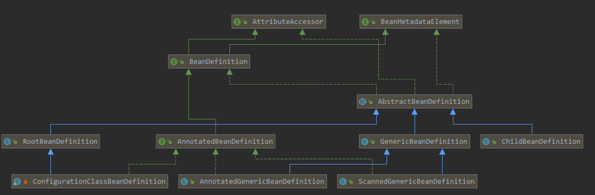

# 1.类扫描机制

spring提供类扫描机制，可以将指定类路径下的.class文件加载到IOC容器总，只需要配置`<context:component-scan/>`或用注解`@ComponentScan`。通过追源码，其实spring底层是使用JDK的`java.net.URL`，获取指定目录下所有的File集合，将其封装成org.springframework.core.io.Resource对象，进一步封装成BeanDefinition对象，然后进行筛选过滤，最终注册到IOC容器内。这其中涉及的几个重要类：

1. org.springframework.context.annotation.**ClassPathBeanDefinitionScanner**

2. org.springframework.context.annotation.**ClassPathScanningCandidateComponentProvider**

3. org.springframework.core.io.support.**PathMatchingResourcePatternResolver**

4. org.springframework.core.type.filter.**AnnotationTypeFilter**

## 1.1.类扫描映射接口

spring提供了许多的接口，用来映射.class文件携带的各种信息，最终都会封装成一个org.springframework.beans.factory.config.BeanDefinition对象。

### 1.1.1.BeanDefinition

BeanDefinition是用于封装Bean描述信息的接口，一个BeanDefinition描述了一个bean的实例，包括属性值，构造方法和继承自它的类的更多信息等。它的部分源码如下：

```java
public interface BeanDefinition extends AttributeAccessor, BeanMetadataElement {
    //分别是单例和多例的作用符
    String SCOPE_SINGLETON = ConfigurableBeanFactory.SCOPE_SINGLETON;
    String SCOPE_PROTOTYPE = ConfigurableBeanFactory.SCOPE_PROTOTYPE;

    //标志BeanDefinition是应用程序主要部分的角色提示，通常对应于用户定义的bean
    int ROLE_APPLICATION = 0;

    //标志BeanDefinition是用户的，是从配置文件中过来的
    int ROLE_SUPPORT = 1;

    //表示BeanDefinition是spring自己的，与用户无关，注册完全属于内部工作的bean时使用
    int ROLE_INFRASTRUCTURE = 2;
}
```

剩下的源码就是BeanDefinitiopn定义的方法用来获取定义Bean时的各种属性配置。它的继承关系为：



### 1.1.2.classMetadata

ClassMetadata是spring用来封装某个类的元数据信息，包括该类是否是抽象的？是否是不可继承的？是否是接口？等信息，源码为：

```java
public interface ClassMetadata {

    //返回底层类的名称
    String getClassName();

    //返回底层类是否表示接口
    boolean isInterface();

    //返回底层类是否表示注解
    boolean isAnnotation();

    //返回底层类是否是抽象的
    boolean isAbstract();

    //返回底层类是否是一个具体类，换句话说，就是既不是接口也不是抽象类
    boolean isConcrete();

    //返回底层类是否是不可继承的最终类
    boolean isFinal();

    //返回底层类是否独立，即它是一个顶层类还是嵌套类（静态内部类）
    boolean isIndependent();

    //返回底层类是否具有封闭类，即底层类是内部/嵌套类或方法中的本地类），如果此方法返回false，
    //则底层类是顶级类
    boolean hasEnclosingClass();

    //如果底层类是顶级类，则返回底层类的封闭类名称
    String getEnclosingClassName();

    //返回底层类是否有超类
    boolean hasSuperClass();

    //如果底层类有超类，返回它的超类名称
    String getSuperClassName();

    //返回底层类实现的所有接口的名称，如果没有则返回空数组
    String[] getInterfaceNames();

    //返回底层类的所有类名称，包括公共，受保护，默认（包）访问，以及类声明的私有类和接口，但不包括
    //继承的类和接口。如果不存在成员类或接口，则返回空数组
    String[] getMemberClassNames();
}
```

### 1.1.3.ScopeMetadata

ScopeMetadata，用来描述Spring管理的bean的范围特征，包括范围名称（即spring作用域）和范围代理行为(即动态代理实现方式)。默认范围是singleton。源码：

```java
public class ScopeMetadata {
    private String scopeName = BeanDefinition.SCOPE_SINGLETON;
    private ScopedProxyMode scopedProxyMode = ScopedProxyMode.NO;
    //省略方法
}
```

其中ScopedProxyMode是一个枚举类，分别表示：

```java
public enum ScopedProxyMode {

    //除非在组件扫描设置了不同的默认值，否则此选项等同于下面的No模式
    DEFAULT,

    //不会创建任何代理
    NO,

    //创建JDK动态代理，基于接口
    INTERFACES,

    //创建CGLIB动态代理，基于类
    TARGET_CLASS;
}
```

### 1.1.4.AnnotatedTypeMetadata

AnnotatedTypeMetadata是对java.lang.reflect.AnnotatedElement接口的封装，AnnotatedElement的对象代表了在当前JVM中的一个“被注解元素”可以是Class，Method，Field，Constructor，Package等。AnnotatedTypeMetadata是MethodMetadata和AnnotationMetadata的父接口。用来获取注定元素上的注解信息。源码如下：

```java
public interface AnnotatedTypeMetadata {

   /**
    * 判断底层元素是否具有给定类型的的注解或元注解，若此方法返回true，
    * 则getAnnotationAttributes()方法会返回一个非空Map
    */
    boolean isAnnotated(String annotationName);

   /**
    * 获取底层元素指定类型的注解的属性（如果有的话），如果在基础元素上定义，作为直接注解或元注解，
    * 还会考虑组合注解的属性覆盖
    * @return 返回一个Map，注解属性作为key，注解值作为value
    */
    Map<String, Object> getAnnotationAttributes(String annotationName);

   /**
    * 获取指定类型的注解的属性（如果有的话），参数classValuesAsString表示是否要将Class对象
    * 转换为String类名称，如果在基础元素上定义，作为直接注解或元注解，还会考虑组合注解的属性覆盖
    */
    Map<String, Object> getAnnotationAttributes(String annotationName, 
                                                boolean classValuesAsString);

   /** 
 	  * 获取底层元素给定类型的所有注解的所有属性，如果有（即，如果在基础元素上定义，则为直接注解或
 	  * 元注解）注意，此方法不会考虑属性覆盖
  	*/
    MultiValueMap<String, Object> getAllAnnotationAttributes(String annotationName);


   /**
    * 获取底层元素给定类型的所有注解的所有属性，如果有（即，如果在基础元素上定义，则为直接注解或
    * 元注解）注意，此方法不会考虑属性覆盖。参数classValuesAsString表示是否要将Class对象
    * 转换为String类名称
    */
    MultiValueMap<String, Object> getAllAnnotationAttributes(String annotationName, 
           boolean classValuesAsString);
}
```

### 1.1.5.MethodMetadata

MethodMetadata是spring用于方法元数据的封装，它的源码为：

```java
public interface MethodMetadata extends AnnotatedTypeMetadata {

   /**
    * 返回方法名称
    */
    String getMethodName();

   /**
    * 返回声明此方法的类的完全限定名称。
    */
    String getDeclaringClassName();

   /**
    * 返回此方法声明的返回类型的完全限定名称
    */
    String getReturnTypeName();

   /**
    * 返回底层方法是否是抽象方法，即在类上标记为抽象或在接口中声明为常规非默认方法
    */
    boolean isAbstract();

   /**
    * 判断方法是否为静态方法
    */
    boolean isStatic();

   /**
    * 判断方法是否为最终方法
    */
    boolean isFinal();

   /**
    * 返回底层方法是否可覆盖，即不标记为静态，最终或私有。
    */
    boolean isOverridable();
}
```

### 1.1.6.AnnotationMetadata

前面说过ClassMetadata对类Class的封装，而AnnotationMetadata就是封装了Class上的注解，对其进行获取和判断。源码为：

```java
public interface AnnotationMetadata extends ClassMetadata, AnnotatedTypeMetadata {

   /**
    * 获取底层类所有注解的类名称(类的全路径)
    */
    Set<String> getAnnotationTypes();

   /**
    * 获取底层类指定类型的所有元注解的类名称（注意要使用类全路径）
    */
    Set<String> getMetaAnnotationTypes(String annotationName);

   /**
    * 判断底层类是否有指定类型的注解（方法参数要使用类全路径）
    */
    boolean hasAnnotation(String annotationName);

   /**
    * 判断底层类是否有指定类型的元注解
    */
    boolean hasMetaAnnotation(String metaAnnotationName);

   /**
    * 判断底层类是否有指定注解标注的方法
    */
    boolean hasAnnotatedMethods(String annotationName);

   /**
    * 获取底层类被指定注解标注的所有方法的元数据对象MethodMetadata
    */
    Set<MethodMetadata> getAnnotatedMethods(String annotationName);
  
}
```

## 1.2.类扫描流程

类扫描过程，是将指定包路径下的所有文件加载出来，spring底层用的是java.net.URL来实现的，然后将其封装成Resour对象。这一个流程都是交给**PathMatchingResourcePatternResolver**来实现的。spring类扫描大体上分为2个流程：

1. 解析扫描路径，获取实际指定包路径的实际磁盘地址，即父目录；

2. 获取父目录下的所有class文件，封装成Resource对象。

### 1.2.1.获取父目录物理地址

1. ClassPathScanningCandidateComponentProvider对用户设置的包扫描路径进行拼凑，加上前缀后缀，类似“classpath*:com/sym/classScan/**/*.class”，然后就交给**PathMatchingResourcePatternResolver**扫描：

```java
String CLASSPATH_ALL_URL_PREFIX= "classpath*:";
this.resourcePattern = "**/*.class";
String packageSearchPath = ResourcePatternResolver.CLASSPATH_ALL_URL_PREFIX +
    resolveBasePackage(basePackage) + '/' + this.resourcePattern;
Resource[] resources = this.resourcePatternResolver.getResources(packageSearchPath);
```

2. 首先执行PathMatchingResourcePatternResolver的getResources()方法，它根据路径来决定使用何种扫描

```java
// PathMatchingResourcePatternResolver – 273行
public Resource[] getResources(String locationPattern) throws IOException {
    Assert.notNull(locationPattern, "Location pattern must not be null");
    // 判断路径是不是以classpath*:开头的，当然这里肯定返回true
    if (locationPattern.startsWith(CLASSPATH_ALL_URL_PREFIX)) {
        // 截取路径除classpath*:后面的字符串，即：com/sym/classScan/**/*.class
        // 使用AntPathMatcher进行路径匹配(怎么匹配要去查看Ant方式的路径匹配)，
        // 这里也会返回true
        if (getPathMatcher().isPattern(
            locationPattern.substring(CLASSPATH_ALL_URL_PREFIX.length()))) {
            // 进入单个类路径资源的扫描，跳转到第③步
            return findPathMatchingResources(locationPattern);
        }else {
            // all class path resources with the given name
            return findAllClassPathResources(locationPattern.substring
                                             (CLASSPATH_ALL_URL_PREFIX.length()));
        }
    }else {
        // Only look for a pattern after a prefix here
        // (to not get fooled by a pattern symbol in a strange prefix).
        int prefixEnd = locationPattern.indexOf(":") + 1;
        if (getPathMatcher().isPattern(locationPattern.substring(prefixEnd))) {
            // a file pattern
            return findPathMatchingResources(locationPattern);
        }else {
            // a single resource with the given name
            return new Resource[] {getResourceLoader().getResource(locationPattern)};
        }
    }
}
```

3. 进入findPathMatchingResources()方法，此时方法参数，即路径为：classpath*:com/sym/classScan/**/*.class

```java
// PathMatchingResourcePatternResolver – 456行
protected Resource[] findPathMatchingResources(String locationPattern) {
    //截取参数指定的路径, 求出根目录地, 类似：classpath*:com/sym/classScan/
    String rootDirPath = determineRootDir(locationPattern);
  
    //获取子目录地址：**/*.class
    String subPattern = locationPattern.substring(rootDirPath.length());
  
    //跳转到第④⑤⑥步进行扫描，返回该相对路径下的所有绝对路径地址（即磁盘上的地址）
    Resource[] rootDirResources = getResources(rootDirPath);
  
    //然后就是遍历该绝对路径地址，依次找出该目录下的所有资源
    Set<Resource> result = new LinkedHashSet<Resource>(16);
    for (Resource rootDirResource : rootDirResources) {
        // 处理 Resource 对象, 默认直接返回
        rootDirResource = resolveRootDirResource(rootDirResource);
        URL rootDirURL = rootDirResource.getURL();
      
        //反射的Method，此时为Null
        if (equinoxResolveMethod != null) {
            if (rootDirURL.getProtocol().startsWith("bundle")) {
                rootDirURL = (URL) ReflectionUtils.invokeMethod(equinoxResolveMethod, 
                                                                null, rootDirURL);
                rootDirResource = new UrlResource(rootDirURL);
            }
        }
      
        // 如果 URL 是vfs类型( virtual file system, 虚拟文件系统)
        if (rootDirURL.getProtocol().startsWith(ResourceUtils.URL_PROTOCOL_VFS)) {
            result.addAll(VfsResourceMatchingDelegate.findMatchingResources(
                rootDirURL, subPattern, getPathMatcher()));
        }else if (ResourceUtils.isJarURL(rootDirURL) || 	
                  isJarResource(rootDirResource)) {
            //如果是jar类型 
            result.addAll(doFindPathMatchingJarResources(rootDirResource, rootDirURL, 
                                                         subPattern));
        }else {
            // 既不属于vfs又不属于jar的其它类型URL(一般是file协议)则会加载旗下所有文件file
            // 接着调用doFindPathMatchingFileResources()执行1.2.2阶段, 封装Resource对象
            result.addAll(doFindPathMatchingFileResources(rootDirResource, 
                                                          subPattern));
        }
     }
  }
  return result.toArray(new Resource[result.size()]);
}
```

4. 方法会返回到第②步的getResources()扫描根目录下的文件，此时参数路径变为：classpath*:com/sym/classScan/

```java
// PathMatchingResourcePatternResolver – 273行
public Resource[] getResources(String locationPattern) throws IOException {
    Assert.notNull(locationPattern, "Location pattern must not be null");
    //判断路径是不是以“classpath*:”开头的，这里会返回true
    if (locationPattern.startsWith(CLASSPATH_ALL_URL_PREFIX)) {
      
        // 使用AntPathMatcher判断路径：com/sym/classScan/，这里就匹配不到了
        if (getPathMatcher().isPattern(
            locationPattern.substring(CLASSPATH_ALL_URL_PREFIX.length()))) {
            return findPathMatchingResources(locationPattern);
        }else {
            // 截取出路径：com/sym/classScan/，查询旗下所有的资源
            return findAllClassPathResources(locationPattern.substring(
                CLASSPATH_ALL_URL_PREFIX.length()));
        }
    }
}
```

5. 查询指定路径下的所有资源，此时的路径变为：com/sym/classScan/

```java
// PathMatchingResourcePatternResolver – 310行
protected Resource[] findAllClassPathResources(String location) throws IOException {
    String path = location;
    if (path.startsWith("/")) {
      path = path.substring(1);
    }
    //调用doFindAllClassPathResources()执行搜索，然后将相对路径下的所有绝对路径地址加载出来
    Set<Resource> result = doFindAllClassPathResources(path);
    return result.toArray(new Resource[result.size()]);
}
```

6. 真正执行搜索doFindAllClassPathResources()，此时路径为：com/sym/classScan/

```java
// PathMatchingResourcePatternResolver – 329行
protected Set<Resource>doFindAllClassPathResources(String path) throws IOException {
    Set<Resource> result = new LinkedHashSet<Resource>(16);
    ClassLoader cl = getClassLoader();
    // 使用一个类加载器查询指定路径下的资源, 解释下：类加载器可以解析类路径下形如：com/sym/util
    // 格式的包路径, 将其封装成 URL 格式的对象返回.
    Enumeration<URL> resourceUrls = (cl != null ? cl.getResources(path) : 
                                     ClassLoader.getSystemResources(path));
  
    // 这边就会把相对路径：com/sym/classScan/下的所有绝对路径加载，注意是绝对路径(磁盘地址)
    while (resourceUrls.hasMoreElements()) {
        URL url = resourceUrls.nextElement();
        // 将java.net.URL 封装成 UrlResource, 添加到result返回
        result.add(convertClassLoaderURL(url));
    }
  
    //路径是不为空的，所以就直接返回了
    if ("".equals(path)) {
        addAllClassLoaderJarRoots(cl, result);
    }
    return result;
}
```

### 1.2.2.封装class文件成Resource对象

通过类加载器获取到用户指定目录的实际物理磁盘地址后，spring类扫描的第一阶段就完成，方法会返回到[第一阶段](#1.2.1.获取父目录物理地址)的第③步。接着执行第二阶段，将实际地址下的所有class文件加载封装成FileSystemResource对象。

1. doFindPathMatchingFileResources()会加载绝对路径下的所有文件，参数rootDirResource是一个UrlResource，是第一阶段获取到的实际磁盘路径；参数subPattern值为：\*\*/*.class

```java
// PathMatchingResourcePatternResolver – 680行
protected Set<Resource>doFindPathMatchingFileResources(Resource rootDirResource, 
   		String subPattern) throws IOException {
    File rootDir;
    try {
        //通过 java.net.URL 解析出根目录文件, File 类型表示
        rootDir = rootDirResource.getFile().getAbsoluteFile();
    }catch (IOException ex) {
        return Collections.emptySet();
    }
    // 调用第②步继续解析.
    return doFindMatchingFileSystemResources(rootDir, subPattern);
}
```

2. 调用doFindMatchingFileSystemResources()进行扫描，参数rootDir是一个File对象，它代表一个文件夹(父目录)；参数subPattern还是\*\*/*.class

```java
// PathMatchingResourcePatternResolver – 707行
protected Set<Resource> doFindMatchingFileSystemResources(File rootDir, 
             String subPattern)throws IOException {
    //跳转第③步，调用retrieveMatchingFiles()查找旗下的子文件
    Set<File> matchingFiles = retrieveMatchingFiles(rootDir, subPattern);
  
    //一个一个封装成FileSystemResource对象
    Set<Resource> result = new LinkedHashSet<Resource>(matchingFiles.size());
    for (File file : matchingFiles) {
        result.add(new FileSystemResource(file));
    }
    return result;
}
```

3. 调用retrieveMatchingFiles()获取指定文件夹下的，匹配子路径的所有文件File

```java
// PathMatchingResourcePatternResolver – 728行
protected Set<File> retrieveMatchingFiles(File rootDir, String pattern){
    //父目录不存在就直接返回空集合了
    if (!rootDir.exists()) {
        return Collections.emptySet();
    }
  
    //父目录不是一个目录(文件夹)，也直接返回空集合
    if (!rootDir.isDirectory()) {
        return Collections.emptySet();
    }
  
    //父目录没有读取权限，也直接返回空集合
    if (!rootDir.canRead()) {
        return Collections.emptySet();
    }
  
    // 将文件分隔符由“\”替换为“/”, 形如：E:/workspace/target/classes/com/sym/classScan
    String fullPattern = StringUtils.replace(rootDir.getAbsolutePath(), 
                                             File.separator, "/");
  
    //在fullPattern屁股后面加个 /
    if (!pattern.startsWith("/")) {
        fullPattern += "/";
    }
  
    //拼接上子路径模式，进行查找
    //此时路径变为E:/workspace/target/classes/com/sym/classScan/**/*.class
    fullPattern = fullPattern + StringUtils.replace(pattern, File.separator, "/");
    Set<File> result = new LinkedHashSet<File>(8);
  
    //调用第④步执行查找
    doRetrieveMatchingFiles(fullPattern, rootDir, result);
    return result;
}
```

4. 真正执行查找了，参数fullPattern此时为：E:/workspace/Idea_study/spring知识点/target/classes/com/sym/classScan/**/*.class；参数dir表示实际的父目录File对象。

```java
// PathMatchingResourcePatternResolver – 769行
protected void doRetrieveMatchingFiles(String fullPattern, File dir, 
                                       Set<File> result) {
    // 获取父文件夹下的所有子文件，不存在任何文件就直接返回
    File[] dirContents = dir.listFiles();
    if (dirContents == null)  return; 
    Arrays.sort(dirContents);
    for (File content : dirContents) {
        // 遍历所有子文件，首先判断它是否为文件夹，并且能匹配上fullPattern
        String currPath = StringUtils.replace(content.getAbsolutePath(), 
                                              File.separator, "/");
        if (content.isDirectory() && getPathMatcher().matchStart(fullPattern, 
                                           currPath + "/")){
            if (!content.canRead()) {
                // 子文件夹读不了，就溜了，搞下一个子文件了
            }else {
                // 如果子文件夹有访问权限，就递归执行此方法
                doRetrieveMatchingFiles(fullPattern, content, result);
            }
        }
        // 若子文件不是一个文件夹, 且能匹配上路径, 就直接添加到返回结果上 
        if (getPathMatcher().match(fullPattern, currPath)) {
            result.add(content);
        }
    }
}
```

到此，spring类扫描流程就已经完成，接着会执行类过滤流程，将扫描的所有FileSystemResource对象进行过滤，筛选出需要添加到IOC容器中的类。

## 1.3.类过滤流程

类过滤流程，就是将[类扫描流程](#_类扫描流程)的FileSystemResource进一步封装成BeanDefinition对象。起到关键作用的是：TypeFilter接口，默认spring是使用实现类AnnotationTypeFilter来进行过滤操作；整个类过滤流程是在ClassPathScanningCandidateComponentProvider类的findCandidateComponents()方法执行

### 1.3.1.过滤器TypeFilter进行筛选

1. 遍历[类扫描流程](#1.2.类扫描流程)得到的Resource数组，依次过滤每个类

```java
// ClassPathScanningCandidateComponentProvider – 273行
public Set<BeanDefinition> findCandidateComponents(String basePackage) {
    Set<BeanDefinition> candidates = new LinkedHashSet<BeanDefinition>();
    try {
        String packageSearchPath = ResourcePatternResolver.CLASSPATH_ALL_URL_PREFIX +
            resolveBasePackage(basePackage) + '/' + this.resourcePattern;
        // 执行类扫描流程把指定目录下的类文件以FileSystemResource[]的形式返回
        Resource[] resources = 
            this.resourcePatternResolver.getResources(packageSearchPath);
        // 从这边开始，就执行类过滤流程, 遍历每个Resource
        for (Resource resource : resources) {
            if (resource.isReadable()) {
                try {
                    // MetadataReader是对部分类扫描映射接口的封装，用来获取
                    // Resource、ClassMetadata和 AnnotationMetadata接口
                    MetadataReader metadataReader = 
                        this.metadataReaderFactory.getMetadataReader(resource);
                    // 重点方法: 执行过滤，判断此class文件是否可以被加载，跳转到第②步执行
                    if (isCandidateComponent(metadataReader)) {
                        // 如果代码可以执行到这边，说明这个类可以被加载IOC容器，
                        // 初始化BeanDefinition
                        ScannedGenericBeanDefinition sbd = new 
                            ScannedGenericBeanDefinition(metadataReader);
                        sbd.setResource(resource);
                        sbd.setSource(resource);
                    }
                    //判断此类是否是一个顶级父类，详见第③步
                    if (isCandidateComponent(sbd)) {
                        candidates.add(sbd);
                    }
                    // 这边省略部分不重要代码...
                    return candidates;
                }
            }
        }
    }
}
```

2. isCandidateComponent()用来确定给定的类是否与任何排除过滤器不匹配并且匹配至少一个包含过滤器

```java
// ClassPathScanningCandidateComponentProvider – 347行
protected boolean isCandidateComponent(MetadataReader metadataReader) {
    // 如果类被排除过滤器匹配上了，说明它不需要被加载，方法直接返回true
    for (TypeFilter tf : this.excludeFilters) {
        if (tf.match(metadataReader, this.metadataReaderFactory)) {
            return false;
        }
    }
    // 如果类不在排除过滤器的过滤范围内，接着判断它是否在包含过滤器的过滤范围
    // 仅当包含时方法才会返回true，否则也是返回false
    for (TypeFilter tf : this.includeFilters) {
        if (tf.match(metadataReader, this.metadataReaderFactory)) {
            return isConditionMatch(metadataReader);
        }
    }
    return false;
}
```

3. 判断类是否允许被加载IOC容器中，依据：给定的BeanDefinition对象是否符合候选条件，默认检查此类是否不是一个接口并且不依赖于封闭类，而且可以在子类中重写

```java
// ClassPathScanningCandidateComponentProvider – 382行
protected boolean isCandidateComponent(AnnotatedBeanDefinition beanDefinition) {
    AnnotationMetadata metadata = beanDefinition.getMetadata();
    return (metadata.isIndependent() && (metadata.isConcrete() ||
           (metadata.isAbstract() && 	    metadata.hasAnnotatedMethods(Lookup.class.getName()))));
}
```

### 1.3.2.默认过滤器AnnotationTypeFilter

默认过滤器AnnotationTypeFilter的匹配原理:

```java
// 默认这个成员变量，就是我们在spring中常用的@Component注解
private final Class<? extends Annotation>annotationType;
// 默认值为true，表示在判断注解时，要将元注解考虑进去
private final boolean considerMetaAnnotations;

//判断类上面是否带有@Component注解，或者@Component的衍生注解
@Override
protected boolean matchSelf(MetadataReader metadataReader) {
    AnnotationMetadata metadata = metadataReader.getAnnotationMetadata();
    return metadata.hasAnnotation(this.annotationType.getName()) ||
        (this.considerMetaAnnotations && metadata.hasMetaAnnotation
         (this.annotationType.getName()));
}
```

## 1.4.自定义类扫描对象

理解了上述两个：[类扫描流程](#1.2.类扫描流程)和[类过滤流程](#1.3.类过滤流程)，如果我们要自定义注解，并且让spring将其扫描加载到IOC容器，就可以有各式各样的解决方案。

### 1.4.1.最简单方式

在我们自定义的注解中加入@Component，AnnotationTypeFilter默认会把元注解考虑进去，所以当我们注解中加入了@Component，就会被其匹配成功

```java
@Documented
@Target(value = ElementType.TYPE)
@Retention(value = RetentionPolicy.RUNTIME)
@Inherited
@Component//将@Component作为一个元注解，放在我们的自定义注解中
public @interface SymRpc {
}
```

### 1.4.2.自定义TypeFilter

spring提供了ClassPathBeanDefinitionScanner类来完成类扫描、过滤和注册，我们可以自己new一个ClassPathBeanDefinitionScanner，调用它的scan()方法扫描一遍：

```java
// 初始化ClassPathBeanDefinitionScanner需要一个Bean注册器，其实就是BeanFactory实现类。
// 这个实现类我们可以通过ApplicationContext获取到
ClassPathBeanDefinitionScanner scanner = new 
    ClassPathBeanDefinitionScanner(context.getDefaultListableBeanFactory());
// 重新new一个AnnotationTypeFilter过滤器，并且指定它的匹配注解为我们自定义的注解
// 将其注册到扫描类scanner中
scanner.addIncludeFilter(new AnnotationTypeFilter(SymRpc.class));
// 指定扫描路径，调用scan()方法开始扫描
scanner.scan("com.sym.classScan");
```

# 2.容器创建流程

spring容器，确切地说是上下文，即ApplicationContext。它比Bean工厂更高级，常用的实现类有：AnnotationConfigApplicationContext、ClassPathXmlApplicationContext和FileSystemXmlApplicationContext。一般手动获取spring容器时可能会有下面两种方式：

```java
//读取配置文件，获取IOC容器
ApplicationContext context = new ClassPathXmlApplicationContext("spring.xml");

//通过配置类，获取IOC容器
ApplicationContext context = new AnnotationConfigApplicationContext(ApplicationContextConfig.class);
```

查看它们的构造方法，都会调用父类AbstractApplicationContext的refresh()方法。实际上，这个refresh()就是创建容器和刷新容器的方法，源码为：

```java
//源码：AbstractApplicationContext--508行
public void refresh() throws BeansException, IllegalStateException {
  synchronized (this.startupShutdownMonitor) {
    //准备上下文以进行刷新，设置其启动日期和active标志以及执行属性源的任何初始化
    prepareRefresh();

    //告诉子类刷新内部bean工厂
    ConfigurableListableBeanFactory beanFactory = obtainFreshBeanFactory();

    // 配置工厂的标准上下文特征，例如上下文的ClassLoader和后处理器
    prepareBeanFactory(beanFactory);

    try {
     /*
      * 子类若有此方法的实现，允许子类对BeanFactory做后置处理...
      * 在BeanFactory标准初始化之后，修改上下文的内部bean工厂。所有bean定义都将被加载
      * 但是还没有实例化bean。这允许在某些ApplicationContext实现中注册特殊的
      * BeanPostProcessor
      */
      postProcessBeanFactory(beanFactory);

      // 实例化并调用所有已注册的BeanFactoryPostProcessor（BeanFactory后置处理器）
      invokeBeanFactoryPostProcessors(beanFactory);

      // 实例化并调用所有已注册的BeanPostProcessor Bean
      registerBeanPostProcessors(beanFactory);

      // 初始化消息源 MessageSource
      initMessageSource();

      // 初始化事件多播器 ApplicationEventMulticaster，它可以管理多个
      // ApplicationListener，并向其发布事件.默认实现SimpleApplicationEventMulticaster
      initApplicationEventMulticaster();

      // spring提供的模板方法，默认实现为空，需要在子类中重写，以初始化其它特殊bean
      // 以便对上下文进行特殊的刷新工作
      onRefresh();

      // 搜索监听器 ApplicationListener，并且注册到上下文中
      registerListeners();

      // 完成上下文的bean工厂的初始化，初始化所有剩余的单例bean（非延迟初始化）
      // 我们项目中的Bean就是在这里被初始化的(Bean生命周期就从这开始)
      finishBeanFactoryInitialization(beanFactory);

      // 完成此上下文的刷新，调用LifecycleProcessor的onRefresh()方法并发布事件ContextRefreshedEvent
      finishRefresh();

    } catch (BeansException ex) {
      // 销毁当前上下文所有单例Bean的模板方法，默认实现是回调DisposableBean.destroy()和
      // destroy-method指定方法.可以被子类重写，用于添加额外的上下文单例Bean的销毁操作。
      // 注意：不管单例销毁前,还是销毁后，此时的BeanFactory仍处于活跃状态
      destroyBeans();

      // 将当前上下文的活跃标志重置，即设为false
      cancelRefresh(ex);

      // 抛出异常
      throw ex;

    } finally {
      // 重置Spring的通用核心缓存：ReflectionUtils、ResolvableType和
      // CachedIntrospectionResults
      resetCommonCaches();
    }
```

通过debug模式跟踪AnnotationConfigApplicationContext创建过程，学习整个spring容器的创建、加载、刷新和运行的过程！

## 2.1.BeanFactory创建与预处理

### 2.1.1.prepareRefresh()

prepareRefresh()方法是refresh()方法的第一个方法，它的作用就是在IOC容器创建之前做一些预处理，AnnotationConfigApplicationContext对其重写，只是多了缓存处理，最后还是父类AbstractApplicationContext的方法，源码：

```java
//源码：AbstractApplicationContext--576行
protected void prepareRefresh() {
  // 获取启动时间戳, 然后设置一些状态值
  this.startupDate = System.currentTimeMillis();
  this.closed.set(false);
  this.active.set(true);

  // 这个方法默认为空, 留给子类实现, 用来设置自定义的属性
  initPropertySources();

  // getEnvironment()默认创建一个ConfigurableEnvironment的实现类StandardEnvironment
  // 子类可以重写此方法, 创建一个实现ConfigurableEnvironment接口的个性化上下文环境对象
  // 然后通过环境上下文, 验证一些必要的属性
  getEnvironment().validateRequiredProperties();

  // 接着初始化成员变量earlyApplicationEvents, 它是一个链表形式的hashSet, 
  // 用它保存容器早期的事件, 即事件多播器还未构造完成, 容器就有事件需要发布, 
  // 就会将事件保存到 earlyApplicationEvents 中, 等到多播器multicaster可用, 
  // 就可以发布事件
  this.earlyApplicationEvents = new LinkedHashSet<ApplicationEvent>();
}
```

### 2.1.2.obtainFreshBeanFactory()

obtainFreshBeanFactory()是生成一个ConfigurableListableBeanFactory的实现类，即Bean工厂，这个方法就是new一个DefaultListableBeanFactory，然后将其返回。

```java
//源码：AbstractApplicationContext -- 612行
protected ConfigurableListableBeanFactory obtainFreshBeanFactory() {
  // 调用父类GenericApplicationContext的refreshBeanFactory()方法, 创建子类实例时
  // 会调用抽象父类的构造方法, 它默认生成一个DefaultListableBeanFactory实现类, 并为
  // 该实例设置一个唯一Id（AbstractApplicationContext的164行）
  refreshBeanFactory();
  // 就是将上一步抽象父类GenericApplicationContext生成的BeanFactory实例返回
  ConfigurableListableBeanFactory beanFactory = getBeanFactory();
  return beanFactory;
}
```

### 2.1.3.prepareBeanFactory()

对[obtainFreshBeanFactory()](#2.1.2.obtainFreshBeanFactory())生成的Bean工厂做一些设置、添加后置处理器、设置忽略的自动装配接口和注册一些必备组件。其源码为：

```java
//源码：AbstractApplicationContext-- 626行
protected void prepareBeanFactory(ConfigurableListableBeanFactory beanFactory) {
  // 统一 applicationContext 和 beanFactory的类加载器
  beanFactory.setBeanClassLoader(getClassLoader());
  
  // 表达式解析器 【BeanExpressionResolver】
  beanFactory.setBeanExpressionResolver(new StandardBeanExpressionResolver
                                        (beanFactory.getBeanClassLoader()));
  
  // 属性注册器 【PropertyEditorRegistrar】
  beanFactory.addPropertyEditorRegistrar(new ResourceEditorRegistrar(this, 
                                                                     getEnvironment()));
  
  // 添加后置处理器【ApplicationContextAwareProcessor】
  beanFactory.addBeanPostProcessor(new ApplicationContextAwareProcessor(this));
  
  // 指定这些接口不会自动装配
  beanFactory.ignoreDependencyInterface(EnvironmentAware.class);
  beanFactory.ignoreDependencyInterface(EmbeddedValueResolverAware.class);
  beanFactory.ignoreDependencyInterface(ResourceLoaderAware.class);
  beanFactory.ignoreDependencyInterface(ApplicationEventPublisherAware.class);
  beanFactory.ignoreDependencyInterface(MessageSourceAware.class);
  beanFactory.ignoreDependencyInterface(ApplicationContextAware.class);
  
  // 注册可以解析的自动装配接口, 可以在任何组件中使用@Autowire引入它们
  beanFactory.registerResolvableDependency(BeanFactory.class, beanFactory);
  beanFactory.registerResolvableDependency(ResourceLoader.class, this);
  beanFactory.registerResolvableDependency(ApplicationEventPublisher.class, this);
  beanFactory.registerResolvableDependency(ApplicationContext.class, this);
  
  // 添加后置处理器ApplicationListenerDetector, 它可以检测内部Bean是不是ApplicationListeners类型
  beanFactory.addBeanPostProcessor(new ApplicationListenerDetector(this));
  
  // 添加编译时的AspectJ
  if (beanFactory.containsBean(LOAD_TIME_WEAVER_BEAN_NAME)) {
    beanFactory.addBeanPostProcessor( new LoadTimeWeaverAwareProcessor
                                     (beanFactory));
    beanFactory.setTempClassLoader( new ContextTypeMatchClassLoader
                                   (beanFactory.getBeanClassLoader()));
  }
  
  // 预先给BeanFactory注册组件：environment、SystemProperties、SystemEnvironment
  if (!beanFactory.containsLocalBean(ENVIRONMENT_BEAN_NAME)) {
    beanFactory.registerSingleton(ENVIRONMENT_BEAN_NAME, getEnvironment());
  }
  if (!beanFactory.containsLocalBean(SYSTEM_PROPERTIES_BEAN_NAME)) {
    beanFactory.registerSingleton(SYSTEM_PROPERTIES_BEAN_NAME, 
                                  getEnvironment().getSystemProperties());
  }
  if (!beanFactory.containsLocalBean(SYSTEM_ENVIRONMENT_BEAN_NAME)) {
    beanFactory.registerSingleton(SYSTEM_ENVIRONMENT_BEAN_NAME, 
                                  getEnvironment().getSystemEnvironment());
  }
}
```

### 2.1.4.postProcessBeanFactory()

这个方法是留给子类重写用的，用来对生成的BeanFactory做一步的设置；父类默认没有任何实现。这个方法会在springBoot中被用来注册web组件。

```java
//源码：AbstractApplicationContext-- 677行
protected void postProcessBeanFactory(ConfigurableListableBeanFactory beanFactory) {
  
}
```

## 2.2.BeanFactory后处理

### 2.2.1.invokeBeanFactoryPostProcessors()

invokeBeanFactoryPostProcessors()方法的作用就是回调两种接口：**BeanFactoryPostProcessor**和**BeanDefinitionRegistryPostProcessor**，默认是调用PostProcessorRegistrationDelegate的invokeBeanFactoryPostProcessors方法上。（由于BeanDefinitionRegistryPostProcessor实现了BeanFactoryPostProcessor，所以它也有BeanFactoryPostProcessor定义的方法）spring处理BeanFactoryPostProcessor的基本逻辑是这样子滴：

1. 先回调BeanDefinitionRegistryPostProcessor接口，再回调BeanFactoryPostProcessor接口；

2. 不管处理哪一种接口，都会区分是否实现PriorityOrdered和Ordered接口，优先执行PriorityOrdered，再执行Ordered接口，最后执行没有实现这两个接口的后处理器

3. 当处理实现PriorityOrdered和Ordered接口的后处理器时，其getOrder()方法返回值越小，表示其优先级越高，spring就会越先执行它

```java
// 源码：PostProcessorRegistrationDelegate--52行
// 根据前面的分析, BeanFactory还没有开始初始化实例, 而且配置类也还没有加载
// 所以这边方法调用的时候, 参数beanFactoryPostProcessors是没有任何后置处理器的
// 默认是靠ConfigurationClassPostProcessor来扫描处理配置类...见下面分析
public static void invokeBeanFactoryPostProcessors(
  ConfigurableListableBeanFactory beanFactory, 
  List<BeanFactoryPostProcessor> beanFactoryPostProcessors) {
  
  // 局部变量 processedBeans 表示已执行过的beanFactory, 记录在此, 防止重复执行
  Set<String> processedBeans = new HashSet<String>();

  if (beanFactory instanceof BeanDefinitionRegistry) {
    BeanDefinitionRegistry registry = (BeanDefinitionRegistry) beanFactory;
    // 用来保存 BeanFactoryPostProcessor接口
    List<BeanFactoryPostProcessor> regularPostProcessors = 
      new LinkedList<BeanFactoryPostProcessor>();
    
    // 用来保存 BeanDefinitionRegistryBeanPostProcessor接口
    List<BeanDefinitionRegistryPostProcessor> registryPostProcessors =
      new LinkedList<BeanDefinitionRegistryPostProcessor>();
    
    // 这边是遍历执行方法参数的beanFactoryPostProcessors, 将其分类保存到上面定义的
    // 两个成员变量; 默认方法参数的集合为空, 这里就不会执行...
    for (BeanFactoryPostProcessor postProcessor : beanFactoryPostProcessors) {
      if (postProcessor instanceof BeanDefinitionRegistryPostProcessor) {
        BeanDefinitionRegistryPostProcessor registryPostProcessor =
          (BeanDefinitionRegistryPostProcessor) postProcessor;
        // 注意一点, spring会在这里先回调一次postProcessBeanDefinitionRegistry()
        registryPostProcessor.postProcessBeanDefinitionRegistry(registry);
        registryPostProcessors.add(registryPostProcessor);
      } else {
        regularPostProcessors.add(postProcessor);
      }
    }
    // spring原生的注释, 提醒不要在此初始化 FactoryBean
    // Do not initialize FactoryBeans here: We need to leave all regular beans
    // uninitialized to let the bean factory post-processors apply to them!
    // Separate between BeanDefinitionRegistryPostProcessors that implement
    // PriorityOrdered, Ordered, and the rest.
    // 提醒下, 在此时, 我们创建的配置类还没有生效, 意味着spring容器里面没有任何我们定义
    // 的组件, 就只有它自己定义的, 所以它在这里找BeanDefinitionRegistryPostProcessor
    // 类型的bean组件名称, 就只有默认的：(详见AnnotationConfigUtils类的67行)
    // 默认的组件是：ConfigurationClassPostProcessor
    String[] postProcessorNames = beanFactory.getBeanNamesForType(
      BeanDefinitionRegistryPostProcessor.class, true, false);
      /*
       * 这边的代码就是比较经典了, spring根据PriorityOrdered接口、Orderd接口将
       * BeanDefinitionRegistryPostProcessor接口分为三个等级, 优先执行实现了
       * PriorityOrdered, 再执行实现了Orderd, 最后执行普通接口(即未实现上面两个接口的后处 
       * 理器); 然后每个等级集合内按照方法getOrder()来决定优先级, 值越小优先级越高!!!
       */

    //先处理实现了PriorityOrderd接口的BeanFactory后置处理器
    List<BeanDefinitionRegistryPostProcessor> priorityOrderedPostProcessors = 
      new ArrayList<BeanDefinitionRegistryPostProcessor>();
    for (String ppName : postProcessorNames) {
      if (beanFactory.isTypeMatch(ppName, PriorityOrdered.class)) {
        // 将实现接口PriorityOrdered的, 保存到priorityOrderedPostProcessors集合中
        priorityOrderedPostProcessors.add(beanFactory.getBean(
          ppName, BeanDefinitionRegistryPostProcessor.class));
        // 并且加入到processedBeans集合中, 表示它已经执行过了
        processedBeans.add(ppName);
      }
    }
    // 按照getOrder()方法的大小, 排序, 值越小在ArrayList里面就越靠前, 越先执行
    sortPostProcessors(beanFactory, priorityOrderedPostProcessors);
    
    // 保存这些接口到registryPostProcessors集合中(最前面定义的两个局部变量)
    registryPostProcessors.addAll(priorityOrderedPostProcessors);
    
    // 执行回调方法, 但是这边在容器启动时, 只有一个ConfigurationClassPostProcessor
    // 它的作用就是解析创建IOC上下文指定的配置类, 将配置类指定区域内的组件的
    // BeanDefinition注册到registry上, 也即执行之前分析的类扫描机制
    invokeBeanDefinitionRegistryPostProcessors(priorityOrderedPostProcessors,
                                               registry); 
    /*
     * 再处理实现了Orderd接口的BeanFactory后置处理器
     */
    // 由于spring自己定义的组件ConfigurationClassPostProcessor执行了, 它把我们在配置
    // 类中指定包扫描路径的组件的BeanDefinition注册进IOC容器里, 所以这里再执行这个方法
    // 就会把ConfigurationClassPostProcessor 和 我们自己定义的组件都找出来
    postProcessorNames = beanFactory.getBeanNamesForType
      (BeanDefinitionRegistryPostProcessor.class, true, false);
    List<BeanDefinitionRegistryPostProcessor> orderedPostProcessors = 
      new ArrayList<BeanDefinitionRegistryPostProcessor>();
    
    for (String ppName : postProcessorNames) {
      // 当接口未被执行过,  并且实现了Ordered接口, 将其加入到orderedPostProcessors中
      // 这边会是这样, 如果我们自定义的BeanDefinitionRegistryPostProcessor实现了
      // PriorityOrdered接口, 它在这里就只会添加到orderedPostProcessors, 毕竟
      // 在处理PriorityOrdered接口时, 我们定义的组件还没有注册进来...
      if (!processedBeans.contains(ppName) && 
          beanFactory.isTypeMatch(ppName, Ordered.class)) {
        orderedPostProcessors.add(beanFactory.getBean(ppName, 
           BeanDefinitionRegistryPostProcessor.class));
        processedBeans.add(ppName);
      }
    }
    
    // 同样的处理, 先排序, 再标识, 最终按顺序依次执行回调
    sortPostProcessors(beanFactory, orderedPostProcessors);
    registryPostProcessors.addAll(orderedPostProcessors);
    invokeBeanDefinitionRegistryPostProcessors(orderedPostProcessors, registry);
    /*
     * 最后处理普通的BeanFactory后置处理器, 
     * 注意：这边的处理你会发现是以循环的方式实现, 个人猜测是防止用户在BeanFactory后置处
     * 理里面又添加新的BeanFactory后置处理器, 所以它会一直调用, 直到没有新的处理器出现..
     */
    boolean reiterate = true;
    while (reiterate) {
      reiterate = false;
      postProcessorNames = beanFactory.getBeanNamesForType
        (BeanDefinitionRegistryPostProcessor.class, true, false);
      for (String ppName : postProcessorNames) {
        if (!processedBeans.contains(ppName)) {
          BeanDefinitionRegistryPostProcessor pp = beanFactory.getBean(ppName,
                                       BeanDefinitionRegistryPostProcessor.class);
          registryPostProcessors.add(pp);
          processedBeans.add(ppName);
          pp.postProcessBeanDefinitionRegistry(registry);
          reiterate = true;
        }
      }
    }
    
    // 上面都是执行BeanDefinitionRegistryPostProcessor的回调方法, 但是
    // BeanDefinitionRegistryPostProcessor也是BeanFactoryPostProcessor的子接口
    // 所以这边就执行父接口的postProcessBeanFactory()方法
    invokeBeanFactoryPostProcessors(registryPostProcessors, beanFactory);
    invokeBeanFactoryPostProcessors(regularPostProcessors, beanFactory);
    
  }
  // 如果当前Bean工厂不是BeanDefinitionRegistry类型, 就直接遍历回调所有
  // beanFactoryPostProcessor的postProcessBeanFactory()方法
  else {
    invokeBeanFactoryPostProcessors(beanFactoryPostProcessors, beanFactory);
  }
  /*
   * 截止到这, spring已经处理完所有的BeanDefinitionRegistryPostProcessor, 
   * 接下来就是处理所有的BeanFactoryPostProcessor
   */
  // 获取容器内所有实现BeanFactoryPostProcessor, 这里会把实现了
  // BeanDefinitionRegistryPostProcessor接口的Bean也找到...就需要靠processedBeans
  // 来区别那些已经执行过的, 和未执行的
  String[] postProcessorNames = beanFactory.getBeanNamesForType
    (BeanFactoryPostProcessor.class, true, false);
  
  // 跟上面一样, spring处理实现BeanFactoryPostProcessor接口也是分为三个等级：
  // 先回调PriorityOrdered, 再回调Ordered, 最后回调普通接口, 下面三个变量
  // 就是分别保存这些接口的集合
  List<BeanFactoryPostProcessor> priorityOrderedPostProcessors = 
    new ArrayList<BeanFactoryPostProcessor>();
  List<String> orderedPostProcessorNames = new ArrayList<String>();
  List<String> nonOrderedPostProcessorNames = new ArrayList<String>();
  
  // 遍历这些BeanFactoryPostProcessor接口, 对号入座, 添加到指定的集合中
  for (String ppName : postProcessorNames) {
    if (processedBeans.contains(ppName)) {
      // 已经被执行过了, 直接跳过
    }else if (beanFactory.isTypeMatch(ppName, PriorityOrdered.class)) {
      priorityOrderedPostProcessors.add(
        beanFactory.getBean(ppName, BeanFactoryPostProcessor.class));
    }else if (beanFactory.isTypeMatch(ppName, Ordered.class)) {
      orderedPostProcessorNames.add(ppName);
    }else {
      nonOrderedPostProcessorNames.add(ppName);
    }
  }
  
  // 对实现了PriorityOrdered接口的BeanFactoryPostProcessor进行排序后, 依次回调
  sortPostProcessors(beanFactory, priorityOrderedPostProcessors);
  invokeBeanFactoryPostProcessors(priorityOrderedPostProcessors, beanFactory);
  
  // 对实现了Ordered接口的BeanFactoryPostProcessor进行排序后, 依次回调
  List<BeanFactoryPostProcessor> orderedPostProcessors = 
    new ArrayList<BeanFactoryPostProcessor>();
  for (String postProcessorName : orderedPostProcessorNames) {
    orderedPostProcessors.add(beanFactory.getBean(postProcessorName, 
                                                  BeanFactoryPostProcessor.class));
  }
  sortPostProcessors(beanFactory, orderedPostProcessors);
  invokeBeanFactoryPostProcessors(orderedPostProcessors, beanFactory);
  
  // 对普通的BeanFactoryPostProcessor接口直接回调
  List<BeanFactoryPostProcessor> nonOrderedPostProcessors = 
    new ArrayList<BeanFactoryPostProcessor>();
  for (String postProcessorName : nonOrderedPostProcessorNames) {
    nonOrderedPostProcessors.add(beanFactory.getBean(postProcessorName, 
                    BeanFactoryPostProcessor.class));
  }
  invokeBeanFactoryPostProcessors(nonOrderedPostProcessors, beanFactory);
  
  //清除缓存的合并bean定义，因为后处理器可能已经修改了原始元数据，例如替换值中的占位符...
  beanFactory.clearMetadataCache();
}
```

### 2.2.2.registerBeanPostProcessors()

registerBeanPostProcessors()是向容器中注册Bean后置处理器BeanPostProcessor，它的注册逻辑跟BeanFactory后置处理器的逻辑一样，同样区分实现PriorityOrdered、Ordered接口，按照优先级注册。实际调用PostProcessorRegistrationDelegate的registerBeanPostProcessors()方法，源码为：

```java
//源码：PostProcessorRegistrationDelegate -- 183行
public static void registerBeanPostProcessors(
  ConfigurableListableBeanFactory beanFactory, 
  AbstractApplicationContext applicationContext) {
  
  // 找到当前Bean工厂所有已被注册的BeanPostProcessor的组件名
  String[] postProcessorNames = 
    beanFactory.getBeanNamesForType(BeanPostProcessor.class, true, false);
  
  // 为IOC容器注册BeanPostProcessorChecker, 它可以校验Bean后置处理器是不是符合
  // 数量要求, 目标值=已注册的+扫描到但未注册的+方法最后一行注册的...
  int beanProcessorTargetCount = beanFactory.getBeanPostProcessorCount() + 1 + 
    postProcessorNames.length;
  beanFactory.addBeanPostProcessor(new BeanPostProcessorChecker(beanFactory, 
                   beanProcessorTargetCount));
  
  /*
   * 按照三个优先级, 按照顺序依次注册BeanPostProcessor
   */
  //实现PriorityOrdered接口的
  List<BeanPostProcessor> priorityOrderedPostProcessors = 
    new ArrayList<BeanPostProcessor>();
  //属于内部BeanPostProcessor
  List<BeanPostProcessor> internalPostProcessors = new ArrayList<BeanPostProcessor>();
  //实现Ordered接口
  List<String> orderedPostProcessorNames = new ArrayList<String>();
  //未实现任何接口
  List<String> nonOrderedPostProcessorNames = new ArrayList<String>();
  
  // 遍历之前找到所有扫描到但未注册的BeanPostProcessor, 按照实现的接口对号入座, 添加到
  // 上面定义的4个集合中...
  for (String ppName : postProcessorNames) {
    if (beanFactory.isTypeMatch(ppName, PriorityOrdered.class)) {
      BeanPostProcessor pp = beanFactory.getBean(ppName, BeanPostProcessor.class);
      priorityOrderedPostProcessors.add(pp);
      if (pp instanceof MergedBeanDefinitionPostProcessor) {
        internalPostProcessors.add(pp);
      }
    }else if (beanFactory.isTypeMatch(ppName, Ordered.class)) {
      orderedPostProcessorNames.add(ppName);
    }else {
      nonOrderedPostProcessorNames.add(ppName);
    }
  }
  // 先注册实现PriorityOrdered接口的Bean后置处理器
  sortPostProcessors(beanFactory, priorityOrderedPostProcessors);
  registerBeanPostProcessors(beanFactory, priorityOrderedPostProcessors);

  // 然后注册实现Ordered接口的Bean后置处理器
  List<BeanPostProcessor> orderedPostProcessors = new ArrayList<BeanPostProcessor>();
  for (String ppName : orderedPostProcessorNames) {
    BeanPostProcessor pp = beanFactory.getBean(ppName, BeanPostProcessor.class);
    orderedPostProcessors.add(pp);
    if (pp instanceof MergedBeanDefinitionPostProcessor) {
      internalPostProcessors.add(pp);
    }
  }
  sortPostProcessors(beanFactory, orderedPostProcessors);
  registerBeanPostProcessors(beanFactory, orderedPostProcessors);

  // 再注册没有实现任何优先级接口的Bean后置处理器
  List<BeanPostProcessor> nonOrderedPostProcessors = 
    new ArrayList<BeanPostProcessor>();
  for (String ppName : nonOrderedPostProcessorNames) {
    BeanPostProcessor pp = beanFactory.getBean(ppName, BeanPostProcessor.class);
    nonOrderedPostProcessors.add(pp);
    if (pp instanceof MergedBeanDefinitionPostProcessor) {
      internalPostProcessors.add(pp);
    }
  }
  registerBeanPostProcessors(beanFactory, nonOrderedPostProcessors);

  // 最终重新注册所有内部的Bean后置处理器
  sortPostProcessors(beanFactory, internalPostProcessors);
  registerBeanPostProcessors(beanFactory, internalPostProcessors);
  
  // 方法末尾, spring还会注册一个ApplicationListenerDetector, 它的作用是校验Bean
  // 是不是一个ApplicationListener, 是的话就把它添加到IOC容器的监听器集合中...
  beanFactory.addBeanPostProcessor(
    new ApplicationListenerDetector(applicationContext));
}
```

### 2.2.3.initMessageSource()

initMessageSource()方法一般用在springmvc做国际化使用，它是为容器注册一个消息源组件，接口为MessageSource.源码：

```java
public static final String MESSAGE_SOURCE_BEAN_NAME = "messageSource";

//源码：AbstractApplicationContext -- 709行
protected void initMessageSource() {
  ConfigurableListableBeanFactory beanFactory = getBeanFactory();
  
  // 如果容器已经存在messageSource组件, 就赋值给上下文的this.messageSource属性
  if (beanFactory.containsLocalBean(MESSAGE_SOURCE_BEAN_NAME)) {
    this.messageSource = beanFactory.getBean(MESSAGE_SOURCE_BEAN_NAME, MessageSource.class);
    if (this.parent != null && this.messageSource instanceof HierarchicalMessageSource) {
      HierarchicalMessageSource hms = (HierarchicalMessageSource) this.messageSource;
      if (hms.getParentMessageSource() == null) {
        hms.setParentMessageSource(getInternalParentMessageSource());
      }
    }
  }else {
    // 如果容器没有messageSource组件，new一个DelegatingMessageSource
    DelegatingMessageSource dms = new DelegatingMessageSource();
    dms.setParentMessageSource(getInternalParentMessageSource());
    this.messageSource = dms;
    //并且将其注册到IOC容器中
    beanFactory.registerSingleton(MESSAGE_SOURCE_BEAN_NAME, this.messageSource);
  }
}
```

### 2.2.4.initApplicationEventMulticaster()

initApplicationEventMulticaster()方法用来初始化事件多播器，它相当于一个容器，管理着各个ApplicationListener组件。源码为：

```java
String APPLICATION_EVENT_MULTICASTER_BEAN_NAME = "applicationEventMulticaster";
//源码：AbstractApplicationContext -- 744行
protected void initApplicationEventMulticaster() {
  ConfigurableListableBeanFactory beanFactory = getBeanFactory();
  // 先判断IOC容器内是否已经存在一个名为：applicationEventMulticaster 的多播器组件
  // 如果存在则初始化它并赋值给当前的 this.applicationEventMulticaster
  if (beanFactory.containsLocalBean(APPLICATION_EVENT_MULTICASTER_BEAN_NAME)) {
    this.applicationEventMulticaster =
      	beanFactory.getBean(APPLICATION_EVENT_MULTICASTER_BEAN_NAME, 
                          ApplicationEventMulticaster.class);
  }else {
    // 如果不存在, 就创建一个SimpleApplicationEventMulticaster并注册到IOC容器中
    this.applicationEventMulticaster = new SimpleApplicationEventMulticaster(beanFactory);
    beanFactory.registerSingleton(APPLICATION_EVENT_MULTICASTER_BEAN_NAME, 
                                  this.applicationEventMulticaster);
  }
}
```

### 2.2.5.onRefresh()

onRefresh()方法是专门留给子类实现的，若用户想自定义一个IOC容器，可以继承AbstractApplicationContext抽象类，然后实现onRefresh()方法，可以在spring初始化用户自定义的其它组件之前，先对IOC容器进行刷新渲染。在springBoot中这个方法被重写用来创建web容器。

```java
protected void onRefresh() throws BeansException {
   // For subclasses: do nothing by default.
}
```

### 2.2.6.registerListeners()

registerListeners()方法会找到容器内所有的ApplicationListener，将其注册到[前两步](#2.2.4.initApplicationEventMulticaster())注册的事件多播器里面，源码为：

```java
//源码：AbstractApplicationContext -- 806行
protected void registerListeners() {
  //初始化静态注册的监听器
  for (ApplicationListener<?> listener : getApplicationListeners()) {
    getApplicationEventMulticaster().addApplicationListener(listener);
  }
  // 获取IOC容器内所有的监听器的组件名称，将其添加到事件多播器中
  String[] listenerBeanNames = getBeanNamesForType(ApplicationListener.class, 
                                                   true, false);
  for (String listenerBeanName : listenerBeanNames) {
    getApplicationEventMulticaster().addApplicationListenerBean(listenerBeanName);
  }
  // 如果容器有早期事件保存, 调用事件多播器发布这些早期事件
  Set<ApplicationEvent> earlyEventsToProcess = this.earlyApplicationEvents;
  this.earlyApplicationEvents = null;
  if (earlyEventsToProcess != null) {
    for (ApplicationEvent earlyEvent : earlyEventsToProcess) {
      getApplicationEventMulticaster().multicastEvent(earlyEvent);
    }
  }
}
```

### 2.2.7.finishBeanFactoryInitialization()

finishBeanFactoryInitialization()用于初始化单例Bean，即就是对[Bean生命周期](#3.Bean生命周期)的执行

### 2.2.8.finishRefresh()

finishRefresh()方法是结束IOC容器的刷新工作，它会初始化一个针对IOC容器的生命周期回调组件LifecycleProcessor，它可以在IOC容器创建完成后，每次IOC容器执行start()、stop()、close()..等方法时，都可以回调方法进行处理响应。finishRefresh()方法还会发布容器初始化事件：

```java
//源码：AbstractApplicationContext -- 874行
protected void finishRefresh() {
// 初始化生命周期回调组件, 如果容器有名为“lifecycleProcessor”的生命周期组件, 就取它
// 作为当前上下文的IOC容器生命周期回调组件, 如果没有, 默认DefaultLifecycleProcessor
   initLifecycleProcessor();

   // 获取上一步初始化的生命周期回调组件, 调用它的onRefresh()方法
   getLifecycleProcessor().onRefresh();

   // 发布容器刷新的事件
   publishEvent(new ContextRefreshedEvent(this));

   // 如果可以, 添加一个LiveBeansView MBean
   LiveBeansView.registerApplicationContext(this);
}
```
